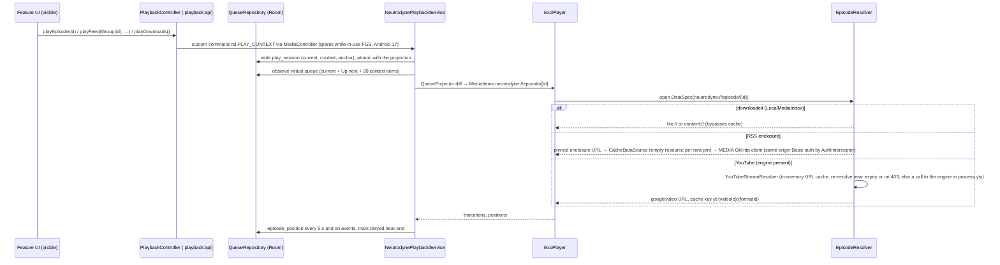
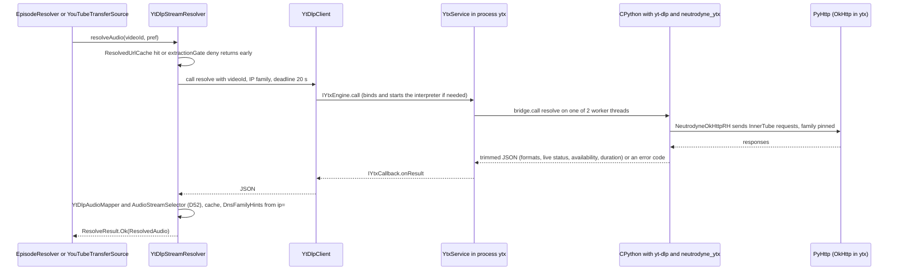
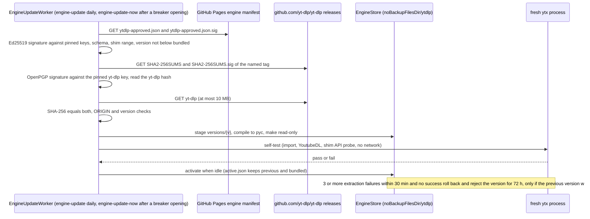
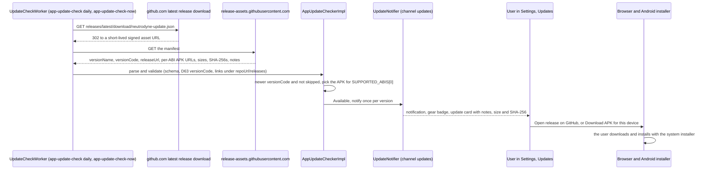
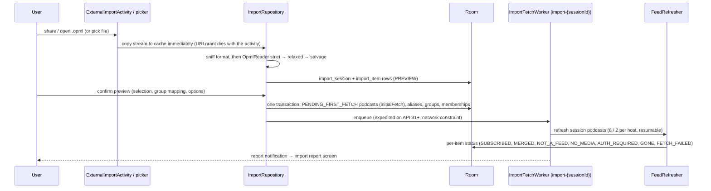
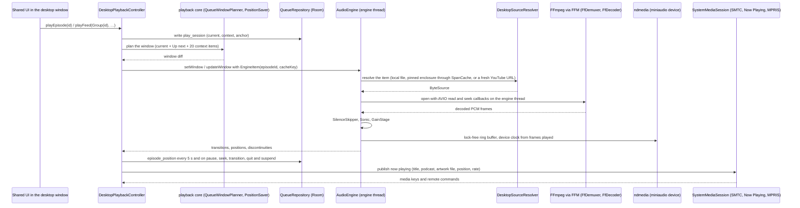
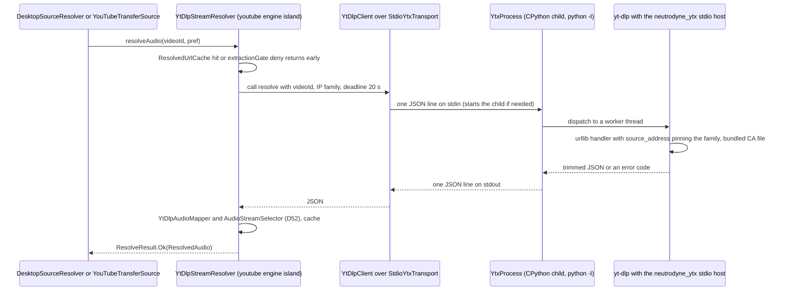
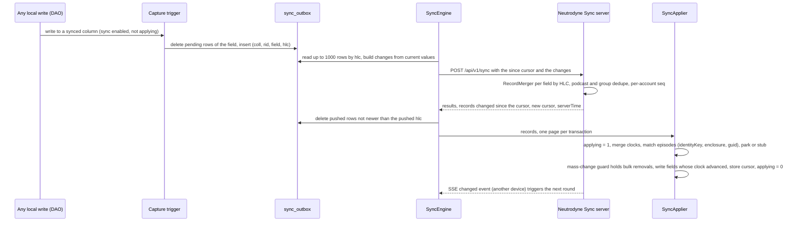
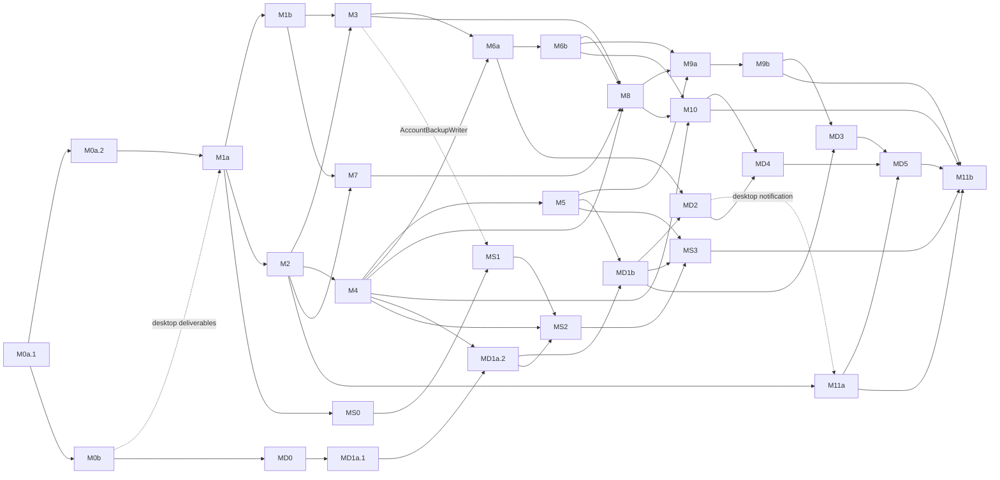

# Neutrodyne — Master plan

> Status: approved baseline for implementation, 2026-10-04; integration review and cross-review fixes applied 2026-10-05; revised 2026-10-05 for the product owner's decisions (application ID `ch.lkmc.neutrodyne`, GitHub Releases as the only channel, no Google developer-verification registration, yt-dlp embedded in CPython; D72–D80, PO-31–PO-36) and for the answers to PO-31–PO-35 (notify-only update check, no beta channel, no mirror). **Scope revision 2026-10-05 (owner decisions S0–S13):** v1.0 is an Android app, a desktop app (Windows, macOS, Linux) and an optional self-hosted sync server, shipped together; Kotlin Multiplatform with Compose Multiplatform from M0, and a Kotlin/Ktor server that shares the sync rules with both apps; Android keeps its native Media3, WorkManager/UIDT, Chaquopy and Android 15–17 designs; the desktop gets its own audio engine (a minimal LGPL FFmpeg build with miniaudio), OS media integration and a CPython-hosted yt-dlp; LGPL is allowed and one narrow exception covers the bundled, unmodified OpenJDK runtime; published APKs become release builds signed with the committed key (PO-35 re-resolved); the brand comes from `media-sources/icon.png`. Amended: D1–D14, D25, D28, D33–D35, D38, D41, D47, D48, D59–D64, D72–D80; new: D81–D97, R6.5–R6.7, R7, R8, N13; re-resolved PO-1, PO-2, PO-35, PO-17 partly resolved, new PO-37–PO-45; milestones M0a/M0b, MD0–MD5 (desktop) and MS0–MS3 (sync); new risks; T18 and P11 retired. Final cross-document review 2026-10-05: listen rule, server durability, sequence-bounded library reset, the Android local-network definition, restore timestamps and restore-while-linked order, desktop service ports, the `import-backup` lane, the MS-RL and MPL-2.0 licence classes and the re-sized roadmap; new PO-46–PO-48. Audience: product owner (sections 1–4, 6–8) and engineers / AI coding sessions (all sections).
> This document is the single source of truth for scope, requirement IDs, decisions (D-ids), product-owner decisions (PO-ids), milestones (M-ids) and risks. The eleven design documents in [`design/`](design/) elaborate it and must not contradict it. Where a design document and this plan disagree, this plan wins until it is amended.

Contents: [1. Vision and scope](#1-vision-and-scope) · [2. Requirements](#2-requirements) · [3. Key decisions](#3-key-decisions) · [4. Decisions needed from the product owner](#4-decisions-needed-from-the-product-owner) · [5. Architecture overview](#5-architecture-overview) · [6. Feature scope](#6-feature-scope) · [7. Roadmap](#7-roadmap) · [8. Risks and mitigations](#8-risks-and-mitigations) · [9. Design document index](#9-design-document-index) · [10. Glossary](#10-glossary) · [Appendix A. Key sources](#appendix-a-key-sources)

---

## 1. Vision and scope

**Neutrodyne is an open-source podcast player organised around groups, for Android and the desktop (Windows, macOS, Linux), with an optional self-hosted sync server.** A group ("tech", "news", "fiction") is a user-defined set of podcasts and YouTube channels, and every group is its own newest-first episode feed. Covers carry the visual identity of the app. Every app polls its feeds itself: there is no Neutrodyne-operated backend, no Neutrodyne account and no tracking. Users who run their own Neutrodyne Sync server ([D94](#3-key-decisions)) keep subscriptions, groups, played state, positions and Up next in step across their phones and computers; that server stores user state only — never audio, never feed contents — and never fetches anything itself ([D1](#3-key-decisions)).

The one place where every mainstream podcast app is weak is "a group as its own feed": AntennaPod's per-tag episode view has been an open request since 2021 ([#5222](https://github.com/AntennaPod/AntennaPod/issues/5222)), and Pocket Casts folders are paid, single-membership and cannot be used in Smart Playlists ([Pocket Casts docs](https://support.pocketcasts.com/knowledge-base/episode-filters/)). That is the product's differentiator; a desktop app with the same groups and covers, whose listening state follows the user between devices without a third-party account, is the second. Everything else must reach the table-stakes bar of AntennaPod and the polish bar of Pocket Casts.

### 1.1 Guiding principles

1. **Groups are first-class.** Many-to-many membership, a feed per group, per-group defaults, and groups that survive OPML, backup and sync round trips.
2. **Cover-first.** Artwork is visible on every surface (grid, rows, player, lock screen, car, the desktop OS media controls) and drives colour; chrome stays quiet.
3. **Local-first and private.** Each app talks only to hosts the user chose: feeds, enclosures, artwork, opted-in directories, YouTube when used, the user's own sync server when configured, and GitHub for the update check and for YouTube-engine updates while those are on. Sync is optional and self-hosted; nothing works worse without it. No analytics, no ads, no proprietary SDKs.
4. **Never lose user data.** Subscriptions, groups, played state, positions and queue survive refreshes, crashes, migrations, reinstalls, phone changes and sync: a sync never spreads a bulk deletion without asking, and a position of 0 never wins against a real one ([D92](#3-key-decisions)).
5. **Native where it matters, shared everywhere else.** One Kotlin Multiplatform codebase carries the data model, feeds, groups, downloads, UI and sync rules ([D81](#3-key-decisions)); Android keeps Media3, Android Auto, WorkManager and user-initiated transfers and is built for Android 15–17 from day one (background-audio hardening, job quotas, edge-to-edge, predictive back, large screens); the desktop gets its own audio engine and the OS media sessions of Windows, macOS and Linux ([D86](#3-key-decisions), [D87](#3-key-decisions)).
6. **Honest, verifiable distribution.** Everything is published only on GitHub ([D79](#3-key-decisions)): per-ABI Android APKs that are optimised release builds signed with a key committed to the repository and therefore public ([D96](#3-key-decisions), [D61](#3-key-decisions)); unsigned desktop installers (ad-hoc signed on macOS, [D89](#3-key-decisions)); the server as a JAR and a GitHub Container Registry image ([D95](#3-key-decisions)). The README and the apps say what that means: download only from the GitHub release page, the APK signature proves nothing about origin, macOS needs "Open Anyway" after every install and update, Windows shows SmartScreen and needs Smart App Control off, and Android's developer verification needs a one-time step from 2027 ([D80](#3-key-decisions)). Where a device or a setting cannot run the YouTube engine, the app says so and offers "Watch on YouTube" ([D77](#3-key-decisions)). Every release can be checked against its checksums and provenance attestations.
7. **Public-domain code, clean licences.** Our code is Unlicense. Shipped third-party code is permissive; LGPL only when dynamically linked with its source attached (the desktop's minimal FFmpeg); one narrow exception for the unmodified OpenJDK runtime that desktop installers and the server image must bundle, with its source attached to every release; no other GPL and no AGPL anywhere ([D3](#3-key-decisions), [PO-1](#po-1-licensing-of-shipped-binaries)).
8. **Testable by construction.** Common logic tested on the desktop JVM in `commonTest`, golden corpora for parsers and audio, fakes behind interfaces, exported Room schemas with migration tests, conformance vectors shared by both apps and the server, CI on every change.

### 1.2 Non-goals for v1.0

| Not in v1.0 | Why / when |
|---|---|
| A Neutrodyne-operated server, hosted sync service or accounts at the project | Distributed model ([D1](#3-key-decisions)); sync is self-hosted only ([D94](#3-key-decisions)) |
| gpodder API or Open Podcast API compatibility on the sync server; app passwords for third-party clients | v1.x (M16, [PO-41](#48-further-product-owner-decisions)); the Open Podcast API is a 0.1 draft ([D91](#3-key-decisions)) |
| End-to-end encrypted sync ("sealed mode"), OIDC/SSO, self-registration, PostgreSQL on the server | The server is the user's own and sits behind TLS from a reverse proxy; sealed mode is a v2 option, the rest on demand ([D94](#3-key-decisions)) |
| iOS and iPadOS apps | Need Apple Developer Program membership for anything beyond 7-day provisioning; `commonMain` stays free of JVM-only APIs so an iOS target remains possible later ([D81](#3-key-decisions)) |
| Google Play, F-Droid, IzzyOnDroid, Mac App Store, Microsoft Store, winget, Homebrew (cask or own tap), Scoop, Flathub, Snap, AUR, apt/dnf repositories, Docker Hub | GitHub Releases (and GHCR for the server image) is the only channel ([PO-2](#po-2-distribution-channels), [D79](#3-key-decisions)); Obtainium is documented as an alternative Android updater |
| AppImage, Flatpak, MSIX, PKG and EXE desktop formats | MSI + ZIP, DMG, DEB + RPM + tar.gz only ([D89](#3-key-decisions)) |
| Registration with Google's developer verification, Apple notarisation or a Developer ID, Windows code signing (Authenticode, Artifact Signing, SignPath) | Not registered ([PO-5](#po-5-google-developer-verification), [D80](#3-key-decisions)); install and update guidance instead |
| A private Android signing key | Published APKs are release builds signed with the committed public keystore ([PO-35](#48-further-product-owner-decisions), [D96](#3-key-decisions)); moving to a private key later means one reinstall for every user |
| In-app download and installation of updates; a beta update channel | The apps check for a new release, notify and link to it on GitHub; the user installs it with the OS installer ([PO-31](#48-further-product-owner-decisions), [D78](#3-key-decisions)); tester builds are normal releases ([PO-33](#48-further-product-owner-decisions)) |
| A mirror of the repository or the releases | Not planned; a GitHub takedown is an accepted risk ([PO-34](#48-further-product-owner-decisions), risk P7) |
| Chromecast | Not planned: Media3 Cast needs proprietary Google Play services, and there is only one build ([PO-6](#po-6-chromecast)) |
| In-app YouTube playback and downloads on 32-bit ARM (`armeabi-v7a`) Android devices | No CPython ≥ 3.12 runtime exists for 32-bit ARM; YouTube episodes are external episodes there ([D77](#3-key-decisions)) |
| Intel Macs, 32-bit desktops, Windows 7/8, macOS before 13, Linux with glibc < 2.31, a native Windows-on-Arm build | Platform matrix of [D88](#3-key-decisions); Windows 11 on Arm runs the x64 build under emulation ([PO-40](#48-further-product-owner-decisions)) |
| Desktop video, a desktop mini-player window, desktop widgets | Desktop v1.0 is audio-only: video podcasts play as audio ([D86](#3-key-decisions)); libmpv-based video in v1.x (M17) |
| Screen-reader support on Linux desktops | Compose Multiplatform has no Linux accessibility backend; documented gap (owner decision S8, risk U3); macOS and Windows are supported |
| Background refresh while the desktop app is quit; a desktop background daemon | The desktop app works in-process while it runs; closing the window keeps it running only while playing or downloading ([D85](#3-key-decisions)) |
| Wear OS app, home-screen widgets, Quick Settings tile | v1.x (widgets) / later |
| Video-first experience | Video podcasts play as audio in v1.0 on every platform; Android video surface and PiP in v1.x; YouTube is audio-only |
| Smart (rule-based) groups, nested groups, multiple queues | Schema reserved; later |
| Statistics, bookmarks, transcripts UI, value-for-value | Later (transcripts are ingested, not shown) |
| Favourites list or filter, listening-history view | v1.x (M15). v1.0 lets the user mark favourites (episode detail) because favourites drive cleanup protection (R4.5), merge in backups and sync, and it stores `playedAt` with an index, so both views arrive without a migration |
| Volume boost, intro/outro skip, end-of-chapter timer, shake-to-extend | v1.x |
| Exact-time refresh, auto-play on Bluetooth connect, alarm wake-up podcasts | Impossible or silently muted under Android 15/17 rules ([D43](#3-key-decisions)) |
| Local-network (LAN) feeds and user-installed CAs on Android | v1.x; clear error in v1.0. The one exception is the user's own sync server on the local network, for which Android asks for `ACCESS_LOCAL_NETWORK` ([D28](#3-key-decisions)) |
| User-chosen (SAF) download folder on Android | v1.x; v1.0 uses app-specific storage ([D48](#3-key-decisions)); the desktop download folder is changeable in v1.0 |
| YouTube login, members-only, age-restricted content, YouTube Data API | Not supported ([D51](#3-key-decisions)) |
| Material 3 Expressive | Alpha-only today ([PO-4](#po-4-material-3-expressive)) |
| Spotify-exclusive shows, radio, news reader | Out of product scope |

---

## 2. Requirements

### 2.1 Functional requirements

Each sub-requirement is a testable statement. "Group feed" and the other terms are defined in the [Glossary](#10-glossary). R1–R5 apply to Android and the desktop alike unless a statement names a platform; desktop-only behaviour is in R8, sync in R7.

**R1 — Import and export of subscriptions**

| ID | Statement |
|---|---|
| R1.1 | The user can import an OPML 1.0/2.0 file chosen in the system file picker, shared from another app, or opened with "Open with" (desktop: the file dialog, drag and drop onto the window, or the `.opml` file association, R8.3). Malformed files (unescaped `&`, missing `/>`, undefined entities) still import every recoverable feed URL, and the user is told when folder structure was lost. |
| R1.2 | An import shows a preview (selectable items, duplicates, already-subscribed, invalid URLs, group mapping) before anything is written. Folder nesting and the `category` attribute both map to groups; known wrapper folders (`feeds`, Overcast `playlists`, a single root wrapper) do not become groups; already-subscribed podcasts receive the imported group memberships. |
| R1.3 | After confirming, all imported podcasts appear in the library within 2 s (as pending), are fetched in the background, and each item ends in a recorded status (subscribed, merged, not a feed, no media, auth required, gone, failed). Failures stay subscribed with Retry / Edit URL / Remove actions, and a final report is shown. Importing never posts new-episode notifications or queues auto-downloads for the imported back catalogue. |
| R1.4 | The user can export all subscriptions as OPML 2.0, either grouped (default: each feed exactly once, inside the folder of its first group, with a `category` attribute listing all its groups) or flat. Exporting and re-importing into an empty Neutrodyne reproduces every group, membership and group order. |
| R1.5 | The user can export or share a single group as OPML. |
| R1.6 | YouTube channel subscriptions export as `https://www.youtube.com/feeds/videos.xml?channel_id=UC…` outlines and re-import as YouTube podcasts. NewPipe JSON, LibreTube JSON (including channel groups) and Google Takeout `subscriptions.csv` (plain or inside a ZIP) can be imported; NewPipe JSON can be exported. |
| R1.7 | The user can create a full backup (a versioned ZIP containing library, groups, settings, per-episode user state, Up next and an OPML copy) and restore it in Merge (default) or Replace mode, including into a newer app version and across platforms: a backup made on Android restores on the desktop and vice versa. |
| R1.8 | **(Android)** Without user action, Android Auto Backup carries a daily snapshot of the library to a new device; on first launch after reinstall the library, groups, played state, positions and queue are restored automatically. This works only where the platform backs up: API 28+ with a screen lock (PO-15) and an active system backup transport (Google backup through Play services, or a ROM-integrated transport such as [Seedvault](https://github.com/seedvault-app/seedvault) on de-Googled ROMs). Elsewhere the manual backup of R1.7 is the path (scheduled backup to a user folder: M15), and Settings › Backup says so. GitHub installs: device setup on a new phone never reinstalls Neutrodyne, so the snapshot is restored when the user installs the APK on the new device (Unverified that this still reads the old device's data set after setup; checked in M11b, [05 Open questions](design/05-groups-opml-backup.md#open-questions) 17); otherwise the manual backup of R1.7 is the path, and the README's "Install and update" section recommends a manual backup before changing phones. The desktop has no system backup: the manual backup and sync (R7) are its paths, and Settings › Backup says so. |
| R1.9 | Exports, backups and sync never contain Basic-auth passwords unless the user opts in (separately for exports and backups and for sync, R7.3), and the user is warned when exported feed URLs look like private tokenised links; linking a sync server discloses that private feed links are stored on it. |

**R2 — Groups and group feeds**

| ID | Statement |
|---|---|
| R2.1 | The user can create, rename, recolour (12-colour palette), set an icon for, reorder and delete groups. Names are 1–40 characters after trimming, may contain emoji, and are unique case-insensitively after NFC normalisation. Deleting a group never deletes podcasts and can be undone for 10 s. |
| R2.2 | A podcast or YouTube channel can belong to zero, one or many groups. Memberships can be edited from the podcast screen, the group editor, a multi-select in the library, and during import or subscribe. |
| R2.3 | Each group is a separate feed: a paged list of all episodes of its member podcasts and channels, ordered by `sortDate` (newest first by default, per-group setting), with stable order across pages. Two virtual feeds exist: **All** (every podcast whose `includeInAll` is on) and **Ungrouped** (podcasts in no group). |
| R2.4 | The Feeds screen shows All, then user groups in user order, then optionally Ungrouped, as tabs; swiping switches feeds; the selected feed survives process death; deleting the selected group falls back to All. |
| R2.5 | Within a feed the user can filter by unplayed, downloaded, in progress and media type (audio / video), and can hide episodes older than N days (per group). |
| R2.6 | From a group the user can refresh only that group's podcasts, play the group (Up next first, then the group's unplayed episodes in the group's play order), mark all episodes as played (optionally only older than a date), download all unplayed (after a confirmation showing count and estimated size) and share the group as OPML. |
| R2.7 | Groups carry optional defaults: playback speed and skip silence (applied when playing from that group), auto-download policy, new-episode notifications (one system notification channel per group) and refresh interval. Every settings screen shows the effective value and where it comes from. |
| R2.8 | The groups list and tabs show per-group unplayed and new-since-last-visit counts, computed over a bounded time window. |
| R2.9 | With 300 podcasts, 50,000 episodes and 20 groups, a group feed's first page renders in ≤ 60 ms and the All feed in ≤ 100 ms of query time on the reference device (see N5). |

**R3 — YouTube channels as podcasts**

| ID | Statement |
|---|---|
| R3.1 | The user can subscribe to a YouTube channel by pasting or sharing any channel URL, handle (`@name`), legacy `/c/` or `/user/` URL, uploads-playlist URL or video URL. The channel ID (`UC…`) is resolved and stored, never the handle. Where the YouTube engine is available ([D77](#3-key-decisions), [D90](#3-key-decisions)) the user can also search channels by name. |
| R3.2 | A subscribed channel appears as a podcast with the channel avatar as cover, the channel banner on its detail screen and per-video thumbnails. By default only long-form uploads appear (no Shorts, no live streams, no members-only); per channel the user can opt into Shorts and past live streams. Premieres appear only once playable. |
| R3.3 | New uploads appear after a refresh. A YouTube-wide feed outage (all channels returning 404 — including a 1–2-channel library where every subscribed channel was attempted and failed and every control feed failed too; amended 2026-10-06, [04](design/04-youtube.md#errors-and-global-outage)) never unsubscribes or marks channels dead; it shows one global notice and backs off. A 1–2-channel library whose channels fail while a control feed answers sees per-channel failures instead (a deleted channel is not an outage). |
| R3.4 | YouTube channels behave like podcasts for groups, group feeds, counts, played state, positions, OPML export/import and backup. |
| R3.5 | **With the YouTube engine** (the `arm64-v8a` and `x86_64` APKs and every desktop build, engine not disabled, [D77](#3-key-decisions), [D90](#3-key-decisions)): YouTube episodes play as audio in the regular player (queue, background, lock screen or the desktop OS media controls, Bluetooth, sleep timer, chapters from description timestamps). Expired or IP-bound stream URLs are re-resolved transparently without losing position. |
| R3.6 | **With the YouTube engine:** YouTube episodes can be downloaded as audio files (m4a by default) through the same download engine, policies and Downloads screen as podcasts, including auto-download (smaller default keep count). |
| R3.7 | **Without the YouTube engine** (the `armeabi-v7a` APK, the engine turned off in Settings › YouTube, or an engine that cannot start, on any platform): YouTube episodes are external episodes. They show title, date, description and thumbnail, and open in the YouTube app (or a browser; the browser on the desktop). They cannot be queued, downloaded or played in the background, are skipped by "Play group", and do not count towards auto-download. Settings › YouTube says why in-app playback is unavailable and, where possible, how to get it (turn the engine on; install the 64-bit APK). |
| R3.8 | Stream-resolution failures are classified. Per-item "unavailable" reasons (age-restricted, members-only, upcoming, live, region, private, made-for-kids) are shown on the episode; repeated extraction failures open a circuit breaker, trigger an immediate YouTube-engine update check and show "YouTube playback is temporarily broken — Neutrodyne is checking for a fix"; the queue continues with the next playable item. |
| R3.9 | The YouTube engine updates without an app update, on Android and the desktop ([D76](#3-key-decisions), [D90](#3-key-decisions)): a newer approved yt-dlp release is downloaded, verified (manifest signature, upstream signature, SHA-256), self-tested and activated without interrupting playback; a version that fails after activation is rolled back automatically. Settings › YouTube shows the active engine version and its source, and offers "Check for engine update", "Reset to bundled" and the update policy (Neutrodyne-approved, upstream stable, off). |

**R4 — Streaming and downloading**

| ID | Statement |
|---|---|
| R4.1 | Any audio episode can be streamed without downloading, with seeking, resume at the saved position, and a setting for streaming on metered networks (Allow / Ask / Never). |
| R4.2 | The user can download an episode with visible progress, pause, resume, cancel and retry. Downloads resume after network loss, process death and reboot from the bytes already received when the origin offered a reliable validator (strong ETag or qualifying Last-Modified, D46), otherwise they restart safely from 0, and never store an HTML error page as an episode. On the desktop, downloads run while the app runs and resume from the bytes already received after a quit and restart (R8.7). |
| R4.3 | A downloaded episode plays from the local file in the same queue item as its stream would, fully offline, with artwork. |
| R4.4 | Auto-download can be enabled per podcast, per group or globally, with keep-latest-N, network policy (unmetered / any; the desktop treats every network as unmetered in v1.0) and optional charging requirement (Android). An episode the user deleted is never auto-downloaded again. |
| R4.5 | Played episodes are deleted automatically after a grace period (default 24 h); favourites, the playing episode, the next Up-next items, unplayed manual downloads and unplayed automatic downloads that are in progress are never auto-deleted; an optional storage cap stops auto-downloads when reached. |
| R4.6 | A Downloads screen shows in-progress items with their wait reason ("Waiting for Wi-Fi", "Retrying in 4 min", "Storage full"), completed items with storage usage, and failed items, with bulk delete. |
| R4.7 | **(Android)** Playback continues in the background with a media notification, lock-screen controls, Bluetooth and headset buttons, audio focus handling, pause on headphone unplug, and a System UI resumption card after reboot. The desktop equivalents are R8.4. |
| R4.8 | Up next supports add next / add last, drag reorder and swipe remove. Positions persist continuously; episodes are marked played automatically near the end; speed (0.5–3.0×), skip silence, configurable skip intervals, a sleep timer (duration, end of episode) and chapters (Podcasting 2.0 JSON, Podlove Simple Chapters, ID3/MP4 embedded) are available. |

**R5 — A nice UI showing podcasts' graphical covers**

| ID | Statement |
|---|---|
| R5.1 | The library is an adaptive cover grid (3 columns on 360–411 dp phones by default, density 72 / 100 / 152 dp selectable) with group filter chips and a Groups view of 2×2 cover mosaics; on the desktop the column count follows the window width. |
| R5.2 | Covers appear on every main surface: feed rows (56 dp), podcast header (160 dp), full player (≥ 280 dp), mini player (48 dp), notification, lock screen and Android Auto, and on the desktop the OS media controls (R8.4). |
| R5.3 | Artwork for every subscription and every downloaded episode is available offline from a pinned local store, which also feeds the lock screen, Android Auto and the desktop OS media sessions. |
| R5.4 | Missing, broken or tiny artwork is replaced by a generated monogram cover (initials on a deterministic hue, ≥ 4.5:1 contrast); tiles show the artwork's average colour while loading, never a grey flash. |
| R5.5 | The app uses wallpaper dynamic colour on Android 12+ and the brand scheme seeded from the icon's amber ([D97](#3-key-decisions)) below Android 12 and on the desktop; the full player, mini player tint and podcast header use a colour scheme derived from the artwork; light, dark and pure-black themes exist, and the desktop follows the OS light/dark setting by default. |
| R5.6 | Groups have a colour, an optional icon and a 2×2 mosaic of member covers. |
| R5.7 | Covers animate between grid, podcast header and episode screens without flashing; layouts adapt to compact, medium, expanded and large widths and to tabletop posture; desktop windows from 600 × 480 dp upwards use the same width classes. |
| R5.8 | YouTube thumbnails are shown 16:9-correct (never letterboxed bars), with a resolution fallback chain; system surfaces use the square channel avatar. |

**R6 — Installing and updating** (GitHub Releases is the only channel, [D78](#3-key-decisions)–[D80](#3-key-decisions), [D89](#3-key-decisions), [D95](#3-key-decisions))

| ID | Statement |
|---|---|
| R6.1 | **(Android)** A user can install Neutrodyne by following the README's "Install and update" section: which per-ABI APK to download from GitHub Releases; that the APKs are release builds signed with a key that is public in the repository, so the GitHub release page is the only trustworthy source and the signature proves nothing ([D61](#3-key-decisions), [D96](#3-key-decisions)); how to check a download (`SHA256SUMS`, `gh release verify-asset`, `gh attestation verify`); Android's "install unknown apps" prompt; and, on certified devices with Google services once Google's global developer-verification rollout starts (2027), the one-time advanced flow or ADB. The same guidance is in the app (Settings › About › Install & updates). |
| R6.2 | **(Android)** While "Check for updates" (Settings › Updates, on by default) is on, the app checks GitHub for a newer release once a day, and on "Check now" in any case. When one exists it posts one notification per version and shows an update card in Settings › Updates with the release notes, the size and SHA-256 of the APK for this device, and two links that open in the browser: "Open release on GitHub" (the release page of that tag) and "Download APK for this device" (the asset for `Build.SUPPORTED_ABIS[0]`). The user downloads and installs the update with Android's installer; the app never downloads, verifies or installs APKs itself ([D78](#3-key-decisions)). |
| R6.3 | Users who update with Obtainium (documented with its per-ABI APK filter) can turn the in-app check off; with the check off the app sends no request to GitHub except on "Check now". |
| R6.4 | When Android blocks an install or update because the developer is not verified, the Install & updates help explains why and what the user can do (the advanced flow with "indefinitely", ADB). In the releases before Google's global enforcement, the app shows a one-time notice recommending the advanced flow's "indefinitely" option ([PO-36](#48-further-product-owner-decisions)); installations that never saw it — fresh installs made through the advanced flow after Google's global date — get the same one-time notice in its post-enforcement form, telling them to switch "7 days" to "indefinitely". |
| R6.5 | **(Desktop)** A user can install the desktop app by following the README's "Install on Windows, macOS or Linux" section and the in-app Install & updates help: which asset to download (Windows 10/11 x64: the MSI or ZIP, also on Windows 11 on Arm, which runs it emulated; macOS 13+ on Apple silicon: the DMG; Linux x64 or arm64: DEB, RPM or tar.gz); how to check it (`SHA256SUMS`, `gh attestation verify`); that the builds are not signed by a registered developer and what each OS then shows — macOS: System Settings › Privacy & Security › "Open Anyway" after the first start of every newly installed or updated version (or `xattr -dr com.apple.quarantine`), Windows: SmartScreen "More info" → "Run anyway", with Smart App Control turned off, Linux: nothing extra; and that the installers bundle an unmodified OpenJDK runtime and an LGPL FFmpeg whose sources are attached to the same release ([D89](#3-key-decisions)). |
| R6.6 | **(Desktop)** While "Check for updates" is on (the same setting, on by default and disclosed at first start), the desktop app checks GitHub once a day while it runs, and on "Check now" in any case. A newer release shows a badge and an update card in Settings › Updates and posts one OS notification per version, with "Open release on GitHub" and "Download for this computer" (the asset for this OS, architecture and install kind: MSI, ZIP, DMG, DEB, RPM or tar.gz; Windows on Arm gets the x64 asset); the app never downloads or installs an update itself ([D78](#3-key-decisions)). |
| R6.7 | **(Server)** An administrator can run the sync server by following the README's "Run the server" section: the JAR on any Java 21+ runtime (with the shipped systemd unit) or the multi-arch image from GitHub Container Registry with the reference `compose.yaml` and a reverse proxy for TLS (Caddy example). Upgrading means replacing the JAR or the image tag; the server migrates its database after an automatic backup and refuses to start on a newer schema; the admin web page shows when a newer version exists (notify-only, switchable off) ([D95](#3-key-decisions)). |

**R7 — Sync (optional, self-hosted)** ([D91](#3-key-decisions)–[D95](#3-key-decisions))

| ID | Statement |
|---|---|
| R7.1 | With no sync server configured, an app sends no sync request, writes no sync data (the `sync_*` tables stay empty and the capture triggers stay inert) and every feature works; sync adds nothing measurable to cold start. |
| R7.2 | A user connects a device to a self-hosted Neutrodyne Sync server by its address and one of: a password, a one-time invite code from the administrator, or a short link code shown on the new device and approved on an already-linked device or the server's web page. Linked devices store a revocable token, never a password; every device can be renamed and revoked from any linked device or the web page. |
| R7.3 | These sync: subscriptions (feed URLs including private tokenised ones, feed moves and unsubscribes; Basic-auth passwords only after the user opts in on the pushing device), groups (name, colour, icon, order, group settings), memberships and their order, podcast user fields and playback overrides, per-episode played state, position and favourite, Up next and its order, the now-playing episode with its play context, and the portable global settings flagged as synced (playback and feed defaults). Never synced: audio files, downloads, feed contents, artwork, the YouTube engine, crash data and device-local settings (auto-download, storage, notifications, refresh cadence, appearance, update settings) ([D93](#3-key-decisions), [PO-37](#48-further-product-owner-decisions)). |
| R7.4 | Changes made offline are kept and sent when the device is online again. With both devices online and in the foreground (or playing), a change appears on the other device within 10 s; otherwise it appears at the next sync: app start or return to the foreground, playback pause or stop, a background sync requested every 60 min on Android (amended 2026-10-05, default of [PO-47](#48-further-product-owner-decisions): Doze and the App Standby buckets may defer it, and apps in the Rare or Restricted bucket get no network for jobs), at most 15 min while the desktop app runs. |
| R7.5 | Conflicts resolve per field by the latest change (hybrid logical clock); a position of 0 never replaces a non-zero position except by an explicit reset or mark-played; sync never starts, stops or seeks a playing player; a device that is not playing offers "Continue on this device" for a newer session from another device. |
| R7.6 | Linking a device that already has a library offers Merge (default), "Use the server's library on this device" and "Use this device's library everywhere" (with a second confirmation naming the effect on other devices). Merge never removes local subscriptions, groups or history, and two devices that subscribed to the same feed, or created equally named groups, converge on one podcast or group. |
| R7.7 | A pull that would unsubscribe more than 10 podcasts, or more than 20 % of them and at least 3 (the "at least 3" added 2026-10-05 as the default of [PO-47](#48-further-product-owner-decisions), so a single removal on a library of up to four podcasts is not held), or delete more than 3 groups, is held and the user chooses Apply, Keep mine (re-push the local state) or Decide later. |
| R7.8 | The server runs on Linux x86-64 and arm64 (the JAR on any Java 21+ runtime, the image for linux/amd64 and linux/arm64) with an embedded SQLite database; it never fetches feeds, audio or artwork; its only outbound request is the optional update check; it backs up its database nightly and keeps per-account backup ZIPs; accounts are created by an administrator; a web page approves devices and lists devices and accounts; a CLI performs admin tasks. |
| R7.9 | Restoring a backup on a linked device asks whether to replace the library on this device only (default; the device is unlinked) or on every synced device; an Android install restored by Auto Backup shows "Reconnect to <server>" and pushes nothing before the user reconnects. |
| R7.10 | (v1.x, M16) AntennaPod and Kasts can sync subscriptions and play positions with a Neutrodyne Sync server through its gpodder v2 layer, using app passwords. |

**R8 — Desktop app (Windows, macOS, Linux)** ([D85](#3-key-decisions)–[D90](#3-key-decisions))

| ID | Statement |
|---|---|
| R8.1 | The desktop app offers R1 (except R1.8), R2, R3, R4 and R5 with the same data model, rules and screens as Android, built from the same Kotlin Multiplatform code; every behaviour that differs between the platforms is listed in [11 Platform matrix](design/11-desktop.md#platform-matrix), and the shared `commonTest` suites run on the desktop JVM. |
| R8.2 | The desktop app installs per user without administrator rights from an MSI or ZIP (Windows 10 22H2+/11 x64, also on Windows 11 on Arm), a DMG (macOS 13+ on Apple silicon; tester builds before 1.0.0 as a ZIP) or a DEB, RPM or tar.gz (Linux x64 and arm64 with glibc ≥ 2.31; DEB and RPM need the system's package tool); installing a newer version over an older one keeps the library, settings and downloads, and uninstalling never deletes user data. |
| R8.3 | Only one instance runs per user: a second launch brings the window to the front and hands over its file or link arguments (OPML files, `feed:`, `podcast:`, `pcast:`, `itpc:` and `neutrodyne:` links). By default (`QUIT_WHEN_IDLE`), closing the window while playing or downloading keeps the app running with a tray or menu-bar icon (Show, Play/Pause, Quit), closing it while idle quits the app, and a hidden app that stays idle for 10 min quits; "Keep running in the tray" (`KEEP_RUNNING`) is an opt-in that always hides (amended 2026-10-05). "Start at login" exists and is off by default; window size and position are restored. |
| R8.4 | The OS media controls — Windows System Media Transport Controls, macOS Now Playing with its remote commands, Linux MPRIS — show title, podcast, artwork, position and speed, and accept play/pause, next, previous, skip back/forward and seek from media keys, headsets and system panels. Playback pauses and saves its position on system sleep and when the output device in use disappears; it never resumes by itself; the computer does not idle-sleep while playing; at start the last session is restored paused. |
| R8.5 | Desktop playback offers what R4.1, R4.3 and R4.8 require — streaming with a cache, local files, Up next and play context, speed 0.5–3.0× with pitch preserved, skip silence, skip intervals, sleep timer, chapters (Podcasting 2.0 JSON, Podlove Simple Chapters, ID3 and MP4 embedded) — with the same position rules as Android (saved every 5 s and on pause, seek, transition, quit and sleep; mark-played near the end); video podcasts play as audio. A position saved on one platform resumes within 1 s on the other after a sync. |
| R8.6 | Every desktop build carries the YouTube engine: R3.5, R3.6, R3.8 and R3.9 hold on the desktop, and R3.7's external mode applies only when the engine is turned off or cannot start ([D90](#3-key-decisions)). |
| R8.7 | While the desktop app runs, it refreshes feeds at their effective intervals, runs manual and automatic downloads, the update check, engine updates and sync in-process; after a wake or a restart, overdue work starts within 2 min; nothing runs while the app is quit. |
| R8.8 | Desktop downloads go to the app data directory by default and to a user-chosen folder after "Change folder…" in Settings, which moves existing downloads with progress and continues after an interruption; "Show in Explorer / Finder / Files" opens a downloaded file's folder. |
| R8.9 | Every action is reachable with the keyboard or the mouse: shortcuts (Space play/pause, ←/→ skip back/forward, Ctrl/Cmd+F search, Ctrl/Cmd+N add podcast, Ctrl/Cmd+, settings, Esc back), context menus in place of swipe and long-press actions, hover states, visible scrollbars, drag and drop of OPML and backup files, and the macOS menu bar. |
| R8.10 | VoiceOver on macOS and NVDA or Narrator on Windows (with Java Access Bridge enabled; the help explains how) can subscribe by URL, play from a group feed and reorder Up next; the README, About and the help state that Linux screen readers are not supported. |
| R8.11 | The database, settings, artwork store, engine files, logs and default downloads live in the per-OS directories of [11 Desktop shell](design/11-desktop.md#desktop-shell) (`%LOCALAPPDATA%\Neutrodyne`, `~/Library/Application Support/ch.lkmc.neutrodyne`, the XDG directories on Linux); a backup ZIP moves a library between desktops, operating systems and Android. |

### 2.2 Non-functional requirements

| ID | Area | Requirement (testable) |
|---|---|---|
| N1 | Reliability and data safety | No release may lose subscriptions, groups, played state, positions or queue on any platform: every schema change ships a tested Room migration; refreshes never delete user state; a stored non-zero position is never overwritten with 0 except by explicit reset or mark-played, locally or through sync ([D92](#3-key-decisions)); at most 5 s of position is lost on a process kill (Android) or a crash (desktop); a database that fails to open or migrate is quarantined and recovered from the automatic snapshot on Android, and on the desktop — which has no snapshot (default of [PO-46](#48-further-product-owner-decisions)) — from a manual backup or by reconnecting to the sync server; local retention never propagates through sync, and a pull that would remove many subscriptions or groups is held for the user (R7.7); the server backs up its database before every migration and nightly, and acknowledges a pushed change only once it is durable across a power loss (SQLite `synchronous = FULL`; after an unclean shutdown every account's cursor epoch rotates so devices re-assert, [D94](#3-key-decisions)). |
| N2 | Background, battery and resources | Android: comply with Android 15–17 background rules: no exact alarms, no `REQUEST_IGNORE_BATTERY_OPTIMIZATIONS`, no FGS start from `BOOT_COMPLETED`; every background job is resumable, and every job that is neither user-initiated nor a foreground worker stops itself before 8 min; user-started downloads use user-initiated data transfer jobs on API 34+; playback is only started from user-visible or media-key paths; sync holds an SSE connection only while the UI is visible or playback runs. Desktop: background work runs only while the app runs; by default closing the window keeps the process alive only while playing or downloading, and a hidden idle app quits after 10 min (the opt-in "Keep running in the tray" keeps it, R8.3); idle sleep is inhibited only while playing; playback never starts by itself (start-up, wake or sync). |
| N3 | Privacy | No analytics, advertising, Firebase or Google Play services; network traffic only to user-initiated hosts and opted-in services listed in `PRIVACY.md` (including GitHub for the update check and for YouTube-engine updates while they are on, and the user's own sync server when one is configured); linking a sync server discloses that it stores subscriptions, including private feed links, and listening history (R7.3); the sync server makes no outbound request except its optional update check; private feed URLs, feed tokens and sync tokens never appear in logs, crash reports or directory queries; crash reports are sent only by the user's own email after per-crash consent (ACRA on Android, the crash dialog on the desktop). |
| N4 | Accessibility | Target WCAG 2.2 AA. Android: every interactive element ≥ 48 dp, one TalkBack focus stop per row with custom actions for every swipe/drag/long-press action, readable at 200 % font scale, text contrast ≥ 4.5:1 (icons ≥ 3:1), honours "remove animations"; automated `ui-test-junit4-accessibility` checks run in instrumented UI tests. Desktop: every action reachable by keyboard or context menu; VoiceOver (macOS) and NVDA or Narrator through Java Access Bridge (Windows) operate the main journeys (R8.10); Linux screen readers are not supported (documented, owner decision S8, risk U3). |
| N5 | Performance and scale | **Android** (reference phone, PO-28): cold start p50 < 600 ms and frame jank < 1 % in cover-grid and feed scrolling, measured on `benchmarkRelease`, the published release configuration made profileable ([D96](#3-key-decisions)); the YouTube engine never runs in the main process; group-feed queries per R2.9; scale tested to 300 podcasts, 50,000 episodes, 50 groups; release APK size per ABI: `arm64-v8a` and `x86_64` < 40 MB each, `armeabi-v7a` < 30 MB (no universal APK, [D77](#3-key-decisions); Unverified estimates, first measured by S7 and S19 in M0a and re-set by the PO if missed); YouTube engine: `:ytx` PSS ≤ 90 MB while alive, stopped after 3 min idle, first resolve after a cold `:ytx` start p50 ≤ 3 s, warm resolve p50 ≤ 1.5 s (estimates confirmed or amended by the M9a spike). **Desktop** (reference laptops, [PO-43](#48-further-product-owner-decisions)): first frame ≤ 1.0 s with the AOT cache (≤ 2.5 s without), idle RSS ≤ 350 MB and ≤ 450 MB while playing, installed size ≤ 300 MB and download ≤ 130 MB per target, local playback start ≤ 300 ms, YouTube resolve budgets as on Android with the engine child ≤ 120 MB RSS (Unverified estimates; set by S13 in M0b and confirmed in MD5). **Sync and server**: a change reaches another online device in the foreground within 10 s; the server idles at ≤ 160 MB RSS on a Raspberry Pi 4 with the documented JVM flags and ingests a 50,000-record initial upload in ≤ 60 s (S16). Budget table: [09 Performance budgets](design/09-quality-and-release.md#performance-budgets). |
| N6 | Offline | With no network the library, feeds, show notes, downloaded episodes and their artwork work on every platform; non-downloaded items are visibly unavailable; nothing blocks on a network call; changes made offline are queued for sync and sent later. |
| N7 | Platform compliance | **Android:** targetSdk 37; edge-to-edge; predictive back; no orientation or resizability locks; 16 KB page alignment of every native library, including the CPython runtime and its extension modules; declared FGS types; contextual `POST_NOTIFICATIONS`; per-app language support; a closed permission set (01) with no install permission — the update check only links to GitHub ([D78](#3-key-decisions)) — and `ACCESS_LOCAL_NETWORK` requested only in sync setup for a server on the local network ([D28](#3-key-decisions)); published APKs are non-debuggable release builds without developer tooling (LeakCanary, StrictMode penalties, debug-only screens, verbose logging, pseudo-locales); test hooks act only when an instrumentation test arms them, except shell-only triggers protected by `android.permission.DUMP` that run only production code, such as 05's `SnapshotNowReceiver` for the `bmgr` check ([D2](#3-key-decisions)). **Desktop:** per-user installation without administrator rights on Windows; one instance per user; data only in the per-OS directories of R8.11; no process started except the YouTube engine child; native code loaded only from the app image, with `--enable-native-access`; the macOS bundle passes `codesign --verify --deep --strict` with its ad-hoc signature. |
| N8 | Licensing | Our code is Unlicense. Every shipped artefact — APKs, desktop installers, the server JAR and image, and YouTube-engine updates — contains only permissive third-party components, LGPL components that are dynamically linked with their notices and exact source attached to the release (the minimal FFmpeg build; libmpv only if it becomes the fallback; glibc in the server image), MPL-2.0 only as unmodified files or data (and D3's named cases, each with its source attached: python-build-standalone's build patches, MS-RL WiX components in the MSI; amended 2026-10-05; both PO-48 proposed defaults, awaiting the owner), and, under the narrow runtime exception, the unmodified OpenJDK runtime with its `legal/` notices and its source tarball attached to every release that ships it ([D3](#3-key-decisions)); no other GPL and no AGPL anywhere. CI enforces it with the Licensee allow-list on `:app`, `:desktopApp` and `:sync:server`, Python component locks with licence allow-lists for both engine hosts, `native-components.lock` for the desktop native libraries, the APK content scan, the desktop image scan, the server image scan and `check-runtime-sources.sh`. Every bundled component is listed with its full licence text on each app's Licences screen and in `THIRD_PARTY_NOTICES.md`. Prior-art GPL, AGPL or MPL code is never copied, and the gpodder and Open Podcast APIs are implemented from their documentation only. |
| N9 | Security of untrusted input | Feeds, OPML, backups, import files and everything a sync server returns are untrusted: no DTD/entity expansion, size/depth/count caps, zip-slip and zip-bomb protection, whitelisted backup entries, per-record and per-page caps and URL-scheme checks on sync data; the server caps request size, decompressed size, JSON depth and string lengths; credentials are encrypted with an Android Keystore key on Android and stored per [PO-44](#48-further-product-owner-decisions) on the desktop. |
| N10 | Localisation | All user-visible text externalised (Compose resources; Android `res/` for Android-only labels, [D83](#3-key-decisions)); RTL layouts verified; per-app language picker on Android and a language setting on the desktop; pseudo-locale screenshot tests; translations via Weblate. The server's web UI is English-only in v1.0. |
| N11 | Maintainability | Module and source-set boundaries enforced by build checks (no `java.*` or `android.*` in `commonMain`); CI green on every merge; YouTube extraction fixes reach users primarily as engine updates, on Android and the desktop: the engine canary approves a new yt-dlp stable release within 6 h of its publication when its gate passes for both engine hosts (signatures, API probe, recorded responses replayed by endpoint and client, so changed requests alone never block), and apps activate an approved version within 24 h (sooner after a circuit-breaker opening) ([D76](#3-key-decisions)); a release the gate cannot judge without new recordings is re-recorded and dispatched by a maintainer within 24 h (target); the hotfix path (tag → published GitHub release with every asset < 60 min) remains for shim and app fixes; design docs updated with every deviation. |
| N12 | Release and update integrity | The APK signing key is public ([D61](#3-key-decisions)) and the desktop builds carry no publisher signature, so integrity rests on the GitHub release page: every release is an immutable GitHub release carrying `SHA256SUMS` and build-provenance attestations over every asset (APKs, desktop installers, server JAR, source bundles, update manifest) and over the server image by digest; every release body, the README and the Install & updates help tell users to download only from that page and how to check a file; the update checks open only links under `{repoUrl}/releases/` and show the SHA-256 of the asset they link; `release.yml` publishes only APKs signed with the committed keystore and only desktop images whose bundled runtime matches the attached source; server image tags move only after the release is published. The engine updaters activate only code that passed the [D76](#3-key-decisions) trust chain and their host's self-test and can always return to the bundled version; the engine-manifest key exists only in the `engine-approval` environment (a lost key is replaced by a new one pinned in the next release). |
| N13 | Sync and server security | The server runs behind TLS from a reverse proxy: a loopback listener is always allowed, and a non-loopback listener (the container's `0.0.0.0`, a LAN address) starts only when the configured public URL (`NEUTRODYNE_SERVER_PUBLIC_URL`) begins with `https://` — plain requests from peers that are neither loopback nor a trusted proxy then get `421` — or when explicitly started for a trusted LAN (`--insecure-lan`) (clarified 2026-10-05, [10 TLS stance and insecure LAN mode](design/10-sync.md#tls-stance-and-insecure-lan-mode)); device tokens are 256-bit, stored only as SHA-256 and revocable per device from any linked device or the web page; link codes expire after 10 min and allow 5 approval attempts; logins, link approvals and `/sync` are rate-limited per IP and per account; the web UI uses a strict CSP, CSRF tokens and `SameSite=Strict` cookies; logs never contain tokens, passwords, feed URLs or payloads; the server runs unprivileged (systemd sandboxing or a non-root container user) with its data directory `0700`; there is no end-to-end encryption in v1.0, which `PRIVACY.md` and the sync setup state ([D94](#3-key-decisions)). |

### 2.3 Traceability

Design-doc section links point at the mandatory headings defined for each document. Milestones are defined in [7. Roadmap](#7-roadmap).

| Req. | Design doc sections | Milestones |
|---|---|---|
| R1.1–R1.3 | [05 OPML import](design/05-groups-opml-backup.md#opml-import), [05 Receiving files](design/05-groups-opml-backup.md#receiving-files), [02 Tables](design/02-data-model.md#tables), [11 Desktop shell](design/11-desktop.md#desktop-shell) | M3, MD2 (desktop file opening) |
| R1.4–R1.5 | [05 OPML export](design/05-groups-opml-backup.md#opml-export) | M3 |
| R1.6 | [04 Import and export formats](design/04-youtube.md#import-and-export-formats), [05 OPML import](design/05-groups-opml-backup.md#opml-import) | M8 |
| R1.7 | [05 Full backup and restore](design/05-groups-opml-backup.md#full-backup-and-restore) | M3 |
| R1.8 | [05 Auto Backup](design/05-groups-opml-backup.md#auto-backup), [05 First-launch restore](design/05-groups-opml-backup.md#first-launch-restore), [07 Storage layout](design/07-downloads.md#storage-layout) | M3, M6 |
| R1.9 | [05 OPML export](design/05-groups-opml-backup.md#opml-export), [03 Feed moves, auth and paging](design/03-feeds-and-discovery.md#feed-moves-auth-and-paging), [10 What syncs](design/10-sync.md#what-syncs) | M3, MS2 |
| R2.1 | [05 Group model and lifecycle](design/05-groups-opml-backup.md#group-model-and-lifecycle), [08 Screens](design/08-ui-ux.md#screens) | M2 |
| R2.2 | [05 Group model and lifecycle](design/05-groups-opml-backup.md#group-model-and-lifecycle), [05 OPML import](design/05-groups-opml-backup.md#opml-import), [03 Subscribe transaction](design/03-feeds-and-discovery.md#subscribe-transaction), [08 Add podcast sheet](design/08-ui-ux.md#add-podcast-sheet) | M2 (podcast screen, group editor, library), M3 (import), M7 (subscribe) |
| R2.3–R2.4 | [05 Group feeds](design/05-groups-opml-backup.md#group-feeds), [02 Key queries](design/02-data-model.md#key-queries), [08 Group feed pager](design/08-ui-ux.md#group-feed-pager) | M2 |
| R2.5 | [05 Group feeds](design/05-groups-opml-backup.md#group-feeds), [02 Feed pages](design/02-data-model.md#feed-pages), [08 Filter chips](design/08-ui-ux.md#filter-chips) | M2 (unplayed, media, hide older), M4 (in progress), M6 (downloaded) |
| R2.6 | [05 Playing a group](design/05-groups-opml-backup.md#playing-a-group), [06 Queue and play context](design/06-playback.md#queue-and-play-context), [07 Auto-download policy](design/07-downloads.md#auto-download-policy) | M2, M3, M4, M6 |
| R2.7 | [05 Effective settings resolution](design/05-groups-opml-backup.md#effective-settings-resolution), [03 New-episode notifications](design/03-feeds-and-discovery.md#new-episode-notifications) | M2, M4, M6 |
| R2.8–R2.9 | [02 Key queries](design/02-data-model.md#key-queries), [02 Invalidation hygiene](design/02-data-model.md#invalidation-hygiene), [09 Performance budgets](design/09-quality-and-release.md#performance-budgets) | M2 |
| R3.1 | [04 Channel resolution](design/04-youtube.md#channel-resolution), [04 Channel search](design/04-youtube.md#channel-search), [03 Add podcast flow](design/03-feeds-and-discovery.md#add-podcast-flow) | M8, M9, MD3 |
| R3.2–R3.3 | [04 Atom feed ingestion](design/04-youtube.md#atom-feed-ingestion), [04 Fetch policy](design/04-youtube.md#fetch-policy), [04 Content flags and filtering](design/04-youtube.md#content-flags-and-filtering), [04 Artwork and thumbnails](design/04-youtube.md#artwork-and-thumbnails) | M8 |
| R3.4 | [05 Group feeds](design/05-groups-opml-backup.md#group-feeds), [04 Import and export formats](design/04-youtube.md#import-and-export-formats) | M8 |
| R3.5 | [04 YouTube engine](design/04-youtube.md#youtube-engine), [04 Stream resolution](design/04-youtube.md#stream-resolution), [04 Playback integration](design/04-youtube.md#playback-integration), [06 Media items and URI resolution](design/06-playback.md#media-items-and-uri-resolution), [11 Desktop YouTube engine host](design/11-desktop.md#desktop-youtube-engine-host) | M9, MD3 |
| R3.6 | [04 Download integration](design/04-youtube.md#download-integration), [07 YouTube transfers](design/07-downloads.md#youtube-transfers), [11 Desktop YouTube engine host](design/11-desktop.md#desktop-youtube-engine-host) | M9, MD3 |
| R3.7 | [04 Capability matrix](design/04-youtube.md#capability-matrix), [08 Capability differences in UI](design/08-ui-ux.md#capability-differences-in-ui), [01 Build variants and ABIs](design/01-foundation.md#build-variants-and-abis) | M8, M9, MD3 |
| R3.8 | [04 Error handling and circuit breaker](design/04-youtube.md#error-handling-and-circuit-breaker) | M9, MD3 |
| R3.9 | [04 Engine updates](design/04-youtube.md#engine-updates), [04 Shared engine module](design/04-youtube.md#shared-engine-module), [04 Maintenance and hotfix process](design/04-youtube.md#maintenance-and-hotfix-process), [09 engine-canary.yml](design/09-quality-and-release.md#engine-canaryyml), [08 Settings](design/08-ui-ux.md#settings) | M9, MD3 |
| R4.1 | [06 Media items and URI resolution](design/06-playback.md#media-items-and-uri-resolution), [06 Streaming cache](design/06-playback.md#streaming-cache), [11 Desktop playback engine](design/11-desktop.md#desktop-playback-engine) | M4, MD1 |
| R4.2 | [07 Runners and scheduling](design/07-downloads.md#runners-and-scheduling), [07 Transfer core](design/07-downloads.md#transfer-core), [07 State machine](design/07-downloads.md#state-machine), [07 Desktop runners](design/07-downloads.md#desktop-runners) | M6 |
| R4.3 | [06 Media items and URI resolution](design/06-playback.md#media-items-and-uri-resolution), [07 Storage layout](design/07-downloads.md#storage-layout) | M6, MD1 |
| R4.4–R4.5 | [07 Auto-download policy](design/07-downloads.md#auto-download-policy), [07 Cleanup and quota](design/07-downloads.md#cleanup-and-quota), [05 Effective settings resolution](design/05-groups-opml-backup.md#effective-settings-resolution) | M6 |
| R4.6 | [07 Progress and notifications](design/07-downloads.md#progress-and-notifications), [08 Downloads](design/08-ui-ux.md#downloads) | M6 |
| R4.7 | [06 Service architecture](design/06-playback.md#service-architecture), [06 Notification and media buttons](design/06-playback.md#notification-and-media-buttons), [06 System surfaces](design/06-playback.md#system-surfaces), [06 Background restrictions](design/06-playback.md#background-restrictions) | M4, M5 |
| R4.8 | [06 Queue and play context](design/06-playback.md#queue-and-play-context), [06 Shared playback core](design/06-playback.md#shared-playback-core), [06 Positions and played state](design/06-playback.md#positions-and-played-state), [06 Sleep timer](design/06-playback.md#sleep-timer), [06 Chapters](design/06-playback.md#chapters) | M4, M5, MD1 |
| R5.1 | [08 Screens](design/08-ui-ux.md#screens), [08 Components](design/08-ui-ux.md#components) | M1, M10 |
| R5.2–R5.4 | [08 Artwork pipeline](design/08-ui-ux.md#artwork-pipeline), [06 System surfaces](design/06-playback.md#system-surfaces), [11 OS integration](design/11-desktop.md#os-integration) | M1, M4, M10, MD2 |
| R5.5 | [08 Theming and colour](design/08-ui-ux.md#theming-and-colour), [08 Brand assets](design/08-ui-ux.md#brand-assets) | M0b (brand), M10 |
| R5.6 | [08 Components](design/08-ui-ux.md#components), [05 Group model and lifecycle](design/05-groups-opml-backup.md#group-model-and-lifecycle) | M2, M10 |
| R5.7 | [08 Adaptive layouts](design/08-ui-ux.md#adaptive-layouts), [08 Navigation](design/08-ui-ux.md#navigation), [11 Desktop UX](design/11-desktop.md#desktop-ux) | M10, MD4 |
| R5.8 | [08 Artwork pipeline](design/08-ui-ux.md#artwork-pipeline), [04 Artwork and thumbnails](design/04-youtube.md#artwork-and-thumbnails) | M8, M10 |
| R6.1 | [09 Distribution channels](design/09-quality-and-release.md#distribution-channels), [09 Versioning and signing](design/09-quality-and-release.md#versioning-and-signing), [09 Developer verification](design/09-quality-and-release.md#developer-verification), [08 Install and updates help](design/08-ui-ux.md#install-and-updates-help) | M0a (release assets, README), M11 |
| R6.2–R6.3 | [09 Update check](design/09-quality-and-release.md#update-check), [08 Updates settings](design/08-ui-ux.md#updates-settings), [01 Manifest and permissions](design/01-foundation.md#manifest-and-permissions) | M0a (update manifest), M11a |
| R6.4 | [09 Developer verification](design/09-quality-and-release.md#developer-verification), [09 Update check](design/09-quality-and-release.md#update-check), [08 Install and updates help](design/08-ui-ux.md#install-and-updates-help) | M11a |
| R6.5 | [11 Install and update](design/11-desktop.md#install-and-update), [11 Packaging and the runtime exception](design/11-desktop.md#packaging-and-the-runtime-exception), [09 Distribution channels](design/09-quality-and-release.md#distribution-channels) | M0b (draft), MD5 |
| R6.6 | [09 Update check](design/09-quality-and-release.md#update-check), [11 Install and update](design/11-desktop.md#install-and-update), [08 Updates settings](design/08-ui-ux.md#updates-settings) | M11a |
| R6.7 | [10 Deployment](design/10-sync.md#deployment), [09 Distribution channels](design/09-quality-and-release.md#distribution-channels) | MS1, M11b |
| R7.1 | [10 Client sync engine](design/10-sync.md#client-sync-engine), [02 Sync capture triggers](design/02-data-model.md#sync-capture-triggers) | M1a (schema), MS0, MS2 |
| R7.2 | [10 Authentication and device linking](design/10-sync.md#authentication-and-device-linking), [08 Sync screens](design/08-ui-ux.md#sync-screens) | MS1, MS2 |
| R7.3 | [10 What syncs](design/10-sync.md#what-syncs), [10 Identity mapping](design/10-sync.md#identity-mapping) | MS2 |
| R7.4 | [10 Client sync engine](design/10-sync.md#client-sync-engine), [10 Protocol](design/10-sync.md#protocol) | MS2, MS3 |
| R7.5 | [10 Conflict resolution](design/10-sync.md#conflict-resolution), [06 Shared playback core](design/06-playback.md#shared-playback-core) | MS0, MS2, MS3 |
| R7.6 | [10 Linking and first merge](design/10-sync.md#linking-and-first-merge), [05 Full backup and restore](design/05-groups-opml-backup.md#full-backup-and-restore) | MS2 |
| R7.7 | [10 Conflict resolution](design/10-sync.md#conflict-resolution), [08 Sync screens](design/08-ui-ux.md#sync-screens) | MS2 |
| R7.8 | [10 Server architecture](design/10-sync.md#server-architecture), [10 Deployment](design/10-sync.md#deployment) | M0b (skeleton), MS1 |
| R7.9 | [10 Interaction with backup, retention and YouTube](design/10-sync.md#interaction-with-backup-retention-and-youtube), [05 Restore while linked](design/05-groups-opml-backup.md#restore-while-linked) | MS2 |
| R7.10 | [10 Compatibility layers](design/10-sync.md#compatibility-layers) | M16 (v1.x) |
| R8.1 | [11 Platform matrix](design/11-desktop.md#platform-matrix), [01 Source sets and JVM islands](design/01-foundation.md#source-sets-and-jvm-islands) | every milestone (shared code), M11b |
| R8.2 | [11 Packaging and the runtime exception](design/11-desktop.md#packaging-and-the-runtime-exception), [11 Platform matrix](design/11-desktop.md#platform-matrix) | M0b, MD5 |
| R8.3 | [11 Window and tray behaviour](design/11-desktop.md#window-and-tray-behaviour), [11 Desktop shell](design/11-desktop.md#desktop-shell) | M0b, MD2 |
| R8.4 | [11 OS integration](design/11-desktop.md#os-integration) | MD0, MD2 |
| R8.5 | [11 Desktop playback engine](design/11-desktop.md#desktop-playback-engine), [06 Shared playback core](design/06-playback.md#shared-playback-core) | MD1 |
| R8.6 | [11 Desktop YouTube engine host](design/11-desktop.md#desktop-youtube-engine-host), [04 Shared engine module](design/04-youtube.md#shared-engine-module) | MD3 |
| R8.7 | [11 Background work](design/11-desktop.md#background-work), [03 Desktop refresh](design/03-feeds-and-discovery.md#desktop-refresh), [07 Desktop runners](design/07-downloads.md#desktop-runners) | M1a, M6, MD2 |
| R8.8 | [11 Desktop downloads and storage](design/11-desktop.md#desktop-downloads-and-storage) | M6 |
| R8.9 | [11 Desktop UX](design/11-desktop.md#desktop-ux), [08 Keyboard and mouse](design/08-ui-ux.md#keyboard-and-mouse) | MD4 |
| R8.10 | [11 Accessibility](design/11-desktop.md#accessibility), [08 Accessibility](design/08-ui-ux.md#accessibility) | MD4 |
| R8.11 | [11 Desktop shell](design/11-desktop.md#desktop-shell), [11 Desktop downloads and storage](design/11-desktop.md#desktop-downloads-and-storage) | M1a, M3 |
| N1 | [02 Migrations and schema testing](design/02-data-model.md#migrations-and-schema-testing), [06 Positions and played state](design/06-playback.md#positions-and-played-state), [05 Full backup and restore](design/05-groups-opml-backup.md#full-backup-and-restore), [02 Error handling and recovery](design/02-data-model.md#error-handling-and-recovery), [10 Conflict resolution](design/10-sync.md#conflict-resolution) | M1, M3, M4, M6, MS0, MS2, M11 |
| N2 | [01 Platform compliance](design/01-foundation.md#platform-compliance), [03 Refresh scheduling](design/03-feeds-and-discovery.md#refresh-scheduling), [06 Background restrictions](design/06-playback.md#background-restrictions), [07 Runners and scheduling](design/07-downloads.md#runners-and-scheduling), [11 Background work](design/11-desktop.md#background-work) | M1, M4, M5, M6, MD2, MS3 |
| N3 | [09 Privacy](design/09-quality-and-release.md#privacy), [09 Crash reporting and diagnostics](design/09-quality-and-release.md#crash-reporting-and-diagnostics), [01 Logging and redaction](design/01-foundation.md#logging-and-redaction), [10 Security](design/10-sync.md#security) | M0a, M7, M8, M9, MS2, MD5, M11 |
| N4 | [08 Accessibility](design/08-ui-ux.md#accessibility), [09 Compose UI and screenshot tests](design/09-quality-and-release.md#compose-ui-and-screenshot-tests), [11 Accessibility](design/11-desktop.md#accessibility) | M1, M2 (checks in every UI change), M10 (audit), MD4 |
| N5 | [09 Performance budgets](design/09-quality-and-release.md#performance-budgets), [01 Build variants and ABIs](design/01-foundation.md#build-variants-and-abis), [02 Indices](design/02-data-model.md#indices), [04 YouTube engine](design/04-youtube.md#youtube-engine), [11 Packaging and the runtime exception](design/11-desktop.md#packaging-and-the-runtime-exception) | M0 (sizes, S13), M2, M9, M10, MS1, MD5, M11 |
| N6 | [08 Artwork pipeline](design/08-ui-ux.md#artwork-pipeline), [07 Storage layout](design/07-downloads.md#storage-layout) | M1, M4, M6, MD1 |
| N7 | [01 Platform compliance](design/01-foundation.md#platform-compliance), [01 Manifest and permissions](design/01-foundation.md#manifest-and-permissions), [01 Build variants and ABIs](design/01-foundation.md#build-variants-and-abis), [11 Platform matrix](design/11-desktop.md#platform-matrix) | M0, M9, MS2, MD5, M11 |
| N8 | [01 Licensing and dependency policy](design/01-foundation.md#licensing-and-dependency-policy), [01 Python and native components](design/01-foundation.md#python-and-native-components), [04 Licensing and legal](design/04-youtube.md#licensing-and-legal), [11 Packaging and the runtime exception](design/11-desktop.md#packaging-and-the-runtime-exception), [10 Deployment](design/10-sync.md#deployment) | M0, M9, MD1, MD3, MD5, MS1, M11 |
| N9 | [05 OPML import](design/05-groups-opml-backup.md#opml-import), [03 Parser](design/03-feeds-and-discovery.md#parser), [09 Untrusted-input robustness](design/09-quality-and-release.md#untrusted-input-robustness), [10 Security](design/10-sync.md#security) | M1, M3, M8, MS1, MS2 |
| N10 | [09 Localisation](design/09-quality-and-release.md#localisation) | M0, M10, M11 |
| N11 | [01 Dependency rules](design/01-foundation.md#dependency-rules), [09 CI pipelines](design/09-quality-and-release.md#ci-pipelines), [04 Maintenance and hotfix process](design/04-youtube.md#maintenance-and-hotfix-process), [04 Engine updates](design/04-youtube.md#engine-updates) | M0, M9, MD3, M11 |
| N12 | [09 Versioning and signing](design/09-quality-and-release.md#versioning-and-signing), [09 Distribution channels](design/09-quality-and-release.md#distribution-channels), [09 Update check](design/09-quality-and-release.md#update-check), [04 Engine updates](design/04-youtube.md#engine-updates) | M0, M9, MD5, MS1, M11 |
| N13 | [10 Security](design/10-sync.md#security), [10 Authentication and device linking](design/10-sync.md#authentication-and-device-linking) | MS1, MS2, M11b |

---

## 3. Key decisions

ADR-style register. "Conflict" marks a decision that resolves contradictory research recommendations; "the stack research", "the feed research" and so on name the pre-plan research notes, kept in the repository as raw, non-normative snapshots under `docs/research/` (corrected 2026-10-05) — they are not the plan, and the evidence they relied on is cited in each design document's Sources section. The owning design document records the detail; changing a decision requires amending this table. The scope revision of 2026-10-05 (owner decisions S0–S13) amends rows in place with a dated note and adds D81–D97; its research (KMP fit, Flutter fit, desktop playback, desktop distribution, sync server, stack decision) is cited in 10, 11 and the amended documents.

| ID | Decision | Choice | Rationale | Alternatives rejected | Owner |
|---|---|---|---|---|---|
| D1 | System architecture (scope revision 2026-10-05) | Distributed: every app (Android, desktop) polls its feeds itself; there is no Neutrodyne-operated server. An **optional, self-hosted Neutrodyne Sync server** ([D94](#3-key-decisions)) stores user state only — subscriptions, groups, listening state, Up next, selected settings — for one user's devices; it never fetches feeds, audio or artwork and sends nothing anywhere except an optional update check | No backend to run or trust; private feeds stay private (sync carries their URLs only to the user's own server, disclosed); works with authenticated feeds (AntennaPod model); multi-device users get continuity without an account at a third party | Central poller (Pocket Casts model); a project-hosted sync service; file-based sync (a backup ZIP on WebDAV) as the only multi-device path | PLAN, [03](design/03-feeds-and-discovery.md), [10](design/10-sync.md) |
| D2 | Build variants (amended 2026-10-05, twice; scope revision 2026-10-05 for PO-35 re-resolved, [D96](#3-key-decisions)) | **Android:** one product, **no product flavors**, build types **`release`** (published: R8 shrinking and optimisation with obfuscation off, resource shrinking, not debuggable, baseline and startup profiles from the `androidx.baselineprofile` 1.5.0 plugin, application ID `ch.lkmc.neutrodyne`), **`debug`** (local development only: `applicationIdSuffix ".debug"`, debuggable, LeakCanary, StrictMode penalties, verbose HTTP logging, pseudo-locales and debug-only screens; never published) and the plugin's `benchmarkRelease` and `nonMinifiedRelease` (measurement and profile generation; never published). Every build type is signed with the committed keystore ([D61](#3-key-decisions)); APKs are split per ABI ([D77](#3-key-decisions)); `assembleRelease` builds every published APK. The `-Pneutrodyne.devTools` switch and its `.dev` application ID are retired: developer tooling lives in `debug` again, and project code may branch on `BuildInfo.debug`. Test hooks in `main` stay inert until an instrumentation test arms them; the one exception remains a shell-only trigger with no intent filter, protected by `android.permission.DUMP`, that runs only production code — 05's `SnapshotNowReceiver` (M3). YouTube differences are runtime capabilities, never build variants; an emergency build without the YouTube engine is a Gradle switch (`-Pneutrodyne.youtubeEngine=false`). **Desktop:** one published configuration per OS and architecture, built by jpackage, unminified (no ProGuard, [D89](#3-key-decisions)). **Server:** one fat JAR ([D95](#3-key-decisions)) | The owner clarified PO-35 as "no key management", not debuggable builds: a release build is faster, smaller and keeps app data away from ADB; the `.debug` suffix lets a development build sit beside the published app; GitHub Releases is the only channel ([PO-2](#po-2-distribution-channels)), so the store-driven `foss`/`play` split has no purpose | Published debuggable builds with a dev-tools switch (previous decision, risks T18 and P11); `foss`/`play` flavors; an ABI product-flavor dimension (Chaquopy's FAQ recommends it because ABI splits do not split its assets; kept as the fallback if spike S7 shows more than 5 MB of foreign-ABI assets in a 64-bit APK, or unusable Python assets that push the `armeabi-v7a` APK over PB13) | [01](design/01-foundation.md#build-variants-and-abis), [11](design/11-desktop.md#packaging-and-the-runtime-exception) |
| D3 | Licensing structure (PO-1 resolved 2026-10-05; re-resolved by the scope revision 2026-10-05) | Our code (apps, server, Python shim, documentation) is Unlicense. Third-party components shipped in any artefact — APKs, desktop installers, the server JAR and image, YouTube-engine updates — are **permissive** (Apache-2.0, MIT, MIT-0, BSD-2/3-Clause, ISC, 0BSD, PSF-2.0, zlib, bzip2-1.0.6, Unicode-3.0, CC0/public domain; amended 2026-10-05 for the libraries Skiko's native library embeds statically: FTL for FreeType — always elected under the FTL, never its GPL-2.0 alternative — libpng-2.0 and IJG for libjpeg-turbo's IJG part, with their attribution statements in About and the README; Unverified: the licence of the Adobe DNG SDK code in Skiko, inventoried in M0b), **LGPL-2.1/3.0 only when dynamically linked or loaded and separately replaceable, with its notices and its exact corresponding source attached to every release that ships it** (the minimal FFmpeg build of [D86](#3-key-decisions); libmpv only as the fallback; glibc in the server image), **MPL-2.0 only for unmodified files and data** (certifi's CA bundle, the JDK's public-suffix data, and — amended 2026-10-05 — data mechanically converted by its upstream, such as the Public Suffix List that OkHttp ships compiled as `PublicSuffixDatabase.list`) plus **one named code case as a PO-48 proposed default (awaiting owner): python-build-standalone's own MPL-2.0 build patches compiled into its CPython, unmodified by us, with the PBS source at the pinned release tag attached to every release that ships it** (proposed default for 04's open question 26, [PO-48](#48-further-product-owner-decisions); rejection fallback: CPython built by us from upstream sources without PBS patches), **MS-RL only for the unmodified WiX custom actions and UI resources that jpackage embeds in every MSI** (WiX Util's `RemoveFolderEx` custom action, which jpackage always adds, and the WixUI dialog library and bitmaps for the licence dialog), with the pinned WiX release's source attached to every release that ships an MSI (amended 2026-10-05 as a PO-48 proposed default, awaiting owner; rejection fallback: Windows ZIP-only, [PO-48](#48-further-product-owner-decisions)), Microsoft's VC++ runtime DLLs (`vcruntime140.dll`, `vcruntime140_1.dll`; unmodified, under Microsoft's redistribution terms) wherever the OpenJDK runtime or python-build-standalone ships them, and, under **one narrow runtime exception**, an unmodified jlink-trimmed OpenJDK runtime from one vendor (Temurin) in the desktop installers and the server image — HotSpot under GPL-2.0, the class library, the jpackage launcher and `wixhelper.dll` under GPL-2.0 WITH Classpath-exception-2.0, the GCC runtime under GPL-3.0 WITH GCC-exception-3.1, Microsoft's VC++ redistributables — together with the image's unmodified distroless base layers; the runtime's `legal/` notices are kept and its corresponding source is attached to every release ([D89](#3-key-decisions), [D95](#3-key-decisions)). **No other GPL and no AGPL code anywhere**, and nothing GPL is linked into or derived from our code. Never shipped or used in a build: ProGuard (GPL-2.0; the desktop JARs stay unminified, Android uses R8, BSD-3-Clause), jextract (GPL-2.0), JavaCPP `-gpl` artefacts, distribution builds of libmpv or FFmpeg, the mpv-skipsilence script (GPL-2.0), yt-dlp's PyInstaller executables, PyInstaller, youtubedl-android (GPL-3.0), a Termux-built Python (GNU readline), `mutagen` (GPL-2.0+), `bgutil-ytdlp-pot-provider` (GPL-3.0), Bun (statically links LGPL JavaScriptCore), the AppImage runtime (statically links LGPL libfuse), Deno or Node; LGPL Java libraries with permissive substitutes stay out (logback → slf4j-simple, argon2-jvm → Bouncy Castle). Enforced by Licensee on every application module, Python component locks for both engine hosts, `native-components.lock`, the APK content scan, the desktop image scan (including the MSI's `Binary` table against the pinned WiX components), the server image scan, `check-runtime-sources.sh` (which also requires the PBS and WiX source assets) and the embedded-native inventory of 09 (native code and data inside Gradle JARs that Licensee cannot see: Skiko, `sqlite-bundled`, quickjs-kt, JNA's libffi, OkHttp's resources) (N8) | Owner decisions S5, S6 and S13: our code stays public domain; LGPL unlocks the 2.8 MB FFmpeg decoder set the desktop engine needs; a JVM desktop app cannot ship normal installers, and the server no published image, without a bundled runtime; the Classpath Exception and mere aggregation keep our licence unaffected (not legal advice) | "No GPL, LGPL or AGPL anywhere" (previous decision: no desktop installers and no server image possible); bring-your-own-Java desktop builds; a launcher that downloads the runtime on first start | [01](design/01-foundation.md#licensing-and-dependency-policy), [04](design/04-youtube.md#licensing-and-legal), [11](design/11-desktop.md#packaging-and-the-runtime-exception), [10](design/10-sync.md#deployment) |
| D4 | Toolchain (scope revision 2026-10-05) | Kotlin 2.4.20 (KGP, `org.jetbrains.kotlin.multiplatform`, Compose compiler, serialization); AGP 9.4.1 with built-in Kotlin for `:app` and the Android-only modules and `com.android.kotlin.multiplatform.library` for shared modules (fallback 9.3.3); Compose Multiplatform Gradle plugin `org.jetbrains.compose` 1.12.1 (its 1.13 `aot {}` DSL adopted once stable); Metro 1.4.5; KSP 2.3.12 for Room only (Hilt and androidx.hilt removed); `androidx.baselineprofile` 1.5.0; **Gradle 9.7.1**; JDK 21 runs Gradle; bytecode 17 for Android and shared modules, 21 for the server, 25 for desktop-only modules (FFM is final since JDK 22; Unverified: Kotlin 2.4.20 with `jvmTarget` 25, fallback 21 compiled against the JDK 25 toolchain, S13); desktop runtime and server-image JDK: Temurin 25 LTS, one vendor and version per release; no kapt, no ProGuard | Only current AGP line; Compose 1.12 needs AGP ≥ 9.2; the KMP plugin is tested with Kotlin 2.4.20. Conflict: Gradle 9.8.0 is current, but Kotlin 2.4.20 is tested only to Gradle 9.7.0, so stay on 9.7.1 | AGP 8.x; Gradle 9.8; Temurin 21 for the desktop (no final FFM, no AOT cache) | [01](design/01-foundation.md#toolchain-and-versions) |
| D5 | SDK levels (subject to PO-7) | minSdk 26, compileSdk 37, targetSdk 37; scope revision 2026-10-05: desktop and server platforms in [D88](#3-key-decisions) and [D95](#3-key-decisions) | ~96.1 % reach; removes pre-O branches; Android 17 rules designed in | minSdk 24 / 29 / 31 | [01](design/01-foundation.md#toolchain-and-versions) |
| D6 | Design system (subject to PO-4; scope revision 2026-10-05) | Compose Multiplatform 1.12.1, built on Jetpack Compose 1.12.1 (= BOM 2026.09.00 on Android); JetBrains `material3` and `material3-adaptive-navigation-suite` 1.9.0, which resolve to androidx Material 3 **1.4.0 stable** on Android; `adaptive`/`adaptive-navigation3` 1.3.0-rc01 (androidx 1.3.0 on Android, the release candidate only on the desktop; spike S9); all components wrapped in `:core:designsystem` (KMP); brand scheme per [D97](#3-key-decisions) | Conflict: the stack research treated Expressive as an isolated alpha; `material3:1.5.0-alpha29` actually pulls Compose core `1.13.0-alpha01` into the whole app, and every newer multiplatform material3 is an alpha of the Expressive line | Expressive at launch; Views; per-platform UI toolkits | [08](design/08-ui-ux.md#theming-and-colour) |
| D7 | Navigation (scope revision 2026-10-05) | Navigation 3: Google `navigation3-runtime` 1.2.0 (KMP) and JetBrains `navigation3-ui` 1.1.2 in common code (Android resolves androidx `navigation3-ui` 1.2.0 through `:app`); one back stack per top-level tab, `ListDetailSceneStrategy`; keys named `*Key` in `:core:navigation` with one `SerializersModule` registering every `NavKey` (`rememberNavBackStack(SavedStateConfiguration, …)`, needed off Android and checked by a test); cross-feature sheets are Nav3 entries; desktop URL and file arguments go through the same `IntentRouter` rules ("routes only navigate") | Nav2 is in maintenance mode; adaptive panes; one navigation model for both apps. Conflict: research used both `*Route` and `*Key` names | Navigation Compose 2.x; per-platform navigation | [08](design/08-ui-ux.md#navigation), [01](design/01-foundation.md#architecture-patterns) |
| D8 | Dependency injection (scope revision 2026-10-05) | **Metro 1.4.5** ([D82](#3-key-decisions)); Koin 4.2.2 with its compiler plugin is the fallback if spike S8 fails | Hilt is Android-only; Metro keeps Dagger's compile-time graph, `@Binds`, multibindings and assisted injection and supports every KMP target | Hilt 2.60.1 + androidx.hilt (previous decision); Koin as primary; kotlin-inject; manual DI | [01](design/01-foundation.md#dependency-injection) |
| D9 | Persistence (scope revision 2026-10-05) | Room 3.0.3 KMP (`androidx.room3`) with `BundledSQLiteDriver` in production on Android and the desktop (natives for the Android ABIs, Linux x64/arm64, macOS arm64 and Windows x64); the driver is a DI binding so Android Robolectric tests use `AndroidSQLiteDriver`; DAO, query and migration tests run in `desktopTest` with the bundled driver, GMD runs keep the Android driver honest; the desktop app is single-process because Room has no multi-instance invalidation outside Android ([D85](#3-key-decisions)); all SQL — the sync capture triggers included — stays within the SQLite 3.18 baseline (no window functions, SQL `UPSERT` or `RETURNING`), so falling back to `AndroidSQLiteDriver` (spike S6) stays a one-line change ([02 SQL dialect baseline](design/02-data-model.md#sql-dialect-baseline)); the sync server has its own JDBC store ([D94](#3-key-decisions)) | The same current SQLite on every platform; one schema and DAO set in common code | Room 2.8, SQLDelight, the framework driver in production | [02](design/02-data-model.md#conventions) |
| D10 | HTTP stack (scope revision 2026-10-05) | OkHttp 5.5.0 is the only transport on both JVM targets: one client family (`newBuilder()`) built in the JVM island `:core:network:okhttp`; **Ktor client 3.6.0** is the HTTP API in common code, on the OkHttp engine with the island's client passed as `preconfigured` (spike S12: conditional GET, the manual redirect chain, streaming SHA-256, caps, cancellation, error mapping); Media3, Coil and the desktop engine's `HttpByteSource` use OkHttp directly; **no OkHttp `Cache` anywhere in v1**; DOWNLOAD follows `https → http` downgrades without credentials (Ktor `allowHttpsDowngrade = true` for DOWNLOAD only, amended 2026-10-06, [D28](#3-key-decisions)) | Common code needs an HTTP API; one connection pool, DNS hints and interceptors still serve every caller. Conflict: the stack research proposed a 64 MB OkHttp cache for feed conditional GET; the feed research showed it duplicates bodies, honours `max-age` (stale pull-to-refresh) and stores validators for failed parses | OkHttp only, with every HTTP caller in a JVM island; Ktor CIO everywhere (no HTTP/2); OkHttp `Cache`; Retrofit | [01](design/01-foundation.md#networking-baseline), [03](design/03-feeds-and-discovery.md#fetch-pipeline) |
| D11 | Feed parser (scope revision 2026-10-05) | Hand-written streaming `XmlPullParser` in the JVM island `:feeds:jvm` (Android's platform parser; kxml2 at run time on the desktop; the models, `EpisodeKeys`, `UrlNormalizer`, `FeedDates` and the OPML and backup models in common `:feeds`, which the sync server shares), namespace-URI matching, relaxed mode, HTML entities predefined; golden corpus | RSS-Parser has no Podcasting 2.0, one enclosure, prefix matching | RSS-Parser, ROME, xmlutil, porting GPL AntennaPod code | [03](design/03-feeds-and-discovery.md#parser) |
| D12 | Layering (scope revision 2026-10-05) | UDF/MVVM. Repository **interfaces** and cross-repository use cases live in common-only `:core:domain`; the contracts (`:core:{model, common, domain}`, `:*:api`) are common-only KMP modules; implementations live in shared KMP modules (logic in `commonMain`, platform frameworks in `androidMain`/`desktopMain`) or in platform-only modules; features (KMP, Compose Multiplatform) depend only on `:core:domain` and `:*:api`, never on implementations | The stack research left this rule open; this makes features testable with fakes and keeps Room and platform frameworks out of feature classpaths | Features reading `:core:data` directly; mandatory use case per action | [01](design/01-foundation.md#dependency-rules) |
| D13 | Module names (amended 2026-10-05, twice; scope revision 2026-10-05) | The canonical module list in [5.1](#51-module-graph). Scope revision: every shared module becomes KMP ([D81](#3-key-decisions)); new `:desktopApp`, `:playback:core`, `:playback:engine`, `:playback:native`, `:playback:desktop`, `:desktop:system`, `:youtube:engine`, `:youtube:ytdlp-desktop`, `:feeds:jvm`, `:core:network:okhttp`, `:sync:protocol`, `:sync:api`, `:sync:impl`, `:sync:server` and `:feature:sync`. Earlier revisions: the GPL module `:youtube:streams` was replaced by `:youtube:ytdlp` (Unlicense; the only module applying the Chaquopy plugin; its service runs in process `:ytx`); the notify-only update check ([D78](#3-key-decisions)) has no module of its own — `AppUpdateChecker` and `UpdateNotices` in `:core:domain`, state types in `:core:model`, the implementation in `:core:data` (common code with Android and desktop schedulers) | Conflict: research proposed `:feature:add` vs `:feature:discover`, `:core:download` vs `:download:impl`, `:youtube-streams` vs `:youtube:impl-streams`, `:core:work`, `:feature:importexport`. The KMP research's layout keeps platform frameworks out of common code while every rule stays in one place | Separate `:update:api`/`:update:impl`; a hand-made shared JVM+Android source set (unsupported by Kotlin); "all JVM" shared modules | [01](design/01-foundation.md#module-layout) |
| D14 | Source of truth (scope revision 2026-10-05) | Room is the single source of truth on every client; the UI observes flows; deferrable work runs behind common scheduler interfaces — WorkManager and JobScheduler on Android, the in-process `DesktopJobRunner` on the desktop ([D85](#3-key-decisions)); a sync server holds a replica of user state and is never a client's source of truth ([D93](#3-key-decisions)) | Offline by construction on every platform | In-memory caches as truth; the server as the source of truth | [01](design/01-foundation.md#architecture-patterns) |
| D15 | Feed data vs user state | `episode` holds feed-derived columns only; they are written only by the refresh pipeline (03 ingestion, 04 enrichment), with three exceptions: restore inserts stubs, retention deletes rows, and 04's `YouTubeAvailabilityRecorder` writes `availability` at resolve time. Low-churn user state in `episode_state`; high-churn position in `episode_position` | Conflict: the downloads research put `downloadDismissedAt`/`isFavorite`/`playedAt` on `episode`; the playback research kept position with played state. Refreshes must never clobber user state, and list queries must not join 5-s writes | User columns on `episode`; one state table | [02](design/02-data-model.md#tables) |
| D16 | List invalidation hygiene | Paged list queries join only low-churn tables (`episode`, `podcast`, `podcast_group_member`, `episode_state`, `download`, `artwork`); positions, live download bytes and now-playing reach rows through `EpisodeLiveStateSource` keyed by visible IDs; `podcast` fetch-state writes during a refresh are batched by `FetchStateBatcher` (≤ 15 invalidations per 300-feed refresh), with a 1:1 `podcast_fetch_state` table as the fallback if that or R2.9 fails | Conflict: the stack research's group-feed SQL joined position and download progress; Room re-runs `COUNT(*)` + page on every write to any observed table (the groups and OPML research, the UI research) | Join everything; custom throttled `PagingSource` | [02](design/02-data-model.md#invalidation-hygiene), [08](design/08-ui-ux.md#live-row-state) |
| D17 | Download progress persistence | `download` row is low-churn: `downloadedBytes` persisted only on state transitions; the `.part` file length is the authoritative resume offset; live bytes via in-memory `DownloadProgressSource` (≤ 4 Hz) | Conflict: the downloads research persisted bytes every ~2 s into a table that list queries join | Separate `download_progress` table | [07](design/07-downloads.md#progress-and-notifications) |
| D18 | Episode identity | Key ladder guid → normalised enclosure URL → hash(title + day) → hash(link), with fallback matching for GUID rewrites; key algorithm carries a version (`kv` per backup line; a numeric key prefix for versions after 1) because backups depend on it; the database is never bulk re-keyed — an older-version key is rewritten in place when its item reappears; scope revision 2026-10-05: sync keys episode records by `podcastSyncId` + `identityKey` with match hints, and in-place re-keys propagate as `rekey` operations ([D91](#3-key-decisions)) | Prevents duplicates on host migrations; backups match by key | Row IDs in backups; guid only | [03](design/03-feeds-and-discovery.md#ingestion-and-diff), [02](design/02-data-model.md#identity-keys) |
| D19 | Feed ordering | `sortDate = min(pubDate ?: firstSeenAt, firstSeenAt + 24h)`, tiebreak `feedOrder` (rows of one parse are inserted in descending `feedOrder`, so `id` encodes it), list order `(sortDate, id)` | Future-dated and undated items cannot pin to the top of group feeds | Raw pubDate | [03](design/03-feeds-and-discovery.md#ingestion-and-diff) |
| D20 | Per-scope settings | Typed tables `podcast_settings` and `podcast_group_settings` (nullable = inherit), globals in DataStore; **no per-episode overrides in v1**; scope revision 2026-10-05: override fields are classified synced (playback) or device-local (auto-download, notifications, refresh) ([D93](#3-key-decisions)) | Conflict: the playback research proposed one scope-keyed `PlaybackOverrides` table (no FKs, orphans) | Scope-keyed table | [05](design/05-groups-opml-backup.md#effective-settings-resolution), [02](design/02-data-model.md#tables) |
| D21 | UUID storage | UUIDs stored as `TEXT` | Conflict: the stack research claims built-in `kotlin.uuid.Uuid` support in Room 3; the groups and OPML research found it only in 3.1.0-alpha01. `TEXT` works either way | `Uuid` column type | [02](design/02-data-model.md#conventions) |
| D22 | Schema baseline | The complete v1 schema (every canonical table) is created in M1; every later change ships a migration with a `MigrationTestHelper` test from the first tester build on; `@AutoMigration` only for additive changes, everything else uses 02's table-rebuild procedure (`foreign_keys = OFF` inside the migration, `sqlite_sequence` preserved); scope revision 2026-10-05: schema v1 also carries the sync groundwork of [D93](#3-key-decisions) (`podcast.syncId`, the `orderKey` columns, the empty `sync_*` tables) | Testers' data matters; avoids churn while features land | Destructive migrations until 1.0 | [02](design/02-data-model.md#migrations-and-schema-testing) |
| D23 | Episode retention | Episodes absent from the feed (`inFeed = 0`) are deleted after 90 days unless downloaded, queued, favourited, in progress or played in the last 30 days; newest item per feed kept. YouTube videos that only scrolled out of the 15-entry Atom window keep `inFeed = 1` and are therefore never retention-deleted (growth measured in M11); retention deletes never propagate through sync ([D93](#3-key-decisions)) | Conflict: the feed research left it open; the prior-art research documents 80–364 MB AntennaPod databases | Keep forever | [02](design/02-data-model.md#retention-and-maintenance) |
| D24 | Unsubscribe and preview | Previews are parsed in memory and never persisted; unsubscribing deletes the podcast and its episodes, state and downloads (with confirmation); scope revision 2026-10-05: an unsubscribe propagates through sync as a tombstone, guarded by the mass-change rule ([D92](#3-key-decisions)) | No orphan "preview" rows to clean; simpler queries (no `isSubscribed` predicate) | AntennaPod-style persisted previews | [03](design/03-feeds-and-discovery.md#add-podcast-flow) |
| D25 | Refresh scheduling (scope revision 2026-10-05) | One periodic WorkManager tick (`refresh-periodic`) whose interval is the smallest effective refresh interval (default 4 h, never < 1 h) + per-feed `nextRefreshAt` with backoff; manual refresh is `refresh-now`, expedited on API 31+ only (no foreground notification below); a forced refresh persists as `nextRefreshAt = 0`; conditional GET, plus one unconditional fetch per fortnight on an unmetered network; 6 parallel fetches, 2 per host; 8-min soft deadline with `refresh-continuation` (`KEEP`; a continuation that still has work returns `Result.retry()`, at most 10 attempts); scope revision 2026-10-05: on the desktop, `DesktopJobRunner`'s refresh lane checks `nextRefreshAt` every 60 s while the app runs, with the same fan-out and backoff and no soft deadline; nothing refreshes while the app is quit ([D85](#3-key-decisions)) | Conflict: the prior-art research proposed an hourly tick and 4 threads; the feed research a user-interval tick and 6/2. Per-group intervals require the min rule | Per-feed periodic work; AlarmManager | [03](design/03-feeds-and-discovery.md#refresh-scheduling) |
| D26 | Discovery (subject to PO-3; amended 2026-10-05) | Apple iTunes Search (default), fyyd, Podcast Index only when a key is present: bring-your-own-key by default; once Podcast Index grants written permission, a project key may be injected into the published builds by `release.yml` (CI secret → `BuildConfig`, never committed); no gpodder.net; the desktop builds receive the key the same way | Keyless coverage; PI ToS forbids embedding credentials in open-source projects, and an injected key is extractable from the APK, so only with written permission. With GitHub-only builds no secret-less third-party rebuild has to match ours | gpodder.net (stale), commercial directories | [03](design/03-feeds-and-discovery.md#search-and-discovery) |
| D27 | Show notes | Sanitise with jsoup 1.23.2 at display time into a block model (`:feeds`; the jsoup sanitiser lives in the `:feeds:jvm` island), render with a custom Compose renderer; timestamps become seek links; remote images optional | `AnnotatedString.fromHtml` is too limited; WebView too heavy | WebView; `fromHtml` only | [03](design/03-feeds-and-discovery.md#show-notes), [08](design/08-ui-ux.md#components) |
| D28 | Network policy (subject to PO-13; scope revision 2026-10-05) | Cleartext `http://` allowed via network security config; `https://` tried first only for scheme-less user input; enclosure and download `https → http` redirects are followed without credentials, like feeds (amended 2026-10-06); user CAs not trusted. **Android:** LAN *feeds* stay unsupported in v1.0 with a specific error (the LAN guard); **the one exception is the user's sync server**: when its address is on the local network as Android defines it (amended 2026-10-05: IPv4 private, link-local and CGNAT ranges, IPv6 link-local and directly-connected routes, multicast and broadcast, on a non-VPN, non-cellular interface; a `.local` name by name, [local network definition](https://developer.android.com/privacy-and-security/local-network-definition)), sync setup requests `ACCESS_LOCAL_NETWORK` contextually (Android 17, target 37) and the sync client alone bypasses the LAN guard while the permission is granted ([D93](#3-key-decisions)). **Desktop:** no platform LAN rule, so LAN feeds work there (after syncing to Android they show Android's LAN error); for a LAN sync server macOS may show its Local Network prompt (`NSLocalNetworkUsageDescription`), possibly again after an update because the app's ad-hoc identity changes ([D89](#3-key-decisions)) | Many feeds, enclosures and covers are still `http://`; owner decision S9 needs home servers on the LAN; LAN feeds remain a v1.x feature on Android ([Local network permission](https://developer.android.com/privacy-and-security/local-network-permission)) | Block cleartext; upgrade-or-fail; `ACCESS_LOCAL_NETWORK` for every user; requiring a public HTTPS name for every sync server | [01](design/01-foundation.md#networking-baseline), [03](design/03-feeds-and-discovery.md#fetch-pipeline), [10](design/10-sync.md#security) |
| D29 | Group model | Many-to-many via `podcast_group_member`; groups have local `id`, stable `uuid`, unique `nameKey`; All and Ungrouped are virtual `FeedSource`s; smart-group columns reserved; scope revision 2026-10-05: the group `uuid` is the sync record ID, and groups with equal `nameKey` merge on sync as on restore ([D92](#3-key-decisions)) | Overlapping groups are natural; UUIDs survive rename, backup and future sync | One group per podcast; tag string | [05](design/05-groups-opml-backup.md#group-model-and-lifecycle) |
| D30 | Group feed paging | One `FeedQueryBuilder` → `RoomRawQuery` → `@RawQuery` returning `PagingSource` (Room LimitOffset); fallback: generated `@Query` per (source × order) if the spike fails; `FeedQueryBuilder` is common code | One builder for every feed, Auto browse and future smart groups | Denormalised feed table; custom keyset source (fallback only for All) | [05](design/05-groups-opml-backup.md#group-feeds), [02](design/02-data-model.md#key-queries) |
| D31 | OPML export format | Hybrid by default: each feed once, nested under its primary (first) group, `category` lists all groups (percent-encoded `, / %`); "Flat list" option; YouTube included by default; Neutrodyne extras in namespace prefix `nd` | Conflict: the prior-art research preferred flat + `category` by default; the groups and OPML research showed FreshRSS turns a flat `category="tech,news"` into one category named "tech, news" while folder-aware importers recreate the primary group | Flat default; repeated feeds per folder | [05](design/05-groups-opml-backup.md#opml-export) |
| D32 | OPML import | Streaming parser cascade strict → relaxed → regex salvage; preview; commit creates `PENDING_FIRST_FETCH` podcasts; the refresh engine fetches them with `initialFetch` suppression; per-item status in `import_item` | Library fills instantly; resumable; dead feeds kept (AntennaPod 3.1 lesson) | Validate before subscribe; DOM parsing | [05](design/05-groups-opml-backup.md#opml-import) |
| D33 | Backup format | Versioned ZIP: `manifest.json`, `library.json`, `episodes.jsonl`, `queue.json`, `settings.json`, `subscriptions.opml`, keyed by stable identities (feed key, `podcastGuid`, episode `identityKey`); Merge/Replace restore; Basic-auth passwords only on opt-in (R1.9), stored in plain text in `library.json` (passphrase encryption is v1.x); raw DB copy only as a diagnostics export; scope revision 2026-10-05: optional `syncId` (podcasts) and `orderKey` (groups, members, Up next) fields without a `formatVersion` bump; the same ZIP restores across Android and the desktop; restoring while linked to a sync server follows [D93](#3-key-decisions) | Conflict: the prior-art research suggested periodic full-DB export (AntennaPod); raw copies are schema-bound, replace-only and large | DB file copy; OPML only | [05](design/05-groups-opml-backup.md#full-backup-and-restore) |
| D34 | Android Auto Backup | Include-only rules: `files/backup/auto-snapshot.zip` + `datastore/settings.preferences_pb`; never the Room DB, downloads, Coil cache, credentials or `device_settings`; scope revision 2026-10-05: the sync token, `sync_state` and the other `sync_*` tables are never backed up; `sync.server_url` and `sync.username` are portable, so a restored install offers "Reconnect"; the desktop has no Auto Backup | Conflict: the downloads research only excluded download folders (DB still backed up); the 25 MB cap silently cancels the whole backup | Exclude-only rules; `allowBackup=false` | [05](design/05-groups-opml-backup.md#auto-backup) |
| D35 | DataStore split (scope revision 2026-10-05) | `settings` (portable, backed up) and `device_settings` (SAF grants, volume UUIDs, prompts; never backed up); scope revision 2026-10-05: the same split on the desktop (files in the per-OS config directory), and every portable key declares whether it syncs (`SettingKey.synced`, [D93](#3-key-decisions)) | Restored device-bound values lie on a new phone | One file | [01](design/01-foundation.md#architecture-patterns), [05](design/05-groups-opml-backup.md#auto-backup) |
| D36 | New-episode notification channels | One channel per notifying group (`new_episodes_<groupUuid>`) in channel group `grp_new_episodes`, plus `new_episodes` default; off by default; the desktop posts grouped tray notifications instead ([D87](#3-key-decisions)) | Conflict: the stack research had one `new_episodes` channel; per-group channels give per-group sound/importance in system settings | Single channel | [03](design/03-feeds-and-discovery.md#new-episode-notifications) |
| D37 | Playback service | `MediaLibraryService` (class `NeutrodynePlaybackService`, name stable forever) with a small browse tree | Conflict: the stack research used `MediaSessionService`; only the library variant shows the System UI resumption card after reboot, and it enables Auto/AVRCP browsing | `MediaSessionService` | [06](design/06-playback.md#service-architecture) |
| D38 | Queue model (scope revision 2026-10-05) | DB owns Up next (`queue_entry`) and the play context (`play_session`); the player holds a projection window: current + Up next + K = 20 context items, diffed by `QueueProjector`; scope revision 2026-10-05: `queue_entry.orderKey TEXT` (fractional index, [D92](#3-key-decisions)) replaces `ordinal REAL`, and the window rules live in `:playback:core` ([D84](#3-key-decisions)), used by Media3's `QueueProjector` and the desktop engine alike | Conflict: the prior-art research proposed mirroring the whole queue into ExoPlayer; a 2,000-episode group would serialise to every controller. The window keeps a continuous playlist (no FGS restarts between items) | Full mirror; one item at a time | [06](design/06-playback.md#queue-and-play-context) |
| D39 | Media URI | Every playable episode's `MediaItem` URI is `neutrodyne://episode/{episodeId}` (mediaId `episode:{episodeId}`), resolved per connection by a `ResolvingDataSource` to a local file, a pinned remote enclosure, or (YouTube engine present, [D77](#3-key-decisions)) a fresh YouTube stream URL. No `yt://` media URIs; desktop: `EngineItem(episodeId, cacheKey)` resolved per connection by `DesktopSourceResolver` in the same order ([D86](#3-key-decisions)) | Conflict: the YouTube research proposed `yt://<videoId>`, the playback research `neutrodyne://yt/{videoId}`. One scheme makes downloads, YouTube and queue diffing uniform | Per-source schemes; resolve at item build | [06](design/06-playback.md#media-items-and-uri-resolution), [04](design/04-youtube.md#playback-integration) |
| D40 | Streaming cache | Media3 `SimpleCache` with LRU 500 MB (user-adjustable) in `filesDir/media-cache`, separate from downloads; desktop: `SpanCache` with the same rules ([D86](#3-key-decisions)) | Robust rewind and short gaps; downloads must never be LRU-evicted. DAI safety (T7): every new RSS pin starts with an empty cache resource for its key, so streamed bytes are reused only within one playback; only YouTube keys (`yt:{videoId}:{formatId}`) are reused across sessions | No cache; Media3 downloads as store | [06](design/06-playback.md#streaming-cache) |
| D41 | Position persistence (scope revision 2026-10-05) | Save every 5 s while playing, plus on pause, seek, item transition (outgoing item first) and service destroy, into `episode_position`; never overwrite non-zero with 0 unless reset or played; scope revision 2026-10-05: the desktop also saves on system suspend and output-device loss; sync pushes positions on pause, stop, transition and at most every 60 s while playing ([D93](#3-key-decisions)) | Conflict: the playback research proposed 10 s, the prior-art research 5 s plus the guard (AntennaPod 3.12 position-loss bug class). Cheap because the table is not joined by lists | 10 s | [06](design/06-playback.md#positions-and-played-state) |
| D42 | Artwork for system surfaces | Pinned `ArtworkStore` (`filesDir/artwork`, ≤ 1024 px) is served by `ArtworkProvider` (`content://${applicationId}.artwork/…`) to notification, lock screen, Auto, resumption card and (later) widgets; Coil reads the same files first; scope revision 2026-10-05: `ArtworkStore` is common code, the desktop OS media sessions read the same pinned files, `ArtworkProvider` stays Android-only | Conflict: the playback research proposed serving from Coil's disk cache; that cache is purgeable, LRU and URL-keyed | Coil disk cache; embedded ID3 art | [08](design/08-ui-ux.md#artwork-pipeline), [06](design/06-playback.md#system-surfaces) |
| D43 | Android 17 background audio | Playback starts only via `MediaController.play()` from visible UI, notification, media key or widget tap; no auto-play-on-connect, alarm or "play when download finishes"; after FGS demotion post "Tap to resume"; scope revision 2026-10-05: an Android rule; the desktop never starts playback at start-up, on wake or from sync ([D87](#3-key-decisions)) | Silent muting otherwise ([Android 17 bg audio](https://developer.android.com/about/versions/17/changes/bg-audio)) | Background-started playback | [06](design/06-playback.md#background-restrictions) |
| D44 | Play group semantics (subject to PO-11) | "Play group" keeps Up next and plays it first, then the group's unplayed episodes in the group's `playOrder` (Spotify model); with a non-empty Up next it interrupts the playing item for the Up next head | Least destructive; Up next stays user-owned | Replace Up next; ask every time | [06](design/06-playback.md#queue-and-play-context), [05](design/05-groups-opml-backup.md#playing-a-group) |
| D45 | Effective settings | Playback (speed, skip silence, later boost): podcast override → group of the current play context, only when the item's podcast is a member of that group (Up next items included) → global. Auto-download: podcast explicit → merge over member groups whose auto-download is on (`enabled = any`, `keepLatest = max`, network = most restrictive, delete-after = least aggressive, require charging = any `true`, include video = any `false`; a group's dependent fields are cleared while its auto-download is off) → global; YouTube auto-download globals are separate. Notifications: podcast → any group → global (off). Refresh interval: podcast → min over groups → global; 0 = "Manual only" at every scope (PO-21), counted as +∞ in the min over groups. Intro/outro skip (M12) is podcast-only | One `EffectiveSettingsResolver` used by playback, downloads, refresh and notifications | Per-module ad-hoc rules | [05](design/05-groups-opml-backup.md#effective-settings-resolution) |
| D46 | Download engine | Own engine on OkHttp writing real files (`.part` → verify → rename/copy), `Range`/`If-Range` resume with reliable validators only (strong ETag, or a Last-Modified stored only when the response carried no ETag at all — RFC 9110 §13.1.5 forbids an HTTP-date in `If-Range` once the client has any entity tag — and its `Date` is at least 60 s later, a conservative reading of RFC 9110 §8.8.2.2's "enough difference" (the figure of RFC 2616 §13.3.3); amended 2026-10-06: without one a nonempty `.part` restarts from 0 instead of splicing; YouTube chunk resumption uses its itag/`clen`/`lmt` tuple instead), `Accept-Encoding: identity`, DB as the only state; scope revision 2026-10-05: the transfer core is common code (Ktor streaming into Okio `.part` files) | Users can copy files; per-download network rules; Media3 `DownloadService` cannot restart from background and stores opaque spans; system `DownloadManager` is opaque and quota-bound | Media3 downloads; system DownloadManager | [07](design/07-downloads.md#engine-architecture) |
| D47 | Download runners (scope revision 2026-10-05) | Manual: user-initiated data transfer job (API 34+); WorkManager expedited work promoted to a `dataSync` FGS only when started while visible (API 26–33). Auto: regular WorkManager lane worker with constraints and an 8-min soft deadline. One unique worker per lane (`KEEP` for the first enqueue per process, `APPEND_OR_REPLACE` afterwards); `download-wake-MANUAL`/`download-wake-AUTO` (`REPLACE`) re-arm delayed or condition-bound rows; scope revision 2026-10-05: the desktop runs both lanes in-process in `DesktopJobRunner` with the same claim rules and slots while the app runs ([D85](#3-key-decisions)) | Android 16 quotas apply to jobs running beside the playback FGS; UIDT is exempt but user-initiated only. `dataSync` runs only where the Android 15 cap does not apply | WorkManager-only; long `dataSync` FGS | [07](design/07-downloads.md#runners-and-scheduling) |
| D48 | Download storage (scope revision 2026-10-05) | Default `getExternalFilesDir(DIRECTORY_PODCASTS)` (no permission, visible over USB), internal option; SAF custom folder in v1.x; no MediaStore; `hasFragileUserData = true`; scope revision 2026-10-05: the desktop downloads to `<data>/Downloads` by default (no permission prompts) and lets the user choose another folder in v1.0, moving existing files ([D85](#3-key-decisions)) | Simple, resumable; MediaStore loses ownership after reinstall | MediaStore; SAF in v1.0 | [07](design/07-downloads.md#storage-layout) |
| D49 | File layout | One layout for RSS and YouTube: `<root>/<Podcast Title> [p<id>]/<yyyy-MM-dd> <Episode Title> [e<id>].<ext>`, `.part` files in `<root>/.partial/`; scope revision 2026-10-05: names are also sanitised for Windows (reserved names and characters, trailing dots, path length) | Conflict: the YouTube research proposed a separate `Neutrodyne/YouTube/<channel>/` tree | Per-source trees | [07](design/07-downloads.md#storage-layout) |
| D50 | Stream URLs are never persisted | Resolved googlevideo and post-redirect CDN URLs live only in memory (`ResolvedUrlCache`, TTL ≤ min(expire − 10 min, 5 h)) | Conflict: the downloads research stored `resolvedUrl`/`resolvedExpiresAt` in `download`; the YouTube research showed URLs are IP-bound and expire (~6 h) | Persisted URLs | [04](design/04-youtube.md#stream-resolution), [07](design/07-downloads.md#youtube-transfers) |
| D51 | YouTube layers (amended 2026-10-05) | Layer A (every APK, Unlicense): channel ID resolution, Atom feed of the long-form uploads playlist (`playlist_id=UULF…`), avatars, thumbnails. Layer B (APKs with the YouTube engine, [D72](#3-key-decisions), [D77](#3-key-decisions)): yt-dlp for audio stream URLs, downloads, enrichment (durations; live, upcoming, members and age flags), `@handle` → channel-ID lookup, back catalogue via the channel's videos tab and channel search. Without the engine (`armeabi-v7a` APK, engine disabled or unusable) YouTube items are external episodes. No YouTube Data API in v1; scope revision 2026-10-05: every desktop build has layer B ([D90](#3-key-decisions)) | The owner decided to ship extraction outside Google Play, where Play policy does not apply; YouTube's API policies forbid background play, audio separation and downloads, and the Data API's shared quota and extractable key rule it out anyway | Data API everywhere; NewPipe Extractor (GPL-3.0); companion app | [04](design/04-youtube.md#capability-matrix) |
| D52 | YouTube audio format | itag 140 (AAC m4a) default, ranks 140 > 251 > 250 > 139 > 249; original audio track; non-DRC; Opus / data-saver as settings. Formats are identified by `formatId` (the itag, plus `-drc` or `~{audioTrackId}` for DRC and dubbed variants, matching yt-dlp's `format_id` convention); media-cache keys are `yt:{videoId}:{formatId}`. Unchanged by the engine switch: `:youtube:api`'s `AudioStreamSelector` ranks the formats yt-dlp returns | Plays everywhere, best "copy the file" story | Opus default | [04](design/04-youtube.md#stream-resolution) |
| D53 | YouTube playlists | `PL…` playlists not subscribable in v1 (`SourceType.YOUTUBE_PLAYLIST` reserved) | Atom returns the first 15 in playlist order, so new items may never appear | Support with Atom only | [04](design/04-youtube.md#channel-resolution) |
| D54 | Top-level destinations | Feeds · Library · Up next · Downloads · Discover; Settings is a gear in top bars and the rail footer | Conflict: the stack research listed Library, Groups, Downloads/Queue, Settings; M3 caps a bar at 5 and Settings is not a peer | Settings tab; drawer | [08](design/08-ui-ux.md#information-architecture) |
| D55 | Switching group feeds | `PrimaryScrollableTabRow` + `HorizontalPager`, "All groups" sheet for many groups; filter chips only filter within a feed; row swipe actions off in Feeds (on elsewhere) | Tabs are places, chips are filters; pager swipe and row swipe conflict | Chips as group selector; drawer | [08](design/08-ui-ux.md#group-feed-pager) |
| D56 | Player presentation | One root-level `PlayerSheet` (mini ↔ full via `AnchoredDraggableState`), not a navigation destination; side panel on ≥ 840 dp; desktop windows of 840 dp and more show the side panel | Conflict: the stack research proposed a `PlayerKey` entry; a nav entry cannot follow the finger and pollutes every tab's back stack | Nav destination; `BottomSheetScaffold` | [08](design/08-ui-ux.md#player-sheet) |
| D57 | Colour extraction | `com.materialkolor:material-color-utilities` 5.0.1 (pure Kotlin MCU) computes a seed and average colour once per artwork in a worker, persisted in `artwork`; schemes built from seeds | Conflict: the stack research offered MaterialKolor or `androidx.palette`; palette gives no M3 roles and the `material-kolor` Compose artifact is compiled against M3 1.5 alpha | Palette; extraction in composition | [08](design/08-ui-ux.md#theming-and-colour) |
| D58 | Image loading | Coil 3.6.3 singleton: OkHttp client without cache, memory 20 % (25 % of that in background), disk 256 MB in `cacheDir/coil`, `ArtworkRef` mapper (pinned file first), YouTube thumbnail interceptor, explicit two-tier memory keys; scope revision 2026-10-05: Coil 3 is KMP; on the desktop the memory cache has a fixed size in MB | Conflict: the stack research's loader double-cached via OkHttp and used a different cache path; two-tier keys prevent shared-element flashes | Glide; default Coil config | [08](design/08-ui-ux.md#artwork-pipeline) |
| D59 | Testing stack (scope revision 2026-10-05) | `kotlin-test`, coroutines-test and Turbine in `commonTest` (run on the desktop JVM); JUnit 4 + TestParameterInjector + Truth in `desktopTest` and Android tests; hand-written fakes in `:core:testing` (KMP, `commonMain`); MockWebServer 5.5.0; Room DAO and migration tests in `desktopTest` with the bundled driver, plus GMD runs; Robolectric 4.17 for Android-only code; Roborazzi 1.76.0 (Android through Robolectric, `roborazzi-compose-desktop` for desktop goldens rendered on Linux only); `runComposeUiTest` for shared UI; Media3 test utils; GMD instrumented tests; sync conformance vectors and a convergence property test; the Ktor test host for the server; audio corpus tests with miniaudio's null back-end on every desktop target | Conflict: the UI research suggested Compose Preview Screenshot Testing (alpha); Roborazzi is the stable option compatible with AGP 9 and has a desktop variant; common tests cannot run as Android local tests, so they run on the desktop JVM | JUnit 6, MockK-first, Paparazzi | [09](design/09-quality-and-release.md#test-strategy) |
| D60 | CI and tooling (amended 2026-10-05; scope revision 2026-10-05) | GitHub Actions (SHA-pinned) on Linux x64 and arm64, Windows x64 and macOS arm64 runners; Gradle Managed Devices; Lint + Spotless/ktlint/compose-rules (blocking); detekt 2.0 alpha (non-blocking); Licensee on `:app`, `:desktopApp` and `:sync:server`; `checkPythonLicences` for both engine hosts (`youtube/ytdlp/python-components.lock`, `youtube/ytdlp-desktop/python-components.lock`); `checkNativeLicences` over `playback/native/native-components.lock`; the APK content scan, `check-desktop-image.sh`, `check-runtime-sources.sh` and `check-server-image.sh` (no GPL/AGPL markers such as `mutagen`, `readline`, `_dbm`, `AppRun`, `libfuse`, `proguard`); module-graph and source-set assertions; Renovate (no extractor fast lane: the bundled yt-dlp is bumped by `scripts/engine/bump-ytdlp.sh`; JDK vendor, python-build-standalone and FFmpeg pinned behind dashboard approval); PR CI adds `desktopTest`, the Linux desktop smoke start and the server suite; nightly adds the four desktop targets (native builds, audio corpus, packaging, smoke start, image scans) and the sync convergence run; scheduled `engine-canary.yml` approves yt-dlp releases after testing both engine hosts ([D76](#3-key-decisions)) | Free for public repos; parity between local and CI; licence regressions are caught before a release, not by users; jpackage cannot cross-package, so every desktop target needs its own runner | Dependabot; emulator-runner as primary; Renovate-driven extractor bumps (each needs a release) | [09](design/09-quality-and-release.md#ci-pipelines) |
| D61 | Signing and IDs (PO-8 resolved 2026-10-05; amended for PO-35; scope revision 2026-10-05) | **Android:** `applicationId` and base package `ch.lkmc.neutrodyne`, frozen before the first public APK; local `debug` builds are `ch.lkmc.neutrodyne.debug` ([D2](#3-key-decisions)). **Every Android build is signed with one non-secret keystore committed to the repository**, `signing/neutrodyne-public.keystore` (PKCS12, alias `neutrodyne`, store and key password `neutrodyne`), through the signing config `neutrodynePublic` that every build type uses on CI and on every developer machine, so every build carries the same certificate and installs over the previous one; APK Signature Scheme v2 + v3 (v1 off, minSdk 26); no private key, ceremony, second holder or backup ([D96](#3-key-decisions)). Recorded consequences: the key is public, so the certificate fingerprint proves nothing and anyone can sign an APK that Android accepts as an update of Neutrodyne, with access to its data and Keystore keys (risk P10) — users must download only from the GitHub release page, and integrity rests on immutable releases, `SHA256SUMS` and provenance attestations (N12); forks must change the application ID or the key; moving to a private key later forces every user to uninstall and reinstall once (library via a backup ZIP, R1.7, or sync; Unverified whether APK Signature Scheme v3 key rotation could avoid it while the old key is public), and a developer registration ([D80](#3-key-decisions)) would need that private key. **Desktop:** no signing identity ([D80](#3-key-decisions)); jpackage signs the macOS app ad hoc; frozen identifiers: macOS bundle ID `ch.lkmc.neutrodyne`, the Windows MSI `upgradeUuid` (generated once in M0b and recorded in [11](design/11-desktop.md#packaging-and-the-runtime-exception)), the MSI install location `%LOCALAPPDATA%\Programs\Neutrodyne\` (`installationPath = "Programs\\Neutrodyne"`, added 2026-10-05: jpackage's per-user default `%LOCALAPPDATA%\Neutrodyne\` is the data directory, and the MSI deletes its installation directory recursively on uninstall, which would break R8.2), Windows AppUserModelID `ch.lkmc.neutrodyne`, Linux package name `neutrodyne` and desktop entry `ch.lkmc.neutrodyne.desktop`. **Server:** image name `ghcr.io/{owner}/neutrodyne-server`. The YouTube-engine manifest's Ed25519 key is unaffected: a secret of the `engine-approval` environment, not an app key; if it is lost, a new key is pinned in the next release | Owner decisions PO-35 (re-resolved) and S4: a committed key cannot be lost and needs no custody; one key on every machine keeps every build installable over every other; changing an identifier later would create a different app or break upgrades | Private RSA-4096 release key with an offline ceremony (earlier decision); per-machine debug keys; Play App Signing (no Play); Apple Developer ID and Windows code signing (owner: no platform registration) | [09](design/09-quality-and-release.md#versioning-and-signing), [11](design/11-desktop.md#packaging-and-the-runtime-exception) |
| D62 | Privacy and crash reporting (subject to PO-10; amended 2026-10-05); scope revision 2026-10-05 | No analytics, ads, Firebase or Play services; ACRA 5.14.2 with mail sender + dialog (per-crash consent), no logcat, URL redaction; the mailbox `neutrodyne.acraMailto` is committed in `gradle.properties` (no build-time secret needed); ACRA is not installed in the `:ytx` process — engine crashes are recorded by the main process as engine health, not offered as crash reports. Scope revision 2026-10-05: ACRA works in the published release build (R8 with obfuscation off keeps stack traces readable) and `debug` builds force the mailbox empty; the desktop has no ACRA — `DesktopCrashReporter` writes a redacted crash file and asks per crash on the next start whether to send it by email (`mailto:` to the same mailbox); the CPython child's crashes are engine health; the server only logs | Zero network traffic from the reporter; a Python crash must never prompt the user like an app crash | Crashlytics, Sentry, HTTP ACRA | [09](design/09-quality-and-release.md#crash-reporting-and-diagnostics) |
| D63 | Versioning (amended 2026-10-05 for PO-33; scope revision 2026-10-05) | SemVer `versionName`, one version line for every product: each tag `vX.Y.Z` publishes the Android, desktop and server assets of that version together; Android `versionCode = MAJOR·1 000 000 + MINOR·10 000 + PATCH·100 + S` with S = 95 for every tag (S = 1–79 `-beta.N` and 80–94 `-rc.N` stay reserved; 96–99 reserved); single source in `gradle.properties`. **Every tag, tester builds included, is published as a normal GitHub release** (never flagged pre-release), so `releases/latest` and the update checks see it. The tester builds of milestone Mn are `0.{n+1}.P` (P = 0 for its first build, then PATCH for later increments and fixes); MD and MS milestones and increments that land out of order ship as the next PATCH of the current line, so version codes stay monotonic; M11b's release candidates are `0.12.P`, then `1.0.0`. Desktop: `packageVersion = X.Y.Z` (MSI needs `MAJOR ≤ 255`, `MINOR ≤ 255`, `BUILD ≤ 65535`; RPM versions have no `-`); jpackage refuses a macOS app version whose first number is 0, so tester builds before `1.0.0` ship macOS as `neutrodyne-{v}-macos-arm64.zip` — the app image built with a placeholder version, its `Info.plist` versions then set to `X.Y.Z` and the bundle re-signed ad hoc (Unverified that LaunchServices accepts a `0.x` bundle version, S13) — and the DMG appears from `1.0.0` ([PO-39](#48-further-product-owner-decisions)). Server image tags `X.Y.Z`, `X.Y` and `latest` are pushed only after the GitHub release is published; the sync protocol carries its own version ([D91](#3-key-decisions)). A hotfix while `main` already carries work for the next MINOR is cut from a `release/X.Y` branch. All APKs of one release share its `versionCode` | Deterministic from source; monotonic codes are what the update check, Obtainium and Android's downgrade rule compare; one version line keeps one update manifest and one `releases/latest` for every product | `0.{n+1}.0-beta.N` pre-releases with a beta channel (PO-33 declined); separate server tags (a forgotten `make_latest` would break the apps' update check); per-ABI version-code offsets; a macOS-only mapped version | [09](design/09-quality-and-release.md#versioning-and-signing) |
| D64 | Deferred surfaces (amended 2026-10-05) | Android Auto: basic browse tree in v1.0 (needed by `MediaLibraryService`), polish in v1.x (sideloaded apps appear in Android Auto only after its "Unknown sources" developer setting; no store car review exists for a GitHub app); widgets, video surface/PiP in v1.x; Chromecast not planned ([PO-6](#po-6-chromecast)); scope revision 2026-10-05: the desktop plays video podcasts as audio in v1.0 (video through libmpv in v1.x, M17) and has no widgets or mini-player window | Conflict: the UI research put the Now-playing widget in v1, the prior-art research put widgets later; widget-started playback under Android 17 is unverified; Cast needs proprietary Play services in the only build | All in v1.0 | PLAN, [06](design/06-playback.md#system-surfaces), [08](design/08-ui-ux.md#scope) |
| D65 | Listening extras split | v1.0: speed, skip silence (Media3 built-in), sleep timer (duration, end of episode), chapters. v1.x: volume boost (custom limiter processor), intro/outro skip, end-of-chapter timer, shake-to-extend | Conflict: the playback research specified all in the first cut, the prior-art research marked boost/skip-intro "later"; the audio chain is designed for boost from day one, columns reserved | All in v1.0 | [06](design/06-playback.md#per-scope-playback-settings) |
| D66 | Import back catalogue | Imported and restored podcasts fetch with `initialFetch = true`: no `isNew`, no notifications, no auto-download; existing episodes default to unplayed with a preview toggle "treat existing episodes as played except the newest per podcast" | Prevents 300-notification storms and gigabyte auto-downloads | Treat imports as new | [05](design/05-groups-opml-backup.md#opml-import), [03](design/03-feeds-and-discovery.md#ingestion-and-diff) |
| D67 | Auto-download on subscribe | No back-catalogue auto-download: only episodes first seen after the later of subscribing and enabling auto-download are candidates (watermark pass) | Avoids surprise data use | Backfill newest N | [07](design/07-downloads.md#auto-download-policy) |
| D68 | Show-notes block model placement | `:feeds` produces `ShowNotesDocument`; `:core:data` maps it 1:1 into the `:core:model` mirror `ShowNotes` that 08 renders; `:feeds` keeps no project dependency (01 rule 8) | The parser stays a dependency-free library and its tests need nothing else; the mapper is mechanical | `:feeds → :core:model` (03's preference: no mirror types, but couples the parser to the app model) | [01](design/01-foundation.md#dependency-rules), [03](design/03-feeds-and-discovery.md#sanitiser-and-block-model) |
| D69 | Paged feeds (RFC 5005) | Older pages are fetched automatically only after a subscribe from a preview with `feeds.backfill_paged_feeds` on (50 pages per run, 5,000 items) and on "Load older episodes" (50 pages per run); imports and restores never backfill; older-page ingests never set `isNew` or flip `inFeed` | 300 imported feeds × 50 pages would be gigabytes; refreshes must not mark old pages absent | Backfill everything; no paging | [03](design/03-feeds-and-discovery.md#rfc-5005-paging) |
| D70 | First-launch restore | The automatic restore from the Auto Backup snapshot runs in Merge mode; a snapshot from another installation is never overwritten before it was restored or discarded; one found on a non-empty database is offered by a banner, never restored silently | Identical to Replace on an empty database, but cannot remove a podcast the user added before the worker ran; a reinstall cannot replace the cloud copy with an empty one | Replace mode; restore without guard | [05](design/05-groups-opml-backup.md#first-launch-restore) |
| D71 | Description storage | `episode_description.html` is a compressed `BLOB`; the v1.x FTS index (M15) covers `title` and `snippet` only | Saves ≈ 50 MB at the N5 scale | Plain `TEXT` descriptions indexed by FTS | [02](design/02-data-model.md#episode_description) |
| D72 | YouTube engine (2026-10-05); scope revision 2026-10-05 | yt-dlp's official zipimport release asset `yt-dlp` (Unlicense; contains yt-dlp-ejs: Unlicense core with MIT astring and ISC meriyah), with no optional extras, runs as a Python library in CPython (PSF-2.0) embedded by Chaquopy (MIT) in module `:youtube:ytdlp`; Python 3.14 (fallback 3.13; S7 decides, together with the matching build-host Python that Chaquopy's build-time `.pyc` compilation needs in CI and the release container). Gated by spike **S7** in M0 (Chaquopy with AGP 9.4.1, built-in Kotlin 2.4.20, targetSdk 37 and a 16 KB API 37 image: 17.0.0 of 2025-11-30 is still the latest Chaquopy release on Maven Central, its published documentation names AGP 7.3–9.2 at most, and AGP 9.4.1 and target-37 support exist only on its unreleased master, 17.1.0) and by the M9a first-week spike (APK size, cold/warm resolve latency, `:ytx` RSS on the reference device). Fallback A2: python.org's official Android CPython (arm64, x86_64) as a long-lived child process started from a launcher in `jniLibs` (`useLegacyPackaging = true`), JSON over stdio; second fallback: a Kotlin InnerTube client ported from yt-dlp's Unlicense source; scope revision 2026-10-05: Android host only — the desktop host is python-build-standalone CPython in a child process ([D90](#3-key-decisions)), and the host-independent logic moves to the JVM island `:youtube:engine`, shared by both hosts | yt-dlp is the best-maintained extractor (2026 breaks fixed upstream within 0–2 days), Unlicense like our code, and pure Python, so fixes can ship without an APK ([D76](#3-key-decisions)); it covers every capability NewPipe Extractor gave us | NewPipe Extractor (GPL-3.0); YouTube.js + googlevideo + BgUtils (MIT; plan C for a SABR/PO-token future, 2–3 milestones); yt-dlp's PyInstaller executables (GPL parts; glibc/musl, not Android); youtubedl-android (GPL-3.0); Invidious/Piped | [04](design/04-youtube.md#youtube-engine), [01](design/01-foundation.md#s7-chaquopy-under-agp-941) |
| D73 | Engine process model (2026-10-05) | A dedicated process `:ytx` hosts the bound service `YtxService` with **one** long-lived interpreter and 2 Python worker threads; it is pre-warmed on demand (a YouTube item enters the player's projection window, a YouTube podcast or episode screen opens, a YouTube download is claimed, channel search opens) and stopped 3 min after the last call. The main process talks to it only through the AIDL Binder API `IYtxEngine` (`call`, `cancel`, `status`; results through the oneway `IYtxCallback`; JSON strings only), wrapped by `YtDlpClient` (bind, single flight, deadlines). A call that overruns its deadline by 5 s kills `:ytx` and returns `Transient(TIMEOUT)`; 06's outer resolve watchdog is 35 s (cold 25 s + kill 5 s + callback grace 5 s, named constant; engine deadlines unchanged: 20 s warm / 25 s cold / 45 s background; amended 2026-10-06). Python crashes kill only `:ytx`. `:ytx` runs no `AppInitializer`, never opens the database and has no ACRA; scope revision 2026-10-05: Android only; the desktop analogue is [D90](#3-key-decisions)'s child process | Isolates ≈ 70 MB of interpreter memory, crashes and hangs from playback; an engine version switch restarts only `:ytx`; cold start (N5) is unaffected | Interpreter in the main process; a process per call (17–20 s per info fetch on old phones in youtubedl-android apps) | [04](design/04-youtube.md#youtube-engine), [01](design/01-foundation.md#application-start-up) |
| D74 | Engine networking (2026-10-05) | Every yt-dlp HTTP request goes through a custom yt-dlp `RequestHandler` (`NeutrodyneOkHttpRH`, Python) bridged through Chaquopy's Java interop to `PyHttp`, an OkHttp client in `:ytx` built from 01's YOUTUBE client configuration: our User-Agent policy, real cancellation (`IYtxEngine.cancel` cancels the call's OkHttp `Call`s) and IP-family pinning — YouTube hosts are resolved with the address family the main process asks for, and the `ip=` of the returned googlevideo URL sets the main process's `DnsFamilyHints`, so extraction and media requests use the same family. Python's bundled OpenSSL never carries network traffic: the shim removes yt-dlp's other request handlers, accepts every request extension and wraps bridge exceptions in `TransportError`, because yt-dlp's `RequestDirector` otherwise falls back silently to its urllib handler. Fallback (A2 host or a broken bridge, deliberately): yt-dlp's built-in urllib handler with `source_address` forcing the family; scope revision 2026-10-05: Android only; the desktop host uses fallback A2's rule with a bundled CA file ([D90](#3-key-decisions)) | One network stack and TLS fingerprint; IP-bound googlevideo URLs 403 when families differ; cancellation that actually stops sockets | yt-dlp's default handler; the `requests`/`curl_cffi` extras | [04](design/04-youtube.md#youtube-engine), [01](design/01-foundation.md#networking-baseline) |
| D75 | JS challenges (2026-10-05) | v1 relies on yt-dlp's JS-free client path (`visionos`, the JS-less default in yt-dlp 2026.08.19). The shim never pins a client: it asks for yt-dlp's current defaults minus `web` (`player_client = ['default', '-web']`), so a yt-dlp release that changes its default clients reaches users as an engine update. An in-process JS challenge provider — a yt-dlp `JsChallengeProvider` plugin (`NeutrodyneQuickJsJCP`) evaluating the yt-dlp-ejs solver in quickjs-kt 1.0.15 (Apache-2.0, bundles QuickJS, MIT) with an in-memory preprocessed-player cache — ships in M9b **if** the M9a spike shows it viable (first solve ≤ 10 s and cached ≤ 1 s on the reference device, peak memory acceptable, 16 KB-aligned `.so`); otherwise it moves to v1.x (M14). Without it, made-for-kids and some age-restricted videos stay `Unavailable`. Never Deno, Node or any exec'd binary; scope revision 2026-10-05: on the desktop the provider, if it ships, runs quickjs-kt in the JVM behind a stdio callback from the shim, never the `qjs` CLI ([D90](#3-key-decisions)) | `visionos` is a single point of failure; with a JS provider, upstream fixes that need JS reach users through engine updates alone | Exec'd QuickJS or Deno (W^X rules, ≈ 88 MiB for Deno); androidx `JavaScriptSandbox` (depends on the device's WebView; alternative engine if quickjs-kt fails the spike) | [04](design/04-youtube.md#youtube-engine) |
| D76 | Engine updates and trust chain (2026-10-05); scope revision 2026-10-05 | yt-dlp (with its bundled yt-dlp-ejs) updates at runtime without an APK. Default policy **Neutrodyne-approved**: the scheduled `engine-canary.yml` workflow tests each new yt-dlp stable release against our shim and, when green, publishes `engine/ytdlp-approved.json` plus a detached Ed25519 signature `ytdlp-approved.json.sig` on the repository's GitHub Pages site. The app always verifies (1) the manifest signature against pinned Neutrodyne keys (Tink below API 33), (2) upstream `SHA2-256SUMS.sig` against yt-dlp's pinned OpenPGP release key `AC0CBBE6848D6A873464AF4E57CF65933B5A7581` (to be re-verified when M9b starts), (3) the SHA-256 of the downloaded `yt-dlp` file, and downloads only from `github.com/yt-dlp/yt-dlp` releases; plus `ORIGIN` check, anti-rollback (never below the version bundled in the APK), an on-device self-test in a fresh `:ytx`, activation only while idle, and the previous version kept for automatic rollback; "Reset to bundled" always works. Expert policy: track upstream stable directly (checks 2–3 only); policy Off keeps the active version. Downloaded code is pure Python (`.pyc` compiled on the device, files made read-only); no native code is downloaded, so Android's W^X and read-only `System.load` rules are not engaged; scope revision 2026-10-05: the same keys, manifest, checks and policies govern the desktop engine; the manifest's shim-API range covers both host adapters, the canary tests both, and the desktop verifies Ed25519 with the JDK ([D90](#3-key-decisions)) | Fixes in hours instead of an APK release that, from 2027, must pass Android's verification gate; a compromised manifest key can only choose among genuine upstream releases at or above the bundled version | Following upstream unverified (youtubedl-android, YTDLnis); yt-dlp nightly by default; trusting the manifest alone; no runtime updates (every fix an APK) | [04](design/04-youtube.md#engine-updates), [09](design/09-quality-and-release.md#engine-canaryyml) |
| D77 | Per-ABI APKs, per-platform artefacts and external mode (2026-10-05; scope revision 2026-10-05) | Published APKs (release builds, [D2](#3-key-decisions)) are split per ABI with AGP ABI splits ([configure APK splits](https://developer.android.com/build/configure-apk-splits)); **no universal APK**. `arm64-v8a` and `x86_64` carry the engine; `armeabi-v7a` ships without it (Chaquopy and python.org publish no CPython ≥ 3.12 for 32-bit ARM) and treats YouTube episodes as external episodes ("Watch on YouTube"). External mode is a runtime capability (`YouTubeCapabilitiesSource` in `:youtube:api`) used whenever the engine is not in the build, turned off by the user (`youtube.engine_enabled`) or unusable; feature code reads capabilities, never the ABI or the platform. Desktop artefacts are per OS and architecture ([D88](#3-key-decisions), [D89](#3-key-decisions)); there is no universal desktop build; every desktop build carries the engine ([D90](#3-key-decisions)); Windows on Arm uses the x64 build. Budgets in N5. Unverified: ABI splits filter only `lib/<abi>/`, so Chaquopy's assets survive them: each 64-bit APK may carry the other 64-bit ABI's `lib-dynload` (≈ 2.5 MB), and the `armeabi-v7a` APK every Python asset (≈ 12–13 MB it cannot use). S7 measures both; accepted while PB12/PB13 hold, otherwise an ABI product-flavor dimension per [D2](#3-key-decisions) or a transform that strips the assets ([01 open question 13](design/01-foundation.md#open-questions)) | Engine adds ≈ 15–22 MB per 64-bit ABI; a universal APK would carry every ABI's engine | Universal APK; Python 3.11 for `armeabi-v7a` (end of life 2027-10); dropping `armeabi-v7a`; a universal (fat) desktop build | [01](design/01-foundation.md#build-variants-and-abis), [04](design/04-youtube.md#capability-matrix), [11](design/11-desktop.md#platform-matrix) |
| D78 | Update check (2026-10-05; revised for PO-31 and PO-33); scope revision 2026-10-05 | **Notify only** ([PO-31](#48-further-product-owner-decisions)). No modules of its own ([D13](#3-key-decisions)): `AppUpdateChecker` and `UpdateNotices` in `:core:domain`, their state types in `:core:model`, `UpdateCheckWorker`, `GitHubUpdateSource`, `UpdateManifestParser` and `UpdateNotifier` in `:core:data`. Once a day (`app-update-check`, jittered, network constraint) while "Check for updates" (`updates.check_enabled`, on by default) is on, and on "Check now" (`app-update-check-now`) in any case, the app reads `https://github.com/<owner>/Neutrodyne/releases/latest/download/neutrodyne-update.json` (a per-release asset; never the rate-limited REST API): `versionName`, `versionCode`, release-page URL, per-ABI APK URLs, sizes, SHA-256s and release notes. A higher `versionCode` that the user has not skipped posts one notification per version on channel `updates`, puts a dot badge on the Settings gear and shows an update card in Settings › Updates with the notes and the size and SHA-256 of the device's APK; its two links open in the browser — "Open release on GitHub" (the tag's release page) and "Download APK for this device" (the asset for `Build.SUPPORTED_ABIS[0]`) — and links outside `{repoUrl}/releases/` are rejected. The user installs with Android's installer. The app never downloads, verifies or installs APKs, declares no install permission (N7) and has no beta channel ([PO-33](#48-further-product-owner-decisions)). The setting is disclosed on a first-run card; Obtainium users can turn it off. The release workflow emits `neutrodyne-update.json` and `SHA256SUMS` from M0; the check lands in M11a; scope revision 2026-10-05: the checker, source, parser and notices are common code; the desktop runs the check from a `DesktopUpdateCheckLane` while it runs and shows a badge, an update card and one OS notification per version, with "Download for this computer" linking the asset for its OS, architecture and install kind (Windows on Arm → x64); the manifest gains the additive schema-1 fields `desktop[]` (`os`, `arch`, `kind`, `file`, `url`, `size`, `sha256`, `minOs`) and `server` (JAR entry and image digest), which older parsers ignore; the server's admin page reads the same manifest for its notice | Owner decision; most users never install Obtainium and would otherwise stay on old versions; without an in-app install there is nothing inside the app for developer verification to block — Android's installer shows what applies ([D80](#3-key-decisions)) | In-app download and `PackageInstaller` self-update with Off / Notify / Automatic modes, an idle gate and verification-failure mapping (previous decision); an opt-in beta channel through `releases.atom` (PO-33 declined); polling `api.github.com` (60 requests per hour per IP, shared under CGNAT); own `:update:*` modules | [09](design/09-quality-and-release.md#update-check), [08](design/08-ui-ux.md#updates-settings) |
| D79 | GitHub-only release engineering (2026-10-05; amended for PO-33–PO-35; scope revision 2026-10-05) | GitHub Releases is the only channel for the apps and the server JAR, GitHub Container Registry for the server image (no Google Play, F-Droid, IzzyOnDroid or any desktop store or catalogue). Each tag publishes one **immutable**, normal (never pre-release) GitHub release (draft → upload every asset → publish), built by `release.yml`'s jobs: `android` (`assembleRelease`: `neutrodyne-{v}-arm64-v8a.apk`, `-x86_64.apk`, `-armeabi-v7a.apk`, `neutrodyne-{v}-r8-mapping.zip`), `desktop` (one job per target: `neutrodyne-{v}-windows-x64.msi`, `-windows-x64.zip`, `-macos-arm64.dmg` from 1.0.0 or `-macos-arm64.zip` before, `-linux-x64.deb`, `-linux-x64.rpm`, `-linux-x64.tar.gz`, `-linux-arm64.deb`, `-linux-arm64.rpm`, `-linux-arm64.tar.gz`), `sources` (`openjdk-{jdk}-temurin-sources.tar.gz`, `RUNTIME-SOURCES.md`, `ffmpeg-{ffmpeg}-neutrodyne-src.tar.xz`, `neutrodyne-server-image-sources-{v}.tar.xz`, and from 2026-10-05 `python-build-standalone-{pbsTag}-src.tar.gz` (the PBS repository archive at the pinned tag, from MD3) and `wix-{wix}-src.tar.gz` (the pinned WiX release's source, with every MSI), [D3](#3-key-decisions)), `server` (`neutrodyne-server-{v}.jar`; the image built natively per architecture and pushed by digest), then `publish` (`SHA256SUMS`, `neutrodyne-update.json`, SLSA build-provenance attestations with `actions/attest` over every asset and over the image by digest) and `image-tags` (`{v}`, `{X.Y}`, `latest`, only after publishing). Every release body says that the APKs are release builds signed with a public key, that the desktop builds are unsigned and how each OS opens them, that the installers bundle an unmodified OpenJDK runtime and an LGPL FFmpeg whose sources are attached, that only this page is a trustworthy source and how to check a file; release notes from `changelogs/<versionCode>.txt`. `release.yml` verifies that every APK carries the committed keystore's certificate and that every desktop image's runtime matches the attached source. Obtainium is documented as an alternative for Android. No mirror, no fallback URL, no `releases.atom` channel ([PO-33](#48-further-product-owner-decisions), [PO-34](#48-further-product-owner-decisions)). The nightly reproducibility check stays report-only (APKs signed with the public key; the application JARs inside desktop images, because installers embed timestamps; Unverified that AGP's v2/v3 signing is byte-deterministic, [09 Reproducible builds](design/09-quality-and-release.md#reproducible-builds)) | Owner decisions; with a public key and unsigned desktop builds, immutable releases, checksums and attestations are what make a published asset checkable; one release per tag keeps `releases/latest` meaningful for every product | Stores and catalogues (removed by the owner); a release-blocking reproducibility gate; a rolling "channel" asset; a mirror (PO-34 declined); pre-releases for tester builds (PO-33 declined); partial releases when one desktop runner fails (fix forward with the next PATCH instead) | [09](design/09-quality-and-release.md#distribution-channels), [09](design/09-quality-and-release.md#releaseyml) |
| D80 | No developer verification (2026-10-05; amended for PO-31 and PO-35); scope revision 2026-10-05 | Neutrodyne does not register with Google's Android developer verification ([PO-5](#po-5-google-developer-verification)). Nothing changes for GitHub installs until Google's 2027 global rollout; from then, certified devices with Google services need the one-time advanced flow (Developer options → "Allow apps from unverified developers", anti-coercion check, restart, 24-hour wait, then "7 days" or "indefinitely") or ADB; uncertified ROMs (GrapheneOS, LineageOS, /e/OS) are unaffected. Ships a README "Install and update" section, an in-app "Install & updates" help page that explains what Android shows when it blocks an install or update, and a one-time notice before global enforcement recommending "indefinitely" ([PO-36](#48-further-product-owner-decisions)); every install and update goes through Android's own installer ([D78](#3-key-decisions)); ADB and Shizuku-based installs are documented as power-user fallbacks only. Registering later would need a private release key and one reinstall for every user ([D61](#3-key-decisions)): the committed key is public, so anyone could register it (risk P9); scope revision 2026-10-05: the desktop analogue — no Apple Developer Program (no Developer ID, no notarisation) and no Windows code signing (Authenticode, Artifact Signing, SignPath); README and help explain macOS "Open Anyway" after every install and update, SmartScreen "Run anyway" and that Smart App Control must be off (risks P12 and P13) | Owner decision: no legal identity tied to an app that extracts YouTube streams; users keep full control with a documented one-time step | Full-distribution registration; a limited-distribution account (20 devices, not for public releases) | [09](design/09-quality-and-release.md#developer-verification), [08](design/08-ui-ux.md#install-and-updates-help) |
| D81 | KMP structure and source-set rules (2026-10-05, scope revision) | Every shared module is a Kotlin Multiplatform module with the targets `android` (`com.android.kotlin.multiplatform.library`) and `jvm("desktop")`, written **`commonMain` first**; platform frameworks live in `androidMain`/`desktopMain` or in platform-only modules; JVM-only code (the XmlPullParser feed parser, the jsoup sanitiser, the OkHttp client family, the host-independent YouTube-engine logic) lives in plain `kotlin("jvm")` **JVM islands** — `:feeds:jvm`, `:core:network:okhttp`, `:youtube:engine` — used only from `androidMain`, `desktopMain` and platform-only modules behind `commonMain` interfaces; contracts are common-only; no `java.*` or `android.*` in any `commonMain` (the compiler plus `checkBannedApis`), so an iOS target stays possible later, but none is added; `expect`/`actual` only for small platform shims (`Nfc`, `DateFormatter`, `AppDirs` paths, dynamic colour); convention plugins `neutrodyne.kmp.library`, `neutrodyne.kmp.compose`, `neutrodyne.kmp.feature`, `neutrodyne.jvm.island`, `neutrodyne.desktop.application`, `neutrodyne.server.application`, `neutrodyne.metro`; the two app shells are separate modules because under AGP 9 the KMP plugin no longer combines with `com.android.application` | One language and build for three products; Room, DataStore, Paging, Lifecycle, Navigation 3, Coil and Compose are already KMP; database and logic tests run on the desktop JVM without Robolectric; restructuring before any code exists is cheap (≈ +6–9 engineer-weeks on the Android path, Unverified); the stack decision scored KMP 70 against Flutter 55 | A hand-made shared JVM+Android source set ("Kotlin doesn't currently support sharing a source set for … JVM + Android targets"); "all JVM" shared modules; a separate desktop codebase; Flutter (weaker Android media stack, debug-mode conflict, single-maintainer plugins); Tauri, Avalonia, React Native | [01](design/01-foundation.md#source-sets-and-jvm-islands) |
| D82 | Dependency injection with Metro (2026-10-05) | Metro 1.4.5 compiler plugin: `AndroidAppGraph` in `:app` (created in `NeutrodyneApplication.onCreate`, main process only), `DesktopAppGraph` in `:desktopApp`, a small `YtxGraph` in Android's `:ytx` process (no database or DataStore bindings); `@ContributesTo`, `@ContributesBinding`, `@ContributesIntoSet` and `@ContributesIntoMap` in modules (`Set<AppInitializer>`, `Set<EntryProviderInstaller>`, the worker map); ViewModels through `metrox-viewmodel-compose` with per-entry assisted keys; Android Activities, Services and Receivers use member injection (`graph.inject(this)` with `Lazy` fields), because `metrox-android` needs minSdk 28 and ours is 26; WorkManager gets a `WorkerFactory` from a multibound map; the server uses plain constructor wiring; one graph test per shell | Hilt is Android-only; Metro checks the graph at compile time on every target and keeps Dagger's model, so 01's DI rules carry over | Hilt plus plain Dagger on the desktop (two dialects); Koin as primary (fallback after S8); kotlin-inject (KSP, slow cadence); manual DI for ≈ 150 bindings | [01](design/01-foundation.md#dependency-injection) |
| D83 | Shared UI, strings and resources (2026-10-05) | Screens, ViewModels, components and theming are Compose Multiplatform code in `commonMain`; strings, plurals and drawables are Compose resources (`composeResources/values*/strings.xml`, public `Res` class from `:core:ui`; `suspend getString()` outside composition for notifications and workers); Android keeps `res/` for `app_name` in every locale, manifest labels, notification-channel names and Android Auto titles, so `generateLocaleConfig` and AppCompat per-app language keep working (spike S11; fallback: Android `res/` for every Android-only string); the desktop switches language with `Locale.setDefault` and a composition key; Weblate component masks move to the Compose resource paths (Android string XML format unchanged); platform-only UI actions (share sheet, SAF and file dialogs, notification permission, "Show in folder") sit behind small `:core:ui` interfaces with `androidMain`/`desktopMain` implementations | One UI for both apps; the string format and the translation workflow carry over | Android `R.string` everywhere (no desktop); separate desktop UI code | [08](design/08-ui-ux.md#scope), [09](design/09-quality-and-release.md#localisation) |
| D84 | Shared playback core and common Player API (2026-10-05) | `:playback:api` (`PlaybackController`, `PlaybackStateSource` and their state types; no Media3 type) is the common Player API on both platforms; the new KMP module `:playback:core` holds the platform-free rules: `QueueWindowPlanner` (current + Up next + 20 context items and window diffs, [D38](#3-key-decisions)), `PositionSaver` (5-s and event saves, the zero guard, [D41](#3-key-decisions)), `PlayedRule`, `PlayStarter` (start and play-context rules, [D44](#3-key-decisions)), `SleepTimerCore`, `ChapterIndex` (source priority) and the effective speed and skip-silence use ([D45](#3-key-decisions)); Android's `QueueProjector` and session code in `:playback:impl` and the desktop `DesktopPlaybackController` in `:playback:desktop` adapt it to Media3 and to the desktop engine; 06's v1.x idea of exposing the session `Player` through `:playback:api` moves to an Android-only module | The same episode resumed on phone and laptop must behave the same; one tested implementation of the queue and position rules | Two copies of the rules; Media3 types in the common API | [06](design/06-playback.md#shared-playback-core) |
| D85 | Desktop shell and background work (2026-10-05) | `:desktopApp` (package `ch.lkmc.neutrodyne.desktop`, main class `ch.lkmc.neutrodyne.desktop.MainKt`): `DesktopAppGraph`, one window with the shared navigation suite, the macOS menu bar, a tray or menu-bar icon; **single instance** (`SingleInstanceLock` on `<state>/instance.lock` plus a loopback handshake that forwards file and URL arguments); **by default (`desktop.close_behaviour = QUIT_WHEN_IDLE`) closing the window keeps the app running — tray icon with Show, Play/Pause and Quit — only while playing or downloading, otherwise it quits, and a hidden app idle for 10 continuous minutes quits** (amended 2026-10-05); the opt-in `KEEP_RUNNING` ("Keep running in the tray") always hides; "Start at login" off by default (Windows Run key, macOS `SMAppService.mainApp`, XDG autostart); window state in `device_settings`; per-OS directories through `AppDirs`; the **in-process `DesktopJobRunner`** (60-s tick in the application scope) with lanes for sync, refresh, imports and restores (`import-backup`, amended 2026-10-05), downloads, artwork, the update check, engine updates and maintenance, reading the persisted `nextRefreshAt` and download rows, catching up after sleep or restart and doing nothing while the app is quit; desktop networks count as unmetered and charging rules do not apply in v1.0; downloads default to `<data>/Downloads` and are changeable (`desktop.downloads_dir`); `neutrodyne:`, `feed:`, `podcast:`, `pcast:` and `itpc:` links and `.opml` files route through the shared `IntentRouter` rules; Linux screen readers are a documented gap | The JVM app is single-process (Room), so background work runs in-process; quitting when idle avoids a silent background app; owner decision S8 | A separate background agent (a second database writer and IPC); permanent tray residence; OS schedulers (Task Scheduler, launchd, systemd timers) | [11](design/11-desktop.md#desktop-shell) |
| D86 | Desktop playback engine (2026-10-05) | Our own audio engine behind `:playback:api`: **`:playback:engine`** — `AudioEngine` (`FfAudioEngine`) on one engine thread with a [D38](#3-key-decisions)-style window of `EngineItem`s; the `DesktopSourceResolver` interface (implemented by `:playback:desktop`'s `DesktopEpisodeSourceResolver`) → `ByteSource` (`FileByteSource`; `HttpByteSource` on OkHttp with `Range`/`If-Range`, `Accept-Encoding: identity` and the shared auth) with `SpanCache` (the rules of [D40](#3-key-decisions): 500 MB LRU, an empty resource per new RSS pin, only `yt:` keys reused); `FfDemuxer` and `FfDecoder` over a **minimal LGPL-2.1 FFmpeg build** (libavformat, libavcodec, libavutil, libswresample; demuxers mov, matroska, ogg, mp3, flac, wav, aac; native decoders only; no network, no `--enable-gpl`, `--enable-version3` or `--enable-nonfree`; ≈ 2.8 MB measured) loaded as separate shared libraries through hand-written FFM bindings (amended 2026-10-05: functions and AVOptions where FFmpeg provides them; the remaining public struct fields — `nb_streams`, `streams`, `codecpar`, `time_base`, a frame's `nb_samples` and `pts` — through offsets generated from each build's headers (`ffoffsets.c` → `ffmpeg-layout.json`) and checked against the loaded library's major version; one FFmpeg major per release); the DSP chain `SilenceSkipper` → `Sonic` → `GainStage` (Kotlin ports of Media3's Apache-2.0 processors with Android's parameters; boost slot reserved); `TimelineClock` from frames played. **`:playback:native`** — `ndmedia` (miniaudio output with a lock-free ring buffer, per-OS shims; no FFmpeg inside, so FFmpeg stays replaceable). **`:playback:desktop`** — `DesktopPlaybackController` on `:playback:core` ([D84](#3-key-decisions)). Audio only: video podcasts play as audio. **libmpv (LGPL build) is the fallback** behind the same `AudioEngine` seam if the MD0 spike fails | Same speed, skip-silence, cache and position semantics as Android; one small LGPL library family with no network code; comparable effort to libmpv (≈ 11–13 vs 11–14 engineer-weeks, Unverified) | libmpv as primary (different time-stretch and skip-silence behaviour, about seven native libraries per target); Media3 extractors on the JVM with an `android.*` shim and per-OS AAC decoders (superseded once LGPL was allowed); JavaFX Media (formats, features); vlcj (GPL-3.0); GStreamer; per-OS native players | [11](design/11-desktop.md#desktop-playback-engine) |
| D87 | Desktop OS integration (2026-10-05) | `:desktop:system`: `SystemMediaSession` with `WindowsSmtcSession` (C++/WinRT shim in `ndmedia`, `ISystemMediaTransportControlsInterop::GetForWindow` on a hidden top-level window so the session survives a closed main window; explicit AppUserModelID), `MacNowPlayingSession` (MPNowPlayingInfoCenter and MPRemoteCommandCenter through an Objective-C shim) and `LinuxMprisSession` (MPRIS 2 over dbus-java, MIT; bus name `org.mpris.MediaPlayer2.neutrodyne`); artwork from the pinned `ArtworkStore` files ([D42](#3-key-decisions)); `PowerMonitor` (pause and save on suspend; never resume automatically), `IdleSleepInhibitor` (only while playing), `AudioRouteMonitor` (pause when the output device in use disappears), `TrayController`, `LoginItemRegistrar`, the `DesktopNotifier` port (implemented by `OsDesktopNotifier`; notifications for new episodes, download failures and updates; `PowerMonitor` and `DesktopNotifier` are `:core:common` ports so shared modules never depend on `:desktop:system`, amended 2026-10-05); media keys only through the OS sessions, no global keyboard hooks; FFM upcalls only enqueue and never run on the audio thread | R4.7's intent on the desktop: the OS routes media keys and headset buttons to the active session; sleep and device changes never lose a position | JNativeHook (GPL/LGPL, global hooks); JMTC (no macOS, stale); relying on mpv's built-in OS integration | [11](design/11-desktop.md#os-integration) |
| D88 | Desktop platform matrix (2026-10-05) | Windows 10 22H2+ and 11 on x64; Windows 11 on Arm runs the x64 build under Prism emulation until `sqlite-bundled` (and quickjs-kt) ship `windows_arm64` natives or we build them ([PO-40](#48-further-product-owner-decisions)); macOS 13+ on Apple silicon only; Linux x64 and arm64 with glibc ≥ 2.31, PulseAudio or PipeWire-pulse, X11 or XWayland. No Intel Macs, no 32-bit, no Windows 7/8 | Compose Multiplatform 1.12.1 supports macOS 13 arm64, Windows 10 x64/arm64 and Ubuntu 20.04 x64/arm64; `sqlite-bundled-jvm` 2.7.1 and 2.8.0-alpha01 have no `osx_x64` or `windows_arm64` natives; macOS 26 is the last Intel release | Intel Mac builds (self-built SQLite natives, outside upstream support); native Windows arm64 in v1.0 (second JDK vendor and our own SQLite build) | [11](design/11-desktop.md#platform-matrix) |
| D89 | Desktop packaging and the runtime exception (2026-10-05) | Compose `nativeDistributions` (jpackage) on one native runner per target (jpackage cannot cross-package): Windows **MSI** (`perUserInstall = true`, frozen `upgradeUuid`, mandatory `installationPath` `%LOCALAPPDATA%\Programs\Neutrodyne\` so the uninstaller never removes the data directory `%LOCALAPPDATA%\Neutrodyne\`, [D61](#3-key-decisions)) plus a portable **ZIP**; macOS **DMG** with an ad-hoc-signed app (a ZIP of the app before 1.0.0, [D63](#3-key-decisions)); Linux **DEB**, **RPM** and **tar.gz**. No AppImage, Flatpak, MSIX, PKG, EXE, winget, Homebrew, Scoop, AUR or apt/dnf repository in v1.0. Bundled runtime: unmodified Temurin 25, jlink'd to the modules the app needs (`jdk.accessibility` included), never patched, its `legal/` tree kept; every release that ships it attaches `openjdk-{jdk}-temurin-sources.tar.gz` (Adoptium's source tarball for exactly that build) and `RUNTIME-SOURCES.md`, and `check-runtime-sources.sh` ties each image to `runtime.lock` and that tarball (amended 2026-10-05: `JAVA_VERSION` from the jlink'd `release` file, vendor and version from the smoke line, native libraries byte-identical to the pinned archive, [11 Runtime exception obligations and checks](design/11-desktop.md#runtime-exception-obligations-and-checks)); FFmpeg ships as separate, unrenamed shared libraries with `ffmpeg-{ver}-neutrodyne-src.tar.xz` (pristine source, configure lines, build scripts, an empty `changes.diff`) and the LGPL notice; the JDK 25 AOT cache is trained per build on each runner and shipped ([PO-42](#48-further-product-owner-decisions)); launcher flag `--enable-native-access=ALL-UNNAMED`; no ProGuard (the desktop JARs stay unminified; R8 for JARs is a v1.x option); `check-desktop-image.sh` scans every image (no `_dbm`, `libreadline`, `_tkinter`, `AppRun`, `libfuse`, `proguard`, `mutagen`, `qjs`, Deno, Node or Bun; FFmpeg reports LGPL; `legal/` present) | Normal installers need a bundled runtime; one vendor and version per release keeps the source duty to one tarball; owner decisions S4 and S5 | Bring-your-own-Java ZIPs; a launcher that downloads Temurin; GraalVM native image (still GPL with the Classpath Exception, immature for Compose); the excluded formats and catalogues | [11](design/11-desktop.md#packaging-and-the-runtime-exception), [09](design/09-quality-and-release.md#releaseyml) |
| D90 | Desktop YouTube engine host (2026-10-05) | Every desktop build carries the engine: **python-build-standalone CPython 3.14** (`install_only_stripped`, pinned by release and SHA-256), trimmed by `scripts/engine/trim-python.sh` (no `_dbm`/Berkeley DB, Tcl/Tk, `_tkinter`, pip, idlelib, tests or headers; upstream uses libedit, not readline), running **as a child process** (`python -I -X utf8`) started by `YtxProcess` in `:youtube:ytdlp-desktop`, the only module allowed to start a process; JSON lines over stdin/stdout carrying 04's A2 protocol (`ping`, `version`, `selftest`, `resolve`, `facts`, `lookup`, `tab_*`, `search_*`), worker threads, deadlines, a kill when a call overruns its deadline by 5 s, a stop 3 min after the last call; the shared shim `neutrodyne_ytx` with a stdio host adapter; networking per fallback A2 (yt-dlp's urllib handler with `source_address` pinning the IP family the JVM asks for) with the bundled certifi CA file (`SSL_CERT_FILE`); the host-independent logic (client, resolver, mappers, trust-chain verification, engine store, update orchestration) shared with Android through the JVM island `:youtube:engine`; engine updates per [D76](#3-key-decisions) with the same keys and checks (Ed25519 through the JDK), staged under the data directory, `.pyc` compiled by the bundled interpreter, files made read-only; a JS challenge provider per [D75](#3-key-decisions) runs quickjs-kt in the JVM behind a stdio callback from the shim; never the `qjs` CLI, Deno, Node or PyInstaller | Same extractor, trust chain and update policy as Android (owner decision S7); a child process isolates crashes and hangs like `:ytx`; no native code is ever downloaded, so Gatekeeper, SmartScreen and Smart App Control never see engine updates | System Python; yt-dlp's PyInstaller executables (GPL parts); GraalPy; external mode only on the desktop (a scope lever, not chosen) | [11](design/11-desktop.md#desktop-youtube-engine-host), [04](design/04-youtube.md#shared-engine-module) |
| D91 | Sync protocol: Neutrodyne Sync v1 (2026-10-05) | Our own HTTPS + JSON protocol (gzip both ways, RFC 9457 problem details, header `Neutrodyne-Sync-Protocol: 1`, a server range `[min, max]` with `426 protocol_too_old`): discovery `GET /.well-known/neutrodyne-sync`; one batched round trip `POST /api/v1/sync` (a `since` cursor and the local `changes` in; per-change `results`, every record changed since the cursor as a **full record** with per-field clocks, the new `cursor`, `hasMore` and `serverTime` out); pull-only `GET /api/v1/changes`; change notification by Server-Sent Events `GET /api/v1/events` (data always through `/sync`); collections `podcast`, `group`, `member`, `episode`, `upnext`, `session` and `setting`; record IDs: podcast `syncId` (UUIDv4, independent of feed URLs), group `uuid` ([D29](#3-key-decisions)), member `groupUuid` + `podcastSyncId`, episode and Up next `podcastSyncId` + `identityKey` ([D18](#3-key-decisions)) with match hints and `rekey` operations, session `current`, setting key; limits: ≤ 1,000 changes per push and records per page, ≤ 2 MiB compressed and ≤ 16 MiB decompressed requests; `410 cursor_expired` → full resync. **gpodder v2 and Open Podcast API layers are v1.x** ([PO-41](#48-further-product-owner-decisions)) | gpodder v2 cannot carry groups, queue, settings or explicit unplayed state and scopes subscriptions per device; the Open Podcast API is a 0.1 draft whose sync endpoint is unmerged; our own small protocol keeps adapters possible later | gpodder v2 as primary; waiting for the Open Podcast API; CRDT documents (Automerge, Yjs); file-based sync | [10](design/10-sync.md#protocol) |
| D92 | Sync conflict resolution (2026-10-05) | **Per-field last-writer-wins ordered by hybrid logical clocks** (wire form `HHHHHHHHHHHHCCCC-NNNNNNNNNNNNNNNN`: 48-bit milliseconds, 16-bit counter, 64-bit node ID, so byte order is clock order), with a server admission bound of 5 min ahead of server time (`rejected: clock_skew`, client offset correction); field kinds implemented once in `:sync:protocol` and used by client and server alike: `Lww`, `LwwPosition` (an incoming position 0 never wins unless it carries `reset: true` from an explicit reset or mark-played), `GrowSet` (feed-URL aliases), `MinField`/`MaxField` (`subscribedAt`; `playCount`, `lastPlayedAt`), `Tombstone` (`subscribed`, `deleted`, `in`; kept 365 days) and `Redirect` (`mergedInto`); **ordered lists** (group order, members, Up next) as per-item fractional-index `orderKey` strings with LWW; server-side merges of live podcasts sharing a feed key and of groups sharing a `nameKey` (the older survives); episode-state rules derived after the merge (played beats an older position; played leaves Up next); a playing device is never started, stopped or seeked by sync, and only an idle device adopts a newer `session` ("Continue on this device"); pull before play (1.5-s budget); the **mass-change guard** holds a pull that would unsubscribe > 10 podcasts or > 20 % of them, or delete > 3 groups ([PO-37](#48-further-product-owner-decisions)); **the first link merges with 05's backup Merge rules** (union of subscriptions, groups and memberships; state LWW by the rows' own timestamps, never "now") | Concurrent edits to different fields of one podcast or group must not clobber each other; device clocks are skewed; deletions must not resurrect; AntennaPod's first sync stamps old state with "now" and flips history | Whole-record LWW; wall-clock LWW (the Open Podcast API's draft); server-arrival order; sequence CRDTs for lists; union-only merges | [10](design/10-sync.md#conflict-resolution) |
| D93 | Sync client and synced data (2026-10-05) | Sync is optional: without a server nothing is written or sent. Schema v1 carries `podcast.syncId`, `orderKey TEXT` in `podcast_group`, `podcast_group_member` and `queue_entry` (replacing `sortOrder`/`ordinal`) and the tables `sync_state`, `sync_outbox`, `sync_clock`, `sync_parked` and `sync_held`; capture triggers on the synced columns (guarded by `sync_state.enabled AND NOT applying`; SQLite 3.18 dialect) fill a coalescing outbox; `SyncApplier` applies each pulled page in one transaction, parks state for episodes not yet ingested and inserts stubs only for queued, in-progress or favourite ones; retention and stub cleanup never propagate. **Synced:** subscriptions (feed URLs including private tokenised ones, disclosed; Basic-auth passwords only after the user opts in on the pushing device, as for backups), groups with membership, order and group settings, per-episode played state, position and favourite, Up next, the now-playing session, podcast user fields and playback overrides, and the portable global settings flagged `synced` (playback and feed defaults). **Device-local:** auto-download, storage and downloads, notifications, refresh cadence, appearance, the YouTube engine and update settings ([PO-37](#48-further-product-owner-decisions)). Scheduling: Android `sync-now` (app foreground, "Sync now"), an in-process round 2 s after a change while the UI is visible or playback runs with `sync-push` (10-s initial delay) only as the background fallback (amended 2026-10-05: a 10-s work delay alone would break the 10-s budget of R7.4 and PB31), `sync-periodic` (60 min) and SSE only while the UI is visible or playback runs; on both platforms `OutboxReader` holds a group deletion and its membership removals back for 10 s, which keeps the group-delete undo on the device; the desktop's `DesktopJobRunner` sync lane (push 2 s after a change, SSE while running, pull every 15 min). Token storage: `SecretStore` — Android `KeystoreCredentialStore` (Keystore, origin `sync:<host>`); the desktop per [PO-44](#48-further-product-owner-decisions). Android requests `ACCESS_LOCAL_NETWORK` only for a server on the local network ([D28](#3-key-decisions)) | Local-first stays first-class; triggers catch every write path (bulk mark-played, restore, import, the 5-s position save); devices differ in storage, notification and refresh needs | Explicit recorder calls in every writer (fallback if spike S14 fails); syncing every setting; syncing download state | [10](design/10-sync.md#client-sync-engine), [02](design/02-data-model.md#sync-tables) |
| D94 | Sync server (2026-10-05) | `:sync:server` (Kotlin, Ktor 3.6.0 with the CIO engine, JVM 21+) shares `:sync:protocol` and common `:feeds` (URL normaliser, episode keys, `GroupNames`, backup models) with the apps, so one merge implementation runs everywhere; storage SQLite (WAL) through sqlite-jdbc and plain JDBC behind `SyncStore`, SQL in the SQLite ≥ 3.35 / PostgreSQL ≥ 13 subset (PostgreSQL later on demand), a numbered-SQL migrator with an automatic pre-migration backup; a per-account change counter `seq` as the cursor; accounts created by an administrator (CLI or web UI), one-time invite codes for an account's first device, **devices linked with short one-time codes** (RFC 8628-shaped: a `userCode` approved on a linked device or the web page; no passwords on devices), optional Argon2id passwords (Bouncy Castle) for the web UI and password login; opaque 256-bit tokens (`nds_` prefix, SHA-256 at rest, revocable per device); a server-rendered web UI (kotlinx.html, strict CSP, CSRF tokens) and a CLI (`serve`, `admin create`, `user add`, `user invite`, `user disable`, `user list`, `backup`, `restore`, `migrate --check`, `doctor`); nightly `VACUUM INTO` backups and per-account Neutrodyne backup ZIPs ([PO-45](#48-further-product-owner-decisions)); daily garbage collection of tombstones and empty episode records; **no end-to-end encryption in v1** (TLS from a reverse proxy; a non-loopback listener starts only with an `https://` public URL — plain requests from untrusted peers get `421` — or with `--insecure-lan`; amended 2026-10-05); durability (amended 2026-10-05): SQLite runs with `synchronous = FULL`, because a pushed change is acknowledged and deleted from the client's outbox, and after an unclean shutdown (no clean-shutdown marker) the server rotates every account's cursor epoch so every device resyncs and re-asserts ([10 Storage](design/10-sync.md#storage)); it never fetches feeds or audio, and its only outbound request is the optional notify-only update check; slf4j-simple logging without tokens, URLs or payloads | Shared Kotlin code keeps identity keys and merge rules identical on three runtimes (measured prototype: 27.5 MB of JARs, 92 MB idle RSS, 50,000 changes pushed in about 2 s) | A Go server (smaller, but every rule duplicated); a Kotlin/Native server (Tier 2, no armv7); Room on the server; OAuth/OIDC; self-registration; end-to-end encrypted "sealed mode" (a v2 option) | [10](design/10-sync.md#server-architecture) |
| D95 | Server distribution (2026-10-05) | Each release carries `neutrodyne-server-{v}.jar` (fat JAR; the administrator installs Java 21+) and publishes the multi-arch image `ghcr.io/{owner}/neutrodyne-server:{v}` (linux/amd64 and linux/arm64, built natively per architecture, pushed by digest, attested with `actions/attest` and `push-to-registry`) on the base `gcr.io/distroless/java25-debian13` under [D3](#3-key-decisions)'s runtime exception, with the runtime source tarball and `neutrodyne-server-image-sources-{v}.tar.xz` (the source packages of the base image's GPL and LGPL components) attached to the release and — amended 2026-10-05, so the source is offered from the same place as the image — pushed to the same GHCR repository as the OCI artefact `{v}-sources`, named in the image's `/app/SOURCES.md` with a written offer as fallback ([10 Image sources and the runtime exception](design/10-sync.md#image-sources-and-the-runtime-exception)); the tags `{v}`, `{X.Y}` and `latest` move only after the GitHub release is published; `sync/server/deploy/` holds the reference `compose.yaml` with a Caddy reverse-proxy service, an nginx snippet (SSE: no buffering, a long read timeout), a hardened systemd unit `neutrodyne-server.service` and a `Dockerfile`; GHCR counts as GitHub ([PO-2](#po-2-distribution-channels)) | Self-hosters expect `docker run`; one tag and version line keeps `releases/latest` pointing at a release with app assets | User-built images only; Docker Hub; separate server tags; an image without a JVM (would need a Go or Kotlin/Native server) | [10](design/10-sync.md#deployment), [09](design/09-quality-and-release.md#releaseyml) |
| D96 | Android release builds and signing (PO-35 re-resolved 2026-10-05) | The owner meant "no key management", not debuggable builds: published APKs are **optimised, non-debuggable release builds** — R8 shrinking and optimisation (obfuscation off, so crash reports stay readable; the mapping is still attached for inlined frames), resource shrinking, baseline and startup profiles generated by `:benchmark` — signed with the keystore committed to the repository ([D61](#3-key-decisions)); local development uses the `debug` build type, `ch.lkmc.neutrodyne.debug`, which installs beside the published app ([D2](#3-key-decisions)); R8's keep rules cover what Python reaches through Chaquopy and what kotlinx-serialization needs (spike S19). Retired: risk T18 (debug-build performance and size) and P11 (app data readable through `run-as` and JDWP); restored: release-build budgets (PB1–PB5 gate on `benchmarkRelease`; APKs < 40 MB per 64-bit ABI and < 30 MB for `armeabi-v7a`). Kept: risk P10 (anyone can sign an "update" with the public key) and P9 | Release builds start and scroll faster, are smaller and keep app data out of reach of `run-as`; a committed key still needs no custody; R8 is BSD-3-Clause ([R8 licence](https://r8.googlesource.com/r8/+/refs/heads/main/LICENSE)) | Debuggable published builds (previous resolution); a private release key | [01](design/01-foundation.md#release-build-and-baseline-profiles), [09](design/09-quality-and-release.md#committed-keystore) |
| D97 | Brand (2026-10-05; PO-17 partly resolved) | Source artwork `media-sources/icon.png` (1254 × 1254 px, RGB: a vacuum-tube "N" glowing amber with cyan glass highlights on navy). Brand seed **amber `#F3881C`** (mean of the glowing pixels; the owner gave ≈ `#FF8C1A`) for the Material brand scheme, computed with the [D57](#3-key-decisions) utilities; **navy `#00192E`** (measured background; the owner gave ≈ `#0B1B2E`) for the adaptive-icon background, the splash screen and desktop installer backgrounds. Derived assets are generated from the source by the JDK-only Gradle task `generateBrandAssets` (build-logic; no ImageMagick, GIMP or Inkscape in the build) and committed, and `checkBrandAssets` fails CI when they drift: the Android adaptive-icon foreground (the N extracted with soft alpha against the navy and scaled into the 66-dp safe zone), background (navy vector), **monochrome layer** (a hand-drawn vector silhouette of the two tubes and the diagonal, also the notification small icon), the desktop ICO (16–256 px; the smallest sizes from the silhouette), ICNS (16–1024 px), the PNG set for Linux (16–512 px, hicolor) and a monochrome template image for the macOS menu bar. The typeface stays the platform default ([PO-17](#48-further-product-owner-decisions)) | One recognisable identity on launchers, notifications, installers and OS media controls; colours measured from the owner's artwork | Hand-edited per-size icons; external image tools in the build; the placeholder seed | [08](design/08-ui-ux.md#brand-assets), [01](design/01-foundation.md#m0-scaffold-checklist) |
| D98 | Episode GUID provenance (2026-10-10; PO-49 resolved) | Feed-ingestion identity gains a persistent, feed-scoped record of what a GUID means to this subscription: table `episode_guid_provenance`, primary key `(podcastId, guid)` with `guid` canonicalised exactly like the `g:` identity payload (`guid.trim()`, non-empty, verbatim case-sensitive), FK `podcastId` `CASCADE` from `podcast` (unsubscribe wipes the knowledge; rekey, retention and restarts never do), `knowledge` ∈ {`KNOWN_AMBIGUOUS`, `KNOWN_INDEPENDENT`} with row absence = `UNKNOWN`. Ambiguity is sticky: it is recorded inside the ingest transaction whenever a GUID is seen on two stored rows, on one row under a non-`g:` key, or on two distinct accepted items; `KNOWN_AMBIGUOUS` is never demoted and `KNOWN_INDEPENDENT` only upgrades to it. `KNOWN_INDEPENDENT` derives only from sole observation inside a complete document on a covered podcast (`podcast.guidCoverageSince`, non-null for new subscriptions and null for V1-migrated rows); absence, erased history and stored-only carriage never prove independence. Matcher authority: an ambiguous GUID claims by no key and contested `g:` claims whose enclosure is owned by a different row resolve to insert-or-drop with both rows' state preserved, while an independent GUID keeps precedence over an unrelated occupied URL. `claimRow` persists the current parsed GUID (including null) ahead of the content-hash gate; `rekeyed` still counts identity-key moves only. Local-only feed-observation data: never a wire field, never synced, never exported as independence evidence ([PO-49](#48-further-product-owner-decisions)) | Identity matching can no longer transfer one sibling's row and user state to another when publishers reuse or rotate GUIDs, while rotations and GUID disappearance still persist; in-memory or heuristic records cannot survive restarts, rekeys or erased history | In-memory GUID history (lost on restart); encoding flags in `identityKey` (corrupts the unique-key contract); a boolean on `episode` (dies with the row and cannot express sticky union merge); trusting bare `g:` claims with an enclosure guard only (overbroad: breaks true GUID+enclosure edits) | [02](design/02-data-model.md#episode_guid_provenance), [03](design/03-feeds-and-discovery.md#diff-algorithm), [05](design/05-groups-opml-backup.md#stubs-and-matching), [10](design/10-sync.md#podcast-fields) |

**D92/D93 amendment — review 2026-10-06:** exact resync replay preserves values, HLC counters and origin nodes (`sync_outbox.nodeId`, `captureKind`, `captureStored`); clock correction touches only LOCAL captures. `sync_clock` retains raw sync inputs and session-writer metadata; protected-store references replace secret payloads. First-link chunks seed these with their projections through `LibraryMerger.onApplied`. Played/position captures are literal snapshots and `reset` is a wire-field sibling. Rekeys keep the larger complete clock. Settings/secret effects are durable with the cursor; `SettingsSyncPort` coordinates Room intents, acknowledgement baselines and DataStore through domain contracts. Detail and proof: [02 Sync tables](design/02-data-model.md#sync-tables), [10 Durable apply effects](design/10-sync.md#durable-apply-effects), MS2 AC8 (session-writer metadata: MS3 AC2).

---

## 4. Decisions needed from the product owner

Each decision has a **default**: implementation proceeds with the default unless the product owner answers before the blocked milestone starts. Defaults are already reflected in D-ids above. The first seven are the major decisions; PO-1, PO-2 and PO-5 were answered by the product owner on 2026-10-05 and are kept here as records (PO-1 and PO-2 re-resolved by the scope revision of 2026-10-05). The rest are listed compactly in [4.8](#48-further-product-owner-decisions); of those, PO-8 and PO-31–PO-35 were answered on 2026-10-05 as well (PO-35 re-resolved by the scope revision), PO-17 is partly resolved, and PO-37–PO-45 are new questions raised by the scope revision, each with its default.

### PO-1: Licensing of shipped binaries

**Re-resolved 2026-10-05 (scope revision, owner decisions S5, S6, S13): no GPL or AGPL code; LGPL allowed when dynamically linked; one narrow runtime exception.** Our code stays Unlicense ([D3](#3-key-decisions)). Shipped third-party code is permissive; LGPL is allowed when it is dynamically linked or loaded and separately replaceable, with its notices and exact source attached to every release that ships it (the desktop's minimal FFmpeg); MPL-2.0 only for unmodified files and data; and the desktop installers and the server image bundle an unmodified OpenJDK runtime — GPL-2.0, with the Classpath Exception for the class library and the jpackage launcher and the GCC Runtime Library Exception for libgcc/libstdc++ — whose `legal/` notices are kept and whose source tarball is attached to every release ([D89](#3-key-decisions), [D95](#3-key-decisions)). The Classpath Exception, the runtime-library exception and mere aggregation keep our own licence unaffected (not legal advice). The APKs need no LGPL or GPL component and contain none.

History: the first resolution of 2026-10-05 ("no GPL, LGPL or AGPL anywhere") replaced NewPipe Extractor (GPL-3.0-or-later) with yt-dlp (Unlicense) embedded as a Python library in CPython ([D72](#3-key-decisions)); the former GPL-3.0 `foss` APK with a corresponding-source bundle (PO-22) stays withdrawn.

| Shipped in the APK (64-bit ABIs; the `armeabi-v7a` APK ships no engine runtime — no Python native libraries — but may carry the unusable ABI-independent Python assets until S7 decides, [D77](#3-key-decisions)) | Licence |
|---|---|
| Neutrodyne's own code, including the Python shim `neutrodyne_ytx` | Unlicense |
| yt-dlp official zipimport release, including yt-dlp-ejs | Unlicense; the bundled solver adds meriyah (ISC) and astring (MIT) |
| CPython runtime and standard library | Python-2.0 (the PSF-2.0 stack); bundled OpenSSL (Apache-2.0), SQLite (public domain), libffi, expat and mimalloc (MIT), mpdecimal (BSD-2-Clause), zstd (BSD-3-Clause), xz (0BSD), bzip2 (bzip2-1.0.6), zlib, HACL* (MIT), Unicode Character Database extract (Unicode-3.0); CPython's other incorporated-software notices are reproduced with its full licence text |
| Chaquopy runtime | MIT (its `libc++_shared.so`: Apache-2.0 WITH LLVM-exception) |
| CA certificate bundle shipped by Chaquopy (from certifi) | MPL-2.0, unmodified data file |
| quickjs-kt with QuickJS (only if the JS provider ships, [D75](#3-key-decisions)) | Apache-2.0, MIT |
| Gradle dependencies | Licensee allow-list ([01](design/01-foundation.md#licensing-and-dependency-policy)) |

| Shipped in the desktop installers (every target) | Licence |
|---|---|
| Neutrodyne's own code, the Python shim `neutrodyne_ytx` and the native glue `ndmedia` | Unlicense |
| Kotlin, Compose Multiplatform with Skiko, the AndroidX KMP libraries (Room with the bundled SQLite, DataStore, Paging, Lifecycle, Navigation 3), Ktor, OkHttp, Okio, Coil, kotlinx libraries, the Metro runtime, dbus-java (Linux) | Apache-2.0, MIT, BSD (Licensee allow-list) |
| OpenJDK runtime (Temurin 25, jlink'd, unmodified), the jpackage launcher and, inside the MSI, `wixhelper.dll` | GPL-2.0 (HotSpot), GPL-2.0 WITH Classpath-exception-2.0, GPL-3.0 WITH GCC-exception-3.1 (Linux `libjvm`), Microsoft VC++ redistributables (Windows), permissive and MPL-2.0 data listed in `legal/` — **runtime exception**: never modified, source tarball attached to every release |
| FFmpeg minimal build (libavformat, libavcodec, libavutil, libswresample) | LGPL-2.1-or-later; separate shared libraries; source bundle with configure lines attached to every release |
| miniaudio | MIT-0 (elected; public domain alternative) |
| python-build-standalone CPython 3.14 (trimmed) and its bundled libraries | Python-2.0 (PSF stack); OpenSSL (Apache-2.0), SQLite (public domain), libffi, expat (MIT), mpdecimal (BSD-2-Clause), zstd (BSD-3-Clause), xz (0BSD), bzip2, zlib, libedit (BSD), ncurses (MIT-style) — per `youtube/ytdlp-desktop/python-components.lock` (Unverified per component until MD3's review) |
| yt-dlp official zipimport release with yt-dlp-ejs; certifi CA bundle | Unlicense (meriyah ISC, astring MIT); MPL-2.0, unmodified data |
| quickjs-kt with QuickJS (only if the JS provider ships, [D75](#3-key-decisions)) | Apache-2.0, MIT |

| Shipped in the server JAR and image | Licence |
|---|---|
| Neutrodyne's own code | Unlicense |
| Ktor, kotlinx libraries, sqlite-jdbc (SQLite public domain), Bouncy Castle, slf4j | Apache-2.0, MIT |
| Image only: the distroless base `java25-debian13` — the Temurin runtime under the runtime exception; Debian packages (glibc LGPL-2.1+, libgcc under the GCC exception, CA certificates as MPL-2.0 data, tzdata) | Sources attached as `neutrodyne-server-image-sources-{v}.tar.xz` and the runtime source tarball ([D95](#3-key-decisions)) |

Never shipped: yt-dlp's PyInstaller executables (GPL parts), PyInstaller, youtubedl-android (GPL-3.0), a Termux-built Python (GNU readline), `mutagen` (GPL-2.0+, part of yt-dlp's `default` extra), `bgutil-ytdlp-pot-provider` (GPL-3.0), Deno, Node, Bun (statically linked LGPL JavaScriptCore), the AppImage runtime (statically linked LGPL libfuse), python-build-standalone's `_dbm` (Sleepycat-licensed Berkeley DB) and Tcl/Tk, distribution builds of libmpv or FFmpeg (GPL), ProGuard, jextract, JavaCPP `-gpl` artefacts, the mpv-skipsilence script, logback and argon2-jvm. Sources: [yt-dlp licensing](https://github.com/yt-dlp/yt-dlp#licensing), [yt-dlp-ejs](https://github.com/yt-dlp/ejs), [CPython licence](https://docs.python.org/3/license.html), [Chaquopy licence](https://github.com/chaquo/chaquopy/blob/master/LICENSE.txt), [OpenJDK GPL-2.0 with the Classpath Exception](https://openjdk.org/legal/gplv2+ce.html), [Adoptium FAQ](https://adoptium.net/docs/faq/), [FFmpeg legal](https://ffmpeg.org/legal.html), [miniaudio](https://github.com/mackron/miniaudio), [python-build-standalone](https://github.com/astral-sh/python-build-standalone/blob/main/docs/running.rst).

### PO-2: Distribution channels

**Resolved 2026-10-05: GitHub Releases only** ([D79](#3-key-decisions)). Google Play, F-Droid and IzzyOnDroid are not channels. Consequences: the `foss`/`play` flavor dimension is gone ([D2](#3-key-decisions)); every Play item (policy guardrails, Play Console declarations, Data safety, upload key and PEPK, target audience, Families policy, "never link to the other build") and every F-Droid/IzzyOnDroid item (recipe, fastlane metadata, `apksigcopier`, anti-features, the reproducible-build release gate) is dropped; there is no GPL corresponding-source tarball for the APKs (the desktop and server releases attach the OpenJDK runtime's source under the runtime exception of [D3](#3-key-decisions)). Obtainium is documented as an alternative; the app checks for new releases itself and links to them ([D78](#3-key-decisions)). GitHub becomes a single point of failure, accepted without a mirror (risk P7, [PO-34](#48-further-product-owner-decisions)).

**Scope revision 2026-10-05:** the desktop installers, the source bundles and the server JAR are assets of the same GitHub releases; the server image lives in GitHub Container Registry (GitHub Packages), which counts as GitHub (owner decision S10). The Mac App Store, Microsoft Store, winget, Homebrew (official cask or own tap), Scoop, Flathub, Snap, AUR, apt/dnf repositories and Docker Hub are not channels ([D89](#3-key-decisions), [D95](#3-key-decisions)).

Legal context that remains: YouTube's terms forbid downloading except where expressly authorised and accessing the service by automated means ([ToS](https://www.youtube.com/static?template=terms)); YouTube's API policies forbid background players, separating audio and downloading ([Developer Policies](https://developers.google.com/youtube/terms/developer-policies)). Every app that extracts YouTube streams lives outside Google Play; Podcini stopped YouTube work in January 2025 over legal concerns ([README](https://github.com/XilinJia/Podcini)). Risk L1 records the residual exposure.

What every APK does with YouTube — every desktop build behaves like the "with the engine" column ([D90](#3-key-decisions)); the full matrix is [04 Capability matrix](design/04-youtube.md#capability-matrix):

| Capability | With the engine (`arm64-v8a`, `x86_64`; engine on) | Without (`armeabi-v7a`, engine off or unusable) |
|---|---|---|
| Subscribe by URL / share / handle / OPML / NewPipe / LibreTube / Takeout import | Yes | Yes |
| Subscribe by typing a channel name | Yes (engine search) | No (paste or share a link instead) |
| Listing, covers, banners, thumbnails, groups, group feeds, played state, backup | Yes | Yes |
| Durations; live / upcoming / members flags | Yes (enrichment) | No ("—" shown) |
| In-app audio playback, background, lock screen, queue, sleep timer | **Yes** | **No** — "Watch on YouTube" |
| Downloads and auto-download of YouTube episodes | **Yes** | **No** |
| Back catalogue beyond the newest 15 | Yes ("load older") | No |
| SponsorBlock (v1.x, opt-in) | Yes | No |

### PO-3: Podcast Index API key handling

Context: Podcast Index's terms say "Developer credentials may not be embedded in open source projects." ([ToS §4.2.1](https://github.com/Podcastindex-org/legal/blob/main/TermsOfService.md)). A key injected at build time is not in the repository but can be extracted from the APK. Apple search needs no key; fyyd needs none.

| Option | Consequences |
|---|---|
| A. Register a key, ask Podcast Index for written permission and, once granted, inject it at build time (CI secret → `BuildConfig`) into the published builds built by `release.yml`; keep the "Use my own Podcast Index key" setting (Keystore-encrypted). | PI search and trending out of the box. Needs the permission; the key is rotated if abused. |
| **B (default).** Bring-your-own-key only. | No dependency on permission; PI is an expert feature. |
| C. Commit a key in the repository (AntennaPod does). | Violates the ToS; rejected. |

- **Default:** B — Apple + fyyd for everyone, Podcast Index hidden unless a key is configured. Switch to A when written permission arrives ([D26](#3-key-decisions)).
- **Blocks:** nothing (M7 proceeds with the default).

### PO-4: Material 3 Expressive

Context: Expressive components exist only in `material3:1.5.0-alpha29`, whose POM depends on Compose `foundation`/`ui`/`runtime` `1.13.0-alpha01` ([POM](https://dl.google.com/android/maven2/androidx/compose/material3/material3-android/1.5.0-alpha29/material3-android-1.5.0-alpha29.pom)); alpha29 itself made source-breaking changes (`Slider`).

| Option | Consequences |
|---|---|
| **A (recommended).** Ship on stable Material 3 1.4.0; wrap components in `:core:designsystem` (`NdButton`, `NdProgress`, `NdTopBar`, …); adopt Expressive when 1.5.0 reaches RC, in one module, verified by screenshot tests. | Stable stack; cover-first look comes from artwork size, artwork colour and motion, which stable M3 supports. |
| B. Expressive at launch. | The entire Compose stack becomes alpha; expect API churn every few weeks; BOM strategy changes. |

- **Default:** A. **Blocks:** M10 (only if B is chosen).

### PO-5: Google developer verification

**Resolved 2026-10-05: do not register** ([D80](#3-key-decisions)). Facts the plan works with (checked 2026-10-05, [developer verification](https://developer.android.com/developer-verification), [FAQ](https://developer.android.com/developer-verification/guides/faq), [advanced flow](https://support.google.com/android/answer/17588095)):

| Phase | Effect on a GitHub-installed Neutrodyne |
|---|---|
| Now → Google's global rollout ("2027", no date published) | None. The phase that started on 2026-09-30 covers certified devices in Brazil, Indonesia, Singapore and Thailand only for installs from seven participating stores; direct sideloads are not affected yet |
| From the global rollout, certified devices with Google services | New installs and every update of an unregistered app are blocked unless the user has turned on the one-time **advanced flow** (Developer options → "Allow apps from unverified developers", anti-coercion check, restart, 24-hour wait, biometric or PIN confirmation, then "7 days" or "indefinitely"; each install then shows "Install anyway") or installs over ADB. With "7 days", or after switching the flow off, updates fail again |
| Uncertified devices (GrapheneOS, LineageOS without GApps, /e/OS, Huawei, Fire OS) | Not affected ([LineageOS statement](https://lineageos.org/Developer-Verification/)) |

The plan therefore ships a README "Install and update" section and an in-app "Install & updates" help page that also explains what Android shows when it blocks an install or update (R6.1, R6.4), a one-time notice before global enforcement recommending "indefinitely" (R6.4, [PO-36](#48-further-product-owner-decisions)), an update check that links to the GitHub release so that every install goes through Android's own installer ([D78](#3-key-decisions)), and documents ADB and Shizuku-based installs as power-user fallbacks only. Residual risks: Google tightens the flow or sets an early date (risk P8); the signing key is public, so anyone could register the package name with it, and registering ourselves would need a new private key and one reinstall for every user (risk P9, [D61](#3-key-decisions)).

**Desktop analogue (scope revision 2026-10-05):** Neutrodyne joins neither the Apple Developer Program (no Developer ID, no notarisation) nor any Windows code-signing scheme (Authenticode certificates, Azure Artifact Signing, SignPath). macOS 15 and later: an ad-hoc-signed app opens only after the user approves it in System Settings › Privacy & Security › "Open Anyway" (available for about an hour after the first attempt, confirmed with the login password), and every update needs that step again; `xattr -dr com.apple.quarantine` is the documented alternative ([Apple: open an app from an unknown developer](https://support.apple.com/guide/mac-help/open-a-mac-app-from-an-unknown-developer-mh40616/mac)). Windows: SmartScreen warns on every new version ("More info" → "Run anyway"), and Smart App Control blocks unsigned apps with no per-app override, so it must be off ([SmartScreen reputation](https://learn.microsoft.com/en-us/windows/apps/package-and-deploy/smartscreen-reputation), [Smart App Control FAQ](https://support.microsoft.com/en-us/windows/smart-app-control-frequently-asked-questions-285ea03d-fa88-4d56-882e-6698afdb7003)). Linux needs nothing. The README and the in-app help document all three (R6.5; risks P12, P13).

### PO-6: Chromecast

Context: Media3 Cast pulls `play-services-cast-framework`, which is proprietary; with one build only, adding it would put proprietary Google code into every APK (principle 3). Cast cannot play local downloads and probably not YouTube streams (Unverified), and loses skip silence and boost while casting.

| Option | Consequences |
|---|---|
| **A (default).** Not planned. Revisit later if an open casting path (for example a non-Google protocol) is wanted. | No proprietary code in the app. |
| B. Cast in v1.x with Play services in the only build. | Contradicts "no proprietary SDKs"; extra milestone work. |

- **Default:** A. **Blocks:** nothing.

### PO-7: minSdk

| Option | Reach (Statcounter, [apilevels.com](https://apilevels.com/)) | Consequences |
|---|---|---|
| 24 | ≈ 96.6 % | AndroidX floor; pre-O branches (optional channels, no adaptive icons, `java.time` desugaring) |
| **26 (recommended)** | ≈ 96.1 % | Channels, adaptive icons, `java.time`, `startForegroundService`; covered by Chaquopy and python.org's Android CPython (API 24+); 12 API levels to QA |
| 29 | ≈ 91.1 % | Scoped storage only; smaller QA matrix; ~5 points of reach lost |
| 31 | ≈ 78.8 % | Dynamic colour everywhere; too much reach lost |

- **Default:** 26. **Blocks:** M0.

### 4.8 Further product-owner decisions

| ID | Question | Options | Recommendation = default | Blocks |
|---|---|---|---|---|
| PO-8 | Application ID and signing-key custody | — | **Resolved 2026-10-05:** `ch.lkmc.neutrodyne`, frozen before the first public APK; local `debug` builds `ch.lkmc.neutrodyne.debug` (scope revision: the `.dev` ID of the retired dev-tools switch is gone). Signing re-resolved by PO-35: every APK is signed with the keystore committed at `signing/neutrodyne-public.keystore` ([09 Committed keystore](design/09-quality-and-release.md#committed-keystore), [D61](#3-key-decisions)); no release key, so no custody. The desktop identifiers (macOS bundle ID `ch.lkmc.neutrodyne`, MSI `upgradeUuid`, AppUserModelID, Linux package name) are frozen in [D61](#3-key-decisions) | — |
| PO-9 | YouTube defaults | Shorts/live/members on or off; premieres; audio-only vs video; auto-download for YouTube; "prefer the show's real RSS feed" suggestion on subscribe | Hide Shorts, live and members-only; hold premieres; audio-only (video v1.x); auto-download off unless enabled (keep 2 when on); suggest the RSS feed when Podcast Index/Apple find the same show (when a search provider is available) | M8, M9 |
| PO-10 | Crash reporting | None; ACRA by email with per-crash consent; hosted crash service | ACRA by email to a project mailbox named by the PO; disabled in builds without a configured address; not installed in the `:ytx` process ([D62](#3-key-decisions)); the desktop writes a redacted crash file and asks per crash on the next start whether to email it to the same mailbox; the server only logs | M11 (mailbox) |
| PO-11 | Group and queue semantics | Play group: keep Up next first (Spotify) / replace / ask; default group order; Ungrouped tab; group can hide its podcasts from All | Keep Up next first; newest-first everywhere (oldest-first offered when a group name looks like "fiction"/"audiobooks"); Ungrouped tab off; per-podcast `includeInAll` switch only | M2, M4 |
| PO-12 | Auto-download and cleanup defaults | Auto-download off / on for new subscriptions; keep N; delete after played immediately / 24 h / never; cap | Off globally; when enabled keep newest 3 unplayed on unmetered networks; delete played after 24 h (auto and manual downloads); no cap; manual downloads ask before mobile data. Follow-ups: automatic downloads skip video episodes unless enabled; unplayed automatic downloads beyond keep-N are deleted when newer ones arrive (rolling window); the cap only pauses automatic downloads, never deletes; automatic downloads post no notifications; 3 parallel downloads, not a setting | M6 |
| PO-13 | Cleartext and local feeds | Allow `http://`; LAN feeds and user CAs | Allow cleartext; no LAN feeds or user CAs on Android in v1.0 (clear error); the user's own sync server may be on the LAN, for which Android asks for `ACCESS_LOCAL_NETWORK` in sync setup ([D28](#3-key-decisions)) | M1, MS2 |
| PO-14 | Launch languages and translation | Languages; public Weblate project | English at 1.0 plus any language ≥ 90 % translated on Hosted Weblate (Libre plan) | M11 |
| PO-15 | Cloud backup privacy | Auto Backup on/off; back up on devices without screen-lock encryption | On; `disableIfNoEncryptionCapabilities="true"` because snapshots contain feed URLs that can embed private tokens. Consequence: Android 8.0–8.1 (no `clientSideEncryption` flag before Android 9) and devices without a screen lock get no automatic library backup, so R1.8 is not met there (alternative: allow unencrypted backup on API 26–27) | M3 |
| PO-16 | Third-party media controllers | Media3 1.11 default (untrusted controllers read-only) vs full control for all | Keep read-only for untrusted apps (own UI, System UI, Auto, Wear stay full) | M4 |
| PO-17 | Brand | Brand seed colour, app icon with monochrome layer, typeface | **Partly resolved 2026-10-05 (S12):** the owner supplied `media-sources/icon.png`; the brand seed (amber `#F3881C`), the navy background (`#00192E`), the Android adaptive icon with its monochrome layer and the desktop icons are derived from it ([D97](#3-key-decisions)). Still open: the typeface (default: the platform font) and illustrations (default: none beyond the empty-state icons) | M10 |
| PO-18 | Repository hosting | GitHub (public from day one) vs Codeberg | Public GitHub (free 4-vCPU runners including Windows, macOS and Linux arm64 runners, Weblate Libre, GitHub Releases as the only channel, immutable releases and attestations, GHCR for the server image); the PO names the GitHub owner for `neutrodyne.repoUrl` (User-Agent, About, issue links, update and engine-manifest URLs, `ghcr.io/{owner}/neutrodyne-server`); no mirror (PO-34) | M0 |
| PO-19 | Tablets, large screens and desktop windows | "Not broken" vs designed two-pane layouts and a player side panel | Designed list-detail layouts and a side-panel player on ≥ 840 dp (Android 16/17 force resizability anyway); desktop windows use the same layouts, with a minimum window of 600 × 480 dp | M10, MD4 |
| PO-20 | Sleep timer and hardware buttons | Count down only while playing vs wall clock; hardware "next" = next episode vs skip forward; skip intervals | Count only while playing with a 10 s fade; "next" = next episode (setting to skip forward); back 10 s / forward 30 s. Follow-ups: replaying a played episode marks it unplayed at its first `isPlaying`; an external play (notification, Bluetooth, Auto) under streaming "Ask" counts as consent to stream on mobile data | M4, M5 |
| PO-21 | Show-notes images and manual refresh | Show-notes images `TAP_TO_LOAD` / `WIFI_ONLY` / `ALWAYS`; offer "Manual only" as a refresh interval | `TAP_TO_LOAD` (image hosts learn nothing until a tap); "Manual only" offered at global, group and podcast scope ([03 Images and links](design/03-feeds-and-discovery.md#images-and-links)) | M1 |
| PO-22 | GPL corresponding source | — | **Obsolete 2026-10-05:** no GPL code is shipped (PO-1) | — |
| PO-23 | YouTube inputs in `play` | — | **Obsolete 2026-10-05:** there is no `play` build (PO-2). Layer A's channel-page read stays part of risk L1 | — |
| PO-24 | Per-channel YouTube audio quality | Global setting only vs per-channel override | Global only in v1 (a `podcast_settings` column can be added later, D20) | M9 |
| PO-25 | Restore and export defaults | Replace restore visible or hidden; settings restored by Merge; content of flat OPML | Replace exposed behind a confirmation; Merge leaves settings unchecked by default; flat OPML export keeps no empty groups, group order, colours or icons ([05 Full backup and restore](design/05-groups-opml-backup.md#full-backup-and-restore)) | M3 |
| PO-26 | Restored history of vanished episodes | Restore stubs (backup episodes no longer in their feed) are retention-deleted after 90 days unless protected (D23), losing their played state vs keep them forever | Accept D23 for stubs (they are invisible in feeds once absent) | M3 |
| PO-27 | UI defaults | Undo of "Mark played"; library titles; YouTube row art; brand assets timing | Undo restores only the unplayed state (position reset and Up next removal are not undone); library titles hidden; YouTube rows show video thumbnails (`appearance.youtube_row_art`); brand seed and monochrome icon layer delivered from the owner's artwork in M0b ([D97](#3-key-decisions)), illustrations before M10 (PO-17) | M2, M8, M10 |
| PO-28 | Reference device (N5) | Which mid-range phone measures N5 and R2.9 | Google Pixel 7a on Android 16 or later ([09 Reference devices](design/09-quality-and-release.md#reference-devices)); desktop and server reference hardware: PO-43 | M1 (M1 acceptance 5 measures on it) |
| PO-29 | Play target audience | — | **Obsolete 2026-10-05:** no Google Play listing (PO-2) | — |
| PO-30 | YouTube handles in imports (R1.3) | Items that need resolution (handles, legacy URLs, video URLs) are inserted only when `ImportFetchWorker` has resolved them (2 at a time, paced), so they miss R1.3's "within 2 s" | Accept: they appear as each resolves; items with a channel ID appear within 2 s like feeds ([04 Pipeline rules for YouTube items](design/04-youtube.md#pipeline-rules-for-youtube-items-05-implements)) | M8 |
| PO-31 | In-app update checks | — | **Resolved 2026-10-05: notify only.** Owner: "Notify only is good. Provide a link to github where the user can download and install the new build manually." The app checks once a day and on "Check now", notifies once per new version and shows an update card with "Open release on GitHub" and "Download APK for this device"; it never downloads or installs APKs and holds no install permission. One setting, "Check for updates" (`updates.check_enabled`, on by default), disclosed on a first-run card and listed in the network inventory (`app-updates`: `github.com`, `release-assets.githubusercontent.com`) ([D78](#3-key-decisions)) | — |
| PO-32 | YouTube-engine updates: default policy | — | **Resolved 2026-10-05: Neutrodyne-approved, automatic** (owner: "Yes."), using yt-dlp versions the engine canary approved; upstream stable stays an expert option and Off is available; the active version is always visible with "Reset to bundled" ([D76](#3-key-decisions)) | — |
| PO-33 | Beta update channel | — | **Resolved 2026-10-05: none** (owner: "Not needed."). No in-app beta channel and no `releases.atom`; milestone tester builds are published as normal GitHub releases, so `releases/latest` and the update check see them ([D63](#3-key-decisions), [D79](#3-key-decisions)) | — |
| PO-34 | Mirror against a GitHub takedown | — | **Resolved 2026-10-05: no mirror** (owner: "Not needed."). No Codeberg mirror, no mirrored release assets or manifests, no fallback URL in the app; a GitHub takedown is an accepted risk (risk P7). The scheduled-workflow keepalive is unrelated and stays | — |
| PO-35 | Second signing-key holder (and release signing) | — | **Re-resolved 2026-10-05 (scope revision, S11):** the owner meant "no key management", not debuggable builds. Published APKs are optimised, non-debuggable release builds (R8, resource shrinking, baseline profiles) signed with the keystore committed to the repository; local development uses the `debug` build type with the `.debug` suffix ([D2](#3-key-decisions), [D61](#3-key-decisions), [D96](#3-key-decisions)). The first resolution ("Just build debug builds": every published APK a debuggable build) is superseded; risks T18 and P11 are retired, P10 remains. There is still no private key, so no holders, ceremony or backups | — |
| PO-36 | Developer-verification notice timing and tone | Show the one-time in-app notice in the first release after 2026-12-01, or as soon as Google names the global date, whichever is earlier / only when the date is announced / never | The earlier of the two; neutral wording (what the advanced flow costs, why "indefinitely", no urgency or countdown); after the global date a one-time post-enforcement hint about "7 days" for installations that have not seen the notice; the pre-enforcement notice reaches users only if M11a ships before the date (M11a is small and needs only M2, so it can, [7.1](#71-milestone-overview)); the README says why Neutrodyne is unregistered without campaigning | M11 (M11a) or earlier |
| PO-37 | Sync scope details | Which settings and overrides sync; feed passwords; mass-change thresholds | Synced: subscriptions with private feed URLs (disclosed), groups, memberships and their order, group settings, played state, position, favourite, Up next, now playing, podcast user fields and playback overrides (speed, skip silence; later boost and intro/outro skip), and the portable `playback.*` and feed sort/filter defaults behind a "Sync playback settings" switch (on by default); device-local: auto-download, storage, notifications, refresh cadence, appearance, the YouTube engine and update settings; Basic-auth passwords only while "Share feed passwords" is on for the pushing device (off by default); mass-change guard at > 10 podcasts or > 20 % of them, or > 3 groups, in one pull ([D92](#3-key-decisions), [D93](#3-key-decisions)) | MS2 |
| PO-38 | Sync server accounts and device linking | Self-registration or admin-created accounts; passwords on devices or link codes; OIDC; stale devices | Admin-created accounts (the first admin by `neutrodyne-server admin create` or a one-time setup token printed at first start); one-time invite codes (valid 24 h) for an account's first device; passwordless device linking with 8-character link codes (valid 10 min, 5 attempts) approved on a linked device or the web page; optional passwords for the web UI and password login; no self-registration and no OIDC in v1; devices unseen for 180 days are flagged, never revoked automatically ([D94](#3-key-decisions)) | MS1 |
| PO-39 | macOS tester builds before 1.0.0 | No macOS builds before 1.0.0; a ZIP of the app carrying the real `0.x` version; a mapped `1.x` version | A ZIP of the ad-hoc-signed app whose `Info.plist` carries the real `0.x.y` version, on every tester release from M0b; the DMG from `1.0.0` ([D63](#3-key-decisions)); testers repeat "Open Anyway" after each update | M0b |
| PO-40 | Windows on Arm | A native arm64 build in v1.0 (own SQLite JNI build, a second JDK vendor) or the x64 build under emulation | The x64 MSI or ZIP on Windows 11 on Arm under Prism emulation, documented; Windows 10 on Arm is unsupported (it emulates only 32-bit x86); a native build once `sqlite-bundled` and quickjs-kt publish `windows_arm64` natives or our own build becomes cheap ([D88](#3-key-decisions)) | M0b |
| PO-41 | gpodder and Open Podcast API layers | In v1.0, v1.1 or never | The gpodder v2 subset (app passwords, subscriptions, episode actions; AntennaPod and Kasts as interop targets) in v1.1 (M16); an Open Podcast API adapter only after that API tags a stable version with its sync and episode endpoints merged; meanwhile the project gives it feedback ([D91](#3-key-decisions)) | M16 |
| PO-42 | Desktop startup archive (AOT cache) | Ship the JDK 25 AOT cache (≈ +56 MB installed, ≈ +14 MB download, first frame ≈ 0.6 s measured under software rendering) or not (≈ 2 s) | Ship it, trained per build on each runner: Compose Multiplatform 1.13's `AotPrebuild` once stable, our own training task until then ([D89](#3-key-decisions)) | M0b (S13), MD5 |
| PO-43 | Reference hardware for the desktop and server budgets | Which machines measure N5's desktop and server budgets | One 2022-class mid-range laptop per OS — Windows 11 x64 (8 GB RAM, Intel Core i5 12th gen or AMD Ryzen 5 6000 class), MacBook Air M1 or M2 (8 GB) on macOS 15 or later, an Ubuntu 24.04 x64 laptop of the same class — and a Raspberry Pi 4 (4 GB, 64-bit OS) for the server ([09 Performance budgets](design/09-quality-and-release.md#performance-budgets)) | M0b (S13) |
| PO-44 | Desktop secret storage (sync token, feed passwords) | OS keystores (DPAPI, macOS Keychain, Secret Service); a file readable only by the user; both | Windows: DPAPI (`CryptProtectData`, per user) through JNA under its Apache-2.0 option; macOS and Linux: a file with mode `0600` in the data directory, disclosed in the help, because Keychain items of an ad-hoc-signed app prompt again after every update and Secret Service is not always present; OS keychains in v1.x ([D93](#3-key-decisions)) | M1b (feed passwords), MS2 |
| PO-45 | Sync server operations defaults | Update notice; backups; retention | The admin page's notify-only update check on by default (one daily request to GitHub; `NEUTRODYNE_SERVER_UPDATE_CHECK=false` turns it off); nightly `VACUUM INTO` backups (7 kept) and per-account backup ZIPs (14 kept); tombstones kept 365 days; episode records of podcasts unsubscribed for more than 180 days purged ([D94](#3-key-decisions)) | MS1 |
| PO-46 | Desktop recovery snapshot (added 2026-10-05) | (a) none: a desktop database that fails to open or migrate is quarantined and the user restores a manual backup or reconnects to the sync server; (b) a local recovery snapshot `<data>/backup/recovery-snapshot.zip` written by the `import-backup` lane with `BackupWriter` (daily and 10 min after significant changes; a few MB, no network) and restored in Merge mode as on Android ([05 Open questions](design/05-groups-opml-backup.md#open-questions) 22) | (a) for v1.0, stated as N1's desktop exception and in T9, with the help and the M11 AC14 check covering both recovery paths; (b) is the recommended v1.x addition (it needs a desktop `SnapshotScheduler`, 02's recovery path on the desktop and a D34 amendment) | M3 (b only), M11b |
| PO-47 | Sync timing promises and the mass-change threshold for small libraries (added 2026-10-05) | R7.4: "at most 60 min in the background on Android" vs "requested every 60 min, subject to Android's power limits"; R7.7: "more than 20 %" vs "more than 20 % and at least 3" | Both amendments: Android cannot guarantee a 60-min background cadence under Doze and App Standby (Rare and Restricted apps get no network for jobs, [10 Scheduling on Android](design/10-sync.md#scheduling-on-android)); with "20 %" alone every single remote unsubscribe is held on a library of one to four podcasts ([10 Open questions](design/10-sync.md#open-questions) 12) | MS2 |
| PO-48 | Licence classes the final review found beyond S13 (added 2026-10-05) | (a) WiX: every jpackage MSI embeds WiX Util's `RemoveFolderEx` custom action and, with a licence file, the WixUI dialog library — MS-RL, file-level reciprocal ([LICENSE.TXT](https://github.com/wixtoolset/wix/blob/main/LICENSE.TXT) §3(A)); admit the unmodified components with the pinned WiX source attached, or ship Windows as ZIP only; (b) python-build-standalone's MPL-2.0 patches compiled into its CPython and its VC++ DLLs ([PBS LICENSE](https://github.com/astral-sh/python-build-standalone/blob/main/LICENSE)); admit with the PBS source attached, or build CPython ourselves without them; (c) Skiko's statically embedded FreeType (FTL or GPL-2.0), libpng and libjpeg-turbo (IJG) and OkHttp's compiled Public Suffix List (MPL-2.0 data) | Admit all three as amended in [D3](#3-key-decisions): (a) and (b) as named cases with their sources attached to each release (`wix-{wix}-src.tar.gz`, `python-build-standalone-{pbsTag}-src.tar.gz`), (c) by adding FTL (elected), libpng-2.0 and IJG to the permissive list and widening MPL-2.0 data to mechanically converted data; none of them affects our code's licence (not legal advice) | M0b (MSI, Skiko), MD3 (PBS) |
| PO-49 | Episode-identity repair across GUID changes (added 2026-10-10; answered same day) | Two stored rows can be indistinguishable by every ordinary field while the correct owner of an incoming item differs — the stored projection cannot arbitrate. Options: a one-case enclosure guard (overbroad: it also blocks a genuine GUID+enclosure edit from claiming its row), in-memory GUID history (lost on restart), or a persisted feed-scoped record | Persistent GUID provenance per [D98](#3-key-decisions): `episode_guid_provenance` keyed `(podcastId, guid)` with `KNOWN_AMBIGUOUS` / `KNOWN_INDEPENDENT` / absent-`UNKNOWN`, the `guidCoverageSince` coverage marker, sticky ambiguity, conservative insert-or-drop for contested unknown claims, a real V1→V2 migration, and the matcher authority of [03's diff](design/03-feeds-and-discovery.md#diff-algorithm) | M1a |

---

## 5. Architecture overview

Detailed design lives in the design documents; this section shows the shape and the main runtime flows.

### 5.1 Module graph

Kotlin base package `ch.lkmc.neutrodyne`; module `:a:b` uses package `ch.lkmc.neutrodyne.a.b` (exceptions: `:app` → `ch.lkmc.neutrodyne`, `:desktopApp` → `ch.lkmc.neutrodyne.desktop`). **KMP** = a Kotlin Multiplatform module with the targets `android` and `jvm("desktop")` ([D81](#3-key-decisions)); **island** = a plain Kotlin/JVM module usable from `androidMain`, `desktopMain` and platform-only modules. There are no product flavors ([D2](#3-key-decisions)); the published APKs are split per ABI ([D77](#3-key-decisions)); v1.x modules are not shown.

```mermaid
flowchart TB
  subgraph SHELLS["App shells (composition roots)"]
    direction LR
    app[":app<br/>Android: release, debug, ABI splits"]
    dapp[":desktopApp<br/>JVM: window, tray, jpackage"]
    srv[":sync:server<br/>JVM: Ktor, SQLite"]
  end

  subgraph F["Feature modules (KMP, Compose Multiplatform screens and ViewModels)"]
    direction LR
    ff[":feature:feeds"] --- fl[":feature:library"] --- fg[":feature:groups"] --- fp[":feature:podcast"]
    fe[":feature:episode"] --- fpl[":feature:player"] --- fq[":feature:queue"] --- fd[":feature:downloads"]
    fdi[":feature:discover"] --- fie[":feature:importexport"] --- fs[":feature:settings"] --- fsy[":feature:sync"]
  end

  subgraph UI["UI core (KMP)"]
    ds[":core:designsystem"]
    cui[":core:ui"]
    nav[":core:navigation"]
  end

  subgraph API["Contracts (KMP, commonMain only)"]
    dom[":core:domain"]
    pa[":playback:api"]
    da[":download:api"]
    ya[":youtube:api"]
    sa[":sync:api"]
  end

  subgraph SHARED["Shared implementations (KMP: commonMain plus androidMain and desktopMain)"]
    data[":core:data"]
    pc[":playback:core"]
    di[":download:impl"]
    yi[":youtube:impl"]
    si[":sync:impl"]
    art[":core:artwork"]
  end

  subgraph ANDROID["Android-only"]
    pi[":playback:impl<br/>Media3 service"]
    yd[":youtube:ytdlp<br/>Chaquopy, process :ytx"]
  end

  subgraph DESKTOP["Desktop-only (JVM)"]
    pd[":playback:desktop"]
    pe[":playback:engine<br/>FFmpeg through FFM"]
    pn[":playback:native<br/>ndmedia, miniaudio"]
    dsys[":desktop:system<br/>SMTC, Now Playing, MPRIS"]
    ydd[":youtube:ytdlp-desktop<br/>CPython child process"]
  end

  subgraph ISL["JVM islands"]
    fj[":feeds:jvm"]
    nok[":core:network:okhttp"]
    ye[":youtube:engine"]
  end

  subgraph INFRA["Infrastructure (KMP)"]
    db[":core:database"]
    dsx[":core:datastore"]
    net[":core:network"]
    feeds[":feeds"]
    sp[":sync:protocol"]
  end

  base[":core:model<br/>:core:common"]

  app --> F
  app --> SHARED
  app --> ANDROID
  dapp --> F
  dapp --> SHARED
  dapp --> DESKTOP
  srv --> sp & feeds
  F --> UI
  F --> API
  UI --> base
  cui --> da & nav
  API --> base
  data --> dom & db & dsx & net & feeds & fj & art & ya
  pc --> pa & dom
  di --> da & dom & ya & art & db & dsx & net
  yi --> ya & net
  si --> sa & sp & dom & db & dsx & net & feeds
  art --> db & net & ya
  art -.-> nok
  pi --> pc & da & ya & art & db & dsx & nok
  yd --> ye & ya & nok & dsx
  pd --> pc & pe & dsys & da & ya & art & db & dsx
  pe --> pn & nok
  dsys --> pn & pa
  ydd --> ye & ya & dsx
  ye --> ya
  net --> nok
  db --> base
```

The dotted edge exists only in platform source sets (`androidMain`, `desktopMain`), like `:core:network` → `:core:network:okhttp`; test edges (`:core:testing`) are not drawn.

| Group | Modules | Kind |
|---|---|---|
| App shells | `:app` (Android application: build types, ABI splits, signing, `AndroidAppGraph`, Activities, intent routing, ACRA, Auto Backup rules); `:desktopApp` (desktop application: `main()`, `DesktopAppGraph`, window, menus, tray, single instance, `nativeDistributions`); `:sync:server` (server application) | Android app; JVM + Compose desktop app; JVM app |
| Features | `:feature:{feeds, library, groups, podcast, episode, player, queue, downloads, discover, importexport, settings, sync}` | KMP Compose |
| UI core | `:core:{designsystem, ui, navigation}` | KMP Compose |
| Contracts | `:core:{model, common, domain}`, `:playback:api`, `:download:api`, `:youtube:api`, `:sync:api` | KMP, `commonMain` only (`:core:common` has tiny `expect`/`actual` shims) |
| Shared protocol and models | `:sync:protocol`, `:feeds` | KMP, `commonMain` only; also used by `:sync:server` |
| Shared implementations | `:core:{data, artwork, database, datastore, network, testing}`, `:playback:core`, `:download:impl`, `:youtube:impl`, `:sync:impl` | KMP with `androidMain`/`desktopMain` where a platform framework is needed |
| JVM islands | `:feeds:jvm` (XmlPullParser feed and OPML parsers, jsoup sanitiser), `:core:network:okhttp` (OkHttp client family, interceptors, LAN guard, DNS hints), `:youtube:engine` (host-independent YouTube-engine logic and trust chain) | plain Kotlin/JVM |
| Android-only | `:playback:impl` (Media3 `MediaLibraryService`), `:youtube:ytdlp` (Chaquopy, AIDL, process `:ytx`), `:benchmark` (`com.android.test`) | Android library / test |
| Desktop-only | `:playback:engine`, `:playback:native`, `:playback:desktop`, `:desktop:system`, `:youtube:ytdlp-desktop` | Kotlin/JVM (with C/C++/Objective-C sources in `:playback:native`) |

Rules enforced by the module-graph and source-set assertions (details in [01 Dependency rules](design/01-foundation.md#dependency-rules)):

1. **Composition roots.** `:app` (Metro `AndroidAppGraph`), `:desktopApp` (`DesktopAppGraph`) and `:sync:server` (plain constructor wiring) are the only roots; nothing depends on them; no module has product flavors. The YouTube interfaces are bound once per app shell: `:app`'s `YouTubeBindingsModule` (external-only implementations until M9a, engine-backed from M9a; the emergency `-Pneutrodyne.youtubeEngine=false` build swaps the source directory back, [01 YouTube bindings](design/01-foundation.md#youtube-bindings)) and `:desktopApp`'s `DesktopYouTubeBindingsModule` (external-only until MD3, then `:youtube:ytdlp-desktop`).
2. **Features** depend on `:core:{domain, model, common, designsystem, ui, navigation}` and `:*:api` (including `:sync:api`) only — never on another feature, any implementation, infrastructure, island or platform-only module. Cross-feature navigation uses Nav3 keys in `:core:navigation`; platform-only UI actions go through small `:core:ui` interfaces with `androidMain`/`desktopMain` implementations ([D83](#3-key-decisions)).
3. **Contracts and shared models** (`:core:{model, common, domain}`, `:*:api`, `:sync:protocol`, `:feeds`) are common-only and unit-test in `commonTest` on the desktop JVM without Robolectric. No `commonMain` anywhere contains `java.*` or `android.*` (compiler plus `checkBannedApis`).
4. **Shared implementation modules** (`:core:data`, `:core:artwork`, `:playback:core`, `:download:impl`, `:youtube:impl`, `:sync:impl`) keep their logic in `commonMain` and platform frameworks (WorkManager, UIDT jobs, `ContentProvider`s, `DesktopJobRunner` lanes, file dialogs) in `androidMain`/`desktopMain`; they never depend on features or on each other and meet through `:core:domain` and `:*:api` interfaces bound in the shells. Exceptions: `:core:artwork` is an infrastructure service any implementation may use, and `:playback:core` is the shared rule set of both platform players ([D84](#3-key-decisions)).
5. **JVM islands** depend on nothing above `:core:{model, common}` and the contracts, and are used only from `androidMain`, `desktopMain` and platform-only modules, behind `commonMain` interfaces.
6. **Platform-only modules** are used only by their own shell and by the platform modules that adapt them (amended 2026-10-05 to match [01 Dependency rules](design/01-foundation.md#dependency-rules) rule 15): `:playback:native` by `:playback:engine` and `:desktop:system` (the SMTC, Now Playing and power shims), `:playback:engine` and `:desktop:system` by `:playback:desktop`; shared code reaches desktop services only through `:core:common` or `:core:domain` ports bound in `DesktopAppGraph`. `:youtube:ytdlp` is the only module that applies Chaquopy, contains Python packaging or runs code in `:ytx`; `:youtube:ytdlp-desktop` is the only module allowed to start a process (`ProcessBuilder`); `:playback:native` and `:desktop:system` are the only modules with own native code and FFM downcalls into it, and `:playback:engine` makes FFM downcalls into FFmpeg only ([D86](#3-key-decisions)).
7. **`:sync:server`** depends only on `:sync:protocol` and `:feeds`, never on Android, desktop, UI or other app modules.
8. **Licences** per [D3](#3-key-decisions): Licensee on the three shells, Python locks for both engine hosts, `native-components.lock`, and the APK, desktop-image and server-image scans ([01 Licensing and dependency policy](design/01-foundation.md#licensing-and-dependency-policy)).

01 expands these into numbered rules: contracts and infrastructure depend only on `:core:{model, common}`; `:feeds` and `:sync:protocol` depend on nothing project-internal ([D68](#3-key-decisions)); test edges are not asserted. Placement decisions:

- The `NetworkMonitor` interface lives in `:core:common` (implementations in `:core:network`'s `androidMain` and `desktopMain`), and `IpFamily` and `ExternalReason` (04's enums) in `:core:model`, so features, `:youtube:api`, `:playback:api` (`UnplayableReason.YouTubeExternal`) and `:core:ui` can use them.
- `YouTubeCapabilities` and its runtime source `YouTubeCapabilitiesSource` (first consumer in M2), `YtRef`, `YouTubeIds` and `YouTubeUrlClassifier` (first consumers in M3) and the `YouTubeStreamResolver` contract with `ExternalOnlyYouTubeStreamResolver` (first consumer in M4) land ahead of the rest of `:youtube:*`. `YouTubeEngine` (engine status, pre-warm, engine-update control for Settings › YouTube) is a `:youtube:api` contract implemented over `:youtube:engine` by `:youtube:ytdlp` from M9a and by `:youtube:ytdlp-desktop` from MD3.
- The update check ([D78](#3-key-decisions)) has no module of its own ([D13](#3-key-decisions)): `AppUpdateChecker` and `UpdateNotices` live in `:core:domain`, their state types in `:core:model`, the checker, source, parser and notices logic in `:core:data`'s `commonMain`, `UpdateCheckWorker` and `UpdateNotifier` in its `androidMain`, `DesktopUpdateCheckLane` and `DesktopUpdateNotifier` in its `desktopMain`. Nothing touches `PackageInstaller`, playback or download state.
- `:core:ui` may depend on `:download:api`, because the shared `DownloadRequestHandler` maps its `RequestResult` ([01 Dependency rules](design/01-foundation.md#dependency-rules)).
- `:core:testing` is a KMP module: fakes in `commonMain`, JUnit helpers in `desktopMain` and `androidMain`; `TestClock`, `MainDispatcherRule`, `Goldens` and — because KMP modules cannot publish Gradle test fixtures — the database fixtures (`TestDb`) and `RecordingAppNavigator` live there, so it may also depend on `:core:database` and `:core:navigation` (amended 2026-10-05). It is test-only: only test configurations depend on it, and no shell's main classpath may reach it ([09 Shared helpers](design/09-quality-and-release.md#shared-helpers), [01 Dependency rules](design/01-foundation.md#dependency-rules) rules 9 and 13).
- `GroupNames` (name normalisation and `nameKey`) and the backup models live in `:feeds` so that the sync server computes the same keys as the apps ([D94](#3-key-decisions)).
- `:benchmark` (`com.android.test`) is created in M6 (increment M6b) for out-of-process system tests; it gains Macrobenchmarks against `benchmarkRelease` in M10 and generates the baseline and startup profiles for the release build ([D96](#3-key-decisions), [09 Out-of-process system tests](design/09-quality-and-release.md#out-of-process-system-tests)).

Processes: **Android** — the main process; `:ytx` (the YouTube engine, [D73](#3-key-decisions); runs no initializers and never opens the database); ACRA's `:acra`. **Desktop** — one JVM process (single instance, [D85](#3-key-decisions)) and, while YouTube is used, the CPython engine child process ([D90](#3-key-decisions)). **Server** — one JVM process.

Layering per screen: Compose Multiplatform screen → ViewModel (`StateFlow<UiState>`) → `:core:domain` interfaces/use cases → implementations (`:core:data`, `*:impl`, `:playback:core`, platform modules) → Room / DataStore / Ktor over OkHttp / Media3 or the desktop engine / WorkManager, JobScheduler or `DesktopJobRunner`.

### 5.2 Runtime flows

**Feed refresh** ([03 Refresh scheduling](design/03-feeds-and-discovery.md#refresh-scheduling))
1. `refresh-periodic` (or `refresh-now` from pull-to-refresh, app foreground or a group action; expedited on API 31+) starts `RefreshWorker`; imports call the engine from `ImportFetchWorker`; a process-wide mutex ensures one engine run. On the desktop, `DesktopJobRunner`'s refresh lane (60-s tick while the app runs) and the same triggers call the same `FeedRefresher` ([D85](#3-key-decisions), [03 Desktop refresh](design/03-feeds-and-discovery.md#desktop-refresh)).
2. `FeedRefresher` selects feeds that are due (`nextRefreshAt ≤ now`, not `gone`; a forced refresh first sets `nextRefreshAt = 0`, so it survives a stop), oldest success first, and fans out 6 globally / 2 per host.
3. `FeedFetcher` sends `If-None-Match`/`If-Modified-Since` from stored validators (none after a parser-version bump, after a failed parse, and for the fortnightly full fetch on unmetered networks). 304 → reschedule only. 200 → stream body to a temp file with SHA-256; unchanged hash → reschedule only.
4. `:feeds` parses the file into `ParsedFeed`; ingestion diffs it against stored episodes in one transaction per feed (identity ladder, `sortDate`, `inFeed`, `isNew` unless `initialFetch`, back-catalogue guard), then stores validators; per-feed bookkeeping of feeds without changes goes through the batched fetch-state write (D16).
5. The diff emits `NewEpisodes(podcastId, ids)` on `IngestionEvents`; `AutoDownloadPlanner` (downloads), `NewEpisodeNotifier` and `ArtworkSyncWorker` (if the artwork URL changed) react.
6. At the 8-min soft deadline the worker enqueues `refresh-continuation` (`KEEP`; a continuation that still has work returns `Result.retry()`, at most 10 times) and exits; each feed's transaction is independent, so a quota stop loses at most in-flight feeds.

**Add podcast** ([03 Add podcast flow](design/03-feeds-and-discovery.md#add-podcast-flow))
1. Input (typed URL, share, `feed:`/`pcast:`/`podcast:`/`itpc:` link, search hit) is normalised and classified: YouTube → [04](design/04-youtube.md#channel-resolution); Apple/Overcast/pod.link IDs → iTunes lookup; otherwise fetch and sniff.
2. A feed body is parsed **in memory** into a preview; an HTML page runs autodiscovery (`<link rel=alternate>`, Apple Podcasts links, common paths) and may show a chooser.
3. Dedupe against `podcast.feedKey`, `podcast_url_alias` and real `podcastGuid` ("Already subscribed").
4. The user confirms (optionally choosing groups); `SubscribeUseCase` writes the podcast, episodes (from the preview, `initialFetch` semantics), memberships and alias rows, then pins artwork and schedules paging of older pages if present ([D69](#3-key-decisions)).

**Play an episode on Android, including URI resolution** ([06 Media items and URI resolution](design/06-playback.md#media-items-and-uri-resolution); the desktop flow follows below)

Up next edits (add, move, remove) go from the UI to `QueueRepository` directly; the projector picks them up. A play on an empty player (after `dismiss()`, at a fresh service start) goes through `onPlaybackResumption(isForPlayback = true)`. When a YouTube item enters the projection window, the projector asks `YouTubeEngine.prewarm(PROJECTION)` so `:ytx` is running before the first resolve. Without the engine (external mode, [D77](#3-key-decisions)) YouTube items are never enqueued, so the YouTube branch is unreachable; the resolver returns `Unsupported` defensively.

**Download** ([07 Runners and scheduling](design/07-downloads.md#runners-and-scheduling); on the desktop the same engine and claim rules run in `DesktopJobRunner`'s lanes instead of steps 1–2's jobs, [07 Desktop runners](design/07-downloads.md#desktop-runners))
1. `DownloadController.request()` inserts a `download` row `QUEUED` in lane `MANUAL` or `AUTO` and calls `DownloadScheduler.ensureScheduled(lane)`.
2. MANUAL on API 34+: schedule (or keep running) the single UIDT job in JobScheduler namespace `downloads`; on API 26–33 or if UIDT scheduling fails: unique work `download-lane-MANUAL` (expedited; `dataSync` FGS only if started while visible). AUTO: unique work `download-lane-AUTO` with policy constraints. Rows that wait for a time or a condition are re-armed by `download-wake-MANUAL`/`download-wake-AUTO` ([D47](#3-key-decisions)).
3. The engine atomically claims the next eligible row → `RESOLVING` (redirect chain, or a YouTube resolve through the engine) → `DOWNLOADING` into `<root>/.partial/<episodeId>.part` with `Range`/`If-Range` (YouTube: 10 MiB chunks) → `VERIFYING` (size, magic bytes, fsync, rename) → `COMPLETED` with `finalUri`.
4. `LocalMediaIndex` updates in memory; the next playback connection for that episode resolves to the file (the currently playing item stays pinned to its stream until the next transition, because dynamic-ad-insertion hosts serve different bytes per request).
5. Stops (quota, constraint loss, process death, soft deadline) return rows to `QUEUED` with a `waitReason`; `DownloadReconciler` repairs state at app start.

**YouTube resolution on Android** ([04 YouTube engine](design/04-youtube.md#youtube-engine), [04 Capability matrix](design/04-youtube.md#capability-matrix); the desktop host follows below)
1. Subscription (every APK): `YouTubeUrlClassifier` parses input into a `YtRef`; `YouTubeChannelResolver` turns handles/legacy URLs into `UC…` (engine lookup through yt-dlp when the engine is available, otherwise HTML autodiscovery with the EU consent cookie); video URLs go through oEmbed.
2. The podcast row stores the canonical channel feed URL and `youtubeChannelId`; refresh polls `feeds/videos.xml?playlist_id=UULF<id>` (plus `UUSH`/`UULV` if opted in), max-age 900 s, no validators, diff by video ID; 404 is transient; > 50 % of YouTube feeds failing shows one global notice.
3. With the engine: when a refresh finds new video IDs, `YtDlpEnricher` fetches durations and availability; at play or download time `YtDlpStreamResolver` returns an audio-only URL (itag preference D52), cached in memory until shortly before `expire`; a circuit breaker stops retries after repeated extraction failures and triggers an engine-update check.

A call that overruns its deadline by 5 s kills `:ytx` (`Transient(TIMEOUT)`); `:ytx` stops itself 3 min after its last call ([D73](#3-key-decisions)).

**YouTube-engine update** ([04 Engine updates](design/04-youtube.md#engine-updates), [D76](#3-key-decisions))

**App update check** ([09 Update check](design/09-quality-and-release.md#update-check), [D78](#3-key-decisions); from M11a). Notify and link only: the app never downloads, verifies or installs an APK. The desktop app runs the same check from `DesktopUpdateCheckLane` while it runs and links the asset for its OS, architecture and install kind; the server's admin page reads the same manifest.

1. `app-update-check` (daily, jittered, network constraint) runs only while "Check for updates" (`updates.check_enabled`) is on; "Check now" (`app-update-check-now`) works either way. Never `api.github.com`.
2. A failed check (network, 403/429, 404 or an invalid manifest) keeps the last known result; a newer `versionCode` that is not `updates.skipped_version_code` becomes `Available`, with the APK entry for `Build.SUPPORTED_ABIS[0]` (none → the card offers only the release page).
3. `UpdateNotifier` posts at most one notification per version (`updates.notified_version_code`); tapping it opens Settings › Updates. Installing the downloaded APK replaces the app like any manual update: positions, queue and downloads resume as after a process death (06, 07); Android's installer applies developer verification where it is enforced ([D80](#3-key-decisions)).

**OPML import** ([05 OPML import](design/05-groups-opml-backup.md#opml-import))

**Desktop playback** ([11 Desktop playback engine](design/11-desktop.md#desktop-playback-engine), [D84](#3-key-decisions), [D86](#3-key-decisions); from MD1)

The next item is prepared about 10 s before the current one ends and its PCM continues into the same ring buffer, so the device never restarts between items. System suspend and the loss of the output device pause and save the position; nothing resumes on its own ([D87](#3-key-decisions)).

**Desktop YouTube engine** ([11 Desktop YouTube engine host](design/11-desktop.md#desktop-youtube-engine-host), [D90](#3-key-decisions); from MD3)

A call that overruns its deadline by 5 s kills the child (`Transient(TIMEOUT)`); the child stops 3 min after its last call. Engine updates follow the Android sequence above with the desktop `EngineStore` paths and a fresh child for the self-test.

**Sync round trip** ([10 Client sync engine](design/10-sync.md#client-sync-engine), [10 Protocol](design/10-sync.md#protocol), [D91](#3-key-decisions)–[D93](#3-key-decisions); from MS2)

1. Pushes are debounced: an in-process round 2 s after the last change on both platforms (Android: while the UI is visible or playback runs; otherwise, or when that round fails, `sync-push` with a 10-s initial delay); a group deletion and its membership removals are held back in the outbox for 10 s on both platforms, so an undo never leaves the device. Capture triggers delete the field's pending outbox row, then insert the new one ([02 Trigger form](design/02-data-model.md#trigger-form)); positions are pushed on pause, stop, transition and at most every 60 s while playing, although they are saved locally every 5 s.
2. Before the user starts an episode on an online device, a round trip with a 1.5-s budget runs first ("pull before play"); a playing device ignores remote sessions until it stops.
3. Linking: the new device calls `POST /api/v1/auth/link/start` and shows a short code; the user approves it on a linked device or the server's web page; the new device polls `…/link/token` and receives its token; the first round trip then merges per [D92](#3-key-decisions) (Merge, server library, or this device's library).

---

## 6. Feature scope

Informed by the table-stakes comparison of AntennaPod, Pocket Casts, Podcast Addict and Escapepod. "Later" items exist in at least one competitor and will be requested. v1.0 means the Android app, the desktop app and the sync server together (owner decision S0).

| Area | v1.0 (MVP) | v1.x | Later |
|---|---|---|---|
| Subscribe | Search (Apple, fyyd, Podcast Index with key), charts by category, add by URL with autodiscovery, share target and `feed:`/`pcast:`/`podcast:`/`itpc:` links (desktop: URL handlers and the add sheet), Basic-auth private feeds, suggested groups from categories | Spotify-link helper (search by title) | — |
| Import / export (R1) | OPML import (tolerant, preview, report) and export (hybrid/flat, per group), NewPipe/LibreTube/Takeout import, NewPipe export, full backup/restore across Android and desktop, Auto Backup snapshot (Android) | Scheduled backup to a user folder; Overcast listening-history import | — |
| Groups (R2) | Many-to-many groups, group feeds with tabs and filters, All / Ungrouped, counts, play group, refresh group, mark played, download all, per-group defaults (speed, skip silence, auto-download, notifications, refresh), group OPML share | Keyword include/exclude filters per podcast | Smart (rule) groups, nested groups, multiple queues |
| YouTube (R3) | Channels as podcasts everywhere; with the yt-dlp engine (64-bit APKs, every desktop build): audio streaming, downloads, enrichment, channel search, back catalogue, engine updates without an app update, JS challenge provider if the M9a spike shows it viable; without the engine (`armeabi-v7a`, engine off): external episodes | JS challenge provider (if not in v1.0), SponsorBlock (opt-in), YouTube video mode, playlists | SABR/PO-token client (YouTube.js plan C) if YouTube closes every JS-free client |
| Playback (R4) | Streaming with cache, Up next, play context, speed, skip silence, skip intervals, sleep timer (duration, end of episode), chapters (P2.0 JSON, PSC, ID3/MP4, YouTube description), smart mark-played, resume; Android: notification, lock screen, Bluetooth/headset, audio focus, resumption card, basic Android Auto browse; desktop: own engine with the same rules, OS media sessions, media keys, sleep and device handling | Volume boost, intro/outro skip, end-of-chapter timer, shake-to-extend, Android Auto polish, video surface + PiP (Android), desktop video (libmpv), transcripts UI | Wear OS, statistics, bookmarks; Chromecast not planned (PO-6) |
| Downloads (R4) | Manual and auto downloads, resume, Wi-Fi rules (Android), cleanup, storage cap, Downloads screen, move between storage roots (Android) or to a chosen folder (desktop) | User-chosen SAF folder (Android), HLS enclosure download | MediaStore export |
| UI (R5) | Cover grid, mosaics, artwork store, monograms, dynamic (Android 12+) and artwork colour, brand scheme and icons from the owner's artwork, shared elements, adaptive layouts, onboarding empty states, accessibility; desktop keyboard, mouse, context menus and menu bar | Now-playing and group widgets, Quick Settings tile, Material 3 Expressive (PO-4), desktop mini-player window | Starter packs |
| Sync (R7) | Neutrodyne Sync v1 server (JAR and GHCR image, web UI, CLI, backups), Android and desktop clients, device linking with codes, per-field HLC merge, mass-change guard, handoff ("Continue on this device") | gpodder v2 layer with app passwords (AntennaPod, Kasts), UnifiedPush wake-ups, PostgreSQL on demand | Open Podcast API adapter once stable, end-to-end encrypted "sealed mode", OIDC, sharing between accounts |
| Desktop (R8) | Windows, macOS (Apple silicon) and Linux app with R1–R5 parity (no Auto Backup), single instance, tray while playing or downloading, in-process background work, YouTube engine, MSI/ZIP, DMG, DEB/RPM/tar.gz, notify-only update check | Native Windows on Arm, OS sandbox for the engine child, R8-shrunk desktop JARs, own Homebrew tap or Scoop bucket (only if the PO agrees they are not stores), start-minimised options | Linux screen readers (depends on Compose Multiplatform), iOS |
| Platform and distribution (R6) | Per-app language (Android) and a language setting (desktop), diagnostics screens, crash reports by email; per-ABI release APKs signed with a committed key, unsigned desktop installers with the runtime and FFmpeg sources attached, the server JAR and image, all with checksums and provenance on GitHub; daily update checks that notify and link to the GitHub release; install & update help for Android's developer verification, Gatekeeper, SmartScreen and Smart App Control | Local-network feeds on Android (`ACCESS_LOCAL_NETWORK`), local library search (FTS), Favourites view and listening history | Local folder as podcast; a private Android signing key (owner decision, one reinstall for every user) |

---

## 7. Roadmap

### 7.1 Milestone overview

Size is a rough effort estimate for one engineer working with AI coding sessions: **S** ≤ 1 week, **M** 1–2 weeks, **L** 2–4 weeks. Unverified: these are planning estimates, recalibrated after M1a. A milestone estimated above L is split into increments before it starts; M0, M1, M6, M9, M11 and MD1 are therefore delivered as M0a/M0b, M1a/M1b, M6a/M6b, M9a/M9b, M11a/M11b and MD1a/MD1b, and (re-sized 2026-10-05) M0a and MD1a in two parts each, M0a.1/M0a.2 and MD1a.1/MD1a.2; a reference to M0a or MD1a, here or in a design document, covers both parts. Each increment gets its own tester build and release issue (DoD), listing the acceptance criteria tagged with that increment; the spike milestone MD0 produces findings and no tester build, and neither do the parts M0a.2 (spikes) and MD1a.1 (an engine without UI), whose criteria are checked in the next tester build. Milestone headings, acceptance-criterion numbers and the design documents' "M1"/"M6"/"M9"/"M11"/"MD1" references cover both increments; the increment tags in [7.3](#73-milestones) decide the order.

v1.0 ships everything together (owner decision S0): the **M track** (shared code and the Android app, M0–M11b, with the desktop and sync deltas each milestone carries), the **MD track** (desktop playback, OS integration, YouTube engine, UX and packaging, MD0–MD5) and the **MS track** (sync, MS0–MS3). Unverified planning total: **≈ 58–97 engineer-weeks** for one engineer (≈ 13–22 months), ≈ 7–14 months of calendar time with two (re-computed 2026-10-05 from the critical path below; the earlier ≈ 9–13 months assumed tracks without waits); the Android-only plan was ≈ 26–51. Re-sized 2026-10-05 (M0a and MD1a split, MD0 M → L, MS0 S → M), the letters below sum to 18 L and 12 M, ≈ 48–96 weeks, plus ≈ 6–9 weeks of KMP and desktop deltas inside M-milestones that do not change their letters (≈ 54–105), which brackets the research estimate. Scope levers that keep "everything in v1.0" true but smaller are listed with risk U4.

| ID | Goal (one line) | Requirements advanced | Size |
|---|---|---|---|
| M0a.1 | KMP scaffold and CI: every module KMP or platform-only as in 5.1, Android app with `release`/`debug` builds, Metro, green CI, committed keystore, the build-structure spikes S1 (KGP and AGP), S7 (Chaquopy), S8 (Metro) and S19 (release build), first release `v0.1.0` (APKs, checksums, update manifest) | R6.1 (release assets, README), N3, N5 (APK sizes), N7, N8, N11, N12 | L |
| M0a.2 | Library spikes before features: S2–S6 (Room paging, foreign keys, Robolectric, Nav3 scenes, `sqlite-bundled` alignment), S9 (Compose Multiplatform UI stack), S10 (Room on the desktop), S11 (Compose resources and per-app language), S12 (Ktor fetch pipeline) | N5, N10, N11 | M |
| M0b | Desktop shell, server skeleton and brand: `:desktopApp` (window, menu bar, tray, single instance, five destinations), desktop CI and installers on four runners, the runtime-source compliance, S13 packaging and performance spike on real hardware, `:sync:server` skeleton, icons and brand scheme | R8.2, R8.3 (partly), R6.5 (draft), R7.8 (skeleton), R5.5 (brand), N5 (desktop), N8 | L |
| MD0 | Desktop audio engine spike (S18): minimal LGPL FFmpeg built on four runners, FFM bindings, `ndmedia` and engine-thread prototypes, clock, SMTC, Now Playing and MPRIS, device removal, suspend | R8.4, R8.5 (risk retired), N8 | L |
| M1a | Subscribe and ingest RSS: complete schema (with the sync groundwork), parser, fetch, refresh, library grid, podcast and episode screens, on Android and the desktop | R5.1, R5.2, R5.4, R7.1 (schema), R8.7 (refresh), R8.11, N1, N2, N4, N6, N9 | L |
| M1b | Private feeds, feed moves and merges, RFC 5005 paging | N1, N9 | M |
| MS0 | Sync groundwork: `:sync:protocol` merge rules (`RecordMerger`, DTOs) and conformance vectors, capture triggers, spikes S14 and S15 (the five-device convergence harness) | R7.1, R7.5, N1 | M |
| M2 | Groups and group feeds: many-to-many groups, Feeds pager, filters, counts, per-group notifications | R2.1–R2.5, R2.6, R2.7, R2.8, R2.9, R5.6, N4, N5 | L |
| M3 | Import, export and backup: tolerant OPML import, hybrid export, backup/restore across platforms, Auto Backup, `RestoreMerger` | R1.1–R1.5, R1.7–R1.9, R2.2, R2.6, R8.11, N1, N9 | L |
| M4 | Playback core: `:playback:core`, Media3 library service, DB queue with `orderKey`, player sheet, positions, artwork store | R4.1, R4.7, R4.8, R2.5, R2.6, R2.7, R5.2, R5.3, N1, N2, N6 | L |
| M5 | Playback features and system surfaces: sleep timer and chapters in the shared core, resumption, Auto, video-as-audio | R4.7, R4.8, N2 | M |
| MS1 | Sync server core: storage, merge, auth and device linking, web UI, CLI, backups, deployment assets, JAR and GHCR image in releases | R6.7, R7.2, R7.8, N9, N13 | L |
| MD1a.1 | Desktop engine core and sources: engine thread and window, clock, FFmpeg demux and decode productionised from MD0, DSP ports, `FileByteSource`, `HttpByteSource`, `SpanCache`, AVIO bridge; tested with the null back-end | R8.5, R4.8 (desktop) | L |
| MD1a.2 | Desktop playback in the app: `DesktopPlaybackController` on `:playback:core`, `DesktopEpisodeSourceResolver`, queue projection, position saving, the shared player sheet on the desktop | R8.5, R4.1, N1 | M |
| MD1b | Desktop playback complete on every target: native build matrix, FFmpeg source bundle, transitions, chapters, sleep timer, error recovery, device loss | R8.5, N6, N8 | L |
| M6a | Manual downloads: engine with a common transfer core, Android UIDT/WorkManager lane, desktop lane, storage, reconciliation, offline playback, Downloads screen | R4.2, R4.3, R4.6, R1.8, R2.5, R5.3, R8.7, R8.8, N1, N2, N6 | L |
| M6b | Automatic downloads: auto lanes, planner, cleanup and quota, Task Manager rule, moves between roots and desktop folders, "Download all", out-of-process system tests | R4.4, R4.5, R2.6, R2.7, R8.8, N1, N2 | M |
| MD2 | Desktop shell behaviours and OS integration: media sessions, power and device handling, tray while playing or downloading, start at login, URL and file handlers, `DesktopJobRunner` hardening | R8.3, R8.4, R8.7, R1.1 (desktop), N2 | L |
| MS2 | Client sync on Android and the desktop: capture, outbox, apply, first-link merge, mass-change guard, Settings › Sync, LAN permission | R7.1–R7.7, R7.9, R1.9, N1, N3, N9 | L |
| M7 | Discovery: search providers, charts, autodiscovery, share/deep links | R2.2, R1/R2 onboarding, N3 | M |
| M8 | YouTube subscriptions in all builds: channel resolution, Atom feeds, art, external episodes, YouTube imports | R3.1–R3.4, R3.7, R1.6, R5.8, N3, N9 | L |
| M9a | YouTube engine and playback on Android: spike week, Chaquopy-hosted yt-dlp in `:ytx`, resolver, playback and download integration, enrichment, search, back catalogue, breaker | R3.1, R3.5, R3.6, R3.7, R3.8, N3, N5, N7, N8 | L |
| M9b | YouTube-engine updates: trust chain, staging, self-test, rollback, engine canary and signed manifest, JS challenge provider if viable | R3.9, N3, N11, N12 | M |
| MS3 | Live updates and handoff: SSE, session adoption, pull before play, "Continue on this device" | R7.4, R7.5, R8.5 | M |
| MD3 | Desktop YouTube engine: the stdio host on the `:youtube:engine` island (since M9a), python-build-standalone child process, engine updates on the desktop | R8.6, R3.5, R3.6, R3.8, R3.9, N5, N8 | L |
| M10 | Covers, theming, adaptive layouts and accessibility to release quality (shared UI and Android) | R5.1–R5.8, N4, N5, N10 | L |
| MD4 | Desktop UX and accessibility: keyboard, mouse, context menus, menu bar, window sizes, desktop screenshots, VoiceOver and NVDA pass | R8.9, R8.10, R5.7, N4 | M |
| M11a | Update check and install guidance for Android and the desktop: common checker, Android worker, desktop lane, update cards, Install & updates help, pre-enforcement notice | R6.1–R6.6, N3, N7, N12 | M |
| MD5 | Desktop packaging and release: final installers, AOT cache, runtime and LGPL compliance end to end, desktop budgets, install guides | R6.5, R8.2, R8.11, N3, N5, N8, N12 | M |
| M11b | Release hardening and v1.0 for Android, desktop and server: performance, retention, release hardening, cross-device gate, final guidance | N1–N13 | L |

**One engineer** works in the table's order, which puts the largest new risk first (MD0 right after M0b) and every dependency before its user. **With two engineers** (re-planned 2026-10-05; week numbers at mid sizes, L ≈ 3, M ≈ 1.5): track A (shared code and Android) runs M0a.1 → M0a.2 → M1a → M1b → M2 → M3 → M4 → M5 → M6a → M6b → M7 → M8 → M9a → M9b → M10 and is the critical path (9 L + 6 M plus most of the KMP deltas, then M11b with both: ≈ 31–59 weeks); track B runs MD0's local part (the FFmpeg build script, the FFM-binding and `ndmedia` prototypes on developer machines, which need neither CI nor the scaffold) while A builds M0a.1, then M0b (after M0a.1) → the rest of MD0 on the CI runners → MS0 (its `:sync:protocol` half needs only the scaffold, the capture triggers M1a's schema) → MS1 without `AccountBackupWriter` → MD1a.1 (needs only MD0) → `AccountBackupWriter` once M3 lands → **`:playback:core` inside M4, built by B while A builds the Media3 service** (this is the one planned wait: MD1a.2 needs M4) → MD1a.2 → MD1b → MD2 (M6a has landed) → MS2 → MS3 → M11a (taken over from A; needs M2, M0 and MD2's notifier) → MD3 (its stdio host and bundling need only M9a; its engine updates wait for M9b) → the desktop slice of M10 with A → MD4 → MD5; both then run M11b. Track A's M1a no longer waits for M0b: its shared and Android parts need only M0a, and only its desktop deliverables (desktop screens and the refresh lane) need M0b, which B finishes first. Remaining waits: B's short gaps before M3 and M9b are filled as listed; A waits for nothing. M11a is small and needs only M2 (notification channels and the contextual notification prompt) and M0 (the update manifest and the desktop shell) — its desktop OS notification arrives with MD2 — so either track can slot it in early; it should reach Android users before Google names the global developer-verification date ([PO-36](#48-further-product-owner-decisions)). If the date is announced while M11a is still ahead, the notice and the verification help page move into the next tester build on their own. Tester-build versions follow release order, never milestone numbers ([D63](#3-key-decisions)): MD and MS milestones and increments that land out of order (for example M11a before M3) ship as the next PATCH of the current line with their own release issue; `0.12.P` stays reserved for M11b's release candidates before `1.0.0`. Every tester build is a normal GitHub release carrying every product built so far, so every installed copy — testers are the users before 1.0 — is notified of it. M10's screenshot matrix and accessibility audit cover the UI states that exist when it lands; a later M9 or MD milestone adds its own states to the matrix and the checklists under the DoD.

### 7.2 Definition of done (every milestone)

- CI green: `static`, `unit` (`commonTest` and `desktopTest` on the desktop JVM, Android unit tests, the server suite) and `assemble` (`assembleRelease`, which produces the three published ABI APKs, `assembleDebug`, the Linux desktop app image with its headless smoke start, and the server JAR); the instrumented suite green on `main`; from M0b, the nightly desktop matrix (Windows x64, macOS arm64, Linux x64 and arm64) green before a tag.
- Any schema change: version bump, exported schema JSON committed, migration + `MigrationTestHelper` test (from M1 on), and the sync capture triggers updated when a synced column changes (`SyncCaptureTest`, from MS0).
- New UI: strings in Compose resources (Android-only labels in `res/`), accessibility checks enabled in its Android tests, screenshot tests for new components in the Android and desktop golden sets, YouTube UI checked in both capability modes against the [capability matrix](design/04-youtube.md#capability-matrix), and from MD4 a keyboard shortcut or context-menu entry for every new action on the desktop.
- Tests per [09 Test obligations per change](design/09-quality-and-release.md#test-obligations-per-change); every new `:core:domain`, `:*:api` or `:sync:api` interface ships its `Fake<Name>` in `:core:testing` (`commonMain`) in the same PR; shared code passes on the desktop JVM and on Android.
- New settings: classified as portable (`settings`, added to the backup whitelist) or device-bound (`device_settings`), and every portable key declares whether it syncs ([D93](#3-key-decisions)).
- No new Lint baseline entries; Licensee (`:app`, `:desktopApp`, `:sync:server`), `checkPythonLicences` for both engine hosts (the Android lock from M0a, its Chaquopy cross-checks only while Chaquopy is applied; the desktop lock from MD3), `checkNativeLicences` (from MD0), the APK content scan, the desktop image scan (from M0b), the server image scan (from MS1), `check-runtime-sources.sh` (from M0b) and the module-graph and source-set checks pass.
- The design documents match what was built (deviations recorded in the owning document and, for D-ids, in this plan).
- A tester build `0.{n+1}.P` for milestone Mn, or the next PATCH for MD and MS milestones ([D63](#3-key-decisions)), is published as an immutable, normal (not pre-release) GitHub release with every product built so far — the three ABI APKs (release builds signed with the committed keystore, [D61](#3-key-decisions)) from M0a, the desktop installers with the runtime source tarball from M0b and the FFmpeg source bundle from MD1b, the server JAR, image and image sources from MS1 — plus `SHA256SUMS`, `neutrodyne-update.json` and provenance attestations ([D79](#3-key-decisions)); its release issue lists every acceptance criterion with the test or manual check that proves it ([09 Milestone tester build](design/09-quality-and-release.md#milestone-tester-build)).
- Nothing from local development reaches a published artefact: the release APKs contain no LeakCanary, StrictMode penalty, debug-only screen or test hook that acts unless an instrumentation test sets it (the one exception: shell-only, `DUMP`-protected triggers that run only production code, such as 05's `SnapshotNowReceiver`), checked by `check-apk.sh --published`; desktop images contain no test entry point except the headless smoke switch `-Dneutrodyne.smoke=true`.

### 7.3 Milestones

#### M0: Scaffold and CI

- **Goal:** a correctly structured Kotlin Multiplatform project whose Android app, desktop shell and server skeleton lint, test and build on CI, so every later milestone lands on a green build; the Chaquopy, Metro, Compose-resource, Ktor, release-build and desktop-packaging questions are answered before features depend on them.
- **Increments** ([7.1](#71-milestone-overview)): **M0a** in two parts (split 2026-10-05) — **M0a.1** (KMP scaffold, Android app, CI and the release pipeline for APKs; spikes S1, S7, S8 and S19; every criterion tagged or untagged M0a except those of M0a.2) and **M0a.2** (spikes S2–S6 and S9–S12, recorded under criterion 6 and the S11 part of criterion 10; no tester build) — and **M0b** (desktop shell, desktop CI and installers, server skeleton, brand assets; spike S13). Untagged deliverables and criteria are M0a.
- **Deliverables:**
  - Gradle wrapper 9.7.1, `gradle/libs.versions.toml` per [01](design/01-foundation.md#toolchain-and-versions), included build `build-logic` with the convention plugins `neutrodyne.android.application`, `neutrodyne.kmp.library`, `neutrodyne.kmp.compose`, `neutrodyne.kmp.feature`, `neutrodyne.jvm.island`, `neutrodyne.metro`, `neutrodyne.room`, `neutrodyne.desktop.application` and `neutrodyne.server.application` ([D81](#3-key-decisions)).
  - Every module of [5.1](#51-module-graph) created with its package, targets, build plugin and one placeholder test (`:youtube:ytdlp` with Chaquopy applied and a hello-world Python `selftest` when S7 is go); module-graph assertion rules; source-set rules in `checkBannedApis` (no `java.*` or `android.*` in any `commonMain`; `ProcessBuilder` only in `:youtube:ytdlp-desktop`; `java.awt.Desktop` only in desktop code of `:desktopApp`, `:desktop:system` and `:core:ui`).
  - `:app` with build types `release` (published: application ID `ch.lkmc.neutrodyne`, R8 with obfuscation off, resource shrinking, not debuggable), `debug` (`ch.lkmc.neutrodyne.debug`, debuggable, LeakCanary, StrictMode penalties, verbose logging, pseudo-locales) and the `androidx.baselineprofile` plugin's `benchmarkRelease`/`nonMinifiedRelease`; the `neutrodynePublic` signing config on the committed keystore; ABI splits (`arm64-v8a`, `x86_64`, `armeabi-v7a`; no universal APK); no product flavors; `NeutrodyneApplication` (process-aware: main, `:ytx`, `:acra`) creating Metro's `AndroidAppGraph`; `MainActivity` (`AppCompatActivity`, splash, edge-to-edge) with the shared `NavigationSuiteScaffold` and five destinations showing empty states; Settings (gear) with About (version, ABI, licence statement) and Licences (AboutLibraries plus the manual entries for bundled native and Python components).
  - Shared: `NeutrodyneTheme` (dynamic colour on API 31+, the brand scheme of [D97](#3-key-decisions) elsewhere and on the desktop, light/dark); Compose resources with the destination labels and Android `res/` for `app_name` ([D83](#3-key-decisions)); `:core:common` (Clock, dispatchers, `@ApplicationScope`, `suspendRunCatching`, `Redactor` and redacting logger, `NetworkMonitor` interface, `AppDirs`), `:core:datastore` (`settings`, `device_settings`, `SettingKey.synced`), `:core:network` (Ktor client factory) and the island `:core:network:okhttp` (shared client and derived clients, User-Agent and auth interceptors, local-network guard, `NetError` taxonomy, network security config); `:core:testing` with the first fakes and `TestClock`, `MainDispatcherRule`, `Goldens` ([09 Test infrastructure](design/09-quality-and-release.md#test-infrastructure)).
  - Manifest subset with the committed `permissions.txt`, M0 backup rule files (a single `settings.preferences_pb` include), `CONTRIBUTING.md` with the copied-code rule (no GPL or AGPL code anywhere; LGPL only as [D3](#3-key-decisions) lists), `THIRD_PARTY_NOTICES.md`, `youtube/ytdlp/python-components.lock` with its licence allow-list ([01 Manifest and permissions](design/01-foundation.md#manifest-and-permissions), [01 Copied code and contributions](design/01-foundation.md#copied-code-and-contributions), [01 Python and native components](design/01-foundation.md#python-and-native-components)).
  - CI workflows `ci.yml` (static, unit, assemble, instrumented), `nightly.yml` (`instrumented-full`, `api37-16k`, `release-build-smoke`, `repro` report-only) and `release.yml` (`android` job: `assembleRelease` → per-ABI APKs checked against the committed keystore's certificate; `publish` job: `SHA256SUMS`, `neutrodyne-update.json` validated by `scripts/ci/check-update-json.sh`, `actions/attest` provenance, draft → publish as a normal release; immutable releases enabled in the repository settings); `changelogs/` for release notes; Renovate config; `keepalive.yml`; PR and issue templates; Lint, Spotless and detekt; ACRA mail + dialog wired to the committed `neutrodyne.acraMailto` property (disabled while empty, PO-10; on in release builds, off in debug builds); `PRIVACY.md` v0 and `SECURITY.md` ([09 CI pipelines](design/09-quality-and-release.md#ci-pipelines), [09 Privacy](design/09-quality-and-release.md#privacy)).
  - The committed keystore `signing/neutrodyne-public.keystore` with `signing/README.md` (public, non-secret, why it exists, forks must change the application ID or the key) and the first release `v0.1.0`; the README's "Install and update" section states that the APKs are release builds signed with a public key, what that means (download only from the GitHub release page; the signature proves nothing) and how to check a download ([09 Committed keystore](design/09-quality-and-release.md#committed-keystore), [D61](#3-key-decisions)).
  - Spikes, results recorded in [01 Spikes](design/01-foundation.md#spikes): S1 KGP 2.4.20 resolution under AGP 9.4.1 (fallback AGP 9.3.3), now including the KMP plugin and `com.android.kotlin.multiplatform.library`; S2 Room 3 `@RawQuery` returning `PagingSource` (in common code); S3 `foreign_keys` on with the bundled driver after open and off inside migrations; S4 Robolectric with `AndroidSQLiteDriver`; S5 Nav3 scene/decorator API names, a bottom-sheet scene and the hinge-aware pane directive; S6 16 KB alignment of `sqlite-bundled`; **S7 Chaquopy build integration** ([01 S7](design/01-foundation.md#s7-chaquopy-under-agp-941), unchanged scope plus the release build's R8 keep rules); **S8 Metro** across KMP modules (assisted ViewModels per `NavKey`, `WorkerFactory`, member injection at minSdk 26, the `:ytx` graph, test graphs, a JVM island depending on KMP contracts consumed from Android and the desktop; fallback Koin); **S9 Compose Multiplatform UI stack** (material3 1.9.0 desktop binary with Compose 1.12.1, adaptive 1.3.0-rc01, nav3-ui 1.1.2, per-tab back stacks, list-detail, sheets above `PlayerSheet`, Escape as back); **S10 Room 3 on the desktop** (bundled natives on Windows x64, macOS arm64, Linux x64/arm64; `MigrationTestHelper` on the JVM); **S11 Compose resources and per-app language** (`generateLocaleConfig`, AppCompat locales, Weblate masks; fallback Android `res/`); **S12 Ktor fetch pipeline** over `preconfigured` OkHttp (MockWebServer matrix of 03; fallback OkHttp behind a `FeedHttp` interface); **S19 release build** (R8 with Chaquopy and kotlinx-serialization keep rules, the baseline-profile plugin 1.5.0 under AGP 9.4.1 with KMP library modules, release APK sizes per ABI).
  - **(M0b)** `:desktopApp`: `main()`, `DesktopAppGraph`, one window with the five destinations, the macOS menu bar, a tray stub, `SingleInstanceLock` with the loopback handshake, `AppDirs`, the crash-file writer, the headless smoke switch `-Dneutrodyne.smoke=true`; the frozen desktop identifiers of [D61](#3-key-decisions) (the MSI `upgradeUuid` generated and recorded in 11).
  - **(M0b)** Desktop CI and release: Linux x64 desktop build and smoke start (Xvfb) on every PR; nightly Windows x64, macOS arm64 and Linux arm64 builds; `release.yml` `desktop` jobs (jpackage per target: MSI + ZIP, the macOS ZIP of [PO-39](#48-further-product-owner-decisions), DEB + RPM + tar.gz for x64 and arm64) and the `sources` job (runtime source tarball and `RUNTIME-SOURCES.md`); `scripts/ci/check-desktop-image.sh` and `scripts/ci/check-runtime-sources.sh`; the README's draft "Install on Windows, macOS or Linux" section.
  - **(M0b)** `:sync:server` skeleton: `serve` with `/healthz`, `/readyz` and `/.well-known/neutrodyne-sync`, configuration from `NEUTRODYNE_SERVER_*` variables, the listen rule of N13 (a non-loopback listener only with an `https://` public URL or `--insecure-lan`), the fat JAR build, Licensee and the logback ban.
  - **(M0b)** Brand assets per [D97](#3-key-decisions): `generateBrandAssets` and `checkBrandAssets` in build-logic; Android adaptive icon (foreground, background, monochrome), notification small icon, desktop ICO/ICNS/PNG and the macOS template image, committed; the brand scheme in `NeutrodyneTheme`.
  - **(M0b)** Spike **S13** desktop packaging and performance on the reference laptops ([PO-43](#48-further-product-owner-decisions)): jlink module set, installed and download sizes per target, first frame with and without the AOT cache, idle RSS, the ad-hoc signature over nested binaries, the macOS `0.x` ZIP, Kotlin `jvmTarget` 25, and the unsigned first-run flows on macOS 15+ (Open Anyway), Windows 11 (SmartScreen; Smart App Control on and off), Ubuntu 24.04 and Fedora.
- **Acceptance criteria:**
  1. `./gradlew check assembleRelease assembleDebug` passes on CI in < 20 min and produces the `arm64-v8a`, `x86_64` and `armeabi-v7a` APKs of both build types and no universal APK; the release APKs are within the N5 size budgets, or the sizes S7 and S19 measured go to the PO for new budgets.
  2. Negative checks, each verified once and recorded in [01 Verification log](design/01-foundation.md#verification-log): a `:feature:feeds → :feature:library` dependency fails `assertModuleGraph`; a GPL-licensed artifact in `:core:data` fails `licenseeRelease`; a GPL-licensed entry in `python-components.lock` fails `checkPythonLicences`; an APK containing a file named like `mutagen` or `libreadline` fails `scripts/ci/check-apk.sh`; an `android.*` or `java.*` import in a `commonMain` source set fails the build or `checkBannedApis`; `com.guardsquare:proguard-base` on any configuration fails `verifyDependencyPolicy`; (M0b) a desktop image containing `_dbm`, `libreadline`, `AppRun` or `libfuse` fails `check-desktop-image.sh`.
  3. The `static` CI job asserts `kotlin-gradle-plugin:2.4.20` in `./gradlew :app:buildEnvironment`.
  4. The debug build installs on an API 26 device (Gradle Managed Device, or an android-emulator-runner API 26 emulator if AGP 9.4 refuses API 26 on GMD) and on the API 36 GMD; `SmokeTest` (E0) shows five labelled destinations, survives rotation and a dark-mode switch, and returns from Settings with back ([09 End-to-end journeys](design/09-quality-and-release.md#end-to-end-journeys)); the release APK installs and starts on the API 36 GMD (`release-build-smoke`). The predictive-back animation from Settings is checked by hand once on a gesture-navigation device and recorded in the M0 release issue (ATD images have no back gesture).
  5. The Licences screen lists every runtime dependency with its licence, including the manual entries for the bundled CPython stack and Chaquopy when S7 is go; (M0b) the desktop Licences screen also lists the bundled OpenJDK runtime with its GPL-2.0, Classpath Exception and GCC exception texts and where its source is.
  6. Spike outcomes (go / fallback) are written into 01 (S1–S12, S19) and 11 (S13); S7's outcome, the measured per-ABI sizes and the chosen native packaging are also recorded in [D72](#3-key-decisions)/[D77](#3-key-decisions), and S8's or S11's fallback in [D82](#3-key-decisions)/[D83](#3-key-decisions), if they deviate.
  7. `v0.1.0` (`versionCode` 10095) is published as an immutable, normal GitHub release that `releases/latest` resolves to (with no earlier release, `verify-tag.sh` sets `make_latest` to true on gh's "release not found", [09 release.yml](design/09-quality-and-release.md#releaseyml) step 1): for each of the three APKs `apksigner verify --print-certs` reports v2 and v3 signatures (no v1) by the certificate of the committed `signing/neutrodyne-public.keystore`, and `aapt2 dump badging` shows package `ch.lkmc.neutrodyne`, **no** `application-debuggable` and no `testOnly` flag ([application element](https://developer.android.com/guide/topics/manifest/application-element)); `SHA256SUMS` matches the assets; `neutrodyne-update.json` passes `check-update-json.sh` and is served at `{repoUrl}/releases/latest/download/neutrodyne-update.json`; `gh release verify v0.1.0` and `gh attestation verify` on each APK succeed ([09 release.yml](design/09-quality-and-release.md#releaseyml)).
  8. An `arm64-v8a` release APK built on a developer machine and one built by CI carry the same certificate, and each installs over the other with `adb install -r` keeping the app's data.
  9. A local `debug` build has application ID `ch.lkmc.neutrodyne.debug`, is debuggable, contains LeakCanary and installs beside the release build; the APKs built by `ci.yml`'s `assemble` job and by `release.yml` as release builds contain no LeakCanary classes, no debug-only sources and no debuggable flag (`scripts/ci/check-apk.sh --published`).
  10. Every shared module compiles for the `android` and `desktop` targets; `commonTest` runs on the desktop JVM in the `unit` job; Metro builds `AndroidAppGraph` with no Hilt or Dagger on the classpath (or S8's Koin fallback is recorded); the five destination labels come from Compose resources, and on Android switching the per-app language changes them without a restart (S11, or its fallback recorded).
  11. (M0b) `:desktopApp` starts on Linux x64 (CI, Xvfb), Windows x64 and macOS arm64 (nightly) showing five labelled destinations; a second launch hands its arguments to the first and exits (`SingleInstanceTest`); closing the idle window ends the process.
  12. (M0b) jpackage builds every format of [D89](#3-key-decisions) on its runner (Windows x64 MSI and ZIP; the macOS arm64 ZIP; Linux x64 and arm64 DEB, RPM and tar.gz); each packaged app passes the headless smoke start on its runner; `codesign --verify --deep --strict` passes on the macOS bundle; `check-desktop-image.sh` passes; installed and download sizes per target are recorded (S13).
  13. (M0b) The first release with desktop assets also carries `openjdk-{jdk}-temurin-sources.tar.gz` and `RUNTIME-SOURCES.md`; `check-runtime-sources.sh` confirms (amended 2026-10-05: a jlink'd `release` file holds only `JAVA_VERSION` and `MODULES`) that the runtime's `JAVA_VERSION` equals `runtime.lock`, that `java.vendor` and `java.vendor.version` from the smoke-mode `SMOKE` line equal the lock, and that every native library of the runtime is byte-identical to the pinned Temurin archive's (signatures stripped on macOS; on Linux after the same `objcopy -g` jlink applies), that the attached source tarball has the lock's SHA-256, and that every image keeps the runtime's `legal/` tree.
  14. (M0b) S13 results on the reference laptops — first frame with and without the AOT cache, idle RSS, the unsigned first-run flows on macOS 15+, Windows 11 (SmartScreen; Smart App Control blocking when on) and Linux — are recorded in 11, and the desktop N5 budgets are confirmed or sent to the PO.
  15. (M0b) The Android adaptive icon renders correctly under circle and squircle masks and as a themed (monochrome) icon on Android 13+, the notification small icon is the monochrome silhouette, the desktop ICO, ICNS and PNG sets come from `generateBrandAssets`, and `checkBrandAssets` passes on CI.
  16. (M0b) `:sync:server` builds `neutrodyne-server-{v}.jar`, starts with `serve` on Java 21, answers `/healthz` and `/.well-known/neutrodyne-sync` on loopback, refuses to start on a non-loopback listen address when neither an `https://` `NEUTRODYNE_SERVER_PUBLIC_URL` nor `--insecure-lan` is given, starts on `0.0.0.0` with an `https://` public URL and then answers a plain request from an untrusted peer with `421` (both branches tested); Licensee passes on its runtime classpath and rejects logback.
- **Dependencies:** PO-7, PO-18 (defaults acceptable); PO-35 re-resolved (release builds, committed keystore); M0a.2: M0a.1; M0b: M0a.1; PO-39, PO-40, PO-42, PO-43 defaults.
- **Design refs:** [01](design/01-foundation.md), [09 CI pipelines](design/09-quality-and-release.md#ci-pipelines), [09 Versioning and signing](design/09-quality-and-release.md#versioning-and-signing), [08 Navigation](design/08-ui-ux.md#navigation), [08 Brand assets](design/08-ui-ux.md#brand-assets), [11 Desktop shell](design/11-desktop.md#desktop-shell), [11 Packaging and the runtime exception](design/11-desktop.md#packaging-and-the-runtime-exception), [10 Server architecture](design/10-sync.md#server-architecture).
- **Advances:** M0a: R6.1 (release assets, README), N3 (`PRIVACY.md` v0), N5 (APK sizes), N7, N8, N10, N11, N12; M0b: R8.2, R8.3 (single instance), R6.5 (draft), R7.8 (skeleton), R5.5 (brand), N5 (desktop sizes and start-up), N8 (runtime exception).

#### M1: Subscribe and ingest RSS

- **Goal:** a tester can add RSS feeds by URL, browse them as a cover grid with episode lists and show notes, and receive new episodes from background refresh (M1a); private feeds, moved feeds and paged archives also work (M1b).
- **Increments** ([7.1](#71-milestone-overview)): **M1a** = every deliverable below except those tagged M1b; **M1b** = the tagged deliverables. Acceptance criteria carry the same tags.
- **Deliverables:**
  - Complete v1 schema (every table in [02 Tables](design/02-data-model.md#tables)), exported as schema version 1, with DAOs needed so far, `FetchStateBatcher`, `DatabaseOpener` with recovery, `TableRebuild` and the migration-test harness.
  - `:feeds`: `FeedParser` (RSS 2.0, Atom, iTunes, Podcasting 2.0 v1 tiers, Podlove Simple Chapters), `FeedDates`, durations, enclosure type inference, `EpisodeKeys`, `UrlNormalizer`, `PodcastGuid`, `ShowNotesSanitizer`; golden corpus ≥ 40 fixtures.
  - `:core:data`: `FeedFetcher` (conditional GET, temp file, SHA-256, 32 MB cap, response-code policy; 401/403 Basic flags `needsCredentials`), ingestion diff, `FeedRefresher`, `RefreshWorker` + `RefreshScheduler` (`refresh-periodic`, `refresh-now`, `refresh-continuation`), `RefreshForegroundObserver`, aliases written at subscribe.
  - **(M1b)** `SecretStore` (`:core:domain`; Android `KeystoreCredentialStore`, Basic auth, Keystore AES-GCM) with the credential prompts of the add sheet and podcast screen; feed moves (301/308 chains, `new-feed-url`) with their aliases, and merges (download files are deleted from M6); RFC 5005 paging ([D69](#3-key-decisions)) and "Load older".
  - Add by URL for direct feed URLs and `feed:`/`pcast:`/`podcast:`/`itpc:` normalisation, in-memory preview, subscribe, unsubscribe (HTML autodiscovery arrives in M7).
  - UI: Library cover grid (Coil singleton per D58 without the artwork store yet; monogram fallback), Podcast detail (header with cover, paged episodes), Episode detail (show notes renderer), Feeds destination showing the All feed (paged, newest first), pull-to-refresh, per-podcast error badges, refresh settings.
  - **(M1a)** Sync groundwork in schema v1 ([D93](#3-key-decisions)): `podcast.syncId` (UUIDv4, set at subscribe, import and restore), `orderKey TEXT` in `podcast_group`, `podcast_group_member` and `queue_entry`, and the empty tables `sync_state`, `sync_outbox`, `sync_clock`, `sync_parked` and `sync_held`; `:sync:protocol`'s `OrderKey` and `Hlc` land with it (MS0 completes the module).
  - **(M1a)** Desktop: Room on the desktop (`BundledSQLiteDriver`, database under `AppDirs`), the library, podcast and episode screens in `:desktopApp`, and `DesktopJobRunner` with its refresh lane (60-s tick, `nextRefreshAt`, catch-up after sleep) ([03 Desktop refresh](design/03-feeds-and-discovery.md#desktop-refresh), [11 Background work](design/11-desktop.md#background-work)).
  - **(M1b)** Desktop credential storage for Basic-auth feeds through `DesktopSecretStore` ([PO-44](#48-further-product-owner-decisions)).
- **Acceptance criteria:**
  1. (M1a) `:feeds:jvm:test` (the XmlPullParser parser on the shared corpus) passes ≥ 40 golden fixtures including: undeclared `itunes:` prefix, Podcasting 2.0 GitHub-alias namespace, `&nbsp;` outside CDATA, windows-1252 body declared UTF-8, UTF-16 BOM, duplicate and missing GUIDs, multiple enclosures, `media:content`-only, RFC 5005 pages, `psc:chapters`, every date variant of [03 Parser](design/03-feeds-and-discovery.md#parser); the 831-item, 3.5 MB fixture parses in < 1 s on the JVM.
  2. (M1a; the 301/302 clauses M1b) MockWebServer suite: 304 → no write to `episode`; identical SHA-256 → no diff; 301 chain updates `feedUrl` only after a successful parse; 302 never updates it; 410 → `gone`; 401 Basic → `needsCredentials`; `Retry-After` honoured; HTML 200 → error with existing episodes untouched.
  3. (M1a) Diff scenario "subscribe → v2 with rewritten GUIDs → v3 with removed items" yields no duplicates, keeps `episode_state` rows, and flags removed items `inFeed = 0`.
  4. (M1a) WorkManager test driver: only due feeds are fetched; the 8-min deadline enqueues `refresh-continuation` once; a continuation that still has work returns `retry` and stops after 10 attempts; cancelling mid-run leaves no partially ingested feed.
  5. (M1a) Manually adding 20 real feeds shows covers or monograms in the grid; the podcast screen opens in < 300 ms on the reference device.
  6. (M1a) `IngestDiffTest`: a 300-item back-catalogue dump leaves at most 3 episodes new; duplicate GUIDs inside one document create no duplicate rows; a re-published old episode is not new ([03 isNew and back-catalogue guard](design/03-feeds-and-discovery.md#isnew-and-back-catalogue-guard)).
  7. (M1a) Bumping `FeedParser.VERSION` re-ingests a feed that answers 304 to conditional requests ([03 Validators](design/03-feeds-and-discovery.md#validators)).
  8. (M1b) `PagingTest`: a paged feed stops at 50 pages per run and 5,000 items, resumes at the next page after a deadline stop, a refresh never flips older-page episodes to `inFeed = 0`, and an import never backfills ([03 RFC 5005 paging](design/03-feeds-and-discovery.md#rfc-5005-paging)).
  9. (M1b) `FeedMovesTest` and `CredentialStoreTest`: a 301 chain and a plausible `new-feed-url` move the feed and record aliases, a collision merges into the key owner, and a Basic-auth feed refreshes after its password is entered, stored encrypted with the Keystore key ([03 Feed moves, auth and paging](design/03-feeds-and-discovery.md#feed-moves-auth-and-paging)).
  10. (M1a) On the desktop JVM, the same 20 feeds show covers or monograms in the grid and open their podcast and episode screens; `DesktopJobRunnerTest` (with `TestClock`) fetches only due feeds while the app runs and starts overdue refreshes within 2 min after a simulated 3-hour sleep; the DAO, query and migration tests run in `desktopTest` with the bundled driver on the Linux CI host.
  11. (M1a) Every subscribe, import and restore path sets a unique `podcast.syncId`; with no sync server configured the `sync_*` tables stay empty through the M1 journeys (`SyncInertTest`, R7.1).
  12. (M1b) On the desktop a Basic-auth feed refreshes after its password is entered, and the password is stored per PO-44 (DPAPI on Windows, a `0600` file on macOS and Linux), never in the database (`DesktopSecretStoreTest`).
- **Dependencies:** M0a (both parts); the desktop deliverables of M1a (desktop screens, the refresh lane, M1 AC10) also M0b (re-planned 2026-10-05, so M1a's shared and Android work does not wait for M0b); PO-13 default; PO-28 (reference device for acceptance 5); PO-44 default (M1b). M1b depends on M1a.
- **Design refs:** [02](design/02-data-model.md), [01 Application start-up](design/01-foundation.md#application-start-up), [03 Parser](design/03-feeds-and-discovery.md#parser) through [03 Refresh scheduling](design/03-feeds-and-discovery.md#refresh-scheduling), [03 Desktop refresh](design/03-feeds-and-discovery.md#desktop-refresh), [03 Show notes](design/03-feeds-and-discovery.md#show-notes), [08 Screens](design/08-ui-ux.md#screens), [11 Background work](design/11-desktop.md#background-work), [02 Sync tables](design/02-data-model.md#sync-tables).
- **Advances:** R5.1, R5.2, R5.4, R7.1 (schema), R8.7 (refresh), R8.11, N1, N2, N4, N6, N9.

#### M2: Groups and group feeds

- **Goal:** users organise podcasts into many-to-many groups and read each group as its own paged episode feed.
- **Deliverables:**
  - `GroupRepository` and group lifecycle (create, rename, colour, icon, reorder, delete with 10 s undo); `includeInAll` per podcast.
  - `FeedQueryBuilder` + `FeedDao` paging for All / Ungrouped / Group / Podcast with filters, per-group order and `hideOlderThanDays` (or the fallback from the M0 spike).
  - Feeds destination: tabs + pager (All, groups, optional Ungrouped), "All groups" sheet, filter chips, group pull-to-refresh (`refreshNow(Group)`), selected-group persistence.
  - Library group chips, Podcasts | Groups segmented view with mosaic tiles, multi-select "Add to group…"; podcast group chips + add-to-groups sheet; group editor (name, palette, icon set, cover-grid member picker); manage groups (drag reorder).
  - Mark played / unplayed, bulk "mark all played (older than…)"; group counts (unplayed, new since last visit).
  - `EffectiveSettingsResolver` (refresh interval, notifications), podcast and group settings screens for those values.
  - New-episode notifications: per-group channels, default channel, contextual `POST_NOTIFICATIONS` request, `initialFetch` suppression.
  - `EpisodeLiveStateSource` pipeline and visible-ID plumbing ([08 Live row state](design/08-ui-ux.md#live-row-state)); played state reaches rows through the paged `EpisodeRow` (D16), positions and now-playing arrive in M4, download state in M6.
  - Group order and member order use `orderKey` (`OrderKey.between`, [D92](#3-key-decisions)); the desktop shows the same Feeds pager, groups and group editor (drag reorder with the mouse).
- **Acceptance criteria:**
  1. `QueryPlanTest` enumerates every `FeedSource` × filter × order: correct rows, deterministic `(sortDate, id)` order across page boundaries, and `EXPLAIN QUERY PLAN` shows no full scan of `episode` for group feeds and no temp B-tree for All. The GMD run with the bundled driver is authoritative; the JVM run asserts the rows and "no full scan" ([02 Testing](design/02-data-model.md#testing)).
  2. Seeded benchmark (300 podcasts, 50k episodes, 20 groups) meets R2.9 on the reference device; CI records the numbers on GMD.
  3. 100 writes to `episode_position` cause zero invalidations of an open group-feed `PagingSource`, and 300 simulated 304 outcomes through the batched fetch-state writer cause ≤ 15 invalidations of an open All `PagingSource` ([02 Hygiene tests](design/02-data-model.md#hygiene-tests)).
  4. A podcast in "tech" and "news" appears in both feeds and once in All; deleting "tech" removes its memberships at once and its notification channel after the 10 s undo window, and keeps the podcast.
  5. "Tech" is rejected when "tech" exists; 41 characters rejected; emoji accepted; two NFC forms of "Café" collide.
  6. After process death the previously selected group is shown; deleting it from another screen falls back to All with a snackbar.
  7. A refresh posts at most one notification per notifying group channel and none for an initial fetch.
  8. TalkBack can reach every tab and the pager's "Next group" custom action.
  9. `CountsTest`: per-group unplayed and new-since-last-visit counts over the bounded window; a podcast in two groups counts in each group and once in All; hidden Shorts and unavailable items are not counted (R2.8, [02 Feed counts](design/02-data-model.md#feed-counts)).
  10. The unplayed and media filters and a group's `hideOlderThanDays` return exactly the matching rows (`QueryPlanTest`), and each group's filters survive process death (`FeedRepositoryTest`) (R2.5; "In progress" arrives in M4, "Downloaded" in M6, [05 Group feeds](design/05-groups-opml-backup.md#group-feeds)).
  11. "Refresh" on a group fetches only that group's podcasts (`RefreshEngineTest`), and "Mark all played (older than …)" marks exactly the number of episodes its confirmation shows, the `countUnplayed` value (`CountsTest`) (R2.6).
  12. Podcast and group settings show the effective refresh interval and notification switch with their source ("From group 'news'", "App default"), including a group set to "Manual only" (`EffectiveSettingsResolverTest` attribution rows, R2.7).
  13. `GroupMosaic` screenshot tests for 0–4 members and long and emoji names pass, and the Library's Groups segment shows mosaics (R5.6, [08 Screenshot matrix](design/08-ui-ux.md#screenshot-matrix)).
  14. On the desktop JVM the group feeds, counts, filters and the group editor behave as on Android (`runComposeUiTest` journeys in `desktopTest`), and reordering groups writes one `orderKey` per moved group (`GroupOrderTest`).
- **Dependencies:** M1a (M1b may run in parallel); PO-11 default.
- **Design refs:** [05 Group model and lifecycle](design/05-groups-opml-backup.md#group-model-and-lifecycle), [05 Group feeds](design/05-groups-opml-backup.md#group-feeds), [05 Effective settings resolution](design/05-groups-opml-backup.md#effective-settings-resolution), [02 Key queries](design/02-data-model.md#key-queries), [02 Invalidation hygiene](design/02-data-model.md#invalidation-hygiene), [03 New-episode notifications](design/03-feeds-and-discovery.md#new-episode-notifications), [08 Group feed pager](design/08-ui-ux.md#group-feed-pager).
- **Advances:** R2.1, R2.2 (podcast screen, group editor, library), R2.3, R2.4, R2.5 (unplayed, media, hide older), R2.6 (refresh, mark played), R2.7 (refresh, notifications), R2.8, R2.9, R5.6, N4, N5.

#### M3: Import, export and backup

- **Goal:** users move their subscriptions, with groups, in and out of Neutrodyne and never lose their library.
- **Deliverables:**
  - `:feeds`: `OpmlReader` (strict → relaxed → salvage, hostile-input caps), `OpmlWriter` (hybrid, flat, `nd` namespace), `ImportSourceSniffer`, `BackupCodec` (manifest and entry DTOs, JSONL).
  - `:core:data`: `ImportRepository` (`import_session`/`import_item`), `ImportFetchWorker` (`import-<sessionId>`, expedited on API 31+), `ExportRepository` (prepare → private-link warning → save or share), `BackupRepository`, `RestoreWorker`, `AutoSnapshotWorker` (`backup-auto-snapshot`, `backup-auto-snapshot-now`) with the library watcher and the foreign-snapshot guard, first-launch restore from the snapshot in Merge mode ([D70](#3-key-decisions)), interim import-session cleanup (taken over by `db-maintenance` in M11), `cache/export/` FileProvider path.
  - `:feature:importexport`: picker → preview (selection, duplicates, group mapping, wrapper detection, "treat existing as played" toggle) → progress → report (Retry, Edit URL, Remove, Enter password); export options (grouped/flat, include YouTube, include passwords) via SAF and share sheet; "Share group as OPML"; backup create and restore (Merge / Replace).
  - `ExternalImportActivity` with narrow VIEW/SEND filters, copy-on-receipt.
  - `data_extraction_rules.xml` and `backup_rules.xml` with include-only rules (D34).
  - YouTube URLs found in imports are classified with `YouTubeUrlClassifier` (`:youtube:api`) and reported as "YouTube channel — supported in a later build" until M8.
  - `RestoreMerger` as a reusable merge routine with 05's Merge rules (MS2 maps first-link sync onto it); backups gain the optional `syncId` and `orderKey` fields without a `formatVersion` bump ([D33](#3-key-decisions)).
  - Desktop: import and export through the file dialogs, drag and drop of `.opml` files and backup ZIPs onto the window, backup and restore in Settings; no Auto Backup (R1.8).
- **Acceptance criteria:**
  1. Golden fixtures (AntennaPod flat with `type="atom"`, Pocket Casts `feeds` wrapper, Overcast basic and extended, gPodder sections, FreshRSS nested folders, Google-broken export, our hybrid and flat output) produce the expected preview models.
  2. Property test: random groups (names with `, / %` and emoji) and multi-memberships → export → import into an empty database → identical memberships and group order.
  3. Hostile inputs (entity expansion DOCTYPE, 10k nesting, 100k outlines, 10 MB attribute, zip bomb, zip-slip names) are rejected within caps without crash or OOM.
  4. Importing a 300-feed OPML shows 300 pending podcasts in the library within 2 s; all fetches complete through the refresh engine; zero new-episode notifications and zero auto-download rows result.
  5. Backup → clear data → restore (Replace) reproduces groups, memberships, played state, positions, Up next and portable settings; a Merge restore follows the merge rules (played = OR, newer position wins, favourites OR).
  6. Local-transport `bmgr` check: uninstall, reinstall → library restored from the snapshot on first launch; the backup set holds only the two included files (no `databases/`). It runs nightly on API 29 and 36 emulators and once by hand on API 26 (empty backup set expected, PO-15), 28 and 31 ([05 Testing with bmgr](design/05-groups-opml-backup.md#testing-with-bmgr)).
  7. Importing an OPML into an existing library adds group memberships to already-subscribed podcasts.
  8. A reinstalled app never overwrites a snapshot from another installation before it was restored or discarded, and a foreign snapshot found on a non-empty database is offered by a banner instead of being restored (`SnapshotWorkerTest`, `FirstLaunchRestoreTest` E9; [05 First-launch restore](design/05-groups-opml-backup.md#first-launch-restore)).
  9. `OpmlWriterGoldenTest`: the single-group export equals its golden file, and "Share group as OPML" hands it to the share sheet (R1.5).
  10. `ExportAndBackupFlowTest`: whenever an export or backup contains private-looking links or passwords, the warning appears before anything is saved or shared, Cancel writes nothing, and passwords are left out unless the user opts in (R1.9, [05 OPML export](design/05-groups-opml-backup.md#opml-export)).
  11. A backup created on Android restores on the desktop and a desktop backup restores on Android with identical groups, memberships, played state, positions and Up next (`BackupCrossPlatformTest` on the JVM plus a manual round trip), and a desktop file dropped on the window opens the import preview.
- **Dependencies:** M1 (both increments: import reports `MERGED` and `AUTH_REQUIRED`), M2; PO-15 default.
- **Design refs:** [05 OPML export](design/05-groups-opml-backup.md#opml-export), [05 OPML import](design/05-groups-opml-backup.md#opml-import), [05 Receiving files](design/05-groups-opml-backup.md#receiving-files), [05 Full backup and restore](design/05-groups-opml-backup.md#full-backup-and-restore), [05 Auto Backup](design/05-groups-opml-backup.md#auto-backup), [05 First-launch restore](design/05-groups-opml-backup.md#first-launch-restore), [08 Import](design/08-ui-ux.md#import), [08 Backup and restore](design/08-ui-ux.md#backup-and-restore).
- **Advances:** R1.1–R1.5, R1.7–R1.9, R2.2 (import), R2.6 (share group), R8.11 (cross-platform backup), N1, N9.

#### M4: Playback core

- **Goal:** stream any RSS episode with a reliable background player, a database-owned queue and a cover-first player UI.
- **Deliverables:**
  - `:playback:impl`: `NeutrodynePlaybackService` (`MediaLibraryService`, minimal browse tree), `PlayerFactory` (speech audio attributes, focus, noisy, wake modes, Sonic speed, skip silence), `EpisodeResolver` (local branch via `LocalMediaIndex` returns nothing until M6; YouTube branch returns an error until M9), `SimpleCache` 500 MB, `QueueProjector` (K = 20), `PositionTracker` (D41), mark-played rule, effective speed/skip-silence applier, notification buttons (skip back/forward in slots 2–3, speed and next in overflow), `onForegroundServiceStartNotAllowedException` → "Tap to resume" notification on channel `alerts`, `ResumptionProvider` with `isForPlayback = true` (every play on an empty player), `PlayerConnection` and `PlaybackController` implementation; the `YouTubeStreamResolver` contract with `ExternalOnlyYouTubeStreamResolver` bound in `:app`'s `YouTubeBindingsModule`.
  - `:core:artwork`: `ArtworkStore` (pin subscription covers ≤ 1024 px), `ArtworkSyncWorker` (`artwork-sync`), `ArtworkProvider` (`content://${applicationId}.artwork/…`), monogram rasterisation; Coil `ArtworkRef` mapper reads pinned files first.
  - `:feature:player`: `PlayerSheet` (64 dp mini ↔ full: cover, scrubber, skip, speed sheet), predictive-back collapse, nav suite hide/show.
  - `:feature:queue`: Up next (drag reorder, swipe remove, clear, context header "Then: tech, newest first"); "Play next / Play last" actions in all episode lists.
  - Play episode, play feed (group, podcast, All) with context; stream-on-metered setting; playback settings (skip intervals, speech mode, speed presets).
  - `:playback:core` (KMP, [D84](#3-key-decisions)): `QueueWindowPlanner`, `PositionSaver`, `PlayedRule`, `PlayStarter` and the effective-settings use, which `QueueProjector` and the session code of `:playback:impl` adapt to Media3; Up next ordered by `queue_entry.orderKey` (02's midpoint and renormalisation rules replaced by `OrderKey.between`).
- **Acceptance criteria:**
  1. Robolectric/Media3 tests: the projector never modifies the playing index; reordering the next item uses `moveMediaItem`; the DB → player → DB loop converges without repeated `setMediaItems`.
  2. Positions persist on the 5 s tick, pause, seek, transition (outgoing item) and destroy; a non-zero position is never replaced with 0 except by reset or mark-played.
  3. On an API 34+ emulator, auto-advance between two streamed items with the app backgrounded and the screen off for 30 min raises no `ForegroundServiceStartNotAllowedException` and keeps the notification.
  4. With `adb shell cmd audio set-enable-hardening throw` on an API 37 image, every start path (UI, notification, media key) plays audio.
  5. In airplane mode, the notification and lock screen show the cover from `content://…artwork/…`.
  6. "Play group tech" with two items in Up next plays those two first, then tech's unplayed episodes newest first, skipping played ones.
  7. A group-scoped speed applies only when playing from that group's context, and the player shows "1.5× (from group 'news')".
  8. Unplugging headphones pauses; a simulated call pauses and resumes; a navigation prompt pauses (speech mode) by default.
  9. `play()` on an empty player (after `dismiss()`, after the session ended with Up next items, on a fresh service before the projector loaded) resumes through `onPlaybackResumption(isForPlayback = true)` and plays the Up next head or the stored current item with a single `setMediaItems` (`ResumptionTest`, [06 System surfaces](design/06-playback.md#system-surfaces)).
  10. The media notification's controller has previous/next commands, and `KEYCODE_MEDIA_NEXT` reaches `SessionPlayer` instead of failing with `ERROR_PERMISSION_DENIED` (`SessionPlayerTest`, [06 Notification and media buttons](design/06-playback.md#notification-and-media-buttons)).
  11. A new RSS pin starts with an empty cache resource, and a changed total length mid-stream raises `ContentChangedException` instead of mixing bytes of two ad versions (`EpisodeResolverTest`, `GuardedHttpDataSourceTest`, [06 Streaming cache](design/06-playback.md#streaming-cache)).
  12. A background play after a shortened foreground-service timeout pauses and posts the "Tap to resume" notification, whose action resumes playback (`PlaybackServiceTest`, [06 Background restrictions](design/06-playback.md#background-restrictions)).
  13. `MeteredStreamingGateTest`: streaming on a metered network follows the Allow / Ask / Never setting, and a local file bypasses the gate (R4.1).
  14. Up next: "Play next" and "Play last" insert at the front and the end and move duplicates (`QueueRepositoryImplTest`); drag reorder, swipe remove with undo and the equivalent TalkBack custom actions work (`UpNextScreenTest`) (R4.8).
  15. Changing the skip intervals updates the seek increments and the notification's back and forward buttons without interrupting playback (`SessionPlayerTest`, R4.8).
  16. The Feeds "In progress" filter chip returns exactly the started, unplayed episodes (`QueryPlanTest`, R2.5).
  17. The queue window, position-save, mark-played and play-context rules run in `:playback:core`'s `commonTest` on the desktop JVM, and M4 AC1, AC2 and AC6 pass through them on Android without behaviour changes (`QueueWindowPlannerTest`, `PositionSaverTest`, `PlayStarterTest`).
- **Dependencies:** M1, M2; PO-16, PO-20 defaults.
- **Design refs:** [06](design/06-playback.md) (service, player, media items, cache, queue, positions, settings, notification, background restrictions, UI boundary), [06 Shared playback core](design/06-playback.md#shared-playback-core), [08 Player sheet](design/08-ui-ux.md#player-sheet), [08 Artwork pipeline](design/08-ui-ux.md#artwork-pipeline), [05 Playing a group](design/05-groups-opml-backup.md#playing-a-group).
- **Advances:** R4.1, R4.7, R4.8 (queue, positions, played, speed, skip silence, skip intervals), R2.5 (in progress), R2.6 (play group), R2.7 (playback defaults), R5.2, R5.3, N1, N2, N6.

#### M5: Playback features and system surfaces

- **Goal:** complete the table-stakes listening features and system integrations.
- **Deliverables:**
  - Sleep timer (duration with 10 s fade, end of episode) via `nd.SLEEP_SET` / `nd.SLEEP_EXTEND`.
  - Chapters: Podcasting 2.0 JSON (fetched and cached in `chapter`), PSC (from ingestion), ID3 `CHAP` and MP4/M4B chapters from Media3 track metadata; chapter list in the full player; `nd.CHAPTER_NEXT/PREV`.
  - Show-notes timestamps seek the player.
  - Playback resumption: `MediaButtonReceiver`, `onPlaybackResumption` with `isForPlayback = false` (boot card with local artwork and no network).
  - Hardware next/previous setting, smart-resume rewind, measured-duration write-back to `episode_state`.
  - Android Auto / AAOS browse tree (root → Up next, Groups → group feeds, Downloads, Podcasts) with completion and download extras; basic Assistant search.
  - Video enclosures play audio-only (video track disabled) with a video badge.
  - Sleep-timer and chapter-priority logic live in `:playback:core` (`SleepTimerCore`, `ChapterIndex`), so the desktop player reuses them in MD1b.
- **Acceptance criteria:**
  1. Sleep timer (FakeClock): counts only while playing, fades over the last 10 s, pauses, restores volume; end-of-episode pauses at the item end, marks it played and clears the flag.
  2. Chapter fixtures (JSON with `toc:false`, PSC, ID3 MP3, M4B) produce the expected lists; the first non-empty source wins.
  3. After an emulator reboot the System UI resumption card shows the last episode with artwork without network; tapping it resumes at the saved position.
  4. Desktop Head Unit: the browse tree shows Up next, Groups, Downloads and Podcasts; playing from a group sets the group context. (Every Neutrodyne install is sideloaded, so Android Auto lists it only after Auto's "Unknown sources" developer setting is on; the README and the Install & updates help say so.)
  5. Tapping "12:34" in show notes seeks to 754 s.
  6. A video enclosure plays with the screen off and decodes no video while no surface is attached.
  7. With `playback.hardware_buttons` set to skip, headset next/previous key events and platform skip transport controls seek by the skip intervals while `seekToNextMediaItem` still changes episode (`SessionPlayerTest`); the manual device matrix (Bluetooth headset, AVRCP head unit, Desktop Head Unit) passes with both values ([06 Testing](design/06-playback.md#testing)).
  8. `SleepTimerCoreTest` and `ChapterIndexTest` run in `commonTest` on the desktop JVM and reproduce AC1 and AC2 without Media3.
- **Dependencies:** M4.
- **Design refs:** [06 Sleep timer](design/06-playback.md#sleep-timer), [06 Chapters](design/06-playback.md#chapters), [06 Shared playback core](design/06-playback.md#shared-playback-core), [06 System surfaces](design/06-playback.md#system-surfaces), [06 Video](design/06-playback.md#video), [06 Notification and media buttons](design/06-playback.md#notification-and-media-buttons), [03 Show notes](design/03-feeds-and-discovery.md#show-notes).
- **Advances:** R4.7, R4.8 (sleep timer, chapters), N2.

#### M6: Downloads

- **Goal:** reliable manual and automatic downloads that play offline transparently.
- **Increments** ([7.1](#71-milestone-overview)): **M6a** (manual downloads, storage, reconciliation, offline playback, Downloads screen) and **M6b** (automatic downloads, cleanup and quota, Task Manager rule, moves between roots, "Download all", out-of-process system tests). Untagged deliverables and criteria are M6a.
- **Deliverables:**
  - `:download:impl`: `DownloadEngine` (slots 3 / 2 per host / 1 YouTube, claim transaction, in-runner retries, backoff), `DownloadScheduler`, `ManualDownloadJobService` (UIDT, namespace `downloads`), `DownloadLaneWorker` (`download-lane-MANUAL`; `KEEP` first, `APPEND_OR_REPLACE` afterwards) and wake work `download-wake-MANUAL` ([07 Lane registry and the exit protocol](design/07-downloads.md#lane-registry-and-the-exit-protocol)), `RssTransferSource`, `StorageRoots` (external `Podcasts/` default, internal option), `DownloadNotifications` (channels `downloads`, `download_errors`; aggregated progress), `DownloadActionReceiver`, `DownloadReconciler` (`download-reconcile`), tombstones written on user cancel and delete (`episode_state.downloadDismissedAt`).
  - **(M6b)** `download-lane-AUTO` and `download-wake-AUTO`, `AutoDownloadPlanner` with the D67 watermark pass, `CleanupWorker` (`download-cleanup`), quota, the Task Manager rule, moving files between roots (`download-move`).
  - `LocalMediaIndex` → resolver local branch; `ArtworkStore.pin` for episode art of downloads; `PlaybackController.playDownloads` (context `DOWNLOADS`) for the Downloads screen's "Play all".
  - **(M6b)** `:benchmark` module (`com.android.test`, UI Automator) with the out-of-process `ProcessDeathResumeTest` (E10) and the nightly `system-tests` job ([09 Out-of-process system tests](design/09-quality-and-release.md#out-of-process-system-tests)).
  - UI: download buttons and badges via `EpisodeLiveStateSource` + `DownloadProgressSource`; Downloads screen (storage bar, wait reasons, completed, failed, bulk delete, "Share file"); the Feeds "Downloaded" filter chip; metered-network prompt. **(M6b)** "Download all unplayed in group" with count and size confirmation; auto-download and cleanup settings at global, group and podcast scope.
  - The transfer core in `:download:impl`'s `commonMain` (Ktor streaming into Okio `.part` files, `Range`/`If-Range`, `Accept-Encoding: identity`, verify → rename); the desktop `MANUAL` lane in `DesktopJobRunner` and the desktop storage root `<data>/Downloads` ([D48](#3-key-decisions), [07 Desktop runners](design/07-downloads.md#desktop-runners)). **(M6b)** The desktop `AUTO` lane, cleanup and quota on the desktop, "Change folder…" with a resumable move, "Show in Explorer / Finder / Files".
- **Acceptance criteria:**
  1. MockWebServer: resume with `Range`/`If-Range` after a cut at 50 % when a reliable validator exists (strong ETag or qualifying Last-Modified), safe restart from 0 without one (including same-length body changes); a server that ignores `Range` restarts from 0; 416 on a completed file handled; weak ETag never sent in `If-Range`; an `https → http` downgrade is followed without `Authorization`; requests always send `Accept-Encoding: identity`; a `text/html` 200 ends `FAILED(NOT_MEDIA)` after writing ≤ 64 KB.
  2. Killing the process mid-download → reconcile → `QUEUED(SYSTEM)` → resume from the `.part` length; reboot resumes (persisted UIDT job or WorkManager). The fixture carries a strong ETag; without a reliable validator the download restarts from 0 (AC1). M6a proves it with `DownloadReconcilerTest` and the device checklist; (M6b) the out-of-process `ProcessDeathResumeTest` in `:benchmark` runs it nightly.
  3. API 34+ emulator: a manual download keeps running with the app backgrounded beside an active playback FGS for 20 min; API 33 emulator: a manual download started while visible runs as a `dataSync` foreground worker.
  4. (M6b) Enabling auto-download for a group with keep 3 queues exactly the newest 3 unplayed episodes first seen after the later of subscribing and enabling (watermark pass, also across a process kill), unmetered only; a user-deleted episode is never re-queued; a podcast in two groups follows the D45 merge ([07 Auto-download policy](design/07-downloads.md#auto-download-policy)).
  5. (M6b) Cleanup deletes played episodes 24 h after `playedAt` and never favourites, the playing episode, the next 3 Up-next items, unplayed manual downloads or unplayed automatic downloads in progress ([07 Cleanup and quota](design/07-downloads.md#cleanup-and-quota)).
  6. A downloaded episode plays in airplane mode with its artwork; deleting it while it plays is deferred until the next transition.
  7. A `bmgr` backup contains nothing under `Podcasts/`.
  8. The Downloads screen shows the correct wait-reason text for every `waitReason`.
  9. Two concurrent drains never claim the same row; slots hold at 3 / 2 per host / 1 YouTube; a completed download writes its `download` row exactly 3 times after the insert (`DownloadEngineTest`, [07 Claiming and slots](design/07-downloads.md#claiming-and-slots)).
  10. On API 34+ a manual request while visible schedules the UIDT job and while invisible enqueues `download-lane-MANUAL`; while every `MANUAL` row is in backoff no job runs, and the wake work never fires without a runnable row (`DownloadSchedulerTest`, [07 Runners and scheduling](design/07-downloads.md#runners-and-scheduling)).
  11. (M6b) Task Manager "Stop" on the UIDT job leaves the `MANUAL` rows `PAUSED`, while swiping the app from Recents does not pause them (`DownloadReconcilerTest` and the M6 device checklist, [07 Lifecycle and reconciliation](design/07-downloads.md#lifecycle-and-reconciliation)).
  12. A captive-portal HTML page ends as a `NETWORK` wait without a stored file; a full disk keeps the `.part` and waits with `STORAGE`; an unmounted root marks rows `MISSING` until it returns (`RssTransferSourceTest`, `DownloadEngineTest`, `DownloadReconcilerTest`).
  13. (M6b) Moving downloads to the other storage root copies, verifies and renames every file, defers deleting the playing file, and continues after a stop (`DownloadMoveWorkerTest`).
  14. On the desktop JVM a manual download cut at 50 % resumes from the `.part` length after the app is quit and restarted (fixture with a strong ETag; without a reliable validator it restarts from 0, AC1), a completed file plays offline with its artwork (from MD1), and a `text/html` 200 ends `FAILED(NOT_MEDIA)` exactly as on Android (`DesktopDownloadLaneTest`, the shared transfer-core suite).
  15. (M6b) Desktop auto-download for a group with keep 3 queues the same rows as AC4's scenario (the shared planner test on the desktop JVM), and "Change folder…" copies, verifies and renames every file, defers the playing one and continues after an interruption (`DesktopMoveTest`).
- **Dependencies:** M3 (backup rules), M4 (resolver, artwork store); PO-12 default. M6b depends on M6a.
- **Design refs:** [07](design/07-downloads.md), [07 Desktop runners](design/07-downloads.md#desktop-runners), [06 Media items and URI resolution](design/06-playback.md#media-items-and-uri-resolution), [05 Effective settings resolution](design/05-groups-opml-backup.md#effective-settings-resolution), [08 Live row state](design/08-ui-ux.md#live-row-state), [08 Downloads](design/08-ui-ux.md#downloads), [09 Out-of-process system tests](design/09-quality-and-release.md#out-of-process-system-tests), [11 Desktop downloads and storage](design/11-desktop.md#desktop-downloads-and-storage).
- **Advances:** M6a: R4.2, R4.3, R4.6, R1.8, R2.5 (downloaded), R5.3, R8.7, R8.8, N1, N2, N6; M6b: R4.4, R4.5, R2.6 (download all), R2.7 (auto-download), R8.8, N1, N2.

#### M7: Discovery

- **Goal:** find and add podcasts without knowing a feed URL.
- **Deliverables:**
  - `SearchRepository` with `PodcastSearchProvider`s: Apple (token bucket 20/min, debounce, 30-min in-memory LRU), fyyd, Podcast Index (key-gated, BYOK setting with Keystore storage); parallel query with 8 s per-provider timeout, merge and dedupe.
  - Apple charts (top 100, genre lists) and "Popular in <group name>" when a group name matches a genre.
  - Discover screen, `DirectoryKey` results, `PodcastPreviewKey` (unsubscribed podcast detail from an in-memory parse).
  - Full add pipeline: host recognition (Apple, Overcast, pod.link, Podcast Index, fyyd, Spotify explanation), HTML autodiscovery, Apple-link fallback, common-path probes, chooser; share target (`ACTION_SEND text/plain`); VIEW filters for `feed`, `pcast`, `podcast`, `itpc` and `https://podcasts.apple.com` (on API 31+ the web-link filter works only after the user approves the domain in system settings, so Share is the documented path); `neutrodyne://subscribe?url=`; unwrapping of known subscribe-page URLs; group selection on subscribe; onboarding "suggested groups" card from `itunes:category`.
  - `PRIVACY.md` and the in-app "What Neutrodyne connects to" list gain `apple`, `fyyd`, `podcastindex` and the autodiscovery probes; `PrivacyInventoryParityTest` ([09 Network inventory](design/09-quality-and-release.md#network-inventory)).
  - The Discover screen, directory results and the add sheet run on the desktop as well; desktop URL and file handlers arrive in MD2.
- **Acceptance criteria:**
  1. Searching "news" returns merged, de-duplicated Apple + fyyd results; a failing provider still yields partial results; hits without a feed URL are dropped.
  2. Unit test: no more than 20 Apple requests per minute; search fires after 600 ms debounce with ≥ 3 characters or on IME search.
  3. Autodiscovery fixtures: `<link rel=alternate>` page, page with only an Apple Podcasts link, WordPress `/feed/podcast`, page with several candidates → chooser.
  4. Sharing a podcasts.apple.com URL from a browser opens the add sheet with a preview and a subscribe button.
  5. Without a key Podcast Index is hidden; with a user key its results appear; the key is stored encrypted.
  6. Discover shows which providers receive queries.
  7. `neutrodyne://subscribe?url=…` and `feed:`/`pcast:`/`podcast:`/`itpc:` links open the add sheet with a preview (E1 deep-link case, [03 Deep links and share targets](design/03-feeds-and-discovery.md#deep-links-and-share-targets)).
  8. Recorded Apple search, Apple chart, fyyd and Podcast Index responses parse into ranked results; hits without a feed URL are dropped and unknown fields ignored ([03 Search and discovery](design/03-feeds-and-discovery.md#search-and-discovery)).
  9. Autodiscovery drops comment feeds, honours `<base href>` and stops reading a page after 2 MiB (`AutodiscoveryTest`, [03 Fetch, sniff and autodiscovery](design/03-feeds-and-discovery.md#fetch-sniff-and-autodiscovery)).
  10. The recorded Apple, fyyd and Podcast Index responses and the autodiscovery fixtures pass in `desktopTest` with the same results as on Android, and the add sheet subscribes on the desktop.
- **Dependencies:** M1, M2; PO-3 default.
- **Design refs:** [03 Add podcast flow](design/03-feeds-and-discovery.md#add-podcast-flow), [03 Search and discovery](design/03-feeds-and-discovery.md#search-and-discovery), [03 Deep links and share targets](design/03-feeds-and-discovery.md#deep-links-and-share-targets), [08 Screens](design/08-ui-ux.md#screens).
- **Advances:** R2.2 (groups chosen while subscribing), onboarding for R1/R2/R5, N3.

#### M8: YouTube subscriptions in all builds

- **Goal:** YouTube channels become podcasts in every APK (layer A); until M9 every APK treats YouTube episodes as external episodes.
- **Deliverables:**
  - `:youtube:api` (`YouTubeFeedUrls` for `UULF`/`UUSH`/`UULV`, `YouTubeEntryRules`, `YouTubeThumbnails`, `YouTubeChannelResolver`, `YouTubeEnricher`; uses `YtRef` and `YouTubeUrlClassifier` from M3 and `YouTubeCapabilities` and the `YouTubeStreamResolver` contract from M2/M4); `:youtube:impl` (HTML autodiscovery resolver with `SOCS=CAE=` cookie and head-only parsing, oEmbed client, avatar and banner extraction); the external-only bindings (`ExternalOnlyYouTubeStreamResolver`, `NoOpYouTubeEnricher`, `UnsupportedYouTubeChannelSearch`, `NoExtractorChannelLookup`, a static `YouTubeCapabilitiesSource` with reason `NOT_YET_AVAILABLE`) stay bound until M9a binds the engine-backed implementations.
  - Ingestion of YouTube Atom entries through 04's `YouTubeSourceAdapter` and 03's adapter contract (`absenceFloor`, `Deferred`, `afterIngest`) (`guid = yt:video:<id>`, `externalMediaId`, `isShort`, `availability`, title from `author/name`, `<updated>` ignored, window-aware absence), refresh policy (max-age 900 s, transient 404, `YouTubeOutageMonitor` global notice when > 50 % fail).
  - Per-channel settings (include Shorts, include past live streams).
  - Coil `YouTubeThumbnailInterceptor` and 16:9 handling; square avatar for system surfaces.
  - External episodes: "Watch on YouTube" action; not queueable or downloadable; skipped by Play group and auto-download (every APK until M9; afterwards the external mode of APKs and states without the engine, R3.7).
  - Import/export: NewPipe JSON (import and export), LibreTube JSON (with groups), Takeout CSV and ZIP; OPML import recognition and export of canonical channel feed URLs with `nd:source`/`nd:ytVariants`.
  - The desktop binds the same external-only implementations until MD3, with the external reason "not yet available on this computer".
- **Acceptance criteria:**
  1. `YouTubeUrlClassifier` tests cover channel URLs, feed URLs, `UU`/`UULF` playlists, handles with dots and non-ASCII characters, `/c/`, `/user/`, `watch?v=`, `youtu.be`, `/shorts/`, `/live/`, tracking parameters, and reject invalid `UC` IDs.
  2. Recorded-response tests (no live YouTube in CI) resolve a handle page and an oEmbed response to the expected `UC` ID and avatar.
  3. Atom fixtures: entries ingest with `yt:video:<id>` GUIDs; the podcast title comes from `author/name`, not "Videos"; Shorts are filtered in the `channel_id` fallback; `<updated>` changes do not mark episodes new or changed.
  4. Simulated outage (every YouTube feed 404) → no unsubscribe, no "dead" flags, one global notice, backoff.
  5. `ExternalYouTubeModeTest` (instrumented, capabilities external): YouTube rows show "Watch on YouTube" and no download or queue actions; "Play group" skips them; TalkBack labels are correct. From M9 the same test runs with the engine turned off (`youtube.engine_enabled = false`).
  6. A LibreTube backup imports its channel groups losslessly; a Takeout CSV with commas and quotes in titles parses (RFC 4180).
  7. A video that scrolls out of the 15-entry Atom window keeps `inFeed = 1` and its user state after the next refresh, and with `UULF` and `UUSH` both polled scrolled-out Shorts are not flipped (absence floor) (`YouTubeSourceAdapterTest`, [04 Window-aware absence](design/04-youtube.md#window-aware-absence)).
  8. A bare handle typed or shared into the Add sheet (`@mkbhd`, `@some.name`) resolves against recorded responses to its `UC` channel and subscribes into the chosen group, with and without the engine, never falling through to directory search (`AddPodcastResolverTest`, [03 Input normalisation](design/03-feeds-and-discovery.md#input-normalisation)).
  9. `ExternalYouTubeModeTest` also runs on the desktop JVM: YouTube rows show "Watch on YouTube" (opening the browser) and no download or queue actions until MD3 binds the desktop engine.
- **Dependencies:** M3, M4 (Play group, queue projection, `ArtworkStore`), M6 (both increments: download actions and the auto-download planner that must skip YouTube episodes), M7; PO-9 default.
- **Design refs:** [04 Capability matrix](design/04-youtube.md#capability-matrix), [04 Channel resolution](design/04-youtube.md#channel-resolution), [04 Atom feed ingestion](design/04-youtube.md#atom-feed-ingestion), [04 Artwork and thumbnails](design/04-youtube.md#artwork-and-thumbnails), [04 Content flags and filtering](design/04-youtube.md#content-flags-and-filtering), [04 Import and export formats](design/04-youtube.md#import-and-export-formats), [08 Capability differences in UI](design/08-ui-ux.md#capability-differences-in-ui).
- **Advances:** R3.1 (links), R3.2, R3.3, R3.4, R3.7, R1.6, R5.8, N3 (inventory `youtube-subscriptions`), N9 (YouTube import formats).

#### M9: YouTube playback and downloads via the embedded yt-dlp engine

- **Goal:** on the 64-bit APKs, YouTube episodes play and download as audio exactly like podcasts, through yt-dlp embedded in CPython in the `:ytx` process (layer B, [D72](#3-key-decisions)–[D75](#3-key-decisions)) (M9a); YouTube fixes then reach users as verified engine updates within hours, without an app update ([D76](#3-key-decisions)) (M9b).
- **Increments** ([7.1](#71-milestone-overview)): **M9a** = every deliverable and criterion below not tagged M9b; **M9b** = the tagged ones. M9a starts with a one-week spike whose results decide the go/fallback before the rest of M9a is built.
- **Deliverables:**
  - **Spike (first week of M9a):** on the reference device, measure the `arm64-v8a` APK size (default and legacy native packaging), cold resolve (`:ytx` not running) and warm resolve latency p50/p95 over 20 videos, `:ytx` PSS while idle and during a resolve, and main-process cold start with `:ytx` absent; check the IPv4/IPv6 403 hypothesis on IPv6 Wi-Fi and IPv4-only mobile; check the JS challenge provider (quickjs-kt: first and cached solve times on a recorded player, peak memory, 16 KB alignment of its `.so`). Pass criteria = N5 engine budgets and the [D75](#3-key-decisions) JS thresholds; results and the go/fallback (A2 host, Kotlin InnerTube port, or budget amendment by the PO) are recorded in [04 YouTube engine](design/04-youtube.md#youtube-engine).
  - `:youtube:ytdlp` (Unlicense; the only module applying Chaquopy, per the S7 outcome): CPython 3.14 (fallback 3.13); the official yt-dlp zipimport release (with yt-dlp-ejs) vendored under `youtube/ytdlp/engine/` and checked at build time against its committed `SHA2-256SUMS`, `SHA2-256SUMS.sig` and the pinned yt-dlp key (`verifyBundledYtDlp`); Python shim package `neutrodyne_ytx` (`bridge.py`, `okhttp_rh.py` with `NeutrodyneOkHttpRH`, `errors.py`, `selftest.py`); `YtxService` in process `:ytx` with AIDL `IYtxEngine`/`IYtxCallback`; `EngineStore` (`noBackupFilesDir/ytdlp/`, `active.json`: extraction and on-device compilation of the bundled version through the one-time `engine-prepare` work after an install or app update, never on a playback resolve; read by the order-150 initializer); `YtDlpClient` (bind, pre-warm, single flight, deadlines, cancel, kill on hang, idle stop after 3 min); `PyHttp` (OkHttp in `:ytx`, IP-family pinning, [D74](#3-key-decisions)); engine-backed `YtDlpStreamResolver`, `YtDlpEnricher`, `YtDlpChannelSearch`, `YtDlpChannelLookup`, `YtDlpErrorMapper`, `YtDlpAudioMapper`; `YtDlpEngine` implementing `YouTubeEngine` and `YouTubeCapabilitiesSource` (engine present only in 64-bit APKs; `youtube.engine_enabled`); `:app`'s `YouTubeBindingsModule` switches to these bindings; process-aware start-up (`:ytx` runs no initializers).
  - **Module placement (decided 2026-10-05):** the host-independent classes (`YtxTransport`, `YtDlpClient`, `YtDlpEngine`, the resolver, enricher, channel search and lookup, mappers, `ResolvedUrlCache`, `EngineStore`, from M9b the update orchestration and verifiers) are written in the JVM island `:youtube:engine` from the start; `:youtube:ytdlp` holds only the Android host (`YtxService`, AIDL, `BinderYtxTransport`, `PyHttp`, `AndroidEngineStorePaths`, `EngineUpdateWorker`, `TinkEd25519Verifier`, Chaquopy packaging), so MD3 moves no code ([04 Shared engine module](design/04-youtube.md#shared-engine-module), [01 Module layout](design/01-foundation.md#module-layout)).
  - In-memory `ResolvedUrlCache`; `EpisodeResolver` YouTube branch with re-resolve near expiry and on 403/410 and honouring `availableAtMs`; pre-warm when a YouTube item enters the projection window or a YouTube screen opens; pre-resolve of the next item 60 s before the end; chapters from description timestamps.
  - `YouTubeTransferSource` in downloads (resolve at start, 10 MiB chunks, clen check, concurrency 1 with 0.5–2 s jitter, 429 backoff ≥ 30 min); YouTube rows wait while the engine is off and become inert where the APK has no engine.
  - Error classification (Transient / Unavailable(reason) / Unsupported), circuit breaker (no YouTube resolves for 6–12 h after N parse failures in 1 h; reset by a new app or engine version) and the breaker notice (M9a builds have no engine updates, so they use the notice's "retries automatically" wording without "Check for engine update"; the breaker-triggered `engine-update-now` check arrives with M9b).
  - Enrichment of new and pending items, back catalogue ("Load older" via the channel's videos tab, flat and paged), channel search via YouTube's search URL with the channel filter, "Check again" for unavailable items (`YouTubeAvailabilityRecorder`).
  - Licences: `python-components.lock` complete for the bundled stack, `checkPythonLicences`, the APK content scan, Licences-screen and `THIRD_PARTY_NOTICES.md` entries for every bundled component; Settings › YouTube engine rows (engine on/off, version and source, status line); network inventory `youtube-streams` updated for the engine.
  - Nightly `youtube-canary` (live, non-blocking) and `no-engine-build` (assembles the published build type, `assembleRelease`, with `-Pneutrodyne.youtubeEngine=false`; the legal emergency build of risk L1); recorded-response tooling for the shim; the M9 device checklist.
  - **(M9b)** Engine updates ([D76](#3-key-decisions)): `EngineUpdateWorker` (unique work `engine-update`, daily; `engine-update-now` after a breaker opening — the immediate fix check of R3.8 — at most every 3 h, and on "Check for engine update"; the breaker notice then switches to its "checking for a YouTube engine update" wording with the action), `EngineManifestVerifier` (Ed25519, pinned keys, Tink below API 33), `UpstreamReleaseVerifier` (OpenPGP v4 signature with the pinned yt-dlp key `AC0CBBE6848D6A873464AF4E57CF65933B5A7581`, re-verified when M9b starts; SHA-256), staging of downloaded versions in `EngineStore` and their on-device `.pyc` compilation, `EngineSelfTestRunner`, activation at idle, `EngineRollbackMonitor`, "Reset to bundled"; settings `youtube.engine_updates` (PO-32); network inventory `youtube-engine`.
  - **(M9b)** `engine-canary.yml` (scheduled every 6 h and on dispatch): detect a new yt-dlp stable release, verify its signature, run the blocking gate against it (API probe, option names, recorded responses replayed by endpoint and client) with exact-request replay only as a report, and on green sign and publish `engine/ytdlp-approved.json` + `.sig` to GitHub Pages from the `engine-approval` environment; `scripts/engine/bump-ytdlp.sh` for the bundled version.
  - **(M9b, if the spike found it viable)** JS challenge provider: `NeutrodyneQuickJsJCP` (yt-dlp `JsChallengeProvider` plugin) and `QuickJsEngine` (quickjs-kt) in `:ytx` with an in-memory preprocessed-player cache; otherwise recorded as moved to M14.
- **Acceptance criteria:**
  1. Recorded-response tests map age-restricted, members-only, made-for-kids, upcoming, live, region-blocked and private videos to the right `Unavailable` reasons through `YtDlpErrorMapper` (structured fields first, message fallback), also when yt-dlp reports the reason only as a warning with an empty format list (`ignore_no_formats_error`); the session rate limit ("try again later") maps to `Transient(RATE_LIMITED)`; none of them yields `EXTRACTION`.
  2. Resolver tests: a simulated expiry triggers re-resolution; a 403 invalidates the cached URL and one retry continues at the same byte offset.
  3. Documented device checklist passes: a 2-hour YouTube episode plays with the screen off; a Wi-Fi → mobile switch mid-episode recovers; IPv6-only Wi-Fi and IPv4-only mobile both play; a 60-minute audio download completes in 10 MiB chunks and the m4a plays in another app.
  4. On the reference device the engine meets the N5 budgets (or the PO amended them after the spike): published `arm64-v8a` release APK < 40 MB, cold resolve p50 ≤ 3 s, warm resolve p50 ≤ 1.5 s, `:ytx` PSS ≤ 90 MB, `:ytx` gone 3 min after the last call, and PB1 cold start on `benchmarkRelease` unchanged.
  5. `YtxIsolationTest`: killing `:ytx` mid-resolve, a call hung past its deadline + 5 s, and an injected Python crash each yield a `Transient` result, the queue continues with the next item, and playback in the main process never stops; no ACRA dialog appears for a `:ytx` crash.
  6. After N simulated parse failures within an hour, the breaker opens, YouTube auto-downloads pause and the notice appears; (M9b) `engine-update-now` is enqueued once.
  7. The APKs contain no GPL, LGPL or AGPL component: `licenseeRelease`, `checkPythonLicences` and `check-apk.sh --published` pass on the published release APKs; the Licences screen lists CPython with its full licence text and incorporated-software notices (and OpenSSL, SQLite, libffi, expat, mpdecimal, zstd, xz, bzip2, zlib, HACL*, mimalloc, the Unicode Character Database), Chaquopy, yt-dlp, yt-dlp-ejs with meriyah and astring, the CA bundle (MPL-2.0), and quickjs-kt/QuickJS when shipped.
  8. With the engine turned off, and on the `armeabi-v7a` APK (manual check on a 32-bit device), YouTube episodes are external episodes, Settings › YouTube states the reason, and queued YouTube downloads wait (engine off) or end `FAILED(UNSUPPORTED_STREAM)` (no engine in the APK).
  9. The published release APK (R8-minified; its keep rules cover what Python reaches through Chaquopy) and the debug APK each pass an instrumented YouTube smoke test with recorded responses (resolve and one chunked download through `:ytx`) on the API 36 GMD and on the API 37 16 KB image.
  10. (M9b) `EngineUpdateWorkerTest` with test keys and a local server: a correctly signed manifest naming a newer genuine release is verified (Ed25519 → OpenPGP → SHA-256), staged, self-tested and activated only when idle; a tampered manifest, a bad upstream signature, a wrong SHA-256, an origin outside `github.com/yt-dlp/yt-dlp`, a version below the bundled one and a failing self-test are each rejected without touching the active version; ≥ 3 extraction failures on distinct videos within 30 min after activation, with no success, roll back to the previous version and reject the new one for 72 h — only when the previous version had a success within the 24 h before activation and the breaker was closed then (rate limits and `Unavailable` results never count); "Reset to bundled" always returns to the APK's version.
  11. (M9b) A dry run of `engine-canary.yml` against the current yt-dlp stable (with a test signing key) publishes a manifest that the app accepts; a run whose API probe fails publishes nothing and opens an issue.
  12. (M9b, JS provider shipped) a recorded made-for-kids video resolves through the JS provider, and the engine status shows JS challenges as available.
- **Dependencies:** M5, M6 (both increments), M8; S7 outcome (M0); PO-32 resolved 2026-10-05 (Neutrodyne-approved, automatic; M9b).
- **Design refs:** [04 YouTube engine](design/04-youtube.md#youtube-engine), [04 Engine updates](design/04-youtube.md#engine-updates), [04 Stream resolution](design/04-youtube.md#stream-resolution), [04 Playback integration](design/04-youtube.md#playback-integration), [04 Download integration](design/04-youtube.md#download-integration), [04 Error handling and circuit breaker](design/04-youtube.md#error-handling-and-circuit-breaker), [04 Licensing and legal](design/04-youtube.md#licensing-and-legal), [07 YouTube transfers](design/07-downloads.md#youtube-transfers), [01 Python and native components](design/01-foundation.md#python-and-native-components), [09 engine-canary.yml](design/09-quality-and-release.md#engine-canaryyml).
- **Advances:** M9a: R3.1 (search), R3.5, R3.6, R3.7 (engine off, `armeabi-v7a`), R3.8 (classification, breaker, notice), N3 (inventory `youtube-streams`), N5, N7 (16 KB alignment of the CPython libraries and extension modules), N8; M9b: R3.8 (the breaker's engine-update check), R3.9, N3 (inventory `youtube-engine`), N11, N12.

#### M10: Covers, theming, adaptive layouts and accessibility

- **Goal:** bring R5 to release quality: artwork-driven colour, flicker-free transitions, tablets and foldables, full accessibility.
- **Deliverables:**
  - Seed and average colour extraction in `ArtworkSyncWorker` (D57), artwork-scoped schemes for the full player, mini player tint and podcast header with tone clamps; pure-black dark option; average-colour placeholders in every grid and row.
  - Two-tier Coil memory keys and shared-element transitions (grid → podcast header, row → episode).
  - Adaptive layouts: list-detail when the content area is ≥ 600 dp wide (≈ 696 dp of window with the 96 dp rail, [08 Pane directive](design/08-ui-ux.md#pane-directive)), side-panel player on ≥ 840 dp, tabletop player, landscape phone player; library density setting.
  - Group mosaics rendered to files for system surfaces; status-bar icon appearance over artwork headers.
  - Onboarding empty states for every destination; brand assets (PO-17).
  - Macrobenchmark journeys in `:benchmark`, `BenchmarkSeedReceiver` in `:app`'s `app/src/benchmarkRelease/` source set (never published), nightly `benchmark-dryrun` ([09 Macrobenchmark and profiles](design/09-quality-and-release.md#macrobenchmark-and-profiles)).
  - Accessibility audit fixes; Roborazzi matrix (episode row states × light/dark/black × font 1.0/1.5/2.0, cover tile, monogram, players with three reference artworks); pseudo-locale and RTL screenshots.
  - Desktop goldens of the shared components (`roborazzi-compose-desktop`, rendered on Linux) for the matrix states; the brand scheme and icons of [D97](#3-key-decisions) checked in both themes.
- **Acceptance criteria:**
  1. Roborazzi matrix is green and reviewed.
  2. Accessibility checks enabled in every instrumented UI test with zero violations; every swipe, drag and long-press action is reachable as a TalkBack custom action (checklist test).
  3. At 200 % font scale rows stack, no control is clipped, navigation labels are verified.
  4. A monochrome cover yields no tint; a near-white cover in dark mode yields a container tone ≤ 40.
  5. The grid → podcast header transition shows no placeholder frame (frame-capture test or recorded video review).
  6. Screenshot tests cover compact, medium, expanded and large widths and tabletop posture.
  7. Cover-grid fling jank < 1 % of frames on the reference device, measured on `benchmarkRelease`, the published release configuration made profileable (Macrobenchmark `CoverGridFling`, budget PB3 in [09 Budgets](design/09-quality-and-release.md#budgets)).
  8. The desktop golden set of the shared components (episode row states × light/dark × font 1.0/1.5, cover tile, monogram, players with the three reference artworks) is green and reviewed.
- **Dependencies:** M4, M6 (both increments: Downloads screen and row states, `:benchmark`), M8; PO-4, PO-19 defaults; PO-17 partly resolved (brand from M0b). M9 may land before or after M10 ([7.1](#71-milestone-overview)): the matrix and audit cover the states that exist when M10 lands, and a later M9 adds its own.
- **Design refs:** [08 Theming and colour](design/08-ui-ux.md#theming-and-colour), [08 Brand assets](design/08-ui-ux.md#brand-assets), [08 Artwork pipeline](design/08-ui-ux.md#artwork-pipeline), [08 Adaptive layouts](design/08-ui-ux.md#adaptive-layouts), [08 Accessibility](design/08-ui-ux.md#accessibility), [08 Onboarding and empty states](design/08-ui-ux.md#onboarding-and-empty-states), [08 Screenshot matrix](design/08-ui-ux.md#screenshot-matrix).
- **Advances:** R5.1–R5.8, N4, N5, N10.

#### M11: Release hardening and v1.0

- **Goal:** GitHub is the only channel, so the apps tell users when a new release exists, link to it on GitHub and explain Android's developer-verification gate and the desktop OS gates (M11a); then v1.0 ships the Android app, the desktop app and the sync server together as immutable, attested releases with privacy-clean builds and honestly documented trade-offs (M11b).
- **Increments** ([7.1](#71-milestone-overview)): **M11a** (update check and install guidance for Android and the desktop; small, needs only M2 and M0, and should reach Android users before Google names the global enforcement date, [PO-36](#48-further-product-owner-decisions)) and **M11b** (release hardening and v1.0). Untagged deliverables and criteria are M11b.
- **Deliverables:**
  - **(M11a)** The update check ([09 Update check](design/09-quality-and-release.md#update-check), [D78](#3-key-decisions)) in common code: `AppUpdateChecker` and `UpdateNotices` in `:core:domain`; `UpdateCheckState`, `UpdateInfo`, `UpdateApk`, `UpdateDesktopAsset`, `UpdateDisabledReason`, `UpdateCheckError` and `UpdateNotice` in `:core:model`; in `:core:data`'s `commonMain` `AppUpdateCheckerImpl`, `GitHubUpdateSource` (`releases/latest/download/neutrodyne-update.json` only; never `api.github.com`), `UpdateManifestParser` (with the additive `desktop[]` and `server` fields), `VersionScheme`, `UpdateNoticesImpl`, `VerificationTimeline`, `UpdateCheckStore` and `DesktopAssetSelector` (OS, architecture and install kind from `BuildInfo.installKind`; Windows on Arm → x64); `UpdateCheckWorker` (`app-update-check` daily, `app-update-check-now`) and `UpdateNotifier` (channel `updates`) in `androidMain`; `DesktopUpdateCheckLane` and `DesktopUpdateNotifier` in `desktopMain`; `FakeAppUpdateChecker` and `FakeUpdateNotices` in `:core:testing`; settings `updates.check_enabled` (portable, not synced) and the device keys `updates.last_check_at`, `updates.skipped_version_code`, `updates.notified_version_code`, `updates.first_run_choice_done`, `updates.verification_notice_shown_at`. No install permission, no `PackageInstaller`, no download.
  - **(M11a)** UI (08): Settings › Updates on both platforms ("Check for updates" switch, "Check now", the update card with notes, size, the SHA-256 of the linked asset, "Open release on GitHub", "Download APK for this device" or "Download for this computer", and "Skip this version"); a dot badge on the Settings gear while an update is available; the first-run update-check card; the "Install & updates" help page (About) — Android: what release builds signed with a public key mean, the developer-verification flow; desktop: Gatekeeper "Open Anyway" after every update, SmartScreen, Smart App Control, Windows on Arm; the one-time developer-verification notice (Android, PO-36); README "Install and update" (Android) final ([09 Developer verification](design/09-quality-and-release.md#developer-verification)); network inventory `app-updates`; the server's admin page reads the same manifest for its notice.
  - Macrobenchmarks for cold start and grid scroll on `benchmarkRelease` on the reference device (`:benchmark` exists since M6, journeys since M10); baseline and startup profiles generated by `:benchmark` and checked in for the release build ([D96](#3-key-decisions)); every budget of [09 Budgets](design/09-quality-and-release.md#budgets) measured on Android (release build), the desktop (reference laptops, with MD5) and the server (Raspberry Pi 4, with MS1).
  - `db-maintenance` worker on Android and its `DesktopJobRunner` lane on the desktop (D23 retention, `PRAGMA optimize`, import-session cleanup, diagnostics export scrub); diagnostics screens on `DiagnosticsRepository` (Android: last refresh, standby bucket, job stop reasons; both: parse warnings, YouTube-engine version and health, last update check, last sync and pending changes; desktop: log directory and engine child status; never a direct battery-optimisation exemption request), `RedactionCoverageTest`.
  - ACRA final configuration (PO-10) and the desktop crash dialog; `PRIVACY.md` (including the user's sync server and the desktop traffic); the README licence statement (Unlicense; permissive components; the LGPL FFmpeg; the OpenJDK runtime exception with its source); Hosted Weblate project and launch languages (PO-14).
  - GitHub release hardening ([D79](#3-key-decisions)): immutable releases with every asset verified end to end, provenance attestations (APKs, desktop installers, server JAR, source bundles, update manifest, the image by digest), release body template (Android: release builds signed with a public key; desktop: unsigned builds and how each OS opens them, the runtime and FFmpeg sources; server: how to run it; `SHA256SUMS`, `gh release verify-asset` and `gh attestation verify` commands; the Obtainium filter); the two-device Auto Backup restore check for GitHub installs ([05 Auto Backup](design/05-groups-opml-backup.md#auto-backup), R1.8); nightly `repro` stays report-only; release candidates `0.12.P` as normal releases before `1.0.0`, which brings the first DMG.
  - Cross-device v1.0 gate: one Android phone, a desktop on each OS and a server, run through the journeys of AC14.
- **Acceptance criteria:**
  1. Cold start p50 < 600 ms (PB1) and cover-grid jank (PB3) on `benchmarkRelease` on the reference device; the release APKs within the N5 per-ABI budgets (`arm64-v8a` and `x86_64` < 40 MB, `armeabi-v7a` < 30 MB, or the values the PO set after S7 and S19); the desktop budgets PB24–PB28 met on the reference laptops (MD5) and PB29 measured and reported (soft at v1.0, as in [09 Performance budgets](design/09-quality-and-release.md#performance-budgets)), and the server budget PB30 on the Raspberry Pi 4 (MS1), or amended by the PO.
  2. Tagging `v1.0.0` produces, in < 60 min, one immutable, normal GitHub release that becomes "latest", with the three ABI APKs, every desktop asset of [D89](#3-key-decisions) including the first DMG, the server JAR, the source bundles, `SHA256SUMS`, `neutrodyne-update.json` and notes; `ghcr.io/{owner}/neutrodyne-server:1.0.0` and `latest` are published after it; `gh release verify v1.0.0`, `gh attestation verify` for every asset and for the image digest pass; the update checks of the previous release candidate announce it on Android and on each desktop OS with working links, and Obtainium (with the documented per-ABI filter) installs it.
  3. (M11a) `AppUpdateCheckerTest`, `GitHubUpdateSourceTest`, `DesktopAssetSelectorTest` and the device checklist: a newer release found through `releases/latest/download/neutrodyne-update.json` produces one notification per version and the update card with the notes and the size and SHA-256 of the linked asset; "Open release on GitHub" opens the tag's release page; on Android "Download APK for this device" opens the asset for `Build.SUPPORTED_ABIS[0]` in the browser (an `armeabi-v7a` install on a 64-bit phone links the `arm64-v8a` APK), and on the desktop "Download for this computer" opens the asset of the same install kind (MSI, ZIP, DMG or macOS ZIP, DEB, RPM, tar.gz; Windows on Arm → x64); a manifest whose links leave `{repoUrl}/releases/` is rejected; on an API 26 and an API 37 device the downloaded APK installs over the running app with Android's installer and keeps all data.
  4. Removed 2026-10-05 (no in-app install, PO-31; the idle gate is gone).
  5. Removed 2026-10-05 (no in-app install, PO-31: a developer-verification block happens in Android's installer, which the help page explains).
  6. (M11a) With "Check for updates" off no update work (Android) or lane run (desktop) is scheduled and nothing is sent to GitHub until "Check now"; no request ever goes to `api.github.com`; the merged manifest holds no install permission (`permissions.txt`); the first-run card and the verification notice appear once each (`AppUpdateCheckerTest`, `UpdateNoticesTest`).
  7. The instrumented suite passes on the debug build on API 26 and API 36 devices and on an API 37 16 KB-page image; the release APKs pass `:benchmark`'s smoke journeys and the YouTube smoke test of M9 AC9 on the API 36 GMD and the API 37 16 KB image (the alignment check covers the CPython libraries and engine extension modules).
  8. Network captures of fresh-install sessions on Android and on each desktop OS (subscribe, refresh, stream, download, search, add and play one YouTube channel, link to a test sync server, check for updates; `scripts/ci/network-capture.sh` with emulator `-tcpdump` and `tshark` DNS names and TLS SNI on Android, the same script with a capturing proxy on the desktop) map every host to an ID of the `PRIVACY.md` network inventory: feed, enclosure, artwork, chosen directory, YouTube, the user's sync server, `app-updates` and `youtube-engine` hosts only; a capture of the server shows no outbound request except the update check ([09 v1.0 gate](design/09-quality-and-release.md#v10-gate)).
  9. Upgrading from the first tester build's schema to the 1.0 schema passes migration tests on Android and the desktop; a device upgraded from the previous release by installing the downloaded APK or desktop installer over it keeps all data; the server upgrades its database after an automatic backup and refuses to start on a newer schema.
  10. PO-10, PO-14 and PO-36 are resolved and PO-37–PO-48 resolved or their defaults accepted (PO-1, PO-2, PO-5, PO-8 and PO-31–PO-35 were resolved on 2026-10-05).
  11. At the N5 scale the database is ≤ 100 MB (PB14), and `RetentionTest` deletes exactly the unprotected episodes that have been absent for 90 days ([02 Retention and maintenance](design/02-data-model.md#retention-and-maintenance)), on both platforms, without any sync push.
  12. Removed 2026-10-05 (no release key and no rotation runbook, PO-35).
  13. The README's "Install and update" sections, the Install & updates help and every release body state: the APKs are release builds signed with a public key (download only from the GitHub release page; the signature proves nothing); the desktop builds are unsigned (macOS "Open Anyway" after the install and after every update, SmartScreen "Run anyway", Smart App Control must be off) and bundle an unmodified OpenJDK runtime and an LGPL FFmpeg whose sources are attached; how to check a download; `check-apk.sh --published` finds no debug tooling in the v1.0 APKs.
  14. Cross-device gate (`CrossDeviceSyncTest` plus the manual checklist with an Android phone, a desktop on each OS and a server): a subscription and a group added on Android appear on each desktop; an episode paused on a desktop continues on Android from the same position through "Continue on this device"; unsubscribing 11 of 50 podcasts in one multi-select action, or while the other devices are offline, is held on the others (removals made one by one while both are online pass individually, [10 Mass-change guard](design/10-sync.md#mass-change-guard)); offline edits on two devices converge; the server's nightly backup restores; on a desktop whose database was quarantined (forced migration failure), "Restore a backup" and "Reconnect" each bring the library back ([PO-46](#48-further-product-owner-decisions)).
- **Dependencies:** M11a: M2 (notification channels and the contextual prompt), M0 (update manifest, desktop shell); its desktop OS notification (R6.6) needs MD2's `OsDesktopNotifier` — an M11a slotted before MD2 shows the desktop update only as the gear badge and the Settings › Updates card and gains the notification with MD2; PO-36 default (PO-31, PO-33 resolved). M11b: every milestone of the M, MD and MS tracks and M11a.
- **Design refs:** [09](design/09-quality-and-release.md) ([Update check](design/09-quality-and-release.md#update-check), [Developer verification](design/09-quality-and-release.md#developer-verification), [Distribution channels](design/09-quality-and-release.md#distribution-channels), [Versioning and signing](design/09-quality-and-release.md#versioning-and-signing)), [08 Updates settings](design/08-ui-ux.md#updates-settings), [08 Install and updates help](design/08-ui-ux.md#install-and-updates-help), [11 Install and update](design/11-desktop.md#install-and-update), [01 Manifest and permissions](design/01-foundation.md#manifest-and-permissions), [01 Build variants and ABIs](design/01-foundation.md#build-variants-and-abis), [02 Retention and maintenance](design/02-data-model.md#retention-and-maintenance), [10 Deployment](design/10-sync.md#deployment).
- **Advances:** M11a: R6.1–R6.6, N3 (inventory `app-updates`), N7, N12; M11b: N1–N13, R8.1.

#### MD0: Desktop audio engine spike

- **Goal:** retire the largest new technical risk before desktop playback is built: our own engine core with a minimal LGPL FFmpeg plays every podcast format with an accurate clock on every desktop target, and the hardest OS integrations work (spike S18).
- **Deliverables** (results recorded in [11 Desktop playback engine](design/11-desktop.md#desktop-playback-engine) and [D86](#3-key-decisions)):
  - The FFmpeg build script (`playback/native/ffmpeg/build.sh` with one configure line per target, FFmpeg 9.0.x, `--disable-everything --disable-network --disable-autodetect --enable-shared`, the demuxers, decoders, parsers and `swresample` of [D86](#3-key-decisions)) run on the four runners (Windows x64 through MSYS2 with MSVC or clang, macOS arm64, Linux x64 and arm64 in `manylinux_2_28` containers), with the `avcodec_license()` check.
  - Hand-written FFM bindings for about 25 FFmpeg functions (functions and AVOptions where they exist; the remaining public fields through offsets generated from the build's headers with a library-major check, [11 FFM bindings](design/11-desktop.md#ffm-bindings)), a custom AVIO over a JVM `ByteSource`, an `ndmedia` prototype (miniaudio device, lock-free ring buffer, frames-played counter), an engine-thread prototype (decode → `SilenceSkipper` and `Sonic` ports → ring → device) and the timeline clock.
  - OS prototypes: SMTC through a hidden top-level window with an explicit AppUserModelID, Now Playing and remote commands from the ad-hoc-signed app, MPRIS over dbus-java; output-device removal per OS; suspend notices, including a Windows Modern Standby laptop; HE-AAC v1 and v2 samples added to the corpus.
- **Acceptance criteria:**
  1. The corpus (CBR and VBR MP3, MP3 with ID3 `CHAP`, M4A, M4A with chapters, fragmented M4A like itag 140, WebM Opus like itag 251, Ogg Opus, Ogg Vorbis, FLAC, WAV, HE-AAC v1 and v2) demuxes and decodes on all four targets through the FFM bindings with the reference sample counts (gapless trimming; the fMP4 priming rule), its chapters, and seeks within ±50 ms after decode-and-discard.
  2. The FFmpeg libraries report "LGPL version 2.1 or later", are separate shared libraries with their upstream names, contain no network protocol and total ≤ 4 MB per target.
  3. With miniaudio's null back-end the clock stays within 50 ms of a reference timeline at 0.5×, 1×, 2× and 3× with skip silence on; on real hardware a 30-min playback runs without an underrun on each OS.
  4. Media keys reach the prototype through SMTC (main window hidden), Now Playing and MPRIS; removing headphones pauses on Windows and macOS (Linux best effort, recorded); a suspend notice arrives before audio stops (the Modern Standby result recorded).
  5. The go / fallback decision — the engine of [D86](#3-key-decisions), or an LGPL libmpv build behind the same `AudioEngine` seam — is recorded in 11 and D86.
- **Dependencies:** M0b (desktop runners and packaging); its local part — the FFmpeg build script and the FFM-binding, `ndmedia` and engine-thread prototypes on developer machines — may start once M0a.1 exists (re-planned 2026-10-05). No tester build (spike).
- **Design refs:** [11 Desktop playback engine](design/11-desktop.md#desktop-playback-engine), [11 OS integration](design/11-desktop.md#os-integration).
- **Advances:** R8.4, R8.5 (risk T19 retired or fallback chosen), N8 (FFmpeg licence checks).

#### MD1: Desktop playback

- **Goal:** the desktop app plays streamed and downloaded episodes (and YouTube from MD3) with the same queue, speed, skip-silence, chapter and position behaviour as Android, on every desktop target.
- **Increments** ([7.1](#71-milestone-overview)): **MD1a** in two parts — **MD1a.1** (engine, sources and cache, demux and decode, DSP, clock; criteria 1–2, no tester build) and **MD1a.2** (controller, source resolver, player UI; criterion 3), split 2026-10-05 — and **MD1b** (the native build matrix and the LGPL source bundle in releases, transitions, chapters, sleep timer, error recovery and device loss, corpus parity on every target). Untagged deliverables and criteria are MD1a.
- **Deliverables:**
  - `:playback:engine`: `AudioEngine`/`FfAudioEngine`, `EngineItem`, the `DesktopSourceResolver` interface, `FileByteSource`, `HttpByteSource`, `SpanCache` (`<cache>/media`, 500 MB LRU, [D40](#3-key-decisions)'s rules), `AvioBridge`, `FfDemuxer`, `FfDecoder`, `FfmpegLibrary`, `SilenceSkipper`, `Sonic`, `GainStage`, `TimelineClock`; a look-ahead loader keeping 60–600 s ahead.
  - `:playback:native`: the `ndmedia` CMake project (miniaudio sink, ring buffer, device listener), `NdOutput` bindings, the Gradle tasks `buildFfmpeg` and `buildNdmedia` per target, `playback/native/native-components.lock`.
  - `:playback:desktop`: `DesktopEpisodeSourceResolver` (implements `DesktopSourceResolver`: local file through `LocalMediaIndex` → pinned enclosure → the YouTube resolver when present; it lives here because `:playback:engine` cannot see `:download:api`), `DesktopPlaybackController` (implements `PlaybackController` and `PlaybackStateSource`), `DesktopQueueProjector` on `QueueWindowPlanner`, `PositionSaver` wiring (5 s, pause, seek, transition, quit), mark-played, effective speed and skip silence; the shared `PlayerSheet` on the desktop (side panel on wide windows).
  - **(MD1b)** Transitions (the next item prepared about 10 s before the end, padding and delay trimmed, no device restart); chapters from the container merged with Podcasting 2.0 JSON and PSC through `ChapterIndex`; the sleep timer through `SleepTimerCore` with its 10-s fade; error recovery (401/403/404/410 re-resolve once; YouTube 403/410 re-resolve); output-device loss → pause and save; `ffmpeg-{ver}-neutrodyne-src.tar.xz` in every release from MD1b; the corpus suite on every target in the nightly matrix.
- **Acceptance criteria:**
  1. `FfAudioEngineTest` with the null back-end: play, pause, seek, speed 0.5–3.0× and skip silence keep the reported position within 50 ms of the reference timeline; a non-zero position is never replaced by 0 except by reset or mark-played (`PositionSaverTest`, shared with Android).
  2. MockWebServer: `Range`/`If-Range` resume after a cut, a server ignoring `Range`, a 403 followed by a successful re-resolve, and a changed total length raising `ContentChangedException`; a new RSS pin starts with an empty `SpanCache` resource; only `yt:` keys are reused across sessions.
  3. "Play group tech" with two items in Up next plays those two first, then tech's unplayed episodes newest first (`DesktopPlaybackControllerTest` through `:playback:core`), as M4 AC6.
  4. (MD1b) Corpus parity on each target in the nightly matrix (sample counts, chapters, seek accuracy as MD0 AC1); a transition between two items leaves no gap longer than 50 ms and never restarts the device.
  5. (MD1b) The sleep timer (with `TestClock`) counts only while playing, fades over the last 10 s and pauses; end of episode marks the item played (`SleepTimerCoreTest` on the desktop controller), as M5 AC1.
  6. (MD1b) Manual checklist per OS: a downloaded episode plays offline with its artwork; a 2-hour stream plays with the window minimised; unplugging the output device in use pauses and saves the position.
  7. (MD1b) Every release from MD1b carries the FFmpeg source bundle; `checkNativeLicences` and `check-desktop-image.sh` confirm LGPL-2.1+ shared libraries with unchanged names; the desktop Licences screen names FFmpeg and miniaudio with their notices.
- **Dependencies:** MD1a.1: MD0 (go); MD1a.2: MD1a.1 and M4 (`:playback:core`); MD1b also M5 (sleep-timer and chapter core).
- **Design refs:** [11 Desktop playback engine](design/11-desktop.md#desktop-playback-engine), [06 Shared playback core](design/06-playback.md#shared-playback-core), [06 Streaming cache](design/06-playback.md#streaming-cache).
- **Advances:** MD1a: R8.5, R4.1 and R4.8 (desktop), N1; MD1b: R8.5, N6, N8.

#### MD2: Desktop shell behaviours and OS integration

- **Goal:** the desktop app behaves like a well-mannered desktop media player: OS media controls, sleep and device handling, tray while it matters, links and files from the OS.
- **Deliverables:**
  - `:desktop:system`: `SystemMediaSession` with `WindowsSmtcSession`, `MacNowPlayingSession` and `LinuxMprisSession`; `OsPowerMonitor` (for the `PowerMonitor` port), `IdleSleepInhibitor`, `AudioRouteMonitor`; `TrayController` (Show, Play/Pause, Next, Quit); `LoginItemRegistrar` (`WindowsRunKeyRegistrar`, `MacLoginItemRegistrar`, `XdgAutostartRegistrar`); `OsDesktopNotifier` for the `DesktopNotifier` port (new episodes per refresh grouped by group, download failures, updates) and `DbusDesktopPortal` for `LinuxDesktopPortal` ("Show in Files", the folder chooser); the ports live in `:core:common` `desktopMain` ([11 Runner contract](design/11-desktop.md#runner-contract)).
  - Close behaviour per [D85](#3-key-decisions) (`desktop.close_behaviour`), "Start at login" (`desktop.start_at_login`, off), restore of the last session paused at start.
  - URL schemes and the `.opml` file association in every installer, `DesktopOpenHandler` (`Desktop.setOpenURIHandler` and `setOpenFileHandler` on macOS, arguments on Windows and Linux, forwarded by the single-instance handshake) into the shared `IntentRouter`.
  - `DesktopJobRunner` hardening: wake catch-up, lane fairness, quitting with pending work, diagnostics.
- **Acceptance criteria:**
  1. Media keys, a Bluetooth headset and the system media panels (the Windows media flyout, macOS Control Center, the GNOME and KDE MPRIS panels) show title, podcast, artwork, position and speed and control play/pause, next, previous, skip back and forward and seek (manual OS checklist; `LinuxMprisSessionTest` on CI with a private session bus).
  2. System sleep pauses and saves the position before audio stops; after wake nothing resumes; the computer does not idle-sleep while playing and may sleep again after a pause (`PowerPolicyTest` plus the manual checklist).
  3. Closing the window while playing or downloading leaves a tray or menu-bar icon and playback continues; closing it while idle ends the process within 2 s (`CloseBehaviourTest` plus the manual checklist per OS).
  4. A `feed:` or `podcast:` link and a double-clicked `.opml` file open the add sheet or the import preview in the running instance, or start the app (installed builds on each OS).
  5. "Start at login" registers and removes the login item on each OS (manual; the macOS result with the ad-hoc-signed app recorded, Unverified beforehand).
  6. After a simulated 3-hour sleep, overdue refreshes and automatic downloads start within 2 min of the wake (`DesktopJobRunnerTest` with `TestClock`).
- **Dependencies:** MD1b, M6a (desktop downloads).
- **Design refs:** [11 Desktop shell](design/11-desktop.md#desktop-shell), [11 Window and tray behaviour](design/11-desktop.md#window-and-tray-behaviour), [11 OS integration](design/11-desktop.md#os-integration), [11 Background work](design/11-desktop.md#background-work).
- **Advances:** R8.3, R8.4, R8.7, R1.1 (desktop file opening), R5.2–R5.3 (desktop surfaces), N2.

#### MD3: Desktop YouTube engine

- **Goal:** on every desktop build, YouTube episodes play and download as audio through the same yt-dlp, shim and trust chain as Android.
- **Deliverables:**
  - The stdio host on the existing JVM island `:youtube:engine` (in place since M9a, amended 2026-10-05: no extraction): its client, resolver, enricher, channel search and lookup, mappers, verifiers, `EngineStore`, `EngineUpdater`, `EngineRollbackMonitor` and their tests run unchanged against `StdioYtxTransport`; Android's behaviour and tests unchanged.
  - `:youtube:ytdlp-desktop`: `YtxProcess`, `StdioYtxTransport`, `DesktopEngineStorePaths`, `DesktopEngineUpdateLane`, `PythonRuntimeLocator`, `QuickJsBridge` (only if the JS provider shipped in M9b); the shim's stdio host adapter `host_stdio.py`; python-build-standalone fetch, trim and check in build-logic with `youtube/ytdlp-desktop/python-components.lock`; the bundled yt-dlp checked by `verifyBundledYtDlp`; `:desktopApp`'s bindings switch to the engine; Settings › YouTube on the desktop; the engine canary runs the stdio host as well.
- **Acceptance criteria:**
  1. The recorded-response vectors of M9 AC1 pass through the stdio host on the JVM (`StdioYtxTransportTest`).
  2. On each target the packaged app resolves and plays a recorded YouTube item in its smoke test (`ReplayRH`), and a 10-MiB-chunked download completes; a live check per OS is recorded.
  3. Killing the child mid-resolve, a call hung past its deadline + 5 s and an injected Python crash each yield `Transient`, playback continues, and the child is gone 3 min after the last call (`YtxProcessTest`).
  4. The cases of M9 AC10 pass with the desktop store and host (`EngineUpdaterTest`), and "Reset to bundled" returns to the build's version.
  5. The desktop image contains no `_dbm`, `libdb`, `_tkinter`, Tcl/Tk, `pip`, `mutagen`, `qjs`, Deno, Node or Bun; `checkPythonLicences` passes on the desktop lock; `codesign --verify --deep --strict` passes with the nested Python binaries on macOS.
  6. On the reference laptops: cold resolve p50 ≤ 3 s, warm ≤ 1.5 s, the child ≤ 120 MB RSS (PB29), or budgets amended by the PO.
- **Dependencies:** MD1b, M9b (trust chain and canary).
- **Design refs:** [11 Desktop YouTube engine host](design/11-desktop.md#desktop-youtube-engine-host), [04 Shared engine module](design/04-youtube.md#shared-engine-module), [04 Engine updates](design/04-youtube.md#engine-updates), [09 engine-canary.yml](design/09-quality-and-release.md#engine-canaryyml).
- **Advances:** R8.6, R3.5, R3.6, R3.8, R3.9 (desktop), N5, N8, N11.

#### MD4: Desktop UX and accessibility

- **Goal:** the shared UI works the way desktop users expect with keyboard, mouse, windows and screen readers.
- **Deliverables:** keyboard shortcuts (Space play/pause, ←/→ skip back and forward, Ctrl/Cmd+F search, Ctrl/Cmd+N add podcast, Ctrl/Cmd+, settings, Esc back, Ctrl/Cmd+1–5 destinations); context menus replacing swipe and long-press actions; hover states; visible scrollbars; minimum window 600 × 480 dp; drag and drop of OPML and backup files everywhere; the macOS menu bar (File, Edit, Playback, Window, Help) and equivalent window menus on Windows and Linux; the desktop screenshot matrix; the accessibility pass with VoiceOver (macOS) and NVDA and Narrator through Java Access Bridge (Windows); the in-app help for enabling Java Access Bridge; the Linux screen-reader statement in README, About and help.
- **Acceptance criteria:**
  1. Every action of 08's custom-actions catalogue is reachable on the desktop by keyboard or context menu (checklist test with `runComposeUiTest`).
  2. The desktop screenshot matrix (episode row states × light/dark × window widths 600, 900 and 1400 dp) is green and reviewed.
  3. VoiceOver on macOS 15 and NVDA on Windows 11 (Java Access Bridge on) complete "subscribe by URL", "play from a group feed" and "reorder Up next" (manual, recorded).
  4. The README, About and the Install & updates help state the Linux screen-reader gap and how to enable Java Access Bridge.
- **Dependencies:** M10, MD2.
- **Design refs:** [08 Keyboard and mouse](design/08-ui-ux.md#keyboard-and-mouse), [08 Accessibility](design/08-ui-ux.md#accessibility), [11 Desktop UX](design/11-desktop.md#desktop-ux), [11 Accessibility](design/11-desktop.md#accessibility).
- **Advances:** R8.9, R8.10, R5.7 (desktop), N4.

#### MD5: Desktop packaging and release

- **Goal:** desktop releases are complete, compliant and documented on every target.
- **Deliverables:** final jpackage configurations (formats, file associations, URL schemes, `NSLocalNetworkUsageDescription`, the Start-menu shortcut with the AppUserModelID); the AOT cache trained per build ([PO-42](#48-further-product-owner-decisions)); desktop budgets PB24–PB29 measured on the reference laptops; `check-runtime-sources.sh`, `check-desktop-image.sh` and `checkNativeLicences` as release blockers; the desktop Licences screen with the runtime's `legal/` notices, FFmpeg, miniaudio and the CPython stack; README "Install on Windows, macOS or Linux" final and the desktop Install & updates help; uninstall and upgrade checks.
- **Acceptance criteria:**
  1. A tag produces, on every target, the formats and names of [D79](#3-key-decisions); each package passes the headless smoke start and `check-desktop-image.sh`, and the macOS bundle passes `codesign --verify --deep --strict`.
  2. `check-runtime-sources.sh` matches the bundled runtime with the attached source tarball; every image keeps the runtime's `legal/` tree; the release carries the FFmpeg source bundle; the desktop Licences screen lists the runtime (GPL-2.0, Classpath Exception, GCC exception, VC++ redistributables), FFmpeg (LGPL-2.1+), the CPython stack, miniaudio, Skiko and every Gradle dependency.
  3. On the reference laptops PB24–PB27 are met or amended by the PO.
  4. Installing the new MSI, DMG, DEB or RPM over the previous release keeps the library, settings and downloads; uninstalling keeps user data (manual per OS).
  5. Fresh-install walkthroughs on macOS 15+ ("Open Anyway"), Windows 11 (SmartScreen "Run anyway"; Smart App Control on blocks, as documented), Ubuntu 24.04 and Fedora match the README step by step.
  6. A network capture of a desktop session maps every host to the `PRIVACY.md` inventory (with M11 AC8).
- **Dependencies:** MD3, MD4, M11a.
- **Design refs:** [11 Packaging and the runtime exception](design/11-desktop.md#packaging-and-the-runtime-exception), [11 Install and update](design/11-desktop.md#install-and-update), [09 release.yml](design/09-quality-and-release.md#releaseyml), [09 Performance budgets](design/09-quality-and-release.md#performance-budgets).
- **Advances:** R6.5, R8.2, R8.11, N3, N5, N8, N12.

#### MS0: Sync groundwork

- **Goal:** identity, ordering, merge rules and change capture exist before sync does, so linking a device never needs a table rebuild or a second merge implementation.
- **Deliverables:** `:sync:protocol` complete (`Hlc`, `HlcClock`, `OrderKey`, the field kinds, `RecordMerger`, `SyncCollection`, the DTOs, `SyncErrorCode`, `PROTOCOL_VERSION`, conformance vectors under `sync/protocol/vectors/` with their runner); the capture triggers on the synced tables (created in `Callback.onCreate` and by a migration) and their inert behaviour; spikes S14 (change capture) and S15 (convergence harness).
- **Acceptance criteria:**
  1. The conformance vectors (LWW ties by node ID, the position-zero guard, tombstones, grow-set aliases, min and max, redirects, `orderKey` ties) pass deterministically on the JVM (`ConformanceVectorTest`).
  2. S15: a property test with five simulated devices, random offline edits, duplicates, reordering and clock skew within the admission bound converges to identical state; no position 0 overwrites a non-zero one; a played episode is never in Up next.
  3. S14: with `sync_state.enabled = 0` the triggers write nothing (`SyncInertTest`); with it on, every synced-column write — bulk mark-played of 5,000 rows, restore, import commit, the 5-s position save — produces exactly one coalesced outbox row per field; the 5-s position save costs ≤ 1 ms more on the reference phone; 02's hygiene tests show unchanged invalidation counts for list queries.
  4. `OrderKey.between` keys sort correctly with SQLite's `BINARY` collation, and a list is rewritten when a key exceeds 64 characters.
- **Dependencies:** M1a (the capture triggers on its schema); the `:sync:protocol` half (`Hlc`, `OrderKey`, `RecordMerger`, DTOs, vectors) needs only M0a.1.
- **Design refs:** [10 Conflict resolution](design/10-sync.md#conflict-resolution), [10 Client sync engine](design/10-sync.md#client-sync-engine), [02 Sync capture triggers](design/02-data-model.md#sync-capture-triggers).
- **Advances:** R7.1, R7.5, N1.

#### MS1: Sync server core

- **Goal:** a self-hosted server that stores and merges one user's library state and can be deployed safely at home.
- **Deliverables:** `:sync:server` — the routes of [D91](#3-key-decisions), `SqliteSyncStore` and `Migrator`, `RecordWriter` on `RecordMerger`, `PodcastDeduper`, `GroupNameMerger`, rekey handling, `TokenService`, `LinkService`, `InviteService`, `PasswordHasher`, rate limits, `EventBus` with `/api/v1/events`, `/api/v1/changes`, garbage collection, `BackupJob`, `ServerUpdateNotice`, the web UI (sign-in, approve a device, devices, accounts, server status), the CLI, health, readiness and metrics; `sync/server/deploy/` (`compose.yaml` with Caddy, an nginx snippet, `neutrodyne-server.service`, `Dockerfile`); `release.yml` server jobs (JAR, the multi-arch image pushed by digest, attestations, the image-source bundle, tags after publishing); `scripts/ci/check-server-image.sh`; the README's "Run the server"; spike S16 (Raspberry Pi footprint).
- **Acceptance criteria:**
  1. The black-box suite on Ktor's test host covers invite redemption, link start, approve and token (`authorization_pending`, `slow_down`, `expired_token`, `access_denied`), password login, logout and revocation; tokens are stored only as SHA-256 and compared in constant time.
  2. `/api/v1/sync` merges per field by HLC through `:sync:protocol` (the conformance vectors replayed against the server), rejects `clock_skew` beyond 5 min, dedupes podcasts by feed key and groups by `nameKey`, returns full records since the cursor and answers `410 cursor_expired` below `min_cursor`.
  3. More than 1,000 changes, more than 2 MiB compressed or 16 MiB decompressed, JSON deeper than 16 levels and oversize strings are rejected without a crash; per-account and per-IP rate limits apply.
  4. A non-loopback listen address refuses to start without an `https://` public URL or `--insecure-lan`; with an `https://` public URL a plain request from an untrusted peer gets `421`; logs contain no token, password, feed URL or payload (`LogRedactionTest`).
  5. The nightly `VACUUM INTO` backup and the per-account backup ZIP (05 format) are written, and the ZIP restores in the apps; an upgrade migrates after an automatic backup; a downgrade refuses to start.
  6. S16 on a Raspberry Pi 4 (64-bit OS): idle RSS ≤ 160 MB with the documented flags and a 50,000-record initial upload in ≤ 60 s (PB30), recorded.
  7. A tagged release carries `neutrodyne-server-{v}.jar`, publishes `ghcr.io/{owner}/neutrodyne-server:{v}` for amd64 and arm64 with an attestation by digest, attaches the image-source bundle, passes `check-server-image.sh`, and moves `latest` only after the GitHub release is published; `docker compose up` with the reference file serves HTTPS through Caddy.
- **Dependencies:** MS0; only `AccountBackupWriter` and the account export need M3 (the backup models in `:feeds`), so the rest of MS1 starts after MS0 (re-planned 2026-10-05); PO-38, PO-45 defaults.
- **Design refs:** [10 Server architecture](design/10-sync.md#server-architecture), [10 Authentication and device linking](design/10-sync.md#authentication-and-device-linking), [10 Deployment](design/10-sync.md#deployment), [10 Security](design/10-sync.md#security).
- **Advances:** R6.7, R7.2 (server side), R7.8, N8, N9, N12, N13.

#### MS2: Client sync

- **Goal:** Android and the desktop keep their libraries in step through the user's server and stay fully usable without one.
- **Deliverables:** `:sync:api` (`SyncController`, `SyncStatus`, `LinkFlow`, `MassChangePrompt`, `RemoteSessionOffer`); `:sync:impl` (`SyncEngine`, `SyncClient` on Ktor, `ChangeBuilder`, `SyncApplier`, `EpisodeMatcher`, `SyncParkedStateApplier` behind 03's `SyncIngestHook` port, `FirstLinkMerger` on 05's `LibraryMerger` port (`RestoreMerger`'s link policies), group channels through 05's `GroupChannelSync` port, `MassChangeGuard`, `SyncTokenStore`, Android `SyncWorker` for `sync-now`, `sync-push` and `sync-periodic`, the desktop `DesktopSyncLane`); `:feature:sync` (Settings › Sync: server address with the discovery check, link with a code, an invite or a password, "Link another device", status, devices with rename and revoke, what syncs, "Sync playback settings", "Share feed passwords", unlink, "Delete my data on the server"); the mass-change dialog; the restore-while-linked prompts; the Auto Backup "Reconnect" banner; the `ACCESS_LOCAL_NETWORK` prompt for LAN servers; the network inventory entry `sync-server` and the `PRIVACY.md` disclosure.
- **Acceptance criteria:**
  1. With no server configured, no sync request is sent and no `sync_*` table gains a row during the E1–E10 journeys (`SyncInertJourneyTest`, network capture).
  2. An Android emulator and a desktop JVM against a test server converge after random offline edits to subscriptions, groups, order, played state, positions, favourites and Up next (`CrossDeviceSyncTest`); a desktop position resumes on Android within 1 s of the next sync.
  3. Linking a device with an existing library offers Merge, "Use the server's library" and "Use this device's library everywhere"; Merge removes nothing local and decides state by row timestamps (an older local `playedAt` loses to a newer remote "unplayed").
  4. A pull that unsubscribes 11 of 50 podcasts is held with Apply, Keep mine and Decide later; "Keep mine" re-pushes the local state.
  5. With a server at a `192.168.x.x` address, Android 17 (target 37) asks for `ACCESS_LOCAL_NETWORK` in sync setup and syncs once it is granted; LAN feeds still show `LocalNetworkUnsupported`; a denial shows a clear error with the help link.
  6. Restoring a backup while linked asks "this device only" (default) or "all synced devices"; an Auto Backup restore shows "Reconnect to …" and pushes nothing before reconnecting.
  7. Feed passwords are pushed only while "Share feed passwords" is on for the pushing device; the disclosure is shown before the first link.
  8. Full resync replays the original payload and complete clock (foreign nodes and non-zero counters included); a played mark hidden by a newer listening position is retained for later derivation; explicit position resets survive wire encoding; a rekey never discards a newer target edit. Killing the client after a cursor commit but before DataStore or secret installation finishes recovers each effect without redelivery or a false fresh local edit (`SyncBookkeepingTest`, `FirstLinkMergerTest`, `ChangeBuilderTest`, `SyncApplierTest`, `SyncApplyEffectsTest`).
- **Dependencies:** MS1, M3, M4, MD1a.2 (the desktop `PlaybackSyncPort` is implemented by `DesktopPlaybackController`, which MS2 AC2 needs; added 2026-10-05); PO-37, PO-44 defaults.
- **Design refs:** [10 Client sync engine](design/10-sync.md#client-sync-engine), [10 Linking and first merge](design/10-sync.md#linking-and-first-merge), [10 Interaction with backup, retention and YouTube](design/10-sync.md#interaction-with-backup-retention-and-youtube), [08 Sync screens](design/08-ui-ux.md#sync-screens), [05 Restore while linked](design/05-groups-opml-backup.md#restore-while-linked).
- **Advances:** R7.1–R7.7, R7.9, R1.9, N1, N3, N9.

#### MS3: Live updates and handoff

- **Goal:** a change on one device shows up on the other within seconds while both are in use, and listening moves between phone and computer.
- **Deliverables:** `SyncEventsClient` (SSE) and the server's event stream in use; the `session` record and `SessionAdopter`; pull before play (1.5-s budget); the position push cadence (pause, stop, transition, at most every 60 s while playing); the "Continue on this device" card on Android and the desktop; the "Marked played on <device>" notice; the cross-device manual checklist.
- **Acceptance criteria:**
  1. With both apps in the foreground or playing, a played mark, a group rename and an Up next reorder appear on the other device within 10 s (PB31).
  2. Pausing on the phone and opening the desktop app shows "Continue on this device" with the episode and position; tapping it plays from that position; a playing device ignores remote sessions until it stops, and a remote session received while playing survives pause and restart without redelivery (`SessionAdopterTest`; moved from MS2 AC8 on 2026-10-06, because the `session` record is an MS3 deliverable).
  3. A winning remote mark that makes the current episode effectively played neither stops nor seeks playback and stops further position writes for it. An older mark hidden by a newer listening position does not freeze the saver or post a played notice.
  4. On Android, SSE runs only while the UI is visible or playback runs (no SSE connection 1 min after backgrounding without playback); SSE reconnects through Caddy and nginx with the documented configuration.
- **Dependencies:** MS2, M5, MD1b.
- **Design refs:** [10 Conflict resolution](design/10-sync.md#conflict-resolution), [10 Client sync engine](design/10-sync.md#client-sync-engine), [06 Shared playback core](design/06-playback.md#shared-playback-core).
- **Advances:** R7.4, R7.5, R8.5 (cross-device resume).

### 7.4 After v1.0 (v1.x themes)

| ID | Goal |
|---|---|
| M12 | Listening extras: volume boost (limiter processor on Android, the reserved slot of the desktop chain), intro/outro skip, end-of-chapter timer, shake-to-extend, transcripts UI, per-podcast keyword filters |
| M13 | Surfaces: Android Auto polish, Now-playing and group-feed Glance widgets, Quick Settings tile, a desktop mini-player window |
| M14 | Media: video surface and PiP for video podcasts on Android, YouTube video mode, SponsorBlock (opt-in), YouTube playlists, the YouTube JS challenge provider if it did not ship in M9b |
| M15 | Library: FTS search over titles and snippets (D71), Favourites view (filter bit and Library entry) and listening history (played episodes by `playedAt`), scheduled backup to a user folder, SAF download folder, local-network feeds on Android, Overcast history import, Material 3 Expressive adoption when 1.5.0 is RC |
| M16 | Sync compatibility: the gpodder v2 layer with app passwords (AntennaPod and Kasts interop), UnifiedPush wake-ups on Android, PostgreSQL on demand; an Open Podcast API adapter once it is stable ([PO-41](#48-further-product-owner-decisions)) |
| M17 | Desktop extras: desktop video through an LGPL libmpv build, a native Windows-on-Arm build, OS sandboxing of the engine child, R8 for the desktop JARs, OS keychains for desktop secrets |

---

## 8. Risks and mitigations

Risk IDs are cited as "risk Pn" (and so on) to keep them apart from 01's platform-compliance rows, which are cited as "01 Pn". SR marks sync risks.

| ID | Risk | Likelihood / impact | Mitigation | Owner |
|---|---|---|---|---|
| T1 | Room 3 is three months old; `@RawQuery` returning `PagingSource` and `foreign_keys` with the bundled driver are unverified; AI-generated code tends to emit Room 2 APIs | Medium / high | M0 spikes (S3 also asserts foreign keys are off inside migrations); generated-`@Query` fallback; one reference DAO and migration test early; 02 lists Room 2 → 3 API mappings | [02](design/02-data-model.md) |
| T2 | Kotlin 2.4.20 is tested only to AGP 9.3.1 / Gradle 9.7.0 | Low / medium | Gradle 9.7.1 pinned; CI asserts KGP version; AGP 9.3.3 fallback | [01](design/01-foundation.md#spikes) |
| T3 | Android 16 job quotas stop refreshes and auto-downloads while playback runs | High / medium | Resumable work, 8-min soft deadlines, UIDT for manual downloads, charging option, diagnostics showing stop reasons | [03](design/03-feeds-and-discovery.md#refresh-scheduling), [07](design/07-downloads.md#runners-and-scheduling) |
| T4 | Android 17 background-audio hardening silently mutes playback started from the background | High / high | D43; hardening-throw test on API 37; "Tap to resume" after demotion; Android 17 device checks of plays from Android Auto and the resumption card | [06](design/06-playback.md#background-restrictions) |
| T5 | Paging invalidation storms make feeds re-query every 5 s during playback | High / medium | D15–D17 table split; batched `podcast` fetch-state writes (≤ 15 invalidations per 300-feed refresh) with a `podcast_fetch_state` fallback; invalidation-count tests in M2 | [02](design/02-data-model.md#invalidation-hygiene) |
| T6 | Performance at scale (50k episodes, 300 feeds) | Medium / medium | Budgets, seeded benchmarks, `PRAGMA optimize`, keyset fallback for All, retention (D23) | [09](design/09-quality-and-release.md#performance-budgets) |
| T7 | Dynamic-ad-insertion hosts change bytes per request; positions differ between stream and download | Medium / low | Pin source per playback; restart download on length change; `positionSource` recorded | [06](design/06-playback.md#positions-and-played-state) |
| T8 | Feed diversity breaks parsing | High / medium | Golden corpus, relaxed parsing, mutation robustness tests, nightly non-blocking live-feed canary, parse-warning diagnostics | [03](design/03-feeds-and-discovery.md#testing) |
| T9 | A failing or corrupting migration would crash-loop the app at start | Low / high | `DatabaseOpener` quarantines the file and recovers from the snapshot on Android (`RecoveryCause.MIGRATION_FAILED`); the desktop has no snapshot ([PO-46](#48-further-product-owner-decisions) default), so it starts empty with "Restore a backup" and "Reconnect" offered, and M11 AC14 checks both paths; start-up gate failure variants with retry; `MigrateAllTest` from the first tester schema on both drivers | [02](design/02-data-model.md#error-handling-and-recovery) |
| T10 | UIDT behaviours are partly unverified (notification updates, Task Manager stop, survival across app updates, `NET_CAPABILITY_VALIDATED`) | Medium / medium | M6 device checklist; reconcile re-arms jobs at every start; diagnostics show pending-job reasons; drop `VALIDATED` if diagnostics show stuck jobs | [07](design/07-downloads.md#runners-and-scheduling) |
| T11 | Back-catalogue guard (> 20 new → newest 3) and fortnightly full-fetch numbers are first estimates | Medium / low | Parse-warning and refresh diagnostics; tuned after M11 data | [03](design/03-feeds-and-discovery.md#isnew-and-back-catalogue-guard) |
| T12 | Android Safer Intents (`intentMatchingFlags`) enforcement would stop explicit internal VIEW intents from matching `MainActivity` | Low / medium | Not adopted in v1 (opt-in on Android 16); planned `neutrodyne://open` filter at the first targetSdk bump after 37 | [01](design/01-foundation.md#platform-compliance) |
| T13 | One stored credential per origin: two private feeds on one host with different accounts cannot coexist | Low / low | Documented limitation; a per-request credential hint in `AuthInterceptor` is v1.x work | [03](design/03-feeds-and-discovery.md#basic-auth-and-credentialstore) |
| T14 | Chaquopy cannot follow the toolchain: the latest release, 17.0.0 (2025-11-30), does not document AGP 9.4.1; AGP 9.4 and targetSdk 37 support (read-only extracted `.so`) exist only on unreleased master; a single small vendor | Medium / high | Spike S7 in M0 before any engine work; Chaquopy stays applied from M0 so every toolchain bump is tested; options in order: released Chaquopy, self-built master (MIT) in a local Maven repository, fallback A2 (python.org CPython child process), Kotlin InnerTube port ([D72](#3-key-decisions)); Renovate puts Chaquopy bumps behind dashboard approval | [01](design/01-foundation.md#s7-chaquopy-under-agp-941), [04](design/04-youtube.md#youtube-engine) |
| T15 | The engine misses its budgets: per-ABI APK size (Chaquopy's ABI-specific assets survive ABI splits), cold/warm resolve latency, `:ytx` memory, battery | Medium / medium | M9a first-week spike with pass criteria (N5); `:ytx` pre-warm and the 60 s pre-resolve hide latency; idle stop after 3 min; legacy native packaging; an ABI flavor dimension if splits leave > 5 MB of foreign-ABI assets in a 64-bit APK or the `armeabi-v7a` APK's unusable Python assets (≈ 12–13 MB, Unverified) break PB13 ([D2](#3-key-decisions), [D77](#3-key-decisions)); fallback Kotlin InnerTube port | [04](design/04-youtube.md#youtube-engine), [09](design/09-quality-and-release.md#performance-budgets) |
| T16 | 32-bit ARM devices get no in-app YouTube (no CPython ≥ 3.12 for `armeabi-v7a`) | Certain / low | External mode with a clear reason (R3.7); the update card links the 64-bit APK whenever the device's primary ABI is 64-bit; Python 3.11 rejected (end of life 2027-10) | [04](design/04-youtube.md#capability-matrix) |
| T19 | The desktop audio engine core (real-time code on three operating systems: clock, transitions, device loss, sleep, FFM bindings) is unstable or late | Medium / high | MD0 spike before any desktop playback work, with pass criteria; no FFM upcalls on the audio thread and catch-all upcall bodies; corpus and clock tests on every target nightly; the `AudioEngine`, `DemuxerFactory` and `DecoderFactory` seams keep an LGPL libmpv build as the fallback ([D86](#3-key-decisions)) | [11](design/11-desktop.md#desktop-playback-engine) |
| T20 | FFmpeg API or ABI drift breaks the hand-written FFM bindings (struct layouts change between majors) | Medium / medium | Functions and AVOptions where FFmpeg provides them; the remaining public fields through offsets generated from each build's headers (`ffoffsets.c`, `ffmpeg-layout.json`) with a check of the loaded library's major version (amended 2026-10-05); one pinned FFmpeg major per release; the corpus suite runs on every bump; Renovate holds FFmpeg behind dashboard approval | [11](design/11-desktop.md#desktop-playback-engine) |
| T21 | Compose Multiplatform desktop artefacts lag Android: material3 1.9.0's desktop binary was built against Compose 1.9.1, adaptive 1.3.0 is a release candidate on the desktop, `navigation3-ui` is 1.1.2 in common code while Android resolves 1.2.0 | Medium / medium | Spike S9; versions pinned together in the catalog and upgraded together; the desktop UI smoke test on every PR; no alphas (PO-4) | [01](design/01-foundation.md#spikes), [08](design/08-ui-ux.md#navigation) |
| T22 | Metro is young, couples to Kotlin compiler versions ("N+.2" best effort) and has a small maintainer base; `metrox-android` needs minSdk 28 | Medium / medium | Spike S8; member injection on Android; Renovate groups Kotlin with Metro; Koin 4.2.2 with its compiler plugin as the fallback ([D82](#3-key-decisions)) | [01](design/01-foundation.md#dependency-injection) |
| T23 | Compose resources break Android's per-app language or `generateLocaleConfig` (resources are packaged as assets), and Lint's hard-coded-text and missing-translation checks do not see them | Medium / medium | Spike S11; Android `res/` keeps `app_name` per locale and every Android-only label; the fallback keeps all Android-only strings in `res/`; `checkBannedApis` scans `Text("…")` and a translation-completeness task replaces `MissingTranslation` ([D83](#3-key-decisions)) | [08](design/08-ui-ux.md#scope), [09](design/09-quality-and-release.md#localisation) |
| T24 | Desktop start-up, memory or size are worse on real hardware than measured under Xvfb (GPU drivers, Windows class-path lookups), or the AOT cache is stale or rejected after a JDK patch | Medium / medium | S13 on the reference laptops before features land; the AOT cache trained per build on each runner (the JVM falls back to a normal start when the archive does not match, Unverified for every flag combination); start-time smoke checks in CI; budgets set from measurements ([PO-42](#48-further-product-owner-decisions), [PO-43](#48-further-product-owner-decisions)) | [11](design/11-desktop.md#packaging-and-the-runtime-exception), [09](design/09-quality-and-release.md#performance-budgets) |
| T25 | Native gaps on desktop targets: `sqlite-bundled` has no `windows_arm64` or `osx_x64` natives, quickjs-kt has no Windows arm64; a missing JDK module shows up only at run time | Certain / low | The x64 build for Windows on Arm ([PO-40](#48-further-product-owner-decisions)); no Intel Macs ([D88](#3-key-decisions)); `suggestModules` in CI and the packaged-app smoke start on every target | [11](design/11-desktop.md#platform-matrix) |
| T26 | A second desktop instance or a stale lock opens the database as a second writer (Room has no multi-instance invalidation off Android), double-pushes sync or corrupts state | Low / high | `SingleInstanceLock` with a loopback handshake from M0b; the lock file's owner check; sync and downloads only in the instance holding the lock ([D85](#3-key-decisions)) | [11](design/11-desktop.md#desktop-shell) |
| T27 | The KMP restructuring slows the Android path (AGP 9's KMP library plugin has one variant and no AIDL; Ktor exception types differ from OkHttp's; JVM islands consumed from Android resolve the wrong variant) | Medium / medium | Restructure from M0a, before any feature code; spikes S1, S8 and S12; Android-only modules for AIDL, Media3 and Chaquopy; `NetErrorClassifier` maps both exception families ([D81](#3-key-decisions)) | [01](design/01-foundation.md#source-sets-and-jvm-islands) |
| P3 | Developer verification: from Google's 2027 global rollout, every install and update of the unregistered app on a certified device needs the one-time advanced flow or ADB; users who never enable it (or chose "7 days") are frozen on their APK version; YouTube keeps working through engine updates only as long as the shim stays compatible | High / high (for users on certified devices) | README and in-app guidance (R6.1), pre-enforcement notice recommending "indefinitely" (R6.4, PO-36), the update check links to GitHub so every install goes through Android's own installer and its explanation, engine updates keep YouTube working without an APK ([D76](#3-key-decisions)), ADB/Shizuku documented, uncertified ROMs unaffected; registering later would need a private key and one reinstall ([D61](#3-key-decisions)) | [09](design/09-quality-and-release.md#developer-verification) |
| P6 | A reinstalled app replaces the real cloud snapshot with an empty one before restoring it | Medium / high | Installation-ID guard: a foreign snapshot is never overwritten before it was restored or discarded (D70) | [05](design/05-groups-opml-backup.md#auto-backup) |
| P7 | GitHub is the single distribution and update channel: a DMCA notice, abuse report or account suspension removes releases, the update manifest, the engine manifest (GitHub Pages) and the server image (GHCR) at once | Low / high | **Accepted** ([PO-34](#48-further-product-owner-decisions): no mirror, no mirrored assets, no fallback URL). Installed apps keep working: the update check fails quietly, the bundled and active engine versions stay usable and "Reset to bundled" always works; the source history survives in every clone; the youtube-dl takedown of 2020 was reversed, but only after weeks. Unrelated to the mirror, GitHub disables scheduled workflows of a public repository after 60 days without activity, which would stop engine approvals silently: monthly `keepalive.yml` and a signed engine heartbeat that apps flag when older than 48 h ([09 engine-canary.yml](design/09-quality-and-release.md#engine-canaryyml)) | PLAN, [09](design/09-quality-and-release.md#distribution-channels) |
| P8 | Google tightens the advanced flow (ends "indefinitely", repeats it per app or update) or announces an early global date | Medium / high | Watch [developer verification](https://developer.android.com/developer-verification) every two weeks; the notice and help page ship in the next tester or stable build; the PO reconsiders registration (needs a private release key and one reinstall for every user, [D61](#3-key-decisions)) | PLAN, [09](design/09-quality-and-release.md#developer-verification) |
| P9 | Someone registers `ch.lkmc.neutrodyne` in Google's developer verification before Neutrodyne could — with another key, or even with Neutrodyne's own certificate, because the committed key is public and anyone can prove possession of it ([D61](#3-key-decisions)) | Low / medium | Unverified consequences for unregistered installs (they most likely stay "unverified" and need the advanced flow; a stranger's registration of our certificate could also lead Google to block it); public releases build the install cluster quickly; registering ourselves would need a new private key and one reinstall for every user | [09](design/09-quality-and-release.md#developer-verification) |
| P10 | Public signing key: anyone can sign an APK with `signing/neutrodyne-public.keystore` that Android installs over Neutrodyne as an update — a malicious "update" offered elsewhere, or a careless fork — and it inherits the library, settings, downloads, the Android Keystore key and therefore the stored private-feed passwords and the sync token; the certificate fingerprint proves nothing | Low / high | README, help page, `signing/README.md` and every release body say: download only from the GitHub release page, check `SHA256SUMS`, `gh release verify-asset` and `gh attestation verify`; immutable releases and attestations (N12); the update check opens only `{repoUrl}/releases/` links and shows the SHA-256 of the device's APK; forks are told to change the application ID or the key; a stolen sync token is revocable per device; moving to a private key is the owner's option (one reinstall, [D61](#3-key-decisions)) | [09](design/09-quality-and-release.md#versioning-and-signing) |
| P12 | macOS Gatekeeper friction without a Developer ID: "Open Anyway" in System Settings after the first install and after every update; the ad-hoc identity changes with every build, so Keychain, TCC and Local Network grants may reset on every update; a nested binary signed before the last modification makes macOS call the app "damaged"; Apple may tighten further (for example require notarisation for all apps) | High / medium (tightening: low / very high) | README and help with the exact steps and `xattr -dr com.apple.quarantine`; everything in the bundle signed ad hoc last and checked by `codesign --verify --deep --strict` in CI; no Keychain for secrets ([PO-44](#48-further-product-owner-decisions)); the LAN prompt documented, with a reverse-proxied hostname as the workaround (Unverified that it avoids the prompt); a notarisation requirement would be an owner decision (Apple Developer Program) | [11](design/11-desktop.md#install-and-update) |
| P13 | Windows SmartScreen warns on every release (unsigned files never build reputation), Smart App Control blocks unsigned apps with no per-app override, and antivirus products may flag fresh launchers | Medium / high for affected users | README and help: "More info" → "Run anyway", Smart App Control must be off; stable file names, attestations and checksums; false positives reported to vendors; SignPath or a certificate would be an owner decision (excluded today, [D80](#3-key-decisions)) | [11](design/11-desktop.md#install-and-update) |
| P14 | The desktop YouTube engine runs with the user's full privileges (no app sandbox), so a malicious engine update or solver input could reach user files | Low / very high | The [D76](#3-key-decisions) trust chain unchanged and mandatory (Ed25519 manifest, upstream OpenPGP signature, SHA-256, anti-rollback, self-test); `python -I`; never the `qjs` CLI; only pure-Python code is ever downloaded; OS sandboxing of the child in v1.x (M17) | [11](design/11-desktop.md#desktop-youtube-engine-host), [04](design/04-youtube.md#engine-updates) |
| P15 | Release mechanics across 4 desktop runners, the server image and Android: one failing or queued runner blocks an immutable release; GHCR packages start private (making them public is irreversible) and its tags are mutable | Medium / medium | `release.yml` retries a failed matrix job once, never publishes a partial release and fixes forward with the next PATCH; the image is pushed by digest and tagged only after the release is published; the one-time GHCR visibility step is in the release runbook; N11's time budget is 60 min | [09](design/09-quality-and-release.md#releaseyml) |
| L1 | Legal action or takedown demand over YouTube extraction (Invidious 2023; Podcini quit 2025; the youtube-dl/Uberspace rulings treated JS signature solving as circumventing a technical measure) | Low / high | No "download YouTube" marketing; the JS challenge provider is the circumvention-sensitive part and ships only per [D75](#3-key-decisions); the emergency builds without the engine (`-Pneutrodyne.youtubeEngine=false` for the APKs and the desktop builds, nightly `no-engine-build`) can be released within a day; Layer A's channel-page read stays a residual ToS risk; PO risk appetite recorded (PO-1, PO-2, PO-5) | [04](design/04-youtube.md#licensing-and-legal) |
| L2 | Licence regression: GPL or AGPL code enters the repository or an artefact, or an LGPL component ships in a non-compliant form (statically linked, renamed, without its source bundle): yt-dlp's `default` extra pulls `mutagen`; youtubedl-android, Termux Python, PyInstaller binaries, `bgutil-ytdlp-pot-provider`; ProGuard through Compose's release packaging tasks; jextract; JavaCPP `-gpl` artefacts; distribution builds of libmpv or FFmpeg; python-build-standalone's `_dbm`; copied prior-art code | Medium / high | Licensee on all three shells; both Python locks; `native-components.lock`; the APK, desktop-image and server-image scans; `verifyDependencyPolicy` bans; yt-dlp installed without extras; the Python trim script; contribution rule and PR checkbox | [01](design/01-foundation.md#licensing-and-dependency-policy) |
| L3 | Podcast Index or Apple terms | Medium / low | No PI key in builds without written permission (PO-3); providers pluggable and fail soft; fyyd fallback | [03](design/03-feeds-and-discovery.md#search-and-discovery) |
| L4 | GPL/MPL code copied from prior art into Unlicense modules | Medium / high | Behaviour-only reuse rule in contribution guide and PR template; licence review in code review | [01](design/01-foundation.md#licensing-and-dependency-policy) |
| L5 | Runtime-exception compliance slips: a source tarball that does not match the bundled runtime, a stripped `legal/` tree, a second JDK vendor without its own source, incomplete sources for the server image's base layers | Medium / medium | One vendor and version per release; `check-runtime-sources.sh` and `check-server-image.sh` as release blockers; never modify the runtime; `RUNTIME-SOURCES.md` per release ([D89](#3-key-decisions), [D95](#3-key-decisions)) | [11](design/11-desktop.md#packaging-and-the-runtime-exception), [10](design/10-sync.md#deployment) |
| L6 | FFmpeg LGPL compliance slips: a configure flag turns the build GPL or LGPL-3.0 (`--enable-gpl`, `--enable-version3`, `--enable-nonfree`), the libraries get linked statically or renamed, or a release misses the source bundle | Low / high | The configure-line check and `avcodec_license()` in CI, shared libraries with upstream names loaded at run time, the source bundle attached by the release job, notices in the release body and the Licences screen ([D86](#3-key-decisions)) | [11](design/11-desktop.md#desktop-playback-engine) |
| L7 | AAC and HE-AAC decoding now happens in our FFmpeg build on every desktop OS (patent exposure; US AAC-LC patents reported expired, HE-AAC Unverified) | Low / medium | Most podcasts are MP3 or AAC-LC; the `DecoderFactory` seam allows OS decoders (Media Foundation, AudioToolbox) as an alternative if needed; recorded in `THIRD_PARTY_NOTICES.md` | [11](design/11-desktop.md#desktop-playback-engine) |
| M1r | YouTube extraction breakage: yt-dlp's JS-free path depends on one undocumented client (`visionos`; `android_vr` was 403'd on 2026-08-17); outages of days a few times a year; a SABR-only or PO-token-everywhere future breaks every JS-free extractor | High / high | Engine updates in hours ([D76](#3-key-decisions)); JS challenge provider ([D75](#3-key-decisions)); circuit breaker with an immediate update check; recorded-response tests; nightly live canary; YouTube.js + googlevideo + BgUtils kept as plan C behind `YouTubeStreamResolver` | [04](design/04-youtube.md#maintenance-and-hotfix-process) |
| M2r | YouTube Atom feed outages (hours of 404 since Dec 2025) | High / low | Transient 404 handling and global notice | [04](design/04-youtube.md#atom-feed-ingestion) |
| M3r | Media3 `@UnstableApi` churn on upgrades | Medium / medium | Pin version; playback code in one module; read release notes per bump; Media3 test utils; every bump re-runs the full playback suite and dispatches the nightly instrumented job | [06](design/06-playback.md#testing) |
| M5r | Implementation drifts from the documents across many AI sessions | Medium / medium | Canonical names in the design docs, definition of done requires doc updates, D-ids amended explicitly | PLAN |
| M7r | Engine-update supply chain: a stolen engine-manifest key, a compromised yt-dlp release or a network attacker pushes code that runs with the app's permissions | Low / high | Three independent checks ([D76](#3-key-decisions)): Ed25519 manifest signature (key only in the `engine-approval` environment), upstream OpenPGP signature with the pinned yt-dlp key, SHA-256; downloads only from `github.com/yt-dlp/yt-dlp`; anti-rollback to the bundled version; self-test; automatic rollback; a second pinned manifest key for rotation; "Reset to bundled" and policy Off | [04](design/04-youtube.md#engine-updates) |
| M8r | yt-dlp changes the plugin or internal APIs the shim uses (`RequestHandler`, `_REQUEST_HANDLERS`, `JsChallengeProvider`; no backward-compatibility promise) or its error messages | Medium / medium | The engine canary refuses approval when the shim's API probe or recorded-response tests fail; on-device self-test before activation; structured fields before message matching; APK hotfix for shim changes | [04](design/04-youtube.md#maintenance-and-hotfix-process) |
| U1 | Pager swipe vs row swipe gesture conflict | Medium / low | Row swipes off in Feeds by default, custom actions everywhere | [08](design/08-ui-ux.md#group-feed-pager) |
| U2 | Scope creep before v1.0 | Medium / medium | Feature scope table; v1.x themes; PO decisions with defaults | PLAN |
| U3 | Linux screen-reader support is missing (Compose Multiplatform has no Linux accessibility backend); Windows screen readers work only with Java Access Bridge, which is off by default | Certain / medium | Documented gap (owner decision S8) in README, About and help; `jdk.accessibility` bundled and the Java Access Bridge step explained; macOS VoiceOver and Windows NVDA checked in MD4; revisit when Compose adds Linux support | [11](design/11-desktop.md#accessibility) |
| U4 | Effort and scope: everything in v1.0 is ≈ 58–97 engineer-weeks (Unverified, ≈ 2× the Android-only plan), and the desktop and sync tracks are release-blocking | High / high | Spikes before features (S8–S13, S18, MD0); recalibration after M1a; re-sized 2026-10-05 (M0a and MD1a split into two parts, MD0 L, MS0 M; the letters sum to ≈ 48–96 weeks plus ≈ 6–9 weeks of deltas) with a two-engineer plan whose critical path is track A (≈ 31–59 weeks, ≈ 7–14 months) and whose only planned wait is MD1a.2 on M4, filled by B building `:playback:core` ([7.1](#71-milestone-overview)); a second engineer on the MD/MS tracks; scope levers the PO may pull without changing the architecture: desktop YouTube in external mode for 1.0 (saves 2–4 weeks), MS3 live updates and handoff in 1.1 (1–2 weeks), no AOT cache in 1.0 (≈ 0.5 week), Linux DEB and tar.gz only (small) | PLAN |
| SR1 | A sync bug spreads data loss to every device | Medium / high | One merge implementation for clients and server with conformance vectors and a convergence property test (MS0); the position-zero guard in `LwwPosition`; the mass-change guard; server backups before migrations and nightly; per-account backup ZIPs; "Keep mine" re-push ([D92](#3-key-decisions)) | [10](design/10-sync.md#conflict-resolution) |
| SR2 | A device clock far ahead or behind pollutes last-writer-wins | Medium / medium | Hybrid logical clocks, a 5-min admission bound, client offset correction from `serverTime`, clamping of persisted clocks; first-link stamps from row timestamps | [10](design/10-sync.md#conflict-resolution) |
| SR3 | Episode-key or URL-normaliser divergence between app versions produces duplicates or unmatched state | Medium / medium | Match hints in every episode record, `rekey` operations, the shared `:feeds` common code on every runtime, the protocol version gate | [10](design/10-sync.md#identity-mapping) |
| SR4 | Android 17's local-network rule or macOS's Local Network privacy breaks syncing with a home server on the LAN | Medium / medium | `ACCESS_LOCAL_NETWORK` requested contextually; the LAN guard fails fast with a clear message; S17 checks the flows; documentation of the macOS prompt and the reverse-proxied hostname | [10](design/10-sync.md#security), [01](design/01-foundation.md#platform-compliance) |
| SR5 | A self-hosted server exposed to the internet is attacked (credential stuffing, token theft, misconfigured TLS, request bombs) | Medium / high | N13: TLS through a reverse proxy and refusal of public plain HTTP, hashed revocable tokens, link-code limits, rate limits, input and decompression caps, CSP and CSRF, no outbound requests, sandboxed process, audit log; the hardened reference deployment | [10](design/10-sync.md#security) |
| SR6 | Privacy: the server holds listening history and private feed links in clear (no end-to-end encryption in v1) | Certain / medium | Self-hosted only; disclosure before linking; tokens and URLs never logged; Basic-auth passwords only on opt-in; "Delete my data on the server"; a sealed mode remains a v2 option | [10](design/10-sync.md#security) |
| SR7 | Battery drain from SSE on Android | Medium / low | SSE only while the UI is visible or playback runs; 90-s heartbeat; periodic work otherwise | [10](design/10-sync.md#client-sync-engine) |
| SR8 | The Open Podcast API stabilises with a different model, or gpodder clients interpret `since` and "played" differently | Medium / low | The layers are adapters outside the core (v1.x); recorded interop fixtures; feedback to the Open Podcast API | [10](design/10-sync.md#compatibility-layers) |

Retired 2026-10-05 with the store channels and the GPL module: P1 (Play rejects the `play` build), P2 (Play rejects the `dataSync` declaration), P4 (F-Droid reproducibility), P5 (Play policy on battery-optimisation exemptions; N2 still forbids the request). L2 was rewritten from "GPL obligations missed" to licence regressions. Retired with the owner's answers to PO-31–PO-35 (2026-10-05): T17 (a targetSdk-37 self-updater under developer verification; the app no longer installs anything, PO-31), M4r (signing-key loss; the key is committed to the repository, PO-35) and M6r (the release signing key as a CI secret; there is no release key). Retired by the scope revision (2026-10-05, PO-35 re-resolved): T18 (the published debug build performing and weighing worse than a release build) and P11 (debuggable APKs exposing app data through `run-as`, JDWP and `adb backup`): published APKs are release builds ([D96](#3-key-decisions)).

---

## 9. Design document index

| Document | Covers |
|---|---|
| [01-foundation.md](design/01-foundation.md) | Toolchain and full version catalog, the KMP structure (targets, source sets, JVM islands, convention plugins), modules and dependency rules, architecture patterns, processes and start-up on Android and the desktop, DI with Metro and the YouTube bindings, navigation wiring, Android build types (published `release`, local `debug`, `benchmarkRelease`), the committed signing config, ABI splits, release build and baseline profiles, Chaquopy integration, networking baseline (Ktor over OkHttp, LAN guard and the sync exception), Android platform compliance, manifest and permissions, licensing policy for Gradle, Python and native components including the LGPL and runtime rules, brand-asset generation, M0 scaffold and spikes (S1–S13, S19) |
| [02-data-model.md](design/02-data-model.md) | Canonical Room 3 KMP schema (including `podcast.syncId`, the `orderKey` columns and the `sync_*` tables), sync capture triggers, identity keys, indices, key queries, invalidation hygiene, retention, migrations and schema tests on Android and the desktop JVM |
| [03-feeds-and-discovery.md](design/03-feeds-and-discovery.md) | Parser (`:feeds:jvm` island) and common feed models, fetch pipeline on Ktor over OkHttp, ingestion diff (with the parked-sync-state hook), feed moves and auth, refresh scheduling on Android and the desktop, show notes, add-podcast flow, search providers, deep links, new-episode notifications |
| [04-youtube.md](design/04-youtube.md) | YouTube capability matrix, channel resolution, Atom ingestion, artwork sources, content flags, the yt-dlp engine on Android (`:ytx` process, Binder API, OkHttp bridge, JS challenge provider), the shared engine module used by both hosts, stream resolution, playback and download integration, YouTube import formats, error handling and circuit breaker, licensing and legal, engine updates and trust chain for both hosts, maintenance and hotfix process |
| [05-groups-opml-backup.md](design/05-groups-opml-backup.md) | Group model and lifecycle (with `orderKey`), group feeds, effective settings, playing a group, OPML export and import, other import formats, backup/restore across platforms and `RestoreMerger`, restore while linked to a sync server, Auto Backup (Android), receiving files |
| [06-playback.md](design/06-playback.md) | The shared playback core and common Player API, the Media3 library service, player configuration, media items and URI resolution, streaming cache, queue and play context, positions, per-scope settings, sleep timer, chapters, notification, system surfaces, video, background restrictions, UI boundary; sync session adoption and position push cadence (with 10) |
| [07-downloads.md](design/07-downloads.md) | Download engine with a common transfer core, state machine, Android runners and the desktop lanes, transfer core, YouTube transfers, storage layout (Android roots, desktop folder), progress and notifications, auto-download, cleanup and quota, lifecycle and reconciliation |
| [08-ui-ux.md](design/08-ui-ux.md) | Information architecture, navigation, screens and wireframes for both apps (including Settings › Updates, the Install & updates help and the Sync screens), components, player sheet, group feed pager, live row state, theming and colour, brand assets, artwork pipeline, adaptive layouts, keyboard and mouse, accessibility, onboarding, capability differences in UI |
| [09-quality-and-release.md](design/09-quality-and-release.md) | Test strategy and infrastructure (commonTest, desktopTest, Android, server), CI on Linux, Windows and macOS runners (including the engine canary for both hosts), static analysis, dependency updates, versioning and the committed keystore, GitHub-only distribution and release assets for every product, update check (notify only), reproducibility check (report-only), developer verification, privacy, crash reporting, localisation, performance budgets for Android, desktop and server, release checklist |
| [10-sync.md](design/10-sync.md) | Neutrodyne Sync: what syncs and the data-model mapping, identity mapping, protocol, conflict resolution, the client sync engine, linking and the first merge, interaction with backup, retention and YouTube, server architecture and storage, authentication and device linking, deployment, security, compatibility layers (v1.x), testing |
| [11-desktop.md](design/11-desktop.md) | The desktop app: platform matrix, desktop shell (window and tray behaviour, single instance, directories, links and files), background work, OS integration, the desktop playback engine, desktop downloads and storage, the desktop YouTube engine host, packaging and the runtime exception, install and update, desktop UX, accessibility, diagnostics and crash files, testing |

---

## 10. Glossary

| Term | Meaning |
|---|---|
| `:ytx` | The separate Android process (`ch.lkmc.neutrodyne:ytx`) that hosts the YouTube engine's `YtxService` and its CPython interpreter ([D73](#3-key-decisions)). |
| ABI split / per-ABI APK | One published APK per CPU architecture (`arm64-v8a`, `x86_64`, `armeabi-v7a`), all with the same `versionCode`; there is no universal APK ([D77](#3-key-decisions)). |
| Ad-hoc signature | A macOS code signature without a signing identity, applied by jpackage; Apple silicon needs at least this to run code, but Gatekeeper does not trust it, and it changes with every build ([D89](#3-key-decisions)). |
| Advanced flow | Google's one-time device setting that allows installing and updating apps of unverified developers on certified devices (Developer options, anti-coercion check, restart, 24-hour wait, "7 days" or "indefinitely"). |
| All feed | Virtual feed of every episode of podcasts with `includeInAll = 1`. |
| AOT cache | The JDK 25 ahead-of-time class loading and linking archive (JEP 483, 514, 515), trained per build and shipped with the desktop app; first frame ≈ 0.6 s instead of ≈ 2 s in the research measurement ([PO-42](#48-further-product-owner-decisions)). |
| Approved engine manifest | `engine/ytdlp-approved.json` with its Ed25519 signature on GitHub Pages: the yt-dlp release the engine canary approved for both engine hosts ([D76](#3-key-decisions)). |
| Artwork store | Pinned, normalised (≤ 1024 px) image files in the app's data directory, used by Coil first, by `ArtworkProvider` on Android and by the desktop OS media sessions. |
| Artwork-scoped scheme | A Material colour scheme generated from an artwork's seed colour, used for the player and podcast header. |
| Atom feed (YouTube) | `https://www.youtube.com/feeds/videos.xml?…`: public, keyless, newest 15 entries, no validators. |
| `benchmarkRelease` | The non-debuggable, profileable copy of `release` created by the baseline-profile plugin and signed with the committed keystore; Macrobenchmarks and profile generation run against it; never published ([D2](#3-key-decisions)). |
| Brand seed | Amber `#F3881C`, measured from the owner's icon; the seed of the brand colour scheme, with navy `#00192E` as the icon background ([D97](#3-key-decisions)). |
| Chaquopy | MIT-licensed Gradle plugin and runtime that embeds CPython in an Android app; applied only in `:youtube:ytdlp`. |
| Circuit breaker | State that suspends YouTube stream resolution for 6–12 h after repeated extraction failures; opening it triggers an engine-update check. |
| `commonMain`, `androidMain`, `desktopMain` | The Kotlin Multiplatform source sets of a shared module: code for every target, Android-only code, and code for the `jvm("desktop")` target ([D81](#3-key-decisions)). |
| Compose Multiplatform | JetBrains' multiplatform UI toolkit built on Jetpack Compose; on Android it resolves to Jetpack Compose itself, on the desktop it renders with Skia on the JVM. |
| Context tail | The next K (20) episodes of the play context after the anchor, excluding played and Up-next items. |
| "Continue on this device" | The card an idle device shows for a newer playback session from another linked device (handoff); tapping it plays from that position ([D92](#3-key-decisions)). |
| Cursor | The server's per-account change counter (`seq`) a client sends as `since` to receive every record changed after it ([D91](#3-key-decisions)). |
| DAI | Dynamic ad insertion: hosts serve different audio bytes per request. |
| Debug build | The local development build type: debuggable, `ch.lkmc.neutrodyne.debug`, with LeakCanary and StrictMode; never published. The dev-tools switch and its `.dev` ID are retired ([D2](#3-key-decisions)). |
| `DesktopJobRunner` | The desktop app's in-process scheduler (60-s tick) with lanes for refresh, downloads, artwork, update check, engine updates and sync; it runs only while the app runs ([D85](#3-key-decisions)). |
| Developer verification | Google's registration of developers, package names and signing keys, enforced for installs on certified Android devices; Neutrodyne does not register ([D80](#3-key-decisions)). |
| Device linking / link code | Connecting a device to a sync server without a password: the new device shows a short code that the user approves on a linked device or the server's web page ([D94](#3-key-decisions)). |
| Effective settings | The value of a setting after resolving podcast, group and global scopes (D45). |
| Engine update | Replacement of the active yt-dlp version at runtime, without an app update, after the D76 checks; the previous version is kept for rollback. |
| External episode | A YouTube episode on a build or in a state without the YouTube engine (`armeabi-v7a`, engine off or unusable): listed, but opened in the YouTube app or the browser. |
| External mode | The YouTube capability state without the engine; reported with an `ExternalReason` by `YouTubeCapabilitiesSource` ([D77](#3-key-decisions)). |
| FFM | The Java Foreign Function & Memory API (final since JDK 22), used by the desktop app to call FFmpeg and `ndmedia` without JNI. |
| FFmpeg minimal build | Our LGPL-2.1 build of libavformat, libavcodec, libavutil and libswresample with only the podcast demuxers and decoders, no network code, shipped as separate shared libraries with its source ([D86](#3-key-decisions)). |
| FGS / WIU | Foreground service / while-in-use capability required by Android 17 for background audio. |
| Gatekeeper "Open Anyway" | The macOS step for apps without a Developer ID: System Settings › Privacy & Security › "Open Anyway" after the first launch attempt, needed again after every update of an ad-hoc-signed app. |
| GHCR | GitHub Container Registry (GitHub Packages), where the server image `ghcr.io/{owner}/neutrodyne-server` is published ([D95](#3-key-decisions)). |
| Group | User-defined, many-to-many set of podcasts and YouTube channels with its own feed and defaults. |
| Group feed | Paged list of episodes of a group's member podcasts, ordered by `sortDate`. |
| HLC | Hybrid logical clock: wall-clock milliseconds, a counter and a node ID that order changes across devices despite clock skew; the basis of sync's per-field last-writer-wins ([D92](#3-key-decisions)). |
| Hybrid OPML | Export format: each feed once, under its primary group's folder, with `category` listing all groups. |
| Identity key | Stable per-podcast episode key from the guid → enclosure URL → title+day → link ladder, versioned. |
| Immutable release | A published GitHub release whose assets and tag can no longer change; a mistake needs a new version ([D79](#3-key-decisions)). |
| `initialFetch` | Flag on a podcast whose next ingest is its first (subscribe, import, restore, sync): no "new", no notifications, no auto-download. |
| Invite code | A one-time code (valid 24 h) an administrator creates for an account's first device ([D94](#3-key-decisions)). |
| JS challenge provider | A yt-dlp `JsChallengeProvider` plugin that solves YouTube's player JavaScript challenges with QuickJS: in `:ytx` on Android, in the JVM behind a stdio callback on the desktop ([D75](#3-key-decisions), [D90](#3-key-decisions)). |
| JVM island | A plain Kotlin/JVM module (`:feeds:jvm`, `:core:network:okhttp`, `:youtube:engine`) used only from `androidMain`, `desktopMain` and platform-only modules, behind `commonMain` interfaces ([D81](#3-key-decisions)). |
| KMP | Kotlin Multiplatform: one module compiled for several targets — here `android` and `jvm("desktop")` ([D81](#3-key-decisions)). |
| Lane | Download queue partition: `MANUAL` (user-started) or `AUTO` (policy-started); on the desktop also a `DesktopJobRunner` work stream. |
| Layer A / Layer B | YouTube subscriptions (every build) / YouTube stream extraction through the yt-dlp engine (builds and states with the engine). |
| Live row state | Position, download progress and now-playing overlaid on list rows from `EpisodeLiveStateSource`, outside paged queries. |
| Mass-change guard | The sync rule that holds a pull removing more than 10 podcasts (or 20 %) or more than 3 groups until the user decides ([D92](#3-key-decisions)). |
| Metro | Compile-time dependency-injection compiler plugin for Kotlin Multiplatform that replaces Hilt ([D82](#3-key-decisions)). |
| miniaudio | Public-domain/MIT-0 audio output library inside `ndmedia` (WASAPI, Core Audio, PulseAudio, ALSA). |
| Monogram | Generated placeholder cover with initials on a deterministic hue. |
| MPRIS | The D-Bus media-player interface of Linux desktops, through which GNOME, KDE and media keys control the player ([D87](#3-key-decisions)). |
| `ndmedia` | Our small native library on the desktop: miniaudio output, a ring buffer and the per-OS media and power shims; FFmpeg stays outside it ([D86](#3-key-decisions)). |
| Neutrodyne Sync | The optional, self-hosted server (`neutrodyne-server`) and its protocol v1, which sync one user's library state between devices ([D91](#3-key-decisions), [D94](#3-key-decisions)). |
| Now Playing | macOS's system media info centre and remote commands (Control Center, media keys) ([D87](#3-key-decisions)). |
| Obtainium | A third-party Android app that installs and updates apps from GitHub releases; documented as an alternative to the in-app update check, which its users can turn off. |
| `orderKey` | A fractional-index string that orders one item of a list (groups, members, Up next) so that concurrent moves on different devices merge ([D92](#3-key-decisions)). |
| Outbox | `sync_outbox`: the coalescing list of local changes to synced fields, filled by capture triggers and emptied by pushes ([D93](#3-key-decisions)). |
| Parked state | Synced episode state for an episode this device has not ingested yet, kept in `sync_parked` and applied when ingestion finds the episode. |
| Play context | What plays after Up next: a group, podcast or virtual feed with an order and an anchor (`play_session`). |
| Projection window | The player's playlist: current item + Up next + context tail, planned by `QueueWindowPlanner` and applied by `QueueProjector` (Media3) or the desktop engine. |
| Provenance attestation | A signed SLSA build-provenance statement created by `actions/attest` for each release asset (and the server image by digest), verifiable with `gh attestation verify`. |
| python-build-standalone | Relocatable CPython builds (Astral) that the desktop app bundles, trimmed of GPL-, AGPL- and Sleepycat-licensed parts, to host yt-dlp in a child process ([D90](#3-key-decisions)). |
| Release build | The build type of every published APK: R8-optimised, non-debuggable, with baseline profiles, signed with the public keystore `signing/neutrodyne-public.keystore` committed to the repository ([D2](#3-key-decisions), [D96](#3-key-decisions)). |
| Runtime exception | The narrow licence exception of [D3](#3-key-decisions): the unmodified OpenJDK runtime (and the server image's base layers) may ship, with notices kept and the corresponding source attached to every release. |
| SABR / PO token | YouTube's newer streaming protocol / proof-of-origin token; both make extraction fragile. |
| Smart App Control | A Windows 11 protection that blocks unsigned apps with no per-app override; it must be off to run Neutrodyne's desktop app. |
| SmartScreen | Windows' reputation check that warns before running an unsigned, newly downloaded file ("More info" → "Run anyway"). |
| SMTC | Windows System Media Transport Controls: the media flyout and media-key routing for the active player ([D87](#3-key-decisions)). |
| Snapshot | Daily backup ZIP at `files/backup/auto-snapshot.zip` carried by Android Auto Backup. |
| Sonic | The speed-with-pitch algorithm Media3 uses on Android, ported to Kotlin for the desktop engine so speeds sound the same. |
| `sortDate` | Clamped publication date used to order feeds (D19). |
| `SpanCache` | The desktop engine's sparse disk cache for streamed audio, with the rules of the Android streaming cache (D40). |
| SSE | Server-Sent Events: the one-way "something changed" stream of `GET /api/v1/events`; data always comes through `/sync`. |
| Stub | An episode row inserted by a restore or a sync before its podcast's next refresh matches it (`inFeed = 0`). |
| `syncId` | The stable UUIDv4 of a podcast across devices, independent of its feed URL ([D91](#3-key-decisions)). |
| Tombstone | A sync field (`subscribed = false`, `deleted = true`, `in = false`) that records a removal so it cannot be resurrected; kept 365 days on the server. |
| UIDT | User-initiated data transfer job (API 34+): long-running, quota-exempt, user-started only. |
| Ungrouped feed | Virtual feed of podcasts that belong to no group. |
| Up next | The user's explicit queue (`queue_entry`), played before the play context. |
| Update check | The daily (and "Check now") read of the latest release's update manifest; it notifies and links to the release on GitHub and never downloads or installs anything ([D78](#3-key-decisions)). |
| Update manifest | `neutrodyne-update.json`, an asset of every release: `versionName`, `versionCode`, release-page URL, per-ABI APK entries, the `desktop[]` assets per OS, architecture and kind, the `server` JAR and image, sizes, SHA-256s and release notes ([D78](#3-key-decisions)). |
| `UULF` | Prefix of a channel's long-form uploads playlist ID: excludes Shorts and live streams. |
| VISIONOS client | The undocumented YouTube InnerTube client (`visionos`) that yt-dlp uses by default without a JS runtime (2026-08-19): no JS player and no PO token needed; a single point of failure for every JS-free extractor. |
| Watermark pass | 07's auto-download step that makes only episodes first seen after the later of subscribing and enabling auto-download eligible (D67). |
| YouTube engine | yt-dlp with Neutrodyne's shim `neutrodyne_ytx`, hosted by CPython in the `:ytx` process (Chaquopy) on the 64-bit APKs and in a python-build-standalone child process on every desktop build ([D72](#3-key-decisions), [D90](#3-key-decisions)). |
| yt-dlp | Unlicense command-line program and Python library that extracts media from YouTube and other sites; Neutrodyne uses its official zipimport release as a library. |

---

## Appendix A. Key sources

Checked 2026-10-04 by the research behind this plan; the entries for the 2026-10-05 revisions (YouTube engine, distribution, update check, developer verification) and for the scope revision (KMP, desktop, sync, release builds) were checked on 2026-10-05. Design documents carry the detailed source lists for their areas.

- Platform: [Android 17 background audio](https://developer.android.com/about/versions/17/changes/bg-audio) · [Android 17 behaviour changes](https://developer.android.com/about/versions/17/behavior-changes-17) · [Android 16 behaviour changes (all apps)](https://developer.android.com/about/versions/16/behavior-changes-all) · [Android 15 behaviour changes](https://developer.android.com/about/versions/15/behavior-changes-15) · [Android 10 behaviour changes (no `execve` from app data)](https://developer.android.com/about/versions/10/behavior-changes-10) · [User-initiated data transfer jobs](https://developer.android.com/develop/background-work/background-tasks/uidt) · [FGS service types](https://developer.android.com/develop/background-work/services/fgs/service-types) · [Auto Backup](https://developer.android.com/identity/data/autobackup) · [16 KB page sizes](https://developer.android.com/guide/practices/page-sizes) · [API distribution](https://apilevels.com/) · [`java.security.Signature` algorithms (Ed25519 from API 33)](https://developer.android.com/reference/java/security/Signature)
- Libraries: [Kotlin/AGP compatibility](https://kotlinlang.org/docs/gradle-configure-project.html) · [AGP releases](https://developer.android.com/build/releases/gradle-plugin) · [Compose Material 3 releases](https://developer.android.com/jetpack/androidx/releases/compose-material3) · [Room 3 releases](https://developer.android.com/jetpack/androidx/releases/room3) · [Media3 releases](https://developer.android.com/jetpack/androidx/releases/media3) · [Navigation 3 releases](https://developer.android.com/jetpack/androidx/releases/navigation3) · [WorkManager releases](https://developer.android.com/jetpack/androidx/releases/work) · [Coil changelog](https://coil-kt.github.io/coil/changelog/) · [Tink (Java)](https://github.com/tink-crypto/tink-java)
- YouTube engine: [yt-dlp](https://github.com/yt-dlp/yt-dlp) ([licensing](https://github.com/yt-dlp/yt-dlp#licensing), [release files and update channels](https://github.com/yt-dlp/yt-dlp#release-files), [signing key](https://github.com/yt-dlp/yt-dlp/blob/master/public.key), [embedding](https://github.com/yt-dlp/yt-dlp#embedding-yt-dlp), [EJS wiki](https://github.com/yt-dlp/yt-dlp/wiki/EJS), [JS challenge provider API](https://github.com/yt-dlp/yt-dlp/blob/master/yt_dlp/extractor/youtube/jsc/README.md), [PO Token Guide](https://github.com/yt-dlp/yt-dlp/wiki/PO-Token-Guide)) · [yt-dlp-ejs](https://github.com/yt-dlp/ejs) · [Chaquopy](https://github.com/chaquo/chaquopy) ([Android docs](https://chaquo.com/chaquopy/doc/current/android.html), [FAQ](https://chaquo.com/chaquopy/doc/current/faq.html), [releases on Maven Central](https://repo1.maven.org/maven2/com/chaquo/python/gradle/maven-metadata.xml)) · [Python on Android (python.org)](https://docs.python.org/3/using/android.html) · [Python Android downloads](https://www.python.org/downloads/android/) · [CPython licence and incorporated software](https://docs.python.org/3/license.html) · [quickjs-kt](https://github.com/dokar3/quickjs-kt) · [YouTube.js](https://github.com/LuanRT/YouTube.js) (plan C)
- Distribution and updates: [GitHub immutable releases](https://docs.github.com/en/code-security/concepts/supply-chain-security/immutable-releases) · [`actions/attest`](https://github.com/actions/attest) · [artifact attestations](https://docs.github.com/en/actions/concepts/security/artifact-attestations) · [linking to releases (`latest/download`)](https://docs.github.com/en/repositories/releasing-projects-on-github/linking-to-releases) · [REST API rate limits](https://docs.github.com/en/rest/using-the-rest-api/rate-limits-for-the-rest-api) · [GitHub Pages limits](https://docs.github.com/en/pages/getting-started-with-github-pages/github-pages-limits) · [`apksigner`](https://developer.android.com/tools/apksigner) · [APK Signature Scheme v3 (key rotation, API 28+)](https://source.android.com/docs/security/features/apksigning/v3) · [Obtainium](https://github.com/ImranR98/Obtainium) ([deep links](https://wiki.obtainium.imranr.dev/deep_links/)) · [Android Auto and sideloaded apps](https://www.androidauthority.com/sideload-apps-on-android-auto-3681820/)
- Release builds and signing (scope revision 2026-10-05, PO-35 re-resolved): [build variants, `signingConfigs`, `initWith`](https://developer.android.com/build/build-variants) · [app signing](https://developer.android.com/studio/publish/app-signing) · [`android:debuggable`, `android:testOnly`](https://developer.android.com/guide/topics/manifest/application-element) · [configure ABI splits](https://developer.android.com/build/configure-apk-splits) · [Macrobenchmark overview](https://developer.android.com/topic/performance/benchmarking/macrobenchmark-overview) · [Baseline Profiles overview](https://developer.android.com/topic/performance/baselineprofiles/overview) · [`androidx.baselineprofile` plugin releases](https://dl.google.com/android/maven2/androidx/baselineprofile/androidx.baselineprofile.gradle.plugin/maven-metadata.xml) · [R8 licence (BSD-3-Clause)](https://r8.googlesource.com/r8/+/refs/heads/main/LICENSE)
- Kotlin Multiplatform and Compose Multiplatform: [Compose Multiplatform compatibility and supported platforms](https://kotlinlang.org/docs/multiplatform/compose-compatibility-and-versioning.html) · [Compose Multiplatform changelog](https://github.com/JetBrains/compose-multiplatform/blob/master/CHANGELOG.md) · [AGP 9 migration for KMP](https://kotlinlang.org/docs/multiplatform/multiplatform-project-agp-9-migration.html) · [Android-KMP library plugin](https://developer.android.com/kotlin/multiplatform/plugin) · [KMP hierarchy (no shared JVM+Android source set)](https://kotlinlang.org/docs/multiplatform/multiplatform-hierarchy.html) · [Room KMP](https://developer.android.com/kotlin/multiplatform/room) · [DataStore KMP](https://developer.android.com/kotlin/multiplatform/datastore) · [Navigation 3 in Compose Multiplatform](https://kotlinlang.org/docs/multiplatform/compose-navigation-3.html) · [Compose resources](https://kotlinlang.org/docs/multiplatform/compose-multiplatform-resources-usage.html) · [Compose desktop accessibility](https://kotlinlang.org/docs/multiplatform/compose-desktop-accessibility.html) · [Compose native distributions](https://kotlinlang.org/docs/multiplatform/compose-native-distribution.html) · [AppCDS/AOT support (CMP PR #5644)](https://github.com/JetBrains/compose-multiplatform/pull/5644) · [Metro](https://zacsweers.github.io/metro/latest/) ([compatibility](https://zacsweers.github.io/metro/latest/compatibility/), [MetroX Android minSdk](https://zacsweers.github.io/metro/latest/metrox-android/)) · [Ktor client engines (`preconfigured` OkHttp)](https://ktor.io/docs/client-engines.html) · [Google's KMP support](https://developer.android.com/kmp)
- Desktop playback and OS integration: [FFmpeg legal and compliance checklist](https://ffmpeg.org/legal.html) · [FFmpeg releases](https://ffmpeg.org/releases/) · [miniaudio](https://github.com/mackron/miniaudio) · [Sonic](https://github.com/waywardgeek/sonic) · [JEP 454 (FFM)](https://openjdk.org/jeps/454) · [SMTC interop for Win32 (`GetForWindow`)](https://learn.microsoft.com/en-us/windows/win32/api/systemmediatransportcontrolsinterop/nn-systemmediatransportcontrolsinterop-isystemmediatransportcontrolsinterop) · [MPNowPlayingInfoCenter](https://developer.apple.com/documentation/mediaplayer/mpnowplayinginfocenter) · [MPRemoteCommandCenter](https://developer.apple.com/documentation/mediaplayer/mpremotecommandcenter) · [MPRIS Player interface](https://specifications.freedesktop.org/mpris/latest/Player_Interface.html) · [dbus-java](https://github.com/hypfvieh/dbus-java) · [logind inhibitor locks](https://systemd.io/INHIBITOR_LOCKS/) · [`SetThreadExecutionState`](https://learn.microsoft.com/en-us/windows/win32/api/winbase/nf-winbase-setthreadexecutionstate) · [mpv licensing (LGPL builds)](https://github.com/mpv-player/mpv/blob/master/Copyright)
- Desktop distribution and the runtime: [OpenJDK GPL-2.0 with the Classpath Exception](https://openjdk.org/legal/gplv2+ce.html) · [GPL-2.0 text](https://www.gnu.org/licenses/old-licenses/gpl-2.0.html) · [GPL FAQ (interpreters, aggregation)](https://www.gnu.org/licenses/gpl-faq.html) · [Adoptium FAQ](https://adoptium.net/docs/faq/) · [Temurin 25 releases](https://github.com/adoptium/temurin25-binaries/releases) · [jpackage macOS version rule (`CFBundleVersion.java`)](https://github.com/openjdk/jdk25u/blob/master/src/jdk.jpackage/macosx/classes/jdk/jpackage/internal/CFBundleVersion.java) · [JEP 483](https://openjdk.org/jeps/483) · [open a Mac app from an unknown developer](https://support.apple.com/guide/mac-help/open-a-mac-app-from-an-unknown-developer-mh40616/mac) · [Sequoia Gatekeeper change](https://developer.apple.com/news/?id=saqachfa) · [TN3127 (ad-hoc identity)](https://developer.apple.com/documentation/technotes/tn3127-inside-code-signing-requirements) · [TN3179 (local network privacy)](https://developer.apple.com/documentation/technotes/tn3179-understanding-local-network-privacy) · [SmartScreen reputation](https://learn.microsoft.com/en-us/windows/apps/package-and-deploy/smartscreen-reputation) · [Smart App Control FAQ](https://support.microsoft.com/en-us/windows/smart-app-control-frequently-asked-questions-285ea03d-fa88-4d56-882e-6698afdb7003) · [Windows on Arm x64 emulation](https://learn.microsoft.com/en-us/windows/arm/apps-on-arm-x86-emulation) · [python-build-standalone](https://github.com/astral-sh/python-build-standalone/blob/main/docs/running.rst) · [XDG Base Directory](https://specifications.freedesktop.org/basedir/latest/) · [GitHub-hosted runners (arm64, Windows, macOS)](https://docs.github.com/en/actions/reference/runners/github-hosted-runners) · [release size limits](https://docs.github.com/en/repositories/releasing-projects-on-github/about-releases)
- Sync and server: [Hybrid logical clocks (Kulkarni et al., 2014)](https://cse.buffalo.edu/tech-reports/2014-04.pdf) · [RFC 8628 device authorization](https://www.rfc-editor.org/rfc/rfc8628) · [RFC 9457 problem details](https://www.rfc-editor.org/rfc/rfc9457) · [fractional indexing (CC0)](https://github.com/rocicorp/fractional-indexing) · [gpodder API v2](https://gpoddernet.readthedocs.io/en/latest/api/) · [Open Podcast API](https://openpodcastapi.org/) · [Ktor server SSE](https://ktor.io/docs/server-server-sent-events.html) · [Ktor client SSE](https://ktor.io/docs/client-server-sent-events.html) · [sqlite-jdbc](https://github.com/xerial/sqlite-jdbc) · [SQLite `VACUUM INTO`](https://www.sqlite.org/lang_vacuum.html) · [Bouncy Castle licence](https://www.bouncycastle.org/about/license/) · [OWASP password storage](https://cheatsheetseries.owasp.org/cheatsheets/Password_Storage_Cheat_Sheet.html) · [Android local network permission](https://developer.android.com/privacy-and-security/local-network-permission) · [distroless Java images](https://github.com/GoogleContainerTools/distroless/blob/main/java/README.md) · [GitHub Container Registry](https://docs.github.com/en/packages/working-with-a-github-packages-registry/working-with-the-container-registry) · [`actions/attest` (push-to-registry)](https://github.com/actions/attest) · [Compose file build context](https://docs.docker.com/reference/compose-file/build/) · [AntennaPod synchronisation](https://antennapod.org/documentation/general/synchronization)
- Developer verification: [overview and timeline](https://developer.android.com/developer-verification) · [FAQ](https://developer.android.com/developer-verification/guides/faq) · [advanced flow (Help Center)](https://support.google.com/android/answer/17588095?hl=en) · [affected devices (Help Center)](https://support.google.com/android/answer/17065026?hl=en) · [package-name registration rules](https://developer.android.com/developer-verification/guides/android-developer-console) · [LineageOS statement](https://lineageos.org/Developer-Verification/) · [advanced flow announcement](https://android-developers.googleblog.com/2026/03/android-developer-verification.html)
- Policy and legal: [YouTube API Developer Policies](https://developers.google.com/youtube/terms/developer-policies) · [YouTube Terms of Service](https://www.youtube.com/static?template=terms) · [Podcast Index ToS](https://github.com/Podcastindex-org/legal/blob/main/TermsOfService.md) · [Unlicense](https://en.wikipedia.org/wiki/Unlicense) · [OLG Hamburg youtube-dl/Uberspace ruling (heise)](https://heise.de/-10179284) · [youtube-dl reinstated on GitHub (2020)](https://github.blog/2020-11-16-standing-up-for-developers-youtube-dl-is-back/)
- YouTube: [Podcini README](https://github.com/XilinJia/Podcini) · [Feeder on YouTube feeds](https://feeder.co/help/rss/youtube-feeds/) · [YouTube RSS 404 reports](https://discuss.ai.google.dev/t/youtube-rss-feed-endpoint-returns-404-errors/113379) · [Invidious takedown demand (2023)](https://alternativeto.net/news/2023/6/youtube-legal-team-asked-invidious-developers-to-take-down-the-service-within-7-days)
- Prior art: [AntennaPod #5222](https://github.com/AntennaPod/AntennaPod/issues/5222) · [AntennaPod #4426](https://github.com/AntennaPod/AntennaPod/issues/4426) · [AntennaPod 3.12.0 release](https://github.com/AntennaPod/AntennaPod/releases/tag/3.12.0) · [Pocket Casts folders](https://support.pocketcasts.com/knowledge-base/folders/) · [Pocket Casts Smart Playlists](https://support.pocketcasts.com/knowledge-base/episode-filters/) · [OPML 2.0 spec](http://opml.org/spec2.opml) · [NewPipe Extractor](https://github.com/TeamNewPipe/NewPipeExtractor) (replaced; GPL-3.0)
