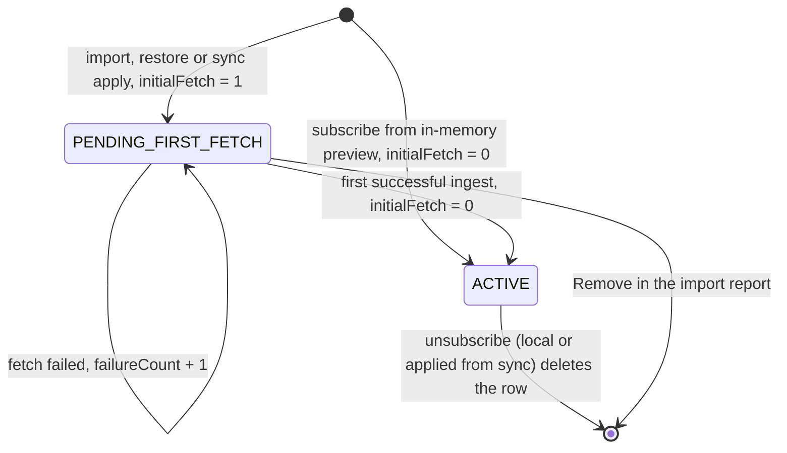
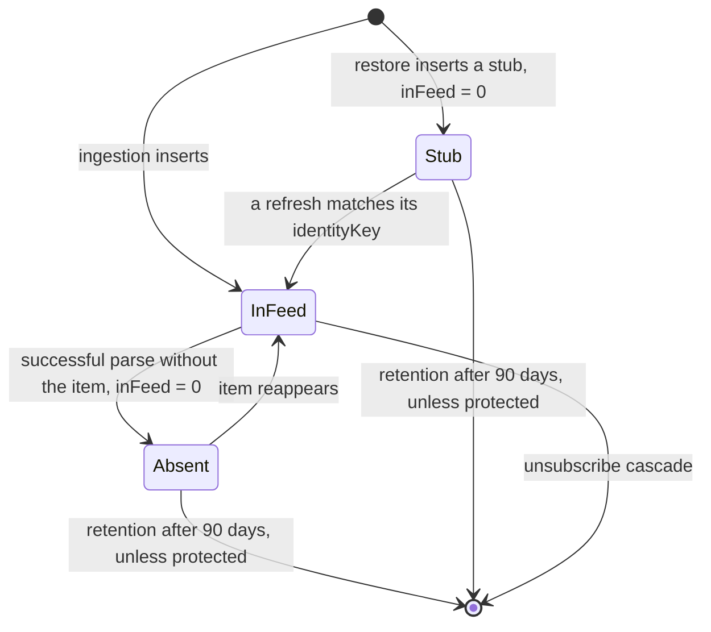
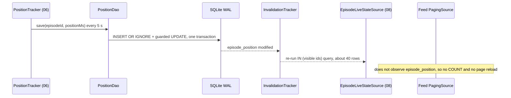
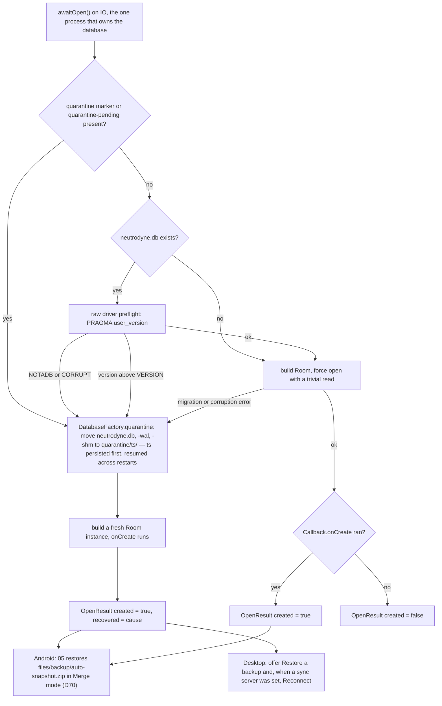

# 02 — Data model

> Status: Draft v1, 2026-10-04; revised 2026-10-05 for the owner decisions (YouTube engine and external mode, app update check); revised 2026-10-05 for PO-31–PO-35 (notify-only update check, published debug builds); scope revision 2026-10-05 (S0–S13): `:core:database` becomes a Room 3 KMP module shared by Android and the desktop (platform database factories, one desktop process, DAO and migration tests on the desktop JVM, release/debug build wording), schema v1 gains the sync groundwork (`podcast.syncId`, `orderKey` columns replacing `sortOrder` and `ordinal`, the five `sync_*` tables), MS0 adds the capture triggers (`SyncTriggers`, applying protocol, conflict-clause-safe SQL) and retention, merges and maintenance learn what must and must not reach the outbox; **final cross-document review 2026-10-05:** restore writes keep the backup's `ts`/`posAt` as `updatedAt` · Implements: R1.3, R1.7, R1.8, R2.3, R2.5, R2.8, R2.9, R3.4, R3.7 (query side), R4.2, R4.4, R4.5, R4.8, R7.1, R7.3 (storage side), R7.5 (capture side), R8.1 (shared schema), R8.11 (desktop database file) / N1, N5, N6, N9 · Milestones: M1 (M1a, M1b), M2, M3, M4, M5, M6, M9a, M11b, MS0, MS2 · Honours: D2, D9, D14, D15, D16, D17, D18, D19, D20, D21, D22, D23, D24, D29, D30, D33, D38, D41, D50, D63, D73, D77, D78, D81, D85, D91, D92, D93, D96 · Owns: the Room 3 KMP schema on Android and the desktop (every entity, column, index and key SQL statement), the sync tables and capture triggers, identity-key storage, invalidation rules, retention, migrations and schema tests

Contents: [Scope](#scope) · [Conventions](#conventions) · [Entity relationship diagram](#entity-relationship-diagram) · [Tables](#tables) · [Identity keys](#identity-keys) · [Indices](#indices) · [Key queries](#key-queries) · [Invalidation hygiene](#invalidation-hygiene) · [Retention and maintenance](#retention-and-maintenance) · [Migrations and schema testing](#migrations-and-schema-testing) · [Error handling and recovery](#error-handling-and-recovery) · [Testing](#testing) · [Delivery by milestone](#delivery-by-milestone) · [Open questions](#open-questions) · [Sources](#sources)

---

## Scope

Serves N1, N5, R2.3, R2.8, R2.9, R7.1. Delivered in [M1](../PLAN.md#m1-subscribe-and-ingest-rss) (M1a: complete schema v1 including the sync groundwork, on Android and the desktop) and [MS0](../PLAN.md#ms0-sync-groundwork) (capture triggers), and extended by every later milestone ([Delivery by milestone](#delivery-by-milestone)).

Room is the single source of truth on every client, Android and the desktop alike ([D14](../PLAN.md#3-key-decisions)): both apps run the same `commonMain` schema, DAOs and SQL ([D9](../PLAN.md#3-key-decisions), [D81](../PLAN.md#3-key-decisions)). A Neutrodyne Sync server holds a replica of user state and is never a client's source of truth ([D93](../PLAN.md#3-key-decisions)); the server's own store (`SqliteSyncStore` over JDBC) does not use Room and is owned by [10 Server architecture](10-sync.md#server-architecture) ([D94](../PLAN.md#3-key-decisions)). This document is the only place where entity definitions, column types, defaults, keys, indices, triggers and SQL of the client database are specified. Other documents show the subset of columns they read or write and link here.

| This document owns | It does not own (link instead) |
|---|---|
| Every `@Entity`, column, type, default, nullability, PK/FK/index | The ingestion diff algorithm and identity-key *computation* — [03 Ingestion and diff](03-feeds-and-discovery.md#ingestion-and-diff) |
| Type converters, JSON-column formats, bitmask values | Group behaviour, name validation, effective-settings rules — [05 Group model and lifecycle](05-groups-opml-backup.md#group-model-and-lifecycle), [05 Effective settings resolution](05-groups-opml-backup.md#effective-settings-resolution) |
| Identity-key *storage* format, versioning and uniqueness behaviour | Which episodes a play context contains (rules) — [05 Playing a group](05-groups-opml-backup.md#playing-a-group); queue projection — [06 Queue and play context](06-playback.md#queue-and-play-context) |
| All SQL of the key queries (feeds, counts, context tail, live state, refresh selection, download claim, auto-download, cleanup, retention, backup, restore) | Download state machine semantics and policies — [07 State machine](07-downloads.md#state-machine), [07 Auto-download policy](07-downloads.md#auto-download-policy) |
| Invalidation rules, `observedEntities`, churn classes | Artwork files, key derivation, pinning reasons — [08 Artwork pipeline](08-ui-ux.md#artwork-pipeline) |
| Retention (D23) and the maintenance steps (`db-maintenance` on Android, the `maintenance` lane on the desktop) | Backup archive format and merge rules — [05 Full backup and restore](05-groups-opml-backup.md#full-backup-and-restore) |
| Room 3 usage conventions, migration policy, schema tests | Metro bindings and start-up order — [01 Dependency injection](01-foundation.md#dependency-injection), [11 Desktop shell](11-desktop.md#desktop-shell); CI wiring — [09 CI pipelines](09-quality-and-release.md#ci-pipelines) |
| The `sync_*` tables, the capture triggers (`SyncTriggers`), the SQL of `SyncStateDao`, `SyncOutboxDao`, `SyncClockDao`, `SyncParkedDao`, `SyncHeldDao` | What syncs, wire fields, field kinds, clock rules, the JSON inside `sync_*` columns, push, apply and first-link algorithms — [10 What syncs](10-sync.md#what-syncs), [10 Conflict resolution](10-sync.md#conflict-resolution), [10 Client sync engine](10-sync.md#client-sync-engine) |

Never in Room ([D73](../PLAN.md#3-key-decisions), [D76](../PLAN.md#3-key-decisions), [D78](../PLAN.md#3-key-decisions), [D90](../PLAN.md#3-key-decisions)): the YouTube engine's state (Android `noBackupFilesDir/ytdlp/`, desktop `<data>/ytdlp/`, each with `active.json`, installed versions and staging; yt-dlp's player-JS cache; [04 Engine updates](04-youtube.md#engine-updates)), the update check's cache file (Android `noBackupFilesDir/updates/last-check.json`, the desktop's in its state directory; [09 Update check](09-quality-and-release.md#update-check)), their settings (`youtube.engine_*`, `youtube.breaker_engine_version`, `updates.*`) and the sync settings (`sync.*`) in the DataStore files `settings` and `device_settings`, and the desktop's secrets — feed passwords and the sync token live in `DesktopSecretStore` ([PO-44](../PLAN.md#48-further-product-owner-decisions), [11 Desktop shell](11-desktop.md#desktop-shell)). Neither engine host opens the database: not Android's `:ytx` process (01's `YtxProcessStartTest`) and not the desktop's CPython child process ([11 Desktop YouTube engine host](11-desktop.md#desktop-youtube-engine-host)); engine results reach Room only through app-process writers (04's enrichment, channel metadata and `YouTubeAvailabilityRecorder`). The update check writes no rows: it only reads the release's update manifest and never downloads an installer ([D78](../PLAN.md#3-key-decisions)).

### Module placement

| Module | Contents specified here |
|---|---|
| `:core:model` (KMP, `commonMain` only) | Enums of the canonical list plus [new enums](#new-names-introduced-here); `EpisodeRow`; bit constants `YouTubeVariantBits`, `FilterFlagBits` |
| `:core:database` (KMP: `neutrodyne.kmp.library`, `neutrodyne.room` with KSP per target, `kspAndroid` and `kspDesktop`) | `commonMain`: `NeutrodyneDatabase` with `@ConstructedBy(NeutrodyneDatabaseConstructor)`, all entities (`<Table>Entity`), DAOs, DAO projections, `FeedQueryBuilder`, `NeutrodyneConverters`, `DatabaseOpener`, the `DatabaseFactory` contract, `TableRebuild`, `SyncTriggers`, migrations, `expect object EpisodeDescriptionCodec`; `androidMain`: `AndroidDatabaseFactory` and the codec's `actual`; `desktopMain`: `DesktopDatabaseFactory` (file `<data>/neutrodyne.db`, [11 AppDirs](11-desktop.md#appdirs)) and the codec's `actual`; `core/database/schemas/` |
| `:core:data` (KMP) | `commonMain`: `DbMaintenance` (the maintenance steps), `DiagExportScrub`, `FetchStateBatcher`, entity ↔ `:core:model` mappers, JSON-column codecs (kotlinx.serialization); `androidMain`: `DbMaintenanceWorker`; `desktopMain`: `DesktopMaintenanceLane` (the `maintenance` lane of `DesktopJobRunner`, [11 Background work](11-desktop.md#background-work)) |

Only `:core:data`, `:core:artwork`, `:download:impl` and `:sync:impl` (shared implementations), `:playback:impl` (Android) and `:playback:desktop` (desktop) depend on `:core:database` ([PLAN 5.1](../PLAN.md#51-module-graph) graph and rules 2, 4 and 6); `:youtube:*`, `:feeds`, `:sync:protocol` and `:sync:server` do not ([D13](../PLAN.md#3-key-decisions), [D94](../PLAN.md#3-key-decisions)). The update check lives in `:core:data` but touches no table. Features never see entities or DAOs; they receive `:core:model` types through `:core:domain` interfaces ([D12](../PLAN.md#3-key-decisions)). `commonMain` of `:core:database` uses no `java.*` or `android.*` API ([D81](../PLAN.md#3-key-decisions), `checkBannedApis`): file paths, file moves and the DEFLATE codec are the platform parts above, and UUIDs come from `kotlin.uuid.Uuid` ([Naming and types](#naming-and-types)).

### Table write ownership

"Churn" drives [Invalidation hygiene](#invalidation-hygiene). Every writer uses the column-scoped DAO methods named in [Key queries](#key-queries); no writer rewrites another owner's columns.

| Table | Churn | Writers (doc: class) | Main readers |
|---|---|---|---|
| `podcast` | low (fetch state batched) | 03: `FeedRefresher`, `SubscribeUseCase`; 04: YouTube columns via 03's refresh pipeline, channel art and `channelMetadataAt` via `PodcastDao.applyYouTubeChannelMetadata`; 05: `ImportRepository`, `RestoreWorker` (insert), `GroupRepository`/podcast settings (`includeInAll`, `customTitle`, `episodeOrder`); 07: `AutoDownloadPlanner` (`autoDownloadEligibleAfter`); 10: `SyncApplier` (insert as pending, user fields, moves, `syncId` on a redirect) | everyone |
| `podcast_url_alias`, `credential` | low | 03 (subscribe, moves, merge, `SecretStore` on Android); 05 (import, restore aliases); 10 (`SyncApplier` aliases with reason `SYNC`; `SyncTokenStore` on Android) | 03, 05, 06, 07, 10 |
| `podcast_settings`, `podcast_group_settings` | low | 05 settings screens; 05 restore; 10 `SyncApplier` (synced override columns only) | `EffectiveSettingsResolver` (05) |
| `podcast_group`, `podcast_group_member` | low | 05 `GroupRepository`, import, restore; 10 `SyncApplier` | 05, 06, 08, 10 |
| `episode` and children (`episode_description`, `episode_transcript`, `episode_alt_enclosure`, `person`, `funding`) | low | 03 ingestion; 04 enrichment (`IngestDao.applyYouTubeFacts`: `durationMs`, `availability`, `isShort`; facts from the engine's `YtDlpEnricher`, so only with the engine, from M9a) as part of the refresh pipeline; 04 `YouTubeAvailabilityRecorder` (`EpisodeDao.setAvailability`, called by 06/07 at resolve time); 05 restore (stub rows); 10 `SyncApplier` (stub rows); 02 retention (delete) | everyone |
| `chapter` | low | 03 (PSC rows); 06 (other sources) | 06, 08 |
| `episode_state` | low | 06 (started, played, measured duration); 03/08 via `EpisodeRepository` (favourite, bulk played); 07 (tombstone); 05 (import "treat as played", restore); 10 (`SyncApplier`, `SyncParkedStateApplier`) | lists, 05, 06, 07, 10 |
| `episode_position` | **high** (every 5 s while playing) | 06 `PositionTracker` (Android and desktop through `:playback:core`'s `PositionSaver`); 05 restore; 10 `SyncApplier` | `EpisodeLiveStateSource` (08), 06, 10 |
| `queue_entry`, `play_session` | medium (every transition) | 06; 05 restore; 10 `SyncApplier`, `SessionAdopter` | 06, 10 |
| `download` | low (transitions only, [D17](../PLAN.md#3-key-decisions)) | 07 (episode downloads only) | lists, 06 `LocalMediaIndex` (via 07), 07 |
| `artwork` | low (batched) | 08 `ArtworkSyncWorker` (Android), `DesktopArtworkLane` (desktop), `ArtworkStore` | lists, 08 |
| `import_session`, `import_item` | medium during an import | 05 | 05 |
| `sync_state` | **high while linked** (the triggers advance `hlc` on every captured write); otherwise none | capture triggers; 10 `SyncEngine`, `LinkFlow`, `SyncApplier` ([Sync bookkeeping](#sync-bookkeeping)) | capture triggers; 10 (one-shot reads, cached in `SyncStateCache`) — never observed |
| `sync_outbox` | **high while linked** (one coalesced row per changed field; the 5-s position save rewrites one row) | capture triggers, `SyncOutboxDao` captures; 10 `SyncEngine` (acknowledged rows), `SyncApplier` (losing rows) | 10 `OutboxReader`; only 10's `SyncScheduler` observes it ([Observed tables per query](#observed-tables-per-query)) |
| `sync_clock` | medium during a sync round | 10 `SyncApplier`, `SyncEngine`, `SettingsCapture`; `sync_cap_episode_rekey` | 10 |
| `sync_parked`, `sync_held` | low | 10 `SyncApplier`, `SyncParkedStateApplier`, `MassChangeGuard`; 02 maintenance (expiry) | 10 |

Exceptions to [D15](../PLAN.md#3-key-decisions) "episode is written only by ingestion" (recorded for a PLAN amendment): restore inserts stub rows that ingestion completes later, and 10's `SyncApplier` inserts the same stubs for queued, in-progress and favourite episodes it cannot match yet ([Restore matching](#restore-matching)); retention deletes rows; 04's `YouTubeAvailabilityRecorder` writes only `availability` when a stream resolve proves a video unavailable. None of them writes user state into `episode`, and none rewrites other feed-derived columns of an existing row. 04's enrichment writes run inside the refresh pipeline and count as ingestion; the engine host (`:ytx` on Android, the CPython child on the desktop) only returns facts, and the app process writes them.

### New names introduced here

| Name | Kind / location | Purpose | Consumers |
|---|---|---|---|
| `ShowType { EPISODIC, SERIAL }`, `EpisodeType { FULL, TRAILER, BONUS }` | enums, `:core:model` | `podcast.showType`, `episode.episodeType` | 03, 08 |
| `FeedErrorKind` | enum, `:core:model`; values owned by 03, must include `UNKNOWN` | `podcast.lastErrorKind` | 03, 08 |
| `OwnerType { PODCAST, EPISODE }` | enum, `:core:model` | `person.ownerType`, `funding.ownerType` | 03 |
| `ImportItemKind { RSS, YOUTUBE }` | enum, `:core:model` | `import_item.kind` | 05 |
| `AliasReason { SUBSCRIBE_INPUT, REDIRECT, NEW_FEED_URL, IMPORT, RESTORE, MERGE, RENORMALISED, SYNC }` | enum, `:core:model`; `SYNC` appended in the scope revision (requested by 10) | `podcast_url_alias.reason`; `SYNC` = an alias received in a podcast record's `feedKeys` | 03, 05, 10 |
| `YouTubeVariantBits { LONG_FORM = 1, SHORTS = 2, LIVE = 4 }`, `FilterFlagBits { UNPLAYED = 1, DOWNLOADED = 2, IN_PROGRESS = 4 }` | constant objects, `:core:model` | Values of `podcast.youtubeVariants`, `podcast_group.filterFlags`, `play_session.contextFilterFlags` | 04, 05, 06 |
| `podcast.episodeOrder` | column `FeedOrder?` | Order of the podcast screen; null = `OLDEST_FIRST` when `showType = SERIAL`, else `NEWEST_FIRST` | 05, 08 |
| `podcast.autoDownloadEligibleAfter` | column `Long?` | D67 watermark: episodes with `firstSeenAt` ≤ it are never auto-download candidates | 07 |
| `podcast.pendingNewFeedUrl`, `podcast.lastFullFetchAt` | columns | Lazy `itunes:new-feed-url` adoption; time of the last 200 response with a parsed body (weekly unconditional fetch rule) | 03 |
| `podcast.channelMetadataAt` | column `Long?` (requested by 04) | Last YouTube channel-page or engine-lookup (`YtDlpChannelLookup`) metadata fetch (avatar, banner, description); null = never. Drives 04's 30-day avatar refresh and lazy banner | 04 |
| `ImportFormat.URL_LIST` | constant appended to the canonical `ImportFormat` (requested by 04) | Plain list of URLs, `UC…` IDs or handles; stored as `TEXT`, so no migration | 04, 05 |
| `WaitReason.YOUTUBE_ENGINE_OFF` | constant appended to the canonical `WaitReason` (requested by 04/07, M9a) | A queued YouTube download waits because the engine is off or unusable (`ExternalReason` `DISABLED_BY_USER`, `ENGINE_FAILED`, `NOT_YET_AVAILABLE`); meaning and texts owned by [07 Wait reasons](07-downloads.md#wait-reasons). Stored as `TEXT`, so no migration; a build that predates it reads `NONE` | 04, 07, 08 |
| `podcast_url_alias.reason`, `podcast_url_alias.addedAt` | columns | Why and when an alias was recorded | 03, 05 |
| `episode_alt_enclosure.codecs`, `episode_alt_enclosure.isDefault` | columns | Podcasting 2.0 `alternateEnclosure@codecs`, `@default` | 03, 06 |
| `play_session.contextMediaFilter`, `contextMinSortDate`, `contextAnchorSortDate` | columns | Full context filter set; keyset anchor that survives deletion of the anchor row | 05, 06 |
| `download.requireCharging` | column `Boolean` | Per-row charging requirement (AUTO policy) for the claim query | 07 |
| `import_session.finishedAt` | column `Long?` | Start of the 7-day cleanup window | 05 |
| `EpisodeKeys.candidates(item)`, `EpisodeKeys.keyFor(episode, version)`, `EpisodeKeys.versionOf(key)` | required members of the canonical `EpisodeKeys` (`:feeds`, implemented by 03) | Version-tolerant matching ([Key versions](#key-versions)) | 03, 05 |
| `ScopeOverrides` | `@Embedded` class, `:core:database` | Guarantees identical columns in both settings tables | 05 |
| `NeutrodyneConverters`, `EpisodeDescriptionCodec` (`expect object`), `DatabaseOpener`, `OpenResult`, `RecoveryCause`, `DatabaseOpenException`, `TableRebuild`, `ForeignKeysDriver` (only if spike S3 needs it) | classes, `:core:database` | Converters, show-notes storage, open/recovery, migration helper | 01, 03, 05, 11 |
| `NeutrodyneDatabaseConstructor` (`expect object`, generated per target), `DatabaseFactory` (`commonMain` contract), `AndroidDatabaseFactory` (`androidMain`), `DesktopDatabaseFactory` (`desktopMain`) | KMP database construction, `:core:database` | Database file, quarantine directory and builder per platform ([Database builder and connections](#database-builder-and-connections)) | 01, 11 |
| `podcast.syncId` | column `String`, unique | Sync record ID of a podcast, independent of feed URLs ([Podcast syncId](#podcast-syncid)) | 03, 05, 10 |
| `podcast_group.orderKey`, `podcast_group_member.orderKey`, `queue_entry.orderKey` | columns `String` (replace `sortOrder` and `ordinal`) | Fractional-index order of groups, members and Up next ([Up next ordering](#up-next-ordering), [Group and member ordering](#group-and-member-ordering)) | 05, 06, 08, 10 |
| `SyncStateEntity`, `SyncOutboxEntity`, `SyncClockEntity`, `SyncParkedEntity`, `SyncHeldEntity` | entities of `sync_state`, `sync_outbox`, `sync_clock`, `sync_parked`, `sync_held`, `:core:database` | [Sync tables](#sync-tables) | 10 |
| `SyncTriggers` (`create`, `dropAll`, `recreate`, `ensure`, `sql`, `jsonString`) and the triggers `sync_cap_<table>_<ins\|upd\|del>`, `sync_cap_episode_rekey` | object and SQL triggers, `:core:database` | [Sync capture triggers](#sync-capture-triggers) | 10 |
| `DiagExportScrub` (with its `KEEP` allow-list) | object, `:core:data` | Scrubs the diagnostics `VACUUM INTO` copy column by column ([db-maintenance worker](#db-maintenance-worker)) | 09 (`DatabaseCopyExporter`) |
| `DbMaintenance` | class, `:core:data` `commonMain` | The maintenance steps, run by `DbMaintenanceWorker` (Android) and `DesktopMaintenanceLane` (desktop) | 11 |
| `FetchStateBatcher` | class, `:core:data` | Batches fetch-state-only `podcast` writes ([Refresh selection and fetch-state writes](#refresh-selection-and-fetch-state-writes)) | 03 (M1a, 2026-10-06: implemented in `:core:database` instead — the M1a package builds before `:core:data` exists and may not edit it; it moves to `:core:data` when that module lands; 2026-10-07: buffer, drain and write are serialized on a `Mutex` so `flush()` is a barrier for every earlier write, and the 5-s deadline is a job scheduled from the first buffered outcome on a caller-supplied `CoroutineScope` — the refresh run's scope in production, `backgroundScope` in tests — measured on `Clock.elapsedRealtime()` so a wall-clock setback never strands a batch) |
| `EpisodeRowProjection`, `ContextItem`, `MediaLookupRow`, `ExistingEpisodeKey`, `EpisodeFeedUpdate`, `PodcastFeedMetadata`, `PodcastFetchState`, `DueFeed` (requested by 03), `YouTubeFeedMetadata`, `YouTubeFacts`, `ArtworkSyncResult`, `QueryPlanRow` | DAO projections, `:core:database` | Query results and partial-entity updates | 03, 04, 06, 07, 08 |
| `PodcastDao`, `EpisodeDao`, `IngestDao`, `FeedDao`, `GroupDao`, `ScopeSettingsDao`, `EpisodeStateDao`, `PositionDao`, `QueueDao`, `PlaySessionDao`, `DownloadDao`, `ArtworkDao`, `ChapterDao`, `CredentialDao`, `ImportDao`, `BackupDao`, `MaintenanceDao`; `SyncStateDao` (with `withApplying`), `SyncOutboxDao` (with `captureLiteral`, `captureAll`, `captureAt`, requested by 10), `SyncClockDao`, `SyncParkedDao`, `SyncHeldDao` | DAOs, `:core:database` | One DAO per area | impl modules, `:sync:impl` |
| `EpisodeStateDao.applyRemote`, `PositionDao.applyRemote` | DAO functions, `:core:database` | Column-scoped writes of synced episode state and positions ([User-state writes](#user-state-writes)) | 10 |
| `DatabaseOpener.strictMigrations` | constructor parameter bound by the app graphs | Rethrow migration failures in the Android `debug` build and desktop development runs ([Error handling and recovery](#error-handling-and-recovery)) | 01, 11 |
| `sync-triggers.sql`, `SyncInertTest`, `SyncCaptureTest`, `SyncTriggersTest`, `SyncJsonStringTest`, `SyncTriggerCostTest`, `SyncBookkeepingTest`, `SyncTriggersMigrationTest`, `GroupOrderTest`, `UpNextOrderTest` (was `UpNextOrdinalTest`) | golden file and tests, `core/database/src/desktopTest/` and `androidDeviceTest` | [Testing](#testing) | 09, 10 |
| `diagnostics.db_quick_check_failed_at` | `device_settings` key, `Long` | Last failed `PRAGMA quick_check`, shown on the diagnostics screen | 09 |
| `MigrationInvariants`, `SeedDatabase`, `FeedFixture`, `TestDb`, `SqlEnumLiterals` | test utilities in `:core:testing` (package `ch.lkmc.neutrodyne.core.testing.database`; `commonMain` except `TestDb`'s platform builders), [09 Shared helpers](09-quality-and-release.md#shared-helpers) | Migration invariants, seeded scale DB, in-memory and temp-file DB factory, enum names used in SQL | 09, 10 |

---

## Conventions

Serves N1, N9, N11. Delivered in M1 (M1a), for both platforms.

### Naming and types

| Item | Rule |
|---|---|
| Tables | `snake_case`, exactly the canonical names |
| Columns | `camelCase` = Kotlin property name (Room default); never `@ColumnInfo(name = …)` renames |
| Entity classes | `<PascalCaseTable>Entity` (`PodcastGroupMemberEntity`) |
| Indices | Room default names `index_<table>_<col>[_<col>]` (EXPLAIN tests refer to them) |
| Primary keys | `Long` `@PrimaryKey(autoGenerate = true)`. Room 3's `algorithm` parameter defaults to `AUTOINCREMENT` (the alternative `ROWID` reuses IDs and is never used here), so deleted IDs are never reused, which keeps `episode:{id}` media IDs, notifications and `[e<id>]` file names unambiguous; `SchemaSmokeTest` asserts `AUTOINCREMENT` in `1.json`. Table rebuilds must preserve the `sqlite_sequence` high-water mark ([Writing migrations](#writing-migrations)). Natural keys where canonical (`artwork.key`, `podcast_url_alias.url`) |
| Timestamps | `Long` epoch milliseconds UTC from the injected `Clock` (never `System.currentTimeMillis()` in DAOs). One exception: the hybrid logical clock in `sync_state.hlc` is advanced in SQL from `julianday('now')` by the capture triggers and `SyncOutboxDao` ([Sync capture triggers](#sync-capture-triggers)); it orders changes and is never shown |
| Booleans | Kotlin `Boolean` → `INTEGER` 0/1 |
| Enums | `TEXT` holding `Enum.name` via explicit converters ([Type converters](#type-converters)) |
| UUIDs | `TEXT`, lowercase canonical 8-4-4-4-12 ([D21](../PLAN.md#3-key-decisions)): `podcast.syncId`, `podcast_group.uuid`. Generated in common code with `kotlin.uuid.Uuid.random().toString()` (version 4 from a cryptographically secure generator, `SecureRandom` on the JVM; stable API since Kotlin 2.4, [Uuid.random](https://kotlinlang.org/api/core/kotlin-stdlib/kotlin.uuid/-uuid/-companion/random.html)) |
| Order keys | `orderKey TEXT NOT NULL`: a base-62 fractional index from `OrderKey` (`:sync:protocol`, [10 Ordered lists](10-sync.md#ordered-lists)); compared with SQLite's default `BINARY` collation, which sorts the digits `0-9A-Za-z` correctly; lists sort `ORDER BY orderKey, <id>`; never `COLLATE NOCASE` and never computed in SQL |
| Sync record IDs (`rid`) | `TEXT` in the `sync_*` tables: `syncId`, `uuid`, `groupUuid + podcastSyncId`, `podcastSyncId + identityKey`, `current` or a setting key, concatenated without a separator ([10 Record IDs](10-sync.md#record-ids)); never a local row ID |
| Triggers | Only the sync capture triggers exist: `sync_cap_<table>_<event>` and `sync_cap_episode_rekey`, created and dropped only through `SyncTriggers` ([Sync capture triggers](#sync-capture-triggers)); Room's own temporary invalidation triggers are Room's |
| Colours | `Int` ARGB (`INTEGER`) |
| Binary | `ByteArray` → `BLOB` |
| Large columns | Declared **last** in the entity so SQLite reads hot columns without walking overflow pages (`descriptionHtml`, `categoriesJson`, `snippet`) |
| Defaults | Every non-null column that has a Kotlin default also has `@ColumnInfo(defaultValue = …)`, so raw SQL inserts (stubs, migrations) and future `ALTER TABLE ADD COLUMN` are well-defined |

### Type converters

One class, registered on the database: `@ColumnTypeConverters(NeutrodyneConverters::class)`. Each enum has an explicit pair (`fromX`/`toX`). Reading an unknown name returns the fallback below instead of throwing, so a value written by a newer build never crashes list rendering.

| Enum (`:core:model`) | Column(s) | Fallback on unknown name |
|---|---|---|
| `SourceType` | `podcast.sourceType` | `RSS` |
| `PodcastStatus` | `podcast.status` | `ACTIVE` |
| `FeedOrder` | `podcast_group.feedOrder`, `.playOrder`, `podcast.episodeOrder`, `play_session.contextOrder` | `NEWEST_FIRST` |
| `MediaFilter` | `podcast_group.mediaFilter`, `play_session.contextMediaFilter` | `ALL` |
| `GroupKind`, `MemberSource` | `podcast_group.kind`, `podcast_group_member.source` | `MANUAL` |
| `Availability` | `episode.availability` | `UNAVAILABLE` |
| `ChapterSource` | `chapter.source` | `PSC` |
| `PositionSource` | `episode_position.positionSource` | `STREAM` |
| `ContextType` | `play_session.contextType` | `null` (no context) |
| `NetworkPolicy`, `DeleteAfter` | settings tables | `UNMETERED`, `NEVER` (most conservative) |
| `DownloadState`, `DownloadLane`, `WaitReason` (incl. `YOUTUBE_ENGINE_OFF`), `DownloadError`, `SourceKind` | `download` | `FAILED`, `MANUAL`, `NONE`, `UNKNOWN`, `RSS_ENCLOSURE` |
| `ImportFormat` (incl. `URL_LIST`), `ImportState`, `ImportItemStatus`, `ImportItemKind` | import tables | `OPML`, `DONE`, `FETCH_FAILED`, `RSS` |
| `ShowType`, `EpisodeType`, `FeedErrorKind`, `OwnerType`, `AliasReason` (incl. `SYNC`) | new columns | `null`, `null`, `UNKNOWN`, `EPISODE`, `IMPORT` |

```kotlin
class NeutrodyneConverters {
    @ColumnTypeConverter fun fromDownloadState(v: DownloadState?): String? = v?.name
    @ColumnTypeConverter fun toDownloadState(v: String?): DownloadState? = v?.let { enumOr(it, DownloadState.FAILED) }
    // … one pair per enum in the table above
}
inline fun <reified E : Enum<E>> enumOr(name: String, fallback: E): E =
    enumValues<E>().firstOrNull { it.name == name } ?: fallback
```

The stored name is the contract: enum constants of persisted enums are only ever **appended**. Renaming or removing one requires a migration (`UPDATE <table> SET <col> = 'NEW' WHERE <col> = 'OLD'`) and a `ConverterTest` case; R8 does not affect `Enum.name` because the Android release build keeps `-dontobfuscate` ([01 Build variants and ABIs](01-foundation.md#build-variants-and-abis), [D96](../PLAN.md#3-key-decisions)), and the desktop JARs are not minified ([D89](../PLAN.md#3-key-decisions)). The same names travel in sync payloads (for example `feedOrder`, `mediaFilter`), so an appended constant reaches older apps as an unknown name and takes the fallback above. Enum names used as SQL literals in this document (`'COMPLETED'`, `'YOUTUBE_CHANNEL'`, `'PENDING_FIRST_FETCH'`, …) are collected in the test-only list `SqlEnumLiterals`; `ConverterTest` asserts that each still exists in its enum.

### JSON columns and bitmasks

JSON columns are typed `String` in entities. Encoding and decoding happen in `:core:data` and `:sync:impl` mappers with one shared `Json { ignoreUnknownKeys = true; explicitNulls = false; encodeDefaults = false }`, so `:core:database` stays ignorant of DTOs owned by 03, 05 and 10. No SQL ever reads inside JSON (no JSON1 functions; see [SQL dialect baseline](#sql-dialect-baseline)); the only JSON SQL ever *writes* are the constant literals and the escaped `rid` strings of the capture triggers ([Sync capture triggers](#sync-capture-triggers)).

| Column | Shape | Owner of shape |
|---|---|---|
| `podcast.categoriesJson` | `List<List<String>>`: one path per `itunes:category`, outermost first (`[["Technology"],["Society & Culture","Documentary"]]`) | 02 (03 fills) |
| `episode_alt_enclosure.sourcesJson` | `List<{ "uri": String, "contentType": String? }>` | 03 |
| `import_item.groupNamesJson` | `List<String>` (trimmed, NFC) | 05 |
| `import_session.optionsJson`, `.warningsJson` | 05's `ImportOptions` / `List<ImportWarning>` DTOs | 05 |
| `podcast_group.ruleJson` | Reserved (smart groups), versioned `{ "v": 1, … }`; always `null` in v1 | 05 |
| `sync_outbox.value`, `sync_clock.clocks`, `sync_parked.record`, `sync_held.batch` and `.summary` | Literal wire values, per-field clocks with redirect and alias entries, received records, staged removals ([Sync tables](#sync-tables)) | 10 |

| Bitmask column | Bits | Notes |
|---|---|---|
| `podcast.youtubeVariants` | `LONG_FORM = 1`, `SHORTS = 2`, `LIVE = 4` | Default 1; meaningful only for `YOUTUBE_CHANNEL`; semantics in [04 Atom feed ingestion](04-youtube.md#atom-feed-ingestion) |
| `podcast_group.filterFlags`, `play_session.contextFilterFlags` | `UNPLAYED = 1`, `DOWNLOADED = 2`, `IN_PROGRESS = 4` | Media filter and minimum date are separate columns, never bits |

### Database builder and connections

`:core:database` exposes the database through a platform `DatabaseFactory`; the app graphs ([01 Dependency injection](01-foundation.md#dependency-injection): `AndroidAppGraph`, `DesktopAppGraph`) bind the factory and the `SQLiteDriver` (`BundledSQLiteDriver` in production on both platforms, `AndroidSQLiteDriver` only in Android Robolectric tests, [D9](../PLAN.md#3-key-decisions)) and open it through [`DatabaseOpener`](#error-handling-and-recovery). Room KMP needs the `@ConstructedBy` constructor object whose `actual` KSP generates per target, and a platform builder: Android passes a `Context`, the JVM only the file name ([Room KMP](https://developer.android.com/kotlin/multiplatform/room)).

```kotlin
// commonMain
@Database(entities = [/* the 27 entities of §Tables */], version = NeutrodyneDatabase.VERSION, exportSchema = true)
@ConstructedBy(NeutrodyneDatabaseConstructor::class)
@ColumnTypeConverters(NeutrodyneConverters::class)
abstract class NeutrodyneDatabase : RoomDatabase() {
    abstract fun podcastDao(): PodcastDao
    abstract fun episodeDao(): EpisodeDao
    abstract fun ingestDao(): IngestDao
    abstract fun feedDao(): FeedDao
    // … one accessor per DAO listed in "New names introduced here", including the five Sync*Dao
    companion object {
        const val VERSION = 1
        const val FILE_NAME = "neutrodyne.db"
        fun build(factory: DatabaseFactory, driver: SQLiteDriver, io: CoroutineContext, cb: RoomDatabase.Callback) =
            factory.builder()
                .setDriver(driver)                                  // wrapped by ForeignKeysDriver only if spike S3 says so
                .setQueryCoroutineContext(io)                       // @Dispatcher(IO): Dispatchers.IO on both platforms
                .setJournalMode(JournalMode.WRITE_AHEAD_LOGGING)    // explicit; WAL is mandatory
                .addMigrations(*ALL_MIGRATIONS)
                .addCallback(cb)                                    // onCreate: play_session and sync_state rows, SyncTriggers.create;
                                                                    // onOpen: PRAGMA optimize, applying reset, SyncTriggers.ensure
                .build()                                            // never fallbackToDestructiveMigration*()
    }
}
@Suppress("KotlinNoActualForExpect")
expect object NeutrodyneDatabaseConstructor : RoomDatabaseConstructor<NeutrodyneDatabase> {
    override fun initialize(): NeutrodyneDatabase
}
interface DatabaseFactory {                       // platform: path, files and builder; DatabaseOpener stays common
    val databasePath: String                      // absolute path of neutrodyne.db
    fun builder(): RoomDatabase.Builder<NeutrodyneDatabase>
    fun exists(): Boolean
    fun quarantine(stamp: String)                 // moves neutrodyne.db, -wal, -shm into <quarantine>/<stamp>/
    fun pruneQuarantine(now: Long)                // keeps only the newest copy, at most 14 days; never the pending destination
    var quarantineMarker: Boolean                 // file "quarantine-requested" beside the database
    var pendingQuarantine: String?                // file "quarantine-pending": stamp of an in-flight quarantine
}
// androidMain — databases/ in credential-encrypted storage
class AndroidDatabaseFactory(private val context: Context) : DatabaseFactory {
    override val databasePath get() = context.getDatabasePath(NeutrodyneDatabase.FILE_NAME).absolutePath
    override fun builder() = Room.databaseBuilder<NeutrodyneDatabase>(context = context, name = databasePath)
    // exists, quarantine, pruneQuarantine, quarantineMarker over java.io.File; quarantine directory databases/quarantine/
}
// desktopMain — the data directory of 11's AppDirs (mode 0700 on macOS and Linux)
class DesktopDatabaseFactory(private val dirs: AppDirs) : DatabaseFactory {
    override val databasePath get() = dirs.data.resolve(NeutrodyneDatabase.FILE_NAME).toString()
    override fun builder() = Room.databaseBuilder<NeutrodyneDatabase>(name = databasePath)
    // the same over java.nio.file; quarantine directory <data>/quarantine/
}
```

- **Quarantine moves are verified and resumable (M1a, 2026-10-07):** the factories move `-wal` and `-shm` before `neutrodyne.db` so a mid-sequence failure leaves the main file in place and the retried move completes into the same stamp directory; a failed move (a `renameTo` that returned `false` on Android, any `Files.move` error on the desktop) propagates, which keeps the recovery request set and blocks reopening and pruning until it succeeds.
- **The quarantine stamp survives restarts (M1a, 2026-10-07):** `DatabaseOpener` writes the stamp into `quarantine-pending` beside the marker *before the first move*, so a crash or a still-failing move resumes into the same destination on the next launch (a `quarantine-pending` without a marker also resumes — the original cause is lost with the dead process and reports `CORRUPT`); the record is cleared only after the marker. `pruneQuarantine` never deletes the pending destination. Marker and pending removals are verified — the desktop's `Files.delete*` throws, Android checks `File.delete()`'s result — and a failed removal propagates *before* any replacement database is created, so a stale marker can never quarantine a healthy new library on the next launch.
- One database instance per process, opened by exactly one process per platform: the Android main process — the `:acra` and `:ytx` processes run no initializers and must never touch the database (01's process guards, [01 Application start-up](01-foundation.md#application-start-up); [D73](../PLAN.md#3-key-decisions) for `:ytx`) — and the desktop instance that holds `SingleInstanceLock` ([D85](../PLAN.md#3-key-decisions), [11 Single instance and handshake](11-desktop.md#single-instance-and-handshake)); the desktop's CPython engine child never touches it. Multi-instance invalidation stays off on Android and does not exist on the JVM ([Platform constraints](#platform-constraints)).
- WAL: with `WRITE_AHEAD_LOGGING` and no explicit pool setting, Room's pool has **one writer and four readers**; readers never block the writer and see a consistent snapshot. A caller waits for a pooled connection for at most 30 s and then gets an `SQLiteException`, so no transaction may run anywhere near that long ([Transactions and threading](#transactions-and-threading)). Room itself sets `busy_timeout` (≥ 3 s), `journal_mode` and `synchronous = NORMAL` on each connection. An in-memory database (tests) always uses a single connection, so tests of reader isolation use a temp-file database.
- **Opening.** Room opens the first connection, runs `BEGIN EXCLUSIVE TRANSACTION` → `onCreate` or the migrations → `END`, then calls the generated `onOpen` and our `Callback.onOpen`; callbacks must use only the `connection` they receive (touching the database instance or a DAO there fails with "Recursive database initialization detected"). Room retries a failing first open once after 500 ms. If the builder offers `allowDataLossOnRecovery()` it is never called: Room would then delete a corrupt file itself, while [`DatabaseOpener`](#error-handling-and-recovery) quarantines it instead. The same sequence runs on both platforms; spike S10 ([01 Spikes](01-foundation.md#spikes)) confirms it with the bundled driver on Windows x64, macOS arm64 and Linux x64/arm64.
- **`Callback.onCreate(connection)`** inserts the singleton rows `play_session` (`id = 0`, [play_session](#play_session)) and `sync_state` (`id = 0`, `enabled = 0`, [sync_state](#sync_state)) and, from MS0, creates the capture triggers (`SyncTriggers.create`, [Sync capture triggers](#sync-capture-triggers)). **`Callback.onOpen(connection)`** runs `PRAGMA optimize` (below), `UPDATE sync_state SET applying = 0 WHERE id = 0 AND applying <> 0` (defensive: `applying` only ever changes inside a transaction that resets it, [applying protocol](#the-applying-protocol)) and, from MS0, `SyncTriggers.ensure(connection)`.
- **Foreign keys.** `foreign_keys` must be `ON` on every connection after the database is open, and **`OFF` while migrations run** (see [Writing migrations](#writing-migrations): a table rebuild with foreign keys on cascades deletes into child tables). Room 3's generated `onOpen` executes `PRAGMA foreign_keys = ON` when any entity declares a foreign key, both for the first connection (after migrations) and for every later pooled connection; this matches what we need. Checked in the `androidx-main` sources of `room3-compiler`'s `OpenDelegateWriter` and `room3-runtime`'s `RoomConnectionManager` (2026-10-05); **confirmed for 3.0.3 by spike S3 on 2026-10-06** (bundled JVM driver: pragma = 1 on the writer and on a reader of the WAL pool, = 0 inside `Migration.migrate`; the bundled SQLite keeps `foreign_keys` off by default), and S10 repeats the check on the desktop JVM. Fallback (documented, unused since S3 is go): `ForeignKeysDriver(delegate, armed: () -> Boolean)`, a `SQLiteDriver` decorator whose `open()` runs `PRAGMA foreign_keys = ON` once `DatabaseOpener` has armed it after the first successful open. `SchemaSmokeTest` asserts the pragma on the writer and on a reader ([Testing](#testing)).
- `onOpen`: `PRAGMA optimize=0x10002` with the bundled driver, plain `PRAGMA optimize` with the framework driver; plain `PRAGMA optimize` daily in maintenance and after a migration that adds an index ([SQLite pragma optimize](https://www.sqlite.org/pragma.html#pragma_optimize): recommended usage since 3.46.0).
- Confirmed by S10 (2026-10-06): the builder names and parameters are exactly the two sketches above — JVM `Room.databaseBuilder<Db>(name = absolutePath)` and `Room.inMemoryDatabaseBuilder<Db>()`, Android `Room.databaseBuilder<Db>(context = ctx, name = absolutePath)` and `Room.inMemoryDatabaseBuilder<Db>(context)` — plus `setDriver`, `setQueryCoroutineContext`, `setJournalMode`, `addMigrations`, `addCallback` and the `suspend` `Callback.onCreate/onOpen(connection: SQLiteConnection)` signatures, all exercised on the desktop JVM and (except the builder's `name`-only form) under Robolectric.

### Transactions and threading

| Rule | Detail |
|---|---|
| All DAO functions are `suspend`, return `Flow`, or return `PagingSource` | Room 3 requires coroutines; there are no blocking DAO calls and no main-thread queries (Android main thread; the Swing EDT on the desktop). Synchronous lookups on the player loader thread (Android) or the engine thread (desktop) use in-memory mirrors (`LocalMediaIndex`, 07; episode source index, 06) |
| Query context | `@Dispatcher(NeutrodyneDispatchers.IO)` (`Dispatchers.IO` on Android and the desktop) via `setQueryCoroutineContext`; CPU-bound work (parsing, hashing, compression, JSON for sync) happens **before** the transaction on `Default` |
| Multi-statement writes | `db.withWriteTransaction { }` (suspend extension on `RoomDatabase`) or `@Transaction` DAO functions. Write transactions run on the pool's single writer connection, so they serialise all writers and read-then-write logic inside them is race-free (Unverified detail: whether Room 3 opens them as `BEGIN IMMEDIATE`; the single writer makes the result the same) |
| Consistent multi-query reads | `db.withReadTransaction { }` (suspend extension, exists in Room 3) for backup export, the Auto Backup snapshot (Android) and 10's push snapshot (`ChangeBuilder` reads outbox rows and their source rows together) |
| Capture suppression | A write that must not reach the sync outbox runs inside `SyncStateDao.withApplying { }` within its write transaction ([The applying protocol](#the-applying-protocol)); nothing else changes `sync_state.applying` |
| No I/O inside transactions | No network, no file copies, no `ContentResolver` calls inside a transaction |
| Transaction length | Every transaction stays well under 1 s on the reference device (the longest is a large feed's ingest, ≤ 150 ms for 831 items); other callers wait for the single writer and time out after 30 s. `VACUUM` is the only multi-second write and runs under the guards of [db-maintenance worker](#db-maintenance-worker) |
| Batch sizes | Per-feed ingest: one transaction per fetched document (a feed page holds at most a few thousand items; RFC 5005 older pages are separate documents and separate transactions, 03); import commit: 500 items per transaction; restore: 1,000 episode lines per transaction; sync apply: one transaction per pulled page of ≤ 1,000 records (10); retention: 500 episodes per transaction; cleanup: one transaction per deleted file's row; `IN (:ids)` lists chunked at 500 |
| Cancellation | A cancelled coroutine rolls back its open transaction. Callers use `suspendRunCatching` (rethrows `CancellationException`) |
| Expected write latency | ≤ 150 ms for an 831-item feed diff; the 5-s position write may wait behind it, which is harmless. While linked, the capture triggers add ≤ 1 ms to the position save (MS0 acceptance 3; a probe of the trigger SQL on SQLite 3.45 on a development machine added about 12 µs per save, Unverified on the reference phone until S14) and a sync page of 1,000 records stays within the 1-s rule |

### DAO rules

1. **Column-scoped writes for shared tables.** `podcast`, `episode_state`, `download` and `play_session` have several writers. They are written only with targeted `UPDATE … SET <owned columns>` statements or partial-entity `@Update(entity = …)` classes, never by upserting a whole entity that another module may have changed (lost updates).
2. **Row creation for lazily created rows** (`episode_state`, `episode_position`, settings, and the `play_session` singleton via `PlaySessionDao.ensure`, [play_session](#play_session)): `INSERT OR IGNORE` with neutral values, then a targeted `UPDATE`. An ignored insert and an `UPDATE` that matches zero rows fire no Room trigger, so they cause no invalidation. An `UPDATE` that matches a row but writes identical values **does** fire the trigger, so every repeated write to a joined table carries a "value differs" predicate (`… WHERE episodeId = :id AND waitReason IS NOT :reason`).
3. **Never `OnConflictStrategy.REPLACE` / `INSERT OR REPLACE` on an FK parent table** (`podcast`, `episode`, `podcast_group`, `credential`, `import_session`). REPLACE deletes the existing row; with `ON DELETE CASCADE` children (episodes, user state) can be lost. (Unverified whether SQLite applies ON DELETE actions to REPLACE-deleted rows; forbidden regardless.) `@Upsert` (insert, then update on conflict) is allowed only for single-writer tables: `artwork`, `podcast_settings`, `podcast_group_settings`, `chapter`.
4. **Raw queries** (`@RawQuery`) are built only by `FeedQueryBuilder` from enumerated fragments; every value is bound, never concatenated. `observedEntities` must list every table the SQL references.
5. **Paged and observed list queries** follow [Invalidation hygiene](#invalidation-hygiene).
6. **Projections** are DAO-local data classes (`EpisodeRowProjection`); `:core:data` maps them to `:core:model` types (`PagingData.map`). Room never maps into `:core:model` classes directly.
7. **Synced tables are captured, not called.** Writes to `podcast`, `podcast_settings`, `podcast_group`, `podcast_group_settings`, `podcast_group_member`, `episode_state`, `episode_position`, `queue_entry` and `play_session` reach the sync outbox through the triggers, whatever DAO issues them ([Sync capture triggers](#sync-capture-triggers)); no writer calls a sync API for them. A write that must not be captured (sync apply, session adoption, the first-link merge, retention and stub cleanup, a local merge's loser deletion, restore while linked) runs inside `SyncStateDao.withApplying`. The "value differs" predicates of rule 2 matter twice here: an identical write would otherwise advance the clock (the triggers' `WHEN` repeats the comparison as a safety net).
8. **No `OR REPLACE` on synced tables.** Besides rule 3, synced child tables are never written with `INSERT OR REPLACE` or `OnConflictStrategy.REPLACE`: a replaced row fires no `DELETE` trigger (recursive triggers are off), so a replace would hide a removal from sync.

### SQL dialect baseline

All SQL — queries, migrations and the sync capture triggers — must run on **SQLite 3.18** (framework SQLite on API 26), even though production uses the bundled driver on both platforms. Reason: the SQL is common code, and Android production must be able to fall back to `AndroidSQLiteDriver` if spike S6 finds the APK-size or 16 KB-alignment cost of `sqlite-bundled` unacceptable ([01 Spikes](01-foundation.md#spikes), [D9](../PLAN.md#3-key-decisions)); the desktop always uses the bundled driver. DAO, query and migration tests run in `desktopTest` with the bundled driver (its own, newer SQLite) and Android Robolectric tests use `AndroidSQLiteDriver` on Robolectric's native SQLite build (3.44.3 at Robolectric 4.17/`sdk=36`, recorded by spike S4), so neither proves the 3.18 baseline; the API 26 GMD run with `AndroidSQLiteDriver` does, and it runs `SyncCaptureTest` from MS0.

| Allowed | Forbidden |
|---|---|
| Row values `(a, b) < (?, ?)` (3.15) | Window functions (3.25) — use correlated `LIMIT 1` subqueries or Kotlin |
| `CROSS JOIN` to fix join order | SQL `UPSERT … ON CONFLICT DO UPDATE` (3.24) — Room `@Upsert` does not need it |
| `INSERT OR IGNORE`, `NOT EXISTS`, correlated subqueries with `LIMIT` | `NULLS FIRST/LAST` (3.30, Unverified version), `RETURNING` (3.35), JSON1 functions, generated columns |
| `PRAGMA optimize` (3.18) | `ALTER TABLE … RENAME COLUMN` / `DROP COLUMN` in hand-written migrations (3.25 / 3.35, Unverified versions) — use the table-rebuild procedure |
| `CREATE TRIGGER … AFTER INSERT/UPDATE OF …/DELETE … WHEN … BEGIN … END`, `julianday('now')`, multi-argument `max()`, `char()`, `replace()`, `CAST`, `<<` | A conflict clause (`OR REPLACE`, `OR IGNORE`) inside a trigger body that the logic depends on: the conflict policy of the statement that fired the trigger overrides it ([CREATE TRIGGER](https://www.sqlite.org/lang_createtrigger.html)) — trigger bodies delete, then insert ([Sync capture triggers](#sync-capture-triggers)) |

Framework SQLite versions by API (relevant only for the fallback driver; some manufacturers ship other versions): 26 → 3.18, 27 → 3.19, 28 → 3.22, 30 → 3.28, 31–33 → 3.32, 34 → 3.39/3.42, 35 → 3.44, 36.1/37 → 3.50 ([android.database.sqlite](https://developer.android.com/reference/android/database/sqlite/package-summary), re-checked 2026-10-05). SQLite before 3.32 allows only 999 bound variables per statement, hence the 500-ID chunking rule (Unverified: limit value not re-checked).

### Room 2 to Room 3 mapping

AI sessions tend to emit Room 2 code (risk [T1](../PLAN.md#8-risks-and-mitigations)). Use the right-hand column. Rows without a mark were checked against the Room 3 release notes and the `room3` sources on 2026-10-05; rows formerly marked Unverified were confirmed by spikes S2/S3/S4 and S10 on **2026-10-06** (compilation and green tests in `:core:database`, desktop JVM and Robolectric); correct this table if a later version differs.

| Room 2.x | Room 3 (`androidx.room3`, 3.0.3) |
|---|---|
| `androidx.room.*`, kapt or KSP | `androidx.room3.*`, **KSP only** (`room3-compiler`), Kotlin codegen only, Gradle plugin `androidx.room3` with `room3 { schemaDirectory("$projectDir/schemas") }` (extension name confirmed, S2 2026-10-06) |
| `@TypeConverter` / `@TypeConverters` | `@ColumnTypeConverter` / `@ColumnTypeConverters` |
| `runInTransaction {}`, `withTransaction {}` | `withWriteTransaction {}`; reads: `withReadTransaction {}` |
| `SupportSQLiteDatabase`, `Cursor`, `query(…)` | `SQLiteConnection` / `SQLiteStatement` via `useReaderConnection` / `useWriterConnection` + `usePrepared` (`room3-sqlite-wrapper` exists; never used here) |
| `Migration.migrate(SupportSQLiteDatabase)` | `suspend fun migrate(connection: SQLiteConnection)`; already called inside Room's migration transaction (possibly one transaction for all pending migrations) |
| `setQueryExecutor`, `allowMainThreadQueries()` | `setQueryCoroutineContext(…)`; no `Executor`, no main-thread mode |
| `Room.databaseBuilder(ctx, Db::class.java, "name")` | Android: `Room.databaseBuilder<Db>(context = ctx, name = absolutePath)`; JVM: `Room.databaseBuilder<Db>(name = absolutePath)`; both + `setDriver(…)` (driver mandatory) ([Room KMP](https://developer.android.com/kotlin/multiplatform/room)) |
| Reflection finds `Db_Impl` | `@ConstructedBy(DbConstructor::class)` on the database and `expect object DbConstructor : RoomDatabaseConstructor<Db>`, whose `actual` KSP generates per target (`kspAndroid`, `kspDesktop`) |
| `setJournalMode(JournalMode.WRITE_AHEAD_LOGGING)` | unchanged name (`JournalMode.TRUNCATE` / `WRITE_AHEAD_LOGGING`) |
| `SimpleSQLiteQuery` for `@RawQuery` | `RoomRawQuery(sql) { stmt -> stmt.bindLong(1, …) }` |
| `room-paging` `PagingSource` return type | `room3-paging` + `@DaoReturnTypeConverters(PagingSourceDaoReturnTypeConverter::class)` on the **`@Dao`-annotated** interface (S2 2026-10-06: without `@Dao` the converter is ignored and non-Android targets reject the blocking signature) |
| `InvalidationTracker.Observer`, `addObserver` | removed; `invalidationTracker.createFlow(vararg tables)` — `emitInitialState` defaults to `true`, and Room 3's own `LimitOffsetPagingSource` passes `true` while registering the flow at construction (3.0.3, `CommonLimitOffsetImpl`; S2 confirmed the same); pass `false` only for an observer that re-reads the tables itself on collection |
| `MigrationTestHelper(instrumentation, Db::class.java)` | Android device tests: `MigrationTestHelper(instrumentation = …, file = …, driver = …, databaseClass = Db::class)` (parameter names confirmed by S4; **not usable under Robolectric** — no merged assets for a KMP host test, so Android migration tests run on GMD only); JVM (`desktopTest`): `MigrationTestHelper(schemaDirectoryPath: Path, databasePath: Path, driver, databaseClass = Db::class)` with `suspend createDatabase(version): SQLiteConnection` and `suspend runMigrationsAndValidate(version, migrations)` — confirmed end to end by S10 on 2026-10-06 ([jvmMain source](https://github.com/androidx/androidx/blob/androidx-main/room3/room3-testing/src/jvmMain/kotlin/androidx/room3/testing/MigrationTestHelper.jvm.kt)) |
| `enableMultiInstanceInvalidation()`, `setQueryCallback`, `setAutoCloseTimeout`, `createFromAsset` | Android-only in Room KMP ([Room KMP](https://developer.android.com/kotlin/multiplatform/room)); none is used here, so the builder code stays common |
| `@Entity` has no rowid option | `@Entity(withoutRowId = true)` |
| `@PrimaryKey(autoGenerate = true)` (always `AUTOINCREMENT`) | same, with `algorithm` defaulting to `AUTOINCREMENT` (`ROWID` would reuse IDs; never used) |
| `Callback.onCreate(db: SupportSQLiteDatabase)` | `override suspend fun onCreate(connection: SQLiteConnection)` (same for `onOpen`, `onDestructiveMigration`) |
| `clearAllTables()` | `suspend fun clearAllTables()` (used only by tests) |
| Built-in `UUID` converter | None in 3.0.x (`kotlin.uuid.Uuid` only from 3.1.0-alpha01): store `String` ([D21](../PLAN.md#3-key-decisions)) |
| `@AutoMigration` | Unchanged: `@AutoMigration(from = N, to = N + 1)` compiles and runs (S10 verified one through `runMigrationsAndValidate`, 2026-10-06; auto migrations are included automatically, manually passed ones take precedence on overlapping paths) |

### Platform constraints

| Constraint | Consequence | Source |
|---|---|---|
| **Both:** Room KMP offers multi-instance invalidation only on Android | Exactly one process opens the database: Android's main process; on the desktop the instance holding `SingleInstanceLock` ([D85](../PLAN.md#3-key-decisions), risk [T26](../PLAN.md#8-risks-and-mitigations)). A second desktop writer would never see the first one's invalidations and would double-push sync | [Room KMP](https://developer.android.com/kotlin/multiplatform/room) |
| **Android:** `sqlite-bundled` ships native `.so` per ABI | 16 KB page alignment checked in CI (09) and by spike S6; with per-ABI APKs ([D77](../PLAN.md#3-key-decisions)) each APK carries one ABI's `.so`, counted in that APK's N5 budget. Unrelated to the SQLite inside the CPython runtime of `:ytx`, which never opens `neutrodyne.db` | [16 KB page sizes](https://developer.android.com/guide/practices/page-sizes), [SQLite drivers](https://developer.android.com/kotlin/multiplatform/sqlite) |
| **Desktop:** `sqlite-bundled-jvm` 2.7.1 ships natives for `windows_x64`, `osx_arm64`, `linux_x64` and `linux_arm64` only (no `windows_arm64`, no `osx_x64`) | Matches the platform matrix of [D88](../PLAN.md#3-key-decisions): Windows on Arm runs the x64 build under emulation ([PO-40](../PLAN.md#48-further-product-owner-decisions)); spike S10 loads the driver on every target. The CPython of the desktop engine child brings its own SQLite and never opens `neutrodyne.db` | [jar contents](https://dl.google.com/android/maven2/androidx/sqlite/sqlite-bundled-jvm/2.7.1/sqlite-bundled-jvm-2.7.1.jar), [11 Platform matrix](11-desktop.md#platform-matrix) |
| **Android:** the Android `sqlite-bundled` artifact ships `.so` files for Android ABIs only, so it is not expected to load under Robolectric on the host JVM (confirmed by S4, 2026-10-06: `BundledSQLiteDriver().open(":memory:")` throws `UnsatisfiedLinkError`) | Android Robolectric tests inject `AndroidSQLiteDriver`; DAO, query and migration tests run in `desktopTest` with the bundled JVM driver instead ([D9](../PLAN.md#3-key-decisions)), and Android device tests exercise the bundled Android driver | [SQLite drivers](https://developer.android.com/kotlin/multiplatform/sqlite) |
| **Android:** Auto Backup never includes `databases/` (include-only rules, [D34](../PLAN.md#3-key-decisions)) | A reinstall or new phone starts with an empty DB, without `sync_state` and without the sync token; `onCreate` triggers the snapshot restore of [05 Auto Backup](05-groups-opml-backup.md#auto-backup) and Settings › Sync offers "Reconnect" ([10 Relinking, reconnecting and copied installations](10-sync.md#relinking-reconnecting-and-copied-installations)). The desktop has no Auto Backup | [Auto Backup](https://developer.android.com/identity/data/autobackup) |
| **Android:** `hasFragileUserData = true` (07). **Desktop:** an uninstall never deletes the data directory, and a later install of any version finds it ([11 Desktop shell](11-desktop.md#desktop-shell)) | On both platforms a later install may open **any** released schema version, so every released version must keep a migration path; a newer schema than the app knows is quarantined ([Error handling and recovery](#error-handling-and-recovery)) | [07 Lifecycle and reconciliation](07-downloads.md#lifecycle-and-reconciliation) |
| **Android:** the DB lives in credential-encrypted storage. **Desktop:** in the user's data directory, mode `0700` on macOS and Linux ([11 AppDirs](11-desktop.md#appdirs)) | Android: no component touches it before first unlock; nothing is direct-boot aware. Desktop: no encryption at rest beyond the OS account (disclosed, as for `secrets.json`) | — |
| **Android:** Android 16 job quotas apply to `db-maintenance` | The worker checkpoints in 500-row chunks and stops at an 8-min soft deadline ([N2](../PLAN.md#22-non-functional-requirements)); the desktop's `maintenance` lane keeps the chunks but has no deadline | [Android 16 behaviour changes](https://developer.android.com/about/versions/16/behavior-changes-all), [long-running workers](https://developer.android.com/develop/background-work/background-tasks/persistent/how-to/long-running) |

---

## Entity relationship diagram

Solid lines are foreign keys (cascade unless noted in [Tables](#tables)); dotted lines are logical references without FK. Attribute blocks show only the sync-related columns of the scope revision; the `sync_*` tables reference library rows by sync record ID text (`rid`, `podcastSyncId`), never by local row ID ([Sync tables](#sync-tables)).

```mermaid
erDiagram
  credential ||--o{ podcast : "auth (SET NULL)"
  podcast ||--o{ podcast_url_alias : "known as"
  podcast ||--o| podcast_settings : overrides
  podcast ||--o{ episode : has
  podcast ||--o{ podcast_group_member : "member of"
  podcast_group ||--o{ podcast_group_member : contains
  podcast_group ||--o| podcast_group_settings : overrides
  episode ||--o| episode_description : notes
  episode ||--o{ episode_transcript : transcripts
  episode ||--o{ episode_alt_enclosure : alternates
  episode ||--o{ chapter : chapters
  episode ||--o| episode_state : "user state"
  episode ||--o| episode_position : position
  episode ||--o| queue_entry : "up next"
  episode ||--o| download : download
  episode |o--o| play_session : "current (SET NULL)"
  import_session ||--o{ import_item : items
  podcast |o--o{ import_item : "result (SET NULL)"
  podcast ||..o{ person : "ownerType PODCAST"
  episode ||..o{ person : "ownerType EPISODE"
  podcast ||..o{ funding : "ownerType PODCAST"
  episode ||..o{ funding : "ownerType EPISODE"
  podcast }o..o| artwork : artworkKey
  episode }o..o| artwork : artworkKey
  podcast_group |o..o| artwork : "g-uuid mosaic"
  podcast ||..o{ sync_outbox : "rid starts with syncId"
  podcast ||..o{ sync_clock : "rid starts with syncId"
  podcast ||..o{ sync_parked : podcastSyncId
  podcast_group ||..o{ sync_outbox : "rid starts with uuid"
  sync_state ||..o{ sync_outbox : "hlc ticks"
  podcast {
    TEXT syncId UK "UUIDv4, sync record ID"
  }
  podcast_group {
    TEXT uuid UK "sync record ID"
    TEXT orderKey "replaces sortOrder"
  }
  podcast_group_member {
    TEXT orderKey "replaces sortOrder"
  }
  queue_entry {
    TEXT orderKey "replaces ordinal"
  }
  sync_state {
    INTEGER id PK "singleton 0"
    INTEGER enabled
    INTEGER applying
    INTEGER hlc
  }
  sync_outbox {
    TEXT coll PK
    TEXT rid PK
    TEXT field PK
    INTEGER hlc
    TEXT nodeId
    TEXT captureKind
  }
  sync_clock {
    TEXT coll PK
    TEXT rid PK
  }
  sync_parked {
    INTEGER id PK
    TEXT podcastSyncId
  }
  sync_held {
    INTEGER id PK
  }
```



---

## Tables

Serves N1, R2.3, R3.4, R4.2, R4.8, R7.1. Delivered in M1 (M1a): **every table below exists in schema version 1** ([D22](../PLAN.md#3-key-decisions)), even if its first writer arrives later — the [sync tables](#sync-tables) included, which stay empty until a device is linked (MS2); the [capture triggers](#sync-capture-triggers) arrive with MS0 and are not part of Room's schema JSON. Each sketch is the complete column list; Room annotations are abbreviated (`CASCADE` = `ForeignKey(…, onDelete = ForeignKey.CASCADE)` on the named column).

### podcast

One row per subscription (RSS feed or YouTube channel). Previews are never persisted ([D24](../PLAN.md#3-key-decisions)): every row is subscribed. Low churn; the fetch-state columns are written in batches ([Refresh selection and fetch-state writes](#refresh-selection-and-fetch-state-writes)).

```kotlin
@Entity(tableName = "podcast",
    indices = [Index("feedKey", unique = true), Index("syncId", unique = true), Index("nextRefreshAt"), Index("podcastGuid"),
               Index("credentialId")],
    foreignKeys = [ForeignKey(CredentialEntity::class, ["id"], ["credentialId"], onDelete = ForeignKey.SET_NULL)])
data class PodcastEntity(
    @PrimaryKey(autoGenerate = true) val id: Long = 0,
    val syncId: String,                                                          // sync record ID (UUIDv4), every insert path
    val sourceType: SourceType, val feedUrl: String, val feedKey: String,          // identity (03; YouTube 04)
    val youtubeChannelId: String? = null, @ColumnInfo(defaultValue = "1") val youtubeVariants: Int = 1,
    val channelMetadataAt: Long? = null,                                         // YouTube art/description fetch (04)
    val podcastGuid: String? = null, @ColumnInfo(defaultValue = "0") val podcastGuidDerived: Boolean = false,
    val title: String, val author: String? = null, val link: String? = null,     // feed metadata (03)
    val language: String? = null, val explicit: Boolean? = null, val showType: ShowType? = null,
    val medium: String? = null, val locked: Boolean? = null, @ColumnInfo(defaultValue = "0") val complete: Boolean = false,
    val artworkUrl: String? = null, val artworkKey: String, val bannerUrl: String? = null,
    val customTitle: String? = null, @ColumnInfo(defaultValue = "1") val includeInAll: Boolean = true,   // user (05)
    val episodeOrder: FeedOrder? = null, val autoDownloadEligibleAfter: Long? = null,                     // 05, 07
    val status: PodcastStatus, val initialFetch: Boolean, val subscribedAt: Long, val latestEpisodeAt: Long? = null,
    val etag: String? = null, val lastModified: String? = null, val contentSha256: String? = null,       // validators (03)
    @ColumnInfo(defaultValue = "0") val parserVersion: Int = 0, @ColumnInfo(defaultValue = "0") val lastParseOk: Boolean = false,
    val lastAttemptAt: Long? = null, val lastSuccessAt: Long? = null, val lastFullFetchAt: Long? = null,  // scheduling (03)
    val nextRefreshAt: Long? = null, @ColumnInfo(defaultValue = "0") val failureCount: Int = 0,
    val lastErrorKind: FeedErrorKind? = null, val lastErrorDetail: String? = null,
    @ColumnInfo(defaultValue = "0") val gone: Boolean = false,
    @ColumnInfo(defaultValue = "0") val needsCredentials: Boolean = false,
    val ttlMinutes: Int? = null, val updateFrequencyRrule: String? = null,
    val pendingNewFeedUrl: String? = null, val pagingNextUrl: String? = null,                             // moves, paging (03)
    @ColumnInfo(defaultValue = "0") val pagingComplete: Boolean = false,
    val hubUrl: String? = null, @ColumnInfo(defaultValue = "0") val usesPodping: Boolean = false,
    val credentialId: Long? = null,
    val descriptionHtml: String? = null, val categoriesJson: String? = null,                             // large, last
)
```

| Column / rule | Detail |
|---|---|
| `feedUrl` | Current fetch URL without userinfo (credentials live in `credential`). For YouTube: `https://www.youtube.com/feeds/videos.xml?channel_id={UC…}` |
| `syncId` | Random UUIDv4, lowercase, `UNIQUE`; set by subscribe (03), import commit (05), restore (05: the backup's `syncId` when present and unused locally, else a new one) and sync apply (the record's ID, 10); changed only by a sync redirect ([Podcast syncId](#podcast-syncid)) |
| `feedKey` | `UrlNormalizer.forIdentity(feedUrl)` ([Identity keys](#podcast-feedkey-and-aliases)); rewritten together with `feedUrl` |
| `title` | Never null. Before the first fetch: OPML/backup title, else the URL host. Display title = `COALESCE(customTitle, title)` |
| `artworkKey` | Never null: `u-{sha1hex(normalisedUrl)}` of `artworkUrl`, else monogram key `m-{sha1hex(feedKey)}`, computed with 08's `ArtworkKeys` ([08 Artwork pipeline](08-ui-ux.md#artwork-pipeline)). Rewritten in the same statement whenever `artworkUrl` changes |
| `contentSha256` | Lowercase hex of the last parsed body (64 chars) |
| `status`, `initialFetch` | See the state diagram below; transitions are 03's |
| `latestEpisodeAt` | Max `sortDate` of the podcast's episodes, maintained by ingestion |
| `gone`, `needsCredentials`, `failureCount`, `lastErrorKind` | Error badges; "possibly dead" is derived (`gone = 0 AND failureCount ≥ 10 AND COALESCE(lastSuccessAt, subscribedAt) < now − 7 d`, thresholds owned by [03 Per-feed states](03-feeds-and-discovery.md#per-feed-states)) — no column |
| `autoDownloadEligibleAfter` | Written only by 07's planner: the D67 watermark: the later of `subscribedAt` and the moment the effective auto-download policy became enabled, written by 07's watermark pass ([07 No-backfill watermark](07-downloads.md#no-backfill-watermark)), cleared when disabled ([Auto-download candidates](#auto-download-candidates)) |
| `channelMetadataAt`; for `YOUTUBE_CHANNEL` rows also `bannerUrl`, `artworkUrl`/`artworkKey`, `descriptionHtml` | After the subscribe or import insert, written only by `PodcastDao.applyYouTubeChannelMetadata` (04); for `YOUTUBE_CHANNEL` rows Atom ingestion's `applyFeedMetadata` never touches them, nor `link`, `youtubeChannelId`, `youtubeVariants` ([04 Atom feed ingestion](04-youtube.md#atom-feed-ingestion)) |



### podcast_url_alias

Every identity-normalised URL the podcast was known by: subscribe input, OPML URL, redirect sources, `new-feed-url` sources, merged podcasts.

```kotlin
@Entity(tableName = "podcast_url_alias", indices = [Index("podcastId")], foreignKeys = [/* podcastId CASCADE */])
data class PodcastUrlAliasEntity(
    @PrimaryKey val url: String,     // UrlNormalizer.forIdentity form; never equal to any podcast.feedKey
    val podcastId: Long,
    val reason: AliasReason,
    val addedAt: Long,
)
```

### credential

Basic-auth credentials, a user's Podcast Index key/secret and, on Android, the sync token. On Android the secret is encrypted with an Android Keystore AES-256-GCM key (key alias and crypto: 03's `KeystoreCredentialStore`); on the desktop the row carries no secret — `DesktopSecretStore` keeps it by origin ([PO-44](../PLAN.md#48-further-product-owner-decisions), [11 Desktop shell](11-desktop.md#desktop-shell)) — so `podcast.credentialId`, the cascades and the sweeps below work unchanged on both platforms. Never exported, never in backups; the DB itself is never backed up.

```kotlin
@Entity(tableName = "credential", indices = [Index("origin")])
data class CredentialEntity(
    @PrimaryKey(autoGenerate = true) val id: Long = 0,
    val origin: String,           // "https://host[:port]" lowercase, default port omitted; "podcastindex"; "sync:<host>" (Android)
    val username: String,         // empty for the sync token
    val secretCipher: ByteArray?, // Android: ciphertext + GCM tag; desktop: null (secret in DesktopSecretStore)
    val iv: ByteArray?,           // Android: 12 bytes; desktop: null
    val createdAt: Long,
)
```

`CredentialDao.observeAll(): Flow<List<CredentialEntity>>` (`SELECT * FROM credential`) feeds 03's in-memory `SecretStore` map, so a row deleted by a cascade also leaves the map (the desktop store also drops the file entry for the origin). A feed credential is deleted in the transaction that removes its last referencing podcast ([Unsubscribe and merge](#unsubscribe-and-merge)); maintenance sweeps any survivor (`origin <> 'podcastindex' AND origin NOT LIKE 'sync:%' AND id NOT IN (SELECT credentialId FROM podcast WHERE credentialId IS NOT NULL)`), so no feed secret outlives its feed ([N3](../PLAN.md#22-non-functional-requirements)). The sync token (origin `sync:<host>`, [10 Token storage](10-sync.md#token-storage)) is referenced by no podcast and is therefore excluded from both deletions; 10's `SyncTokenStore` deletes it on unlink. `SecretStore` (03) must drop its in-memory copy on the same events.

### podcast_settings

Per-podcast overrides; `null` = inherit ([D20](../PLAN.md#3-key-decisions)). Resolution rules: [05 Effective settings resolution](05-groups-opml-backup.md#effective-settings-resolution). The row is deleted when every override is `null`. The first five fields sync (`s.<field>` of the podcast or group record); the others are device-local ([10 Per-scope overrides](10-sync.md#per-scope-overrides)): only the five appear in the capture triggers, and `SyncApplier` writes only them, creating or deleting the row by the same all-null rule.

```kotlin
data class ScopeOverrides(                                   // @Embedded in both settings tables
    val playbackSpeed: Float? = null, val skipSilence: Boolean? = null,                      // synced
    val boostDb: Float? = null, val introSkipMs: Long? = null, val outroSkipMs: Long? = null,   // synced; reserved v1.x (D65)
    val autoDownload: Boolean? = null,                                                       // device-local from here on val autoDownloadKeepLatest: Int? = null,
    val autoDownloadNetwork: NetworkPolicy? = null, val autoDownloadRequireCharging: Boolean? = null,
    val deleteAfterPlayed: DeleteAfter? = null, val includeVideoInAutoDownload: Boolean? = null,
    val notifyNewEpisodes: Boolean? = null, val refreshIntervalMinutes: Int? = null,  // 0 = "Manual only" (PO-21)
)
@Entity(tableName = "podcast_settings", foreignKeys = [/* podcastId CASCADE */])
data class PodcastSettingsEntity(@PrimaryKey val podcastId: Long, @Embedded val o: ScopeOverrides)
```

### podcast_group

User-defined group ([D29](../PLAN.md#3-key-decisions)). All and Ungrouped are virtual `FeedSource`s, never rows. The `uuid` is also the group's sync record ID; `orderKey` orders the groups list ([Group and member ordering](#group-and-member-ordering)).

```kotlin
@Entity(tableName = "podcast_group",
    indices = [Index("uuid", unique = true), Index("nameKey", unique = true), Index("orderKey")])
data class PodcastGroupEntity(
    @PrimaryKey(autoGenerate = true) val id: Long = 0,
    val uuid: String,                    // random UUID, lowercase; never reused; sync record ID (changed only by a sync merge)
    val name: String,                    // GroupNames-normalised, 1–40 code points (05 validates)
    val nameKey: String,                 // GroupNames key (05): NFC(normalized.lowercase(Locale.ROOT))
    val orderKey: String,                // OrderKey fractional index; list order ORDER BY orderKey, id
    val colorArgb: Int? = null, val iconKey: String? = null,
    @ColumnInfo(defaultValue = "'MANUAL'") val kind: GroupKind = GroupKind.MANUAL,
    @ColumnInfo(defaultValue = "'NEWEST_FIRST'") val feedOrder: FeedOrder = FeedOrder.NEWEST_FIRST,
    @ColumnInfo(defaultValue = "'NEWEST_FIRST'") val playOrder: FeedOrder = FeedOrder.NEWEST_FIRST,
    @ColumnInfo(defaultValue = "0") val filterFlags: Int = 0,
    @ColumnInfo(defaultValue = "'ALL'") val mediaFilter: MediaFilter = MediaFilter.ALL,
    val hideOlderThanDays: Int? = null,
    @ColumnInfo(defaultValue = "1") val showAsTab: Boolean = true,
    val lastViewedAt: Long? = null,      // device-local, never synced
    val createdAt: Long, val updatedAt: Long,
    val ruleJson: String? = null,        // reserved (smart groups); null in v1
)
```

### podcast_group_member

```kotlin
@Entity(tableName = "podcast_group_member", primaryKeys = ["groupId", "podcastId"], withoutRowId = true,
    indices = [Index("podcastId", "groupId")], foreignKeys = [/* groupId CASCADE, podcastId CASCADE */])
data class PodcastGroupMemberEntity(
    val groupId: Long, val podcastId: Long,
    val orderKey: String,                // order inside the group grid; OrderKey.after(last) on add
    val addedAt: Long,
    @ColumnInfo(defaultValue = "'MANUAL'") val source: MemberSource = MemberSource.MANUAL,  // RULE reserved
)
```

The membership syncs as a `member` record with `rid` = group `uuid` + podcast `syncId` (`in`, `ok` = `orderKey`, `addedAt`); `source` is device-local. `orderKey` has no default: every insert supplies one ([Group and member ordering](#group-and-member-ordering)).

### podcast_group_settings

```kotlin
@Entity(tableName = "podcast_group_settings", foreignKeys = [/* groupId → podcast_group CASCADE */])
data class PodcastGroupSettingsEntity(@PrimaryKey val groupId: Long, @Embedded val o: ScopeOverrides)
```

### episode

Feed-derived data only ([D15](../PLAN.md#3-key-decisions)). No user state, no positions, no download progress.

```kotlin
@Entity(tableName = "episode",
    indices = [Index("podcastId", "identityKey", unique = true), Index("podcastId", "sortDate"),
               Index("sortDate"), Index("firstSeenAt")],
    foreignKeys = [/* podcastId CASCADE */])
data class EpisodeEntity(
    @PrimaryKey(autoGenerate = true) val id: Long = 0,
    val podcastId: Long, val identityKey: String, val guid: String? = null,
    val title: String, val pubDate: Long? = null, val rawPubDate: String? = null,
    val sortDate: Long, val feedOrder: Int, val firstSeenAt: Long, val lastSeenAt: Long,
    @ColumnInfo(defaultValue = "1") val inFeed: Boolean = true,
    @ColumnInfo(defaultValue = "0") val isNew: Boolean = false,
    val enclosureUrl: String? = null, val enclosureType: String? = null, val enclosureLength: Long? = null,
    val externalMediaId: String? = null, @ColumnInfo(defaultValue = "0") val isVideo: Boolean = false,
    val durationMs: Long? = null,                          // feed or enrichment hint; 06 measures the truth
    val season: Int? = null, val seasonName: String? = null,
    val episodeNumber: String? = null,                     // decimal as plain string ("12", "12.5")
    val episodeDisplay: String? = null, val episodeType: EpisodeType? = null, val explicit: Boolean? = null,
    val imageUrl: String? = null, val artworkKey: String? = null, val link: String? = null,
    val chaptersUrl: String? = null, val chaptersType: String? = null,
    val contentHash: Long,                                 // first 8 bytes of SHA-256 over 03's normalised fields
    @ColumnInfo(defaultValue = "'AVAILABLE'") val availability: Availability = Availability.AVAILABLE,
    @ColumnInfo(defaultValue = "0") val isShort: Boolean = false,
    val snippet: String? = null,                           // ≤ 200 chars plain text; last (large)
)
```

| Invariant | Enforced by |
|---|---|
| `enclosureUrl IS NOT NULL OR externalMediaId IS NOT NULL` (enclosure-less blog items are not stored) | 03 ingestion, 05 stub insertion (lines without either are skipped) |
| `imageUrl IS NULL` ⇔ `artworkKey IS NULL`; `imageUrl` is null when equal to the podcast artwork | 03 ingestion |
| `sortDate = min(pubDate ?: firstSeenAt, firstSeenAt + 24 h)` ([D19](../PLAN.md#3-key-decisions)) | 03 ingestion |
| List order is `(sortDate, id)`. Rows inserted in one parse are inserted in **descending `feedOrder`**, so that among equal `sortDate`s the item listed first in the document gets the highest `id` (feeds list newest first); `id` therefore encodes the D19 tiebreak | 03 ingestion |
| `isNew = 1` only for items inserted by a non-initial refresh and not part of a back-catalogue dump ([D66](../PLAN.md#3-key-decisions), [03 isNew and back-catalogue guard](03-feeds-and-discovery.md#isnew-and-back-catalogue-guard)); never cleared by user actions or by 04's enrichment (a premiere promoted from `UPCOMING` keeps the `isNew` it was inserted with) | 03 |
| `inFeed = 0` only after a successful parse with ≥ 1 item that lacked the row; a partial document (RFC 5005 page, YouTube's 15-entry window) flips only rows inside its own date window ([03 Ingestion and diff](03-feeds-and-discovery.md#ingestion-and-diff)); stubs from restore start with `inFeed = 0` | 03, 05 |
| `title` non-empty (03 supplies a fallback such as the date) | 03 |



### episode_description

Show notes, kept out of the hot `episode` table. Read only by episode detail, chapter extraction from descriptions (04/06) and nothing that lists.

```kotlin
@Entity(tableName = "episode_description", foreignKeys = [/* episodeId CASCADE */])
data class EpisodeDescriptionEntity(@PrimaryKey val episodeId: Long, val html: ByteArray)

object EpisodeDescriptionCodec {             // the only way to read or write `html`
    fun encode(text: String): ByteArray      // UTF-8 ≥ 512 bytes → [0x01] + raw DEFLATE (nowrap, level 6); else [0x00] + UTF-8
    fun decode(bytes: ByteArray): String
}
```

The column holds raw HTML from the feed (or plain text for YouTube and Atom); sanitising happens at display time ([D27](../PLAN.md#3-key-decisions), [03 Show notes](03-feeds-and-discovery.md#show-notes)). Compression shrinks the largest table to roughly a third (see [Expected size](#expected-size)); encoding runs on `Default` before the ingest transaction.

### episode_transcript

```kotlin
@Entity(tableName = "episode_transcript", primaryKeys = ["episodeId", "url"], foreignKeys = [/* episodeId CASCADE */])
data class EpisodeTranscriptEntity(
    val episodeId: Long, val url: String, val type: String, val language: String? = null, val rel: String? = null,
)
```

### episode_alt_enclosure

```kotlin
@Entity(tableName = "episode_alt_enclosure", primaryKeys = ["episodeId", "ordinal"], foreignKeys = [/* CASCADE */])
data class EpisodeAltEnclosureEntity(
    val episodeId: Long, val ordinal: Int, val type: String, val length: Long? = null, val bitrate: Long? = null,
    val height: Int? = null, val lang: String? = null, val title: String? = null, val rel: String? = null,
    val codecs: String? = null, @ColumnInfo(defaultValue = "0") val isDefault: Boolean = false,
    val integrityType: String? = null, val integrityValue: String? = null,
    val sourcesJson: String,
)
```

### person

Polymorphic owner, therefore no FK. Rows are deleted explicitly with their owner (ingestion replace, [Unsubscribe and merge](#unsubscribe-and-merge), retention) and swept for orphans by maintenance.

```kotlin
@Entity(tableName = "person", indices = [Index("ownerType", "ownerId")])
data class PersonEntity(
    @PrimaryKey(autoGenerate = true) val id: Long = 0,
    val ownerType: OwnerType, val ownerId: Long, val name: String,
    @ColumnInfo(defaultValue = "'host'") val role: String = "host",
    @ColumnInfo(defaultValue = "'cast'") val grp: String = "cast",
    val imageUrl: String? = null, val href: String? = null,
)
```

### funding

```kotlin
@Entity(tableName = "funding", indices = [Index("ownerType", "ownerId")])
data class FundingEntity(
    @PrimaryKey(autoGenerate = true) val id: Long = 0,
    val ownerType: OwnerType, val ownerId: Long, val url: String, val label: String? = null,
)
```

### chapter

One table for every chapter source; the playback rule "first non-empty source wins" is 06's ([06 Chapters](06-playback.md#chapters)).

```kotlin
@Entity(tableName = "chapter", primaryKeys = ["episodeId", "source", "ordinal"], foreignKeys = [/* CASCADE */])
data class ChapterEntity(
    val episodeId: Long, val source: ChapterSource, val ordinal: Int,
    val startMs: Long, val endMs: Long? = null, val title: String? = null,
    val imageUrl: String? = null, val linkUrl: String? = null,
    @ColumnInfo(defaultValue = "0") val hidden: Boolean = false,      // P2.0 toc:false
)
```

Writers replace all rows of one `(episodeId, source)` pair in one transaction (`DELETE … WHERE episodeId = ? AND source = ?` then insert).

### episode_state

Low-churn user state ([D15](../PLAN.md#3-key-decisions)). Rows are created lazily on the first state change.

```kotlin
@Entity(tableName = "episode_state", indices = [Index("playedAt")], foreignKeys = [/* episodeId CASCADE */])
data class EpisodeStateEntity(
    @PrimaryKey val episodeId: Long,
    val startedAt: Long? = null,           // set once when the position first becomes > 0; cleared on reset
    val playedAt: Long? = null,
    @ColumnInfo(defaultValue = "0") val playCount: Int = 0,
    val lastPlayedAt: Long? = null,
    @ColumnInfo(defaultValue = "0") val isFavorite: Boolean = false,
    val downloadDismissedAt: Long? = null, // tombstone: user deleted the download (07)
    val measuredDurationMs: Long? = null,  // written back by 06
    val updatedAt: Long,                   // last user-state change (backup merge)
)
```

"In progress" everywhere means `startedAt IS NOT NULL AND playedAt IS NULL`; this is the low-churn proxy for `episode_position.positionMs > 0` and keeps lists free of `episode_position`. 06 maintains it inside the position-save transaction ([User-state writes](#user-state-writes)).

Sync: `playedAt` (wire `played` and `playedAt`, one clock), `isFavorite` (`fav`), `playCount`, `lastPlayedAt` and `measuredDurationMs` are fields of the `episode` record keyed by podcast `syncId` + `identityKey`; `startedAt` is derived by every receiver from the merged fields ([10 Episode-state rules](10-sync.md#episode-state-rules)); `downloadDismissedAt` and `updatedAt` are device-local.

### episode_position

High churn ([D41](../PLAN.md#3-key-decisions)): written every 5 s while playing, on Android and the desktop. **Never joined by paged or list queries**; read only through `IN (:ids)` queries and by 06. Sync carries `positionMs`, `durationMs` and `positionSource` as the `pos` field of the `episode` record; the outbox keeps one row per episode however often it is saved, and 10 pushes it on pause, stop, transition and at most every 60 s.

```kotlin
@Entity(tableName = "episode_position", foreignKeys = [/* episodeId CASCADE */])
data class EpisodePositionEntity(
    @PrimaryKey val episodeId: Long,
    val positionMs: Long,
    val durationMs: Long? = null,
    val positionSource: PositionSource,    // STREAM or DOWNLOAD (DAI hosts serve different bytes, risk T7)
    val updatedAt: Long,
)
```

### queue_entry

Up next ([D38](../PLAN.md#3-key-decisions)). Ordering rules in [Up next ordering](#up-next-ordering); `orderKey` replaces the earlier `ordinal REAL`, so concurrent moves on different devices merge per item ([D92](../PLAN.md#3-key-decisions)).

```kotlin
@Entity(tableName = "queue_entry", indices = [Index("episodeId", unique = true), Index("orderKey")],
    foreignKeys = [/* episodeId CASCADE */])
data class QueueEntryEntity(
    @PrimaryKey(autoGenerate = true) val id: Long = 0,
    val episodeId: Long, val orderKey: String, val addedAt: Long,
)
```

### play_session

Singleton (`id = 0`). No position column ([D41](../PLAN.md#3-key-decisions)); semantics in [06 Queue and play context](06-playback.md#queue-and-play-context).

The row exists from the database's creation: `PlaySessionDao.ensure(now)` = `INSERT OR IGNORE INTO play_session(id, generation, updatedAt) VALUES (0, 0, :now)` runs in `Callback.onCreate` (as SQL on the `connection` passed in, never through the DAO, [Database builder and connections](#database-builder-and-connections)), and again as the first statement of every 06 `SessionWriter` transaction and of 05's restore transaction (an ignored insert fires no trigger). Every other write is an `UPDATE … WHERE id = 0`, so without the row they would match nothing and `observeCurrentEpisodeId()` would never emit.

```kotlin
@Entity(tableName = "play_session", indices = [Index("currentEpisodeId")],
    foreignKeys = [ForeignKey(EpisodeEntity::class, ["id"], ["currentEpisodeId"], onDelete = ForeignKey.SET_NULL)])
data class PlaySessionEntity(
    @PrimaryKey val id: Int = 0,
    val currentEpisodeId: Long? = null,
    val contextType: ContextType? = null,            // null = no context
    val contextId: Long? = null,                     // groupId or podcastId; no FK (polymorphic)
    @ColumnInfo(defaultValue = "'NEWEST_FIRST'") val contextOrder: FeedOrder = FeedOrder.NEWEST_FIRST,
    @ColumnInfo(defaultValue = "0") val contextFilterFlags: Int = 0,
    @ColumnInfo(defaultValue = "'ALL'") val contextMediaFilter: MediaFilter = MediaFilter.ALL,
    val contextMinSortDate: Long? = null,            // fixed when the context starts
    val contextAnchorEpisodeId: Long? = null,        // no FK: anchor may be deleted
    val contextAnchorSortDate: Long? = null,         // keyset needs (sortDate, id) even after deletion
    @ColumnInfo(defaultValue = "0") val generation: Long = 0,
    val updatedAt: Long,
)
```

Deleting a group or unsubscribing a podcast clears a context that points at it (`contextType = NULL`) in the same transaction ([Unsubscribe and merge](#unsubscribe-and-merge); group delete: 05).

The row is the `session` record `current` of sync: `currentEpisodeId` travels as an episode reference and the `context*` columns as one `context` field with group `uuid` and podcast `syncId` in place of `contextId` (10 maps them); `generation` and `updatedAt` are device-local. 10's `SessionAdopter` writes an adopted remote session with `applying = 1` and `generation + 1`, only while this device is not playing ([10 Now playing and handoff](10-sync.md#now-playing-and-handoff)).

### download

One row per episode with a download in any state. `downloadedBytes` is persisted only on state transitions ([D17](../PLAN.md#3-key-decisions)); no stream or CDN URL columns ([D50](../PLAN.md#3-key-decisions)). State semantics: [07 State machine](07-downloads.md#state-machine).

```kotlin
@Entity(tableName = "download", indices = [Index("state", "lane", "priority", "requestedAt")],
    foreignKeys = [/* episodeId CASCADE */])
data class DownloadEntity(
    @PrimaryKey val episodeId: Long,
    val lane: DownloadLane, val state: DownloadState,
    @ColumnInfo(defaultValue = "'NONE'") val waitReason: WaitReason = WaitReason.NONE,
    val priority: Int,                         // MANUAL 100, AUTO 0, "download next" 200
    val requestedAt: Long,
    val sourceKind: SourceKind, val sourceRef: String,   // enclosure URL as in the feed, or YouTube video ID
    val formatPref: String? = null, val resolvedItag: Int? = null,
    val rootId: String,                        // Android "ext:primary" | "ext:{volumeUuid}" | "int" (| "saf:…" v1.x); desktop: 07's IDs
    val tempPath: String? = null, val relativePath: String? = null, val finalUri: String? = null,
    val totalBytes: Long? = null, @ColumnInfo(defaultValue = "0") val downloadedBytes: Long = 0,
    val estimatedBytes: Long? = null,
    val etag: String? = null, val lastModified: String? = null, val mimeType: String? = null,
    val allowMetered: Boolean, @ColumnInfo(defaultValue = "0") val requireCharging: Boolean = false,
    @ColumnInfo(defaultValue = "0") val attempt: Int = 0,
    @ColumnInfo(defaultValue = "0") val integrityFailures: Int = 0,
    val nextAttemptAt: Long? = null, val lastError: DownloadError? = null, val lastHttpStatus: Int? = null,
    val lastStopReason: Int? = null, val completedAt: Long? = null, val runnerToken: String? = null,
)
```

Deleting an episode cascades its `download` row, but **not the file**: anything that deletes episodes (unsubscribe, retention) first asks 07 to delete files; retention never deletes episodes that have a `download` row.

### artwork

Pinned artwork metadata ([D42](../PLAN.md#3-key-decisions), [D57](../PLAN.md#3-key-decisions)); keys are deterministic, so `podcast.artworkKey`/`episode.artworkKey` reference it without FK and a row may be missing (nothing pinned yet). A key needs (re-)syncing when its row is missing, `localPath` is null, or `url` differs from the current source descriptor (08's rule).

```kotlin
@Entity(tableName = "artwork")
data class ArtworkEntity(
    @PrimaryKey val key: String,               // u-…, m-…, g-… (08)
    val url: String? = null,                   // source descriptor of the stored bytes (08): image URL, or
                                               // nd:monogram:v1:{initials}:{hue} / nd:mosaic:v1:{hash}; null = never synced
    val localPath: String? = null,             // relative to the artwork root (Android filesDir/artwork, desktop <data>/artwork); null = not pinned
    val width: Int? = null, val height: Int? = null,
    val seedArgb: Int? = null, val avgArgb: Int? = null,   // M10 fills them
    @ColumnInfo(defaultValue = "0") val version: Int = 0,  // bumps when bytes change (memory-key busting)
    val fetchedAt: Long? = null,
    @ColumnInfo(defaultValue = "0") val pinCount: Int = 0, // cache of the reference count, see Artwork references
    val lastError: String? = null,
)
```

### import_session

```kotlin
@Entity(tableName = "import_session")
data class ImportSessionEntity(
    @PrimaryKey(autoGenerate = true) val id: Long = 0,
    val createdAt: Long, val finishedAt: Long? = null,
    val sourceName: String? = null,            // Android OpenableColumns.DISPLAY_NAME; desktop file name
    val sourceFormat: ImportFormat, val state: ImportState,
    @ColumnInfo(defaultValue = "0") val recoveredBySalvage: Boolean = false,
    val payloadPath: String? = null,           // relative to the cache directory (Android cacheDir, desktop <cache>): "import/{id}.bin"
    val optionsJson: String? = null, val warningsJson: String? = null,
)
```

### import_item

```kotlin
@Entity(tableName = "import_item", primaryKeys = ["sessionId", "ordinal"],
    indices = [Index("sessionId", "status"), Index("podcastId")],
    foreignKeys = [/* sessionId → import_session CASCADE */,
        ForeignKey(PodcastEntity::class, ["id"], ["podcastId"], onDelete = ForeignKey.SET_NULL)])
data class ImportItemEntity(
    val sessionId: Long, val ordinal: Int,
    val title: String? = null, val originalUrl: String, val normalizedUrl: String? = null,
    val kind: ImportItemKind, val groupNamesJson: String,
    val selected: Boolean, val status: ImportItemStatus,
    val podcastId: Long? = null, val errorDetail: String? = null,
)
```

### Sync tables

Serves R7.1, R7.3, R7.4, N1, N6 ([D93](../PLAN.md#3-key-decisions)). Delivered in M1a as part of schema version 1, empty; first written in MS2 when a device links. They hold the client side of Neutrodyne Sync: the clock and link state, the coalescing outbox of local changes, the clocks of records known to sync, received records that cannot be applied yet, and staged removals. What the JSON inside them means, and every algorithm that reads them, is 10's ([10 Client sync engine](10-sync.md#client-sync-engine)); this section owns their DDL and storage rules.

| Rule | Detail |
|---|---|
| Inert without a server | With no configured server, only the `sync_state` singleton exists; `enabled = 0` makes every capture trigger inert. After a valid link token, explicit first-link metadata writes may run while capture stays disabled ([R7.1](../PLAN.md#21-functional-requirements); `SyncInertTest`, M1 acceptance 11, MS0 acceptance 3; M1a 2026-10-07: `SyncInertTest` covers the schema leg and the subscribe leg of M1 acceptance 11 runs as `:core:data`'s `SubscribeFlowTest`) |
| Keys | Records are addressed by their canonical `rid` text, never by local row IDs, so outbox rows survive local re-keys of row IDs and a restore on another device has nothing to translate ([10 Record IDs](10-sync.md#record-ids)) |
| No foreign keys | `rid` and `podcastSyncId` are text references that may point at records this device does not have; the deletion paths below keep the tables tidy instead |
| Never travel | Not in backups (the database is never backed up; [D34](../PLAN.md#3-key-decisions)), not in the diagnostics export (`DiagExportScrub` empties them, [db-maintenance worker](#db-maintenance-worker)), not synced themselves |
| Unlink | `SyncStateDao.unlink()` empties the four tables and resets `sync_state` except `serverUrl` in one transaction ([Sync bookkeeping](#sync-bookkeeping)); the library itself is untouched |
| Observation | `sync_state` is never observed by a Room `Flow` or `PagingSource` (the triggers write it on every capture); `sync_outbox` only by 10's `SyncScheduler` through `invalidationTracker.createFlow("sync_outbox")`; no list, count, tile, Up next or live-state query references a `sync_*` table ([Invalidation hygiene](#invalidation-hygiene)) |

#### sync_state

Singleton (`id = 0`), inserted by `INSERT OR IGNORE INTO sync_state(id) VALUES (0)` in `Callback.onCreate`, like [play_session](#play_session).

```kotlin
@Entity(tableName = "sync_state")
data class SyncStateEntity(
    @PrimaryKey val id: Int = 0,
    @ColumnInfo(defaultValue = "0") val enabled: Boolean = false,    // linked and first-link step done: capture on
    @ColumnInfo(defaultValue = "0") val applying: Boolean = false,   // 1 only inside SyncStateDao.withApplying
    val serverUrl: String? = null,                                   // base URL of the linked server
    val accountId: String? = null, val deviceId: String? = null,
    val cursor: String? = null,                                      // opaque server cursor (10)
    @ColumnInfo(defaultValue = "0") val hlc: Long = 0,               // packed (ms << 16) | counter of this node
    val nodeId: String? = null,                                      // 16 lowercase hex digits, new at each link
    @ColumnInfo(defaultValue = "0") val clockOffsetMs: Long = 0,     // offset correction from serverTime (10)
    val protocol: Int? = null,                                       // negotiated Neutrodyne-Sync-Protocol
    val linkedAt: Long? = null, val lastSyncAt: Long? = null,
    val lastError: String? = null,                                   // SyncErrorCode or SyncProblem name only
)
```

The token is not here: it lives in `credential` with origin `sync:<host>` on Android and in `DesktopSecretStore` on the desktop ([credential](#credential), [10 Token storage](10-sync.md#token-storage)). `serverUrl` is the server this database is linked to; the portable setting `sync.server_url` (DataStore) is what a restored install offers to reconnect to. `hlc` is valid as a signed 64-bit value until the year 6429 ([10 Hybrid logical clocks](10-sync.md#hybrid-logical-clocks)).

#### sync_outbox

```kotlin
@Entity(tableName = "sync_outbox", primaryKeys = ["coll", "rid", "field"], withoutRowId = true,
    indices = [Index("hlc", "nodeId")])
data class SyncOutboxEntity(
    val coll: String,             // podcast, group, member, episode, upnext, session, setting
    val rid: String,              // canonical record ID text
    val field: String,            // wire field name, "*" (every field of the record) or "~rekey"
    val hlc: Long,                // packed milliseconds and counter; replay preserves both
    val nodeId: String,           // clock's original node; local captures use sync_state.nodeId
    @ColumnInfo(defaultValue = "'LOCAL'") val captureKind: SyncCaptureKind = SyncCaptureKind.LOCAL,
    val value: String? = null,    // null: read the current local value at push time; else literal JSON
)
enum class SyncCaptureKind { LOCAL, REPLAY }  // device bookkeeping only; never a wire field
```

- One row per `(coll, rid, field)`: repeated changes coalesce, so a 5-s position save for one episode rewrites one row. Literal values exist only where the source row is gone or the value is an explicit marker: `subscribed` `false`, `deleted` `true`, `in` `false`, `s.<override>` `null` after a settings row was deleted, `pos` `{"ms":0,"reset":true}`, `~rekey` `{"to": …}`, and 10's `captureLiteral` calls.
- `WITHOUT ROWID` because every access is by the text key (a rowid table would store the key twice); the `(hlc, nodeId)` index serves the push order and the complete-clock comparisons of acknowledgement and re-stamping.
- Rows leave only through 10: acknowledged rows up to the pushed clock, rows whose local change lost against a newer remote value, and `unlink()`.

**Clock preservation (review 2026-10-06).** Compare `(hlc, nodeId)`, not milliseconds alone. Normal captures copy the current node; `captureStored` preserves a previously accepted field's complete HLC and literal payload for full resync. It never clamps, re-stamps or reads a derived local value. A replay is the same write, not a new user action ([10 Cursor semantics and resync](10-sync.md#cursor-semantics-and-resync)). For a literal `pos`, `ChangeBuilder` promotes its internal `reset` marker to the wire `FieldValue.reset` sibling of `v`; the marker never stays inside `v`.

#### sync_clock

```kotlin
@Entity(tableName = "sync_clock", primaryKeys = ["coll", "rid"], withoutRowId = true)
data class SyncClockEntity(
    val coll: String, val rid: String,
    val clocks: String,           // JSON: field clocks, raw records, setting baseline and pending effects (10)
)
```

One row per record this device has synced (≈ one per podcast, group, membership and episode with state). SQL never reads `clocks`; only `sync_cap_episode_rekey` renames a row ([Sync capture triggers](#sync-capture-triggers)). Retention deletes the rows of the episodes it deletes; unsubscribing deletes the rows of the podcast's `episode`, `upnext` and `member` records ([Unsubscribe and merge](#unsubscribe-and-merge), [Retention policy](#retention-policy)).

Besides field-clock strings, the JSON holds redirect/alias entries and three typed metadata entries owned by 10: `raw` (`RawSyncRecord`: accepted field values, clocks, reset flags, hints and envelope `by`; an `auth` value is replaced by a protected-store reference), `pendingSetting` (value and clock awaiting DataStore), and `pendingAuth` (clock, target origin and an opaque `SecretStore` staging reference, never the password). Retain raw values for every collection: derived episode state, deferred sessions, unapplied settings and normalised display hints may differ from their wire inputs. Each entry commits with the page's cursor. Metadata and field clocks are updated together on first link, acknowledgement and pull, and merged field-wise on redirects. Pending effects are cleared only after idempotent completion; protected snapshots stay while referenced by raw state, and unlink clears them too ([10 Durable apply effects](10-sync.md#durable-apply-effects)).

#### sync_parked

```kotlin
@Entity(tableName = "sync_parked", indices = [Index("podcastSyncId"), Index("guid"), Index("enclosureKey")])
data class SyncParkedEntity(
    @PrimaryKey(autoGenerate = true) val id: Long = 0,
    val podcastSyncId: String,
    val identityKey: String,          // the record's episode key k; "@member:<groupUuid>" for a parked membership
    val guid: String? = null,         // match hint guid
    val enclosureKey: String? = null, // UrlNormalizer.forIdentity(match hint enc)
    val record: String,               // the received record as JSON (10's RecordDto)
    val receivedAt: Long,
)
```

Received `episode`, `upnext` and `member` records that reference a podcast or episode this device does not have yet ([10 Parked state and stubs](10-sync.md#parked-state-and-stubs)). 10's `SyncParkedStateApplier` loads a podcast's rows after each ingest and matches them with the ladder of [Restore matching](#restore-matching). Rows are deleted when applied, with their podcast ([Unsubscribe and merge](#unsubscribe-and-merge)) and after 180 days by maintenance.

#### sync_held

```kotlin
@Entity(tableName = "sync_held")
data class SyncHeldEntity(
    @PrimaryKey(autoGenerate = true) val id: Long = 0,
    val batch: String,                // JSON: state (staged in this round, held, deferred while playing) and the removals with their clocks (10)
    val summary: String,              // JSON for the prompt: device name, podcast titles, group names
    val heldAt: Long,
)
```

Removals staged or held by 10's [mass-change guard](10-sync.md#mass-change-guard), and removals deferred while the affected podcast plays. A handful of rows at most; 10 observes the table for the prompt (low churn, never joined by list queries).

### Sync capture triggers

Serves R7.1, R7.3, R7.4, N1 ([D93](../PLAN.md#3-key-decisions)). Delivered in MS0 (installed everywhere, inert until a device links); spike S14 validates them on both drivers and both platforms, and its fallback — explicit `SyncRecorder` calls in the transaction helpers — is 10's ([10 Spikes](10-sync.md#spikes)). Triggers capture every write path in the transaction that makes the change — the bulk "Mark all as played", restore, import commit and the 5-s position save included — so no writer can forget to record a synced change. They are not part of Room's schema: `SyncTriggers` (`:core:database` `commonMain`) renders them from one declarative spec and installs them ([Installing and changing the triggers](#installing-and-changing-the-triggers)).

#### Trigger set

`rid` sources, by subselect on the parents (`X` = `NEW`, or `OLD` for a delete): podcast `X.syncId`; podcast settings `(SELECT syncId FROM podcast WHERE id = X.podcastId)`; group `X.uuid`; group settings `(SELECT uuid FROM podcast_group WHERE id = X.groupId)`; member `g.uuid || p.syncId` from `podcast_group g, podcast p`; episode and Up next `p.syncId || e.identityKey` from `episode e JOIN podcast p`; session `'current'`. A captured field's `value` is NULL (read at push time) unless a literal is shown.

`played` and `pos` always capture literal **NEW** values with their clock: `played` stores `{"played": <bool>, "playedAt": <timestamp-or-null>}`; `pos` stores `{"ms": <positionMs>, "dur": <durationMs-or-null>, "src": <positionSource>}`, plus the internal `reset` marker on an explicit zero. A remote derivation can clear `playedAt` or project position 0 without changing the underlying user action, so reading these columns later would pair a different value with the captured clock. `ChangeBuilder` expands the played pair and promotes the reset marker ([10 Push](10-sync.md#push)). Every inserted outbox row also copies `sync_state.nodeId`.

Explicit local mark-unplayed and position-reset chains also record their literal intent with `SyncOutboxDao.captureIntent` ([Kotlin-side captures](#kotlin-side-captures)) inside the same transaction, even when the effective columns were already equal: an in-progress projection may have cleared `playedAt` while raw state still says `played = true`, and an effective position 0 may hide a non-zero raw position. Column-change triggers alone miss these actions. Mark-unplayed therefore captures the false played pair and the zero reset; a position-only reset captures its zero intent without inventing a played action. Mark-played needs no helper: an episode that is not effectively played has `playedAt` NULL, so marking it changes the column and the trigger captures it, and an effectively played one is already played in raw state. `captureIntent` uses the trigger guard (`enabled AND NOT applying`), so remote derivations and remote resets never echo; where a trigger already captured the same field in the transaction, the helper's row replaces it with the same literal and a later tick, leaving one row per field.

| Trigger | Fires on | Wire fields captured |
|---|---|---|
| `sync_cap_podcast_ins` | `INSERT` | `*` |
| `sync_cap_podcast_upd` | `UPDATE OF feedUrl, feedKey, podcastGuid, podcastGuidDerived, title, artworkUrl, link, customTitle, includeInAll, episodeOrder, youtubeVariants, credentialId, needsCredentials` | each changed: `feedUrl`; `feedKeys` (`feedKey` changed); `podcastGuid` (only with `podcastGuidDerived = 0`); `title`, `artworkUrl`, `link` (display hints); `customTitle`, `includeInAll`, `episodeOrder`, `youtubeVariants`; `credentialOrigin` and `auth` (`credentialId` changed); `needsCredentials` (`needsCredentials` or `credentialId` changed) |
| `sync_cap_podcast_del` | `DELETE` | `subscribed` = `false` |
| `sync_cap_podcast_settings_ins` / `_upd` / `_del` | `INSERT` / `UPDATE OF playbackSpeed, skipSilence, boostDb, introSkipMs, outroSkipMs` / `DELETE` (podcast still present) | `s.playbackSpeed`, `s.skipSilence`, `s.boostDb`, `s.introSkipMs`, `s.outroSkipMs`: non-null / changed / those that were non-null, = `null` |
| `sync_cap_podcast_group_ins` / `_upd` / `_del` | `INSERT` / `UPDATE OF name, orderKey, colorArgb, iconKey, feedOrder, playOrder, filterFlags, mediaFilter, hideOlderThanDays, showAsTab` / `DELETE` | `*` / each changed: `name`, `ok` (`orderKey`), the others by their own names / `deleted` = `true` |
| `sync_cap_podcast_group_settings_ins` / `_upd` / `_del` | as for podcast settings (group still present) | as for podcast settings, on the `group` record |
| `sync_cap_podcast_group_member_ins` / `_upd` / `_del` | `INSERT` / `UPDATE OF orderKey` / `DELETE` (group and podcast still present) | `in`, `ok`, `addedAt` / `ok` / `in` = `false` |
| `sync_cap_episode_state_ins` / `_upd` | `INSERT` / `UPDATE OF playedAt, isFavorite, playCount, lastPlayedAt, measuredDurationMs` | non-default / changed: `played` (`playedAt`), `fav` (`isFavorite`), `playCount`, `lastPlayedAt`, `measuredDurationMs` |
| `sync_cap_episode_position_ins` / `_upd` | `INSERT` with `positionMs > 0` / `UPDATE OF positionMs` with a changed value | `pos`; a change from non-zero to 0 writes `pos` = `{"ms":0,"reset":true}` ([User-state writes](#user-state-writes): only an explicit reset or the mark-played and mark-unplayed chains write 0 over non-zero) |
| `sync_cap_queue_entry_ins` / `_upd` / `_del` | `INSERT` / `UPDATE OF orderKey` / `DELETE` (episode and podcast still present) | `in`, `ok` / `ok` / `in` = `false` |
| `sync_cap_play_session_upd` | `UPDATE OF currentEpisodeId, contextType, contextId, contextOrder, contextFilterFlags, contextMediaFilter, contextMinSortDate, contextAnchorEpisodeId, contextAnchorSortDate` | `episode` (`currentEpisodeId` changed), `context` (any context column changed) |
| `sync_cap_episode_rekey` | `UPDATE OF identityKey ON episode`, when the old record is known to sync (a `sync_clock` or `sync_outbox` row exists for its `rid`) | `~rekey` = `{"to": newRid}` under the old `rid`; moves the old record's pending outbox rows and its clock row to the new `rid` ([10 Episode keys, match hints and rekey](10-sync.md#episode-keys-match-hints-and-rekey)) |

Never captured: every device-local column (`podcast` fetch state, validators, scheduling, status, metadata other than the display hints, `autoDownloadEligibleAfter`, `artworkKey`, `syncId`; the device-local override columns; `podcast_group.nameKey`, `kind`, `lastViewedAt`, `updatedAt`, `ruleJson`, `uuid`; `podcast_group_member.source`; `episode_state.startedAt`, `downloadDismissedAt`, `updatedAt`; `play_session.generation`, `updatedAt`), every `DELETE` on `episode_state` and `episode_position` (only cascades and retention delete them; an unsubscribe travels as the podcast's `subscribed = false`), every other write to `episode`, `download`, `artwork`, `chapter`, aliases and import tables, and anything written inside `SyncStateDao.withApplying`.

#### Trigger form

Every trigger follows one shape, which `SyncTriggers.sql()` renders from the spec above:

1. **`WHEN`** = the guard `(SELECT enabled AND NOT applying FROM sync_state WHERE id = 0)`, AND for an `UPDATE` trigger the OR of its fields' change predicates (`NEW.c IS NOT OLD.c`), AND for a child table's `DELETE` the existence of its parent rows. A trigger whose `WHEN` is false does nothing — no clock tick, no write — so batched fetch-state updates of `podcast` or a repeated identical position save cost one singleton read.
2. **Tick** the clock once ([HLC tick](#hlc-tick)); every field captured by one row change shares that clock (for example `played` and `playCount` of a mark-played).
3. **Delete, then insert.** `DELETE` the pending outbox rows of the captured fields, then `INSERT` the new rows. A conflict clause inside a trigger body is overridden by the conflict policy of the statement that fired the trigger ([CREATE TRIGGER](https://www.sqlite.org/lang_createtrigger.html)): with `INSERT OR REPLACE` in the body, an outer `INSERT OR IGNORE INTO queue_entry` (Up next "Add") would silently keep a pending `in = false` from an earlier removal and push the removal after the re-add. Verified with SQLite 3.45 on 2026-10-05; the delete-then-insert form is correct under any outer policy.
4. **`rid` by subselect.** When a parent row is already gone the subselect yields no row and nothing is captured. SQLite deletes the parent row before it runs the `ON DELETE CASCADE` actions, so cascaded child deletes find no parent: an unsubscribe captures only `subscribed = false` (plus a `session` change when the current episode's row is set to NULL), a group delete only `deleted = true` — verified with SQLite 3.45 on 2026-10-05 and re-checked by S14 on the bundled and framework drivers (10 open question 8).

Rendered example (the golden file `core/database/src/desktopTest/resources/sync-triggers.sql` holds all 24):

```sql
CREATE TRIGGER sync_cap_episode_position_upd
AFTER UPDATE OF positionMs ON episode_position
WHEN (SELECT enabled AND NOT applying FROM sync_state WHERE id = 0)
  AND ((NEW.positionMs > 0 AND NEW.positionMs IS NOT OLD.positionMs)
    OR (NEW.positionMs = 0 AND OLD.positionMs <> 0))
BEGIN
  UPDATE sync_state SET hlc = max(hlc + 1,
      CAST(((julianday('now') - 2440587.5) * 86400000 + clockOffsetMs) AS INTEGER) << 16) WHERE id = 0;
  DELETE FROM sync_outbox WHERE coll = 'episode'
    AND rid = (SELECT p.syncId || e.identityKey FROM episode e JOIN podcast p ON p.id = e.podcastId WHERE e.id = NEW.episodeId)
    AND field IN (SELECT field FROM (
          SELECT 'pos' AS field WHERE NEW.positionMs > 0 AND NEW.positionMs IS NOT OLD.positionMs
          UNION ALL SELECT 'pos' WHERE NEW.positionMs = 0 AND OLD.positionMs <> 0));
  INSERT INTO sync_outbox(coll, rid, field, hlc, nodeId, value)
    SELECT 'episode', r.rid, f.field, s.hlc, s.nodeId, f.value
    FROM (SELECT p.syncId || e.identityKey AS rid FROM episode e JOIN podcast p ON p.id = e.podcastId
          WHERE e.id = NEW.episodeId) r,
         sync_state s,
         (SELECT 'pos' AS field,
                  '{"ms":' || NEW.positionMs || ',"dur":' || COALESCE(CAST(NEW.durationMs AS TEXT), 'null')
                    || ',"src":"' || NEW.positionSource || '"}' AS value
                  WHERE NEW.positionMs > 0 AND NEW.positionMs IS NOT OLD.positionMs
          UNION ALL SELECT 'pos', '{"ms":0,"reset":true}' WHERE NEW.positionMs = 0 AND OLD.positionMs <> 0) f
    WHERE s.id = 0;
END;
```

The rekey trigger moves rows instead of inserting fields (`<oldRid>` = `(SELECT syncId FROM podcast WHERE id = OLD.podcastId) || OLD.identityKey`, `<newRid>` likewise with `NEW`, `<tick>` = the [HLC tick](#hlc-tick)):

```sql
CREATE TRIGGER sync_cap_episode_rekey
AFTER UPDATE OF identityKey ON episode
WHEN (SELECT enabled AND NOT applying FROM sync_state WHERE id = 0)
  AND NEW.identityKey IS NOT OLD.identityKey AND NEW.podcastId = OLD.podcastId
  AND (EXISTS (SELECT 1 FROM sync_clock WHERE coll IN ('episode', 'upnext') AND rid = <oldRid>)
    OR EXISTS (SELECT 1 FROM sync_outbox WHERE coll IN ('episode', 'upnext') AND rid = <oldRid>))
BEGIN
  <tick>;
  -- Keep the complete newer clock on each side before renaming; never drop a newer target edit.
  DELETE FROM sync_outbox WHERE coll IN ('episode', 'upnext') AND rid = <newRid>
    AND EXISTS (SELECT 1 FROM sync_outbox o WHERE o.coll = sync_outbox.coll AND o.rid = <oldRid>
                AND o.field = sync_outbox.field
                AND (o.hlc > sync_outbox.hlc OR (o.hlc = sync_outbox.hlc AND o.nodeId >= sync_outbox.nodeId)));
  DELETE FROM sync_outbox WHERE coll IN ('episode', 'upnext') AND rid = <oldRid>
    AND EXISTS (SELECT 1 FROM sync_outbox o WHERE o.coll = sync_outbox.coll AND o.rid = <newRid>
                AND o.field = sync_outbox.field);
  UPDATE sync_outbox SET rid = <newRid> WHERE coll IN ('episode', 'upnext') AND rid = <oldRid>;
  -- the clock row moves unless the new rid has one; 10's OutboxReader merges a leftover old row
  -- into it (field-wise maximum, in Kotlin) before it pushes the rekey
  UPDATE sync_clock SET rid = <newRid> WHERE coll IN ('episode', 'upnext') AND rid = <oldRid>
    AND NOT EXISTS (SELECT 1 FROM sync_clock c WHERE c.coll = sync_clock.coll AND c.rid = <newRid>);
  INSERT INTO sync_outbox(coll, rid, field, hlc, nodeId, value)
    SELECT 'episode', <oldRid>, '~rekey', s.hlc, s.nodeId, '{"to":' || <jsonString(newRid)> || '}'
    FROM sync_state s WHERE s.id = 0;
END;
```

`SyncTriggers.jsonString(x)` renders `'"' || replace(replace(replace(replace(replace(x, '\', '\\'), '"', '\"'), char(10), '\n'), char(13), '\r'), char(9), '\t') || '"'`. That escaping is complete for `rid`s: UUIDs are hex, and identity keys derive from XML text, which cannot contain other control characters (XML 1.0 allows only tab, LF and CR below U+0020). `SyncJsonStringTest` compares it with kotlinx.serialization for every key kind, quotes, backslashes and the three control characters.

#### HLC tick

```sql
UPDATE sync_state SET hlc = max(hlc + 1,
    CAST(((julianday('now') - 2440587.5) * 86400000 + clockOffsetMs) AS INTEGER) << 16) WHERE id = 0;
```

This is the HLC local-event rule of [10 Hybrid logical clocks](10-sync.md#hybrid-logical-clocks) on the packed form: when the corrected wall clock is ahead, the counter restarts at 0; otherwise the counter advances (and carries into the milliseconds on overflow, which keeps order). `julianday('now')` − 2440587.5 days is the Unix epoch; the value is fixed for the duration of one statement step. Millisecond resolution was observed with SQLite 3.45 on 2026-10-05; Unverified on every driver until S14 (10 open question 8). `SyncOutboxDao` uses the same expression for Kotlin-side captures, so SQL and Kotlin never disagree about the clock.

#### The applying protocol

- `SyncStateDao.withApplying(block)` must run inside a write transaction (it checks): it reads `applying`, sets it to 1, runs `block`, and restores the previous value. A nested call therefore keeps capture off for the outer block; a rollback restores the committed value; a crash leaves nothing behind because the flag never commits as 1. `Callback.onOpen` still resets a stray 1 ([Database builder and connections](#database-builder-and-connections)).
- Users (10's list, [10 Capture rules](10-sync.md#capture-rules)): `SyncApplier` (one page per transaction), `SyncParkedStateApplier`, `SessionAdopter`, `FirstLinkMerger`'s local writes and "Use the server's library on this device", the guard's application of staged removals (`PodcastRepository.unsubscribe(…, origin = SYNC)`, 05's group delete), retention and stub cleanup ([Retention and maintenance](#retention-and-maintenance)), the loser deletion of a local podcast merge ([Unsubscribe and merge](#unsubscribe-and-merge)) and restores while linked, which record their changes explicitly with `captureAt` (05, 10).
- Because write transactions run on the single writer connection, no other writer's statement can run while `applying = 1`; a user's tap that lands during a sync page waits for the page's transaction and is captured normally.

#### Kotlin-side captures

`SyncOutboxDao` (requested by 10) captures what triggers cannot see. Its methods run inside the caller's transaction, require `enabled = 1` (they write nothing otherwise) and, except `captureIntent`, ignore `applying`, because they are explicit:

| Method | SQL |
|---|---|
| `captureLiteral(coll, rid, field, json)` | the [HLC tick](#hlc-tick) with `AND enabled = 1`, then `INSERT OR REPLACE INTO sync_outbox(coll, rid, field, hlc, nodeId, value) SELECT :coll, :rid, :field, hlc, nodeId, :json FROM sync_state WHERE id = 0 AND enabled = 1` (an outer statement, so `OR REPLACE` applies) — local merges, "Keep mine" |
| `captureIntent(coll, rid, field, json)` | as `captureLiteral`, but with the trigger guard: the tick and the insert run only `WHERE id = 0 AND enabled = 1 AND applying = 0` — the explicit mark-unplayed and position-reset chains of [User-state writes](#user-state-writes), which therefore capture nothing inside `withApplying` (10's apply, remote derivations) |
| `captureAll(coll, rid)` | the same with `field = '*'` and `value = NULL` — explicit whole-library snapshots. Never used for live setting intents: those use `captureLiteral("setting", key, "v", json)` |
| `captureAt(coll, rid, field, atMs, literal: String? = null)` | `atHlc = clamp(atMs, 2020-01-01, now) << 16` in Kotlin; insert with the current `nodeId`, `captureKind = LOCAL` and the supplied literal, or update only when the complete clock is greater. First link and restore supply frozen played/position/session/setting values from their winning input, never a later projection; NULL remains available for unchanged, non-derived source fields |
| `captureStored(coll, rid, field, stored: FieldValue)` | Insert the supplied packed `hlc`, original `nodeId`, `captureKind = REPLAY` and literal wire-field value, or raise only when the complete clock is greater. No clamp or tick. Resync iterates individual raw fields: `played` boolean and `playedAt` timestamp/null are separate rows with the same original clock; local capture pairs are a different representation. A grow-set has no clock on the wire, yet `hlc` is NOT NULL: its replay row (`feedKeys`, the literal known set) takes the record's newest known complete field clock (every podcast record has at least `subscribed`), which serves only push order and acknowledgement |

#### Installing and changing the triggers

| When | What |
|---|---|
| New database (MS0 on) | `Callback.onCreate` calls `SyncTriggers.create(connection)` after creating the singleton rows |
| MS0 upgrade | `Migration(N, N + 1)` (N = the newest schema version frozen before MS0, normally 1) calls `SyncTriggers.recreate(connection)`: additive, no table rebuild, no entity change, so `N + 1.json` equals `N.json` apart from the version |
| Every open | `Callback.onOpen` calls `SyncTriggers.ensure(connection)`: it compares `SELECT name, sql FROM sqlite_master WHERE type = 'trigger' AND name LIKE 'sync\_cap\_%' ESCAPE '\'` with the rendered set and, on any difference, drops and recreates the whole set in one transaction (logged once). A change of the spec alone therefore needs no schema version; the golden file and `SyncCaptureTest` change in the same PR ([PLAN 7.2](../PLAN.md#72-definition-of-done-every-milestone)) |
| Migrations | A migration that writes to or alters a synced table first calls `SyncTriggers.dropAll(connection)` and never creates triggers; `ensure` installs the current set after the migration transaction, so no trigger ever fires against an intermediate schema. `TableRebuild.run` drops them itself: since 3.25 SQLite carries renames into trigger bodies and refuses `ALTER TABLE new_x RENAME TO x` while a trigger body names the dropped `x` ("error in trigger …: no such table", observed with SQLite 3.45; [ALTER TABLE](https://www.sqlite.org/lang_altertable.html)) — the bundled drivers are far newer; API 26's framework SQLite 3.18 predates the change, and dropping first is correct for both |
| Checks | `UPDATE OF` silently ignores unknown column names ([CREATE TRIGGER](https://www.sqlite.org/lang_createtrigger.html)), so `SyncTriggersTest` asserts that every column of the spec exists (`PRAGMA table_info`) and that the rendered SQL equals the golden file |

#### Cost

- Not linked: one singleton primary-key read per row written to a synced table; nothing else.
- Linked: per captured row one `sync_state` update, one indexed delete and one insert into `sync_outbox`; the parent subselects are primary-key lookups. A prototype of the trigger set on SQLite 3.45 (development machine, 2026-10-05) took about 12 µs extra per position save and 78 ms for a 5,000-row mark-played (10,000 outbox rows); S14 measures the reference phone against MS0 acceptance 3 (≤ 1 ms per position save).
- The triggers write only `sync_state`, `sync_outbox` and (rekey) `sync_clock`, which no list query observes, so list invalidation counts are unchanged ([Hygiene tests](#hygiene-tests)).

### Reserved tables

Not created in v1 (each arrives with a migration): `podcast_group_exclusion` (smart groups), `episode_fts` (FTS4 search, M15; indexes `title` and `snippet` because `episode_description.html` is compressed — see [Open questions](#open-questions)), `sponsor_segment` (SponsorBlock, M14). A reserved table that holds user state and syncs later (smart-group rules, for example) also needs entries in `SyncTriggers`' spec and a wire field in 10 in the same change.

---

## Identity keys

Serves R1.7, R1.8, R3.4, R7.3, N1 ([D18](../PLAN.md#3-key-decisions)). Delivered in M1; backup use in M3; sync use in MS2. 03 owns the computation (`EpisodeKeys`, `UrlNormalizer`, `PodcastGuid` in common `:feeds`, which the sync server runs too, [D94](../PLAN.md#3-key-decisions)); 10 owns how records are identified on the wire ([10 Identity mapping](10-sync.md#identity-mapping)); this section owns stored formats, versioning and the database-side behaviour.

### Episode identityKey

Stored as `TEXT` in `episode.identityKey`, unique per podcast. Grammar: `key := [version] kind ":" payload`, where `version` is absent for version 1 and a decimal number (`2`, `3`, …) for later versions.

| Kind (v1) | Payload | Example |
|---|---|---|
| `g` | `guid.trim()`, verbatim, case-sensitive | `g:yt:video:3iRUwVzRDZQ`, `g:https://example.com/?p=123` |
| `u` | `UrlNormalizer.forIdentity(primaryEnclosureUrl)` | `u:` + normalised URL |
| `t` | lowercase hex SHA-1 of `title.trim().lowercase(Locale.ROOT)`, then `"\|"`, then `pubDate.truncatedTo(DAYS).toString()`, concatenated | `t:3f2a…` (40 hex) |
| `l` | lowercase hex SHA-1 of `link.trim()` | `l:9c1b…` |
| `h` | lowercase hex SHA-1 of `title.orEmpty()` + U+001F + `description.orEmpty().take(500)` | `h:07de…` |

YouTube episodes always take the `g` branch (`guid = yt:video:{videoId}`). A GUID repeated inside one document falls back to `u` for the second occurrence (03).

### Key versions

- `EpisodeKeys.VERSION = 1`. Backups write `kv` per episode line ([D33](../PLAN.md#3-key-decisions)); in the DB the version is self-describing through the optional numeric prefix, so no column and no metadata table is needed.
- Mixed versions in one database are legal. The database is **never bulk re-keyed by a Room migration** (`:core:database` cannot call `:feeds`). Instead:
  1. 03's diff matches each parsed item against the stored keys using `EpisodeKeys.candidates(item)` — the current-version key first, then the keys of every older supported version — before falling back to enclosure and title+day matching. A match on an older-version key rewrites the row's key to the current version in place.
  2. Rows that never reappear in the feed keep their old key; that is harmless because restore matching (05) computes `EpisodeKeys.keyFor(localEpisode, kv)` for the backup line's `kv`.
  3. `EpisodeKeys` keeps the code of every released version forever; `versionOf(key)` parses the prefix.
- Changing `UrlNormalizer.forIdentity` output is a key-version change for `u` keys (and a `feedKey` change, below).
- **Sync.** Episode records are keyed by podcast `syncId` + `identityKey` with its version prefix, and every episode, Up next and session change carries `kv` among its match hints ([10 Episode keys, match hints and rekey](10-sync.md#episode-keys-match-hints-and-rekey)). Devices on different app versions may therefore hold different keys for one episode: a receiver matches with the same version-tolerant ladder as restore ([Restore matching](#restore-matching)), and a local in-place re-key of a record known to sync is pushed as a `rekey` by `sync_cap_episode_rekey` ([Sync capture triggers](#sync-capture-triggers)). Bumping `EpisodeKeys.VERSION` is therefore also a sync event; the protocol version gates incompatible changes (risk [SR3](../PLAN.md#8-risks-and-mitigations)).

### Uniqueness and in-place re-keying

- `UNIQUE(podcastId, identityKey)`: inserting a second row with an existing key fails with `SQLITE_CONSTRAINT_UNIQUE` and aborts the feed's whole transaction (the feed is recorded as a parse failure and retried next refresh). 03 must therefore deduplicate keys within one parse before inserting.
- Fallback matches (GUID rewritten by a host, older key version) update `identityKey` and `guid` **in place** with `IngestDao.rekey(id, key, guid)`. The row ID and all user state (`episode_state`, `episode_position`, `download`, `queue_entry`, chapters) are preserved. The match order guarantees the target key is unused in that podcast; if it is not, the unique index aborts the transaction instead of silently merging.
- Ingestion never deletes an episode, so a refresh can never delete user state ([N1](../PLAN.md#22-non-functional-requirements)).

### Podcast feedKey and aliases

- `podcast.feedKey = UrlNormalizer.forIdentity(feedUrl)`, `UNIQUE`. It is the cross-device podcast key used by backups, OPML dedupe and "Already subscribed".
- `podcast_url_alias.url` holds identity-normalised URLs (same function), so `feedKey` and aliases compare directly. Lookup: [Restore matching](#restore-matching) (`feedKey IN … UNION alias`).
- When 03 accepts a move (301/308 chain, validated `new-feed-url`) it updates `feedUrl` and `feedKey` in one transaction and inserts the old `feedKey` as an alias (`REDIRECT` / `NEW_FEED_URL`). If the new `feedKey` exists as an alias of the same podcast, that alias row is deleted first (invariant: an alias never equals any `feedKey`). If it equals another podcast's `feedKey`, the two podcasts merge ([Unsubscribe and merge](#unsubscribe-and-merge)).
- 03 recomputes `feedKey` from `feedUrl` after every successful refresh. A difference (normaliser version change) is applied like a move with reason `RENORMALISED`. No Room migration ever recomputes keys.

### podcastGuid

`podcastGuid` holds the lowercase 8-4-4-4-12 form. `podcastGuidDerived = 1` marks a locally derived UUIDv5 ([podcast:guid spec](https://github.com/Podcastindex-org/podcast-namespace/blob/main/docs/tags/guid.md)); derived values are never exported or synced as real and never used for dedupe. The index is **not unique**: an ad-free premium feed may legitimately share the public feed's `podcast:guid`, so a match only prompts "Already subscribed?" (03), and an equal real `podcastGuid` alone never merges synced podcasts either (10).

### Podcast syncId

`podcast.syncId` is a random UUIDv4 in lowercase canonical form, `UNIQUE` (`index_podcast_syncId`), set by every insert path — subscribe (03), import commit (05), restore (05: the backup's optional `syncId` when it is present and no local row uses it, otherwise a new one) and sync apply (the record's ID, 10) — in schema v1 from M1a, whether or not sync is ever used ([D93](../PLAN.md#3-key-decisions)). It is the podcast's sync record ID and the prefix of its episode, Up next and membership `rid`s, independent of the feed URL, so feed moves, renormalisation and merges of `feedKey` never re-identify synced state ([Podcast feedKey and aliases](#podcast-feedkey-and-aliases)). Only a sync redirect changes it (`UPDATE podcast SET syncId = :survivor WHERE id = :id`, with `applying = 1`, after which 10 rewrites the `rid` prefixes in `sync_outbox` and `sync_clock`, [10 Redirects on clients](10-sync.md#redirects-on-clients)). It never appears in media IDs, file names or URIs; backups carry it as an optional field ([D33](../PLAN.md#3-key-decisions)). Without sync it is never read.

No database-side rule derives a `syncId` from feed data: two devices that subscribe to the same feed offline create two IDs, and the server merges them by feed key ([10 Same podcast on two devices](10-sync.md#same-podcast-on-two-devices)).

### Group uuid and nameKey

`uuid` is a random (version 4) UUID in lowercase canonical form, generated by 05 in common code (`Uuid.random().toString()`, [Naming and types](#naming-and-types)), `TEXT UNIQUE`, never reused: notification channel IDs `new_episodes_{groupUuid}`, artwork keys `g-{groupUuid}`, backups and sync depend on it — it doubles as the group's sync record ID ([D29](../PLAN.md#3-key-decisions)). Only a sync merge of two equally named groups changes it on a device ([10 Groups with equal names](10-sync.md#groups-with-equal-names); 05 re-creates the notification channel). `nameKey` is computed only by 05's `GroupNames` ([05 Group model and lifecycle](05-groups-opml-backup.md#group-model-and-lifecycle)), `UNIQUE`; a collision inside a write transaction surfaces as `SQLITE_CONSTRAINT_UNIQUE`, which `GroupRepository` maps to `GroupError.NameTaken` (05). Raw SQL never computes `nameKey` (SQLite's `lower()` is ASCII-only).

### Local row IDs

Row IDs are device-local. They appear in media URIs (`neutrodyne://episode/{id}`), media IDs, content and deep-link URIs, notification extras, MPRIS track IDs (desktop) and download file names (`[p<id>]`, `[e<id>]`), but **never** in backups, OPML, exports or sync records (which use `syncId`, `uuid` and `identityKey`). After a restore on a new device every ID differs; restored download rows are not carried over (07 re-downloads on request). `AUTOINCREMENT` guarantees an ID is never reused after deletion (retention, unsubscribe).

---

## Indices

Serves R2.9, N5. Delivered in M1 (all indices exist in version 1, the sync ones included); plans verified in M2.

| Table | Index (Room name) | Serves |
|---|---|---|
| `podcast` | PK `id`; `index_podcast_feedKey` (unique) | Subscribe/import/restore dedupe |
| | `index_podcast_syncId` (unique) | Sync record lookup, redirects, parked-state release, restore adopting a backup `syncId` |
| | `index_podcast_nextRefreshAt` | Due selection |
| | `index_podcast_podcastGuid` | Dedupe and restore by real GUID |
| | `index_podcast_credentialId` | FK child index (credential delete) |
| `podcast_url_alias` | PK `url`; `index_podcast_url_alias_podcastId` | Alias lookup; FK |
| `credential` | `index_credential_origin` | Same-origin lookup |
| `podcast_group` | `uuid` (unique), `nameKey` (unique), `orderKey` | Restore/OPML/sync, name validation, ordered list |
| `podcast_group_member` | PK `(groupId, podcastId)` WITHOUT ROWID; `index_podcast_group_member_podcastId_groupId` | Group feed `IN (subquery)`; Ungrouped `NOT EXISTS`; "groups of podcast"; member order sorts one group's rows (≤ a few hundred) after the PK prefix search, so `orderKey` has no index |
| `episode` | `index_episode_podcastId_identityKey` (unique) | Ingest/restore matching; FK |
| | `index_episode_podcastId_sortDate` | Podcast feed, group feeds, counts, newest-per-podcast subqueries |
| | `index_episode_sortDate` | All feed ordered scan (the index ends with the rowid `id`, so `ORDER BY sortDate DESC, id DESC` needs no sort) |
| | `index_episode_firstSeenAt` | "New since" queries, notification digests |
| `episode_state` | PK; `index_episode_state_playedAt` | LEFT JOINs; history; retention |
| `queue_entry` | `episodeId` (unique), `orderKey` | Up next order |
| `play_session` | `currentEpisodeId` | FK child index |
| `download` | PK; `index_download_state_lane_priority_requestedAt` | Claim; quota; completed lists |
| `person`, `funding` | `(ownerType, ownerId)` | Owner lookup and deletes |
| `import_item` | PK; `(sessionId, status)`; `podcastId` | Progress counts; FK |
| other children | PKs starting with `episodeId` | FK cascades |
| `sync_outbox` | PK `(coll, rid, field)` WITHOUT ROWID; `index_sync_outbox_hlc_nodeId` | Trigger coalescing (delete + insert by key); complete-clock push order |
| `sync_clock` | PK `(coll, rid)` WITHOUT ROWID | Clock lookup per record; rekey rename |
| `sync_parked` | PK; `podcastSyncId`, `guid`, `enclosureKey` | Release after ingest; hint matching |

`EXPLAIN QUERY PLAN` expectations (asserted in [Testing](#testing); detail strings differ between SQLite versions, so assertions use tolerant regexes such as `SCAN (TABLE )?episode( AS e)?`):

| Query | Expected plan | Must not appear |
|---|---|---|
| Feed page, `All` | `SCAN e USING INDEX index_episode_sortDate` (outer), `SEARCH p USING INTEGER PRIMARY KEY` | `USE TEMP B-TREE FOR ORDER BY` |
| Feed page, `Group` | `SEARCH m USING PRIMARY KEY (groupId=?)` feeding `SEARCH e USING INDEX index_episode_podcastId_sortDate (podcastId=?)`; a temp B-tree sort of the group's rows is acceptable | `SCAN e` without an index |
| Feed page, `Podcast` | `SEARCH e USING INDEX index_episode_podcastId_sortDate (podcastId=?)` | Temp B-tree |
| Feed page, `Ungrouped` | Either per-podcast search or `SCAN e USING INDEX index_episode_sortDate` with a correlated `SEARCH m USING COVERING INDEX index_podcast_group_member_podcastId_groupId` | `SCAN e` without an index |
| Context tail | Same as the feed page, plus a range on the row value | `SCAN e` without an index |
| Group counts | `SEARCH e USING INDEX index_episode_podcastId_sortDate (podcastId=? AND sortDate>?)` per member | `SCAN e` |
| Download claim | `SEARCH download USING INDEX index_download_state_lane_priority_requestedAt (state=? AND lane=?)` | `SCAN download` |

`PRAGMA optimize` keeps statistics current so the planner can choose between "scan `sortDate`" and "IN-list + sort": `optimize=0x10002` on every open, plain `optimize` daily in maintenance and after any migration that adds an index ([SQLite](https://www.sqlite.org/pragma.html#pragma_optimize)).

---

## Key queries

Serves R2.3, R2.5, R2.6, R2.8, R2.9, R4.4, R4.5, R4.8, R1.3, R1.7, R7.3. Each subsection names the DAO function, the milestone and the document that owns the semantics. Every query is common code and runs unchanged on Android and the desktop; the sync capture triggers do not change any of them. `VISIBLE` below is this fragment (v1 implementation of PO-9 defaults; which flags hide an episode is owned by [04 Content flags and filtering](04-youtube.md#content-flags-and-filtering), and changing it is a code change, not a migration):

```sql
NOT (e.isShort = 1 AND (p.youtubeVariants & 2) = 0)
AND e.availability NOT IN ('UPCOMING', 'LIVE', 'MEMBERS_ONLY')
```

### Feed pages

`FeedDao.page(query: RoomRawQuery): PagingSource<Int, EpisodeRowProjection>` built by `FeedQueryBuilder.page(source, filters, order)` ([D30](../PLAN.md#3-key-decisions)). Contract and paging configuration: [05 Group feeds](05-groups-opml-backup.md#group-feeds). Delivered: All and Podcast in M1, everything in M2.

```kotlin
object FeedQueryBuilder {
    const val VISIBLE = "NOT (e.isShort = 1 AND (p.youtubeVariants & 2) = 0) " +
        "AND e.availability NOT IN ('UPCOMING', 'LIVE', 'MEMBERS_ONLY')"

    fun page(source: FeedSource, f: FeedFilters, order: FeedOrder): RoomRawQuery {
        val where = mutableListOf(VISIBLE); val args = mutableListOf<Long>()
        val from = if (source == FeedSource.All) {
            where += "p.id = e.podcastId"; where += "p.includeInAll = 1"
            "episode e CROSS JOIN podcast p"                 // forces the ordered scan of index_episode_sortDate
        } else "episode e JOIN podcast p ON p.id = e.podcastId"
        when (source) {
            FeedSource.All -> Unit
            FeedSource.Ungrouped -> where += "NOT EXISTS (SELECT 1 FROM podcast_group_member m WHERE m.podcastId = e.podcastId)"
            is FeedSource.Group -> { where += "e.podcastId IN (SELECT m.podcastId FROM podcast_group_member m WHERE m.groupId = ?)"; args += source.groupId }
            is FeedSource.Podcast -> { where += "e.podcastId = ?"; args += source.podcastId }
        }
        f.minSortDate?.let { where += "e.sortDate >= ?"; args += it }
        if (f.unplayedOnly) where += "s.playedAt IS NULL"
        if (f.inProgressOnly) where += "s.startedAt IS NOT NULL AND s.playedAt IS NULL"
        if (f.downloadedOnly) where += "d.state = 'COMPLETED'"
        when (f.media) { MediaFilter.AUDIO -> where += "e.isVideo = 0"; MediaFilter.VIDEO -> where += "e.isVideo = 1"; MediaFilter.ALL -> Unit }
        val dir = if (order == FeedOrder.NEWEST_FIRST) "DESC" else "ASC"
        val sql = "SELECT $ROW_COLUMNS FROM $from $ROW_JOINS WHERE ${where.joinToString(" AND ")} " +
            "ORDER BY e.sortDate $dir, e.id $dir"
        return RoomRawQuery(sql) { st -> args.forEachIndexed { i, v -> st.bindLong(i + 1, v) } }
    }
}
```

```sql
-- ROW_COLUMNS
e.id, e.podcastId, e.title, e.sortDate, e.pubDate,
COALESCE(s.measuredDurationMs, e.durationMs) AS durationMs,
e.isVideo, e.isShort, e.availability, e.episodeType, e.episodeDisplay, e.externalMediaId, e.isNew, e.firstSeenAt,
COALESCE(p.customTitle, p.title) AS podcastTitle, p.sourceType,
COALESCE(e.artworkKey, p.artworkKey) AS artworkKey, COALESCE(e.imageUrl, p.artworkUrl) AS artworkUrl,
COALESCE(a.version, 0) AS artworkVersion, a.avgArgb AS artworkAvgArgb,
p.artworkKey AS podcastArtworkKey, p.artworkUrl AS podcastArtworkUrl,
COALESCE(pa.version, 0) AS podcastArtworkVersion, pa.avgArgb AS podcastArtworkAvgArgb,
s.playedAt, s.startedAt, COALESCE(s.isFavorite, 0) AS isFavorite, d.state AS downloadState
-- ROW_JOINS
LEFT JOIN episode_state s ON s.episodeId = e.id
LEFT JOIN download d ON d.episodeId = e.id
LEFT JOIN artwork a ON a.key = COALESCE(e.artworkKey, p.artworkKey)
LEFT JOIN artwork pa ON pa.key = p.artworkKey
```

- `includeInAll` applies to the All feed only; group, podcast and Ungrouped feeds ignore it.
- The second artwork join (`pa`, primary-key lookup, same shape as [Media lookup](#media-lookup)) gives every row the podcast's own cover: YouTube rows always carry a video thumbnail in `artwork` (04 sets `imageUrl`/`artworkKey` per video), so `appearance.youtube_row_art = CHANNEL_AVATAR` renders `podcastArtwork`, and 08 detects "episode has its own art" as `artwork.key != podcastArtwork.key`. The fallback queries below inherit both through `ROW_COLUMNS`/`ROW_JOINS`.
- Room's `LimitOffsetPagingSource` runs `SELECT COUNT(*) FROM (<sql>)` and `SELECT * FROM (<sql>) LIMIT ? OFFSET ?`; EXPLAIN tests run on these wrapped forms ([room3-paging source](https://github.com/androidx/androidx/blob/androidx-main/room3/room3-paging/src/commonMain/kotlin/androidx/room3/paging/LimitOffsetPagingSource.kt)).
- The deterministic `(sortDate, id)` order makes pages stable across boundaries ([R2.3](../PLAN.md#21-functional-requirements)). Unverified in our setup: SQLite honours `CROSS JOIN` as a join-order hint (query-planner documentation, not re-checked); the EXPLAIN test is authoritative.
- `EpisodeRow` (`:core:model`, fields defined here, rendered by 08) is the mapped projection:

```kotlin
data class EpisodeRow(
    val id: Long, val podcastId: Long, val title: String, val podcastTitle: String,
    val sortDate: Long, val pubDate: Long?, val durationMs: Long?,
    val isVideo: Boolean, val isShort: Boolean, val availability: Availability,
    val episodeType: EpisodeType?, val episodeDisplay: String?,   // "S2 E14" overline (08)
    val sourceType: SourceType, val externalMediaId: String?,
    val isNew: Boolean, val firstSeenAt: Long,          // "new since last visit" = isNew && firstSeenAt > lastViewedAt
    val artwork: ArtworkRef, val artworkAvgArgb: Int?,  // ArtworkRef(key, url, version); episode art, else the cover
    val podcastArtwork: ArtworkRef, val podcastArtworkAvgArgb: Int?, // always the cover / channel avatar (08: CHANNEL_AVATAR, own-art test)
    val playedAt: Long?, val startedAt: Long?, val isFavorite: Boolean,
    val downloadState: DownloadState?,
)
```

### Fallback generated queries

Used only if spike S2 shows that Room 3 cannot return a `PagingSource` from `@RawQuery` ([D30](../PLAN.md#3-key-decisions)) — **not the case: S2 is go (2026-10-06), so this fallback stays unused; do not implement these functions, they are reference material only**. Eight compile-time-checked functions, `{all, ungrouped, group, podcast} × {NewestFirst, OldestFirst}`, with filters as bound flags:

```kotlin
@Query("SELECT $ROW_COLUMNS FROM episode e JOIN podcast p ON p.id = e.podcastId $ROW_JOINS " +
    "WHERE e.podcastId IN (SELECT m.podcastId FROM podcast_group_member m WHERE m.groupId = :groupId) " +
    "AND ${FeedQueryBuilder.VISIBLE} AND e.sortDate >= :minSortDate " +
    "AND (:unplayedOnly = 0 OR s.playedAt IS NULL) AND (:downloadedOnly = 0 OR d.state = 'COMPLETED') " +
    "AND (:inProgressOnly = 0 OR (s.startedAt IS NOT NULL AND s.playedAt IS NULL)) " +
    "AND (:media = 'ALL' OR (:media = 'AUDIO' AND e.isVideo = 0) OR (:media = 'VIDEO' AND e.isVideo = 1)) " +
    "ORDER BY e.sortDate DESC, e.id DESC")
fun groupNewestFirst(groupId: Long, minSortDate: Long, unplayedOnly: Boolean, downloadedOnly: Boolean,
    inProgressOnly: Boolean, media: MediaFilter): PagingSource<Int, EpisodeRowProjection>
```

`minSortDate` is bound as `0` when absent. The `FeedRepository` implementation switches between builder and fallback behind one function, so callers do not change. If the All feed misses its R2.9 budget with LIMIT/OFFSET, only All switches to a keyset `PagingSource` keyed by `(sortDate, id)` (risk [T6](../PLAN.md#8-risks-and-mitigations)).

### Feed counts

`FeedDao.observeGroupCounts(sinceMs, nowMs)` backs `FeedRepository.observeGroupCounts(sinceMs)` ([R2.8](../PLAN.md#21-functional-requirements)); window and "new" semantics: [05 Group feeds](05-groups-opml-backup.md#group-feeds). Delivered in M2. Groups without counted episodes return no row (the repository fills zeros). Counted = `VISIBLE` **and** `availability = 'AVAILABLE'` (greyed, unplayable YouTube items never inflate badges) with and without the engine; in external mode YouTube episodes count too (04's answer: opening one in YouTube marks it played).

```sql
SELECT g.id AS groupId,
       SUM(CASE WHEN s.playedAt IS NULL THEN 1 ELSE 0 END) AS unplayed,
       SUM(CASE WHEN s.playedAt IS NULL AND e.isNew = 1
                 AND e.firstSeenAt > COALESCE(g.lastViewedAt, g.createdAt) THEN 1 ELSE 0 END) AS newSinceVisit
FROM podcast_group g
JOIN podcast_group_member m ON m.groupId = g.id
JOIN podcast p ON p.id = m.podcastId
JOIN episode e ON e.podcastId = m.podcastId
LEFT JOIN episode_state s ON s.episodeId = e.id
WHERE e.sortDate >= MAX(:sinceMs, CASE WHEN g.hideOlderThanDays IS NULL THEN 0
                                       ELSE :nowMs - g.hideOlderThanDays * 86400000 END)
  AND <VISIBLE> AND e.availability = 'AVAILABLE'
GROUP BY g.id
```

All and Ungrouped are computed separately (an episode in two groups is counted once in All) and back `FeedRepository.observeVirtualCounts(sinceMs)`, with `:lastViewedAt` from `device_settings` (05); for these two, 05 passes as `:sinceMs` the larger of the window start and the feed's `hide older than` bound:

```sql
-- FeedDao.observeAllCounts(sinceMs, lastViewedAt);
-- observeUngroupedCounts: replace "p.includeInAll = 1" with the Ungrouped NOT EXISTS membership predicate
SELECT SUM(CASE WHEN s.playedAt IS NULL THEN 1 ELSE 0 END) AS unplayed,
       SUM(CASE WHEN s.playedAt IS NULL AND e.isNew = 1 AND e.firstSeenAt > :lastViewedAt THEN 1 ELSE 0 END) AS newSinceVisit
FROM episode e CROSS JOIN podcast p LEFT JOIN episode_state s ON s.episodeId = e.id
WHERE p.id = e.podcastId AND p.includeInAll = 1 AND e.sortDate >= :sinceMs
  AND <VISIBLE> AND e.availability = 'AVAILABLE'
```

`FeedDao.countUnplayed(query)` (M2) backs 05's `countUnplayed(source, sortDateBefore)` for the "Mark all as played" confirmation: `SELECT COUNT(*) FROM episode e JOIN podcast p … LEFT JOIN episode_state s … WHERE <source predicate> AND <VISIBLE> AND s.playedAt IS NULL [AND e.sortDate < :before]`, built by `FeedQueryBuilder.countUnplayed(source, before)` with the same source predicates as [Feed pages](#feed-pages) (one-shot, not observed). Its predicate set must equal the bulk mark-played statements in [User-state writes](#user-state-writes), so the confirmed number is the number marked.

Budget: all counts for 20 groups at the N5 scale in ≤ 50 ms (recorded, not gating). If missed, denormalise a per-podcast unplayed count maintained by the played-state and ingest transactions (a migration and a PLAN note).

### Library tiles and mosaics

`PodcastDao.observeLibraryTiles(sinceMs, groupId: Long?)` (owner 03 `PodcastRepository`, 08 renders; M1, group filter in M2). `sinceMs` is 05's 30-day counts window. `lastSuccessAt` and `failureCount` let the mapper derive 03's "possibly dead" badge. Sorting by title uses `java.text.Collator` in Kotlin (locale-aware), so SQL returns unsorted rows.

```sql
SELECT p.id, COALESCE(p.customTitle, p.title) AS title, p.sourceType, p.status,
       p.artworkKey, p.artworkUrl, COALESCE(a.version, 0) AS artworkVersion, a.avgArgb AS artworkAvgArgb,
       p.gone, p.needsCredentials, p.failureCount, p.lastErrorKind, p.lastSuccessAt, p.latestEpisodeAt, p.subscribedAt,
       (SELECT COUNT(*) FROM episode e LEFT JOIN episode_state s ON s.episodeId = e.id
         WHERE e.podcastId = p.id AND s.playedAt IS NULL AND e.sortDate >= :sinceMs
           AND <VISIBLE> AND e.availability = 'AVAILABLE') AS unplayedCount
FROM podcast p
LEFT JOIN artwork a ON a.key = p.artworkKey
WHERE :groupId IS NULL OR p.id IN (SELECT m.podcastId FROM podcast_group_member m WHERE m.groupId = :groupId)
```

Group mosaics (`GroupDao.observeMosaics()`, M2; four newest-active members per group, [R5.6](../PLAN.md#21-functional-requirements)):

```sql
SELECT m.groupId, p.id AS podcastId, p.artworkKey, p.artworkUrl, COALESCE(a.version, 0) AS artworkVersion,
       a.avgArgb AS artworkAvgArgb
FROM podcast_group_member m
JOIN podcast p ON p.id = m.podcastId
LEFT JOIN artwork a ON a.key = p.artworkKey
WHERE p.id IN (SELECT m2.podcastId FROM podcast_group_member m2 JOIN podcast p2 ON p2.id = m2.podcastId
               WHERE m2.groupId = m.groupId ORDER BY p2.latestEpisodeAt DESC, p2.id DESC LIMIT 4)
ORDER BY m.groupId, p.latestEpisodeAt DESC, p.id DESC
```

### Play context

Rules (which items, start item, exclusions): [05 Playing a group](05-groups-opml-backup.md#playing-a-group); consumption: [06 Queue and play context](06-playback.md#queue-and-play-context). Delivered in M4. `FeedQueryBuilder.contextTail(scope, filters, order, anchor, k, youtubePlayable)` reuses the feed-page source predicates; `ContextType` maps to `GROUP → Group`, `PODCAST → Podcast`, `ALL → All`, `UNGROUPED → Ungrouped`, `DOWNLOADS` → no source predicate plus `d.state = 'COMPLETED'` (all podcasts, ignoring `includeInAll`), `EXTERNAL` → no tail. The filters come from `contextFilterFlags`, `contextMediaFilter` and `contextMinSortDate`.

```sql
-- FeedDao.observeContext(q): Flow<List<ContextItem>>; NEWEST_FIRST shown, OLDEST_FIRST flips < and DESC
SELECT e.id, e.sortDate, e.podcastId
FROM episode e JOIN podcast p ON p.id = e.podcastId
LEFT JOIN episode_state s ON s.episodeId = e.id
LEFT JOIN download d ON d.episodeId = e.id
WHERE <source predicate> AND <filters> AND <VISIBLE>
  AND e.availability = 'AVAILABLE'
  AND s.playedAt IS NULL
  AND NOT EXISTS (SELECT 1 FROM queue_entry q WHERE q.episodeId = e.id)
  AND (:youtubePlayable = 1 OR p.sourceType != 'YOUTUBE_CHANNEL')
  AND e.sortDate >= :minSortDate
  AND (e.sortDate, e.id) < (:anchorSortDate, :anchorId)       -- omitted when the anchor is null
ORDER BY e.sortDate DESC, e.id DESC
LIMIT :k
```

- `:anchorSortDate`/`:anchorId` come from `play_session.contextAnchorSortDate`/`contextAnchorEpisodeId`, so the tail works even if the anchor row was deleted. The anchor is excluded by the strict comparison. **Null anchor** (05 start rule 2: Up next head is playing) = "from the beginning of the order": `FeedQueryBuilder` omits the row-value predicate. The current item is not excluded in SQL: 06 queries `k + 1` rows and drops the current one ([06 Queue and play context](06-playback.md#queue-and-play-context)).
- `:minSortDate` is bound as `0` when `contextMinSortDate` is null (all `sortDate`s are after 1990, 03).
- `youtubePlayable` = `YouTubeCapabilitiesSource.capabilities.value.inAppPlayback` (false in external mode, [R3.7](../PLAN.md#21-functional-requirements), [D77](../PLAN.md#3-key-decisions)). Capabilities change at run time (engine switched off or on, engine start failures, M9a), and the bound value is not a table Room observes, so callers (06's `QueueProjector`, 05's `PlayContextResolver`) re-run their context-tail and start-item queries when `capabilities` emits a different `inAppPlayback`.
- **Start item** ("Play group" without a chosen episode): the null-anchor form with `LIMIT 1`. For `GROUP` with `OLDEST_FIRST` and `boundStartBySubscription`, the first attempt adds `AND e.sortDate >= p.subscribedAt` and a second attempt runs without it (05 start rule 4).
- **Auto browse lists** (06, M5): `FeedDao.contextList(query: RoomRawQuery)` is the same builder output with `LIMIT :limit OFFSET :offset` and the [Feed pages](#feed-pages) row columns, one-shot (not observed); completed downloads use the `DOWNLOADS` source; podcasts by title use `observeLibraryTiles`' columns as a one-shot `PodcastDao.listForBrowse()` sorted in Kotlin; Assistant search: `EpisodeDao.searchTitles(pattern, limit)` = `… WHERE (e.title LIKE :pattern ESCAPE '\' OR p.title LIKE :pattern ESCAPE '\' OR p.customTitle LIKE :pattern ESCAPE '\') AND <VISIBLE> ORDER BY e.sortDate DESC, e.id DESC LIMIT :limit` with `%`/`_`/`\` in the user text escaped (a full scan of `episode`, acceptable for an explicit voice search; FTS arrives in M15).

### Media lookup

`EpisodeDao.mediaInfo(ids): List<MediaLookupRow>` (one-shot; 06's loader-thread miss path) and `EpisodeDao.observeMediaInfo(ids): Flow<List<MediaLookupRow>>` (06's projector; observes `episode`, `podcast`, `episode_state`, `download`, `artwork`, `episode_alt_enclosure` — low churn only, never `episode_position`). Delivered in M4; the alternate-enclosure columns in M5. 07's `EpisodeDao.downloadSources(ids)` selects the same columns minus the artwork and state columns.

```sql
SELECT e.id, e.podcastId, e.title, e.enclosureUrl, e.enclosureType, e.enclosureLength, e.externalMediaId,
       e.isVideo, e.pubDate, e.availability, e.chaptersUrl, e.chaptersType,
       COALESCE(s.measuredDurationMs, e.durationMs) AS durationMs, s.playedAt, d.state AS downloadState,
       COALESCE(p.customTitle, p.title) AS podcastTitle, p.author, p.sourceType, p.credentialId,
       COALESCE(e.artworkKey, p.artworkKey) AS artworkKey, COALESCE(a.version, 0) AS artworkVersion,
       p.artworkKey AS podcastArtworkKey, COALESCE(pa.version, 0) AS podcastArtworkVersion,
       alt.type AS audioAlternateType, alt.length AS audioAlternateLength, alt.sourcesJson AS audioAlternateSourcesJson
FROM episode e JOIN podcast p ON p.id = e.podcastId
LEFT JOIN episode_state s ON s.episodeId = e.id
LEFT JOIN download d ON d.episodeId = e.id
LEFT JOIN artwork a ON a.key = COALESCE(e.artworkKey, p.artworkKey)
LEFT JOIN artwork pa ON pa.key = p.artworkKey
LEFT JOIN episode_alt_enclosure alt ON alt.episodeId = e.id AND alt.ordinal =
     (SELECT x.ordinal FROM episode_alt_enclosure x WHERE x.episodeId = e.id AND x.type LIKE 'audio/%'
      ORDER BY x.isDefault DESC, x.ordinal LIMIT 1)
WHERE e.id IN (:ids)
```

The mapper picks the first `http(s)` URI from `audioAlternateSourcesJson` (JSON is never read in SQL); no such URI → no alternate.

### Up next ordering

`QueueDao` (M4, semantics 06). Each entry carries an `orderKey` (fractional index, [D92](../PLAN.md#3-key-decisions)), so a move writes one row and two devices that reorder different items concurrently both keep their moves after sync; keys are computed in Kotlin by `OrderKey` (`:sync:protocol`, [10 Ordered lists](10-sync.md#ordered-lists)) inside the write transaction, which serialises all writers, so reading the neighbours and writing the key is race-free.

| Operation | SQL / rule |
|---|---|
| Observe | `SELECT q.id AS entryId, q.orderKey, q.episodeId, <row columns as in Feed pages> FROM queue_entry q JOIN episode e ON e.id = q.episodeId JOIN podcast p ON p.id = e.podcastId <ROW_JOINS> ORDER BY q.orderKey, q.id` |
| Add last | `last = SELECT orderKey FROM queue_entry ORDER BY orderKey DESC, id DESC LIMIT 1`; `INSERT OR IGNORE INTO queue_entry(episodeId, orderKey, addedAt) VALUES (:id, :key, :now)` with `key = OrderKey.after(last)` (`OrderKey.between(null, null)` for an empty list) |
| Add next (front) | `first = SELECT orderKey FROM queue_entry ORDER BY orderKey, id LIMIT 1`; same insert with `OrderKey.before(first)` |
| Move between neighbours `a` and `b` | `UPDATE queue_entry SET orderKey = :key WHERE id = :entryId AND orderKey <> :key` with `key = OrderKey.between(a.orderKey, b.orderKey)`; at the ends `before(first)` / `after(last)` |
| Rewrite | When the new key would be longer than 64 characters, or the neighbours carry equal keys (possible after concurrent inserts on two devices; ties sort by `id` locally): in one write transaction read the entries `ORDER BY orderKey, id`, assign `OrderKey.rewrite(n)` and update only the rows whose key changes (captured as a burst of `ok` changes; MS0 acceptance 4) |
| Remove | `DELETE FROM queue_entry WHERE episodeId IN (:ids)` (also part of every mark-played path, below) |
| Clear | `DELETE FROM queue_entry` |

Up next rows show positions through [Live row state](#live-row-state), never by joining `episode_position`. Sync captures add, move and remove through the `queue_entry` triggers; `SyncApplier` writes remote entries with their own keys, and an effectively played episode is never inserted ([10 Episode-state rules](10-sync.md#episode-state-rules)).

### Group and member ordering

`GroupDao` (M2, semantics [05 Group model and lifecycle](05-groups-opml-backup.md#group-model-and-lifecycle)) uses the same `OrderKey` rules as Up next:

| Operation | SQL / rule |
|---|---|
| Groups in order (`observeGroups()`, `Flow`) | `SELECT * FROM podcast_group ORDER BY orderKey, id` (index `orderKey`) |
| Create a group | `orderKey = OrderKey.after(SELECT orderKey FROM podcast_group ORDER BY orderKey DESC, id DESC LIMIT 1)` in the inserting transaction |
| Reorder a group | `UPDATE podcast_group SET orderKey = :key, updatedAt = :now WHERE id = :id AND orderKey <> :key` — one row (M2 acceptance 14, `GroupOrderTest`) |
| Members of a group in order | `SELECT m.podcastId, m.orderKey FROM podcast_group_member m WHERE m.groupId = :g ORDER BY m.orderKey, m.podcastId` (PK prefix search, then a sort of the group's rows) |
| Add a member | `orderKey = OrderKey.after(SELECT MAX(orderKey) FROM podcast_group_member WHERE groupId = :g)` (`MAX` uses `BINARY` order, the same as `ORDER BY`), then `INSERT OR IGNORE INTO podcast_group_member(groupId, podcastId, orderKey, addedAt, source) VALUES (…)` |
| Reorder a member | `UPDATE podcast_group_member SET orderKey = :key WHERE groupId = :g AND podcastId = :p AND orderKey <> :key` |
| Rewrite | As for Up next, per list (the groups list or one group's members) |
| Backup rank | 05 writes `sortOrder` as each item's rank in this order for older readers ([D33](../PLAN.md#3-key-decisions)); on restore it assigns fresh keys in the backup's order when a line has no `orderKey` |

### Live row state

`EpisodeLiveStateSource` (contract: [08 Live row state](08-ui-ux.md#live-row-state)) combines these observed `IN` queries for the visible IDs (≤ 200 per call; callers chunk) with in-memory sources from 06 and 07. Delivered: state in M2, positions in M4, downloads in M6.

```sql
-- PositionDao.observeFor(ids)
SELECT episodeId, positionMs, durationMs, positionSource, updatedAt FROM episode_position WHERE episodeId IN (:ids)
-- DownloadDao.observeLiveFor(ids)
SELECT episodeId, state, waitReason, downloadedBytes, totalBytes, estimatedBytes, nextAttemptAt, lastError
FROM download WHERE episodeId IN (:ids)
-- EpisodeStateDao.observeFor(ids)
SELECT episodeId, playedAt, startedAt, isFavorite, measuredDurationMs FROM episode_state WHERE episodeId IN (:ids)
```

### User-state writes

Column-scoped statements ([DAO rules](#dao-rules)); semantics owned by 06 (played, positions), 03/08 (favourite), 07 (tombstone), 05 (bulk import actions).

```kotlin
@Dao interface PositionDao {
    @Query("INSERT OR IGNORE INTO episode_position(episodeId, positionMs, durationMs, positionSource, updatedAt) " +
           "VALUES (:id, :pos, :dur, :src, :now)")
    suspend fun insertIfAbsent(id: Long, pos: Long, dur: Long?, src: PositionSource, now: Long)

    /** D41 guard: never replaces a non-zero position with 0; 06's played-after-start guard:
     *  no write if the episode was marked played at or after this playback began (pinStartedAt). */
    @Query("UPDATE episode_position SET positionMs = :pos, durationMs = COALESCE(:dur, durationMs), " +
           "positionSource = :src, updatedAt = :now WHERE episodeId = :id AND (:pos > 0 OR positionMs = 0) " +
           "AND NOT EXISTS (SELECT 1 FROM episode_state s WHERE s.episodeId = :id AND s.playedAt >= :pinStartedAt)")
    suspend fun updateGuarded(id: Long, pos: Long, dur: Long?, src: PositionSource, now: Long, pinStartedAt: Long): Int

    /** Only for explicit reset and mark-played (06). */
    @Query("UPDATE episode_position SET positionMs = 0, updatedAt = :now WHERE episodeId IN (:ids) AND positionMs <> 0")
    suspend fun reset(ids: List<Long>, now: Long): Int
}
// 06 PositionWriter, one write transaction per save event:
// db.withWriteTransaction { insertIfAbsent(…); updateGuarded(…); if (pos > 0) { state.ensure(id, now); state.markStarted(id, now) } }

@Dao interface EpisodeStateDao {
    @Query("INSERT OR IGNORE INTO episode_state(episodeId, playCount, isFavorite, updatedAt) VALUES (:id, 0, 0, :now)")
    suspend fun ensure(id: Long, now: Long)
    @Query("INSERT OR IGNORE INTO episode_state(episodeId, playCount, isFavorite, updatedAt) " +
           "SELECT id, 0, 0, :now FROM episode WHERE id IN (:ids)")
    suspend fun ensureAll(ids: List<Long>, now: Long)
    @Query("UPDATE episode_state SET startedAt = :now, updatedAt = :now " +
           "WHERE episodeId = :id AND startedAt IS NULL AND playedAt IS NULL")
    suspend fun markStarted(id: Long, now: Long): Int                 // matches 0 rows after the first time
    @Query("UPDATE episode_state SET playedAt = :now, playCount = playCount + 1, startedAt = NULL, updatedAt = :now " +
           "WHERE episodeId IN (:ids) AND playedAt IS NULL")
    suspend fun markPlayed(ids: List<Long>, now: Long): Int
    @Query("UPDATE episode_state SET playedAt = NULL, startedAt = NULL, updatedAt = :now " +
           "WHERE episodeId IN (:ids) AND (playedAt IS NOT NULL OR startedAt IS NOT NULL)")
    suspend fun markUnplayed(ids: List<Long>, now: Long): Int         // fully unplayed (06)
    // touchLastPlayed(id, now) once per play start; setFavorite(id, fav, now); setDismissed(id, at, now);
    // clearDismissed(id, now); setMeasuredDuration(id, ms) — each with a "value differs" predicate
}
```

**Mark played, every path** (06's player rule, 03's `EpisodeRepository.setPlayed`/`markFeedPlayed`, 05's import option): one `withWriteTransaction`, IDs chunked at 500, running `ensureAll(ids)`, `markPlayed(ids)`, `PositionDao.reset(ids)` and `QueueDao` "Remove" for the same IDs. **Mark unplayed** (user): `markUnplayed(ids)` + `PositionDao.reset(ids)`. Re-listening (06) calls `markUnplayed` for the one episode at its first `isPlaying`. `playCount` therefore counts transitions to played by any path.

**Sync capture** (from MS0, while linked; [Sync capture triggers](#sync-capture-triggers)): none of these statements changes; the triggers capture their column changes, and the explicit mark-unplayed and position-reset chains add `SyncOutboxDao.captureIntent` calls (guard `enabled AND NOT applying`, [Kotlin-side captures](#kotlin-side-captures)) for intent the columns cannot show. The mark-played chain captures through the triggers, per episode and in its own transaction, `played` and `playCount`, the `pos` reset literal (only when a non-zero position existed) and `upnext.in = false` (only when the episode was queued), so the receiving devices see played, reset and removal with clocks from one transaction ([10 Episode-state rules](10-sync.md#episode-state-rules)); mark unplayed captures the false `played` pair and the `pos` reset with `captureIntent` after its statements, also when the effective columns were already unplayed and 0 (raw state may still hold a played mark or a non-zero position, [Trigger set](#trigger-set)); an explicit position reset (06) captures its zero reset the same way; a position save captures `pos` once per changed value; `markStarted` captures nothing (`startedAt` is derived on every device). `SyncApplier` writes remote state with column-scoped statements inside `withApplying`, never with the local chains (whose `playCount + 1` and Up next removal are local actions): `EpisodeStateDao.applyRemote(id, playedAt, startedAt, playCount, lastPlayedAt, isFavorite, measuredDurationMs, now)` = `ensure` + `UPDATE episode_state SET playedAt = :playedAt, startedAt = :startedAt, playCount = max(playCount, :playCount), lastPlayedAt = CASE WHEN lastPlayedAt IS NULL OR :lastPlayedAt > lastPlayedAt THEN :lastPlayedAt ELSE lastPlayedAt END, isFavorite = :isFavorite, measuredDurationMs = COALESCE(:measuredDurationMs, measuredDurationMs), updatedAt = :now WHERE episodeId = :id AND (<any value differs>)` with the values derived by 10's episode-state rules; a winning reset through `PositionDao.reset`; a winning non-zero position through `PositionDao.applyRemote(id, pos, dur, src, now)` = `insertIfAbsent` + `UPDATE episode_position SET positionMs = :pos, durationMs = COALESCE(:dur, durationMs), positionSource = :src, updatedAt = :now WHERE episodeId = :id AND :pos > 0 AND positionMs IS NOT :pos`. A 0 therefore never replaces a position without an explicit reset (N1), and a playing device's own newer saves win by clock (10).

**Bulk "Mark all as played"** ([R2.6](../PLAN.md#21-functional-requirements), M2; 05's `markFeedPlayed(source, sortDateBefore)`): inside one write transaction, first `FeedDao.unplayedIds(query)` = the `countUnplayed` query of [Feed counts](#feed-counts) selecting `e.id` instead of `COUNT(*)` (any `FeedSource`, `VISIBLE`, optional `e.sortDate < :before`), then the mark-played chain over those IDs. The confirmation count and the number of rows marked are therefore the same predicate.

**"Treat existing episodes as played except the newest per podcast"** ([D66](../PLAN.md#3-key-decisions); 05 runs it in the transaction that sets the import item `SUBSCRIBED`, M3): IDs = `SELECT e.id FROM episode e WHERE e.podcastId = :podcastId AND e.isNew = 0 AND e.id <> (SELECT id FROM episode WHERE podcastId = :podcastId ORDER BY sortDate DESC, id DESC LIMIT 1)`, then the mark-played chain. `isNew = 0` keeps an episode that a later, non-initial refresh found meanwhile unplayed.

### Refresh selection and fetch-state writes

`PodcastDao` (M1, semantics [03 Refresh scheduling](03-feeds-and-discovery.md#refresh-scheduling)). The podcast table has at most a few hundred rows; scans are acceptable. `RefreshScope` maps to `:scopeAll = 1` (All), a membership subquery variant (Group) or `id IN (:ids)` (Podcasts).

```sql
-- forceDue(scope): 03's "force" step, persisted so a continuation needs no IDs
UPDATE podcast SET nextRefreshAt = 0
WHERE gone = 0 AND needsCredentials = 0 AND (:scopeAll = 1 OR id IN (:ids)) AND nextRefreshAt IS NOT 0;

-- dueForRefresh(dueBefore = now + slack, scope): List<DueFeed>
SELECT id, feedUrl, sourceType, youtubeChannelId, youtubeVariants, channelMetadataAt, etag, lastModified,
       contentSha256, parserVersion, lastParseOk, credentialId, failureCount, initialFetch, status,
       lastSuccessAt, lastFullFetchAt, pendingNewFeedUrl, pagingNextUrl, pagingComplete, complete,
       ttlMinutes, latestEpisodeAt, subscribedAt, lastAttemptAt, lastErrorKind
FROM podcast
WHERE gone = 0 AND needsCredentials = 0
  AND (nextRefreshAt IS NULL OR nextRefreshAt <= :dueBefore)
  AND (:scopeAll = 1 OR id IN (:ids))
ORDER BY (status = 'PENDING_FIRST_FETCH') DESC, COALESCE(lastSuccessAt, 0) ASC, id ASC;

-- pagingPending(scope): 03's pagesOnly runs and background paging
SELECT <DueFeed columns> FROM podcast
WHERE gone = 0 AND needsCredentials = 0 AND pagingComplete = 0 AND pagingNextUrl IS NOT NULL
  AND (:scopeAll = 1 OR id IN (:ids))
ORDER BY id;
```

Outcomes that change no feed data (304, identical SHA-256, failures) only touch scheduling columns. They are written with `@Update(entity = PodcastEntity::class) suspend fun updateFetchStates(rows: List<PodcastFetchState>)` (partial entity: `id`, `lastAttemptAt`, `lastSuccessAt`, `nextRefreshAt`, `failureCount`, `lastErrorKind`, `lastErrorDetail`, `gone`, `needsCredentials`, and for `Unchanged` outcomes `etag`, `lastModified`, `lastFullFetchAt`, `lastParseOk` ([03 Validators](03-feeds-and-discovery.md#validators)); values computed by 03 from the `DueFeed` snapshot) in **batches of up to 20 outcomes or every 5 s**, so a 300-feed refresh invalidates open lists a few times instead of 300 times. The batcher (`FetchStateBatcher`, `:core:data`) flushes under `NonCancellable` when the run ends or hits its deadline; the deadline measures `Clock.elapsedRealtime()` so a backward wall-clock adjustment can never strand buffered outcomes (2026-10-07); a process kill loses at most the unflushed outcomes, whose feeds are simply still due next tick (conditional GET, harmless). 03's user actions on a podcast (Retry, Edit URL, Enter password, unsubscribe) flush the batcher before writing, so a stale batched outcome never overwrites them. Outcomes with a changed body write validators and scheduling inside the feed's ingest transaction (validators are stored only after a successful commit, 03).

### Ingestion support

The diff algorithm is 03's ([03 Ingestion and diff](03-feeds-and-discovery.md#ingestion-and-diff)); `IngestDao` offers the primitives it needs inside one `withWriteTransaction` per feed (M1):

| Function | SQL / behaviour |
|---|---|
| `existing(podcastId): List<ExistingEpisodeKey>` | `SELECT id, identityKey, guid, enclosureUrl, title, pubDate, contentHash, inFeed FROM episode WHERE podcastId = ?` (03 builds the in-memory maps) |
| `PodcastDao.youtubeChannelIds()` (04's `YouTubeOutageMonitor`, M8) | `SELECT id FROM podcast WHERE sourceType = 'YOUTUBE_CHANNEL'` |
| `insertEpisodes(rows): List<Long>` | `@Insert` with ABORT; rows in descending `feedOrder` |
| `updateFeedFields(row: EpisodeFeedUpdate)` | One `@Query` `UPDATE episode SET … WHERE id = :id` per changed row (rows whose `contentHash` changed) writing every feed column except `id`, `podcastId`, `identityKey`, `firstSeenAt`, `isNew`. 03's null-preserving columns are written as `col = COALESCE(:col, col)`: `durationMs`, `imageUrl` and `artworkKey` (as a pair), `chaptersUrl` and `chaptersType`; `availability`, `isShort`, `isVideo` likewise take the adapter's `RowHint` when non-null ([03 Column rules on update](03-feeds-and-discovery.md#column-rules-on-update)). `sortDate` is recomputed by 03 from the stored `firstSeenAt` |
| `rekey(id, key, guid)` | `UPDATE episode SET identityKey = ?, guid = ? WHERE id = ?` |
| `setInFeed(ids, inFeed)` | Chunked `UPDATE episode SET inFeed = ? WHERE id IN (…)` for rows whose flag flips |
| `touchSeen(podcastId, now)` | `UPDATE episode SET lastSeenAt = :now WHERE podcastId = :pid AND inFeed = 1 AND lastSeenAt < :now - 86400000` (after the flips). Day granularity is enough for the 90-day retention clock and avoids rewriting every row of a large feed on each refresh |
| `replaceChildren(episodeId, description, transcripts, altEnclosures, persons, funding, pscChapters)` | Delete-and-insert per child table, only for changed episodes; persons/funding by `(ownerType, ownerId)` |
| `applyFeedMetadata(PodcastFeedMetadata)` | Partial update of 03-owned metadata, validators and scheduling columns of `podcast`; never `customTitle`, `includeInAll`, `episodeOrder`, `autoDownloadEligibleAfter`, `youtubeVariants`, `channelMetadataAt`; for `YOUTUBE_CHANNEL` rows a second partial class (`YouTubeFeedMetadata`) also omits `artworkUrl`, `artworkKey`, `bannerUrl`, `descriptionHtml`, `link`, `youtubeChannelId` (04) |
| `applyYouTubeFacts(rows: List<YouTubeFacts>)` (04, M9a) | `@Update(entity = EpisodeEntity::class)` with partial class `YouTubeFacts(id, durationMs, availability, isShort)`, mapped by 04 from the engine's yt-dlp fields (`YtDlpEnricher`); 04 passes only rows whose values changed; one transaction per channel, inside the refresh run; never called without the engine |
| `EpisodeDao.youtubeEnrichmentCandidates(podcastId, now)` (04, M9a) | `SELECT id, externalMediaId, durationMs, availability, isShort FROM episode WHERE podcastId = :pid AND externalMediaId IS NOT NULL AND ((durationMs IS NULL AND availability = 'AVAILABLE' AND firstSeenAt > :now - 604800000) OR (availability IN ('UPCOMING','LIVE') AND firstSeenAt > :now - 2592000000))` (index `podcastId` prefix) |
| `EpisodeDao.setAvailability(id, availability)` (04's `YouTubeAvailabilityRecorder`, M9a) | `UPDATE episode SET availability = :a WHERE id = :id AND availability <> :a` — the only `episode` write outside the refresh pipeline besides restore stubs and retention |
| `PodcastDao.applyYouTubeChannelMetadata(id, artworkUrl, artworkKey, bannerUrl, descriptionHtml, channelMetadataAt)` (04, M8) | `UPDATE podcast SET artworkUrl = COALESCE(:artworkUrl, artworkUrl), artworkKey = CASE WHEN :artworkUrl IS NULL THEN artworkKey ELSE :artworkKey END, bannerUrl = COALESCE(:bannerUrl, bannerUrl), descriptionHtml = COALESCE(:descriptionHtml, descriptionHtml), channelMetadataAt = :channelMetadataAt WHERE id = :id`; 04 calls it only after a successful fetch, and a field the page did not provide (null) keeps its stored value |

### Downloads

`DownloadDao` (M6, semantics [07 State machine](07-downloads.md#state-machine)). Claiming is atomic: write transactions serialise ([D47](../PLAN.md#3-key-decisions) runners may race), and even without that the `claim` `UPDATE … WHERE state = 'QUEUED'` changes one row for exactly one caller; a caller that gets `0` returns `null` and 07's drain loop tries again. `DownloadDao` is an abstract class so `claimNext` can carry a body.

```kotlin
@Transaction suspend fun claimNext(lanes: List<DownloadLane>, now: Long, unmetered: Boolean, charging: Boolean,
                                   youtubeAllowed: Boolean, token: String, offset: Int = 0,
                                   hostHasSlot: (DownloadEntity) -> Boolean): DownloadEntity? {
    val pick = candidates(lanes, now, unmetered, charging, youtubeAllowed, offset).firstOrNull(hostHasSlot) ?: return null
    return if (claim(pick.episodeId, token) == 1) pick.copy(state = DownloadState.RESOLVING, runnerToken = token) else null
}
```

```sql
-- candidates(..., offset): pages of 20 rows; 07's download engine picks the first whose host and YouTube slots are free and
-- pages on (offset 20, 40, …) when every row of a page waits for a busy host (07 Claiming and slots)
SELECT * FROM download
WHERE state = 'QUEUED' AND lane IN (:lanes)
  AND (nextAttemptAt IS NULL OR nextAttemptAt <= :now)
  AND (allowMetered = 1 OR :unmetered = 1)
  AND (requireCharging = 0 OR :charging = 1)
  AND (:youtubeAllowed = 1 OR sourceKind != 'YOUTUBE')
ORDER BY priority DESC, requestedAt ASC, episodeId ASC
LIMIT 20 OFFSET :offset;
-- claim(id, token)
UPDATE download SET state = 'RESOLVING', waitReason = 'NONE', runnerToken = :token
WHERE episodeId = :id AND state = 'QUEUED';
```

| Purpose | SQL |
|---|---|
| Reconcile orphaned runners (07 `DownloadReconciler.resetOrphanedRunners`) | `UPDATE download SET state = :toState, waitReason = :reason, runnerToken = NULL, lastError = 'CANCELLED_BY_SYSTEM', lastStopReason = :stopReason WHERE state IN ('RESOLVING','DOWNLOADING','VERIFYING') AND lane IN (:lanes) AND (runnerToken IS NULL OR runnerToken NOT IN (:liveTokens))` — 07 calls it with `QUEUED`/`SYSTEM`/`STOP_PROCESS_DEATH`, or for `MANUAL` after a Task Manager stop with `PAUSED`/`NONE`/`STOP_USER_TASK_MANAGER` and the extra filter `AND runnerToken LIKE 'uidt:%'`, followed in the same transaction by `UPDATE download SET state = 'PAUSED', lastStopReason = :stopReason WHERE lane = 'MANUAL' AND state = 'QUEUED'` ([07 Pause, cancel and Task Manager stops](07-downloads.md#pause-cancel-and-task-manager-stops)) |
| Completed rows to verify on disk | `SELECT episodeId, rootId, relativePath, finalUri, totalBytes FROM download WHERE state = 'COMPLETED'` |
| `LocalMediaIndex` load (07, mirrored in memory) | `SELECT episodeId, finalUri FROM download WHERE state = 'COMPLETED' AND finalUri IS NOT NULL` |
| Storage used (quota) | `SELECT COALESCE(SUM(totalBytes), 0) FROM download WHERE state = 'COMPLETED'` |
| `observeEntries()` (Downloads screen, `Flow`) | `SELECT d.*, e.title, e.sortDate, e.podcastId, COALESCE(p.customTitle, p.title) AS podcastTitle, COALESCE(e.artworkKey, p.artworkKey) AS artworkKey, COALESCE(a.version, 0) AS artworkVersion, s.playedAt, COALESCE(s.isFavorite, 0) AS isFavorite FROM download d JOIN episode e ON e.id = d.episodeId JOIN podcast p ON p.id = e.podcastId LEFT JOIN episode_state s ON s.episodeId = d.episodeId LEFT JOIN artwork a ON a.key = COALESCE(e.artworkKey, p.artworkKey)` (sorted and grouped in Kotlin; ≈ 2,000 rows at most) |
| `observePlayedCompletedIds()` (`Flow`) | `SELECT d.episodeId FROM download d JOIN episode_state s ON s.episodeId = d.episodeId WHERE d.state = 'COMPLETED' AND s.playedAt IS NOT NULL` |
| `queuedNeeds(lane, now)` (runner scheduling, one row) | `SELECT COUNT(*) AS queued, SUM(CASE WHEN nextAttemptAt IS NULL OR nextAttemptAt <= :now THEN 1 ELSE 0 END) AS due, MAX(allowMetered) AS anyMeteredAllowed, MIN(CASE WHEN allowMetered = 0 THEN 1 ELSE 0 END) AS allNeedUnmetered, MIN(requireCharging) AS allNeedCharging, MIN(CASE WHEN nextAttemptAt > :now THEN nextAttemptAt END) AS earliestRetry, MIN(CASE WHEN nextAttemptAt > :now AND allowMetered = 1 THEN nextAttemptAt END) AS earliestRetryMetered, MIN(CASE WHEN nextAttemptAt > :now AND requireCharging = 0 THEN nextAttemptAt END) AS earliestRetryNoCharging, SUM(MAX(COALESCE(totalBytes, estimatedBytes, 157286400) - downloadedBytes, 0)) AS remainingBytes FROM download WHERE state = 'QUEUED' AND lane = :lane AND waitReason <> 'YOUTUBE_ENGINE_OFF'` (aggregates are NULL when no row matches; M9a: rows waiting for the YouTube engine are not runnable, so they count neither as queued nor as due and never arm a runner, [07 Engine absent or disabled](07-downloads.md#engine-absent-or-disabled)) |
| `markWait(ids, reason, nextAttemptAt)` | `UPDATE download SET waitReason = :reason, nextAttemptAt = :next WHERE episodeId IN (:ids) AND state = 'QUEUED' AND (waitReason IS NOT :reason OR nextAttemptAt IS NOT :next)` (writes only changed rows) |
| `clearStorageWaits()` | `UPDATE download SET waitReason = 'NONE' WHERE state = 'QUEUED' AND waitReason = 'STORAGE'` |
| `markYouTubeEngineWaits()` / `clearYouTubeEngineWaits()` (M9a; 07 calls them when `YouTubeCapabilities.downloads` turns false with reason `DISABLED_BY_USER`, `ENGINE_FAILED` or `NOT_YET_AVAILABLE`, and when it turns true again; the claim already skips these rows through `youtubeAllowed = 0`) | `UPDATE download SET waitReason = 'YOUTUBE_ENGINE_OFF' WHERE state = 'QUEUED' AND sourceKind = 'YOUTUBE' AND waitReason <> 'YOUTUBE_ENGINE_OFF'` / `UPDATE download SET waitReason = 'NONE' WHERE state = 'QUEUED' AND waitReason = 'YOUTUBE_ENGINE_OFF'` (both write only changed rows; `nextAttemptAt` is kept) |
| `failYouTubeRowsWithoutEngine()` (M9a; 07 `DownloadReconciler`, only for `ExternalReason.NOT_IN_THIS_APK`: the `armeabi-v7a` APK or a no-engine build) | One write transaction: `SELECT episodeId, rootId, tempPath FROM download WHERE sourceKind = 'YOUTUBE' AND state IN ('QUEUED','PAUSED','RESOLVING','DOWNLOADING','VERIFYING')`, then for those IDs `UPDATE download SET state = 'FAILED', waitReason = 'NONE', lastError = 'UNSUPPORTED_STREAM', nextAttemptAt = NULL, runnerToken = NULL, downloadedBytes = 0, tempPath = NULL WHERE episodeId IN (:ids)`; 07 deletes the returned `.part` files after commit. `COMPLETED` and `MISSING` rows are untouched (their files stay, listed with Delete and Share) |
| `requeueChangedEnclosures(now)` | One write transaction: `SELECT d.episodeId, d.rootId, d.tempPath FROM download d JOIN episode e ON e.id = d.episodeId WHERE d.state = 'FAILED' AND d.sourceKind = 'RSS_ENCLOSURE' AND d.lastError IN ('HTTP_NOT_FOUND','HTTP_GONE','HTTP_CLIENT','NOT_MEDIA') AND e.enclosureUrl IS NOT NULL AND d.sourceRef <> e.enclosureUrl`, then for those IDs `UPDATE download SET state = 'QUEUED', waitReason = 'NONE', attempt = 0, nextAttemptAt = NULL, lastError = NULL, lastHttpStatus = NULL, downloadedBytes = 0, etag = NULL, lastModified = NULL, tempPath = NULL, sourceRef = (SELECT e.enclosureUrl FROM episode e WHERE e.id = download.episodeId) WHERE episodeId IN (:ids)`; 07 deletes the returned `.part` files after commit |
| `rowsOnOtherRoots(target, limit)` (`download-move`) | `SELECT episodeId, rootId, relativePath, finalUri, totalBytes FROM download WHERE state = 'COMPLETED' AND rootId <> :target ORDER BY episodeId LIMIT :limit` |
| `pathsByRoot()` (orphan-file scan) | `SELECT rootId, relativePath, tempPath FROM download WHERE relativePath IS NOT NULL OR tempPath IS NOT NULL` |
| `PlaySessionDao.observeCurrentEpisodeId()` (07 deferral, read-only, `Flow<Long?>`) | `SELECT currentEpisodeId FROM play_session WHERE id = 0` (observes `play_session`, which changes per transition only) |

### Auto-download candidates

`DownloadDao.autoCandidates(...)` per podcast (M6). 07's `AutoDownloadPlanner` resolves the effective policy with `EffectiveSettingsResolver` (05) in Kotlin, then:

```sql
SELECT e.id, e.sortDate, e.enclosureLength, e.isVideo, e.externalMediaId, d.state AS downloadState, d.lane
FROM episode e
JOIN podcast p ON p.id = e.podcastId
LEFT JOIN episode_state s ON s.episodeId = e.id
LEFT JOIN download d ON d.episodeId = e.id
WHERE e.podcastId = :podcastId
  AND e.isNew = 1                                   -- never back catalogue (D66, D67)
  AND e.firstSeenAt > :eligibleAfter                -- podcast.autoDownloadEligibleAfter (D67)
  AND s.playedAt IS NULL AND s.downloadDismissedAt IS NULL
  AND <VISIBLE> AND e.availability = 'AVAILABLE'
  AND (:includeVideo = 1 OR e.isVideo = 0)
  AND (e.enclosureUrl IS NOT NULL OR (e.externalMediaId IS NOT NULL AND :youtubeDownloads = 1))
ORDER BY e.sortDate DESC, e.id DESC
LIMIT :keepLatest
```

Rows already downloaded or queued count towards `keepLatest`; the planner inserts `QUEUED(AUTO)` rows for returned episodes without a `download` row. `:youtubeDownloads` is `YouTubeCapabilities.downloads` at call time, so in external mode no YouTube episode is a candidate ([R3.7](../PLAN.md#21-functional-requirements)). Tombstoned episodes are skipped and do not occupy a slot (confirmed by [07 Auto-download policy](07-downloads.md#auto-download-policy)).

### Download all candidates

`FeedDao.downloadAllCandidates(query)` and `FeedDao.downloadAllCount(query)` (M6) back 05's `downloadAllEstimate(source)` ([05 Group feeds](05-groups-opml-backup.md#group-feeds)). `FeedQueryBuilder.downloadAll(spec, youtubeDownloads)` (`youtubeDownloads` = `YouTubeCapabilities.downloads`) reuses the play-context source predicate and carried filters of [Play context](#play-context) without an anchor:

```sql
SELECT e.id, e.enclosureLength, COALESCE(s.measuredDurationMs, e.durationMs) AS durationMs
FROM episode e JOIN podcast p ON p.id = e.podcastId
LEFT JOIN episode_state s ON s.episodeId = e.id
LEFT JOIN download d ON d.episodeId = e.id
WHERE <source predicate> AND <filters> AND <VISIBLE> AND e.availability = 'AVAILABLE'
  AND e.sortDate >= :minSortDate
  AND s.playedAt IS NULL AND s.downloadDismissedAt IS NULL          -- tombstones are deliberate user deletions
  AND (d.episodeId IS NULL OR d.state IN ('FAILED', 'MISSING'))     -- no row in QUEUED … COMPLETED
  AND (e.enclosureUrl IS NOT NULL OR (e.externalMediaId IS NOT NULL AND :youtubeDownloads = 1))
ORDER BY e.sortDate DESC, e.id DESC
LIMIT 200
```

`downloadAllCount` is the same `WHERE` with `SELECT COUNT(*)` and no `LIMIT` (`capped = count > 200`). Unlike the context tail, Up next items and the current episode are not excluded: downloading them is wanted.

### Cleanup candidates

`DownloadDao.cleanupCandidates(upNextProtected)` (M6; eligibility order and grace periods are 07's, [07 Cleanup and quota](07-downloads.md#cleanup-and-quota)). The protected set of [R4.5](../PLAN.md#21-functional-requirements) is enforced in SQL; per-podcast `deleteAfterPlayed` is applied in Kotlin.

```sql
-- played downloads, AUTO lane first, oldest played first
SELECT d.episodeId, d.lane, d.totalBytes, d.rootId, d.relativePath, d.finalUri, s.playedAt, e.podcastId
FROM download d
JOIN episode e ON e.id = d.episodeId
JOIN episode_state s ON s.episodeId = d.episodeId
WHERE d.state = 'COMPLETED' AND s.playedAt IS NOT NULL AND s.isFavorite = 0
  AND d.episodeId NOT IN (SELECT currentEpisodeId FROM play_session WHERE currentEpisodeId IS NOT NULL)
  AND d.episodeId NOT IN (SELECT q.episodeId FROM queue_entry q ORDER BY q.orderKey, q.id LIMIT :upNextProtected)
ORDER BY (d.lane = 'AUTO') DESC, s.playedAt ASC
```

Unplayed `AUTO` downloads beyond `keepLatest` (07's rolling window; only podcasts whose effective auto-download is on, passed as `:podcastIds`). Protected rows are returned with a flag rather than filtered out, because they still occupy their place in the newest-N window:

```sql
SELECT d.episodeId, d.totalBytes, d.rootId, d.relativePath, d.finalUri, e.podcastId,
       (s.startedAt IS NOT NULL                                              -- in progress (07)
        OR COALESCE(s.isFavorite, 0) = 1
        OR d.episodeId IN (SELECT currentEpisodeId FROM play_session WHERE currentEpisodeId IS NOT NULL)
        OR d.episodeId IN (SELECT q.episodeId FROM queue_entry q ORDER BY q.orderKey, q.id LIMIT :upNextProtected)
       ) AS protected
FROM download d
JOIN episode e ON e.id = d.episodeId
LEFT JOIN episode_state s ON s.episodeId = d.episodeId
WHERE d.state = 'COMPLETED' AND d.lane = 'AUTO' AND e.podcastId IN (:podcastIds) AND s.playedAt IS NULL
ORDER BY e.podcastId, e.sortDate DESC, e.id DESC
```

Kotlin skips the first `keepLatest` rows per podcast and deletes the remaining rows with `protected = 0`. Unplayed `MANUAL` downloads are never returned by either query.

### Unsubscribe and merge

`PodcastDao.deleteCascade(podcastId)` ([D24](../PLAN.md#3-key-decisions), M1). The caller (03 `PodcastRepository.unsubscribe`) first asks 07 to delete the podcast's download files (`DownloadController.delete(ids, byUser = false)`, M6+) and flushes the fetch-state batcher. While linked, the `podcast` delete trigger records the unsubscribe as `subscribed = false` and the cascades capture nothing else ([Sync capture triggers](#sync-capture-triggers)); an unsubscribe applied *from* sync (`origin = SYNC`, 10) runs the same transaction inside `withApplying`.

```sql
-- one write transaction
DELETE FROM person  WHERE (ownerType = 'PODCAST' AND ownerId = :pid)
                       OR (ownerType = 'EPISODE' AND ownerId IN (SELECT id FROM episode WHERE podcastId = :pid));
DELETE FROM funding WHERE (ownerType = 'PODCAST' AND ownerId = :pid)
                       OR (ownerType = 'EPISODE' AND ownerId IN (SELECT id FROM episode WHERE podcastId = :pid));
UPDATE play_session SET contextType = NULL, contextId = NULL, contextAnchorEpisodeId = NULL, contextAnchorSortDate = NULL,
       generation = generation + 1, updatedAt = :now WHERE contextType = 'PODCAST' AND contextId = :pid;
DELETE FROM credential WHERE origin <> 'podcastindex' AND origin NOT LIKE 'sync:%'
   AND id = (SELECT credentialId FROM podcast WHERE id = :pid)
   AND NOT EXISTS (SELECT 1 FROM podcast o WHERE o.credentialId = credential.id AND o.id <> :pid);
-- sync housekeeping (no-ops while unlinked): parked records and the clocks of the podcast's
-- episode, upnext and member records; the podcast's own clock row stays with its tombstone
DELETE FROM sync_parked WHERE podcastSyncId = (SELECT syncId FROM podcast WHERE id = :pid);
DELETE FROM sync_clock WHERE ((coll IN ('episode', 'upnext') AND substr(rid, 1, 36) = (SELECT syncId FROM podcast WHERE id = :pid))
                           OR (coll = 'member' AND substr(rid, 37, 36) = (SELECT syncId FROM podcast WHERE id = :pid)));
DELETE FROM podcast WHERE id = :pid;
-- FK cascades: episode (+ description, transcript, alt_enclosure, chapter, episode_state, episode_position,
-- queue_entry, download), podcast_url_alias, podcast_settings, podcast_group_member;
-- SET NULL: play_session.currentEpisodeId, import_item.podcastId
```

`artwork` rows and files of the podcast are left to the reference-based garbage collection ([Artwork references](#artwork-references)).

The last-reference credential delete races with a concurrent `SecretStore.put` for the same origin (`put` returns that origin's existing row, and its referencing write has not committed yet), exactly like the `db-maintenance` sweep. Every caller of `deleteCascade` — 03's `PodcastRepository.unsubscribe` (both origins) and `merge` (step 7 below) — therefore runs the transaction inside `CredentialCommitCoordinator.withCredentialCommit`, acquired before the write transaction ([03 Basic auth and CredentialStore](03-feeds-and-discovery.md#basic-auth-and-credentialstore)).

**Merge** of podcast `loser` into `winner` (03 decides when, [03 Ingestion and diff](03-feeds-and-discovery.md#podcast-dedupe-and-merge); 05's import report shows `MERGED`). Before the transaction 03 deletes, through `DownloadController`, only the download files of **matched** loser episodes whose winner episode already has a `download` row (step 4 keeps the winner's row); unmatched loser episodes keep their downloads, because step 5 re-parents them. Matching runs in Kotlin on both podcasts' `IngestDao.existing()` lists: `identityKey`, then normalised enclosure URL. Then one write transaction:

1. `INSERT OR IGNORE INTO podcast_group_member(groupId, podcastId, orderKey, addedAt, source) SELECT groupId, :winner, orderKey, addedAt, source FROM podcast_group_member WHERE podcastId = :loser` (the winner takes the loser's place in each group it was not in).
2. `UPDATE OR IGNORE podcast_url_alias SET podcastId = :winner WHERE podcastId = :loser`; `INSERT OR IGNORE` the loser's `feedKey` as alias (`MERGE`); `DELETE FROM podcast_url_alias WHERE url = (SELECT feedKey FROM podcast WHERE id = :winner)` (an alias never equals a `feedKey`).
3. Settings: if the winner has no `podcast_settings` row, `INSERT INTO podcast_settings SELECT :winner, <override columns> FROM podcast_settings WHERE podcastId = :loser`; otherwise the winner's row stays. `includeInAll` = winner's; `customTitle` = winner's, else loser's.
4. Matched pairs `(l, w)`: user state merged with 05's Merge-restore rules (played = OR with the later `playedAt`, newer position wins, favourite and tombstone = OR, `INSERT OR IGNORE` + guarded `UPDATE`s of [User-state writes](#user-state-writes)); `UPDATE OR IGNORE queue_entry SET episodeId = :w WHERE episodeId = :l`; `UPDATE OR IGNORE download SET episodeId = :w WHERE episodeId = :l` (the winner keeps its own row if present; `relativePath` still finds the file); `UPDATE play_session SET currentEpisodeId = :w WHERE currentEpisodeId = :l`.
5. Unmatched loser episodes are re-parented, so their played state and positions survive ([N1](../PLAN.md#22-non-functional-requirements)): `UPDATE episode SET podcastId = :winner, inFeed = 0 WHERE id IN (:unmatched)` (cannot violate `UNIQUE(podcastId, identityKey)`, because none of their keys exists in the winner); retention ages them out later. Their `person`/`funding` rows keep `ownerId` (episode IDs do not change).
6. `UPDATE play_session SET contextId = :winner WHERE contextType = 'PODCAST' AND contextId = :loser`; `UPDATE import_item SET podcastId = :winner WHERE podcastId = :loser`.
7. `deleteCascade(loser)` (now only the matched loser rows and the loser's own metadata remain). While linked (MS2), steps 1–6 are captured normally — they are real changes of the winner's records — but step 7 runs inside `SyncStateDao.withApplying` after `SyncOutboxDao.captureLiteral` has recorded the loser's move instead of an unsubscribe: `feedUrl` = the winner's URL and `feedKeys` = the loser's keys plus the winner's, under the loser's `syncId` ([10 Feed moves](10-sync.md#feed-moves)). A captured unsubscribe would make other devices drop the loser's episodes instead of merging them; the server merges the two records by feed key, marks the loser record with `mergedInto`, and every device follows that redirect ([10 Redirects on clients](10-sync.md#redirects-on-clients)).

### Import commit

`ImportDao.commitChunk(...)` (M3, pipeline [05 OPML import](05-groups-opml-backup.md#opml-import)). Each chunk of ≤ 500 items is one write transaction:

1. Create missing groups: `INSERT OR IGNORE INTO podcast_group(uuid, name, nameKey, orderKey, createdAt, updatedAt, …)` with `orderKey = OrderKey.after(<current last key>)` computed in Kotlin inside the chunk's transaction ([Group and member ordering](#group-and-member-ordering)) and `uuid`/`nameKey` from 05; an ignored insert (Room returns `-1`) means a group with that `nameKey` exists: `SELECT id FROM podcast_group WHERE nameKey = :nameKey` and reuse it. A plain `INSERT` would abort the whole chunk on the unique index.
2. For new items: `INSERT OR IGNORE INTO podcast(syncId, sourceType, feedUrl, feedKey, title, customTitle, artworkKey, credentialId, status, initialFetch, subscribedAt, nextRefreshAt, includeInAll, youtubeChannelId, youtubeVariants) VALUES (:newUuid, …, 'PENDING_FIRST_FETCH', 1, :now, :now, 1, …)` (`customTitle` and `credentialId` as 05 supplies them, usually null), with `title` from the file (else the URL host) and the monogram `artworkKey` `m-{sha1hex(feedKey)}`. An ignored insert means the `feedKey` was subscribed meanwhile: `SELECT id FROM podcast WHERE feedKey = :feedKey` and continue as "already subscribed"; if that finds nothing the insert failed for another reason, which is a bug (throw, the chunk rolls back).
3. Aliases: `INSERT OR IGNORE INTO podcast_url_alias(url, podcastId, reason, addedAt) VALUES (:normalised, :pid, 'IMPORT', :now)` (skipped when equal to any `podcast.feedKey`).
4. Memberships, also for already-subscribed podcasts ([R1.2](../PLAN.md#21-functional-requirements)): `INSERT OR IGNORE INTO podcast_group_member(groupId, podcastId, orderKey, addedAt, source) VALUES (…, 'MANUAL')` with `orderKey = OrderKey.after(<the group's last key>)`, in file order.
5. `UPDATE import_item SET status = 'QUEUED', podcastId = :pid WHERE sessionId = :sid AND ordinal = :ord`.

While linked, the triggers capture each new podcast (`*`), group (`*`) and membership (`in`, `ok`, `addedAt`) of the chunk; a 300-feed import is about 1,000 outbox rows ([10 Outbox and coalescing](10-sync.md#outbox-and-coalescing)).

Progress: `ImportDao.observeProgress(sid)` = `SELECT status, COUNT(*) FROM import_item WHERE sessionId = :sid GROUP BY status` (observed). Preview and report lists: `ImportDao.pagedItems(sessionId, statuses: List<ImportItemStatus>): PagingSource<Int, ImportItemEntity>` = `SELECT * FROM import_item WHERE sessionId = :sid AND status IN (:statuses) ORDER BY ordinal` (index `(sessionId, status)`; observes `import_item`; 05 passes every status for "all"). Session cleanup: `ImportDao.expiredSessions(cutoff)` = `SELECT id, payloadPath FROM import_session WHERE state IN ('DONE','CANCELLED','PREVIEW') AND COALESCE(finishedAt, createdAt) < :cutoff` and `deleteSession(id)` (items cascade), called by `AutoSnapshotWorker` in M3–M10 and by `db-maintenance` from M11 (05's rule).

### Backup export

`BackupDao` (M3, archive format [05 Full backup and restore](05-groups-opml-backup.md#full-backup-and-restore)). `observeLibraryShape(): Flow<LibraryShape>` = `SELECT (SELECT COUNT(*) FROM podcast) AS podcasts, (SELECT COUNT(*) FROM podcast_group_member) AS memberships` drives 05's snapshot library watcher. The whole export runs inside **one read transaction**, so the archive is a point-in-time snapshot (WAL readers are isolated from concurrent writes). Library rows (podcasts with aliases and settings, groups with settings, memberships, queue, session) are small and read in full, including `podcast.syncId` and the `orderKey`s, which 05 writes as the optional backup fields ([D33](../PLAN.md#3-key-decisions)); nothing from the `sync_*` tables is exported. Episodes are streamed in keyset chunks of 1,000 and written line by line to `episodes.jsonl`:

```sql
SELECT p.feedKey, e.id, e.identityKey, e.guid, e.title, e.pubDate, e.enclosureUrl, e.enclosureType, e.durationMs,
       e.externalMediaId, e.link,
       s.playedAt, s.playCount, s.startedAt, s.lastPlayedAt, s.isFavorite, s.downloadDismissedAt, s.measuredDurationMs,
       s.updatedAt AS stateUpdatedAt, pos.positionMs, pos.positionSource, pos.updatedAt AS positionUpdatedAt,
       COALESCE(d.state = 'COMPLETED', 0) AS downloaded
FROM episode e
JOIN podcast p ON p.id = e.podcastId
LEFT JOIN episode_state s ON s.episodeId = e.id
LEFT JOIN episode_position pos ON pos.episodeId = e.id
LEFT JOIN download d ON d.episodeId = e.id
WHERE e.id > :afterId
  AND (s.episodeId IS NOT NULL OR pos.positionMs > 0 OR d.episodeId IS NOT NULL
       OR EXISTS (SELECT 1 FROM queue_entry q WHERE q.episodeId = e.id)
       OR e.id = (SELECT currentEpisodeId FROM play_session WHERE id = 0))
ORDER BY e.id
LIMIT 1000
```

The columns map 1:1 to 05's `EpisodeLineV1` fields (`s.lastPlayedAt` → `lp`); the `kv` of each line is `EpisodeKeys.versionOf(identityKey)`. `stateUpdatedAt` is NULL for lines whose episode has no `episode_state` row (queue-only, download-only or current-episode rows): the writer maps that to `ts = 0`, 05's no-state-change sentinel. `positionUpdatedAt` maps to `posAt` independently of `ts`. The read transaction is `withReadTransaction`; only local files are written inside it (no `ContentResolver`). When the Auto Backup snapshot exceeds its size guard, 05 drops or slims lines in Kotlin before writing them; the query itself does not change.

### Restore matching

`BackupDao` (M3; merge rules owned by 05). Podcasts, in order of precedence:

```sql
-- 1. backup key or any backup alias against local feedKey or local aliases (keys = [key] + aliases)
SELECT id, 0 AS rank FROM podcast WHERE feedKey = :key
UNION ALL SELECT id, 1 FROM podcast WHERE feedKey IN (:keys)
UNION ALL SELECT podcastId, 2 FROM podcast_url_alias WHERE url IN (:keys)
ORDER BY rank, id LIMIT 1;
-- 2. real podcast:guid
SELECT id FROM podcast WHERE podcastGuid = :guid AND podcastGuidDerived = 0 ORDER BY id LIMIT 1;
-- 3. otherwise insert as in Import commit (status PENDING_FIRST_FETCH, initialFetch = 1) plus the backup's artworkUrl,
--    customTitle and credentialId; syncId = the backup's when present and
--    NOT EXISTS (SELECT 1 FROM podcast WHERE syncId = :backupSyncId), else a new UUID; aliases with reason RESTORE
```

Groups: `SELECT id FROM podcast_group WHERE uuid = :uuid`, else `WHERE nameKey = :nameKey`, else insert (with the backup's `orderKey`, else a fresh key after the last group, [Group and member ordering](#group-and-member-ordering)).

Episodes, per podcast, in chunks of 1,000 lines: load `SELECT id, identityKey, guid, enclosureUrl, title, pubDate, link FROM episode WHERE podcastId = :pid` into maps (the extra columns feed `EpisodeKeys.keyFor`; an `h:` key additionally needs the description head, decoded from `episode_description` only on demand); for each line match by key (computing local keys with `EpisodeKeys.keyFor(local, kv)` when the line's `kv` differs from the stored version; a `kv` newer than the app's `EpisodeKeys.VERSION` skips key matching), then normalised enclosure URL, then `guid`. Unmatched lines with an enclosure URL or YouTube ID become **stubs** (`INSERT OR IGNORE`; an ignored stub is looked up by `(podcastId, identityKey)` and treated as matched):

```sql
INSERT OR IGNORE INTO episode(podcastId, identityKey, guid, title, pubDate, sortDate, feedOrder, firstSeenAt, lastSeenAt,
                    inFeed, isNew, enclosureUrl, enclosureType, durationMs, externalMediaId, link, contentHash, availability, isShort)
VALUES (:pid, :k, :guid, :title, :pubDate, MIN(COALESCE(:pubDate, :now), :now + 86400000), 0, :now, :now,
        0, 0, :u, :ty, :dur, :yt, :link, 0, 'AVAILABLE', 0)
```

`contentHash = 0` guarantees that the next refresh's diff updates the stub's feed columns when it matches it. State merge statements are column-scoped like [User-state writes](#user-state-writes), with 05's rules (played = OR with `playedAt = max`; position with the newer `updatedAt`, via `INSERT OR IGNORE` then `UPDATE episode_position … WHERE episodeId = ? AND updatedAt < :posAt`; favourite and tombstone = OR). **Restore timestamps (2026-10-05):** every restore write — first-launch, manual, Merge or Replace, stubs included — stores the backup's time, never now: a row or value taken from the backup gets `episode_state.updatedAt = :ts` (the line's `ts`; the archive's `createdAt` when absent) and `episode_position.updatedAt = :posAt`; a value kept from the local row leaves `updatedAt` alone. A `ts = 0` line writes no state field; when its non-zero position derives 05's in-progress proxy on an unplayed episode, a newly ensured row gets `updatedAt = :posAt` (`ensure(id, posAt)`, the stamp 06's position save would have produced — never now, never 0) and `startedAt = COALESCE(startedAt, :posAt)`, while an existing row keeps its `updatedAt` (`startedAt` is derived, not user state). These are `BackupDao`'s own statements (`mergeState`, `mergePosition`, `replaceState`), not the `:now` writes above, because 10's first-link Merge — also run by "Reconnect" after an Auto Backup restore — decides played state and position by these timestamps: a day-old snapshot restored now must not beat a newer play or position made elsewhere before the restore ([10 Merge](10-sync.md#merge), [D92](../PLAN.md#3-key-decisions)). Tested by `RestoreMatchingTest` and 10's `RestoreThenReconnectTest`.

**Reuse by sync** (10, MS2). The same ladder serves three sync paths, so one matching implementation covers restore and sync: `EpisodeMatcher` resolves an incoming `episode`, `upnext` or `session` reference by `syncId` (`SELECT id FROM podcast WHERE syncId = :syncId`, after redirects) and then by the episode steps above, the record's `kv` and match hints standing in for a backup line's fields; `SyncApplier` inserts the stub above for an unmatched queued, in-progress or favourite record whose hints include an enclosure URL or YouTube ID; `SyncParkedStateApplier` loads `SyncParkedDao.forPodcast(syncId)` after an ingest and matches each parked row the same way. A same-feed collision of an incoming podcast record uses the podcast steps 1–2 ([10 Same podcast on two devices](10-sync.md#same-podcast-on-two-devices)). **Restore while linked** (05's [Restore while linked](05-groups-opml-backup.md#restore-while-linked)) runs these transactions inside `withApplying` and records what it changed with `SyncOutboxDao.captureAt`, using the backup's own timestamps and, for played, position, session and setting fields, the literal value it wrote.

### Artwork references

`ArtworkDao` (M4; store semantics, sync algorithm and descriptors: [08 Artwork pipeline](08-ui-ux.md#artwork-pipeline)). References are derived from data, so pins cannot leak:

```sql
-- referencedKeys(): podcast covers incl. monograms, artwork of completed downloads, group mosaics (never NULL)
SELECT artworkKey AS key FROM podcast
UNION SELECT e.artworkKey FROM download d JOIN episode e ON e.id = d.episodeId
      WHERE d.state = 'COMPLETED' AND e.artworkKey IS NOT NULL
UNION SELECT 'g-' || uuid FROM podcast_group;
-- garbage(): artwork rows (and files) no longer referenced; NOT IN is safe because the list has no NULL
SELECT key, localPath FROM artwork WHERE key NOT IN (<referencedKeys>);
-- recountPins(): <refCount> = the three counts below; rows whose count is unchanged are not written
UPDATE artwork SET pinCount = <refCount> WHERE pinCount <> <refCount>;
--   <refCount> = (SELECT COUNT(*) FROM podcast p WHERE p.artworkKey = artwork.key)
--              + (SELECT COUNT(*) FROM download d JOIN episode e ON e.id = d.episodeId
--                   WHERE d.state = 'COMPLETED' AND e.artworkKey = artwork.key)
--              + (CASE WHEN artwork.key IN (SELECT 'g-' || uuid FROM podcast_group) THEN 1 ELSE 0 END)
```

| Function (requested by 08) | SQL / behaviour |
|---|---|
| `syncCandidates()` | `SELECT p.artworkKey AS key, 'PODCAST' AS kind, p.artworkUrl AS sourceUrl, COALESCE(p.customTitle, p.title) AS title, p.feedKey, NULL AS groupId, a.url AS storedDescriptor, a.localPath, COALESCE(a.version, 0) AS version FROM podcast p LEFT JOIN artwork a ON a.key = p.artworkKey` `UNION ALL` the same shape for completed downloads' episode art (`e.artworkKey`, `e.imageUrl`, the podcast's title and `feedKey`, `WHERE d.state = 'COMPLETED' AND e.artworkKey IS NOT NULL`) `UNION ALL` groups (`'g-' \|\| g.uuid`, `'GROUP'`, `NULL`, `g.name`, `NULL`, `g.id`, …); mosaic members come from `GroupDao.observeMosaics()` (or its one-shot twin `mosaicMembers()`) |
| `applyBatch(rows: List<ArtworkSyncResult>)` | `@Upsert(entity = ArtworkEntity::class)` with partial class `ArtworkSyncResult(key, url, localPath, width, height, seedArgb, avgArgb, version, fetchedAt, lastError)`, one transaction per batch of 8; `pinCount` is never written here |
| `fallbackFor(key)` | `SELECT COALESCE(p.customTitle, p.title) AS title, p.feedKey FROM podcast p WHERE p.artworkKey = :key UNION ALL SELECT COALESCE(p.customTitle, p.title), p.feedKey FROM download d JOIN episode e ON e.id = d.episodeId JOIN podcast p ON p.id = e.podcastId WHERE e.artworkKey = :key LIMIT 1` (goes through `download`, so no index on `episode.artworkKey` is needed) |
| `observe(key)` | `SELECT * FROM artwork WHERE key = :key` (`Flow`) |
| `PodcastDao.observeArtworkKey(podcastId)` | `SELECT artworkKey FROM podcast WHERE id = :podcastId` (`Flow`; key for 08's `ArtworkRepository.observeColors(key, fallbackPodcastId)`) |
| `pinnedIndex()` | `SELECT key, localPath FROM artwork WHERE localPath IS NOT NULL` |

### Sync bookkeeping

DAOs over the [sync tables](#sync-tables) for 10's engine (MS0: `SyncOutboxDao` captures; MS2: the rest). Algorithms and the JSON they read are 10's ([10 Client sync engine](10-sync.md#client-sync-engine)); every function runs inside the caller's transaction where 10 says so. None is observed except `SyncHeldDao.observeAll()`.

| Function | SQL / behaviour |
|---|---|
| `SyncStateDao.get()` | `SELECT * FROM sync_state WHERE id = 0` (one-shot; 10 caches it) |
| `SyncStateDao.link(serverUrl, accountId, deviceId, nodeId, protocol, now)` | `UPDATE sync_state SET serverUrl = :serverUrl, accountId = :accountId, deviceId = :deviceId, nodeId = :nodeId, protocol = :protocol, linkedAt = :now, cursor = NULL, hlc = 0, clockOffsetMs = 0, lastError = NULL WHERE id = 0` — `enabled` stays 0 until the first-link step ends |
| `SyncStateDao.enable(cursor, hlc)` | `UPDATE sync_state SET enabled = 1, cursor = :cursor, hlc = max(hlc, :hlc) WHERE id = 0` (first-link step 4, 10) |
| `SyncStateDao.setCursor(cursor, now)` | `UPDATE sync_state SET cursor = :cursor, lastSyncAt = :now, lastError = NULL WHERE id = 0`, in the page's apply transaction |
| `SyncStateDao.raiseHlc(remote)` | `UPDATE sync_state SET hlc = :remote WHERE id = 0 AND hlc < :remote` (receive rule) |
| `SyncStateDao.setClockOffset(ms)`, `clampHlc(max)` | `UPDATE sync_state SET clockOffsetMs = :ms WHERE id = 0`; `UPDATE sync_state SET hlc = :max WHERE id = 0 AND hlc > :max` |
| `SyncStateDao.setError(code)` | `UPDATE sync_state SET lastError = :code WHERE id = 0 AND lastError IS NOT :code` |
| `SyncStateDao.withApplying(block)` | [The applying protocol](#the-applying-protocol): `SELECT applying …`, `UPDATE sync_state SET applying = 1 WHERE id = 0`, `block`, `UPDATE sync_state SET applying = :previous WHERE id = 0` |
| `SyncStateDao.unlink()` | One write transaction: `DELETE FROM sync_outbox`; `DELETE FROM sync_clock`; `DELETE FROM sync_parked`; `DELETE FROM sync_held`; `UPDATE sync_state SET enabled = 0, applying = 0, accountId = NULL, deviceId = NULL, cursor = NULL, hlc = 0, nodeId = NULL, clockOffsetMs = 0, protocol = NULL, linkedAt = NULL, lastSyncAt = NULL, lastError = NULL WHERE id = 0` (`serverUrl` kept for a quick re-link, [10 Unlink and Delete my data](10-sync.md#unlink-and-delete-my-data)) |
| `SyncOutboxDao.captureLiteral`, `captureIntent`, `captureAll`, `captureAt`, `captureStored` | [Kotlin-side captures](#kotlin-side-captures) |
| `SyncOutboxDao.firstRecords(limit)` | `SELECT coll, rid, MIN(hlc) AS firstHlc FROM sync_outbox GROUP BY coll, rid ORDER BY firstHlc, coll, rid LIMIT :limit` (push batches of ≤ 1,000 records) |
| `SyncOutboxDao.rowsFor(coll, rids)` | `SELECT * FROM sync_outbox WHERE coll = :coll AND rid IN (:rids)` (all rows of the batch's records) |
| `SyncOutboxDao.deleteAcked(coll, rid, field, hlc, nodeId)` | `DELETE FROM sync_outbox WHERE coll = :coll AND rid = :rid AND field = :field AND (hlc < :hlc OR (hlc = :hlc AND nodeId <= :nodeId))` — a change made during the round stays |
| `SyncOutboxDao.deleteIfUnchanged(coll, rid, field, hlc, nodeId)` | `DELETE FROM sync_outbox WHERE coll = :coll AND rid = :rid AND field = :field AND hlc = :hlc AND nodeId = :nodeId` (a pending local change that lost to a newer remote value; 10 compares complete clocks in Kotlin) |
| `SyncOutboxDao.restampAbove(max, localNodeId)` | In one transaction select only `captureKind = 'LOCAL' AND nodeId = :localNodeId AND hlc > :max`, ordered by the old clock. Assign a fresh tick to each distinct old clock, shared by that clock's rows, preserving ordering and equality; update matching unacknowledged bootstrap inputs too. Seed from corrected time and the greatest accepted clock. Never collapse all rows to one clock. REPLAY rows remain immutable even for this node; an admission failure stays visible |
| `SyncOutboxDao.hasPushWorthy()` | `SELECT EXISTS (SELECT 1 FROM sync_outbox WHERE field <> 'pos' AND coll <> 'session')` (10's push scheduling) |
| `SyncOutboxDao.pendingCounts()` | `SELECT coll, COUNT(*) AS n FROM sync_outbox GROUP BY coll` (diagnostics) |
| `SyncClockDao.get(coll, rid)`, `getMany(coll, rids)`, `put(coll, rid, clocks)` | `SELECT … WHERE coll = :coll AND rid = :rid` / `rid IN (:rids)`; `INSERT OR REPLACE INTO sync_clock(coll, rid, clocks) VALUES (…)` (`sync_clock` has no triggers) |
| `SyncOutboxDao.moveRecord(coll, from, to)`, `SyncClockDao.moveRecord(coll, from, to)` | Kotlin in the caller's transaction: read both `rid`s' rows, keep per field the larger clock, write them under `to`, delete `from` (redirects, 10) |
| `SyncOutboxDao.ridsWithPodcastPrefix(syncId)`, `SyncClockDao.ridsWithPodcastPrefix(syncId)` | `SELECT coll, rid FROM <table> WHERE (coll IN ('episode', 'upnext') AND substr(rid, 1, 36) = :syncId) OR (coll = 'member' AND substr(rid, 37, 36) = :syncId)` — a scan, acceptable for the rare podcast redirect (≈ 30,000 clock rows at the N5 scale) |
| `SyncClockDao.deleteRids(coll, rids)` | `DELETE FROM sync_clock WHERE coll = :coll AND rid IN (:rids)` (retention) |
| `SyncParkedDao.park(row)`, `forPodcast(syncId)`, `delete(ids)` | `@Insert`; `SELECT * FROM sync_parked WHERE podcastSyncId = :syncId ORDER BY id`; `DELETE FROM sync_parked WHERE id IN (:ids)` |
| `SyncParkedDao.expire(before)`, `count()` | `DELETE FROM sync_parked WHERE receivedAt < :before` (maintenance, 180 days); `SELECT COUNT(*) FROM sync_parked` |
| `SyncHeldDao.observeAll()`, `upsert(row)`, `delete(id)` | `SELECT * FROM sync_held ORDER BY heldAt` (`Flow`, the held-changes prompt); `@Upsert`; `DELETE FROM sync_held WHERE id = :id` |

## Invalidation hygiene

Serves R2.9, N5 ([D16](../PLAN.md#3-key-decisions), [D17](../PLAN.md#3-key-decisions), risk [T5](../PLAN.md#8-risks-and-mitigations)). Delivered in M2 (tests), rules apply from M1 on both platforms; MS0 extends the tests to the sync capture triggers.

### How Room invalidates

Room installs `AFTER INSERT/UPDATE/DELETE` row triggers per observed table and notifies observers per table after each committed transaction; observers re-run their query. `LimitOffsetPagingSource` invalidates on **any** change to any observed table and then re-runs `COUNT(*)` plus the page query ([room3-paging source](https://github.com/androidx/androidx/blob/androidx-main/room3/room3-paging/src/commonMain/kotlin/androidx/room3/paging/LimitOffsetPagingSource.kt)). Consequences:

- Invalidation is table-granular, not row- or column-granular. Joining a table written every 5 s makes every open feed re-query every 5 s.
- Statements that change zero rows (ignored inserts, guarded updates that do not match) fire no trigger and cause no invalidation.
- N writes in one transaction cause one notification; N transactions cause up to N.
- Room's tracking triggers are temporary triggers per observed table; writes made by our capture triggers fire them only for the tables those triggers write (`sync_state`, `sync_outbox`, `sync_clock`), so a captured position save still invalidates nothing a list observes.



### Observed tables per query

| Query | Kind | Observed tables | Notes |
|---|---|---|---|
| `FeedDao.page` | `PagingSource` (`@RawQuery observedEntities`) | `episode`, `podcast`, `episode_state`, `download`, `artwork`, `podcast_group_member` | Superset for every source; only low-churn tables |
| `FeedDao.observeContext` | `Flow` (`@RawQuery`) | `episode`, `podcast`, `episode_state`, `download`, `queue_entry`, `podcast_group_member` | `LIMIT 20` keyset query, cheap to re-run on transitions |
| `FeedDao.observeGroupCounts`, `observeAllCounts`, `observeUngroupedCounts` | `Flow` | `podcast_group`, `podcast_group_member`, `podcast`, `episode`, `episode_state` | |
| `PodcastDao.observeLibraryTiles`, `GroupDao.observeMosaics` | `Flow` | `podcast`, `artwork`, `episode`, `episode_state`, `podcast_group_member` (+ `podcast_group`) | |
| `QueueDao.observeUpNext` | `Flow` | `queue_entry`, `episode`, `podcast`, `episode_state`, `download`, `artwork` | Not paged |
| `EpisodeDao.observeMediaInfo` | `Flow`, `IN (:ids)` | `episode`, `podcast`, `episode_state`, `download`, `artwork`, `episode_alt_enclosure` | ≤ 120 IDs (06's window) |
| `DownloadDao.observeEntries`, `observePlayedCompletedIds` | `Flow` | `download`, `episode`, `podcast`, `episode_state` (+ `artwork`) | Downloads screen; `download` changes on transitions only |
| `PositionDao.observeFor`, `DownloadDao.observeLiveFor`, `EpisodeStateDao.observeFor` | `Flow`, `IN (:ids)` | one table each | High churn by design; ≤ 200 IDs |
| `PlaySessionDao.observeCurrentEpisodeId`, `ArtworkDao.observe` | `Flow` | one table each | |
| `ImportDao.observeProgress`, `ImportDao.pagedItems` | `Flow`, `PagingSource` | `import_item` | Medium churn only while an import runs |
| 10's `SyncScheduler` outbox flow (`invalidationTracker.createFlow("sync_outbox")`, debounced 1–2 s) | `Flow` (tables only, no query) | `sync_outbox` | High churn while linked (every capture); used only to schedule pushes, then `hasPushWorthy()` one-shot |
| `SyncHeldDao.observeAll` | `Flow` | `sync_held` | Low churn; the held-changes prompt |

### Write rules

1. `episode_position` is never referenced by a paged query, a count query, the library tiles or Up next.
2. Download byte progress is never persisted at progress cadence ([D17](../PLAN.md#3-key-decisions)); `download` changes only on transitions.
3. Fetch-state-only `podcast` writes are batched ([Refresh selection and fetch-state writes](#refresh-selection-and-fetch-state-writes)); ingestion of a changed feed is one transaction.
4. `ArtworkSyncWorker` writes artwork rows in one transaction per batch (8 images).
5. `episode_state.startedAt` is written once per episode (guarded update), not on every position tick.
6. Ingestion updates feed columns only for rows whose `contentHash` changed; a body with an unchanged SHA-256 writes nothing but fetch state.
7. The capture triggers write only `sync_state`, `sync_outbox` and (rekey) `sync_clock`; no paged, count, tile, Up next or live-state query and no `observedEntities` list names a `sync_*` table, and `sync_state` is observed by nothing at all ([Sync tables](#sync-tables)).
8. `SyncApplier` writes one transaction per pulled page (≤ 1,000 records), so a page invalidates each touched table once, like an import chunk.

### Rules for new tables

- Classify every new table: written more than once per 30 s in steady state = high churn; high-churn tables never appear in a paged query or in `observedEntities` of one.
- Adding a join to `FeedQueryBuilder` requires adding the table to `FeedDao.page`'s `observedEntities` (otherwise lists go stale) and to the hygiene test's churn matrix.
- A new high-churn column on a low-churn table is not allowed; put it in its own table keyed by the parent ID.

### Hygiene tests

`InvalidationHygieneTest` (`desktopTest` with the bundled driver, plus one GMD run on Android; M2; M2 acceptance criterion 3):

1. For each `FeedSource` (All, Ungrouped, Group, Podcast), create the `PagingSource`, load the first page and register `registerInvalidatedCallback` counting invalidations.
2. Perform 100 position saves with 06's sequence (`insertIfAbsent` + `updateGuarded` + `ensure` + `markStarted`, one transaction each, pos > 0, same and different episodes), 20 `PlaySessionDao` updates and 20 Up next reorders.
3. Assert zero invalidations after the first save of each episode (that save creates the `episode_state` row and sets `startedAt`, one invalidation by design). Positive control: one mark-played transaction causes exactly one invalidation.
4. `RefreshBatchingTest`: 300 simulated 304 outcomes through the batching writer cause ≤ 15 invalidations of an open All `PagingSource`.
5. From MS0 (MS0 acceptance 3): steps 1–4 run a second time with the capture triggers installed and `sync_state.enabled = 1`; the invalidation counts must equal those of the first run, and a flow on `sync_outbox` must see the captures (positive control).

---

## Retention and maintenance

Serves N1, N5 ([D23](../PLAN.md#3-key-decisions)). Delivered in M11b (`db-maintenance` on Android, the `maintenance` lane on the desktop); `PRAGMA optimize` on open from M1; the sync rules below from MS0 (capture suppression) and MS2 (sync housekeeping).

### Retention policy

An episode is deleted when it has been absent from its feed for 90 days (`inFeed = 0 AND lastSeenAt < now − 90 d`) and none of these protects it: a `download` row in any state; a `queue_entry`; being `play_session.currentEpisodeId`; favourite; in progress; played in the last 30 days; being the newest episode of its podcast (watermark, as NewPipe keeps one item per channel). Restore stubs (`inFeed = 0`, `lastSeenAt` = restore time) get the same 90 days to be matched by a refresh. YouTube videos that merely scroll out of the 15-entry Atom window keep `inFeed = 1` (03's partial-document rule) and are therefore never retention-deleted in v1; at ≈ 7,000 rows a year for a 20-uploads-a-day channel this is accepted and measured in M11 with `SeedDatabase(youtubeChannels = 30)` (04 open question 1).

```sql
-- MaintenanceDao.retentionBatch(absentBefore = now - 90 d, playedSince = now - 30 d);
-- inside withWriteTransaction { SyncStateDao.withApplying { … } }
SELECT e.id FROM episode e
WHERE e.inFeed = 0 AND e.lastSeenAt < :absentBefore
  AND NOT EXISTS (SELECT 1 FROM download d WHERE d.episodeId = e.id)
  AND NOT EXISTS (SELECT 1 FROM queue_entry q WHERE q.episodeId = e.id)
  AND NOT EXISTS (SELECT 1 FROM play_session ps WHERE ps.currentEpisodeId = e.id)
  AND NOT EXISTS (SELECT 1 FROM episode_state s WHERE s.episodeId = e.id
                  AND (s.isFavorite = 1 OR (s.startedAt IS NOT NULL AND s.playedAt IS NULL) OR s.playedAt >= :playedSince))
  AND NOT EXISTS (SELECT 1 FROM episode_position pos WHERE pos.episodeId = e.id AND pos.positionMs > 0
                  AND NOT EXISTS (SELECT 1 FROM episode_state s2 WHERE s2.episodeId = e.id AND s2.playedAt IS NOT NULL))
  AND e.id <> (SELECT e2.id FROM episode e2 WHERE e2.podcastId = e.podcastId ORDER BY e2.sortDate DESC, e2.id DESC LIMIT 1)
ORDER BY e.id
LIMIT 500;
-- same transaction, for the selected ids
-- while linked: SyncClockDao.deleteRids('episode', rids) and ('upnext', rids) with
--   rids = SELECT p.syncId || e.identityKey FROM episode e JOIN podcast p ON p.id = e.podcastId WHERE e.id IN (:ids)
DELETE FROM person  WHERE ownerType = 'EPISODE' AND ownerId IN (:ids);
DELETE FROM funding WHERE ownerType = 'EPISODE' AND ownerId IN (:ids);
DELETE FROM episode WHERE id IN (:ids);   -- cascades description, transcripts, alt enclosures, chapters, state, position
```

Selecting and deleting in the same write transaction closes the race with a user who queues or favourites an episode meanwhile. The candidate scan reads the whole `episode` table once per batch (≈ 50k rows, tens of ms); no partial index is used (Room cannot declare one and would flag a manually created index during schema validation).

**Retention versus sync tombstones** ([D23](../PLAN.md#3-key-decisions), [D93](../PLAN.md#3-key-decisions)). Retention is storage housekeeping on one device, never user intent, so it never propagates: the batch runs inside `withApplying` (the triggers would capture nothing anyway, since they ignore `episode_state` and `episode_position` deletes and retention spares queued and current episodes, but the flag makes the rule explicit and cheap to test), and it drops the deleted episodes' `sync_clock` rows. The device keeps no tombstone rows of its own: a local removal lives as a literal outbox row until it is pushed (afterwards only the removed record's `sync_clock` row remembers its clock), and the server keeps the tombstones — 365 days for podcasts, groups, members and Up next items, 180 days for the episode records of unsubscribed podcasts ([10 Tombstones and retention](10-sync.md#tombstones-and-retention)). A remote record for an episode that retention removed here is matched again, stubbed (queued, in progress, favourite) or parked, never resurrected as feed data; played-only records create no stubs, so retention keeps working on linked devices. The same applies to stub cleanup: stubs are retention candidates like any `inFeed = 0` row.

### db-maintenance worker

`DbMaintenance` (`:core:data` `commonMain`) runs the steps below; two platform runners call it:

- **Android:** `DbMaintenanceWorker` (`androidMain`, a `CoroutineWorker` created through the Metro-bound `WorkerFactory`, [01 Dependency injection](01-foundation.md#dependency-injection)), unique periodic work `db-maintenance`, 24 h, constraints device idle and battery not low, policy `UPDATE`, tag `maintenance`. It checks an 8-min soft deadline between steps and between batches and simply stops; the next run continues.
- **Desktop:** `DesktopMaintenanceLane` (`desktopMain`), the `maintenance` lane of `DesktopJobRunner`: once per 24 h, not earlier than 10 min after start, nothing while the app is quit ([11 Lanes](11-desktop.md#lanes)). No deadline; it yields between 500-row batches like the worker, and the `VACUUM` guard below replaces the idle constraint.

| Step | Action | Frequency |
|---|---|---|
| 1 | Retention batches until none left or deadline | daily |
| 2 | Orphan sweeps: `DELETE FROM person WHERE (ownerType = 'EPISODE' AND ownerId NOT IN (SELECT id FROM episode)) OR (ownerType = 'PODCAST' AND ownerId NOT IN (SELECT id FROM podcast))`; same for `funding`; `DELETE FROM credential WHERE origin <> 'podcastindex' AND origin NOT LIKE 'sync:%' AND id NOT IN (SELECT credentialId FROM podcast WHERE credentialId IS NOT NULL)` (keeps the sync token, 10). The credential delete runs its transaction inside `CredentialCommitCoordinator.withCredentialCommit` (03's `:core:domain` port, implemented in `:core:data`, from M1b): subscribe, `setCredentials`, import, restore and 10's sync password installs store their credentials with `SecretStore.put` outside any Room transaction before the referencing write (03, 05, 10), so a sweep between the two would delete a live credential and fail the referencing write with an FK violation. Deliberately no age guard instead: resumable workers re-run from step 1, so the put→reference gap across a stop or restart is unbounded and any fixed age would be arbitrary | daily |
| 3 | Import-session cleanup (rule owned by 05): `ImportDao.expiredSessions(now − 7 d)` ([Import commit](#import-commit)); delete `<cache>/{payloadPath}`, then `deleteSession(id)`. Takes over from 05's `AutoSnapshotWorker`, which runs the same calls on Android in M3–M10 (the desktop has no snapshot worker: [Open questions](#open-questions) 13) | daily |
| 3a | Sync housekeeping, only while linked: `SyncParkedDao.expire(now − 180 d)` ([sync_parked](#sync_parked)) | daily |
| 4 | Ask `ArtworkStore` (08) to collect garbage using [Artwork references](#artwork-references) (08's `ArtworkSyncWorker` also does this after each sync) | daily |
| 5 | `PRAGMA optimize` | daily |
| 6 | `PRAGMA quick_check` if at least 2 min remain before the deadline; on a result other than `ok`, write `diagnostics.db_quick_check_failed_at` and log (redacted) | daily |
| 7 | `VACUUM` when `freelist_count / page_count > 0.25` and freelist > 8 MB, free space > 2 × DB size + 100 MB, and no playback in the last 10 min (`play_session.updatedAt` and `MAX(episode_position.updatedAt)` older than 10 min); on the desktop also no download running and no sync round in progress. `VACUUM` cannot run inside a transaction: it runs on the writer connection via `useWriterConnection` outside any transaction and blocks other writers for its duration (a few seconds at the N5 scale; a writer waiting longer than Room's 30 s pool timeout fails and is retried by its owner), hence the playback guard and the idle constraint (Android) or the activity guard (desktop). After a vacuum the freelist is empty, so it does not repeat until the threshold is reached again | when thresholds are met |
| 8 | Record row counts, `page_count × page_size` and step durations for the diagnostics screen (09) | daily |

`VACUUM INTO '<cache>/export/neutrodyne-diagnostics-<yyyy-MM-dd-HHmm>.db'` (SQLite ≥ 3.27: the bundled driver, or the framework driver on API 30+; on Android `cache/export/` is the path the FileProvider shares, on the desktop 09's save dialog copies the file out) produces the diagnostics DB export of [D33](../PLAN.md#3-key-decisions); it is never importable ([SQLite VACUUM](https://www.sqlite.org/lang_vacuum.html)). Before it leaves the app the copy is scrubbed on a raw driver connection ([N3](../PLAN.md#22-non-functional-requirements)) by `DiagExportScrub` (`:core:data`): first `SyncTriggers.dropAll` and `UPDATE sync_state SET enabled = 0` on the copy (the rewrites below must not fire capture triggers), `DELETE FROM credential`, `DELETE FROM sync_outbox`, `DELETE FROM sync_clock`, `DELETE FROM sync_parked`, `DELETE FROM sync_held` (their counts are already on the diagnostics screen, 10); then, for every table in `sqlite_master` and every column whose `PRAGMA table_info` type is `TEXT`, unless the column is on the explicit allow-list `DiagExportScrub.KEEP` (columns that never hold a URL, a token or feed-supplied free text: enum and state columns, error codes, MIME types, language tags, `uuid`, `nameKey`, group names, podcast and episode titles and authors), every non-null value is rewritten: a value that parses as an absolute URL → `scheme://host/…#{rowid}`; `episode.identityKey` and `episode.guid` (`u:` keys embed the enclosure URL; GUIDs can be URLs) → their key prefix + `…#{rowid}`; any other value (show notes, descriptions, JSON such as `episode_alt_enclosure.sourcesJson`) → `…#{rowid}`. The `#{rowid}` suffix keeps unique indices and primary keys valid (for example `episode_transcript(episodeId, url)`). Deriving the column list from the copy itself means a column added later is scrubbed by default; this covers, among others, `episode_transcript.url`, `chapter.imageUrl`/`linkUrl` (resolved against a possibly tokenised chapters URL), `episode.link`, `podcast.link`/`bannerUrl`/`hubUrl`, `person.href`/`imageUrl` and `funding.url`. Then `VACUUM` so deleted bytes are gone. The flow and the user warning are 09's.

### Expected size

Planning estimate at the N5 scale (300 podcasts, 50,000 episodes, 20 groups). **Unverified:** the M2 seeded benchmark records the real numbers; budget ≤ 100 MB.

| Component | Rows | Bytes per row (incl. index entries) | Size |
|---|---|---|---|
| `episode` + 4 secondary indices | 50,000 | ≈ 800 (URLs, key, title, snippet) | ≈ 40 MB |
| `episode_description` (deflated) | 50,000 | ≈ 500 (from ≈ 1.5 KB raw) | ≈ 25 MB (≈ 75 MB uncompressed) |
| `episode_state` | ≈ 30,000 | ≈ 50 | ≈ 1.5 MB |
| chapters, persons, funding, transcripts, alternates | ≈ 60,000 | ≈ 60 | ≈ 3.5 MB |
| `podcast` (+ aliases, settings) | 300 | ≈ 3 KB (description) | ≈ 1 MB |
| `sync_clock` (linked devices only; Unverified estimate) | ≈ 30,000 (podcasts, groups, members, episodes with state) | ≈ 150 (`rid` up to ≈ 120 bytes, a few clocks) | ≈ 4.5 MB |
| everything else, `sync_outbox` included (tens of rows in steady state, ≈ 1,000 after a 300-feed import) | — | — | < 1 MB |
| **Total** | | | **≈ 70 MB** (≈ 75 MB linked) |

Prior art: AntennaPod users report 52,000 items / 80 MB and 364 MB databases with battery symptoms, and AntennaPod never prunes removed episodes (issue #4426). Show notes are kept out of hot tables by three measures: the separate `episode_description` table (lists never load it), compression, and the 200-character `snippet` column for rows.

---

## Migrations and schema testing

Serves N1, N11 ([D22](../PLAN.md#3-key-decisions)). Harness delivered in M1; every later schema change follows it. One schema, one migration list and one test suite serve Android and the desktop.

### Schema export and versioning

- `exportSchema = true`; the `neutrodyne.room` plugin sets `room3 { schemaDirectory("$projectDir/schemas") }`, producing `core/database/schemas/ch.lkmc.neutrodyne.core.database.NeutrodyneDatabase/<version>.json`. The files are committed and reviewed like code. KSP runs once per target (`kspAndroidMain`, `kspKotlinDesktop`) over the same `commonMain` entities; **answered by S10 (2026-10-06): both targets write one directory** — the Room Gradle plugin's `copyRoomSchemas` consolidates every matching annotation-processing task into the configured directory and checksum-validates that all produced the same file, so no per-target subdirectory and no export-from-one-target workaround is needed.
- Version 1 is the complete M1a schema, sync groundwork included. **A version is frozen once any tagged release (`vX.Y.Z`, tester builds included, [D63](../PLAN.md#3-key-decisions)) contains it** — an APK or a desktop installer alike; afterwards its JSON never changes. Between tags, the next version number may be regenerated freely. The column replacements of the scope revision (`sortOrder`/`ordinal` → `orderKey`, the new `syncId` and `sync_*` tables) are part of version 1 itself, so no migration exists for them.
- The capture triggers are not part of the schema JSON: their SQL lives in `SyncTriggers` and the golden file `sync-triggers.sql`, versioned with the code ([Installing and changing the triggers](#installing-and-changing-the-triggers)). MS0's version bump exists only to install them on databases created before MS0.
- Any change to an entity, index, `@Database` entity list or FTS/view definition bumps `VERSION` by one and adds a migration and its test in the same change.
- CI (09) runs KSP and fails on an uncommitted change under `schemas/` (drift check) and on any modification of a frozen version's JSON compared with the last tag.
- `fallbackToDestructiveMigration*` is never used, in any build type.

### Writing migrations

| Change | How |
|---|---|
| Add a table, an index, or a nullable/defaulted column | `@AutoMigration(from = N, to = N + 1)` allowed (still tested): these are plain `CREATE`/`ALTER TABLE … ADD COLUMN` statements |
| Anything that makes Room recreate a table (rename/drop a column, change a type, nullability, default, PK or FK) | **Manual** `Migration(N, N + 1)` with the table-rebuild procedure below, in `core/database/src/commonMain/kotlin/ch/lkmc/neutrodyne/core/database/migration/MigrationNToM.kt`, listed in `ALL_MIGRATIONS`. Never an `@AutoMigration` with `@RenameColumn`/`@DeleteColumn` specs: Room's generated rebuild has the two hazards below and cannot be fixed from a spec |
| Rename a table; move data between tables | Manual migration |
| Install or change the sync capture triggers | No migration of its own: `SyncTriggers.ensure` at open (the MS0 bump is the one exception, above). A migration that writes to or alters a synced table starts with `SyncTriggers.dropAll(connection)` |

Two hazards make table rebuilds dangerous here:

- **Foreign-key actions.** With `foreign_keys = ON`, `DROP TABLE x` first runs an implicit `DELETE` that fires `ON DELETE CASCADE`/`SET NULL` actions in child tables; `PRAGMA defer_foreign_keys` defers only constraint *checks*, not actions, and `PRAGMA foreign_keys` cannot be changed inside Room's migration transaction ([SQLite foreign keys](https://www.sqlite.org/foreignkeys.html) §2, §5). Rebuilding `podcast` or `episode` with foreign keys on would silently delete every episode, `episode_state`, position, Up next entry and download row. Migrations therefore rely on `foreign_keys = OFF` during migration ([Database builder and connections](#database-builder-and-connections), spike S3).
- **`AUTOINCREMENT` high-water mark.** Copying rows into `new_x` and renaming it leaves `sqlite_sequence` at the largest *surviving* ID, so IDs of deleted rows (retention, unsubscribe) would be reused, breaking the [Local row IDs](#local-row-ids) guarantee (media IDs, `[e<id>]` file names). The procedure restores the old sequence value (Unverified detail: exact `sqlite_sequence` behaviour on `DROP`/`RENAME`; the migration test asserts the outcome).

Manual migration rules:

1. Pure SQL on the passed `SQLiteConnection` (`override suspend fun migrate(connection: SQLiteConnection)`, already inside Room's transaction) in `commonMain`; no calls into `:feeds`, `:sync:protocol` or any other module (no `OrderKey`, no `Uuid` generation in SQL), no network, no file I/O. The only code a migration may call is `TableRebuild` and `SyncTriggers` from this module.
2. Table rebuild procedure for table `x`, implemented once as `TableRebuild.run(connection, table, newDdl, columnMap)` and used by every manual migration (SQLite's documented order, [ALTER TABLE](https://www.sqlite.org/lang_altertable.html) "Making Other Kinds Of Table Schema Changes"):
   1. `check(PRAGMA foreign_keys == 0)` — fail the migration (and therefore the test) otherwise;
   2. `SyncTriggers.dropAll(connection)`: every capture trigger names other tables in its body, and SQLite 3.25 and later refuse step 6's `RENAME` while a trigger body refers to the dropped table ([Installing and changing the triggers](#installing-and-changing-the-triggers)); `ensure` re-installs them at open;
   3. read `SELECT seq FROM sqlite_sequence WHERE name = 'x'` (AUTOINCREMENT tables);
   4. `CREATE TABLE new_x` with the exact DDL from the new schema JSON;
   5. `INSERT INTO new_x (<cols>) SELECT <cols or expressions> FROM x`;
   6. `DROP TABLE x`; `ALTER TABLE new_x RENAME TO x` (only the new table is ever renamed: renaming a parent table rewrites the child tables' FK clauses);
   7. recreate every index of `x` from the schema JSON;
   8. `UPDATE sqlite_sequence SET seq = MAX(seq, :oldSeq) WHERE name = 'x'`; if it changed no row, `INSERT INTO sqlite_sequence(name, seq) VALUES ('x', :oldSeq)` (`sqlite_sequence` has no unique constraint, so never `INSERT OR REPLACE`);
   9. `PRAGMA foreign_key_check` — fail the migration if it returns rows.
3. Never recompute identity keys or `feedKey` in a migration ([Key versions](#key-versions)); if a change requires re-ingestion, reset `podcast.parserVersion = 0` so 03 refetches without validators. Never rewrite `syncId`, `uuid` or `orderKey` values either: they are shared with other devices through sync and backups.
4. The migration must preserve every [invariant](#invariants); intended exceptions are declared in its test.
5. Enum renames are data migrations (`UPDATE … SET col = 'NEW' WHERE col = 'OLD'`, [Type converters](#type-converters)).

### Invariants

`MigrationInvariants` snapshots, before and after migrating, an ordered SHA-256 over these projections and compares them:

| Data | Projection |
|---|---|
| Subscriptions | `podcast(syncId, feedKey, feedUrl, customTitle, includeInAll, subscribedAt, credentialId)`, `podcast_url_alias(url, podcastId)` |
| Groups | `podcast_group(uuid, name, nameKey, orderKey, colorArgb, iconKey, feedOrder, playOrder, filterFlags, mediaFilter, hideOlderThanDays, showAsTab)`, `podcast_group_member(groupId, podcastId, orderKey)` |
| Settings | every column of `podcast_settings`, `podcast_group_settings` |
| Episode identity | `episode(id, podcastId, identityKey)` |
| User state | every column of `episode_state`; `episode_position(episodeId, positionMs)` |
| Queue | `queue_entry(episodeId, orderKey)` in `(orderKey, id)` order; `play_session(currentEpisodeId, contextType, contextId)` |
| Downloads | `download(episodeId, rootId, relativePath, finalUri, totalBytes)` where `state = 'COMPLETED'` |
| Credentials | `credential(id, origin, username, secretCipher, iv)` |
| Sync bookkeeping | every column of `sync_state`, `sync_outbox`, `sync_clock`, `sync_parked`, `sync_held` (a lost outbox row is a lost change); after the post-migration open, the trigger set equals `SyncTriggers.sql()` |
| Row-count and ID guards | `COUNT(*)` of every table; `sqlite_sequence.seq` of every `AUTOINCREMENT` table is unchanged or larger |

### Tests

- `desktopTest`: the JVM `MigrationTestHelper(schemaDirectoryPath = core/database/schemas, databasePath = <temp file>, driver = BundledSQLiteDriver(), databaseClass = NeutrodyneDatabase::class)` ([Room 2 to Room 3 mapping](#room-2-to-room-3-mapping); verified by S10, 2026-10-06); Android device tests (`androidDeviceTest`): `MigrationTestHelper(instrumentation = …, file = …, driver = …, databaseClass = NeutrodyneDatabase::class)` with `core/database/schemas` added as assets (09 configures). Not under Robolectric: the Android helper reads schemas from assets, which the KMP host-test variant does not merge (S4, 2026-10-06) — the JVM helper is the primary harness, the GMD run keeps the Android side honest. (M1a, 2026-10-06 — how the assets get there: AGP's KMP device-test compilation registers no `assets` source dir, so `1.json` and `db/v1-fixture.sql` are committed as symlinks under `src/androidDeviceTest/resources/assets/`; the merged java resources land verbatim at `assets/…` inside the test APK, which is exactly where `context.assets` resolves them.)
- `MigrationNToMTest` per version pair: `createDatabase(N)` with fixture rows, `runMigrationsAndValidate(M, …)`, invariant comparison, plus assertions for the intended change.
- `MigrateAllTest`: create version 1 from `core/database/src/desktopTest/resources/db/v1-fixture.sql` (shared with the device tests as an asset; rows in **every** table, including edge values: null optionals, max lengths, emoji, a position of 1 ms, a linked `sync_state` with outbox, clock, parked and held rows), migrate to the current version, validate, compare invariants, then open with `NeutrodyneDatabase.build` and call one read function of every DAO.
- `RebuildProcedureTest` (M1, before any real rebuild exists): the shared `TableRebuild.run(connection, table, newDdl, columnMap)` helper that every manual migration uses is applied to `podcast` and `episode` of the v1 fixture inside a `BEGIN EXCLUSIVE` transaction on a raw driver connection; asserts every child table keeps its row count and `sqlite_sequence` is unchanged, that the `sync_cap_*` triggers were dropped (and the rename succeeded), and that the helper refuses to run when `foreign_keys = 1`. Whether Room's own migration transaction runs with foreign keys off is spike S3's assertion.
- `SyncTriggersMigrationTest` (MS0): a database created at the last pre-MS0 version with fixture rows migrates to the MS0 version; afterwards the trigger set equals the golden file, every `sync_*` table is still empty and a linked fixture captures exactly as `SyncCaptureTest` expects; a later fake migration that rebuilds `podcast` with `TableRebuild` leaves the triggers dropped until `ensure` runs at the next open, which restores them.
- Drivers: `desktopTest` with `BundledSQLiteDriver` on the Linux x64 CI host (and on Windows x64, macOS arm64 and Linux arm64 in the nightly desktop matrix); Android device tests (GMD API 26 and API 36) with both `BundledSQLiteDriver` and `AndroidSQLiteDriver`; Robolectric with `AndroidSQLiteDriver` only for Android-specific integration tests.
- M11 acceptance criterion 9: migrate the frozen schema of the first tester build to the 1.0 schema with `MigrateAllTest` on Android and the desktop, and upgrade a device from the previous release by installing the downloaded APK or desktop installer over it, keeping all data (Android's installer replaces only the APK; the database, `noBackupFilesDir` and DataStore files stay in place; desktop installers never touch the data directory, [11 Desktop shell](11-desktop.md#desktop-shell)).

---

## Error handling and recovery

Serves N1. Delivered in M1.

`DatabaseOpener` (in `:core:database` `commonMain`) owns opening and recovery on both platforms; file paths and file moves are the platform `DatabaseFactory`'s ([Database builder and connections](#database-builder-and-connections)). Initializer 100 of the start-up sequence calls `awaitOpen()` on IO — on Android in the main process, on the desktop after `SingleInstanceLock` ([11 Desktop shell](11-desktop.md#desktop-shell)) — and 01's `StartupGate` renders instead of the app UI until it completes, so no ViewModel or repository exists before the database is open ([01 Application start-up](01-foundation.md#application-start-up)). The Metro provider of `NeutrodyneDatabase` (in `AndroidAppGraph` and `DesktopAppGraph`) returns `requireDatabase()`, which blocks a background caller (a worker, a binder thread, a `DesktopJobRunner` lane) until the open finishes and throws on the UI thread (Android main thread, Swing EDT) if called before; framework components and initializers therefore hold database-backed dependencies lazily (01's rule). An already-opened database is returned even on the UI thread — the guard exists only to stop blocking on an unfinished open — and a failed attempt stays visible to `requireDatabase` until a retry actually starts, which republishes `Pending` on `openState` (2026-10-07).

```kotlin
@Inject class DatabaseOpener(/* factory: DatabaseFactory, driver, @Dispatcher(IO) io, clock, strictMigrations: Boolean */) {
    suspend fun awaitOpen(): OpenResult            // idempotent; first call opens, later calls return the result;
                                                   // throws DatabaseOpenException if even a fresh database cannot be created
    fun requireDatabase(): NeutrodyneDatabase      // see above
}
data class OpenResult(val created: Boolean, val recovered: RecoveryCause?)
enum class RecoveryCause { CORRUPT, MIGRATION_FAILED, DOWNGRADE }
class DatabaseOpenException(val reason: Reason, cause: Throwable) : Exception(cause) { enum class Reason { DISK_FULL, IO, UNKNOWN } }
```



- `created = true` is the only fresh-install signal (never a DataStore flag); on Android 05's first-launch restore consumes it ([05 Auto Backup](05-groups-opml-backup.md#auto-backup)). With `recovered != null`, the UI (08) shows "Your library database was damaged and has been restored from the latest snapshot" (Android) or "Your library database was damaged; restore a backup or reconnect to your sync server" (desktop, which has no automatic snapshot) and offers a crash report (09). Data loss is bounded by the snapshot age (≤ 24 h) on Android, and by the last manual backup or the sync server's copy on the desktop.
- A recovered or fresh database is unlinked: `sync_state` is new and, on Android, the sync token in `credential` is gone with the old file. When `sync.server_url` is set, Settings › Sync shows "Reconnect" and nothing is pushed before the user reconnects ([10 Relinking, reconnecting and copied installations](10-sync.md#relinking-reconnecting-and-copied-installations)); a reconnect links as a new device and merges.
- Quarantine keeps only the newest quarantined copy, for 14 days, for the diagnostics export; it is never backed up.
- Mid-session corruption (`SQLITE_CORRUPT` from any statement): log redacted, write the quarantine marker only if `PRAGMA quick_check` also fails; the next start recovers.
- `DatabaseOpenException` (for example `SQLITE_FULL` while creating the fresh database after a quarantine) maps to 01's `StartupState.database = Failed`: 08 shows "Not enough storage to open your library" with "Manage storage" (Android) and "Retry"; nothing is deleted. Retrying calls `awaitOpen()` again (a failed result is not cached).
- A migration failure is quarantined in every published build — the Android `release` build (and `benchmarkRelease`) and every packaged desktop image; only the Android `debug` build (`BuildInfo.debug`, [01 Debug build type](01-foundation.md#debug-build-type)) and desktop development runs (`InstallKind.DEV`, [11 Desktop shell](11-desktop.md#desktop-shell)) rethrow, so a broken migration is never hidden during development. The graphs bind `strictMigrations` from those two flags. Tests do not depend on it: `MigrationNToMTest` and `MigrateAllTest` run the migrations through `MigrationTestHelper` and fail on any migration error ([Tests](#tests)).
- Result codes with each driver (recorded by S2, 2026-10-06): `androidx.sqlite.SQLiteException` has **no structured result-code API**. On the JVM (bundled driver) it is a plain `RuntimeException` whose message embeds the code (`throwSQLiteException` formats "Error code: 787, message: FOREIGN KEY constraint failed"); on Android it is a **typealias to `android.database.SQLException`**, so the framework driver surfaces the original `android.database.sqlite.SQLiteConstraintException` ("FOREIGN KEY constraint failed (code 787 SQLITE_CONSTRAINT_FOREIGNKEY)") unwrapped. Detection therefore parses the message for the numeric code (or class name on Android) and falls back to `PRAGMA quick_check` as before; both spellings are pinned by tests in `:core:database` (spike evidence retained here since the spike tests themselves were deleted). An extended result code reduces to its primary code — the low byte — before classification, so `SQLITE_IOERR_SHMOPEN` (4618) still reports `IO` and never triggers a quarantine (2026-10-07). The same applies to every storage/open failure — `SQLITE_PERM` (3), `SQLITE_BUSY` (5), `SQLITE_LOCKED` (6), `SQLITE_NOMEM` (7), `SQLITE_READONLY` (8), `SQLITE_NOLFS` (22): the environment refuses a file that may be healthy, so nothing is moved or deleted and the open reports `IO` (2026-10-07). `SQLITE_READONLY` is the common case on the desktop: a read-only file in a writable directory passes the raw-driver preflight through SQLite's read-only open fallback and only fails Room's first write.

| Failure | Detection | Behaviour |
|---|---|---|
| Unique violation on `feedKey`, `nameKey`, `uuid`, `(podcastId, identityKey)` | `SQLITE_CONSTRAINT_UNIQUE` | Repositories map `feedKey` → "already subscribed" (03), `nameKey` → `GroupError.NameTaken` (05); identity-key violations abort the feed transaction (03 records `IDENTITY_CONFLICT`). Others are bugs: rolled back, logged, `Outcome.Failure` |
| FK violation | `SQLITE_CONSTRAINT_FOREIGNKEY` | Bug; transaction rolled back; crash in the Android `debug` build and desktop development runs (`strictMigrations` flags), logged and `Outcome.Failure` in published builds |
| Disk full | `SQLITE_FULL` | Write fails; refresh run ends with a storage error; a position save is retried on the next tick (at most 5 s lost, N1); 07 pauses lanes; a sync page rolls back and is retried next round (10) |
| Long writer transaction | — | Avoided by the batch sizes in [Transactions and threading](#transactions-and-threading); no network or file I/O inside transactions |
| Cancellation (worker stopped, quota, desktop quit) | `CancellationException` | Room rolls back the open transaction; per-feed, per-chunk and per-page transactions bound the lost work; `applying` returns to 0 with the rollback |
| Trigger error (a capture trigger references a missing column after a faulty spec change) | `SQLITE_ERROR` from the user's write | The write fails, so the bug cannot lose a change silently; `SyncTriggersTest` and `SyncCaptureTest` catch it before release; `ensure` at the next open re-installs the build's set |
| Second desktop process opens the database | — | Prevented by `SingleInstanceLock` ([D85](../PLAN.md#3-key-decisions), risk T26); without it the second writer would see no invalidations and could double-push sync |
| Bound-variable limit | `SQLITE_ERROR` "too many SQL variables" | Prevented by chunking `IN` lists at 500 |
| Device clock wrong | — | Timestamps come from `Clock`; a far-future clock could pin undated episodes (`sortDate = firstSeenAt`), so 03 takes `firstSeenAt` from the HTTP `Date` header when it differs from the device clock by more than 24 h ([03 Ingestion and diff](03-feeds-and-discovery.md#ingestion-and-diff)) |

---

## Testing

Serves N1, N5, N9, R7.1. Test infrastructure, runners and CI wiring are owned by [09 Test strategy](09-quality-and-release.md#test-strategy); this section lists what this area must test. "Desktop JVM" tests live in `:core:database`'s `desktopTest` (and `commonTest` where no database is needed) and run with `BundledSQLiteDriver` on the host natives — Linux x64 in PR CI, every desktop target in the nightly matrix ([D9](../PLAN.md#3-key-decisions), [D59](../PLAN.md#3-key-decisions)) — on an in-memory database (`TestDb.inMemory()`) or a temp-file database (`TestDb.file()`) where a second connection is needed (WAL reader isolation, concurrent claimers). "GMD" tests are Android device tests (`androidDeviceTest`) on Gradle Managed Devices with both drivers; Robolectric with `AndroidSQLiteDriver` remains only for Android-specific integration (for example `DbMaintenanceWorker` with the WorkManager test driver).

| Test | Env | Asserts | Milestone |
|---|---|---|---|
| `SchemaSmokeTest` | Desktop JVM + GMD | DB opens, every DAO read works on an empty DB; the `play_session` row `id = 0` and the `sync_state` row `id = 0` (`enabled = 0`) exist right after `onCreate` and `observeCurrentEpisodeId()` emits `null`; from MS0 the trigger set equals the golden file; `PRAGMA foreign_keys` = 1 on the writer and on a reader connection (both drivers); `1.json` declares `AUTOINCREMENT` for every `autoGenerate` key | M1 |
| `ConverterTest` | Desktop JVM | Every enum round-trips; unknown names map to the documented fallback; every `SqlEnumLiterals` name exists; bit constants; appended constants (`ImportFormat.URL_LIST`, `WaitReason.YOUTUBE_ENGINE_OFF` from M9a, `AliasReason.SYNC` from MS2) round-trip; each persisted enum still contains every name of a committed golden list (append-only rule) | M1, M9a |
| `DescriptionCodecTest` | Desktop JVM | Round trip of ASCII, emoji, 1 MB HTML; < 512 bytes stored raw; corrupt header handled | M1 |
| `IdentityStorageTest` | Desktop JVM | Duplicate `(podcastId, identityKey)` aborts the whole transaction; `rekey` keeps `episode_state`, `episode_position`, `download`, `queue_entry` rows | M1 |
| `UnsubscribeCascadeTest` | Desktop JVM + GMD | `deleteCascade` removes every dependent row incl. person/funding and an unshared credential (a shared one and a `sync:` token survive); `play_session.currentEpisodeId` → NULL; `import_item.podcastId` → NULL; the podcast's `sync_parked` and episode, Up next and member `sync_clock` rows go | M1, MS2 |
| `PodcastMergeTest` | Desktop JVM | Memberships (with their `orderKey`) and aliases move without an alias equal to a `feedKey`; matched episodes merge user state and queue/download/current pointers; unmatched loser episodes are re-parented with `inFeed = 0` and keep their state; a `PODCAST` context follows the winner; while linked the loser's deletion captures no `subscribed = false`, only the literal `feedUrl` and `feedKeys` move rows | M1, MS2 |
| `RebuildProcedureTest` | Desktop JVM + GMD | [Tests](#tests): `TableRebuild` keeps child rows and `sqlite_sequence`, refuses to run with foreign keys on | M1 |
| `IngestDaoTest` | Desktop JVM | `updateFeedFields` keeps stored `durationMs`/`imageUrl`+`artworkKey`/`chaptersUrl` when the parsed value is null; `touchSeen` writes only rows older than a day; `applyFeedMetadata` never touches user and YouTube-owned columns; `forceDue` + `dueForRefresh` order (pending first) | M1 |
| `FeedQueryBuilderTest` (TestParameterInjector over source × filters × order) | Desktop JVM | Exact ID lists on the hand-built fixture (5 podcasts, 3 groups with overlaps, 60 episodes incl. equal `sortDate`s, YouTube Shorts/UPCOMING rows, `includeInAll = 0`); concatenating pages of 7 equals the full ordered list | M2 |
| `QueryPlanTest` | Desktop JVM and GMD (bundled) on the seeded DB | [Indices](#indices) expectations on the Room-wrapped COUNT and page SQL; the bundled-driver result is authoritative if they differ | M2 |
| `InvalidationHygieneTest`, `RefreshBatchingTest` | Desktop JVM | [Hygiene tests](#hygiene-tests) | M2 |
| `CountsTest` | Desktop JVM | Window and `hideOlderThanDays`; `isNew` + `lastViewedAt`; a podcast in two groups counted in each group and once in All; Ungrouped; non-`AVAILABLE` and hidden Shorts not counted; `countUnplayed` equals the number of rows the bulk mark-played chain changes | M2 |
| `FeedQueryTimingTest` | GMD + reference device | Seeded DB: group first page (count + 80 rows) ≤ 60 ms, All ≤ 100 ms, page loads ≤ 20 ms (R2.9); median of 20 runs recorded by CI | M2 |
| `ImportCommitTest`, `BackupExportTest`, `RestoreMatchingTest` | Desktop JVM (`BackupExportTest` on `TestDb.file()`) | Chunking; an existing `nameKey`/`feedKey` is reused, not an aborted chunk; memberships for already-subscribed podcasts; export snapshot unaffected by a concurrent write on another connection; every `EpisodeLineV1` field filled except the staging-only `fc`, which an archive never carries; precedence key > alias > real GUID (derived GUID ignored); episode match by `k` (incl. older `kv`), enclosure, guid; stub fields and `contentHash = 0`; restore writes store the backup's `ts` / `posAt` as `updatedAt`, never now, and a kept local value keeps its `updatedAt` ([Restore matching](#restore-matching)); a queue-only row without `episode_state` exports `ts = 0` with null state fields; a `ts = 0` line with `pos > 0` on an unplayed episode creates its proxy row stamped `posAt`; expired-session query | M3 |
| `PositionGuardTest` | Desktop JVM | A 0 save after 1234 keeps 1234; `reset` sets 0; `startedAt` written once; no write when `playedAt ≥ pinStartedAt`; mark-played chain resets the position and removes the Up next entry; `markUnplayed` clears `startedAt` | M4 |
| `ContextTailTest` | Desktop JVM | Keyset across equal `sortDate`s; excludes played, queued, current, unavailable, external-mode YouTube (`youtubePlayable = 0`); flipping `youtubePlayable` changes only the YouTube rows; OLDEST_FIRST; anchor row deleted; DOWNLOADS scope | M4 |
| `UpNextOrderTest` (was `UpNextOrdinalTest`) | Desktop JVM | 60 inserts between the same neighbours keep the order and trigger a rewrite once a key would exceed 64 characters; equal neighbour keys trigger a rewrite; add first, add last and move write one row each | M4 |
| `GroupOrderTest` | Desktop JVM | Reordering a group or a member writes one `orderKey`; groups and members list in `(orderKey, id)` order; import appends groups and members after the existing ones in file order (M2 acceptance 14) | M2 |
| `SyncInertTest` | Desktop JVM + GMD | With no server configured, the M1 journeys (subscribe, refresh, import, restore, unsubscribe) leave every `sync_*` table empty and `sync_state` at its defaults; every insert path sets a unique `podcast.syncId` (M1 acceptance 11); from MS0 the same holds with the triggers installed (MS0 acceptance 3) | M1a, MS0 |
| `SyncCaptureTest` (spike S14) | Desktop JVM + GMD (API 26 framework driver and the bundled driver) | Every synced column of the [trigger set](#trigger-set) produces exactly one coalesced outbox row per field and every device-local column none; delete literals; parents gone produce nothing (unsubscribe, group delete cascades); outer `INSERT OR IGNORE` re-adds after a pending removal leave `in` without a literal `false`; `withApplying` suppresses capture and nests; bulk mark-played of 5,000 rows, restore, import commit and the 5-s position save; the `hlc` is strictly increasing within a transaction | MS0 |
| `SyncTriggersTest`, `SyncJsonStringTest` | Desktop JVM | Rendered SQL equals the golden `sync-triggers.sql`; every `UPDATE OF` column exists; `ensure` reinstalls a missing, changed or extra trigger and is a no-op otherwise; `jsonString` equals kotlinx.serialization's encoding for every key kind, quotes, backslashes, tab, LF and CR | MS0 |
| `SyncTriggerCostTest` | GMD on the reference phone; desktop JVM recorded | The 5-s position save costs ≤ 1 ms more with triggers on (MS0 acceptance 3) | MS0 |
| `SyncBookkeepingTest` | Desktop JVM | `captureAt` never lowers a pending clock; `captureStored` retains value, counter and original node; `deleteAcked` compares the full clock and keeps a newer pending change; `moveRecord` and the rendered rekey trigger keep the larger clock per field (older source/newer target and the reverse, node ties included), without PK collisions; raw episode/session metadata moves with its clocks; `unlink()` empties the four tables and keeps `serverUrl`; retention captures nothing | MS0, MS2 |
| `DownloadClaimTest` | Desktop JVM + GMD | Two concurrent claimers: exactly one wins; priority/requestedAt order; metered, charging, YouTube, `nextAttemptAt` filters | M6 |
| `AutoDownloadCandidatesTest`, `CleanupCandidatesTest`, `DownloadAllCandidatesTest` | Desktop JVM | D67 watermark and `isNew`; tombstones; protected set (favourite, current, next 3 Up next, unplayed MANUAL, in-progress AUTO) and its place in the keep-N window; download-all excludes `QUEUED`…`COMPLETED` rows and tombstones, caps at 200 with a correct total | M6 |
| `DownloadDaoTest` | Desktop JVM | Reconcile with live tokens (`QUEUED`/`SYSTEM` and Task Manager `PAUSED`); `markWait` writes only changed rows (zero invalidations on repeat); `requeueChangedEnclosures`; `queuedNeeds` aggregates on an empty and a mixed lane; (M9a) `queuedNeeds` ignores `YOUTUBE_ENGINE_OFF` rows (a lane holding only such rows reports `queued = 0` and `due` NULL); `markYouTubeEngineWaits`/`clearYouTubeEngineWaits` touch only queued YouTube rows and write nothing on repeat; `failYouTubeRowsWithoutEngine` fails every non-completed YouTube row, returns its `.part` path and leaves `COMPLETED`, `MISSING` and RSS rows untouched | M6, M9a |
| `ArtworkReferencesTest` | Desktop JVM | Referenced keys from podcasts, completed downloads and groups; garbage list; `recountPins` writes only changed rows | M4 |
| `RetentionTest` | Desktop JVM + GMD | Each protection rule individually; newest-per-podcast watermark; 500-row batches; person/funding/credential orphan sweeps (the `sync:` token survives); the credential sweep waits while `CredentialCommitCoordinator` is held, so a `put` whose referencing write has not committed survives it; parked-row expiry; on a linked fixture no outbox row appears (M11 acceptance 11) | M11 |
| `DiagExportScrubTest` | Desktop JVM | A seeded private-feed fixture whose token appears in every URL-bearing column (feed, enclosure, alias, artwork, chapters, chapter image and link, transcript, person, funding, links, show notes, sync outbox values and parked records): after the scrub the copy has no `credential`, `sync_outbox`, `sync_clock`, `sync_parked` or `sync_held` rows and no capture triggers, and no `TEXT` column of any table contains the token or a URL path, query or userinfo; every `KEEP` entry names an existing column of the exported schema JSON; primary keys and unique indices still hold | M11 |
| Migration tests | Desktop JVM + GMD | [Tests](#tests) | M1 onward |

Fixtures live in `:core:testing` (package `ch.lkmc.neutrodyne.core.testing.database`), because the `java-test-fixtures` plugin does not apply to KMP modules (Unverified for AGP 9's KMP library plugin, whose documentation lists no test-fixtures support) and `:core:data`, `:download:impl` and `:sync:impl` tests need them too ([09 Shared helpers](09-quality-and-release.md#shared-helpers)); `:core:testing` depends on `:core:database` for them (a test-only edge, not asserted by the module-graph rules):

- `TestDb.inMemory(driver = BundledSQLiteDriver())` and `TestDb.file(dir, driver)` (`desktopMain`: `Room.inMemoryDatabaseBuilder<Db>()` — name confirmed by S10 — and `DesktopDatabaseFactory` on a temp directory; `androidMain`: the same over a `Context` for device tests, `AndroidSQLiteDriver` for Robolectric); `TestDb.linked(…)` enables sync with a fixed `nodeId` and installs the triggers; `TestClock` comes from `:core:testing` too. Robolectric graph tests use `TestSqliteDriverBindings` (`:core:testing` `androidMain`, replaces the production binding; S4 2026-10-06).
- `FeedFixture`: the 60-episode hand-built dataset above, expressed as Kotlin builders so expected orders are readable in tests.
- `SeedDatabase(seed = 42, podcasts = 300, episodes = 50_000, groups = 20, membershipsPerPodcast = 0..3, playedFraction = 0.6, favourites = 200, downloads = 300, inProgress = 50, youtubeChannels = 30, linked = false)`: deterministic generator with realistic string lengths (titles 40–90 chars, enclosure URLs 90–180 chars, descriptions 0.2–6 KB), random `syncId`s and `orderKey`s from the seed, used by `QueryPlanTest`, `FeedQueryTimingTest` and the size measurement (`linked = true` adds `sync_clock` rows for the size table).
- `db/v1-fixture.sql` (in `core/database/src/desktopTest/resources/`, copied as an asset for device tests) for `MigrateAllTest`, and the golden `sync-triggers.sql` next to it.

---

## Delivery by milestone

| Milestone | Delivered in this area |
|---|---|
| [M0](../PLAN.md#m0-scaffold-and-ci) | M0a: `:core:database` as a KMP module compiling for `android` and `desktop` (KSP per target, `@ConstructedBy` stub); spikes run and recorded in [01 Spikes](01-foundation.md#spikes): S2 Room 3 `@RawQuery` → `PagingSource` in common code plus the Unverified rows of [Room 2 to Room 3 mapping](#room-2-to-room-3-mapping), S3 `foreign_keys` on every connection after open and off inside migrations, S4 Robolectric with `AndroidSQLiteDriver` (SQLite version recorded), S6 16 KB alignment and size of `sqlite-bundled`, **S10 Room 3 on the desktop** (bundled natives on Windows x64, macOS arm64, Linux x64/arm64; JVM builder; `MigrationTestHelper` on the JVM; schema export with two KSP targets; `foreign_keys` behaviour). M0b: nothing beyond S10 on the desktop runners |
| [M1](../PLAN.md#m1-subscribe-and-ingest-rss) | **M1a:** complete schema version 1 on both platforms (all 27 tables incl. `podcast.channelMetadataAt`, `podcast.syncId`, the `orderKey` columns and the empty `sync_*` tables; indices; converters), `1.json` exported; `AndroidDatabaseFactory`, `DesktopDatabaseFactory`; `EpisodeDescriptionCodec` (both actuals); `DatabaseOpener` with recovery; builder, `Callback.onCreate` singleton rows and `PRAGMA optimize` on open; `PodcastDao` (due selection, `forceDue`, fetch states, library tiles), `EpisodeDao`, `IngestDao`, `CredentialDao`, `ChapterDao` (PSC); `FeedDao.page` for All and Podcast; `FetchStateBatcher`; unsubscribe cascade; `syncId` on every insert path and `SyncInertTest` (M1 acceptance 11); `TableRebuild`, migration harness on the desktop JVM and GMD, invariants, `RebuildProcedureTest` and `MigrateAllTest` (M1 acceptance 10). **M1b:** podcast merge; credential rows with the desktop's null secret (`DesktopSecretStore`, M1 acceptance 12) |
| [M2](../PLAN.md#m2-groups-and-group-feeds) | `FeedQueryBuilder` for every source × filter × order (or the generated fallback); `GroupDao` with [group and member ordering](#group-and-member-ordering) on `orderKey` (`GroupOrderTest`, M2 acceptance 14), `ScopeSettingsDao`; group, All and Ungrouped counts, `countUnplayed`/`unplayedIds`, mosaics, library tiles with group filter; `EpisodeStateDao` and the mark-played/unplayed chains (bulk, favourite); state live query; `SeedDatabase`, `QueryPlanTest`, `InvalidationHygieneTest`, `FeedQueryTimingTest` (R2.9) |
| [M3](../PLAN.md#m3-import-export-and-backup) | `ImportDao` (commit chunks with `syncId` and `orderKey`, progress, `pagedItems`, expired sessions for 05's `AutoSnapshotWorker`), `BackupDao` (export with `syncId` and `orderKey`, restore matching adopting a backup `syncId`, stubs, merge writes), "played except newest" query; cross-platform restore uses the same SQL on both platforms |
| [M4](../PLAN.md#m4-playback-core) | `QueueDao` on `orderKey` ([Up next ordering](#up-next-ordering), `UpNextOrderTest`), `PlaySessionDao`, `PositionDao` with both guards, context tail (anchored and null-anchor) and start item, `mediaInfo`/`observeMediaInfo`, position live query, `ArtworkDao` (sync candidates, batches, fallback, observe, pinned index, references, recount) |
| [M5](../PLAN.md#m5-playback-features-and-system-surfaces) | `ChapterDao` writes for P2.0 JSON, ID3, MP4 and YouTube-description sources; measured-duration write-back; audio-alternate columns of the media lookup; Auto browse lists and title search |
| [M6](../PLAN.md#m6-downloads) | `DownloadDao` (claim, transitions, reconcile, `LocalMediaIndex` load, quota, entries, `queuedNeeds`, `markWait`, storage waits, changed enclosures, roots, paths) on both platforms' roots, `PlaySessionDao.observeCurrentEpisodeId`, `EpisodeDao.downloadSources`, auto-download, download-all and cleanup candidate queries, tombstones, `autoDownloadEligibleAfter`, download live query |
| [M8](../PLAN.md#m8-youtube-subscriptions-in-all-builds) | No schema change: YouTube columns exist since version 1; `PodcastDao.applyYouTubeChannelMetadata`, the YouTube variant of `applyFeedMetadata`; the `VISIBLE` fragment and the `youtubePlayable` parameter become meaningful (`youtubePlayable = 0` on every APK until M9a and on the desktop until MD3) |
| [M9](../PLAN.md#m9-youtube-playback-and-downloads-via-the-embedded-yt-dlp-engine) | M9a: no schema change ([D50](../PLAN.md#3-key-decisions)): YouTube download rows use `sourceKind = 'YOUTUBE'`, `formatPref`, `resolvedItag`; `IngestDao.applyYouTubeFacts`, `EpisodeDao.youtubeEnrichmentCandidates`, `EpisodeDao.setAvailability`; `WaitReason.YOUTUBE_ENGINE_OFF` appended (`TEXT`, no migration) with `markYouTubeEngineWaits`/`clearYouTubeEngineWaits` and `failYouTubeRowsWithoutEngine` for 07's engine-absent rules; context-tail callers re-query when capabilities change. M9b: nothing in Room — engine updates live in the engine store and DataStore ([Scope](#scope)). MD3 (desktop engine) adds nothing either |
| [M10](../PLAN.md#m10-covers-theming-adaptive-layouts-and-accessibility) | No schema change: `artwork.seedArgb`/`avgArgb` are populated |
| [MS0](../PLAN.md#ms0-sync-groundwork) | The capture triggers: `SyncTriggers` with its spec, golden file and `ensure`; `Migration(N, N + 1)` installing them; `Callback.onCreate`/`onOpen` hooks; `SyncStateDao.withApplying`; `SyncOutboxDao` captures; `TableRebuild` dropping them; spike S14 with `SyncCaptureTest`, `SyncTriggersTest`, `SyncJsonStringTest`, `SyncTriggerCostTest` and the hygiene re-run (MS0 acceptance 3); `OrderKey` key-length rewrite in `QueueDao` and `GroupDao` (MS0 acceptance 4) |
| [MS2](../PLAN.md#ms2-client-sync) | The rest of [Sync bookkeeping](#sync-bookkeeping) for 10's engine (`SyncStateDao`, `SyncOutboxDao` reads and deletes, `SyncClockDao`, `SyncParkedDao`, `SyncHeldDao`), `EpisodeStateDao.applyRemote`, `PositionDao.applyRemote`, `AliasReason.SYNC`, the sync housekeeping in `deleteCascade`, the merge's loser deletion with literal move capture, retention's clock deletion and parked-row expiry, the `sync:` credential exclusions, `SyncBookkeepingTest` |
| [M11](../PLAN.md#m11-release-hardening-and-v10) | M11a: no schema change — the update check keeps its state in DataStore and its cache file and writes no rows ([D78](../PLAN.md#3-key-decisions)). M11b: `DbMaintenance` with `DbMaintenanceWorker` (Android) and `DesktopMaintenanceLane` (desktop) (retention, orphan sweeps incl. credentials, import cleanup taken over from 05, sync housekeeping, optimize, quick_check, vacuum, stats; the credential sweep inside 03's `CredentialCommitCoordinator`, which exists since M1b), diagnostics export scrub, `RetentionTest` on both platforms without any sync push (M11 acceptance 11), size measurement against the budget (PB14), migration test from the first tester schema to 1.0 on both platforms, including an upgrade by a manual install of the downloaded APK or desktop installer (M11 acceptance 9) |
| M12–M15 | Migrations for `episode_fts` (M15), `sponsor_segment` (M14), boost/intro/outro columns already reserved (M12; already synced as `s.boostDb`, `s.introSkipMs`, `s.outroSkipMs`) |

---

## Open questions

1. Resolved by the [D16](../PLAN.md#3-key-decisions) amendment: batched fetch-state writes (≤ 15 invalidations per 300-feed refresh, `RefreshBatchingTest`, PLAN M2 acceptance 3); the 1:1 `podcast_fetch_state` table is the recorded fallback if that test or the R2.9 benchmark fails.
2. Resolved: [D9](../PLAN.md#3-key-decisions) now names the SQLite 3.18 baseline; window functions stay banned ([SQL dialect baseline](#sql-dialect-baseline)).
3. Resolved by [D71](../PLAN.md#3-key-decisions): descriptions stay a compressed `BLOB`; the M15 FTS index covers `title` and `snippet`.
4. Resolved: [D15](../PLAN.md#3-key-decisions) names the three exceptions (restore stubs, retention deletes, `YouTubeAvailabilityRecorder`).
5. Resolved: [D22](../PLAN.md#3-key-decisions) names the rebuild procedure, and 01's spike S3 now also asserts `PRAGMA foreign_keys` = 0 inside `Migration.migrate`, arms the `ForeignKeysDriver` fallback only after the first open, and names the pre-Room raw-connection step if foreign keys are on during migrations ([01 S3](01-foundation.md#s3-foreign_keys-with-the-bundled-driver)).
6. Resolved: 03 deletes only the files of matched loser downloads whose winner has a `download` row ([Unsubscribe and merge](#unsubscribe-and-merge)); the `CredentialStore` entry of a deleted credential leaves the map through `CredentialDao.observeAll()`.
7. Resolved by 05 ([05 Group actions](05-groups-opml-backup.md#group-actions)): "Download all" does not exclude Up next items or the current episode.
8. Resolved by 07 (07 open question 7): protected rows count in their place in the rolling window and are never deleted; video episodes with an audio alternate are not accepted (PO-12 follow-up (a)).
9. Spike S2 and, since the scope revision, S10 results may change the [Room 2 to Room 3 mapping](#room-2-to-room-3-mapping) rows marked Unverified (Gradle extension name, `MigrationTestHelper` parameter names on Android and the JVM, `@AutoMigration`, `BEGIN IMMEDIATE` for write transactions, the JVM builder names, `Room.inMemoryDatabaseBuilder` on the JVM, schema export with two KSP targets).
10. Resolved: PLAN M2 acceptance 1 now names `QueryPlanTest`, with the GMD run on the bundled driver authoritative and the JVM run asserting rows and "no full scan" only.
11. Resolved in 07 ([07 Engine absent or disabled](07-downloads.md#engine-absent-or-disabled)): with `:youtubeDownloads = 0` the [auto-download candidates](#auto-download-candidates) contain no YouTube episode, but for the waiting reasons (`DISABLED_BY_USER`, `ENGINE_FAILED`, `NOT_YET_AVAILABLE`) 07's planner neither deletes, updates nor adds that podcast's `AUTO` rows and keeps its watermark; queued `AUTO` and `MANUAL` YouTube rows wait as `YOUTUBE_ENGINE_OFF`, which `queuedNeeds` ignores. Only `NOT_IN_THIS_APK` ends them (`failYouTubeRowsWithoutEngine()`; non-completed `AUTO` rows of such podcasts are deleted).
12. **Unverified (S14):** `julianday('now')` millisecond resolution and the cascade order (parent row removed before `ON DELETE CASCADE` actions, so cascaded child deletes capture nothing) were observed with SQLite 3.45 only; S14 repeats both on the bundled Android and JVM drivers and on API 26's framework SQLite 3.18 (10 open question 8). If a driver ran cascades before removing the parent, the `DELETE` triggers' parent-exists guard would capture removals that the parent's tombstone already covers — harmless duplicates, which `SyncCaptureTest` would show.
13. **Owners 05 and 11 (M3, MD2):** the desktop has no automatic snapshot, so a quarantined desktop database recovers only from a manual backup or the sync server, and nothing cleans up desktop import sessions before the `maintenance` lane (M11b). Proposed: a local daily snapshot on the desktop (`<data>/backup/auto-snapshot.zip`, 05's writer without any cloud transport, run by a `DesktopJobRunner` lane that also performs the import-session cleanup from M3), so [Error handling and recovery](#error-handling-and-recovery) behaves alike on both platforms. **Status 2026-10-05:** PLAN [PO-46](../PLAN.md#48-further-product-owner-decisions) defaults to no desktop snapshot in v1.0 (N1's desktop exception, T9); the import-session cleanup before M11b runs in 11's `import-backup` lane ([11 Lanes](11-desktop.md#lanes)).
14. **Owner 10 (MS0):** this document's trigger SQL deletes, then inserts, because an outer `INSERT OR IGNORE` overrides an `INSERT OR REPLACE` in a trigger body ([Trigger form](#trigger-form)); 10's illustrative `sync_cap_episode_state_upd` should follow it. 02 also assumes `OrderKey.between(null, null)` for an empty list and that 10's `OutboxReader` merges a leftover old `sync_clock` row after a rekey ([Trigger form](#trigger-form)).
15. **Owner 03 (M1b):** on the desktop a feed's `credential` row keeps origin and username with `secretCipher` and `iv` null, the secret living in `DesktopSecretStore`; `SecretStore` drops a secret when its row disappears (`CredentialDao.observeAll()`), and the sync token has no row there ([credential](#credential)).
16. **Owner 09 (M0a):** database test fixtures move from `core/database/src/testFixtures/` to `:core:testing` (package `…core.testing.database`) with `TestDb` builders in its `desktopMain` and `androidMain`; the Android device-test source set is `androidDeviceTest`; the golden `sync-triggers.sql` and `v1-fixture.sql` live in `core/database/src/desktopTest/resources/` ([Testing](#testing)).
17. **PLAN D81 / owner 01 (M1a):** `EpisodeDescriptionCodec` is an `expect object` because raw DEFLATE (`java.util.zip`) is not allowed in `commonMain`; D81's list of `expect`/`actual` shims should name it. Alternative: Okio's deflater, if it is visible in a `commonMain` whose targets are `android` and `jvm` (Unverified).
18. **PLAN D15:** 10's `SyncApplier` inserts restore-style stubs, a fourth writer of `episode` rows besides ingestion ([Table write ownership](#table-write-ownership)); D15's exception list should say "restore and sync apply insert stubs".

## Sources

Checked 2026-10-04 unless marked otherwise.

- Room 3 releases (3.0.3; `@ColumnTypeConverter`, `withoutRowId`, custom DAO return types, Flow `InvalidationTracker`, `Uuid` converter only in 3.1.0-alpha01): https://developer.android.com/jetpack/androidx/releases/room3 · https://dl.google.com/android/maven2/androidx/room3/room3-runtime/maven-metadata.xml
- Room 3 sources (`Entity`, `Index`, `ForeignKey`, `RawQuery` in `room3/room3-common/src/commonMain/kotlin/androidx/room3/`; `LimitOffsetPagingSource` COUNT and LIMIT/OFFSET behaviour): https://github.com/androidx/androidx/blob/androidx-main/room3/room3-paging/src/commonMain/kotlin/androidx/room3/paging/LimitOffsetPagingSource.kt
- Room 3 sources checked 2026-10-05: `PrimaryKey` (`algorithm` default `AUTOINCREMENT`, `ROWID` reuses IDs) https://github.com/androidx/androidx/blob/androidx-main/room3/room3-common/src/commonMain/kotlin/androidx/room3/PrimaryKey.kt · `RoomDatabase` (`setJournalMode`, `setMultipleConnectionPool`, suspend `Callback.onCreate/onOpen(connection)`, `withReadTransaction`, `withWriteTransaction`) https://github.com/androidx/androidx/blob/androidx-main/room3/room3-runtime/src/commonMain/kotlin/androidx/room3/RoomDatabase.kt · `Migration` (`suspend fun migrate(connection)`, called inside a transaction) https://github.com/androidx/androidx/blob/androidx-main/room3/room3-runtime/src/commonMain/kotlin/androidx/room3/migration/Migration.kt · `RoomConnectionManager` (busy timeout, WAL, `synchronous = NORMAL`, `BEGIN EXCLUSIVE` around create/migrate, then `onOpen`; later connections run `onOpen` too; one retry of the first open) https://github.com/androidx/androidx/blob/androidx-main/room3/room3-runtime/src/commonMain/kotlin/androidx/room3/RoomConnectionManager.kt · `OpenDelegateWriter` (generated `onOpen` executes `PRAGMA foreign_keys = ON` when entities declare foreign keys) https://github.com/androidx/androidx/blob/androidx-main/room3/room3-compiler/src/main/kotlin/androidx/room3/writer/OpenDelegateWriter.kt · builder docs in `RoomDatabase.kt` (WAL default pool: 4 readers + 1 writer; 30 s pool timeout; `allowDataLossOnRecovery` default `false`). These are `androidx-main` (3.1 development) sources; behaviour in 3.0.3 is confirmed by spikes S2/S3
- Room migrations and `MigrationTestHelper`: https://developer.android.com/training/data-storage/room/migrating-db-versions
- Scope revision, checked 2026-10-05: Room KMP (`@ConstructedBy` with `expect object … : RoomDatabaseConstructor`, JVM and Android builders, KSP per target with the `room3` compiler, Android-only APIs incl. multi-instance invalidation) https://developer.android.com/kotlin/multiplatform/room · `room3-testing` JVM `MigrationTestHelper` (`androidx-main`) https://github.com/androidx/androidx/blob/androidx-main/room3/room3-testing/src/jvmMain/kotlin/androidx/room3/testing/MigrationTestHelper.jvm.kt · `sqlite-bundled-jvm` 2.7.1 natives (`windows_x64`, `osx_arm64`, `linux_x64`, `linux_arm64`) https://dl.google.com/android/maven2/androidx/sqlite/sqlite-bundled-jvm/2.7.1/sqlite-bundled-jvm-2.7.1.jar · Android-KMP library plugin (single variant, `androidHostTest`/`androidDeviceTest`, no test-fixtures support listed) https://developer.android.com/kotlin/multiplatform/plugin · Kotlin `Uuid.random()` (version 4, `SecureRandom` on the JVM, stable since 2.4) https://kotlinlang.org/api/core/kotlin-stdlib/kotlin.uuid/-uuid/-companion/random.html
- SQLite triggers, checked 2026-10-05: `CREATE TRIGGER` (an outer statement's conflict policy overrides a trigger body's; unknown `UPDATE OF` columns are silently ignored; triggers are dropped with their table but not with tables their bodies reference) https://www.sqlite.org/lang_createtrigger.html · `ALTER TABLE` rename carried into triggers since 3.25/3.26 and refused when a trigger does not resolve https://www.sqlite.org/lang_altertable.html · date and time functions (`julianday`) https://www.sqlite.org/lang_datefunc.html. Observed with SQLite 3.45.1 (Python `sqlite3`, 2026-10-05) on a prototype of the trigger set: cascaded child deletes run after the parent row is removed; `julianday('now')` resolves milliseconds; the conflict-clause override; the rename refusal; about 12 µs extra per captured position save and 78 ms for a 5,000-row mark-played. S14 repeats these on the production drivers
- Sync design inputs (owned by 10): hybrid logical clocks https://cse.buffalo.edu/tech-reports/2014-04.pdf · fractional indexing (CC0) https://github.com/rocicorp/fractional-indexing
- SQLite drivers (`BundledSQLiteDriver` recommended): https://developer.android.com/kotlin/multiplatform/sqlite · https://developer.android.com/jetpack/androidx/releases/sqlite · https://dl.google.com/android/maven2/androidx/sqlite/sqlite-bundled/maven-metadata.xml
- Framework SQLite versions per API level (re-checked 2026-10-05): https://developer.android.com/reference/android/database/sqlite/package-summary
- Paging 3.5.1: https://dl.google.com/android/maven2/androidx/paging/paging-runtime/maven-metadata.xml
- SQLite: `PRAGMA optimize` (recommended usage since 3.46.0, re-checked 2026-10-05) https://www.sqlite.org/pragma.html#pragma_optimize · row values (3.15) https://www.sqlite.org/rowvalue.html · `VACUUM INTO` https://www.sqlite.org/lang_vacuum.html · 3.27.0 release https://www.sqlite.org/releaselog/3_27_0.html · foreign keys (DROP TABLE runs FK actions; `foreign_keys` is a no-op inside a transaction; RENAME of a parent rewrites child FKs; re-checked 2026-10-05) https://www.sqlite.org/foreignkeys.html · REPLACE conflict resolution (delete triggers only with recursive triggers) https://www.sqlite.org/lang_conflict.html
- SQLite, not re-checked: table-rebuild procedure https://www.sqlite.org/lang_altertable.html · query planner and `CROSS JOIN` https://www.sqlite.org/optoverview.html · `AUTOINCREMENT` and `sqlite_sequence` https://www.sqlite.org/autoinc.html · limits https://www.sqlite.org/limits.html
- Auto Backup (25 MB cap, include-only rules): https://developer.android.com/identity/data/autobackup
- 16 KB page sizes: https://developer.android.com/guide/practices/page-sizes
- Android 16 job quotas: https://developer.android.com/about/versions/16/behavior-changes-all · long-running workers: https://developer.android.com/develop/background-work/background-tasks/persistent/how-to/long-running · WorkManager 2.12.0: https://developer.android.com/jetpack/androidx/releases/work
- kotlinx.serialization stream APIs are experimental (`encodeToStream`, `decodeToSequence`): https://github.com/Kotlin/kotlinx.serialization/blob/master/formats/json/jvmMain/src/kotlinx/serialization/json/JvmStreams.kt
- `podcast:guid` (UUIDv5 derivation): https://github.com/Podcastindex-org/podcast-namespace/blob/main/docs/tags/guid.md
- Apple: keep GUIDs stable when moving feeds: https://podcasters.apple.com/support/change-the-rss-feed-url
- Prior art on database growth and loss: AntennaPod 52,000 items / 80 MB https://forum.antennapod.org/t/cleanup-of-old-unlisted-episodes/5885 · 364 MB database https://forum.antennapod.org/t/massive-battery-drainage/2685 · no pruning of removed episodes https://github.com/AntennaPod/AntennaPod/issues/4426 · database error recovery https://antennapod.org/documentation/bugs-first-aid/database-error · position-reset fix in 3.12.2 https://github.com/AntennaPod/AntennaPod/releases/tag/3.12.2 · NewPipe keeps the newest item per channel (`database/feed/dao/FeedDAO.kt`) https://github.com/TeamNewPipe/NewPipe · Podcini's storage break https://github.com/XilinJia/Podcini/blob/main/migrationTo6.md
