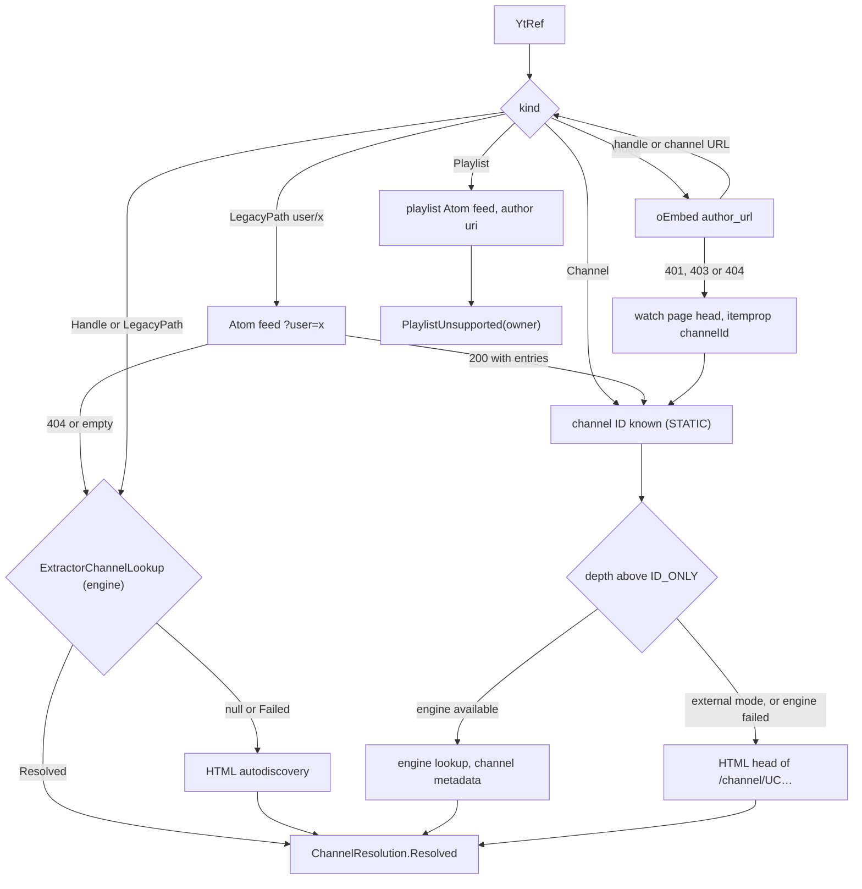
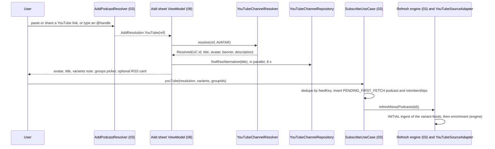
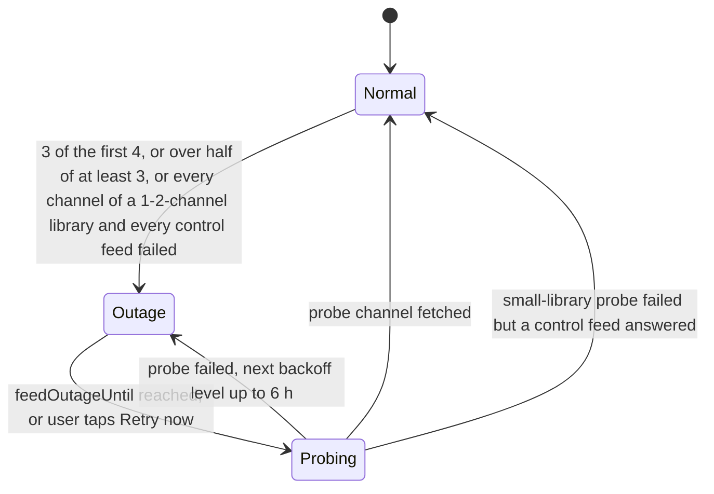
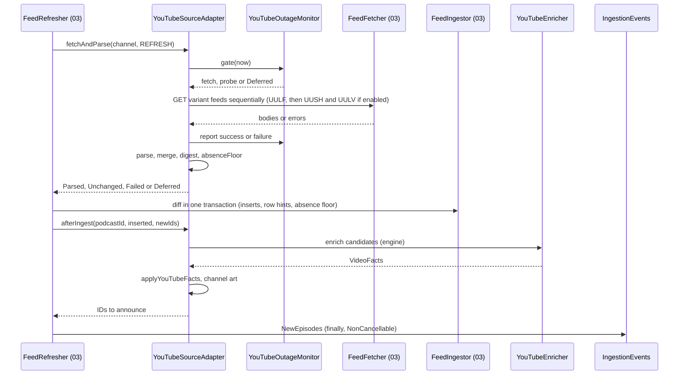
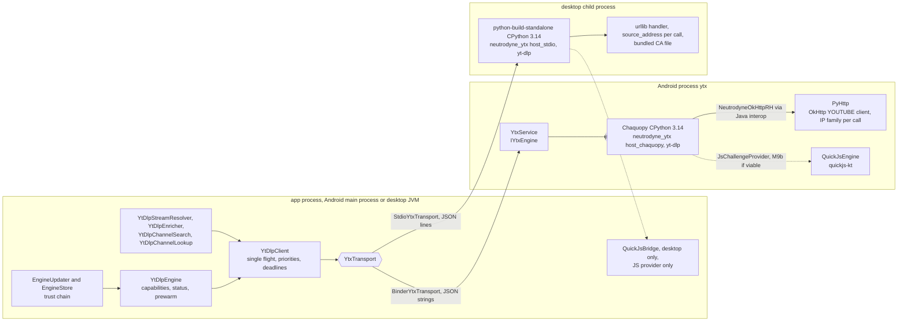
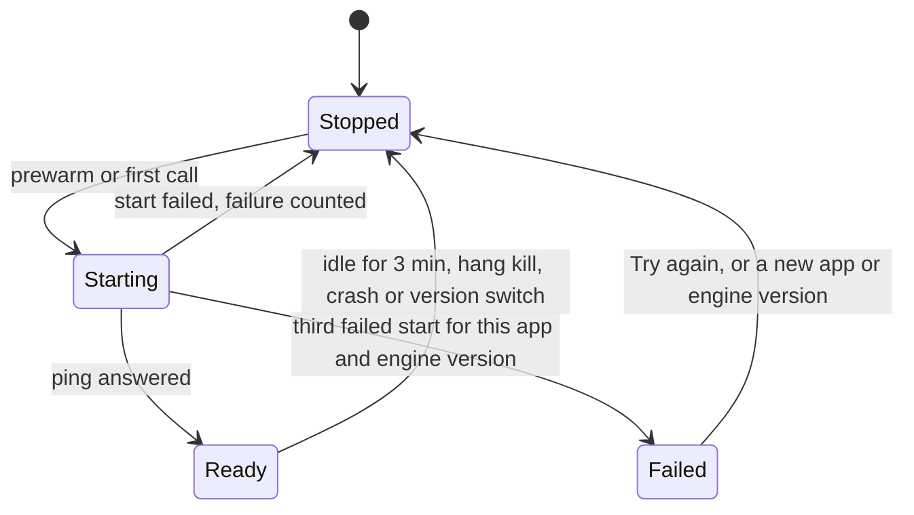
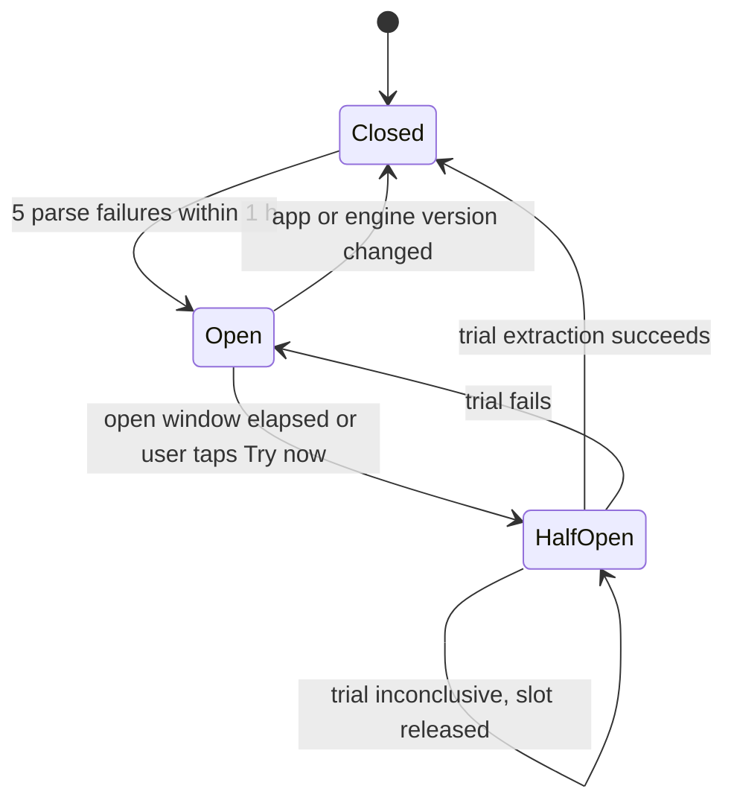
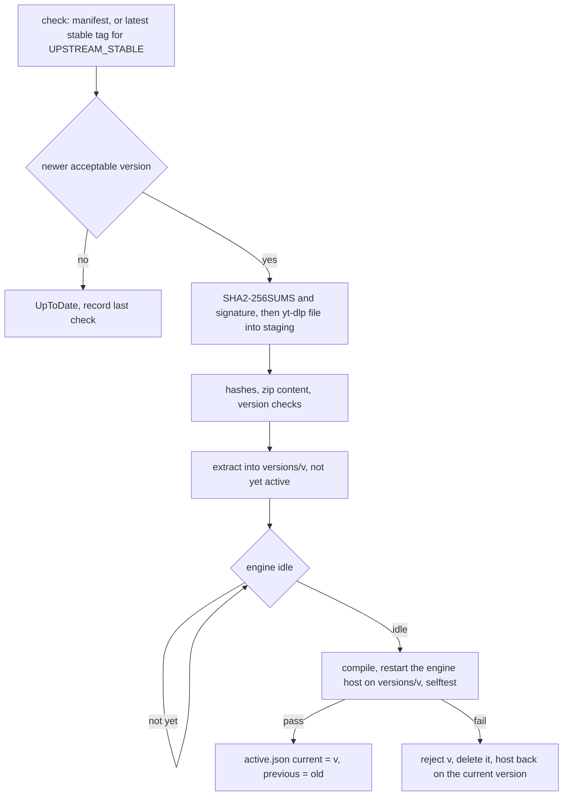

# 04 — YouTube channels as podcasts

> Status: Draft v1, 2026-10-04; revised 2026-10-05 for the product owner's decisions (embedded yt-dlp engine, no flavors, per-ABI APKs, GitHub Releases only, no GPL); revised 2026-10-05 for PO-31–PO-35 (engine updates resolved as Neutrodyne-approved and automatic; published APKs were then debug builds — superseded by S11 — signed with a public key, so the APK hotfix path ends at a normal GitHub release that the update check announces; engine-manifest key custody without an app-key ceremony; engine budgets on the published `arm64-v8a` APK); **scope revision 2026-10-05 (S0–S13): the YouTube engine gets a host abstraction — the host-independent engine logic (client, resolvers, mappers, capabilities, engine store, update orchestration and trust chain) becomes the JVM island `:youtube:engine` behind `YtxTransport` and a few host ports, served by the Android host (Chaquopy in `:ytx`, unchanged) and the desktop host (python-build-standalone CPython in a child process, owned by 11) with one shared shim, one method set, one trust chain and one canary gating both adapters; `:youtube:api` and `:youtube:impl` become common KMP code (Layer A on Ktor, no jsoup); the capability matrix gains the desktop; release builds replace the published debug builds (S11), so the debuggable-build reasoning, risks T18 and P11 and the 60/50 MB size budgets are gone; the licence boundary follows the new D3 and lists the desktop engine stack**; **final cross-document review 2026-10-05:** `:youtube:engine` exists from M9a, and D3 admits python-build-standalone's MPL-2.0 patches and VC++ DLLs (open questions 25 and 26 resolved; review 2026-10-06: 26 is a PO-48 proposed default, awaiting the owner) · Implements: R3.1–R3.9, R1.6, R5.8, R8.6 (shared engine parts) / N3, N5 (engine budgets PB18–PB21; PB29 shared with 11), N8, N11, N12 (engine updates) · Milestones: M0 (M0a), M2, M3, M4, M8, M9 (M9a, M9b), MD3, M11, M14 · Honours: D2, D3 (amended), D39, D45, D49, D50, D51, D52, D53, D61 (engine-manifest key), D64, D66, D67, D72–D77 (amended), D81, D82, D90, D93, D96; PO-1, PO-2 and PO-35 re-resolved, PO-32 (Neutrodyne-approved, automatic), PO-34 resolved, PO-40 (Windows on Arm runs the x64 build); PO-9, PO-24 defaults · Owns: the YouTube capability matrix (both platforms), `YouTubeCapabilitiesSource` and `ExternalReason`, the modules `:youtube:api`, `:youtube:impl`, `:youtube:engine` and `:youtube:ytdlp` (the desktop host `:youtube:ytdlp-desktop` is 11's), the engine host contract (`YtxTransport`, `EngineStorePaths`, the host ports), the shared shim `neutrodyne_ytx` and its method set, the Android host (Chaquopy, `:ytx` process and lifecycle, Binder API, OkHttp bridge), the JS challenge provider policy, channel resolution, YouTube Atom specifics, YouTube artwork sources, availability flags, enrichment and back catalogue, stream resolution and its contracts with playback and downloads, YouTube import formats, error handling and the circuit breaker, engine updates and their trust chain on both hosts, the engine canary's test content, the licence boundary of both engine stacks, and the engine-update and hotfix runbooks

Contents: [Scope](#scope) · [Capability matrix](#capability-matrix) · [Channel resolution](#channel-resolution) · [Atom feed ingestion](#atom-feed-ingestion) · [Artwork and thumbnails](#artwork-and-thumbnails) · [Content flags and filtering](#content-flags-and-filtering) · [YouTube engine](#youtube-engine) ([Shared engine module](#shared-engine-module)) · [Stream resolution](#stream-resolution) · [Playback integration](#playback-integration) · [Download integration](#download-integration) · [Import and export formats](#import-and-export-formats) · [Error handling and circuit breaker](#error-handling-and-circuit-breaker) · [Engine updates](#engine-updates) · [Licensing and legal](#licensing-and-legal) · [Maintenance and hotfix process](#maintenance-and-hotfix-process) · [Settings](#settings) · [Testing](#testing) · [Delivery by milestone](#delivery-by-milestone) · [Open questions](#open-questions) · [Sources](#sources)

---

## Scope

A YouTube channel is a `podcast` row with `sourceType = YOUTUBE_CHANNEL`. Everything that works on podcasts (groups, group feeds, counts, played state, positions, backup, OPML) works on channels unchanged ([R3.4](../PLAN.md#21-functional-requirements)). This document specifies only what is different. It is split along the two layers of [D51](../PLAN.md#3-key-decisions):

- **Layer A (every APK and every desktop build, Unlicense, common code):** turn any user input into a `UC…` channel ID; poll YouTube's public Atom feeds of the uploads playlists; channel avatar, banner and video thumbnails; YouTube import and export formats.
- **Layer B (the YouTube engine, [D72](../PLAN.md#3-key-decisions)–[D77](../PLAN.md#3-key-decisions), [D90](../PLAN.md#3-key-decisions)):** yt-dlp (Unlicense) running as a Python library in CPython behind Neutrodyne's shim, for audio stream URLs (playback and downloads), enrichment (durations, availability), `@handle` lookup, back catalogue and channel search. One engine, two hosts: on Android CPython is embedded by Chaquopy in the separate `:ytx` process; on the desktop python-build-standalone CPython runs as a child process ([11 Desktop YouTube engine host](11-desktop.md#desktop-youtube-engine-host)); everything above the host — client, resolvers, mappers, capabilities, engine store, updates and their trust chain — is one JVM island shared by both ([Shared engine module](#shared-engine-module)). The engine ships in the `arm64-v8a` and `x86_64` APKs and in every desktop build, and updates at runtime without an app release ([Engine updates](#engine-updates)). Without it — the `armeabi-v7a` APK, the engine turned off or unable to start, the emergency builds, every APK before M9a and every desktop build before MD3 — YouTube episodes are external episodes (**external mode**, [Capability matrix](#capability-matrix)).

### Responsibilities and boundaries

| This document owns | Owned elsewhere (link, do not restate) |
|---|---|
| `YouTubeCapabilitiesSource`, `ExternalReason` and every capability-dependent YouTube behaviour, on both platforms | Build types, ABI splits, the no-engine build switch, `YouTubeBindingsModule` and `DesktopYouTubeBindingsModule`, Gradle — [01 Build variants and ABIs](01-foundation.md#build-variants-and-abis), [01 YouTube bindings](01-foundation.md#youtube-bindings) |
| The engine host contract (`YtxTransport`, `EngineStorePaths`, host ports), the shared shim `neutrodyne_ytx` and its methods, `:youtube:engine` ([Shared engine module](#shared-engine-module)) | Source-set and island rules — [01 Source sets and JVM islands](01-foundation.md#source-sets-and-jvm-islands) |
| The Android host at runtime: `:ytx` lifecycle, Binder API (`IYtxEngine`), OkHttp bridge, `QuickJsEngine`; the M9a spike's results | Chaquopy build integration and spike S7, processes and start-up, the YOUTUBE client configuration — [01 S7 Chaquopy under AGP 9.4.1](01-foundation.md#s7-chaquopy-under-agp-941), [01 Application start-up](01-foundation.md#application-start-up), [01 One client family](01-foundation.md#one-client-family) |
| What the desktop host must meet (the contract, the methods, the trust chain, the capability rules) | The desktop host: CPython selection, trim list, child process, stdio framing, desktop engine paths, `QuickJsBridge`, PB29 measurement — [11 Desktop YouTube engine host](11-desktop.md#desktop-youtube-engine-host) |
| `YtRef` grammar, channel-ID resolution, subscribe-time YouTube branch | Add-podcast pipeline, `AddResolution`, `SubscribeUseCase` — [03 Add podcast flow](03-feeds-and-discovery.md#add-podcast-flow) |
| Variant URLs, Atom field mapping, merge, YouTube refresh policy, outage handling, enrichment | Generic Atom parsing, fetch pipeline, ingestion diff, refresh engine — [03 Parser](03-feeds-and-discovery.md#parser), [03 Ingestion and diff](03-feeds-and-discovery.md#ingestion-and-diff), [03 Refresh scheduling](03-feeds-and-discovery.md#refresh-scheduling) |
| Avatar, banner and thumbnail **sources and URL rules** | `ArtworkStore`, Coil, interceptor code, cropping — [08 Artwork pipeline](08-ui-ux.md#artwork-pipeline) |
| `Availability` semantics and which flags hide or exclude an episode | The `VISIBLE` SQL and every query — [02 Key queries](02-data-model.md#key-queries) |
| `YouTubeStreamResolver` contract, format selection, `ResolvedUrlCache`, error taxonomy, circuit breaker | Player, `EpisodeResolver`, `SimpleCache`, queue — [06 Media items and URI resolution](06-playback.md#media-items-and-uri-resolution); desktop `DesktopEpisodeSourceResolver` and `SpanCache` — [11 Desktop playback engine](11-desktop.md#desktop-playback-engine); download engine and state machine — [07 YouTube transfers](07-downloads.md#youtube-transfers) |
| NewPipe JSON, LibreTube JSON, Takeout CSV/ZIP, URL-list specs; YouTube OPML attributes | Import pipeline, preview, statuses, OPML structure — [05 OPML import](05-groups-opml-backup.md#opml-import), [05 Other import formats](05-groups-opml-backup.md#other-import-formats) |
| Engine updates, their trust chain and pinned keys on both hosts; what the engine canary tests | `engine-canary.yml` workflow, GitHub Pages deployment, environments and secrets — [09 engine-canary.yml](09-quality-and-release.md#engine-canaryyml); both Python lockfiles, licence allow-list, `verifyBundledYtDlp` — [01 Python and native components](01-foundation.md#python-and-native-components); the desktop runner of the update (`DesktopEngineUpdateLane`) — [11 Engine updates on the desktop](11-desktop.md#engine-updates-on-the-desktop) |
| Licence boundary of both engine stacks, notices, legal posture and emergency build, engine-update and hotfix runbooks | Licensee and SPDX tasks — [01 Licensing and dependency policy](01-foundation.md#licensing-and-dependency-policy); the desktop image scan and the runtime exception — [11 Packaging and the runtime exception](11-desktop.md#packaging-and-the-runtime-exception); CI, releases — [09 CI pipelines](09-quality-and-release.md#ci-pipelines), [09 Distribution channels](09-quality-and-release.md#distribution-channels); the Settings › YouTube screen — [08 Settings](08-ui-ux.md#settings) |
| Which YouTube data syncs (none of the engine) | The sync rules — [10 What syncs](10-sync.md#what-syncs), [10 Interaction with backup, retention and YouTube](10-sync.md#interaction-with-backup-retention-and-youtube) |

### Modules and public API

| Module | Package | Licence | Contents |
|---|---|---|---|
| `:youtube:api` (KMP, common only) | `ch.lkmc.neutrodyne.youtube.api` | Unlicense | `YtRef`, `YouTubeUrlClassifier`, all interfaces and data types below (including `YouTubeCapabilitiesSource` and `YouTubeEngine`), pure helpers `YouTubeIds`, `YouTubeFeedUrls`, `YouTubeEntryRules`, `YouTubeThumbnails`, `YouTubeChapters`, `AudioStreamSelector`; no `java.*` (the two exception types extend Okio's common `IOException`, which is `java.io.IOException` on the JVM, [Okio JVM platform](https://github.com/square/okio/blob/master/okio/src/jvmMain/kotlin/okio/-JvmPlatform.kt)) |
| `:youtube:impl` (KMP, `commonMain`) | `ch.lkmc.neutrodyne.youtube.impl` | Unlicense | Layer A on Ktor through 01's `NeutrodyneHttpClients`: `DefaultYouTubeChannelResolver`, `HtmlAutodiscoveryChannelResolver`, `ChannelPageParser` with `HeadTagScanner` (no HTML parser, [HTML autodiscovery](#html-autodiscovery)), `OEmbedClient`. External-only implementations: `ExternalOnlyYouTubeStreamResolver`, `NoOpYouTubeEnricher`, `UnsupportedYouTubeChannelSearch`, `NoExtractorChannelLookup`, `StaticYouTubeCapabilitiesSource`, `AbsentYouTubeEngine` (the one-time removal of leftover engine files runs from the shell's no-engine initializer, [DI bindings](#di-bindings)) |
| `:youtube:engine` (JVM island, `neutrodyne.jvm.island`, JVM 17; from M9a, [Shared engine module](#shared-engine-module)) | `ch.lkmc.neutrodyne.youtube.engine` | Unlicense | Host-independent engine logic: `YtxTransport`, `HostStatus`, `YtDlpClient`, `YtDlpEngine` (implements `YouTubeEngine` and `YouTubeCapabilitiesSource`), `YtDlpStreamResolver`, `YtDlpEnricher`, `YtDlpChannelSearch`, `YtDlpChannelLookup`, `YtDlpErrorMapper`, `YtDlpAudioMapper`, `ResolvedUrlCache`, `EngineStore` with `EngineStorePaths`, `EngineUpdater`, `EngineManifestVerifier`, `UpstreamReleaseVerifier`, `OpenPgpDetachedVerifier`, `Ed25519Verifier` and `JdkEd25519Verifier`, `EngineSelfTestRunner`, `EngineRollbackMonitor`, `EngineKeys`, `OkHttpEngineHttp` and the host ports (`EngineSettings`, `EngineHttp`, `EngineUpdateScheduler`, `EngineCompiler`, `IpFamilyHints`). They are written in this island from M9a (decided 2026-10-05, PLAN M9 and MD3, resolving Open question 25), so MD3 adds only the stdio host and moves no code |
| `:youtube:ytdlp` (Android library; the only module applying Chaquopy; AIDL on) — **Android host** | `ch.lkmc.neutrodyne.youtube.ytdlp`; code that runs in `:ytx`: `ch.lkmc.neutrodyne.youtube.ytdlp.ytx` | Unlicense (own Kotlin and Python); bundles yt-dlp (Unlicense) and the permissive engine stack ([Licence boundary](#licence-boundary)) | Main process: `BinderYtxTransport` (with its `YtxConnection`), `AndroidEngineStorePaths`, `EngineUpdateWorker`, `TinkEd25519Verifier`, `DataStoreEngineSettings`, `WorkManagerEngineUpdateScheduler`, the `YtxTestHooks` seam. `:ytx`: `YtxService`, `YtxPython`, `PyHttp`, `YtxCallRegistry`, `QuickJsEngine` (JS provider only). AIDL `IYtxEngine`, `IYtxCallback`; Chaquopy packaging of the shared shim (adapter `host_chaquopy.py`); the vendored yt-dlp release under `youtube/ytdlp/engine/`, which both hosts bundle ([Host and packaging](#host-and-packaging)) |
| `:youtube:ytdlp-desktop` (desktop library, JVM 25) — **desktop host**, owned by 11 | `ch.lkmc.neutrodyne.youtube.ytdlp.desktop` | Unlicense; bundles python-build-standalone CPython ([Licence boundary](#licence-boundary)) | `YtxProcess`, `StdioYtxTransport`, `PythonRuntimeLocator`, `DesktopEngineStorePaths`, `DesktopEngineUpdateLane`, `QuickJsBridge` (JS provider only); its implementations of the host ports; the shim adapter `host_stdio.py` with `bootstrap.py` ([11 Desktop YouTube engine host](11-desktop.md#desktop-youtube-engine-host)) |
| `:core:data` | `ch.lkmc.neutrodyne.core.data.youtube` | Unlicense | `commonMain`: `YouTubeSourceAdapter` (03's `SourceAdapter` for `YOUTUBE_CHANNEL`: variant fetch, merge, enrichment, channel art; rules in this document), `YouTubeOutageMonitor`, `DefaultYouTubeHealth`, `YouTubeAlertNotifier` (interface and wording), `YouTubeChannelRepositoryImpl`, `YouTubeAvailabilityRecorderImpl`; `androidMain`: `AndroidYouTubeAlertNotifier` (channel `alerts`), `YouTubeAlertActionReceiver`; on the desktop 11's `DesktopNotifier` implements `YouTubeAlertNotifier` ([11 Notifications](11-desktop.md#notifications)) |
| `:core:domain` | `ch.lkmc.neutrodyne.core.domain` | Unlicense | `YouTubeChannelRepository`, `YouTubeAvailabilityRecorder` |
| `:feeds` | `ch.lkmc.neutrodyne.feeds.youtube` | Unlicense | `NewPipeSubscriptions`, `LibreTubeBackupParser`, `TakeoutSubscriptionsParser`, `UrlListParser` (pure common code, raw strings out; classification happens in `:core:data`, rule 8 of [01 Dependency rules](01-foundation.md#dependency-rules)) |

YouTube Atom feeds are fetched and parsed by 03's generic engine in `:core:data`; no YouTube module parses Atom. No engine module binds `:youtube:api` interfaces itself; each shell's binding container does — `:app`'s `YouTubeBindingsModule`, `:desktopApp`'s `DesktopYouTubeBindingsModule` ([01 YouTube bindings](01-foundation.md#youtube-bindings), [01 Dependency injection](01-foundation.md#dependency-injection) rule 6); `:youtube:engine` and the two host modules contribute their internal wiring only (Metro). Only `:youtube:ytdlp` references Chaquopy, the AIDL interfaces or `:ytx` classes, and only `:youtube:ytdlp-desktop` starts a process; everything else reaches the engine through `:youtube:api`. `IpFamily` is declared in `:core:model` (not `:youtube:api`) so that `:core:network` can read it ([01 Interceptors](01-foundation.md#interceptors)); `ExternalReason` is declared there too, so that `:playback:api` (`UnplayableReason.YouTubeExternal`) and `:core:ui` (`ExternalReasonText`) can use it under 01's dependency rules 7 and 10. This document owns the values of both enums.

```kotlin
// :youtube:api — channel side
sealed interface YtRef {
    data class Channel(val id: String, val variantsHint: Int? = null) : YtRef   // "UC…", validated; hint from UU-prefix
    data class Handle(val handle: String) : YtRef                                // "@name", percent-decoded, NFC
    data class LegacyPath(val path: String) : YtRef                              // "c/name", "user/name", "name"
    data class Video(val id: String) : YtRef                                     // 11 chars
    data class Playlist(val id: String) : YtRef                                  // PL…, OLAK5uy_…, RD…: not subscribable (D53)
    data class Query(val text: String) : YtRef                                   // engine channel search only
}
class YouTubeUrlClassifier @Inject constructor() {
    fun classify(input: String): YtRef?          // null = not a subscribable YouTube input; never returns Query
    fun classifyOrQuery(input: String): YtRef    // YouTube search field: classify(input) ?: Query(input.trim())
    fun isYouTubeHost(url: String): Boolean      // lets 03 say "not a channel or video link" instead of fetching HTML
}
enum class MetadataDepth { ID_ONLY, AVATAR, FULL /* + banner */ }
interface YouTubeChannelResolver { suspend fun resolve(ref: YtRef, depth: MetadataDepth = MetadataDepth.AVATAR): ChannelResolution }
sealed interface ChannelResolution {
    data class Resolved(val channelId: String, val title: String?, val avatarUrl: String?, val bannerUrl: String?,
                        val description: String?, val via: ResolvedVia) : ChannelResolution
    data class PlaylistUnsupported(val playlistId: String, val ownerChannelId: String?, val ownerTitle: String?) : ChannelResolution
    data object NotFound : ChannelResolution
    data class Failed(val retryable: Boolean, val reason: FailReason, val cause: Throwable?) : ChannelResolution
}
enum class ResolvedVia { STATIC, USER_FEED, EXTRACTOR, HTML, OEMBED }   // EXTRACTOR = the engine's lookup
enum class FailReason { NETWORK, RATE_LIMITED, CONSENT_WALL, PAGE_UNREADABLE, NOT_A_CHANNEL_LINK }
interface ExtractorChannelLookup { suspend fun lookup(ref: YtRef, depth: MetadataDepth): ChannelResolution? } // null = unavailable
interface YouTubeChannelSearch { suspend fun search(query: String, cursor: SearchCursor? = null): ChannelSearchResult }
data class ChannelHit(val channelId: String, val title: String, val avatarUrl: String?, val subscriberCount: Long?,
                      val description: String?, val verified: Boolean)
sealed interface ChannelSearchResult {
    data class Ok(val hits: List<ChannelHit>, val next: SearchCursor?) : ChannelSearchResult
    data object Unsupported : ChannelSearchResult
    data class Failed(val kind: TransientKind) : ChannelSearchResult
}
class SearchCursor(val token: String)            // opaque token of a result generator held in the engine host; dies with it

// :youtube:api — capabilities (M2; reasons beyond NOT_YET_AVAILABLE from M9a on Android, MD3 on the desktop)
data class YouTubeCapabilities(val inAppPlayback: Boolean, val downloads: Boolean, val channelSearch: Boolean,
                               val enrichment: Boolean, val backCatalogue: Boolean,
                               val externalReason: ExternalReason?)        // null ⇔ all five true
// ExternalReason is declared in :core:model (01 places it; this document owns its values); shown here for completeness
enum class ExternalReason { NOT_YET_AVAILABLE /* APKs before M9a, desktop builds before MD3 */,
                            NOT_IN_THIS_APK /* armeabi-v7a, or an emergency no-engine build on either platform (name historical) */,
                            DISABLED_BY_USER /* youtube.engine_enabled = false */, ENGINE_FAILED /* 3 failed starts */ }
interface YouTubeCapabilitiesSource { val capabilities: StateFlow<YouTubeCapabilities> }   // never cache a snapshot
```

```kotlin
// :youtube:api — engine (status, pre-warm and update control for Settings › YouTube; implemented by YtDlpEngine in
// :youtube:engine (from M9a) and by AbsentYouTubeEngine in :youtube:impl; bound from M9a on Android,
// MD3 on the desktop; update members work from M9b, on the desktop from MD3)
interface YouTubeEngine {
    val status: StateFlow<EngineStatus>
    fun prewarm(reason: PrewarmReason)                      // starts the engine host (YtxTransport.prewarm); no-op without the engine
    suspend fun checkForUpdate(): EngineUpdateOutcome        // M9b; requests an immediate run (engine-update-now or the desktop lane) and awaits it
    suspend fun resetToBundled()                             // M9b
    fun retryStart()                                         // clears ENGINE_FAILED
}
data class EngineStatus(val availability: EngineAvailability, val activeVersion: String?, val bundledVersion: String?,
                        val source: EngineSource, val updatePolicy: EngineUpdatePolicy, val lastCheckAtMs: Long?,
                        val lastOutcome: EngineUpdateOutcome?, val jsChallenges: Boolean)
enum class EngineAvailability { STOPPED, STARTING, READY, NOT_IN_THIS_APK, DISABLED, FAILED }
enum class EngineSource { BUNDLED, UPDATED }
enum class EngineUpdatePolicy { APPROVED, UPSTREAM_STABLE, OFF }
enum class PrewarmReason { PROJECTION, SCREEN, DOWNLOAD, SEARCH }
sealed interface EngineUpdateOutcome { data object UpToDate; data class Staged(val version: String); data class Activated(val version: String)
    data class Rejected(val version: String?, val reason: EngineRejectReason); data class Failed(val kind: TransientKind) }
enum class EngineRejectReason { MANIFEST_SIGNATURE, MANIFEST_REPLAYED, UPSTREAM_SIGNATURE, HASH_MISMATCH, ORIGIN, BELOW_BUNDLED,
                                SHIM_INCOMPATIBLE, SIZE_CAP, SELFTEST_FAILED, ROLLED_BACK, REVOKED }
```

```kotlin
// :youtube:api — stream side (canonical signatures kept; members added: invalidateAll, TransientKind, availableAtMs)
interface YouTubeStreamResolver {
    suspend fun resolveAudio(videoId: String, pref: AudioPref): ResolveResult   // main-safe, cache-aware
    fun invalidate(videoId: String)
    fun invalidateAll()
}
sealed interface ResolveResult {
    data class Ok(val audio: ResolvedAudio) : ResolveResult
    data class Unavailable(val reason: Availability) : ResolveResult           // never AVAILABLE
    data class Transient(val cause: Throwable, val kind: TransientKind = TransientKind.NETWORK) : ResolveResult
    data object Unsupported : ResolveResult                                    // external mode (defensive: callers check capabilities)
}
enum class TransientKind { NETWORK, TIMEOUT, RATE_LIMITED, EXTRACTION, BREAKER_OPEN,
                           ENGINE_UNAVAILABLE /* the engine host (:ytx or the desktop child) died or could not start; callers treat it like TIMEOUT */ }
enum class AudioQuality(val ranks: List<Int>) {
    STANDARD(listOf(140, 251, 250, 139, 249)), DATA_SAVER(listOf(250, 249, 139, 140)), OPUS(listOf(251, 250, 140))
}
data class AudioPref(val quality: AudioQuality = AudioQuality.STANDARD, val preferDrc: Boolean = false,
                     val pinnedItag: Int? = null, val preferredLanguage: String? = null)
data class ResolvedAudio(
    val videoId: String, val url: String, val itag: Int, val formatId: String, val mimeType: String, val codecs: String?,
    val averageBitrate: Int?, val contentLength: Long?, val durationMs: Long?, val expiresAtMs: Long,
    val lastModifiedMicros: Long?, val isDrc: Boolean, val audioTrackId: String?, val trackLabel: String?,
    val ipFamily: IpFamily?,                                                   // enum in :core:model (01)
    val availableAtMs: Long?,                                                  // yt-dlp available_at (preroll wait); null = now
    val resolvedAtMs: Long,
) { override fun toString() = "ResolvedAudio($videoId, $formatId, expiresAt=$expiresAtMs)" } // url never printed
// okio.IOException: common expect class, typealias of java.io.IOException on the JVM, so Media3 and the desktop engine see an IOException
class YouTubeResolveException(val result: ResolveResult) : okio.IOException(result::class.simpleName)
class YouTubeFormatChangedException(val videoId: String, val oldFormatId: String, val newFormatId: String) : okio.IOException()
```

`formatId` identifies the bytes: `"{itag}"`, plus `-drc` for a DRC variant, plus `~{audioTrackId}` only when the response offers more than one audio track for that itag (YouTube reuses one itag for DRC and for every dubbed track; yt-dlp's own `format_id` names the DRC variant `251-drc`, which this scheme matches, [D52](../PLAN.md#3-key-decisions)). `YtDlpAudioMapper` derives it from the stream URL's `itag` and `xtags` rather than copying yt-dlp's `format_id` string ([Format selection](#format-selection)). A typical video therefore keeps the canonical cache key `yt:{videoId}:{itag}`; see [ResolvedUrlCache](#resolvedurlcache) and [Playback integration](#playback-integration).

```kotlin
// :youtube:api — enrichment, health
interface YouTubeEnricher {
    suspend fun enrich(channelId: String, videoIds: Set<String>, variants: Int): EnrichResult
    suspend fun uploadsPage(channelId: String, variant: Int, cursor: UploadsCursor?): UploadsPageResult
}
data class VideoFacts(val videoId: String, val title: String?, val publishedAtMs: Long?, val publishedApprox: Boolean,
                      val durationMs: Long?, val availability: Availability?, val isShort: Boolean?, val description: String?)
sealed interface EnrichResult {
    data class Ok(val facts: List<VideoFacts>) : EnrichResult
    data object Unsupported : EnrichResult
    data class Failed(val kind: TransientKind, val cause: Throwable?) : EnrichResult
}
class UploadsCursor(val token: String)           // opaque token of a tab generator held in the engine host; never persisted; dies with it
sealed interface UploadsPageResult {
    data class Ok(val items: List<VideoFacts>, val next: UploadsCursor?) : UploadsPageResult
    data object Unsupported : UploadsPageResult
    data class Failed(val kind: TransientKind) : UploadsPageResult
}
interface YouTubeHealth {
    val state: StateFlow<YouTubeHealthState>
    suspend fun awaitLoaded()                                      // persisted state read (AppInitializer); callers await once
    fun extractionGate(nowMs: Long): ExtractionGate               // non-suspending, in-memory
    fun reportExtraction(outcome: ExtractionOutcome)
    fun reportRateLimited(nowMs: Long)                             // engine bot check or googlevideo 429
    fun reportFeedOutage(nowMs: Long)                              // YouTubeOutageMonitor: outage declared or probe failed
    fun reportFeedRecovered()                                      // probe or any feed fetch succeeded
    fun reportFeedRateLimited(nowMs: Long, retryAfterMs: Long?)    // Atom 429 / 403
    fun reportEngineVersion(version: String?)                      // YtDlpEngine at load and on every switch (M9a, MD3)
    fun retryNow()                                                 // user action ("Try now", "Retry now")
}
data class YouTubeHealthState(val breaker: BreakerState, val breakerOpenUntil: Long?, val rateLimitedUntil: Long?,
                              val feedOutageUntil: Long?, val feedOutageLevel: Int, val feedRateLimitedUntil: Long?)
enum class BreakerState { CLOSED, OPEN, HALF_OPEN }
sealed interface ExtractionGate { data object Allow : ExtractionGate; data object AllowTrial : ExtractionGate
                                  data class Deny(val untilMs: Long, val kind: TransientKind) : ExtractionGate }
sealed interface ExtractionOutcome {
    data object Success : ExtractionOutcome
    data class ParseFailure(val videoId: String?) : ExtractionOutcome
    data class ForbiddenFreshUrl(val videoId: String) : ExtractionOutcome   // 403/410 on a URL resolved < 2 min ago
    data object Inconclusive : ExtractionOutcome                           // network, timeout, rate limit, cancelled, engine unavailable
}
```

```kotlin
// :core:domain
interface YouTubeChannelRepository {
    suspend fun setVariants(podcastId: Long, variants: Int)              // writes podcast.youtubeVariants, refreshNow(Podcasts(id))
    suspend fun ensureChannelArt(podcastId: Long)                        // lazy banner, avatar older than 30 days
    suspend fun loadOlder(podcastId: Long): LoadOlderResult              // back catalogue (engine)
    suspend fun findRssAlternative(channelTitle: String): RssAlternative? // PO-9 "prefer the real RSS feed"
    suspend fun recheckAvailability(episodeId: Long): Availability?      // "Check again" (engine); null = could not tell
}
sealed interface LoadOlderResult { data class Loaded(val inserted: Int, val hasMore: Boolean) : LoadOlderResult
    data object Unsupported : LoadOlderResult; data class Failed(val kind: TransientKind) : LoadOlderResult }
data class RssAlternative(val feedUrl: String, val title: String, val artworkUrl: String?, val provider: String)
interface YouTubeAvailabilityRecorder { suspend fun record(episodeId: Long, availability: Availability) }
```

### Threading and coroutines

| Component | Thread rules |
|---|---|
| `YouTubeUrlClassifier`, all `:youtube:api` helpers | Pure, synchronous, thread-safe; no I/O. Callable from the main thread |
| Every `suspend` API above | Main-safe. Network and engine calls on `@Dispatcher(IO)`. Errors through `suspendRunCatching` (never swallows `CancellationException`) |
| `YtDlpClient` (`:youtube:engine`) | Calls `YtxTransport.call` ([Shared engine module](#shared-engine-module)): Android's `BinderYtxTransport` returns from `IYtxEngine.call` as soon as `:ytx` has queued the call and completes a `CompletableDeferred` from the oneway `IYtxCallback`; the desktop's `StdioYtxTransport` writes one line and its reader thread completes the call ([11 Stdio protocol](11-desktop.md#stdio-protocol)). Coroutine cancellation (timeout, skipped item, closed screen) makes the transport send the host's cancel for that call (Android: `IYtxEngine.cancel(callId)`, which cancels the call's OkHttp `Call`s in `:ytx` and sets the shim's cancel flag; desktop: a `cancel` line that sets the flag, checked before every request). A call still running 5 s after its deadline makes the transport kill the host and fail that call with `Transient(TIMEOUT)`; the other calls in flight end `Transient(ENGINE_UNAVAILABLE)` ([Process and lifecycle](#process-and-lifecycle); desktop [11 Process model](11-desktop.md#process-model)) |
| `:ytx` (Android) | Started lazily by the first bind (pre-warm or call), never by `Application.onCreate` (01 runs no initializers there): `YtxPython` calls `Python.start` once, puts the active engine version on `sys.path` and imports yt-dlp. Binder threads only enqueue; **2 Python worker threads** execute calls (Chaquopy releases the GIL whenever Python calls a Java method, [Chaquopy Python API](https://github.com/chaquo/chaquopy/blob/master/product/runtime/docs/sphinx/python.rst), so OkHttp I/O of one call never blocks the other) |
| Desktop child (11) | Started lazily by the first call or pre-warm; a pool of **4 worker threads** in `host_stdio.py`; urllib I/O releases the GIL ([11 Process model](11-desktop.md#process-model)) |
| Timeouts | `resolveAudio` 20 s (25 s when the engine host is not running yet, so the first call can pay the cold start); channel resolution 20 s overall; `enrich` 20 s per channel; `search` 10 s (15 s cold); `uploadsPage` 20 s (`withTimeout` → `Transient(TIMEOUT)`); resolves that may take the JS path in background contexts (07 transfers, "Check again") 45 s ([JS challenge provider](#js-challenge-provider)). Identical on both hosts |
| Single flight | Concurrent `resolveAudio` calls with the same cache key share one `Deferred` (pre-resolve and playback race), started on `@ApplicationScope` with a waiter count; it is cancelled (and its host call with it) when the last waiter is cancelled, so one caller's cancellation never fails another |
| Concurrency caps | Enrichment: `Semaphore(2)` across channels. Downloads: 07's YouTube slot 1. Channel resolution during import: 2 concurrently (the same 2-per-host limit 03 applies to `www.youtube.com`, [D25](../PLAN.md#3-key-decisions)). Playback resolves: no cap beyond single flight. Search: latest wins (previous job cancelled). Engine host: `YtDlpClient` admits at most `HostStatus.workers` calls at once (Android 2, desktop 4) and queues the rest by priority (`resolve`, then `lookup` and `search_*`, then `facts` and `tab_*`), FIFO within a priority, so both hosts schedule alike |
| `ResolvedUrlCache` (`:youtube:engine`) | `ConcurrentHashMap`, read from Media3's loader thread (Android) and the desktop engine's loader thread ([11 Sources and SpanCache](11-desktop.md#sources-and-spancache)) |
| `YouTubeHealth` | `MutableStateFlow`; loaded from `device_settings` by an `AppInitializer` (01's initializer set, both shells; `awaitLoaded()` suspends until then); persistence launched on `@ApplicationScope`, conflated |
| `YtDlpEngine` (`:youtube:engine`) | Capabilities and `EngineStatus` in `MutableStateFlow`s, loaded by the order-150 `AppInitializer` from `EngineSettings` and the engine store's `active.json` (Android `noBackupFilesDir/ytdlp/`, desktop `<data>/ytdlp/`; [01 Application start-up](01-foundation.md#application-start-up)); loading never starts the engine host |

### New names introduced here

| Name | Kind / location | Purpose |
|---|---|---|
| `MetadataDepth`, `ResolvedVia`, `FailReason`, `ChannelResolution.{Resolved, PlaylistUnsupported, NotFound, Failed}` | `:youtube:api` | Shape of the canonical `ChannelResolution` |
| `ExtractorChannelLookup`, `YouTubeChannelSearch`, `ChannelHit`, `ChannelSearchResult`, `SearchCursor` | `:youtube:api`; engine-backed or external-only | Engine channel lookup and search |
| `YouTubeCapabilitiesSource`, `YouTubeCapabilities.externalReason` | `:youtube:api` | Runtime capability state ([Capability matrix](#capability-matrix)) |
| `ExternalReason` | `:core:model` (placed by 01; values owned here) | Why YouTube is in external mode; used by `:playback:api` and `:core:ui` |
| `YouTubeEngine`, `EngineStatus`, `EngineAvailability`, `EngineSource`, `EngineUpdatePolicy`, `PrewarmReason`, `EngineUpdateOutcome`, `EngineRejectReason` | `:youtube:api` | Engine status, pre-warm and update control |
| `AudioQuality`, `AudioPref` fields, `ResolvedAudio` (incl. `formatId`, `availableAtMs`), `TransientKind` (incl. `ENGINE_UNAVAILABLE`), `YouTubeResolveException`, `YouTubeFormatChangedException` | `:youtube:api` | Stream contract |
| `IpFamily` | `:core:model` (placed by 01) | googlevideo IP family |
| `VideoFacts`, `EnrichResult`, `UploadsCursor`, `UploadsPageResult` | `:youtube:api` | Enrichment and back catalogue |
| `YouTubeHealth` (incl. `reportEngineVersion`), `YouTubeHealthState`, `BreakerState`, `ExtractionGate`, `ExtractionOutcome` | `:youtube:api`; impl `DefaultYouTubeHealth` in `:core:data` | Breaker, rate limit, feed outage |
| `YouTubeIds`, `YouTubeChapters`, `ChapterSpec`, `AudioCandidate`, `AudioStreamSelector`, `YtEntry`, `VariantResult`, `VariantUrl`, `MergedChannel`, `ThumbVariant`, `BannerSource` | `:youtube:api` (common) | Pure helpers and their data types (`ResolvedUrlCache` moved to `:youtube:engine` 2026-10-05: it uses `ConcurrentHashMap`) |
| `DefaultYouTubeChannelResolver`, `ChannelPageParser`, `HeadTagScanner`, `NoOpYouTubeEnricher`, `UnsupportedYouTubeChannelSearch`, `NoExtractorChannelLookup`, `StaticYouTubeCapabilitiesSource`, `AbsentYouTubeEngine` | `:youtube:impl` (common) | Layer A and the external-only implementations (the last two named by [01 YouTube bindings](01-foundation.md#youtube-bindings)); `HeadTagScanner` replaces jsoup (2026-10-05) |
| `YtDlpEngine`, `YtDlpClient`, `YtDlpStreamResolver`, `YtDlpEnricher`, `YtDlpChannelSearch`, `YtDlpChannelLookup`, `YtDlpErrorMapper`, `YtDlpAudioMapper`, `ResolvedUrlCache` | `:youtube:engine` (from M9a; package `…youtube.engine`), M9a | Layer B, host-independent |
| `YtxTransport`, `HostStatus`, `HostState`, `HostKind`, `HostExit`, `YtxCallException`; ports `EngineStorePaths`, `EngineSettings`, `EngineHttp` (with `OkHttpEngineHttp`), `EngineUpdateScheduler`, `EngineCompiler`, `IpFamilyHints`, `Ed25519Verifier` (with `JdkEd25519Verifier`) | `:youtube:engine` (same placement), M9a; `Ed25519Verifier` M9b | The engine host contract ([Shared engine module](#shared-engine-module)) |
| `EngineStore`, `EngineUpdater`, `EngineManifestVerifier`, `UpstreamReleaseVerifier`, `OpenPgpDetachedVerifier`, `EngineSelfTestRunner` (was `EngineSelfTest`), `EngineRollbackMonitor`, `EngineKeys` | `:youtube:engine` (same placement); `EngineStore` M9a, the rest M9b | [Engine updates](#engine-updates) |
| `BinderYtxTransport` (with its internal `YtxConnection`), `AndroidEngineStorePaths`, `DataStoreEngineSettings`, `WorkManagerEngineUpdateScheduler`, `EngineUpdateWorker`, `TinkEd25519Verifier` | `:youtube:ytdlp`, main process; M9a (`EngineUpdateWorker`, `TinkEd25519Verifier`: M9b) | Android host side of the contract (`YtDlpModule` of the Hilt design retired: Metro contributions, [01 Dependency injection](01-foundation.md#dependency-injection)) |
| `YtxService`, `YtxPython`, `PyHttp`, `YtxCallRegistry`, `QuickJsEngine` | `:youtube:ytdlp`, package `…youtube.ytdlp.ytx`, process `:ytx` | Android engine host ([YouTube engine](#youtube-engine)) |
| `IYtxEngine`, `IYtxCallback` | AIDL in `:youtube:ytdlp` | [Binder API](#binder-api) |
| Python package `neutrodyne_ytx`: shared `bridge.py`, `errors.py`, `selftest.py`, `jsc_quickjs.py` (`NeutrodyneQuickJsJCP`), constant `SHIM_API_VERSION = 1`; host adapters `host_chaquopy.py` (with `okhttp_rh.py`, `NeutrodyneOkHttpRH`) and `host_stdio.py` (with `bootstrap.py`, 11); test-only `RecordingRH`, `ReplayRH` | `youtube/engine/python/neutrodyne_ytx/` (moved from `youtube/ytdlp/src/main/python/`), tests in `youtube/engine/python/tests/` | Engine shim for both hosts ([Shared engine module](#shared-engine-module)) |
| `FakeYtxTransport` (replaces `FakeYtDlpClient`) | `:youtube:engine` test sources (from M9a) | JVM tests on recorded shim output through the real `YtDlpClient` ([Recorded responses](#recorded-responses)) |
| `YtxTestHooks` (`@VisibleForTesting` object with `replayDir: File?`; kept by `youtube/ytdlp/consumer-rules.pro`) | `:youtube:ytdlp` main sources (main process) | E7 seam: set by 09's `YouTubeReleaseSmokeTest` when the instrumentation argument `ytxReplay` is present; inert unless an instrumentation test sets it, so it stays in `main` of the release build (N7) ([Process and lifecycle](#process-and-lifecycle)) |
| `YouTubeChannelRepository`, `LoadOlderResult`, `RssAlternative`, `YouTubeAvailabilityRecorder` | `:core:domain` | Feature-facing YouTube operations |
| `YouTubeSourceAdapter`, `YouTubeOutageMonitor` | `:core:data` (names from 03) | YouTube rules on 03's engine |
| `YouTubeFeedUrls.CONTROL_CHANNEL_IDS`, `YouTubeOutageMonitor.onRunFinished()` (review 2026-10-06) | `:youtube:api`, `:core:data` | Small-library control check and run accounting ([Errors and global outage](#errors-and-global-outage)) |
| `YouTubeAlertNotifier`, `AndroidYouTubeAlertNotifier`, `YouTubeAlertActionReceiver`, `YouTubeChannelRepositoryImpl`, `YouTubeAvailabilityRecorderImpl` | `:core:data` (common; the Android notifier and the receiver in `androidMain`; the desktop implementation is 11's `DesktopNotifier`) | YouTube services (the receiver handles the Android breaker notice's actions) |
| `AdapterResult.Parsed.absenceFloor`, `AdapterResult.Deferred`, `SourceAdapter.afterIngest` returning the IDs to announce | additions to 03's internal adapter contract (adopted by 03, [03 Source adapters](03-feeds-and-discovery.md#source-adapters)) | [Contract with 03's engine](#contract-with-03s-engine) |
| `UrlListParser`; DTOs `NewPipeSubscriptionsFile`, `LibreTubeBackupFile`, `TakeoutRow`, `YouTubeImportEntry` | `:feeds` | Import formats |
| `ImportFormat.URL_LIST` | enum constant appended to the canonical `ImportFormat` (defined in 02, pipeline in 05) | Plain list of URLs or IDs |
| `podcast.channelMetadataAt` | column `Long?` ([02 podcast](02-data-model.md#podcast)) | Last channel-page or engine metadata fetch; null = never |
| `IngestDao.applyYouTubeFacts`, `EpisodeDao.youtubeEnrichmentCandidates`, `EpisodeDao.setAvailability`, `PodcastDao.applyYouTubeChannelMetadata` | DAO functions ([02 Ingestion support](02-data-model.md#ingestion-support)) | Writes described in [Atom feed ingestion](#atom-feed-ingestion) |
| `DnsFamilyHints` | `:core:network:okhttp` (requested from 01; reached from `:youtube:engine` through the `IpFamilyHints` port) | googlevideo IP-family matching ([Stream resolution](#ip-family-matching)) |
| `NOTIF_ID_YT_BREAKER = 4100` | notification ID on channel `alerts` (Android); the desktop notifier reuses it as its replace ID | Breaker notice |
| `youtube.*` keys | [Settings](#settings) | — |
| `PodcastDao.youtubeChannelIds()` | DAO function (requested from 02) | "Retry now" refresh scope; `totalSubscribed` of `onRunFinished()` |
| `engine-prepare` (M9a), `engine-update`, `engine-update-now` (M9b) | WorkManager unique work (`:youtube:ytdlp`); the desktop's lane `engine-update` (11) does the same jobs | [Host and packaging](#host-and-packaging), [Update flow](#update-flow) |
| `youtube/ytdlp/engine/{yt-dlp, SHA2-256SUMS, SHA2-256SUMS.sig, bundled.json}`, `youtube/ytdlp/keys/{yt-dlp-release-key.asc, engine-manifest-ed25519.pub}` (both read by both hosts' builds); `youtube/engine/src/test/resources/recorded/{scenario}/` (moved from `youtube/ytdlp/src/test/resources/recorded/`); on Android `noBackupFilesDir/ytdlp/{active.json, versions/, staging/}`, `cacheDir/yt-dlp/`; on the desktop `<data>/ytdlp/…`, `<cache>/engine-cache/yt-dlp/` (11) | repository and device files | [Host and packaging](#host-and-packaging), [Engine updates](#engine-updates), [Recorded responses](#recorded-responses) |
| `scripts/youtube/record-responses.sh`, `scripts/engine/{bump-ytdlp.sh, make-engine-manifest.sh, sign-engine-manifest.sh}`; nightly jobs `youtube-canary`, `engine-nightly-canary`, `no-engine-build`; the test content of `engine-canary.yml` (both host adapters) | repository files / 09 jobs and workflows | Recorded responses, engine canary, emergency build |

---

## Capability matrix

Serves R3.1–R3.9, R8.6, N8. Delivered in M2 (`YouTubeCapabilitiesSource`), M8 (layer A on every APK and desktop build, external mode), M9a (the engine on Android), MD3 (the engine on the desktop). Honours [D2](../PLAN.md#3-key-decisions), [D51](../PLAN.md#3-key-decisions), [D77](../PLAN.md#3-key-decisions), [D90](../PLAN.md#3-key-decisions), [PO-2](../PLAN.md#po-2-distribution-channels), [PO-40](../PLAN.md#48-further-product-owner-decisions).

There are no build flavors. What YouTube can do is a **runtime capability** of the installed APK or desktop build and its state, read from `YouTubeCapabilitiesSource`; feature code never reads the ABI, the platform, `BuildConfig` or the build switch. **With the engine** = the `arm64-v8a` or `x86_64` APK from M9a on, or any desktop build from MD3 on, with the engine turned on and able to start. **External mode** = everything else: the `armeabi-v7a` APK, the emergency builds without the engine, every APK before M9a and every desktop build before MD3, the engine turned off in Settings › YouTube, or an engine that failed to start three times or whose host is unusable ([Capability computation](#capability-computation)).

| Build | Engine | `externalReason` when the engine is absent |
|---|---|---|
| `arm64-v8a`, `x86_64` APKs, from M9a | Chaquopy CPython in `:ytx` | — |
| `armeabi-v7a` APK | none (no CPython ≥ 3.12 for 32-bit ARM, [D77](../PLAN.md#3-key-decisions)) | `NOT_IN_THIS_APK` |
| Every desktop build, from MD3: Windows x64 (also on Windows 11 on Arm, emulated, [PO-40](../PLAN.md#48-further-product-owner-decisions)), macOS arm64, Linux x64 and arm64 | python-build-standalone CPython child process ([11](11-desktop.md#desktop-youtube-engine-host)) | — |
| Emergency builds (`-Pneutrodyne.youtubeEngine=false`, APKs and desktop images) | none | `NOT_IN_THIS_APK` (desktop wording "This build has no YouTube engine", 08) |
| APKs before M9a; desktop builds before MD3 | none | `NOT_YET_AVAILABLE` (desktop wording "not yet available on this computer", 08) |

| Capability | With the engine | External mode | Desktop | Mechanism |
|---|---|---|---|---|
| Subscribe by URL, share, `@handle`, OPML, NewPipe, LibreTube, Takeout, URL list | Yes | Yes | Same; "share" means paste, drag and drop, links handed over by the OS ([03 Add podcast flow](03-feeds-and-discovery.md#add-podcast-flow)) | Layer A resolution (engine lookup first when available) |
| Subscribe by typing a channel name | Yes | No — "share it from the YouTube app or paste its link" | Same (external-mode hint: "paste its link") | `YouTubeChannelSearch` |
| Listing, avatar, banner, thumbnails, groups, group feeds, counts, played state, positions, backup | Yes | Yes | Same | Atom + 03/05 |
| Durations; live / upcoming / members flags; premiere hold-back | Yes (enrichment + resolve) | No: duration "—", items appear as soon as listed | Same | `YouTubeEnricher` |
| In-app audio playback, background, lock screen, Bluetooth, queue, sleep timer, chapters | Yes | **No** — "Watch on YouTube" | Same; the OS media controls (SMTC, Now Playing, MPRIS) replace notification and lock screen ([11 OS integration](11-desktop.md#os-integration)) | `YouTubeStreamResolver` |
| Play group / context tail / Android Auto browse | Included (only `AVAILABLE`) | Excluded | Same, without a car surface | `youtubePlayable` in [02 Play context](02-data-model.md#play-context) |
| Manual download, auto-download, "Download all" in a group | Yes (keep 2 default when on) | **No**; existing YouTube rows wait or end per [Engine absent or disabled](#engine-absent-or-disabled) | Same, through the desktop download lanes ([07 Desktop runners](07-downloads.md#desktop-runners)) | `YouTubeTransferSource` |
| Back catalogue beyond the newest 15 | "Load older" | No | Same | `YouTubeEnricher.uploadsPage` |
| "Watch on YouTube" | Overflow action (with `&t=` position) | Primary action; marks played (setting) | Opens the default browser | `ACTION_VIEW` (Android), `ExternalUrlOpener` (desktop) |
| Engine version, engine updates, "Reset to bundled" (R3.9) | Yes | Version shown for `DISABLED_BY_USER` and `ENGINE_FAILED`; nothing for `NOT_IN_THIS_APK` and `NOT_YET_AVAILABLE` | Same | `YouTubeEngine` |
| NewPipe JSON export, OPML export of channels | Yes | Yes | Same | [Import and export formats](#import-and-export-formats) |
| "Prefer the show's RSS feed" suggestion | Yes | Yes | Same | Apple / fyyd search (03) |
| SponsorBlock, video mode, playlists | v1.x (M14) | No (playlists: v1.x in both modes) | Same (desktop video: M17) | — |

**R3 is fully delivered with the engine**, on Android and on the desktop (R8.6). External mode delivers R3.1 (links only), R3.2 (without premiere hold-back and flags), R3.3, R3.4 and R3.7; R3.5, R3.6, R3.8 and R3.9 need the engine (PLAN [PO-2](../PLAN.md#po-2-distribution-channels)). Every desktop build carries the engine, so on the desktop external mode means only "turned off", "failed", "emergency build" or "before MD3". Sync carries YouTube channels and their user state between a device with the engine and one in external mode unchanged; the external device keeps synced YouTube Up next items and sessions greyed and never projects them ([10 Interaction with backup, retention and YouTube](10-sync.md#interaction-with-backup-retention-and-youtube)).

### Capability computation

`YtDlpEngine` (the default builds' `YouTubeCapabilitiesSource`, from M9a on Android and MD3 on the desktop) evaluates these rows in order; the first match wins. The external-only bindings publish a fixed reason.

| Condition | `externalReason` | `EngineStatus.availability` |
|---|---|---|
| Bindings of an APK before M9a or a desktop build before MD3: `StaticYouTubeCapabilitiesSource(NOT_YET_AVAILABLE)` | `NOT_YET_AVAILABLE` | — (`YouTubeEngine` is bound from M9a / MD3) |
| Emergency build (`-Pneutrodyne.youtubeEngine=false`, either platform): `StaticYouTubeCapabilitiesSource(NOT_IN_THIS_APK)`, `AbsentYouTubeEngine` | `NOT_IN_THIS_APK` | `NOT_IN_THIS_APK` |
| `BuildInfo.youTubeEngineBundled == false` (Android: the `armeabi-v7a` APK, or any 32-bit process: `BuildConfig.YOUTUBE_ENGINE && Process.is64Bit()` is false; desktop: never in a default build) | `NOT_IN_THIS_APK` | `NOT_IN_THIS_APK` |
| `youtube.engine_enabled == false` | `DISABLED_BY_USER` | `DISABLED` |
| `youtube.engine_start_failures ≥ 3` for this app version and engine version, or the host reports `HostState.UNUSABLE` (desktop: the bundled interpreter is missing or not executable, for example quarantined by antivirus, [11 Host failure modes](11-desktop.md#host-failure-modes)) | `ENGINE_FAILED` | `FAILED` |
| otherwise | `null`: all five capabilities `true` | `STOPPED`, `STARTING` or `READY` (from `HostStatus.state`; `COMPILING` shows as `STARTING`) |

Capabilities are all-or-nothing in v1 (`externalReason == null` ⇔ all five `true`): every capability needs the engine, and partial states would multiply UI cases. Transient engine trouble — a host crash, a hang, a rate limit, an open breaker — never changes capabilities; it surfaces as `Transient(…)` results and status lines. Only the persistent conditions above do. `ENGINE_FAILED` clears on `retryStart()` ("Try again", which also re-checks an unusable host), on a new app version and on the activation of another engine version.

`capabilities` changes while the app runs (switch toggled, third failed start, "Try again"). Consumers observe it and never cache a snapshot:

- 06: `QueueProjector` re-diffs (on the desktop 11's `DesktopQueueProjector`); YouTube items that became external leave the projection window, their Up next rows stay. The flip does not stop the current item by itself; its next resolve answers `Unsupported` ([06 YouTube branch](06-playback.md#youtube-branch)).
- 07: every claim reads `capabilities.downloads`; YouTube rows wait as `QUEUED(YOUTUBE_ENGINE_OFF)` or are ended by the reconciler, per reason ([Engine absent or disabled](#engine-absent-or-disabled)).
- 02/05/08: callers of the context-tail queries re-run them (`youtubePlayable`); rows, Discover and Settings re-render.
- Turning the engine off stops the engine host at once (`YtxTransport.shutdown()`) and skips engine updates until it is turned on again; turning it on needs no restart.

### DI bindings

Bound only in the shells' YouTube binding containers — `:app`'s `YouTubeBindingsModule` and `:desktopApp`'s `DesktopYouTubeBindingsModule` ([01 YouTube bindings](01-foundation.md#youtube-bindings)); `YouTubeChannelResolver` (→ `DefaultYouTubeChannelResolver`, `:youtube:impl`), `YouTubeHealth` (→ `DefaultYouTubeHealth`, `:core:data`), `YouTubeChannelRepository` and `YouTubeAvailabilityRecorder` (`:core:data`) are capability-independent bindings contributed by their modules (Metro), the same on both platforms. The host ports of [Shared engine module](#shared-engine-module) are contributed by the host modules, never by the shells' containers.

| Interface | Engine-backed (default builds: APKs from M9a, desktop builds from MD3; serves every build and state) | External-only (before M9a / MD3; emergency builds) |
|---|---|---|
| `YouTubeCapabilitiesSource` | `YtDlpEngine` ([Capability computation](#capability-computation)) | `StaticYouTubeCapabilitiesSource(NOT_YET_AVAILABLE or NOT_IN_THIS_APK)` (all five `false`) |
| `YouTubeEngine` | `YtDlpEngine` (same `@SingleIn(AppScope)` instance) | `AbsentYouTubeEngine` (status `NOT_IN_THIS_APK`; `prewarm` no-op; update members return `UpToDate` and are never offered by 08); emergency builds only. On the first start after it replaced a build with the engine, the shell's no-engine initializer (order 300, [01 Emergency build without the engine](01-foundation.md#emergency-build-without-the-engine)) deletes the leftover engine files once if they exist — Android `noBackupFilesDir/ytdlp/` and `cacheDir/yt-dlp/`, desktop `<data>/ytdlp/` and `<cache>/engine-cache/` (idempotent, on IO, in the housekeeping band; a later build with the engine re-extracts its bundled version). On the `armeabi-v7a` APK of a default build `YtDlpEngine` does the same cleanup when `BuildInfo.youTubeEngineBundled` is false |
| `YouTubeStreamResolver` | `YtDlpStreamResolver` | `ExternalOnlyYouTubeStreamResolver` (always `Unsupported`, `invalidate*` no-ops) |
| `YouTubeEnricher` | `YtDlpEnricher` | `NoOpYouTubeEnricher` (`Unsupported`) |
| `YouTubeChannelSearch` | `YtDlpChannelSearch` | `UnsupportedYouTubeChannelSearch` |
| `ExtractorChannelLookup` | `YtDlpChannelLookup` | `NoExtractorChannelLookup` (returns `null`) |

The engine-backed implementations also serve the `armeabi-v7a` APK and the off or failed states: each checks capabilities first and then answers exactly like its external-only counterpart (`Unsupported`, `null`) without starting the engine host. Each binding exists from the milestone of its first consumer on both shells (`YouTubeCapabilitiesSource` M2, `YouTubeStreamResolver` → `ExternalOnlyYouTubeStreamResolver` M4, enricher, search and lookup M8, `YouTubeEngine` and the engine-backed set M9a on Android and MD3 on the desktop), per 01's binding timeline ([01 YouTube bindings](01-foundation.md#youtube-bindings)).

### Capability consumers

| Flag | Consumers |
|---|---|
| `inAppPlayback` | 06 `EpisodeResolver` YouTube branch, `QueueProjector`, Auto browse tree; 11 `DesktopEpisodeSourceResolver` and `DesktopQueueProjector`; 05/02 context tail (`youtubePlayable`); `QueueRepository` rejects YouTube adds when false; 08 row primary action |
| `downloads` | 07 claim (`youtubeAllowed`) and planner (`youtubeDownloads`), on both platforms' runners; `DownloadController.request` rejects YouTube IDs when false; 05 "Download all" count; 08 download buttons |
| `channelSearch` | 08/03 Discover "YouTube channels" search action |
| `enrichment` | `YouTubeSourceAdapter` enrichment step; `YouTubeChannelRepository.recheckAvailability` |
| `backCatalogue` | 08 "Load older" button; `YouTubeChannelRepository.loadOlder` |
| `externalReason` | 08 Settings › YouTube reason line and its action (platform wording); 07 wait (`QUEUED(YOUTUBE_ENGINE_OFF)`) versus reconcile (`NOT_IN_THIS_APK`); 06 `UnplayableReason.YouTubeExternal(reason)` |
| `YouTubeEngine.prewarm(reason)` (not a flag) | 06 `QueueProjector` and 11 `DesktopQueueProjector` when a YouTube item enters the projection window (`PROJECTION`); 08 YouTube podcast and episode screens on open (`SCREEN`); 07 claim of a YouTube row (`DOWNLOAD`); 08 Discover's "Search YouTube channels" on open (`SEARCH`) |

### UI per capability (hand-off to [08 Capability differences in UI](08-ui-ux.md#capability-differences-in-ui))

| Element | With the engine | External mode |
|---|---|---|
| YouTube episode row primary action | Play / Pause | "Watch on YouTube" (opens the YouTube app or a browser; the default browser on the desktop) |
| Play next, Play last, Add to Up next, Download, Mark for auto-download | Shown | Hidden |
| Duration | Enriched or measured, "—" while unknown | "—" |
| Unavailable reason line (age-restricted, region, private, kids, removed) | Shown, row greyed, action "Watch on YouTube"; overflow "Check again" (`recheckAvailability`) for `REGION_BLOCKED`, `PRIVATE`, `UNAVAILABLE` | Only reasons recorded while the engine was available; no "Check again" |
| YouTube channel with no visible episodes | Empty state "No long-form videos yet. This channel may post only Shorts or live streams." + "Podcast settings" (variants) | Same |
| Podcast detail "Load older" | Shown for YouTube channels | Hidden |
| Discover "Search YouTube channels" | Shown | Hidden; Add sheet hint "share from the YouTube app or paste a link" (desktop: "paste a link") |
| Settings › YouTube | "Play YouTube in the app" switch (`youtube.engine_enabled`); engine line (active version, bundled or updated, JS challenges available or not) and status line (ready or stopped, rate limited, breaker open until {time}, last update check and its outcome); "Engine updates" (Neutrodyne-approved / Upstream stable (advanced) / Off); "Check for engine update" and "Reset to bundled" (M9b); variants info, audio quality, volume levelling, YouTube auto-download, suggest RSS, mark played on open (applies to unplayable episodes) | Reason line per `ExternalReason` with its action: `NOT_IN_THIS_APK` "Get the 64-bit version" (Install & updates help, offered when the device has a 64-bit ABI; desktop emergency build: the reason only, no action), `DISABLED_BY_USER` the switch, `ENGINE_FAILED` "Try again" (`retryStart()`; desktop with an unusable host: "The YouTube engine could not start" plus a link to the Install & updates help, [11 Host failure modes](11-desktop.md#host-failure-modes)), `NOT_YET_AVAILABLE` none; suggest RSS, mark played on open |

Settings › YouTube is the same screen on the desktop (engine version and source, status line, update policy, "Check for engine update", "Reset to bundled"); only the reason-line wording and actions above differ. About and Licences ([Notices](#notices)): the licence statement is identical in every APK and every desktop build; Licences lists the engine stack of its platform in every default build (on the `armeabi-v7a` APK under 08's label "Used by the YouTube engine of the 64-bit versions") and omits it only in the emergency builds; the credit line "YouTube engine: yt-dlp {version}" appears only while the engine is available.

---

## Channel resolution

Serves R3.1, R1.6. Delivered in M3 (classifier), M8 (layer A, both platforms), M9a (engine lookup, search; on the desktop MD3). All of it is common code. The channel ID is the only identity ever stored; handles and custom URLs are inputs only (R3.1).

### Input grammar

`YouTubeUrlClassifier.classify(input)`:

1. Trim; strip a leading `feed:`/`view-source:`; if there is no scheme and the text starts with a YouTube host, prepend `https://`.
2. Bare forms: `^@[^\s/?#]{1,100}$` → `Handle`; `YouTubeIds.CHANNEL` → `Channel`; anything else without a host → `null`.
3. Accept only hosts `youtube.com`, `www.youtube.com`, `m.youtube.com`, `music.youtube.com`, `youtu.be`, `youtube-nocookie.com`, `www.youtube-nocookie.com` (case-insensitive, `http` or `https`). Other hosts → `null`.
4. Drop tracking parameters `si`, `pp`, `feature`, `app`, `ab_channel`, `utm_*`, `t`, `start`, `index`.
5. Match the path (percent-decoded, trailing `/` ignored, first match wins):

| Path / query | Result |
|---|---|
| `/channel/{id}[/…]` | `Channel(id)` |
| `/feeds/videos.xml?channel_id={id}` | `Channel(id)` |
| `/feeds/videos.xml?playlist_id={p}`, `/playlist?list={p}` | uploads prefix (below) → `Channel`; otherwise `Playlist(p)` |
| `/feeds/videos.xml?user={name}` | `LegacyPath("user/{name}")` |
| `/@{handle}[/…]` | `Handle("@{handle}")` |
| `/c/{name}[/…]`, `/user/{name}[/…]` | `LegacyPath("c/{name}")`, `LegacyPath("user/{name}")` |
| `/watch?v={id}` (any `list=` ignored), `/shorts/{id}`, `/live/{id}`, `/embed/{id}`, `/v/{id}`, `/e/{id}`, `youtu.be/{id}` | `Video(id)` |
| `/{name}` single segment matching `^[A-Za-z0-9_.-]{1,100}$` and not in `RESERVED` | `LegacyPath(name)` |
| anything else on a YouTube host | `null` (03 shows "not a channel or video link" via `isYouTubeHost`) |

`RESERVED` = `watch, shorts, live, playlist, playlists, feeds, feed, results, embed, channel, c, user, v, e, hashtag, post, premium, account, gaming, music, kids, about, redirect, attribution_link, signin, upload, studio, oembed, youtubei, api, t, s, browse, podcasts, trending, downloads, logout`.

```kotlin
object YouTubeIds {
    val CHANNEL = Regex("^UC[0-9A-Za-z_-]{21}[AQgw]$")   // 24 chars, 128 bits; last char carries padding
    val VIDEO = Regex("^[0-9A-Za-z_-]{11}$")            // lenient; the stricter last-char rule is Unverified, not enforced
    /** Prefix by LENGTH, never by text: 24 chars → "UU" (hint 7, all); 26 chars → 4-char prefix UULF→1, UUSH→2,
     *  UULV→4, UUMO/UUPS/UULP/UUPV→null hint. ("UULF…" with 24 chars is the plain uploads list of a channel
     *  "UCLF…".) Result = "UC" + rest; must match CHANNEL, else null. */
    fun uploadsToChannel(playlistId: String): Pair<String, Int?>?
    fun channelFromFeedLevel(id: String): String = if (id.length == 22) "UC$id" else id  // feed-level yt:channelId lacks "UC"
}
```

Handles are kept Unicode (handles may contain dots, underscores, hyphens and non-ASCII letters) and percent-encoded as UTF-8 only when building a URL. A `Video` ref resolves to the video's channel, never to a single-video subscription.

### Resolution order

`DefaultYouTubeChannelResolver.resolve(ref, depth)`; overall timeout 20 s.



- `Query` is rejected (`require`); search uses `YouTubeChannelSearch`.
- If metadata fetching fails after the ID is known, the result is still `Resolved(channelId, title = null, avatarUrl = null, …)`: subscribing never fails because art is missing. `channelMetadataAt` stays null and art is retried ([Channel metadata refresh](#channel-metadata-refresh)).

### HTML autodiscovery

`HtmlAutodiscoveryChannelResolver` (every build, `:youtube:impl` common code; in external mode the only page read besides Atom and oEmbed):

1. URL: `Handle` → `https://www.youtube.com/@{enc}`; `LegacyPath` → `https://www.youtube.com/{path}`; `Channel` (metadata only) → `https://www.youtube.com/channel/{id}`.
2. `GET` with 01's FEED client (`NeutrodyneHttpClients.client(FEED)`, 120 s call timeout; the API client's 8 s is too short for this page), headers `Cookie: SOCS=CAE=` (the "reject all" consent value, which skips the EU consent interstitial; NewPipe sends the same), `Accept: text/html`, `Accept-Language: {app locale}, en;q=0.5`. User-Agent: ours ([01 Interceptors](01-foundation.md#interceptors)).
3. Status: 404 → `NotFound`; 429 → `Failed(RATE_LIMITED)`; 5xx / I/O → `Failed(NETWORK, retryable)`; final URL host `consent.youtube.com` → `Failed(CONSENT_WALL)`.
4. Read the body channel (Ktor `bodyAsChannel()`) into a buffer until `</head>` (case-insensitive) or 1.5 MiB, then `ChannelPageParser.parseHead(prefix, baseUri)` (pure common code). It uses `HeadTagScanner`, a small scanner of `<link>`, `<meta>` and `<title>` tags (case-insensitive tag and attribute names, quoted and unquoted attribute values, decoding of `&amp;`, `&lt;`, `&gt;`, `&quot;`, `&#39;` and numeric character references), with no DOM and no HTML-parser dependency: jsoup is JVM-only and lives only in `:feeds:jvm` ([01 Open questions](01-foundation.md#open-questions) 23, decided here 2026-10-05). The selectors below name the tags the scanner matches. Unverified: that YouTube's head uses no other named entities in the fields we read (the M8 fixture decides; an undecodable entity stays literal).
5. Channel ID, first match wins: `link[rel=alternate][type=application/rss+xml]` href `channel_id=`; `link[rel=canonical]` `/channel/UC…`; `meta[itemprop=identifier]`; regex `"externalId":"(UC[\w-]{22})"` over the prefix. If none and fewer than 1.5 MiB were read, keep streaming the body for `"externalId"` up to 3 MiB total. Validate with `YouTubeIds.CHANNEL`; otherwise `Failed(PAGE_UNREADABLE)`.
6. Title `meta[property=og:title]` (fallback `<title>` minus `" - YouTube"`); avatar `meta[property=og:image]`; description `meta[property=og:description]` (plain text).
7. Only for `depth = FULL`: continue streaming the body with a 64 KiB sliding window (2 KiB overlap) for `"imageBannerViewModel":{"image":{"sources":[`, capture up to the closing `]`, decode the array of `{url, width, height}` with kotlinx.serialization, stop at 3 MiB total. Close the response as soon as everything needed is found.

The page is about 2.5 MB; reading it fully for every subscribe is wasteful, hence head-first. Unverified: the byte size of `<head>`; M8 measures it on the recorded fixture. If the median head exceeds 512 KiB, imports fetch avatars only for the first 20 channels per refresh run on metered networks (rest on unmetered); the decision is recorded here.

### oEmbed, user feed and watch page

- **oEmbed** (`OEmbedClient`, 01's API client): `GET https://www.youtube.com/oembed?url={urlencoded https://www.youtube.com/watch?v={id}}&format=json` → `author_url` (a handle URL, sometimes `/channel/` or `/user/`) and `author_name`; the URL is classified and resolved again (one hop, no loops).
- **Legacy user feed:** `GET https://www.youtube.com/feeds/videos.xml?user={name}` (01's FEED client); channel ID from the first entry's `yt:channelId`, else feed `author/uri`. Cheaper than the page and official.
- **Watch page fallback** (oEmbed 401/403/404, e.g. embedding disabled): watch page with the consent cookie, head-first; `meta[itemprop=channelId]` or `"channelId":"(UC…)"` within 1.5 MiB.
- **Playlist owner:** `GET …/feeds/videos.xml?playlist_id={PL…}` → `author/uri` → `PlaylistUnsupported(ownerChannelId, ownerTitle)` so the UI can offer the channel ([D53](../PLAN.md#3-key-decisions): `PL…` feeds return the first 15 items in playlist order, so new items may never appear).

### Engine channel lookup

`YtDlpChannelLookup : ExtractorChannelLookup` calls the engine's `lookup` for `Handle` (`https://www.youtube.com/@{enc}`), `LegacyPath` (`https://www.youtube.com/{path}`) and, for metadata, `Channel` (`https://www.youtube.com/channel/{id}`). The shim runs `extract_info(url, process=False)` and reads only the playlist-level fields — `channel_id`, `channel`, `uploader_id` (the handle), `description`, `channel_follower_count` and `thumbnails` — without iterating `entries` ([Shared engine module](#shared-engine-module)). It splits `thumbnails` into avatar and banner candidates — yt-dlp 2026.08.19 marks the originals `avatar_uncropped` and `banner_uncropped`; otherwise the aspect ratio decides (about square, or wide) ([Artwork and thumbnails](#artwork-and-thumbnails)); `AVATAR` depth returns the avatar only, `FULL` the banner too (one call either way). Rules:

- External mode → `null` without starting the engine host; `extractionGate` denied → `null`. Both fall back to HTML.
- `UNAVAILABLE` (the channel URL answered 404) → `ChannelResolution.NotFound`.
- `EXTRACTION` → reported as a parse failure to the breaker, then `null`; `RATE_LIMITED` → `health.reportRateLimited(now)`, then `null`; `NETWORK`, `TIMEOUT`, `ENGINE_UNAVAILABLE` → `null`. A lookup failure is never user-visible; the HTML path decides.
- Result `Resolved(via = EXTRACTOR)`. Unverified: the number of InnerTube requests a lookup costs (the spike logs it).

### Subscribe flow

The YouTube branch of 03's add pipeline. 03's `AddPodcastResolver.resolve(input)` only classifies (its YouTube pre-check runs before URL normalisation, so a bare `@handle` or `UC…` ID is accepted, [03 Input normalisation](03-feeds-and-discovery.md#input-normalisation)) and returns `AddResolution.YouTube(ref)`; the add sheet's ViewModel (`:feature:discover`, 08) continues with the `:youtube:api` and `:core:domain` calls below; persistence is 03's `SubscribeUseCase.youTube` ([03 Subscribe transaction](03-feeds-and-discovery.md#subscribe-transaction)). There is **no in-memory Atom preview** for YouTube: the sheet shows channel metadata only, and the first episodes arrive through the normal refresh engine.



- Preview card: avatar, title, "Long-form uploads only — change in podcast settings" (08's wording), groups picker, the RSS suggestion card ([below](#prefer-the-shows-rss-feed)). `Resolved` with `title = null` (metadata failed) shows the channel ID as the title and a monogram.
- Dedupe key: `feedKey = UrlNormalizer.forIdentity(YouTubeFeedUrls.canonical(id))`, checked inside `SubscribeUseCase.youTube`; a hit returns `SubscribeError.AlreadySubscribed(podcastId)` and the sheet shows "Already subscribed" with "Open" (`PodcastKey`). No `podcast_url_alias` rows are written for YouTube inputs (every form maps statically or by resolution to the same canonical URL; handle URLs must not be stored).
- Columns written by `SubscribeUseCase.youTube` from `ChannelResolution.Resolved`: `sourceType = YOUTUBE_CHANNEL`, `feedUrl = YouTubeFeedUrls.canonical(id)`, `youtubeChannelId = id`, `youtubeVariants = ref.variantsHint ?: 1` (only `YtRef.Channel` carries a hint), `title = resolved.title ?: id` (replaced by Atom `author/name` at the first ingest), `author = title`, `link = YouTubeFeedUrls.channelPage(id)`, `artworkUrl = avatarUrl?.let { YouTubeThumbnails.avatar(it, 900) }` and its `artworkKey` (else the monogram key), `bannerUrl`, `descriptionHtml` = channel description (plain text), `channelMetadataAt = now` when `avatarUrl != null` else null; `status = PENDING_FIRST_FETCH`, `initialFetch = 1`, `nextRefreshAt = now`.
- The first ingest is 03's `INITIAL` mode ([D66](../PLAN.md#3-key-decisions)): no `isNew`, no notification, no auto-download ([D67](../PLAN.md#3-key-decisions)). A failing first fetch leaves the podcast `PENDING_FIRST_FETCH` with 03's "Fetching episodes…"/error banner; the subscription is never rolled back.
- Error UX (strings owned by 08):

| Result | Message | Actions |
|---|---|---|
| `NotFound` | "This YouTube channel doesn't exist or was removed." | Edit |
| `PlaylistUnsupported` | "YouTube playlists can't be subscribed to yet." | "Subscribe to {ownerTitle}" when known |
| `Failed(NETWORK)` | "Couldn't reach YouTube. Check your connection and try again." | Retry |
| `Failed(RATE_LIMITED)` | "YouTube is limiting requests from your network. Try again later." | Retry |
| `Failed(CONSENT_WALL or PAGE_UNREADABLE)` | "Couldn't read this YouTube page. Paste the channel's /channel/UC… link or a link to one of its videos." | Edit |
| Typed name in external mode | "To add a YouTube channel, share it from the YouTube app or paste its link." | — |

### Prefer the show's RSS feed

[PO-9](../PLAN.md#48-further-product-owner-decisions) default. When the preview opens and `youtube.suggest_rss` is on, `YouTubeChannelRepository.findRssAlternative(title)` queries 03's `SearchRepository` (enabled podcast directories only; never YouTube search) with an 8 s timeout. A hit matches when `norm(channelTitle)` equals `norm(collectionName)` or `norm(artistName)`, where `norm` = NFKC, lowercase, remove everything except letters and digits. The first match is shown as a card "This show also has a podcast feed — Subscribe to the podcast instead"; the preview is never blocked. The query only goes to directories the user already has enabled ([03 Search and discovery](03-feeds-and-discovery.md#search-and-discovery) privacy text applies).

### Channel search

With the engine only, M9a. Discover offers an explicit "Search YouTube channels" action (opening it calls `prewarm(SEARCH)`); YouTube is queried only on that action, never on every keystroke of the podcast search (N3: typed podcast searches never reach YouTube). `YtDlpChannelSearch` calls `search_open`: the shim runs `extract_info('https://www.youtube.com/results?search_query={q}&sp=EgIQAg%253D%253D', process=False)` — YouTube's search URL with the channel filter, the URL yt-dlp's own tests use — and returns the first 20 channel entries (`channel_id`, `title`, `uploader_id`, `channel_follower_count`, a thumbnail, `description`, `channel_is_verified`) with a `SearchCursor` token; `search_next` pulls the next page from the generator held in the engine host, up to 3 pages on scroll. `CURSOR_EXPIRED` ends paging (`next = null`): the visible hits stay, and a new search starts over. A hit opens `AddPodcastKey("https://www.youtube.com/channel/{id}")`, i.e. the normal subscribe flow. External mode → `Unsupported`; breaker open, rate limited, `ENGINE_UNAVAILABLE` or a timeout → `Failed`, shown as "YouTube search is temporarily unavailable".

### Channel metadata refresh

- Atom `author/name` updates the title on every refresh (via 03's metadata update).
- Avatar and description: in `afterIngest` (after a successful fetch, ingested or unchanged; after the enrichment step), `YouTubeSourceAdapter` re-resolves `Channel(id)` with `AVATAR` depth when `channelMetadataAt` is null or older than 30 days, under `withTimeoutOrNull(20 s)`. Budget (in-memory sliding window of 10 min, which covers one 8-min run): at most 100 never-fetched (`channelMetadataAt IS NULL`, typically fresh imports) plus 30 stale channels, 2 concurrently with 0.5–1.5 s jitter. With the engine, a denied extraction gate makes the lookup fall back to HTML ([Engine channel lookup](#engine-channel-lookup)). Channels over budget keep their monogram until a later run. New avatar URL → new `artworkKey`. 03's pin on an `artworkUrl` change runs before `afterIngest` and never sees this write, so whenever `applyYouTubeChannelMetadata` changes `artworkKey` (first avatar after a monogram, or a new avatar URL; the caller compares the stored key), the caller (`YouTubeSourceAdapter.afterIngest` here, `YouTubeChannelRepository.ensureChannelArt` below) calls `ArtworkStore.pin(ArtworkRef(newKey, avatarUrl, 0), PinReason.SUBSCRIPTION, podcastId)`, which schedules `artwork-sync` ([08 ArtworkStore](08-ui-ux.md#artworkstore)).
- A failed lookup leaves `channelMetadataAt` unchanged (null stays null), so it is retried next run; `NotFound` sets `channelMetadataAt = now` (the Atom feed decides whether the channel still exists).
- Banner: `ensureChannelArt(podcastId)` is called by the podcast detail screen (08) on open; it fetches with `FULL` depth when `bannerUrl` is null and `channelMetadataAt` is null or older than 30 days, or when the avatar is older than 30 days; a changed avatar key is pinned as above. In-flight calls for the same podcast are coalesced.
- Writes go through `PodcastDao.applyYouTubeChannelMetadata(id, artworkUrl, artworkKey, bannerUrl, descriptionHtml, channelMetadataAt)` (null arguments keep the stored value); Atom ingestion never writes these columns (see mapping below).

---

## Atom feed ingestion

Serves R3.2, R3.3, R3.4. Delivered in M8 (enrichment in M9a). 03's refresh engine runs YouTube channels like any podcast (due selection, 6 global / 2 per host, 8-min deadline, batched fetch-state writes, `FeedIngestor` diff); `YouTubeSourceAdapter` (03's `SourceAdapter` for `YOUTUBE_CHANNEL`, [03 Source adapters](03-feeds-and-discovery.md#source-adapters)) supplies the fetch, parse and merge, row hints, scheduling and the post-ingest steps defined here.

### Contract with 03's engine

| 03 hook | YouTube behaviour |
|---|---|
| `fetchAndParse(feed, REFRESH or FULL)` (identical for YouTube; `OLDER_PAGE` is never requested because YouTube rows have no paging columns) | Variant fetches ([Fetch policy](#fetch-policy)), [merge](#merge-algorithm), returns `Parsed(feed = merged ParsedFeed, partial = true, meta, rowHints, absenceFloor)`, or `Unchanged(meta)` when the merged digest equals `podcast.contentSha256`, or `Failed(kind, http, retryAfterMs, transient = true)`, or `Deferred(untilMs)` during a feed outage or feed rate limit |
| `rowHints` (`RowHint` per `externalMediaId`) | `isShort` (sticky: stored OR parsed), `availability = null` (keep stored), `isVideo = false` |
| `nextRefreshAt(feed, result, base)` | `max(base, lastAttemptAt + 15 min)`; gap pull-in ([Gap detection](#gap-detection)) |
| `afterIngest(podcastId, inserted, newIds): List<Long>` | [Enrichment step](#enrichment-step) and [channel art](#channel-metadata-refresh); returns the IDs to announce |
| `hostKey` | `www.youtube.com` (03's 2-per-host limit applies) |

Three additions to 03's internal contract, adopted by 03 ([03 Source adapters](03-feeds-and-discovery.md#source-adapters)):

1. `AdapterResult.Parsed.absenceFloor: Long?` — when non-null it replaces 03's partial-document rule "`sortDate ≥ min(sortDate of this document's rows)`" in diff step 8: absent rows flip to `inFeed = 0` only if `sortDate ≥ absenceFloor`. `Long.MAX_VALUE` flips nothing.
2. `AdapterResult.Deferred(untilMs)` — the feed was not attempted: `lastAttemptAt`, `failureCount`, `lastErrorKind` unchanged; `nextRefreshAt = untilMs`; not counted as remaining work (no continuation).
3. `afterIngest(podcastId, inserted, newIds): List<Long>` runs **before** 03 emits `NewEpisodes` and returns the IDs to emit (RSS returns `newIds` unchanged); it is also called after `Unchanged` with empty lists. The emission runs in a `finally` under `NonCancellable`, so a deadline cancellation of enrichment never loses the event.

### Variant URLs

```kotlin
object YouTubeFeedUrls {
    fun canonical(channelId: String) = "https://www.youtube.com/feeds/videos.xml?channel_id=$channelId"   // stored, exported
    fun channelPage(channelId: String) = "https://www.youtube.com/channel/$channelId"
    fun watch(videoId: String) = "https://www.youtube.com/watch?v=$videoId"
    /** Ordered LONG_FORM, SHORTS, LIVE; one URL per set bit. Never stored. */
    fun pollUrls(channelId: String, variants: Int): List<VariantUrl>
    /** Two long-lived channels whose canonical feeds YouTubeOutageMonitor's small-library check fetches (2026-10-06; chosen in M8). */
    val CONTROL_CHANNEL_IDS: List<String> = listOf(/* two UC… IDs, M8 */)
}
data class VariantUrl(val bit: Int, val url: String)  // …/feeds/videos.xml?playlist_id=UULF{id without UC}, UUSH…, UULV…
```

| Bit (`YouTubeVariantBits`) | Playlist prefix | Observed content (tested 2026-10-04) |
|---|---|---|
| `LONG_FORM = 1` (default) | `UULF` | Long-form uploads only: no Shorts, no live streams |
| `SHORTS = 2` | `UUSH` | Shorts only |
| `LIVE = 4` | `UULV` | Live streams (past broadcasts) |
| — | `UU` / `channel_id` | Everything (fallback only) |
| — | `UUMO` | Members-only uploads — not polled in v1 |

The prefixes are undocumented; if YouTube drops them, the `channel_id` fallback below keeps channels working.

### Fetch policy

| Rule | Value |
|---|---|
| Requests per refresh | One per set bit, **sequentially** in bit order inside the feed's 03 permit (so at most 2 concurrent requests to `www.youtube.com`, [D25](../PLAN.md#3-key-decisions)); plus one `channel_id` fallback when the primary (lowest set bit) returns 404 |
| Client and headers | 03's `FeedFetcher` (common code on 01's FEED client) with a 2 MB body cap (a 15-entry feed is ~20 KB); `Accept: application/atom+xml, application/xml;q=0.9, */*;q=0.1`; no validators (YouTube sends no `ETag`/`Last-Modified`) |
| Minimum interval | `nextRefreshAt ≥ lastAttemptAt + 15 min` (server sends `max-age=900`). Manual refreshes are not throttled beyond 03's 20 s pull-to-refresh cooldown |
| Interval | The podcast's effective refresh interval ([D45](../PLAN.md#3-key-decisions)), never below 15 min |
| 404 on `UUSH`/`UULV` | Treated as `Empty` (Unverified: whether channels without such content answer 404 or an empty feed; both are handled) |
| 404 on the primary | Try `channel_id`; 200 → use it (fallback mode), mark Shorts by link and **drop** them unless `SHORTS` is set (live items cannot be told apart in this mode; known limitation, enrichment marks them when the engine is available); 404, 5xx or I/O → channel failure (`Failed(HTTP_NOT_FOUND …, transient = true)`) and one failure for [YouTubeOutageMonitor](#errors-and-global-outage) |
| 410 | Same as 404. YouTube channels are **never** marked `gone`; a channel failing for 7 days gets 03's derived "possibly dead" badge (terminated channels), which clears on the next success |
| 429 or 403 on any feed | `health.reportFeedRateLimited(now, Retry-After)` → `feedRateLimitedUntil = now + max(Retry-After, 30 min)`, doubling per consecutive occurrence to 6 h; this channel and every YouTube channel fetched before that time return `Deferred(feedRateLimitedUntil)` without network (no failure counted). The next successful fetch resets the doubling |

### What 04 needs from the parser

03's `FeedParser` parses YouTube Atom generically (namespaces `http://www.w3.org/2005/Atom`, `yt` = `http://www.youtube.com/xml/schemas/2015`, `media` = `http://search.yahoo.com/mrss/`) and must expose: feed `title`, `author/name`, `author/uri`, `yt:channelId`, `yt:playlistId`; entry `id`, `yt:videoId`, `yt:channelId`, `title`, `link[rel=alternate]@href`, `published` (raw and parsed), `updated` (parsed, ignored by YouTube rules), `media:group/media:description`, `media:group/media:thumbnail@url`, `media:group/media:community/media:statistics@views`. Items with no enclosure but a `yt:videoId` are kept (03's "item without enclosure but with `externalMediaId`" path).

### Mapping

Podcast columns written by Atom ingestion for YouTube (everything else in the row is written by subscribe, the channel-metadata path, 03's scheduling or 05):

| Column | Value |
|---|---|
| `title`, `author` | Feed `author/name` (playlist feeds are titled "Videos" or "Live streams"; never use feed `<title>`) |
| `latestEpisodeAt`, scheduling and fetch-state columns | As 03 |
| `contentSha256` | `YouTubeEntryRules.digest(...)` of the merged entries (raw bodies change on every fetch because of view counts and `<updated>`) |
| `etag`, `lastModified` | Always null |
| **Never written by Atom** | `artworkUrl`, `artworkKey`, `bannerUrl`, `descriptionHtml`, `link`, `youtubeChannelId`, `youtubeVariants`, `channelMetadataAt` |

Episode columns (subset; full entity in [02 episode](02-data-model.md#episode)):

| Column | YouTube value |
|---|---|
| `guid` / `identityKey` | `yt:video:{id}` / `g:yt:video:{id}` |
| `externalMediaId` | `{id}` (`yt:videoId`) |
| `title` | Entry `title` (non-empty fallback: the date, as 03) |
| `pubDate`, `rawPubDate` | `published`; `sortDate` per [D19](../PLAN.md#3-key-decisions) |
| `enclosureUrl`, `enclosureType`, `enclosureLength` | null |
| `isVideo` | `false`: Neutrodyne delivers YouTube as audio in v1 ([D51](../PLAN.md#3-key-decisions)); rows are recognised by `sourceType`, not `isVideo` |
| `durationMs` | null from Atom; enrichment value carried over |
| `imageUrl` / `artworkKey` | `https://i.ytimg.com/vi/{id}/mqdefault.jpg` (true 16:9, always exists) / 08's `u-` key |
| `link` | `https://www.youtube.com/watch?v={id}` (also for Shorts) |
| `episode_description.html`, `snippet` | `media:description` plain text; snippet = first 200 chars |
| `isShort` | Link path starts with `/shorts/`, or the entry came from `UUSH`, or enrichment says so (sticky: never reset to false) |
| `availability` | `AVAILABLE` on insert; Atom never changes it afterwards (enrichment and resolve own it) |
| `chaptersUrl`, season, episode fields, `explicit` | null |
| `contentHash` | Over title, `published`, description, `isShort` (never views or `<updated>`) |

### Merge algorithm

`YouTubeEntryRules.merge(results, enabledBits): MergedChannel` (pure), called by `YouTubeSourceAdapter` with one `VariantResult` per polled URL (`Ok(bit, entries, authorName)`, `Empty(bit)`, `Failed(bit, httpCode, cause)`; the `channel_id` fallback reports under the primary's bit with `fallback = true`):

1. If the primary variant failed and its `channel_id` fallback failed too → channel failure; no ingest (see [Errors and global outage](#errors-and-global-outage)). A failed **secondary** variant (`UUSH`, `UULV`) does not fail the channel: the others are ingested and step 7 marks no absences.
2. Union entries by `videoId`; the first occurrence (lowest bit) supplies fields; `isShort = any(/shorts/ link, bit == SHORTS)`.
3. In fallback mode drop Shorts unless `SHORTS` is enabled (after step 7's floor is computed on the raw entries).
4. Order by `published` descending, ties by `videoId`; `feedOrder` = index (03 inserts in descending `feedOrder`).
5. Title = `authorName` of the first `Ok` result.
6. `digest` = lowercase SHA-256 hex over lines `videoId|title|published|isShort|sha1(description)` in order. Equal to the stored `contentSha256` → `AdapterResult.Unchanged` (reschedule only, no transaction; this replaces 03's body-hash shortcut, which never hits for YouTube because view counts and `<updated>` change every fetch).
7. `absenceFloor`: if any enabled variant `Failed` → `Long.MAX_VALUE` (mark no absences). Otherwise `max` over the `Ok` variants of `floorᵥ`, where `floorᵥ` = the smallest 03 `sortDate` of that variant's raw entries when it returned exactly 15 entries, else `Long.MIN_VALUE` (a short list is the complete list); `Empty` variants contribute `Long.MIN_VALUE`.
8. Return `Parsed(merged feed, partial = true, meta, rowHints, absenceFloor)`.

### Window-aware absence

YouTube feeds show only the newest 15 entries per variant, so "absent from this parse" does not mean "removed". With `absenceFloor`, 03's diff sets `inFeed = 0` only for a stored row that is absent from the merged set **and** has `sortDate ≥ absenceFloor`: such a row would have been inside the window of whichever variant it belongs to. Taking the **maximum** of the per-variant floors matters when Shorts or live streams are polled: `UUSH`'s 15 entries may span two days while `UULF`'s span a year, and a month-old Short that merely scrolled out of `UUSH` must not be flipped. Rows older than the window (normal history, back catalogue) keep `inFeed = 1`. Consequence: retention ([D23](../PLAN.md#3-key-decisions)) only removes YouTube videos that were deleted or made private while inside the window (see [Open questions](#open-questions) on growth). Rows of a variant the user switched off flip to `inFeed = 0` once they are newer than the floor; they are hidden by `VISIBLE` (Shorts) or simply age out.

### Carry-over on update

03's column rules ([03 Column rules on update](03-feeds-and-discovery.md#column-rules-on-update)) already keep a stored `durationMs` when the parsed value is null. Through the `RowHint`s the adapter adds: `availability` = stored (Atom never changes it), `isShort = stored || parsed`, `isVideo = false`. A title or description edit therefore never clobbers enrichment.

### Gap detection

On a non-initial refresh, if every entry of a 15-entry variant is unknown, items may have been missed between refreshes (high-volume channels, or the device was offline). Then: with the engine, the enrichment step also requests `uploadsPage(channelId, bit, null)` (one page, ~30 items) and ingests unknown IDs through 03's `FeedIngestor` in `OLDER_PAGE` mode (never `isNew`, never flips absence; [D66](../PLAN.md#3-key-decisions)); in both capability modes `nextRefreshAt` is pulled in to `now + max(15 min, interval / 2)` for the next three refreshes of that channel (in memory, best effort). The 15 newest unknown items of the triggering refresh stay `isNew = 1` subject to 03's dump guard.

### Errors and global outage

Since December 2025 the feed endpoint has repeatedly answered 404 for every feed for hours. A YouTube-wide outage must never mark channels dead or unsubscribe them (R3.3).

`YouTubeOutageMonitor` (`:core:data`, singleton, in-memory; persistence through `YouTubeHealth`):

1. **Gate.** Before fetching a channel the adapter calls `monitor.gate(now)`: `feedRateLimitedUntil > now` or `feedOutageUntil > now` → return `Deferred(until)` without network. `feedOutageLevel > 0` and `feedOutageUntil ≤ now` → **probe**: the first caller fetches; concurrent callers await its result (at most 20 s) and then re-evaluate the gate. Otherwise fetch.
2. **Count.** Each fetched channel reports success, or failure = primary and `channel_id` fallback both answered 404/410/5xx or I/O. 03's `OFFLINE` (no network) and cancellations count as neither.
3. **Declare.** Outage when ≥ 3 of the first 4 YouTube channels of a run failed (checked immediately, so the rest of the run is deferred), or at `monitor.onRunFinished()` — called by 03's engine at the end of every run ([03 Engine run](03-feeds-and-discovery.md#engine-run) step 10), it evaluates the monitor's own per-run counters `attempted` and `failed` (step 2) against `totalSubscribed` = `PodcastDao.youtubeChannelIds().size` (02) and then resets them — when `attempted ≥ 3` and `failed / attempted > 0.5`, or — for small libraries — when `totalSubscribed` is 1 or 2, every subscribed channel was attempted and failed (`attempted == totalSubscribed` and `failed == attempted`) **and** the control check of step 7 fails too. A single failure in a larger library's partial refresh (`attempted < totalSubscribed`) never declares, and neither does 1 failed of 2 attempted. Declaring calls `health.reportFeedOutage(now)`.
4. **Backoff.** `DefaultYouTubeHealth` raises `feedOutageLevel` and sets `feedOutageUntil = now + [1 h, 2 h, 4 h, 6 h][min(level, 4) − 1]`, persisted as `youtube.feed_outage_until` / `youtube.feed_outage_level` in `device_settings`. Every YouTube channel attempted before that time returns `Deferred` (no `failureCount` change, no network).
5. **Probe.** Probe success → `health.reportFeedRecovered()` (level 0, until null); the remaining channels of the run fetch normally. Probe failure → `reportFeedOutage(now)` (next level), except in a library of 1 or 2 YouTube channels, where a failed probe first repeats step 7's control check.
6. The ≤ 3 channels that failed before the declaration keep their `failureCount + 1`; that is harmless because "possibly dead" needs 7 days without success. Outside an outage, a channel failure follows 03's per-feed backoff.
7. **Small-library control check** (review 2026-10-06). In a 1- or 2-channel library the failures alone cannot tell a feed-endpoint outage from a deleted or terminated channel, and youtube.com answering proves nothing: the feed endpoint fails on its own (the outages since December 2025, in which "YouTube's feed server answers every feed with 404 Not Found for hours at a time", [Feeder help](https://feeder.co/help/rss/youtube-feeds/), read 2026-10-06). So before the small-library rule declares, the monitor fetches the canonical feeds of `YouTubeFeedUrls.CONTROL_CHANNEL_IDS` — two long-lived, high-volume channels pinned in code, chosen in M8 and also fetched by the nightly `youtube-canary`, so a control that dies is noticed — one after the other, stopping at the first 200. A control that answers proves the endpoint works: nothing is declared, and the subscribed channels' failures stay ordinary channel failures (03's per-feed backoff and `failureCount`; `PossiblyDead` after 10 failures and 7 days without success, which 08 words "This YouTube channel hasn't been reachable since {date} — it may have been deleted"). Every control failing (404/410/5xx, or I/O while online) declares as in step 3. While the library has 1 or 2 YouTube channels, a failed probe repeats the check (the count is read again, so this needs no persisted record of which rule declared): a control success ends the outage (`reportFeedRecovered()`) and counts the probe as that channel's failure, so a deleted channel clears the banner at the latest at the next probe (≤ 6 h) and then shows its own badge. A check's result is reused for 1 h, so a library whose only channel is gone costs at most two extra requests per hour; control fetches go through the same FEED client, never touch the database and are not subscriptions. This keeps [R3.3](../PLAN.md#21-functional-requirements): a YouTube-wide outage fails the controls too and still shows one global notice and never marks a channel dead.



UI: one in-app banner on Feeds and Library while `feedOutageLevel > 0`, "YouTube feeds aren't responding. Your channels will update automatically when YouTube is back." with "Retry now" (`health.retryNow()`: `feedOutageUntil = now`, level kept, then `RefreshController.refreshNow(Podcasts(PodcastDao.youtubeChannelIds()))`, so the next fetch is the probe). No system notification and no per-podcast error badges during the outage (08 reads `YouTubeHealth.state`). Feed rate limiting (`feedRateLimitedUntil`) shows nothing beyond "last refreshed".

### Enrichment step

With the engine, M9a. Runs in `YouTubeSourceAdapter.afterIngest`, i.e. inside the same refresh run (`RefreshWorker` on Android, the `refresh` lane on the desktop, [03 Desktop refresh](03-feeds-and-discovery.md#desktop-refresh)), after the channel's ingest transaction (or after `Unchanged`, so pending premieres of quiet channels are still re-checked).

1. Skip when `capabilities.enrichment` is false or `extractionGate` denies. The whole step runs under `withTimeoutOrNull(20 s)`; 03's refresh deadline (8 min on Android; none on the desktop, where the 20 s bound alone applies) cancels it like any in-flight feed. Unfinished candidates are picked up next run.
2. Candidates (`EpisodeDao.youtubeEnrichmentCandidates(podcastId, now)`): episodes of the channel with (`durationMs IS NULL AND availability = 'AVAILABLE' AND firstSeenAt > now − 7 d`) or (`availability IN ('UPCOMING','LIVE') AND firstSeenAt > now − 30 d`). None → skip.
3. `enrich(channelId, ids, variantsOfCandidates)`: `YtDlpEnricher` calls the engine's `tab_open` once per needed bit — `LONG_FORM` → `https://www.youtube.com/channel/{UC}/videos`, `SHORTS` → `/shorts`, `LIVE` → `/streams` — which returns the first page (~30 flat entries; one InnerTube browse request per tab) and drops the cursor. `UPCOMING`/`LIVE` candidates not on the first page are checked one by one with `facts` (at most 5 per channel and 20 per 10-min window); other IDs missing from the page get no facts.
4. Fact mapping per item (flat tab entry or `facts` result): `duration` > 0 → `durationMs`; `availability` `subscriber_only` or `premium_only` → `MEMBERS_ONLY`; `live_status` `is_upcoming` → `UPCOMING`, `is_live` or `post_live` → `LIVE` (overrides `AVAILABLE`), `was_live` or `not_live` → `AVAILABLE` (a processed recording is an ordinary video); missing fields → unchanged; an entry of the `/shorts` tab → `isShort = true` (sticky). A per-video check that ends in an error code maps through [Exception classification](#exception-classification) (per-video reasons are recorded, `Transient` results change nothing).
5. Rate: 2 channels concurrently, 0.5–1.5 s jitter between channels, a 6–12 s pause after every 50 channels (NewPipe's feed-update precedent), at most 100 channels per 10-min window.
6. Write changed values only with `IngestDao.applyYouTubeFacts(rows)` (partial update of `durationMs`, `availability`, `isShort`) in one transaction per channel.
7. Return the IDs to announce (contract item 3 above): `newIds` (rows inserted with `isNew = 1` by this ingest) plus rows promoted from `UPCOMING`/`LIVE` to `AVAILABLE` that still have `isNew = 1`, filtered by one query to `VISIBLE` and `availability = 'AVAILABLE'`. When enrichment is skipped or fails, the same filter applies to `newIds` alone. Notifications therefore never announce a premiere the engine already knows to be upcoming; auto-download relies on 02's candidate query, which requires `AVAILABLE` anyway.

### Refresh of one channel



### Back catalogue

With the engine, M9a; `YouTubeChannelRepository.loadOlder(podcastId)` from the podcast screen's "Load older" (08):

- Pages the tab of the channel's lowest set variant bit (`videos` for `LONG_FORM`, else `shorts`, else `streams`) through `YouTubeEnricher.uploadsPage`: `tab_open` for the first page, `tab_next(cursor)` afterwards. The `UploadsCursor` is the token of a lazy yt-dlp entry generator held in the engine host; `YouTubeChannelRepositoryImpl` keeps one per podcast in a `@Singleton` (survives screen recreation, not the death of either process). `CURSOR_EXPIRED` (`:ytx` restarted, cursor evicted or idle for 10 min) and main-process death both restart paging at page 1; pages whose IDs are all stored are skipped forward within the same call (they count against the page cap below).
- Each call fetches one page (~30) and ingests it through 03's `FeedIngestor` in `OLDER_PAGE` mode (identity keys, `sortDate`, `feedOrder` as for Atom entries; `isNew = 0`, `inFeed = 1`, never flips absence, never updates existing rows' feed fields), then writes the page's facts with `applyYouTubeFacts`. Back-catalogue rows never emit `NewEpisodes` and are never auto-downloaded ([D66](../PLAN.md#3-key-decisions), [D67](../PLAN.md#3-key-decisions)).
- Tab entries carry only relative dates ("3 years ago"), so yt-dlp's `timestamp` for them (the shim's fixed options always include `extractor_args` `youtubetab.approximate_date`) is an estimate: `pubDate` is truncated to the UTC day with `rawPubDate = "approx"`. A missing date uses the previous item's date (keeps order).
- At most 20 pages per podcast per process; `hasMore = false` when the generator ends. Gate denied → `Failed(BREAKER_OPEN or RATE_LIMITED)`; engine host gone → `Failed(ENGINE_UNAVAILABLE)`; external mode → `Unsupported`; 08 shows the failure text.

---

## Artwork and thumbnails

Serves R3.2, R5.2, R5.3, R5.8. Delivered in M8. 08 owns rendering, `ArtworkStore`, Coil and the interceptor code; this section defines the sources.

```kotlin
object YouTubeThumbnails {
    val THUMB = Regex("""^https?://i\d?\.ytimg\.com/vi(?:_webp)?/([\w-]{11})/(\w+)\.(?:jpg|webp)$""")
    fun avatar(url: String, px: Int): String              // rewrites the "=s<digits>" size token to "=s$px"; no token → unchanged
    fun video(videoId: String, v: ThumbVariant): String   // https://i.ytimg.com/vi/{id}/{name}.jpg
    fun chainFor(widthPx: Int): List<ThumbVariant>         // ≤ 320 → [MQ]; else [MAXRES, HQ720, MQ]
    fun pickBanner(sources: List<BannerSource>): String?   // smallest width ≥ 1280, else the widest
}
enum class ThumbVariant(val fileName: String, val letterboxed: Boolean) {
    MAXRES("maxresdefault", false), HQ720("hq720", false), SD("sddefault", true),
    HQ("hqdefault", true), MQ("mqdefault", false), DEFAULT("default", true)
}
```

| Artwork | Source | Stored / used |
|---|---|---|
| Channel avatar (podcast cover, square) | HTML `og:image` `https://yt3.googleusercontent.com/{token}=s900-c-k-c0x00ffffff-no-rj` (also `yt3.ggpht.com`); with the engine: the largest avatar candidate of the lookup's `thumbnails` ≤ 1024 px | `podcast.artworkUrl` normalised to `=s900` (fits the ≤ 1024 px store); pinned by `ArtworkStore` like any cover; everything reads the pinned file first |
| Channel banner (~6:1) | HTML `imageBannerViewModel.image.sources` (widths 1060, 1138, 1707, …); with the engine: the lookup's banner candidates | `podcast.bannerUrl` via `pickBanner`; not pinned (detail header only; offline the header falls back to the blurred avatar) |
| Video thumbnail (episode art) | Derived from the video ID; Atom's `hqdefault` is 4:3 letterboxed and is never stored | `episode.imageUrl = mqdefault` (320×180, true 16:9, always exists); downloads pin it like any episode art ([07 Storage layout](07-downloads.md#storage-layout)) |
| System surfaces (notification, lock screen, Auto, resumption card; on the desktop SMTC, Now Playing and MPRIS) | Channel avatar | 06 (and 11's OS sessions, which read the pinned file) use `podcastArtworkKey` from `EpisodeDao.mediaInfo` for `YOUTUBE_CHANNEL` episodes, never the 16:9 thumbnail |
| Group mosaics | Channel avatar | 08 crops to the rounded square used everywhere |

Interceptor contract for 08's `YouTubeThumbnailInterceptor` (M8): it acts on any request URL matching `YouTubeThumbnails.THUMB`, tries `chainFor(requestedWidthPx)` in order, treats a non-2xx as "next" (Coil caches eligible 404s since 3.4.0), and as a last resort loads `hqdefault` and crops the central 16:9 band (rows 45–315 of 360) before any square crop, so letterbox bars never show (R5.8). `maxresdefault`, `hq720` and `sddefault` return 404 for some older videos; `mqdefault` exists for every video tested.

---

## Content flags and filtering

Serves R3.2, R3.7, R3.8. Delivered in M8 (Shorts, `VISIBLE`), M9a (enrichment and resolve-time reasons). Honours [PO-9](../PLAN.md#48-further-product-owner-decisions) defaults: hide Shorts, live and members-only; hold premieres; audio only.

### Where each flag comes from

| `Availability` / flag | Source with the engine | External mode |
|---|---|---|
| `AVAILABLE` | Default on insert; enrichment (`live_status` `was_live`/`not_live`); "Check again" with a successful resolve | Default; values recorded while the engine was available stay |
| `UPCOMING` (premiere, scheduled live) | Enrichment `live_status = is_upcoming`; resolve: shim code `UPCOMING` ([classification](#exception-classification)) | — |
| `LIVE` (live now, or ended but not yet processed) | Enrichment and resolve: `live_status` `is_live`, `post_live` | — |
| `MEMBERS_ONLY` (also paid content) | Enrichment `availability` `subscriber_only`/`premium_only`; resolve: shim code `MEMBERS_ONLY` | — |
| `AGE_RESTRICTED`, `REGION_BLOCKED`, `PRIVATE`, `KIDS_ONLY`, `UNAVAILABLE` | Resolve only (shim codes) | — |
| `isShort` | `/shorts/` link, `UUSH`, enrichment (entry of the `/shorts` tab) | `/shorts/` link, `UUSH` |

Enrichment re-checks `UPCOMING` and `LIVE` items for 30 days; a premiere or finished live stream becomes `AVAILABLE` (processed post-live recordings are ordinary videos) and is then announced ([Enrichment step](#enrichment-step)). Resolve-time reasons are persisted with `YouTubeAvailabilityRecorder.record(episodeId, reason)` (implemented in `:core:data` with `EpisodeDao.setAvailability`, which writes only `availability`), called by 06 and 07; this is a write to `episode` outside the refresh pipeline (exception to [D15](../PLAN.md#3-key-decisions), see [Open questions](#open-questions)).

**Check again** (with the engine; overflow of a greyed row with `REGION_BLOCKED`, `PRIVATE` or `UNAVAILABLE`, which can change): `YouTubeChannelRepository.recheckAvailability(episodeId)` calls `invalidate(videoId)`, then `resolveAudio`, and records `AVAILABLE` on `Ok` or the new reason on `Unavailable`; `Transient` records nothing and returns null (snackbar "Couldn't check — try again later"). This is also the recovery path for items wrongly marked during an engine breakage.

### Participation matrix

| State | Feed lists (`VISIBLE`) | Unplayed / new counts | Context tail, Play group, Auto browse | Auto-download | New-episode notification | Row |
|---|---|---|---|---|---|---|
| `AVAILABLE` | shown | counted | with the engine yes, external mode no | with the engine, per policy | yes | normal |
| `isShort` with `SHORTS` off | hidden | no | no | no | no | — |
| `UPCOMING`, `LIVE`, `MEMBERS_ONLY` | hidden | no | no | no | when it becomes `AVAILABLE` | — |
| `AGE_RESTRICTED`, `REGION_BLOCKED`, `PRIVATE`, `KIDS_ONLY`, `UNAVAILABLE` | shown greyed with reason | **no** (02 counts only `AVAILABLE`) | no | no | already sent, never retracted | "Watch on YouTube" |

This confirms 02's v1 `VISIBLE` fragment (`NOT (e.isShort = 1 AND (p.youtubeVariants & 2) = 0) AND e.availability NOT IN ('UPCOMING','LIVE','MEMBERS_ONLY')`). YouTube episodes count in unplayed badges in both capability modes (in external mode, opening an item in YouTube marks it played by default, so counts stay meaningful), and 02's group/All counts and library `unplayedCount` add `AND e.availability = 'AVAILABLE'`, so greyed, unplayable items never inflate badges ([02 Feed counts](02-data-model.md#feed-counts)).

Reason strings (08 owns the final text): `AGE_RESTRICTED` "Age-restricted — sign-in required on YouTube"; `MEMBERS_ONLY` "Members only"; `REGION_BLOCKED` "Not available in your country"; `PRIVATE` "Private video"; `KIDS_ONLY` "Made for kids — can't be played here"; `UNAVAILABLE` "No longer available"; `UPCOMING` "Premieres soon"; `LIVE` "Live now".

External-mode limitation: without enrichment, premieres, live streams and members-only uploads that appear in the polled playlists are listed as normal external episodes; opening them in YouTube shows YouTube's own state.

---

## YouTube engine

Serves R3.1 (search), R3.5, R3.6, R8.6, N5, N8. Delivered in M0a (module stubs per S7), M9a (the Android host, process, Binder API, networking bridge, spike; the host-independent classes), M9b (JS challenge provider if viable), MD3 (the shared island and the desktop host, [11](11-desktop.md#desktop-youtube-engine-host)). Honours [D72](../PLAN.md#3-key-decisions)–[D75](../PLAN.md#3-key-decisions), [D77](../PLAN.md#3-key-decisions), [D90](../PLAN.md#3-key-decisions). The engine is yt-dlp used as a Python library through its embedding API ([yt-dlp embedding](https://github.com/yt-dlp/yt-dlp#embedding-yt-dlp)), behind Neutrodyne's shim `neutrodyne_ytx`. yt-dlp never downloads media (07's engine does), never sees the database and never runs in the app's own process: on Android it lives in the `:ytx` process, on the desktop in a CPython child process.



### Shared engine module

Serves R3.5, R3.6, R3.8, R3.9, R8.6, N11. Delivered in M9a (the JVM island `:youtube:engine` with the host-independent classes, written against the contract below, and `BinderYtxTransport` in `:youtube:ytdlp`), M9b (update orchestration and verifiers, in the island), MD3 (the stdio host on the same island, [11 Desktop YouTube engine host](11-desktop.md#desktop-youtube-engine-host)). Honours [D72](../PLAN.md#3-key-decisions), [D76](../PLAN.md#3-key-decisions), [D81](../PLAN.md#3-key-decisions), [D90](../PLAN.md#3-key-decisions).

One engine, two hosts. Everything that decides what YouTube does — the methods and their results, error mapping, format selection, caches, capabilities, the engine store, the update policy and the trust chain — is host-independent JVM code; a host only runs CPython with the shared shim and carries JSON between the app and the interpreter. Until MD3 the package `…youtube.engine` inside `:youtube:ytdlp` imports nothing from `android.*`, Chaquopy or the AIDL classes (a package rule of 01's `checkBannedApis`), so MD3's move is mechanical.

| Concern | Shared (`:youtube:engine`, shim) | Android host (`:youtube:ytdlp`) | Desktop host (`:youtube:ytdlp-desktop`, [11](11-desktop.md#desktop-youtube-engine-host)) |
|---|---|---|---|
| Interpreter | CPython 3.14 minor on both hosts (S7's fallback to 3.13 applies to both) | Chaquopy's CPython 3.14.0 in process `:ytx` | python-build-standalone CPython 3.14.x (pinned release, trimmed) as a child process |
| Transport | `YtxTransport` contract (below) | `BinderYtxTransport`: AIDL `IYtxEngine`/`IYtxCallback`, [Binder API](#binder-api) | `StdioYtxTransport`: JSON lines over stdin/stdout, [11 Stdio protocol](11-desktop.md#stdio-protocol) |
| Calls | `YtDlpClient`: single flight, priorities, admission ≤ `HostStatus.workers`, DTO decoding | 2 Python worker threads | 4 worker threads |
| Methods, results, error codes, cursors | the method set below, `bridge.py`, `errors.py` | unchanged | unchanged |
| Networking of yt-dlp | `ctx.ipFamily` per call; one request handler only; `proxy = ''` | `NeutrodyneOkHttpRH` → `PyHttp` (OkHttp, [D74](../PLAN.md#3-key-decisions)), [Networking bridge](#networking-bridge) | yt-dlp's urllib handler with `source_address` (fallback A2's rule) and the bundled certifi CA file, [11 Networking and TLS](11-desktop.md#networking-and-tls) |
| JS challenge provider (if shipped) | `jsc_quickjs.py` (`NeutrodyneQuickJsJCP`), the limits and the preprocessed-player cache rules of [JS challenge provider](#js-challenge-provider) | `QuickJsEngine` (quickjs-kt in `:ytx`, Java interop) | `QuickJsBridge` (quickjs-kt in the JVM, `jsc` lines), [11 JS challenge provider over stdio](11-desktop.md#js-challenge-provider-over-stdio) |
| Engine store | `EngineStore`: `active.json`, versions, staging, rejected list, extraction checks | `AndroidEngineStorePaths`: `noBackupFilesDir/ytdlp/`, `cacheDir/yt-dlp/`, bundled zip from APK assets | `DesktopEngineStorePaths`: `<data>/ytdlp/`, `<cache>/engine-cache/yt-dlp/`, bundled zip from the image's resources, [11 Engine store paths](11-desktop.md#engine-store-paths) |
| Bundled-version preparation | `EngineStore.prepareBundled()` | one-time work `engine-prepare` ([Host and packaging](#host-and-packaging)) | the first `engine-update` lane run that finds no compile marker |
| Updates | `EngineUpdater`, `EngineManifestVerifier`, `UpstreamReleaseVerifier`, `OpenPgpDetachedVerifier`, `EngineSelfTestRunner`, `EngineRollbackMonitor`, `EngineKeys` | run by `EngineUpdateWorker` (WorkManager) | run by `DesktopEngineUpdateLane` ([11 Engine updates on the desktop](11-desktop.md#engine-updates-on-the-desktop)) |
| Ed25519 | `Ed25519Verifier`, `JdkEd25519Verifier` (JDK `Signature("Ed25519")`, JDK 15+, [JEP 339](https://openjdk.org/jeps/339)) | `JdkEd25519Verifier` on API 33+, `TinkEd25519Verifier` below | `JdkEd25519Verifier` |
| Capabilities | `YtDlpEngine` ([Capability computation](#capability-computation)) | `BuildInfo.youTubeEngineBundled` = 64-bit APK with the engine | the build switch; an unusable interpreter → `HostState.UNUSABLE` |
| Hang, crash, idle | rules of the contract | `Process.killProcess`, `DeathRecipient` | `Process.destroyForcibly()`, end of stdin, orphan guard |
| Logs | URL-redacting yt-dlp logger in the shim | logcat sink (WARN and above in release builds) | the engine log ([11 Desktop diagnostics and crash files](11-desktop.md#desktop-diagnostics-and-crash-files)) |

**Host contract** (`:youtube:engine`):

```kotlin
interface YtxTransport {                                   // BinderYtxTransport (Android), StdioYtxTransport (desktop)
    suspend fun call(method: String, json: String, deadline: Duration): String   // result JSON or YtxCallException
    fun cancel(callId: Long)                               // cooperative cancel of a call by its ID (HostStatus.inFlight)
    val status: StateFlow<HostStatus>
    fun prewarm(reason: PrewarmReason)                     // start if STOPPED; restarts the idle timer
    fun shutdown()                                         // stop now; calls in flight end ENGINE_UNAVAILABLE
}
data class HostStatus(val state: HostState, val host: HostKind, val workers: Int, val pid: Long?,
                      val engineVersion: String?, val ejsVersion: String?, val shimApi: Int?, val python: String?,
                      val jsChallenges: Boolean, val running: Int, val queued: Int, val inFlight: List<Long>,
                      val lastExit: HostExit?)
enum class HostState { STOPPED, STARTING, COMPILING, READY, UNUSABLE }   // UNUSABLE: cannot start in this installation
enum class HostKind { CHAQUOPY, STDIO }
enum class HostExit { IDLE_STOP, SHUTDOWN, HANG_KILL, CRASH, START_FAILED, PROTOCOL_VIOLATION }
class YtxCallException(val code: String, message: String?) : Exception(message)  // shim codes, plus ENGINE_UNAVAILABLE and TIMEOUT
interface EngineStorePaths { val root: Path; val ytDlpCacheDir: Path; val pythonMinor: String
                             fun openBundledZip(): InputStream; fun bundledJson(): String }
```

Rules every transport meets (the tests of both hosts check them: `BinderYtxTransportTest`, 11's `YtxProcessTest` and `StdioYtxTransportTest`):

| Aspect | Rule |
|---|---|
| Start | Lazily on the first `call` or `prewarm`, never at app start; on the directory `EngineStore.hostLibDir()` returns (the active version, or the candidate during a self-test); the host never reads `active.json`. The host is `READY` only after its imports (`ping` answered on Android, `hello` on the desktop); while it compiles a version for the first time it reports `COMPILING`, the 15 s start limit does not run and a separate first-compile cap of 120 s applies (Unverified values; the M9a spike sets them) |
| Failed start | The host dies before `READY`, reports an import error, or is not ready within 15 s → `lastExit = START_FAILED`; every waiting call fails `ENGINE_UNAVAILABLE`. `YtDlpEngine` counts it for the bundled version or rolls a downloaded version back ([Rollback and reset](#rollback-and-reset)) |
| Call | The transport assigns the call ID; payload ≤ 16 KiB, result ≤ 128 KiB; the cold-start wait counts against the call's deadline; the absolute deadline travels with the call and the shim honours it cooperatively |
| Hang | No answer 5 s after the deadline: the transport kills the host; that call fails `TIMEOUT`, the others `ENGINE_UNAVAILABLE`; open cursors are lost (`CURSOR_EXPIRED` on their next page) |
| Cancel | Coroutine cancellation of `call` sends the host's cancel for its ID and rethrows; `cancel(callId)` does the same by ID; a late answer for an unknown ID is ignored |
| Idle stop | 3 min after the last call completed or the last pre-warm, the host is stopped and its memory returned at once (PB21, PB29) |
| Crash | A host that exits with calls in flight fails them `ENGINE_UNAVAILABLE` (06 and 07 treat it like `TIMEOUT`); the next call starts a fresh host; playback never stops because of the engine; engine crashes are engine health, never crash reports ([D62](../PLAN.md#3-key-decisions)) |
| Concurrency | The host executes up to `HostStatus.workers` calls in parallel; `YtDlpClient` never sends more, so both hosts follow one priority order ([Threading and coroutines](#threading-and-coroutines)) |
| Isolation | No database, DataStore, credentials or sync token in the host; locale, User-Agent and IP family travel with each call (`ctx`) |

**Host ports.** The island depends only on `:youtube:api` and `:core:{model, common}` (plus external libraries: kotlinx-serialization, coroutines, Okio and, for `OkHttpEngineHttp`, OkHttp; [01 Dependency rules](01-foundation.md#dependency-rules)); everything else it needs is a small interface that each host module implements and contributes (Metro). `EngineHttp` and `IpFamilyHints` are built from the OkHttp island `:core:network:okhttp` (01's `NetworkClients` and `DnsFamilyHints`): `:youtube:ytdlp` already depends on it; `:youtube:ytdlp-desktop` needs the same edge, which PLAN 5.1 rule 5 allows for platform-only modules and 01's assertion list must add.

| Port | Purpose | Android (`:youtube:ytdlp`) | Desktop (`:youtube:ytdlp-desktop`) |
|---|---|---|---|
| `YtxTransport`, `EngineStorePaths` | the host and its files (above) | `BinderYtxTransport`, `AndroidEngineStorePaths` | `StdioYtxTransport`, `DesktopEngineStorePaths` |
| `EngineSettings` | `youtube.engine_enabled`, `youtube.engine_updates`, `youtube.engine_start_failures`, `youtube.engine_last_check_at`, `youtube.engine_last_outcome` ([Settings](#settings)) | `DataStoreEngineSettings` over `:core:datastore` | an adapter over `:core:datastore` |
| `EngineHttp` | GETs of the manifest, the heartbeat, `SHA2-256SUMS` and its signature, the `Location` of `releases/latest`; the ≤ 10 MB `yt-dlp` download | `OkHttpEngineHttp` (shared class) over 01's API and DOWNLOAD clients | the same class over the same clients |
| `EngineUpdateScheduler` | periodic check on or off per policy; `requestNow(reason)` after a breaker opening or "Check for engine update" | `WorkManagerEngineUpdateScheduler` (`engine-update`, `engine-update-now`) | a poke of the `engine-update` lane ([11 Background work](11-desktop.md#background-work)) |
| `EngineCompiler` | compile a staged version to `.pyc` before its self-test | no-op: `YtxPython` compiles on the first import in `:ytx` | `python -I -m compileall` in a short child run ([11 Engine updates on the desktop](11-desktop.md#engine-updates-on-the-desktop)) |
| `IpFamilyHints` | set the `googlevideo.com` family hint ([IP-family matching](#ip-family-matching)) | adapter to 01's `DnsFamilyHints` | the same adapter |
| `Ed25519Verifier` | manifest and heartbeat signatures | `JdkEd25519Verifier` (API 33+), `TinkEd25519Verifier` (below) | `JdkEd25519Verifier` |

**The shim.** One Unlicense Python package for both hosts, in `youtube/engine/python/neutrodyne_ytx/` (moved 2026-10-05 from `youtube/ytdlp/src/main/python/`):

| File | Role | Host |
|---|---|---|
| `__init__.py` | `SHIM_API_VERSION = 1` | both |
| `bridge.py` | the method table below, the fixed `YoutubeDL` options ([Engine call and transport](#engine-call-and-transport)), one `YoutubeDL` per worker and `hl`, cursors, result trimming, the size cap; `call(method, payload, deadline, call_id)` is the single entry both adapters use | both |
| `errors.py`, `selftest.py`, `jsc_quickjs.py` | error codes from structured fields and captured warnings; the API probe; the JS challenge provider, whose solve function the adapter supplies | both |
| `host_chaquopy.py`, `okhttp_rh.py` | registers `NeutrodyneOkHttpRH` as the only handler, binds the solve function to `QuickJsEngine` through Java interop; entry point for `YtxPython` | Android |
| `host_stdio.py`, `bootstrap.py` | the line loop, the worker pool, `hello`, `cancel` and `jsc` lines, urllib with `source_address` as the only handler, the orphan guard ([11 Stdio protocol](11-desktop.md#stdio-protocol)) | desktop |

Chaquopy packages `youtube/engine/python/` as `:youtube:ytdlp`'s Python source directory and compiles it with the build-host Python ([01 S7 Chaquopy under AGP 9.4.1](01-foundation.md#s7-chaquopy-under-agp-941)); the desktop build copies it into the image's resources and compiles it with each target's bundled interpreter on that target's runner ([11 Trim list and checks](11-desktop.md#trim-list-and-checks)). Its pytest suite lives in `youtube/engine/python/tests/` and runs once per adapter: `:youtube:ytdlp:shimTest` (the Chaquopy adapter with a test stub of Chaquopy's `java` module standing in for `PyHttp`) and `:youtube:ytdlp-desktop:shimTestStdio` (the stdio adapter driving a real child on the host CPython), both against the bundled yt-dlp with `ReplayRH` ([Testing](#testing)).

**Methods.** Payloads and results are JSON strings, decoded in Kotlin with kotlinx.serialization DTOs; no Python object crosses a host boundary. Every payload carries `ctx = {hl, gl, ua, ipFamily}` from the app: `hl`/`gl` from the app locale, `ua` = 01's User-Agent (used only where yt-dlp sets none), `ipFamily` = `V4`, `V6` or null ([IP-family matching](#ip-family-matching)). Methods of `bridge.py`, identical on both hosts:

| Method | Payload | Result | yt-dlp call |
|---|---|---|---|
| `ping` | — | `{ready}` | import done, `YoutubeDL` built |
| `version` | — | `{ytDlp, ejs, shimApi, python, jsc, host}` | `yt_dlp.version` |
| `selftest` | — | `{ok, missing[]}` | API probe without network ([Update flow](#update-flow)) |
| `resolve` | `{videoId}` | `{videoId, duration, liveStatus, availability, ageLimit, releaseTs, formats[{formatId, url, ext, acodec, abr, tbr, filesize, language, languagePreference, formatNote, protocol, availableAt}]}`, audio-only formats (`vcodec == 'none'`) | `extract_info(watch URL, download=False, process=False)` |
| `facts` | `{videoId}` | `{videoId, title, duration, liveStatus, availability, releaseTs}` | the same call; no formats returned |
| `lookup` | `{url}`: `/@handle`, `/c/…`, `/user/…`, `/{name}` or `/channel/UC…` | `{channelId, title, handle, description, followerCount, avatars[{url, w, h}], banners[{url, w, h}]}` | the channel URL with `process=False`; playlist-level fields only, `entries` never iterated |
| `tab_open` | `{channelId, tab, pageSize: 30}`, `tab` ∈ `videos`, `shorts`, `streams` | `{cursor, items[{id, title, duration, liveStatus, availability, timestamp}], hasMore}` | `https://www.youtube.com/channel/{UC}/{tab}` with `process=False`; flat entries pulled lazily from yt-dlp's generator |
| `tab_next` | `{cursor}` | as `tab_open` | next page of the same generator |
| `search_open` | `{query, pageSize: 20}` | `{cursor, hits[{channelId, title, handle, followerCount, avatar, description, verified}], hasMore}` | `https://www.youtube.com/results?search_query={q}&sp=EgIQAg%253D%253D` (channel filter) with `process=False` |
| `search_next` | `{cursor}` | as `search_open` | next page |

Error codes (`errors.py` reads yt-dlp's structured fields `availability`, `live_status` and `age_limit` first and exception messages only as a fallback): `RATE_LIMITED`, `AGE_RESTRICTED`, `MEMBERS_ONLY`, `PRIVATE`, `REGION_BLOCKED`, `UPCOMING`, `LIVE`, `KIDS_ONLY`, `UNAVAILABLE`, `EXTRACTION`, `NETWORK`, `TIMEOUT`, `CANCELLED`, `CURSOR_EXPIRED`; the transports add `ENGINE_UNAVAILABLE` (host died or could not start). `resolve` turns `live_status` `is_upcoming` into `UPCOMING` and `is_live`/`post_live` into `LIVE`; `facts` and tab items return them as fields. Mapping to results: [Exception classification](#exception-classification).

- **Cursors:** `tab_open` and `search_open` keep yt-dlp's lazy entry generator in `bridge.py` under a random 128-bit token (at most 16 cursors, least recently used evicted, dropped after 10 min unused). `*_next` with an unknown token answers `CURSOR_EXPIRED` — after a host restart, an eviction or the idle drop; the caller starts again at page 1 and skips IDs it already has. `UploadsCursor` and `SearchCursor` carry only the token.
- **Limits:** payload ≤ 16 KiB, result ≤ 128 KiB (search, tab and resolve results are far smaller); `bridge.py` maps a larger result to `EXTRACTION` before sending; the shim trims results to the fields above, and player JS never crosses a host boundary. Each transport adds its own framing limits ([Binder API](#binder-api); [11 Stdio protocol](11-desktop.md#stdio-protocol): lines ≤ 256 KiB).
- **Versioning:** `SHIM_API_VERSION = 1` changes with any incompatible change of the methods, the fields, the host adapters' contract or the yt-dlp APIs the shim needs. Both adapters ship in the same app release with the same shim, so one number describes both. The approved engine manifest names the shim range a yt-dlp version was tested with, and the engine canary approves a release only when its gate passes through **both** adapters ([Engine canary](#engine-canary)), so `shimApi` in the manifest means "tested on both hosts" ([Trust chain](#trust-chain)); a yt-dlp release that breaks only one host is not approved for either (runbook paths 2 and 3, [Hotfix runbook](#hotfix-runbook)).

### Host and packaging

The vendored yt-dlp file (first bullet) is shared by both hosts; everything after it is the **Android host**. The desktop's interpreter, image layout, engine paths and sizes are in [11 CPython selection and pins](11-desktop.md#cpython-selection-and-pins), [11 Trim list and checks](11-desktop.md#trim-list-and-checks), [11 Engine store paths](11-desktop.md#engine-store-paths) and [11 Sizes](11-desktop.md#sizes).

- **Engine (both hosts):** yt-dlp's official zipimport release asset `yt-dlp` (platform-independent, needs Python, [release files](https://github.com/yt-dlp/yt-dlp#release-files)); bundled version **2026.08.19** ([release](https://github.com/yt-dlp/yt-dlp/releases/tag/2026.08.19): 3,072,469 bytes, SHA-256 `1fa6733c…d4d6`; a zip archive behind a `#!/usr/bin/env python3` line with 1,053 files, 10.2 MB uncompressed, top-level entries only `__main__.py`, `yt_dlp/` and `yt_dlp_ejs/` (0.8.0), `version.py` with `ORIGIN = 'yt-dlp/yt-dlp'` and `CHANNEL = 'stable'`; checked 2026-10-05). Vendored as `youtube/ytdlp/engine/yt-dlp` next to the upstream `SHA2-256SUMS`, `SHA2-256SUMS.sig` and `bundled.json` (`version`, `tag`, `sha256`, `ejsVersion`); `verifyBundledYtDlp` of both host modules checks signature and hash at build time ([01 Python and native components](01-foundation.md#python-and-native-components)); packaged as the APK assets `ytdlp/yt-dlp` and `ytdlp/bundled.json` and as the desktop resources `common/engine/ytdlp/yt-dlp` and `bundled.json` (11). No optional extras (no `mutagen`, `brotli`, `certifi`, `requests`, `websockets`, `pycryptodomex`, `curl_cffi` packages; the desktop's CA file comes from certifi as plain data, not as the package; [Licence boundary](#licence-boundary)). The bundled version moves only to a version the engine canary approved (`scripts/engine/bump-ytdlp.sh`; not Renovate).
- **Host (Android):** CPython 3.14 embedded by Chaquopy, applied only in `:youtube:ytdlp`, with `abiFilters` `arm64-v8a` and `x86_64` (Chaquopy publishes no Python ≥ 3.12 for 32-bit ABIs, [Chaquopy docs](https://chaquo.com/chaquopy/doc/current/android.html)). S7's outcome (2026-10-06): **go** with a self-built Chaquopy 17.1.0 (master @ `a41f0c9`, published into `third_party/chaquopy-maven`); the released 17.0.0 plugin builds APKs but is not configuration-cache safe. The shared shim lives in `youtube/engine/python/neutrodyne_ytx/` (Unlicense; compiled to `.pyc` at build time with the build-host Python — `-Pneutrodyne.buildPython=…` or `python3.14` on `PATH`; [Shared engine module](#shared-engine-module)). Version pins, build integration and the 16 KB check of Chaquopy's asset-extracted `.so` files: [01 S7 Chaquopy under AGP 9.4.1](01-foundation.md#s7-chaquopy-under-agp-941), [01 Build variants and ABIs](01-foundation.md#build-variants-and-abis).
- **Engine versions on the device** (the shared `EngineStore` with `AndroidEngineStorePaths`, main process; under `noBackupFilesDir`, so Auto Backup never carries them; the desktop's `<data>/ytdlp/` has the same layout, [11 Engine store paths](11-desktop.md#engine-store-paths)):

| Path | Content |
|---|---|
| `noBackupFilesDir/ytdlp/active.json` | `current`, `previous`, `bundled`, `rejected[]` (entries `{version, atMs, sequence}`), `lastManifestSequence`, `lastSuccessAtMs` of `current` (written at most every 10 min) and, from an activation, `previousLastSuccessAtMs` and `breakerOpenAtActivation`; written atomically (temp file + rename), by the main process only |
| `noBackupFilesDir/ytdlp/versions/<version>/` | `yt-dlp` (the verified upstream file, kept for re-extraction; the bundled version re-extracts from the APK's assets instead) and `lib/` (extracted, compiled to `.pyc` in legacy layout, `.py` removed, marker `.compiled-<python minor>`, read-only). At most the bundled version plus two downloaded versions (current and previous) |
| `noBackupFilesDir/ytdlp/staging/` | Downloads and extractions in progress; emptied when the update worker starts |
| `cacheDir/yt-dlp/` | yt-dlp's `cachedir`: player JS and solver data only, never stream URLs ([D50](../PLAN.md#3-key-decisions)) |

`EngineStore` extracts a version (zip-slip and size checks as in [Update flow](#update-flow)) before `:ytx` is first bound to it, on `@Dispatcher(IO)`. `YtxPython` compiles an uncompiled `lib/` on its first import (`compileall`, legacy layout; 1.4 s for the whole zip on a host CPU, device time measured by the spike), writes the marker and makes the files read-only; later imports read `.pyc` (host 0.13–0.16 s, against 0.5–0.6 s from the zip). So that this one-time cost — on top of Chaquopy's own first-start extraction — never lands on a playback resolve, the order-210 initializer enqueues the one-time work `engine-prepare` (`KEEP`, 30 s initial delay, no network) whenever the bundled version has no compile marker for this app version, i.e. after every install or app update: it extracts the bundled version and binds `:ytx` once to compile and import it while nothing waits on it, then lets the idle stop end `:ytx`. `YtxPython` runs `Python.start`, compilation and imports on a worker thread, never on `:ytx`'s main thread (`onCreate`/`onBind` return at once, so no service-start ANR), and `ping` answers `ready` only afterwards. A marker for another Python minor (an app update that changed CPython) makes `EngineStore` re-extract from the kept zip.

- **Sizes** (estimates from Chaquopy's 3.14.0 runtime artifacts, [runtime artifacts](https://repo1.maven.org/maven2/com/chaquo/python/target/), and the release asset):

| Piece, per 64-bit ABI | Default native packaging | Legacy packaging (`useLegacyPackaging`) |
|---|---|---|
| `jniLibs`: `libpython3.14` 5.8 MB, `libcrypto` 3.7 MB, `libssl` 0.6 MB, `libsqlite3` 0.9 MB | 11.0 MB, stored uncompressed | ≈ 4 MB compressed |
| `lib-dynload` extension modules (assets) | ≈ 2.5 MB | ≈ 2.5 MB |
| Standard-library `.pyc` zip (ABI-independent assets) | 4.5 MB | 4.5 MB |
| yt-dlp zipimport asset | 3.1 MB | 3.1 MB |
| Chaquopy Java runtime and JNI glue (Unverified) | ≈ 0.5–1 MB | ≈ 0.5–1 MB |
| **Engine total** | **≈ 21–22 MB** | **≈ 15 MB** |

Budgets ([09 Performance budgets](09-quality-and-release.md#performance-budgets), N5): PB12 `arm64-v8a` and `x86_64` APKs < 40 MB each, PB13 `armeabi-v7a` < 30 MB — sizes of the published release APKs (R8 and resource shrinking, [D96](../PLAN.md#3-key-decisions)); Unverified estimates, first measured by S7 and S19 in M0a. R8 shrinks dex and resources only; the engine pieces above are native libraries and assets, so the engine's share is the same in every build type. PB18 cold resolve p50 ≤ 3 s, PB19 warm resolve p50 ≤ 1.5 s, PB20 `:ytx` PSS ≤ 90 MB, PB21 `:ytx` gone ≤ 3 min after the last call, all measured on the release `arm64-v8a` APK (the desktop's PB29 — the same resolve budgets, child ≤ 120 MB RSS, gone 3 min after the last call — is measured by 11, [11 Budgets PB24–PB29](11-desktop.md#budgets-pb24pb29)). S7 measured (2026-10-06) what the ABI splits leave behind: Chaquopy's per-ABI content is packaged as **assets**, not `jniLibs`, so each 64-bit APK still carries the other ABI's `bootstrap-native` `.so` set, `stdlib-<abi>.imy` and `requirements-<abi>.imy` — 3,550,162 B in the `arm64-v8a` APK and 3,505,248 B in `x86_64` (under the 5 MB flavor-fallback trigger), and the `armeabi-v7a` APK carries the whole `assets/chaquopy/` tree, 12,390,356 B in-zip, none of it usable (its `lib/` has no Chaquopy/CPython libraries — the split does filter those) yet within PB13 at 13.83 MB total ([D77](../PLAN.md#3-key-decisions) stands). Memory: yt-dlp with the YouTube extractors loaded used 43 MB RSS on a host CPython; with `:ytx`'s ART runtime about 70 MB is expected. Latency: 1–3 s for the first resolve after a cold `:ytx` start (estimate), network-bound afterwards; pre-warm and 06's 60 s pre-resolve hide it.

- **Gates and fallbacks (Android):** S7 in M0a decides whether Chaquopy follows the toolchain; the M9a first-week spike measures the budgets ([Spike results](#spike-results)). Fallbacks in order ([D72](../PLAN.md#3-key-decisions), [Fallback engines](#fallback-engines)): **A2** — python.org's official Android CPython (`arm64-v8a`, `x86_64`, API 24+, [Python on Android](https://docs.python.org/3/using/android.html)) as a long-lived child process of `YtxService`, started from a small launcher packaged as a `lib….so` in `jniLibs` (`useLegacyPackaging = true`, so it is executable from `nativeLibraryDir`; Android 10 forbids `execve` on files in app data, [Android 10 changes](https://developer.android.com/about/versions/10/behavior-changes-10)), speaking the same JSON methods over stdio, with yt-dlp's urllib handler and `source_address` for the IP family; then a **Kotlin InnerTube client** ported from yt-dlp's Unlicense source. The JSON methods, `:youtube:api` and everything above them stay the same in every variant. A2 is the model the desktop host already uses ([D90](../PLAN.md#3-key-decisions)): an Android A2 host would reuse the shared `host_stdio.py` adapter and the stdio framing, and would need a reviewed exception to the rule that only `:youtube:ytdlp-desktop` starts processes ([01 Dependency rules](01-foundation.md#dependency-rules)).

### Process and lifecycle

**Android host** ([D73](../PLAN.md#3-key-decisions)); it implements the rules of the [host contract](#shared-engine-module), and the desktop child follows the same states ([11 Process model](11-desktop.md#process-model)). `YtxService` (`android:process=":ytx"`, i.e. process `ch.lkmc.neutrodyne:ytx`, `ch.lkmc.neutrodyne.debug:ytx` in local debug builds; not exported, declared by `:youtube:ytdlp`, [01 Manifest and permissions](01-foundation.md#manifest-and-permissions)) is a bound service; `BinderYtxTransport` is its only client, and its `YtxConnection` holds the `ServiceConnection` and a `DeathRecipient`.



| Aspect | Rule |
|---|---|
| Start | `bindService(BIND_AUTO_CREATE)` with an `Intent` carrying the version directory to load (`EngineStore.hostLibDir()`) and, only when `YtxTestHooks.replayDir` is set (09's E7 seam; the field stays null unless an instrumentation test sets it, also in the release build), that directory, then `ping`. `YtxPython` runs `Python.start(AndroidPlatform)` once per process, puts the shim and that directory on `sys.path`, compiles the directory if needed, imports `yt_dlp`, registers `NeutrodyneOkHttpRH` (and the JS provider when shipped; with a replay directory in the `Intent`, also the test-only `ReplayRH` loaded from it, above `NeutrodyneOkHttpRH`'s preference) and builds one `YoutubeDL` per worker thread and `hl` value ([Engine call and transport](#engine-call-and-transport)). `:ytx` never reads `active.json` |
| Pre-warm | `YtDlpEngine.prewarm(reason)` → `BinderYtxTransport.prewarm`: binds and pings when the engine is available and `:ytx` is `STOPPED`; at most one in flight; triggers in [Capability consumers](#capability-consumers). It restarts the idle timer, so an unused pre-warm costs at most 3 min of `:ytx` |
| Idle stop | 3 min after the last call completed or the last pre-warm, `BinderYtxTransport` unbinds and kills `:ytx` (`Process.killProcess(pid)`, same UID, `pid` from `status()`), so its memory returns at once instead of when the system reclaims a cached process (PB21) |
| Hang | Each call carries an absolute deadline that `:ytx` honours cooperatively (cancel flag, OkHttp timeouts). A call still running 5 s after its deadline makes `BinderYtxTransport` kill `:ytx` and fail it `TIMEOUT` (→ `Transient(TIMEOUT)`); other calls in flight end `Transient(ENGINE_UNAVAILABLE)`; open cursors are lost (`CURSOR_EXPIRED` on their next page) |
| Crash | A Python exception never ends the process: `bridge.call` catches `BaseException` and answers `EXTRACTION` (`onError(EXTRACTION, …)`; the stdio adapter does the same with an `err` line). A native crash or `os._exit` kills only `:ytx`; `binderDied`/`onServiceDisconnected` end every call in flight with `Transient(ENGINE_UNAVAILABLE)` (06 and 07 treat it like `TIMEOUT`), and the next call starts a fresh `:ytx`. Playback in the main process never stops because of the engine (PLAN M9 AC5) |
| Failed starts | A start fails when `:ytx` dies before `ping` answers, `ping` reports an import error, or no connection arrives within 15 s (Unverified value; the spike sets it). While `:ytx` compiles a version for the first time, `ping` reports `compiling` and the 15 s limit does not run (a separate first-compile cap of 120 s applies, Unverified value; the spike sets it); a call that meets a first compile gets `Transient(ENGINE_UNAVAILABLE)` at its deadline, never a counted failed start. A failed start of a **downloaded** version rolls back at once ([Rollback and reset](#rollback-and-reset)). For the bundled version `YtDlpEngine` counts consecutive failures in `youtube.engine_start_failures` per app version and engine version (the same rule on the desktop); the third makes capabilities external with `ENGINE_FAILED`; a successful start resets the count |
| Version switch | Activation, rollback and "Reset to bundled" kill `:ytx` when it is idle; the next bind loads the new directory. The main process is never restarted |
| `:ytx` rules | No `AppInitializer`, Room, DataStore, WorkManager or ACRA ([01 Application start-up](01-foundation.md#application-start-up)); settings travel with each call (`ctx`: locale, User-Agent, IP family). The shim's yt-dlp logger forwards to `Log` at DEBUG with every URL replaced by `<url>` (01's redaction rules); `:ytx` installs the same `LogcatSink` as the main process, so these lines reach logcat only in local debug builds and release builds log WARN and above (N7, [01 Application start-up](01-foundation.md#application-start-up)). Engine crashes are counted by the main process in `EngineStatus` and diagnostics, never offered as crash reports ([D62](../PLAN.md#3-key-decisions)) |
| Privilege | `:ytx` runs with the app's UID: process isolation, not privilege isolation (`android:isolatedProcess` has no data directory, which Chaquopy needs; Unverified, not pursued). The trust chain of [Engine updates](#engine-updates) is the security boundary for downloaded code. Release builds are not debuggable ([D96](../PLAN.md#3-key-decisions)), so neither `run-as` nor a debugger reaches `:ytx` or its files on a non-rooted device ([Security notes](#security-notes)) |

### Binder API

**Android host.** `BinderYtxTransport` carries the [shared methods](#shared-engine-module) — payloads, results, error codes, cursors, limits and `SHIM_API_VERSION` are defined there and are the same on the desktop's stdio transport. AIDL in `youtube/ytdlp/src/main/aidl/ch/lkmc/neutrodyne/youtube/ytdlp/ytx/`; payloads and results are JSON strings; no Python object crosses the boundary.

```java
// IYtxEngine.aidl and IYtxCallback.aidl, package ch.lkmc.neutrodyne.youtube.ytdlp.ytx
interface IYtxEngine {
    void call(long callId, String method, String payloadJson, long deadlineAtMs, IYtxCallback cb);  // returns once queued
    void cancel(long callId);
    String status();   // JSON: pid, engineVersion, ejsVersion, shimApi, python, jsChallenges, running, queued (→ HostStatus)
}
oneway interface IYtxCallback {
    void onResult(long callId, String resultJson);
    void onError(long callId, String code, String message);     // a shim error code (Shared engine module)
}
```

- **Binder limits:** Binder's transaction buffer is 1 MB, shared by all transactions of a process ([TransactionTooLargeException](https://developer.android.com/reference/android/os/TransactionTooLargeException)), and oneway transactions such as `IYtxCallback` may use only half of it, shared by every oneway call in flight to the main process (`free_async_space = buffer_size / 2` in the kernel's [`binder_alloc.c`](https://github.com/torvalds/linux/blob/master/drivers/android/binder_alloc.c)). The shared 128 KiB result cap keeps every result far below that; `YtxService` catches `RemoteException` (including `TransactionTooLargeException`) when it delivers a callback and retries once with `onError(EXTRACTION)`, so a failed delivery never leaves the caller waiting for its deadline. Player JS never crosses Binder.
- **Death:** `binderDied`/`onServiceDisconnected` fail every call in flight with `ENGINE_UNAVAILABLE` and set `HostStatus.lastExit = CRASH` (or `START_FAILED` before `ping` answered).

### Networking bridge

**Android host** ([D74](../PLAN.md#3-key-decisions)); the desktop host uses the Fallback row below — yt-dlp's urllib handler with `source_address` and the bundled CA file — as its primary rule ([11 Networking and TLS](11-desktop.md#networking-and-tls)). On Android every HTTP request yt-dlp makes goes through `NeutrodyneOkHttpRH`, a yt-dlp `RequestHandler` registered with `register_rh` (`yt_dlp.networking.common`): `RH_KEY = "NeutrodyneOkHttp"`, schemes `http` and `https`, no proxy schemes, and a `register_preference` of 1000, so it is always tried first (and, per Exclusivity below, is the only handler left). Its `_send` calls `PyHttp.execute(callId, method, url, headersJson, body, timeoutMs)` through Chaquopy's Java interop (`from java import jclass`) and wraps the answer in a yt-dlp `Response`; non-2xx statuses raise `HTTPError` and I/O failures `TransportError`, as yt-dlp's own handlers do.

**Exclusivity.** The preference alone does not guarantee that every request uses the bridge: yt-dlp's `RequestDirector` silently tries the next registered handler when one raises `UnsupportedRequest` in `validate`, or any exception that is not a `RequestError` in `send` (it logs "Unexpected error" and continues; 2026.08.19 `networking/common.py`), and the built-in urllib handler is always registered. Such a fallback would bypass IP-family pinning (so googlevideo answers 403), cancellation, the User-Agent policy and Android's TLS stack. The shim therefore (1) pops all four extensions yt-dlp defines in `NeutrodyneOkHttpRH._check_extensions` — `cookiejar` and `timeout` are honoured, `legacy_ssl` and `keep_header_casing` ignored — because any extension left over raises `UnsupportedRequest`; (2) wraps every exception from the Java bridge in `TransportError` (statuses in `HTTPError`); (3) sets the `YoutubeDL` option `proxy = ''` (yt-dlp's "no proxy"), so no environment proxy reaches a handler with no proxy schemes; (4) removes every other entry from `yt_dlp.networking.common._REQUEST_HANDLERS` before building `YoutubeDL` unless the urllib fallback below is deliberately active — internal API, so the self-test probes it and risk M8r covers it; (5) `shimTest` fails when any request reaches a handler other than `NeutrodyneOkHttpRH` or `ReplayRH`.

| Concern | Rule |
|---|---|
| Client | `PyHttp` (`:ytx`) builds its clients from 01's YOUTUBE configuration ([01 One client family](01-foundation.md#one-client-family)) without `CredentialLookup` or anything Room-backed: no cache, response bodies capped at 8 MB |
| Headers | yt-dlp's request headers verbatim (it sets a client-specific User-Agent, e.g. Safari for `visionos`); `ctx.ua` only when yt-dlp sends none. yt-dlp's `Accept-Encoding` is dropped so that OkHttp negotiates and decodes gzip itself |
| Cookies | The handler applies yt-dlp's cookie jar per request (`Cookie` out, `Set-Cookie` back), as yt-dlp's built-in handlers do (`RequestHandler._get_cookiejar(request)`); the jar lives only in `:ytx` memory, so consent cookies vanish with the process; the self-test probes the helper because it is not public API |
| Redirects | Followed by OkHttp; the final URL goes back to yt-dlp |
| Cancellation | `YtxCallRegistry` maps a `callId` to its OkHttp `Call`s and a cancel flag. `IYtxEngine.cancel(callId)` cancels the `Call`s (Python sees `TransportError`; the shim answers `CANCELLED`) and sets the flag, which `_send` checks before every request. `bridge.call` hands the current `callId` to `_send` through a thread-local |
| IP family | `ctx.ipFamily` picks one of three clients that differ only in their `Dns`: system order (null), A records only (`V4`) or AAAA records only (`V6`), each falling back to all records when the host has none of that family. Every request of the call uses it, so the InnerTube requests — and therefore the `ip=` of the googlevideo URLs they return — have a known family. The main process sends its current `googlevideo.com` hint and updates the hint from each result's `ip=` ([IP-family matching](#ip-family-matching)) |
| Hosts | `www.youtube.com` (watch page, `/youtubei/…`) from `:ytx` (desktop: from the child); `*.googlevideo.com` media requests come from the app process (06, 07; desktop 11's loader and download lanes). Listed as `youtube-streams` in 09's network inventory for both apps; Unverified: the complete host list (captured in M9a, re-checked in MD3) |
| TLS | OkHttp on Android's TLS stack; CPython's bundled OpenSSL (3.0.18 in Chaquopy's 3.14.0 runtime, behind upstream patch releases) carries no traffic, because the bridge is the only registered handler (Exclusivity above). On the desktop the python-build-standalone OpenSSL does carry the engine's traffic, verified against the bundled certifi CA file, and is updated with each pinned PBS release (11) |
| Fallback | A2 host, or a bridge the self-test finds broken: yt-dlp's built-in urllib handler with `source_address` `0.0.0.0` (V4) or `::` (V6), i.e. its `--force-ipv4`/`--force-ipv6` behaviour; no OkHttp interceptors, and a running request is cancelled only by killing the process (the shim's cancel flag still stops the next request). This is the desktop host's normal rule (urllib as the only handler, `proxy = ''`, `SSL_CERT_FILE` = the bundled certifi file; `shimTestStdio` fails when a request reaches another handler) |

### JS challenge provider

[D75](../PLAN.md#3-key-decisions). **v1 path:** the shim sets `js_runtimes = {}` (yt-dlp then never probes for `deno` through a subprocess) and `remote_components = set()`. Without a JS runtime yt-dlp 2026.08.19 uses `_DEFAULT_JSLESS_CLIENTS = ('visionos',)` instead of `('visionos', 'web')`: `visionos` needs no JS player and no PO token and returns direct audio URLs, but made-for-kids videos are not available through it, and the made-for-kids and age-gate fallbacks (`web_embedded`, `tv_downgraded`) need a JS runtime ([client defaults](https://github.com/yt-dlp/yt-dlp/blob/51bab8a0116f4d8004c315706d809782607d5847/yt_dlp/extractor/youtube/_base.py), [EJS](https://github.com/yt-dlp/yt-dlp/wiki/EJS), [JS runtime requirement](https://github.com/yt-dlp/yt-dlp/issues/15012)). Those videos stay `Unavailable(KIDS_ONLY)` or `Unavailable(AGE_RESTRICTED)`.

**Provider (M9b, if the spike passes):** `jsc_quickjs.py` registers `NeutrodyneQuickJsJCP`, a `JsChallengeProvider` registered through yt-dlp's public provider API (`register_provider`, `register_preference`; [JS challenge provider API](https://github.com/yt-dlp/yt-dlp/blob/master/yt_dlp/extractor/youtube/jsc/README.md)). The class name must end in `JCP`: yt-dlp derives the provider key from it and asserts the suffix at registration (`_PROVIDER_KEY_SUFFIX`, 2026.08.19 `pot/_provider.py`); the self-test asserts that the provider is registered and available. `is_available()` is true when `QuickJsEngine` loaded. `_real_bulk_solve` fetches the player with the provider API's `_get_player(video_id, player_url)`, builds the input of the bundled yt-dlp-ejs solver (Unlicense, with meriyah and astring, [yt-dlp-ejs](https://github.com/yt-dlp/ejs)) and calls the solve function its host adapter supplied: on Android `QuickJsEngine.solve(playerUrl, inputJson)` through Java interop, on the desktop a `jsc` line answered by `QuickJsBridge` in the JVM ([11 JS challenge provider over stdio](11-desktop.md#js-challenge-provider-over-stdio)). `QuickJsEngine` (`:ytx`) evaluates it in quickjs-kt 1.0.15 (Apache-2.0, bundling QuickJS, MIT; [quickjs-kt](https://github.com/dokar3/quickjs-kt), [QuickJS](https://bellard.org/quickjs/)) inside `:ytx` — no exec, never Deno or Node — and keeps the preprocessed player in memory per player URL (2 entries; yt-dlp's own on-disk cache of preprocessed players is switched off upstream), so only the first challenge per player version pays for parsing and preprocessing.

A registered provider switches yt-dlp to its JS-enabled defaults (2026.08.19: `visionos` plus `web`, whose formats need PO tokens or are SABR-only), so the shim sets `extractor_args` `youtube.player_client = ['default', '-web']`: yt-dlp's own current defaults minus `web` (`default` expands to the defaults for the situation and `-client` removes one, `_get_requested_clients` in 2026.08.19 `_video.py`). The shim never names a client itself — an explicit list would replace upstream's defaults — so a yt-dlp release that fixes a breakage by changing its default clients, as upstream did twice in 2026 (`visionos` added as a logged-out default, `android_vr` removed after the 403s, [#17461](https://github.com/yt-dlp/yt-dlp/pull/17461)), reaches users through an engine update without an app release. Without the provider the same value yields the JS-less defaults (`visionos`). The provider is then used where yt-dlp itself adds clients: for a made-for-kids video (recognised on the watch page) it appends `web_embedded` and `tv_downgraded`, and for an age-gated one `web_embedded`, both of which need the JS player ([`_video.py`](https://github.com/yt-dlp/yt-dlp/blob/master/yt_dlp/extractor/youtube/_video.py), 2026.08.19). Playback resolves keep their 20 s deadline (06's pre-resolve hides the first solve of a player version); background resolves (07, "Check again") get 45 s. `EngineStatus.jsChallenges` tells whether the provider is active.

| Spike criterion (M9a, reference device) | Pass |
|---|---|
| First solve of a recorded player (parse, preprocess, n and sig) | ≤ 10 s |
| Solve with the preprocessed player cached | ≤ 1 s |
| `:ytx` PSS peak during a first solve | accepted by the PO next to PB20 (research benchmark of the same solver in the `qjs` binary on a 2.1 GHz Xeon: 4.9 s first, 0.48 s cached; phones Unverified); on Android 17 also run under `am memory-limiter manual <pid> <limit>` without a `MemoryLimiter` kill |
| Real player with the chosen `maxStackSize` and solve-thread stack | no stack overflow, no native crash of `:ytx` |
| quickjs-kt's native libraries | 16 KB-aligned |

On a fail the provider moves to v1.x (M14) and v1 ships the JS-free path only. If quickjs-kt fails but JS solving is still wanted, the alternative engine is androidx `JavaScriptSandbox` (V8 in WebView's sandboxed process, [javascriptengine](https://developer.android.com/jetpack/androidx/releases/javascriptengine)). quickjs-kt interrupts an evaluation when the calling coroutine is cancelled or on `interruptEvaluation()` ([quickjs-kt](https://github.com/dokar3/quickjs-kt)), so `QuickJsEngine` bounds every solve by the call's deadline and by `IYtxEngine.cancel`. quickjs-kt 1.0.15 also exposes `memoryLimit`, `maxStackSize` (default 256 KB) and `evaluationTimeoutMillis` ([`QuickJs.kt`](https://github.com/dokar3/quickjs-kt/blob/main/quickjs/src/commonMain/kotlin/com/dokar/quickjs/QuickJs.kt)): `QuickJsEngine` sets all three explicitly (memory and stack limits from the spike; timeout = the call's remaining time) and runs solves on a dedicated thread with an explicit large stack, because meriyah's parse of a 2–3 MB player recurses deeply. A runaway allocation then fails inside QuickJS (`EXTRACTION`) instead of growing `:ytx`; the `:ytx` kill stays the last resort. Android 17 adds a per-process memory limiter whose kills report `REASON_OTHER` with "MemoryLimiter:AnonSwap" ([Android 17 behaviour changes](https://developer.android.com/about/versions/17/behavior-changes-all)); `YtDlpEngine` reads `ApplicationExitInfo` for `:ytx` and reports such kills in `EngineStatus` and diagnostics. Solving YouTube's n/sig challenges is the part German courts treated as circumventing a technical measure; the JS-free path solves none ([Posture and emergency build](#posture-and-emergency-build)).

**Desktop.** The provider ships on the desktop exactly when it ships on Android (one D75 decision in M9b; the desktop gets it in MD3): the same `jsc_quickjs.py`, the same solver input, the same 20 s and 45 s deadlines, and `QuickJsBridge` applies `QuickJsEngine`'s limits (`memoryLimit`, `maxStackSize`, `evaluationTimeoutMillis`, a dedicated solve thread with a large stack), its interrupt on cancellation and its two-entry preprocessed-player cache, using quickjs-kt-jvm 1.0.15, whose JAR carries natives for Linux x64 and arm64, macOS arm64 and x64 and Windows x64 — Windows on Arm runs the x64 build ([quickjs-kt-jvm 1.0.15](https://repo1.maven.org/maven2/io/github/dokar3/quickjs-kt-jvm/1.0.15/), [PO-40](../PLAN.md#48-further-product-owner-decisions)). The JVM evaluates the solver, never a `qjs` CLI, Deno or Node; MD3 checks that the QuickJS context exposes no `std` or `os` module (Unverified until then, 11). Android's spike criteria above do not transfer (no 16 KB rule, no memory limiter); MD3 AC6's budgets and the M9b thresholds apply on the reference laptops.

### Spike results

The first week of M9a, on the reference device ([PO-28](../PLAN.md#48-further-product-owner-decisions)); recorded here before the rest of M9a is built (PLAN M9). Pass criteria: N5's engine budgets and D75's JS thresholds; a miss leads to A2, the Kotlin port, or a budget amendment by the PO. Engine measurements use the published `arm64-v8a` release APK (N5); main-process cold start uses `benchmarkRelease`, the release configuration made profileable (PLAN M9 AC4). The desktop host's measurements (PB29 on the reference laptops, MD3 AC6) are 11's ([11 Budgets PB24–PB29](11-desktop.md#budgets-pb24pb29)).

| Measurement | Budget | Result |
|---|---|---|
| `arm64-v8a` release APK size, default and legacy native packaging | PB12 < 40 MB | pass at S7's first measurement (2026-10-06): 25,138,602 B default, 15,300,262 B legacy packaging — before yt-dlp is vendored (M9a adds ≈ 3.1 MB) |
| Foreign-ABI Chaquopy assets per 64-bit split; unusable Python assets in the `armeabi-v7a` APK (from S7) | ≤ 5 MB per 64-bit APK; `armeabi-v7a` within PB13 with them counted (estimate ≈ 12–13 MB); else [D2](../PLAN.md#3-key-decisions)'s ABI-flavor fallback ([01 S7](01-foundation.md#s7-chaquopy-under-agp-941)) | pass (S7, 2026-10-06): 3,550,162 B foreign (`x86_64`) in the `arm64-v8a` APK, 3,505,248 B foreign (`arm64-v8a`) in `x86_64`; `armeabi-v7a` carries 12,390,356 B of unusable Python in a 13.83 MB APK — inside PB13 |
| `selftest` in `:ytx` on API 26 (from S7) | must pass on `arm64-v8a` | x86_64 API 26–27 fails (2026-10-06): seccomp forbids libpython 3.14's legacy `open` syscall there; the engine reports unavailable and YouTube uses external mode ([01 S7](01-foundation.md#s7-chaquopy-under-agp-941)). M9a: detect before starting `:ytx`, report upstream; arm64 API 26 is a device check on each release issue |
| Cold resolve (`:ytx` not running), p50 / p95 over 20 videos | PB18 p50 ≤ 3 s | pending |
| Warm resolve, p50 / p95 | PB19 p50 ≤ 1.5 s | pending |
| `:ytx` PSS idle and during a resolve | PB20 ≤ 90 MB | pending |
| `:ytx` gone after the last call | PB21 ≤ 3 min | pending |
| Main-process cold start with `:ytx` absent, on `benchmarkRelease` | PB1 unchanged | pending |
| Resolve and one chunked download through `:ytx` on the R8-minified release APK (Chaquopy keep rules of S7/S19 hold) | must pass | pending |
| First start after an install or app update (Chaquopy extraction, extraction and `compileall` of the bundled version) on the reference device and on a low-end 64-bit device | ≤ 30 s, inside `engine-prepare`, never on a playback resolve | pending |
| InnerTube requests per resolve; effect of `player_skip=configs` | informational | pending |
| IPv4/IPv6 403 hypothesis on IPv6 Wi-Fi and IPv4-only mobile | — | pending |
| JS provider: first and cached solve, peak PSS, 16 KB alignment | D75 thresholds | pending |
| **Outcome** | go / A2 / Kotlin port / PO amendment | pending |

---

## Stream resolution

Serves R3.5, R3.6, R3.8, R8.6. Delivered in M9a (on the desktop MD3), with the engine only. Honours [D50](../PLAN.md#3-key-decisions), [D52](../PLAN.md#3-key-decisions), [D72](../PLAN.md#3-key-decisions)–[D74](../PLAN.md#3-key-decisions), [D90](../PLAN.md#3-key-decisions). Everything in this section is shared code in `:youtube:engine` and the shim and behaves identically on both hosts; only the transport underneath differs. Its callers: on Android 06's `EpisodeResolver` and 07's YouTube transfers; on the desktop 11's `DesktopEpisodeSourceResolver` and the same transfer code in 07's desktop lanes.

State of the engine (yt-dlp 2026.08.19 source, read 2026-10-05): without a JS runtime yt-dlp asks only the `visionos` InnerTube client (`_DEFAULT_JSLESS_CLIENTS`), which needs no JS player and no PO token and returns direct audio URLs; `android_vr` left the defaults on 2026-08-18 because every one of its formats had been answered with 403 since 2026-08-17 ([client defaults](https://github.com/yt-dlp/yt-dlp/blob/51bab8a0116f4d8004c315706d809782607d5847/yt_dlp/extractor/youtube/_base.py), [#17461](https://github.com/yt-dlp/yt-dlp/pull/17461), [#17456](https://github.com/yt-dlp/yt-dlp/issues/17456)). A resolve costs about 3 InnerTube requests (watch page, initial data, `visionos` player; observed in a host log, measured on the device by the spike). A direct `VISIONOS` probe (2026-10-04) returned direct audio URLs for itags 139, 140, 249, 250, 251 with `expiresInSeconds = 21540` (about 6 h), no `n` parameter, and URLs bound to the requesting IP. Engine host, versions and build integration: [YouTube engine](#youtube-engine), [01 Python and native components](01-foundation.md#python-and-native-components).

### Engine call and transport

- `YtDlpClient.call(method, payload, deadline)` admits the call under the host's worker limit and calls `YtxTransport.call`, which starts the host if needed (a cold start; [Process and lifecycle](#process-and-lifecycle), [11 Process model](11-desktop.md#process-model)) and suspends until the host answers; cancellation, the 5 s kill grace and host death behave as in the [host contract](#shared-engine-module). Results are decoded into DTOs; an undecodable result is `EXTRACTION`.
- The shim's yt-dlp options ([yt-dlp embedding](https://github.com/yt-dlp/yt-dlp#embedding-yt-dlp)): `quiet`, the redacting logger, `skip_download`, `noplaylist`, `ignore_no_formats_error` (upcoming and live videos then return their metadata instead of raising; yt-dlp then reports every per-video "no formats" reason as a logger warning instead of an exception, which the shim's logger captures per call for `errors.py`, [Exception classification](#exception-classification)), `socket_timeout` 15 s, `cachedir` = `EngineStorePaths.ytDlpCacheDir` (Android `cacheDir/yt-dlp`, desktop `<cache>/engine-cache/yt-dlp`), `js_runtimes = {}` (always: an in-process plugin provider needs no `js_runtimes` entry, and any entry would re-enable yt-dlp's subprocess probing for `deno` or `node`), `remote_components = set()`, `extractor_args` `youtube.skip = [hls, dash, translated_subs]`, `youtube.player_client = ['default', '-web']` (upstream's defaults, never a pinned client, [JS challenge provider](#js-challenge-provider)), `youtube.lang = [hl]` and `youtubetab.approximate_date` (always on; harmless for video calls). Each Python worker thread (2 in `:ytx`, 4 in the desktop child) owns its own `YoutubeDL` per `hl` value (normally one each; a locale change creates another), built once with these fixed options and never changed per call: yt-dlp does not document concurrent `extract_info` calls on one instance, and its cached extractor instances keep mutable state (player and code caches). `extract_flat` and `lazy_playlist` are not set: they act only in yt-dlp's processing stage, which `process=False` skips; the YouTube tab and search extractors already yield flat `url` entries from a lazy generator. `shimTest`, `shimTestStdio` and the engine canary build `YoutubeDL` through the same `bridge.py` function, so they test exactly these options on both adapters. Extraction runs with `extract_info(…, download=False, process=False)`: yt-dlp's format sorting and selection are bypassed, [Format selection](#format-selection) decides.
- Consent and cookies: yt-dlp handles YouTube's consent cookie itself; the jar lives only in the host's memory (`:ytx` or the desktop child; [Networking bridge](#networking-bridge)). No PO-token provider and no captcha solver are registered.

### Resolve algorithm

`YtDlpStreamResolver.resolveAudio(videoId, pref)`:

1. `videoId` fails `YouTubeIds.VIDEO` → `Unavailable(UNAVAILABLE)`.
2. `capabilities.inAppPlayback` false → `Unsupported` without starting the engine host.
3. `ResolvedUrlCache.get(videoId, pref)` hit (pinned or unpinned, rules in [ResolvedUrlCache](#resolvedurlcache)) → `Ok`.
4. `health.awaitLoaded()`; `health.extractionGate(now)`: `Deny(until, kind)` → `Transient(kind)` (`BREAKER_OPEN` or `RATE_LIMITED`) without an engine call; `AllowTrial` → this call is the half-open trial.
5. Single flight on the key; `YtDlpClient.call("resolve", {videoId, ctx}, deadline)` with 20 s (25 s when the host is not `READY`; 45 s for 07's transfers and "Check again").
6. Error codes → `YtDlpErrorMapper` ([table](#exception-classification)); `UPCOMING`, `LIVE` and the other per-video codes become `Unavailable(reason)`.
7. `YtDlpAudioMapper` maps the result's formats (audio-only, `protocol` `https`, `url` present) to `AudioCandidate`s; `AudioStreamSelector.select(candidates, pref)`.
8. No candidate: the shim has already classified an empty format list from structured fields and the call's captured warnings (`KIDS_ONLY`, `PRIVATE`, `AGE_RESTRICTED`, `MEMBERS_ONLY`, `REGION_BLOCKED`, `UNAVAILABLE`, `RATE_LIMITED`; [Exception classification](#exception-classification)); only formats that are all unusable (SABR-only) or an empty list with no recognised reason → `Transient(EXTRACTION)`.
9. Build `ResolvedAudio` from the chosen format and its URL query: `expire` (epoch s) → `expiresAtMs` (missing → `now + 5 h`), `clen` → `contentLength` (else yt-dlp's `filesize`), `lmt` → `lastModifiedMicros`, `ip` → `ipFamily` (`:` in the value → `V6`), `formatId` ([Scope](#modules-and-public-api)); `durationMs = duration × 1000`; `availableAtMs = availableAt × 1000` when yt-dlp reports a preroll wait.
10. `health.reportExtraction(Success)` and `EngineRollbackMonitor` notified; cache; set the googlevideo IP-family hint ([below](#ip-family-matching)); return `Ok`. Cancellation of a trial call reports `Inconclusive`.

`availableAtMs`: yt-dlp derives it from preroll ad placements in the player response; a googlevideo URL may answer 403 before that time. 06 waits up to 30 s for it before opening the `DataSpec` (longer → `Transient(NETWORK)`), 07 sets `nextAttemptAt` to it, and neither reports a 403 before it to the breaker. Unverified: whether `visionos` responses carry preroll placements at all (M9a fixtures).

### Format selection

`AudioStreamSelector` is pure Unlicense code in `:youtube:api`, so every engine variant (yt-dlp, the A2 host, a Kotlin port, plan C) reuses it. `YtDlpAudioMapper` maps yt-dlp's audio formats to `AudioCandidate(itag, mimeType, codecs, averageBitrate, delivery, hasUrl, trackType, trackLanguage, audioTrackId, isDrc)`: `itag` from the URL query (cross-checked with the leading number of `format_id`), `mimeType` from the URL's `mime`, `codecs` from `acodec`, `averageBitrate` from `abr` (else `tbr`), `delivery` from `protocol`, `hasUrl` from `url`, `trackType` from `xtags` `acont` (`original`, `dubbed`, `dubbed-auto`, `descriptive`, `secondary`; else from yt-dlp's `language_preference`: 10 original, 5 default, −10 descriptive, −1 other), `trackLanguage` from `xtags` `lang` or `language`, `audioTrackId` = `{lang}.{acont}` from `xtags` (stable across re-resolution; `ResolvedAudio.trackLabel` comes from `format_note`), `isDrc` from the `-drc` suffix of `format_id` (yt-dlp sets it from the response's `isDrc`). yt-dlp keeps every (itag, audio track, DRC) combination as its own format but does not expose YouTube's audio-track ID — its `language` is only the ID's language part (2026.08.19 source) — hence the `xtags`-derived ID. Unverified: the exact `xtags` keys on current responses; the M9a fixtures decide, with `language_preference` and `format_note` as the fallback.

1. Keep candidates with `hasUrl` and progressive HTTP delivery (no DASH, HLS or SABR).
2. Audio track: if any candidate has `trackType = ORIGINAL`, keep only those. Otherwise drop `DUBBED` (`acont` `dubbed` and `dubbed-auto` both map to it) and `DESCRIPTIVE` while other tracks remain; then prefer `trackLanguage == pref.preferredLanguage`, then `trackType == null`, then `SECONDARY`. Dubbed and AI-dubbed tracks are never chosen while any other track exists.
3. DRC ("stable volume"): drop DRC variants unless `pref.preferDrc` (`youtube.volume_levelling`); if only DRC variants remain, keep them. (YouTube serves DRC variants under the same itag.)
4. If `pref.pinnedItag` is present and a remaining candidate has it, return that candidate.
5. Sort by the index of the itag in `pref.quality.ranks` (unknown itags last), then `averageBitrate` descending, then itag ascending; return the first.

| `AudioQuality` | Ranks ([D52](../PLAN.md#3-key-decisions)) | Typical result |
|---|---|---|
| `STANDARD` (default) | 140 > 251 > 250 > 139 > 249 | AAC-LC m4a, ~130 kbps; plays in every app and car stereo |
| `DATA_SAVER` | 250 > 249 > 139 > 140 | Opus ~70 kbps |
| `OPUS` | 251 > 250 > 140 | Opus ~140 kbps WebM |

Media3 plays AAC in MP4 on all API levels and Opus in WebM through the platform decoder; YouTube's adaptive audio files carry index ranges, so progressive seeking works (standard behaviour, not re-tested). No MIME type is set on the `MediaItem`; Media3's extractors sniff mp4 or webm. On the desktop the minimal FFmpeg build demuxes both containers (`mov`, `matroska`) and decodes AAC and Opus; its AAC priming rule for fragmented MP4 such as itag 140 is 11's ([11 FFmpeg build](11-desktop.md#ffmpeg-build), [11 Demux and decode](11-desktop.md#demux-and-decode)). Selection is therefore the same on both platforms.

### ResolvedUrlCache

- Key `"$videoId|$quality|$preferDrc|$preferredLanguage"`; `pinnedItag` is **not** part of the key, because 06's `EpisodeResolver` (on the desktop 11's `DesktopEpisodeSourceResolver`) and 07's YouTube transfers resolve unpinned first and pinned on every later connection or chunk. Lookup: a valid entry is a hit when `pref.pinnedItag == null || entry.itag == pref.pinnedItag`; only an itag mismatch resolves anew, and its result replaces the entry. So a pinned call after an unpinned one for the same video and preferences costs no engine call, which keeps the [Costs](#costs) below. LRU of 64 entries; memory only ([D50](../PLAN.md#3-key-decisions)): never written to the database, a backup, logs, crash reports or the restored queue.
- An entry is valid until `min(expiresAtMs − 10 min, resolvedAtMs + 5 h)`.
- `invalidate(videoId)` removes every key of that video. If a removed entry was resolved less than 2 min earlier, the resolver reports `ExtractionOutcome.ForbiddenFreshUrl(videoId)` (06 and 07 call `invalidate` only after a 403/410, so a fresh URL being refused signals a PO-token requirement or an IP mismatch; [Circuit breaker](#circuit-breaker)).
- `invalidateAll()` runs on a change of the default network (`NetworkMonitor`, because the client IP changes) and when the breaker opens; neither reports anything.

### Exception classification

`YtDlpErrorMapper`, keyed by the shim's error codes ([Binder API](#binder-api)), **first matching row wins**. `errors.py` derives the codes from yt-dlp's structured fields (`availability`, `live_status`, `age_limit`) and exception types (`GeoRestrictedError`, `ExtractorError`, networking errors) first and from message text only as a fallback. Because the shim sets `ignore_no_formats_error`, yt-dlp does not raise for a video without formats: `raise_no_formats` and `raise_geo_restricted(…, metadata_available=True)` only log the reason as a warning and `extract_info` returns an empty format list (2026.08.19 `extractor/common.py`; the reason comes from the player response's `playabilityStatus`, `_video.py`). The shim's logger therefore keeps the warnings of each call (per worker thread), and `errors.py` classifies an empty format list from them with the same message rules as an exception — never as `EXTRACTION` when a reason matches; the message corpus is pinned by recorded-response tests and watched by the engine canary, because messages are not an API ([M8r](../PLAN.md#8-risks-and-mitigations)).

| Shim code (derived from) | Result | Breaker |
|---|---|---|
| `RATE_LIMITED` ("Sign in to confirm you're not a bot"; "This content isn't available, try again later", which yt-dlp explains as the session "has been rate-limited by YouTube for up to an hour"; "YouTube is requiring a captcha challenge"; HTTP 429 from YouTube — as exception or captured warning) | `Transient(RATE_LIMITED)`; `health.reportRateLimited(now)` | no (`Inconclusive`) |
| `AGE_RESTRICTED` ("Sign in to confirm your age", or `age_limit ≥ 18` without audio formats) | `Unavailable(AGE_RESTRICTED)` | no |
| `MEMBERS_ONLY` (`availability` `subscriber_only` or `premium_only`, members-only and paid-content messages) | `Unavailable(MEMBERS_ONLY)` | no |
| `PRIVATE` (`availability = private`, "Private video") | `Unavailable(PRIVATE)` | no |
| `REGION_BLOCKED` (`GeoRestrictedError`, "not made this video available in your country") | `Unavailable(REGION_BLOCKED)` | no |
| `UPCOMING` (`live_status = is_upcoming`: scheduled premiere or stream) | `Unavailable(UPCOMING)` | no |
| `LIVE` (`live_status` `is_live`, or `post_live`: ended but not yet processed) | `Unavailable(LIVE)` | no |
| `KIDS_ONLY` (made-for-kids video without formats on the JS-free path) | `Unavailable(KIDS_ONLY)` | no |
| `UNAVAILABLE` ("Video unavailable", removed video, terminated account, HTTP 404 of a channel URL) | `Unavailable(UNAVAILABLE)`; but when 2 **other** videos already failed this way within 10 min, `Transient(EXTRACTION)` and `ParseFailure(videoId)` instead (a broken client looks like "every video unavailable", and nothing wrong is persisted) | only in the cluster case |
| `EXTRACTION` (any other `ExtractorError`, an unexpected Python exception, an undecodable result, no usable audio such as a SABR-only response) | `Transient(EXTRACTION)`; `ParseFailure(videoId)` | yes |
| `NETWORK` (`TransportError`, HTTP 5xx) | `Transient(NETWORK)` | no (`Inconclusive`) |
| `TIMEOUT` (deadline reached in the host, or the transport's kill after deadline + 5 s); `TimeoutCancellationException` | `Transient(TIMEOUT)` | no (`Inconclusive`) |
| `ENGINE_UNAVAILABLE` from the transport: the host died or could not start (Android `binderDied`, failed bind; desktop child exit, failed start, protocol violation) | `Transient(ENGINE_UNAVAILABLE)` | no (`Inconclusive`) |
| `CANCELLED` | none (the caller was cancelled) | no (`Inconclusive`) |
| `CURSOR_EXPIRED` | not a resolve code: tab and search paging restart ([Back catalogue](#back-catalogue), [Channel search](#channel-search)) | no |

An unknown message maps to `EXTRACTION`, so a changed message trips the breaker (and the engine-update check) instead of persisting a wrong reason. Unverified: that premieres report `live_status = is_upcoming` through the `visionos` client (M9a recorded fixture decides; fallback: classify via enrichment only).

### Bot checks and rate limiting

A rate-limit report (engine bot check, or a googlevideo 429 from 07) pauses all engine calls (resolve, enrichment, search, back catalogue, engine channel lookup) for 30 min, doubling per consecutive report to 6 h, reset by the next `Success` (`youtube.rate_limited_until`, `youtube.rate_limit_level` in `device_settings`). Layer A (Atom, HTML, oEmbed) is unaffected; Atom has its own [feed rate limit](#fetch-policy). No captcha solver and no PO-token provider are shipped (bot checks hit VPN, Tor and data-centre IPs most; yt-dlp's maintained PO-token plugin is GPL-3.0 and needs Node or Deno). UI: a status line in Settings › YouTube, the player banner "YouTube is limiting requests from your network. Try again later." and 07's wait text; no system notification. "Try now" (`retryNow()`) clears the pause but keeps the level.

### IP-family matching

Googlevideo URLs are bound to the IP that requested them (`ip=` parameter). If the InnerTube requests left over IPv4 and the media request goes over IPv6 (Happy Eyeballs, VPN, CGNAT), expect 403. Unverified hypothesis (reproduced once from a sandbox whose proxy mixed families); the M9a spike and the M9 device checklist verify it on IPv6 Wi-Fi and IPv4-only mobile networks.

Design ([D74](../PLAN.md#3-key-decisions)): both ends of the exchange use one family.

1. **Extraction side:** every `resolve` carries `ctx.ipFamily` = the `googlevideo.com` family the resolver last set (null when none); on Android `PyHttp` sends all of that call's requests to `www.youtube.com` over that family ([Networking bridge](#networking-bridge)); on the desktop the shim binds yt-dlp's urllib handler to `source_address` `0.0.0.0` or `::` for that call ([11 Networking and TLS](11-desktop.md#networking-and-tls)).
2. **Media side:** after every `Ok`, the resolver sets the hint from the URL's `ip=` through the `IpFamilyHints` port, i.e. 01's `DnsFamilyHints.set("googlevideo.com", audio.ipFamily)` on both platforms; 01's `FamilyHintDns` (in every derived client's resolver chain) returns only A records (V4) or only AAAA records (V6) for hosts ending in `.googlevideo.com`, and all records when that family has none, so MEDIA and DOWNLOAD clients connect over the family that YouTube saw ([01 Interceptors](01-foundation.md#interceptors)).

The first resolve on a network runs unpinned and fixes the family for the following ones, so re-resolves during a playback or a chunked download cannot flip between families. On a default-network change the resolver clears the hint (`set("googlevideo.com", null)`) together with `invalidateAll()`, so a stale V6 hint never strands an IPv4-only network. A constant `IP_FAMILY_MATCHING_ENABLED` in `:youtube:engine` turns both halves off on both hosts. Unverified (desktop): that IPv6 privacy addresses do not differ between the child's InnerTube connections and the JVM's media connections (both use the OS's preferred temporary address at connect time; a rotation in between is a 403 that the normal re-resolve path absorbs; MD3's live checks record it).

### Costs

| Operation | With the engine: network cost | External mode |
|---|---|---|
| Subscribe by handle | 1 engine `lookup` (channel page data; Unverified request count) + 1 Atom per variant | ~1 channel page head + 1 Atom per variant |
| Refresh one channel | 1 Atom per variant (+1 fallback); enrichment 1 `tab_open` (one browse request) per needed tab only when candidates exist (+ ≤ 5 `facts`); avatar lookup every 30 days | Atom; channel page head every 30 days |
| Play one episode | 1 `resolve` per 5 h per video ≈ 3 InnerTube requests (watch page, initial data, `visionos` player; `player_skip` measured in the spike); the JS path adds the player JS (≈ 2–3 MB, cached in the engine's yt-dlp cache directory) | — |
| Download one episode | 1 resolve + ⌈size / 10 MiB⌉ ranged GETs (60 min ≈ 58 MB ≈ 6 chunks at itag 140) | — |
| Search | 1 search request per page | — |
| Engine updates (M9b) | Daily manifest and signature (≈ 3 KB from GitHub Pages); per accepted version `SHA2-256SUMS` and its signature plus the ≈ 3 MB `yt-dlp` file (yt-dlp cut 10 stable releases in 2026 up to 2026.08.19) | — |

---

## Playback integration

Serves R3.5, R3.8, R8.6. Delivered in M9a on Android (06's YouTube branch returns `Unsupported` until then) and MD3 on the desktop. Honours [D39](../PLAN.md#3-key-decisions), [D50](../PLAN.md#3-key-decisions), [D73](../PLAN.md#3-key-decisions), [D86](../PLAN.md#3-key-decisions). 06 owns `EpisodeResolver`, the cache data source and error recovery; this is the contract, written for Media3; the desktop paragraph below the table maps it to 11's engine.

| Aspect | Contract |
|---|---|
| Branch | `EpisodeResolver` takes the YouTube branch when `mediaInfo.sourceType == YOUTUBE_CHANNEL`, `externalMediaId != null` and `LocalMediaIndex.localUriOrNull(id) == null` (a completed download always wins) |
| URI and IDs | `neutrodyne://episode/{id}`, mediaId `episode:{id}`; there is no `yt://` scheme |
| Resolve | On Media3's loader thread (`ResolvingDataSource.Resolver.resolveDataSpec` may block): `runBlocking { resolver.resolveAudio(videoId, pref) }` (06 wraps it in its 35 s watchdog `YOUTUBE_RESOLVE_WATCHDOG_MS` — the cold-start deadline of 25 s + the transport's 5-s hang kill + 5 s callback grace — above both playback resolve deadlines (20 s warm, 25 s cold), so 06 never cuts an engine call short) with `pref = AudioPref(youtube.audio_quality, youtube.volume_levelling, pinnedItag = pin.itag, app language)` |
| `DataSpec` | `uri = audio.url`, `key = "yt:{videoId}:{formatId}"` — the canonical `yt:{videoId}:{itag}` for every single-track non-DRC format (stable across re-resolution, so `SimpleCache` entries are reused), no extra headers, position and length untouched |
| Format pinning | The first `Ok` pins `(formatId, contentLength, lastModifiedMicros)` for this episode's playback (in memory, cleared on item transition). A later `Ok` that differs in any of the three throws `YouTubeFormatChangedException(videoId, old, new formatId)` (same `formatId` with a new `clen`/`lmt` means the video was re-encoded) |
| Cross-session cache check | On the first `Ok` of a pin, if `ContentMetadata.getContentLength(cache.getContentMetadata(key))` is known and differs from `contentLength`, 06 removes the resource for `key` before opening (old bytes of a re-encoded or different variant must never be mixed in) |
| Expiry | Handled by the cache TTL: any new connection after `expire − 10 min` gets a fresh URL; bytes of one pinned format are identical across URLs, so continuing mid-file is safe |
| 403 / 410 from googlevideo | The wrapping data source calls `resolver.invalidate(videoId)` and rethrows; `DefaultLoadErrorHandlingPolicy` retries (backoff `min((n−1)·1 s, 5 s)`) and the retry re-enters `resolveDataSpec`, which resolves a fresh URL at the same byte offset. At most 2 invalidations per item per 60 s; a third 403 within that window is rethrown without invalidating and surfaces through Media3's retry limit as a playback error (`YOUTUBE` stream, "YouTube playback failed — try again later"). A refused fresh URL is reported to the breaker by `invalidate` ([ResolvedUrlCache](#resolvedurlcache)) |
| Pre-warm | When a YouTube item without a local file enters the projection window, `QueueProjector` calls `YouTubeEngine.prewarm(PROJECTION)`, so the engine host is running before the first resolve ([Process and lifecycle](#process-and-lifecycle)) |
| Pre-resolve | 60 s before the current item ends, if the next projected item is YouTube without a local file, 06 calls `resolveAudio` on `@ApplicationScope` and ignores the result (hides 0.5–3 s of extraction latency) |
| Preroll wait | `ResolvedAudio.availableAtMs > now`: 06 waits up to 30 s before opening the `DataSpec`, else treats the result as `Transient(NETWORK)`; a 403 before that time is not reported to the breaker ([Resolve algorithm](#resolve-algorithm)) |
| Network change | `invalidateAll()` and IP-hint reset (resolver-internal); open connections fail over through the 403 path |
| Throttling | Plain HTTP `Range` requests. Unverified whether googlevideo still throttles them (yt-dlp itself fetches 10 MiB chunks with a `range` query parameter; some clients add `rn` too); if the M9 checklist measures sustained < 1.5× real-time, 06 and 07 switch to query-parameter ranges |
| Duration | `ResolvedAudio.durationMs` is not written; 06 measures and writes `episode_state.measuredDurationMs` |
| Artwork | `MediaMetadata.artworkUri = ArtworkStore.contentUri(podcastArtworkKey, version)` (square avatar) |
| Positions | Stream and download of the same format are byte-identical; positions are time-based in any case, so no DAI caveat applies |
| External mode | Never reached: YouTube items are never projected. `ExternalOnlyYouTubeStreamResolver` and `YtDlpStreamResolver` (in external mode) return `Unsupported`; a capability flip while a YouTube item is current reaches 06 the same way |

**Desktop** (MD3; 11 owns the engine, [11 Sources and SpanCache](11-desktop.md#sources-and-spancache), [11 Engine errors and recovery](11-desktop.md#engine-errors-and-recovery)). `DesktopEpisodeSourceResolver` takes the same branch with the same rules: a completed download wins; otherwise `resolveAudio` with the same `AudioPref`, and the result becomes `ResolvedSource.YouTube(url, formatId, cacheKey)` with `cacheKey = yt:{videoId}:{formatId}` in `SpanCache` (the only keys reused across sessions); format pinning, the cross-session length check, the 403/410 invalidation (≤ 2 per item per 60 s), the 30 s preroll wait, the network-change reset and pre-warm from `DesktopQueueProjector` apply unchanged; the error mapping below becomes 11's `EngineError` and `UnplayableReason` with the same skip, pause and banner behaviour. No Media3 type is involved, and the resolver contract is identical.

### Error mapping

| Resolver outcome | Thrown to Media3 | 06 behaviour | Persisted |
|---|---|---|---|
| `Unavailable(r)` | `YouTubeResolveException` | Skip to the next playable item; snackbar "Skipped “{title}”: {reason}"; if nothing is left, stop in an error state | `YouTubeAvailabilityRecorder.record(id, r)` |
| `Transient(EXTRACTION)` | same | Skip to the next item | Breaker bookkeeping (resolver) |
| `Transient(BREAKER_OPEN)` | same | Skip every YouTube item in the projection; show the breaker banner | — |
| `Transient(RATE_LIMITED)` | same | Pause with "YouTube is limiting requests from your network. Try again later." | — |
| `Transient(NETWORK, TIMEOUT, ENGINE_UNAVAILABLE)` | same | As an RSS network error (Media3 retries, then pause with Retry); a retry after `ENGINE_UNAVAILABLE` starts a fresh engine host | — |
| `YouTubeFormatChangedException` | itself | Once per item: remove the `SimpleCache` resource `yt:{videoId}:{oldFormatId}` when only `clen`/`lmt` changed, then unpin the item and `prepare()` at the current position, so the next open re-resolves and pins the new format (an identical `replaceMediaItem` would be a no-op, [06 Error recovery](06-playback.md#error-recovery)); a second one for the same item → treat as `Transient(EXTRACTION)` | — |
| `Unsupported` | same | Skip (defensive) | — |

The queue continues with the next playable item in every skip case (R3.8). Unavailable reasons recorded during playback remove the item from the projection window at the next diff (06's window skips `availability != AVAILABLE`).

### Chapters from the description

`YouTubeChapters.parse(description: String, durationMs: Long?): List<ChapterSpec>` (pure); 06 stores the result with `ChapterSource.YOUTUBE_DESC` when the item becomes current and no higher-priority chapters exist ([06 Chapters](06-playback.md#chapters)). Rules: a line whose first token is a timestamp (`m:ss`, `mm:ss`, `h:mm:ss`, token grammar as 03's timestamp linkifier) followed by an optional separator (`-`, `–`, `—`, `|`, `:`) and a title; at least 3 such lines; the first is `0:00`; strictly ascending; each chapter ≥ 10 s; the last start before `durationMs` when known. Otherwise no chapters (timestamps still become seek links via 03). Unverified: these mirror YouTube's own chapter rules as commonly documented, not re-checked.

### Watch on YouTube

`Intent(ACTION_VIEW, "https://www.youtube.com/watch?v={id}".toUri()).addCategory(CATEGORY_BROWSABLE)` without a package (Android routes it to the YouTube app as the verified link handler, else a browser; no `<queries>` needed, `ActivityNotFoundException` → snackbar). With the engine, for a playable episode, it is an overflow action that appends `&t={seconds}s` from the saved position and never changes played state. For an external episode (external mode) or a greyed, unavailable episode it is the primary action and, when `youtube.mark_played_on_open` is on (default), marks the episode played with a 5 s Undo snackbar. On the desktop the same action goes through `:core:ui`'s `ExternalUrlOpener` (the default browser through `java.awt.Desktop.browse`, [11 Security rules for the desktop process](11-desktop.md#security-rules-for-the-desktop-process)) with the same URL, `&t=` rule and played-state rule; it never starts a process.

---

## Download integration

Serves R3.6, R4.4, R8.6. Delivered in M9a on Android, MD3 on the desktop. Honours [D49](../PLAN.md#3-key-decisions), [D50](../PLAN.md#3-key-decisions), [D67](../PLAN.md#3-key-decisions). 07 owns `YouTubeTransferSource` (common code), the state machine, runners and storage; these are the YouTube rules it implements, identical on both platforms. On the desktop the transfers run in the `downloads-manual` and `downloads-auto` lanes with the same YouTube slot of 1 ([07 Desktop runners](07-downloads.md#desktop-runners), [11 Desktop downloads and storage](11-desktop.md#desktop-downloads-and-storage)).

| Step | Rule |
|---|---|
| Row | `download.sourceKind = YOUTUBE`, `sourceRef = videoId`, `formatPref = AudioQuality.name` (from `youtube.audio_quality` at request time); no URL columns ([D50](../PLAN.md#3-key-decisions)) |
| `RESOLVING` | The claim of a YouTube row calls `YouTubeEngine.prewarm(DOWNLOAD)`; then `resolveAudio(videoId, AudioPref(quality = formatPref, preferDrc = youtube.volume_levelling, pinnedItag = resolvedItag, preferredLanguage = app language))`. `Ok` → persist `resolvedItag = itag`, `totalBytes = contentLength`, `mimeType`, and `lastModified = lmt` (decimal string; the column's YouTube meaning). When resuming a `.part`, an `itag`, `clen` or `lmt` different from the stored values deletes the `.part` and restarts at 0 (one itag can carry DRC or dubbed variants, so the itag alone does not identify the bytes) |
| `DOWNLOADING` | Chunks `[offset, min(offset + 10 MiB, clen) − 1]` with `Range` on 01's DOWNLOAD client (`Accept-Encoding: identity`; no `If-Range`, no auth). yt-dlp uses the same 10 MiB chunk size because unchunked requests are throttled. Before each chunk call `resolveAudio` again (cache-aware; re-resolves within 10 min of expiry) and re-check the itag/`clen`/`lmt` invariant. Expect 206 with a `Content-Range` starting at `offset` and total `== clen`; a 200 is accepted only for offset 0 and `Content-Length == clen`. Unknown `clen`: take the total from the first `Content-Range` |
| Pacing | 07's YouTube slot of 1; random 0.5–2 s pause between chunks; `AUTO`-lane YouTube transfers start at most 20 times per rolling hour (07's `YouTubeAutoPacer`; excess rows wait with `waitReason = BACKOFF`, not counted as an attempt; Unverified: YouTube's real thresholds, value tunable) |
| 403 / 410 on a chunk | `invalidate(videoId)`, re-resolve, retry the same chunk; ≤ 2 re-resolutions per attempt, then `QUEUED(BACKOFF)` with `lastError = YT_FORBIDDEN` and 07's backoff, `FAILED(YT_FORBIDDEN)` at 07's attempt limit |
| HTTP 429 on a chunk | `QUEUED(BACKOFF)`, `lastError = HTTP_RATE_LIMITED`, `nextAttemptAt = max(now + 30 min, rateLimitedUntil)`, not counted as an attempt; `health.reportRateLimited(now)` (which doubles the pause up to 6 h) |
| `Unavailable(r)` | `MANUAL` row: `FAILED(YT_UNAVAILABLE)`, no retries. `AUTO` row with `r` = `UPCOMING` or `LIVE`: row deleted without tombstone (`delete(byUser = false)`), so the planner re-admits the episode once enrichment promotes it to `AVAILABLE`; other `AUTO` rows: `FAILED(YT_UNAVAILABLE)`. Always `YouTubeAvailabilityRecorder.record(episodeId, r)` |
| `Transient(EXTRACTION)` | `QUEUED(BACKOFF)`, `lastError = YT_EXTRACTION`, 07's backoff; `FAILED(YT_EXTRACTION)` at the attempt limit |
| `Transient(BREAKER_OPEN or RATE_LIMITED)` | `QUEUED(BACKOFF)`, `nextAttemptAt = min(the gate's untilMs, now + 30 min)` (07's rule), so a gate that an activated engine version, a new app version or "Try now" reopens early is noticed within 30 min; not counted as an attempt (07's claim query also skips YouTube rows while the gate denies) |
| `Transient(NETWORK, TIMEOUT or ENGINE_UNAVAILABLE)` | 07's in-runner retries, then `QUEUED(BACKOFF)` with `lastError = NETWORK_IO` |
| `Ok` with `availableAtMs > now` | `QUEUED`, `nextAttemptAt = availableAtMs`, not counted as an attempt |
| `Unsupported` | Capabilities external: the row waits or ends per [Engine absent or disabled](#engine-absent-or-disabled); otherwise `FAILED(UNSUPPORTED_STREAM)` (defensive) |
| `VERIFYING` | Size equals `clen`; magic bytes: `ftyp` at offset 4 for `audio/mp4`, EBML `1A 45 DF A3` at offset 0 for `audio/webm`; else `FAILED(NOT_MEDIA)` |
| Extension | `audio/mp4` → `.m4a`; `audio/webm` → `.webm`; anything else → `FAILED(UNSUPPORTED_STREAM)`. Path per [D49](../PLAN.md#3-key-decisions) (same layout as RSS) |
| Tags | No ID3/MP4 tagging in v1 |

### Auto-download for YouTube

- [D45](../PLAN.md#3-key-decisions) resolution for a `YOUTUBE_CHANNEL` podcast: podcast explicit value → merged member-group values → **YouTube globals** `youtube.auto_download` (off) and `youtube.auto_download_keep_latest` (2) instead of the `downloads.*` enabled/keep globals; network, charging and delete-after use the shared `downloads.*` globals. Attribution text: "Off (YouTube default)". This realises PO-9 ("auto-download off unless enabled, keep 2 when on") while a group with auto-download on enables its YouTube members explicitly. 05's `EffectiveSettingsResolver` implements it.
- Candidates are the [02 Auto-download candidates](02-data-model.md#auto-download-candidates) query with `:youtubeDownloads = capabilities.downloads`; it already requires `VISIBLE` and `availability = 'AVAILABLE'` and excludes the back catalogue ([D67](../PLAN.md#3-key-decisions)). Live, upcoming and members-only items are therefore never auto-downloaded.
- Breaker open: the planner still inserts rows; they wait as above.

### Engine absent or disabled

YouTube rows exist only where the engine was available when they were requested; what happens to them when it is not depends on the reason ([Capability computation](#capability-computation)):

| `externalReason` | Requests | Queued and running rows | Completed files |
|---|---|---|---|
| `DISABLED_BY_USER`, `ENGINE_FAILED`, `NOT_YET_AVAILABLE` | `DownloadController.request` rejects YouTube IDs; the UI hides the actions | The claim skips them (`youtubeAllowed = capabilities.downloads`); they stay `QUEUED` with `waitReason = YOUTUBE_ENGINE_OFF` (07's texts "Waiting — in-app YouTube is off" / "Waiting for the YouTube engine") and resume when the engine is back; a running transfer stops at its next chunk boundary and requeues the same way; `.part` files are kept | Listed in Downloads with Delete and Share (desktop: Delete and "Show in folder"); not played in the app |
| `NOT_IN_THIS_APK` (the `armeabi-v7a` APK, the emergency builds of either platform) | Rejected as above | 07's reconcile turns them into `FAILED(UNSUPPORTED_STREAM)` and deletes their `.part` files: the engine cannot come back without another build | Same |

Completed YouTube files are local files, but external mode never projects YouTube items, so they are not played in-app (Open question 20). Before M9a (desktop: MD3) the same rules keep YouTube rows inert on every APK and desktop build (reason `NOT_YET_AVAILABLE`); 07 implements them ([07 YouTube transfers](07-downloads.md#youtube-transfers)). Download rows never sync ([10 What syncs](10-sync.md#what-syncs)), so a device in external mode never receives YouTube rows from another device.

---

## Import and export formats

Serves R1.6, R3.4. Delivered in M3 (classification and "supported in a later build" reporting), M8 (everything else). Parsers live in `:feeds` and return raw strings; 05's pipeline classifies each entry with `YouTubeUrlClassifier`. Sniffing, caps for archives, preview, statuses and report: [05 Other import formats](05-groups-opml-backup.md#other-import-formats).

### OPML

Import recognition, per outline: classify `xmlUrl`, then `htmlUrl`. Any `YtRef` except `Query` makes the item `kind = YOUTUBE`.

| Found | Item |
|---|---|
| `…/feeds/videos.xml?channel_id=UC…`, `/channel/UC…` | Channel, statically known |
| `…?playlist_id=UU…/UULF…/UUSH…/UULV…`, `/playlist?list=UU…` | Channel with variant hint (`UU` = 7, `UULF` = 1, `UUSH` = 2, `UULV` = 4) |
| `/@handle`, `/c/…`, `/user/…`, `?user=`, bare custom URL, video URL | Needs resolution (below) |
| `PL…` and other playlists | `YOUTUBE_UNSUPPORTED_YET`, `errorDetail = "playlist"` (playlists arrive in M14) |

`nd:source="youtube"` with a canonical `xmlUrl` takes the static path directly. `nd:ytVariants` is a comma-separated list of `UULF`, `UUSH`, `UULV` mapped to bits; unknown tokens are ignored; empty or absent → hint or default 1. Precedence: `nd:ytVariants` > URL prefix hint > 1.

Export (05 writes the XML, [D31](../PLAN.md#3-key-decisions)): each channel as `type="rss"`, `text`/`title` = display title, `xmlUrl = https://www.youtube.com/feeds/videos.xml?channel_id={id}`, `htmlUrl = https://www.youtube.com/channel/{id}`, `nd:source="youtube"`, `nd:ytVariants` = set bits in the fixed order `UULF,UUSH,UULV`. The canonical `channel_id` URL is what other readers (AntennaPod documents this form) understand.

### NewPipe subscriptions JSON (import and export)

```json
{"app_version":"0.29.1","app_version_int":1015,
 "subscriptions":[{"service_id":0,"url":"https://www.youtube.com/channel/UC…","name":"…"}]}
```

- Import (`NewPipeSubscriptions.parse`): kotlinx.serialization, `ignoreUnknownKeys`; ≤ 10 MB, ≤ 10,000 entries. `service_id == 0` (YouTube) only; other services (1 SoundCloud, 2 media.ccc.de, 3 PeerTube, 4 Bandcamp) become `INVALID_URL` items with `errorDetail = "newpipe_service:{id}"`. Old exports contain `/user/` and `/c/` URLs, which take the resolution path.
- Export (`NewPipeSubscriptions.write`), from 05's export dialog "NewPipe JSON (YouTube channels only)", offered for the full export only (08), i.e. every `YOUTUBE_CHANNEL` podcast: `app_version` = Neutrodyne `versionName`, `app_version_int` = `versionCode`, one entry per channel with `url = https://www.youtube.com/channel/{id}` and `name` = display title. File `neutrodyne-youtube-{yyyy-MM-dd}.json`. It is the de facto interchange format of NewPipe, LibreTube and Tubular. Unverified: whether NewPipe or LibreTube check `app_version*`; M8 imports our export into both apps manually.

### LibreTube backup JSON (import)

```json
{"format":"Piped","version":1,
 "localSubscriptions":[{"channelId":"UC…","url":"https://www.youtube.com/channel/UC…","name":"…","avatar":"…","verified":false}],
 "groups":[{"groupName":"tech","channels":["UC…","UC…"],"index":0}]}
```

- Alternate keys via `@JsonNames`: `subscriptions` for `localSubscriptions`, `channelGroups` for `groups`, `name` for `groupName`. Piped web exports (`subscriptions[{url, name}]`) parse with the same DTOs; a missing `channelId` is derived from `url`.
- Groups map losslessly: group order = `index`; names go through 05's validation (trim, NFC, ≤ 40 chars with a truncation warning, case-insensitive merge with existing groups); channels listed in a group but missing from the subscriptions are imported too. `avatar` is ignored (often a proxy URL); art is fetched ourselves. Every other key (playlists, history, preferences) is ignored.

### Google Takeout subscriptions CSV and ZIP (import)

- File `Takeout/YouTube and YouTube Music/subscriptions/subscriptions.csv`; folder names are localised, so a ZIP is scanned for entries ending in `.csv` (case-insensitive, ≤ 50 entries, each ≤ 5 MB uncompressed, streamed with 05's zip-slip and zip-bomb caps, never extracted to disk) and the first one yielding ≥ 1 valid row wins.
- Always 3 columns `Channel Id,Channel Url,Channel Title`; the header line is localised and skipped; column order is fixed. Parsed by RFC 4180 rules (quoted fields, `""` escapes, CRLF or LF, BOM stripped), because titles contain commas and quotes. Column 0 must match `YouTubeIds.CHANNEL`; otherwise column 1 is classified; otherwise `INVALID_URL`.
- `.tgz` Takeout archives (gzip magic `1F 8B`) are not supported in v1: "Takeout .tgz archives aren't supported. In Google Takeout, choose the .zip file type." The pre-2020 `subscriptions.json` is not supported.
- Unverified: the current Takeout output was not checked with a real account; the fixture follows NewPipe's Takeout parser documentation (a format reference only).

### URL list (import)

`ImportFormat.URL_LIST` (02's constant, 05's pipeline; stored as TEXT, no migration): UTF-8 text ≤ 1 MB, ≤ 5,000 lines; lines trimmed; empty and `#` lines skipped; each line is an http(s) URL (RSS or YouTube), a `UC…` ID or an `@handle`. Sniffed when ≥ 80 % of the remaining lines are such tokens. Covers LibreTube's "list of URLs/IDs" export and hand-made lists.

### Pipeline rules for YouTube items (05 implements)

1. Before M8: YouTube items get `YOUTUBE_UNSUPPORTED_YET` and are not selectable.
2. Statically known channels: commit inserts `PENDING_FIRST_FETCH` podcasts with the canonical feed URL, `youtubeChannelId`, `youtubeVariants`, title from the file, `initialFetch = 1`, `channelMetadataAt = null`. Dedupe by `feedKey`; duplicates within one file merge with the union of group names.
3. Items needing resolution (handle, legacy path, video URL) are not inserted by the commit transaction; their `import_item` stays `QUEUED`. `ImportFetchWorker` resolves them (`ID_ONLY` depth, 2 concurrently, 0.5–1.5 s jitter), then inserts each podcast in its own transaction with the same semantics, then lets the refresh engine fetch it. Resolution failure → `FETCH_FAILED` with "Couldn't find this YouTube channel" and the usual Edit URL / Remove actions. These rare items may miss R1.3's 2-second library appearance; no handle is ever stored.
4. Art for imported channels arrives through [Channel metadata refresh](#channel-metadata-refresh) (monogram until then).
5. Suggested group: for `NEWPIPE_JSON`, `TAKEOUT_CSV` and `URL_LIST` files whose items are all YouTube, the preview's "Put all into group" option is pre-filled with a group named "YouTube" (localised; matched by `nameKey`) and enabled; for LibreTube files with groups and for OPML it is off.

---

## Error handling and circuit breaker

Serves R3.3, R3.8, N2. Delivered in M8 (feed outage), M9a (breaker, rate limit, engine failures; the breaker's engine-update trigger works from M9b), MD3 (the same on the desktop). All of it is shared code; only the notice's delivery differs per platform.

### Taxonomy

| Area | Condition | Classification | User sees |
|---|---|---|---|
| Channel resolution | 404 / not a channel / page unreadable / network / 429 | `ChannelResolution` variants | Add-sheet messages ([Subscribe flow](#subscribe-flow)) |
| Atom feeds | One channel 404/410/5xx/I/O (after the `channel_id` fallback) | 03 per-feed backoff, `failureCount`, never `gone` | "Possibly dead" badge after 7 days without success; for YouTube 08 words it "This YouTube channel hasn't been reachable since {date} — it may have been deleted" with Try again / Unsubscribe (no Edit URL) |
| Atom feeds | 3 of the first 4, or over half of ≥ 3, channels fail in a run; or every subscribed channel fails when only 1–2 YouTube channels exist and no control feed answers (one failure of a partial refresh never declares; a control that answers makes it a channel failure, [Errors and global outage](#errors-and-global-outage) step 7) | Global outage, `Deferred` fetches, 1–6 h backoff with probe | One in-app banner with "Retry now" |
| Atom feeds | 429 / 403 | YouTube-wide feed pause ≥ 30 min (`Deferred`) | Nothing beyond "last refreshed" |
| Stream / enrichment / search / back catalogue | Per-video reason | `Unavailable(reason)` | Reason line, row greyed, skipped in the queue |
| same | Engine extraction failure (`EXTRACTION`), SABR-only response | `Transient(EXTRACTION)` → breaker | Skip; breaker notice when it opens |
| same | Bot check / 429 | `Transient(RATE_LIMITED)` | Status line, playback error |
| same | Network, timeout | `Transient(NETWORK or TIMEOUT)` | As RSS |
| YouTube engine | The host (`:ytx` or the desktop child) died, hung past its deadline + 5 s, or failed to start; the desktop interpreter is unusable | `Transient(ENGINE_UNAVAILABLE)` / `Transient(TIMEOUT)`, never the breaker; three failed starts of the bundled version → `ENGINE_FAILED` (external mode) | As a network error; Settings › YouTube "The YouTube engine couldn't start" with "Try again" |
| Engine updates | Verification, self-test or post-activation failure | `EngineUpdateOutcome.Rejected(reason)`; automatic rollback | Settings › YouTube engine line (last check and outcome); no notification |
| googlevideo | 403/410 persisting after 2 re-resolutions | Download `YT_FORBIDDEN`; playback error after retries; `ForbiddenFreshUrl` to the breaker | Retry |
| googlevideo | 429 | Download `BACKOFF` ≥ 30 min; engine rate-limit pause | 07's wait text |

### Circuit breaker



| Rule | Value |
|---|---|
| Counted | `ExtractionOutcome.ParseFailure` from resolve, enrichment, search, back catalogue and `YtDlpChannelLookup` (including the "content not available" cluster rule of [Exception classification](#exception-classification)); at most one per `videoId` per 10 min (Media3 retries must not trip it alone). `ForbiddenFreshUrl` outcomes count like parse failures once 3 distinct videos produced one within 1 h (a new PO-token requirement looks like this; one or two are treated as per-video glitches; a 403 before `availableAtMs` never counts). Never counted: `Unavailable`, `Inconclusive` (network, timeout, rate limit, cancellation, `ENGINE_UNAVAILABLE`) |
| Open duration | 6 h; 12 h when the previous opening was less than 24 h earlier (PLAN glossary "Circuit breaker": 6–12 h) |
| While open | `extractionGate` returns `Deny(breakerOpenUntil, BREAKER_OPEN)` to resolve, enrichment, search, back catalogue and `YtDlpChannelLookup` (which then returns `null`, so the HTML fallback keeps subscribing working); `ResolvedUrlCache.invalidateAll()` on opening |
| Half-open | Entered lazily: the first `extractionGate` call with `now ≥ breakerOpenUntil`, or `retryNow()`. Exactly one caller gets `AllowTrial` (any purpose); every other call gets `Deny(now + 60 s, BREAKER_OPEN)` until the trial reports. `Success` → CLOSED (failure history cleared); `ParseFailure`/counted `ForbiddenFreshUrl` → OPEN again (12 h rule); `Inconclusive` → the trial slot is released and the next call becomes the trial |
| Opening | From M9b also asks for a fix: `YtDlpEngine` observes `YouTubeHealth.state` and, on each transition to `OPEN`, calls `EngineUpdateScheduler.requestNow(BREAKER)` (Android `engine-update-now`; desktop a poke of the `engine-update` lane, from MD3) when the policy is not `OFF` and the last check is more than 3 h old ([Update flow](#update-flow)) |
| Persisted (`device_settings`) | `youtube.breaker_open_until`, `youtube.breaker_last_opened_at`, `youtube.breaker_version_code`, `youtube.breaker_engine_version`; failure timestamps are memory-only |
| Reset | A different `versionCode` at start, or a different active engine version (reported by `YtDlpEngine` through `reportEngineVersion` at load and after every activation, rollback or reset), closes the breaker: the fix is an engine update or, failing that, an app update |

Notice (`YouTubeAlertNotifier`, with the engine only): when the breaker opens, on Android (`AndroidYouTubeAlertNotifier`) one notification on channel `alerts` (the notifier first creates the channel idempotently with exactly 06's ID, name "App alerts" and importance DEFAULT, [06 Open questions](06-playback.md#open-questions) item 9), ID `NOTIF_ID_YT_BREAKER = 4100`, content intent: explicit `MainActivity` with `neutrodyne://open/settings/youtube` ([01 Intent routing](01-foundation.md#intent-routing)): title "YouTube playback is temporarily broken", text "Neutrodyne can't read YouTube streams right now and is checking for a YouTube engine update. It retries automatically at {time}." (with engine updates `OFF`, and in M9a builds, which have no engine updates yet: "Neutrodyne can't read YouTube streams right now. It retries automatically at {time}."). Actions, handled by `YouTubeAlertActionReceiver` (`:core:data`, not exported): "Try now" (`retryNow()`) and "Check for engine update" (`YouTubeEngine.checkForUpdate()`; from M9b, hidden with policy `OFF`). Cancelled when the breaker closes; posted only if `POST_NOTIFICATIONS` is granted, otherwise in-app only. On the desktop 11's `DesktopNotifier` posts the same title and text as one OS notification (replace ID 4100) whose click shows the window on Settings › YouTube; desktop notifications carry no action buttons, so "Try now" and "Check for engine update" are offered on that screen and in the banners ([11 Notifications](11-desktop.md#notifications)). In-app banners (both platforms): player sheet when a YouTube item is current, Downloads screen above YouTube rows, Settings › YouTube status line.

Interactions: downloads wait (`BACKOFF` until the gate reopens); auto-download planning continues but transfers wait; enrichment is skipped (items keep Atom values and are re-tried as candidates); playback skips YouTube items; channel search shows "temporarily unavailable"; the engine lookup falls back to HTML; Atom refresh is unaffected (layer A); an activated engine update closes the breaker at once.

---

## Engine updates

Serves R3.9, R8.6, N11, N12; mitigates risks M1r, M7r, P3, P14. Delivered in M9b on Android (`EngineStore` and the bundled-version handling in M9a) and MD3 on the desktop. Honours [D76](../PLAN.md#3-key-decisions), [D90](../PLAN.md#3-key-decisions), [PO-32](../PLAN.md#48-further-product-owner-decisions) (resolved 2026-10-05: Neutrodyne-approved, automatic). yt-dlp, with the yt-dlp-ejs it bundles, is replaced at runtime by a newer official release without an app release, on both hosts with the same keys, manifest, checks, policies, rollback and reset: everything below is shared code in `:youtube:engine` ([Shared engine module](#shared-engine-module)); only the runner, the store paths, the compile step and the Ed25519 implementation differ per host. Every app update is a manual install: the update check only announces a release and links to it on GitHub ([PO-31](../PLAN.md#48-further-product-owner-decisions), [D78](../PLAN.md#3-key-decisions)); from Google's 2027 verification rollout every APK update of the unregistered app also needs the advanced flow on certified devices ([PO-5](../PLAN.md#po-5-google-developer-verification)), and every desktop update means re-running the installer and, on macOS, "Open Anyway" again ([D80](../PLAN.md#3-key-decisions)). An engine update is data the app downloads, not an install, so it also reaches users who have not installed the latest release or whose updates are blocked, and it never triggers Gatekeeper, SmartScreen or Smart App Control, because no native code is ever downloaded.

### Trust chain

Pinned in every APK and every desktop build (`EngineKeys`, generated at build time from the files below; one copy of the files serves both hosts):

| Key | File | Use |
|---|---|---|
| Neutrodyne engine-manifest keys, Ed25519, 1–2 slots (the second for rotation) | `youtube/ytdlp/keys/engine-manifest-ed25519.pub` | Signature of the approved manifest; the private key lives only in GitHub environment `engine-approval` ([09 engine-canary.yml](09-quality-and-release.md#engine-canaryyml); custody, rotation and loss in [Security notes](#security-notes)) |
| yt-dlp release signing key, RSA-4096, fingerprint `AC0C BBE6 848D 6A87 3464 AF4E 57CF 6593 3B5A 7581` ("Simon Sawicki (yt-dlp signing key)", [public.key](https://github.com/yt-dlp/yt-dlp/blob/master/public.key)); re-verified when M9b starts; a second slot for an upstream key rotation | `youtube/ytdlp/keys/yt-dlp-release-key.asc` | `SHA2-256SUMS.sig` of every yt-dlp release (also checked at build time by `verifyBundledYtDlp`) |

The approved manifest, published by `engine-canary.yml` on the repository's GitHub Pages site at `BuildInfo.engineManifestUrl` (`https://<owner>.github.io/Neutrodyne/engine/ytdlp-approved.json`), with `ytdlp-approved.json.sig` = base64 of the 64-byte Ed25519 signature over the exact JSON bytes:

```json
{ "schema": 1, "sequence": 42, "issuedAt": "…Z",
  "ytdlp": { "version": "2026.08.19", "tag": "2026.08.19", "repo": "yt-dlp/yt-dlp", "asset": "yt-dlp", "sha256": "1fa6733c…d4d6", "ejsVersion": "0.8.0" },
  "shimApi": { "min": 1, "max": 1 }, "revoked": [] }
```

`sequence` grows with every published manifest (replay protection); `revoked` lists versions that must not stay active. Checks, in order; the first failure ends the run with `Rejected(version, reason)`, and the active version is not touched before the last one passes:

| # | Check | Policy | Reject reason |
|---|---|---|---|
| 1 | Manifest signature valid for a pinned key, through the `Ed25519Verifier` port: `JdkEd25519Verifier` (`Signature("Ed25519")`) on the desktop JDK (since JDK 15, [JEP 339](https://openjdk.org/jeps/339)) and on Android API 33+ ([Signature](https://developer.android.com/reference/java/security/Signature)); `TinkEd25519Verifier` (Tink's Ed25519 verifier from `tink-android` 1.23.0, [Tink](https://github.com/tink-crypto/tink-java)) below API 33; `schema == 1` | `APPROVED` | `MANIFEST_SIGNATURE` |
| 2 | `sequence > lastManifestSequence` (equal: `UpToDate`) | `APPROVED` | `MANIFEST_REPLAYED` |
| 3 | `shimApi.min ≤ SHIM_API_VERSION ≤ shimApi.max` | `APPROVED` | `SHIM_INCOMPATIBLE` |
| 4 | Active version listed in `revoked` → rollback ([Rollback and reset](#rollback-and-reset)); manifest version equal to the active one → `UpToDate`; in `rejected[]` → skip, unless the rejection is older than 72 h or this manifest's `sequence` is higher than the one that named the version when it was rejected (the canary approved it again) | `APPROVED` | `REVOKED` |
| 5 | Version ≥ the bundled version (anti-rollback; a manifest may step back to an older approved version after a revocation, never below the version bundled in this APK or desktop build) | both | `BELOW_BUNDLED` |
| 6 | `repo == "yt-dlp/yt-dlp"`, `asset == "yt-dlp"`; every download starts at `https://github.com/yt-dlp/yt-dlp/releases/download/<tag>/…`; redirects are followed over HTTPS only, to any host (GitHub serves release assets from `release-assets.githubusercontent.com` today and has moved that host before), and an unexpected host is recorded in diagnostics, not rejected — checks 7–9 authenticate the bytes whatever host served them | both | `ORIGIN` |
| 7 | `SHA2-256SUMS.sig` is a valid OpenPGP v4 detached signature (RSA, SHA-512, binary document) of `SHA2-256SUMS` by a pinned yt-dlp key (`OpenPgpDetachedVerifier`: packet parsing plus the JDK's `SHA512withRSA`, no OpenPGP library) | both | `UPSTREAM_SIGNATURE` |
| 8 | The `yt-dlp` line of `SHA2-256SUMS` equals the manifest's `sha256` | `APPROVED` | `HASH_MISMATCH` |
| 9 | Download ≤ 10 MB; its SHA-256 equals the signed line | both | `SIZE_CAP`, `HASH_MISMATCH` |
| 10 | Zip content: only `__main__.py`, `yt_dlp/` and `yt_dlp_ejs/`; no absolute or `..` paths; ≤ 40 MB uncompressed; `yt_dlp/version.py` has `ORIGIN == 'yt-dlp/yt-dlp'`, `CHANNEL == 'stable'` and the expected `__version__`; the bundled `yt_dlp_ejs` version equals the one yt-dlp pins (and the manifest's `ejsVersion`) | both | `ORIGIN` |
| 11 | On-device self-test in a fresh engine host (`:ytx` or a new desktop child; [Update flow](#update-flow)) | both | `SELFTEST_FAILED` |

Result: a stolen manifest key can only choose among genuine, upstream-signed yt-dlp releases at or above the bundled version; a compromised yt-dlp release must also pass the canary (`APPROVED`) and the self-test; a network attacker can do neither. Downloaded code is pure Python: `.pyc` is compiled on the device and no `.so` or DEX is ever downloaded, so Android's rules for dynamic code (read-only DEX on Android 14, read-only `System.load` on Android 17, no `execve` from app data since Android 10) are not engaged ([Android 14](https://developer.android.com/about/versions/14/behavior-changes-14), [Android 17](https://developer.android.com/about/versions/17/behavior-changes-17)); the files are still made read-only after compilation. On the desktop the same holds: only `.pyc` compiled by the bundled interpreter and data files are written, nothing is executed as a binary, and the files are made read-only (mode `0444`/`0555` or the Windows read-only attribute, [11 Engine store paths](11-desktop.md#engine-store-paths)); macOS Gatekeeper, Windows SmartScreen and Smart App Control evaluate executables and are not engaged.

### Update flow

`EngineUpdater` (`:youtube:engine`) runs the flow below; a host runner starts it through the `EngineUpdateScheduler` port:

| Run | Android: `EngineUpdateWorker` (`:youtube:ytdlp`, created by the Metro `WorkerFactory`) | Desktop: `DesktopEngineUpdateLane` (lane `engine-update`, [11 Background work](11-desktop.md#background-work)) | Started |
|---|---|---|---|
| Daily check | `engine-update`: periodic 24 h, network `CONNECTED`, `ExistingPeriodicWorkPolicy.UPDATE` | due 24 h (jittered) after `youtube.engine_last_check_at`, only while the app runs; caught up within 2 min after a wake or restart | by the order-200 initializer (Android) or the lane's due rule (desktop) and on a policy change, while the policy is not `OFF` and the engine is available or `ENGINE_FAILED` (not `NOT_IN_THIS_APK`, not `DISABLED`) |
| Immediate check | `engine-update-now`: one-time, `KEEP`, network `CONNECTED` | a poke of the lane | after a breaker opening (at most every 3 h, by `youtube.engine_last_check_at`) and by "Check for engine update" (`YouTubeEngine.checkForUpdate()` requests it and awaits its outcome) |
| Bundled-version preparation | `engine-prepare` ([Host and packaging](#host-and-packaging)) | the first lane run that finds no compile marker for this app version, 30 s after start ([11 Engine store paths](11-desktop.md#engine-store-paths)) | after an install or app update |



1. **Check.** `APPROVED`: GET the manifest and its signature through `EngineHttp` (01's API client on both platforms, [01 One client family](01-foundation.md#one-client-family)); checks 1–6. Also GET `ytdlp-heartbeat.json` and its signature (same key; its `kind` is `heartbeat`, so it can never pass as a manifest): a valid heartbeat older than 48 h sets "engine approvals stale" in `EngineStatus` and diagnostics ([09 engine-canary.yml](09-quality-and-release.md#engine-canaryyml)); it never blocks anything. `UPSTREAM_STABLE`: read the tag from the `Location` header of `https://github.com/yt-dlp/yt-dlp/releases/latest` (no REST API, so no rate limit) and compare with the active version. Never `api.github.com`.
2. **Download** through `EngineHttp` (01's DOWNLOAD client) into `staging/<version>/`: `SHA2-256SUMS`, `SHA2-256SUMS.sig`, then `yt-dlp`; checks 7–10. The update is small (≈ 3 MB, about monthly) and runs on any network.
3. **Stage.** Extract `lib/` and move `staging/<version>` to `versions/<version>` (rename on the same file system), not yet active; record `lastManifestSequence`.
4. **Wait for engine idle:** no host call in flight or queued and no YouTube transfer running. Playback is never paused or stopped for an activation: an already-resolved stream does not involve the host, and a resolve that arrives during the switch waits for the new host under the cold-start deadline (25 s). The runner waits up to 5 min, then gives up for this run with the staged version kept (Android `Result.retry()`; desktop the next lane tick).
5. **Self-test** (`EngineSelfTestRunner`): `EngineCompiler.compile(versions/<version>/lib)` (a no-op on Android, where `YtxPython` compiles on the first import; a separate `-I -m compileall` run on the desktop), then `YtxTransport.shutdown()` and a start on `versions/<version>/lib` (`EngineStore.hostLibDir()` returns the candidate during the trial); the host imports, builds `YoutubeDL` with the shim's options and `selftest` probes, without network, every yt-dlp symbol the shim uses — `YoutubeDL`, `RequestHandler`, `register_rh`, `register_preference`, `Response`, `HTTPError`, `TransportError`, `ExtractorError`, `GeoRestrictedError`, `yt_dlp.networking.common._REQUEST_HANDLERS`, the YouTube video, tab and search-URL extractors, the cookie helpers of [Networking bridge](#networking-bridge) and, when the provider ships, `JsChallengeProvider` and `register_provider`.
6. **Activate** on a pass: `active.json` ← `current = version`, `previous = old current` (atomically); the host keeps running on the new version; `EngineStatus` and `youtube.engine_last_outcome` = `Activated(version)`; `EngineRollbackMonitor` starts its 30-min watch; the breaker closes because the engine version changed ([Circuit breaker](#circuit-breaker)). On a fail: stop the host, delete `versions/<version>`, add it to `rejected[]`, `Rejected(version, SELFTEST_FAILED)`; the next call starts the current version again. Activation records `previousLastSuccessAtMs` (the old current's last `Success`) and whether the breaker was open, for `EngineRollbackMonitor`.
7. **Clean up:** keep the bundled version and at most two downloaded versions (current and previous); a newer app whose bundled version is ≥ the current one makes it current and deletes downloaded versions below it; `rejected[]` entries older than 72 h are dropped.

Every run records `youtube.engine_last_check_at` and `youtube.engine_last_outcome` (`device_settings`, through `EngineSettings`); network failures end as `Failed(kind)` with WorkManager's backoff on Android and the lane's next due time on the desktop. All engine-update traffic is listed as `youtube-engine` in 09's network inventory for both apps (`<owner>.github.io`, `github.com`, `release-assets.githubusercontent.com`; no identifiers sent).

### Rollback and reset

| Trigger | Action | Reason recorded |
|---|---|---|
| Compile, import or self-test of a staged version fails | Not activated; deleted | `SELFTEST_FAILED` |
| A downloaded version fails to start ([Process and lifecycle](#process-and-lifecycle)) | Immediate rollback to `previous`, else bundled | `ROLLED_BACK` |
| `EngineRollbackMonitor` (fed with the `ExtractionOutcome`s the engine-backed implementations report to `YouTubeHealth`): within 30 min of an activation, ≥ 3 `ParseFailure`s from `EXTRACTION`-class results on distinct videos (never `RATE_LIMITED`, `Unavailable`, the `UNAVAILABLE` cluster rule, `ForbiddenFreshUrl` or `Inconclusive`) and no `Success` — **and** the previous version had a `Success` within the 24 h before the activation and the breaker was closed at activation. Otherwise the previous version is not known to work (the usual case for an update fetched after a breaker opening, or a user whose network YouTube is blocking), so the new version stays | Rollback to `previous`, else bundled; the version joins `rejected[]` for 72 h (a manifest with a higher `sequence` naming it again lifts that earlier) | `ROLLED_BACK` |
| A valid manifest lists the active version in `revoked` | Switch to the manifest's version when it passes every check, else `previous`, else bundled | `REVOKED` |
| "Reset to bundled" (`resetToBundled()`) | `current = bundled` at the next engine idle; downloaded versions kept; the policy is unchanged, so with `APPROVED` the next check may activate the approved version again (Settings offers "Off" next to it) | — |

A rollback or reset stops the engine host when idle, like an activation; the changed engine version closes the breaker. The bundled version can always be restored, because it is extracted from the APK's assets or the desktop image's resources. Rollback and reset behave identically on both hosts.

### Policies

`youtube.engine_updates` (default `APPROVED`: [PO-32](../PLAN.md#48-further-product-owner-decisions), resolved 2026-10-05 as "Neutrodyne-approved, automatic"; the two other policies stay available):

| Policy | What it does | Checks |
|---|---|---|
| `APPROVED` "Neutrodyne-approved" (default) | Daily and after a breaker opening; activates the version the engine canary approved | 1–11 |
| `UPSTREAM_STABLE` "Upstream stable (advanced)" | Daily and after a breaker opening; activates every new yt-dlp **stable** release without the canary's approval; ignores the manifest, so revocations and the shim range do not apply (Settings says so) | 5–7, 9–11 |
| `OFF` "Off" | No `engine-update` work and no breaker-triggered checks; "Check for engine update" is hidden (08); the active version stays until "Reset to bundled" or an app update with a newer bundled version | — |

yt-dlp's nightly channel is never offered ([D76](../PLAN.md#3-key-decisions)). The policy is a portable setting (backed up by 05, never synced, [10 What syncs](10-sync.md#what-syncs)); the device-bound check state is neither. Each device decides its own engine version.

### Security notes

- Downloaded code runs in `:ytx` with the app's UID on Android, and in the desktop child with the user's full file and network access — the desktop has no app sandbox (risk [P14](../PLAN.md#8-risks-and-mitigations), [11 Engine security](11-desktop.md#engine-security); OS sandboxing of the child is v1.x, M17). On both, the trust chain above, not the process boundary, is what protects users; the desktop adds `python -I`, a cleared environment and no secrets in the child.
- HTTPS only, redirects included (`OkHttpEngineHttp` derives its API and DOWNLOAD clients with OkHttp's `followSslRedirects(false)`, so an `https → http` hop is never followed, [01 One client family](01-foundation.md#one-client-family)); requests start only at `<owner>.github.io` (manifest, heartbeat) and `github.com/yt-dlp/yt-dlp/releases/download/…` (yt-dlp files; redirect targets are not pinned, because a GitHub asset-host move would otherwise block every engine update until an app release ships, and the upstream signature and SHA-256 authenticate the content); 10 MB download cap; zip-slip and size checks; yt-dlp's `remote_components` (EJS from GitHub or npm) is never enabled, so the solver always comes from the verified zip.
- Manifest-key custody: the Ed25519 key pair is generated once in M9b by a maintainer (`openssl genpkey -algorithm ED25519`, [OpenSSL genpkey](https://docs.openssl.org/3.0/man1/openssl-genpkey/)); the private key exists only as the secret `NEUTRODYNE_ENGINE_MANIFEST_KEY` of environment `engine-approval` (no ceremony, no offline copy; [09 engine-canary.yml](09-quality-and-release.md#engine-canaryyml)), and the public key is committed in slot 1 of `engine-manifest-ed25519.pub`. It is the project's only private signing key: the APKs are release builds signed with the public keystore committed to the repository ([D61](../PLAN.md#3-key-decisions), [D96](../PLAN.md#3-key-decisions)) and the desktop builds carry no publisher signature ([D89](../PLAN.md#3-key-decisions)); neither plays a part in this chain. A spoofed APK signed with that public key (risk P10), or a tampered desktop installer from another source, replaces the whole app, pinned keys included, so the engine trust chain cannot protect against it; only downloading from the GitHub release page does.
- Manifest-key rotation: slot 2 stays the rotation slot. The next key's public half ships in slot 2 of an app release (APKs and desktop builds alike) before that key signs its first manifest, and a later release drops the old key; where the next private key waits until the switch is 09's procedure. A leaked key is replaced at once and its successor pinned in the next release. Until users install that release, a leaked key still only selects among genuine releases at or above the bundled version (check 7), and an attacker must also serve the manifest from the Pages URL over HTTPS.
- Manifest-key loss: if the private key is lost (the secret deleted, or the environment gone with the repository, risk P7), a new key pair is generated and pinned in the next release of both apps. Until users install it, engines with policy `APPROVED` keep the last version they activated; rollback, "Reset to bundled" and the expert policy "Upstream stable" (which reads no manifest) keep working, and because the heartbeat is signed with the same key, Settings › YouTube shows "engine approvals stale" after 48 h ([Update flow](#update-flow)).
- Local access (scope revision 2026-10-05; risk P11 retired): published APKs are non-debuggable release builds ([D96](../PLAN.md#3-key-decisions)), so `run-as` refuses the package ([run-as.cpp](https://android.googlesource.com/platform/system/core/+/refs/heads/main/run-as/run-as.cpp)) and no debugger attaches to `:ytx`; on a non-rooted device only the app's own UID can write `noBackupFilesDir/ytdlp/`. Debug builds (`ch.lkmc.neutrodyne.debug`) are local development builds and outside this model. On the desktop the engine store under `<data>/ytdlp/` belongs to the user, so anything running as that user can rewrite `active.json` or the compiled `.pyc`; the trust chain checks code when it is downloaded and the self-test runs at activation, and nothing re-verifies the files at each start. This is not defended: such code already has the user's privileges without the engine.
- An upstream key rotation makes check 7 fail (`UPSTREAM_SIGNATURE`) until an app release pins the new key in the second slot; the active and bundled versions keep working meanwhile (Open question 19).
- Unverified: GitHub Pages' cache lifetime for the manifest, which adds minutes to approval latency ([GitHub Pages limits](https://docs.github.com/en/pages/getting-started-with-github-pages/github-pages-limits); Open question 18).

---

## Licensing and legal

Serves N8, N3; mitigates risks L1, L2. Delivered in M0a (module stubs, both Python component lockfiles), M8 (layer A posture), M9a (Android engine stack inventory, notices, emergency build), M9b (licence checks on engine updates, JS provider review), MD3 (desktop engine stack, its lock, notices and image checks), M11 (final review of both apps). Honours [D3](../PLAN.md#3-key-decisions), [D51](../PLAN.md#3-key-decisions), [D72](../PLAN.md#3-key-decisions), [PO-1](../PLAN.md#po-1-licensing-of-shipped-binaries), [PO-2](../PLAN.md#po-2-distribution-channels). Not legal advice; items marked for the PO need confirmation.

### Licence boundary

The repository, `youtube/` included, is Unlicense. The Android engine stack and every engine update contain only Unlicense code, permissive third-party components and MPL-2.0 as unmodified data (certifi's CA bundle), per [D3](../PLAN.md#3-key-decisions); the desktop stack does too, plus the two items below the second table that D3 admits as named cases — a PO-48 proposed default, awaiting the owner (Open question 26). No GPL, LGPL or AGPL component is part of either engine. (The desktop installers that carry the engine also carry the OpenJDK runtime under the runtime exception and the LGPL FFmpeg, dynamically linked, with its source attached; neither is part of the engine, both are 11's: [11 Packaging and the runtime exception](11-desktop.md#packaging-and-the-runtime-exception).) The engine adds no source-offer obligation on Android; on the desktop see the python-build-standalone note below the second table.

| Shipped with the engine (`arm64-v8a`, `x86_64` APKs) | Licence |
|---|---|
| Neutrodyne's code, including the shim `neutrodyne_ytx` | Unlicense |
| yt-dlp official zipimport release (2026.08.19), including yt-dlp-ejs 0.8.0 | Unlicense; the bundled solver adds meriyah (ISC) and astring (MIT) ([yt-dlp licensing](https://github.com/yt-dlp/yt-dlp#licensing), [yt-dlp-ejs](https://github.com/yt-dlp/ejs)) |
| CPython 3.14 runtime and standard library | Python-2.0 (the PSF-2.0 stack), with OpenSSL (Apache-2.0), SQLite (public domain), libffi, expat and mimalloc (MIT), mpdecimal (BSD-2-Clause), zstd (BSD-3-Clause), xz (0BSD), bzip2 (bzip2-1.0.6), zlib, HACL* (MIT), the Unicode Character Database extract (Unicode-3.0) and the permissive incorporated-software notices of CPython's licence ([CPython licence](https://docs.python.org/3/license.html)) |
| Chaquopy runtime | MIT; its `libc++_shared.so` Apache-2.0 WITH LLVM-exception ([Chaquopy](https://github.com/chaquo/chaquopy)) |
| CA certificate bundle shipped by Chaquopy (from certifi) | MPL-2.0, unmodified data file |
| quickjs-kt with QuickJS (only if the JS provider ships) | Apache-2.0, MIT |

| Shipped with the engine (every desktop build) | Licence |
|---|---|
| Neutrodyne's code, including the shim `neutrodyne_ytx` | Unlicense |
| yt-dlp official zipimport release (the same file as Android), including yt-dlp-ejs | Unlicense; meriyah (ISC), astring (MIT) |
| python-build-standalone CPython 3.14.x, trimmed ([11 Trim list and checks](11-desktop.md#trim-list-and-checks)) | Python-2.0 (the PSF-2.0 stack) with OpenSSL (Apache-2.0), SQLite (public domain), libffi, expat, mimalloc and HACL* (MIT), mpdecimal (BSD-2-Clause), zstd (BSD-3-Clause, elected), xz (0BSD), bzip2 (bzip2-1.0.6), zlib, the Unicode Character Database extract (Unicode-3.0); on macOS and Linux libedit (BSD-3-Clause, used instead of GNU readline) and ncurses (MIT-style); on Windows the VC++ runtime DLLs `vcruntime140.dll` and `vcruntime140_1.dll` (Microsoft redistributable; measured in the research build). Exact list per target from the release's `PYTHON.json` licence metadata, committed in `youtube/ytdlp-desktop/python-components.lock` ([python-build-standalone licensing](https://github.com/astral-sh/python-build-standalone/blob/main/docs/running.rst)); Unverified per component until MD3's review |
| certifi CA bundle `cacert.pem` (bundled as a file, `SSL_CERT_FILE`) | MPL-2.0, unmodified data file |
| quickjs-kt-jvm with QuickJS (only if the JS provider ships) | Apache-2.0, MIT |

Two desktop items need a PLAN decision before MD3 ships (Open question 26): **python-build-standalone's build scripts and patches are MPL-2.0** ([LICENSE](https://github.com/astral-sh/python-build-standalone/blob/main/LICENSE)), and some of those patches change CPython C files compiled into the interpreter (for example `patch-posixmodule-remove-system.patch`, `patch-getpath-use-base_executable-for-executable_dir-314.patch`, `patch-ctypes-callproc.patch` in `cpython-unix/`, read 2026-10-05) — modified MPL-2.0 code in a shipped binary, which D3's "MPL-2.0 only for unmodified files and data" does not cover; MPL-2.0 §3.2 then requires the source of that code to be available to recipients ([MPL-2.0](https://www.mozilla.org/en-US/MPL/2.0/)). Default proposed here: attach the pinned release's PBS source (the repository archive at its tag, scripts and patches) to every release that ships desktop installers, next to the runtime and FFmpeg sources, and list it in `RUNTIME-SOURCES.md`; the alternative is a CPython build of our own without those patches. And **the Windows VC++ runtime DLLs** are covered by D3 only as part of the OpenJDK runtime exception; the PBS copies need the same admission (or the interpreter must use the runtime's copies, Unverified). **Proposed default (PLAN [D3](../PLAN.md#3-key-decisions), [PO-48](../PLAN.md#48-further-product-owner-decisions)), awaiting the owner:** D3 admits PBS's MPL-2.0 build patches as a named case with `python-build-standalone-{pbsTag}-src.tar.gz` (the PBS repository archive at the pinned tag) attached to every release from MD3 and named in `RUNTIME-SOURCES.md`, and admits the VC++ runtime DLLs wherever the OpenJDK runtime or PBS ships them; 11's `python-components.lock` records the PBS tag and the source archive's SHA-256, and `check-runtime-sources.sh --release` requires the asset. If the owner rejects it, the fallback is a CPython built by us from upstream sources without PBS's patches (Open question 26).

The `armeabi-v7a` APK and the emergency build carry no CPython or Chaquopy native libraries (the ABI-independent Chaquopy assets an ABI split cannot drop are measured by S7). **Never shipped:** yt-dlp's PyInstaller executables (they contain GPL-3.0-or-later and LGPL code and are Linux glibc/musl builds, [third-party licences](https://github.com/yt-dlp/yt-dlp/blob/master/THIRD_PARTY_LICENSES.txt)), youtubedl-android (GPL-3.0, [repository](https://github.com/yausername/youtubedl-android)), a Termux-built Python (GNU readline), `mutagen` (GPL-2.0-or-later, part of yt-dlp's `default` extra), `bgutil-ytdlp-pot-provider` (GPL-3.0, [repository](https://github.com/Brainicism/bgutil-ytdlp-pot-provider)), Deno or Node. Also never shipped on the desktop: yt-dlp's own `yt-dlp.exe`/`yt-dlp_macos`/`yt-dlp_linux` builds, PyInstaller, a system Python, GraalPy, the `qjs` CLI, Deno, Node, Bun, and python-build-standalone's `_dbm` (Berkeley DB 6.0.19 under the Sleepycat licence), `_gdbm` (disabled upstream), `_tkinter`, Tcl/Tk, GNU readline, `pip`, `ensurepip` and the test suite, which `trim-python.sh` removes ([PyInstaller licence](https://github.com/pyinstaller/pyinstaller/blob/develop/COPYING.txt), [python-build-standalone technotes](https://github.com/astral-sh/python-build-standalone/blob/main/docs/technotes.rst)).

Checks ([01 Licensing and dependency policy](01-foundation.md#licensing-and-dependency-policy), [01 Python and native components](01-foundation.md#python-and-native-components), [09 CI pipelines](09-quality-and-release.md#ci-pipelines)): Licensee's allow-list for Gradle dependencies on `:app` and `:desktopApp`; `checkPythonLicences` in both host modules (`youtube/ytdlp/python-components.lock` and `youtube/ytdlp-desktop/python-components.lock` against the shared Python allow-list; the desktop task also fails when the trimmed tree still contains a removed module or an archive's SHA-256 differs from the lock); `verifyBundledYtDlp` in both host modules (the vendored zip's SHA-256 and upstream signature); `check-apk.sh`'s content scan (no `mutagen`, `readline`, `libreadline`, `org/schabi/newpipe`, `org/mozilla/javascript`); `check-desktop-image.sh` (no `_dbm`, `libdb`, `_gdbm`, `libreadline`, `_tkinter`, Tcl/Tk, `pip`, `mutagen`, `qjs`, Deno, Node or Bun; [11 Image scan rules](11-desktop.md#image-scan-rules)); `checkSpdxHeaders` (no GPL, LGPL or AGPL identifier in any of our files). Engine updates keep the boundary by construction on both hosts: only the official zipimport asset is accepted, and its content is limited to `yt_dlp/`, `yt_dlp_ejs/` and `__main__.py` ([Trust chain](#trust-chain) check 10), the same set the canary and both lockfiles describe.

Copying: yt-dlp is Unlicense, so porting its logic into Kotlin (the Kotlin InnerTube fallback) is allowed, with credit in the file header and `THIRD_PARTY_NOTICES.md`. Code from GPL projects — NewPipe, LibreTube, Seal, YTDLnis, youtubedl-android, Podcini — is never copied; behaviour-only reuse ([01 Copied code and contributions](01-foundation.md#copied-code-and-contributions)).

### Notices

- About: 01's single statement in every APK and desktop build ([01 About statements](01-foundation.md#about-statements)), plus, only while the engine is available, the credit line "YouTube engine: yt-dlp {active version}" (bundled or updated).
- Licences screen and `THIRD_PARTY_NOTICES.md`, the same in every APK of a default build, including the `armeabi-v7a` APK (08 labels the section there), and without the engine entries only in the emergency build ([01 Emergency build without the engine](01-foundation.md#emergency-build-without-the-engine)) (manual AboutLibraries entries, [01 AboutLibraries and the Licences screen](01-foundation.md#aboutlibraries-and-the-licences-screen)): CPython {version} (Python-2.0; its full licence text with the incorporated-software notices) with OpenSSL, SQLite, libffi, expat, mpdecimal, zstd, xz, bzip2, zlib, HACL*, mimalloc and the Unicode Character Database; Chaquopy runtime (MIT; `libc++_shared` Apache-2.0 WITH LLVM-exception); yt-dlp {bundled version} (Unlicense), with the note "The YouTube engine can update itself to newer yt-dlp releases under the same licence"; yt-dlp-ejs (Unlicense) with meriyah (ISC) and astring (MIT); the CA certificate bundle (MPL-2.0, from certifi, unmodified); quickjs-kt (Apache-2.0) and QuickJS (MIT) when shipped. Versions are read from the Chaquopy runtime and `bundled.json` at build time.
- Desktop Licences screen and its `THIRD_PARTY_NOTICES.md` section, the same on every target of a default build (entries that exist only on some targets say so, for example "Windows only" for the VC++ runtime DLLs and "macOS and Linux" for libedit and ncurses), without the engine entries only in the desktop emergency build: python-build-standalone CPython {version} with CPython's full licence text and the per-component notices generated from the pinned release's `PYTHON.json` (the upstream `LICENSE.txt` stays in the image), yt-dlp with the same update note, yt-dlp-ejs with meriyah and astring, the certifi CA bundle (MPL-2.0, unmodified), quickjs-kt-jvm and QuickJS when shipped, and the python-build-standalone source entry once Open question 26 is decided. The OpenJDK runtime, FFmpeg and miniaudio entries of the same screen are 11's ([11 Packaging and the runtime exception](11-desktop.md#packaging-and-the-runtime-exception)).

### Posture and emergency build

Layer A uses public Atom feeds, oEmbed and a head-first read of the channel page at subscribe time and every 30 days, as RSS readers do; no login, no cookies other than the consent `SOCS=CAE=` value. Residual risk recorded for the PO (L1): YouTube's Terms forbid accessing the Service "using any automated means (such as robots, botnets or scrapers)" except public search engines following robots.txt or with written permission, and `www.youtube.com/robots.txt` (read 2026-10-05) disallows `/feeds/videos.xml` and `/youtubei/` for all user agents. Neutrodyne is not a crawler — it fetches only the feeds a user subscribed to, at most every 15 min — which is the position every feed reader takes; the channel-page path (`/@handle`, `/channel/…`) is not disallowed. If YouTube objected to the page read, the fallback is to drop HTML autodiscovery and accept only inputs that need no page read (`/channel/UC…`, uploads playlists, OPML/NewPipe/LibreTube/Takeout with IDs), with monogram covers.

Layer B is an unofficial client distributed outside Google Play and every desktop store, through GitHub Releases only ([PO-2](../PLAN.md#po-2-distribution-channels)); the desktop builds carry the same engine and the same posture. YouTube's Terms forbid downloading except where expressly authorised and access by automated means ([ToS](https://www.youtube.com/static?template=terms)); the API policies (background play, audio separation, downloads; [Developer Policies](https://developers.google.com/youtube/terms/developer-policies)) bind API clients, and Neutrodyne uses no YouTube Data API key in any build ([D51](../PLAN.md#3-key-decisions): a shared 10,000 units/day quota, an extractable key, and a feature set those policies forbid). The JS-free `visionos` path solves no cipher. Solving YouTube's n/sig challenges — the [JS challenge provider](#js-challenge-provider) — is what LG Hamburg (2023) and OLG Hamburg (2024) treated as circumventing an effective technical measure in the youtube-dl/Uberspace case against a host ([heise](https://heise.de/-10179284)); the provider therefore ships only per [D75](../PLAN.md#3-key-decisions) and the PO's risk appetite. Precedents: YouTube's legal team demanded that Invidious shut down within 7 days (June 2023, [report](https://alternativeto.net/news/2023/6/youtube-legal-team-asked-invidious-developers-to-take-down-the-service-within-7-days)); Podcini stopped YouTube work on 2025-01-13 over legal concerns; youtube-dl's GitHub takedown of 2020 was reversed after weeks ([GitHub](https://github.blog/2020-11-16-standing-up-for-developers-youtube-dl-is-back/)), which is why a GitHub takedown of Neutrodyne is risk P7, accepted without a mirror ([PO-34](../PLAN.md#48-further-product-owner-decisions)): installed apps keep their bundled and active engine versions and "Reset to bundled", but receive no new approvals or release announcements while it lasts. README, release notes and the app say "subscribe to YouTube channels and listen to them as audio"; nothing advertises "download YouTube videos". Risk appetite and the publishing identity remain PO decisions (PO-1, PO-2, PO-5).

Emergency builds without the engine (risk L1, target: release the same day, both apps): `-Pneutrodyne.youtubeEngine=false` makes `:app` omit `:youtube:ytdlp` and compile `app/src/noYouTubeEngine/`, and `:desktopApp` omit `:youtube:ytdlp-desktop` (no python-build-standalone bundle, no vendored yt-dlp) and compile `desktopApp/src/noYouTubeEngine/`; both containers bind the external-only set with reason `NOT_IN_THIS_APK` ([01 Emergency build without the engine](01-foundation.md#emergency-build-without-the-engine)). The nightly `no-engine-build` job (09, blocking, from M9a; the desktop half from MD3) assembles both — `assembleRelease -Pneutrodyne.youtubeEngine=false`, the published build type, and a desktop app image with the same switch — so they never rot. To cut a release: bump the patch version, commit the switch on the release branch, tag, and run `release.yml` (09); it is a normal release with every asset, so the APKs install over the engine APKs (same committed keystore), the desktop installers install over the engine builds, and both update checks announce it like any release. Effects for users who install it: subscriptions remain; YouTube episodes become external episodes; queued YouTube downloads end `FAILED(UNSUPPORTED_STREAM)` and completed files stay with Delete and Share or "Show in folder" ([Engine absent or disabled](#engine-absent-or-disabled)); the shell's no-engine initializer deletes the engine files once (Android `noBackupFilesDir/ytdlp/` and `cacheDir/yt-dlp/`, desktop `<data>/ytdlp/` and `<cache>/engine-cache/`). Lighter steps that need no emergency build: a release that leaves the JS provider unregistered, and "revoked" entries in the approved manifest; there is no remote switch that disables the engine on users' devices.

### Later

- SponsorBlock (M14, with the engine, opt-in): the privacy-preserving `GET https://sponsor.ajay.app/api/skipSegments/{first 4 hex of sha256(videoId)}` lookup; the database is CC BY-NC-SA 4.0, so Settings and About show attribution and the app stays non-commercial; schema `sponsor_segment` is reserved.

---

## Maintenance and hotfix process

Serves N11, R3.9, R8.6; mitigates risks M1r, M8r. Delivered in M9a (recorded responses, nightly jobs, release hotfix path, device checklist), M9b (engine canary content, engine-update runbook), MD3 (the canary gates the stdio adapter too; desktop checklist), M11 (both paths timed on a release candidate with every asset, 09).

### Signals that extraction broke

- The breaker opens for users (issue reports; diagnostics, ACRA reports from the Android main process and the desktop's crash files and diagnostics screen carry `YouTubeHealth`, `EngineStatus` and `HostStatus`, never URLs); engine versions roll back (`ROLLED_BACK` in `EngineStatus`).
- `Transient(EXTRACTION)` with "no usable audio" (SABR-only responses), the `UNAVAILABLE` cluster rule firing for unrelated videos, or fresh-URL 403s everywhere (a new PO-token requirement).
- Upstream: yt-dlp issues, nightlies and stable releases (in 2026, breaks were fixed upstream within 0–2 days: the `android_vr` 403s of 2026-08-17 by stable 2026.08.19, [#17456](https://github.com/yt-dlp/yt-dlp/issues/17456); the n-challenge break of 2026-03-03 mitigated the same day and fixed in stable 2026.03.13, [releases](https://github.com/yt-dlp/yt-dlp/releases)). yt-dlp's JS-free path depends on the single `visionos` client; when it goes, the [JS challenge provider](#js-challenge-provider) or a newer client in a yt-dlp release is the way back.
- CI: an `engine-canary` issue (a new yt-dlp stable release fails the shim's tests through either adapter), the nightly `engine-nightly-canary` (the shim against yt-dlp's nightly build; informational, the early warning for plugin or internal API drift, M8r), and the nightly live `youtube-canary` ([Testing](#testing)).

### Engine canary

The workflow, its schedule, environment and Pages deployment are 09's ([09 engine-canary.yml](09-quality-and-release.md#engine-canaryyml)); what it tests is defined here. Every 6 h and on `workflow_dispatch(tag)`:

1. **Detect.** The latest yt-dlp stable tag from the `Location` header of `https://github.com/yt-dlp/yt-dlp/releases/latest` (or the dispatched `tag`); nothing to do when it equals the approved version.
2. **Verify** as the app does: `SHA2-256SUMS.sig` against the pinned yt-dlp key with both OpenPGP implementations — build-logic's `OpenPgpSignatureCheck` through `verifyBundledYtDlp` ([01 Python and native components](01-foundation.md#python-and-native-components)) and the app's own `OpenPgpDetachedVerifier` through `UpstreamReleaseVerifierTest`'s vendored-release case, which reads whatever `bump-ytdlp.sh` placed in `youtube/ytdlp/engine/` — so the candidate passes the parser that runs on devices; the asset's SHA-256, the zip-content, `ORIGIN` and yt-dlp-ejs checks and the 10 MB cap ([Trust chain](#trust-chain) checks 6–10).
3. **Gate (blocking)**, run for **both host adapters** with the candidate on `sys.path` and host CPython 3.14 — `:youtube:ytdlp:shimTest -Preplay=contract` (Chaquopy adapter) and, from MD3, `:youtube:ytdlp-desktop:shimTestStdio -Preplay=contract` (stdio adapter driving a real child process, urllib as the only handler); a release is approved only when both pass: the self-test's API probe, the shim's option names, the error-message corpus, and every recorded-response scenario of [Testing](#testing) through `ReplayRH` in **contract mode** — recorded responses are served by endpoint and InnerTube client (watch page, `/youtubei/v1/player` for the client named in the request, tab browse, search), whatever the exact query parameters and body; an endpoint or client with no recording is answered with HTTP 404 and reported, not failed; a scenario passes when the shim's result (code, chosen format, fields) equals its recorded `result.json`. GitHub runners are bot-checked by YouTube, so nothing in the gate is live; an optional live smoke from the runner is reported but never blocks.
4. **Report (non-blocking):** the same scenarios in **strict mode** (exact request match, as in PR CI). A mismatch means yt-dlp now sends different requests; it never blocks approval, but opens or updates an `engine-canary` issue asking for a re-record, so the strict fixtures catch up.
5. **Publish** when the gate is green for both adapters: the manifest names the candidate (`sequence + 1`, `shimApi` = the shim range under test on both hosts, `revoked` carried over), signed in environment `engine-approval` and deployed to GitHub Pages. On red: no manifest; an issue labelled `engine-canary` is opened or updated with the failing scenarios.

A yt-dlp fix often changes the requests yt-dlp sends; strict replay then reports "unrecorded request", but the gate replays by contract, so such a release is still approved when it parses the recorded responses as before — the common case for the fixes that matter. Only a release whose fix depends on a response the fixtures lack (a new client's or endpoint's answer), or whose parsing changed, fails the gate; that is path 2 of the runbook below (re-record, review, dispatch), with a maintainer target of ≤ 24 h from the issue to the dispatch (N11); the on-device self-test and [Rollback and reset](#rollback-and-reset) still guard every activation. Approval latency when the gate passes: ≤ 6 h after the upstream release plus the Pages deployment (N11); apps then activate within 24 h of their last check, sooner after a breaker opening. Revocation: `scripts/engine/make-engine-manifest.sh --revoke <version>` and a dispatch publish a manifest that names the last good approved version and lists the bad one.

### Hotfix runbook

Three paths, in order of preference. Path 1 needs nobody to install anything. That matters because every app update is a manual install the update checks only announce ([PO-31](../PLAN.md#48-further-product-owner-decisions)) — most of all once Google's verification gate applies to APK updates ([risk P3](../PLAN.md#8-risks-and-mitigations)) and on macOS, where every desktop update needs "Open Anyway" again ([risk P12](../PLAN.md#8-risks-and-mitigations)).

**Path 1 — engine update (default, no app release).**

| t | Step |
|---|---|
| 0 | yt-dlp publishes a stable release with the fix |
| ≤ 6 h | `engine-canary.yml` detects, verifies and tests it; on green the approved manifest is on GitHub Pages |
| ≤ 24 h (≤ 3 h after a breaker opening) | Apps with policy `APPROVED` — Android, and desktops while they run (a desktop that was quit checks within 2 min of its next start) — check, verify, self-test and activate it at the next engine idle; the breaker closes on the engine-version change |

**Path 2 — canary gate red** (the fix needs responses the fixtures lack, or the parser contract changed; target ≤ 24 h from the issue to the dispatch, N11). A maintainer re-records the affected scenarios (once; both adapters replay the same recordings) on a residential connection with the candidate (`scripts/youtube/record-responses.sh --ytdlp <tag>`, [Recorded responses](#recorded-responses)), reviews the diff of requests and shim output of both adapters, merges the fixtures, and dispatches `engine-canary.yml` with `tag`. The same dispatch approves a specific earlier stable release. A fix that exists only in yt-dlp's nightly build is not shipped: nightlies are never approved ([D76](../PLAN.md#3-key-decisions)); yt-dlp cut stable releases quickly for both 2026 breaks.

**Path 3 — release hotfix** (the fix needs a shim change in either adapter, a new `SHIM_API_VERSION`, a new pinned key, or the bundled version must move). The release carries every product, because one tag is one release ([D79](../PLAN.md#3-key-decisions)): N11's clock is **tag → published GitHub release with every asset < 60 min** (APKs, desktop installers for all four targets, server JAR and image, source bundles); steps follow 09's procedure ([09 Hotfix (YouTube fast lane)](09-quality-and-release.md#hotfix-youtube-fast-lane)).

| t (min) | Step |
|---|---|
| 0 | Shim fix PR, or `scripts/engine/bump-ytdlp.sh <approved version>` (vendors the release files and updates `bundled.json`, which both hosts bundle) |
| 0–15 | PR CI (`static` incl. `verifyBundledYtDlp` and both `checkPythonLicences`, `unit` incl. `shimTest` and `shimTestStdio`, `assemble` with `assembleRelease` and the Linux x64 desktop image, `desktop-smoke`); a failing recorded-response test means requests changed → re-record (below). Device checks in parallel (play one video, download one chunked file) with the PR's release APK and with the PR's Linux x64 desktop image |
| 15–27 | Merge; dispatch `nightly.yml` with `scope: youtube-smoke` on `main` (E7 through `:ytx` on the R8-minified release APK and on the debug APK, ≈ 12 min) |
| 27–30 | `scripts/release.sh patch --hotfix` (requires the green `youtube-smoke` run) bumps `versionName`/`versionCode` and tags `vX.Y.Z`. While `main` already carries work for the next MINOR, the fix is cherry-picked onto `release/X.Y` (created from the latest tag of the current line on first need), `youtube-smoke` is dispatched there and `release.sh patch --hotfix` runs on that branch ([09 scripts/release.sh](09-quality-and-release.md#scriptsreleasesh)) |
| 30–90 | `release.yml` (N11: < 60 min) builds the release APKs with the committed keystore, the desktop installers on their four runners (each runs the packaged app's YouTube smoke test with `ReplayRH`, [11 Packaged-app smoke tests per target](11-desktop.md#packaged-app-smoke-tests-per-target)), the server artefacts and the source bundles, and publishes the immutable, normal release (`SHA256SUMS`, `neutrodyne-update.json`, notes, attestations). Both apps' update checks announce it at their next daily check ([09 Update check](09-quality-and-release.md#update-check)); users install it from GitHub (Android users also through Obtainium) |

### Recorded responses

`scripts/youtube/record-responses.sh` (a developer machine on a residential connection, never CI) runs the shim on a host CPython of the target minor version with `RecordingRH`, a yt-dlp `RequestHandler` registered above every other handler's preference in tests that performs real requests and writes the request/response pairs of each [Testing](#testing) scenario to `youtube/engine/src/test/resources/recorded/{scenario}/` (moved 2026-10-05 from `youtube/ytdlp/src/test/resources/recorded/`; one set for both hosts), together with the shim's JSON result (`result.json`, the input of `FakeYtxTransport`). Scrubbing before commit: `ip=` values → `0.0.0.0`, `sig`/`lsig` → `X`, visitor data and cookies removed, `expire` rewritten to a fixed far-future value. `ReplayRH` replays them in `shimTest` and `shimTestStdio`, in the canary, (through `:ytx`) in the smoke test on the release and debug APKs, and (through the child) in the packaged desktop app's smoke test on every target. **Strict mode** (PR CI, the smoke tests, the canary's report) fails on any unrecorded request — the signal to re-record; **contract mode** (the canary's gate) matches by endpoint and InnerTube client and answers unrecorded ones with 404 ([Engine canary](#engine-canary)).

### Fallback engines

Behind `YouTubeStreamResolver`, `YouTubeEnricher`, `YouTubeChannelSearch` and `ExtractorChannelLookup`, with `AudioStreamSelector` and `ResolvedUrlCache` reused unchanged. The desktop host is already the A2 model ([Shared engine module](#shared-engine-module)); a fallback for it would be the Kotlin port, which as island code serves both hosts:

| Engine | Licence | When | Cost |
|---|---|---|---|
| A2: python.org's Android CPython as a child process of `YtxService` ([Host and packaging](#host-and-packaging)) | PSF-2.0 + Unlicense | Chaquopy cannot follow AGP or targetSdk (S7) | Native launcher, `useLegacyPackaging`, no OkHttp bridge or Java interop (urllib + `source_address`; no in-process JS provider) |
| Kotlin InnerTube client ported from yt-dlp (`visionos` player request, channel tab browse, search parsing), in `:youtube:engine` | Unlicense (credit yt-dlp) | The spike misses its budgets, or neither Chaquopy nor A2 works (Android); the desktop child cannot ship (desktop) | ≈ 0.1 MB; the project maintains the extractor, and every fix needs an app release (a signed remote client-constants file could cover client renames) |
| Plan C: YouTube.js 18.1.0 + googlevideo 4.1.1 + BgUtils 4.0.3 in an embedded JS engine | MIT | YouTube makes every PO-token-free client SABR-only or requires PO tokens for them | 2–3 milestones (SABR into a Media3 `DataSource` and 11's engine, BotGuard in a WebView; no WebView on the desktop, Unverified alternative) |

Rejected: NewPipe Extractor (GPL-3.0-or-later; the previous design), youtubedl-android (GPL-3.0), public Invidious or Piped instances (few instances, data-centre IPs blocked, every listening leaked to a third party).

---

## Settings

| Key | Type | Default | File | UI location | Milestone |
|---|---|---|---|---|---|
| (column) `podcast.youtubeVariants` | bitmask | 1 (`LONG_FORM`) | Room | Podcast settings (YouTube): "Include Shorts", "Include past live streams" | M8 |
| `youtube.suggest_rss` | Boolean | `true` | `settings` | Settings › YouTube | M8 |
| `youtube.mark_played_on_open` | Boolean | `true` | `settings` | Settings › YouTube (applies to external and unplayable episodes only) | M8 |
| `youtube.engine_enabled` | Boolean | `true` | `settings` | Settings › YouTube "Play YouTube in the app" (APKs with the engine and every desktop build) | M9a (desktop MD3) |
| `youtube.engine_updates` | enum `EngineUpdatePolicy` `APPROVED`/`UPSTREAM_STABLE`/`OFF` | `APPROVED` (Neutrodyne-approved, automatic; [PO-32](../PLAN.md#48-further-product-owner-decisions) resolved) | `settings` | Settings › YouTube "Engine updates" | M9b (desktop MD3) |
| `youtube.audio_quality` | enum `STANDARD`/`DATA_SAVER`/`OPUS` | `STANDARD` | `settings` | Settings › YouTube (with the engine) | M9a |
| `youtube.volume_levelling` | Boolean (prefer DRC) | `false` | `settings` | Settings › YouTube (with the engine) | M9a |
| `youtube.auto_download` | Boolean | `false` | `settings` | Settings › Downloads › YouTube channels (with the engine) | M9a |
| `youtube.auto_download_keep_latest` | Int 1–10 | 2 | `settings` | same | M9a |
| `youtube.feed_outage_until`, `youtube.feed_outage_level` | Long?, Int | null, 0 | `device_settings` | none (state; banner on Feeds and Library) | M8 |
| `youtube.feed_rate_limited_until`, `youtube.feed_rate_limit_level` | Long?, Int | null, 0 | `device_settings` | none (state) | M8 |
| `youtube.breaker_open_until`, `youtube.breaker_last_opened_at`, `youtube.breaker_version_code`, `youtube.breaker_engine_version` | Long?, Long?, Int, Text | null, null, 0, `""` | `device_settings` | Settings › YouTube status line | M9a |
| `youtube.rate_limited_until`, `youtube.rate_limit_level` | Long?, Int | null, 0 | `device_settings` | same | M9a |
| `youtube.engine_start_failures` | Int | 0 | `device_settings` | none (state; 3 consecutive failed starts per app and engine version → `ENGINE_FAILED`) | M9a (desktop MD3) |
| `youtube.engine_last_check_at`, `youtube.engine_last_outcome` | Long?, Text | null, `""` | `device_settings` | Settings › YouTube engine line | M9b (desktop MD3) |

Changing variants calls `YouTubeChannelRepository.setVariants`, which refreshes that channel. Turning `SHORTS` off hides existing Shorts at once (`VISIBLE`); turning `LIVE` off does not hide past-live items already ingested (no per-row variant is stored). `youtube.audio_quality` and `youtube.volume_levelling` apply from the next resolve: the current playback keeps its pinned format, queued downloads keep their `formatPref` and `.part` invariants. Turning `youtube.engine_enabled` off flips capabilities to external mode at once (`DISABLED_BY_USER`, [Capability computation](#capability-computation)) and stops the engine host; YouTube downloads wait. Changing `youtube.engine_updates` re-schedules or cancels `engine-update` (Android) or the lane's due rule (desktop). `youtube.engine_enabled` and `youtube.engine_updates` are portable and backed up (05's whitelist); all `device_settings` keys above are device-bound state, never backed up ([01 DataStore files and typed setting keys](01-foundation.md#datastore-files-and-typed-setting-keys)), and the engine's files under `noBackupFilesDir/ytdlp/` are excluded from backups by the platform (the desktop has no system backup, and 05's manual backup never contains engine files). Every key exists with the same meaning on the desktop, in the desktop's DataStore files ([01 DataStore files and typed setting keys](01-foundation.md#datastore-files-and-typed-setting-keys)). **Sync:** no `youtube.*` key syncs — `youtube.engine_*` are classified device-local and the others are not flagged `synced` ([10 What syncs](10-sync.md#what-syncs)); the column `podcast.youtubeVariants` syncs as a podcast user field. Each device therefore keeps its own engine switch, update policy, audio quality, volume levelling and YouTube auto-download settings.

---

## Testing

Serves N11. No test in PR CI touches live YouTube (runners use data-centre IPs that YouTube bot-challenges). Strategy and infrastructure: [09 Test strategy](09-quality-and-release.md#test-strategy). Common code is tested in `commonTest` on the desktop JVM; the host-independent engine classes are tested on the JVM in `:youtube:ytdlp`'s unit tests from M9a and move with them to `:youtube:engine` in MD3 — the table names their final module. The desktop host's own tests are 11's (last row).

| Test class | Module, runner | Cases | Milestone |
|---|---|---|---|
| `YouTubeUrlClassifierTest` (table-driven) | `:youtube:api`, `commonTest` | Every row of [Input grammar](#input-grammar): channel, feed, `UU`/`UULF`/`UUSH`/`UULV`/`UUMO` playlists (hint bits), `PL`/`OLAK` playlists, handles with dots, underscores, hyphens, Cyrillic, CJK and percent-encoding, `/c/`, `/user/`, `?user=`, bare custom URL vs `RESERVED`, `watch?v=` with `list=`, `youtu.be`, `/shorts/`, `/live/`, `/embed/`, `m.`/`music.`/`nocookie` hosts, `si`/`pp`/`feature`/`t` stripping, scheme-less input, bare `@handle` and `UC…`, invalid `UC` (wrong length, last char not in `AQgw`), non-YouTube host → null, `/results?` → null with `isYouTubeHost`; `uploadsToChannel` by length: 24-char `UULF…` (channel `UCLF…`) → hint 7, 26-char `UULF…` → hint 1 | M3 (classifier), M8 |
| `YouTubeEntryRulesTest`, `YouTubeFeedUrlsTest`, `YouTubeThumbnailsTest`, `YouTubeChaptersTest` | `:youtube:api`, `commonTest` | Merge union and first-wins; Shorts drop in fallback (floor computed before the drop); title from `author/name`; digest stable under view-count and `<updated>` changes; `absenceFloor` (15 entries vs short list vs `Empty` vs failed variant → `MAX_VALUE`; `UULF` spanning a year + `UUSH` spanning two days → the `UUSH` floor); avatar `=s` rewrite; chain per width; banner pick; chapter grammar (needs ≥ 3, first 0:00, ascending, 10 s) | M8, M9a |
| `ChannelPageParserTest`, `HeadTagScannerTest`, `HtmlAutodiscoveryChannelResolverTest` | `:youtube:impl`: `commonTest` (scanner), `desktopTest` (parser on the recorded fixtures; resolver with MockWebServer through 01's clients) | `HeadTagScanner`: upper- and lower-case tags, quoted and unquoted attributes, the five named entities and numeric references, an unknown entity left literal, `<title>` text; recorded handle page (full 2.5 MB, gzip fixture): ID, title, avatar, banner only at `FULL`, bytes read for `AVATAR` < head cap; page with only canonical; only `externalId`; consent redirect → `CONSENT_WALL`; 404; 429; `SOCS=CAE=` cookie sent; response closed early | M8 |
| `OEmbedClientTest`, `DefaultYouTubeChannelResolverTest` | `:youtube:impl`, `desktopTest` | oEmbed → handle → page; 401 → watch-page fallback; `?user=` feed path; playlist owner; engine lookup returns null → HTML (fake `ExtractorChannelLookup`); `NotFound` from the lookup is final | M8, M9a |
| `YouTubeSourceAdapterTest` | `:core:data`, `desktopTest` with `TestDb` on the bundled driver, real `FeedIngestor`, MockWebServer | Atom fixtures: `yt:video:` GUIDs; `UULF` + `UUSH` merge, variants fetched sequentially; `<updated>`-only change → `Unchanged`, no transaction; title edit keeps enriched `durationMs`/`availability`/`isShort`; window-aware `inFeed` (item older than floor kept, item inside floor removed, failed secondary variant marks nothing); scrolled-out videos and back-catalogue rows survive 10 refreshes (PLAN M8 AC); the INITIAL first ingest after subscribe sets no `isNew`; `afterIngest` returns new IDs minus upcoming/hidden ones and adds promoted `UPCOMING → AVAILABLE` rows once; a deadline cancellation during enrichment still emits `NewEpisodes`; `Unchanged` still enriches pending premieres; external mode skips enrichment; avatar budget 100 new + 30 stale per window; gap detection pulls `nextRefreshAt` in | M8, M9a |
| `YouTubeOutageMonitorTest`, `DefaultYouTubeHealthTest` (`TestClock`) | `:core:data`, `commonTest` | Every feed 404 → outage after 3 of the first 4, remaining channels `Deferred` (no `failureCount` change, no network), never `gone`, one banner state; end-of-run rule (> 50 % of ≥ 3); `onRunFinished()` uses the monitor's own counters and `PodcastDao.youtubeChannelIds()`, then resets them; small library (every feed MockWebServer-routed): 1 subscribed channel attempted and failed with both control feeds failing declares, 2 of 2 failed with both controls failing declares, 1 failed of 2 attempted never declares, 1 of 2 subscribed attempted and failed (partial refresh) never declares, 1 failed of 10 subscribed (partial refresh) never declares; 1 of 1 failed while a control feed answers → no outage, the channel's `failureCount` rises and `PossiblyDead` appears after 7 days; in a 1–2-channel library a probe that fails while a control answers ends the outage (level 0); a check result is reused for 1 h; backoff 1/2/4/6 h; probe: one fetch while concurrent callers wait, success clears, failure raises the level; `retryNow` makes the next fetch the probe; Atom 429/403 → `feedRateLimitedUntil` with `Retry-After` and doubling; offline counts as neither; breaker opens at 5 in 1 h, 6 h then 12 h, lazy half-open with a single trial, `Inconclusive` (incl. `ENGINE_UNAVAILABLE`) releases the slot, reset on an app **or** engine version change, dedupe per video, `ForbiddenFreshUrl` counts only from 3 distinct videos per hour; an opening calls `EngineUpdateScheduler.requestNow` at most every 3 h and never with policy `OFF` | M8, M9a |
| `AudioStreamSelectorTest`, `ResolvedUrlCacheTest` | `:youtube:api` `commonTest` (selector), `:youtube:engine` JVM (cache) | Original track preferred over dubbed; no original → dubbed and descriptive dropped, language fallback, then untyped; DRC dropped unless preferred; same itag in DRC and non-DRC → distinct `formatId`s (`140` vs `140-drc`), multi-track itag → `~{trackId}` suffix, single-track non-DRC → plain itag; pinned itag; ranks per `AudioQuality`; SABR-only → none; TTL = min(expire − 10 min, 5 h); key includes language and excludes `pinnedItag`: a pinned call after an unpinned call for the same video and preferences is a hit (no second resolve), a pinned call with a different itag re-resolves and replaces the entry; invalidate by video; `invalidate` of an entry < 2 min old reports `ForbiddenFreshUrl`, `invalidateAll` reports nothing; LRU size; `toString` hides URLs | M9a |
| `YtDlpStreamResolverTest`, `YtDlpErrorMapperTest`, `YtDlpEnricherTest`, `YtDlpChannelSearchTest`, `YtDlpChannelLookupTest` | `:youtube:engine`, JVM with `FakeYtxTransport` replaying recorded shim JSON through the real `YtDlpClient` | Recorded scenarios: normal video (140 chosen), dubbed video, DRC variants, age-restricted, members-only, made-for-kids (`KIDS_ONLY`), upcoming premiere (`UPCOMING`), live, post-live (`LIVE`), region-blocked, private, removed, terminated channel, bot check and "try again later" session rate limit (`RATE_LIMITED`, **not** a breaker failure), SABR-only (`EXTRACTION`); with `ignore_no_formats_error` the private, removed, age-gated, region-blocked and rate-limited fixtures arrive as empty format lists plus warnings and never yield `EXTRACTION`; `UNAVAILABLE` on a third video within 10 min → `Transient(EXTRACTION)`; unknown code → `EXTRACTION`; `availableAt` → `availableAtMs`; `xtags` and `format_id` → `formatId`, `isDrc`, track type; expiry → re-resolve; single flight; gate deny without an engine call; external mode → `Unsupported` without starting the host; `IpFamilyHints` set from `ip=` and cleared on a network change; enrichment facts for the videos, shorts and streams tabs and per-video `facts` of off-page premieres; back-catalogue paging with `CURSOR_EXPIRED` restart; search pages 1 and 2; handle lookup avatar/banner split | M9a |
| `YtDlpClientTest`, `YtDlpEngineCapabilitiesTest` | `:youtube:engine`, JVM with `FakeYtxTransport` and `TestClock` | Priority queueing and admission ≤ `HostStatus.workers` (2 and 4); single flight; cold-start deadline 25 s; `TIMEOUT` and `ENGINE_UNAVAILABLE` from the transport map to `Transient`; capability rows in order (`NOT_IN_THIS_APK` for a 32-bit `BuildInfo`, `DISABLED_BY_USER`, third failed start → `ENGINE_FAILED`, `HostState.UNUSABLE` → `ENGINE_FAILED` at once, cleared by `retryStart`, a new app version or engine activation); capability flips emitted; turning the engine off calls `shutdown()` | M9a |
| `BinderYtxTransportTest` | `:youtube:ytdlp`, Robolectric with a fake `IYtxEngine` and `TestClock` | The [host contract](#shared-engine-module) on Android: deadline + 5 s → kill and `TIMEOUT`, other calls `ENGINE_UNAVAILABLE`; coroutine cancel → `cancel(callId)`; `binderDied` → `ENGINE_UNAVAILABLE` and `lastExit = CRASH`; no `ping` within 15 s → `START_FAILED`, `compiling` suspends that limit; idle stop and kill after 3 min, pre-warm restarts the timer, one pre-warm in flight; `HostStatus` from `status()` | M9a |
| `shimTest`, `shimTestStdio` (one pytest suite in `youtube/engine/python/tests/`, host CPython of the target minor version) | `:youtube:ytdlp:shimTest` (Chaquopy adapter, stub `java` module), `:youtube:ytdlp-desktop:shimTestStdio` (stdio adapter driving a real child) | Every scenario above through `ReplayRH` (strict mode; contract mode with `-Preplay=contract`) against the bundled yt-dlp (and, in the canary, the candidate), through each adapter; error-code mapping and the message corpus, as exceptions and as captured warnings with an empty format list; option names accepted by `YoutubeDL`; a resolve and a tab page running concurrently on the two worker threads; Chaquopy adapter: `NeutrodyneOkHttpRH` registered with preference 1000 and the only handler left in `_REQUEST_HANDLERS`, every request handled by it or `ReplayRH` (a request reaching any other handler fails the test), all four request extensions accepted, bridge exceptions surfacing as `TransportError`, `Accept-Encoding` dropped, cookies applied, `ctx.ipFamily` passed through; stdio adapter: urllib the only handler besides `ReplayRH`, `source_address` from `ctx.ipFamily`, `proxy = ''`, `hello` before any result, `cancel` and `jsc` lines, stdout carrying only protocol lines, end of stdin ends the child; both: cancel flag honoured; cursor eviction and `CURSOR_EXPIRED`; result size cap; `selftest` reports missing symbols; JS provider registration (when shipped) | M9a, M9b, MD3 (`shimTestStdio`) |
| `EngineManifestVerifierTest`, `UpstreamReleaseVerifierTest` | `:youtube:engine`, JVM (and `:youtube:ytdlp`, Robolectric, for the Tink path) | Ed25519 with both key slots through `JdkEd25519Verifier` (JDK) and `TinkEd25519Verifier` (Robolectric below API 33; the platform path on API 33+); tampered byte, wrong key, replayed `sequence`, shim range, `revoked`; OpenPGP: the real 2026.08.19 `SHA2-256SUMS.sig` verifies with the pinned key, a flipped bit, another key and an unsupported packet version fail; the vendored release in `youtube/ytdlp/engine/` verifies (the engine canary's device-parser check) | M9b |
| `EngineUpdaterTest`, `EngineRollbackMonitorTest` (`:youtube:engine`, JVM + MockWebServer, test keys, `FakeYtxTransport`, a temporary store) and `EngineUpdateWorkerTest` (`:youtube:ytdlp`, Robolectric: the worker drives `EngineUpdater` with `AndroidEngineStorePaths`) | as named | PLAN M9 AC10 (MD3 AC4 with the desktop store is 11's): a correctly signed manifest naming a newer genuine release is verified (Ed25519 → OpenPGP → SHA-256), staged, self-tested and activated only when idle; tampered manifest, bad upstream signature, wrong SHA-256, an origin outside `github.com/yt-dlp/yt-dlp`, a version below the bundled one, a zip with extra top-level entries, an oversized download and a failing self-test are each rejected without touching the active version; ≥ 3 `EXTRACTION` parse failures on distinct videos within 30 min after activation, with no success, roll back and reject only when the previous version succeeded within the 24 h before activation and the breaker was closed then (an activation during an open breaker, or rate-limit and `Unavailable` outcomes, never roll back); a rejection expires after 72 h or with a higher manifest `sequence`; a downloaded version that fails to start rolls back; `revoked` rolls back; "Reset to bundled" always returns to the build's bundled version; `UPSTREAM_STABLE` skips the manifest; `OFF` schedules nothing; `EngineCompiler` runs before the self-test | M9b |
| `YouTubeImportParsersTest` | `:feeds`, `commonTest` | NewPipe (services 0–4, legacy URLs), LibreTube (both key spellings, groups with `index`, Piped web export), Takeout CSV (commas, quotes, CRLF, BOM, localised header) and ZIP (nested localised folders, multiple CSVs, zip-slip names), `.tgz` detection, URL list sniffing threshold; size and count caps | M8 |
| OPML round trip with YouTube (in 05's property test) | `:feeds` + `:core:data` | `nd:source`/`nd:ytVariants` survive export → import; foreign `UULF` and `channel_id` outlines map to bits 1 | M8 |
| `YouTubeChannelRepositoryImplTest` | `:core:data`, `commonTest` + fakes | `loadOlder` ingests through `OLDER_PAGE` (no `isNew`, no events), approximate dates truncated, 20-page cap, gate deny → `Failed`, `CURSOR_EXPIRED` restarts and skips known IDs; `recheckAvailability` records `AVAILABLE`/new reason and records nothing on `Transient`; `ensureChannelArt` coalesces and respects the 30-day rule; `findRssAlternative` normalised title match and 8 s timeout | M8, M9a |
| `ExternalYouTubeModeTest` (E8) | `:app`, instrumented (GMD), capabilities external; desktop variant in `:desktopApp`'s JVM tests (`runComposeUiTest`) | YouTube rows show "Watch on YouTube", no queue/download actions, "Play group" skips them, TalkBack labels; intent fires `ACTION_VIEW` (desktop: `ExternalUrlOpener` called with the watch URL); from M9a (desktop MD3) also with `youtube.engine_enabled = false` (PLAN M8 AC5, AC9) | M8, M9a, MD3 |
| `YtxIsolationTest` | `:app`, instrumented | PLAN M9 AC5: `:ytx` killed mid-resolve, a call hung past deadline + 5 s, an injected Python crash → each a `Transient` result, the queue continues, playback in the main process never stops, no ACRA dialog. ACRA is active in release builds ([D62](../PLAN.md#3-key-decisions)), so this class runs with ACRA installed in the main process, as users have it; otherwise the last assertion would prove nothing. 09's `NeutrodyneTestRunner` keeps ACRA out of `:app`'s instrumented tests, so this class installs it itself in `@BeforeClass` with the test-only address `ytx-isolation-test@invalid` (no dependency on PO-10) and asserts that ACRA's `ACRA-unapproved` directory stays empty and no `:acra` process runs ([09 Gradle Managed Devices](09-quality-and-release.md#gradle-managed-devices)) | M9a |
| `YtxProcessStartTest` (01's) | `:app`, instrumented | `:ytx` runs no initializer and opens no database or DataStore ([01 Application start-up](01-foundation.md#application-start-up)) | M0 while S7 is go (`YtxService` with `ping`/`selftest` only), else M9a |
| `YouTubeReleaseSmokeTest` (E7) | `:app`, the R8-minified release APK and the debug APK, GMD API 36 and API 37 16 KB | On the release APK, R8 keeps the classes Chaquopy calls (`PyHttp`, `QuickJsEngine`) and `YtxTestHooks` (keep rules in `youtube/ytdlp/consumer-rules.pro`, S7 and S19, [01 Release build and baseline profiles](01-foundation.md#release-build-and-baseline-profiles)); on both, one resolve and one chunked download through `:ytx` with `ReplayRH` (the test reads the instrumentation argument `ytxReplay`, copies `ReplayRH` and a scenario into `noBackupFilesDir/ytx-test/` and sets `YtxTestHooks.replayDir` before the first bind, 09) and a MockWebServer googlevideo stand-in (PLAN M9 AC9). Emulators run CheckJNI for every app ([JNI tips](https://developer.android.com/training/articles/perf-jni)), so a JNI misuse in Chaquopy's bridge or `PyHttp` aborts `:ytx` in this test on the GMD images; the release APK is the gating run, and the device checks of PLAN M9 AC3 use it too | M9a |
| APK content scan (`check-apk.sh --published` on the release APKs, 09) | CI | No `mutagen`, `readline`, `libreadline`, `org/schabi/newpipe`, `org/mozilla/javascript` in any APK; no Python native libraries in the `armeabi-v7a` APK; no `ch/lkmc/neutrodyne/youtube/ytdlp` classes in the `-Pneutrodyne.youtubeEngine=false` build; 16 KB alignment including the `.so` files inside Chaquopy's asset zips | M9a |
| Desktop host tests (11 owns them) | `:youtube:ytdlp-desktop` `desktopTest`, the nightly `desktop-matrix`, `release.yml`'s `desktop` jobs | `StdioYtxTransportTest` (MD3 AC1: the recorded-response vectors of M9 AC1 through the stdio host), the packaged app's YouTube smoke test with `ReplayRH` on every target (MD3 AC2), `YtxProcessTest` (MD3 AC3), `EngineUpdaterTest` with the desktop store (MD3 AC4), `check-desktop-image.sh` and `codesign --verify --deep --strict` (MD3 AC5), PB29 (MD3 AC6) ([11 Testing](11-desktop.md#testing)) | MD3 |

Fixtures: `feeds/src/test/resources/corpus/youtube/` (`uulf_mkbhd.xml`, `channel_id_mkbhd.xml` with 3 Shorts, `uush_mkbhd.xml`, `uulv_nasa.xml`, `user_marquesbrownlee.xml`, `playlist_pl_oldest_first.xml`, `empty_channel.xml`); `youtube/impl/src/test/resources/youtube/` (`handle_mkbhd.html.gz`, `channel_canonical_only.html`, `consent_redirect.txt`, `oembed_3iRUwVzRDZQ.json`); `youtube/engine/src/test/resources/recorded/{scenario}/` (request/response pairs and `result.json`, both hosts, [Recorded responses](#recorded-responses)); `youtube/engine/src/test/resources/engine/` (test manifest keys, a signed test manifest, the real 2026.08.19 `SHA2-256SUMS` and `.sig`); `feeds/src/test/resources/import/{newpipe,libretube,takeout,urllist}/`.

**Nightly `youtube-canary`** (09, non-blocking): from a scheduled workflow, subscribe to two well-known channels by handle, fetch `UULF`, resolve one video through the shim's stdio adapter on a host CPython and fetch its first 10 MiB chunk, and fetch the canonical feeds of `YouTubeFeedUrls.CONTROL_CHANNEL_IDS` (a control whose feed fails while another channel's answers must be replaced in the next release, [Errors and global outage](#errors-and-global-outage) step 7); a failure opens or updates one GitHub issue. Bot challenges on runner IPs make it noisy by design. **`engine-nightly-canary`** (09, informational): `shimTest` and `shimTestStdio` against yt-dlp's latest nightly build. **`no-engine-build`** (09, blocking): `assembleRelease` (the published build type) and a desktop app image, both with `-Pneutrodyne.youtubeEngine=false`. The engine canary's content: [Engine canary](#engine-canary).

**M9 device checklist** (manual, recorded in the PR): a 2-hour YouTube episode plays with the screen off; Wi-Fi → mobile switch mid-episode recovers without position loss; IPv6-only Wi-Fi and IPv4-only mobile both play (IP-family matching); a 60-minute audio download completes in 10 MiB chunks and the `.m4a` plays in another app; `OPUS` quality produces a playable `.webm`; airplane mode shows the avatar on the lock screen; a dubbed video plays its original track; toggling volume levelling, then replaying a cached episode, never mixes audio; the breaker notice appears after simulated failures and "Try now" recovers; our NewPipe JSON export imports into NewPipe and LibreTube; sustained streaming and download throughput ≥ 1.5× real time with plain `Range` requests ([Playback integration](#playback-integration) throttling row); engine budgets on the reference device with the release `arm64-v8a` APK (cold and warm resolve, `:ytx` PSS, `:ytx` gone 3 min after the last call) and cold start unchanged on `benchmarkRelease`; turning the engine off mid-playback and on again; the `armeabi-v7a` APK on a 32-bit device shows external mode with the reason; (M9b) an engine update staged during playback activates only at engine idle and never interrupts audio, "Reset to bundled" works, an injected bad version rolls back; (JS provider shipped) a made-for-kids video plays.

**MD3 desktop checklist** (manual, per OS on the reference laptops of [PO-43](../PLAN.md#48-further-product-owner-decisions), recorded in the PR; 11's OS-integration checklists cover the rest): a 2-hour YouTube episode plays with the OS media controls and survives a sleep and wake (paused, re-resolved on play); a 60-minute audio download completes in 10 MiB chunks; a dual-stack (IPv6) network and an IPv4-only network both play; an engine update staged during playback activates only at engine idle without interrupting audio; "Reset to bundled" works; a quarantined or deleted interpreter shows `ENGINE_FAILED` with "The YouTube engine could not start"; Windows 11 on Arm (x64 build, emulated) resolves and plays; PB29 measured per 11; (JS provider shipped) a made-for-kids video plays.

---

## Delivery by milestone

| Milestone | Delivered here |
|---|---|
| [M0](../PLAN.md#m0-scaffold-and-ci) (M0a) | `:youtube:api`, `:youtube:impl` (KMP), `:youtube:engine` (JVM island, placeholder), `:youtube:ytdlp`, `:youtube:ytdlp-desktop` (placeholder, 11) stubs, all Unlicense; `:youtube:ytdlp` applies Chaquopy with a hello-world Python `selftest` from `youtube/engine/python/` and declares `YtxService` in `:ytx` (only `ping` and `selftest`) when [S7](01-foundation.md#s7-chaquopy-under-agp-941) is go; both `python-components.lock` files with the shared allow-list, the desktop one empty (01) |
| [M2](../PLAN.md#m2-groups-and-group-feeds) | `YouTubeCapabilities`, `ExternalReason` (in `:core:model`), `YouTubeCapabilitiesSource` (bound to `StaticYouTubeCapabilitiesSource(NOT_YET_AVAILABLE)`, first consumer 05's resolver), in both shells' containers |
| [M3](../PLAN.md#m3-import-export-and-backup) | `YtRef`, `YouTubeUrlClassifier`, `YouTubeIds`; imports report YouTube items as `YOUTUBE_UNSUPPORTED_YET` |
| [M4](../PLAN.md#m4-playback-core) | `YouTubeStreamResolver`, `AudioPref`, `ResolveResult` contracts and `ExternalOnlyYouTubeStreamResolver` (ahead of the rest of `:youtube:impl`, for 06's branch and, from MD1a, 11's `DesktopEpisodeSourceResolver`) |
| [M8](../PLAN.md#m8-youtube-subscriptions-in-all-builds) | Layer A on every APK and desktop build (common code; `HeadTagScanner` instead of jsoup): `DefaultYouTubeChannelResolver` (HTML, oEmbed, user feed), subscribe branch, prefer-RSS card; `YouTubeFeedUrls`, `YouTubeEntryRules`, `YouTubeSourceAdapter` (variants, merge, digest, absence floor, gap detection, channel art) with 03's three contract additions, `YouTubeOutageMonitor`, feed rate limit and banner; per-channel variants; `YouTubeThumbnails` and 08's interceptor; channel metadata refresh; external episodes and "Watch on YouTube" on every APK and desktop build (external mode, reason `NOT_YET_AVAILABLE`, desktop wording and the browser as the external target; `NoOpYouTubeEnricher`, `UnsupportedYouTubeChannelSearch`, `NoExtractorChannelLookup` in both shells' containers); `ExternalYouTubeModeTest` on Android and the desktop JVM (PLAN M8 AC5, AC9); NewPipe/LibreTube/Takeout/URL-list parsers, NewPipe export, OPML YouTube attributes; `youtube.suggest_rss`, `youtube.mark_played_on_open` |
| [M9](../PLAN.md#m9-youtube-playback-and-downloads-via-the-embedded-yt-dlp-engine) (M9a) | First week: the [spike](#spike-results) and its go/fallback. Then layer B through the engine on Android: bundled yt-dlp 2026.08.19 with `verifyBundledYtDlp`; the [host contract](#shared-engine-module) and the host-independent classes in the JVM island `:youtube:engine` (2026-10-05; `YtxTransport`, `HostStatus`, the host ports, `EngineStore`, `YtDlpClient` with single flight, priorities and admission, `YtDlpEngine` with the [capability computation](#capability-computation)); the Android host: `BinderYtxTransport` (pre-warm, deadlines, kill on hang, idle stop), `AndroidEngineStorePaths`, `DataStoreEngineSettings`, `YtxService`/`YtxPython`/`PyHttp`/`YtxCallRegistry` in `:ytx`, AIDL `IYtxEngine`; the shared shim in `youtube/engine/python/neutrodyne_ytx/` (`bridge.py`, `errors.py`, `selftest.py`, `host_chaquopy.py`, `okhttp_rh.py`); `AbsentYouTubeEngine`; `YtDlpStreamResolver`, `YtDlpAudioMapper`, `YtDlpErrorMapper`, `AudioStreamSelector`, `ResolvedUrlCache`, IP-family matching, `YtDlpChannelLookup`, `YtDlpEnricher` and the enrichment step, back catalogue, `YtDlpChannelSearch`; 06 YouTube branch (pre-warm, `availableAtMs`) and description chapters; 07 `YouTubeTransferSource` rules and the [engine-absent rules](#engine-absent-or-disabled); YouTube auto-download globals; `YouTubeHealth` breaker (app and engine version reset) and rate limit, notice; "Check again"; `youtube.engine_enabled`; licence inventory and notices; recorded-response tooling (`RecordingRH`, `ReplayRH`, `FakeYtxTransport`; recordings in `youtube/engine/src/test/resources/recorded/`), `shimTest`; `youtube-canary`, `no-engine-build` and `engine-nightly-canary` nightly jobs (09); release hotfix runbook; device checklist |
| [M9](../PLAN.md#m9-youtube-playback-and-downloads-via-the-embedded-yt-dlp-engine) (M9b) | [Engine updates](#engine-updates): `EngineUpdater` with `EngineManifestVerifier`, `UpstreamReleaseVerifier`, `OpenPgpDetachedVerifier`, `Ed25519Verifier` (`JdkEd25519Verifier`; `TinkEd25519Verifier` below API 33), `EngineSelfTestRunner`, `EngineRollbackMonitor`, `EngineKeys`, `OkHttpEngineHttp` (in `:youtube:engine`); the Android runner `EngineUpdateWorker` (`engine-update`, `engine-update-now`) and `WorkManagerEngineUpdateScheduler`; "Check for engine update", "Reset to bundled", `youtube.engine_updates` (default `APPROVED`, PO-32 resolved); the engine-manifest key pair generated and its public key committed in slot 1 ([Security notes](#security-notes)); the yt-dlp key re-verified; the [engine canary](#engine-canary)'s test content and `scripts/engine/*`; engine-update runbook; the [JS challenge provider](#js-challenge-provider) (`NeutrodyneQuickJsJCP`, `QuickJsEngine`) if the spike found it viable, which also decides it for the desktop |
| [MD3](../PLAN.md#md3-desktop-youtube-engine) | No code move: the host-independent classes and their tests already live in the JVM island `:youtube:engine` (since M9a, [Shared engine module](#shared-engine-module)); the desktop host by 11 against the host contract (`StdioYtxTransport`, `YtxProcess`, `DesktopEngineStorePaths`, `DesktopEngineUpdateLane`, `EngineCompiler` and `QuickJsBridge` if the provider shipped; `host_stdio.py`, `bootstrap.py`); `DesktopYouTubeBindingsModule` switched to the engine-backed set; `shimTestStdio` and the canary gate over both adapters ([Engine canary](#engine-canary)); the desktop licence boundary, lock review, notices and the python-build-standalone source decision ([Licence boundary](#licence-boundary), Open question 26); Settings › YouTube on the desktop; the desktop emergency build in `no-engine-build`; MD3 desktop checklist |
| [M10](../PLAN.md#m10-covers-theming-adaptive-layouts-and-accessibility) | 08 polishes YouTube rows, banners and avatar mosaics on the sources defined here |
| [M11](../PLAN.md#m11-release-hardening-and-v10) | Both hotfix paths timed on a release candidate (an approved engine version reaching an Android device and a desktop; tag → published release with every asset < 60 min, announced by both update checks); licence review of both engine stacks on the release APKs and the desktop images; engine budgets re-measured with the other budgets (PB18–PB21 on the release `arm64-v8a` APK, PB29 on the reference laptops; 09, 11) |
| [M14](../PLAN.md#74-after-v10-v1x-themes) | SponsorBlock, YouTube video mode, `PL…` playlists (`SourceType.YOUTUBE_PLAYLIST`); the JS challenge provider if it did not ship in M9b (both hosts); OS sandboxing of the desktop child is 11's M17 |

---

## Open questions

1. Resolved by the [D23](../PLAN.md#3-key-decisions) amendment: accepted for v1; growth is measured in M11 with `SeedDatabase(youtubeChannels = 30)`.
2. Resolved: [D15](../PLAN.md#3-key-decisions) names `YouTubeAvailabilityRecorder` as an exception.
3. Resolved: [D52](../PLAN.md#3-key-decisions) and PLAN 5.2 use `yt:{videoId}:{formatId}`; 06 keys and removes cache resources by `formatId`.
4. Resolved: 03 adopted `Parsed.absenceFloor`, `Deferred` and `afterIngest` ([03 Source adapters](03-feeds-and-discovery.md#source-adapters)).
5. Resolved: 02 defines `PodcastDao.youtubeChannelIds()` ([02 Ingestion support](02-data-model.md#ingestion-support)).
6. Resolved in 07 ([07 YouTube transfers](07-downloads.md#youtube-transfers)): `lmt` is stored in `download.lastModified` and part of the resume invariant; `AUTO` rows whose resolve says `UPCOMING`/`LIVE` are deleted, not failed.
7. Resolved in 03: `SubscribeUseCase.youTube` writes `channelMetadataAt` and the provisional title; YouTube 404s are never `gone` and the derived badge follows [Fetch policy](#fetch-policy).
8. Unverified: whether premieres appear in `UULF` before air time, whether members-only uploads appear in `UULF`, and whether `UULF`/`UUSH`/`UULV` return 404 or an empty feed for channels without such content. A daily `UUMO` poll to flag members-only items is deferred.
9. Unverified: that premieres report `live_status = is_upcoming` through yt-dlp's `visionos` client, and that flat channel-tab entries still carry `duration`, `availability` and `live_status` on current YouTube responses (M9a recorded fixtures).
10. Unverified: the `views == 0` Atom signal as an "upcoming" heuristic for external mode. Not used in v1 because a false positive hides real new videos until the next refresh; revisit with recorded feeds of scheduled premieres.
11. Unverified: googlevideo throttling of plain `Range` requests (yt-dlp itself uses `range` query chunks of 10 MiB) and the IPv4/IPv6 mismatch hypothesis; both are checked by the M9a spike and device checklist with defined fallbacks, and again on the desktop by the MD3 checklist.
12. Unverified: the byte size of a channel page's `<head>`; decides the metered-network rule for imported channels' avatars (M8 measurement).
13. Obsolete since 2026-10-05: no GPL code ships, so the question of publishing GPL source is gone.
14. Obsolete since 2026-10-05: there is no store build any more; the channel-page read of layer A stays part of risk L1 ([Posture and emergency build](#posture-and-emergency-build)).
15. Obsolete since 2026-10-05: external mode's R3.2 limitation is stated in the [Capability matrix](#capability-matrix).
16. Moved to [PO-24](../PLAN.md#48-further-product-owner-decisions) (default: global setting only in v1).
17. Unverified: whether `visionos` player responses carry preroll ad placements, i.e. whether `availableAtMs` is ever set on the JS-free path (M9a fixtures; the wait logic ships either way).
18. Unverified: GitHub Pages' cache lifetime for `ytdlp-approved.json`, which adds to the approval latency of N11; if it is long, the app requests the manifest with a cache-busting query.
19. How to follow an upstream signing-key rotation: the second pinned slot covers a key announced in advance; an unannounced rotation stalls engine updates (`UPSTREAM_SIGNATURE`) on both hosts until an app release ships the new key. Default: accept, watch yt-dlp's `public.key` in the engine canary (a changed key opens an issue).
20. Should completed YouTube downloads stay playable in external mode (they are local files)? Default **no** in v1: external mode never projects YouTube items, so the rules stay simple; revisit if users of the engine-off switch ask.
21. Unverified: the number of InnerTube requests per resolve on the device and whether `player_skip=configs` saves one without losing metadata the shim needs (M9a spike). `webpage` is not skipped: yt-dlp recognises made-for-kids videos on the watch page (2026.08.19 source).
22. Unverified (M9a spike; first upstream fix after M9b): the 120 s first-compile cap and the ≤ 30 s budget of `engine-prepare` on a low-end 64-bit device; quickjs-kt's memory and stack limits under Android 17's memory limiter; and whether contract-mode replay judges real yt-dlp fixes as intended — if it approves a release that is broken on devices, the self-test and [Rollback and reset](#rollback-and-reset) catch it; if it blocks most fixes, runbook path 2 and its 24 h target apply.
23. Resolved 2026-10-05 (scope revision): Layer A needs no jsoup. `:youtube:impl` is common code, so the channel page's head is read by the small `HeadTagScanner` ([HTML autodiscovery](#html-autodiscovery)); this answers [01 Open questions](01-foundation.md#open-questions) 23.
24. Should the approved manifest carry a per-host shim range (a `hosts` field) so that a yt-dlp release broken on one host can still be approved for the other? Default **no**: one `shimApi` range, approval only when the gate passes through both adapters ([Shared engine module](#shared-engine-module)); a host-specific break goes through runbook paths 2 and 3. Revisit if it delays approvals more than once a year.
25. Where do the host-independent classes live in M9a and M9b? PLAN MD3 extracts `:youtube:engine` from `:youtube:ytdlp`, and this document follows it (package `…youtube.engine` with no Android imports, so MD3's move is mechanical); 01's module table places them in the island from M9a. Either works; the island from M9a saves the move. For the orchestrator to align PLAN MD3 and 01. **Resolved 2026-10-05 (scope revision):** the island from M9a, as in 01; PLAN M9 and MD3 and this document's modules table and delivery rows follow.
26. **python-build-standalone licensing (PO, D3).** PBS's build scripts and patches are MPL-2.0 and some patches change CPython C files compiled into the shipped interpreter; the Windows build also carries Microsoft's VC++ runtime DLLs ([Licence boundary](#licence-boundary)). Default proposed: treat the patched files like the LGPL rule — attach the pinned PBS release's source (repository archive at its tag) to every release with desktop installers and list it in `RUNTIME-SOURCES.md` — and admit the VC++ DLLs as D3 already does for the OpenJDK runtime. Alternative: build CPython ourselves from upstream sources with an Unlicense build script and without PBS's patches (effort Unverified, plus per-target build maintenance). Must be decided before MD3 ships. **Proposed default (2026-10-05), awaiting the owner:** the default — PBS source attached, VC++ DLLs admitted — is D3's PO-48 proposed default (PLAN [PO-48](../PLAN.md#48-further-product-owner-decisions)); rejection fallback: the CPython build of our own named above.
27. Engine activation on the desktop: 11 ([Engine updates on the desktop](11-desktop.md#engine-updates-on-the-desktop)) also waits until no YouTube item is playing; the shared rule ([Update flow](#update-flow) step 4) needs only no host call and no YouTube transfer, because a playing stream does not involve the host. Default: the shared rule on both hosts; 11 to align.
28. Unverified (MD3): that python-build-standalone's OpenSSL with the bundled certifi file reaches YouTube on every target behind ordinary home networks, and that TLS-inspecting proxies fail only with a clear `NETWORK` error (no proxy support in v1.0, [11 Open questions](11-desktop.md#open-questions) 7); that IPv6 privacy addresses do not split the child's InnerTube connections and the JVM's media connections ([IP-family matching](#ip-family-matching)).

---

## Sources

All checked 2026-10-04 unless noted. Endpoints marked "tested" were exercised live by the research behind this document. yt-dlp, Chaquopy and platform facts dated 2026-10-05 come from the sources below as read that day (yt-dlp 2026.08.19 source, Chaquopy's Maven Central metadata and runtime artifacts).

- YouTube endpoints (tested): channel feed `https://www.youtube.com/feeds/videos.xml?channel_id=UCBJycsmduvYEL83R_U4JriQ` (15 entries, Shorts with `/shorts/` links, live included, `cache-control: public, max-age=900`, no `ETag`/`Last-Modified`, feed-level `yt:channelId` without `UC`); `…/feeds/videos.xml?playlist_id=UULF…` (and `UU`, `UUSH`, `UULV`, `UUMO`, `UUPS`, `UULP`, `UUPV` 200; `UUMF`, `UUMS`, `UUML`, `UUPP` 404; tested on MKBHD and NASA `UCLA_DiR1FfKNvjuUpBHmylQ`); `…?user=marquesbrownlee`; `PL6566A39B68523E18` playlist feed (first 15 in playlist order); channel page `https://www.youtube.com/@mkbhd` (RSS link, canonical, `itemprop=identifier`, `og:image` `=s900`, banner JSON, ~2.5 MB); oEmbed `https://www.youtube.com/oembed?url=…&format=json`; thumbnails `https://i.ytimg.com/vi/3iRUwVzRDZQ/{maxresdefault,hq720,sddefault,hqdefault,mqdefault,default}.jpg`; VISIONOS player response (`expiresInSeconds` 21540, itags 139/140/249/250/251, IP-bound URLs, tested once).
- Atom feed outages: https://discuss.ai.google.dev/t/youtube-rss-feed-endpoint-returns-404-errors/113379 · https://feeder.co/help/rss/youtube-feeds/
- Shorts definition (≤ 3 min, square or vertical, from 2024-10-15): https://support.google.com/youtube/answer/15424877
- yt-dlp (read 2026-10-05): licensing https://github.com/yt-dlp/yt-dlp#licensing · release files and channels https://github.com/yt-dlp/yt-dlp#release-files · embedding https://github.com/yt-dlp/yt-dlp#embedding-yt-dlp · signing key https://github.com/yt-dlp/yt-dlp/blob/master/public.key · stable 2026.08.19 (zipimport asset, `SHA2-256SUMS`, `.sig`) https://github.com/yt-dlp/yt-dlp/releases/tag/2026.08.19 · releases https://github.com/yt-dlp/yt-dlp/releases · PyInstaller bundle licences https://github.com/yt-dlp/yt-dlp/blob/master/THIRD_PARTY_LICENSES.txt · client defaults (`_DEFAULT_JSLESS_CLIENTS`, `visionos` without JS player or PO token, made-for-kids note, `android_vr` 403 comment) https://github.com/yt-dlp/yt-dlp/blob/51bab8a0116f4d8004c315706d809782607d5847/yt_dlp/extractor/youtube/_base.py · `android_vr` removed from the defaults https://github.com/yt-dlp/yt-dlp/pull/17461 after https://github.com/yt-dlp/yt-dlp/issues/17456 · EJS https://github.com/yt-dlp/yt-dlp/wiki/EJS · JS runtime requirement https://github.com/yt-dlp/yt-dlp/issues/15012 · JS challenge provider API https://github.com/yt-dlp/yt-dlp/blob/master/yt_dlp/extractor/youtube/jsc/README.md · PO Token Guide https://github.com/yt-dlp/yt-dlp/wiki/PO-Token-Guide · `CHUNK_SIZE = 10 << 20` with `range` query chunks, DRC format IDs `{itag}-drc`, `language_preference` values, `available_at` on formats, made-for-kids and age-gate client fallbacks that need a JS provider https://github.com/yt-dlp/yt-dlp/blob/master/yt_dlp/extractor/youtube/_video.py · the 2026.08.19 zipimport asset itself (downloaded and hashed 2026-10-05: top-level entries, `version.py` `ORIGIN`/`CHANNEL`, `avatar_uncropped`/`banner_uncropped` in `_tab.py`, `RequestHandler._get_cookiejar`, `ignore_no_formats_error`, `youtubetab:approximate_date`) · yt-dlp-ejs (Unlicense, meriyah, astring) https://github.com/yt-dlp/ejs
- Chaquopy (read 2026-10-05): https://github.com/chaquo/chaquopy · Python API (Java interop, GIL released during Java calls) https://github.com/chaquo/chaquopy/blob/master/product/runtime/docs/sphinx/python.rst · documentation (one module per app, Python ≥ 3.12 for 64-bit ABIs only) https://chaquo.com/chaquopy/doc/current/android.html · FAQ (ABI splits "won't help much") https://chaquo.com/chaquopy/doc/current/faq.html · releases on Maven Central https://repo1.maven.org/maven2/com/chaquo/python/gradle/maven-metadata.xml · runtime artifacts (3.14.0 sizes, OpenSSL and SQLite versions) https://repo1.maven.org/maven2/com/chaquo/python/target/
- CPython on Android and licences (read 2026-10-05): https://docs.python.org/3/using/android.html · https://www.python.org/downloads/android/ · https://docs.python.org/3/license.html
- JS engines and crypto (read 2026-10-05): quickjs-kt (interruption by coroutine cancellation and `interruptEvaluation()`) https://github.com/dokar3/quickjs-kt · QuickJS https://bellard.org/quickjs/ · androidx javascriptengine https://developer.android.com/jetpack/androidx/releases/javascriptengine · Tink https://github.com/tink-crypto/tink-java · `java.security.Signature` (Ed25519 from API 33) https://developer.android.com/reference/java/security/Signature
- Android platform (read 2026-10-05): Binder transaction buffer (1 MB per process) https://developer.android.com/reference/android/os/TransactionTooLargeException · Android 10 (no `execve` from app data) https://developer.android.com/about/versions/10/behavior-changes-10 · Android 14 (read-only dynamic code) https://developer.android.com/about/versions/14/behavior-changes-14 · Android 17 (read-only `System.load`) https://developer.android.com/about/versions/17/behavior-changes-17 · 16 KB pages https://developer.android.com/guide/practices/page-sizes
- GitHub Pages limits: https://docs.github.com/en/pages/getting-started-with-github-pages/github-pages-limits
- Release builds and the engine-manifest key (read 2026-10-05 for PO-31–PO-35; the debuggable-build sources of that revision are retired with risk P11): `run-as` refuses non-debuggable packages https://android.googlesource.com/platform/system/core/+/refs/heads/main/run-as/run-as.cpp · `openssl genpkey` (ED25519 among the built-in algorithms; `-algorithm ed25519` also checked with OpenSSL 3.0.13) https://docs.openssl.org/3.0/man1/openssl-genpkey/ · CheckJNI on emulators for every app https://developer.android.com/training/articles/perf-jni
- Checked 2026-10-05 for the final review: yt-dlp 2026.08.19 source — `networking/common.py` (`RequestDirector.send` falls back to the next handler on `UnsupportedRequest` and on non-`RequestError` exceptions; `_check_extensions` contract), `YoutubeDL.proxies` (`proxy = ''` disables proxies), `extractor/common.py` (`raise_no_formats`, `raise_geo_restricted` only warn with `ignore_no_formats_error`), `extractor/youtube/_video.py` (`_get_requested_clients`: `default`, `-client`; the "try again later" rate-limit reason), `extractor/youtube/pot/_provider.py` (provider class names must end with the suffix, `JCP` for `JsChallengeProvider`) https://github.com/yt-dlp/yt-dlp/tree/2026.08.19/yt_dlp · quickjs-kt `memoryLimit`, `maxStackSize`, `evaluationTimeoutMillis` https://github.com/dokar3/quickjs-kt/blob/main/quickjs/src/commonMain/kotlin/com/dokar/quickjs/QuickJs.kt · Android 17 app memory limits (`MemoryLimiter:AnonSwap`, `am memory-limiter`) https://developer.android.com/about/versions/17/behavior-changes-all · binder oneway space (`free_async_space = buffer_size / 2`) https://github.com/torvalds/linux/blob/master/drivers/android/binder_alloc.c
- Scope revision 2026-10-05 (desktop host and shared engine; read that day): python-build-standalone running notes (libedit instead of readline, `_gdbm` disabled, licence metadata in `PYTHON.json`, glibc ≥ 2.17) https://github.com/astral-sh/python-build-standalone/blob/main/docs/running.rst · technotes https://github.com/astral-sh/python-build-standalone/blob/main/docs/technotes.rst · its MPL-2.0 licence https://github.com/astral-sh/python-build-standalone/blob/main/LICENSE and patches to CPython sources (`cpython-unix/patch-posixmodule-remove-system.patch`, `patch-getpath-use-base_executable-for-executable_dir-314.patch`, `patch-ctypes-callproc.patch`, read in a clone of `main`) https://github.com/astral-sh/python-build-standalone/tree/main/cpython-unix · MPL-2.0 text (§3.2 executable distribution) https://www.mozilla.org/en-US/MPL/2.0/ · PyInstaller licence https://github.com/pyinstaller/pyinstaller/blob/develop/COPYING.txt · quickjs-kt-jvm 1.0.15 natives (Linux x64/arm64, macOS arm64/x64, Windows x64) https://repo1.maven.org/maven2/io/github/dokar3/quickjs-kt-jvm/1.0.15/ · Ed25519 in the JDK since 15 (JEP 339) https://openjdk.org/jeps/339 · Okio's common `IOException` is `java.io.IOException` on the JVM https://github.com/square/okio/blob/master/okio/src/jvmMain/kotlin/okio/-JvmPlatform.kt · the desktop host's own sources (CPython command line, PBS release pins, Windows on Arm emulation) are listed in [11 Sources](11-desktop.md#sources)
- Do-not-use components (GPL): youtubedl-android https://github.com/yausername/youtubedl-android · bgutil-ytdlp-pot-provider https://github.com/Brainicism/bgutil-ytdlp-pot-provider
- NewPipe Takeout parser documentation (`YoutubeSubscriptionExtractor.java`) and subscription JSON (`SubscriptionData.kt`, `ImportExportJsonHelper.kt`), format references only: https://github.com/TeamNewPipe/NewPipeExtractor · https://github.com/TeamNewPipe/NewPipe
- LibreTube (backup format with groups): https://github.com/libre-tube/LibreTube
- Podcini discontinuation: https://github.com/XilinJia/Podcini
- AntennaPod YouTube stance: https://antennapod.org/documentation/getting-started/subscribe · https://forum.antennapod.org/t/cant-add-youtube-entries-to-queue/5937/7
- Podcast Addict uses YouTube API Services: https://podcastaddict.com/privacy
- Plan C libraries: https://github.com/LuanRT/YouTube.js · https://github.com/LuanRT/googlevideo · https://github.com/LuanRT/BgUtils
- Media3 1.11.1, supported formats, `ResolvingDataSource` may block, `DefaultLoadErrorHandlingPolicy` backoff, `Cache.getContentMetadata`/`removeResource` and `ContentMetadata.getContentLength` (read 2026-10-05): https://developer.android.com/jetpack/androidx/releases/media3 · https://developer.android.com/media/media3/exoplayer/supported-formats · https://github.com/androidx/media · https://github.com/androidx/media/blob/release/libraries/datasource/src/main/java/androidx/media3/datasource/cache/Cache.java
- Coil 404 caching (3.4.0+): https://coil-kt.github.io/coil/changelog/
- YouTube Data API (quotas, channels, videos): https://developers.google.com/youtube/v3/determine_quota_cost · https://developers.google.com/youtube/v3/revision_history · https://developers.google.com/youtube/v3/docs/channels/list · https://developers.google.com/youtube/v3/docs/videos
- YouTube API Developer Policies (III.E.1.a, III.E.1.b, III.I.7, III.I.9, III.E.4.d): https://developers.google.com/youtube/terms/developer-policies · Required Minimum Functionality: https://developers.google.com/youtube/terms/required-minimum-functionality · YouTube Terms of Service (effective 2023-12-15; download and "automated means" clauses re-read 2026-10-05): https://www.youtube.com/static?template=terms · robots.txt (read 2026-10-05; disallows `/feeds/videos.xml`, `/youtubei/`): https://www.youtube.com/robots.txt
- Legal precedents: OLG Hamburg youtube-dl/Uberspace ruling (heise, 2024-11-27) https://heise.de/-10179284 · Invidious takedown demand (2023) https://alternativeto.net/news/2023/6/youtube-legal-team-asked-invidious-developers-to-take-down-the-service-within-7-days · Invidious instances https://docs.invidious.io/instances/ · youtube-dl reinstated on GitHub (2020) https://github.blog/2020-11-16-standing-up-for-developers-youtube-dl-is-back/
- Developer verification (APK updates of unregistered apps, 2027): https://developer.android.com/developer-verification
- SponsorBlock API and licence: https://sponsor.ajay.app/api/skipSegments · https://github.com/ajayyy/SponsorBlockServer
- CSV format: RFC 4180 https://www.rfc-editor.org/rfc/rfc4180 (not re-checked)
