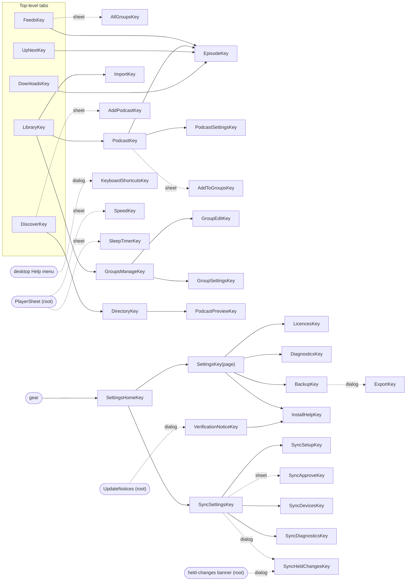
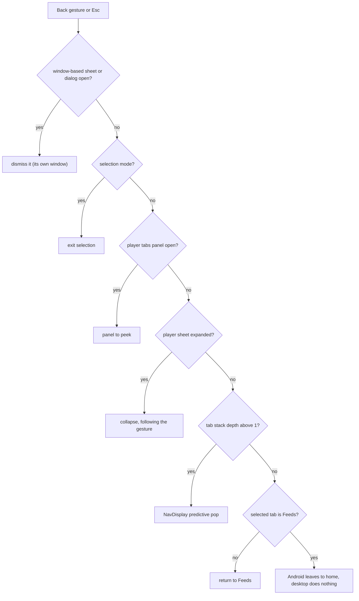
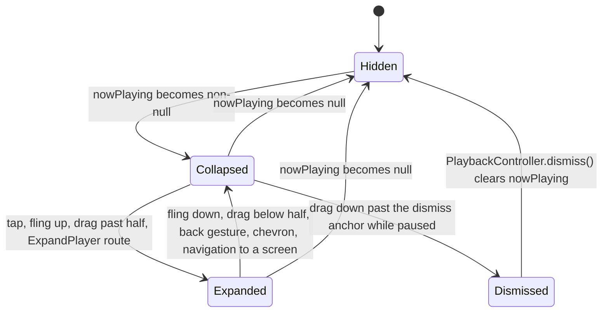
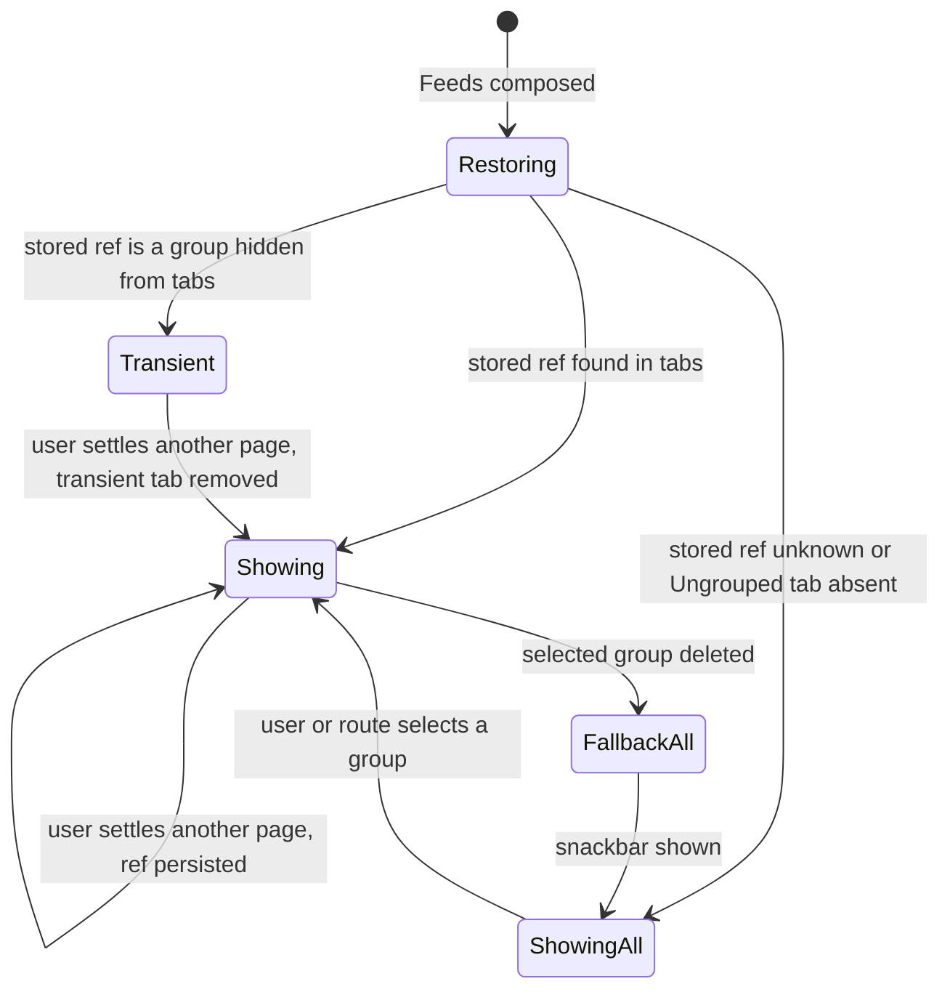
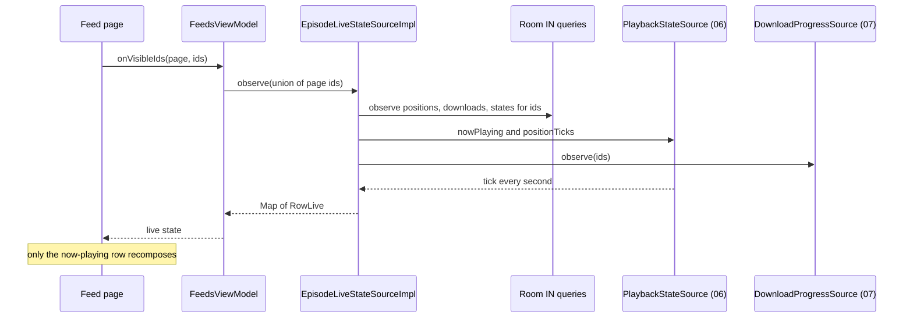
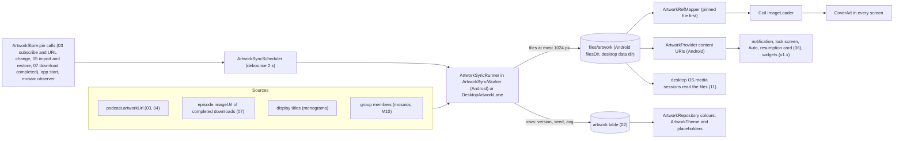

# 08 — UI and UX

> Status: Draft v1, 2026-10-04; revised 2026-10-05 for the product owner's decisions (GitHub-only distribution, no developer verification, yt-dlp engine); revised 2026-10-05 for PO-31–PO-35 (notify-only update check with GitHub links instead of an in-app updater, no beta channel); scope revision 2026-10-05 (S0–S13): one Compose Multiplatform UI for the Android and desktop apps (desktop window layouts, context menus, keyboard, hover, scrollbars and screen readers, Settings › Desktop, the desktop variants of Settings › Updates and the Install & updates help), the Sync screens, the brand scheme and icon rules derived from `media-sources/icon.png`, and published APKs as release builds signed with the committed key (PO-35 re-resolved); **final cross-document review 2026-10-05:** the root takes `RootUiState`/`RootActions`/`RootSlots` from the shells, the restore-while-linked confirmation follows the pull, `SyncNotice.PasswordSet` · Implements: R2.4, R2.5, R2.8 (display), R3.7 (display), R3.9 (display), R4.6, R5.1–R5.8, R7.2, R7.5–R7.7, R7.9 (screens and wording), R8.9, R8.10 (shared UI), the screens of R1.1–R1.9, R2.1–R2.7, R3.1, R4.8, R6.1–R6.6 and the Settings › Desktop rows of R8.3 and R8.8 / N4, N5 (UI), N6, N7 (edge-to-edge, predictive back, resizability; desktop window), N10 (RTL, text expansion), N12 (what the update card and help page show), N13 (the sync disclosure) · Milestones: M0 (M0a, M0b), M1, M2, M3, M4, M5, M6, M7, M8, M9 (M9a, M9b), M10, M11 (M11a, M11b), MD1, MD4, MD5, MS2, MS3, M13 · Honours: D2, D3, D6, D7, D16, D42, D51, D54, D55, D56, D57, D58, D61, D64, D76, D77, D78, D79, D80, D81, D83, D84, D85, D87, D92, D93, D96, D97; PO-2, PO-5, PO-31–PO-35 (resolved; PO-35 re-resolved), PO-17 (partly resolved); PO-4, PO-19, PO-36, PO-37, PO-38, PO-40, PO-44 defaults · Owns: information architecture and screen inventory, navigation behaviour (including Escape as back), every screen's layout, states and user-visible strings on both apps, shared components, the root `PlayerSheet`, the Feeds pager, `EpisodeLiveStateSource`, theming and colour, the brand rules (scheme, icon derivation, sizes, safe zones; the generator is 01's), the artwork pipeline (`ArtworkStore`, `ArtworkSyncWorker`, `DesktopArtworkLane`, `ArtworkProvider`, Coil, monograms, mosaics), adaptive layouts including desktop windows, per-screen keyboard, mouse, context-menu, hover and scrollbar behaviour (the window menus and the global shortcut list are 11's), the `PlatformActions` interfaces, accessibility of the shared UI, onboarding, the UI differences between engine present and external mode (including the Settings › YouTube engine rows), the update-check and install-guidance UI on both platforms (Settings › Updates with the update card and its GitHub links, the Settings gear badge, the first-run card, the verification notice, the `updates` notification wording, the Install & updates help page with its builds card), the Sync screens, dialogs, banners and wording (10 owns the behaviour), and the Settings structure (including the layout of Settings › Desktop, whose rows 11 owns)

Contents: [Scope](#scope) · [Information architecture](#information-architecture) · [Navigation](#navigation) · [Screens](#screens) ([Sync screens](#sync-screens)) · [Components](#components) · [Player sheet](#player-sheet) · [Group feed pager](#group-feed-pager) · [Live row state](#live-row-state) · [Theming and colour](#theming-and-colour) ([Brand assets](#brand-assets)) · [Artwork pipeline](#artwork-pipeline) · [Adaptive layouts](#adaptive-layouts) ([Keyboard and mouse](#keyboard-and-mouse)) · [Accessibility](#accessibility) · [Onboarding and empty states](#onboarding-and-empty-states) · [Capability differences in UI](#capability-differences-in-ui) · [Settings](#settings) · [Testing](#testing) · [Error handling and failure modes](#error-handling-and-failure-modes) · [Delivery by milestone](#delivery-by-milestone) · [New names introduced here](#new-names-introduced-here) · [Open questions](#open-questions) · [Sources](#sources)

---

## Scope

Serves R5.1–R5.8, R2.4, R2.5, R4.6, R6.1–R6.6 (screens), R7.2, R7.5–R7.7, R7.9 (screens), R8.9, R8.10, N4, N6, N7. Delivered from [M0](../PLAN.md#m0-scaffold-and-ci) (M0a: shell, theme, five destinations on Android; M0b: the same shell in the desktop window and the brand assets) to [M10](../PLAN.md#m10-covers-theming-adaptive-layouts-and-accessibility) (release-quality covers, colour, adaptive layouts and accessibility) and [MD4](../PLAN.md#md4-desktop-ux-and-accessibility) (keyboard, mouse, context menus, scrollbars, desktop screenshots and screen readers), with the YouTube-engine UI in [M9](../PLAN.md#m9-youtube-playback-and-downloads-via-the-embedded-yt-dlp-engine), the Sync screens in [MS2](../PLAN.md#ms2-client-sync) and [MS3](../PLAN.md#ms3-live-updates-and-handoff) and the update-check and install-guidance UI in [M11](../PLAN.md#m11-release-hardening-and-v10) (M11a); see [Delivery by milestone](#delivery-by-milestone).

**One UI for both apps** ([D83](../PLAN.md#3-key-decisions), [D81](../PLAN.md#3-key-decisions)). Every screen, ViewModel, component and theme in this document is Compose Multiplatform code in `commonMain` of its feature or UI-core module, compiled for `android` and `jvm("desktop")`; the Android app (`:app`) and the desktop app (`:desktopApp`) are thin shells around the shared `NeutrodyneRoot` ([01 Navigation](01-foundation.md#navigation)). Strings and plurals are Compose resources (`composeResources/values*/strings.xml`, the public `Res` of `:core:ui`; `Res.string.x` in composition, `suspend getString()` for notifications and workers); Android keeps `res/` only for `app_name` per locale, manifest labels, notification-channel names and Android Auto titles (D83, risk [T23](../PLAN.md#8-risks-and-mitigations)). Platform-only UI actions (share sheet, file dialogs, opening a link, "Show in folder", the notification permission) go through the small `PlatformActions` interfaces of `:core:ui` ([Modules](#modules)). Behaviour that exists on one platform only is marked "(Android)" or "(desktop)"; the full list of desktop differences is [11 Behaviour differences from Android](11-desktop.md#behaviour-differences-from-android).

Neutrodyne is cover-first: artwork is shown at a size where it reads on every surface (grid tiles 72–152 dp, feed rows 56 dp, podcast header 160 dp, full player ≥ 280 dp, mini player 48 dp, notification, lock screen, Auto, and on the desktop the OS media controls), and artwork drives colour while the chrome stays quiet. Groups are places: each group is a tab and a page of the Feeds pager ([D55](../PLAN.md#3-key-decisions)). The player is one root sheet that follows the finger, and on wide windows a side panel ([D56](../PLAN.md#3-key-decisions)). Everything is stable Material 3 — Compose Multiplatform 1.12.1 with JetBrains `material3` 1.9.0, which resolves to androidx Material 3 1.4.0 on Android — wrapped in `:core:designsystem` ([D6](../PLAN.md#3-key-decisions), [PO-4](../PLAN.md#po-4-material-3-expressive)). The brand — amber `#F3881C` on navy `#00192E` — comes from the owner's icon ([D97](../PLAN.md#3-key-decisions), [Brand assets](#brand-assets)).

### Responsibilities and boundaries

| This document owns | Owned elsewhere (link, do not restate) |
|---|---|
| Destinations, screen inventory, pane roles, re-tap and back behaviour (Escape as back on the desktop), `AppNavigator` semantics | Nav3 mechanics (installers, per-tab stacks, decorators, scene strategies, `NavKeySerializers`, intent router and its desktop sources) — [01 Navigation](01-foundation.md#navigation) |
| Every screen's layout, states, actions and user-visible strings (final wording) | What the actions do: feeds and add flow [03](03-feeds-and-discovery.md), YouTube [04](04-youtube.md), groups/import/backup [05](05-groups-opml-backup.md), playback [06](06-playback.md), downloads [07](07-downloads.md) |
| `EpisodeRow`, `CoverTile`, `GroupMosaic`, `CoverArt`, `MonogramPainter`, show-notes renderer, banners, selection mode | Show-notes sanitising and block model — [03 Show notes](03-feeds-and-discovery.md#show-notes) |
| `PlayerSheet`, mini/full player, side panel, speed and sleep sheets | Player behaviour, `PlaybackController`/`PlaybackStateSource` — [06 UI boundary](06-playback.md#ui-boundary) |
| Feeds pager, tabs, chips, selection persistence, visits | `FeedRepository`, counts window, "new since last visit" rule — [05 Group feeds](05-groups-opml-backup.md#group-feeds) |
| `EpisodeLiveStateSource` contract and implementation | Its `IN (:ids)` SQL — [02 Live row state](02-data-model.md#live-row-state) |
| Colour schemes (brand, artwork, pure black), tones, tokens, `Nd*` wrappers, icons; the brand rules: scheme, icon derivation, sizes, safe zones, monochrome silhouette, desktop and tray icons | Group palette values and icon keys — [05 Palette](05-groups-opml-backup.md#palette), [05 Icons](05-groups-opml-backup.md#icons); the brand-asset generator `generateBrandAssets`/`checkBrandAssets` — [01 Brand-asset generator](01-foundation.md#brand-asset-generator) |
| `ArtworkStore`, `ArtworkSyncWorker` (Android), `DesktopArtworkLane` (desktop), `ArtworkProvider` (Android), Coil `ImageLoader`, artwork keys, monograms, mosaics, the YouTube thumbnail interceptor | `artwork` table and reference SQL — [02 artwork](02-data-model.md#artwork), [02 Artwork references](02-data-model.md#artwork-references); YouTube URL sources — [04 Artwork and thumbnails](04-youtube.md#artwork-and-thumbnails); system-surface consumption — [06 Artwork rule](06-playback.md#artwork-rule) (Android), [11 OS integration](11-desktop.md#os-integration) (desktop); the `DesktopJobRunner` lane contract — [11 Background work](11-desktop.md#background-work) |
| Settings screen structure, `appearance.*` and `ui.*` keys, the layout of Settings › Desktop | Each area's keys and semantics (03–07, 09, 10); the Settings › Desktop rows, their keys and the window, tray and login-item behaviour — [11 Desktop settings](11-desktop.md#desktop-settings), [11 Window and tray behaviour](11-desktop.md#window-and-tray-behaviour) |
| Per-screen keyboard, mouse, context-menu, hover, scrollbar and in-list drag behaviour; the keyboard-shortcuts dialog | Window menus and the macOS menu bar, the global shortcut list, the tray menu, window-level drag and drop and window sizing — [11 Desktop UX](11-desktop.md#desktop-ux) |
| `PlatformActions` interfaces and their Android and desktop implementations | The desktop dialog and "Show in folder" mechanisms per OS — [11 Desktop downloads and storage](11-desktop.md#desktop-downloads-and-storage) |
| Sync screens, dialogs, banners and their wording; the "Continue on this device" card; restore-while-linked prompts | The protocol, `SyncController` behaviour, link flows, first-link merge, mass-change thresholds, session adoption — [10 Linking and first merge](10-sync.md#linking-and-first-merge), [10 Conflict resolution](10-sync.md#conflict-resolution), [10 Client sync engine](10-sync.md#client-sync-engine); restore rules — [05 Restore while linked](05-groups-opml-backup.md#restore-while-linked) |
| Accessibility of the shared UI: semantics, custom actions, contrast, focus, keyboard reachability | The desktop screen-reader bridges (VoiceOver, Java Access Bridge), the Linux gap statement and the MD4 checklist — [11 Accessibility](11-desktop.md#accessibility) |
| UI of external mode and of the YouTube engine (reason lines, engine rows, update outcomes), final wording | Capability computation, engine status and engine updates — [04 Capability matrix](04-youtube.md#capability-matrix), [04 Engine updates](04-youtube.md#engine-updates) |
| Settings › Updates, the update card and its two GitHub links, the Settings gear badge, the first-run card, `VerificationNoticeKey`, the `updates` notification wording, the Install & updates help page | Update-check behaviour (`AppUpdateChecker`, `UpdateCheckState`, the update manifest, link validation, check schedule, notification posting, notice timing) — [09 Update check](09-quality-and-release.md#update-check); README "Install and update" content, the public-key facts and the verification facts — [09 Developer verification](09-quality-and-release.md#developer-verification), [09 Versioning and signing](09-quality-and-release.md#versioning-and-signing); the desktop install and update guidance text — [11 Install and update](11-desktop.md#install-and-update) |
| UI test cases (screenshot matrix with its Android and desktop golden sets, accessibility checks, journeys) | Test infrastructure, Roborazzi/GMD wiring, budgets — [09 Test strategy](09-quality-and-release.md#test-strategy), [09 Performance budgets](09-quality-and-release.md#performance-budgets) |

### Modules

Every module below is Kotlin Multiplatform with its code in `commonMain` unless a source set is named ([01 Source sets and JVM islands](01-foundation.md#source-sets-and-jvm-islands)); `checkBannedApis` keeps `android.*` and `java.*` out of `commonMain` and scans for `Text("` literals (01).

| Module | Contents from this document |
|---|---|
| `:core:designsystem` | common: `NeutrodyneTheme`, `SystemUiState`, `BrandColors` (M0b), `ArtworkTheme`, `ArtworkSchemeCache` (M10), `GroupTones`, `NeutrodyneShapes`, `NeutrodyneType`, `NeutrodyneMotion`, `CoverArt`, `Covers`, `MonogramPainter`, `NdIcons` and Material Symbols vectors (Compose resources), every `Nd*` wrapper including `NdBanner`, `NdContextMenu` and `NdScrollbar` ([Nd wrappers and icons](#nd-wrappers-and-icons)), `LocalScrollbars`; `androidMain`: the dynamic-colour `actual` (01's list), `StatusBarAppearance`, `rememberAndroidSystemUiState()` (night mode, animator scale, contrast; called by `MainActivity`); `desktopMain`: `DesktopScrollbars` (Compose desktop's `VerticalScrollbar` and its styles, provided as `LocalScrollbars` by `NeutrodyneWindow`) |
| `:core:ui` | common: `NeutrodyneRoot` layout and `ndPaneLayout` (the shared root, hosted by both shells, [01 Navigation](01-foundation.md#navigation)), `StartupGate` visuals, `rememberMonogram(title)`, `LocalDrawnReporter` (Android's `ReportDrawnWhen`, null on the desktop), `EpisodeRow`, `DownloadStateButton`, `DownloadRequestHandler`, `CoverTile`, `GroupMosaic`, `GroupTabLabel`, `PodcastHeader`, `ShowNotes` (renderer), `ChapterList`, `UpNextList`, `EmptyState`, `SelectionTopBar`, `FeedFilterChips`, `LiveRowState` helpers, `ContinueOnThisDeviceCard` (MS3), string mappers (`PlaybackMessages`, `DownloadStatusText`, `AttributionText`, `FeedErrorText`, `AvailabilityText`, `ExternalReasonText`, `SyncStatusText` (MS2)), `LocalMiniPlayerInset`, `LocalSnackbarHost`, `SharedKeys`, `SettingsGearButton` and `LocalSettingsBadge` (M11a, [Settings gear badge](#updates-settings)), the `PlatformActions` interfaces and `LocalPlatformActions` (below); `androidMain` and `desktopMain`: their implementations (`rememberAndroidPlatformActions()`, `rememberDesktopPlatformActions()`, called by the shells) |
| `:core:model` | `RowLive` additions, `ArtColors`, `MonogramSpec`, `MonogramMode`, `ArtworkColors`, the setting enums of [Settings](#settings) |
| `:core:common` | `Monogram` (initials and hue, on 01's `Nfc`; moved from `:core:model` 2026-10-05), `Graphemes` (pure-Kotlin leading-grapheme rule), `TitleCollator` (interface; `java.text.Collator` implementations contributed from `androidMain` and `desktopMain`) |
| `:core:domain` | `ArtworkRepository`; `EpisodeLiveStateSource` (canonical, contract here); `DesktopIntegration` (MD2/MD4, bound only in `DesktopAppGraph`, [Settings screens](#settings-screens)) |
| `:core:data` | `EpisodeLiveStateSourceImpl`, `ArtworkRepositoryImpl` |
| `:core:artwork` | common: `DefaultArtworkStore` (`ArtworkStore` on Okio), `ArtworkKeys`, `ArtworkSyncScheduler`, `ArtworkSyncRunner`, `ArtworkColorExtractor` (M10), `ArtworkRefMapper`, `YouTubeThumbnailInterceptor` (M8), `TinyImageInterceptor`, `NeutrodyneImageLoaderFactory`, the interfaces `ArtworkCodec` and `MonogramRenderer`; `androidMain`: `ArtworkSyncWorker`, `ArtworkProvider`, `MosaicRenderer`, `AndroidArtworkCodec` and `AndroidMonogramRenderer` on `android.graphics`; `desktopMain`: `DesktopArtworkLane`, `SkiaArtworkCodec` and `SkiaMonogramRenderer` on Skia (`org.jetbrains.skia`, shipped with Compose desktop); implementations contributed with Metro, no new `expect` (01's rule) |
| `:core:navigation` | `AppNavigator.pushDetail`, `SettingsHomeKey`, `SettingsPage.UPDATES` and `SettingsPage.DESKTOP`, `InstallHelpKey`, `VerificationNoticeKey`, `KeyboardShortcutsKey` (MD4), the sync keys of [Sync screens](#sync-screens) (MS2), `LocalNavTab`, `LocalPaneLayout`, `PaneLayout` |
| `:feature:*` | Screens and ViewModels per [Screen inventory](#screen-inventory), all `commonMain` (no platform source sets); `:feature:settings` also renders the update-check and engine texts (`UpdateStatusText`, `EngineStatusText`), reaches the update check through `:core:domain` (`AppUpdateChecker`, `UpdateNotices`; state types in `:core:model`, [PLAN 5.1](../PLAN.md#51-module-graph)), depends on `:youtube:api` (01 rule 2) and shows Settings › Desktop only when `PlatformInfo` reports the desktop |
| `:feature:sync` (new, MS2) | Settings › Sync and every screen and dialog of [Sync screens](#sync-screens), over `:sync:api` |
| `:app` | `MainActivity` hosting `NeutrodyneRoot` (theme prefs, splash, edge-to-edge, `onProvideKeyboardShortcuts`), the `UpdateNotices` and `SyncController` observers' Android parts (notification prompt), the `res/` labels of D83 |
| `:desktopApp` | `NeutrodyneWindow` hosting `NeutrodyneRoot` (the window itself, `DesktopMenuBar` and the tray are 11's), `DesktopIntegrationImpl`, the `SystemUiState` it passes to `NeutrodyneTheme` (CMP's `isSystemInDarkTheme()` on Windows and macOS; `:desktop:system`'s `DesktopSystemPrefs` for Linux dark mode and every OS's contrast and reduced-motion preference, [App scheme](#app-scheme)) |

**`PlatformActions`** (`:core:ui`; [D83](../PLAN.md#3-key-decisions), [PLAN 5.1](../PLAN.md#51-module-graph) rule 2): features never call `Intent`s, AWT or D-Bus; they read `LocalPlatformActions.current`, which the shell provides from `:core:ui`'s platform source set (`MainActivity` calls `rememberAndroidPlatformActions()`, whose activity-result launchers must be registered in composition; `NeutrodyneWindow` calls `rememberDesktopPlatformActions(portal)` with the `LinuxDesktopPortal` port from `DesktopAppGraph`, so the Linux "Show in Files" and folder chooser use D-Bus without `:core:ui` depending on dbus-java, [11 Show in folder](11-desktop.md#show-in-folder)), so no new `expect` is needed ([01 Source sets and JVM islands](01-foundation.md#source-sets-and-jvm-islands)). A member is `null` where the platform has no such action; screens hide the corresponding action then.

```kotlin
// :core:ui commonMain
@Stable interface PlatformActions {
    val urls: ExternalUrlOpener                         // every link, "Watch on YouTube", update and help links
    val share: ShareSheet?                              // Android share sheet; null on the desktop ("Copy link" instead)
    val files: FilePicker                               // OPML, backup and import files; desktop also folders
    val saver: FileSaver                                // export, backup, diagnostics export
    val reveal: RevealInFolder?                         // desktop only: "Show in Explorer / Finder / Files"
    val notifications: NotificationPermissionRequester? // Android 13+ only
}
fun interface ExternalUrlOpener { fun open(url: String): OpenResult }            // OPENED, NO_HANDLER
interface ShareSheet { fun shareText(text: String, subject: String?); fun shareFile(uri: String, mimeType: String) }
interface FilePicker { suspend fun pickFile(mimeTypes: List<String>, extensions: List<String>): String?   // content: or file: URI
                       suspend fun pickFolder(): String? }                                                 // desktop only; null on Android
fun interface FileSaver { suspend fun create(suggestedName: String, mimeType: String): String? }         // URI to write, or null (cancelled)
fun interface RevealInFolder { fun reveal(path: String): Boolean }
interface NotificationPermissionRequester { val granted: Boolean; fun request(onResult: (Boolean) -> Unit) }
val LocalPlatformActions = staticCompositionLocalOf<PlatformActions> { error("provided by the shell") }
```

| Action | Android (`androidMain`) | Desktop (`desktopMain`; mechanisms per OS in 11) |
|---|---|---|
| `ExternalUrlOpener` | `ACTION_VIEW` + `CATEGORY_BROWSABLE` (`mailto:` → `ACTION_SENDTO`); `ActivityNotFoundException` → `NO_HANDLER` | `java.awt.Desktop.browse` (`mailto:` → `Desktop.mail`); unsupported or failing → `NO_HANDLER`; never a process ([11 Processes and files at run time](11-desktop.md#processes-and-files-at-run-time)) |
| `ShareSheet` | `ACTION_SEND` wrapped in `Intent.createChooser` (files with `ClipData` and `FLAG_GRANT_READ_URI_PERMISSION`) | — |
| `FilePicker` | `OpenDocument` (`pickFolder` → null; SAF folders are v1.x) | macOS `FileDialog`, Windows `JFileChooser`, Linux XDG portal `FileChooser` ([11 Download folders](11-desktop.md#download-folders)) |
| `FileSaver` | `CreateDocument(mimeType)` | the same dialogs in save mode |
| `RevealInFolder` | — | [11 Show in folder](11-desktop.md#show-in-folder) |
| `NotificationPermissionRequester` | `RequestPermission(POST_NOTIFICATIONS)` on API 33+, `granted` true below | — (macOS asks at the first notification, [11 Notifications](11-desktop.md#notifications)) |

`NO_HANDLER` shows "No app can open this link" with "Copy link" everywhere ([Show notes renderer](#show-notes-renderer)).

### Threading model

| Work | Thread / context | Rule |
|---|---|---|
| Composition, ViewModel state, navigation | Main: the Android main thread; on the desktop the AWT event dispatch thread (`Dispatchers.Main` from kotlinx-coroutines-swing, [11 Threading model](11-desktop.md#threading-model)) | ViewModels use `viewModelScope` (Main.immediate); repositories are main-safe ([01 Coroutines and threading](01-foundation.md#coroutines-and-threading)) |
| Paging transforms (`insertSeparators` day headers, row mapping) | `@Dispatcher(Default)` via `flowOn` before `cachedIn` | No I/O |
| Artwork scheme generation (MCU `SchemeContent`, M10) | `@Dispatcher(Default)` inside `ArtworkSchemeCache` | Never in composition; the previous scheme stays until the new one is ready |
| Coil decode and fetch | Coil's own dispatchers (IO-limited) | Interceptors and mappers do no disk I/O ([Coil ImageLoader](#coil-imageloader)) |
| `EpisodeLiveStateSourceImpl` merging | `@Dispatcher(Default)`; DAO flows on Room's IO context | Output conflated |
| `ArtworkSyncWorker` (Android) | `CoroutineWorker`; files on IO, quantisation on Default | 8-min soft deadline |
| `DesktopArtworkLane` (desktop) | a `DesktopJobRunner` lane; files on IO, decoding and quantisation on `Dispatchers.Default.limitedParallelism(2)` ([11 Lanes](11-desktop.md#lanes)) | No deadline; yields after every batch |
| `ArtworkProvider.openFile` (Android) | Binder thread | Blocking allowed; fallback DB read with a 2 s timeout ([01](01-foundation.md#coroutines-and-threading)) |

### Platform constraints

**Android.**

| Constraint | Consequence here | Source |
|---|---|---|
| Edge-to-edge enforced for target 35; opt-out removed for target 36 | Every screen handles insets ([Insets and edge-to-edge](#insets-and-edge-to-edge)) | [Android 15 changes](https://developer.android.com/about/versions/15/behavior-changes-15), [Android 16 changes](https://developer.android.com/about/versions/16/behavior-changes-16) |
| Predictive back on by default for target 36; `onBackPressed` not called | Back via Nav3 and `PredictiveBackHandler`; never intercept back at a tab root | [Android 16 changes](https://developer.android.com/about/versions/16/behavior-changes-16) |
| Orientation, resizability and aspect locks ignored on sw ≥ 600 dp (target 36); opt-out removed for target 37 | No locks anywhere; designed layouts per width class | [Android 16 changes](https://developer.android.com/about/versions/16/behavior-changes-16), [Android 17 changes](https://developer.android.com/about/versions/17/behavior-changes-17) |
| Android 14 non-linear font scaling to 200 %; `fontScale` informational | `sp` everywhere; layouts switch on `fontScale ≥ 1.5`, never compute sizes from it | [Android 14 features](https://developer.android.com/about/versions/14/features#non-linear-font-scaling) |
| Dynamic colour only on API 31+; `UiModeManager.getContrast()` only on API 34+ | Brand scheme below 31; contrast 0.0 below 34 | [Compose dynamic colour](https://dl.google.com/android/maven2/androidx/compose/material3/material3-android/1.4.0/material3-android-1.4.0-sources.jar), [UiModeManager](https://developer.android.com/reference/android/app/UiModeManager) |
| `Modifier.blur` only effective on API 31+ | YouTube banner fallback uses a gradient below 31 | [blur KDoc mirror](https://composables.com/jetpack-compose/androidx.compose.ui/ui/modifiers/blur) |
| `POST_NOTIFICATIONS` runtime permission on API 33+ | Requested contextually only ([Permission prompts](#permission-prompts)) | [Notification permission](https://developer.android.com/develop/ui/views/notifications/notification-permission) |
| Android 17 RAM-based memory limits; widget `RemoteViews` bitmap cap for target 37 | Bounded Coil caches; widgets (v1.x) use content-URI icons | [Android 17 changes](https://developer.android.com/about/versions/17/behavior-changes-17) |
| Themed app icons need a `<monochrome>` layer (Android 13); Android 16 QPR2 auto-themes icons without one | The brand icon ships a monochrome layer from M0b ([D97](../PLAN.md#3-key-decisions), [Brand assets](#brand-assets)) | [Adaptive icons](https://developer.android.com/develop/ui/views/launch/icon_design_adaptive) |
| "Install unknown apps" is a per-source user grant (API 26+): the app that opens the APK (browser, Files, Obtainium) needs it once, before the install | Neutrodyne never installs anything and declares no install permission ([PLAN N7](../PLAN.md#22-non-functional-requirements), [D78](../PLAN.md#3-key-decisions)), so the app shows no rationale or settings hand-off; the help page's ALLOW card explains the browser's prompt ([Install and updates help](#install-and-updates-help)) | [Alternative distribution](https://developer.android.com/distribute/marketing-tools/alternative-distribution) |
| `startActivity(ACTION_VIEW)` of a URL needs no package visibility (`<queries>`); an `ActivityNotFoundException` is possible and should be caught | The update card's and help page's links use the [show-notes link rule](#show-notes-renderer): `ACTION_VIEW` + `CATEGORY_BROWSABLE`, `ActivityNotFoundException` → "No app can open this link" with "Copy link" | [Package visibility: open URLs](https://developer.android.com/training/package-visibility/use-cases#open-urls-browser-or-other-app) |
| Android 13+ shows its own confirmation when an app copies to the clipboard; the guidance is to drop the app's own toast or snackbar there | Every copy action (SHA-256, commands, diagnostics, links, the sync link code) shows the "Copied" snackbar only on API ≤ 32 (always on the desktop, which has no system confirmation) | [Copy and paste](https://developer.android.com/develop/ui/views/touch-and-input/copy-paste#duplicate-notifications) |
| Developer verification: from Google's 2027 global rollout, certified devices block installs and updates of unregistered apps unless the one-time advanced flow is on or ADB is used | Pre-enforcement notice and Install & updates help ([D80](../PLAN.md#3-key-decisions)); the block itself is shown by Android's installer, which the app neither drives nor detects ([D78](../PLAN.md#3-key-decisions)) | [Developer verification](https://developer.android.com/developer-verification), [advanced flow](https://support.google.com/android/answer/17588095?hl=en) |
| Published APKs are release builds — R8, not debuggable — signed with the keystore committed to the repository, whose key is therefore public ([D96](../PLAN.md#3-key-decisions), [D61](../PLAN.md#3-key-decisions), [PO-35](../PLAN.md#48-further-product-owner-decisions) re-resolved); local development uses the `debug` build type (`ch.lkmc.neutrodyne.debug`) | Nothing in the UI branches on `BuildConfig`; developer-only UI and behaviour (the Backup page's "Write snapshot now", pseudo-locales, update checks off) exist only while `BuildInfo.debug` is true, which no published APK or packaged desktop image is ([01 Debug build type](01-foundation.md#debug-build-type)). The help page's BUILDS card states the one user-facing consequence of the public key: download only from the GitHub release page (risk [P10](../PLAN.md#8-risks-and-mitigations)) | [`<application>`](https://developer.android.com/guide/topics/manifest/application-element) |
| `ACCESS_LOCAL_NETWORK` (Android 17, target 37) is a runtime permission needed for connections to local-network addresses | Asked only in the sync setup for a server on the local network, after 08's rationale ([Sync screens](#sync-screens), [10 Local-network gate](10-sync.md#local-network-gate), [D28](../PLAN.md#3-key-decisions)) | [Local network permission](https://developer.android.com/privacy-and-security/local-network-permission) |

**Desktop** (Compose Multiplatform 1.12.1 on the bundled JDK 25, [D88](../PLAN.md#3-key-decisions)).

| Constraint | Consequence here | Source |
|---|---|---|
| No wallpaper colour; `isSystemInDarkTheme()` follows the OS on Windows and macOS (polled once a second since CMP 1.12.0), not on Linux | Brand scheme everywhere on the desktop; on Linux dark mode, contrast and reduced motion come from the XDG Settings portal (`org.freedesktop.appearance` `color-scheme`, `contrast`, `reduced-motion`, with `SettingChanged`) through `:desktop:system` ([App scheme](#app-scheme)) | [CMP changelog](https://github.com/JetBrains/compose-multiplatform/blob/master/CHANGELOG.md) (1.12.0, PR [#3063](https://github.com/JetBrains/compose-multiplatform-core/pull/3063)), [portal Settings](https://flatpak.github.io/xdg-desktop-portal/docs/doc-org.freedesktop.portal.Settings.html) |
| Unverified: `fontScale` stays 1.0 on the desktop and OS display scaling changes only the density, so text and layout scale together; whether Compose follows Windows' separate "Text size" setting | The row-stacking rule (`fontScale ≥ 1.5`) is written for Android and applies wherever `fontScale` reaches 1.5; desktop text is checked at 200 % OS scaling (11's MD4 checklist) and S9 records the desktop `fontScale` behaviour | — |
| Scrollbars (`VerticalScrollbar`), `ContextMenuArea`, `TooltipArea` and `Modifier.onClick(matcher)` are desktop-only APIs ("Desktop-only components and APIs"), not available in `commonMain` | `NdScrollbar` is a common composable that draws the `LocalScrollbars` implementation the desktop window provides (nothing on Android); context menus are common M3 `DropdownMenu`s opened by a secondary click detected with `pointerInput` (`NdContextMenu`); tooltips are M3 `TooltipBox` ([Keyboard and mouse](#keyboard-and-mouse)) | [context menus](https://kotlinlang.org/docs/multiplatform/compose-desktop-context-menus.html), [scrollbars](https://kotlinlang.org/docs/multiplatform/compose-desktop-components.html) |
| Screen readers: macOS VoiceOver supported; Windows only through Java Access Bridge; no Linux accessibility back-end | Shared semantics carry both; every custom action also reachable by keyboard or context menu; the Linux gap is stated, not worked around ([Desktop screen readers](#desktop-screen-readers), risk [U3](../PLAN.md#8-risks-and-mitigations)) | [Compose desktop accessibility](https://kotlinlang.org/docs/multiplatform/compose-desktop-accessibility.html) |
| One window, minimum 600 × 480 dp ([PO-19](../PLAN.md#48-further-product-owner-decisions)); no system bars, insets, posture or predictive back | Always the navigation rail; Esc is back; no edge-to-edge or status-bar handling ([Adaptive layouts](#adaptive-layouts)) | [11 Window and tray behaviour](11-desktop.md#window-and-tray-behaviour) |
| No share sheet and no content URIs | "Copy link" replaces Share; "Show in Explorer / Finder / Files" replaces "Share file"; OS media sessions read pinned files ([PlatformActions](#modules), [Artwork pipeline](#artwork-pipeline)) | [11 Behaviour differences from Android](11-desktop.md#behaviour-differences-from-android) |
| Every network counts as unmetered; no charging rule; no audio focus | Metered, Wi-Fi-only, charging and "pause for navigation" rows and dialogs are hidden on the desktop | [D85](../PLAN.md#3-key-decisions) |


---

## Information architecture

Serves R2.4, R5.1, R4.6, R8.1, R8.9. Delivered in M0 (M0a: Android shell; M0b: the same five destinations in the desktop window) and per screen milestone. Honours [D54](../PLAN.md#3-key-decisions), [D83](../PLAN.md#3-key-decisions), [D85](../PLAN.md#3-key-decisions). Both apps have the same destinations, screens and keys; the desktop adds the window menus of 11 ([11 Menus](11-desktop.md#menus)), whose items open the same keys.

### Destinations

Five top-level destinations in a `NavigationSuiteScaffold` whose type is navigation-suite 1.4.0's default `NavigationSuiteScaffoldDefaults.navigationSuiteType(adaptiveInfo)`: `ShortNavigationBarCompact` for compact width, `ShortNavigationBarMedium` for tabletop posture or compact height (landscape phones), `WideNavigationRailCollapsed` (96 dp wide) otherwise ([navigation-suite 1.4.0 sources](https://dl.google.com/android/maven2/androidx/compose/material3/material3-adaptive-navigation-suite-android/1.4.0/material3-adaptive-navigation-suite-android-1.4.0-sources.jar)). Destinations: **Feeds · Library · Up next · Downloads · Discover**. Settings is a gear action in every top-level top app bar and, while a rail is shown, the rail's footer item ([D54](../PLAN.md#3-key-decisions)). `WideNavigationRail` 1.4.0 has a `header` slot but no footer slot, so `NdNavigationSuiteScaffold` uses `NavigationSuiteScaffoldLayout` with its own `navigationSuite` for the rail types: a `Box(fillMaxHeight)` containing the stock `WideNavigationRail(header = null, arrangement = Arrangement.Top)` with the five items, plus `SettingsGearButton` (an `NdTooltipIconButton(settings)` that carries the update dot from M11a, [Updates settings](#updates-settings)) with the label "Settings" aligned `BottomCenter`, 16 dp above `WindowInsets.navigationBars`; its `traversalIndex` places it after Discover. Bars (compact, short windows) show no gear item: the top app bar's gear is enough. Icons are Material Symbols Rounded (outlined when unselected, filled when selected): `dynamic_feed`, `grid_view`, `queue_music`, `download`, `explore`; gear `settings`.

**On the desktop** the window is never narrower than 600 dp or lower than 480 dp ([11 Window and tray behaviour](11-desktop.md#window-and-tray-behaviour)), so the suite's default is always `WideNavigationRailCollapsed` with the gear footer; the destinations also answer Ctrl/Cmd+1 … 5 and the Go menu, and Settings answers Ctrl/Cmd+, and the macOS app menu's "Settings…" ([11 Keyboard shortcuts](11-desktop.md#keyboard-shortcuts)). Rail items show a tooltip with their shortcut on hover ("Library (Ctrl+2)", "⌘2" on macOS).

| Destination | Purpose | Badge |
|---|---|---|
| Feeds | The All feed and one page per group ([Group feed pager](#group-feed-pager)) | none |
| Library | Cover grid of subscriptions, Groups view, selection mode | none |
| Up next | The user's queue and the play context ([06 Queue and play context](06-playback.md#queue-and-play-context)) | none |
| Downloads | In-progress, completed and failed downloads with storage | count of `FAILED` downloads (M6) |
| Discover | Search, charts, add by URL, YouTube channels, import | none |

### Screen inventory

Pane roles apply when the [pane directive](#pane-directive) allows two or more panes; on one pane every key pushes full-screen. "Sheet" keys render as modal bottom sheets and "dialog" keys as dialogs through 01's overlay scene strategies. Every key exists on both platforms unless the Milestone column says "(Android)" or "(desktop)"; every key is registered in 01's `NavKeySerializers` (the desktop cannot serialise keys by reflection, [D7](../PLAN.md#3-key-decisions)).

| Screen | `NavKey` | Feature module | Pane role | Milestone |
|---|---|---|---|---|
| [Feeds](#feeds) | `FeedsKey` | `:feature:feeds` | list (placeholder detail: group mosaic) | M1 (All), M2 |
| [All groups sheet](#all-groups-sheet) | `AllGroupsKey` | `:feature:feeds` | sheet | M2 |
| [Library](#library) | `LibraryKey` | `:feature:library` | list | M1, M2, M10 |
| [Podcast detail](#podcast-detail) | `PodcastKey(podcastId)` | `:feature:podcast` | detail | M1 |
| Podcast preview (same screen, preview mode) | `PodcastPreviewKey(feedUrl)` | `:feature:podcast` | detail | M7 |
| [Podcast settings](#podcast-settings) | `PodcastSettingsKey(podcastId)` | `:feature:podcast` | detail | M1, M2, M4, M6, M8 |
| [Episode detail](#episode-detail) | `EpisodeKey(episodeId)` | `:feature:episode` | extra | M1 |
| [Group editor](#group-editor) | `GroupEditKey(groupId)` | `:feature:groups` | detail | M2 |
| [Manage groups](#manage-groups) | `GroupsManageKey` | `:feature:groups` | list | M2 |
| [Group settings](#group-settings) | `GroupSettingsKey(groupId)` | `:feature:groups` | detail | M2, M4, M6 |
| [Add to groups sheet](#add-to-groups-sheet) | `AddToGroupsKey(podcastIds)` | `:feature:groups` | sheet | M2 |
| [Up next](#up-next) | `UpNextKey` | `:feature:queue` | list | M0 (empty), M4 |
| [Downloads](#downloads) | `DownloadsKey` | `:feature:downloads` | list | M0 (empty), M6 |
| [Discover](#discover) | `DiscoverKey` | `:feature:discover` | list | M0 (empty), M1, M7 |
| [Directory results](#directory-results) | `DirectoryKey(query, genreId)` | `:feature:discover` | list | M7 |
| [Add podcast sheet](#add-podcast-sheet) | `AddPodcastKey(input)` | `:feature:discover` | sheet | M1, M7, M8 |
| [Import](#import) (preview, progress, report, restore preview) | `ImportKey(sessionId)` | `:feature:importexport` | detail | M3 |
| [Backup and restore](#backup-and-restore) | `BackupKey` | `:feature:importexport` | detail | M3 |
| [Export dialog](#export-dialog) | `ExportKey(groupId)` | `:feature:importexport` | dialog | M3 |
| [Settings](#settings-screens) home | `SettingsHomeKey` (new) | `:feature:settings` | list | M0 |
| Settings page | `SettingsKey(page)` | `:feature:settings` | detail | M0 (About), per owner; `SettingsPage.DESKTOP` M0b (desktop), MD2/MD4 rows |
| Licences | `LicencesKey` | `:feature:settings` | detail | M0, M9a (engine entries) |
| [Updates settings](#updates-settings) | `SettingsKey(SettingsPage.UPDATES)`; `openRelease = true` from the notification action (01's `…/open/settings/updates/release`) | `:feature:settings` | detail | M11a |
| [Install and updates help](#install-and-updates-help) | `InstallHelpKey` | `:feature:settings` | detail | M11a |
| [Verification notice](#updates-settings) | `VerificationNoticeKey` | `:feature:settings` | dialog | M11a (Android) |
| [Keyboard shortcuts](#keyboard-and-mouse) | `KeyboardShortcutsKey` | `:feature:settings` | dialog | MD4 (desktop; Help menu) |
| [Sync settings](#sync-screens) | `SyncSettingsKey` | `:feature:sync` | detail | MS2 |
| [Link setup](#sync-screens) (address, disclosure, method, code, first-link choice, merge) | `SyncSetupKey(serverUrl)` | `:feature:sync` | detail | MS2 |
| [Link another device](#sync-screens) | `SyncApproveKey(userCode)` | `:feature:sync` | sheet | MS2 |
| [Devices](#sync-screens) | `SyncDevicesKey` | `:feature:sync` | detail | MS2 |
| [Held changes](#sync-screens) | `SyncHeldChangesKey(id)` | `:feature:sync` | dialog | MS2 |
| [Sync diagnostics](#sync-screens) | `SyncDiagnosticsKey` | `:feature:sync` | detail | MS2 |
| [Diagnostics](#diagnostics) | `DiagnosticsKey` | `:feature:settings` | detail | M11 (M11b) |
| [Speed sheet](#speed-and-sleep-sheets) | `SpeedKey` | `:feature:player` | sheet | M4 |
| [Sleep timer sheet](#speed-and-sleep-sheets) | `SleepTimerKey` | `:feature:player` | sheet | M5 |
| [Player](#player-sheet) (mini, full, side panel) | none (`PlayerSheet`, D56) | `:feature:player`, hosted by `NeutrodyneRoot` | root overlay / side panel | M4, M10; desktop MD1 |
| [Continue on this device](#sync-screens) | none (`ContinueOnThisDeviceCard`, root) | `:core:ui`, hosted by `NeutrodyneRoot` | above the mini player / top of the side panel | MS3 |
| [Startup gate](#banners-and-the-startup-gate) | none | `:core:ui` visuals, hosted by `MainActivity` and `NeutrodyneWindow` | full window | M1 |



---

## Navigation

Serves R2.4, R5.7, R8.3 (links and files), R8.9 (Esc), N7. Delivered in M0 (M0a: tabs, gear, back on Android; M0b: the same in the desktop window with Escape as back), M2 (feed selection routes), M4 (player back order), M10 (panes, shared elements), MD2 (desktop links and files), MS2 (sync routes). Honours [D7](../PLAN.md#3-key-decisions), [D56](../PLAN.md#3-key-decisions), [D85](../PLAN.md#3-key-decisions). Mechanics (per-tab `NavBackStack`s created with `rememberNavBackStack(NavKeySerializers.savedStateConfiguration, …)`, decorators, overlay scene strategies, `IntentRouter` and its Android and desktop sources) are 01's ([01 Navigation](01-foundation.md#navigation)); JetBrains `navigation3-ui` 1.1.2 in common code (Android resolves androidx 1.2.0; risk [T21](../PLAN.md#8-risks-and-mitigations), spike S9). This section defines behaviour, identical on both apps except where marked.

### Tabs and back stacks

1. Each `TopLevelKey` has its own back stack, saved across tab switches and process death (01). Selecting another tab never clears a stack.
2. Any screen may push any non-top-level key onto the **selected** tab's stack (`AppNavigator.push`). Cross-tab jumps use `selectTab` and, for deep links, `open(tab, stack)`. Rules: podcast name tapped in Feeds, Up next, Downloads or the player → `PodcastKey` on the current tab (or, from the player, the tab underneath it); a group tile in Library → [select that group in Feeds](#selection-persistence-and-fallback) (`selectTab(FeedsKey)` after writing the selection).
3. Back from a non-start tab's root returns to Feeds; back from the Feeds root leaves the app with the system back-to-home animation (Android; 01's `visibleTabs()` rule, kept). On the desktop Esc at the Feeds root does nothing: Esc never hides or closes the window (closing is 11's Ctrl/Cmd+W and the close button).
4. `pushDetail(key)` (member added to the canonical `AppNavigator`, implemented by 01's `NavigationState`): when the [pane layout](#pane-directive) has ≥ 2 partitions and the top entry has the same key class as `key` (for example `EpisodeKey` → `EpisodeKey`), the top entry is replaced instead of stacked, so tapping ten rows on a tablet does not build ten back entries. On one pane it equals `push`. Every list → detail tap uses `pushDetail`.

```kotlin
// :core:navigation — additions (owner 08; canonical members of AppNavigator unchanged)
interface AppNavigator {
    fun push(key: NavKey); fun selectTab(key: TopLevelKey); fun pop(): Boolean    // canonical
    fun resetTab(key: TopLevelKey); fun open(tab: TopLevelKey, stack: List<NavKey>) // 01
    fun pushDetail(key: NavKey)                                                    // replace same-type top entry on ≥ 2 panes
}
@Serializable data object SettingsHomeKey : NavKey                                 // new: the gear's target
// SettingsPage (the parameter of SettingsKey) gains UPDATES (M11a). Help and notice keys, M11a, both served by
// :feature:settings; IDs and strings only (01: :core:navigation depends on nothing project-internal):
@Serializable data class InstallHelpKey(val section: String = "") : NavKey       // help page; InstallHelpSection name
@Serializable data object VerificationNoticeKey : NavKey                           // one-time pre-enforcement dialog (Android)
// UpdateBlockedKey and WhatsNewKey were removed 2026-10-05 with the in-app installer (PO-31)
// Scope revision 2026-10-05: SettingsPage gains DESKTOP (M0b; shown only when PlatformInfo reports the desktop).
@Serializable data object KeyboardShortcutsKey : NavKey                            // MD4: desktop Help › Keyboard shortcuts
// MS2, served by :feature:sync (Sync screens):
@Serializable data object SyncSettingsKey : NavKey                                 // Settings › Sync; route …/open/settings/sync
@Serializable data class SyncSetupKey(val serverUrl: String = "") : NavKey         // link flow; "" = ask for the address
@Serializable data class SyncApproveKey(val userCode: String = "") : NavKey        // "Link another device" sheet
@Serializable data object SyncDevicesKey : NavKey
@Serializable data class SyncHeldChangesKey(val id: Long) : NavKey                  // mass-change dialog (R7.7)
@Serializable data object SyncDiagnosticsKey : NavKey
data class PaneLayout(val partitions: Int, val playerPanel: Boolean, val contentWidthDp: Int)
val LocalPaneLayout = staticCompositionLocalOf { PaneLayout(1, false, 360) }       // provided by NeutrodyneRoot; changes only on resize/panel
val LocalNavTab = staticCompositionLocalOf<TopLevelKey> { FeedsKey }               // provided per entry by the shared host (01)
```

### Re-tap behaviour

| Situation | Re-tap on the selected destination |
|---|---|
| Stack depth > 1 | `resetTab` (pop to the root); the root's scroll position is kept |
| At the root, list not at the top | Animate the visible list to item 0 (Feeds: the current page's list) |
| Feeds root, already at the top, page ≠ All | Select the All page |
| Player expanded | Collapse the sheet first; a second tap applies the rows above |

On the desktop a click on the selected rail item and Ctrl/Cmd+1 … 5 on the selected destination behave as a re-tap.

### Pane roles and detail placeholders

Metadata (01's `ListDetailSceneStrategy.listPane()/detailPane()/extraPane()`) per key is the "Pane role" column of the [Screen inventory](#screen-inventory). Detail placeholders when a list key is alone on ≥ 2 partitions: Feeds — the selected group's mosaic at 240 dp with "Select an episode"; Library — "Select a podcast" with the four most recently updated covers; Settings home — the Appearance page's content rendered as the placeholder (not a back-stack entry, so back never re-opens it in a loop; tapping a page row then uses `pushDetail(SettingsKey(page))`); other lists — none (the list takes the full width). `EpisodeKey` is an extra pane so that Library → Podcast → Episode shows three panes on ≥ 1,200 dp of content. Unverified (spike S5): that `ListDetailSceneStrategy` in `adaptive-navigation3` 1.3.0 places an extra-pane entry directly after a list entry (Feeds → Episode) beside the list; fallback: register `EpisodeKey` as `detailPane()`, accepting Podcast → Episode replacing the podcast in the detail pane.

### Sheets and dialogs

Sheet keys (`AddPodcastKey`, `AddToGroupsKey`, `AllGroupsKey`, `SpeedKey`, `SleepTimerKey`, from MS2 `SyncApproveKey`) and the dialog keys (`ExportKey`, from M11a `VerificationNoticeKey`, from MS2 `SyncHeldChangesKey`, from MD4 `KeyboardShortcutsKey`) are pushed on the selected tab's stack and rendered by 01's overlay scene strategies, which must use window-based `NdModalBottomSheet`/`NdDialog` so they draw above the root `PlayerSheet` (a sheet opened from the expanded player would otherwise sit under it; on the desktop the same z-order is spike S9's check). Small confirmations (unsubscribe, mark all played, metered prompts, Replace restore, unlink) are plain `NdDialog`s owned by the screen, not keys. Sheets have a drag handle, 28 dp top corners, and close on back, scrim tap or swipe down; on wide windows they keep Material's maximum sheet width (`BottomSheetDefaults.SheetMaxWidth`, 640 dp) and centre. On the desktop Esc closes the top sheet or dialog, a scrim click closes it, and focus moves into it on open and back to the element that opened it on close (11's MD4 checklist item 5).

### Deep links

01's [Intent routing](01-foundation.md#intent-routing) targets are confirmed with these behaviours:

| Route | Behaviour |
|---|---|
| `Push(AddPodcastKey(input))` | The sheet opens over the current tab with `input` pre-filled and resolution started; nothing is written until Subscribe |
| `Push(EpisodeKey(id))` | Pushed on the current tab; a missing episode shows "This episode is no longer available" with Back |
| `Navigate(LibraryKey, [PodcastKey(id)])` | Library tab, its stack replaced by `[LibraryKey, PodcastKey]` |
| `SelectFeed(groupUuid)` | Root writes `ui.feeds_selected_source = group:{uuid}` (`all` when `groupUuid == null`), then `selectTab(FeedsKey)` and `resetTab(FeedsKey)`; unknown UUID → All with a snackbar "That group no longer exists" |
| `Navigate(DownloadsKey, [])` | Downloads root |
| `ExpandPlayer` | Expands the sheet (or reveals the side panel); no-op when nothing is loaded |
| `Navigate(LibraryKey, [ImportKey(id)])` | Import screen in the state of that session |
| `Push(SettingsKey(page))`, `Push(DiagnosticsKey)` | Pushed on the current tab (back returns to where the user was); includes `…/open/settings/youtube` (04's breaker notice) and, from M11a, `…/open/settings/updates` (the `updates` notification, 05's "Check for updates") and `…/open/settings/updates/release` (the notification's "Open on GitHub" action) |
| `Push(InstallHelpKey())` (`…/open/help/install`, M11a; 01's route table) | The [Install and updates help](#install-and-updates-help) page with every section collapsed, pushed on the current tab |
| `Push(SyncSettingsKey)` (`…/open/settings/sync`, MS2; the desktop's held-changes notification and Settings links) | Settings › Sync on the current tab. 01's route table maps `…/open/settings/sync` to `SettingsKey(SettingsPage.SYNC)`; because Settings › Sync lives in `:feature:sync`, which `:feature:settings` cannot reach, the route must push `SyncSettingsKey` ([Open questions](#open-questions) 22) |
| Desktop sources: links (`feed:`, `podcast:`, `pcast:`, `itpc:`, `neutrodyne:`) and files (`.opml`, `.xml`, backup `.zip`) from the OS, a second launch or a drop on the window ([11 Links and files from the OS](11-desktop.md#links-and-files-from-the-os)) | The same routes as Android's intents: links open the [Add podcast sheet](#add-podcast-sheet), files the [Import](#import) preview through `…/open/import/{sessionId}`; the window is brought to the front first (11). A drop shows 11's overlay while dragging |

A route that arrives while the [startup gate](#banners-and-the-startup-gate) is shown is held by the root and applied once `NavDisplay` exists (01's start-up test). Routes only navigate; every write still needs a tap on the destination (01 security rule) — also on the desktop, where any local program can hand the running instance a link or file.

**Update notices (M11a).** `VerificationNoticeKey` is not a route. `NeutrodyneRoot` cannot see `:core:domain` ([01 Dependency rules](01-foundation.md#dependency-rules) rule 7), so the shell's start-up ViewModel collects `UpdateNotices.pending` (09 decides when a notice becomes pending) and passes it as `RootUiState.notice` ([01 root contract](01-foundation.md#appnavigator-and-per-tab-back-stacks)); the root shows it once `NavDisplay` exists and the startup gate is gone, and shows at most one notice per process start, never while the player is expanded, a sheet or dialog is open or an import preview is on screen (it waits for the next top-level destination): `FIRST_RUN_CHOICE` → the [first-run card](#updates-settings) among the banners (not a key; both apps); `VERIFICATION_ENFORCEMENT` → `push(VerificationNoticeKey)` (Android only: 09 never raises it on the desktop). Each is dismissed through `RootActions.dismissNotice` (the shell calls `UpdateNotices.dismiss(notice)`) when the user closes it, so it never returns. There is no "what's new" notice and no update-blocked sheet (removed 2026-10-05 with the in-app installer, PO-31): an available update appears as the gear badge, the `updates` notification (the desktop's OS notification) and the update card in Settings › Updates.

**Sync notices (MS2, MS3).** The shell's start-up ViewModel also maps `SyncController.heldChanges` into `RootUiState.heldChanges` (the held-changes banner, priority 3 in [Banners and the startup gate](#banners-and-the-startup-gate); never an unprompted dialog), `SyncController.remoteSession` into `RootUiState.remoteSession` (the [Continue on this device](#sync-screens) card) and `SyncController.notices` into `RootSlots.userMessages` (snackbars); `NeutrodyneRoot` renders them — all inert while sync is not configured ([R7.1](../PLAN.md#21-functional-requirements)).

### Back handling order

`PlayerSheet` is composed after `NavDisplay` in `NeutrodyneRoot`, so its handler wins while enabled ([Navigation suite, insets and back](#navigation-suite-insets-and-back)). Order of consumers for one back gesture:



Selection mode registers its handler inside the screen's entry (composed inside `NavDisplay`, before the player) but is only enabled while selecting, and selection is impossible while the player is expanded, so the order above holds. Unverified (S5): how activity-compose 1.13.0's `PredictiveBackHandler` and Nav3 1.2.0's `NavigationBackHandler` (navigationevent 1.1.2) interleave; S5 picks one API for both `NavDisplay`-external handlers. On the desktop Esc is delivered to the same handlers (the multiplatform back handling of `navigationevent`/Nav3 maps Esc to back; Unverified, spike S9's "Escape as back" check; fallback: `NeutrodyneRoot`'s `onKeyEvent` calls `AppNavigator`/the sheet state in the order above), with no predictive animation; Esc is consumed first by an open menu, a text field's IME composition and a focused search field (which clears its text before it lets Esc through).

### Transitions and shared elements

- Screens use Nav3's default slide-and-fade push/pop and `predictivePopTransitionSpec` (Android); with reduced motion on (Android "Remove animations"; the desktop OS preference, [App scheme](#app-scheme)) every transition is a 0 ms snap ([Motion](#tokens)).
- Shared elements (M10, `SharedTransitionLayout` around `NavDisplay`, 01): Library tile cover ↔ podcast header cover (`SharedKeys.cover(tab, podcastId)`); feed, Up next and Downloads row thumbnail ↔ episode detail art (`SharedKeys.episodeArt(tab, episodeId)`). Keys include `LocalNavTab` because the same podcast can be visible in two tab stacks. Shared elements run only when `LocalPaneLayout.partitions == 1` (on multi-pane layouts source and target are visible together; the detail pane cross-fades instead).
- The mini ↔ full player morph is not a shared element; it is geometry inside `PlayerSheet` driven by drag progress ([Morph mapping](#morph-mapping)).

---

## Screens

Serves R1.1–R1.9 (screens), R2.1–R2.8, R3.1, R3.7, R3.9 (display), R4.6, R5.1–R5.6, R6.1–R6.6, R7.2, R7.5–R7.7, R7.9, R8.3 and R8.8 (Settings › Desktop), N4, N6. Wireframes are compact phone portrait (360–411 dp); the desktop shows the same screens in list-detail panes ([Adaptive layouts](#adaptive-layouts)). Legend: `( )` = 48 dp touch target, `[>]` play, `[v]` download state, `(:)` overflow, `(gear)` settings.

**Conventions for every screen.**

- Top-level screens: `NdTopAppBar` (pinned, small) with the destination title, screen actions and `(gear)` last (`SettingsGearButton`, which carries the update dot from M11a, [Settings gear badge](#updates-settings)). Pushed screens: back arrow, title, actions. The bar's container switches to `surfaceContainer` when the content is scrolled (`elevated = listState.canScrollBackward`).
- State shape follows 01 ([ViewModels and UI state](01-foundation.md#viewmodels-and-ui-state)): `Loading` (skeleton rows in `surfaceContainer`, no shimmer), `Ready`, `Failed(error, retryable)` (an [`EmptyState`](#banners-snackbars-and-undo) with the message and "Try again"). Paged lists show `LoadState.Error` as a footer row with "Retry".
- **Offline** ([N6](../PLAN.md#22-non-functional-requirements)): `NetworkMonitor.status.isConnected == false` → Feeds, Library and Up next show the offline banner; rows that are not downloaded dim their play button to `cloud_off` (tap → "You're offline — downloaded episodes still play"); nothing blocks on the network.
- Lists reserve bottom padding `LocalMiniPlayerInset.current` (80 dp while the mini player is shown) plus navigation insets.
- All strings are Compose resources (`Res.string`, [D83](../PLAN.md#3-key-decisions)); numbers and dates use the app's locale — Android's per-app language, the desktop's `desktop.language` ([09 Localisation](09-quality-and-release.md#localisation)).
- **Desktop conventions** (from M0b, completed in MD4): every row, tile and chip that has a long-press, swipe or overflow action also has a context menu ([Keyboard and mouse](#keyboard-and-mouse)); every scrolling list shows an `NdScrollbar`; actions that need a share sheet show "Copy link" instead, and "Share file" becomes "Show in Explorer / Finder / Files" (`RevealInFolder`); Android-only rows (metered network, charging, Android backup, notification permission, battery settings) are hidden, with 11's one-line explanation where users may look for them ([11 Desktop settings](11-desktop.md#desktop-settings)).

### Feeds

`FeedsKey`, `:feature:feeds`, M1 (All only, no tabs), M2 (tabs and groups). Behaviour: [Group feed pager](#group-feed-pager).

```
+--------------------------------------------------+
| Feeds                                     (gear) |  NdTopAppBar, pinned
|  All 12  *tech 5 (3)  *news 9  *fiction    (:::) |  tabs: dot, name, unplayed, (new badge); (:::) All groups
+--------------------------------------------------+
| (>) Play      [Unplayed] [In progress] [Newest v](:)|  page header item: Play + chips + overflow (scrolls away)
| TODAY                                            |  day header item
| +------+ Episode title that can wrap onto    (v) |
| |cover | a second line, then ellipsis             |
| | 56dp | Podcast name · 45 min               (>) |
| +------+ ======------------ 20 min left          |  only when started
| +----------+ [video] Video title             (v) |  YouTube row: 100x56 dp 16:9 thumbnail
| |  thumb   | Channel name · Today            (>) |
| +----------+                                     |
| YESTERDAY                                        |
| ...                                              |
+--------------------------------------------------+
| +----+ Now playing episode title   (>||) (+30)   |  mini player, 64 dp, floating
+--------------------------------------------------+
|  Feeds   Library   Up next   Downloads  Discover |
+--------------------------------------------------+
```

| State | Content |
|---|---|
| Loading | tabs from the persisted selection immediately; page shows 6 skeleton rows |
| No subscriptions | [onboarding empty state](#empty-states) instead of tabs and pager |
| Subscriptions, no groups | tab row hidden (only All exists); the [suggested groups card](#suggested-groups-card) above the list |
| Empty group | "No podcasts in 'tech' yet" + "Add podcasts" → `GroupEditKey(id)` (member picker) |
| Filters exclude everything | "You're all caught up" + "Show played episodes" (clears Unplayed) or "Clear filters" |
| Offline | offline banner; list works from the database |
| Error (paging) | footer "Couldn't load episodes" + Retry |

Actions: page header Play → `PlaybackController.playFeed(source, prefs.filters, prefs.playOrder, null)` (results: [Results and events](#issues-results-and-events)); row tap → `pushDetail(EpisodeKey)`; row play → `playFeed(source, prefs.filters, prefs.playOrder, startEpisodeId = row.id)` (06 open question 3); long-press → [selection mode](#selection-mode) (Mark played/unplayed, Play next, Play last, Download, Delete download); right-click, the Menu key or the row's hover overflow → the episode row's [context menu](#context-menus) (desktop, and mice on Android); Ctrl/Cmd-click → selection mode; page overflow (group pages): Refresh this group, Mark all as played…, Download all unplayed… (M6), Hide older than… (`setHideOlderThanDays`, values 05's {off, 1, 3, 7, 14, 30, 90, 365} days), Share as OPML (M3), Import OPML into this group (M3), Edit group, Group settings, Delete group (05 [Group actions](05-groups-opml-backup.md#group-actions)); All/Ungrouped overflow: Refresh, Mark all as played…, Hide older than…; top bar overflow: Manage groups, Show Ungrouped tab (toggle `groups.show_ungrouped_tab`).

Startup metric (Android): the Feeds route calls `ReportDrawnWhen { selectedPage.loadState.refresh is LoadState.NotLoading }` (activity-compose, called through an `expect` no-op on the desktop), so 09's `ColdStartToFeeds` journey also records time to full display; the desktop's first-frame budget PB24 is measured by 11 ([11 Budgets PB24–PB29](11-desktop.md#budgets-pb24pb29)).

### All groups sheet

`AllGroupsKey`, `:feature:feeds`, M2.

```
| ----                                             |  drag handle; sheet opens half height, drags to full
| All groups              (+ New group) (Manage)   |
| RECENT                                           |
| [mosaic] [mosaic] [mosaic]                       |  up to 4 by lastViewedAt
|  tech      news    fiction                       |
| ALL GROUPS                                       |
| [mosaic] [mosaic] [mosaic(eye-off)]              |  A-Z; hidden-from-tabs groups marked
|  comedy    fiction   science                     |
```

A three-column grid of [`GroupMosaic`](#groupmosaic-and-group-tab-label) tiles: section "Recent" (up to 4 groups by `lastViewedAt`) then "All groups" A–Z (`TitleCollator`), including groups with `showAsTab = false` (marked with `visibility_off`). Tap → select that group in Feeds (hidden groups become a [transient tab](#selection-persistence-and-fallback)) and close. Buttons: "New group" → `GroupEditKey(null)`, "Manage groups" → `GroupsManageKey`. Empty: "No groups yet" + "New group".

### Library

`LibraryKey`, `:feature:library`, M1 (grid), M2 (groups, chips, selection), M10 (density, shared elements).

```
+--------------------------------------------------+
| Library                  (sort) (:)       (gear) |
|        [ Podcasts | Groups ]                     |  segmented button, M2
| [All] [Ungrouped] [*tech] [*news] [*fiction] [+] |  single-select chips; [+] new group
+--------------------------------------------------+
| +----------+  +----------+  +----------+         |
| |        12|  |          |  |       3  |         |  unplayed badge top-end (99+)
| |  COVER   |  |  COVER   |  | (avatar) |         |
| |          |  |       (!)|  |[yt]      |         |  status badge bottom-end; YouTube glyph bottom-start
| +----------+  +----------+  +----------+         |
| +----------+  +----------+                       |
| |   AB     |  | (ring)   |                       |  monogram tile shows the title inside; pending ring
| | Show tit.|  |          |                       |
+--------------------------------------------------+
  long-press -> | (x) 3 selected   (add to group) (unsubscribe) (:) |
```

Groups segment: a grid of [`GroupMosaic`](#groupmosaic-and-group-tab-label) tiles ("tech · 14 unplayed · 3 new"), then a "New group" tile. Tap a group → select it in Feeds; long-press or right-click → menu with the group actions of the Feeds overflow.

- Grid: `LazyVerticalGrid(GridCells.Adaptive(minCell))`, `minCell` = 72 / 100 / 152 dp from `appearance.library_density` (M1 fixed 100 dp, which gives 3 columns at 360–411 dp), 16 dp edge padding, 12 dp spacing, `key = podcastId`. Titles below tiles only when `appearance.library_titles` is on. The column count follows the width of the Library's pane (R5.1; panes per [Layout per width class](#layout-per-width-class)). An `NdScrollbar` sits at the end edge on the desktop.
- Sort (`appearance.library_sort`): Title (A–Z with `TitleCollator` for the app's locale — an interface in `:core:common` whose Android and desktop implementations wrap `java.text.Collator`, because `commonMain` cannot use `java.*`; 02 returns the rows unsorted), Recently updated (`latestEpisodeAt` desc), Most unplayed, Recently added (`subscribedAt` desc).
- Chips: All, Ungrouped, then groups in their user order (`orderKey`, 05); selection persisted in `ui.library_group_filter`. Data: `PodcastRepository.observeLibraryTiles(groupId)` ([03](03-feeds-and-discovery.md#unsubscribe-and-other-podcast-operations)); Ungrouped = all tiles minus podcasts with any membership (from 05's `GroupRepository.observeMemberships()`).
- Selection mode actions: Add to group… (`AddToGroupsKey(ids)`), Unsubscribe (confirmation "Unsubscribe from 3 podcasts? 12 downloaded episodes will be deleted." → `UnsubscribeUseCase`), Refresh (`refreshNow(Podcasts(ids))`), Mark all played (per podcast `markFeedPlayed(Podcast(id), null)`, confirmation with count), Select all.
- Overflow: Grid size, Show titles, Manage groups, Import subscriptions… (`FilePicker`, 05; on the desktop also Ctrl/Cmd+O and dropping a file on the window), Export subscriptions… (`ExportKey(null)`), Backup and restore (`BackupKey`).
- States: loading → 12 skeleton tiles in `surfaceContainer`; empty library → onboarding empty state; filter chip with no members → "No podcasts in 'tech'" + "Add podcasts"; a selected group chip whose group was deleted → chip filter falls back to All silently; banners per [Banners and the startup gate](#banners-and-the-startup-gate) (restore running, held sync changes, foreign Android-backup snapshot, "Reconnect to {server}", import in progress, offline). Library needs no network: offline only adds the banner.

### Podcast detail

`PodcastKey(podcastId)` (subscribed) and `PodcastPreviewKey(feedUrl)` (in-memory preview, 03), `:feature:podcast`, M1 (M7 preview, M8 YouTube banner, M10 tint and shared cover).

```
+--------------------------------------------------+
| (<-)                       (refresh) (gear) (:)  |  transparent bar; surface + title after the header scrolls
|  ..artwork-scheme primaryContainer gradient..    |  (YouTube: 6:1 banner, bottom scrim)
|            +----------------------+              |
|            |    COVER 160 dp      |              |  shared element from the Library tile (M10)
|            +----------------------+              |
|  Podcast Title In headlineSmall, two lines max   |
|  Author / publisher                              |
|  [ Subscribed v ]  [*tech x] [*news x] [+ Group] |  preview: [ Subscribe ] + group picker chips
|  Description, first three lines of plain text … |
|  More                                            |
|  214 episodes · Updated 2 days ago · [Private]   |
| [!] This feed needs a password   (Enter password)|  feed-state banner when applicable
+--------------------------------------------------+
| [Unplayed] [Downloaded] [Video]        Newest v  |
| 12 OCT  S2 E14 · Episode title             (v)   |  date block instead of a thumbnail
|         52 min                             (>)   |
| ...                                              |
| (Load older episodes)                            |  RSS paging pending or YouTube back catalogue (engine)
+--------------------------------------------------+
```

- Top bar: refresh (`refreshNow(Podcasts([id]))`), gear → `PodcastSettingsKey(id)`, overflow. Header: [`PodcastHeader`](#podcast-header); colours from [`ArtworkTheme`](#artwork-scoped-schemes) with the podcast cover seed (M10); status bar icons per [System bars](#status-bar-and-system-bars) (Android). On the desktop the header sits in the detail pane beside the Library grid.
- Feed-state banner (03 [Per-feed states](03-feeds-and-discovery.md#per-feed-states)): Pending "Fetching episodes…" (spinner); NeedsCredentials "This feed needs a password" → credentials dialog (`PodcastRepository.setCredentials`); Gone "This feed no longer exists" → Edit URL / Unsubscribe; PossiblyDead "This feed hasn't updated since {date} — it may have moved" → Edit URL / Try again (`retry`); a failing feed shows `FeedErrorText(lastErrorKind)` only on this screen, never as a toast.
- List: `FeedRepository.pagedFeed(FeedSource.Podcast(id), transientFilters, order)`; `EpisodeRow` style `PODCAST` (no thumbnail unless the episode has its own art, date block 48 dp, season/episode overline from `EpisodeRow.episodeDisplay`, else `episodeType` "Trailer"/"Bonus"). Row play → `playFeed(Podcast(id), filters, order, startEpisodeId)`. The "Newest v" chip calls `FeedRepository.setFeedOrder(FeedSource.Podcast(id), order)` (persisted in `podcast.episodeOrder`, 05); the filter chips are transient ViewModel state (05 throws on `setFilters` for podcasts). Row swipes follow `appearance.swipe_*` (on by default outside Feeds, D55).
- "Load older episodes": RSS when older pages exist → `RefreshController.loadOlderEpisodes(id)`; YouTube when `YouTubeCapabilitiesSource.capabilities.value.backCatalogue` (the engine is present and on, M9a) → `YouTubeChannelRepository.loadOlder(id)` with result "Loaded 30 more" / "No more episodes" / failure text ("YouTube isn't responding right now, try again later" for 04's `Failed` results, nothing for `Unsupported`, whose button is hidden). YouTube channels call `YouTubeChannelRepository.ensureChannelArt(id)` on open (04) and, with the engine, `YouTubeEngine.prewarm(SCREEN)` (04 [Capability consumers](04-youtube.md#capability-consumers); a no-op in external mode).
- Overflow: Podcast settings, Share (website link `link` through `ShareSheet`; "Copy link" on the desktop; the feed URL only through "Copy feed address" with the private-URL warning when `isPrivate`), Watch on YouTube (channel page, YouTube only; the browser on the desktop), Open website, Mark all as played…, Unsubscribe (confirmation with downloaded count). On the desktop the same items form the header's context menu.
- Preview mode: Subscribe button + group chips (multi-select, "+ New group" inline), episode rows without play or download buttons ("Subscribe to play"), "Already subscribed — Open" when `alreadySubscribed.exact`, "You may already be subscribed to this show. Subscribe anyway?" otherwise; failures as in the [Add podcast sheet](#add-podcast-sheet).
- Data: 03's `PodcastDetail` (display title, author, description as `ShowNotes`, `artwork`, `bannerUrl`, `sourceType`, `link`, `episodeCount`, `latestEpisodeAt`, `status`, `health: FeedHealth` with the derived `possiblyDead`, `isPrivate`, `episodeOrder`, `showType`, `hasOlderPages`) and `ArtworkRepository.observeColors(detail.artwork.key)` for the header scheme.
- States: loading → header skeleton (cover box in the monogram tone) + 6 skeleton rows; `observePodcast` emits null (unsubscribed elsewhere, merged into another podcast) → pop with snackbar "This podcast was removed"; offline → offline banner, list from the database, refresh disabled with a tooltip; feed with no episodes → "No episodes yet" (`emptyFeed`, new show); YouTube channel with no visible episodes → "No long-form videos yet. This channel may post only Shorts or live streams." + "Podcast settings" (variants, 04 [UI per capability](04-youtube.md#ui-per-capability-hand-off-to-08-capability-differences-in-ui)); preview resolution failure → the [Add podcast sheet](#add-podcast-sheet) failure texts with Retry.

### Podcast settings

`PodcastSettingsKey(podcastId)`, `:feature:podcast`. Sections (rows appear in the milestone that delivers their semantics):

```
+--------------------------------------------------+
| (<-) Settings · Show title                       |
| GENERAL                                          |
|  Custom title          The Daily (feed title)    |
|  Show in All                              [on]   |
|  Episode order                   Newest first    |
| PLAYBACK                                         |
|  Speed           1.0x · App default              |  attribution subtitle
|  While playing from 'news': 1.5x                 |  group hint
|  Skip silence    Off · App default               |
| DOWNLOADS ... NOTIFICATIONS ... REFRESH ...      |
| FEED                                             |
|  Feed address    https://ex…/feed (tap to show)  |  redacted until tapped
|  Last refresh    2 h ago · OK                    |
|  Edit feed address · Username and password       |
+--------------------------------------------------+
```

| Section | Rows | Owner of semantics |
|---|---|---|
| General | Custom title (text field, empty = feed title); Show in All (`setIncludeInAll`); Episode order (Newest/Oldest; default from `showType`) | 03, 05 |
| Playback (M4) | Speed, Skip silence — each row shows the effective value and attribution ("Set for this podcast", "App default"); a hint "While playing from 'news': 1.5×" for member groups with their own value | 05 [Effective settings resolution](05-groups-opml-backup.md#effective-settings-resolution) |
| Downloads (M6) | Auto-download, Keep latest, Network, Require charging, Include video, Delete after played | 05, 07 |
| Notifications (M2) | New episodes (permission prompt per [Permission prompts](#permission-prompts)) | 03, 05 |
| Refresh (M2) | Refresh interval (Inherit / Manual only / 1 h … 24 h; Manual only writes 0, [05 Rules](05-groups-opml-backup.md#rules)) | 03, 05 |
| YouTube (M8) | Include Shorts, Include past live streams (`YouTubeChannelRepository.setVariants`) | 04 |
| Feed (M1) | Feed address (`FeedInfo.redactedUrl`; the full `feedUrl` only after a tap, with "Copy feed address" and the private-URL warning when `isPrivate`), moves (`FeedInfo.moves`), last refresh and last error ([`FeedErrorText`](#feed-error-text)), Edit feed address ([dialog](#dialogs), RSS only), Username and password (`setCredentials`). There is no "remove password" in v1 (03 has no API for it) | 03 |

Each override row opens a chooser whose first option is "Use default ({effective inherited value}, {source})" ([`AttributionText`](#attribution-text)); choosing it writes `null` through `updatePodcast { it.copy(field = null) }`. Data: 05's `ScopeSettingsRepository.observePodcast` (`ScopedSettingsView`: `own`, `effective`, `sources`, `groupHints`) and 03's `observeFeedInfo`; `observePodcast` emitting null pops the screen. Rows a YouTube channel cannot use in the current capability state (`SettingSource.NotSupported`, e.g. auto-download in external mode) are hidden, not disabled, and reappear when capabilities change (the screen observes them). Writes that return 01's `SettingsError.OutOfRange` show the field's inline error (cannot happen from the fixed choosers; defensive).

### Episode detail

`EpisodeKey(episodeId)`, `:feature:episode`, M1 (M4 actions, M5 chapters and timestamp seeks, M6 downloads, M8 YouTube).

```
+--------------------------------------------------+
| (<-)                                  (share)(:) |
|  +------------+  Episode title in titleLarge,    |
|  |  ART 120dp |  up to three lines               |  YouTube: 16:9 art full width above the title
|  +------------+  Podcast name  >                 |  tap -> PodcastKey
|  12 Oct 2026 · 52 min · S2 E14 · [video]         |
|  ======================----------  20 min left   |  when started
| [ (>) Resume ]  (v) Download  (+) Up next  (ok)  |  primary + icon buttons with labels
+--------------------------------------------------+
| [Load images]  Images are off to protect privacy |  when feeds.show_notes_images = TAP_TO_LOAD
| Show notes rendered as blocks; 12:34 is a link   |
| ...                                              |
| Chapters (12)                                    |  M5: ChapterList with images and start times
|  00:00  Intro                                    |
|  03:15  The interview                            |
+--------------------------------------------------+
```

- Primary button: Play / Pause / Resume (`playEpisode(id)`, 06 open question 3); YouTube in external mode or unavailable: "Watch on YouTube" (04 [Watch on YouTube](04-youtube.md#watch-on-youtube), with the 5 s Undo snackbar for mark-played-on-open). Opening a YouTube episode with the engine calls `YouTubeEngine.prewarm(SCREEN)` (no-op in external mode).
- Icon buttons with labels: Download state (same states as the [row](#episoderow)), Up next (menu: Play next / Play last; `QueueRepository.addNext/addLast`), Mark played/unplayed (`EpisodeRepository.setPlayed`), Favourite (`setFavorite`, in overflow).
- Top bar (share): `ShareSheet.shareText` of the episode web link (or the YouTube watch URL); on the desktop the icon is "Copy link" (`content_copy`).
- Overflow: Go to podcast, Open episode web page (`link`), Watch on YouTube (YouTube with the engine, where Play is primary; with `&t=` per 04; opened by `ExternalUrlOpener`), Check again (with the engine, i.e. `capabilities.enrichment`; greyed YouTube episode with `REGION_BLOCKED`, `PRIVATE` or `UNAVAILABLE`: `YouTubeChannelRepository.recheckAvailability(id)`; null result → snackbar "Couldn't check — try again later", 04 [Content flags and filtering](04-youtube.md#content-flags-and-filtering)), Copy link, Share file (Android, M6; shown when `DownloadController.shareableFile(id)` is non-null, i.e. a `COMPLETED` download not on an `ext:{uuid}` root, [07 Sharing a file](07-downloads.md#sharing-a-file)) or "Show in Explorer / Finder / Files" (desktop, `RevealInFolder` on the completed file, [11 Show in folder](11-desktop.md#show-in-folder)), Delete download.
- Show notes: [`ShowNotes`](#show-notes-renderer) renderer from `EpisodeRepository.observeShowNotes`. Chapters: `ChapterRepository.observe(id)` (06); tap → seek per 06 [Current chapter and commands](06-playback.md#current-chapter-and-commands).
- Unavailable YouTube episode: a reason line under the meta (`AvailabilityText`, [Capability differences in UI](#capability-differences-in-ui)). External YouTube episode: the line "Opens in YouTube" and, below the buttons, the short [external-reason text](#external-reason-texts) (for example "In-app YouTube is off") linking to Settings › YouTube.
- States: missing episode (deleted by retention or unsubscribe) → "This episode is no longer available"; notes loading → 3 skeleton paragraphs; notes empty → "No show notes"; offline and not downloaded → primary button shows `cloud_off` "Offline" and taps give the offline snackbar; images in notes stay unloaded offline (no error).

### Group editor

`GroupEditKey(groupId?)` (null = new), `:feature:groups`, M2.

```
+--------------------------------------------------+
| (x)  New group                            (Save) |
|  Name [ tech____________________ ]  4/40         |  error text under the field
|  Colour (o)(o)(o)(o)(o)(o)(o)(o)(o)(o)(o)(o)     |  12 palette swatches (+ "Custom" if imported)
|  Icon   (none) [newspaper] [memory] [science] .. |  32 keys of GroupIcons, grid in a sheet
|  Play order (Newest first | Oldest first)        |  "Play oldest first?" hint when suggested (05)
|  Show as a tab in Feeds              [on]        |
|  Members (14)                  (search)          |
|  +----+ +----+ +----+ +----+                     |  cover grid 72 dp with check overlays
|  | v  | |    | | v  | |    |                     |
+--------------------------------------------------+
| Group settings >          Delete group           |  existing groups only
+--------------------------------------------------+
```

- Name validation through `GroupRepository.checkName` as the user types (debounced 300 ms): `NameEmpty` "Enter a name", `NameTooLong(40)` "Use at most 40 characters", `NameTaken` "A group named 'Tech' already exists". The counter counts code points (05 [Names](05-groups-opml-backup.md#names)).
- Colour swatches render the palette seed through [group tones](#artcolors-tones-for-monograms-and-groups), content descriptions are the palette keys ("blue"). New groups preselect the first free colour (05).
- Members: the picker is a 72 dp `CoverTile` grid over `PodcastRepository.observeLibraryTiles(null)` (title order) with a search field filtering by display title; initial checks from `GroupRepository.observeMemberIds(groupId)`. The draft (name, colour, icon, play order, tab flag, checked IDs) is held in the ViewModel's `SavedStateHandle`, so rotation and process death keep unsaved edits; back with unsaved changes asks "Discard changes?".
- Save: `create(draft, memberIds)` or `update` + `setMembers`; result errors shown inline; success pops the screen.
- Delete: `GroupRepository.delete` → pop, snackbar "Deleted 'tech'" with Undo for 10 s (`undoDelete(token)`), no confirmation dialog (undo instead, R2.1).

### Manage groups

`GroupsManageKey`, `:feature:groups`, M2.

```
+--------------------------------------------------+
| (<-) Manage groups                        (gear) |
| = [mos] tech        14 unplayed · 3 new      (:) |  drag handle "=" starts the drag
| = [mos] news         9 unplayed              (:) |
| = [mos] fiction     Hidden from Feeds        (:) |
|                                  ( + New group ) |  extended FAB above the mini player
+--------------------------------------------------+
```

A reorderable list (`sh.calvin.reorderable` 3.1.0, multiplatform; mouse drags work the same on the desktop): drag handle, 48 dp mosaic, name, "14 unplayed · 3 new", "Hidden from Feeds" label when `showAsTab = false`, overflow (Edit, Group settings, Show in Feeds toggle, Delete). FAB "New group". Drop → `GroupRepository.reorder(idsInOrder)`; failure (`NotFound`, list changed meanwhile) → reload and snackbar "Groups changed, try again". Accessibility: custom actions "Move up", "Move down", "Move to top" ([Custom actions catalogue](#custom-actions-catalogue)), also in the row's context menu and as Alt+↑ / Alt+↓ on the focused row ([Keyboard and mouse](#keyboard-and-mouse)). A drop or move writes new `orderKey`s for the moved row only (05), so a concurrent sync reorder of another row merges. Empty: "No groups yet" + "New group" + the [suggested groups card](#suggested-groups-card) when it has suggestions.

### Group settings

`GroupSettingsKey(groupId)`, `:feature:groups`, M2 (refresh, notifications), M4 (speed, skip silence), M6 (auto-download, delete after played). Layout as [Podcast settings](#podcast-settings) without General/Feed/YouTube; the view settings (filters, order, hide older than) are edited from the Feeds page, not here. Auto-download's dependent rows are disabled with "Turn on auto-download for this group first" until the group's own auto-download is on (05 rule 1). When the group contains YouTube channels and `capabilities.downloads` is false (external mode), the auto-download section adds the line "YouTube channels in this group aren't downloaded: {short external-reason text}" ([External reason texts](#external-reason-texts)); the resolver excludes those channels (`SettingSource.NotSupported`, 05). With the engine (from M9a) the section adds "YouTube channels keep {n} (YouTube default)" when the group does not set its own keep count (04 [Auto-download for YouTube](04-youtube.md#auto-download-for-youtube)).

### Add to groups sheet

`AddToGroupsKey(podcastIds)`, `:feature:groups`, M2.

```
| ----                                             |
| Add 3 podcasts to groups                         |
| [v *tech] [- *news] [ *fiction] [ *science]      |  v checked, - indeterminate, blank unchecked
| [+ New group]                                    |
|                              (Cancel)  ( Done )  |
```

Title "Add 3 podcasts to groups" ("Groups for {title}" for one podcast). Tri-state `NdFilterChip`s per group in user order (`orderKey`) (checked: all selected podcasts are members; indeterminate: some; unchecked: none); tapping cycles checked ↔ unchecked (indeterminate is never re-entered). "+ New group" opens an inline name field (validated as the editor) that creates the group checked. Done → `applyMembership(podcastIds, add, remove)` with only the chips the user changed (05 [Membership](05-groups-opml-backup.md#membership)); snackbar "Updated groups for 3 podcasts". Initial chip states come from one `GroupRepository.observeMemberships()` collection (05); a podcast unsubscribed while the sheet is open is dropped from `podcastIds` before Done; `GroupError.NotFound` (a group deleted meanwhile) → reload and snackbar "Groups changed, try again".

### Up next

`UpNextKey`, `:feature:queue`, M4.

```
+--------------------------------------------------+
| Up next                          (clear)(:)(gear)|
| NOW PLAYING                                      |
| +----+ Current episode title          (>||)      |  not draggable
| UP NEXT · 3                                      |
| = +----+ Episode A                        (v)    |  drag handle; swipe start-to-end removes
| = +----+ Episode B (greyed: Opens in YouTube)    |  external-mode YouTube / unavailable items stay greyed
| = +----+ Episode C                        (v)    |
| THEN: tech, newest first            (Stop after) |  context header from observeSession()
+--------------------------------------------------+
```

- Data: `QueueRepository.observeUpNext()` and `observeSession()` (the "Then: {title}, {order}" line from `PlayContextInfo`; absent for `EXTERNAL` or no context); rows via [`UpNextList`](#episoderow) (`:core:ui`, shared with the player's tab).
- Reorder: drag → `move(episodeId, toIndex)` on drop (05 gives the moved item a new `orderKey` between its neighbours); swipe (on by default here, D55) start→end removes with Undo (re-add + move to the old index); Clear → `clearUpNext()` with Undo (re-adds in order); "Stop after Up next" → `clearContext()`. Desktop: drag with the mouse on the handle; Alt+↑ / Alt+↓ and the context menu's Move up / Move down / Move to top on the focused row; Delete removes it (with Undo).
- Row tap → `pushDetail(EpisodeKey)`; the row's play button → `playEpisode(id)`, which keeps the current context for Up next items (06).
- Empty: "Nothing up next. Add episodes with Play next or Play last." (one wording for touch and mouse) + chips "Play tech", "Play news", "Play fiction" (the first three groups in user order, each `playFeed(Group)`); nothing playing and no groups: Discover link.
- `AddResult.Rejected` texts: `ALREADY_PLAYING` "This episode is already playing", `YOUTUBE_EXTERNAL` "YouTube episodes open in YouTube", `UNAVAILABLE` "This episode isn't available".

### Downloads

`DownloadsKey`, `:feature:downloads`, M6 (empty state from M0). Data: 07's `DownloadController.observeAll(): Flow<DownloadsOverview>` (in progress, completed and failed `DownloadEntry` lists, `StorageUsage`, `notices`) with live bytes from `DownloadProgressSource` for the visible in-progress rows ([07 Engine architecture](07-downloads.md#engine-architecture), [07 Notices](07-downloads.md#notices)); texts are [`DownloadStatusText`](#download-status-text).

```
+--------------------------------------------------+
| Downloads                        (select)(:)(gear)|
| [##########------------] 3.2 GB used · 12 GB free|  storage bar; cap marker when a cap is set
| Data Saver is on. Downloads may pause  (Settings)|  DownloadsOverview.notices (07)
| IN PROGRESS · 2                    (Pause all)   |
| +----+ Episode A  ====------ 34 MB of 52 MB  (||)|
| +----+ Episode B  Waiting for Wi-Fi          (:) |
| FAILED · 1                         (Retry all)   |
| +----+ Episode C  Server error (503)       (retry)|
| COMPLETED · 41 · 2.9 GB             (Play all)   |
| +----+ Episode D  52 MB · 12 Oct            (x)  |  swipe start-to-end deletes
+--------------------------------------------------+
```

- Rows are `DownloadEntryRow` (`:feature:downloads`), not `EpisodeRow`: they render 07's `DownloadEntry` (title, podcast, `artwork`, `DownloadStatus`, `played`, `favorite`), which lacks the feed fields `EpisodeRow` needs. They share `CoverArt` (THUMB, 56 dp), [`DownloadStateButton`](#episoderow) and [`DownloadStatusText`](#download-status-text) with `EpisodeRow`; live bytes for visible in-progress rows come from `DownloadProgressSource.observe(visibleIds)` with 07's merge rule ([07 Inputs to live row state](07-downloads.md#inputs-to-live-row-state)). One TalkBack stop per row with the [custom actions](#custom-actions-catalogue) of a Downloads row.
- Row actions follow 07's [Wait reasons](07-downloads.md#wait-reasons) table: `QUEUED` with `NONE`/`SLOT`/`CHARGING`/`SYSTEM` → "Download now" (`promote`; a `NeedsMeteredDecision` result opens the [metered dialog](#dialogs)) and Cancel (`cancel`); `UNMETERED_NETWORK` → "Use mobile data" (`setAllowMetered(ids, true)`, manual lane) or "Download now" (`promote`, auto lane); `STORAGE` → "Manage storage" (`ACTION_MANAGE_STORAGE`, Android) or "Downloads folder" (`SettingsKey(DESKTOP)`, desktop); `BACKOFF` → "Retry now" (`retry`); `NEEDS_FOREGROUND` → tap resumes (`resume`); `YOUTUBE_ENGINE_OFF` (M9a) → "YouTube settings" (`SettingsKey(YOUTUBE)`, where the reason line offers the switch or "Try again") and Cancel; `DOWNLOADING` → Pause (`pause`), bytes "12.3 MB of 48.0 MB · 1.2 MB/s"; `PAUSED` → Resume; `FAILED` → Retry (`retry`) and Dismiss (`cancel`); `COMPLETED` → tap opens the episode, swipe or (x) deletes (`delete(ids, byUser = true)`, no undo: the file is gone), play button plays it, overflow (:) offers Share file under the same rule as [Episode detail](#episode-detail) (desktop: "Show in Explorer / Finder / Files") and Delete; on the desktop every row's actions also form its context menu, Delete on a focused completed row asks the usual confirmation, and `UNMETERED_NETWORK`/`CHARGING` never occur (every network unmetered, no charging rule, 07). Section buttons: "Pause all"/"Resume all" (`pauseAll`/`resumeAll`), "Retry all" (`retry(failed ids)`).
- "Play all" and a completed row's play button start the `DOWNLOADS` context ([05 Context per entry point](05-groups-opml-backup.md#context-per-entry-point)): 06's `nd.PLAY_CONTEXT` handles `DOWNLOADS`, but `PlaybackController.playFeed` takes a `FeedSource`, which has no Downloads value, so 08 calls `PlaybackController.playDownloads(startEpisodeId: Long? = null): PlayResult` ([06 Modules and public API](06-playback.md#modules-and-public-api), M6). Selection mode: Delete (confirmation "Delete 12 downloads (640 MB)?"), Select all completed / played.
- States: loading → skeleton rows; storage bar shows "—" while `observeStorage()` has not emitted; the screen is fully usable offline (rows show "Waiting for a connection").
- `DownloadsOverview.notices` render as `NdBanner`s above the lists (at most two, in 07's table order) with 07's texts adopted as the final wording ([07 Notices](07-downloads.md#notices)): `DATA_SAVER` (Android; open the data-restriction settings), `BACKGROUND_RESTRICTED` (Android), `NOTIFICATIONS_OFF` (Android; Allow → the contextual prompt, [Permission prompts](#permission-prompts)), `CAP_REACHED`, `STORAGE_LOW` (Manage storage), `ROOT_UNAVAILABLE`, `YOUTUBE_PAUSED` (04's breaker text with "Try now" → `YouTubeHealth.retryNow()`; shown above the YouTube rows), `MOVE_IN_PROGRESS`, `ORPHAN_FILES` (Delete → confirmation → `deleteOrphanFiles()`). In external mode completed YouTube downloads stay listed with Delete and Share file (desktop: "Show in …") but no play button (they are not played in the app, 04 [Engine absent or disabled](04-youtube.md#engine-absent-or-disabled)); queued YouTube rows wait with `YOUTUBE_ENGINE_OFF`, or, on an APK without the engine (`NOT_IN_THIS_APK`), end `FAILED(UNSUPPORTED_STREAM)` with the YouTube text of [Download status text](#download-status-text).
- Empty: "Downloaded episodes play offline" + storage summary + "Auto-download settings" (`SettingsKey(DOWNLOADS)`).

### Discover

`DiscoverKey`, `:feature:discover`, M1 (add by URL and import entry points), M7 (search, charts), M9a (YouTube channel search with the engine).

```
+--------------------------------------------------+
| Discover                                  (gear) |
| [ (search) Search podcasts or paste a link    ]  |  NdSearchBar; keyboard only on tap
| Searches are sent to Apple and fyyd              |  provider disclosure (03)
| (+ Add by URL) (Add YouTube channel) (Import)    |  assist chips; + "Search YouTube channels" with the engine
| TOP PODCASTS                              (more) |
| [cov][cov][cov][cov][cov] ->                     |  horizontal list of 120 dp tiles
| POPULAR IN TECH                           (more) |  for group names that map to a genre
| [cov][cov][cov] ->                               |
| CATEGORIES                                       |
| [Technology] [News] [Comedy] [Fiction] ...       |
+--------------------------------------------------+
```

- Typing: results update in place below the field (`SearchRepository.search`, debounce and minimum length are 03's); a pasted URL shows a chip "Add this link" → `AddPodcastKey(text)`; from M8, text that `YouTubeUrlClassifier.classify` accepts (an `@handle` such as `@mkbhd`, a `UC…` ID or a YouTube link; with and without the engine) shows "Add YouTube channel {text}" instead → `AddPodcastKey(text)`, whose resolver takes 03's YouTube pre-check ([03 Input normalisation](03-feeds-and-discovery.md#input-normalisation)); IME search → `DirectoryKey(query, null)` when results exceed the inline 10.
- Provider status: a provider in `Failed`/`RateLimited` shows "Apple search is busy, showing fyyd results"; all failed → "Search isn't available right now" + Retry.
- "Search YouTube channels" (shown while `capabilities.channelSearch` is true, i.e. with the engine, M9a): opening it calls `YouTubeEngine.prewarm(SEARCH)`; YouTube is queried only on its explicit search action, never from the podcast search field (04 [Channel search](04-youtube.md#channel-search)); up to 3 pages load on scroll; hits open `AddPodcastKey("https://www.youtube.com/channel/{id}")`; 04's `Failed` → "YouTube search is temporarily unavailable" with Retry. In external mode the chip is hidden and the Add sheet's helper names the link route ([Capability differences in UI](#capability-differences-in-ui)).
- Offline: chips and import still work; search shows "You're offline".
- Desktop: Ctrl/Cmd+F focuses the search field (11); horizontal chart rows scroll with the wheel and Shift+wheel and show an `NdScrollbar` (horizontal) under the row; the chip row and tiles are reachable with Tab.
- Loading: charts show 5 skeleton tiles per row; inline search results show a 2 dp indeterminate `NdProgress.Linear` under the field (results of the previous query stay visible). Charts failing → the section is hidden (no error card); "Popular in {group}" appears only for groups whose name matches a genre (03 [Charts and genres](03-feeds-and-discovery.md#charts-and-genres)).

### Directory results

`DirectoryKey(query, genreId)`, `:feature:discover`, M7.

```
+--------------------------------------------------+
| (<-) "history"                            (gear) |  or the genre name
| [!] fyyd didn't answer, showing Apple results    |  partial-results banner
| +-----+ Show title                   [Subscribed]|
| | 64dp| Author                                   |
| +-----+ 120 episodes · updated 3 days ago        |
|         Apple, fyyd                              |
| ...                                              |
+--------------------------------------------------+
```

A list of `DirectoryHit` cards: 64 dp cover, title, author, "120 episodes · updated 3 days ago", providers line ("Apple, fyyd"), "Subscribed" chip when `subscribedPodcastId != null`. Tap → `PodcastKey(subscribedPodcastId)` or `pushDetail(PodcastPreviewKey(feedUrl))`. Partial results banner per provider status; loading: 6 skeleton cards; empty: "No podcasts found for 'xyz'" + "Add by URL"; all providers failed: "Search isn't available right now" + Retry; offline: "You're offline" + Retry. Results are not persisted: after process death the query re-runs.

### Add podcast sheet

`AddPodcastKey(input)`, `:feature:discover`, M1 (direct feed URLs), M7 (autodiscovery, chooser, intents), M8 (YouTube). Calls 03's `AddPodcastResolver` and `SubscribeUseCase`; the YouTube branch is 04's ([04 Subscribe flow](04-youtube.md#subscribe-flow)).

```
+--------------------------------------------------+
| ----                                             |  drag handle
| Add a podcast                                    |
| [ https://example.com/feed.xml_______ ] (paste)  |
|                                                  |
| +------+ Show title                              |  preview card
| |cover | Author · 214 episodes · last 2 Oct      |
| +------+ [Private feed]                          |
| Add to groups: [*tech] [*news] [+ New group]     |
| This show also has a podcast feed  (Use podcast) |  YouTube + suggest_rss card (04)
|                       (Cancel)    ( Subscribe )  |
+--------------------------------------------------+
```

| `AddResolution` / result | Sheet shows |
|---|---|
| resolving | progress line "Looking up…" (cancellable) |
| `Feed(preview)` | preview card; Subscribe disabled for `NoMedia`; "Already subscribed — Open" for exact duplicates |
| `Choose(candidates)` | "This page has several feeds" list (title, episodes, source) |
| `YouTube(ref)` (M8) | the ViewModel continues with 04's [Subscribe flow](04-youtube.md#subscribe-flow): `YouTubeChannelResolver.resolve(ref, AVATAR)` and, in parallel, `findRssAlternative(title)` (8 s); the card shows avatar (monogram while loading or when `title == null`, then the channel ID as title), title, "Long-form uploads only — change in podcast settings"; the RSS card "This show also has a podcast feed — Subscribe to the podcast instead" appears only when a match arrives, and "Use podcast" re-runs `resolve(hit.feedUrl)` in the same sheet; resolution failures use 04's error table (Edit / Retry); Subscribe → `SubscribeUseCase.youTube(resolved, variants, groupIds)` |
| `Failure(NotAUrl(q))` | "Search for 'q'" → `DirectoryKey(q, null)` (M7; before M7: "Enter a feed address") |
| `Failure(AuthRequired)` | username/password fields → `resolve(input, credentials)` |
| `Failure(SubscriptionList(url))` | "This is a subscription list" + "Import it" (05 `ImportRepository.create(ImportSource(url, null))` → `ImportKey(sessionId)`) |
| other failures | [`AddPodcastError` text](#error-handling-and-failure-modes) + Retry / Edit |
| `SubscribeError` | `AlreadySubscribed(id)` → "Already subscribed" + "Open"; `Fetch(e)` → the `AddPodcastError` text of `e` + Retry; `NoMedia` → "This feed has no audio or video episodes"; `Storage` → "Not enough storage space" |
| subscribed | sheet closes; snackbar "Subscribed to {title}" + "Open" → `PodcastKey` |

The empty field's helper text is "Paste a podcast feed, website, Apple Podcasts or YouTube link, or a YouTube @handle" (with and without the engine; before M8 without "or a YouTube @handle"); a bare `@handle` resolves through 03's YouTube pre-check and never reaches `NotAUrl`; every "Add a YouTube channel" and "Add by URL" entry point opens this same sheet with `AddPodcastKey(null)`. The sheet's state (input, preview id, chosen groups) is `rememberSaveable`; after process death the preview is re-resolved from the saved input (previews are memory-only, D24). On the desktop the sheet also opens from Ctrl/Cmd+N, File › Add podcast…, a link handed over by the OS or a second launch, and a URL dropped on the window (11); the field takes focus at once, Enter runs Subscribe when it is enabled, and the (paste) button reads the clipboard's text.

### Import

`ImportKey(sessionId)`, `:feature:importexport`, M3 (M8 YouTube formats). One screen whose body follows `ImportSessionView.state` and `format` (05 [Preview contract](05-groups-opml-backup.md#5-preview-contract)).

```
PREVIEW                                         FETCHING / DONE
+-------------------------------------------+   +-------------------------------------------+
| (x) Import                                |   | (<-) Import                                |
| 142 podcasts and 3 YouTube channels in    |   | Fetched 87 of 139   [=======-----]         |
| antennapod-feeds.opml                     |   | DONE · 131                                 |
| [!] This file is damaged; folders could   |   |  +--+ Show A  (cover pops in when fetched) |
|     not be read                           |   | NEED ATTENTION · 5                         |
| GROUPS (6)                   [Import on]  |   |  +--+ Show B  Not a podcast feed           |
|  tech (12)          [on]  (rename)        |   |       (Retry) (Edit URL) (Remove)          |
|  feeds (142) [off] looks like a container |   |  +--+ Show C  Needs a password (Enter)     |
| OPTIONS                                   |   | ALREADY SUBSCRIBED (GROUPS UPDATED) · 3    |
|  Treat existing episodes as played [off]  |   | NO AUDIO OR VIDEO FOUND · 2  (Remove all)  |
|  Notify me about new episodes      [off]  |   | MERGED WITH EXISTING · 1                   |
| [All] [Only new] [Not imported]  (search) |   | WILL LOAD LATER · 2                        |
| [v] AB  Show title    host.com  [Private] |   | NOT IMPORTED · 4                           |
| [ ] CD  Show title    host.com  [Already] |   | Re-download 23 episodes (1.1 GB)  (M6)     |
|            ( Subscribe to 139 )           |   +-------------------------------------------+
+-------------------------------------------+   sticky bottom button on the left
```

- Preview rows show monograms only (05: covers never load in the preview), title and host (never the full URL), chips YouTube / Already subscribed / Duplicate / Invalid / Private feed. Group proposals: switch, rename (validated with `GroupNames` rules), excluded reason text. Header warnings map 05's codes: `SALVAGED` "This file is damaged; folders could not be read", `IGNORED_OUTLINES` "{n} entries were ignored: episode lists" (05's wording), `TRUNCATED_NAMES` "{n} group names were shortened to 40 characters", `LINKED_LISTS` "{n} linked subscription lists were not opened" (`include`/`link` outlines are never fetched, 05). Filter chips map to `ImportItemFilter` (`ALL`, `NEW_ONLY`, `NOT_IMPORTED`; `NEEDS_ATTENTION` in the report); the search box narrows on title and host. Turning on "Notify me about new episodes" runs the [notification permission prompt](#permission-prompts).
- Progress and report sections follow 05's item-status table ([05 Session and item states](05-groups-opml-backup.md#session-and-item-states)): Done (`SUBSCRIBED`), Need attention (`NOT_A_FEED`, `AUTH_REQUIRED`, `GONE`, `FETCH_FAILED` except `DEFERRED`), Already subscribed (groups updated), Merged with existing, No audio or video found (with "Remove all"), Will load later (`FETCH_FAILED` with `errorDetail = DEFERRED`: "YouTube isn't responding; this channel loads with a later refresh", no actions), Not imported. Rows show covers as each feed resolves (`podcastId` present → `CoverArt` of the podcast); need-attention rows show [`FeedErrorText`](#feed-error-text) of `errorDetail`. Actions call `ImportRepository.retry/editUrl/enterPassword/remove` (05 [Report and fix-ups](05-groups-opml-backup.md#8-report-and-fix-ups)); Remove is offered only for items this session created. Cancel during FETCHING → confirmation "Stop importing? Podcasts added so far stay in your library and load later." → `cancel(sessionId)`.
- Backup sessions (`format = NEUTRODYNE_BACKUP`) show the **restore preview** instead: 05's preview sentence from `BackupRepository.inspect(sessionId)` (`BackupPreview`), checkboxes Listening history / Up next / Settings (Merge preselects history and Up next; switching to Replace checks all three), mode Merge (default) / Replace, and for Replace a confirmation dialog naming its effect ("Removes 9 podcasts and 2 groups that are not in the backup, and replaces your listening history"); confirming Replace first calls `PlaybackController.pause()`, then `restore(sessionId, RestoreRequest(mode, categories))`. While the device is linked to a sync server (`SyncController.status` is `Linked`, MS2) Replace asks the [restore-while-linked question](#restore-while-linked-prompts) instead of the plain confirmation; Merge asks nothing extra (05 [Restore while linked](05-groups-opml-backup.md#restore-while-linked)). `inspect` errors show 05's `BackupError` texts with "Choose another file". Restore progress comes from `BackupRepository.observeRestore()` ("Restoring… {phase} {done} of {total}"); `RestoreRunning` → "A restore is already running". After restore the same screen shows the report, including the M6 re-download offer, whose tap calls `DownloadController.request(ids, MANUAL, null)` from this visible screen (05 [After restore](05-groups-opml-backup.md#after-restore)).
- Errors before a session exists (picker): [`ImportError` texts](#error-handling-and-failure-modes) in a dialog. Cancel in PREVIEW → `cancel(sessionId)` and pop. `observeSession` emitting null (session cleaned up after 7 days, or cancelled elsewhere) → "This import is no longer available" + Back.

### Backup and restore

`BackupKey`, `:feature:importexport`, M3; also reachable as Settings › Backup.

```
+--------------------------------------------------+
| (<-) Backup and restore                          |
| EXPORT                                           |
|  Export subscriptions (OPML)                     |
|  Export YouTube channels (NewPipe)         (M8)  |
| BACKUP                                           |
|  Include passwords for private feeds      [off]  |
|  ( Create backup )      Last backup: 3 days ago  |
| RESTORE                                          |
|  Restore from file…                              |
| ANDROID BACKUP                                   |
|  Include your library in Android backup   [on]   |
|  Updated today · 1.2 MB                          |
+--------------------------------------------------+
```

| Section | Rows |
|---|---|
| Export | "Export subscriptions (OPML)" → `ExportKey(null)`; "Export YouTube channels (NewPipe)" (M8, the same dialog with NewPipe JSON preselected) |
| Backup | "Include passwords for private feeds" switch (off each time, never remembered) with "Passwords are stored unencrypted in the file"; "Create backup" → `BackupRepository.preflight(includePasswords)`; when `privateLinks > 0` or `passwords > 0` the [private-links warning](#dialogs) ("This backup contains private access links for N feeds. Anyone with the file can listen to them." / "…and N passwords in plain text.", Continue / Cancel); then `FileSaver.create` (Android `CreateDocument("application/zip")`; desktop the OS save dialog) named `neutrodyne-backup-{yyyy-MM-dd-HHmm}.zip`; then `createBackup(uri, includePasswords)` (runs on `@ApplicationScope`, so leaving the screen does not cancel it; a spinner row "Creating backup…" while running); result snackbar "Backup saved (2.4 MB)" or 05's `BackupError` text; "Last backup: 3 days ago" from `backup.last_manual_backup_at` |
| Restore | "Restore from file…" → `FilePicker.pickFile` (Android `OpenDocument(arrayOf("*/*"))`; desktop the OS file dialog filtered to `.zip`, or a ZIP dropped on the window) → `ImportRepository.create` → `ImportKey(sessionId)` (restore preview, [Import](#import)) |
| Android backup (Android only) | Switch "Include your library in Android backup" (`backup.auto_snapshot_enabled`, written through `BackupRepository.setSnapshotEnabled`) with "Requires a screen lock" and the static helper "Works only when your phone's backup service (for example Google backup or Seedvault) is on. Otherwise use Create backup." (an app cannot query the transport, [05 Auto Backup](05-groups-opml-backup.md#auto-backup)); status line from `observeSnapshotStatus()` ("Updated today, 1.2 MB"; `lastError = "too_large"` → "Android backup couldn't be updated: library too large"); "Android backup needs a screen lock" when `KeyguardManager.isDeviceSecure` is false; when `foreignPending` the row "A backup from another installation is waiting" with Restore (`restoreAndroidBackup()` → `ImportKey(sessionId)`) and Discard (`discardAndroidBackup()`, confirmation) |
| Computer backup (desktop, replaces the Android backup section) | Static text "Computers have no automatic backup. Create a backup now and then, or keep your library in step with Sync." with "Sync settings" (`SyncSettingsKey`) ([05 Auto Backup](05-groups-opml-backup.md#auto-backup), [11 Behaviour differences from Android](11-desktop.md#behaviour-differences-from-android)) |
| Debug builds only (Android `BuildInfo.debug`) | "Write snapshot now" → `BackupRepository.writeSnapshotNow()`. Published APKs are release builds and have no such row; 05's nightly `bmgr` procedure triggers the same function through the shell-only `SnapshotNowReceiver` ([05 Testing with bmgr](05-groups-opml-backup.md#testing-with-bmgr)) |

### Export dialog

`ExportKey(groupId)`, `:feature:importexport`, M3.

```
+------------------------------------------+
| Export subscriptions                     |  or "Share 'tech' as OPML"
| (o) Grouped (recommended)                |  backup.opml_layout
| ( ) Flat list                            |
| ( ) NewPipe JSON (YouTube channels)      |  M8, full export only
| Include YouTube channels          [on]   |  "Other podcast apps may not be able to play these"
| Include passwords for private feeds [off]|
|               (Share)   (Save to file)   |
+------------------------------------------+
```

Options and warnings are 05's ([05 Options and warnings](05-groups-opml-backup.md#options-and-warnings), [05 Destinations](05-groups-opml-backup.md#destinations)); the layout and YouTube switch start from `backup.opml_layout` / `backup.opml_include_youtube` and write them back on export; passwords start off every time. Both buttons run the same flow: `ExportRepository.prepare(ExportRequest(groupId, format, layout, includeYouTube, includePasswords))` → if `privateLinks > 0` or `passwords > 0`, the [private-links warning](#dialogs) (Continue / Cancel) **before** the file leaves the app → "Save to file": `FileSaver.create(export.fileName, export.mimeType)` (Android `CreateDocument`; desktop the OS save dialog), then `saveTo(export, uri)`; "Share" (Android only; the desktop shows "Save to file" alone): `ShareSheet.shareFile(export.shareUri, export.mimeType)` (`ACTION_SEND` in `Intent.createChooser` with `ClipData` and `FLAG_GRANT_READ_URI_PERMISSION`, 05). Result: snackbar "Saved" with "Share", or 05's `ExportError` text; a cancelled document picker shows nothing.

### Settings screens

`SettingsHomeKey` (list) and `SettingsKey(page)` (detail), `:feature:settings`, M0 (M0b on the desktop); Settings › Sync is `:feature:sync`'s `SyncSettingsKey` ([Sync screens](#sync-screens)).

```
ANDROID                                              DESKTOP (list pane; the selected page beside it)
+--------------------------------------------------+ +--------------------------------------------------+
| (<-) Settings                                    | | Settings                                         |
| (palette)  Appearance    System theme, wallpaper | | (palette)  Appearance    System theme            |
| (feed)     Feeds         Every 4 hours           | | (feed)     Feeds         Every 4 hours           |
| (explore)  Discover      Apple, fyyd             | | (explore)  Discover      Apple, fyyd             |
| (play)     Playback      1.0x, skip silence off  | | (play)     Playback      1.0x, skip silence off  |
| (download) Downloads     Wi-Fi only, 1.2 GB      | | (download) Downloads     Keep 3, 1.2 GB          |
| (yt)       YouTube       In the app · yt-dlp     | | (yt)       YouTube       In the app · yt-dlp     |
| (sync)     Sync          Linked · synced 2 min   | | (sync)     Sync          Off                     |
| (backup)   Backup        Android backup on       | | (backup)   Backup        Last backup 3 days ago  |
| (update)   Updates  •    Update available: 1.1.0 | | (update)   Updates       On · checked today      |
| (shield)   Privacy                               | | (desktop)  Desktop       Quit unless playing     |
| (info)     About         1.0.0 (arm64-v8a)       | | (shield)   Privacy                               |
+--------------------------------------------------+ | (info)     About         1.0.0 · macOS arm64     |
                                                     +--------------------------------------------------+
```

The home list shows one row per `SettingsPage` (plus the Sync row, which pushes `SyncSettingsKey`) with an icon and a summary of its most relevant current values; pages are described in [Settings screen structure](#settings-screen-structure). A page row is shown from the milestone that delivers its first setting (M0a: Appearance, About; M0b: Desktop, on the desktop only; the YouTube row from M8; Sync from MS2; Updates from M11a). The YouTube summary is "Long-form only" before M9a (desktop: MD3), then "In the app · yt-dlp {activeVersion}" with the engine, or the short [external-reason text](#external-reason-texts) in external mode; the Sync summary is [`SyncStatusText.short`](#sync-status-and-problem-texts); the Updates summary follows `AppUpdateChecker.state`: "On · checked {relative time}" ("On · not checked yet"), "Update available: {versionName}" with the dot badge (`Available`), "Off" (`Disabled(CHECKS_OFF)`) or "Off in debug builds" (`Disabled(DEV_BUILD)`, which 09 reports while `BuildInfo.debug`). On ≥ 2 partitions — always on the desktop — the home list is the list pane and the Appearance page is shown beside it as the detail placeholder ([Pane roles and detail placeholders](#pane-roles-and-detail-placeholders)).

**About** (`SettingsKey(ABOUT)`, M0): app name and icon; the version line — Android "Version 1.0.0 (1000095) · arm64-v8a" (`BuildInfo.versionName`, `versionCode`, `apkAbi`), desktop "Version 1.0.0 · macOS arm64 · DMG" (`BuildInfo.desktop.os`, `arch`, `installKind`; Windows on Arm shows "Windows x64", because it runs the x64 build) and below it "Java runtime: {vendor} {version} (bundled)"; long-press or the copy icon copies the line(s); with the engine (from M9a; desktop MD3) the credit line "YouTube engine: yt-dlp {activeVersion}" from `YouTubeEngine.status` (01 [About statements](01-foundation.md#about-statements), 04 [Notices](04-youtube.md#notices)), tapping it opens Settings › YouTube; 01's licence statement for the platform; on the desktop the screen-reader line "Screen readers: VoiceOver on macOS and NVDA on Windows (with Java Access Bridge). Linux screen readers aren't supported yet." with "Learn more" → `InstallHelpKey("SCREEN_READERS")` (R8.10, MD4 AC4; 11 owns the statement, [11 Linux screen-reader gap](11-desktop.md#linux-screen-reader-gap)); rows "Source code" (`BuildInfo.repoUrl`), "Licences" (`LicencesKey`), "Install & updates" (`InstallHelpKey`, M11a), "Privacy policy", "Diagnostics" (`DiagnosticsKey`, M11b).

**Licences** (`LicencesKey`, M0) renders AboutLibraries data with `Nd*` components in common code (01 [AboutLibraries and the Licences screen](01-foundation.md#aboutlibraries-and-the-licences-screen)): the licence statement on top, then a searchable list (name, version, licence) → detail with the full licence text. The list has two sections: "Libraries" (Gradle dependencies, Material Symbols) and "Bundled components" (01's manual entries). **Android** (from M0a when S7 is go, complete from M9a): CPython (its full licence text, incorporated-software notices included) with OpenSSL, SQLite, libffi, expat, mpdecimal, zstd, xz, bzip2, zlib, HACL*, mimalloc and the Unicode Character Database; the Chaquopy runtime and `libc++_shared`; yt-dlp with 04's note "The YouTube engine can update itself to newer yt-dlp releases under the same licence"; yt-dlp-ejs with meriyah and astring; the CA certificate bundle (MPL-2.0 for unmodified files and data); QuickJS and quickjs-kt when the JS provider ships (04 [Notices](04-youtube.md#notices)). The list is the same in every APK of a default build (01); on the `armeabi-v7a` APK (`!BuildInfo.youTubeEngineBundled` with `BuildConfig`'s engine switch on) the "Bundled components" header adds "Used by the YouTube engine of the 64-bit versions"; the emergency build omits the engine entries (01 [Emergency build without the engine](01-foundation.md#emergency-build-without-the-engine)). Every Android entry is permissive or MPL-2.0 data. **Desktop** (M0b runtime, MD1b FFmpeg and miniaudio, MD3 engine stack, complete in MD5): the OpenJDK runtime under the runtime exception (GPL-2.0 with the Classpath Exception and the GCC Runtime Library Exception, the VC++ redistributable terms on Windows, with the line "Unmodified; its source is attached to every release: {openjdk-…-sources.tar.gz}" linking the release page), FFmpeg (LGPL, dynamically linked, with its source attached: FFmpeg's own notice sentence and the release link), miniaudio, Skiko/Skia, the C++/WinRT headers, the python-build-standalone stack and yt-dlp per the desktop lock, the CA bundle ([D3](../PLAN.md#3-key-decisions), MD5 AC2). No other GPL text and no AGPL text appears in either app.

**Settings › Desktop** (`SettingsKey(SettingsPage.DESKTOP)`, desktop only, M0b with the close behaviour and language, MD2 start at login and links, MD4 accessibility; [D85](../PLAN.md#3-key-decisions)). 11 owns the rows, keys and behaviour ([11 Desktop settings](11-desktop.md#desktop-settings)); this is the layout and wording. The page reaches desktop-only services through `DesktopIntegration` (`:core:domain`, bound only in `DesktopAppGraph`, implemented in `:desktopApp` over 11's `LoginItemRegistrar` and link registration) and 07's `DownloadController` (`registerFolderRoot`, `changeRoot`, `storageRoots()`), so `:feature:settings` stays common code.

```
+--------------------------------------------------+
| Desktop                                          |
| WINDOW                                           |
|  When the window is closed                       |
|   (o) Quit unless playing or downloading         |  desktop.close_behaviour = QUIT_WHEN_IDLE
|   ( ) Keep running in the tray                   |  "…in the menu bar" on macOS
|  Start at login                           [off]  |  desktop.start_at_login; OS state shown
| DOWNLOADS                                        |
|  Downloads folder                                |
|  ~/Library/Application Support/…/Downloads       |  path, middle-ellipsised, selectable
|  1.2 GB used · 210 GB free                       |
|  (Change folder…) (Show in Finder) (Use default) |
| LANGUAGE                                         |
|  Language                        System default  |  desktop.language
| LINKS                                            |  Windows; Linux tar.gz
|  Open podcast links with Neutrodyne     (Set up) |
|  Add to applications menu                (Add)   |  Linux tar.gz only
| ACCESSIBILITY                                    |  Windows only
|  Screen readers: Java Access Bridge is on        |
|  How to use NVDA with Neutrodyne              >  |
+--------------------------------------------------+
```

| Row | Content and wording | Action |
|---|---|---|
| When the window is closed | Radio rows "Quit unless playing or downloading" (subtitle "Neutrodyne keeps running in the tray while it plays or downloads, then quits") and "Keep running in the tray" (macOS "…in the menu bar"; subtitle "Neutrodyne keeps refreshing and syncing while it runs. Quit it from the tray icon.") | writes `desktop.close_behaviour` |
| Start at login | Switch; subtitle "Starts Neutrodyne in the background when you sign in" | `DesktopIntegration.setStartAtLogin`; the switch shows `loginItem` as the OS reports it (a user who removed the entry in the OS sees it off); macOS `NEEDS_APPROVAL` adds "Allow Neutrodyne in System Settings › General › Login Items" with "Open System Settings"; `UNSUPPORTED` hides the row (11 open question 5) |
| Downloads folder | The current root's path, usage and free space from `storageRoots()`; while 11's move runs, a progress line "Moving downloads… {n} of {m}" (`MOVE_IN_PROGRESS`) | "Change folder…" → `FilePicker.pickFolder()` → `registerFolderRoot(path)` (a `Rejected(reason)` shows 11's reason inline and keeps the old folder) → 11's dialog "Move {n} downloads ({size}) to {folder}?" with **Move** / **Leave them where they are** → `changeRoot(rootId, moveExisting)`; "Show in Explorer / Finder / Files" → `RevealInFolder`; "Use default folder" (only when a folder was chosen) → the same dialog for `dir:default`. A protected macOS folder adds 11's note about the access prompt returning after updates ([11 macOS folder privacy](11-desktop.md#macos-folder-privacy)) |
| Language | Chooser "System default" plus `BuildInfo.shippedLocales` in their own names | writes `desktop.language`; the window re-composes in the new language at once ([D83](../PLAN.md#3-key-decisions)) |
| Open podcast links with Neutrodyne (Windows; Linux tar.gz) | Status "Neutrodyne opens feed:, podcast:, pcast: and itpc: links" or "Not set up" | "Set up" → `DesktopIntegration.registerLinkHandlers()` ([11 Links and files from the OS](11-desktop.md#links-and-files-from-the-os)) |
| Add to applications menu (Linux tar.gz) | "Adds Neutrodyne and its icon to your applications menu" | `DesktopIntegration.addToApplicationsMenu()` |
| Screen readers (Windows) | "Java Access Bridge is on" / "Java Access Bridge isn't running" from `DesktopIntegration.accessBridge` | "How to use NVDA with Neutrodyne" → `InstallHelpKey("SCREEN_READERS")` ([11 Java Access Bridge](11-desktop.md#java-access-bridge)) |

```kotlin
// :core:domain (MD2/MD4) — desktop-only services for Settings › Desktop; bound only in DesktopAppGraph,
// so :feature:settings takes it as an optional binding (nullable parameter defaulting to null, S8)
interface DesktopIntegration {
    val loginItem: StateFlow<LoginItemStatus>                 // OFF, ON, NEEDS_APPROVAL, UNSUPPORTED (11's LoginItemState)
    suspend fun setStartAtLogin(enabled: Boolean)
    val linkHandlers: StateFlow<Boolean?>                     // null = not applicable (MSI, DMG, DEB and RPM register at install)
    suspend fun registerLinkHandlers(): Boolean
    val canAddToApplicationsMenu: Boolean                     // Linux tar.gz only
    suspend fun addToApplicationsMenu(): Boolean
    val accessBridge: AccessBridgeStatus                      // NOT_WINDOWS, LOADED, NOT_LOADED
}
```

Shared pages hide what the desktop does not use, with 11's one-line explanation where users may look for it: metered-network and Wi-Fi-only rows ("Not used on computers"), "only while charging", "Pause for navigation prompts", the notification-permission row, the Android backup section and Appearance's "Use wallpaper colours" and per-app language row (the language row is in Settings › Desktop) ([11 Behaviour differences from Android](11-desktop.md#behaviour-differences-from-android)).

### Updates settings

`SettingsKey(SettingsPage.UPDATES)`, `:feature:settings`, M11a, on both apps. Serves R6.2–R6.4, R6.6 and N12 (what the card shows). Honours [D78](../PLAN.md#3-key-decisions), [D80](../PLAN.md#3-key-decisions), [PO-31](../PLAN.md#48-further-product-owner-decisions) (resolved: notify only, with links to GitHub), [PO-33](../PLAN.md#48-further-product-owner-decisions) (resolved: no beta channel), [PO-36](../PLAN.md#48-further-product-owner-decisions) (notice). What the update check does — the manifest and its link validation, the daily and "Check now" runs (Android work, the desktop's `app-update-check` lane), the APK choice for `Build.SUPPORTED_ABIS[0]` and the desktop asset choice of `DesktopAssetSelector`, skip and notify-once bookkeeping, and when a notice becomes pending — is 09's ([09 Update check](09-quality-and-release.md#update-check), [11 Desktop update check](11-desktop.md#desktop-update-check)); this section fixes the screens, states and wording. Neutrodyne never downloads, verifies or installs an APK or a desktop installer: every action here opens GitHub in the browser, and the user installs the downloaded file with the system's installer, so no text on this page, the first-run card or the notification may promise that Neutrodyne installs anything. Data: `AppUpdateChecker.state` (`StateFlow<UpdateCheckState>`, `:core:domain`; state types in `:core:model`), `updates.check_enabled` and `updates.last_check_at` through `SettingsRepository`.

```
+--------------------------------------------------+
| (<-) Updates                                     |
| Neutrodyne 1.0.0 · arm64-v8a                     |
| +----------------------------------------------+ |
| | Update available: 1.1.0                      | |  update card = Available
| | Released 12 Nov 2026 · APK 58 MB             | |
| | Faster group feeds. Fixes a crash when…  More| |  first 3 lines of notes
| | SHA-256 of neutrodyne-1.1.0-arm64-v8a.apk    | |
| | 3f2a91c0 7be41d09 … 5e6f9c0e          (copy) | |  monospace, selectable
| | ( Download APK for this device )             | |  filled: apk.url
| | ( Open release on GitHub )                   | |  outlined: releaseUrl
| | (Skip this version)          (How to install)| |  text buttons
| +----------------------------------------------+ |
| Check for updates                         [on]   |  updates.check_enabled
|  Once a day. You install updates yourself.       |
|  Last checked today 09:12        ( Check now )   |
| Notifications are blocked     (Open settings)    |  only when POST_NOTIFICATIONS is denied
| Install & updates help                       >   |  InstallHelpKey
| Updates come from github.com/<owner>/Neutrodyne. |
| You install them yourself with Android's         |
| installer.                                       |
+--------------------------------------------------+
```

- **Version line**: "Neutrodyne {versionName} · {BuildInfo.apkAbi}" on Android, "Neutrodyne {versionName} · {OS} {arch} · {install kind}" on the desktop ("Windows x64 · MSI", "macOS arm64 · DMG", "Linux arm64 · DEB"); long-press or the copy icon copies it.
- **Check for updates** (`updates.check_enabled`, `NdSwitchRow`, on by default, PO-31): subtitle on — "Once a day, Neutrodyne asks GitHub whether a new version exists and tells you. You download and install it yourself."; off — "Neutrodyne doesn't contact GitHub for app updates unless you tap Check now." (R6.3). Turning it on while notifications are not allowed runs the [notification prompt](#permission-prompts). In `Disabled(DEV_BUILD)` (debug builds: Android's `debug` build type, the desktop app run from Gradle; `BuildInfo.debug`) the switch is disabled with the subtitle "Update checks are off in debug builds". Obtainium users turn it off themselves (help card "Update with Obtainium", Android); the app does not look for Obtainium. On the desktop the subtitle on reads "Once a day while Neutrodyne runs, it asks GitHub whether a new version exists and tells you. You download and install it yourself."
- **Check now** → `AppUpdateChecker.checkNow()`; it works while the switch is off (a user-initiated one-off check, R6.2–R6.3), shows a 2 dp progress line and is disabled while `Checking`, and is hidden only in `Disabled(DEV_BUILD)`. The checker answers a repeat within 60 s with the current state (09), so a quick second tap only re-renders. The line beside it reads "Last checked {relative time}" from the state's `lastCheckAtMs` (else `updates.last_check_at`), or "Not checked yet".
- **Footer** names the hosts the check contacts (09's network inventory `app-updates`): "Updates come from github.com/{owner}/Neutrodyne. You install them yourself with Android's installer." (desktop: "…You install them yourself with the installer for your system.")

**Status card** — one card per `UpdateCheckState` (`UpdateStatusText`); the card sits above the switch and is the update card while an update is available:

| `UpdateCheckState` | Card text | Actions |
|---|---|---|
| `Disabled(DEV_BUILD)` | "Update checks are off in debug builds" | — (switch disabled, Check now hidden) |
| `Disabled(CHECKS_OFF)` | "Update checks are off" + "Last checked {relative time}" when known | Check now |
| `Idle(lastCheckAtMs)` | "Neutrodyne is up to date" + "Last checked {relative time}" ("Not checked yet" when null) | Check now |
| `Checking` | "Checking for updates…" (at most 30 s; offline, Check now never enters this state and shows `NETWORK` at once, 09) | — |
| `Available(info, lastCheckAtMs, lastError)` | the update card below; with `lastError` an extra line under it: "Couldn't check again: {error text}" (a failed check never hides a known update, 09) | the update card's actions |
| `Failed(error, lastCheckAtMs)` | the error text + "Last checked {relative time}" when known | "Try again" (`checkNow()`); "Open releases" (`ExternalUrlOpener` of `{repoUrl}/releases`) |

`UpdateCheckError` texts (`UpdateStatusText`): `NETWORK` "Couldn't reach GitHub. Check your connection and try again."; `RATE_LIMITED` "GitHub is limiting requests right now. Neutrodyne tries again later."; `MANIFEST_INVALID` "The update information on GitHub couldn't be read."

**Update card** (`Available(info)`: `info` is an `UpdateInfo`; `info.apk` is the `UpdateApk` 09 picked for `Build.SUPPORTED_ABIS[0]`, or null), [PLAN R6.2](../PLAN.md#21-functional-requirements):

- Title "Update available: {versionName}"; line "Released {date} · APK {size}" (`publishedAt` in the per-app locale, `apk.sizeBytes`; "Released {date}" alone without an APK).
- Notes: the first three lines of `info.notes` as plain paragraphs and bullets (no links, no HTML); "More" expands in place. The full notes are on the release page.
- **SHA-256**: label "SHA-256 of {apk.fileName}", the 64 hexadecimal characters of `apk.sha256` in monospace `bodySmall`, selectable and shown in groups of eight for reading; TalkBack reads one node "SHA-256 checksum" with a "Copy" custom action. The copy icon (`NdTooltipIconButton` "Copy SHA-256") and a long-press copy the plain 64 characters ("Copied" snackbar on API ≤ 32 only, [Platform constraints](#platform-constraints)). Helper text: "Optional: compare it with the downloaded file or with the release's SHA256SUMS." The value comes from the same GitHub release as the file, so it reveals a damaged or swapped download, not a fake release; the help page's CHECK card explains the `gh` checks ([PLAN N12](../PLAN.md#22-non-functional-requirements), risk [P10](../PLAN.md#8-risks-and-mitigations)).
- **Download APK for this device** (filled `NdButton`) → `ACTION_VIEW` of `apk.url`: the browser downloads `neutrodyne-{v}-{abi}.apk`; Neutrodyne itself downloads nothing. After the first tap (remembered with `rememberSaveable`) the card adds the line "When the download finishes, open the file and confirm the update. Your library stays." The text button "How to install" beside Skip → `InstallHelpKey("ALLOW")`.
- **Open release on GitHub** (outlined `NdOutlinedButton`) → `ACTION_VIEW` of `info.releaseUrl` (the tag's release page with the notes, every file and `SHA256SUMS`).
- **Skip this version** (text button) → `skip(versionCode)`: the card, the gear badge and that version's notification go away and the state returns to `Idle` until a higher `versionCode` appears (09); snackbar "You won't be reminded about {versionName}" without Undo (the API has no un-skip; the release stays reachable through "Open releases" in the help page).
- Both links come only from the manifest URLs 09 validated (the canonical forms of this repository's release page and release asset for that version, under `{repoUrl}/releases/`; [09 Update manifest](09-quality-and-release.md#update-manifest), [PLAN N12](../PLAN.md#22-non-functional-requirements)); the UI never builds or rewrites a download URL. They open like every other link (`ExternalUrlOpener`, [Modules](#modules): Android `ACTION_VIEW` + `CATEGORY_BROWSABLE`, desktop `Desktop.browse`; `NO_HANDLER` → "No app can open this link" with "Copy link").
- **Another ABI than the installed APK** (`apk.abi != BuildInfo.apkAbi`, typically the `armeabi-v7a` APK on a 64-bit phone, [PLAN T16](../PLAN.md#8-risks-and-mitigations)): an extra line "This is the 64-bit version for your phone, which also plays YouTube in the app. Install it over this one; your library stays." (for `arm64-v8a` and `x86_64`; otherwise "This file is for your phone's processor ({abi}).").
- **No APK for this phone** (`apk == null`): "No APK for this phone's processor ({Build.SUPPORTED_ABIS[0]}) in this release"; only "Open release on GitHub" (then filled) and Skip.
- **Android too old** (`info.minSdk > Build.VERSION.SDK_INT`): "This version needs Android {release} or newer" (API level → release name from a small table in `UpdateStatusText`; unknown levels → "API level {n}"); only "Open release on GitHub" and Skip, no SHA-256 line and no download button.

**Desktop update card** (R6.6; the same card, states and actions with these differences; `info.desktopAsset` is the `UpdateDesktopAsset` that 09's `DesktopAssetSelector` picked for `BuildInfo.desktop` — OS, architecture, install kind — or null, [11 Desktop update check](11-desktop.md#desktop-update-check)):

- Line "Released {date} · {kind} {size}" ("MSI 128 MB"); the SHA-256 block names `desktopAsset.file`.
- **Download for this computer** (filled) → `ExternalUrlOpener` of `desktopAsset.url`; under it the install-kind hint, adopted verbatim from 11: MSI "Run the downloaded installer; SmartScreen asks again"; ZIP "Extract over your Neutrodyne folder"; DMG and macOS ZIP "Replace the app in Applications, then use Open Anyway again"; DEB "`sudo apt install ./{file}`"; RPM "`sudo dnf install ./{file}`" (monospace, copyable); tar.gz "Extract in place of the old folder". "How to install" → `InstallHelpKey` with the section of the running OS (`MACOS`, `WINDOWS`, `LINUX`).
- **No asset** (`desktopAsset == null`: a debug run, or no entry for this OS and architecture): "No download for this computer in this release"; only "Open release on GitHub" (then filled) and Skip.
- **OS too old** (the asset's `minOs` above the running OS): 11's "This version needs {OS} {minOs} or later"; only "Open release on GitHub" and Skip.
- There is no "another ABI" line: Windows on Arm always gets the x64 asset (PO-40), which is what it runs.

**Settings gear badge** (M11a, [PLAN D78](../PLAN.md#3-key-decisions); both apps). While `AppUpdateChecker.state` is `Available` (a skipped version never is, 09), `NeutrodyneRoot` provides `LocalSettingsBadge` (`compositionLocalOf { false }`, `:core:ui`) as `true`. `SettingsGearButton` (`:core:ui`), used as the last action of every top-level top bar and as the rail's footer item ([Destinations](#destinations)), then draws an `NdBadge` dot on the gear, and its content description becomes "Settings, update available" (never colour alone). The Settings home "Updates" row carries the same dot and the summary "Update available: {versionName}" ([Settings screens](#settings-screens)). The badge goes away as soon as the state leaves `Available` (skipped, the new version is running, checks turned off). Pushed screens' gears (podcast and group settings) never carry it.

**First-run card** (`UpdateNotice.FIRST_RUN_CHOICE`, PO-31): an `NdBanner` at the top of Feeds and Library (above the empty state when there are no subscriptions; [Banners and the startup gate](#banners-and-the-startup-gate) priority 8): "Neutrodyne checks GitHub once a day for new versions and tells you when one is ready. GitHub sees only your IP address and app version." Buttons "OK" (dismisses; on Android 13+ runs the notification prompt once if not granted; on the desktop just dismisses) and "Turn off" (writes `updates.check_enabled = false`, dismisses, snackbar "Update checks are off" with "Undo", which writes `true` again). Both apps show it (R6.6: the desktop check is disclosed at first start); 09 never raises it in debug builds.

**Notification** (Android: channel `updates` "App updates", importance LOW; one notification `NOTIF_ID_UPDATE = 4200`; 09's `UpdateNotifier` posts it at most once per `versionCode` (`updates.notified_version_code`) and only with `POST_NOTIFICATIONS`. Desktop: 09's `DesktopUpdateNotifier` through 11's `DesktopNotifier`, kind `APP_UPDATE`, the same title and text, at most once per version; a click opens Settings › Updates through `…/open/settings/updates`; there is no action button, [11 Notifications](11-desktop.md#notifications)):

| State | Title | Text | Tap | Action |
|---|---|---|---|---|
| `Available`, first time for this `versionCode` | "Neutrodyne {versionName} is available" | first line of the notes | `neutrodyne://open/settings/updates` (Settings › Updates with the update card) | "Open on GitHub" (`neutrodyne://open/settings/updates/release`, an explicit `PendingIntent` to `MainActivity` like every notification intent, 01: Settings › Updates opens and launches "Open release on GitHub" once, with the usual "No app can open this link" + "Copy link" fallback) |

The notification is cancelled when that version runs or is skipped. Failures, `Checking` and `Idle` post nothing; Settings › Updates shows them. There are no progress, ready-to-install or blocked notifications.

**Verification notice** (Android only; `VerificationNoticeKey`, an `NdDialog`, shown once when 09 raises `VERIFICATION_ENFORCEMENT`, never in debug builds: in the first release after 2026-12-01 or as soon as Google names the global date, whichever is earlier, PO-36). Neutral wording, no countdown, no urgency, no blame:

> **Installing updates on phones with Google Play**
> {From {date} | During 2027}, phones with Google Play services will install apps only from developers registered with Google, unless you turn on a one-time setting. Neutrodyne isn't registered, so on these phones its updates will need that setting: Developer options › "Allow apps from unverified developers". Turning it on takes a restart and a 24-hour wait. Choose "indefinitely" — with "7 days", updates stop working after a week. Phones without Google certification, such as GrapheneOS or LineageOS, aren't affected. Nothing changes until then.

From Google's global date on (09's `GLOBAL_ENFORCEMENT`), the same one-time dialog shows the post-enforcement variant instead — mostly to fresh installs, which went through the advanced flow to get here:

> **Keep updates working**
> If you allowed this install with "Allow apps from unverified developers" and chose "7 days", Neutrodyne's updates will stop working after a week. To avoid that, open Developer options › "Allow apps from unverified developers" and choose "indefinitely". Phones without Google certification, such as GrapheneOS or LineageOS, don't need this.

Buttons: "Show me how" (→ `InstallHelpKey("GOOGLE_PLAY")`) and "OK"; both dismiss the notice. The date appears only when 09's `VerificationTimeline` has one. The dialog is shown on every device (the app cannot tell reliably whether a device is certified), which is why it names the unaffected systems.

Removed 2026-10-05 with the in-app installer and the beta channel (PO-31, PO-33): the Off / Notify / Automatic mode rows, the "Beta versions" switch, the download, ready-to-install, waiting-for-idle, installing, pending-confirmation and blocked cards, the update-blocked sheet (`UpdateBlockedKey`), the what's-new sheet (`WhatsNewKey`), the install-permission rationale and the `UpdateError` texts other than the three above.

### Install and updates help

`InstallHelpKey`, `:feature:settings`, M11a (the desktop sections complete in MD5). Serves R6.1, R6.4, R6.5, R8.10 (the screen-reader section), M5 acceptance 4 (Android Auto), PLAN M11 acceptance 13 (the release-build and unsigned-desktop statements) and MD4 AC4 (the Linux statement and the Java Access Bridge steps). Honours [D61](../PLAN.md#3-key-decisions), [D79](../PLAN.md#3-key-decisions), [D80](../PLAN.md#3-key-decisions), [D89](../PLAN.md#3-key-decisions), [D96](../PLAN.md#3-key-decisions), [PO-5](../PLAN.md#po-5-google-developer-verification), [PO-35](../PLAN.md#48-further-product-owner-decisions), [PO-40](../PLAN.md#48-further-product-owner-decisions). Reached from Settings › About › "Install & updates", Settings › Updates (the help row, all collapsed; the update card's "How to install": `ALLOW` on Android, the running OS's section on the desktop), the verification notice ("Show me how", `GOOGLE_PLAY`), the `NOT_IN_THIS_APK` reason card ("Get the 64-bit version", `VERSION`), About's screen-reader line and Settings › Desktop (`SCREEN_READERS`), the desktop Help menu and `neutrodyne://open/help/install`. Each app shows only its own platform's sections. The Android sections mirror the README's "Install and update" section, whose facts and wording 09 owns ([09 Developer verification](09-quality-and-release.md#developer-verification), [09 Versioning and signing](09-quality-and-release.md#versioning-and-signing)); the desktop sections mirror the README's "Install on Windows, macOS or Linux" section, whose source text 11 owns ([11 Install and update](11-desktop.md#install-and-update)); a change to one is a change to both (09's release checklist compares them, including the builds cards). Works offline: everything is bundled text; links open in the browser.

Android:

```
+--------------------------------------------------+
| (<-) Install & updates                           |
| YOUR VERSION                                     |
|  Neutrodyne 1.0.0 for arm64-v8a                  |
|  Phone's processor: arm64-v8a                    |
| > Download only from GitHub                      |  expandable cards; the one a caller
| > Check a download (optional)                    |  asks for opens expanded
| > About Neutrodyne's builds                      |
| > Install and update from your browser           |
| > Phones with Google Play (from 2027)            |
| > Phones without Google certification            |
| > Other ways to install (advanced)               |
| > Update with Obtainium                          |
| > Android Auto                                   |
| > Why isn't Neutrodyne registered with Google?   |
+--------------------------------------------------+
```

| Section | Content (final wording in resources) | Actions |
|---|---|---|
| Your version | "Neutrodyne {versionName} for {BuildInfo.apkAbi}"; "Phone's processor: {Build.SUPPORTED_ABIS[0]}". When the APK is `armeabi-v7a` and `Build.SUPPORTED_64_BIT_ABIS` is non-empty: "Your phone can run the 64-bit version, which plays YouTube in the app. Download the file ending in -arm64-v8a.apk and install it over this one; your library stays. From the next update on, Settings › Updates links the 64-bit file." | "Open releases" |
| Download only from GitHub | "Neutrodyne is published only at github.com/{owner}/Neutrodyne/releases. There is no Play Store version; any other copy is not ours. Pick the file that ends in -{abi}.apk for your phone." | "Open releases" (`ExternalUrlOpener` of `{repoUrl}/releases`) |
| Check a download (optional) | "Neutrodyne's APKs are signed with a public key, so a matching signature doesn't show who made a file. Download only from github.com/{owner}/Neutrodyne/releases and compare the file with the release's SHA256SUMS. On a computer, these commands also check that GitHub built and published the file:" Monospace, copyable: `sha256sum --check --ignore-missing SHA256SUMS`, `gh release verify-asset v{v} neutrodyne-{v}-{abi}.apk -R {owner}/Neutrodyne` and `gh attestation verify neutrodyne-{v}-{abi}.apk -R {owner}/Neutrodyne` (the command forms of 09's release body), where `{v}` is the available version while Settings › Updates shows one with an APK, else the installed version. No certificate value is shown: with a public key it proves nothing ([PLAN D61](../PLAN.md#3-key-decisions), risk [P10](../PLAN.md#8-risks-and-mitigations)) | "Copy" per command |
| About Neutrodyne's builds | "Neutrodyne's APKs are optimised release builds, signed with a key that is published in its repository so that nobody has to guard it. For you this means:" then two bullets: "Anyone can use that key to make an app that installs over Neutrodyne like an update and takes over its data. Download Neutrodyne only from github.com/{owner}/Neutrodyne/releases." ([P10](../PLAN.md#8-risks-and-mitigations)) · "If Neutrodyne ever moves to a private key, you'll need to uninstall and reinstall it once; make a backup first (Settings › Backup) or keep your library on your sync server." ([D61](../PLAN.md#3-key-decisions)). Neutral, no apology and no alarm | "Open releases" |
| Install and update from your browser | Numbered: 1. "Download the file for your phone: in Settings › Updates tap 'Download APK for this device', or pick the file that ends in -{abi}.apk on the release page." 2. "Open it from your browser's download notification or the Files app." 3. "The first time, Android asks whether your browser (or Files, or Obtainium) may install apps: allow it in the screen Android opens, then go back." 4. "Confirm the install. An update installs over the old version: your library, Up next and downloads stay. Neutrodyne closes while it is replaced and doesn't start playing by itself." 5. "From 2027, phones with Google Play may refuse the install because Neutrodyne isn't registered with Google: see 'Phones with Google Play'." Then: "If Android can't install the file, check that its name ends in -{abi}.apk and download it again." | "Open releases" |
| Phones with Google Play (from 2027) | Phase line: before the global rollout "Nothing changes yet. Google plans this for {2027 \| date}."; after it "In effect since {date}." Then: "If Android refuses to install Neutrodyne or one of its updates because the developer isn't verified, the version you have keeps working. To install it, turn on Android's one-time setting:" and the advanced flow, numbered: 1. turn on Developer options (Settings › About phone › tap Build number 7 times); 2. Settings › System › Developer options › "Allow apps from unverified developers"; 3. confirm that nobody is guiding you through this — Google added this check against scams, so continue only if you decided to install Neutrodyne yourself; 4. the phone restarts; 5. after 24 hours, confirm with your fingerprint or PIN; 6. choose **indefinitely** — with "7 days", updates stop working after a week; 7. each install or update then shows a warning: tap "Install anyway". "Then open the downloaded file again. You can turn Developer options off again afterwards. Menu names differ between manufacturers. Or install from a computer: see 'Other ways to install'." | "Open Developer options" (`Settings.ACTION_APPLICATION_DEVELOPMENT_SETTINGS`; `ActivityNotFoundException` → `ACTION_DEVICE_INFO_SETTINGS`, where Build number is) |
| Phones without Google certification | "GrapheneOS, LineageOS without Google apps, /e/OS and other systems without Google certification aren't affected: installing and updating work as before." | — |
| Other ways to install (advanced) | Labelled "For experienced users". ADB: "From a computer: `adb install -r neutrodyne-{versionName}-{abi}.apk` (keeps your data). Installs over ADB aren't affected by developer verification. Turn USB debugging off again afterwards." Shizuku: "Installer apps that work through Shizuku can also install updates; Shizuku has to be restarted after every reboot, and this may stop working if Google changes the rules." | "Copy" (command) |
| Update with Obtainium | "Obtainium can install and update Neutrodyne from GitHub. Add the repository, then set the APK filter to your phone's file (for example `neutrodyne-.*-arm64-v8a\.apk$`) or use Obtainium's architecture filter. You can turn off Neutrodyne's own update check in Settings › Updates. Obtainium is affected by developer verification like any other installer." | "Add to Obtainium" (`ACTION_VIEW` `obtainium://add/{repoUrl}`; `ActivityNotFoundException` → Obtainium's GitHub page) |
| Android Auto | "Android Auto shows apps that weren't installed from a store only after you allow them: in Android Auto's settings open About, tap 'Version and permission info' 10 times to unlock developer settings, then turn on 'Unknown sources' there." ([06 System surfaces](06-playback.md#system-surfaces)) | — |
| Why isn't Neutrodyne registered with Google? | "Registering would tie a legal identity to Neutrodyne. Its maintainers decided not to register; the README explains why." No campaigning ([PO-36](../PLAN.md#48-further-product-owner-decisions)) | "Read more" (README section) |

Desktop (the running OS's section first and expanded when the page opens without a section; the other two OSes under "Other systems"):

```
+--------------------------------------------------+
| Install & updates                                |
| YOUR VERSION                                     |
|  Neutrodyne 1.0.0 · macOS arm64 · DMG            |
|  Java runtime: Temurin 25.0.x (bundled)          |
| > Download only from GitHub                      |
| > Check a download (optional)                    |
| > About Neutrodyne's desktop builds              |
| v Installing and updating on macOS               |  the running OS, expanded
|   1. Open the DMG and drag Neutrodyne …          |
|   …  ( Open Privacy & Security )                 |
| > Screen readers                                 |
| > Uninstalling                                   |
| > Why isn't Neutrodyne signed by Apple or        |
|   Microsoft?                                     |
| OTHER SYSTEMS                                    |
| > Installing and updating on Windows             |
| > Installing and updating on Linux               |
+--------------------------------------------------+
```

| Section | Content (final wording in resources; facts and steps from [11 Install and update](11-desktop.md#install-and-update)) | Actions |
|---|---|---|
| Your version (`VERSION`) | "Neutrodyne {versionName} · {OS} {arch} · {install kind}"; "Java runtime: {vendor} {version} (bundled)". Windows on Arm: "Your computer runs the x64 version through Windows' emulation." (shown when the OS reports an Arm processor; Unverified detection, MD5) | "Open releases" |
| Download only from GitHub (`DOWNLOAD`) | "Neutrodyne is published only at github.com/{owner}/Neutrodyne/releases; there is no App Store, Microsoft Store, Homebrew or Flathub version. Which file to download:" then 11's table as a list: Windows 10 22H2 or 11 → the `.msi` (or the portable `.zip`), also on Windows 11 on Arm; Mac with Apple silicon, macOS 13 or later → the `.dmg` (before 1.0.0 the `.zip`); Linux x64 or arm64 → `.deb`, `.rpm` or `.tar.gz`. "Intel Macs, 32-bit systems, Windows 10 on Arm and Linux with glibc older than 2.31 aren't supported." | "Open releases" |
| Check a download (optional) (`CHECK`) | "Desktop builds carry no publisher signature. Download only from the release page; you can compare a file with the release's SHA256SUMS and check that GitHub built it:" then the commands of 11's [Checking a download](11-desktop.md#checking-a-download) for the running OS (PowerShell `Get-FileHash`, `shasum -a 256`, `sha256sum -c SHA256SUMS --ignore-missing`, and `gh attestation verify {file} --repo {owner}/Neutrodyne`), with `{file}` the available version's asset while Settings › Updates shows one, else the installed version's | "Copy" per command |
| About Neutrodyne's desktop builds (`BUILDS`) | "Neutrodyne isn't signed by a developer registered with Apple or Microsoft, so macOS and Windows warn before the first start of every new version. The installers include an unmodified OpenJDK runtime (GNU GPL 2.0 with the Classpath Exception) and FFmpeg (GNU LGPL 2.1); their source code is attached to every release." | "Open releases"; "Licences" (`LicencesKey`) |
| Installing and updating on macOS (`MACOS`) | 11's steps 1–6 numbered: drag to Applications and start it from there; choose Done, not "Move to Bin"; System Settings › Privacy & Security › **Open Anyway**, then your password; **after every update** again (the identity changes with every build, so permissions such as notifications, the local-network prompt and folder access may be asked again); the Terminal alternative `xattr -dr com.apple.quarantine /Applications/Neutrodyne.app` (copyable); a "damaged" app means an incomplete or modified download | "Open Privacy & Security" (`x-apple.systempreferences:com.apple.settings.PrivacySecurity.extension` through `ExternalUrlOpener`; Unverified URL on macOS 13–26, MD5; fallback: the step text alone); "Copy" (command) |
| Installing and updating on Windows (`WINDOWS`) | 11's steps: SmartScreen "Windows protected your PC" → **More info** → **Run anyway**, for every release; per-user install without administrator rights; Smart App Control blocks unsigned apps and has no per-app exception, so Neutrodyne runs only with it off (Windows Security › App & browser control › Smart App Control settings); Windows 11 on Arm: install the x64 MSI; updates: run the newer MSI, the library stays; the portable ZIP | — |
| Installing and updating on Linux (`LINUX`) | 11's commands (copyable): `sudo apt install ./{file}.deb`, `sudo dnf install ./{file}.rpm` or `sudo zypper install ./{file}.rpm`, or extract the `.tar.gz` and use Settings › Desktop › "Add to applications menu" — if links or `.opml` files do not open with Neutrodyne, `update-desktop-database ~/.local/share/applications` (from `desktop-file-utils`), and if the menu entry is missing, log out and back in; updates the same way; requirements: glibc 2.31 or later, PulseAudio or PipeWire, X11 or XWayland | "Copy" per command |
| Screen readers (`SCREEN_READERS`) | macOS: "VoiceOver works with Neutrodyne." Windows: "NVDA works through Java Access Bridge, which Neutrodyne turns on for itself. If NVDA doesn't read Neutrodyne, create the file .accessibility.properties in your user folder with the line assistive_technologies=com.sun.java.accessibility.AccessBridge and restart Neutrodyne." (11's fallback, [11 Java Access Bridge](11-desktop.md#java-access-bridge)). Linux: 11's statement verbatim ([11 Linux screen-reader gap](11-desktop.md#linux-screen-reader-gap)) | "Copy" (the property line) |
| Uninstalling (`UNINSTALL`) | "Uninstalling never deletes your library." Then, for the running OS, how to uninstall and which folders to delete to remove everything (11's [Uninstall and data retention](11-desktop.md#uninstall-and-data-retention)); "If this computer syncs, unlink it first in Settings › Sync, or remove it later from another device." | "Show data folder" (`RevealInFolder` of the data directory) |
| Why isn't Neutrodyne signed by Apple or Microsoft? (`WHY`) | "Signing would need a paid registration that ties a legal identity to Neutrodyne. Its maintainers decided not to register; the README explains why." No campaigning | "Read more" (README section) |

`{owner}` and `{repoUrl}` come from `BuildInfo.repoUrl`; commands, hashes and file names are never translated. A caller can open one section expanded and scrolled into view: `InstallHelpKey(section)` carries an `InstallHelpSection` name — Android: `VERSION`, `DOWNLOAD`, `CHECK`, `BUILDS`, `ALLOW`, `GOOGLE_PLAY`, `UNCERTIFIED`, `ADVANCED`, `OBTAINIUM`, `ANDROID_AUTO`, `WHY`; desktop: `VERSION`, `DOWNLOAD`, `CHECK`, `BUILDS`, `MACOS`, `WINDOWS`, `LINUX`, `SCREEN_READERS`, `UNINSTALL`, `WHY`; `""` = all collapsed, the deep link's default; a name the running platform lacks opens all collapsed. "Show me how" opens `GOOGLE_PLAY`, "How to install" `ALLOW`, "Get the 64-bit version" `VERSION`. After Google's global rollout has started (09's `VerificationTimeline`), the "Phones with Google Play" card moves to the top. Neutrodyne cannot see an install that Android's installer refuses (it never runs the install, [D78](../PLAN.md#3-key-decisions)), so the help page is the whole explanation; it paraphrases what Android shows and never quotes it (Unverified: the installer's wording when developer verification blocks an install; 09 checks the card against an enforcing device in 2027). The ALLOW card's "Install unknown apps" step follows [Alternative distribution](https://developer.android.com/distribute/marketing-tools/alternative-distribution) (a per-source grant since API 26); `adb install -r` keeps the app's data ([adb](https://developer.android.com/tools/adb)).

### Sync screens

`:feature:sync`, MS2 (the "Continue on this device" card and the "Marked played on" notice MS3). Serves R7.2, R7.3 (what the user is told), R7.5–R7.7, R7.9, R1.9 (the disclosure), N3, N13. Honours [D91](../PLAN.md#3-key-decisions)–[D94](../PLAN.md#3-key-decisions), [D28](../PLAN.md#3-key-decisions), [D43](../PLAN.md#3-key-decisions), [PO-37](../PLAN.md#48-further-product-owner-decisions), [PO-38](../PLAN.md#48-further-product-owner-decisions), [PO-44](../PLAN.md#48-further-product-owner-decisions). What each action does — discovery, the link flows, the first-link merge, the mass-change rule, session adoption, unlinking — is 10's ([10 Linking and first merge](10-sync.md#linking-and-first-merge), [10 Conflict resolution](10-sync.md#conflict-resolution), [10 Client sync engine](10-sync.md#client-sync-engine)); this section fixes the screens, dialogs, banners and wording, identical on both apps except where marked. Data: `SyncController` (`:sync:api`; `status`, `heldChanges`, `remoteSession`, `notices`, `LinkFlow.state`). Sync is optional: while `status` is `NotConfigured` the only sync UI anywhere is the Settings row and Settings › Sync itself ([R7.1](../PLAN.md#21-functional-requirements)).

#### Settings › Sync

`SyncSettingsKey`, detail pane. The body follows `SyncController.status`:

```
LINKED                                               NOT CONFIGURED
+--------------------------------------------------+ +--------------------------------------------------+
| (<-) Sync                                        | | (<-) Sync                                        |
| +----------------------------------------------+ | | Keep your podcasts in step on your phone and     |
| | (cloud_done) Up to date · live               | | | computers with a Neutrodyne Sync server you run  |
| | sync.example.org · account anna              | | | yourself. Without one, everything works as now.  |
| | Synced 2 min ago               ( Sync now )  | | | Server address                                   |
| +----------------------------------------------+ | | [ sync.example.org____________________ ]         |
| THIS DEVICE                                      | |                               ( Continue )       |
|  Name                              Anna's Pixel  | | How to run a server                          >   |
|  Link another device                         >   | +--------------------------------------------------+
|  Devices                               3 linked >| |
| WHAT SYNCS                                     v | |
|  Sync playback settings                   [on]   | |
|  Share feed passwords                    [off]   | |
|  What the server stores                      >   | |
| (Unlink this device)                             | |
| (Delete my data on the server)                   | |
|  Diagnostics                                 >   | |
+--------------------------------------------------+ |
```

| `SyncStatus` | Body | Actions |
|---|---|---|
| `NotConfigured` | The intro above; the address field prefilled from `sync.server_url` when one is kept (after an unlink) | "Continue" → `SyncSetupKey(address)`; "How to run a server" → the README's "Run the server" section (`{repoUrl}#run-the-server`, `ExternalUrlOpener`) |
| `Reconnect(serverUrl, username)` | Card "Reconnect to {host}" + "This copy of Neutrodyne isn't linked yet. Nothing has been synced since it was restored or copied." (R7.9; also a Library banner, [Banners and the startup gate](#banners-and-the-startup-gate)) | "Reconnect" → `SyncSetupKey(serverUrl)` (the password method preselected when `username` is known); "Forget server" → clears `sync.server_url` and `sync.username` → `NotConfigured` |
| `LinkUnfinished(serverUrl)` | Card "Finish linking to {host}" + "Choose how to combine this device's library with the server's." | "Continue" → `SyncSetupKey(serverUrl)`, which resumes at the first-link choice |
| `Linked(…)` | Status card (icon and first line from [`SyncStatusText`](#sync-status-and-problem-texts): `IDLE` "Up to date", `SYNCING` "Syncing…", `LIVE` "Up to date · live"; a `problem` replaces the first line with its text and action; "{heldBatches} changes are waiting for you" with "Review" while `heldBatches > 0`), host and account, "Synced {relative time}" from `lastSyncAtMs`; then the rows below | "Sync now" → `syncNow()` (disabled while `SYNCING`; failure → the problem text as a snackbar) |

Rows while linked:

| Row | Content | Action |
|---|---|---|
| Name | This device's name as other devices see it | dialog (1–40 characters, trimmed) → `renameDevice(own, name)` |
| Link another device | "Approve a new phone or computer with the code it shows" | `SyncApproveKey()` |
| Devices | "{n} linked" | `SyncDevicesKey` |
| What syncs | Expandable, static text from 10 ([10 What syncs](10-sync.md#what-syncs), R7.3): "Synced: subscriptions (including private feed links), groups and their order, played state, positions, favourites, Up next, what's playing, podcast and group playback settings, and — with Sync playback settings — your playback defaults. Not synced: downloads and audio files, artwork, automatic downloads, storage, notifications, refresh schedule, appearance, the YouTube engine and update settings." | — |
| Sync playback settings | Switch (`sync.sync_playback_settings`, on by default, device-local); "Speed, skip silence, skip intervals and similar defaults follow you between devices" | `setSyncPlaybackSettings(enabled)` |
| Share feed passwords | Switch (`sync.share_feed_passwords`, off by default, per device, R1.9); "Lets your other devices refresh private feeds that need a password" | Turning it on asks first: "Share feed passwords? The passwords of your private feeds are stored on {host} in readable form so your other devices can use them. Anyone who can read the server's data can read them." **Share** / Cancel → `setShareFeedPasswords(true)`; off needs no confirmation |
| What the server stores | Opens the disclosure text of [Linking a device](#linking-a-device) (`disclosure()`) in a dialog | — |
| Unlink this device | Text button | Confirmation "Unlink this device? It stops syncing; its library stays as it is, and your other devices keep syncing." **Unlink** / Cancel → `unlink()` → `NotConfigured` with the address kept |
| Delete my data on the server | Text button in `error` colour | Dialog "Delete your data on {host}?" + "Removes your subscriptions, groups, listening history, Up next and synced settings from the server, including its backups of your account, and unlinks all your devices. Every device keeps its own library. The server's nightly backups keep a copy for up to 7 days." + a field "Type DELETE to confirm" (the button enables on exactly `DELETE`, not translated) → `deleteServerData("DELETE")` ([10 Unlink and Delete my data](10-sync.md#unlink-and-delete-my-data)) |
| Diagnostics | — | `SyncDiagnosticsKey` |

#### Linking a device

`SyncSetupKey(serverUrl)`, one screen whose body follows `LinkFlow.state` (10's `LinkState`; flow and states: [10 Link methods](10-sync.md#link-methods)). The flow is started with `SyncController.startLink(serverUrl, method)` and cancelled with `LinkFlow.cancel()` when the user leaves before `Authorising`; leaving during `Merging` only navigates away (the merge continues, and a failure leaves `LinkUnfinished`).

| Step (`LinkState`) | Shows | Actions |
|---|---|---|
| Address (no flow yet) | Field "Server address" (`https://` assumed, 10); while checking, `Discovering`: "Checking {host}…" | "Continue" → `discover(address)`; errors per [Sync status and problem texts](#sync-status-and-problem-texts) |
| `NeedsLocalNetworkPermission(host)` (Android 17) | Rationale dialog **"Allow access to your local network?"** — "{host} is on your local network. Android asks whether Neutrodyne may connect to devices on it. Neutrodyne uses this only for your sync server; podcast feeds on your local network stay unsupported." | **Continue** → the system prompt → `grantLocalNetwork(granted)`; Cancel. Denied → "Neutrodyne can't reach {host} without local-network access. Allow it for Neutrodyne in Android's app settings, or use the server's public address." with "Open settings" (`ACTION_APPLICATION_DETAILS_SETTINGS`) ([10 Local-network gate](10-sync.md#local-network-gate), MS2 AC5) |
| `InsecureConnection(host)` | Dialog **"This connection isn't encrypted"** — "{host} uses http://. Anyone on your network can read what Neutrodyne sends to it, including your subscriptions and the key that links this device. Continue only on a network you trust." | **Connect anyway** / Cancel |
| `AwaitingInput(method, server, disclosure)` | **Disclosure card first** (shown before every first link, R1.9, N3, [10 Privacy and disclosure](10-sync.md#privacy-and-disclosure)): "**What {host} will store.** Your subscriptions{, including {n} private feed links}, your groups, Up next, listening history and synced settings. Whoever runs the server can read them: Neutrodyne Sync doesn't encrypt them end to end. Feed passwords are stored only if you turn on Share feed passwords. Audio, downloads and artwork are never sent. {The connection is encrypted (HTTPS). \| The connection isn't encrypted (http).}" Then the methods the server offers as segmented buttons: **Link code** (default), **Invite code**, **Password** | Link code: "Get a code" → `ShowCode`. Invite: a 16-character field → `submitInvite(code)`. Password: username (prefilled from `sync.username`) and password (masked, show toggle; the `CharArray` is cleared after submit) → `submitPassword` |
| `ShowCode(userCode, verificationUri, expiresAtMs)` | The code in `displaySmall` monospace as two groups of four ("WDJB-MJHT"), selectable, with "Copy"; "On a device that's already linked, open Settings › Sync › Link another device and enter this code. Or open {verificationUri} in a browser and sign in."; "Expires in {m:ss}" | Cancel. Expired → "The code expired" + "Get a new code"; denied → "The link was declined on the other device" + "Start again" |
| `Authorising` | "Linking…" | — |
| `ChooseFirstLink(local, server)` | Three radio cards ([10 First-link choices](10-sync.md#first-link-choices), R7.6): **Merge (recommended)** — "Keep everything from both. This device: {p} podcasts, {g} groups. {host}: {p} podcasts, {g} groups." · **Use the server's library on this device** — "Replaces this device's podcasts, groups, listening history and Up next with the server's." · **Use this device's library everywhere** — "Replaces the library on the server and on your other devices with this device's." | "Continue" → `chooseFirstLink(choice)`; the second option first asks "Replace this device's library? Podcasts and groups that aren't on the server are removed here, and listening history and Up next are replaced." with **Save a backup first** (05's backup flow), **Replace**, Cancel; the third asks the second confirmation, after its pull, "Other devices will remove {n} podcasts and {g} groups when they next sync; devices ask first when this exceeds their limits." **Replace everywhere** / Cancel |
| `Merging(phase, done, total)` | "Combining your libraries… {done} of {total}" with a determinate `NdProgress.Linear` ("Uploading…", "Downloading…" per phase) | — (back leaves; the merge continues) |
| `Linked(accountName, deviceName)` | "This device is linked to {host} as {deviceName}." | "Done" → pops to `SyncSettingsKey` |
| `Failed(error)` | The error text ([Sync status and problem texts](#sync-status-and-problem-texts)) | "Try again" (back to the address step) |

Accessibility: the code's content description spells it ("W D J B, M J H T") and is announced once when it appears; the countdown is not announced except at 1 minute left; every step's title is a heading; Enter submits the step's primary button on the desktop.

#### Link another device

`SyncApproveKey(userCode)` sheet on a linked device ([10 Link methods](10-sync.md#link-methods)): field "Code shown on the new device" (8 characters, case-insensitive, spaces and hyphens ignored, shown as "XXXX-XXXX") → `approveLink(code)` → the sheet shows the pending device: "**Link {name}?** {platform} · Neutrodyne {appVersion} · requested {relative time}" with **Link** (`confirmLink(code, true)`) and **Don't link** (`confirmLink(code, false)`). The code alone never links anything. Errors: "That code isn't valid or has expired"; after 5 wrong attempts "Too many attempts. Ask the new device for a new code." Success → snackbar "{name} is linked".

#### Devices

`SyncDevicesKey`: one row per `SyncDevice` — platform icon (`phone_android` Android, `desktop_windows` Windows, `laptop_mac` macOS, `computer` Linux, `sync_alt` gpodder clients), name, "Neutrodyne {appVersion}", "Last seen {relative time}" ("This device" for the current one), and for devices unseen for 180 days "Not seen for 6 months" in `tertiary` (PO-38). Row menu (overflow, context menu on the desktop): Rename (dialog) → `renameDevice`; Remove → "Remove {name}? It stops syncing. Its library stays on it." → `revokeDevice`. The current device offers Rename only (removal is Unlink). Footer: "You can also manage devices on {host}" → `ExternalUrlOpener(serverUrl)`.

#### Held changes

`SyncHeldChangesKey(id)` dialog for one `MassChangePrompt` (R7.7, [10 Mass-change guard](10-sync.md#mass-change-guard)); opened from the held-changes banner or the status card, never on its own:

> **{device} removed {n} podcasts and {g} groups** (no device: "Another device removed…"; the groups part only when `g > 0`)
> Apply this on this device too? {first 10 podcast titles and group names, then "and {k} more"}

Buttons, stacked: **Apply** (`resolveHeld(id, APPLY)`), **Keep mine** with "Keeps them here and adds them back on your other devices" (`KEEP_MINE`), **Decide later** (`DECIDE_LATER`; the banner stays). The list is a scrollable column (max 50 % of the window height).

#### Restore-while-linked prompts

05 owns the rules ([05 Restore while linked](05-groups-opml-backup.md#restore-while-linked), R7.9, MS2 AC6). In the [Import](#import) restore preview, with `status = Linked`, Merge asks nothing extra; **Replace** asks:

> **Replace the library on…**
> (o) **This device only (recommended)** — "Unlinks this device first. Your other devices and the server keep their library. Linking again with Merge would bring it back."
> ( ) **All synced devices** — "Replaces the library on the server and on your other devices."

"All synced devices" first fetches the server's library (a progress row "Checking {host}…"; offline: "Needs a connection to {host}") and then asks the second confirmation, whose counts compare the server with the backup ([05 Restore while linked](05-groups-opml-backup.md#restore-while-linked)): "Other devices will remove {n} podcasts and {g} groups when they next sync; devices ask first when this exceeds their limits. Listening history merges by date, so newer plays on other devices stay." **Replace everywhere** / Cancel. While such a restore is unfinished, Settings › Sync shows "Finishing restore…" instead of the first-link choices. A restore while `Reconnect` or `LinkUnfinished` asks nothing extra (a plain restore).

#### Continue on this device

`ContinueOnThisDeviceCard` (`:core:ui`, MS3; [10 Now playing and handoff](10-sync.md#now-playing-and-handoff), R7.5, R8.5): shown by `NeutrodyneRoot` while `RootUiState.remoteSession` (the shell's mapping of `SyncController.remoteSession`) is non-null and nothing plays here. It takes the mini player's slot (the mini player shows the same adopted item paused underneath it, 06) and the top of the side panel on wide windows:

```
| +----+ Continue on this device             (x)  |  72 dp, tonal surfaceContainerHigh, 8 dp side insets
| |art | Episode title · 23:14 · from Pixel  (>)  |  play = RootActions.continueHere
```

Play (or a tap on the card) → `RootActions.continueHere`, which the shell wires to `PlaybackController.play()`, 06's resume path with pull before play; (x) → `RootActions.dismissRemoteSession` (`SyncController.dismissRemoteSession()`) for this process run (the paused mini player stays). Nothing ever starts by itself ([D43](../PLAN.md#3-key-decisions)). One accessibility node: "Continue on this device: {title} at 23 minutes 14 seconds, from {device}" with actions Play and Dismiss; it appears with `liveRegion = Polite`.

#### Sync notices and banners

| Source | UI |
|---|---|
| `SyncNotice.MarkedPlayedElsewhere(episodeId, title, device)` for the item loaded here (MS3) | Snackbar "Marked played on {device}. It keeps playing here." and, until the item changes, the line "Marked played on {device}" under the title in the full player and side panel (R7.5: playback is neither stopped nor sought) |
| `SyncNotice.Resynced(added)` | Snackbar "Sync started over with the server" (plus " · {added} changes from this device were sent again" when `added > 0`) |
| `SyncNotice.PasswordSet(date)` (once per date, [10 Passwords](10-sync.md#passwords)) | Snackbar "A password was set for your sync account on {date}" + "Not you?" → the help entry explaining how to revoke web sessions and change the password on the server's `/account` page |
| `SyncNotice.FeedPasswordNeeded(podcastIds)` | Snackbar "{n} podcasts from your other devices need a password here" + "Show" → the first podcast (its tile already carries the lock badge) |
| `heldChanges` non-empty | Banner in Feeds and Library (priority 3): "{device} removed {n} podcasts. Apply here too?" + **Review** → `SyncHeldChangesKey(id)` (oldest first) |
| `status = Reconnect` | Library banner (priority 4): "Reconnect to {host} to keep syncing" + **Reconnect** → `SyncSetupKey(serverUrl)`, **Not now** (hidden for this process run) |
| Desktop: a held batch while the window is hidden | 10's held-change notification through `DesktopNotifier` ("Sync is waiting for you"; click → `…/open/settings/sync`) |

#### Sync status and problem texts

`SyncStatusText` (`:core:ui`) maps 10's types to a short text (Settings home summary) and a long text with an action (status card):

| Value | Short | Long and action |
|---|---|---|
| `NotConfigured` | "Off" | — |
| `Reconnect` | "Reconnect to {host}" | as above |
| `LinkUnfinished` | "Finish linking" | as above |
| `Linked`, no problem | "Linked · synced {relative time}" | "Up to date" / "Syncing…" / "Up to date · live" |
| `Offline` | "Waiting for a connection" | "Changes are kept and sent when you're back online." |
| `Unreachable(error)` | "Can't reach the server" | "Can't reach {host}: {NetError text}" (the [Feed error text](#feed-error-text) wording); desktop macOS with a local address adds "Check System Settings › Privacy & Security › Local Network." · "Try again" |
| `CertificateRejected` | "Server certificate not trusted" | "{host}'s certificate isn't trusted. Neutrodyne accepts certificates from public authorities such as Let's Encrypt; self-signed certificates aren't supported." · "Help" (README "Run the server") |
| `LocalNetworkPermissionDenied` (Android) | "Local-network access is off" | "Neutrodyne needs local-network access to reach {host}." · "Open settings" |
| `Revoked` | "This device was unlinked" | "This device was unlinked from {host}. Its library is unchanged." · "Link again" (`SyncSetupKey(serverUrl)`), "Forget server" |
| `AppTooOld` | "Update Neutrodyne to sync" | "{host} needs a newer version of Neutrodyne." · "Settings › Updates" |
| `ServerTooOld` | "The server needs an update" | "{host} runs an older Neutrodyne Sync server that this version can't use. Ask its administrator to update it." |
| `ClockSkew` | "Check this device's clock" | "This device's date and time are off, so its changes can't be ordered. Set the clock automatically, then sync again." |
| `QuotaReached` | "Server storage limit reached" | "Your account on {host} is full. Ask its administrator." |
| `Server(status)` | "Server error" | "{host} reported an error ({status}). Neutrodyne tries again later." |

Link-flow failures (`SyncError`; 10 names the values, [Open questions](#open-questions) 26): not a Neutrodyne Sync server — "{host} isn't a Neutrodyne Sync server. Check the address."; unreachable, certificate, local network — the texts above; http to a public address — "Neutrodyne only connects to servers on the internet over https://."; protocol too old or too new — the `AppTooOld` / `ServerTooOld` texts; wrong password — "Wrong username or password"; invite used or expired — "This invite code isn't valid any more. Ask your administrator for a new one."; rate limited — "Too many attempts. Try again in a few minutes."; merge failed — "Linking didn't finish. Your library is unchanged; continue in Settings › Sync."

#### Sync diagnostics

`SyncDiagnosticsKey`: a visual shell like [Diagnostics](#diagnostics) for 10's lines ([10 Diagnostics](10-sync.md#diagnostics)): server version and protocol, account and device, last round and the last 20 summaries, pending outbox rows by collection, parked and held counts, clock offset, live-connection state and reconnects, the local-network gate (Android), the last error. Never the token, feed URLs or the full cursor. "Copy" copies the plain text.

### Diagnostics

`DiagnosticsKey`, `:feature:settings`, M11 (M11b), on both apps. Visual shell only; contents and actions are 09's ([09 Crash reporting and diagnostics](09-quality-and-release.md#crash-reporting-and-diagnostics)), the desktop additions 11's ([11 Diagnostics screen additions](11-desktop.md#diagnostics-screen-additions)) and the sync lines 10's (shown in [Sync diagnostics](#sync-diagnostics); 09 may also summarise them here).

```
+--------------------------------------------------+
| (<-) Diagnostics                       (refresh) |
| Detailed log for 24 hours                 [off]  |  diagnostics.verbose_log_until
| APP         1.0.0 (1000095) arm64-v8a · API 36   |  version, ABI, Android
|             updates on · 09:12 · 1.1.0 available |  update-check lines (09)
| REFRESH     last run 10:42 · 212 ok, 3 failed    |
| BACKGROUND  bucket ACTIVE · (!) Data Saver on    |  WARNING / PROBLEM lines tinted
|             (Open battery settings)              |
| JOBS ... DOWNLOADS ...                           |
| YOUTUBE     yt-dlp 2026.08.19 (updated) · ready  |  engine version, source, health
| DATABASE ...                                     |
| NOTIFICATIONS ... PARSE WARNINGS (12) v          |  expandable
| LOG (500 lines, monospace)                     v |
|------------------------------------------------- |
| (Copy diagnostics) (Report a problem) (Export DB)|  bottom bar
+--------------------------------------------------+
```

One card per `DiagnosticsSection` of `DiagnosticsRepository.snapshot()`, in 09's `DiagnosticsSectionId` order (`APP`, `REFRESH`, `BACKGROUND`, `JOBS`, `DOWNLOADS`, `YOUTUBE`, `DATABASE`, `NOTIFICATIONS`, `PARSE_WARNINGS`, `LOG`); each `DiagnosticsLine` is a key/value row, `WARNING` in `tertiary`, `PROBLEM` in `error` with an icon (never colour alone). `PARSE_WARNINGS` and `LOG` are collapsed by default; the log reads `observeLogLines()`. The Background card (Android) has "Open battery settings" → `ACTION_IGNORE_BATTERY_OPTIMIZATION_SETTINGS` (fallback `ACTION_APPLICATION_DETAILS_SETTINGS`), never a direct exemption request; on the desktop the cards that do not apply (standby bucket, job stop reasons) are absent and 11's lines appear (log folder with "Open log folder" through `RevealInFolder`, the engine child's status, the runner's lanes). Bottom bar: "Copy diagnostics" (`toPlainText`, snackbar "Copied" on API ≤ 32 and on the desktop, [Platform constraints](#platform-constraints)), "Report a problem" (09's issue URL), "Export database copy" (confirmation that subscriptions, titles and history are included, then share on Android or `FileSaver` on the desktop; `DiagnosticsError.NOT_ENOUGH_SPACE` → "Not enough storage space"). Loading: skeleton cards while `snapshot()` runs (≤ 2 s per section, 09); an unavailable section shows 09's "unavailable" line. All text selectable. The `APP` card carries 09's lines for the version, the APK's ABI (desktop: OS, architecture, install kind and runtime) and the update check (setting, last check and its result, available version); the `YOUTUBE` card the engine version, its source (bundled or updated), the engine health and the last engine-update outcome.

---

## Components

Serves R5.1, R5.2, R5.4, R5.6, R5.8, R4.6, N4. Delivered in M1 (`CoverArt`, `CoverTile`, `EpisodeRow` basics, show notes), M2 (mosaics, tabs, chips, selection, swipe), M4 (player-related row states), M6 (download states), M8 (YouTube states), M10 (polish). Every shared component lives in `commonMain` of `:core:ui` (model-aware) or `:core:designsystem` (model-agnostic, `Nd*`); screen-specific rows (`DownloadEntryRow`) live in their feature. Each has multiplatform `@Preview`s and Roborazzi tests in the Android and the desktop golden sets ([Screenshot matrix](#screenshot-matrix)).

### EpisodeRow

`@Composable fun EpisodeRow(...)` in `:core:ui` renders 02's `EpisodeRow` model (same simple name, different package; Kotlin resolves the composable call and the type separately, like `kotlin.collections.List`).

```kotlin
// :core:ui
enum class EpisodeRowStyle { FEED, PODCAST, QUEUE }            // Downloads uses DownloadEntryRow (:feature:downloads)
@Immutable data class RowCaps(val inAppPlayback: Boolean, val downloads: Boolean,  // from YouTubeCapabilities for YouTube rows
                              val recheck: Boolean,                               // YouTubeCapabilities.enrichment ("Check again")
                              val swipe: SwipeConfig?, val offline: Boolean)
@Immutable data class SwipeConfig(val startToEnd: SwipeAction, val endToStart: SwipeAction)
// SwipeAction lives in :core:model (it is also the type of the appearance.swipe_* keys):
// enum class SwipeAction { ADD_UP_NEXT, MARK_PLAYED, DOWNLOAD, REMOVE_FROM_UP_NEXT, DELETE_DOWNLOAD, NONE }
sealed interface EpisodeAction {
    val episodeId: Long
    data class Open(override val episodeId: Long) : EpisodeAction
    data class PlayToggle(override val episodeId: Long) : EpisodeAction
    data class PlayNext(override val episodeId: Long) : EpisodeAction
    data class PlayLast(override val episodeId: Long) : EpisodeAction
    data class DownloadToggle(override val episodeId: Long) : EpisodeAction     // per download state (table below)
    data class SetPlayed(override val episodeId: Long, val played: Boolean) : EpisodeAction
    data class OpenPodcast(override val episodeId: Long, val podcastId: Long) : EpisodeAction
    data class WatchOnYouTube(override val episodeId: Long, val videoId: String) : EpisodeAction
    data class Select(override val episodeId: Long) : EpisodeAction             // long-press / toggle in selection mode
    data class CheckAvailability(override val episodeId: Long) : EpisodeAction  // greyed YouTube rows with the engine (04 "Check again")
}
@Composable fun DownloadStateButton(state: DownloadState?, waitReason: WaitReason?, progress: Float?, // null = indeterminate
                                    onClick: () -> Unit, modifier: Modifier = Modifier)            // shared with DownloadEntryRow
@Composable fun EpisodeRow(
    row: EpisodeRow, live: RowLive?, style: EpisodeRowStyle, caps: RowCaps,
    highlightNew: Boolean, selected: Boolean?,          // null = not in selection mode
    onAction: (EpisodeAction) -> Unit, modifier: Modifier = Modifier,
)
```

**Anatomy** (min height 72 dp, grows with font scale; 16 dp horizontal and 8 dp vertical padding):

| Slot | `FEED`, `QUEUE` | `PODCAST` |
|---|---|---|
| Leading | 56 dp square [`CoverArt`](#coverart-and-covertile) (8 dp corners) of `row.artwork` (episode art when it differs, else the cover); YouTube rows: 100 × 56 dp 16:9 thumbnail (`row.artwork`), or the square channel avatar `row.podcastArtwork` when `appearance.youtube_row_art = CHANNEL_AVATAR`; "differs" means `row.artwork.key != row.podcastArtwork.key` ([02 Feed pages](02-data-model.md#feed-pages)) | 48 dp date block (day `titleMedium`, month `labelSmall`); the episode's own art (if any) replaces it at 56 dp |
| Overline | — | `episodeDisplay` ("S2 E14", "Trailer", "Bonus") in `labelSmall` when present |
| Title | `titleSmall`, max 2 lines; 8 dp `primary` dot before it when `highlightNew` | same |
| Meta | `bodySmall`, 1 line: "{podcastTitle} · {date} · {duration}" | "{duration}" plus badges |
| Badges (inline 16 dp) | `check` when played; `videocam` when `isVideo`; `smart_display` when YouTube; `favorite` when favourite | same |
| Progress | 3 dp `NdProgress.Linear` plus "{n} min left" (`labelSmall`) when `startedAt != null && playedAt == null` and a position is known | same |
| Status line | first of: unavailable reason; download failure or wait text; nothing | same |
| Trailing | download button then play button, each 48 dp with 24 dp icons | same |

Dates: Today / Yesterday / weekday name within 6 days / "d MMM" this year / "d MMM yyyy" otherwise (`DateFormat.getBestDateTimePattern(locale, "dMMM")`), computed from `pubDate ?: sortDate` in the device zone. Durations (`live.durationMs ?: row.durationMs`): "45 min", "1 h 5 min"; unknown (YouTube from Atom before enrichment, and always in external mode) → omitted in rows, "—" in episode detail (04 [UI per capability](04-youtube.md#ui-per-capability-hand-off-to-08-capability-differences-in-ui)). Remaining = duration − position in content time (not divided by speed), rounded up to whole minutes; hidden when the duration is unknown.

**Playback states** (from `row` plus `live`):

| State | Visual | Play button |
|---|---|---|
| Unplayed | normal | `play_arrow` "Play" |
| New since last visit | 8 dp `primary` dot before the title | as unplayed |
| In progress | progress bar + "20 min left" | `play_arrow` "Resume" |
| Now playing, playing | container `secondaryContainer`; equaliser glyph after the title (static when animations are off) | `pause` "Pause" |
| Now playing, paused | container `secondaryContainer` | `play_arrow` "Resume" |
| Played | title and meta `onSurfaceVariant`, check badge, no progress | `play_arrow` "Play again" |
| Offline and not downloaded | play icon `cloud_off`, 60 % alpha | tap → offline snackbar |
| Unavailable (`availability` not `AVAILABLE`; recorded while the engine was available) | row at 60 % alpha, reason in the status line; custom action "Check again" for `REGION_BLOCKED`, `PRIVATE`, `UNAVAILABLE` (`CheckAvailability`) only when `caps.recheck` | `open_in_new` "Watch on YouTube" |
| External (YouTube, `!caps.inAppPlayback`: external mode) | normal; status "Opens in YouTube" | `open_in_new` replaces both buttons |

**Download states** (`live.downloadState ?: row.downloadState`, `live.waitReason`; hidden for YouTube when `!caps.downloads`):

| `DownloadState` (+ `WaitReason`) | Trailing icon | Status line | Tap |
|---|---|---|---|
| none | `download` outline | — | `request(ids, MANUAL, null)` (metered prompt per [Dialogs](#dialogs)) |
| `QUEUED` + `NONE`/`SLOT` | `schedule` inside an indeterminate ring | "Queued" | menu: Download now, Cancel |
| `QUEUED` + other reasons | `schedule` | [`DownloadStatusText`](#download-status-text) ("Waiting for Wi-Fi", "Retrying in 4 min", "Tap to resume") | menu: the reason's action from 07's [Wait reasons](07-downloads.md#wait-reasons) (Use mobile data, Download now, Retry now, Manage storage) and Cancel; `NEEDS_FOREGROUND`: tap resumes |
| `RESOLVING`, `VERIFYING` | indeterminate ring | — | Cancel (`RESOLVING` only) |
| `DOWNLOADING` | determinate ring (`downloadedBytes / totalBytes`, indeterminate when total unknown) around `stop` | "34 %" | Pause |
| `PAUSED` | `pause_circle` | "Paused" | Resume |
| `COMPLETED` | `download_done` filled, `primary` | — | menu: Delete download |
| `FAILED` | `error`, `error` colour | short error text | Retry |
| `MISSING` | `error` outline | "File missing" | Re-download (`request(ids, MANUAL, null)`) |

Every `request`/`promote` call from a row, episode detail, selection mode or "Download all" handles 07's `RequestResult` the same way (`DownloadRequestHandler`, `:core:ui`): `NeedsMeteredDecision` → the [metered dialog](#dialogs); `Queued(askNotificationPermission = true)` → the [notification prompt](#permission-prompts); `Queued.rejected` non-empty → one snackbar for the first reason: `EPISODE_GONE` "This episode is no longer available", `NOT_DOWNLOADABLE` "This episode has no file to download", `UNSUPPORTED_STREAM` "This episode can only be streamed", `YOUTUBE_NOT_SUPPORTED` "YouTube episodes open in YouTube", `UNAVAILABLE` "This episode isn't available" (prefixed "{n} episodes skipped: " when several were requested); `Queued(queued = 0, alreadyPresent > 0)` → nothing. Requests always come from visible UI, so 07 can schedule its user-initiated job (D47).

**Interaction.** Tap row → `Open`; tap play → `PlayToggle` (the screen decides between `playFeed` with a start item, `playEpisode`, `pause()` or `play()`; [Feeds](#feeds)); long-press → `Select` (enters [selection mode](#selection-mode)); swipe per `caps.swipe` (null in Feeds unless `appearance.feeds_row_swipe`), backgrounds `primaryContainer` (add) / `tertiaryContainer` (played) / `errorContainer` (delete) with icon and label; a swipe past 40 % commits on release. Pointer and keyboard (desktop, and mice and keyboards on Android): a secondary click, the Menu key or Shift+F10 opens the row's [context menu](#context-menus) with the same actions as its custom actions; Ctrl/Cmd-click → `Select`; Shift-click extends a selection; on hover (and while the row has keyboard focus) a trailing overflow `(:)` button appears that opens the same menu; Enter → `Open`. Desktop rows have no swipe (`caps.swipe = null`): touchpads scroll, they do not swipe rows.

**Accessibility.** One merged node: `semantics(mergeDescendants = true)` with `contentDescription` = [row summary](#row-summary), `stateDescription` = "40 percent played" or "Downloading, 34 percent", custom actions per the [catalogue](#custom-actions-catalogue); inner buttons use `clearAndSetSemantics {}` so TalkBack stops once per row; the cover is decorative. At `fontScale ≥ 1.5` the row stacks: leading art and title on the first line, meta and status below, the two buttons end-aligned on a third line. A focused row draws the `NdFocusIndication` ring (2 dp `secondary`, 4 dp inset; [Accessibility](#accessibility)).

`UpNextList` (`:core:ui`) renders `List<UpNextItem>` with drag handles (`reorderable`), `Modifier.animateItem()` and the `QUEUE` style; it is used by Up next and the player's Up next tab. Keyboard: Alt+↑ / Alt+↓ move the focused row (`move`), Delete removes it with Undo.

### CoverArt and CoverTile

```kotlin
// :core:designsystem
enum class CoverTier { THUMB, HERO }                     // memory-key tiers, see Request tiers and memory keys
enum class CoverAspect { SQUARE, WIDE_16_9 }
@Composable fun CoverArt(
    ref: ArtworkRef?, monogram: MonogramSpec, modifier: Modifier,          // monogram from :core:ui's rememberMonogram(title)
    tier: CoverTier = CoverTier.THUMB, aspect: CoverAspect = CoverAspect.SQUARE,
    shape: Shape = NeutrodyneShapes.thumb, avgArgb: Int? = null, contentDescription: String? = null,
)
```

- `AsyncImage(model = remember(ref, tier) { Covers.request(LocalPlatformContext.current, ref, tier, density, aspect, crossfade = !LocalReducedMotion.current) }, placeholder = ColorPainter(avg), error = MonogramPainter(monogram), fallback = MonogramPainter(monogram), contentScale = Crop)` (Coil 3's multiplatform `AsyncImage`; [Request tiers and memory keys](#request-tiers-and-memory-keys)); `avg` = `avgArgb` (M10) or the monogram background tone (never grey, R5.4); `monogram` = `Monogram.spec(title)` computed once per title by `rememberMonogram` (`:core:common`'s `Monogram` needs its `Nfc`, which `:core:designsystem` cannot see). `ref == null` or a monogram key (`m-…`) draws `MonogramPainter` directly (crisper and theme-aware than the raster file).
- Transparent images draw on `surfaceContainerHighest`. Non-square images are centre-cropped. `AsyncImage` only, never `SubcomposeAsyncImage` in lazy lists ([Coil README](https://github.com/coil-kt/coil/blob/main/coil-compose/README.md)).

`CoverTile` (`:core:ui`): square `CoverArt` with 12 dp corners; badges: unplayed count (`NdBadge`, "99+" cap) top-end; status badge bottom-end (pending: 16 dp ring; `needsCredentials`: `lock`; `gone`: `link_off`; possibly dead: `error_outline`; failing below the possibly-dead threshold: none); YouTube glyph `smart_display` bottom-start (never the YouTube logo). Monogram tiles of ≥ 96 dp draw the title (2 lines, `labelMedium`) inside the monogram under the initials, so titles are never ambiguous when titles are hidden. Selection: scrim, check circle and a 0.92× scale (animated with `NeutrodyneMotion.spatial`). Pointer: hover lifts the tile with the M3 hover state layer and shows the overflow `(:)` at top-start; a secondary click opens the tile's [context menu](#context-menus). Content description: "{title}, {n} unplayed{, needs a password}" when titles are hidden; otherwise the cover is decorative and the merged tile reads the title text.

### GroupMosaic and group tab label

`GroupMosaic` (`:core:ui`): a square with 12 dp corners; a 2 × 2 grid of `CoverArt` (THUMB) with 2 dp gaps from `GroupRepository.observeMosaics()` (four most recently updated members, 02); empty slots filled with the group's container tone ([group tones](#artcolors-tones-for-monograms-and-groups)) and the group icon in the first empty slot; zero members → full container tone with the icon (or the name's first grapheme); a 4 dp stripe in the dot tone along the top edge. YouTube avatars are cropped to the same rounded square. Below (in grids): name `titleSmall` 1 line, "14 unplayed · 3 new" `bodySmall` (R2.8). Content description: "{name}, {n} podcasts, {u} unplayed, {k} new".

`GroupTabLabel` (`:core:ui`): an 8 dp dot in the dot tone (or the 18 dp group icon tinted with it), the name (`maxLines = 1`, ellipsis, tab max width 200 dp), the unplayed count in `labelSmall onSurfaceVariant` when > 0, and an `NdBadge` with the new count when > 0. Virtual tabs: "All" (no dot), "Ungrouped" (outline dot). Tab semantics: `Role.Tab`, selected state, "{name}, {u} unplayed, {k} new".

### Podcast header

`PodcastHeader` (`:core:ui`) is the first item of the podcast screen's `LazyColumn` and scrolls away; a pinned transparent `NdTopAppBar` overlays it and fades its container and title in as `firstVisibleItemScrollOffset` passes the cover's bottom (simpler and more robust than nested-scroll large app bars with a 300 dp header). Background: vertical gradient from the artwork scheme's `primaryContainer` (top) to `surface` at 70 % of the header height. Cover 160 dp, 24 dp corners, `dropShadow` in the seed colour at 30 % (M10). YouTube: the banner (`podcast.bannerUrl`, never pinned, 04) fills the top 6:1 strip behind the avatar with a 40 % bottom scrim; without a banner (offline, missing): the avatar blurred (`Modifier.blur(24.dp)`, API 31+) or the artwork gradient below 31. Group chips are `NdInputChip`s with the group dot; the trailing "x" removes the membership (snackbar with Undo) and "+ Group" opens `AddToGroupsKey(listOf(id))`.

### Show notes renderer

`@Composable fun LazyListScope.showNotes(notes: ShowNotes, ...)` (`:core:ui`) emits one lazy item per block of 03's `:core:model` mirror (`ShowNotes`, `ShowNoteBlock`, `ShowNoteSpan`, [03 Sanitiser and block model](03-feeds-and-discovery.md#sanitiser-and-block-model)), so a 2,000-block note never composes at once.

| Block / span | Rendering |
|---|---|
| Paragraph | `Text(AnnotatedString)` in `bodyLarge`, 12 dp after; inside `SelectionContainer` |
| Heading level 1–2 / 3–6 | `titleMedium` / `titleSmall`, 16 dp before |
| ListBlock | bullet "•" or "1." in a 24 dp gutter per nesting level (≤ 4) |
| Quote | 4 dp start border in `outlineVariant`, 12 dp indent |
| Image | `AsyncImage` with a plain URL `String` (so the cover-only `ArtworkRefMapper` and `TinyImageInterceptor` do not apply), `contentDescription = alt`, at the intrinsic aspect (max width, max height 480 dp; the box is pre-sized from `width`/`height` when present so text does not jump), loaded per `feeds.show_notes_images` (`ALWAYS`; `WIFI_ONLY` when `!NetworkMonitor.status.isMetered`; `TAP_TO_LOAD` after the episode's "Load images" tap, remembered per episode for the screen's lifetime); not loaded or failed → a 48 dp row "Image: {alt}" |
| Rule | `HorizontalDivider` |
| Text styles BOLD/ITALIC/UNDERLINE/CODE | `SpanStyle` weight, style, decoration, monospace |
| Link | `LinkAnnotation.Url` with `TextLinkStyles(primary, underline)` (hover adds the pointer hand on the desktop); opens through `ExternalUrlOpener` (Android `ACTION_VIEW` + `CATEGORY_BROWSABLE`, no Custom Tabs dependency, `mailto:` via `ACTION_SENDTO`; desktop `Desktop.browse` and `Desktop.mail`); `NO_HANDLER` → "No app can open this link" with "Copy link"; on the desktop a secondary click on a link offers "Open link" and "Copy link" |
| Timestamp | `LinkAnnotation.Clickable("seek:{ms}")` styled as a link; plain text when beyond the known duration; tap → `seekTo(ms)` if this episode is current, else `playEpisodeAt(episodeId, ms)` (06) |

### Filter chips

`FeedFilterChips` (`:core:ui`) in a horizontally scrolling row: Unplayed, Downloaded (M6), In progress (M4) as toggle `NdFilterChip`s with a leading check when selected; Media as a dropdown chip (All / Audio only / Video only); Sort as a dropdown chip (Newest first / Oldest first; hidden for All and Ungrouped, whose order is fixed in v1, 05); "Last 30 days" dropdown chip shown only while `hideOlderThanDays` is set (set from the page overflow); "Clear" chip when anything is active. Each change calls 05's `FeedRepository.setFilters/setFeedOrder/setHideOlderThanDays` immediately. Chips filter only; they never choose the group ([D55](../PLAN.md#3-key-decisions)).

### Banners, snackbars and undo

- `NdBanner` (`:core:designsystem`): a `surfaceContainerHigh` card at the top of a screen's list with icon, one or two lines and up to two text buttons; `liveRegion = Polite` when it appears due to a state change. Screens show at most two banners; [priorities](#banners-and-the-startup-gate).
- `EmptyState` (`:core:ui`): 96 dp Material Symbol in `primary`, title `titleMedium`, body `bodyMedium`, one primary and up to two secondary buttons; centred, max width 400 dp.
- Snackbars: one `SnackbarHostState` at the root (`LocalSnackbarHost`), positioned above the mini player (on wide windows at the bottom start of the content area, max width 560 dp). ViewModels emit `UserMessage`s (01); screens show them and acknowledge. Duration `Short` for confirmations, `Long` (10 s) for anything with Undo. Undo catalogue: group delete (05 token, 10 s; `GroupError.UndoExpired` → snackbar "Too late to undo"; `GroupError.NameTaken` → snackbar "A group named 'tech' already exists — rename it, then tap Undo", shown `Indefinite` with the Undo action and dismissed by the ViewModel when the token's window ends, so renaming the replacement and retrying stays possible for the rest of the window and never after it), membership chip removal (re-add), Up next remove and clear (re-add at the old indices with `addLast` + `move`), swipe "Mark played" (`setPlayed(false)`; neither the position nor an Up next entry comes back, because 03's mark-played chain resets the position and removes the episode from Up next — [Open questions](#open-questions)), mark-played-on-open for YouTube (04, 5 s). "Mark all as played" and download deletes have no undo (confirmation dialogs instead).

### Selection mode

Entered by long-press, Ctrl/Cmd-click or the "Select" overflow or context-menu action (a plain right-click opens the [context menu](#context-menus) instead); the top app bar is replaced by `SelectionTopBar` ("(x) 3 selected", actions, overflow with Select all). Taps (and Ctrl/Cmd-clicks) toggle selection, Shift-click selects the range from the last toggled item, Ctrl/Cmd+A selects all loaded items; back or Esc exits. Available in Feeds (episodes), Podcast detail (episodes), Library (podcasts), Downloads (downloads) and Up next (episodes: Remove, Play next). Episode actions: Mark played, Mark unplayed, Play next, Play last, Download, Delete download. Selections survive rotation (`rememberSaveable` of the ID set) but not leaving the screen.

### Dialogs

| Dialog | Trigger | Buttons → effect |
|---|---|---|
| Stream on mobile data? (Android) | `PlayResult.NeedsMeteredConsent` (06) | Once → `grantMeteredStreaming()` + retry · Always → set `playback.stream_on_metered = ALLOW` + retry · Cancel |
| Download on mobile data? (Android) | `request(ids, MANUAL, null)` returned 07's `NeedsMeteredDecision(count, knownBytes, unknownSizeCount)` (policy `downloads.manual_metered = ASK` on a metered network) | text "Download 3 episodes (about 140 MB) on mobile data?" · Download now → `request(ids, MANUAL, true)` · Wait for Wi-Fi → `request(ids, MANUAL, false)` · Always use mobile data → set `downloads.manual_metered = ALWAYS`, then `request(ids, MANUAL, true)` |
| Unsubscribe | Unsubscribe actions | Unsubscribe (destructive) · Cancel; text names the number of downloads that will be deleted |
| Mark all as played | Feed/Library actions | options "All", "Older than 1 week / 1 month / 3 months"; shows `countUnplayed` (05) |
| Download all unplayed | Group action (M6) | text from `DownloadAllEstimate` ("Download 37 episodes (about 1.9 GB, 3 sizes unknown)?"; "200 newest of 1,234" when capped) |
| Enter password | Credentials needed | username, password (masked, show toggle) → `setCredentials` / `enterPassword` |
| Edit feed address | Podcast settings, import report | URL field → `editFeedUrl` / `ImportRepository.editUrl`; inline error text |
| Private links warning ([R1.9](../PLAN.md#21-functional-requirements)) | `PreparedExport` or `BackupRepository.preflight` with `privateLinks > 0` or `passwords > 0` | "This file contains private access links for {n} feeds. Anyone with the file can listen to them." (backup: "This backup contains…") plus, with passwords, "It also contains {n} passwords in plain text." · Continue → save or share · Cancel |
| Stop importing? | Cancel while FETCHING | Stop (→ `ImportRepository.cancel`) · Keep importing |
| Discard Android backup? (Android) | `foreignPending` banner or Backup page | Discard (→ `discardAndroidBackup()`) · Cancel |

The sync dialogs (unlink, delete my data, share feed passwords, held changes, restore while linked, first-link confirmations, local-network rationale, insecure connection) are specified in [Sync screens](#sync-screens). All dialogs are `NdDialog` (window-based), keep their input in `rememberSaveable`, and close on back or Esc; on the desktop the default button answers Enter, and destructive actions are never the default. Destructive confirm buttons use the `error` colour role.

### String mappers

All in `:core:ui`, returning `UiText` (01) so ViewModels stay resource-free; each has a unit test that covers every enum value.

#### Row summary

`EpisodeRowSummary.describe(row, live)`: "{title}. {podcast}. {date}. {duration}[, {n} minutes left][. Played][. New][. Downloaded | Downloading, {p} percent | {wait text} | Download failed][. Video][. Opens in YouTube][. Unavailable: {reason}][. Now playing]".

#### Download status text

07 owns the meaning of each state ([07 Wait reasons](07-downloads.md#wait-reasons), [07 Errors](07-downloads.md#errors)); this is the final wording, including 07's refinements (marked ‡). Context needed beyond the enum value: `lastError` (for `STORAGE` and `MISSING`), `nextAttemptAt` (both in `RowLive` and `DownloadStatus`), the row's `sourceType`, `YouTubeHealth.state` (YouTube gate) and `YouTubeCapabilities.externalReason` (YouTube rows in external mode). All texts, the YouTube ones included, are ordinary string resources, identical in every APK and desktop build ([Capability differences in UI](#capability-differences-in-ui)); on the desktop `STORAGE` with `lastError = STORAGE_UNAVAILABLE` reads ‡ "Waiting for the download folder", and `UNMETERED_NETWORK`, `CHARGING`, `SYSTEM` and `NEEDS_FOREGROUND` do not occur ([07 Desktop runners](07-downloads.md#desktop-runners)).

| `WaitReason` | Text |
|---|---|
| `NONE`, `SLOT` | "Queued" |
| `NETWORK` | "Waiting for a connection" |
| `UNMETERED_NETWORK` | "Waiting for Wi-Fi" |
| `CHARGING` | "Waiting for charging" |
| `STORAGE` | "Waiting for storage space"; ‡ with `lastError = STORAGE_UNAVAILABLE`: "Waiting for the SD card" |
| `BACKOFF` | "Retrying in {relative time}" from `nextAttemptAt` ("Retrying soon" when null or past); ‡ YouTube row while `YouTubeHealth.state` has the breaker open or a rate limit: "YouTube downloads paused until {time}" |
| `SYSTEM` | "Paused by Android, resumes automatically" |
| `NEEDS_FOREGROUND` | "Tap to resume" |
| `YOUTUBE_ENGINE_OFF` (M9a, 02/07) | ‡ "Waiting — in-app YouTube is off" (`externalReason = DISABLED_BY_USER`); ‡ "Waiting for the YouTube engine" (`ENGINE_FAILED`, `NOT_YET_AVAILABLE`); action ‡ "YouTube settings" |

Other states: `DOWNLOADING` "{p} %" in rows and "{12.3 MB} of {48.0 MB} · {1.2 MB/s}" on the Downloads screen (sizes from `totalBytes ?: estimatedBytes`, prefixed "about" when estimated); `PAUSED` "Paused"; `MISSING` "File missing" (‡ with `lastError = STORAGE_UNAVAILABLE`: "Storage isn't available"); `RESOLVING`, `VERIFYING` no text.

| `DownloadError` | Text |
|---|---|
| `HTTP_NOT_FOUND`, `HTTP_GONE` | "The file is no longer on the server" |
| `HTTP_AUTH` | "The server asked for a password" |
| `HTTP_CLIENT`, `HTTP_SERVER` | "Server error ({lastHttpStatus})" |
| `HTTP_RATE_LIMITED` | "The server is busy, try later" |
| `NETWORK_IO` | "Connection lost" |
| `NOT_MEDIA` | "The server sent a web page instead of audio" |
| `SIZE_MISMATCH` | "The file was incomplete" |
| `STORAGE_FULL` | "Not enough storage space" |
| `STORAGE_UNAVAILABLE` | "Storage isn't available"; ‡ on a `FAILED` row (only the permanent `EFBIG` case fails): "This file is too large for the selected storage" |
| `YT_UNAVAILABLE` | the episode's [availability text](#availability-text) |
| `YT_EXTRACTION`, `YT_FORBIDDEN` | "YouTube download failed" |
| `UNSUPPORTED_STREAM` | "This format isn't supported"; ‡ on a YouTube row ended on an APK without the engine (`NOT_IN_THIS_APK`, 07's reconciler): "This version of Neutrodyne can't download YouTube videos" |
| `CANCELLED_BY_SYSTEM`, `UNKNOWN` | "Download failed" |

#### Availability text

04's reason strings are adopted verbatim: `AGE_RESTRICTED` "Age-restricted — sign-in required on YouTube"; `MEMBERS_ONLY` "Members only"; `REGION_BLOCKED` "Not available in your country"; `PRIVATE` "Private video"; `KIDS_ONLY` "Made for kids — can't be played here"; `UNAVAILABLE` "No longer available"; `UPCOMING` "Premieres soon"; `LIVE` "Live now" ([04 Participation matrix](04-youtube.md#participation-matrix)).

#### External reason text

`ExternalReasonText.long(reason)` / `.short(reason)` for 04's `ExternalReason`; wording and actions in [External reason texts](#external-reason-texts).

#### Attribution text

05's `SettingSource` strings ([05 Attribution](05-groups-opml-backup.md#attribution)) rendered as a row subtitle; the player renders "{value} (from group '{name}')" for `Group` and nothing for `AppDefault`.

#### Feed error text

`FeedErrorKind` → "You're offline" (`OFFLINE`), "The server didn't answer in time" (`TIMEOUT`), "Couldn't find the server" (`DNS`), "Couldn't connect" (`CONNECTION`), "Feeds on your local network aren't supported yet" (`LOCAL_NETWORK_UNSUPPORTED`, 03; Android only — the desktop has no local-network guard), "The server's certificate isn't trusted" (`TLS_UNTRUSTED`, `TLS_CERTIFICATE_TRANSPARENCY`), "Secure connection failed" (`TLS_HANDSHAKE`), "Needs a password" (`HTTP_AUTH`), "Access denied" (`HTTP_FORBIDDEN`), "Feed not found" (`HTTP_NOT_FOUND`), "This feed was removed" (`HTTP_GONE`), "The server is busy" (`HTTP_RATE_LIMITED`), "Server error" (`HTTP_SERVER`, `HTTP_CLIENT`), "Too many redirects" (`REDIRECT_LOOP`), "The feed is too large" (`TOO_LARGE`), "This isn't a podcast feed" (`NOT_A_FEED`, `PARSE_ERROR`, `UNSUPPORTED_LIST_FEED`), "No audio or video in this feed" (`NO_MEDIA`), "Not enough storage space" (`STORAGE`), "Something went wrong" (`IDENTITY_CONFLICT`, `UNKNOWN`) ([03 Error kinds](03-feeds-and-discovery.md#error-kinds)).

---

## Player sheet

Serves R4.7, R4.8, R5.2, R5.5, R5.7, R8.5, N4. Delivered in M4 (sheet, mini and full player, speed sheet), M5 (sleep sheet, chapters tab, timestamp seeks), M9a (YouTube issue banners), M10 (artwork tint, side panel, tabletop, landscape), MD1 (the same player on the desktop, usually as the side panel), MS3 (the "Continue on this device" card and the "Marked played on" line, [Sync screens](#sync-screens)). Honours [D56](../PLAN.md#3-key-decisions), [D43](../PLAN.md#3-key-decisions), [D84](../PLAN.md#3-key-decisions). Behaviour behind every button is 06's common Player API ([06 UI boundary](06-playback.md#ui-boundary), [06 Shared playback core](06-playback.md#shared-playback-core)), served by Media3 on Android and by 11's `DesktopPlaybackController` on the desktop; `:feature:player` is common code with no Media3 type in v1.0 (06 [No Media3 in features](06-playback.md#no-media3-in-features-v10)).

### Structure and states

`NeutrodyneRoot` (`:core:ui`, hosted by `MainActivity` and `NeutrodyneWindow`) composes `Box(Modifier.semantics { testTagsAsResourceId = true }) { NdNavigationSuiteScaffold { Row { Box(Modifier.weight(1f)) { NeutrodyneNavHost(…) }; if (layout.playerPanel) PlayerSidePanel(…) } }; if (!layout.playerPanel) PlayerSheet(…) }` (`testTagsAsResourceId` lets 09's UI Automator journeys find Compose nodes by resource ID on Android; the desktop's `runComposeUiTest` uses test tags directly): the sheet overlays the whole window, including the navigation bar, so it can grow over it without resizing the scaffold. When `LocalPaneLayout.playerPanel` is true the sheet is not composed and `PlayerSidePanel` takes its fixed width at the end of the content row ([Side panel, medium widths and tabletop](#side-panel-medium-widths-and-tabletop)). With `nowPlaying == null` neither exists and `LocalMiniPlayerInset` is 0. Switching between the two (unfolding, resizing a window) never carries the sheet's value: a sheet created after the panel starts `Collapsed`.



```kotlin
// :feature:player
enum class PlayerSheetValue { Collapsed, Expanded, Dismissed }
@Stable class PlayerSheetState(initial: PlayerSheetValue) {
    val drag = AnchoredDraggableState(initialValue = initial)          // foundation 1.12: anchors set later via updateAnchors
    val progress: Float get() = drag.progress(PlayerSheetValue.Collapsed, PlayerSheetValue.Expanded)
    val isExpanded: Boolean get() = drag.currentValue == PlayerSheetValue.Expanded
    fun setAnchors(collapsedPx: Float, dismissible: Boolean) = drag.updateAnchors(DraggableAnchors {
        PlayerSheetValue.Expanded at 0f; PlayerSheetValue.Collapsed at collapsedPx
        if (dismissible) PlayerSheetValue.Dismissed at collapsedPx + dismissDistancePx })
    suspend fun expand() = drag.animateTo(PlayerSheetValue.Expanded, NeutrodyneMotion.spatial)
    suspend fun collapse() = drag.animateTo(PlayerSheetValue.Collapsed, NeutrodyneMotion.spatial)
    companion object { val Saver: Saver<PlayerSheetState, String> }    // saves Collapsed/Expanded (Dismissed → Collapsed)
}
@Composable fun rememberPlayerSheetState(): PlayerSheetState      // rememberSaveable(saver = Saver)
@Composable fun PlayerSheet(state: PlayerSheetState, layout: PaneLayout, onNavigate: (NavKey) -> Unit,
                            vm: PlayerViewModel = metroViewModel())          // metrox-viewmodel-compose (01)
```

`PlayerViewModel` (scoped to the Android activity or the desktop window, created by the shared root outside `NavDisplay` with the shell's `LocalMetroViewModelFactory`) combines `PlaybackStateSource` (`nowPlaying`, `sleepTimer`, `currentChapter`, `effectivePlayback`, `events`), `QueueRepository.observeUpNext()` (count and tab), `ChapterRepository.observe(current)`, `EpisodeRepository.observeShowNotes(current)` (only while the Notes tab is open), `ArtworkRepository.observeColors(now.artwork.key, fallbackPodcastId = now.podcastId)` (the episode art's colours, else the podcast cover's — a streamed episode's own art and a YouTube thumbnail are usually not in the store, [Colour extraction](#colour-extraction)), `YouTubeHealth.state` and the `playback.*`/`appearance.*` settings it displays, into one `PlayerUiState`. `positionTicks` (1 Hz) drive the mini player's progress line; the expanded scrubber runs a `withFrameMillis` loop only while the full player is visible and `now.position.advancing` (06), and on each frame reads `now.position.positionAt(clock.elapsedRealtime())` (`:core:common`'s `Clock`: `SystemClock.elapsedRealtime()` on Android, a monotonic clock on the desktop, the same clock `sampledAtElapsedMs` uses, 06) — never the frame time itself: on Android, Choreographer frame times are in the `System.nanoTime()` (uptime) base, `PositionSnapshot.sampledAtElapsedMs` is elapsed realtime, and the two differ by the device's total deep-sleep time ([Choreographer.FrameCallback](https://developer.android.com/reference/android/view/Choreographer.FrameCallback#doFrame(long)), [SystemClock](https://developer.android.com/reference/android/os/SystemClock)). So no 60 Hz flow exists.

### Anchors and gestures

- Anchors (px, measured in `BoxWithConstraints` over the full window, applied with `state.setAnchors` from a `LaunchedEffect` keyed on the measured values and `now.isPlaying`): `Expanded = 0`; `Collapsed = contentBottom − 64 dp − 8 dp`, where `contentBottom` is the bottom edge of the `NavDisplay` container measured while the navigation suite is shown (frozen while it is hidden, so anchors never jump); `Dismissed = Collapsed + 96 dp`, present only while `!now.isPlaying` (when playback starts while the sheet sits on `Dismissed`, `updateAnchors` moves it to the closest anchor, `Collapsed`).
- `Modifier.anchoredDraggable(state.drag, Orientation.Vertical, flingBehavior = AnchoredDraggableDefaults.flingBehavior(state.drag, positionalThreshold = { it * 0.5f }, animationSpec = NeutrodyneMotion.spatial))` on the sheet surface (mini player: whole surface; full player: the top bar and artwork area, not the scrubber or the tabs panel). In foundation 1.12 thresholds live on the fling behaviour, not the state (the state constructor with thresholds is deprecated); the velocity threshold is the built-in 125 dp/s (`AnchoredDraggableMinFlingVelocity`, not configurable) ([foundation 1.12.1 sources](https://dl.google.com/android/maven2/androidx/compose/foundation/foundation-android/1.12.1/foundation-android-1.12.1-sources.jar)).
- Settling at `Dismissed` calls `PlaybackController.dismiss()` (06 `nd.DISMISS`), then snaps back to `Collapsed` (the sheet disappears when `nowPlaying` becomes null).
- No horizontal swipe-to-skip on the mini player (it would fight the Feeds pager).
- Starting playback from the sheet is always `PlaybackController.play*` from visible UI ([D43](../PLAN.md#3-key-decisions)).
- Desktop and mice: a click on the mini player expands; a mouse drag drives the same anchors; the collapse chevron, Esc and a click on the expanded sheet's top bar collapse; the wheel scrolls the tabs panel, never the sheet. Below 840 dp of window the desktop uses this sheet, above it the side panel ([Side panel, medium widths and tabletop](#side-panel-medium-widths-and-tabletop)).

### Morph mapping

One composable owns both layouts; every property is a pure function of `p = state.progress` (`PlayerMorph.at(p, geometry)`, unit-tested), so drags, flings and predictive back all animate identically.

| Property | `p = 0` (mini) | `p = 1` (full) | Curve |
|---|---|---|---|
| Sheet top | `Collapsed` anchor | 0 | follows the drag |
| Horizontal inset | 8 dp | 0 | linear |
| Corner radius | 16 dp | 0 | linear |
| Background | `surfaceContainerHigh` blended 12 % toward the artwork `primaryContainer` | gradient artwork `primaryContainer` (0–35 % height) → `surface` | crossfade over `p` 0–0.3 |
| Artwork size | 48 dp | `A = min(width − 48 dp, height × 0.45, 480 dp)` (16:9 width-limited box for YouTube episode art) | lerp |
| Artwork position | start 8 dp, vertically centred in 64 dp | horizontally centred, top = status bar + 56 dp | lerp |
| Artwork corners | 10 dp | 24 dp | lerp |
| Artwork shadow (`Modifier.dropShadow`, ui 1.12) | none | radius 32 dp, seed colour at 45 % | alpha = `p` |
| Mini texts, buttons, 2 dp progress line | alpha 1 | 0 | `1 − p / 0.2` |
| Full controls | alpha 0, +24 dp offset | alpha 1, 0 | `(p − 0.6) / 0.4` |
| Navigation suite | shown | hidden | events ([below](#navigation-suite-insets-and-back)) |

With "Remove animations" on, flings settle instantly (snap spec) and the colour crossfade is skipped; dragging still follows the finger.

### Mini player

64 dp high, 8 dp side insets, 8 dp above the navigation bar (or the window bottom inset when a rail is used), 16 dp corners (`NeutrodyneShapes`). Contents: 48 dp `CoverArt` (10 dp corners; YouTube: centre crop of the 16:9 art), episode title `titleSmall` and podcast title `bodySmall` (one line each, ellipsis, no marquee), play/pause 48 dp, skip forward 48 dp (hidden when `appearance.mini_player_skip` is off), 2 dp `primary` progress line on the bottom edge. Phases: `BUFFERING` → a 2 dp ring around the play button; `ERROR` or a non-null `issue` → an 8 dp `error` dot on the art; `NOT_LOADED` (service stopped, 06) → play resumes via `play()`. TalkBack: one node "Now playing: {title}, {podcast}. {Playing|Paused}." with actions Play/Pause, Skip forward {n} seconds, Expand player, Dismiss (paused only).

### Full player

Compact portrait layout; other layouts in [Side panel, medium widths and tabletop](#side-panel-medium-widths-and-tabletop).

```
+--------------------------------------------------+
| (v)   Now playing                          (:)   |  (v) collapse; status bar icons follow the scheme
|       Playing from tech · newest first           |  NowPlaying.context; absent for EXTERNAL
|      +------------------------------------+      |
|      |                                    |      |
|      |      ARTWORK  A x A, 24 dp corners |      |  chapter image crossfades over the cover
|      |      tinted glow                   |      |
|      +------------------------------------+      |
|  Episode title in titleLarge, two lines max      |
|  Podcast name  >                                 |  tap: collapse, then PodcastKey on the current tab
|  Ch. 3 · The interview                  (list)   |  current chapter (M5)
|  |------o------|----|---------|--------------|   |  NdSlider with chapter ticks
|  12:04                                  -33:10   |  tap right label: remaining <-> total
|   (-10)   (|<)   ((  >||  ))   (>|)   (+30)      |  72 dp play; |< >| = chapter, else episode
|  (1.2x)      (sleep 23m)      (Up next 3)  (share)|
|  1.5x from group 'news'                          |  attribution when not the app default
+--------------------------------------------------+
| ---- Up next (3) | Chapters (12) | Notes ----    |  tabs panel peek, 56 dp
+--------------------------------------------------+
```

- Transport: skip back/forward labels and a11y use `playback.skip_back_ms`/`skip_forward_ms` ("Back 10 seconds"); `|<`/`>|` are `previousChapter`/`nextChapter` when the episode has chapters (labels "Previous chapter"/"Next chapter"), else `skipToPrevious`/`skipToNext` ("Previous episode"/"Next episode"; `>|` disabled when `!hasNext`); with chapters, the overflow's "Next episode" (`skipToNext()`) keeps episode skipping one tap away. The play button morphs between a rounded square and a circle (`graphics-shapes` 1.1.0) only when animations are enabled.
- Scrubber: `NdSlider`, chapter start ticks drawn in `drawBehind`; dragging shows the target time in a bubble and seeks on release (`seekTo`); `stateDescription` "12 minutes 4 seconds of 45 minutes"; custom actions Back/Forward {n} seconds; no live-region announcements of the position.
- Secondary row: speed (label "1.2×" → `SpeedKey`), sleep (icon, or "23 min" while running → `SleepTimerKey`), Up next (count → opens the tabs panel), share (episode web link or YouTube watch URL; "Copy link" on the desktop). Desktop only: a volume button (`volume_up`, the level as `stateDescription`) that opens a vertical `NdSlider` popup (0–100 %, wheel and ↑/↓ adjust, the in-app volume of 11's `GainStage`, also Ctrl/Cmd+↑/↓ and the Playback menu); Android has no in-app volume (the system's volume keys) — the API for it is [Open questions](#open-questions) 24. No cast button: Chromecast is not planned ([PO-6](../PLAN.md#po-6-chromecast); Cast needs proprietary Play services).
- Overflow: Go to episode (`EpisodeKey`), Go to podcast, Next episode (only when chapters own `>|`), Mark played and skip (`EpisodeRepository.setPlayed(listOf(id), true)` **only**: 06's projector advances when the current item is marked played, so an extra `skipToNext()` would skip two episodes, 06 open question 12), Download / Delete download (per [`RowCaps`](#episoderow); results through `DownloadRequestHandler`), Watch on YouTube (YouTube items, which play only with the engine; with `&t=` per 04), Stop and close (`dismiss()`).
- Colours: the whole sheet is wrapped in `ArtworkTheme(colors?.seedArgb)` (M10; app scheme before).

### Tabs panel

A nested panel at the bottom of the full player with its own `AnchoredDraggableState` (Peek 56 dp ↔ Open = just below the top bar). Tabs: **Up next** (`UpNextList` with reorder, swipe-remove and the "Then: …" context header, same behaviour as the [Up next screen](#up-next)), **Chapters** (`ChapterList`: image 40 dp, title, start time, current chapter highlighted; tap seeks; hidden chapters excluded by 06), **Notes** ([show notes renderer](#show-notes-renderer) of the current episode). Tabs without content are hidden (no chapters → no Chapters tab). Back while Open → Peek. On the side panel the tabs are a regular `PrimaryTabRow` below the controls.

### Speed and sleep sheets

`SpeedKey` (M4):

```
| ----                                             |
| Playback speed                     1.20x         |
| [0.8] [1.0] [*1.2*] [1.5] [1.8] [2.0]   (edit)   |  playback.speed_presets
| (-)  |=========o----------------------|  (+)     |  0.5-3.0, step 0.05
| Skip silence                              [on]   |
| Apply to: (This podcast) (Group 'news') (All)    |  segmented; group option only for a group context
| Set for this podcast                             |  AttributionText of effectivePlayback.speed
```

Chips and the slider (on release) call `setSpeed(value, scope)`; the switch calls `setSkipSilence(enabled, scope)`. `ScopeWriteResult.NO_CONTEXT_GROUP` (the context changed meanwhile) → snackbar "Only possible while playing from a group" and the selector falls back to This podcast; `NOTHING_PLAYING` → the sheet closes. The scope selector defaults to the current source (`Podcast` → This podcast, `Group` → Group, otherwise All). "Group 'news'" is enabled only when `NowPlaying.context.type == GROUP` (06 returns `NO_CONTEXT_GROUP` otherwise; then the option shows "Only when playing from a group"). Choosing a broader scope while a narrower override exists shows "This also removes this podcast's own speed (1.5×)" (06/05 rule). "Edit presets" opens a dialog editing the comma-separated list (validated to 2–8 values in range).

`SleepTimerKey` (M5): Off → chips 5, 10, 15, 30, 45, 60, 90 min, "Custom…" (1–240), "End of episode"; the last minutes choice (`playback.sleep_last_minutes`, written by the sheet through `SettingsRepository` when a duration is picked) is preselected. `Running` → large remaining time ("23:41"), "Waiting while paused" when `!counting`, buttons "+5 min", "+15 min" (`extendSleepTimer`), "Turn off". `EndOfEpisode` → "Stops at the end of this episode" + "Turn off". Calls: `setSleepTimer(SleepTimerMode…)`.

### Issues, results and events

| Source | Value | UI |
|---|---|---|
| `NowPlaying.issue` | `NETWORK_LOST` | banner in the full player "Connection lost — playback resumes when you're back online" |
| | `METERED_PAUSE` | banner "Continue on mobile data?" → Continue (`grantMeteredStreaming()` + `play()`) · Not now |
| | `METERED_BLOCKED` | banner "Streaming on mobile data is off" → Settings (`SettingsKey(PLAYBACK)`) |
| | `LOCAL_FILE_MISSING` | banner "The downloaded file is missing — streaming instead" |
| | `YOUTUBE_RATE_LIMITED` | banner "YouTube is limiting requests from your network. Try again later." |
| | `YOUTUBE_BREAKER_OPEN` | banner "YouTube playback is temporarily broken — Neutrodyne is checking for a fix" (R3.8; with engine updates Off, and in M9a builds, which have no engine updates yet: "YouTube playback is temporarily broken. Neutrodyne retries at {time}.") → Try now (`YouTubeHealth.retryNow()`) |
| | `PLAYER_ERROR` | banner "Playback stopped because of an error" → Retry (`play()`) |
| `PlayResult` | `Started` | nothing (the sheet appears or updates) |
| | `NothingToPlay(false)` / `(true)` | snackbar "Nothing unplayed in '{context}'" / "Episodes in '{context}' open in YouTube" |
| | `NeedsMeteredConsent` | "Stream on mobile data?" [dialog](#dialogs) |
| | `MeteredBlocked` | snackbar "Streaming on mobile data is off" + Settings |
| | `Offline` | snackbar "You're offline — downloaded episodes still play" |
| | `NotPlayable(id, reason)` | snackbar: `Http(404/410)` "This episode's audio file is gone"; `AuthRequired` "This feed needs a password" + Enter (opens the Enter password [dialog](#dialogs) for the episode's podcast, `PodcastRepository.setCredentials`); `UnsupportedFormat` "This file format can't be played"; `NoMedia` "This episode has no audio"; `YouTube(a)` availability text; `YouTubeExtraction` "YouTube playback failed — try again later"; `YouTubeExternal(reason)` (a start refused in external mode, e.g. right after the engine was turned off; 06 open question 17) → the short [external-reason text](#external-reason-texts) with "Watch on YouTube" |
| | `ServiceUnavailable` | snackbar "Couldn't start playback" + Retry |
| `PlaybackStateSource.events` | `Skipped(id, title, reason)` | snackbar "Skipped “{title}”: {reason}" |
| | `MarkedPlayed`, `SleepTimerFired` | nothing |

### Navigation suite, insets and back

- `NdNavigationSuiteScaffold` exposes 1.4.0's `NavigationSuiteScaffoldState`. When the sheet's `targetValue` becomes `Expanded` and the drag settles, `suiteState.hide()` runs (the bar slides out underneath the opaque sheet, invisible, and leaves the accessibility tree); as soon as a drag starts from `Expanded` or `targetValue` becomes `Collapsed`, `suiteState.show()` runs, so the bar is back before the sheet uncovers it. Neither happens mid-drag, avoiding the double inset animation.
- Insets: the collapsed sheet sits above the navigation bar (bar on compact) or above `WindowInsets.navigationBars` (rail); the expanded sheet pads `WindowInsets.safeDrawing` itself (zero on the desktop). Lists pad `LocalMiniPlayerInset` (80 dp when the mini player shows; 88 dp while the [Continue on this device](#continue-on-this-device) card replaces it).
- Back (Android): `PredictiveBackHandler(enabled = state.isExpanded || state.drag.targetValue == Expanded)` composed after `NavDisplay`; the gesture drags the sheet toward 20 % of the collapse distance with `progress`, commits by animating to `Collapsed`, and on cancel animates back to `Expanded` and rethrows the `CancellationException`. The handler is called unconditionally with `enabled`, never inside an `if` (activity-compose KDoc). Order with other consumers: [Back handling order](#back-handling-order).
- Back (desktop): Esc reaches the same handler through the shared back chain ([Back handling order](#back-handling-order)) and animates to `Collapsed` without a gesture phase.
- Process death and rotation: `rememberSaveable` keeps Collapsed/Expanded; the tabs panel restores to Peek. The desktop window keeps the value while it runs; a new start opens collapsed (the last session is restored paused, 11).

### Side panel, medium widths and tabletop

| Layout | Condition | Player |
|---|---|---|
| Compact portrait | width < 600 dp, height ≥ 480 dp | sheet as above |
| Compact landscape | height < 480 dp | sheet; expanded = two columns: artwork (height-limited) start, controls end; tabs panel replaced by an Up next button |
| Medium | 600 ≤ width < 840 dp | sheet; expanded in two columns when width > height |
| Expanded and larger | width ≥ 840 dp and the panel is not hidden | `PlayerSidePanel` at the end edge: 360 dp (412 dp from 1,200 dp), full height, compact full player (artwork ≤ 320 dp, controls, secondary row) above the tabs; close button hides the panel (`ui.player_panel_hidden = true`); `ndPaneLayout` then reports `playerPanel = false`, so the ordinary `PlayerSheet` mini player appears at the bottom of the content area, and on ≥ 840 dp a tap or upward drag on it clears `ui.player_panel_hidden` (reopening the panel) instead of expanding the full-screen sheet. A new `nowPlaying` after a dismiss does not reset the flag |
| Tabletop posture (Android) | `windowPosture.isTabletop` and the full player or panel is visible | artwork above the hinge (from `windowPosture.hingeList` bounds), title, scrubber and transport below it on the "table" |

The side panel is part of the pane computation ([Pane directive](#pane-directive)); it has no back behaviour and no drag. On the desktop it is the usual player: the default 1,200 × 800 dp window shows it at 412 dp beside two content panes, and resizing the window across 840 dp switches between panel and sheet without changing playback.

### Video (v1.x)

v1.0 plays video enclosures as audio with a `videocam` badge (06 [Video](06-playback.md#video)). M14 replaces the artwork box with a `PlayerSurface` when the item is video and the surface toggle is on; the morph table is unchanged (the box keeps the video's aspect ratio). Nothing in v1.0 depends on it.

---

## Group feed pager

Serves R2.3 (display), R2.4, R2.5, R2.8, R2.6 (entry points). Delivered in M1 (All feed, one page) and M2 (tabs, pager, chips, counts, selection persistence). Honours [D55](../PLAN.md#3-key-decisions), [D16](../PLAN.md#3-key-decisions). Data contracts are 05's ([05 Group feeds](05-groups-opml-backup.md#group-feeds)): `observeTabs()`, `observePrefs(source)`, `pagedFeed`, counts, `markVisited`.

### Data and state

```kotlin
// :feature:feeds
@Immutable data class FeedsUiState(
    val tabs: ImmutableList<FeedTabUi>,            // 05's FeedTab + counts + transient flag
    val selected: FeedSourceRef,                   // persisted selection, see below
    val prefs: FeedPrefs?,                         // of the selected page (chips)
    val rowSwipe: Boolean, val offline: Boolean, val banners: ImmutableList<BannerUi>,
    val messages: ImmutableList<UserMessage> = persistentListOf(),
)
@Immutable data class FeedTabUi(val tab: FeedTab, val ref: FeedSourceRef, val unplayed: Int, val newCount: Int,
                                val transient: Boolean)
sealed interface FeedSourceRef {                   // encoded in ui.feeds_selected_source
    data object All : FeedSourceRef; data object Ungrouped : FeedSourceRef
    data class Group(val uuid: String) : FeedSourceRef
    companion object { fun decode(s: String): FeedSourceRef; fun encode(r: FeedSourceRef): String } // "all" | "ungrouped" | "group:{uuid}"
}
class FeedsViewModel /* Metro: @ViewModelKey + @ContributesIntoMap(AppScope::class), 01 */ {
    val uiState: StateFlow<FeedsUiState>
    fun pagingFor(source: FeedSource): Flow<PagingData<FeedItem>>        // LRU of 3, see Pages
    val live: StateFlow<Map<Long, RowLive>>                               // EpisodeLiveStateSource over reported ids
    fun onPageSettled(ref: FeedSourceRef); fun onVisibleIds(page: FeedSourceRef, ids: Set<Long>)
    fun onVisitStart(source: FeedSource); fun onVisitEnd(source: FeedSource)
    fun onRefresh(source: FeedSource); fun onFilters(source: FeedSource, f: FeedFilters) /* … */
}
sealed interface FeedItem { data class Day(val label: UiText, val key: String) : FeedItem
                            data class Episode(val row: EpisodeRow) : FeedItem }
```

Groups are keyed by `uuid` (stable across Replace restores and undo), sources by `FeedSource` for queries; `FeedTab.groupUuid` maps one to the other.

### Selection persistence and fallback



1. The selected source is `ui.feeds_selected_source` (`device_settings`, R2.4 "survives process death"); 01's splash waits for the first `device_settings` emission, so the first frame already shows the right tab.
2. The ViewModel **observes** the key; writers are the pager (on settle), the [All groups sheet](#all-groups-sheet), Library group tiles, and the root for `SelectFeed` routes. A changed value scrolls the pager with `scrollToPage(indexOf(ref))` (animated when the Feeds destination is visible).
3. Tabs = `observeTabs()`, plus a **transient** tab appended at the end when the selected group exists but has `showAsTab = false` (shown with a `visibility_off` glyph, removed when another page settles).
4. When an emission of tabs no longer contains the selected group and the group does not exist any more: select All, persist, snackbar "'tech' was deleted — showing All" (M2 acceptance 6). A group that reappears by undo is not re-selected. An Ungrouped selection whose tab disappears falls back to All silently.
5. Never index-based: pages use `key = { tabs[it].ref }`; reordering, adding or deleting groups keeps the selected group.

### Pages, paging and scroll memory

- `HorizontalPager(beyondViewportPageCount = 1, key = { tabs[it].ref.encode() }, userScrollEnabled = !rowSwipe)` — the key is the encoded `String`, never the `FeedSourceRef` object: pages hold saveable state, and Compose's `SaveableStateHolder` requires keys that can be stored in a `Bundle` (a sealed-interface key crashes on the first page); `PrimaryScrollableTabRow` (`NdTabRow`, edge padding 12 dp) above it with [`GroupTabLabel`](#groupmosaic-and-group-tab-label)s and, outside the scrolling row, the "All groups" `NdIconButton` (`grid_view`) → `AllGroupsKey`. With one tab (no groups) the tab row is not composed.
- `pagingFor(source)`: an LRU of 3 entries (current ± 1, matching 05's paging hand-off) keyed by `FeedSource`; each entry owns a child `CoroutineScope` of `viewModelScope` in which the flow is built as `observePrefs(source).flatMapLatest { feedRepository.pagedFeed(source, it.filters, it.feedOrder) }.map { it.insertDayHeaders(clock, zone) }.flowOn(Default).cachedIn(entryScope)`; eviction cancels that scope (no leaked `cachedIn` collectors).
- Day headers: `insertSeparators` between rows whose local dates (from `sortDate`) differ; labels as the row dates ("Today", "Yesterday", weekday, date). Headers are ordinary items (`contentType = 0`), not sticky: `stickyHeader` would require declaring every header in the `LazyColumn` DSL, which with placeholders means looping over tens of thousands of items per composition.
- Scroll memory per page: one `rememberSaveableStateHolder()` hoisted to the Feeds route (outside the pager); each page is wrapped in `holder.SaveableStateProvider(ref.encode())` and uses `rememberLazyListState()`, so a page keeps its position after being disposed by the pager, across tab switches and process death. When a group disappears from the tabs, `holder.removeState(ref.encode())` drops its state. A page composes its `LazyColumn` only once its `LazyPagingItems` has a non-empty snapshot or `loadState.refresh` is `NotLoading` (skeleton rows before), so a restored `LazyListState` index is not clamped to 0 by an empty first measure; with placeholders enabled (05's `PagingConfig`) the restored index then shows placeholders until Paging loads around it.
- Lists: `items(count, key = itemKey { … }, contentType = itemContentType { … })` with keys `"d:{epochDay}"` for day headers and the episode `id` (`Long`) for rows, and content types Day 0, RSS row 1, YouTube row 2 (05 asks for distinct types for 16:9 thumbnails); placeholders render skeleton rows.

### Header, chips and actions

The first list item of every page is the header: `NdTonalButton` "Play" (subtitle "oldest first" when `playOrder = OLDEST_FIRST`), [`FeedFilterChips`](#filter-chips) and the page overflow ([Feeds](#feeds)). It scrolls away, so the pinned chrome is the top bar plus the tab row (112 dp). Play results are shown per [Issues, results and events](#issues-results-and-events).

### Pull to refresh

Each page is wrapped in `NdPullToRefresh` (`PullToRefreshBox`); a pull calls `RefreshController.refreshFeed(source)` (03: All → all, group → its podcasts, Ungrouped → its podcasts; 03 applies a 20 s cooldown). On the desktop, where a mouse cannot pull, the top bar adds a Refresh icon button and Ctrl/Cmd+R or F5 make the same call for the selected page (11's shortcut list); a touchscreen still pulls. The indicator stays while `observeStatus().running` is true, at most 30 s; afterwards the refresh continues silently. Refresh failures are not toasted: they surface as feed-state badges and banners.

### Gestures

| Setting `appearance.feeds_row_swipe` | Pager swipe | Row swipe in Feeds | Group switching without swipe |
|---|---|---|---|
| off (default, D55, canonical default) | on | off | tabs, All groups sheet, a11y actions, keyboard |
| on | off | on (actions from `appearance.swipe_start_action` / `swipe_end_action`) | same |

Both gestures never coexist half-working (`SwipeToDismissBox` would capture horizontal drags inside pages, risk U1). The pager node exposes custom accessibility actions "Next group" and "Previous group" (M2 acceptance 8); with a hardware keyboard Ctrl+Tab / Ctrl+Shift+Tab switch pages (both apps). On the desktop rows never swipe (the setting is hidden), the pager follows a touchpad's horizontal two-finger scroll and Shift+wheel, and the tabs, the All groups sheet and Ctrl+Tab are the main ways to switch; a mouse drag does not page (Unverified default of the multiplatform `HorizontalPager` for mouse input; if it pages, `userScrollEnabled` stays as specified above).

### Visits and new episodes

05's visit rule is implemented here: `LifecycleResumeEffect` plus `pagerState.settledPage` call `onVisitStart(source)` when a page settles while Feeds is resumed and `onVisitEnd(source)` when another page settles, Feeds leaves composition or the app pauses; the ViewModel calls `markVisited(source, leftAt = now)` for visits ≥ 1 s. The ViewModel keeps the `lastViewedAt` read at visit start as the highlight baseline: `highlightNew = row.isNew && row.firstSeenAt > baseline` (05 [Counts and new since last visit](05-groups-opml-backup.md#counts-and-new-since-last-visit)). Tab counts come from `observeGroupCounts(sinceMs)` and `observeVirtualCounts(sinceMs)`.

---

## Live row state

Serves R4.6, R4.8 (row progress), R2.9, N5. Delivered in M2 (pipeline and visible-ID plumbing), M4 (positions and now playing), M6 (downloads). Honours [D16](../PLAN.md#3-key-decisions), [D17](../PLAN.md#3-key-decisions). Paged rows contain only low-churn columns (02's `EpisodeRow`, including `playedAt`, `startedAt` and `downloadState`, which change on transitions only); positions, live download bytes and now-playing reach rows only through this overlay, so `episode_position` writes never invalidate a feed ([02 Invalidation hygiene](02-data-model.md#invalidation-hygiene)).

### Contract

```kotlin
// :core:domain (canonical)
interface EpisodeLiveStateSource {
    /** Live overlay for the IDs currently on screen (plus margin). Emits a map containing only IDs with live data;
     *  absent = use the paged row. Conflated, main-safe; at most ~4 emissions per second in steady state. */
    fun observe(visibleIds: Flow<Set<Long>>): Flow<Map<Long, RowLive>>
}
// :core:model — canonical RowLive; the last two properties are added by this document
data class RowLive(val positionMs: Long?, val durationMs: Long?, val downloadState: DownloadState?,
    val waitReason: WaitReason?, val downloadedBytes: Long?, val totalBytes: Long?,
    val isNowPlaying: Boolean, val isPlaying: Boolean,
    val nextAttemptAt: Long? = null, val lastError: DownloadError? = null)   // added: "Retrying in 4 min", failure text
```

### Implementation

`EpisodeLiveStateSourceImpl` (`:core:data` `commonMain`, `@SingleIn(AppScope::class)`, contributed to both graphs) combines 02's three `IN (:ids)` flows ([02 Live row state](02-data-model.md#live-row-state)) with an optional `PlaybackStateSource` (present from M4 on Android, MD1a on the desktop) and an optional `DownloadProgressSource` (present from M6), taken as Metro optional bindings — nullable constructor parameters defaulting to `null`, as 03 and 06 do for `PlaybackController`/`DownloadController` (exact form: S8, [06 Open questions](06-playback.md#open-questions) 23).

```kotlin
override fun observe(visibleIds: Flow<Set<Long>>): Flow<Map<Long, RowLive>> =
    visibleIds.distinctUntilChanged().debounceAfterFirst(100.milliseconds).flatMapLatest { ids ->
        if (ids.isEmpty()) return@flatMapLatest flowOf(emptyMap())
        val chunks = ids.chunked(200)                                   // 02: ≤ 200 IDs per IN query
        val db = combine(
            chunks.map(positionDao::observeFor).combineAll(),          // episode_position
            chunks.map(downloadDao::observeLiveFor).combineAll(),      // download (transitions)
            chunks.map(episodeStateDao::observeFor).combineAll(),      // measuredDurationMs fallback
            ::Triple)                                                   // combineAll: List<Flow<List<T>>> -> Flow<List<T>>
        combine(
            db,
            progress?.observe(ids) ?: flowOf(emptyMap()),               // 07, ≤ 4 Hz; null before M6
            playback?.nowPlaying ?: flowOf(null),
            playback?.positionTicks?.map<PositionSnapshot, PositionSnapshot?> { it }?.onStart { emit(null) } ?: flowOf(null),
        ) { (pos, dl, st), live, now, tick -> merge(ids, pos, dl, st, live, now, tick) }
    }.distinctUntilChanged().flowOn(default).conflate()
```

Merge rules per ID:

| Field | Rule |
|---|---|
| `isNowPlaying`, `isPlaying` | `now?.episodeId == id`; `now.isPlaying` |
| `positionMs` | now-playing row: `tick.positionMs` when `tick?.episodeId == id`, else `now.position.positionMs` (a tick can still belong to the previous item right after a transition); others: `episode_position.positionMs` |
| `durationMs` | now-playing: player duration; else `episode_position.durationMs ?: episode_state.measuredDurationMs` |
| `downloadState` | the live entry's state when `DownloadProgressSource` has one (`RESOLVING`, `DOWNLOADING`, `VERIFYING`), else the `download` row (07 [Inputs to live row state](07-downloads.md#inputs-to-live-row-state)) |
| `waitReason`, `nextAttemptAt`, `lastError` | `download` row |
| `downloadedBytes` | the live entry's `downloadedBytes` when present, else the row's persisted value (transitions only, D17) |
| `totalBytes` | live `totalBytes` ?: row `totalBytes` ?: `estimatedBytes` (shown as approximate) |

An ID gets a map entry only if any field is non-null or it is now playing. `debounceAfterFirst` emits the first ID set immediately and debounces later changes by 100 ms (scrolling), so a list's first frame is not delayed.

### Visible-ID strategy

```kotlin
// :core:ui
@Composable fun ReportVisibleEpisodeIds(listState: LazyListState, items: LazyPagingItems<FeedItem>,
                                         margin: Int = 10, onIds: (Set<Long>) -> Unit) {
    LaunchedEffect(listState, items) {
        snapshotFlow {                                    // re-runs on scroll and on paging updates (both are snapshot state)
            val visible = listState.layoutInfo.visibleItemsInfo
            val first = max(0, (visible.firstOrNull()?.index ?: 0) - margin)
            val last = min(items.itemCount - 1, (visible.lastOrNull()?.index ?: -1) + margin)
            (first..last).mapNotNullTo(HashSet()) { (items.peek(it) as? FeedItem.Episode)?.row?.id }  // peek: no loads
        }.distinctUntilChanged().collect(onIds)
    }
}
```

The Feeds ViewModel keeps one set per composed page (at most 3) and feeds their union (≤ ~120 IDs) to `observe`; non-paged lists (Up next, Downloads, player tab) use an overload taking `List<Long>` of the list's item IDs and report their visible IDs the same way. The play-state of rows outside the window is never observed.

### Rendering rules

The screen collects `live` once (`collectAsStateWithLifecycle`) and passes the `State` down; each row reads its own slot with `val rowLive by remember(id) { derivedStateOf { liveState.value[id] } }`, so a 1 Hz tick recomposes only the now-playing row and a download emission only its row (`RowLive` is a data class, equality-checked by `derivedStateOf`).



---

## Theming and colour

Serves R5.5, R5.6, R5.4, N4. Delivered in M0a (app scheme with a placeholder brand, light/dark, tokens, `Nd*` wrappers), M0b (the brand scheme of [D97](../PLAN.md#3-key-decisions) and the [brand assets](#brand-assets); the desktop following the OS light or dark setting), M1 (`ArtColors`, monograms), M2 (group tones), M10 (artwork-scoped schemes, pure black, the brand checked in both themes in both golden sets), MD4 (the desktop's contrast and reduced-motion preferences). Honours [D6](../PLAN.md#3-key-decisions), [D57](../PLAN.md#3-key-decisions), [D97](../PLAN.md#3-key-decisions), [PO-4](../PLAN.md#po-4-material-3-expressive), [PO-17](../PLAN.md#48-further-product-owner-decisions) (partly resolved: icon and palette given, typeface still the platform default).

### Layers

| Layer | Used by | Source |
|---|---|---|
| 1. App scheme | everything by default | Android 12+: wallpaper dynamic colour (`appearance.dynamic_color`, on by default); Android below 12, Android with the switch off, and the desktop: the brand scheme |
| 2. Artwork-scoped scheme | full player and side panel, mini player tint (12 % blend), podcast header, episode detail header | the artwork's `seedArgb` (persisted, [Colour extraction](#colour-extraction)) through MCU `SchemeContent` |
| 3. Pure black | dark theme when `appearance.pure_black` | surfaces of layers 1 and 2 replaced; containers keep their tint |
| Tones (not schemes) | monograms, group dots, stripes, containers | [`ArtColors`](#artcolors-tones-for-monograms-and-groups) |

### App scheme

```kotlin
// :core:designsystem (common)
@Immutable data class SystemUiState(val dark: Boolean, val contrast: Double, val reducedMotion: Boolean)  // from the shell
@Composable fun NeutrodyneTheme(prefs: AppearancePrefs, system: SystemUiState, content: @Composable () -> Unit) {
    val dark = when (prefs.theme) { ThemeMode.SYSTEM -> system.dark; ThemeMode.LIGHT -> false; ThemeMode.DARK -> true }
    val base = (if (prefs.dynamicColor) platformDynamicScheme(dark) else null)   // expect (01's list): Android 12+ only, else null
        ?: BrandColors.scheme(dark, system.contrast)                            // M0b; cached per (dark, contrast)
    val scheme = if (dark && prefs.pureBlack) base.toPureBlack() else base
    CompositionLocalProvider(LocalArtworkTintEnabled provides prefs.artworkTint, LocalReducedMotion provides system.reducedMotion,
                             LocalSystemUiState provides system) {
        MaterialTheme(colorScheme = scheme, typography = NeutrodyneType, shapes = NeutrodyneShapes, content = content)
    }
}
object BrandColors {
    const val SEED_AMBER = 0xFFF3881C.toInt()          // D97: mean of the icon's glowing pixels
    const val NAVY = 0xFF00192E.toInt()                // D97: icon background; adaptive-icon background, splash, installers
    fun scheme(dark: Boolean, contrast: Double): ColorScheme   // see below
}
```

`SystemUiState` comes from the shell, so `:core:designsystem` needs no platform service:

| | Android (`rememberAndroidSystemUiState()`, `:core:designsystem` `androidMain`, called by `MainActivity`) | Desktop (`NeutrodyneWindow`; readers in `:desktop:system`'s `DesktopSystemPrefs`, [Open questions](#open-questions) 25) |
|---|---|---|
| `dark` | `isSystemInDarkTheme()` (night mode) | Windows and macOS: Compose's `isSystemInDarkTheme()`, which follows OS changes since CMP 1.12.0 by polling once a second; Linux: the XDG Settings portal `org.freedesktop.appearance` `color-scheme` (1 = dark; 0 and 2 = light), updated by `SettingChanged` ([portal Settings](https://flatpak.github.io/xdg-desktop-portal/docs/doc-org.freedesktop.portal.Settings.html)); no portal → light |
| `contrast` | `UiModeManager.getContrast()` on API 34+ (listener-updated), else 0.0 | 1.0 when the OS asks for more contrast — Linux portal `contrast` = 1, macOS "Increase contrast" (`NSWorkspace.accessibilityDisplayShouldIncreaseContrast`), Windows contrast themes (`SPI_GETHIGHCONTRAST`) — else 0.0 (Unverified readers per OS, MD4) |
| `reducedMotion` | `Settings.Global.ANIMATOR_DURATION_SCALE == 0`, kept current by a `ContentObserver` | Linux portal `reduced-motion` = 1; macOS "Reduce motion" (`NSWorkspace.accessibilityDisplayShouldReduceMotion`); Windows "Animation effects" off (`SPI_GETCLIENTAREAANIMATION`) (Unverified readers per OS, MD4) |

- `AppearancePrefs` is collected by the shell (`MainActivity`, `NeutrodyneWindow`) from the `appearance.*` keys (`SettingsRepository`, `collectAsStateWithLifecycle`) and passed in, so a change applies immediately; the theme itself never touches repositories. To avoid a light-to-dark flash on cold start, the first frame must not render before the first emission of the portable `settings` file: Android's splash keep-condition waits for `settings` and `device_settings` within the 1 s cap ([01 Application start-up](01-foundation.md#application-start-up)); the desktop window becomes visible only after the same emissions within the same cap (11's start-up sequence) and its AWT background is the scheme's `background`, so no white frame shows in dark mode (Unverified with Skiko's renderer; S9). After the cap the keys' defaults are used.
- **Brand scheme** (M0b, [D97](../PLAN.md#3-key-decisions)): `BrandColors.scheme(dark, contrast)` builds an MCU `DynamicScheme` whose primary, secondary and tertiary palettes are `SchemeContent`'s for the seed amber `#F3881C` (so `primaryContainer` stays recognisably the icon's amber in light mode and the accents keep its chroma) and whose neutral and neutral-variant palettes take the **navy's hue** at chroma 6 and 8 (instead of the amber's), so surfaces are quiet blue-greys that echo the icon's background rather than warm beige. The amber's and navy's HCT values are computed from the two constants, never hard-coded. Each of the six schemes used in practice (light/dark × contrast 0.0, 0.5, 1.0) is computed once and cached; `BrandColorsTest` pins their ARGB values and checks every on-colour pair ≥ 4.5:1 ([Unit tests (JVM)](#unit-tests-jvm)). The material-color-utilities port therefore enters `:core:designsystem` in M0b rather than M10 ([Open questions](#open-questions) 23). Fallback if the navy neutrals look muddy in the M10 review: plain `SchemeContent` neutrals from the amber (one-line change, both golden sets re-recorded). The glass-rim cyan of the icon (`#00E5F0`) is never a UI colour; it belongs to the icon artwork only.
- M0a, before the brand assets exist, uses the M3 baseline `lightColorScheme()`/`darkColorScheme()` so M0a needs no colour library.
- MCU → Compose mapping: start from `lightColorScheme()`/`darkColorScheme()` and `copy(…)` every role from `MaterialDynamicColors` (named arguments, so roles added by later M3 versions keep their defaults). `ColorScheme.copy` exists in 1.4.0 ([sources jar](https://dl.google.com/android/maven2/androidx/compose/material3/material3-android/1.4.0/material3-android-1.4.0-sources.jar)) and in JetBrains' material3 1.9.0, which builds on it ([D6](../PLAN.md#3-key-decisions)).
- Pure black: `background`, `surface`, `surfaceContainerLowest`, `surfaceDim` = `#000000`; `surfaceContainerLow` `#0B0B0C`, `surfaceContainer` `#111113`, `surfaceContainerHigh` `#18181A`, `surfaceContainerHighest` `#1F1F22`.
- Dynamic schemes on API 34+ already follow the system contrast setting; Unverified for every OEM. Our MCU schemes (brand and artwork) pass `contrast` as `contrastLevel`.
- Typography (`NeutrodyneType`) uses the platform font: Roboto or the device font on Android, Compose desktop's default sans-serif font on the desktop (Skia's platform font matching; Unverified which family each OS resolves); a brand typeface remains open under PO-17.

### Artwork-scoped schemes

```kotlin
// :core:designsystem (M10)
@Composable fun ArtworkTheme(seedArgb: Int?, content: @Composable () -> Unit) {
    val app = MaterialTheme.colorScheme
    val enabled = LocalArtworkTintEnabled.current && seedArgb != null
    val dark = app.surface.luminance() < 0.5f
    val target by ArtworkSchemeCache.produce(if (enabled) seedArgb else null, dark, LocalSystemUiState.current.contrast, app) // Default dispatcher
    val animated = target.animateRoles(ArtworkRoles, if (LocalReducedMotion.current) snap() else tween(400))
    MaterialTheme(colorScheme = animated, content = content)
}
```

Algorithm of `ArtworkSchemeCache.build(seed, dark, contrast)` (LRU 16 entries, computed on `@Dispatcher(Default)`; until ready the previous scheme stays):

1. `seed == null` (no artwork, not yet extracted, near-monochrome art) → the app scheme (no tint; M10 acceptance 4).
2. `hct = Hct.fromInt(seed)`; `hct.chroma < 8` → app scheme (second monochrome guard).
3. `scheme = SchemeContent(hct, dark, contrast).toComposeColorScheme(dark)` (the seed stays recognisable in `primaryContainer`).
4. **Tone clamp:** in dark mode, if the tone of `primaryContainer` is > 40, replace `primaryContainer`/`onPrimaryContainer` with tones 30/90 of `TonalPalette.fromHueAndChroma(hct.hue, max(hct.chroma, 16.0))` (a near-white cover yields a container tone ≤ 40, M10 acceptance 4). Light mode keeps the seed tone.
5. Pure black applies afterwards to surfaces only.

`ArtworkRoles` (animated; the other roles snap): `primary`, `onPrimary`, `primaryContainer`, `onPrimaryContainer`, `secondaryContainer`, `onSecondaryContainer`, `surface`, `onSurface`, `onSurfaceVariant`, `surfaceContainerHigh`, `surfaceContainerHighest`, `outlineVariant`. Text is never drawn on raw artwork: it sits on scheme surfaces or behind a ≥ 60 % scrim. Unverified (M10 day one): the exact `com.materialkolor` package names and constructor signatures of `SchemeContent`, `TonalPalette` and `MaterialDynamicColors` in 5.0.1 (the port may add a spec-version parameter).

### ArtColors tones for monograms and groups

Monograms and group colours need guaranteed contrast from M1/M2 in `:core:designsystem`, `:core:ui` and `:core:artwork` (which cannot all see each other), independent of the colour library. `ArtColors` in `:core:model` is a pure-Kotlin CIELAB/LCh(ab) implementation (common code, identical on both platforms): CIE L\* is the same quantity as HCT tone and alone determines relative luminance, so fixing L\* fixes WCAG contrast whatever the hue.

```kotlin
// :core:model — package ch.lkmc.neutrodyne.core.model.art (pure Kotlin, no dependencies)
object ArtColors {
    fun lch(l: Double, c: Double, hDeg: Double): Int    // ARGB; reduces chroma by 12-step bisection until in sRGB gamut
    fun hueOf(argb: Int): Double; fun chromaOf(argb: Int): Double; fun toneOf(argb: Int): Double
    fun tone(argb: Int, tone: Double, maxChroma: Double = 48.0): Int = lch(tone, min(chromaOf(argb), maxChroma), hueOf(argb))
    fun contrast(a: Int, b: Int): Double                 // WCAG 2 ratio from relative luminance
}
data class MonogramSpec(val initials: String, val hue: Double) {
    fun colors(mode: MonogramMode): Pair<Int, Int>       // background, foreground (ArtColors tones below)
}
enum class MonogramMode { LIGHT, DARK, RASTER }
// :core:common — package ch.lkmc.neutrodyne.core.common.art (needs 01's Nfc; moved from :core:model 2026-10-05)
object Monogram { fun spec(displayTitle: String): MonogramSpec }   // same input -> same output on every device and platform
object Graphemes { fun first(text: String): String; fun startsWith(text: String, predicate: (Int) -> Boolean): Boolean }
```

- Conversion: LCh → Lab (`a = C cos h`, `b = C sin h`) → XYZ (D65 white 0.95047, 1.0, 1.08883; ε = 216/24389, κ = 24389/27) → linear sRGB (IEC 61966-2-1 matrix) → gamma-encoded sRGB; out-of-gamut channels reduce chroma, never L\*.
- **Monogram tones** (contrast checked for every hue by `ArtColorsTest`): LIGHT background L\* 85, C 30 / text L\* 25, C 20 (≈ 7.5:1); DARK background L\* 30, C 30 / text L\* 90, C 20 (≈ 7.2:1); RASTER (files for system surfaces, theme-independent) background L\* 45, C 36 / text white (≈ 5.4:1). All exceed the 4.5:1 of R5.4.
- **Initials** (`Monogram.spec`): NFC the display title (`COALESCE(customTitle, title)`); split into words on whitespace and `-_/:|·•,`; keep words whose first grapheme cluster (`Graphemes.first`, a pure-Kotlin subset of UAX #29 that keeps combining marks, variation selectors, emoji modifiers, ZWJ sequences, tag sequences and regional-indicator pairs with their base — enough for a leading cluster; `java.text.BreakIterator` is JVM-only and banned in `commonMain`) is a letter, digit or emoji (`Char.isLetterOrDigit` on the first code point, emoji by code-point ranges); if the first kept word starts with a Han, Hiragana, Katakana or Hangul character, the initials are that one grapheme; otherwise the first grapheme of the first two kept words, upper-cased with Kotlin's locale-invariant `uppercase()`; none → "#". Examples: "The Daily" → "TD", "99% Invisible" → "9I", "🎧 Commute" → "🎧C", "日本語ポッドキャスト" → "日", "Ärzte Talk" → "ÄT", "בוקר טוב" → "בט".
- **Hue**: `floorMod(javaStringHash(nfc(displayTitle).lowercase()), 360)`, where `javaStringHash` is Java's specified `String.hashCode` formula (`s[0]·31^(n−1) + … + s[n−1]` over UTF-16 code units in `Int` arithmetic) written out in common code, so the hue is the same on Android, the desktop and a future non-JVM target. The raster file and the in-app painter therefore agree, and a podcast's monogram looks the same on the phone and the computer.
- **Group tones** (`GroupTones`, `:core:designsystem`): 05's palette seeds ([05 Palette](05-groups-opml-backup.md#palette)) are never rendered raw. Dot and stripe: tone 40 (light) / 80 (dark); container: 90 / 30; on-container: 10 / 90; `maxChroma` 48. A `null` colour uses the theme `primary` and its container roles. Dots and stripes are graphical objects (≥ 3:1 against `surface`: tone 40 on a light surface ≈ 6:1, tone 80 on a dark surface ≈ 10:1).

`MonogramPainter` (`:core:designsystem`) draws the background and centred initials (`TextMeasurer`, `FontWeight.Medium`, size 38 % of the shorter side, at least 12 sp equivalent) with LIGHT or DARK colours; at ≥ 96 dp it adds the title in two lines of `labelMedium` below the initials ([CoverTile](#coverart-and-covertile)). `MonogramRenderer` (`:core:artwork` interface) draws the RASTER variant at 512 px: `AndroidMonogramRenderer` with `android.graphics.Canvas`, `SkiaMonogramRenderer` with Skia's raster surface and text APIs on the desktop (Unverified: colour-emoji initials through Skia's platform font fallback on each OS; a missing glyph falls back to "#").

### Tokens

| Token | Value |
|---|---|
| Typography `NeutrodyneType` | M3 default type scale with the platform font (Roboto / device font on Android, the desktop default sans-serif); `sp` sizes and `sp` line heights; a brand typeface only if PO-17 asks (bundled as a Compose font resource, so both apps get it) |
| Shapes `NeutrodyneShapes` | thumbnails 8 dp; tiles 12 dp; mini player 16 dp; podcast and player art 24 dp; sheets 28 dp (top corners) |
| Motion `NeutrodyneMotion` | `spatial = spring(dampingRatio = 0.8f, stiffness = 380f)`; `effects = tween(200)`; `emphasized = tween(400)`; when `LocalReducedMotion` (`SystemUiState.reducedMotion`: Android's animator duration scale 0, read from `Settings.Global.ANIMATOR_DURATION_SCALE` and kept current by a `ContentObserver` on `Settings.Global.getUriFor(ANIMATOR_DURATION_SCALE)`; the desktop OS preference of [App scheme](#app-scheme)) every spec becomes `snap()` and Coil crossfade is off (per request, [Request tiers and memory keys](#request-tiers-and-memory-keys)). Expressive's `MotionScheme` replaces it in one place when adopted (PO-4). Unverified: that every Compose animation already honours the animator scale; wrapping all specs makes it explicit |
| Elevation | tonal only (surface containers); `dropShadow` only for player and header artwork |
| Spacing | 4 dp grid; screen edge 16 dp; list item vertical 8 dp |

### Nd wrappers and icons

Every Material 3 component used by features is wrapped in `:core:designsystem` so that the experimental opt-in stays in one module (01's `checkBannedApis`) and Expressive can be adopted in one place (PO-4). Wrappers never expose experimental M3 types in their signatures (01 [Convention plugins](01-foundation.md#convention-plugins)).

| Wrapper | Wraps | Notes |
|---|---|---|
| `NdTopAppBar` | `TopAppBar` (experimental) | parameters `title`, `navigation`, `actions`, `elevated: Boolean`; no `TopAppBarScrollBehavior` |
| `NdModalBottomSheet`, `NdDialog` | `ModalBottomSheet` (experimental), `AlertDialog` | used by 01's overlay scene strategies and screens |
| `NdSearchBar` | `SearchBar` (experimental) | Discover |
| `NdTooltipIconButton`, `NdIconButton` | `TooltipBox` (experimental), `IconButton` | every icon-only button has a tooltip and a content description |
| `NdButton`, `NdTonalButton`, `NdOutlinedButton`, `NdTextButton` | buttons | |
| `NdFilterChip`, `NdInputChip`, `NdAssistChip` | chips | tri-state variant for `AddToGroupsKey` |
| `NdTabRow` | `PrimaryScrollableTabRow` (stable) | |
| `NdNavigationSuiteScaffold` | `NavigationSuiteScaffoldLayout` + `NavigationSuite` 1.4.0 (own rail composition for the gear footer, [Destinations](#destinations)) | exposes `NavigationSuiteScaffoldState`; the content wrapper re-implements the stock scaffold's private inset consumption (`consumeWindowInsets` of `ShortNavigationBarDefaults.windowInsets.only(Bottom)` for bars, `WideNavigationRailDefaults.windowInsets.only(Start)` for rails, none while hidden) |
| `NdPullToRefresh` | `PullToRefreshBox` | |
| `NdSwipeActions` | `SwipeToDismissBox` | backgrounds, icons, a11y actions |
| `NdSlider`, `NdProgress` (`Linear`, `Circular`, `Ring`), `NdLoading` | sliders and progress | `NdLoading` is the place Expressive's `LoadingIndicator` would go |
| `NdBadge`, `NdSegmentedButtons`, `NdSwitchRow`, `NdDropdownMenu`, `NdBanner`, `NdSnackbarHost` | misc | |
| `NdContextMenu` (`Modifier.ndContextMenu(items)` and `NdContextMenuState`) | `DropdownMenu` (common) opened at the pointer position by a secondary click (`pointerInput`, `PointerEventType.Press` with `buttons.isSecondaryPressed`), at the focused element's end edge by the Menu key or Shift+F10, and by the row's hover overflow | items are `NdMenuItem(label, icon?, shortcutHint?, destructive, enabled, onClick)`; separators; one level (no submenus); [Context menus](#context-menus) |
| `NdScrollbar` (`Modifier.ndScrollbar(state)` for `LazyListState`, `LazyGridState`, `ScrollState`) | `LocalScrollbars` (desktop: Compose desktop's `VerticalScrollbar`/`HorizontalScrollbar` with `rememberScrollbarAdapter`) | draws nothing on Android; desktop style: 8 dp thick, `onSurface` at 25 % (50 % on hover), 4 dp corners, overlaying the list's end edge with the list's end padding increased by 12 dp |
| `NdFocusIndication` | `IndicationNodeFactory` | a 2 dp `secondary` ring inset 4 dp drawn while an element has keyboard focus (both apps; M3 components keep their own focus state layer) |

Icons: Material **Symbols** Rounded, weight 400, as vector drawables in `:core:designsystem`'s Compose resources (`composeResources/drawable/ic_{name}.xml` outlined, `ic_{name}_fill.xml` filled; Android vector XML, which Compose resources render on both platforms), exposed through `NdIcons`; never `material-icons-extended` ([Material icons guidance](https://developer.android.com/develop/ui/compose/graphics/images/material)). All 32 keys of 05's `GroupIcons.KEYS` ship as drawables; `NdIcons.group(key)` returns null for unknown keys (rendered without an icon, 05). Material Symbols are Apache-2.0 and listed on the Licences screen.

### Status bar and system bars

`StatusBarAppearance(lightIcons: Boolean)` (`:core:designsystem`; called from common screens, it acts only through the `LocalSystemBars` controller `MainActivity` provides and does nothing on the desktop, which has no system bars) sets `WindowInsetsControllerCompat(window, view).isAppearanceLightStatusBars` while composed and restores the previous value on dispose (including a cancelled predictive back). The podcast header and the full player compute `lightIcons = luminance(topColour) > 0.5` from the artwork scheme's top colour and add a 48 dp top scrim (`verticalGradient(scrim 40 % → transparent)`) for busy banners. Navigation-bar icons follow the theme (edge-to-edge, transparent bars).

### Brand assets

[D97](../PLAN.md#3-key-decisions), [PO-17](../PLAN.md#48-further-product-owner-decisions) (partly resolved), R5.5. Delivered in M0b (generated, committed and checked by CI; PLAN M0 AC15), reviewed in both themes and both golden sets in M10. This section owns the rules; 01 owns the JDK-only generator `generateBrandAssets` and its check `checkBrandAssets` and lists the output paths ([01 Brand-asset generator](01-foundation.md#brand-asset-generator)); 11 places the desktop files in the packages and the tray ([11 Packaging and the runtime exception](11-desktop.md#packaging-and-the-runtime-exception), [11 Window and tray behaviour](11-desktop.md#window-and-tray-behaviour)). Generated files are never edited by hand.

**Sources.** `media-sources/icon.png` — the owner's artwork, 1254 × 1254 px RGB: a vacuum-tube "N" (two tubes and a diagonal) glowing amber, with cyan glass highlights, on navy. Measured colours (2026-10-05): navy background `#00192E` (corners; border average `#00182B`), amber `#F3881C` (mean of the glowing pixels; the owner gave ≈ `#FF8C1A`), glass-rim cyan ≈ `#00E5F0` (≈ `#00E0F0`). `media-sources/neutrodyne-mono.svg` — a hand-drawn single-colour silhouette of the two tubes and the diagonal (no glow, no glass), committed in M0b, for every place where a glowing raster cannot work (themed icons, notifications, the menu bar, sizes ≤ 32 px). Colour roles: amber seeds the UI ([App scheme](#app-scheme)); navy is the background of the icon, the splash screen and the installers; cyan appears only inside the icon artwork.

**Derivation of the full-colour mark.** The generator separates the glowing N from its background with soft alpha against the measured navy — per pixel, α = the largest channel **increase** over navy divided by 96, clamped to 0–1 (pixels below 0.10 become transparent; tuned in the M0b review 2026-10-06: the artwork's background vignette is up to 27 levels *darker* than the corner navy, and the original absolute difference with a 0.04 cut-off turned it into a faint rectangle behind the mark), and the colour is un-blended, `fg = (px − (1 − α) · navy) / α` — so the glow keeps its falloff on any background; the mark's bounding box is the union of pixels with α ≥ 0.04. The divisor 96 and the cut-off 0.10 were tuned by eye in the M0b review (2026-10-06) on the adaptive-icon and desktop previews and are fixed in the generator. On the rounded squares (ICO, PNG, ICNS) the mark's **longer** bounding-box side is 75 % of the square's side, so the near-square N never touches the edge.

| Output | Rule |
|---|---|
| Android adaptive icon (`mipmap-anydpi-v26/ic_launcher.xml`, `ic_launcher_round.xml`) | Layers of 108 × 108 dp; the outer 18 dp per side are reserved for masks and effects, and a logo should be at least 48 × 48 dp and must not exceed 66 × 66 dp ([Adaptive icons](https://developer.android.com/develop/ui/views/launch/icon_design_adaptive)) |
| Foreground (`mipmap-{m,h,xh,xxh,xxxh}dpi/ic_launcher_foreground.png`, 108, 162, 216, 324, 432 px) | The full-colour mark (glow included) scaled to fit a centred circle of 66 dp diameter, so no launcher mask — circle, squircle, rounded square — clips a stroke (for the near-square N about 48 dp across, Android's minimum logo size); transparent elsewhere. Fit fixed 2026-10-06: the mark's bounding-box diagonal equals the 66 dp diameter, so the whole mark lies inside the safe circle |
| Background (`drawable/ic_launcher_background.xml`) | A solid navy `#00192E` vector |
| Monochrome (`drawable/ic_launcher_monochrome.xml`, Android 13+ themed icons) | The silhouette as a vector path at the foreground's size and position, one opaque colour (the launcher tints it); never the glow raster |
| Notification small icon (`drawable/ic_stat_neutrodyne.xml`; 06's media notification and every other channel) | The same silhouette in a 24 dp viewport with 2 dp padding, white on transparent: Android draws small icons from their alpha channel only ([status-bar icon guideline](https://stuff.mit.edu/afs/sipb/project/android/docs/guide/practices/ui_guidelines/icon_design_status_bar.html), reference mirror) |
| Splash screen (Android 12+ `core-splashscreen`) | Background navy in light and dark themes (`windowSplashScreenBackground`); icon = the foreground without an icon background, so the mark must fit the 192 dp circle of the 288 dp icon area — the foreground's 66 dp circle scales to 176 dp there ([splash screens](https://developer.android.com/develop/ui/views/launch/splash-screen)); committed as the generated alias `drawable/ic_splash_neutrodyne.xml` pointing at `@mipmap/ic_launcher_foreground` (2026-10-06, no duplicate raster) |
| In-app mark (`StartupGate`, About, the desktop window before the first frame) | The foreground on a navy rounded square (28 % corner radius), as a Compose resource of `:core:designsystem` (one 512 px PNG; [Open questions](#open-questions) 23) |
| Windows `desktopApp/icons/neutrodyne.ico` | 16, 24, 32, 48, 64, 128, 256 px; ≥ 48 px: the full-colour mark on a navy rounded square filling the canvas with a 6 % margin; ≤ 32 px: the silhouette in amber `#F3881C` on navy (the glow and glass are illegible at that size). Corner radius and mark width fixed 2026-10-06: the macOS grid's ratio (185.4/824 ≈ 22.5 % of the square's side) and the mark at 75 % of the square's side, centred |
| macOS `desktopApp/icons/neutrodyne.icns` | 16, 32, 128, 256, 512 px and their @2x (to 1024 px). macOS 11–15 grid: a 1024 px canvas with an 824 × 824 px navy rounded rectangle (185.4 px continuous corners) centred, 100 px transparent margin, the mark inside the rectangle at 75 % of its width ([Apple forum, icon specs](https://developer.apple.com/forums/thread/670578)). Unverified: macOS 26 is reported to shrink icons whose edge pixels are not fully opaque into a grey rounded square ([Apple forum](https://developer.apple.com/forums/thread/797971)); S13 checks the result on macOS 26, and if the frame appears the generator switches the ICNS to a full-bleed opaque navy square (macOS 26 masks it; 13–15 then show square corners) ([Open questions](#open-questions) 27) |
| Linux `desktopApp/icons/png/neutrodyne-{16,22,24,32,48,64,128,256,512}.png` (hicolor) | As the ICO: ≥ 48 px the full-colour mark on the navy rounded square, ≤ 32 px the amber silhouette on navy |
| Tray (`tray/neutrodyne-tray-{16,22,32}.png`, Windows and Linux) | The amber silhouette on transparent (no navy square: trays are already dark or light), 1 px padding |
| macOS menu bar (`tray/neutrodyne-template.png`) | The silhouette in black with alpha only, 18 × 18 pt content at @2x (36 px); macOS draws it as a template image when the JVM runs with `-Dapple.awt.enableTemplateImages=true` (JDK-8252015, [AWT review thread](https://mail.openjdk.org/pipermail/awt-dev/2021-January/016787.html); 11 sets the flag). Glyph inset fixed 2026-10-06: fitted to 32 × 32 px (1 pt padding at @2x, mirroring the tray rule) |

**Checks.** `checkBrandAssets` fails CI on any byte difference from a fresh generation (01). M0 AC15: the adaptive icon under circle and squircle masks and as a themed icon on Android 13+, the notification icon, the desktop sets. The M10 review adds the in-app mark in light, dark and pure black, and MD5 the installed icons on each OS (Windows taskbar and Start, macOS Dock and Finder on 13–15 and 26, GNOME and KDE menus, every tray).

---

## Artwork pipeline

Serves R5.2, R5.3, R5.4, R5.8, N6, N5. Delivered in M1 (Coil loader, `ArtworkRefMapper`, monogram painter, keys; on both apps), M4 (`ArtworkStore`, `ArtworkSyncRunner` with Android's `ArtworkSyncWorker`, `ArtworkProvider`, monogram rasters), M8 (YouTube thumbnail interceptor), M10 (colour extraction, two-tier keys, mosaic files), MD1 (`DesktopArtworkLane`, desktop monogram rasters for the OS media sessions). Honours [D42](../PLAN.md#3-key-decisions), [D57](../PLAN.md#3-key-decisions), [D58](../PLAN.md#3-key-decisions), [D10](../PLAN.md#3-key-decisions). Storage: [02 artwork](02-data-model.md#artwork); references: [02 Artwork references](02-data-model.md#artwork-references); YouTube sources: [04 Artwork and thumbnails](04-youtube.md#artwork-and-thumbnails). Everything except the Android `ContentProvider`, the WorkManager worker and the mosaic files is common code ([D42](../PLAN.md#3-key-decisions) amended: the desktop OS media sessions read the same pinned files).

### Overview



### Keys and versions

Key formats are owned here (02 stores them; 03, 04 and 05 compute them with `ArtworkKeys`):

```kotlin
// :core:artwork
object ArtworkKeys {
    fun forUrl(url: String): String = "u-" + sha1Hex(normalize(url))      // fetched images
    fun monogram(feedKey: String): String = "m-" + sha1Hex(feedKey)        // podcast without artwork
    fun mosaic(groupUuid: String): String = "g-$groupUuid"                 // group mosaic (M10)
    val VALID = Regex("^(u-[0-9a-f]{40}|m-[0-9a-f]{40}|g-[0-9a-f-]{36})$") // provider and mapper input check
    internal fun normalize(url: String): String  // trim; drop userinfo and fragment; lowercase scheme and host;
                                                  // drop :80 for http and :443 for https; keep path and query verbatim
}
```

- `podcast.artworkKey` = `forUrl(artworkUrl)` or `monogram(feedKey)`; `episode.artworkKey` = `forUrl(imageUrl)` or null; restore and import use the same functions (05 writes `m-{sha1hex(feedKey)}`, identical).
- `ArtworkRef(key, url, version)`: `version` = `artwork.version` (0 when no row) — every byte change bumps it, which changes every memory key and content URI, so an updated cover can never be shown stale from memory (pitfall: artwork URL changes).
- `artwork.url` holds the **source descriptor** of the stored bytes: the image URL for fetched art, `nd:monogram:v1:{initials}:{hue}` for monograms, `nd:mosaic:v1:{sha1 of member keys, versions and colour}` for mosaics. A key needs work when its row is missing, has no `localPath`, or its descriptor differs from the current one (02's [artwork](02-data-model.md#artwork) column comment documents it).

### ArtworkStore

```kotlin
// :core:artwork commonMain — canonical members first; DefaultArtworkStore is the @SingleIn(AppScope::class) binding
interface ArtworkStore {
    fun pinnedFile(key: String): Path?                          // okio.Path if present on disk (call on IO)
    fun pin(ref: ArtworkRef, reason: PinReason, ownerId: Long)  // request: make sure this key is stored; idempotent
    fun unpin(key: String, reason: PinReason, ownerId: Long)    // hint: delete the key if nothing references it any more
    fun contentUri(key: String, version: Int): String           // Android: "content://${applicationId}.artwork/$key?v=$version";
                                                                // desktop: the file: URI of the key's path (MPRIS mpris:artUrl)
    fun isPinned(key: String): Boolean                          // added: in-memory index, any thread
    fun pinnedPath(key: String): Path?                          // added: index lookup without exists(), for Coil's mapper
    suspend fun collectGarbage(): Int                           // added: 02's garbage query; called by db-maintenance (02 step 4)
}
```

- **References are data**, not counters (02): a key is referenced while a podcast uses it, a completed download's episode uses it, or a group exists for a `g-` key. `pin`/`unpin` never write reference state; `pin` schedules a sync (priority by `PinReason`: `SUBSCRIPTION` and `DOWNLOAD` before `MONOGRAM` and `GROUP_MOSAIC`), `unpin` schedules a garbage pass for that key in `@ApplicationScope`. `artwork.pinCount` is refreshed by 02's recount query at the end of each sync and garbage pass.
- Files: `<root>/artwork/{key}.jpg` or `.png` (or the Android provider's interim `{key}.fallback.png`, [ArtworkProvider](#artworkprovider)), where `<root>` is `StoragePaths`' files directory (Android `filesDir`, desktop `<data>` of [11 AppDirs](11-desktop.md#appdirs)); written through an Okio `FileHandle` as `{key}.tmp`, flushed, then `atomicMove`d; a key never has two files once a write completes.
- Index: a `MutableStateFlow<PersistentMap<String, String>>` key → file name (common and thread-safe; `java.util.concurrent` is not available in `commonMain`), loaded from `ArtworkDao` rows with `localPath != null` on first use (IO) and updated by the runner; until loaded, lookups return null and Coil uses the URL.

### ArtworkSyncWorker

The loop is common code, `ArtworkSyncRunner.runOnce(deadline: Duration?)` in `:core:artwork`, hosted per platform. **Android:** unique work `artwork-sync` (one-time, `NetworkType.CONNECTED` + storage not low, `APPEND_OR_REPLACE`, tag `artwork`; `ArtworkSyncWorker` in `androidMain`, created by 01's `MetroWorkerFactory`) runs it with an 8-min deadline. **Desktop:** `DesktopArtworkLane` (lane `artwork` of 11's `DesktopJobRunner`, `desktopMain`) runs it with no deadline whenever the scheduler flagged work, the network is connected and the tick reaches the lane; a lane run yields after each batch so other lanes are not starved ([11 Lanes](11-desktop.md#lanes)). `ArtworkSyncScheduler.request()` (common) debounces calls for 2 s on `@ApplicationScope` and enqueues one request (Android) or sets the lane's flag (desktop), so 300 `pin` calls during an import produce one or two runs; `enqueueNow()` skips the debounce (used for the worker's own continuation, which must not be lost if the process dies within the debounce window).

```
runOnce(deadline):                             // Android: elapsedRealtime + 8 min; desktop: none
  candidates = ArtworkDao.syncCandidates()     // 02: every referenced key with its source columns
                                               // (artworkUrl, imageUrl, display title, feedKey) and its artwork row
  wanted = candidates.map { it to descriptorFor(it) }
           .filter { (c, d) -> c.row == null || c.row.localPath == null || c.row.url != d
                               || c.row.fetchedAt < now - 30 d }          // monthly refresh of fetched art
           .filterNot { backoffActive(it.row?.lastError, it.row?.fetchedAt) }
           .sortedWith(nowPlaying podcast first, SUBSCRIPTION by latestEpisodeAt desc, DOWNLOAD, MONOGRAM, MOSAIC)
  for batch in wanted.chunked(8):
    if deadline passed: scheduler.enqueueNow(); return success          // Android continuation: immediate APPEND_OR_REPLACE, no debounce
    results = batch.mapParallel(4) { produce(it) }                        // fetch or render
    ArtworkDao.applyBatch(results)                                        // one transaction per batch (02 write rule 4)
    index.update(results)
  ArtworkDao.recountPins(); store.collectGarbage()                        // GC here until db-maintenance (M11)
  return success
```

`produce` for fetched art:

1. `imageLoader.execute(ImageRequest(url).size(1024).precision(INEXACT).memoryCachePolicy(DISABLED))` plus `allowHardware(false)` on Android (the app's singleton loader, so Coil's disk cache and the YouTube interceptor apply; a monthly refresh uses `diskCachePolicy(WRITE_ONLY)` to bypass the stale disk entry). The decoded `coil3.Image` is handed to `ArtworkCodec` (Android `Bitmap`; desktop the Skia bitmap Coil decodes into) for size checks, scaling, pixel reads and encoding.
2. Failure → `lastError = "{code}:{attempt}"` with code `HTTP_{status}`, `DECODE`, `TOO_SMALL` or `NETWORK`; the old file, if any, is kept. Backoff by attempt: 1 h, 6 h, 24 h, then 7 days.
3. Decoded image smaller than 128 px on both sides (a 144 px RSS `image/url` logo is accepted, a 100 px one is not) → `TOO_SMALL`, not pinned; the monogram is used everywhere (pitfall: tiny logos).
4. Encode (`ArtworkCodec.encode`: Android `Bitmap.compress`, desktop Skia's encoder; Unverified exact Skia API names, MD1a): alpha → PNG; otherwise JPEG quality 88 (canonical default). When the new encoded bytes equal the old file's SHA-256, only `fetchedAt` changes (no version bump, no recomposition).
5. M10: [colour extraction](#colour-extraction) on the decoded bitmap.
6. Row: `url` = descriptor, `localPath`, `width`, `height`, `seedArgb`, `avgArgb`, `version + 1`, `fetchedAt = now`, `lastError = null`.

Triggers: 03 (subscribe; `artworkUrl` changed), 04 (`YouTubeSourceAdapter.afterIngest` and `ensureChannelArt` when a channel avatar changes `artworkKey`, [04 Channel metadata refresh](04-youtube.md#channel-metadata-refresh)), 05 (import commit and restore for inserted podcasts), 07 (`COMPLETED` with episode art), an `AppInitializer` at order 300 (one request per process start, M4; on the desktop the lane's first tick), and from M10 an observer of 02's `GroupDao.observeMosaics()` (debounced 10 s). Title changes of monogram podcasts are picked up by the next run because the descriptor contains the initials and hue.

### Colour extraction

`ArtworkColorExtractor` (`:core:artwork` common, M10, `@Dispatcher(Default)`; on the desktop the lane's `limitedParallelism(2)`): scale the decoded image to 112 × 112 and read its pixels through `ArtworkCodec`, `QuantizerCelebi.quantize(pixels, 128)`, `Score.score(result, desired = 1, fallbackColorArgb = null).firstOrNull()` → `seedArgb` (an empty result means near-monochrome art: `seedArgb = null`, so the UI keeps the app scheme instead of MCU's default blue); `avgArgb` = mean of pixels with alpha ≥ 128 in sRGB. Values are computed once per stored version and persisted, never in composition ([D57](../PLAN.md#3-key-decisions); MCU behaviour per [MaterialKolor MCU sources](https://github.com/jordond/MaterialKolor/tree/main/material-color-utilities/src/commonMain/kotlin/com/materialkolor)). Monogram rasters store the RASTER background as both seed and average (a monogram podcast gets a matching tint); mosaics store no seed.

Features read colours through a domain interface, because they cannot see `:core:artwork`:

```kotlin
// :core:domain (new); implemented by ArtworkRepositoryImpl in :core:data over 02's ArtworkDao.observe(key)
interface ArtworkRepository {
    /** Colours of [key]; when that row has no seed (not stored: streamed episode art, YouTube thumbnails) and
     *  [fallbackPodcastId] is given, the colours of that podcast's artworkKey (looked up once per call). */
    fun observeColors(key: String, fallbackPodcastId: Long? = null): Flow<ArtworkColors?>
}
// :core:model (new)
data class ArtworkColors(val key: String, val version: Int, val seedArgb: Int?, val avgArgb: Int?)
```

### Monograms and mosaics

- In-app monograms are painted live by `MonogramPainter` (crisp, light/dark aware); rows and tiles never load monogram files.
- `MonogramRenderer.render(spec, 512)`: RASTER colours, initials at 38 % of the side, JPEG; stored under the podcast's `m-` key with descriptor `nd:monogram:v1:{initials}:{hue}`; used by system surfaces — Android through `ArtworkProvider`, the desktop OS media sessions by reading the file (11).
- `MosaicRenderer.render(members, groupColor, 512)` (M10, Android only: its consumers are Android surfaces): 2 × 2 cells of 254 px with 4 px gaps; each cell is the member's pinned file (decoded with `inSampleSize`), else the member's monogram raster, else the group container tone; JPEG under `g-{uuid}`. Consumers: Auto's `groups` node (06) and v1.x widgets; the in-app [`GroupMosaic`](#groupmosaic-and-group-tab-label) composes four `CoverArt`s instead.

### ArtworkProvider

**Android only** (`:core:artwork` `androidMain`; the desktop has no content URIs and its OS sessions read the pinned files directly, falling back to no artwork when a file is missing, [11 OS-integration failure modes](11-desktop.md#os-integration-failure-modes)). `ch.lkmc.neutrodyne.core.artwork.ArtworkProvider`, authority `${applicationId}.artwork`, exported, read-only (manifest: [01 Application element and components](01-foundation.md#application-element-and-components)). Contract for 06 and v1.x widgets:

| Call | Behaviour |
|---|---|
| `openFile(uri, mode)` | `mode != "r"` → `SecurityException`; key = last path segment, must match `ArtworkKeys.VALID` else `FileNotFoundException`; `pinnedFile(key)` → `ParcelFileDescriptor.open(file, MODE_READ_ONLY)`; missing → fallback below. Never touches the network |
| Fallback | `ArtworkDao.fallbackFor(key)` (02: display title and `feedKey` of the podcast that uses the key directly or through an episode), after `DatabaseOpener.awaitOpen()`, inside `runBlocking(withTimeout(2 s))` (binder thread, allowed by 01); render the podcast's monogram raster synchronously (≈ 10 ms) and write it under the **requested** key, which 02's [Artwork references](02-data-model.md#artwork-references) reference, so garbage collection keeps it: an `m-` key gets its normal `{key}.png`; a `u-` key whose fetch failed or was `TOO_SMALL` gets `{key}.fallback.png` with descriptor `nd:monogram:v1:{initials}:{hue}` and its `lastError`/`fetchedAt` untouched, so the worker's backoff is unchanged and its next successful fetch (the descriptor differs from the URL) writes `{key}.jpg`/`.png` and deletes the fallback file. The row is recorded in `@ApplicationScope`, then the file is served. `ArtworkRefMapper` ignores index entries ending in `.fallback.png`, so in-app Coil keeps trying the URL. Unknown key, `g-` key not rendered yet, or timeout → `nd-placeholder.png` (a neutral raster rendered once from a vector) |
| `getType` | `image/jpeg` or `image/png` from the index; default `image/jpeg` |
| `query` | for a valid key: one row with `OpenableColumns.DISPLAY_NAME` (`{key}.jpg`) and `SIZE`; otherwise null. No listing of keys |
| `insert`, `update`, `delete`, `call` | `UnsupportedOperationException` |

`onCreate` returns true without touching the graph; dependencies come lazily from 01's `ArtworkProviderGraph` (a contributed Metro graph interface looked up through `GraphHolder` in `openFile`/`query`, [01 Components and scopes](01-foundation.md#components-and-scopes)). The `?v=` query is ignored by the provider; it only busts System UI and launcher caches. Artwork is public data and keys are SHA-1 hashes, so an exported read-only provider without a permission is acceptable (System UI, Auto and launchers need to read it); it cannot write, list or traverse paths.

### Coil ImageLoader

`NeutrodyneImageLoaderFactory` (`:core:artwork` common; installed once per process with `SingletonImageLoader.setSafe` by `NeutrodyneApplication` from `AndroidAppGraph.imageLoaderFactory` and by the desktop's `MainKt` from `DesktopAppGraph` before the window opens), [D58](../PLAN.md#3-key-decisions) (Coil 3 is KMP; the desktop's memory cache is sized in MB):

```kotlin
// :core:artwork commonMain — common code never sees OkHttp: the fetcher comes from the platform source sets
class NeutrodyneImageLoaderFactory @Inject constructor(
    private val network: ImageNetworkComponent,   // androidMain/desktopMain: OkHttpNetworkFetcherFactory on the island's IMAGE client (no OkHttp Cache, D10, 01)
    private val memory: ImageMemoryPolicy,        // androidMain: percent of the memory class; desktopMain: fixed MB
    private val store: ArtworkStore,
    private val paths: StoragePaths,
) {
    fun create(context: PlatformContext): ImageLoader = ImageLoader.Builder(context)
        .components {
            network.install(this)
            add(ArtworkRefMapper(store))               // ArtworkRef -> pinned Path | url | null (m- keys -> null)
            add(YouTubeThumbnailInterceptor(store))    // M8
            add(TinyImageInterceptor())
        }
        .memoryCache { memory.build(context) }
        .apply { memory.configure(this) }             // Android: memoryCacheMaxSizePercentWhileInBackground(0.25)
        .diskCache { DiskCache.Builder().directory(paths.cache / "coil").maxSizeBytes(256L * 1024 * 1024).build() }
        .build()
}
```

| | Android | Desktop |
|---|---|---|
| Memory cache | `maxSizePercent(context, 0.20)` of the app's memory class; 25 % of that while in the background (`memoryCacheMaxSizePercentWhileInBackground`, non-experimental since Coil 3.5) | `maxSizeBytes(96 MB)`: about 140 thumbnails at 384 px (over 300 at the 256 px of a 2× display) plus two 1024 px heroes; trimmed to a quarter (`memoryCache.trimToSize`) while the window is hidden in the tray, and restored when it shows, so a playing-in-the-tray app stays inside the RSS budget (PB26, 11) |
| Disk cache | `cacheDir/coil`, 256 MB | `<cache>/coil` of [11 AppDirs](11-desktop.md#appdirs), 256 MB |
| Network | Coil's OkHttp fetcher on the island's `IMAGE` client | the same |

- `ArtworkRefMapper` uses `store.pinnedPath(key)` (in-memory, no `exists()`), so mapping on the main thread does no disk I/O; a vanished file fails the request and the monogram shows until the next sync repairs the index.
- `TinyImageInterceptor`: only for requests whose data is an `ArtworkRef` (covers and episode art; never show-notes or chapter images, which are plain URLs): a successful result whose decoded size is below the requested size on both axes **and** below 128 px on the longer side becomes an error result (monogram).
- Crossfade (150 ms, off with reduced motion) is set per request by `Covers.request`, not on the loader, so a change of the system animator scale applies without rebuilding the singleton.
- Coil ignores `Cache-Control` by default ([coil-network-core README](https://github.com/coil-kt/coil/blob/main/coil-network-core/README.md)); freshness of covers is handled by the store's monthly refresh, not by HTTP caching. Cleartext `http://` covers load because cleartext is allowed app-wide ([D28](../PLAN.md#3-key-decisions)).
- Tests use `coil-test`'s `FakeImageLoaderEngine` via `:core:testing`'s `fakeImageLoader`.

### Request tiers and memory keys

```kotlin
// :core:designsystem
object Covers {
    fun thumbPx(d: Density) = with(d) { 128.dp.roundToPx() }.coerceAtMost(384)           // rows, tiles, mini player
    fun request(ctx: PlatformContext, ref: ArtworkRef, tier: CoverTier, d: Density,
                aspect: CoverAspect = CoverAspect.SQUARE, crossfade: Boolean = true): ImageRequest =
        ImageRequest.Builder(ctx).data(ref)
            .apply { when {
                tier == CoverTier.HERO -> size(1024)
                aspect == CoverAspect.WIDE_16_9 -> size(320, 180)   // 16:9 row thumbs: keeps 04's chain on mqdefault
                else -> size(thumbPx(d))
            } }
            .memoryCacheKey("art:${ref.key}:v${ref.version}:${if (tier == CoverTier.THUMB) "t" else "h"}")
            .apply { if (tier == CoverTier.HERO) placeholderMemoryCacheKey("art:${ref.key}:v${ref.version}:t") }
            .crossfade(if (crossfade) 150 else 0)
            .build()
}
```

Coil 3's computed memory key omits the size unless transformations are set, so without explicit keys a hero request reuses (or misses) the thumb bitmap unpredictably; explicit keys let both tiers live in memory and the hero land on the thumb instantly, so shared-element transitions show no placeholder frame (M10 acceptance 5; [Coil MemoryCacheService](https://github.com/coil-kt/coil/blob/main/coil-core/src/commonMain/kotlin/coil3/memory/MemoryCacheService.kt)). THUMB is used by rows, tiles, mosaics and the mini player; HERO by the podcast header, episode detail and the full player. Hardware bitmaps stay enabled in Compose on Android (Unverified: that Compose shared elements need no `allowHardware(false)`, which Coil documents only for View transitions; M10 spike); the desktop decodes into Skia bitmaps and has no hardware-bitmap option.

### YouTube thumbnails

`YouTubeThumbnailInterceptor` (M8) implements 04's contract ([04 Artwork and thumbnails](04-youtube.md#artwork-and-thumbnails)):

1. Skip unless the request data is an `ArtworkRef` that is not pinned (or a `String`) whose URL matches `YouTubeThumbnails.THUMB`.
2. Try `YouTubeThumbnails.chainFor(requestedWidthPx)` in order (≤ 320 px → `mqdefault`; otherwise `maxresdefault`, `hq720`, `mqdefault`), each as `chain.withRequest(…).proceed()`; the first success wins. Non-2xx responses are failures; Coil caches eligible 404s since 3.4.0, so a missing `maxresdefault` is not re-fetched on every bind ([Coil changelog](https://coil-kt.github.io/coil/changelog/)).
3. Last resort: `hqdefault` with `LetterboxCrop169` (crops the central 16:9 band, rows 45–315 of 360) applied before any square crop, so letterbox bars never show (R5.8).

Row thumbnails are 100 × 56 dp and are requested at 320 × 180 px (`Covers.request` with `WIDE_16_9`), so `chainFor(320)` stays on `mqdefault` (320 × 180, 04's `episode.imageUrl`) and rows never download 1280 px images; the episode-detail hero requests 1024 px and gets `maxresdefault`/`hq720` when they exist. The square avatar is used for system surfaces and, by setting, for rows (06 [Artwork rule](06-playback.md#artwork-rule)).

### Failure and fallback rules

| Situation | In the app | System surfaces |
|---|---|---|
| No artwork URL | live monogram | monogram raster under the `m-` key |
| 404, 410, decode error, SVG or other unsupported format | monogram (error painter); sync records `lastError` and backs off | provider renders the monogram fallback |
| Image < 128 px | monogram | monogram |
| Offline, not in Coil's disk cache | pinned file (all subscriptions and downloaded episodes once fetched, R5.3); else average-colour placeholder, then monogram | pinned file or monogram |
| Transparent PNG | drawn on `surfaceContainerHighest` | served as PNG |
| Non-square cover | centre crop | centre crop by the consumer |
| 5,000 px / 15 MB cover | decoded at request size | stored at ≤ 1024 px |
| URL changed | new `u-` key, new pin; old key collected | new content URI |
| Same URL, new bytes | picked up by the monthly refresh (version bump) | same |
| Storage low or full | worker constrained to storage-not-low; write failure leaves the old file | old file |

### Memory and storage budgets

A 384 px ARGB thumb is ≈ 590 KB, 20 visible tiles ≈ 12 MB; a 1024 px hero ≈ 4 MB, at most two alive. Coil's memory cache is 20 % of the app's memory class and shrinks to 25 % of that while backgrounded (an audio app spends hours in the background with an FGS; Android 17 adds RAM-based limits, 01 P18). Hero bitmaps are never held in ViewModels. Disk: Coil 256 MB in `cacheDir/coil` (purgeable); `ArtworkStore`: Unverified estimate 100–250 KB per 1024 px JPEG q88 cover (graphic podcast art compresses well, photos less), so ≈ 30–75 MB for 300 podcasts, plus ≈ 30–80 KB per downloaded episode with its own art (YouTube `mqdefault` 320 × 180 is ≈ 20 KB) and ≈ 60 KB per 512 px mosaic; measured on the seeded library in M10. **Desktop:** a wide window shows more tiles (a 1,104 dp content pane at 100 dp holds about 10 columns × 6 rows), so the fixed 96 MB cache above replaces the percentage; `ArtworkStore` and the Coil disk cache have the same sizes as on Android, under the desktop's data and cache directories ([11 AppDirs](11-desktop.md#appdirs)); measured with the seeded library on the reference laptops in MD5 (PB25, PB26).

---

## Adaptive layouts

Serves R5.7, R8.9, N7. Delivered in M0 (no locks, edge-to-edge, navigation suite; M0b the desktop window), M10 (panes, side panel, tabletop, landscape player; [PO-19](../PLAN.md#48-further-product-owner-decisions) default), MD4 (desktop window sizes, keyboard, mouse, context menus, scrollbars). The same width classes, pane directive and player layouts serve phones, tablets, foldables and desktop windows. Window classes come from `currentWindowAdaptiveInfo(supportLargeAndXLargeWidth = true)` (on the desktop computed from the window's size in dp; Unverified that the 1.3.0-rc01 desktop artefact accepts the parameter, spike S9); breakpoints (dp): compact < 600 ≤ medium < 840 ≤ expanded < 1,200 ≤ large < 1,600 ≤ extra-large; height compact < 480 ([window size classes](https://developer.android.com/develop/ui/compose/layouts/adaptive/use-window-size-classes)).

### Layout per width class

| Width class | Navigation (suite default) | Feeds | Library | Podcast, episode | Player |
|---|---|---|---|---|---|
| Compact (< 600) | `ShortNavigationBarCompact` | pager, one column | grid, 3 columns at 100 dp | push navigation | mini + full sheet |
| Medium (600–839) | `WideNavigationRailCollapsed` (96 dp) with the gear footer; `ShortNavigationBarMedium` when the height is compact (< 480) or in tabletop posture | pager; rows max width 720 dp, centred | grid 4–5 columns | list-detail when the [pane directive](#pane-directive) gives 2 partitions (window ≥ ≈ 696 dp with the rail), else push | mini + sheet; two-column full player when width > height |
| Expanded (840–1199) | rail | list-detail feed ↔ episode, one pane while the side panel shows | grid ↔ podcast, one pane while the side panel shows | list-detail per the pane directive | side panel 360 dp |
| Large, extra-large (≥ 1200) | rail | list-detail, episode as extra pane | grid ↔ podcast ↔ episode | three panes from 1,200 dp of content | side panel 412 dp |

The navigation suite type is always the 1.4.0 default for the current `WindowAdaptiveInfo`, never forced; `navChromeDp` in the pane directive is 96 for the rail types and 0 for bars.

### Desktop windows

The desktop window is resizable between the minimum 600 × 480 dp ([PO-19](../PLAN.md#48-further-product-owner-decisions)) and the screen, starts at 1,200 × 800 dp and restores its last bounds (11 owns the window, [11 Window sizing](11-desktop.md#window-sizing)). Density follows the OS display scale, so a "dp" is a logical pixel on every OS. Consequences for the layouts above:

| Window width | Content width (rail 96 dp; side panel when playing) | Layout |
|---|---|---|
| 600–695 dp (minimum) | 504–599 dp | One pane, push navigation; the player is the sheet; Feeds rows centred with their 720 dp maximum not reached |
| 696–839 dp | 600–743 dp | Two panes (list-detail); the player is the sheet |
| 840–1,199 dp | playing: 384–743 dp (panel 360 dp); idle: 744–1,103 dp | Playing: one pane below 1,056 dp of window, then two; idle: two panes |
| 1,200 dp (the default) and wider | playing: 692 dp and more (panel 412 dp); idle: 1,104 dp and more | Two panes; three from 1,708 dp of window while playing and 1,296 dp idle (content ≥ 1,200 dp: Library → Podcast → Episode side by side) |

- Height is never compact (the minimum is 480 dp), so the expanded player stays in its portrait layout or, in the sheet below 840 dp, in two columns when the window is wider than tall; tabletop and book postures do not exist.
- Window resizes recompute `ndPaneLayout` without recreating anything (no configuration change on the desktop); detail entries stay on their stacks when the pane count drops, exactly as on an unfolding phone.
- Lists cap their row width at 720 dp and centre inside wider panes, as on tablets; the Library grid and the Discover rows use the extra width for more columns.
- MD4 AC2's screenshot widths 600, 900 and 1,400 dp cover the one-pane, panel-plus-one-pane and two-pane-plus-panel cases.

### Pane directive

```kotlin
// :app — recomputed (remember keys) when the window size, suite type or player state changes; published as LocalPaneLayout
fun ndPaneLayout(windowWidthDp: Int, navChromeDp: Int, hasNowPlaying: Boolean, panelHidden: Boolean): PaneLayout {
    val panel = windowWidthDp >= 840 && hasNowPlaying && !panelHidden
    val panelDp = if (!panel) 0 else if (windowWidthDp >= 1200) 412 else 360
    val content = windowWidthDp - navChromeDp - panelDp
    val partitions = when { content >= 1200 -> 3; content >= 600 -> 2; else -> 1 }
    return PaneLayout(partitions, panel, content)
}
```

`partitions` becomes the `maxHorizontalPartitions` of the `PaneScaffoldDirective` handed to 01's `ListDetailSceneStrategy`: start from `calculatePaneScaffoldDirective(windowAdaptiveInfo, verticalHingePolicy = HingePolicy.AvoidSeparating)` (which supplies spacing and the hinge's `excludedBounds`) and replace only `maxHorizontalPartitions` (default pane width 360 dp). Unverified (spike S5): that `rememberListDetailSceneStrategy` in `adaptive-navigation3` 1.3.0 accepts a directive and that `PaneScaffoldDirective` offers a `copy`; fallback: the strategy's own directive (two panes from 840 dp of window) and the side panel only from 1,200 dp. Two panes therefore start at about 696 dp of window width with a 96 dp rail (tablets in portrait, large foldables), not at 600 dp, because two 252 dp panes cannot hold an episode row; a phone-sized inner foldable display keeps single-pane push navigation.

### Posture

- (Android; desktop windows have no posture.) Tabletop (`windowPosture.isTabletop`, half-opened with a horizontal hinge): the full player or side panel splits at the hinge from `windowPosture.hingeList` — artwork above, title, scrubber and transport below ([Side panel, medium widths and tabletop](#side-panel-medium-widths-and-tabletop)).
- Book posture with a separating vertical hinge: `HingePolicy.AvoidSeparating` puts the hinge in `excludedBounds`, so the list and detail panes sit on either side of it and no pane straddles it.
- No `screenOrientation`, `resizeableActivity="false"` or aspect-ratio limits anywhere; a video full screen in v1.x must not rely on `setRequestedOrientation` ([Android 17 changes](https://developer.android.com/about/versions/17/behavior-changes-17)).

### Keyboard and mouse

Serves R8.9, N4 (keyboard operability). Applies to the desktop app and to Android with a keyboard or mouse (ChromeOS, desktop mode, tablets with keyboards); delivered in M10 (Android keyboard basics) and MD4 (everything desktop). The window menus, the macOS menu bar and the **global shortcut list** are 11's ([11 Menus](11-desktop.md#menus), [11 Keyboard shortcuts](11-desktop.md#keyboard-shortcuts)); this section owns how the shared UI dispatches keys, the per-screen keys, context menus, hover, scrollbars and in-list drags.

**Dispatch rule.** Shortcuts that act on playback or navigation without a menu item are handled in `NeutrodyneRoot` with `Modifier.onKeyEvent` — the bubbling phase, after the focused element had its chance — never `onPreviewKeyEvent`, so a focused button still clicks, a text field still types and a slider still moves; on the desktop every shortcut that has a menu item (Ctrl/Cmd+F, N, O, R, F5, 1…5, comma, W, Q) is the menu item's accelerator instead (11). Root keys:

| Input | Android with a keyboard | Desktop |
|---|---|---|
| Space | play/pause (`play()`/`pause()`) when no focused element consumed it (buttons, chips and text fields use Space themselves) | same |
| ← / → | focus traversal (unchanged) | skip back / forward by the skip intervals when nothing consumed them (R8.9; Unverified, S9: that Compose desktop does not consume unhandled arrows for focus movement before the root — if it does, plain arrows act only when no element has focus) |
| Ctrl+← / Ctrl+→ (Cmd on macOS) | skip back / forward | same |
| Shift+← / → · Ctrl/Cmd+Shift+← / → · Ctrl/Cmd+↑ / ↓ | — | previous / next chapter · previous / next episode · volume (11's list) |
| Ctrl+Tab, Ctrl+Shift+Tab | next / previous Feeds page (while Feeds is the selected tab) | same |
| Ctrl+F, Ctrl+N, Ctrl+1 … 5 | search, Add podcast sheet, destinations (so ChromeOS keyboards match the desktop) | menu accelerators (11) |
| Esc | back ([Back handling order](#back-handling-order)) through `OnBackPressedDispatcher.onBackPressed()` | back through the shared back chain; never closes the window |
| Tab, Shift+Tab | focus traversal; tabs and chips are focusable | same; the order is the [Accessibility](#accessibility) focus order |
| Media keys | handled by the media session (06), not by the UI | handled by the OS media session (11), not by the UI |

**Per-screen keys** (both apps, keyboard focus on the element):

| Focus | Key | Action |
|---|---|---|
| Any row, tile, chip or tab | Enter | its primary action (Open; a tab selects its page) |
| Episode row | Space | toggles playback like everywhere else: if foundation's `clickable` would consume Space on the row, the row forwards it to the root action (S9 records which) |
| Any element with a context menu | Menu key, Shift+F10 | opens its [context menu](#context-menus) at the element's end edge |
| Up next row; Manage groups row | Alt+↑ / Alt+↓ | Move up / Move down (`move`, `GroupRepository.reorder`); "Move to top" is in the context menu |
| Up next row | Delete | Remove from Up next (with Undo) |
| Completed Downloads row | Delete | Delete download (with the usual confirmation) |
| Selection mode | Ctrl/Cmd+A, Delete | select all loaded items; the mode's destructive action with its confirmation |
| Lists and grids | Page Up / Page Down, Home / End | scroll by a viewport or to the ends (`animateScrollBy`/`scrollToItem` in `onKeyEvent` on the list), focus follows the first visible item |
| Feeds tab row | ← / → | move between tabs (the tab row consumes them) |
| Full player scrubber | ← / → | seek back / forward 5 s; Home / End to the chapter start / the next chapter |
| Search and address fields | Enter, Esc | submit; clear, then back |

`KeyboardShortcutsKey` (MD4; Help › Keyboard shortcuts on the desktop) shows 11's list grouped as Playback, Navigation, Library and Window, with the platform's modifier names ("Ctrl", "⌘"). On Android `MainActivity` overrides `Activity.onProvideKeyboardShortcuts` (an Activity callback, independent of Compose) to list the root keys in the system shortcut helper (Meta+/).

#### Context menus

`NdContextMenu` ([Nd wrappers and icons](#nd-wrappers-and-icons)) gives every element with long-press, swipe, drag or overflow actions a context menu, opened by a secondary click (`pointerInput` with `event.buttons.isSecondaryPressed`, which works on both platforms; Compose desktop's `onClick(matcher)` and `ContextMenuArea` are desktop-only and not used), the Menu key, Shift+F10 or the element's hover overflow. The rule (MD4 AC1, checked by `ContextMenuCatalogueTest`): **an element's menu lists exactly the actions of its entry in the [custom actions catalogue](#custom-actions-catalogue) that are valid in its current state**, in catalogue order, destructive items last after a separator, invalid items hidden rather than greyed, plus the platform extras below. Long-press keeps entering selection mode on touch; a right-click never does (Ctrl/Cmd-click does).

| Element | Extras beyond the catalogue |
|---|---|
| Episode row | "Copy link" (episode web page or YouTube watch URL); desktop: "Show in Explorer / Finder / Files" for a completed download |
| Downloads row | desktop: "Show in Explorer / Finder / Files" for completed rows |
| Cover tile | "Refresh", "Podcast settings", "Mark all as played…" |
| Group tile and tab | "Group settings", "Mark all as played…", "Download all unplayed…", "Export as OPML…" (desktop; Android shares), "Delete group" |
| Mini player and full player artwork or title | "Go to episode", "Go to podcast", "Copy link", "Stop and close" (paused) |
| Show-notes link | "Open link", "Copy link" |
| Text fields | Compose's built-in text menu on the desktop (Cut, Copy, Paste, Select all) and Android's text toolbar; nothing of ours |

**Hover.** Every clickable shows the M3 hover state layer (through `clickable`'s indication); rows and tiles also reveal their overflow `(:)` button on hover and while focused, which opens the context menu; icon-only buttons show their `NdTooltipIconButton` tooltip on hover after M3's delay (Unverified that `TooltipBox` triggers on hover in the multiplatform material3 1.9.0 desktop artefact, S9; fallback: Compose desktop's `TooltipArea`, provided by the window like `LocalScrollbars`); the pointer becomes a hand only over links; covers never zoom.

**Scrollbars.** Every vertically scrolling list, grid, settings page, show-notes column and sheet taller than its window draws an `NdScrollbar` at its end edge on the desktop (horizontal ones under the Discover rows); the thumb reflects paged lists with placeholders by item count, so it does not jump while pages load. The mouse wheel scrolls lists; Shift+wheel scrolls horizontal rows and the Feeds tab row; trackpads scroll in both directions.

**Drags.** In-list drags use the mouse exactly like touch: Up next and Manage groups reorder by their drag handles, the scrubber and sliders drag, the player sheet drags between its anchors. Nothing drags out of the app in v1.0; dropping files and links on the window is 11's ([11 Drag and drop](11-desktop.md#drag-and-drop)).

### Insets and edge-to-edge

**Android.** `enableEdgeToEdge()` in `MainActivity` (01). Screens use `Scaffold` insets or `WindowInsets.safeDrawing`; list content pads `navigationBars` + `LocalMiniPlayerInset`; the expanded player pads `safeDrawing` itself; the IME pads text-field sheets (`imePadding()`; `adjustResize` is set by 01). Display cutouts are respected in landscape (`displayCutout` in `safeDrawing`). **Desktop:** the window has OS decorations and no insets (`WindowInsets` are zero), so the same code pads nothing; the IME is the OS's.

---

## Accessibility

Serves N4, R5 (all), R8.10. Delivered with every UI milestone; audit and the full automated matrix in [M10](../PLAN.md#m10-covers-theming-adaptive-layouts-and-accessibility); the desktop pass in [MD4](../PLAN.md#md4-desktop-ux-and-accessibility). Target WCAG 2.2 AA ([N4](../PLAN.md#22-non-functional-requirements)). The semantics below are written once in common code; Android's accessibility services (TalkBack, Switch Access) and the desktop's screen-reader bridges read the same tree ([Desktop screen readers](#desktop-screen-readers)).

### Checklist

| Area | Rule | Implementation |
|---|---|---|
| Touch targets | ≥ 48 × 48 dp (also on the desktop, so touchscreen laptops work) | M3 components pad automatically; custom clickables use `Modifier.minimumInteractiveComponentSize()` ([Compose defaults](https://developer.android.com/develop/ui/compose/accessibility/api-defaults)) |
| Rows and tiles | one focus stop each | `semantics(mergeDescendants = true)`, composed `contentDescription`, `stateDescription`, custom actions; inner buttons `clearAndSetSemantics {}` |
| Swipe, drag, long-press | every such action has a custom action, and a keyboard or context-menu path | [Custom actions catalogue](#custom-actions-catalogue), [Context menus](#context-menus), [Keyboard and mouse](#keyboard-and-mouse) |
| Tabs and pager | switch groups without swiping | `Tab` (`Role.Tab`, selected state); pager actions "Next group"/"Previous group"; All groups sheet |
| Covers | no noise | decorative (`null`) when a title is adjacent; full-player art says "Chapter image: {title}" only when a chapter image replaces the cover |
| Text scaling | readable at 200 % | `sp` with `sp` line heights; no fixed heights; rows stack at `fontScale ≥ 1.5`; tabs ellipsize; navigation labels verified at 200 % (inactive labels may be dropped only if truncated, M3 allows icon-only for 4–5 destinations) |
| Contrast | text ≥ 4.5:1, icons and graphics ≥ 3:1 | no text on raw artwork; scheme pairs from MCU contrast curves with the system contrast level; monogram and group tones by construction ([ArtColors](#artcolors-tones-for-monograms-and-groups)) |
| Motion | honour "Remove animations" (Android) and the OS reduced-motion preference (desktop) | all specs from `NeutrodyneMotion` keyed on `SystemUiState.reducedMotion`; no auto-marquee; Coil crossfade off; equaliser glyph static |
| Live updates | no chatter | the position tick is never announced; `liveRegion = Polite` only for state changes such as "Download failed" and banners |
| Seek bar | operable | `stateDescription` "12 minutes 4 seconds of 45 minutes"; custom actions back/forward |
| Player sheet | operable without dragging | actions Expand player, Collapse player, Dismiss (paused) |
| Focus order | logical | top bar → tabs → header → list → mini player → navigation; `traversalIndex` only where layout order differs; on multi-pane layouts list pane → detail pane → side panel |
| Focus visible | the keyboard focus is always visible and never hidden under the mini player or a sheet (WCAG 2.4.7, 2.4.11) | M3 focus state layers plus `NdFocusIndication` on rows and tiles; lists bring the focused item into view above `LocalMiniPlayerInset`; dialogs and sheets take focus on open and return it to the opener on close |
| Keyboard | every action reachable without a pointer (WCAG 2.1.1) | [Keyboard and mouse](#keyboard-and-mouse); the context menu of every element ([Context menus](#context-menus)) |
| Errors and validation | announced | text-field errors via `isError` + `error(…)` semantics |
| Language | correct pronunciation | `LocaleSpan` not used; the app's language set (Android per-app language, the desktop's `desktop.language`, 09) |
| RTL | mirrored layouts | everything mirrors except transport icons and the scrubber, which keep LTR direction (Material bidirectionality guidance for media; Unverified wording, M10 review) |

### Custom actions catalogue

| Element | Custom actions |
|---|---|
| Episode row | Play / Pause / Resume / Watch on YouTube; Play next; Play last; Download / Pause download / Resume download / Cancel download / Retry download / Delete download (plus the wait reason's action: Use mobile data, Download now, Retry now); Mark played / Mark unplayed; Open podcast; Check again (greyed YouTube rows, `caps.recheck`); Select |
| Swipe-enabled rows | the configured swipe actions appear in the list above (no extra action) |
| Up next row | Move up; Move down; Move to top; Remove from Up next |
| Manage groups row | Move up; Move down; Move to top; Edit; Delete |
| Cover tile | Open; Select; Add to groups; Unsubscribe |
| Group tile and tab | Open feed; Play; Refresh; Edit |
| Feeds pager | Next group; Previous group |
| Mini player | Play/Pause; Skip forward {n} seconds; Expand player; Dismiss (paused) |
| Full player | Collapse player; chapter next/previous when chapters exist |
| Downloads row | Play; Pause/Resume; Download now; Use mobile data (Android); Cancel; Retry; Delete; Share file (`COMPLETED`, shareable root; desktop: Show in folder); Open episode (only the actions valid for the row's state) |
| Continue on this device card (MS3) | Play; Dismiss |
| Devices row (MS2) | Rename; Remove |

### Automated checks

- Android: `androidx.compose.ui:ui-test-junit4-accessibility` (BOM 1.12.1): every instrumented and Robolectric Compose test calls `enableAccessibilityChecks()` (Accessibility Test Framework: labels, contrast, touch-target size, traversal; checks run on every `perform*` action or `tryPerformAccessibilityChecks()`), from the milestone that introduces the screen; the instrumented suite is the gate for N4 and M10 acceptance 2 (zero violations) ([Compose accessibility testing](https://developer.android.com/develop/ui/compose/accessibility/testing)). Unverified (M2 check): that ATF's contrast check, which needs rendered pixels, works under Robolectric's native graphics; if not, Robolectric tests suppress only that check (09's test configuration) and keep the others.
- A `CustomActionsTest` per list component asserts the catalogue above per state (M10 checklist test, common code run on both platforms); `ContextMenuCatalogueTest` (MD4) asserts that each element's context menu offers the same actions, and `KeyboardReachabilityTest` drives the destinations with key events only (`runComposeUiTest` on the desktop JVM, MD4 AC1).
- Desktop: no Accessibility Test Framework exists for Compose desktop, so `DesktopSemanticsAuditTest` (`desktopTest`) walks the semantics tree of every destination and asserts that every clickable or focusable node has a label or text and a role, and that no two focus stops share a label within a row.
- Screenshot tests at font scale 1.0, 1.5 and 2.0 ([Screenshot matrix](#screenshot-matrix)).
- Manual before each release (09 checklist): TalkBack pass over every destination, Switch Access on the player, 200 % font, RTL (Arabic), keyboard only; from MD4 11's desktop checklist (VoiceOver, NVDA, Narrator recorded, Linux keyboard only, 200 % OS scaling, [11 MD4 manual checklist](11-desktop.md#md4-manual-checklist)).

### Desktop screen readers

R8.10, risk [U3](../PLAN.md#8-risks-and-mitigations); 11 owns the bridges and the checklist ([11 Accessibility](11-desktop.md#accessibility)). What the shared UI must do so they work:

- **VoiceOver (macOS)** reads Compose semantics through Compose Multiplatform's macOS accessibility mapping ([Compose desktop accessibility](https://kotlinlang.org/docs/multiplatform/compose-desktop-accessibility.html)). Custom actions may not appear in VoiceOver's actions rotor (Unverified, MD4), which is why every custom action also exists in the element's context menu and, for reorders, as Alt+↑/↓.
- **NVDA and Narrator (Windows)** go through Java Access Bridge; Narrator is Unverified (11 open question 6). Merged row nodes keep their composed `contentDescription` and `stateDescription`, which the bridge exposes as the accessible name and description.
- **Linux:** no screen reader can read the app (Compose Multiplatform has no Linux accessibility back-end). Keyboard navigation, focus visibility, scaling and the contrast preference still apply; the README, About and the help state the gap with 11's wording ([11 Linux screen-reader gap](11-desktop.md#linux-screen-reader-gap)).
- Live regions (`liveRegion = Polite` for banners, the held-changes banner, "Continue on this device", download failures) are announced where the bridge supports them (Unverified per bridge, MD4 checklist item 6).
- No desktop-only semantics exist: anything 11's checklist finds missing is fixed in the shared code, so TalkBack benefits too.

---

## Onboarding and empty states

Serves R1.1, R2.1, R3.1, R5.4, R6.2, R6.6, R7.7, R7.9, N4. Delivered in M1 (Feeds/Library empty states), M2 (group states), M3 (import banners), M7 (Discover onboarding, suggested groups), M10 (illustrations), M11a (first-run card), MS2 (sync banners); the same on both apps except where marked. No multi-step wizard: the empty states are the onboarding.

### Empty states

| Where | Condition | Content and actions |
|---|---|---|
| Feeds, Library | no subscriptions | "Your feeds live here" · Primary: Search podcasts (→ Discover) · Secondary: Import subscriptions (`FilePicker`, 05; on the desktop "or drop an OPML file here"), Add by URL or YouTube link (`AddPodcastKey(null)`; the sheet's helper text names both, [Add podcast sheet](#add-podcast-sheet)) |
| Feeds | subscriptions, no groups | All feed plus the [suggested groups card](#suggested-groups-card) |
| Feeds page | empty group | "No podcasts in 'tech' yet" · Add podcasts (`GroupEditKey(id)`) |
| Feeds page | filters exclude all | "You're all caught up" · Show played episodes / Clear filters |
| Library chip | group without members | "No podcasts in 'tech'" · Add podcasts |
| Up next | empty | "Nothing up next. Add episodes with Play next or Play last." · chips "Play {group}" for the first three groups |
| Downloads | empty | "Downloaded episodes play offline" · storage summary · Auto-download settings |
| Discover | first open | search field not focused (no keyboard pop on Android; the desktop focuses it on Ctrl/Cmd+F); chips Top charts, Categories, Add YouTube channel, Import |
| Podcast detail | feed without episodes | "No episodes yet" (new show, `emptyFeed`); YouTube channel without visible episodes: "No long-form videos yet. This channel may post only Shorts or live streams." · Podcast settings (04) |
| Directory results | no hits | "No podcasts found for '{q}'" · Add by URL |
| Manage groups, All groups sheet | no groups | "No groups yet" · New group (+ suggested groups card when it has suggestions) |
| Import | after picking a file | preview first, then the progress list where covers pop in as feeds resolve |

Illustrations are single-colour Material Symbols at 96 dp in `primary` (the brand amber's role in the brand scheme) until PO-17 brand illustrations exist; the empty Feeds and Library state on first start also shows the in-app brand mark ([Brand assets](#brand-assets)) above the text. With a sync server configured but nothing synced yet, the empty state adds "Or link this device to your sync server" → `SyncSettingsKey`.

### Suggested groups card

Shown at the top of Feeds and Manage groups when `PodcastRepository.observeCategoryCounts()` (03, M7) returns suggestions and `discover.suggested_groups_dismissed` is false: "Group podcasts into feeds" + chips "Technology (5)", "News (3)", "Fiction (2)" (each toggles) + "Create groups" → `GroupRepository.create(draft, memberIds)` for each selected suggestion (colours per 05) → snackbar "Created 3 groups" with "Open" (selects the first in Feeds); "Not now" sets the dismiss flag. Before M7 the card shows only "Create your first group" → `GroupEditKey(null)`.

### Banners and the startup gate

`NeutrodyneRoot` and Feeds/Library show at most two `NdBanner`s, in this priority order:

| Priority | Banner | Source | Actions |
|---|---|---|---|
| 1 | "Restoring your library… {done} of {total}" | `BackupRepository.observeRestore()` `Running` (05) | — |
| 2 | `CORRUPT`/`MIGRATION_FAILED` with an automatic restore started: "Your library database was damaged and has been restored from the latest snapshot"; without one (no snapshot, snapshot off): "Your library database was damaged and had to be reset. You can restore a backup file."; `DOWNGRADE`: "This version can't read the library of a newer Neutrodyne version; it was set aside. Update the app or restore a backup." | `StartupState.database = Recovered(cause)` (01, 02), shown once per recovery; "automatic restore started" = `observeRestore()` emitted `Running` or `Finished(auto = true)` in this process | Report (09; "Copy diagnostics" when ACRA is unavailable), Backup and restore (`BackupKey`, reset variants), Dismiss |
| 3 | Held sync changes (MS2): "{device} removed {n} podcasts. Apply here too?" (Feeds and Library) | `SyncController.heldChanges` non-empty (10, R7.7) | Review (`SyncHeldChangesKey(id)`) |
| 4 | "Reconnect to {host} to keep syncing" (Library only, MS2) | `SyncController.status = Reconnect` (10, R7.9) | Reconnect (`SyncSetupKey(serverUrl)`), Not now |
| 5 | "Restore your library from Android backup?" (Library only; Android) | `BackupRepository.observeSnapshotStatus().foreignPending` (05) | Restore (`restoreAndroidBackup()` → `ImportKey(sessionId)`), Discard (confirmation → `discardAndroidBackup()`) |
| 6 | "You're offline — downloaded episodes still play" | `NetworkMonitor` | — |
| 7 | "Finish importing 142 podcasts" / "Importing… 87 of 139" | `ImportRepository.observeOpenSessions()` (05) | Review / View, Discard (PREVIEW only) |
| 8 | First-run card (M11a): "Neutrodyne checks GitHub once a day for new versions and tells you when one is ready. GitHub sees only your IP address and app version." | `UpdateNotices.pending == FIRST_RUN_CHOICE` (09, PO-31), observed by the root ([Updates settings](#updates-settings)) | OK, Turn off |
| 9 | "YouTube feeds aren't responding. Your channels will update automatically when YouTube is back." | `YouTubeHealth.state.feedOutageUntil` in the future (04) | Retry now (`retryNow()`) |

`StartupGate` (visuals in `:core:ui`, hosted by both shells; state from each shell's start-up code, 01 [Application start-up](01-foundation.md#application-start-up), [11 Start-up sequence](11-desktop.md#start-up-sequence)): on Android the system splash covers the first 400 ms; the desktop window opens directly. If the database is still `Pending`, a full-window surface shows the in-app brand mark on navy, "Updating your library…" and an indeterminate `NdLoading`. `Failed` keeps the gate: for 02's `DatabaseOpenException.Reason.DISK_FULL`, "Not enough storage to open your library" with "Manage storage" (`ACTION_MANAGE_STORAGE`, Android; the desktop shows the data folder through `RevealInFolder`) and "Try again"; otherwise "Neutrodyne couldn't open its library" with "Send report" (09's `reportNonFatal`; "Copy diagnostics" when ACRA is unavailable) and "Try again". "Try again" calls `StartupViewModel.retry()`, which calls `DatabaseOpener.awaitOpen()` again (02: a failed result is not cached); it does not restart the activity (Android) or the window, because the retained `StartupViewModel` would keep the failed state. Nothing is deleted. The gate uses only `:core:designsystem` and string resources (no repository, 01).

### Permission prompts

**Android.** `POST_NOTIFICATIONS` (API 33+) is never requested at launch ([01 P22](01-foundation.md#platform-compliance)). `PlatformActions.notifications` (`NotificationPermissionRequester`, [Modules](#modules)) wraps `rememberLauncherForActivityResult(RequestPermission())` and is invoked only:

1. when the user switches a new-episode notification setting on (global, group, podcast, or the import preview's "Notify me about new episodes"; 03's permission rule),
2. after a manual download request whose result is 07's `RequestResult.Queued(askNotificationPermission = true)` (API 33+, not granted, `downloads.notification_prompted` false); the screen then sets `downloads.notification_prompted = true`, so the system dialog appears at most once per install for downloads ([07 Requests](07-downloads.md#requests)), and
3. (M11a) when the user taps "OK" on the first-run card or turns "Check for updates" on in Settings › Updates while the permission is not granted ([Updates settings](#updates-settings)).
4. (MS2, Android 17) `ACCESS_LOCAL_NETWORK` — a different permission, listed here because it is asked the same contextual way — only inside the sync setup for a server on the local network, after the rationale dialog of [Linking a device](#linking-a-device) ([D28](../PLAN.md#3-key-decisions), [10 Local-network gate](10-sync.md#local-network-gate)); never for feeds.

Denied → no repeated system dialog; the relevant screen shows an inline row "Notifications are blocked" with "Open settings" (`Settings.ACTION_APP_NOTIFICATION_SETTINGS`). Media-session notifications need no permission (06).

**Desktop.** No permission prompts of ours: `NotificationPermissionRequester` is null, so every "Allow notifications" row and prompt is hidden; macOS asks for notification permission itself at the first notification and may show its Local Network prompt for a sync server on the LAN, and both may return after updates because the ad-hoc identity changes (11, [11 Notifications](11-desktop.md#notifications)).

**No install permission** (M11a, [PLAN N7](../PLAN.md#22-non-functional-requirements), [D78](../PLAN.md#3-key-decisions)). Neutrodyne never asks for "Install unknown apps" for itself and declares no `REQUEST_INSTALL_PACKAGES` (01): it only links to GitHub. The app that opens the downloaded APK (browser, Files, Obtainium) asks for its own one-time grant ([Platform constraints](#platform-constraints)), which the help page's ALLOW card explains ([Install and updates help](#install-and-updates-help)). The install-permission rationale card of the earlier design was removed 2026-10-05 (PO-31).

---

## Capability differences in UI

Serves R3.7, R3.5, R3.6, R3.9 (display), R8.6, N8. Delivered in M8 (every APK and desktop build in external mode, reason `NOT_YET_AVAILABLE`), M9a (the engine on the 64-bit APKs; reason texts for `NOT_IN_THIS_APK`, `DISABLED_BY_USER`, `ENGINE_FAILED`; engine rows), M9b (engine-update rows) and MD3 (the engine on every desktop build). Honours [D2](../PLAN.md#3-key-decisions), [D51](../PLAN.md#3-key-decisions), [D77](../PLAN.md#3-key-decisions), [D90](../PLAN.md#3-key-decisions), [PO-2](../PLAN.md#po-2-distribution-channels). There is one Android product (build types only, [D2](../PLAN.md#3-key-decisions)) and one desktop configuration per target, and the UI never reads the ABI, the platform, `BuildConfig` or the no-engine build switch to decide what YouTube can do (only `ExternalReasonText` picks a desktop wording through `PlatformInfo`, below): every difference is driven by 04's `YouTubeCapabilitiesSource.capabilities` (`StateFlow<YouTubeCapabilities>` from `:youtube:api`, observed by ViewModels and never snapshotted), so every APK before M9a, every desktop build before MD3, the `armeabi-v7a` APK, the emergency builds without the engine and an app whose engine is off or failed all render the same **external mode** ([04 Capability matrix](04-youtube.md#capability-matrix), [04 Capability consumers](04-youtube.md#capability-consumers)). Capabilities can flip while a screen is visible (the switch, a third failed start, "Try again"): rows, Discover and Settings re-render at once; the queue and downloads follow 06 and 07.

| Element | Engine present (all five flags true) | External mode (all five false, `externalReason` set) |
|---|---|---|
| YouTube row primary action | Play / Pause | "Watch on YouTube" (`open_in_new`; the YouTube app or browser on Android, the browser on the desktop through `ExternalUrlOpener`); status "Opens in YouTube" |
| Play next / Play last / Download / swipe actions on YouTube rows | shown | hidden (also from selection mode, custom actions and the player overflow); auto-download rows of YouTube podcasts hidden (`SettingSource.NotSupported`, 05) |
| Duration | measured or enriched; while unknown omitted in rows, "—" in episode detail | omitted in rows, "—" in episode detail |
| Unavailable reason line | shown, row greyed, primary "Watch on YouTube"; "Check again" (custom action, episode overflow) for `REGION_BLOCKED`, `PRIVATE`, `UNAVAILABLE` | only reasons recorded while the engine was available; no "Check again" |
| Channel without visible episodes | "No long-form videos yet…" + Podcast settings | same |
| "Play group" / Up next | YouTube items play | skipped; "Episodes in 'tech' open in YouTube" when nothing else is left; Up next rows added earlier stay, greyed ("Opens in YouTube") |
| Starting a YouTube item that just became external (06 `NotPlayable(YouTubeExternal(reason))`) | — | snackbar with the short reason text and "Watch on YouTube" |
| Podcast detail "Load older episodes" for channels | shown | hidden |
| Discover "Search YouTube channels" | shown | hidden; the Add sheet's helper text adds 04's "To add a YouTube channel, share it from the YouTube app or paste its link." |
| Settings › YouTube | [YouTube engine rows](#youtube-engine-rows): "Play YouTube in the app", engine line, status line, engine updates (M9b), audio quality, volume levelling; variants info, suggest RSS, mark played on open (greyed episodes only) | the reason card of [External reason texts](#external-reason-texts) with its action; suggest RSS, mark played on open |
| Settings › Downloads | "YouTube channels" auto-download rows | hidden |
| Player banners | breaker and rate-limit banners | never |
| Downloads screen | YouTube rows and the breaker banner | completed YouTube files with Delete and Share file (desktop: Show in folder), no play button; queued YouTube rows wait ("Waiting — in-app YouTube is off" / "Waiting for the YouTube engine") or, on an APK without the engine, end with "This version of Neutrodyne can't download YouTube videos" |
| About | the credit line "YouTube engine: yt-dlp {version}" | no credit line; licence statement identical; Licences lists the engine stack under the label below on the `armeabi-v7a` APK and omits it in the emergency build |

### External reason texts

`ExternalReasonText` (`:core:ui`) maps 04's `ExternalReason` to a long text (the Settings › YouTube reason card, episode detail) and a short text (snackbars, the Settings home summary, group settings, row status lines that need a reason). All strings are ordinary Compose resources, identical in every APK and in every desktop build; where the desktop needs other words (it has no YouTube app, no 64-bit question and no APKs), the mapper reads `PlatformInfo` and uses the desktop column (04 asks for these wordings, [04 Capability matrix](04-youtube.md#capability-matrix)).

| `ExternalReason` | Long text | Short text | Action on the reason card | Desktop wording (long · short) |
|---|---|---|---|---|
| `NOT_YET_AVAILABLE` (APKs before M9a; desktop builds before MD3) | "In-app YouTube playback arrives in a later version of Neutrodyne. Until then, videos open in YouTube." | "YouTube plays in the app in a later version" | none | "In-app YouTube playback isn't available on this computer yet; it arrives in a later version. Until then, videos open in your browser." · "Not yet available on this computer" |
| `NOT_IN_THIS_APK` (`armeabi-v7a` APK, emergency build) | "This version of Neutrodyne can't play YouTube in the app on this device. Videos open in YouTube." | "In-app YouTube isn't available in this version" | "Get the 64-bit version" → `InstallHelpKey("VERSION")`, offered only when `BuildInfo.apkAbi` is `armeabi-v7a` and `Build.SUPPORTED_64_BIT_ABIS` is non-empty; otherwise none | emergency desktop build only: "This build has no YouTube engine. Videos open in your browser." · "This build has no YouTube engine"; no action |
| `DISABLED_BY_USER` | "In-app YouTube is off. Videos open in YouTube." | "In-app YouTube is off" | the "Play YouTube in the app" switch (the engine line stays visible) | "…Videos open in your browser." · as Android |
| `ENGINE_FAILED` | "The YouTube engine couldn't start. Videos open in YouTube until it works again." | "The YouTube engine couldn't start" | "Try again" (`YouTubeEngine.retryStart()`); "Reset to bundled" when the active version is a downloaded one (M9b) | "…Videos open in your browser until it works again." · as Android |

The YouTube logo is never used (trademark); YouTube items carry the `smart_display` glyph.

---

## Settings

Serves R2.7 (settings screens), R3.9 (display), R5.5, R6.2–R6.3 and R6.6 (Settings › Updates), R7.2–R7.3 (Settings › Sync), R8.3 and R8.8 (Settings › Desktop), N10. Delivered in M0 (home, Appearance basics, About, Licences; M0b Settings › Desktop) and by each owning milestone (YouTube engine rows M9a/M9b, desktop MD3; Sync MS2; Updates M11a). Every portable key also declares whether it syncs (`SettingKey.synced`, [D93](../PLAN.md#3-key-decisions), [10 What syncs](10-sync.md#what-syncs)). Keys follow 01's registry ([01 DataStore files and typed setting keys](01-foundation.md#datastore-files-and-typed-setting-keys)); enums used as key types (`ThemeMode`, `LibraryDensity`, `LibrarySort`, `SwipeAction`, `PlayerTimeDisplay`, `YouTubeRowArt`, `LibrarySegment`) live in `:core:model` (`ch.lkmc.neutrodyne.core.model.settings`).

### Settings screen structure

`SettingsHomeKey` lists the pages; each page is `SettingsKey(page)`. Rows are `NdSwitchRow`/choice rows with the current value as subtitle; owning documents define semantics and defaults.

| `SettingsPage` | Sections and rows | Keys owned by |
|---|---|---|
| `APPEARANCE` | Theme (on the desktop "System" follows the OS, [App scheme](#app-scheme)); Use wallpaper colours (Android API 31+ only; hidden below and on the desktop); Tint with artwork colours (M10); Pure black (M10, enabled only when the theme can be dark); Language (Android: per-app picker listing `BuildInfo.shippedLocales` plus "System default", applied with `AppCompatDelegate.setApplicationLocales`, [09 Localisation](09-quality-and-release.md#localisation); on the desktop the row is in `DESKTOP`); Library: grid size (M10), show titles; Gestures (Android; hidden on the desktop, which has no row swipes): swipe episodes in Feeds, swipe toward the end action (`appearance.swipe_start_action`), swipe toward the start action (`appearance.swipe_end_action`) — labelled "Swipe right"/"Swipe left" in LTR and mirrored in RTL; Mini player skip button; YouTube rows: video thumbnail or channel picture (M8) | 08, 09 |
| `FEEDS` | Refresh interval, Wi-Fi only (Android), refresh on open, load older episodes when subscribing, show-notes images; Notifications: new episodes (with the blocked-permission row on Android); Groups: show Ungrouped tab, Manage groups | 03, 05 |
| `DISCOVER` | Country; Apple; fyyd; Podcast Index and "Use my own Podcast Index key"; provider disclosure | 03 |
| `PLAYBACK` | Default speed, skip silence, speed presets, skip back, skip forward (these defaults sync while "Sync playback settings" is on, [Sync screens](#sync-screens)), pause for navigation prompts (Android), streaming on mobile data (Android), headset next/previous (the desktop: media-key next/previous), rewind after long pauses; Storage: streaming cache size, usage, Clear streaming cache (`PlaybackMaintenance`) | 06 |
| `DOWNLOADS` | 07's [Settings](07-downloads.md#settings): mobile data for manual downloads (Android), automatic downloads (enabled, keep latest, network and charging on Android, include video), delete played episodes, storage limit; Storage location (Android: `storageRoots()` as radio rows with free space; choosing another root asks "Move {n} downloads ({2.3 GB}) to {SD card}?" → `changeRoot(rootId, moveExisting)`; desktop: a row linking to Settings › Desktop › Downloads folder); usage line from `observeStorage()`; "Clean up unknown files" ({1.2 GB}, confirmation → `deleteOrphanFiles()`); YouTube channels auto-download (with the engine, M9a, 04) | 07, 04 |
| `YOUTUBE` | 04's [Settings](04-youtube.md#settings), filtered by capabilities: with the engine the [YouTube engine rows](#youtube-engine-rows) ("Play YouTube in the app", engine version and source, status line, engine updates policy, "Check for engine update", "Reset to bundled"), audio quality, volume levelling; in external mode the reason card ([External reason texts](#external-reason-texts)); in both: variants info, suggest RSS, mark played on open | 04 |
| `BACKUP` | the [Backup and restore](#backup-and-restore) body (the desktop shows the computer-backup text instead of the Android backup section) | 05 |
| Sync (`SyncSettingsKey`, MS2) | the [Sync screens](#sync-screens) body | 10 |
| `UPDATES` (M11a) | the [Updates settings](#updates-settings) body: status card (the update card with its two GitHub links while an update is available), "Check for updates" (`updates.check_enabled`), Check now, last check, notifications-blocked row, Install & updates help | 09 |
| `PRIVACY` | crash reports (ACRA on Android; the crash dialog's "Ask to send crash reports" on the desktop, 11), network inventory ("What Neutrodyne connects to", including GitHub for the app's update check and for YouTube-engine updates while they are on, and your sync server while one is linked, N3), link to Discover providers and show-notes images | 09 |
| `DESKTOP` (desktop only, M0b) | the [Settings › Desktop](#settings-screens) body: close behaviour, start at login, downloads folder, language, links, screen readers | 11 |
| `ABOUT` | version and ABI (desktop: OS, architecture, install kind, runtime), YouTube engine credit (with the engine), licence statement (01), the screen-reader line (desktop), source code, Licences (`LicencesKey`), Install & updates (`InstallHelpKey`, M11a), privacy policy, Diagnostics (`DiagnosticsKey`, M11b) ([About](#settings-screens)) | 01, 09 |

Every effective-value row on podcast and group settings uses [Attribution text](#attribution-text); global rows show the plain value.

### YouTube engine rows

Settings › YouTube on an APK with the engine (`BuildInfo.youTubeEngineBundled`), M9a, and on every desktop build from MD3 (the same screen and rows, 04); rows marked M9b arrive with engine updates. Data: `YouTubeEngine.status` (`EngineStatus`), `YouTubeCapabilitiesSource.capabilities`, `YouTubeHealth.state`, `youtube.engine_enabled`, `youtube.engine_updates` (04 [Settings](04-youtube.md#settings), [04 Engine updates](04-youtube.md#engine-updates)). Opening the page never starts `:ytx` (Android) or the engine child (desktop).

```
+--------------------------------------------------+
| (<-) YouTube                                     |
| IN-APP PLAYBACK                                  |
|  Play YouTube in the app                  [on]   |  youtube.engine_enabled
|  YouTube engine     yt-dlp 2026.08.19 · updated  |  EngineStatus
|  Idle, starts when needed · checked today 06:10  |  status line
|  Engine updates           Neutrodyne-approved    |  M9b, youtube.engine_updates
|  (Check for engine update)  (Reset to bundled)   |  M9b
|  Audio quality            Standard (AAC)         |
|  Volume levelling                         [off]  |
| CHANNELS                                         |
|  Suggest the podcast feed                 [on]   |
|  Mark played when opened in YouTube       [on]   |
|  Shorts and live streams are set per channel     |
+--------------------------------------------------+
```

| Row | Content | Action |
|---|---|---|
| Play YouTube in the app | `youtube.engine_enabled`; subtitle "Plays and downloads YouTube episodes as audio with the built-in engine. When off, YouTube episodes open in the YouTube app; an episode that is already playing continues until it needs to reconnect." (06 open question 17: no promise of an immediate stop) | switch; off → external mode at once (`DISABLED_BY_USER`), queued YouTube downloads wait |
| YouTube engine | "yt-dlp {activeVersion} · built in" or "yt-dlp {activeVersion} · updated (built in: {bundledVersion})"; second line, from `jsChallenges`: "Made-for-kids and some age-restricted videos can play" or "can't play in the app" | tap → a details dialog (versions, source, last check and outcome) |
| Status line | from `EngineStatus.availability` and `YouTubeHealth.state`, first match: breaker open "YouTube playback is temporarily broken — retrying at {time}" (+ "Try now"); rate limited "YouTube is limiting requests from your network until {time}"; `STARTING` "Starting…"; `READY` "Running"; `STOPPED` "Idle, starts when needed"; then (M9b) " · last update check {relative time}" | "Try now" (`YouTubeHealth.retryNow()`) while the breaker is open |
| Engine updates (M9b) | `youtube.engine_updates` chooser: "Neutrodyne-approved (recommended)" — "Installs yt-dlp versions that Neutrodyne's automated tests approved, usually within a day of their release"; "Upstream stable (advanced)" — "Installs every new stable yt-dlp release directly from its developers, without Neutrodyne's tests. Versions withdrawn later aren't removed automatically."; "Off" — "Keeps the current engine until you reset it or update Neutrodyne." (04 [Policies](04-youtube.md#policies), PO-32) | chooser |
| Check for engine update (M9b; hidden with policy Off) | progress on the row while running | `YouTubeEngine.checkForUpdate()` → snackbar per outcome (below) |
| Reset to bundled (M9b; enabled when `source == UPDATED`) | — | confirmation "Go back to the engine built into this version (yt-dlp {bundledVersion})? Downloaded engine versions are deleted." → `resetToBundled()` → snackbar "Using the built-in YouTube engine (yt-dlp {bundledVersion})" |
| Audio quality, Volume levelling | 04's keys (with the engine) | choosers |

In external mode the IN-APP PLAYBACK section is replaced by the reason card ([External reason texts](#external-reason-texts)); with `DISABLED_BY_USER` and `ENGINE_FAILED` the card keeps the switch and the engine line (04's matrix), with `NOT_IN_THIS_APK` and `NOT_YET_AVAILABLE` it shows no engine line and no update rows.

Engine-update outcome texts (`EngineStatusText`, snackbar and the details dialog): `UpToDate` "The YouTube engine is up to date"; `Staged(v)` "yt-dlp {v} is ready; it switches on when YouTube isn't in use"; `Activated(v)` "YouTube engine updated to yt-dlp {v}"; `Failed(kind)` "Couldn't check for an engine update. Try again later."; `Rejected(v, reason)` "yt-dlp {v} wasn't installed: {reason}", with `MANIFEST_SIGNATURE`, `MANIFEST_REPLAYED` "the approval list failed its signature check"; `UPSTREAM_SIGNATURE` "its signature from the yt-dlp developers didn't verify"; `HASH_MISMATCH` "the download didn't match its checksum"; `ORIGIN` "it didn't come from the official yt-dlp project"; `BELOW_BUNDLED` "it's older than the engine built into this version"; `SHIM_INCOMPATIBLE` "it needs a newer version of Neutrodyne"; `SIZE_CAP` "the download was larger than allowed"; `SELFTEST_FAILED` "it failed its self-test"; two reasons have their own sentence: `ROLLED_BACK` "yt-dlp {v} stopped working after it was switched on, so the previous version is back" and `REVOKED` "yt-dlp {v} was withdrawn and isn't used". A rejection before activation never changes the active version (04 [Rollback and reset](04-youtube.md#rollback-and-reset)).

### Keys owned here

Portable keys are added to the backup whitelist automatically (05); `ui.*` keys are device-bound by 01's rule. **None of the keys below syncs** (`SettingKey.synced = false`): appearance is device-local by PO-37 ([10 What syncs](10-sync.md#what-syncs)), even where it lives in the portable `settings` file. The sync keys (`sync.*`) are 10's and the desktop keys (`desktop.*`) 11's; Settings › Sync and Settings › Desktop write them but they are not listed here. The update-check keys are 09's, not listed here: `updates.check_enabled` (portable, default `true`) and the device keys `updates.last_check_at`, `updates.skipped_version_code`, `updates.notified_version_code`, `updates.first_run_choice_done` and `updates.verification_notice_shown_at` ([09 Update check](09-quality-and-release.md#update-check), [05 Settings whitelist](05-groups-opml-backup.md#settings-whitelist)); Settings › Updates writes only `updates.check_enabled`. `updates.mode`, `updates.channel` and `updates.whats_new_version_code` no longer exist (PO-31, PO-33).

| Key | Type | Default | File | UI location | Milestone |
|---|---|---|---|---|---|
| `appearance.theme` | Choice `ThemeMode` {SYSTEM, LIGHT, DARK} | SYSTEM | `settings` | Appearance › Theme | M0 |
| `appearance.dynamic_color` | Bool | true | `settings` | Appearance › Use wallpaper colours (API 31+) | M0 |
| `appearance.artwork_tint` | Bool | true | `settings` | Appearance › Tint with artwork colours | M10 |
| `appearance.pure_black` | Bool | false | `settings` | Appearance › Pure black dark theme | M10 |
| `appearance.library_density` | Choice `LibraryDensity` {SMALL = 72 dp, MEDIUM = 100 dp, LARGE = 152 dp} | MEDIUM | `settings` | Library overflow › Grid size | M10 |
| `appearance.library_titles` | Bool | false | `settings` | Library overflow › Show titles | M1 |
| `appearance.library_sort` | Choice `LibrarySort` {TITLE, RECENTLY_UPDATED, MOST_UNPLAYED, RECENTLY_ADDED} | TITLE | `settings` | Library › Sort | M1 |
| `appearance.feeds_row_swipe` | Bool | false | `settings` | Appearance › Gestures › Swipe episodes in Feeds | M2 |
| `appearance.swipe_start_action` | Choice `SwipeAction` {ADD_UP_NEXT, MARK_PLAYED, DOWNLOAD, NONE}: action of a start-to-end swipe | ADD_UP_NEXT | `settings` | Appearance › Gestures | M2 |
| `appearance.swipe_end_action` | Choice `SwipeAction` (same values): action of an end-to-start swipe | MARK_PLAYED | `settings` | Appearance › Gestures | M2 |
| `appearance.mini_player_skip` | Bool | true | `settings` | Appearance › Mini player skip button | M4 |
| `appearance.player_time` | Choice `PlayerTimeDisplay` {REMAINING, TOTAL} | REMAINING | `settings` | tap on the player's time label | M4 |
| `appearance.youtube_row_art` | Choice `YouTubeRowArt` {VIDEO_THUMBNAIL, CHANNEL_AVATAR} | VIDEO_THUMBNAIL | `settings` | Appearance (shown when YouTube subscriptions exist) | M8 |
| `ui.feeds_selected_source` | Text (`all`, `ungrouped`, `group:{uuid}`) | `all` | `device_settings` | internal | M2 |
| `ui.library_segment` | Choice `LibrarySegment` {PODCASTS, GROUPS} | PODCASTS | `device_settings` | internal | M2 |
| `ui.library_group_filter` | Text (`""` = All, `ungrouped`, group uuid) | `""` | `device_settings` | internal | M2 |
| `ui.player_panel_hidden` | Bool | false | `device_settings` | side panel close button | M10 |

Swipe actions `REMOVE_FROM_UP_NEXT` and `DELETE_DOWNLOAD` are fixed on Up next and Downloads and are not offered in the setting.

### Widgets (v1.x)

Outline for M13 (Android only; `:feature:widgets` would be an Android-only module because Glance is Android-only; the desktop has no widgets and no mini-player window in v1.0, [D64](../PLAN.md#3-key-decisions)): Glance 1.2.0 (`glance-appwidget`, `glance-material3`), `GlanceTheme` with system dynamic colours. **Now playing** (`SizeMode.Responsive` 2×1, 4×1, 4×2): cover, title and podcast (4×1+), play/pause, −10/+30, progress on 4×2 updated on state changes only; data from a small widget state that 06's service writes with throttled `updateAll`; artwork as `ImageProvider(Icon.createWithContentUri(contentUri))` from `ArtworkProvider`, so no bitmaps travel in the `RemoteViews` parcel (Android 17's cap of `1.5 × width × height × 4` bytes throws for target 37); fallback to ≤ 10 bitmaps of 192 px if a launcher fails to load URI icons. Taps: body opens the app with the player expanded; play/pause uses the media-button path; Unverified whether a widget tap grants the FGS while-in-use capability under Android 17 — if not, play opens the app. **Group feed**: newest 5–10 unplayed episodes of a chosen group (configuration activity), row tap → `neutrodyne://open/episode/{id}`. Generated previews (`providePreview` + `setWidgetPreviews`, Android 15+) set once after the first subscription and on app update (the API is rate-limited to about 2 calls per hour). Sources: [Glance releases](https://developer.android.com/jetpack/androidx/releases/glance), [generated previews](https://developer.android.com/develop/ui/compose/glance/generated-previews), [Android 17 changes](https://developer.android.com/about/versions/17/behavior-changes-17).

---

## Testing

Serves N4, N5, N10, N11, the UI side of R3.7, R3.9, R6.1–R6.6, R7.2–R7.9 and R8.9–R8.10, and every R5 acceptance criterion. Shared logic and shared screens are tested once in `commonTest`, which runs on the desktop JVM in CI's `unit` job (Compose screens with `runComposeUiTest` from `org.jetbrains.compose.ui:ui-test` 1.12.1); Android-only behaviour (intents, launchers, ATF accessibility checks, WorkManager, the content provider) is tested with Robolectric and on devices; desktop-only behaviour in `desktopTest`. Infrastructure (Roborazzi 1.76.0 for Android and `roborazzi-compose-desktop` 1.76.0 for the desktop, Robolectric 4.17 with `sdk = 36`, GMD devices, the golden-update switch, Macrobenchmark wiring and budgets) is 09's ([09 Test strategy](09-quality-and-release.md#test-strategy), [09 Test infrastructure](09-quality-and-release.md#test-infrastructure), [09 Performance budgets](09-quality-and-release.md#performance-budgets)); this section lists what this area tests.

### Unit tests (JVM)

All in `commonTest` unless the module column names a platform source set.

| Test | Module | Cases | Milestone |
|---|---|---|---|
| `BrandColorsTest` | `:core:designsystem` | the six cached brand schemes (light/dark × contrast 0.0, 0.5, 1.0) match pinned ARGB values; `primaryContainer` in light mode within ΔE 10 of `#F3881C`; neutral palettes on the navy's hue; every on-colour pair ≥ 4.5:1 and outline/surface ≥ 3:1 | M0b |
| `GraphemesTest` | `:core:common` | combining marks, variation selectors, ZWJ family emoji, flags (regional-indicator pairs), skin-tone modifiers, tag sequences, Hangul and Han first characters, empty input | M1 |
| `ArtColorsTest` (TestParameterInjector) | `:core:model` | every hue 0–359 × LIGHT/DARK/RASTER: monogram contrast ≥ 7.0 (LIGHT, DARK) and ≥ 5.3 (RASTER); group dot tones ≥ 3:1 on M3 baseline surfaces; in-gamut output; pinned ARGB values for 6 hues (regression) | M1, M2 |
| `MonogramTest` | `:core:common` | initials: "The Daily" → TD, "99% Invisible" → 9I, "🎧 Commute" → 🎧C, "日本語ポッドキャスト" → 日, "Ärzte Talk" → ÄT, "בוקר טוב" → בט, "" and "  - " → #, ZWJ family emoji as one grapheme; hue identical for NFC and NFD input and case variants, and identical to Java's `String.hashCode` result for 50 sample titles (the common formula matches the JVM) | M1 |
| `ArtworkKeysTest` | `:core:artwork` | scheme/host case, default ports, fragment and userinfo dropped, query kept; `m-`/`g-` formats; `VALID` rejects `../x`, upper-case hex, empty | M1 |
| `PlayerMorphTest` | `:feature:player` | property table values at p = 0, 0.2, 0.6, 1; reduced motion; 16:9 art box | M4 |
| `PaneLayoutTest` | `:core:ui` | widths 360, 600, 696, 840, 1,056, 1,200, 1,296, 1,600, 1,708 × panel shown/hidden/no playback → partitions and panel width (the [Desktop windows](#desktop-windows) table) | M10 |
| `FeedSourceRefTest` | `:feature:feeds` | encode/decode round trip; garbage → All; unknown group → fallback rule | M2 |
| String mapper tests | `:core:ui`, `:feature:settings` | every `WaitReason` (incl. `YOUTUBE_ENGINE_OFF` per `ExternalReason`), `DownloadError`, `Availability`, `FeedErrorKind`, `PlayResult`, `UnplayableReason` (incl. `YouTubeExternal` per reason), `PlaybackIssue`, `SettingSource`, `AddPodcastError`, `ExternalReason` (long and short), and from M9b/M11a every `EngineAvailability`, `EngineUpdateOutcome`, `EngineRejectReason`, `UpdateCheckState` shape, `UpdateDisabledReason` and `UpdateCheckError` value maps to a non-empty `UiText`, and `UpdateStatusText`'s API-level → Android-release table covers 26 to 37 and its install-kind hints cover every desktop `kind`; from MS2 every `SyncStatus`, `SyncProblem`, `LinkState` and `SyncError` value (short and long); `ExternalReasonText` with an Android and a desktop `PlatformInfo`; `EpisodeRowSummary` for 12 representative states | M1–M11a, MS2 |
| `InstallHelpSectionTest` | `:feature:settings` | every Android and desktop `InstallHelpSection` name (including `BUILDS`) parses, and a name of the other platform opens all collapsed; unknown or empty → all collapsed; "Get the 64-bit version" only for an `armeabi-v7a` `BuildInfo` with a non-empty 64-bit ABI list; commands contain `BuildInfo.repoUrl`'s owner and the APK's ABI, and the available version instead of the installed one while the fake checker is `Available` with an APK; no command or text contains a certificate fingerprint | M11a |
| `DayHeaderTest` | `:feature:feeds` | Today/Yesterday/weekday/date boundaries across a DST change and in `America/St_Johns` (09's test zone) | M2 |
| `ScrubberClockTest` | `:feature:player` | interpolation uses `Clock.elapsedRealtime()` (`TestClock` with a deep-sleep offset between uptime and elapsed realtime yields the right position); stops when `advancing` is false | M4 |
| `DownloadRequestHandlerTest` | `:core:ui` | every `RequestResult` shape → metered dialog, notification prompt, snackbar text per `RejectReason`, nothing for `alreadyPresent` only | M6 |
| `CoversRequestTest` | `:core:designsystem` | THUMB/HERO memory keys and `placeholderMemoryCacheKey`; `WIDE_16_9` THUMB requests 320 × 180; crossfade 0 with reduced motion | M1, M8 |

### Robolectric and Compose UI tests

Shared screens are written once against `:core:testing` fakes and run as `runComposeUiTest` in `commonTest` (desktop JVM) and, where they touch Android behaviour (intents, launchers, the clipboard rule, permissions), also with Robolectric and the Compose v2 test rule with `enableAccessibilityChecks()`. Each row says where it runs when it is not plain common code.

| Test | Cases | Milestone |
|---|---|---|
| `EpisodeLiveStateSourceTest` (`TestDb`, fake `PlaybackStateSource`, fake `DownloadProgressSource`) | first ID set emitted without debounce; later sets debounced 100 ms; 450 IDs → 3 chunks; now-playing row follows ticks, others the DB; absent optionals (M2 setup) still emit positions; no emission when nothing changed; download live bytes win only while `DOWNLOADING` | M2, M4, M6 |
| `FeedsScreenTest` | selection restored after `StateRestorationTester` (pager keys are `String`s, so saving state does not crash); scroll position of a page restored after process death and after the page left the pager's LRU; reorder keeps the selected group; deleting the selected group → All + snackbar (M2 acceptance 6); hidden group from the sheet → transient tab; "Next group" action (M2 acceptance 8); row swipe setting disables pager swipe; pull-to-refresh calls `refreshFeed(source)`; visit ≥ 1 s calls `markVisited` | M2 |
| `EpisodeRowTest` | custom actions per playback, download and capability state (engine present, external); external YouTube row has no download or queue actions (M8 acceptance 5); "Check again" only with `caps.recheck`; stacked layout at font scale 1.5 | M2, M6, M8, M9a |
| `YouTubeSettingsScreenTest` (`FakeYouTubeEngine`, `FakeYouTubeCapabilitiesSource`) | engine rows for each `EngineAvailability`; the reason card and its action for each `ExternalReason` ("Get the 64-bit version" only on a 32-bit APK with 64-bit ABIs, "Try again" calls `retryStart()`); switch off flips the fake's capabilities and the screen re-renders without restart; M9b: policy chooser writes `youtube.engine_updates`, "Check for engine update" hidden with Off, each `EngineUpdateOutcome` shows its snackbar, "Reset to bundled" only for `UPDATED` and after confirmation | M9a, M9b |
| `UpdatesSettingsScreenTest` (`FakeAppUpdateChecker`; Robolectric for the Android intents, common for the rest) | one card per `UpdateCheckState` with its texts and actions; `Available`: notes with "More", size, the SHA-256 line of `apk.fileName` (copy puts exactly `apk.sha256` on the clipboard; "Copied" snackbar only below API 33), "Download APK for this device" and "Open release on GitHub" each start one `ACTION_VIEW` + `CATEGORY_BROWSABLE` intent whose data is exactly `apk.url` and `info.releaseUrl` (Robolectric `shadowOf(application).nextStartedActivity`); `apk == null` → only the release link and the no-APK line; `minSdk` above the device → only the release link; an ABI other than `BuildInfo.apkAbi` → the 64-bit line; `lastError` → the extra line with the card kept; `ActivityNotFoundException` → "No app can open this link" + Copy link; "Skip this version" calls `skip(versionCode)`; the switch writes `updates.check_enabled`, runs the notification prompt when turned on without the permission and is disabled for `DEV_BUILD` ("Update checks are off in debug builds"); "Check now" calls `checkNow()` also with the switch off and is hidden for `DEV_BUILD`; badge: `SettingsGearButton` in a top bar and the rail footer and the Settings home "Updates" row show the dot and the description "Settings, update available" only while the fake is `Available`; no text on the page promises an install, and nothing calls `PackageManager.canRequestPackageInstalls` or `PackageInstaller` | M11a |
| `InstallHelpScreenTest` (Android sections on Robolectric; desktop sections common with a desktop `PlatformInfo`) | Android: the BUILDS card shows its two statements (public key, possible reinstall) and nothing about debuggable builds, USB debugging data access or smoothness; the ADVANCED card ends with "Turn USB debugging off again afterwards."; the CHECK card shows the three commands and no certificate value; `InstallHelpKey("ALLOW")` opens the browser-install steps expanded (PLAN M11 acceptance 13). Desktop: only desktop sections; the running OS's section first and expanded; the macOS section says "after every update" and offers the `xattr` command; the Windows section names SmartScreen "Run anyway" and Smart App Control; `SCREEN_READERS` carries the Java Access Bridge fallback and 11's Linux statement verbatim (MD4 AC4) | M11a, MD5 |
| `UpdateNoticesRootTest` (`FakeUpdateNotices`) | `FIRST_RUN_CHOICE` → first-run card on Feeds (OK dismisses, Turn off writes `updates.check_enabled = false` with Undo writing `true`); `VERIFICATION_ENFORCEMENT` → `VerificationNoticeKey` once, pre- and post-enforcement variant by the timeline's global date, both buttons dismiss, no date without one from the timeline; nothing while the startup gate is up or the player is expanded; at most one notice per process start | M11a |
| `LibraryScreenTest` | density columns at 360 dp; chip filter including Ungrouped; selection → `AddToGroupsKey`; unsubscribe confirmation text | M1, M2 |
| `AddToGroupsSheetTest` | tri-state chips from memberships; only changed chips sent to `applyMembership`; inline group creation | M2 |
| `PlayerSheetTest` | anchors from measured content bottom; expand/collapse by tap and fling; dismiss only while paused (the `Dismissed` anchor disappears when playback starts); suite hidden only after settle; back collapses the sheet before `NavDisplay` pops (fake `NavigationState`); saveable state; "Mark played and skip" calls only `setPlayed` (fake controller records no `skipToNext`); resizing across 840 dp switches between the side panel and the sheet without touching playback (desktop) | M4, MD1 |
| `ExportAndBackupFlowTest` | `prepare` → private-links warning shown only when `privateLinks`/`passwords` > 0 → save via `FileSaver.create(export.fileName, export.mimeType)` (Android `CreateDocument`; desktop a fake save dialog) or, on Android, the share chooser; Cancel leaves no destination write; backup `preflight` → warning → `CreateDocument` → `createBackup`; `foreignPending` banner Restore/Discard | M3 |
| `ImportReportTest` | every `ImportItemStatus` lands in 05's report section; `FETCH_FAILED(DEFERRED)` under "Will load later" without actions; Remove hidden for `ALREADY_SUBSCRIBED`/`MERGED`; restore preview defaults (Merge: history + Up next; Replace: all) | M3 |
| `StartupGateTest` | `Pending` → "Updating your library…"; `Failed(DISK_FULL)` → storage text + Manage storage; other failures → Send report or Copy diagnostics; Try again calls `retry()` | M1 |
| `KeyboardShortcutsTest` (common; platform-specific cases per `PlatformInfo`) | Space toggles play only when unconsumed; Ctrl/Cmd+arrows skip; plain arrows move focus on Android and skip on the desktop when unconsumed; Shift+arrows change chapter and Ctrl/Cmd+Shift+arrows the episode (desktop); Ctrl+Tab switches pages; Esc collapses the expanded player and never closes the window; Alt+↑/↓ move Up next and Manage groups rows; Delete removes an Up next row with Undo | M10, MD4 |
| `SpeedSheetTest` | scope options per context; `setSpeed` on release with the chosen scope; group option disabled outside a group context; attribution text | M4 |
| `UpNextScreenTest` | drag-and-drop calls `move` once on drop; Move up/down actions call `move`; swipe remove with undo (M4 acceptance 14); "Stop after Up next"; empty-state chips | M4 |
| `ShowNotesTest` | every block type; timestamp beyond duration is plain; tap timestamp → `seekTo` for the current episode, `playEpisodeAt` otherwise; images per `feeds.show_notes_images` and metered state | M1, M5 |
| `ArtworkSyncRunnerTest` (MockWebServer, real Coil loader; Robolectric with `AndroidArtworkCodec` and the desktop JVM with `SkiaArtworkCodec`) | 3000 px JPEG → ≤ 1024 px JPEG q88; PNG with alpha kept; version + 1 per byte change, unchanged bytes keep the version; 404 → `lastError` + backoff; 100 px image → not pinned; monogram descriptor change re-renders; 8 rows per transaction; deadline → continuation; GC removes unreferenced keys | M4 |
| `ColorExtractionTest` | colourful → seed; monochrome → null (M10 acceptance 4); near-white in dark mode → container tone ≤ 40 after `ArtworkSchemeCache`; transparent logo → average of opaque pixels | M10 |
| `ArtworkProviderTest` (Android) | `r` ok, `w` → `SecurityException`; invalid key → `FileNotFoundException`; missing file → monogram served (an `m-` key as `{key}.png`, a failed `u-` key as `{key}.fallback.png` under the requested key, which a garbage pass keeps); MockWebServer records zero requests | M4 |
| `YouTubeThumbnailInterceptorTest` (MockWebServer) | maxres 404 → hq720 → mq; width ≤ 320 → mq only; pinned ref → no rewrite; all variants failing → hqdefault cropped to 480 × 270 | M8 |
| `ArtworkRefMapperTest`, `TinyImageInterceptorTest` | pinned path first; `.fallback.png` entries skipped (URL used); `m-` → null; tiny detection only when the decode is smaller than requested | M1, M4 |
| `SyncSettingsScreenTest` (common, `FakeSyncController`) | one body per `SyncStatus`; `Linked` rows (rename, approve, devices, switches); "Share feed passwords" asks before turning on and not before turning off; unlink and "Delete my data" confirmations (the delete button enables only on exactly `DELETE`); every `SyncProblem` shows its text and action | MS2 |
| `LinkFlowScreenTest` (common) | every `LinkState` renders its step; the disclosure card appears before any method and names the private-link count only when > 0; the code is shown as two groups of four, copyable, spelled for screen readers; `ChooseFirstLink` defaults to Merge and the two replacing choices ask their second confirmations with 10's counts; back before `Authorising` calls `cancel()`, during `Merging` it does not | MS2 |
| `LocalNetworkRationaleTest` (Android, Robolectric, API 37) | `NeedsLocalNetworkPermission` shows the rationale before the system prompt; a denial shows the error with "Open settings"; no prompt for public or loopback addresses (MS2 AC5) | MS2 |
| `HeldChangesDialogTest`, `RestoreWhileLinkedPromptTest` (common) | Apply, Keep mine and Decide later call `resolveHeld` with their decision; long lists are truncated with "and {k} more"; the banner opens the oldest batch; Replace while `Linked` asks "This device only" (default) or "All synced devices" with the second confirmation, Merge asks nothing (MS2 AC4, AC6) | MS2 |
| `ContinueOnThisDeviceCardTest` (common) | shown only while `remoteSession != null` and nothing plays; Play calls `play()` once; dismiss hides it for the process run; never calls any play method by itself; one accessibility node with Play and Dismiss (MS3 AC2) | MS3 |
| `DesktopSettingsScreenTest` (common with a fake `DesktopIntegration` and `PlatformInfo` = desktop; hidden on Android) | close behaviour writes `desktop.close_behaviour`; start at login reflects `loginItem` including `NEEDS_APPROVAL` and hides on `UNSUPPORTED`; "Change folder…" runs pick → `registerFolderRoot` → move dialog → `changeRoot`, and a `Rejected` keeps the old folder; links and applications-menu rows appear only when applicable | M0b, MD2, MD4 |
| `ContextMenuCatalogueTest` (common) | for every element of the custom-actions catalogue in each state, the context menu offers exactly the valid custom actions plus the listed extras, destructive items last; a secondary click and Shift+F10 open it; Ctrl/Cmd-click enters selection mode (MD4 AC1) | MD4 |
| `KeyboardReachabilityTest` (desktop, `runComposeUiTest`) | every action of the catalogue reachable with key events only, per destination; focus visible on every stop; Esc follows the back order; focus returns to the opener after a dialog | MD4 |
| `DesktopSemanticsAuditTest` (desktop) | every clickable or focusable node in the five destinations, the player and Settings has a label and a role; one focus stop per row | MD4 |
| `DesktopUpdatesCardTest` (common, desktop `PlatformInfo`) | "Download for this computer" opens exactly `desktopAsset.url` through `ExternalUrlOpener`; the install-kind hint per kind; no asset → release link only; `minOs` above the OS → release link only; never an APK text | M11a |
| `ArtworkSyncWorkerTest` (Android, WorkManager `TestDriver`) and `DesktopArtworkLaneTest` (desktop, `TestClock`) | the worker hosts the runner with the 8-min deadline and its continuation; the lane runs only when flagged and online, without a deadline, and yields after each batch; desktop monogram rasters exist for podcasts without artwork (the OS media sessions need them) | M4, MD1 |
| `DesktopImageMemoryTest` (desktop) | the 96 MB cache; trimmed to a quarter while the window is hidden and restored on show | MD1 |

### Screenshot matrix

Two golden sets, both reviewed in PRs: the **Android set** (Roborazzi on Robolectric) and, from M0b, the **desktop set** (`roborazzi-compose-desktop` on the Linux x64 CI runner, so fonts and rendering are those of one pinned environment; M10 AC8, MD4 AC2). 09 owns the record/verify switch, storage and the tiers: `ScreenshotTier.PR` captures every subject in light and dark at font scale 1.0 LTR plus one stress variant (dark, 2.0, `ar-XB`); `ScreenshotTier.FULL` (nightly) adds the remaining columns below ([09 Compose UI and screenshot tests](09-quality-and-release.md#compose-ui-and-screenshot-tests)). Determinism: `dynamicColor = false`, `fakeImageLoader`, `TestClock`, animations frozen. The pseudo-locales `en-XA` and `ar-XB` exist only in the Android set: `:app` generates them only in its `debug` build type, so they never reach a published APK (09 decides the mechanism, [09 Localisation](09-quality-and-release.md#localisation)); the desktop set has no pseudo-locales and checks RTL by forcing `LocalLayoutDirection` with English strings.

| Subject | Variants |
|---|---|
| `EpisodeRow` | unplayed, new, in progress, now playing/paused, played, offline, every `DownloadState` and each `WaitReason`, failed, missing, video, YouTube (16:9 and avatar), external mode, unavailable (added by M9, whichever of M9 and M10 lands later, [PLAN 7.1](../PLAN.md#71-milestone-overview)) × light/dark/pure black × font scale 1.0/1.5/2.0 × LTR/RTL (`ar-XB` pseudo-locale) |
| `DownloadEntryRow` | every `DownloadState`/`WaitReason`, failed with each error text, completed played/unplayed × light/dark × font 1.0/2.0 |
| `CoverTile`, `GroupMosaic`, `GroupTabLabel`, monograms | 0–4 members, badges, long names, emoji names, pseudo-locale `en-XA` |
| Mini and full player, side panel, tabletop | three synthetic reference artworks (colourful, monochrome, very light) × light/dark |
| Screens (Android set) | Feeds, Library (both segments), Podcast detail (RSS, YouTube with and without banner), Episode detail, Up next, Downloads, Discover, Import (preview, report), Settings home × compact, medium, expanded, large widths and tabletop posture (M10 acceptance 6) |
| Settings › YouTube | engine present (`STOPPED`, breaker open; M9b: updated version, rollback outcome), each `ExternalReason` card × light/dark × font 1.0/2.0 (added by M9a) |
| Settings › Updates and its overlays | status card per `UpdateCheckState` (`Available` with APK, with another ABI, without APK, with `minSdk` too high and with `lastError`), first-run card, gear badge on a top bar and the rail footer, verification notice (with and without date), Install & updates help (collapsed, with `GOOGLE_PLAY` open and with `BUILDS` open) × light/dark × font 1.0/2.0 × LTR/RTL (added by M11a) |
| Sync screens (MS2, MS3) | Settings › Sync per `SyncStatus` (with a problem, with held changes), each link step (disclosure, code, first-link choice, merging), the approve sheet, the devices list, the held-changes dialog, the restore-while-linked prompt, the "Continue on this device" card above the mini player and in the side panel × light/dark × font 1.0/2.0 × LTR/RTL (Android); light/dark at 900 dp (desktop) |
| Brand (M0b, M10) | the in-app mark on the startup gate and in About × light/dark/pure black; the brand scheme's surfaces, primary and containers in a fixed sample screen × light/dark × contrast 0.0/1.0 (both sets) |
| **Desktop set** (M10, MD4) | the shared components of M10 AC8 (`EpisodeRow` states × light/dark × font 1.0/1.5 via a density override, `CoverTile`, monograms, the players with the three reference artworks); the five destinations, Podcast detail, Settings home, Settings › Desktop, Settings › Updates (desktop card with each install kind, no asset, `minOs` too high) and the Install & updates help (macOS, Windows and Linux sections open) at window widths 600, 900 and 1,400 dp × light/dark (MD4 AC2); an open context menu on a row, hover and focus states of a row, the scrollbar on a list (MD4) |

### Performance journeys

Defined here, run by 09's `:benchmark` module against `benchmarkRelease` — the published release configuration made profileable, the budgets' gate ([PLAN D2](../PLAN.md#3-key-decisions), [D96](../PLAN.md#3-key-decisions)) — each with a seeded database (02's `SeedDatabase`, 300 podcasts, 50,000 episodes, 20 groups; budgets PB1–PB5 and PB9 are 09's): `ColdStartToFeeds` (cold start to the first Feeds page; `ReportDrawnWhen` marks full display), `CoverGridFling` (3 flings over the 300-tile Library grid; jank < 1 %, M10 acceptance 7, from M10), `AllFeedFling` (flings through the All feed with day headers), `GroupPagerSwipe` (10 pager swipes across groups), `PlayerExpandCollapse` (5 expand/collapse cycles with a seeded current episode), `PodcastOpen` (Library tile → podcast screen content, M11b, PB9). UI Automator finds nodes through the root's `testTagsAsResourceId`; test tags: `feeds_pager`, `feed_list`, `library_grid`, `mini_player`, `player_sheet`, `podcast_list`. The same journeys drive `:benchmark`'s `BaselineProfileGenerator` (M11b), whose baseline and startup profiles ship in the release APKs ([01 Release build and baseline profiles](01-foundation.md#release-build-and-baseline-profiles)). The desktop has no Macrobenchmark: its first frame, RSS and playback-start budgets (PB24–PB28) are measured by 11 on the reference laptops with the smoke mode ([11 Budgets PB24–PB29](11-desktop.md#budgets-pb24pb29)); this document adds no desktop journey of its own.

### Manual checks

Per release (09 checklist): TalkBack and Switch Access pass; 200 % font; Arabic RTL; keyboard-only navigation on a ChromeOS or desktop-mode device; foldable emulator in tabletop and book posture; grid → podcast transition frame review (M10 acceptance 5); airplane mode with downloaded episodes (artwork present everywhere, N6). From M0b: the brand icon under circle and squircle masks and as a themed icon on Android 13+, the notification icon, and the desktop icons on each OS (PLAN M0 AC15; MD5 adds the installed icons, the macOS Dock on 13–15 and 26, and every tray). From MD4: 11's desktop checklist on macOS (VoiceOver), Windows (NVDA, Narrator recorded) and Linux (keyboard only), window resizes across 696, 840 and 1,200 dp, context menus and hover on a touchpad and a mouse ([11 MD4 manual checklist](11-desktop.md#md4-manual-checklist)). From MS2/MS3: linking a phone and a computer with a code, the held-changes dialog after unsubscribing 11 of 50 podcasts elsewhere, "Continue on this device" in both directions (10's cross-device checklist, PLAN M11 AC14). From M9a: Settings › YouTube on a 32-bit device (the `armeabi-v7a` APK shows the `NOT_IN_THIS_APK` card) and turning the engine off and on mid-session. From M11a: 09's device checklist for the update check (PLAN M11 acceptance 3 and 6): the notification, the gear badge, both links opening the browser, the downloaded APK installing over the running app with Android's installer on API 26 and API 37, and an `armeabi-v7a` install on a 64-bit phone linking the `arm64-v8a` APK; the help page's commands and file names compared with the release they name; from Google's global rollout (2027), the GOOGLE_PLAY card compared with what Android's installer shows on an enforcing device. From M11a/MD5 on the desktop: "Download for this computer" opening the right asset per install kind, and the help's per-OS steps compared with 11's walkthroughs (MD5 AC5).

### Fixtures

Synthetic only (no third-party artwork): `ArtworkFixtures` in `core/artwork/src/commonTest/` (pixels written with each platform's codec) generates at test time a colourful 1400 px gradient JPEG, a monochrome 1400 px PNG, a near-white 1400 px JPEG, a transparent 512 px logo PNG, a 100 px PNG, a 5000 px JPEG and a letterboxed 480 × 360 "hqdefault" JPEG; `not_an_image.html` is a committed 1 KB text file. The three Roborazzi reference artworks are drawn by the same generator. The brand tests use only the owner's committed `media-sources/` files.

---

## Error handling and failure modes

Serves N1, N4, N6. Expected failures arrive as values (01 [Errors](01-foundation.md#errors)) and are shown as `UiText` through the string mappers; screens never show exception messages or URLs.

| Failure | Where | Behaviour |
|---|---|---|
| Repository flow throws | any screen | `UiState.Failed(text, retryable)` with "Try again" re-subscribing; logged redacted |
| Paging load error | feeds, podcast, import lists | footer row "Couldn't load episodes" + Retry (`LazyPagingItems.retry()`) |
| `PlayResult` / `AddResult` / `PlaybackEvent` | player, rows | [Issues, results and events](#issues-results-and-events), [Up next](#up-next) |
| `AddPodcastError` | Add sheet, preview | `InvalidUrl` "That doesn't look like a web address"; `Network(e)` the `NetError` text ("You're offline", "Couldn't connect", "Feeds on your local network aren't supported yet", certificate texts); `Http(code)` "The server answered {code}"; `AuthRequired` credential fields; `NotAFeed` "No podcast feed found on this page"; `NoMedia` "This feed has no audio or video episodes"; `TooLarge` "This feed is too large"; `Malformed` "This feed is damaged and can't be read"; `UnsupportedListFeed` "This is a list of feeds, not a podcast"; `AppleOnlyShow` "This show is only available in Apple Podcasts"; `SpotifyShow` "Spotify shows have no public RSS feed; search for the show by name instead"; `SubscriptionList` "Import it"; `DirectoryBusy` "Search is busy, try again in a minute"; `YouTubeNotYetSupported` "YouTube channels are supported in a later version"; YouTube `ChannelResolution` texts adopted from 04 [Subscribe flow](04-youtube.md#subscribe-flow) |
| `ImportError`, `BackupError`, `ExportError`, `GroupError` | import, backup, export, editor | 05's user texts adopted verbatim ([05 Error handling and failure modes](05-groups-opml-backup.md#error-handling-and-failure-modes)); `GroupError` per [Group editor](#group-editor) |
| Link has no handler | show notes, About, update card, Install & updates help | "No app can open this link" + Copy link |
| Image fails | everywhere | monogram; never an error message ([Failure and fallback rules](#failure-and-fallback-rules)) |
| Offline | everywhere | banner and dimmed play buttons; no spinner waits on the network |
| Process death | everywhere | navigation stacks (01), feed selection (device settings), pager pages and list positions (saveable state holder), player sheet value, selections, sheet inputs (`rememberSaveable`) survive; transient previews re-resolve |
| Artwork worker stopped by quota (Android) | background | `APPEND_OR_REPLACE` continuation; partial batches are complete transactions; the desktop lane has no quota and resumes at the next tick after a quit |
| `ArtworkProvider` called before the database opens (Android) | resumption card at boot | waits ≤ 2 s for `awaitOpen()`, else serves the placeholder |
| Download request rejected or needs a decision | rows, episode detail, player, Downloads | `DownloadRequestHandler` ([EpisodeRow](#episoderow)): metered dialog, notification prompt or one snackbar per request |
| Database cannot be opened | start-up | `StartupGate` failure variants with "Try again" re-running `awaitOpen()` ([Banners and the startup gate](#banners-and-the-startup-gate)) |
| Export or backup contains private links | export dialog, backup | warning dialog before anything leaves the app; Cancel writes nothing ([Dialogs](#dialogs)) |
| YouTube engine unavailable, failed or turned off | rows, episode detail, Discover, Settings › YouTube | transient trouble (`ENGINE_UNAVAILABLE`, timeout, breaker, rate limit) shows as status text or a banner, never a capability change; persistent states switch the UI to external mode with the [reason text](#external-reason-texts) |
| App update cannot be checked | Settings › Updates | status card with the `UpdateCheckError` text, "Try again" and "Open releases"; a known update stays on the card with a "Couldn't check again" line; no notification for failures; the installed version keeps working; never a crash or a blocking dialog |
| Android's installer refuses the downloaded APK (wrong file, developer verification from 2027, policy) | outside the app | the app cannot see it ([D78](../PLAN.md#3-key-decisions)); the update card stays until the new version runs, and the Install & updates help explains what to do ([Install and updates help](#install-and-updates-help)) |
| Gatekeeper, SmartScreen or Smart App Control blocks a downloaded desktop installer or app | outside the app | the app cannot see it either; the update card stays until the new version runs, and the help's macOS and Windows sections explain "Open Anyway", "Run anyway" and Smart App Control ([Install and updates help](#install-and-updates-help), [11 First install and every update](11-desktop.md#first-install-and-every-update)) |
| A screen's subject disappears (podcast unsubscribed, group deleted, import session cleaned up) | podcast detail, group editor and settings, import | pop with a snackbar ("This podcast was removed", "This group was deleted") or "no longer available" with Back; never a crash on a null flow value |
| Sync problem (offline, unreachable, certificate, revoked, version, clock, quota) | Settings › Sync, its home row | [Sync status and problem texts](#sync-status-and-problem-texts); never a blocking dialog and never a toast per failed round; the library keeps working and changes queue (R7.4, N6) |
| A sync pull removes many subscriptions or groups | Feeds, Library | held, never applied silently: the held-changes banner and dialog (R7.7) |
| A synced change removes or merges the subject of an open screen | podcast detail, group editor and settings, episode detail | the same pop-with-snackbar rule as a local change ("This podcast was removed"); a playing episode is never stopped or sought (R7.5) |
| Linking fails midway | link setup | the error text with "Try again"; a failed first-link step leaves `LinkUnfinished`, shown as "Finish linking" in Settings › Sync, never a half-linked library |
| A desktop-only action is unavailable (no tray, no portal, no Java Access Bridge, `Desktop.browse` unsupported) | desktop | the action is hidden or falls back as 11 specifies; links fall back to "Copy link"; the screen never shows an exception |

---

## Delivery by milestone

| Milestone | Delivered in this area |
|---|---|
| [M0](../PLAN.md#m0-scaffold-and-ci) | **M0a:** `NeutrodyneTheme` with `SystemUiState` (dynamic colour on Android 12+, M3 baseline placeholder brand, light/dark), tokens, `NeutrodyneMotion`, core `Nd*` wrappers, `NdIcons` for destinations and gear as Compose resources; the shared `NeutrodyneRoot` (`:core:ui`) in `MainActivity` with five destinations, the rail's gear footer, `testTagsAsResourceId` and empty states; `SettingsHomeKey`, Appearance (theme, dynamic colour), About (version and ABI, licence statement), Licences (including the manual entries for the CPython stack and Chaquopy when S7 is go); `AppNavigator.pushDetail`, `LocalNavTab`, `LocalPaneLayout` (1 pane); `PlatformActions` interfaces with the Android implementation; destination labels from Compose resources (PLAN M0 AC10). **M0b:** the same root in `NeutrodyneWindow` (rail, five destinations, Escape as back, `rememberDesktopPlatformActions()`, desktop `SystemUiState` following the OS light or dark setting), Settings › Desktop (close behaviour, language), the desktop About and Licences (runtime entries, PLAN M0 AC5); the brand: `BrandColors` (amber seed, navy neutrals, MCU from M0b), the brand rules of [Brand assets](#brand-assets) applied by 01's generator (adaptive icon with monochrome layer, notification icon, splash, desktop ICO, ICNS, PNG and tray images; PLAN M0 AC15), the in-app mark; `BrandColorsTest`; the desktop golden set's first subjects |
| [M1](../PLAN.md#m1-subscribe-and-ingest-rss) | `ArtColors`, `Monogram` (`:core:common`), `Graphemes`, `TitleCollator`, `MonogramPainter`, `CoverArt`, `Covers` (THUMB), `CoverTile`; `ArtworkKeys`, `NeutrodyneImageLoaderFactory` (Android percent and desktop MB memory policies), `ArtworkRefMapper`; Library grid (100 dp, sort, titles); Podcast detail (header without tint, paged episodes, feed-state banners); Podcast settings (general, feed); Episode detail with the show-notes renderer; Feeds showing the All feed with day headers, pull-to-refresh and `ReportDrawnWhen` (Android); Add podcast sheet (direct feed URLs); `StartupGate` with its failure variants; offline banner. **M1a desktop:** the same screens in the desktop window with `NdScrollbar` and the refresh button (PLAN M1 AC10) |
| [M2](../PLAN.md#m2-groups-and-group-feeds) | Feeds pager, tabs, counts, chips, selection persistence and fallback, visits, All groups sheet; Library chips, Groups segment, selection mode (long-press; Ctrl/Cmd-click); `GroupMosaic`, `GroupTabLabel`, group tones; Group editor, Manage groups (order by `orderKey`), Group settings, Add to groups sheet; `EpisodeLiveStateSource` pipeline; swipe settings (Android); suggested-groups card (basic) |
| [M3](../PLAN.md#m3-import-export-and-backup) | Import screen (preview, progress, report incl. "Will load later", restore preview), Backup and restore (preflight warning, Android-backup row, the desktop's computer-backup text), Export dialog (`ExportRepository.prepare` → warning → `FileSaver` or the Android share sheet), restore, import and foreign-snapshot banners; desktop file dialogs through `FilePicker`/`FileSaver` |
| [M4](../PLAN.md#m4-playback-core) | `PlayerSheet` (mini, full, tabs panel with Up next and Notes), Speed sheet, metered dialog (Android), result and issue texts; Up next screen; `ArtworkStore` on Okio, `ArtworkSyncRunner` with `ArtworkSyncWorker`, `ArtworkProvider`, `MonogramRenderer`, `TinyImageInterceptor`; positions and now playing in rows |
| [M5](../PLAN.md#m5-playback-features-and-system-surfaces) | Sleep timer sheet, chapters tab and chapter line, chapter list on episode detail, timestamp seeks, video badge |
| [M6](../PLAN.md#m6-downloads) | Download states in rows and episode detail (`DownloadStateButton`, `DownloadRequestHandler`), Downloads screen (`DownloadEntryRow`, notices, "Play all" through `playDownloads`), "Download all unplayed" dialog, metered download dialog and notification prompt for downloads (Android), Downloads tab badge, restore re-download offer, "Share file" (Android) and "Show in folder" (desktop); M6b: Settings › Desktop's downloads folder with "Change folder…" |
| [M7](../PLAN.md#m7-discovery) | Discover, Directory results, Podcast preview mode, full Add podcast sheet (chooser, credentials, subscription lists; the desktop's link and drop entry points), suggested groups from categories |
| [M8](../PLAN.md#m8-youtube-subscriptions-in-all-builds) | YouTube rows (16:9 thumbnails, external episodes), `YouTubeThumbnailInterceptor`, banner header, YouTube podcast settings, outage banner, capability-driven external mode on every APK and desktop build (reason `NOT_YET_AVAILABLE` with its desktop wording, `ExternalReasonText`), `appearance.youtube_row_art` |
| [M9](../PLAN.md#m9-youtube-playback-and-downloads-via-the-embedded-yt-dlp-engine) | **M9a:** YouTube playback and download UI with the engine on the 64-bit APKs, pre-warm calls (`SCREEN`, `SEARCH`), breaker (the "retries at {time}" wording until M9b) and rate-limit banners, channel search, Load older for channels, unavailable reason lines and "Check again" (`RowCaps.recheck`), `YOUTUBE_ENGINE_OFF` wait texts, Settings › YouTube engine rows ("Play YouTube in the app", engine line, status line) and the reason cards for `NOT_IN_THIS_APK`, `DISABLED_BY_USER`, `ENGINE_FAILED`, the `YouTubeExternal` snackbar, About credit line, Licences engine entries. **M9b:** engine updates policy, "Check for engine update" (also on the breaker notice), the breaker banner's "checking for a fix" wording, "Reset to bundled", outcome texts, the JS-challenges line |
| [MD1](../PLAN.md#md1-desktop-playback) | The player on the desktop: the side panel at ≥ 840 dp and the sheet below, the volume control, mouse and Esc behaviour; `DesktopArtworkLane`, `SkiaArtworkCodec`, `SkiaMonogramRenderer` (monogram rasters for the OS media sessions); the desktop image-cache trim; Licences entries for FFmpeg and miniaudio (MD1b) |
| [MD3](../PLAN.md#md3-desktop-youtube-engine) | Settings › YouTube engine rows on the desktop; the desktop reason wordings for `DISABLED_BY_USER` and `ENGINE_FAILED`; Licences entries for the python-build-standalone stack |
| [M10](../PLAN.md#m10-covers-theming-adaptive-layouts-and-accessibility) | `ArtworkColorExtractor`, `ArtworkSchemeCache`, `ArtworkTheme` (player, mini tint, headers), pure black, average-colour placeholders, HERO tier and shared elements, `MosaicRenderer` (Android), pane directive and list-detail, side panel, tabletop and landscape player, library density, status-bar handling, Android keyboard shortcuts, illustrations, accessibility audit, screenshot matrix (`FULL` tier of the Android set; the desktop set's shared components, PLAN M10 AC8), the brand reviewed in both themes |
| [MD4](../PLAN.md#md4-desktop-ux-and-accessibility) | [Desktop windows](#desktop-windows) layouts; root keys and per-screen keys, `NdContextMenu` with the catalogue rule, hover overflow, `NdScrollbar` everywhere, `NdFocusIndication`, `KeyboardShortcutsKey`; Settings › Desktop's start-at-login, links and screen-reader rows (with MD2's `DesktopIntegration`); the desktop `SystemUiState` contrast and reduced-motion readers; [Desktop screen readers](#desktop-screen-readers) and the Linux statement in About and the help (MD4 AC4); `ContextMenuCatalogueTest`, `KeyboardReachabilityTest`, `DesktopSemanticsAuditTest` (MD4 AC1); the desktop golden set at 600, 900 and 1,400 dp (MD4 AC2) |
| [MS2](../PLAN.md#ms2-client-sync) | `:feature:sync`: Settings › Sync (every `SyncStatus`), the link setup with the disclosure, link code, invite and password, the first-link choices and their confirmations, "Link another device", Devices, held-changes banner and dialog, restore-while-linked prompts, "Reconnect" banner, Android's local-network rationale, Sync diagnostics, `SyncStatusText`; the Settings home Sync row; "What syncs" text (PLAN MS2 AC3–AC7) |
| [MS3](../PLAN.md#ms3-live-updates-and-handoff) | `ContinueOnThisDeviceCard` above the mini player and in the side panel (PLAN MS3 AC2); the "Marked played on {device}" snackbar and player line (MS3 AC3); the resync and feed-password snackbars |
| [M11](../PLAN.md#m11-release-hardening-and-v10) | **M11a:** Settings › Updates on both apps (status card, the update card with notes, size, the SHA-256 of the linked asset, "Download APK for this device" or "Download for this computer" with the install-kind hint, "Open release on GitHub" and "Skip this version", the "Check for updates" switch, Check now, last check), the Settings gear badge (`SettingsGearButton`, `LocalSettingsBadge`) and the Updates-row dot, first-run card (both apps), `updates` notification wording, `VerificationNoticeKey` dialog (Android), Install & updates help (`InstallHelpKey`, About row, `…/open/help/install`, the release-build BUILDS card, browser-install steps; the desktop sections drafted), notification prompt from Settings › Updates (Android). **M11b:** Diagnostics screen (ABI or desktop identity, update-check lines, engine lines, the desktop's log-folder line), performance journeys (incl. `PodcastOpen`) on `benchmarkRelease` with 09, and the same journeys generating the baseline and startup profiles |
| [MD5](../PLAN.md#md5-desktop-packaging-and-release) | The desktop Install & updates help sections final (macOS, Windows, Linux, screen readers, uninstalling), compared step by step with 11's walkthroughs (MD5 AC5); the desktop Licences screen complete (MD5 AC2); the installed icons reviewed on each OS (macOS 26 included) |
| [M13](../PLAN.md#74-after-v10-v1x-themes) | Glance widgets on Android ([Widgets (v1.x)](#widgets-v1x)) |

---

## New names introduced here

| Name | Kind | Module |
|---|---|---|
| `SettingsHomeKey` | `NavKey` (data object), the gear's target | `:core:navigation` |
| `SettingsPage.UPDATES`, `InstallHelpKey(section)`, `VerificationNoticeKey` | Settings page value and help/notice keys (M11a; served by `:feature:settings`; `UpdateBlockedKey` and `WhatsNewKey` removed 2026-10-05) | `:core:navigation` |
| `SettingsPage.DESKTOP`, `KeyboardShortcutsKey` | Settings › Desktop page (M0b) and the shortcuts dialog (MD4), served by `:feature:settings` | `:core:navigation` |
| `SyncSettingsKey`, `SyncSetupKey(serverUrl)`, `SyncApproveKey(userCode)`, `SyncDevicesKey`, `SyncHeldChangesKey(id)`, `SyncDiagnosticsKey` | sync keys (MS2), served by `:feature:sync` | `:core:navigation` |
| `InstallHelpSection` | help page sections: Android `VERSION` … `WHY` (with `BUILDS` added 2026-10-05); desktop `VERSION`, `DOWNLOAD`, `CHECK`, `BUILDS`, `MACOS`, `WINDOWS`, `LINUX`, `SCREEN_READERS`, `UNINSTALL`, `WHY` (scope revision 2026-10-05) | `:feature:settings` |
| `ExternalReasonText` | string mapper for 04's `ExternalReason` (long and short) | `:core:ui` |
| `UpdateStatusText`, `EngineStatusText` | string mappers for `UpdateCheckState`/`UpdateDisabledReason`/`UpdateCheckError` (and the API-level → Android-release table) and for `EngineStatus`/`EngineUpdateOutcome`/`EngineRejectReason` | `:feature:settings` |
| `SettingsGearButton`, `LocalSettingsBadge` | the Settings gear of top-level top bars and the rail footer, with the update dot; the badge flag provided by `NeutrodyneRoot` from `AppUpdateChecker.state` (M11a) | `:core:ui` |
| `RowCaps.recheck` | "Check again" capability of a YouTube row (`enrichment`) | `:core:ui` |
| `AppNavigator.pushDetail`, `PaneLayout`, `LocalPaneLayout`, `LocalNavTab` | navigation additions (implemented by 01's shared `NavigationState`, provided by `NeutrodyneRoot`) | `:core:navigation` |
| `RowLive.nextAttemptAt`, `RowLive.lastError` | properties added to the canonical `RowLive` | `:core:model` |
| `ArtColors`, `MonogramSpec`, `MonogramMode`, `ArtworkColors` | colour and artwork model | `:core:model` |
| `Monogram` (moved from `:core:model` 2026-10-05), `Graphemes`, `TitleCollator` | monogram spec, leading-grapheme rule, locale collation interface (JVM `Collator` implementations per platform) | `:core:common` |
| `ThemeMode`, `LibraryDensity`, `LibrarySort`, `SwipeAction`, `PlayerTimeDisplay`, `YouTubeRowArt`, `LibrarySegment` | setting value enums | `:core:model` |
| `ArtworkRepository` | interface (`observeColors`) | `:core:domain` |
| `DesktopIntegration`, `LoginItemStatus`, `AccessBridgeStatus` | desktop-only services for Settings › Desktop, bound only in `DesktopAppGraph` (MD2/MD4) | `:core:domain` |
| `EpisodeLiveStateSourceImpl`, `ArtworkRepositoryImpl` | implementations | `:core:data` |
| `DefaultArtworkStore`, `ArtworkStore.isPinned/pinnedPath/collectGarbage`, `ArtworkKeys`, `ArtworkSyncScheduler`, `ArtworkSyncRunner`, `ArtworkCodec`, `MonogramRenderer`, `ImageNetworkComponent`, `ImageMemoryPolicy`, `TinyImageInterceptor`, `LetterboxCrop169` (common); `ArtworkSyncWorker`, `MosaicRenderer`, `AndroidArtworkCodec`, `AndroidMonogramRenderer` (`androidMain`); `DesktopArtworkLane`, `SkiaArtworkCodec`, `SkiaMonogramRenderer` (`desktopMain`) | artwork pipeline | `:core:artwork` |
| `ArtworkTheme`, `ArtworkSchemeCache`, `ArtworkRoles`, `GroupTones`, `NeutrodyneShapes`, `NeutrodyneType`, `NeutrodyneMotion`, `Covers`, `CoverTier`, `CoverAspect`, `StatusBarAppearance`, `LocalSystemBars`, `NdIcons`, `LocalArtworkTintEnabled`, `LocalReducedMotion`, `LocalSystemUiState`, `SystemUiState`, `BrandColors`, `AppearancePrefs`, `LocalScrollbars`, `NdContextMenu`, `NdMenuItem`, `NdScrollbar`, `NdFocusIndication`, `rememberAndroidSystemUiState`, `DesktopScrollbars`, all `Nd*` wrappers of [Nd wrappers and icons](#nd-wrappers-and-icons) | design system | `:core:designsystem` |
| `EpisodeRowStyle`, `RowCaps`, `SwipeConfig`, `EpisodeAction` (incl. `CheckAvailability`), `DownloadStateButton`, `DownloadRequestHandler`, `GroupTabLabel`, `PodcastHeader`, `ChapterList`, `UpNextList`, `SelectionTopBar`, `FeedFilterChips`, `ReportVisibleEpisodeIds`, `EpisodeRowSummary`, `PlaybackMessages`, `DownloadStatusText`, `AvailabilityText`, `AttributionText`, `FeedErrorText`, `SharedKeys`, `LocalMiniPlayerInset`, `LocalSnackbarHost`, `rememberMonogram`, `LocalDrawnReporter`, `ContinueOnThisDeviceCard`, `SyncStatusText`, `PlatformActions`, `ExternalUrlOpener`, `OpenResult`, `ShareSheet`, `FilePicker`, `FileSaver`, `RevealInFolder`, `NotificationPermissionRequester` (replaces the former `rememberNotificationPermissionRequester()`), `LocalPlatformActions`, `rememberAndroidPlatformActions`, `rememberDesktopPlatformActions` | shared UI | `:core:ui` |
| `PlayerSheetState`, `PlayerSheetValue`, `PlayerViewModel`, `PlayerUiState`, `PlayerMorph`, `PlayerSidePanel`, `MiniPlayer`, `FullPlayer` | player UI | `:feature:player` |
| `FeedsUiState`, `FeedTabUi`, `FeedSourceRef`, `FeedItem`, `FeedsViewModel` | Feeds UI | `:feature:feeds` |
| `DownloadEntryRow` | Downloads screen row over 07's `DownloadEntry` | `:feature:downloads` |
| `ArtworkSyncScheduler.enqueueNow`, `ArtworkRepository.observeColors(key, fallbackPodcastId)` | artwork scheduling and colours | `:core:artwork`, `:core:domain` |
| Test tags `feeds_pager`, `feed_list`, `library_grid`, `mini_player`, `player_sheet`, `podcast_list` | UI Automator handles for 09's journeys (also used by the desktop's `runComposeUiTest`) | `:feature:*` |
| Sync screen composables and ViewModels (`SyncSettingsScreen`, `LinkSetupScreen`, `SyncApproveSheet`, `SyncDevicesScreen`, `HeldChangesDialog`, `SyncDiagnosticsScreen`, their `*ViewModel`s) | Sync UI | `:feature:sync` |
| `DesktopIntegrationImpl` | `DesktopIntegration` over 11's registrars | `:desktopApp` |
| Tests `BrandColorsTest`, `GraphemesTest`, `SyncSettingsScreenTest`, `LinkFlowScreenTest`, `LocalNetworkRationaleTest`, `HeldChangesDialogTest`, `RestoreWhileLinkedPromptTest`, `ContinueOnThisDeviceCardTest`, `DesktopSettingsScreenTest`, `ContextMenuCatalogueTest`, `KeyboardReachabilityTest`, `DesktopSemanticsAuditTest`, `DesktopUpdatesCardTest`, `ArtworkSyncRunnerTest`, `DesktopArtworkLaneTest`, `DesktopImageMemoryTest` | this document's new tests | per row of [Testing](#testing) |
| `NeutrodyneRoot`, `ndPaneLayout` | root scaffold and pane computation (shared by both shells since 2026-10-05) | `:core:ui` |
| `appearance.*` and `ui.*` keys of [Keys owned here](#keys-owned-here) | setting keys | `:core:model` registry |
| `nd:monogram:v1:…`, `nd:mosaic:v1:…` | `artwork.url` descriptors for generated art | `:core:artwork` |
| `filesDir/artwork/nd-placeholder.png` | provider fallback image (Android) | `:core:artwork` |
| `brand_mark.png` (Compose resource) | in-app brand mark, generated by 01's `generateBrandAssets` | `:core:designsystem` |

---

## Open questions

Numbering is new in this revision; items settled by other documents are listed once as resolved.

1. Resolved: PLAN M10 now says "list-detail when the content area is ≥ 600 dp wide" (≈ 696 dp of window with the 96 dp rail, [Pane directive](#pane-directive)).
2. Resolved: `SettingsHomeKey`, `AppNavigator.pushDetail`, `PaneLayout`/`LocalPaneLayout`/`LocalNavTab` and `RowLive.nextAttemptAt`/`lastError` are defined in [New names introduced here](#new-names-introduced-here) and 01/02.
3. Resolved: PLAN M2's deliverable now reads "`EpisodeLiveStateSource` pipeline and visible-ID plumbing"; played state reaches rows through the paged `EpisodeRow` (D16), positions arrive in M4 and download state in M6.
4. Accepted: monograms (M1) and group colours (M2) use `ArtColors` (pure-Kotlin CIELAB in `:core:model`); MCU stays limited to artwork colour extraction ([D57](../PLAN.md#3-key-decisions), M10). CIE L\* equals HCT tone, so the contrast guarantee is identical.
5. Moved to [PO-27](../PLAN.md#48-further-product-owner-decisions) (defaults: undo restores only the unplayed state; library titles hidden; YouTube rows with video thumbnails; brand assets before M10, PO-17).
6. Resolved in 06: `PlaybackController.playDownloads(startEpisodeId)` exists (M6), and the UI-boundary note reads `positionAt(clock.elapsedRealtime())` (`SystemClock.elapsedRealtime()` on Android; a monotonic clock on the desktop since the scope revision). Applied from 06: `NowPlaying.artwork` is the in-app art; "Mark played and skip" calls only `setPlayed` (06 open question 12); `playFeed` with a start item from feed rows, `playEpisode` elsewhere (06 open question 3).
7. Resolved in 02: `episodeDisplay` is in the paged `EpisodeRow` projection, and `PodcastDao.observeArtworkKey(podcastId)` feeds `ArtworkRepository.observeColors(key, fallbackPodcastId)` ([02 Artwork references](02-data-model.md#artwork-references)); `ArtworkDao.syncCandidates/applyBatch/fallbackFor/observe/pinnedIndex/recountPins`, the `artwork.url` source descriptor and `lastSuccessAt` in the library tiles query were already there.
8. Resolved in 01 ([01 Application start-up](01-foundation.md#application-start-up), [01 YouTube bindings](01-foundation.md#youtube-bindings), [01 S5](01-foundation.md#s5-nav3-12-api-names-and-scenes)): `StartupState.database = Failed(reason)`, "Try again" calls `StartupViewModel.retry()`; the splash also waits for the first `settings` emission within the 1 s cap; S5 checks a `HingePolicy.AvoidSeparating` directive. Also resolved there: `pushDetail`, `LocalNavTab` decorator, window-based overlay strategies, activity-scoped `PlayerViewModel`, `SettingsHomeKey` in M0. (Since 2026-10-05 there is no per-build string interface: YouTube strings are ordinary resources.)
9. Resolved in 04: its "UI per capability" table lists "mark played on open" in both modes ([04 UI per capability](04-youtube.md#ui-per-capability-hand-off-to-08-capability-differences-in-ui)).
10. **Owner 07 (optional):** a cheap `observeFailedCount(): Flow<Int>` for the Downloads tab badge; otherwise the root maps `observeAll()` (full lists, fine up to 07's ≈ 2,000 rows) and so triggers 07's volume check whenever the app is open.
11. Resolved: 03's `LibraryTile`/`PodcastDetail`/`EpisodeDetail` (with `FeedHealth.possiblyDead`) carry every field 08 renders; 05's `observeMemberships()`, `writeSnapshotNow()`, `preflight`, `ExportRepository` and foreign-snapshot flow are applied here (05 open question 11); 09 decided the screenshot tiers and requested `testTagsAsResourceId` and `ReportDrawnWhen` (applied).
12. **Unverified** (checked in their milestone): Nav3/adaptive APIs (custom directive, extra pane after a list pane, `PredictiveBackHandler` versus Nav3's back handling: S5, M0/M10); `com.materialkolor` 5.0.1 class names and signatures (M10); dynamic colour following the system contrast on every OEM (M10); Compose shared elements with hardware bitmaps (M10); every Compose animation honouring "Remove animations" (M10); ATF contrast checks under Robolectric (M2); Material bidirectionality guidance for media icons and the scrubber (M10 review); artwork store size per cover (M10); widget taps and while-in-use under Android 17 and launcher support for `content://` icons (M13).
13. (a) Resolved 2026-10-05 (PO-31): "Check now" (`AppUpdateChecker.checkNow()`) works while "Check for updates" is off and is refused only in `Disabled(DEV_BUILD)`. (b) Resolved 2026-10-05 (PO-31): there is no in-app install, so nothing re-presents Android's confirmation. (c) Resolved 2026-10-05 in [09 Notices](09-quality-and-release.md#notices): `UpdateNotices` raises `FIRST_RUN_CHOICE` once on the first start of any M11a-or-later build — a fresh install or the first update to such a build — never in debug builds (scope revision 2026-10-05; formerly "dev-tools builds") and never when `updates.check_enabled` is already off (a restored choice). It is raised on the desktop too (R6.6).
14. Resolved in 01 ([01 Intent routing](01-foundation.md#intent-routing)): `InstallHelpKey` carries a section name (`InstallHelpKey(section: String = "")`) so callers can open one section; 01's route table reads `Push(InstallHelpKey())` and its key sketch lists the M11a keys with these signatures. Resolved 2026-10-05 (PO-31): `UpdateBlockedKey` and `WhatsNewKey` are removed (01's key sketch already says so).
15. Default **no device detection** for the verification notice: the app cannot reliably tell a certified device from GrapheneOS or LineageOS without extra package visibility, so the notice and the help page are shown everywhere and name the unaffected systems. Revisit if 09 finds a reliable, permission-free signal.
16. Resolved 2026-10-05 (PO-31): with no in-app install there is no self-update for Android's verifier to present and no blocked sheet; the help page's GOOGLE_PLAY card is the explanation. Still **Unverified**: the wording Android's installer shows when developer verification blocks an install (the card paraphrases, 09 compares it on an enforcing device in 2027), and that the advanced flow's menu names match the help text on non-Pixel devices (the help says names differ between manufacturers).
17. Resolved (01, 04, 08 agree): the Licences list is the same in every APK of a default build, so the `armeabi-v7a` APK lists the engine components it does not run (and may carry their ABI-independent files, 01 open question 13); 08 labels the section ("Used by the YouTube engine of the 64-bit versions") instead of filtering it. Only the emergency build omits the engine entries.
18. Resolved for 06 (its open question 17): `NotPlayable(YouTubeExternal(reason))` shows the short [external-reason text](#external-reason-texts) with "Watch on YouTube", and the "Play YouTube in the app" subtitle says a playing episode continues until it needs to reconnect ([YouTube engine rows](#youtube-engine-rows)).
19. Resolved for 07 (its open question 17): the ‡ texts for `YOUTUBE_ENGINE_OFF` (with the action "YouTube settings") and for `UNSUPPORTED_STREAM` on a YouTube row without the engine are adopted verbatim ([Download status text](#download-status-text)).
20. **Owner 09** (M11a): the update-card strings ("Check for updates" and its subtitles, "Download APK for this device", "Download for this computer" and the install-kind hints, "Open release on GitHub", "Skip this version", the SHA-256 helper, the footer) and the BUILDS cards are 08's final wording; 09's README "Install and update" draft (its "Updates" and "About these builds" items) and the release-body sentence must say the same facts — since the scope revision: release builds signed with a public key, nothing about debuggable builds, USB-debugging data access or smoothness — and 09's release checklist compares them; the desktop sections compare with 11's README source text.
21. Resolved 2026-10-05 for 05 (its open question 18), amended by the scope revision 2026-10-05: the Settings › Backup "Write snapshot now" row is for debug builds only (`BuildInfo.debug`; the dev-tools switch is retired); the `bmgr` job uses 05's shell-only `SnapshotNowReceiver` ([Backup and restore](#backup-and-restore)).
22. **Owner 01** (MS2): 01's route table maps `…/open/settings/sync` to `SettingsKey(SettingsPage.SYNC)`, but Settings › Sync is `:feature:sync`, which `:feature:settings` cannot reach (PLAN 5.1 rule 2). 08 asks for `Push(SyncSettingsKey)` instead, and `SettingsPage` has no `SYNC` value ([Deep links](#deep-links)). **Resolved 2026-10-05 (scope revision):** 01's route table maps it to `Push(SyncSettingsKey)`.
23. **Owner 01** (M0b): (a) the material-color-utilities port enters `:core:designsystem` in M0b, not M10, because the brand scheme is computed with it ([App scheme](#app-scheme)); alternative: commit the six brand schemes as constants and keep MCU at M10 as a test dependency. (b) `generateBrandAssets` also writes the in-app mark `brand_mark.png` into `:core:designsystem`'s Compose resources ([Brand assets](#brand-assets)). (c) `StartupGate`'s visuals live in `:core:ui` so both shells show them; 01's table lists them in `:app`. (d) `Monogram` moves from `:core:model` to `:core:common` (it needs `Nfc`), next to the new `Graphemes` and `TitleCollator`; 02's note that title sorting uses `java.text.Collator` "in Kotlin" now means `TitleCollator`.
24. **Owners 06 and 11** (MD1): the desktop player shows an in-app volume control (11's `GainStage`, Ctrl/Cmd+↑/↓, the Playback menu, MPRIS `Volume`), but the common `PlaybackController` has no volume API. Proposed: an optional `PlayerVolume { val level: StateFlow<Float>; fun set(level: Float) }` in `:playback:api`, bound only by `:playback:desktop`; `:feature:player` shows the control when it is bound.
25. **Owner 11** (MD4): the desktop `SystemUiState` needs `DesktopSystemPrefs` in `:desktop:system` — Linux: the XDG Settings portal's `color-scheme`, `contrast` and `reduced-motion` with `SettingChanged`; macOS: `accessibilityDisplayShouldIncreaseContrast` and `accessibilityDisplayShouldReduceMotion` through the Objective-C shim; Windows: `SPI_GETHIGHCONTRAST` and `SPI_GETCLIENTAREAANIMATION` through JNA — plus `DesktopIntegration` implemented in `:desktopApp` over `LoginItemRegistrar` and the link registration, and the JVM flag `-Dapple.awt.enableTemplateImages=true` for the menu-bar template image (JDK-8252015). Unverified readers per OS until MD4.
26. **Owner 10** (MS2): name the `SyncError` values behind the link-flow texts of [Sync status and problem texts](#sync-status-and-problem-texts) (not a Neutrodyne server, unreachable, certificate, insecure public address, protocol too old or new, wrong credentials, invite invalid, rate limited, merge failed) and confirm the "What syncs" sentence and the disclosure wording against 10's tables. 10's open question 5 (notification channels after a group `uuid` changes) needs no UI change: channel names follow the group name.
27. **PO and 11** (S13, MD5): macOS 26 reportedly frames icons whose edge pixels are not fully opaque in a grey rounded square ([Brand assets](#brand-assets)). Default: keep the rounded-rectangle ICNS (correct on macOS 13–15) unless S13 sees the frame on macOS 26; then switch to a full-bleed navy square, which macOS 26 masks itself and macOS 13–15 show with square corners. An asset catalogue with both variants would need Xcode's `actool` in the build, which D97 excludes.
28. **Unverified** (desktop UI; checked in the named spike or milestone): `fontScale` and Windows "Text size" on the desktop (S9); Esc delivered to the shared back handlers (S9); unhandled arrow keys not consumed by desktop focus movement (S9); `clickable` and Space (S9); `TooltipBox` showing on hover in the desktop material3 1.9.0 artefact (S9); `supportLargeAndXLargeWidth` in the desktop adaptive 1.3.0-rc01 artefact (S9); the multiplatform `HorizontalPager` and mouse drags (MD4); the AWT background before the first frame (S9); Skia colour-emoji monogram initials per OS (MD1); macOS `x-apple.systempreferences:` URL for Privacy & Security on 13–26 (MD5); Windows-on-Arm detection for the help line (MD5); live regions and custom actions through VoiceOver and Java Access Bridge (MD4).
29. **Owner 09** (M11a, M11b): the desktop update card reads the selected asset from `UpdateInfo` (`desktopAsset: UpdateDesktopAsset?`, chosen by `DesktopAssetSelector`); `VERIFICATION_ENFORCEMENT` is never raised on the desktop; `Disabled(DEV_BUILD)` is reported while `BuildInfo.debug`; `DiagnosticsSectionId` gains the desktop lines of 11 and, from MS2, a `SYNC` summary; the desktop golden set (Linux x64 rendering) and its record/verify switch join the screenshot tiers.

## Sources

Checked 2026-10-04 by the research behind this plan unless marked as a reference.

- Compose and Material 3: Compose BOM mapping https://developer.android.com/develop/ui/compose/bom/bom-mapping · BOM metadata https://dl.google.com/android/maven2/androidx/compose/compose-bom/maven-metadata.xml · Material 3 releases https://developer.android.com/jetpack/androidx/releases/compose-material3 · material3 1.4.0 sources (stable components, `ColorScheme.copy`, dynamic colour `@RequiresApi(S)`, Expressive APIs internal) https://dl.google.com/android/maven2/androidx/compose/material3/material3-android/1.4.0/material3-android-1.4.0-sources.jar · material3 1.5.0-alpha29 POM (Compose 1.13.0-alpha01) https://dl.google.com/android/maven2/androidx/compose/material3/material3-android/1.5.0-alpha29/material3-android-1.5.0-alpha29.pom and sources https://dl.google.com/android/maven2/androidx/compose/material3/material3-android/1.5.0-alpha29/material3-android-1.5.0-alpha29-sources.jar · navigation-suite 1.4.0 sources https://dl.google.com/android/maven2/androidx/compose/material3/material3-adaptive-navigation-suite-android/1.4.0/material3-adaptive-navigation-suite-android-1.4.0-sources.jar · Material 3 Adaptive releases https://developer.android.com/jetpack/androidx/releases/compose-material3-adaptive · window size classes https://developer.android.com/develop/ui/compose/layouts/adaptive/use-window-size-classes
- Foundation, UI, animation: foundation 1.12.1 sources (`AnchoredDraggableState`, `HorizontalPager`, `LazyVerticalGrid`) https://dl.google.com/android/maven2/androidx/compose/foundation/foundation-android/1.12.1/foundation-android-1.12.1-sources.jar · ui 1.12.1 sources (`Modifier.dropShadow`) https://dl.google.com/android/maven2/androidx/compose/ui/ui-android/1.12.1/ui-android-1.12.1-sources.jar · `Modifier.blur` API 31+ https://composables.com/jetpack-compose/androidx.compose.ui/ui/modifiers/blur · shared elements stable since animation 1.10 https://developer.android.com/jetpack/androidx/releases/compose-animation
- Navigation: Navigation 3 releases https://developer.android.com/jetpack/androidx/releases/navigation3 · animate destinations https://developer.android.com/guide/navigation/navigation-3/animate-destinations · custom layouts and scenes https://developer.android.com/guide/navigation/navigation-3/custom-layouts · navigationevent metadata https://dl.google.com/android/maven2/androidx/navigationevent/navigationevent-compose/maven-metadata.xml
- Coil: versions https://repo1.maven.org/maven2/io/coil-kt/coil3/coil-compose/maven-metadata.xml · changelog (3.4.0 caches 404s, 3.5.0 background memory percent) https://coil-kt.github.io/coil/changelog/ · defaults https://github.com/coil-kt/coil/blob/main/coil-core/src/androidMain/kotlin/coil3/util/contexts.kt · memory keys https://github.com/coil-kt/coil/blob/main/coil-core/src/commonMain/kotlin/coil3/memory/MemoryCacheService.kt · network caching https://github.com/coil-kt/coil/blob/main/coil-network-core/README.md · recipes (hardware bitmaps) https://coil-kt.github.io/coil/recipes/ · `SubcomposeAsyncImage` in lists https://github.com/coil-kt/coil/blob/main/coil-compose/README.md
- Colour: MaterialKolor https://github.com/jordond/MaterialKolor and artifacts https://repo1.maven.org/maven2/com/materialkolor/ · MCU sources (scheme, `ContrastCurve`, `Score` with null fallback) https://github.com/jordond/MaterialKolor/tree/main/material-color-utilities/src/commonMain/kotlin/com/materialkolor · `material-kolor` 5.0.1 POM coupling to M3 alpha https://repo1.maven.org/maven2/com/materialkolor/material-kolor-android/5.0.1/material-kolor-android-5.0.1.pom · `UiModeManager.getContrast` https://developer.android.com/reference/android/app/UiModeManager · palette releases https://developer.android.com/jetpack/androidx/releases/palette · MDC content-based colour https://github.com/material-components/material-components-android/blob/master/docs/theming/Color.md · reference: CIELAB/sRGB conversion https://www.w3.org/TR/css-color-4/#color-conversion-code · reference: WCAG 2.2 contrast https://www.w3.org/TR/WCAG22/#contrast-minimum
- Platform: Android 17 behaviour changes (widget bitmap cap, resizability, memory limits) https://developer.android.com/about/versions/17/behavior-changes-17 · Android 16 behaviour changes (edge-to-edge, predictive back, orientation) https://developer.android.com/about/versions/16/behavior-changes-16 · Android 15 behaviour changes https://developer.android.com/about/versions/15/behavior-changes-15 · non-linear font scaling https://developer.android.com/about/versions/14/features#non-linear-font-scaling · notification permission https://developer.android.com/develop/ui/views/notifications/notification-permission · adaptive and themed icons https://developer.android.com/develop/ui/views/launch/icon_design_adaptive · Material icons guidance https://developer.android.com/develop/ui/compose/graphics/images/material
- Accessibility: Compose touch-target defaults https://developer.android.com/develop/ui/compose/accessibility/api-defaults · Compose accessibility testing https://developer.android.com/develop/ui/compose/accessibility/testing · M3 navigation bar guidance https://m3.material.io/components/navigation-bar/guidelines (read via https://www.sap.com/design-system/fiori-design-android/v25-8/components/m3-standard-components/navigation-bar/usage)
- Added in review (2026-10-05): navigation-suite 1.4.0 default types, `NavigationSuiteScaffoldLayout` and `WideNavigationRail` (96 dp collapsed, `header` slot only) from the navigation-suite and material3 1.4.0 sources jars above · `AnchoredDraggableDefaults.flingBehavior` and the fixed 125 dp/s fling velocity from the foundation 1.12.1 sources jar above · Choreographer frame time base https://developer.android.com/reference/android/view/Choreographer.FrameCallback#doFrame(long) · elapsed realtime vs uptime https://developer.android.com/reference/android/os/SystemClock · Bundle-saveable keys for `SaveableStateHolder` https://developer.android.com/reference/kotlin/androidx/compose/runtime/saveable/SaveableStateHolder · `ReportDrawnWhen` https://developer.android.com/reference/kotlin/androidx/activity/compose/package-summary · pane directive and `HingePolicy` https://developer.android.com/reference/kotlin/androidx/compose/material3/adaptive/layout/package-summary · keyboard shortcut helper https://developer.android.com/reference/android/app/Activity#onProvideKeyboardShortcuts(java.util.List%3Candroid.view.KeyboardShortcutGroup%3E,android.view.Menu,int)
- Installing and updating (read 2026-10-05; revised 2026-10-05 for PO-31–PO-35): `Settings.ACTION_APPLICATION_DEVELOPMENT_SETTINGS`, `ACTION_DEVICE_INFO_SETTINGS` https://developer.android.com/reference/android/provider/Settings · "Install unknown apps" as a per-source grant (API 26+) https://developer.android.com/distribute/marketing-tools/alternative-distribution · opening URLs with `ACTION_VIEW` without `<queries>`, catching `ActivityNotFoundException` https://developer.android.com/training/package-visibility/use-cases#open-urls-browser-or-other-app · Android 13 clipboard confirmation, no duplicate snackbar https://developer.android.com/develop/ui/views/touch-and-input/copy-paste#duplicate-notifications · developer verification https://developer.android.com/developer-verification · FAQ https://developer.android.com/developer-verification/guides/faq · advanced flow ("Allow apps from unverified developers", 24-hour delay, seven days or indefinitely, "Install anyway") https://support.google.com/android/answer/17588095?hl=en · Google's announcement of the flow (restart, anti-coercion check) https://android-developers.googleblog.com/2026/03/android-developer-verification.html · LineageOS statement https://lineageos.org/Developer-Verification/ · `adb install -r` keeps data https://developer.android.com/tools/adb · Shizuku setup https://shizuku.rikka.app/guide/setup/ · Obtainium https://github.com/ImranR98/Obtainium and deep links (`obtainium://add/<url>`) https://wiki.obtainium.imranr.dev/deep_links/ · GitHub release links (`releases/latest`, `releases/latest/download/<asset>`) https://docs.github.com/en/repositories/releasing-projects-on-github/linking-to-releases · GitHub release verification and attestations https://docs.github.com/en/code-security/concepts/supply-chain-security/immutable-releases, https://docs.github.com/en/actions/concepts/security/artifact-attestations · Android Auto and sideloaded apps https://www.androidauthority.com/sideload-apps-on-android-auto-3681820/
- Release builds (scope revision 2026-10-05, PO-35 re-resolved; the facts behind the BUILDS card and the platform-constraints row): `android:debuggable` absent in release builds https://developer.android.com/guide/topics/manifest/application-element · Baseline Profiles https://developer.android.com/topic/performance/baselineprofiles/overview · Macrobenchmark needs a non-debuggable target https://developer.android.com/topic/performance/benchmarking/macrobenchmark-overview · R8 licence (BSD-3-Clause) https://r8.googlesource.com/r8/+/refs/heads/main/LICENSE. The sources about `run-as`, `adb backup` and debug-mode performance that the previous revision cited no longer apply and were removed.
- Scope revision 2026-10-05 (S0–S13; read 2026-10-05): Compose Multiplatform 1.12.1 platforms and versioning https://kotlinlang.org/docs/multiplatform/compose-compatibility-and-versioning.html · CMP changelog (1.12.0: `isSystemInDarkTheme` polls the OS theme on Windows and macOS, PR #3063) https://github.com/JetBrains/compose-multiplatform/blob/master/CHANGELOG.md and https://github.com/JetBrains/compose-multiplatform-core/pull/3063 · desktop-only components (context menus, scrollbars, tooltips, tray, menu bar, mouse and keyboard events) https://kotlinlang.org/docs/multiplatform/compose-desktop-components.html · context menus https://kotlinlang.org/docs/multiplatform/compose-desktop-context-menus.html · tray https://kotlinlang.org/docs/multiplatform/compose-desktop-tray.html · desktop accessibility (macOS supported, Windows through Java Access Bridge, Linux unsupported) https://kotlinlang.org/docs/multiplatform/compose-desktop-accessibility.html · Compose resources usage and setup https://kotlinlang.org/docs/multiplatform/compose-multiplatform-resources-usage.html , https://kotlinlang.org/docs/multiplatform/compose-multiplatform-resources-setup.html · resource environment (desktop locale override) https://kotlinlang.org/docs/multiplatform/compose-resource-environment.html · Navigation 3 on Compose Multiplatform (`SerializersModule`) https://kotlinlang.org/docs/multiplatform/compose-navigation-3.html · Metro bindings (optional bindings through default values) https://zacsweers.github.io/metro/latest/bindings/ and MetroX ViewModel https://zacsweers.github.io/metro/latest/metrox-viewmodel/ · XDG Settings portal (`org.freedesktop.appearance` `color-scheme`, `contrast`, `reduced-motion`, `SettingChanged`) https://flatpak.github.io/xdg-desktop-portal/docs/doc-org.freedesktop.portal.Settings.html · Android local network permission https://developer.android.com/privacy-and-security/local-network-permission · RFC 8628 (device authorization grant, the link-code flow) https://www.rfc-editor.org/rfc/rfc8628
- Brand (read 2026-10-05): adaptive icons (108 dp layers, 18 dp reserved, logo 48–66 dp, monochrome layer) https://developer.android.com/develop/ui/views/launch/icon_design_adaptive · splash screens (288 dp icon, 192 dp circle; 240/160 dp with an icon background) https://developer.android.com/develop/ui/views/launch/splash-screen · status-bar icons are white on transparent and read by alpha (reference mirror of the Android guideline) https://stuff.mit.edu/afs/sipb/project/android/docs/guide/practices/ui_guidelines/icon_design_status_bar.html · macOS 11+ icon grid (824 px rounded rectangle, 185.4 px corners, 100 px margin) https://developer.apple.com/forums/thread/670578 · macOS 26 framing of non-conforming icons (developer reports, Unverified) https://developer.apple.com/forums/thread/797971 and https://heise.de/-11075561 · AWT tray template images (`apple.awt.enableTemplateImages`, JDK-8252015) https://mail.openjdk.org/pipermail/awt-dev/2021-January/016787.html · measured colours of `media-sources/icon.png` (navy `#00192E`, amber `#F3881C`, cyan ≈ `#00E0F0`; no external source)
- Widgets: Glance releases https://developer.android.com/jetpack/androidx/releases/glance · generated previews https://developer.android.com/develop/ui/compose/glance/generated-previews
- Media and artwork sources: Media3 releases (`media3-ui-compose` state holders, used only from M14) https://developer.android.com/jetpack/androidx/releases/media3 · Apple show cover template https://podcasters.apple.com/support/5514-show-cover-template · `podcast:image` https://podcasting2.org/docs/podcast-namespace/tags/image · YouTube thumbnail sizes and letterboxing (tested with `https://www.youtube.com/feeds/videos.xml?channel_id=UC_x5XG1OV2P6uZZ5FSM9Ttw` and `https://i.ytimg.com/vi/{id}/{name}.jpg`) https://www.binarymoon.co.uk/2014/03/using-youtube-thumbnails/
