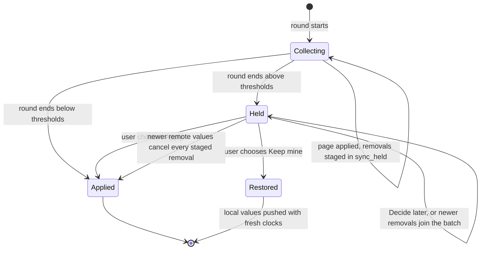
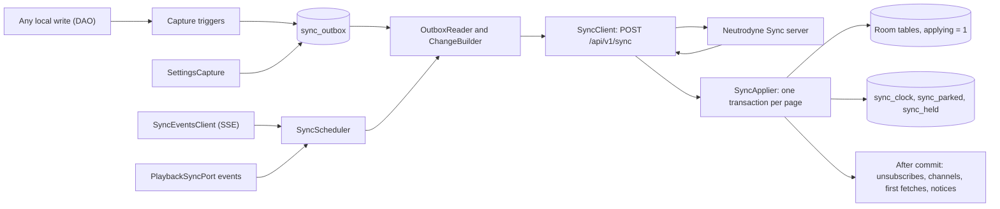
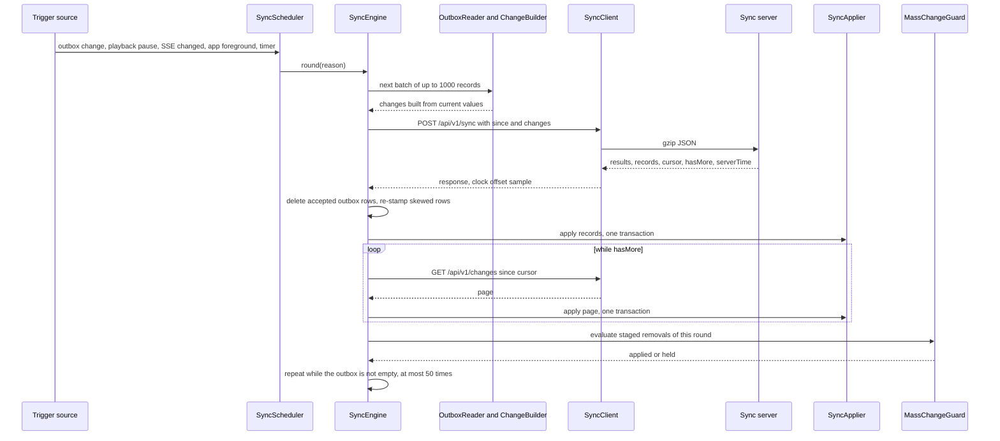
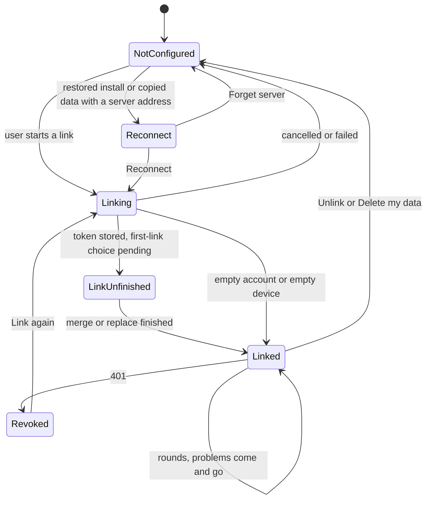
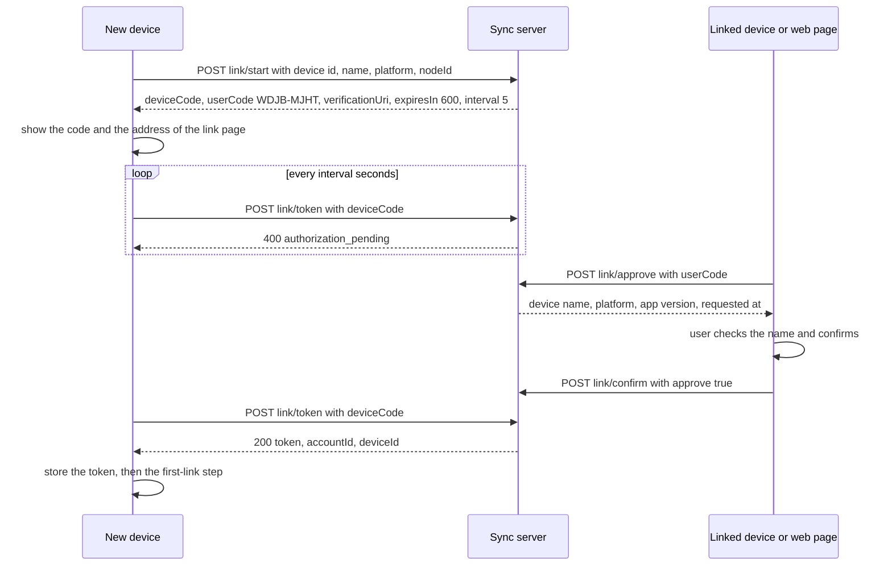
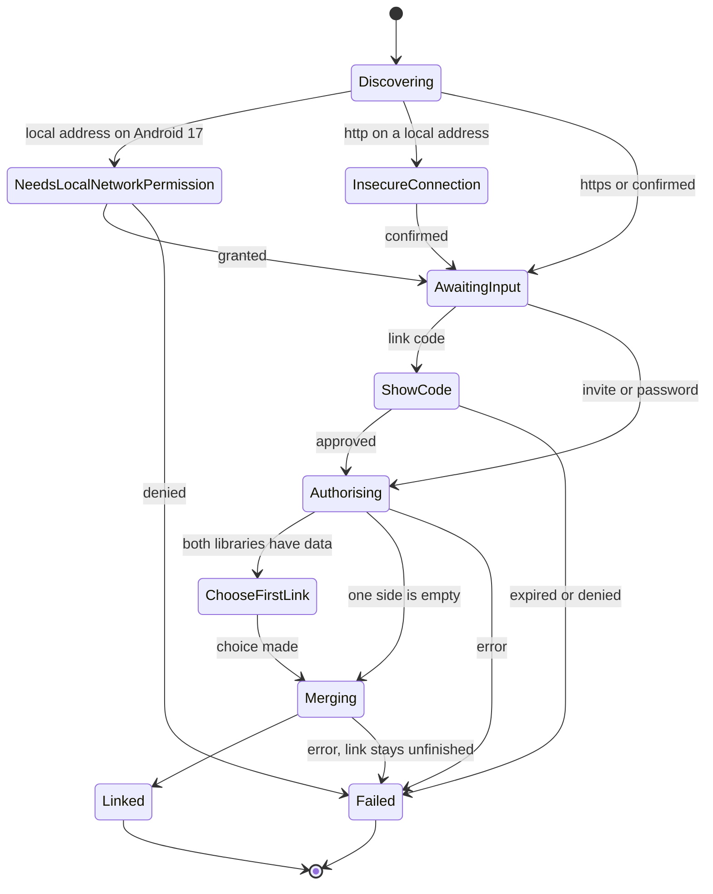
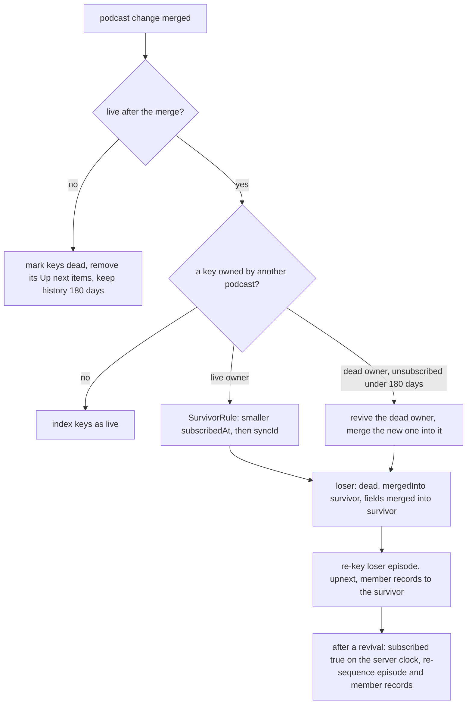

# 10 — Sync

> Status: Draft v1, 2026-10-05, created by the scope revision 2026-10-05 (S0–S13): Neutrodyne Sync — an optional, self-hosted server and its protocol v1 that keep one user's library state in step across the Android and desktop apps; adversarial review 2026-10-05: server writes on a per-account HLC that orders after every stored clock, "Use this device's library everywhere" uploads before it prunes, full resync re-asserts with stored clocks, the mass-change guard stages memberships and Up next with their podcast, group deletions held 10 s for undo, 2-s foreground pushes on Android (PB31), deployment fixes (tmpfs `noexec`, CIO idle timeout, Debian 13 Java); **final cross-document review 2026-10-05:** `synchronous = FULL` and unclean-start epoch rotation, a sequence-bounded library reset, the Android local-network definition, restore carry-over of authentication state, an account-wide login limiter, port names (`LibraryMerger`, `GroupChannelSync`), delete-then-insert triggers, the machine-ID fingerprint, PO-47 · Implements: R7.1–R7.9, R7.10 (v1.x), R6.7, R1.9 (sync side), R8.5 (cross-device resume) / N1, N2 (SSE), N3, N5 (sync and server budgets), N6 (offline queueing), N8 (server artefacts), N9, N12 (server image), N13 · Milestones: M0b (server skeleton), M1a (groundwork in schema v1), MS0, MS1, MS2, MS3, M11b, M16 (v1.x) · Honours: D1, D3, D18, D20, D22, D23, D24, D28, D29, D33, D34, D35, D38, D41, D43, D44, D59, D60, D63, D78, D79, D81, D84, D85, D91–D95; PO-2, PO-13, PO-37, PO-38, PO-41, PO-44, PO-45 (resolved) · Owns: the sync protocol (endpoints, DTOs, statuses, errors, limits, cursor and versioning), the conflict rules and conformance vectors, the client sync engine (capture rules, outbox, push, apply, parked state, scheduling, SSE, token storage, LAN gate), linking and the first merge, the server (`:sync:server`: storage, merge, dedupe, authentication, web UI, CLI, backups, garbage collection, observability), server deployment, sync and server security, the compatibility layers (v1.x), spikes S14–S17 and the procedures behind budgets PB30 and PB31

Contents: [Scope](#scope) · [What syncs](#what-syncs) · [Identity mapping](#identity-mapping) · [Protocol](#protocol) · [Conflict resolution](#conflict-resolution) · [Client sync engine](#client-sync-engine) · [Linking and first merge](#linking-and-first-merge) · [Interaction with backup, retention and YouTube](#interaction-with-backup-retention-and-youtube) · [Server architecture](#server-architecture) · [Authentication and device linking](#authentication-and-device-linking) · [Deployment](#deployment) · [Security](#security) · [Compatibility layers](#compatibility-layers) · [Testing](#testing) · [Delivery by milestone](#delivery-by-milestone) · [New names introduced here](#new-names-introduced-here) · [Open questions](#open-questions) · [Sources](#sources)

---

## Scope

Serves R7, R6.7, N1, N13. Delivered in M1a (identity and ordering columns, empty sync tables), MS0 (protocol module, merge rules, capture triggers), MS1 (server), MS2 (clients), MS3 (live updates and handoff), M11b (cross-device release gate); see [Delivery by milestone](#delivery-by-milestone). Honours [D91](../PLAN.md#3-key-decisions)–[D95](../PLAN.md#3-key-decisions).

Neutrodyne Sync keeps **user state** — subscriptions, groups, listening state, Up next, the now-playing session and a whitelist of settings — identical on one user's phones and computers through a server that user runs ([D1](../PLAN.md#3-key-decisions), [D94](../PLAN.md#3-key-decisions)). It never carries audio, downloads, artwork or feed contents: every app still polls its feeds itself, and the server makes no outbound request except its optional update check. Sync is optional: an app with no server configured sends nothing, writes nothing to the `sync_*` tables and loses no feature ([R7.1](../PLAN.md#21-functional-requirements)).

| At a glance | Decision |
|---|---|
| Protocol | Own HTTPS + JSON protocol "Neutrodyne Sync v1": one batched round trip `POST /api/v1/sync` (push local changes, pull every record changed since a server cursor), pull-only `GET /api/v1/changes`, change notification by SSE ([Protocol](#protocol)) |
| Data model | One record per entity in seven collections; every field carries a hybrid-logical-clock stamp; per-field last-writer-wins with a handful of special field kinds ([Conflict resolution](#conflict-resolution)) |
| Identity | Podcasts by a random `syncId` independent of feed URLs, groups by their `uuid`, episodes by `syncId` + `identityKey` with match hints ([Identity mapping](#identity-mapping)) |
| Client capture | SQLite triggers on the synced columns fill a coalescing outbox in the same transaction as the write; pulled pages are applied in one transaction each with capture suspended ([Client sync engine](#client-sync-engine)) |
| Safety | Position 0 never wins without an explicit reset; a pull that would remove many subscriptions or groups is held for the user; the first link merges with 05's backup rules by the rows' own timestamps ([Conflict resolution](#conflict-resolution), [Linking and first merge](#linking-and-first-merge)) |
| Server | Kotlin, Ktor 3.6.0 (CIO), SQLite through sqlite-jdbc, sharing `:sync:protocol` and `:feeds` with the apps; admin-created accounts; devices linked with short codes; no end-to-end encryption in v1 ([Server architecture](#server-architecture), [Authentication and device linking](#authentication-and-device-linking)) |
| Distribution | `neutrodyne-server-{v}.jar` on the GitHub release and `ghcr.io/{owner}/neutrodyne-server:{v}` on GHCR, same tag as the apps ([Deployment](#deployment), [D95](../PLAN.md#3-key-decisions)) |

### Responsibilities and boundaries

| This document owns | Owned elsewhere (link, do not restate) |
|---|---|
| Wire protocol, DTOs, statuses, errors, limits, versioning | Sync table DDL and the trigger SQL — [02 Sync tables](02-data-model.md#sync-tables), [02 Sync capture triggers](02-data-model.md#sync-capture-triggers) |
| Field kinds, merge rules, HLC, `OrderKey`, conformance vectors | Local Up next and group ordering queries on `orderKey` — [02 Up next ordering](02-data-model.md#up-next-ordering), [05 Group model and lifecycle](05-groups-opml-backup.md#group-model-and-lifecycle) |
| What is captured, when it is pushed, how pulled records are applied | Positions, played rule, session semantics and the shared player core — [06 Shared playback core](06-playback.md#shared-playback-core), [06 Positions and played state](06-playback.md#positions-and-played-state) |
| Linking flows, the three first-link choices, the mapping of server records onto `RestoreMerger` | Backup format, `RestoreMerger` and its rules table — [05 Full backup and restore](05-groups-opml-backup.md#full-backup-and-restore), [05 Restore while linked](05-groups-opml-backup.md#restore-while-linked) |
| Android scheduling of sync work, SSE gating, the LAN permission gate | Settings › Sync screens, dialogs, banners and wording — [08 Sync screens](08-ui-ux.md#sync-screens) |
| The desktop sync lane's behaviour | `DesktopJobRunner` and the lane contract — [11 Background work](11-desktop.md#background-work) |
| The OkHttp `SYNC` client's requirements | The OkHttp client family, interceptors and the LAN guard — [01 Networking baseline](01-foundation.md#networking-baseline) |
| Server code, schema, web UI, CLI, deployment files, server security | `release.yml` server jobs, image scan, network inventory, `PRIVACY.md` — [09 `release.yml`](09-quality-and-release.md#releaseyml), [09 Privacy](09-quality-and-release.md#privacy) |
| Spikes S14–S17; procedures for PB30 and PB31 | The budget table — [09 Performance budgets](09-quality-and-release.md#performance-budgets) |

### Modules and public API

| Module | Kind ([PLAN 5.1](../PLAN.md#51-module-graph)) | Contents from this document |
|---|---|---|
| `:sync:protocol` (`ch.lkmc.neutrodyne.sync.protocol`) | KMP, `commonMain` only, depends on nothing project-internal; its JVM variant is used by `:sync:server` | `Hlc`, `HlcClock`, `NodeId`, `OrderKey`, `FieldKind`, `FieldSpec`, `SyncCollection`, `RecordId`, `RecordState`, `FieldState`, `RecordMerger`, `MergeResult`, `EpisodeStateRules`, `SurvivorRule`, the DTOs of [Protocol](#protocol), `SyncErrorCode`, `ProtocolLimits`, `PROTOCOL_VERSION = 1`, `SyncJson`, `ConformanceVectors` (files `sync/protocol/vectors/*.json`) |
| `:sync:api` (`ch.lkmc.neutrodyne.sync.api`) | KMP, `commonMain` only | `SyncController`, `SyncStatus`, `LinkFlow`, `LinkMethod`, `LinkState`, `FirstLinkChoice`, `MassChangePrompt`, `HeldDecision`, `RemoteSessionOffer`, `SyncNotice`, `SyncDisclosure`, `SyncDevice`, `ServerInfo`, `SyncError` |
| `:core:domain` | contracts | `PlaybackSyncPort` (implemented by the playback adapters, consumed by sync), `PrePlaySync` (implemented by sync, consumed by `:playback:core`), `SyncIngestHook` (implemented by sync, consumed by 03's ingestion) |
| `:sync:impl` (`ch.lkmc.neutrodyne.sync.impl`) | KMP shared implementation | `commonMain`: `SyncEngine`, `SyncClient`, `SyncEventsClient`, `OutboxReader`, `ChangeBuilder`, `SyncApplier`, `EpisodeMatcher`, `SyncParkedStateApplier`, `FirstLinkMerger`, `MassChangeGuard`, `SessionAdopter`, `SettingsCapture`, `SyncPrePlay`, `ServerDiscovery`, `SyncTokenStore`, `SyncScheduler`, `SyncBackoff`, `SyncControllerImpl`; `androidMain`: `WorkManagerSyncScheduler`, `SyncWorker`, `LocalNetworkPermissionGate`; `desktopMain`: `DesktopSyncLane` |
| `:feature:sync` | KMP feature | Settings › Sync screens and dialogs (layout and wording: [08 Sync screens](08-ui-ux.md#sync-screens)) |
| `:sync:server` (`ch.lkmc.neutrodyne.sync.server`) | JVM application, depends only on `:sync:protocol` and `:feeds` | [Server architecture](#server-architecture) |
| `:core:testing` | KMP | `FakeSyncController`, `FakePlaybackSyncPort`, `FakePrePlaySync`, `FakeSyncIngestHook`, `FakeSettingsSyncPort`, `InMemorySyncServer` (the server's merge, dedupe and cursor rules in memory, built only on `:sync:protocol`, for client tests and S15; `:core:testing` never depends on `:sync:server`) |

```kotlin
// :sync:api — what features and the shells see. All flows are main-safe; suspend functions never throw
// for expected failures (Outcome, 01 Errors).
interface SyncController {
    val status: StateFlow<SyncStatus>
    val heldChanges: StateFlow<List<MassChangePrompt>>          // R7.7, oldest first
    val remoteSession: StateFlow<RemoteSessionOffer?>           // "Continue on this device"
    val notices: Flow<SyncNotice>                               // one-shot, not replayed
    suspend fun discover(serverUrl: String): Outcome<ServerInfo, SyncError>
    fun startLink(serverUrl: String, method: LinkMethod): LinkFlow
    suspend fun approveLink(userCode: String): Outcome<PendingDevice, SyncError>   // on a linked device
    suspend fun confirmLink(userCode: String, approve: Boolean): Outcome<Unit, SyncError>
    suspend fun syncNow(): Outcome<SyncReport, SyncError>
    suspend fun resolveHeld(id: Long, decision: HeldDecision)
    suspend fun devices(): Outcome<List<SyncDevice>, SyncError>
    suspend fun renameDevice(deviceId: String, name: String): Outcome<Unit, SyncError>
    suspend fun revokeDevice(deviceId: String): Outcome<Unit, SyncError>
    suspend fun setSyncPlaybackSettings(enabled: Boolean)
    suspend fun setShareFeedPasswords(enabled: Boolean)
    suspend fun unlink(): Outcome<Unit, SyncError>             // local data stays
    suspend fun deleteServerData(confirmation: String): Outcome<Unit, SyncError>   // "DELETE"; unlinks every device
    fun dismissRemoteSession()
    suspend fun disclosure(): SyncDisclosure                    // shown before the first link (R1.9, N3)
}
enum class LinkMethod { CODE, INVITE, PASSWORD }
enum class FirstLinkChoice { MERGE, USE_SERVER_LIBRARY, USE_THIS_LIBRARY_EVERYWHERE }
enum class HeldDecision { APPLY, KEEP_MINE, DECIDE_LATER }

interface LinkFlow {                                            // one per attempt; cancel() abandons it
    val state: StateFlow<LinkState>
    fun submitInvite(code: String)
    fun submitPassword(username: String, password: CharArray)
    fun chooseFirstLink(choice: FirstLinkChoice)
    fun grantLocalNetwork(granted: Boolean)                     // Android 17 answer, see Local-network gate
    fun cancel()
}
sealed interface LinkState {
    data object Discovering : LinkState
    data class NeedsLocalNetworkPermission(val host: String) : LinkState
    data class InsecureConnection(val host: String) : LinkState   // http:// on a local address: confirm first
    data class AwaitingInput(val method: LinkMethod, val server: ServerInfo, val disclosure: SyncDisclosure) : LinkState
    data class ShowCode(val userCode: String, val verificationUri: String, val expiresAtMs: Long) : LinkState
    data object Authorising : LinkState
    data class ChooseFirstLink(val local: LibraryCounts, val server: LibraryCounts) : LinkState
    data class Merging(val phase: MergePhase, val done: Int, val total: Int) : LinkState
    data class Linked(val accountName: String, val deviceName: String) : LinkState
    data class Failed(val error: SyncError) : LinkState
}
sealed interface SyncStatus {
    data object NotConfigured : SyncStatus
    data class Reconnect(val serverUrl: String, val username: String?) : SyncStatus  // restored or copied install
    data class LinkUnfinished(val serverUrl: String) : SyncStatus                     // first-link choice pending
    data class Linked(
        val serverUrl: String, val accountName: String, val deviceName: String,
        val lastSyncAtMs: Long?, val activity: SyncActivity, val problem: SyncProblem?,
        val heldBatches: Int,
    ) : SyncStatus
}
enum class SyncActivity { IDLE, SYNCING, LIVE }                 // LIVE: SSE connected
sealed interface SyncProblem {
    data object Offline : SyncProblem
    data class Unreachable(val error: NetError) : SyncProblem
    data object CertificateRejected : SyncProblem
    data object LocalNetworkPermissionDenied : SyncProblem      // Android 17
    data object Revoked : SyncProblem                           // 401: this device was unlinked elsewhere
    data object AppTooOld : SyncProblem                         // 426 protocol_too_old
    data object ServerTooOld : SyncProblem                      // server protocol.max < ours
    data object ClockSkew : SyncProblem                         // rejected twice after correction
    data object QuotaReached : SyncProblem
    data class Server(val status: Int) : SyncProblem
}
data class RemoteSessionOffer(val episodeId: Long, val title: String, val podcastTitle: String,
                              val positionMs: Long, val durationMs: Long?, val fromDevice: String, val atMs: Long)
sealed interface SyncNotice {
    data class MarkedPlayedElsewhere(val episodeId: Long, val title: String, val device: String) : SyncNotice
    data class Resynced(val addedFromThisDevice: Int) : SyncNotice      // after 410 cursor_expired
    data class FeedPasswordNeeded(val podcastIds: List<Long>) : SyncNotice
}
data class MassChangePrompt(val id: Long, val fromDevice: String?, val podcastTitles: List<String>,
                            val groupNames: List<String>, val heldAtMs: Long)
data class SyncDisclosure(val serverHost: String, val encrypted: Boolean, val privateFeedLinks: Int,
                          val sharesFeedPasswords: Boolean)
```

```kotlin
// :core:domain — ports between sync and playback / ingestion (bound in AndroidAppGraph and DesktopAppGraph;
// the sync-side implementations return immediately while sync is not configured).
interface PlaybackSyncPort {                                   // implemented by 06 (Android) and 11 (desktop)
    val active: StateFlow<ActivePlayback?>                      // the loaded current item, if any
    val events: Flow<PlaybackSyncEvent>                         // Paused, Stopped, Transitioned
    fun onRemoteMarkedPlayed(episodeId: Long, device: String)   // freeze position writes, never skip or stop
}
data class ActivePlayback(val episodeId: Long, val isPlaying: Boolean, val sinceMs: Long)
enum class PlaybackSyncEvent { PAUSED, STOPPED, TRANSITIONED }
interface PrePlaySync { suspend fun beforeStart() }            // "pull before play": ≤ 1.5 s, never throws
interface SyncIngestHook { suspend fun afterIngest(podcastId: Long) }   // applies parked state (03 calls it)
```

### Threading model

| Runtime | Rule |
|---|---|
| Client, network | `SyncClient` and `SyncEventsClient` run on `Dispatchers.IO` through `:core:network`'s Ktor factory over the island's `SYNC` OkHttp client ([01 Networking baseline](01-foundation.md#networking-baseline)) |
| Client, rounds | `SyncEngine.round()` is single-flight per process (a `Mutex`; a second request while one runs sets a "run again" flag instead of queueing). On the desktop the single-instance lock guarantees one process ([D85](../PLAN.md#3-key-decisions), risk T26) |
| Client, database | One Room write transaction per pulled page (≤ 1,000 records) and one per push acknowledgement; reads for `ChangeBuilder` in one read transaction (snapshot of outbox and source rows). Target: a page applies in ≤ 250 ms p95 on the reference phone, so 06's 5-s position save never waits longer than that (measured in S14) |
| Client, apply side effects | Work outside Room runs after commit. Settings and secret writes use [Durable apply effects](#durable-apply-effects); removals stay in `sync_held` until completed; channels reconcile and pending subscriptions remain due for first fetch. A cursor commit never leaves required work only in memory |
| Client, UI | `SyncController` flows are `StateFlow`s updated from the engine; features collect them on the main dispatcher (Swing EDT on the desktop) and never block on network |
| Server | Ktor CIO; route handlers suspend. One writer dispatcher (`limitedParallelism(1)`) owns the single SQLite write connection; reads use a pool of 4 connections on `Dispatchers.IO`; Argon2 hashing on a dispatcher limited to 2; backups and GC on a background scope; SSE handlers are coroutines that collect the `EventBus` ([Server architecture](#server-architecture)) |

---

## What syncs

Serves R7.3, R1.9, N3. Delivered in MS2 (all collections), MS3 (`session`). Honours [D93](../PLAN.md#3-key-decisions), [PO-37](../PLAN.md#48-further-product-owner-decisions). Tables: [02 Sync tables](02-data-model.md#sync-tables); override classification: [05 Effective settings resolution](05-groups-opml-backup.md#effective-settings-resolution); setting keys: [01 DataStore files and typed setting keys](01-foundation.md#datastore-files-and-typed-setting-keys).

### Collections

| Collection | Record ID ([Identity mapping](#identity-mapping)) | Local source | Pushed when | Applied on receipt |
|---|---|---|---|---|
| `podcast` | `syncId` | `podcast`, `podcast_url_alias`, `podcast_settings`, `credential` (opt-in) | subscribe, unsubscribe, move, user-field or override edit | subscribe as pending, unsubscribe (guarded), move, field writes |
| `group` | `uuid` | `podcast_group`, `podcast_group_settings` | create, edit, reorder, delete | create, edit, delete (guarded) |
| `member` | `{g, p}` | `podcast_group_member` | add, remove, reorder | add, remove |
| `episode` | `{p, k}` | `episode_state`, `episode_position` | played, unplayed, position (cadence of [Client sync engine](#client-sync-engine)), favourite | state writes, stubs, parked state |
| `upnext` | `{p, k}` | `queue_entry` | add, move, remove, played | add, move, remove |
| `session` | `current` | `play_session` | current item or context changes | adoption by an idle device (MS3) |
| `setting` | key name | DataStore `settings` (keys with `synced = true`) | a synced key changes locally (literal `v` intent) | journaled as `pendingSetting` with the page, then written after the commit by `SyncApplyEffects` through `SettingsSyncPort.applyRemote` ([Durable apply effects](#durable-apply-effects)) |

### Podcast fields

| Wire field | Kind | Local column | Rule |
|---|---|---|---|
| `feedUrl` | `Lww` | `podcast.feedUrl` | never contains userinfo (03 strips it); `http`/`https` only |
| `feedKeys` | `GrowSet` | `podcast.feedKey` ∪ `podcast_url_alias.url` | the whole current set is sent; receivers insert missing aliases (reason `SYNC`) |
| `subscribed` | `Tombstone` | row exists | a local unsubscribe deletes the row; the delete trigger writes the literal `false` |
| `subscribedAt` | `MinField` | `podcast.subscribedAt` | survivor choice in merges ([Identity mapping](#identity-mapping)) |
| `sourceType`, `youtubeChannelId` | `Lww` | same | set once at subscribe |
| `podcastGuid` | `Lww` | `podcastGuid` when `podcastGuidDerived = 0` | derived GUIDs never travel ([02 podcastGuid](02-data-model.md#podcastguid)) |
| `title`, `artworkUrl`, `link` | `Lww` (display hints) | same | applied only to rows still `PENDING_FIRST_FETCH`; the refresh pipeline owns them afterwards ([D15](../PLAN.md#3-key-decisions)); captured only when the value changes |
| `customTitle`, `includeInAll`, `episodeOrder`, `youtubeVariants` | `Lww` | same | user fields ([05 Merge and Replace rules](05-groups-opml-backup.md#merge-and-replace-rules) for the first link) |
| `needsCredentials` | `Lww` | `credentialId IS NOT NULL OR needsCredentials = 1` | means "this feed requires a password", not this device's error state; a receiver without a credential for `credentialOrigin` sets its local `needsCredentials = 1` and the podcast shows "Enter password" |
| `credentialOrigin` | `Lww` | `credential.origin` | the origin only, never a secret |
| `auth` | `Lww` | `credential` (decrypted at push time) | `{u, p}`; pushed only while `sync.share_feed_passwords` is on for the pushing device; otherwise the field is omitted, never sent as null ([Feed passwords and private feed URLs](#feed-passwords-and-private-feed-urls)) |
| `s.playbackSpeed`, `s.skipSilence`, `s.boostDb`, `s.introSkipMs`, `s.outroSkipMs` | `Lww` (null = inherit) | `podcast_settings` | synced overrides (`boostDb`, intro and outro skip are reserved until M12 but sync from v1.0 so no protocol change is needed) |

Device-local (never on the wire): `status`, `initialFetch`, validators, scheduling and error columns, `latestEpisodeAt`, `autoDownloadEligibleAfter`, `artworkKey`, `bannerUrl`, `channelMetadataAt`, description and categories, and the device-local override fields `autoDownload*`, `deleteAfterPlayed`, `includeVideoInAutoDownload`, `notifyNewEpisodes`, `refreshIntervalMinutes`.

### Group and member fields

| Collection | Wire field | Kind | Local column |
|---|---|---|---|
| `group` | `name` | `Lww` | `podcast_group.name` (receivers recompute `nameKey` with `GroupNames`) |
| `group` | `colorArgb`, `iconKey`, `feedOrder`, `playOrder`, `filterFlags`, `mediaFilter`, `hideOlderThanDays`, `showAsTab` | `Lww` | same |
| `group` | `ok` | `Lww` | `podcast_group.orderKey` |
| `group` | `createdAt` | `MinField` | `podcast_group.createdAt` (survivor choice for equal names) |
| `group` | `deleted` | `Tombstone` | row exists |
| `group` | `s.playbackSpeed`, `s.skipSilence`, `s.boostDb`, `s.introSkipMs`, `s.outroSkipMs` | `Lww` | `podcast_group_settings` |
| `member` | `in` | `Tombstone` | row exists |
| `member` | `ok` | `Lww` | `podcast_group_member.orderKey` |
| `member` | `addedAt` | `MinField` | `podcast_group_member.addedAt` |

Device-local: `lastViewedAt` ("new since last visit" is per device), `kind` and `ruleJson` (reserved smart groups, v1.x), the group's notification channel and its device-local overrides, `podcast_group_member.source`.

### Episode, Up next and session fields

| Collection | Wire field | Kind | Local source | Rule |
|---|---|---|---|---|
| `episode` | `pos` | `LwwPosition` | `episode_position` | `{ms, dur, src}`; an incoming `ms = 0` wins only with `reset: true` (explicit reset, mark played, mark unplayed) |
| `episode` | `played`, `playedAt` | `Lww` (one clock) | `episode_state.playedAt` | `played = playedAt != null`; both fields always carry the same clock |
| `episode` | `fav` | `Lww` | `episode_state.isFavorite` | |
| `episode` | `playCount` | `MaxField` | `episode_state.playCount` | approximate across devices (accepted) |
| `episode` | `lastPlayedAt` | `MaxField` | `episode_state.lastPlayedAt` | |
| `episode` | `measuredDurationMs` | `Lww` (hint) | `episode_state.measuredDurationMs` | |
| `episode` | `match` | hints (no clock) | `episode` feed columns | `guid`, `enc`, `title`, `date`, `link`, `ytId`, `kv`; the newest non-null value of each hint is kept |
| `upnext` | `in` | `Tombstone` | `queue_entry` row exists | the current item is never in Up next ([06 Queue and play context](06-playback.md#queue-and-play-context)), so a start pushes `in = false` |
| `upnext` | `ok` | `Lww` | `queue_entry.orderKey` | |
| `session` | `episode` | `Lww` | `play_session.currentEpisodeId` | `{p, k}` or null |
| `session` | `context` | `Lww` | `play_session.context*` | `{type, group, podcast, order, filters {flags, media}, minSortDate, anchor {p, k}, anchorSortDate}`; groups by `uuid`, podcasts by `syncId` |

`upnext` and `session` changes also carry the referenced episode's `match` hints, so a receiver that has not ingested the episode can create a stub ([Parked state and stubs](#parked-state-and-stubs)). Derived and device-local: `startedAt` (derived from the merged state, [Episode-state rules](#episode-state-rules)), `isNew`, `downloadDismissedAt`, every `download` row, `play_session.generation`.

### Settings

`SettingKey` (01) gains `synced: Boolean`; only `PORTABLE` keys may set it. A synced key travels as one `setting` record whose ID is the key name and whose single field `v` holds the JSON value; receivers validate it with the key's own type and range checks and skip invalid or unknown keys. All synced keys sit behind "Sync playback settings" (`sync.sync_playback_settings`, on by default, [PO-37](../PLAN.md#48-further-product-owner-decisions)).

| Class | Keys |
|---|---|
| Synced (`synced = true`) | `playback.speed`, `playback.skip_silence`, `playback.skip_back_ms`, `playback.skip_forward_ms`, `playback.smart_resume`, `playback.speed_presets`, `playback.sleep_last_minutes`, `feeds.show_notes_images`, `feeds.backfill_paged_feeds` |
| Portable, never synced | `playback.hardware_buttons`, `playback.stream_on_metered`, `playback.stream_cache_mb`, `playback.pause_for_navigation`, every `appearance.*`, `downloads.*`, `ui.*`, `updates.*`, `youtube.engine_*`, `feeds.notify_new_episodes`, `feeds.refresh_*`, `feeds.scheduled_*`, `feeds.last_*`, `sync.server_url`, `sync.username` |
| Sync's own keys | `sync.server_url`, `sync.username` (`settings`, portable, not synced: a restored install offers "Reconnect"); `sync.device_name`, `sync.sync_playback_settings`, `sync.share_feed_passwords` (`device_settings`) |

The [definition of done](../PLAN.md#72-definition-of-done-every-milestone) requires every new portable key to declare `synced`; the default for a new key is `false`.

### Per-scope overrides

| Override field (`ScopeOverrides`, [D20](../PLAN.md#3-key-decisions)) | Podcast and group scope |
|---|---|
| `playbackSpeed`, `skipSilence`, `boostDb`, `introSkipMs`, `outroSkipMs` | synced (`s.<field>`) |
| `autoDownload`, `autoDownloadKeepLatest`, `autoDownloadNetwork`, `autoDownloadRequireCharging`, `deleteAfterPlayed`, `includeVideoInAutoDownload`, `notifyNewEpisodes`, `refreshIntervalMinutes` | device-local |

A podcast or group settings row that becomes all-null is deleted locally ([02 podcast_settings](02-data-model.md#podcast_settings)); the delete trigger pushes each synced override as `null` (inherit). A receiver writes the synced columns and leaves its device-local columns untouched, creating or deleting the row as 02's rule requires.

### Feed passwords and private feed URLs

- Feed URLs travel as they are, including private tokenised ones ([R1.9](../PLAN.md#21-functional-requirements)). The disclosure shown before the first link counts them (`SyncDisclosure.privateFeedLinks`, from `PrivateFeedUrls.looksPrivate`, [03 Private feed URLs](03-feeds-and-discovery.md#private-feed-urls)) and says that the server stores them and the listening history readably ([Privacy and disclosure](#privacy-and-disclosure)).
- Basic-auth passwords travel only in the `auth` field, only from a device whose "Share feed passwords" (`sync.share_feed_passwords`, `device_settings`, default off) is on. Turning it on pushes `auth` for every podcast with a credential (one capture per podcast); turning it off pushes nothing (passwords already on the server stay until the user changes the feed's password or deletes server data — the switch's help text says so).
- A receiver stores a received `auth` through `SecretStore` (Android Keystore; the desktop per [PO-44](../PLAN.md#48-further-product-owner-decisions)) after the page commits, inside 03's `CredentialCommitCoordinator` ([Durable apply effects](#durable-apply-effects)), whether or not its own switch is on: the switch controls what a device sends, not what it accepts. A received credential is used only for the podcast's `credentialOrigin` (01's `AuthInterceptor` looks up by origin).
- Without `auth`, the receiver keeps the podcast subscribed with `needsCredentials = 1` and posts `SyncNotice.FeedPasswordNeeded` once per pull.

### Never synced

Audio files and download rows, streaming cache, feed contents and show notes, chapters, transcripts, artwork files, refresh validators and schedules, import sessions and history, the YouTube engine, its versions and settings, update-check state, crash data and logs, `device_settings`, the sync token and `sync_state` itself, and every device-local column above. The server never fetches a feed, an enclosure or an image ([D1](../PLAN.md#3-key-decisions)).

---

## Identity mapping

Serves R7.3, R7.6, N1. Delivered in M1a (`syncId`, `orderKey` columns), MS1 (server dedupe), MS2 (client resolution). Honours [D18](../PLAN.md#3-key-decisions), [D29](../PLAN.md#3-key-decisions), [D91](../PLAN.md#3-key-decisions); storage: [02 Identity keys](02-data-model.md#identity-keys).

### Record IDs

| Collection | Wire `id` | Canonical `rid` text (server `record.rid`, client `sync_outbox.rid`, `sync_clock.rid`) |
|---|---|---|
| `podcast` | `"6f0c2a3e-…"` (`syncId`) | the UUID (36 chars, lowercase) |
| `group` | `"0d7c…"` (`uuid`) | the UUID |
| `member` | `{"g": groupUuid, "p": podcastSyncId}` | `g + p` (72 chars, no separator: both are fixed-length) |
| `episode`, `upnext` | `{"p": podcastSyncId, "k": identityKey}` | `p + k` (36 chars + the key verbatim with its version prefix, [02 Episode identityKey](02-data-model.md#episode-identitykey)) |
| `session` | `"current"` | `current` |
| `setting` | `"playback.skip_back_ms"` | the key name |

Record IDs are scoped to an account; there are no global IDs. `RecordId` (`:sync:protocol`) parses and validates both forms (UUID syntax, `identityKey` ≤ 2 KiB, setting keys `[a-z0-9_.]{1,64}`).

### Podcast syncId

- `podcast.syncId` is a random UUIDv4 in lowercase, set by every insert path — subscribe (03), import commit (05), restore (05; a restore adopts the backup's `syncId` when it is present and unused locally) and sync apply (the record's ID) — and unique ([02 Sync tables](02-data-model.md#sync-tables)). It is independent of the feed URL, which changes on moves and renormalisation ([02 Podcast feedKey and aliases](02-data-model.md#podcast-feedkey-and-aliases)).
- It changes only when a merge redirects it ([Redirects on clients](#redirects-on-clients)); every other path keeps it, so episode records keyed by it survive feed moves.
- Without sync it is never read, but it costs nothing and makes linking a later device a matter of uploading, not re-identifying ([D93](../PLAN.md#3-key-decisions)).

### Same podcast on two devices

Two devices that subscribe to the same feed offline create two `syncId`s for one `feedKey`. The server merges them; clients apply the same rule locally when the collision reaches them first.

- **Index.** The server keeps `podcast_key(account, feed_key, podcast_rid, live)` over every podcast record's `feedKeys` plus `UrlNormalizer.forIdentity(feedUrl)` computed server-side with the shared `:feeds` code.
- **Live collision.** A change that makes podcast `B` live with a key owned by another live podcast `A` merges them: `SurvivorRule.podcast` keeps the one with the smaller `subscribedAt`, then the smaller `syncId`; the loser gets `mergedInto = survivor` and is dead; its fields merge into the survivor by the normal field rules; its `episode`, `upnext` and `member` records are re-keyed to the survivor (field merge where the target exists; the old record becomes dead with `mergedInto`). The push result for the loser is `merged` with `mergedInto`.
- **Revival.** A change that makes `B` live with a key owned by a *dead, unsubscribed* (not merged) podcast `A` whose death is less than 180 days old merges `B` into `A` and revives `A`: `subscribed = true` stamped with the server clock, which orders after `A`'s tombstone even when `B`'s own clock does not (a device whose stored tombstone clock is newer than `B`'s would otherwise ignore the revival and diverge). `A`'s live `episode` and `member` records get fresh `seq`s, so devices that already passed them receive the history again: re-subscribing restores played state, positions and group membership ([PO-45](../PLAN.md#48-further-product-owner-decisions) keeps unsubscribed podcasts' episode records 180 days); Up next items do not come back (the server removed them when `A` died, [Write path](#write-path)). The same re-sequencing happens when any device overturns `subscribed = false` with a newer `true` (for example "Keep mine", [Mass-change guard](#mass-change-guard)).
- **Equal real `podcastGuid` alone never merges**, as on the device ([03 Podcast dedupe and merge](03-feeds-and-discovery.md#podcast-dedupe-and-merge)).

### Feed moves

A device that accepts a move (03: 301/308 chain, validated `itunes:new-feed-url`, "Edit URL") pushes `feedUrl` and the grown `feedKeys` set. Receivers apply it like a local move without fetching: update `feedUrl` and `feedKey`, insert the old key as an alias, discard validators; the next refresh fetches the new URL ([03 Feed moves, auth and paging](03-feeds-and-discovery.md#feed-moves-auth-and-paging)). A move that collides with another live podcast's key is a server-arbitrated merge (above).

**Local merges.** When a move on this device collides with another local podcast, 03 runs 02's merge ([02 Unsubscribe and merge](02-data-model.md#unsubscribe-and-merge)), which deletes the loser row. That delete must not be pushed as an unsubscribe — other devices would drop the loser's episodes instead of merging them. The merge transaction therefore deletes the loser with `applying = 1` and records the loser's move instead: literal `feedUrl` (the winner's URL) and `feedKeys` (the loser's keys plus the winner's) outbox rows for the loser's `syncId` (`SyncOutboxDao.captureLiteral`, 02). The server then sees a live collision and merges by `SurvivorRule`; if it keeps the loser's `syncId`, this device follows the redirect.

### Episode keys, match hints and rekey

- Every episode, Up next and session change carries **match hints** — `guid`, `enc` (enclosure URL), `title`, `date` (ISO-8601), `link`, `ytId`, `kv` (the `EpisodeKeys` version of `k`) — the same fields as 05's `EpisodeLineV1` stub fields.
- `EpisodeMatcher` resolves an incoming record against the podcast's local episodes with 02's restore ladder ([02 Restore matching](02-data-model.md#restore-matching)): `identityKey` (computing local keys with `EpisodeKeys.keyFor(local, kv)` when `kv` differs from the stored version; a `kv` newer than the app's `EpisodeKeys.VERSION` skips key matching), then normalised enclosure URL, then guid. A match whose local key differs from `k` records a local alias in `sync_clock` (`{"alias": localRid}` entry, [Redirects on clients](#redirects-on-clients)), so later records for `k` resolve without re-matching.
- When this device's ingestion rewrites a key in place (03's older-version match or a host that rewrote GUIDs; 02's `IngestDao.rekey`), the trigger `sync_cap_episode_rekey` (02) pushes a **`rekey`** change `{coll: "episode", op: "rekey", id: {p, k: old}, to: {p, k: new}}` — only when the old record is known to sync (a `sync_clock` or `sync_outbox` row exists for it) — and moves this device's outbox and clock rows from the old to the new `rid`. The server merges the old record into the new one (field rules), marks the old one dead with `mergedInto`, and does the same for `upnext`. Clients holding the old key follow `mergedInto`.
- Key-version or normaliser divergence between app versions (risk SR3) therefore costs at most an unmatched record that waits in `sync_parked` until a later ingest or rekey resolves it.

### Groups with equal names

Groups are unique per `nameKey` (NFC + lowercase, [02 Group uuid and nameKey](02-data-model.md#group-uuid-and-namekey)). Two devices that create "News" offline produce two UUIDs with one `nameKey`. The server keeps `group_name(account, name_key, group_rid)` over live groups, computes `nameKey` with the shared `GroupNames` (`:feeds`), and merges a collision as 05's restore does: `SurvivorRule.group` keeps the smaller `createdAt`, then the smaller `uuid`; memberships are united (the loser's `member` records re-keyed to the survivor); the loser becomes `deleted` with `mergedInto`. A rename that collides merges in the same way. The merge notice (08) names the merged groups, because "News" and "news" merging is consistent with restore but can surprise.

### Redirects on clients

`sync_clock` rows double as a local redirect table: a row whose `clocks` JSON contains `"→": "<rid>"` maps an incoming `rid` to the local record it was merged into or matched as. `SyncApplier` resolves every incoming ID through at most 8 hops before matching.

| Incoming | Local effect (with `applying = 1`) |
|---|---|
| `podcast` record with `mergedInto = S`, local row has the loser `syncId` `L`, no local row has `S` | `UPDATE podcast SET syncId = S`; rewrite `rid` prefixes `L` → `S` in `sync_outbox` and `sync_clock` (`episode`, `upnext`, `member`); keep a redirect row `L → S` |
| same, and a local row already has `S` | 02's merge of `L` into `S` (03's helper, files of matched loser downloads handled as in 03; its loser cascade may delete a credential, so `SyncApplier` acquires `CredentialCommitCoordinator` before this page's transaction, releases it when the transaction ends (before the effect drain of [Pull and apply](#pull-and-apply) step 5), and `merge(…, origin = SYNC)` does not acquire it again, [03 Basic auth and CredentialStore](03-feeds-and-discovery.md#basic-auth-and-credentialstore)), then the redirect row |
| `group` record with `mergedInto = S`, local loser `L` | if no local `S`: `UPDATE podcast_group SET uuid = S`, then 05's channel re-creation for the new `uuid` (the old channel's importance and sound are copied where the platform allows, [Open questions](#open-questions) 5); else 05's merge (members united, `L` deleted) |
| Remote podcast or group that collides locally with an unsynced local one (same `feedKey` or `nameKey`, different ID) | the same `SurvivorRule` as the server; the local loser is merged into the survivor and its pending outbox rows stay, so the server performs the identical merge when they arrive |
| `episode` or `upnext` record with `mergedInto` | rewrite the local `rid` and follow |

---

## Protocol

Serves R7.2, R7.4, N9, N13. Delivered in M0b (discovery, health), MS1 (everything else), MS3 (events in use by clients). Honours [D91](../PLAN.md#3-key-decisions). Neutrodyne Sync v1 is specified here and nowhere else; `:sync:protocol` is its executable form, shared by both apps and the server.

### Conventions

| Item | Rule |
|---|---|
| Transport | HTTPS through the administrator's reverse proxy ([TLS stance and insecure LAN mode](#tls-stance-and-insecure-lan-mode)); plain HTTP only to loopback or, with `--insecure-lan`, to a local address |
| Encoding | JSON, UTF-8. Requests may be sent with `Content-Encoding: gzip` (clients compress bodies above 8 KiB); responses are gzip-compressed when the client sends `Accept-Encoding: gzip` (OkHttp does by default); the SSE stream is never compressed |
| Headers | `Authorization: Bearer nds_<base64url>` on every authenticated call; `Neutrodyne-Sync-Protocol: 1` on every call; `User-Agent` from 01's `UserAgentInterceptor`; `X-Request-Id` echoed by the server (Ktor CallId) |
| JSON | `SyncJson` = `Json { ignoreUnknownKeys = true; explicitNulls = false; encodeDefaults = false }`. Unknown members are ignored on both sides; unknown *fields of a record* are stored and returned by the server ([Field kinds and the record merger](#field-kinds-and-the-record-merger)) |
| Times | Clocks are HLC wire strings ([Hybrid logical clocks](#hybrid-logical-clocks)); `serverTime` and `date` hints are ISO-8601 UTC with milliseconds; durations and positions are integer milliseconds |
| Errors | RFC 9457 `application/problem+json` with an extension member `code` ([Errors](#errors)); the device-link token endpoint uses RFC 8628's `{"error": …}` shape instead |
| Idempotency | Every push is safe to retry: field merges are idempotent and commutative, so no batch ID exists |

### Endpoint overview

| Method and path | Auth | Request → response | Rate limit ([Rate limits](#rate-limits)) |
|---|---|---|---|
| `GET /.well-known/neutrodyne-sync` | none | → `DiscoveryDocument` | `public` |
| `POST /api/v1/auth/login` | none | `LoginRequest` → `TokenResponse` | `login` |
| `POST /api/v1/auth/invite/redeem` | none | `InviteRedeemRequest` → `TokenResponse` | `login` |
| `POST /api/v1/auth/link/start` | none | `LinkStartRequest` → `LinkStartResponse` | `link-start` |
| `POST /api/v1/auth/link/token` | none | `LinkTokenRequest` → `TokenResponse` or `400 {"error"}` | the request's `interval` |
| `POST /api/v1/auth/link/approve` | device token | `LinkApproveRequest` → `LinkApproveResponse` | `link-approve` |
| `POST /api/v1/auth/link/confirm` | device token | `LinkConfirmRequest` → `204` | `link-approve` |
| `POST /api/v1/auth/logout` | device token | → `204` (revokes the calling token) | `account` |
| `GET /api/v1/devices` | device token | → `[DeviceDto]` | `account` |
| `PATCH /api/v1/devices/{id}` | device token | `DeviceRenameRequest` → `DeviceDto` | `account` |
| `DELETE /api/v1/devices/{id}` | device token | → `204` (revokes that device's tokens, closes its SSE streams) | `account` |
| `GET /api/v1/account` | device token | → `AccountSummary` | `account` |
| `POST /api/v1/sync` | device token | `SyncRequest` → `SyncResponse` | `sync` |
| `GET /api/v1/changes?since=&limit=` | device token | → `ChangesPage` | `sync` |
| `GET /api/v1/events?hb=` | device token | SSE stream | at most 10 concurrent per account, 2 per device |
| `POST /api/v1/account/reset` | device token | `AccountResetRequest` → `AccountSummary` | `account` |
| `GET /api/v1/account/export` | device token | → Neutrodyne backup ZIP (`application/zip`) | `export` |
| `GET /healthz`, `GET /readyz` | none | → `200 ok` / `503` (no details in the body) | none |
| `GET /metrics` | none, separate listen address | → Prometheus text | none |

The web UI's routes (`/`, `/link`, `/setup`, …, [Web UI](#web-ui)) are HTML only and never part of the protocol.

### Discovery

```http
GET /.well-known/neutrodyne-sync
200 OK
{"name":"Home","serverVersion":"1.0.0","protocol":{"min":1,"max":1},
 "features":["sse","link","password"],"maxBatch":1000,"maxSkewMs":300000,
 "serverTime":"2026-10-05T15:00:00.123Z"}
```

`features` lists what this server offers: `sse` (events), `link` (link codes), `password` (password login is enabled for at least one account — the client then shows the password option), `gpodder` (the v1.x layer is enabled). `ServerDiscovery` (client) rejects a document whose `protocol` range excludes `PROTOCOL_VERSION` (`ServerTooOld` or `AppTooOld`), records `serverTime − local midpoint` as the first clock-offset sample, and is called by the setup screen's "Check" and before every link attempt. Discovery is unauthenticated and reveals only the server's display name and version.

**M0b skeleton (deviation 2026-10-06).** The M0b server serves the document from `:sync:server` (`WellKnownRoutes`) instead of `:sync:protocol`'s `DiscoveryDocument` DTO (which arrives with MS0): `name` is the fixed string `Neutrodyne Sync` (the example's per-server display name has no configuration source yet; one arrives with the web UI), `features` is empty (no `sse`, `link` or `password` exists before MS1), and `maxBatch`/`maxSkewMs` come from the server's `DiscoveryNumbers` until `ProtocolLimits` lands in `:sync:protocol` with MS0. `PROTOCOL_VERSION` itself already lives in `:sync:protocol` (`commonMain`).

### Sync round trip

`POST /api/v1/sync` pushes up to 1,000 changes and returns every record changed after `since` (at most 1,000) plus the outcome of each change.

```http
POST /api/v1/sync
Authorization: Bearer nds_3q2…
Neutrodyne-Sync-Protocol: 1
Content-Type: application/json
Content-Encoding: gzip

{"since":"c:7f3a9c01:4711",
 "changes":[
  {"coll":"podcast","id":"6f0c2a3e-1b6d-4c1e-9a55-0b9b8c2f1d10",
   "fields":{"feedUrl":{"v":"https://feeds.example.com/show.xml","c":"01a10c942d800000-9f86d081884c7d65"},
             "feedKeys":{"add":["feeds.example.com/show.xml","example.com/show.xml"]},
             "subscribed":{"v":true,"c":"01a10c942d800000-9f86d081884c7d65"},
             "subscribedAt":{"v":1791000000000,"c":"01a10c942d800000-9f86d081884c7d65"},
             "s.playbackSpeed":{"v":1.3,"c":"01a10c942d800001-9f86d081884c7d65"}}},
  {"coll":"episode","id":{"p":"6f0c2a3e-1b6d-4c1e-9a55-0b9b8c2f1d10","k":"g:tag:example.com,2026:ep42"},
   "match":{"guid":"tag:example.com,2026:ep42","enc":"https://cdn.example.com/ep42.mp3",
            "title":"Episode 42","date":"2026-10-01T05:00:00.000Z","kv":1},
   "fields":{"pos":{"v":{"ms":1394000,"dur":3600000,"src":"STREAM"},"c":"01a10c944108000a-9f86d081884c7d65"},
             "played":{"v":false,"c":"01a105ed4c000000-9f86d081884c7d65"},
             "playedAt":{"v":null,"c":"01a105ed4c000000-9f86d081884c7d65"},
             "fav":{"v":true,"c":"01a105ed4c000000-9f86d081884c7d65"}}},
  {"coll":"upnext","id":{"p":"6f0c2a3e-1b6d-4c1e-9a55-0b9b8c2f1d10","k":"g:tag:example.com,2026:ep43"},
   "match":{"guid":"tag:example.com,2026:ep43","enc":"https://cdn.example.com/ep43.mp3","kv":1},
   "fields":{"in":{"v":true,"c":"01a10c944108000b-9f86d081884c7d65"},"ok":{"v":"a0Vx3","c":"01a10c944108000b-9f86d081884c7d65"}}},
  {"coll":"member","id":{"g":"0d7c5b1e-8f0a-4a63-b2d4-5c3e1f6a7b80","p":"6f0c2a3e-1b6d-4c1e-9a55-0b9b8c2f1d10"},
   "fields":{"in":{"v":true,"c":"01a10c944108000c-9f86d081884c7d65"},"ok":{"v":"a1","c":"01a10c944108000c-9f86d081884c7d65"}}},
  {"coll":"episode","op":"rekey","id":{"p":"6f0c2a3e-1b6d-4c1e-9a55-0b9b8c2f1d10","k":"u:old.example.com/ep7.mp3"},
   "to":{"p":"6f0c2a3e-1b6d-4c1e-9a55-0b9b8c2f1d10","k":"g:ep7-guid"}}
 ]}
```

```http
200 OK
Content-Type: application/json
Content-Encoding: gzip

{"results":[{"i":0,"status":"applied"},{"i":1,"status":"applied"},{"i":2,"status":"stale"},
            {"i":3,"status":"applied"},
            {"i":4,"status":"merged","mergedInto":{"p":"6f0c2a3e-1b6d-4c1e-9a55-0b9b8c2f1d10","k":"g:ep7-guid"}}],
 "records":[
  {"coll":"upnext","id":{"p":"6f0c2a3e-1b6d-4c1e-9a55-0b9b8c2f1d10","k":"g:tag:example.com,2026:ep43"},"seq":4650,"by":"3b1f…",
   "fields":{"in":{"v":false,"c":"01a10c944d400000-1f2e3d4c5b6a7980"},"ok":{"v":"a0V","c":"01a10c944d400000-1f2e3d4c5b6a7980"}},
   "match":{"guid":"tag:example.com,2026:ep43","enc":"https://cdn.example.com/ep43.mp3","kv":1}},
  {"coll":"group","id":"0d7c5b1e-8f0a-4a63-b2d4-5c3e1f6a7b80","seq":4712,"by":"3b1f…",
   "fields":{"name":{"v":"Tech","c":"01a10c90a1c00000-1f2e3d4c5b6a7980"},"ok":{"v":"a0","c":"01a10c90a1c00000-1f2e3d4c5b6a7980"},
             "deleted":{"v":false,"c":"01a10c90a1c00000-1f2e3d4c5b6a7980"},"createdAt":{"v":1790900000000}}},
  {"coll":"session","id":"current","seq":4790,"by":"3b1f…",
   "fields":{"episode":{"v":{"p":"6f0c…1d10","k":"g:tag:example.com,2026:ep41"},"c":"01a10c943c000000-1f2e3d4c5b6a7980"},
             "context":{"v":{"type":"GROUP","group":"0d7c…7b80","order":"NEWEST_FIRST","filters":{"flags":1,"media":"ALL"}},
                        "c":"01a10c943c000000-1f2e3d4c5b6a7980"}},
   "match":{"guid":"tag:example.com,2026:ep41","enc":"https://cdn.example.com/ep41.mp3","kv":1}}],
 "cursor":"c:7f3a9c01:4795","hasMore":false,"serverTime":"2026-10-05T15:00:05.412Z"}
```

The `upnext` record (`seq` 4650, below `since`) is the current state behind result 2: another device removed the item later, so the push was `stale`. The five records this push changed (`seq` 4791–4795: the podcast, the `ep42` episode, the member, the dead `u:old…/ep7` record and its `g:ep7-guid` survivor) are also in `records`; they are left out of the example for brevity.

Server rules for one call (one write transaction, [Write path](#write-path)):

1. Validate the headers, size and depth ([Request pipeline](#request-pipeline)), then each change independently. A rejected change never fails the batch.
2. Merge every accepted change into its stored record with `RecordMerger` (`:sync:protocol`), assign a new `seq` to every record that changed, update the dedupe indexes and run merges.
3. After the push, read the **page**: the records with `seq > since` in `seq` order, at most 1,000 and at most 8 MiB of uncompressed JSON. Add the current record of every change whose result is `stale` or `merged` that is not already in the page (so the client learns the winning values even when its cursor is already past them); these **extras** are always included, whatever their size (a client whose push was `stale` has no other way to learn the winning value), and never move the cursor. Real records are a few hundred bytes, so page plus extras stay far below the client's 32-MiB response cap; only records filled to every field cap by a misbehaving device of the same account could exceed it, and that round then fails visibly ([Error handling and backoff](#error-handling-and-backoff)). `cursor` is the `seq` of the page's last record (or `since` when the page is empty); `hasMore` is true when records with a larger `seq` exist.
4. The caller's own changes come back in `records`; clients apply every record idempotently and do not skip their own echoes, because a record whose last writer is this device can still contain other devices' newer fields.

### Pull only

`GET /api/v1/changes?since=c:7f3a9c01:4795&limit=1000` returns `ChangesPage {records, cursor, hasMore, serverTime}` with the same ordering and cursor rules, without pushing. Clients use it to drain `hasMore` after a `/sync` and for SSE-triggered pulls when the outbox is empty. `since` absent means "from the beginning" (first link, full resync); `limit` is clamped to 1–1,000.

### Events

`GET /api/v1/events?hb=90` opens a Server-Sent Events stream ([Ktor server SSE](https://ktor.io/docs/server-server-sent-events.html)). It only signals; data always comes through `/sync` or `/changes`.

```text
retry: 10000

event: changed
data: {"cursor":"c:7f3a9c01:4796","by":"3b1f0c9e-…"}

: hb
```

- One `changed` event per committed push of the account (coalesced: a client that is slow to read receives only the newest). `by` is the pushing device's ID.
- A heartbeat comment every `hb` seconds (default 60, accepted 30–120; Android asks for 90, [Live updates](#live-updates)) keeps idle streams open through proxies and lets clients detect dead connections. nginx's default `proxy_read_timeout` is 60 s, so the reference snippet raises it to 1 h for this path ([nginx](#nginx)).
- `retry: 10000` tells clients to wait 10 s before reconnecting; clients add their own backoff on repeated failures.
- The server closes a stream when its token is revoked, on shutdown, and after 24 h (clients reconnect); responses carry `Cache-Control: no-store` and `X-Accel-Buffering: no` ([nginx proxy_buffering](https://nginx.org/en/docs/http/ngx_http_proxy_module.html#proxy_buffering)).
- A client runs a round when `by` is not itself. It never parses the cursor.

### Account and health endpoints

- `GET /api/v1/account` → `AccountSummary {username, counts {podcasts, groups, episodes, upnext, settings}, devices, quotaRecords, records, passwordSetAt}` (live records only; `passwordSetAt` only within 30 days of a first password, [Passwords](#passwords)). The first link uses it to decide whether the account is empty ([First-link choices](#first-link-choices)).
- `POST /api/v1/account/reset` with `AccountResetRequest {confirm: "DELETE", mode}`:
  - `mode = "library"` with `beforeCursor` (the cursor of the caller's staged snapshot, required; an epoch other than the account's → `410 cursor_expired`, a `seq` above the account's → `400 invalid`), in one write transaction: every live `podcast`, `group`, `member` and `upnext` record whose `seq` is at most the cursor's `seq` gets its removal (`subscribed = false`, `deleted = true`, `in = false`), and a `session` with such a `seq` gets `episode = null`, all stamped with the account's server clock ([Hybrid logical clocks](#hybrid-logical-clocks)); every record written after the snapshot — the caller's upload and any other device's change, whatever its clock — has a higher `seq` and stays, and episode records and settings are untouched. The bound is a sequence, not a clock (changed 2026-10-05): admission lets clocks run 5 min ahead, so another device that never saw this device's clocks could write a record stamped below an HLC bound during the upload, and a clock-based prune would delete it silently. The calling device uploads its library first and prunes last ([Use this device's library everywhere](#use-this-devices-library-everywhere)). Audit-logged.
  - `mode = "purge"` deletes every record, index row and per-account backup ZIP of the account, revokes every device token and web session of the account (the caller's included) and rotates the account's cursor epoch. Used by "Delete my data on the server". Audit-logged.
- `GET /api/v1/account/export` streams a Neutrodyne backup ZIP (05 format, `formatVersion` 1) built by `AccountBackupWriter` from the account's records ([Backups](#backups)); credentials are never included.
- `GET /healthz` answers `200` while the process serves; `GET /readyz` answers `200` when the database accepts a write transaction (`BEGIN IMMEDIATE; ROLLBACK`), migrations are complete and the data volume has ≥ 50 MB free, else `503` (M0b deviation 2026-10-06: the skeleton has no database yet, so its readiness checks only that the data directory exists and the volume has ≥ 50 MB free; the write-transaction and migration checks join with MS1's storage). `GET /metrics` exists only when `NEUTRODYNE_SERVER_METRICS_LISTEN` is set ([Observability](#observability)).

### DTOs

```kotlin
// :sync:protocol — ch.lkmc.neutrodyne.sync.protocol.dto (kotlinx.serialization, SyncJson)
@Serializable data class DiscoveryDocument(val name: String, val serverVersion: String, val protocol: ProtocolRange,
    val features: List<String>, val maxBatch: Int, val maxSkewMs: Long, val serverTime: String)
@Serializable data class ProtocolRange(val min: Int, val max: Int)
@Serializable data class DeviceInfoDto(val id: String,            // client-generated UUIDv4, new per link
    val name: String, val platform: String,                      // android | windows | macos | linux (| gpodder, server-side only)
    val appVersion: String, val nodeId: String)                  // 16 hex: this device's HLC node
@Serializable data class LoginRequest(val username: String, val password: String, val device: DeviceInfoDto)
@Serializable data class InviteRedeemRequest(val inviteCode: String, val device: DeviceInfoDto)
@Serializable data class LinkStartRequest(val device: DeviceInfoDto)
@Serializable data class LinkStartResponse(val deviceCode: String, val userCode: String, val verificationUri: String,
    val expiresIn: Int, val interval: Int)                       // seconds
@Serializable data class LinkTokenRequest(val deviceCode: String)
@Serializable data class LinkApproveRequest(val userCode: String)
@Serializable data class LinkApproveResponse(val deviceName: String, val platform: String, val appVersion: String,
    val requestedAt: String, val purpose: String,                // "device" | "web"
    val sameNetwork: Boolean)                                    // link/start came from the approver's client IP
@Serializable data class LinkConfirmRequest(val userCode: String, val approve: Boolean)
@Serializable data class TokenResponse(val token: String, val accountId: String, val deviceId: String, val username: String)
@Serializable data class OAuthErrorDto(val error: String)       // authorization_pending | slow_down | expired_token | access_denied
@Serializable data class DeviceDto(val id: String, val name: String, val platform: String, val appVersion: String?,
    val lastSeenAt: String?, val current: Boolean, val stale: Boolean)   // stale: unseen > 180 days
@Serializable data class DeviceRenameRequest(val name: String)  // 1–64 chars after trimming
@Serializable data class AccountSummary(val username: String, val counts: LibraryCountsDto, val devices: Int,
    val quotaRecords: Long, val records: Long, val passwordSetAt: String? = null)   // first password set within 30 days
@Serializable data class LibraryCountsDto(val podcasts: Int, val groups: Int, val episodes: Int, val upnext: Int, val settings: Int)
@Serializable data class AccountResetRequest(val confirm: String, val mode: String,    // "DELETE"; "library" | "purge"
    val beforeCursor: String? = null)                            // library: the staged snapshot cursor; live records with seq ≤ its seq are removed

@Serializable data class SyncRequest(val since: String? = null, val changes: List<ChangeDto> = emptyList())
@Serializable data class SyncResponse(val results: List<ChangeResultDto>, val records: List<RecordDto>,
    val cursor: String, val hasMore: Boolean, val serverTime: String)
@Serializable data class ChangesPage(val records: List<RecordDto>, val cursor: String, val hasMore: Boolean, val serverTime: String)
@Serializable data class ChangeDto(val coll: String, val id: JsonElement, val op: String? = null,   // op: null | "rekey"
    val to: JsonElement? = null, val match: MatchHints? = null, val fields: Map<String, FieldValue> = emptyMap())
@Serializable data class FieldValue(val v: JsonElement? = null, val c: String? = null, val reset: Boolean? = null,
    val add: List<String>? = null)                               // add: grow-set fields only
@Serializable data class MatchHints(val guid: String? = null, val enc: String? = null, val title: String? = null,
    val date: String? = null, val link: String? = null, val ytId: String? = null, val kv: Int? = null)
@Serializable data class RecordDto(val coll: String, val id: JsonElement, val seq: Long, val by: String?,
    val fields: Map<String, FieldValue>, val match: MatchHints? = null, val mergedInto: JsonElement? = null)
@Serializable data class ChangeResultDto(val i: Int, val status: String,  // applied | stale | merged | rejected
    val mergedInto: JsonElement? = null, val code: String? = null)
@Serializable data class ChangedEvent(val cursor: String, val by: String?)
@Serializable data class ProblemDto(val type: String, val title: String, val status: Int, val code: String,
    val detail: String? = null, val instance: String? = null)

const val PROTOCOL_VERSION = 1
object ProtocolLimits {
    const val MAX_CHANGES = 1_000; const val MAX_RECORDS = 1_000
    const val MAX_REQUEST_BYTES = 2L shl 20; const val MAX_DECOMPRESSED_BYTES = 16L shl 20
    const val MAX_JSON_DEPTH = 16; const val MAX_STRING = 4_096; const val MAX_URL = 4_096; const val MAX_TITLE = 1_024
    const val MAX_FIELDS_PER_RECORD = 64; const val MAX_GROW_SET = 64; const val MAX_SKEW_MS = 300_000L
    const val MIN_CLOCK_MS = 1_577_836_800_000L                  // 2020-01-01T00:00:00Z
    const val MAX_RESPONSE_DECOMPRESSED_BYTES = 32L shl 20       // client-side cap
}
enum class SyncErrorCode(val wire: String) { PROTOCOL_TOO_OLD("protocol_too_old"), CURSOR_EXPIRED("cursor_expired"),
    UNAUTHORIZED("unauthorized"), FORBIDDEN("forbidden"), RATE_LIMITED("rate_limited"), PAYLOAD_TOO_LARGE("payload_too_large"),
    INVALID("invalid"), NOT_FOUND("not_found"), CLOCK_SKEW("clock_skew"), QUOTA("quota"),
    UNKNOWN_COLLECTION("unknown_collection"), INSECURE_TRANSPORT("insecure_transport") }
```

### Change statuses

| Status | Meaning | Client action |
|---|---|---|
| `applied` | At least one field advanced, or every field equals the stored one (an idempotent retry) | Delete the pushed outbox rows whose complete `(hlc, nodeId)` clock is at most the pushed one, and merge the sent fields into `sync_clock.raw` and its clocks without lowering a known clock ([Outbox and coalescing](#outbox-and-coalescing)) |
| `stale` | Every incoming field lost to a newer stored field | The same deletion and merge by complete clock (the winning record is in `records` and is applied) |
| `merged` | The record was redirected (`mergedInto`): a dedupe, a revival or a rekey | The same deletion and merge by complete clock; follow the redirect ([Redirects on clients](#redirects-on-clients)), which moves any newer pending rows to the survivor's `rid` |
| `rejected` + `clock_skew` | A field clock is more than 5 min ahead of server time or before 2020-01-01 | Correct the clock offset, re-stamp the rejected LOCAL rows of this node and retry next round; a REPLAY row keeps its original clock and its rejection is surfaced in diagnostics ([Cursor semantics and resync](#cursor-semantics-and-resync)); a second rejection sets `SyncProblem.ClockSkew` |
| `rejected` + `invalid` | Shape, type or cap violation | Drop the rows (a retry cannot fix them); count in diagnostics |
| `rejected` + `quota` | The account's record quota is reached | Keep the rows, stop pushing, `SyncProblem.QuotaReached` |
| `rejected` + `unknown_collection` | A collection this server does not know | Drop the rows (should not happen within one protocol version) |

### Errors

```http
HTTP/1.1 410 Gone
Content-Type: application/problem+json

{"type":"urn:neutrodyne:sync:cursor_expired","title":"Cursor expired","status":410,"code":"cursor_expired",
 "detail":"The cursor is older than the server's retention horizon; pull from the beginning."}
```

| HTTP | `code` | Cause | Client behaviour |
|---|---|---|---|
| 400 | `invalid` | Malformed JSON, depth > 16, wrong header, bad cursor syntax | Error status; a malformed request is a bug (logged with the request ID) |
| 401 | `unauthorized` | Missing, unknown, expired or revoked token | `SyncProblem.Revoked`: stop all sync work and SSE; keep local data and `sync_state`; Settings › Sync offers "Link again" |
| 403 | `forbidden` | Disabled account, admin-only route, insecure transport refused | Error status naming the cause |
| 404 | `not_found` | Unknown device ID in `PATCH`/`DELETE` | Refresh the device list |
| 410 | `cursor_expired` | `since` is older than the account's `min_cursor`, or its epoch differs (server restore, purge) | Full resync ([Cursor semantics and resync](#cursor-semantics-and-resync)) |
| 413 | `payload_too_large` | > 2 MiB compressed or > 16 MiB decompressed, or > 1,000 changes | Halve the batch and retry |
| 421 | `insecure_transport` | A non-TLS request reached a server configured with an `https://` public URL through an untrusted path | `SyncProblem.Server(421)` with the help link |
| 426 | `protocol_too_old` | `Neutrodyne-Sync-Protocol` below the server's `min` | `SyncProblem.AppTooOld`: "Update Neutrodyne to keep syncing" (links to Settings › Updates) |
| 429 | `rate_limited` | A limiter of [Rate limits](#rate-limits) | Wait `Retry-After` seconds (Ktor's RateLimit plugin sends it, [docs](https://ktor.io/docs/server-rate-limit.html)) |
| 500, 503 | — | Server error, not ready | Backoff ([Error handling and backoff](#error-handling-and-backoff)) |

### Limits

| Limit | Value | Enforced by |
|---|---|---|
| Changes per push / records per page | 1,000 / 1,000 | server (413 / clamp) and `OutboxReader` |
| Request body | ≤ 2 MiB as sent, ≤ 16 MiB after gzip decoding | server's `RequestGuards` (own counter: Ktor's request decompression documents no size limit) |
| Response body (client side) | ≤ 32 MiB after decoding | `SyncClient` |
| JSON nesting | ≤ 16 levels | server pre-scan; client typed decoding plus a depth check of field values |
| Strings / URLs / titles | ≤ 4 KiB / ≤ 4 KiB / ≤ 1 KiB (UTF-8 bytes) | both sides; oversize → `invalid` (server), record skipped (client) |
| Fields per record / grow-set entries | ≤ 64 / ≤ 64 | both sides |
| Records per account | 500,000 by default (`quota.records`) | server (`quota`) |
| Clock admission | ≤ 5 min ahead of server time; ≥ 2020-01-01 | server (`clock_skew`) |
| Device name / username | 1–64 / 1–40 characters | server |

### Cursor semantics and resync

- A cursor is the opaque string `c:<epoch>:<seq>`: `epoch` is 8 hex digits stored per account and rotated by a server restore ([Backups](#backups)), a purge or a start after an unclean shutdown ([Storage](#storage)); `seq` is the account's change counter at the last returned record. Clients store it in `sync_state.cursor` and never interpret it.
- Every committed change of a record assigns the account's next `seq` to that record; a pull returns current full records with `seq > since`, so a record changed several times arrives once, with all fields. Because one SQLite writer commits in `seq` order, a reader never skips a record committed late (the gap problem of global sequences on PostgreSQL does not arise; a later PostgreSQL store keeps the per-account counter row under lock, [Storage](#storage)).
- The server answers `410 cursor_expired` when `since`'s epoch differs from the account's or its `seq` is below `min_cursor` (the highest `seq` the garbage collector has purged, [Garbage collection and retention](#garbage-collection-and-retention)), or above the account's `seq` (impossible cursor).
- **Full resync** (client, `FirstLinkMerger.resync()`): keep the outbox; pull every page from the beginning (`since` absent) into the staging file and apply it as a normal pull — field by field against `sync_clock` and the outbox, guard included — then **re-assert**: for every known field newer than the pulled record's (or absent on the server), iterate `sync_clock.raw.state.fields` and use `captureStored` with its original literal value and **complete HLC**, counter and origin node included. Replay `played` boolean and `playedAt` timestamp/null as two wire fields with the same clock; `pos` is one field. Never read a projection in their place. Removed rows retain literal tombstones; a grow-set re-sends the known set as one `captureStored` row whose `hlc`/`nodeId` are the record's newest known complete field clock — only for push order and acknowledgement, since `{add: […]}` carries no clock on the wire ([02 Kotlin-side captures](02-data-model.md#kotlin-side-captures)). A newer pending local intent stays untouched. Replay still obeys the settings/password sharing switches; hydrate `auth` from its protected reference only when sharing is on. Store the new cursor and resume normal rounds; emit `SyncNotice.Resynced(n)`.
  - This uses known per-field clocks rather than aggregate row timestamps, which can reflect unrelated fields or apply time. Re-stamping from them would let a stale value beat a newer one from another device when all devices resync after a server restore.
  - Re-assertion never takes a fresh local tick or uses `captureAt`: either would turn an old value into a new action or discard its counter and node tie-break. Two devices replaying different known versions must still choose the originally newer write, independent of replay order.
  - `captureKind = REPLAY` distinguishes accepted replays from unaccepted LOCAL captures. Offset correction re-stamps only LOCAL rows from this node; foreign and same-node replays keep their complete original clock. A clock admission failure on a replay is surfaced, never silently repaired by changing the accepted write.
  - After a server restore it returns what the restored copy lost, removals included (a device whose local unsubscribe was acknowledged and then lost pushes its `subscribed = false` again). After a GC-driven `410` (a device unseen for 180 days), records deleted elsewhere and purged after 365 days come back from this device — the accepted price of "Merge never removes local data".

### Versioning

- `PROTOCOL_VERSION` changes only for incompatible changes (a changed meaning, a removed field, a new required member). Additive changes — new optional members, new fields in a collection, new `features` — keep version 1: older peers ignore what they do not know, and the server stores unknown fields as `Lww`. A new field whose kind is not `Lww` (a new grow-set or max field) would merge wrongly on an older server, so it ships behind a new `features` flag and clients send it only to servers that advertise the flag.
- The server advertises `[min, max]`. A request whose `Neutrodyne-Sync-Protocol` is below `min` gets `426 protocol_too_old`; a client whose own version exceeds `max` stops with `ServerTooOld` ("Update the sync server") before sending anything.
- Policy: a server release keeps accepting the previous protocol version for at least 12 months after introducing a new one, so apps and server can be updated in either order within a household. Apps and server share one version line and one release per tag ([D63](../PLAN.md#3-key-decisions)), but compatibility is decided by the protocol range, never by app version numbers.

---

## Conflict resolution

Serves R7.5, R7.6, R7.7, N1. Delivered in MS0 (rules and vectors), MS2 (client use), MS3 (session and handoff). Honours [D92](../PLAN.md#3-key-decisions), [D41](../PLAN.md#3-key-decisions), [D43](../PLAN.md#3-key-decisions). Every rule in this section is implemented once in `:sync:protocol` and runs unchanged in both apps and the server; the conformance vectors pin it down ([Conformance vectors](#conformance-vectors)).

### Hybrid logical clocks

Following Kulkarni et al. ([HLC paper](https://cse.buffalo.edu/tech-reports/2014-04.pdf)):

| Item | Rule |
|---|---|
| State per device | `sync_state.hlc` = packed `(ms << 16) or counter` (64-bit signed; valid until the year 6429), `sync_state.nodeId` = 16 random hex digits generated at each link, `sync_state.clockOffsetMs` |
| Wire form | `HHHHHHHHHHHHCCCC-NNNNNNNNNNNNNNNN`: 12 hex digits of milliseconds, 4 of counter, `-`, 16 of node ID, lowercase. 2026-10-05T15:00:00Z with counter 3 is `01a10c942d800003-9f86d081884c7d65`. Byte-wise string order equals clock order with the node ID as tie-break, so the server compares strings and SQL can compare `max_hlc` columns directly |
| Local tick | Every captured change: `hlc = max(hlc + 1, (wallMs + clockOffsetMs) << 16)` — in SQL inside the capture trigger ([Capture rules](#capture-rules)) or in `HlcClock.tick()` for Kotlin-side captures; a counter overflow carries into the milliseconds, which keeps order |
| Receive | `SyncApplier` raises `hlc` to the largest packed clock it **received** in the page — applied, staged by the [Mass-change guard](#mass-change-guard), parked or lost (`hlc = max(hlc, remote)`) — so a change made after seeing a remote value orders after it ("I changed X after seeing Y"). Raising only on applied clocks would let "Keep mine" stamp a staged podcast below the tombstone it answers when the removing device's clock runs ahead, and the server would answer `stale` forever |
| Admission bound | The server rejects a change with any field clock more than 5 min (`maxSkewMs`) ahead of its own time or before 2020-01-01 (`rejected: clock_skew`); this bounds the damage of a wrong device clock to 5 min |
| Offset correction | Every response carries `serverTime`. `SyncClient` estimates `offset = serverTime − (sentAt + receivedAt) / 2`; when `|offset| > 120 s` it stores `clockOffsetMs = offset` (otherwise 0, so small jitter never moves the clock). After a correction, a persisted `hlc` more than 5 min ahead of the adjusted wall clock is clamped to it (such a clock can never have been accepted) and the pending LOCAL rows of this node with such clocks are re-stamped (02's `restampAbove`); REPLAY rows keep their complete original clock |
| No clocks before linking | With `sync_state.enabled = 0` the triggers capture nothing and no clock exists. The first link stamps existing state from the rows' own timestamps (counter 0, this node; timestamps before 2020 are raised to 2020-01-01), never "now" ([Merge](#merge)) |
| Server clock | The server's own writes (the library reset's tombstones, a revival's `subscribed = true`, the Up next tombstones of a podcast that dies, [Write path](#write-path)) use an `HlcClock` per account on the server's node ID (`0000000000000000`): `tick = max(wallMs << 16, accountMax + 1)`, where `accountMax` is the largest clock the account has stored (`SELECT max(max_hlc) FROM record WHERE account_id = ?` on first use, then kept in memory and raised by every admitted clock). A server write therefore always orders after every value it overrides, even when a device's clock ran up to 5 min ahead; with the wall clock alone a reset or revival could lose to the records it is meant to replace. `doctor` warns when the system clock looks unsynchronised (Unverified detection method, [Open questions](#open-questions) 9) |

### Field kinds and the record merger

| Kind | Merge rule | Fields |
|---|---|---|
| `Lww` | The value with the greater clock wins; equal clocks keep the stored value (they are the same write) | most fields |
| `LwwPosition` | `Lww`, except that an incoming `{ms: 0}` without `reset: true` is ignored (N1); positions are never max-wins, because seeking back and re-listening are legitimate | `episode.pos` |
| `GrowSet` | Union, no clock; sent as `{add: [...]}`. A union that would exceed 64 entries keeps the 64 lexicographically smallest, on the server and every client alike, so replicas still converge (a change that itself carries more than 64 entries is `invalid`) | `podcast.feedKeys` |
| `MinField` / `MaxField` | Minimum / maximum of the values; a clock may be sent and only feeds `max_hlc` | `subscribedAt`, `group.createdAt`, `member.addedAt` / `playCount`, `lastPlayedAt` |
| `Tombstone` | An `Lww<Boolean>` named `subscribed`, `deleted` or `in`; a record whose tombstone field says "removed" is dead, and edits to its other fields merge but never resurrect it — only a newer `subscribed = true`, `deleted = false` or `in = true` does | removals |
| `Redirect` | `mergedInto`, written once by the server; the first value stays | merges, revivals, rekeys |

Unknown fields (a newer client, an older server) are stored by the server as opaque `Lww` values within the caps and returned; clients ignore fields they do not know. Unknown collections are rejected (`unknown_collection`).

```kotlin
// :sync:protocol
@Serializable data class FieldState(val v: JsonElement?, val c: Hlc?, val reset: Boolean = false)
data class RecordState(val coll: SyncCollection, val fields: Map<String, FieldState>,
                       val growSets: Map<String, Set<String>>, val match: MatchHints?, val mergedInto: RecordId?)
data class MergeResult(val record: RecordState, val advanced: Set<String>, val lost: Set<String>) {
    val status: ChangeStatus get() = when {
        record.mergedInto != null -> ChangeStatus.MERGED
        advanced.isEmpty() && lost.isNotEmpty() -> ChangeStatus.STALE
        else -> ChangeStatus.APPLIED
    }
}
object RecordMerger {
    /** Pure, total, deterministic: merge(merge(a, b), c) == merge(merge(a, c), b) for every field kind. */
    fun merge(stored: RecordState?, incoming: RecordState): MergeResult
    fun isDead(record: RecordState): Boolean       // tombstone field says removed, or mergedInto != null
}
object SurvivorRule {
    fun podcast(a: PodcastKeyInfo, b: PodcastKeyInfo): PodcastKeyInfo   // smaller subscribedAt, then smaller syncId
    fun group(a: GroupKeyInfo, b: GroupKeyInfo): GroupKeyInfo            // smaller createdAt, then smaller uuid
}
enum class SyncCollection(val wire: String, val fields: Map<String, FieldSpec>) {
    PODCAST("podcast", …), GROUP("group", …), MEMBER("member", …), EPISODE("episode", …),
    UPNEXT("upnext", …), SESSION("session", …), SETTING("setting", …)
}
data class FieldSpec(val name: String, val kind: FieldKind, val type: ValueType, val maxBytes: Int)
```

### Episode-state rules

The merged fields of an episode record decide its effective local state through `EpisodeStateRules.derive(fields)` (`:sync:protocol`), applied by every client after the field merge. Because every client derives from the same fields, derived local writes are never pushed.

**Raw state (review 2026-10-06).** `sync_clock.raw` is a `RawSyncRecord` storage envelope owned by `:sync:impl`: `{state: RecordState, by: deviceId-or-null, authReference: {storeKey, credentialOrigin, clock}-or-null}`. `state` retains known values, clocks, reset flags and hints for every collection; `auth` is omitted and hydrated only from its protected reference at the associated clock. Merge episode fields with this state and newer pending literals, then derive Room columns. A newer listening position may hide `played = true` locally, but a later reset still needs that mark. First link, acknowledgements and pulls write raw inputs and clocks together; acknowledgements merge the immutable sent snapshot by the normal field rules, never overwrite a newer raw field. Equal-clock redelivery can re-derive the projection and finish pending effects without another write. Session envelope `by` is retained through acknowledgements and redirects so an unadopted session can still identify its writer after restart.

The rows are evaluated in order; the first that matches decides. "Listening position" means a `pos` with `ms > 0` (a `reset: true` position is never one).

| Fields after the merge | Effective state on every device |
|---|---|
| `played = true`, and no listening position or one whose clock is older than the played clock | played; position 0; `startedAt = null`; not in Up next (06's mark-played semantics). The mark-played chain captures `played` and the `pos` reset in one transaction, so the reset's clock may be newer than `played`'s — it still yields "played" |
| `played = true`, listening position whose clock is newer than the played clock (a device kept listening without having seen the mark) | in progress at `pos.ms`: `playedAt` cleared locally, `startedAt` set; the latest action wins, as re-listening does on one device ([06 Played state](06-playback.md#played-state)) |
| `played = false`, listening position | in progress (`startedAt` set when null) |
| `played = false` (or absent), position 0, reset or absent | unplayed; position 0 |
| `fav` | independent of every row above |

Further rules:

1. **Played leaves Up next.** The device that marks an episode played also removes it from Up next, which its triggers push as `upnext.in = false` with a clock from the same transaction. A receiver enforces 06's invariant locally even if the Up next change arrives later: an effectively played episode is never inserted into `queue_entry`.
2. **Remote played while playing here.** If a winning `played = true` makes the merged episode **effectively played**, `SyncApplier` calls `PlaybackSyncPort.onRemoteMarkedPlayed(episodeId, device)` before projecting it: the loaded player is neither stopped, seeked nor skipped, and position writes stop while the item stays current ([06 Positions and played state](06-playback.md#positions-and-played-state)); the UI shows "Marked played on <device>". An older mark hidden by a newer listening position is retained as raw input but neither freezes the active saver nor posts that notice (MS3 acceptance 3).
3. **A playing device is never seeked by sync.** Applying a newer remote position writes `episode_position` but never touches the player. Its own 5-s saves carry newer clocks (the receive rule raised its HLC) and win while it plays; when it stops, the last writer wins.
4. **Pull before play.** When the user starts an episode on an online, linked device, `PrePlaySync.beforeStart()` first runs a round with a 1.5-s budget, so a stale local position does not start playback and then overwrite the newer remote one. It returns early when sync is not configured, the device is offline, or a round finished less than 15 s ago; on timeout playback starts and the round continues in the background.
5. **Position push cadence.** Positions are saved locally every 5 s ([D41](../PLAN.md#3-key-decisions)) and captured each time, but pushed only on pause, stop and item transition and at most every 60 s while playing; the outbox coalesces them into one row per episode ([Scheduling on Android](#scheduling-on-android), [Scheduling on the desktop](#scheduling-on-the-desktop)).

### Ordered lists

- Group order, member order within a group and Up next are lists of independent items with an `orderKey`: a base-62 fractional index (digits `0-9A-Za-z` in ASCII order, so SQLite's `BINARY` collation sorts them correctly), ported from [rocicorp/fractional-indexing](https://github.com/rocicorp/fractional-indexing) (CC0-1.0). Lists sort by `ORDER BY orderKey, id` locally ([02 Up next ordering](02-data-model.md#up-next-ordering)); across devices equal keys tie-break by record ID.
- `OrderKey.between(a, b)` normalizes the bound order, returns the midpoint and appends two random base-62 characters, so two devices inserting at the same spot almost never produce equal keys; the last character is never `0` (the library rejects fractions ending in `0`, [source](https://github.com/rocicorp/fractional-indexing/blob/648d2e60705bb6c7786f5f071d4e3f46deb74067/src/index.js)), and if jitter escapes the upper bound, `between(midpoint, b)` is used instead. `before(first)` and `after(last)` work at the ends; `rewrite(n)` returns `n` evenly spaced fresh keys and may end in integer zero digits (`a0`, `b00`). The port's midpoint uses clamped offsets and one prefix buffer, preserving the reference's slice/output semantics without recursive stack use or repeated suffix copies. Prefix-edge neighbours (`between("a0", "a00V")`, `between("a0", "a01")`) remain valid. A 4 KiB maximum-digit bound within the wire string cap formerly exhausted the stack; its regression now produces a strictly ordered key (2026-10-09).
- A move writes one item: its `ok` field (LWW). Concurrent moves of different items both survive; a concurrent move of the same item resolves by LWW. A removal is the item's tombstone (`in = false`).
- Keys grow by about one character per repeated insert at the same spot (Unverified estimate). When a device would write a key longer than 64 characters it rewrites the whole list with `rewrite(n)` in one transaction (captured: a burst of `ok` changes) — MS0 acceptance 4.
- Membership in Up next is independent of order: a device that adds an episode pushes `in = true` and `ok`; another device's concurrent reorder of other items never drops it.

### Tombstones and retention

- Unsubscribe pushes `subscribed = false`; group delete `deleted = true`; removing a member or an Up next item `in = false`. Receivers apply them through the normal local paths ([Pull and apply](#pull-and-apply)), guarded by the mass-change rule.
- The server keeps tombstoned `podcast`, `group`, `member` and `upnext` records for 365 days and the `episode` records of unsubscribed podcasts for 180 days ([PO-45](../PLAN.md#48-further-product-owner-decisions)), so a re-subscription within that time restores history ([Same podcast on two devices](#same-podcast-on-two-devices)). Purges advance `min_cursor` ([Garbage collection and retention](#garbage-collection-and-retention)).
- Local storage housekeeping never propagates: episode retention ([D23](../PLAN.md#3-key-decisions)) and stub cleanup run with `applying = 1`, and the triggers ignore every `DELETE` on `episode_state` and `episode_position` ([Capture rules](#capture-rules)).
- There is no cross-device undo, and none is needed for R2.1's 10-s local undo of a group delete: `OutboxReader` holds back a group's `deleted = true` row and the `member` `in = false` rows of that group until the deletion is 10 s old, on both platforms ([Outbox and coalescing](#outbox-and-coalescing)). An undo inside the window re-inserts the group, whose captures (every field, `in = true`) replace the held rows with newer clocks before anything leaves the device.

### Merges and redirects

Server-side merges (podcasts by feed key, groups by `nameKey`, revivals, rekeys) are described in [Identity mapping](#identity-mapping) and executed by `RecordWriter` ([Dedupe and merges on the server](#dedupe-and-merges-on-the-server)); clients follow them ([Redirects on clients](#redirects-on-clients)). A merge never deletes information: fields merge by their kinds, memberships and Up next items are re-keyed, and the loser stays as a dead record with `mergedInto` until garbage collection.

### Mass-change guard

[R7.7](../PLAN.md#21-functional-requirements), [PO-37](../PLAN.md#48-further-product-owner-decisions): a pull that would unsubscribe **more than 10 podcasts, or more than 20 % of the podcasts subscribed on this device and at least 3, or delete more than 3 groups** is held ("at least 3": default of [PO-47](../PLAN.md#48-further-product-owner-decisions), 2026-10-05).



1. While applying pages, `SyncApplier` applies every non-removal field at once but **stages** each winning removal of a locally present podcast or group (unsubscribe, group delete) in one provisional `sync_held` row of the round (in the page's transaction, so the advancing cursor never loses it; the staged clocks still raise the local HLC, [Hybrid logical clocks](#hybrid-logical-clocks)). Removals that belong to a staged record join it: `member` `in = false` of a staged group or podcast and `upnext` `in = false` of a staged podcast's episodes (the server removes a dying podcast's Up next items itself, [Write path](#write-path)), so neither Apply nor Keep mine finds the group half-emptied or Up next already cleared. Other member and Up next removals, episode state and `mergedInto` redirects (a merge is not a removal) are never held.
2. At the end of the round `MassChangeGuard` counts the staged podcast and group removals against the thresholds (denominator: podcasts subscribed locally when the round started). Below → the staged removals are applied (after re-checking that their clocks still win) and the row is deleted. Above → the row becomes a held batch with a summary (`{device, podcasts: [titles], groups: [names]}`) and `SyncController.heldChanges` emits a `MassChangePrompt`: "Pixel removed 37 podcasts and 2 groups. Apply here?" (wording: [08 Sync screens](08-ui-ux.md#sync-screens)). A provisional row left by a round that died before this step is evaluated at the start of the next round.
3. **Apply** applies every staged removal whose clock still wins locally. **Keep mine** captures fresh `*` changes (every field, new HLC) for each staged podcast, `deleted = false` plus fields for each staged group, and fresh `in = true` and `ok` for the local memberships and Up next items of the staged podcasts and groups, then requests a push: the server revives them and re-sequences their history and memberships ([Same podcast on two devices](#same-podcast-on-two-devices)), so the removing device gets them back too. **Decide later** keeps the batch; the banner stays and later rounds add newer removals to it or drop items a newer remote `subscribed = true` or `deleted = false` restored, recomputing the prompt's counts.
4. A removal of the podcast loaded in a **playing** player is never applied while it plays (sync never stops a player, R7.5): it is staged in a `sync_held` row whose `batch` state is "deferred while playing", which `SyncEngine` applies automatically when `PlaybackSyncPort` reports the player stopped or the item changed (re-checking that the clock still wins).
5. A library reset by another device ("Use this device's library everywhere") reaches other devices as the removals of everything the resetting device lacks, and is held there when those exceed the thresholds — the second confirmation on the resetting device says so ([Use this device's library everywhere](#use-this-devices-library-everywhere)).
6. The guard sees what one round pulls. Removals made one by one while both devices are online arrive in separate rounds and pass individually, which matches deliberate clean-ups; a device that was offline sees them together and asks.

### Now playing and handoff

- `session/current` holds the current episode reference and the play context of the device that last wrote it (`by`). The writing device pushes it with the position cadence; the current item is never in Up next, so without the session record the episode playing on the phone would vanish from the desktop's queue view.
- `SessionAdopter` applies a newer remote session **only on a device that is not playing** ([D43](../PLAN.md#3-key-decisions)): it resolves the episode (stub if needed), maps the context (`group` uuid → local id, `podcast` syncId → local id, `anchor` → local episode), writes `play_session` with `applying = 1` and `generation + 1`, and publishes `RemoteSessionOffer` → the "Continue on this device — *Episode* at 23:14 (from Pixel)" card. Tapping it calls `PlaybackController.play()`, the existing resume path (Android: `onPlaybackResumption`, [06 Resumption](06-playback.md#resumption); desktop: [06 Shared playback core](06-playback.md#shared-playback-core)). Nothing ever starts by itself.
- While this device **plays**, the complete merged remote session (episode, context, hints and clocks, plus the envelope's `by` device metadata) stays in `sync_clock.raw`, without changing the player. When the player pauses, stops or changes items, `SessionAdopter` compares that saved session with pending local session writes and evaluates the newest eligible offer. Clocks alone cannot recover an unadopted session after its cursor has passed. A restart performs the same evaluation once the local player is restored paused.
- The card is offered while the adopted session's writer is another device, this device has not played since, the user has not dismissed it in this process run, and the session is less than 7 days old. A paused, loaded item on the adopting device is replaced (it stays in progress in its feeds; 06 loads the adopted item paused, [06 QueueProjector](06-playback.md#queueprojector)).

### Conformance vectors

`sync/protocol/vectors/*.json` are language-neutral test cases run by `ConformanceVectorTest` in `:sync:protocol` (`commonTest`, on the desktop JVM), by the server suite against `RecordWriter`, and by any future implementation (a gpodder bridge, an Open Podcast API adapter).

```json
{
  "name": "position-zero-without-reset-is-ignored",
  "collection": "episode",
  "stored": {"fields": {"pos": {"v": {"ms": 1394000, "dur": 3600000, "src": "STREAM"},
                                "c": "01a10c942d800000-9f86d081884c7d65"}}},
  "changes": [{"fields": {"pos": {"v": {"ms": 0}, "c": "01a10c944108000a-0000000000000002"}}}],
  "expect": {"status": ["stale"],
             "fields": {"pos": {"v": {"ms": 1394000, "dur": 3600000, "src": "STREAM"},
                                "c": "01a10c942d800000-9f86d081884c7d65"}},
             "derived": {"state": "IN_PROGRESS", "positionMs": 1394000}}
}
```

Required vectors (MS0 acceptance 1): LWW ties broken by node ID; equal clocks keep the stored value; the position-zero guard; `reset: true` wins; played-versus-position derivation in both orders, including a mark-played whose reset clock is newer than its `played` clock (still played); played removes Up next; tombstones not resurrected by edits; a newer `subscribed = true` revives; grow-set union and its 64-entry cap; min and max fields; redirect written once; `orderKey` ties by record ID; clock admission (5 min ahead, before 2020); unknown fields preserved; idempotent re-application; every permutation of a 3-change set converges to one result. Server-only vectors (run by `ServerConformanceTest`): a revival or library reset stamped by the server clock beats a stored clock that ran 4 min ahead; a dying podcast's Up next records are removed and its episode and member records re-sequenced on revival; the library reset keeps records changed at or after `before`.

---

## Client sync engine

Serves R7.1, R7.4, N1, N2, N6, N9. Delivered in MS0 (triggers, inert), MS2 (engine, Android and desktop scheduling), MS3 (SSE, handoff). Honours [D93](../PLAN.md#3-key-decisions), [D28](../PLAN.md#3-key-decisions), [D85](../PLAN.md#3-key-decisions). DDL: [02 Sync tables](02-data-model.md#sync-tables), [02 Sync capture triggers](02-data-model.md#sync-capture-triggers); ingestion hook: [03 Ingestion and diff](03-feeds-and-discovery.md#ingestion-and-diff); desktop lanes: [11 Background work](11-desktop.md#background-work); HTTP clients: [01 Networking baseline](01-foundation.md#networking-baseline).



### Tables and triggers

| Table (02) | Role here |
|---|---|
| `sync_state` (singleton `id = 0`) | `enabled`, `applying`, `serverUrl`, `accountId`, `deviceId`, `cursor`, `hlc`, `nodeId`, `clockOffsetMs`, `protocol`, `linkedAt`, `lastSyncAt`, `lastError`. Never observed by a Room `Flow` (triggers update `hlc` on every captured write, which would wake any observer); the engine keeps an in-memory copy (`SyncStateCache`) |
| `sync_outbox` | One row per `(coll, rid, field)` with the newest complete clock (`hlc`, `nodeId`); NULL `value` reads the source at push time, literals retain played/position captures, removals, rekeys and exact replays |
| `sync_clock` | Field clocks, redirects and aliases; `raw` accepted values of every collection (with the session's writer `by`); setting hashes and `pendingSetting`; opaque `pendingAuth` references for [Durable apply effects](#durable-apply-effects). No plaintext secrets |
| `sync_parked` | Records that reference a podcast or episode this device does not have yet ([Parked state and stubs](#parked-state-and-stubs)) |
| `sync_held` | Staged and held removals ([Mass-change guard](#mass-change-guard)) and removals deferred while playing |

All five tables exist in schema v1 (M1a) and stay empty until the first link; the triggers arrive with MS0 by an additive migration ([02 Sync capture triggers](02-data-model.md#sync-capture-triggers)).

### Capture rules

Triggers named `sync_cap_<table>_ins|upd|del` on `podcast`, `podcast_settings`, `podcast_group`, `podcast_group_settings`, `podcast_group_member`, `episode_state`, `episode_position`, `queue_entry` and `play_session`, plus `sync_cap_episode_rekey` on `episode`, guarded by `WHEN (SELECT enabled AND NOT applying FROM sync_state WHERE id = 0)`, in the SQLite 3.18 dialect (no `UPSERT`, no window functions, [02 SQL dialect baseline](02-data-model.md#sql-dialect-baseline)). Each advances `sync_state.hlc`, deletes the pending outbox row of each changed wire field and inserts a new one — never `INSERT OR REPLACE` in a trigger body, because the firing statement's conflict policy overrides it (an outer `INSERT OR IGNORE`, such as Up next "Add", would keep a pending removal; [02 Trigger form](02-data-model.md#trigger-form)). Illustrative form (02 is canonical):

```sql
CREATE TRIGGER sync_cap_episode_state_upd
AFTER UPDATE OF playedAt, isFavorite, playCount, lastPlayedAt, measuredDurationMs ON episode_state
WHEN (SELECT enabled AND NOT applying FROM sync_state WHERE id = 0)
BEGIN
  UPDATE sync_state SET hlc = max(hlc + 1,
      CAST(((julianday('now') - 2440587.5) * 86400000 + clockOffsetMs) AS INTEGER) << 16) WHERE id = 0;
  DELETE FROM sync_outbox WHERE coll = 'episode' AND field = 'played' AND NEW.playedAt IS NOT OLD.playedAt
    AND rid = (SELECT p.syncId || e.identityKey FROM episode e JOIN podcast p ON p.id = e.podcastId WHERE e.id = NEW.episodeId);
  INSERT INTO sync_outbox(coll, rid, field, hlc, nodeId, value)
    SELECT 'episode', p.syncId || e.identityKey, 'played', s.hlc, s.nodeId,
      CASE WHEN NEW.playedAt IS NULL THEN '{"played":false,"playedAt":null}'
           ELSE '{"played":true,"playedAt":' || NEW.playedAt || '}' END
    FROM episode e JOIN podcast p ON p.id = e.podcastId
      CROSS JOIN sync_state s
    WHERE s.id = 0 AND e.id = NEW.episodeId AND NEW.playedAt IS NOT OLD.playedAt;
  -- one DELETE + INSERT … SELECT pair per wire field: 'fav' (isFavorite), 'playCount', 'lastPlayedAt', 'measuredDurationMs'
END;
```

| Table and event | Wire fields captured | Notes |
|---|---|---|
| `podcast` INSERT | `*` (every podcast field) | `*` means "every field, with this clock"; a later per-field row with a newer clock wins for its field |
| `podcast` UPDATE | `feedUrl` and `feedKeys` (on `feedUrl`/`feedKey`), user fields, `podcastGuid` (only while `podcastGuidDerived = 0`), display hints (only when the value changed), `credentialOrigin`, `needsCredentials`, `auth` (on `credentialId`) | validators, scheduling, status and metadata columns never fire |
| `podcast` DELETE | `subscribed` = literal `false` | a local merge deletes its loser with `applying = 1` and records a move instead ([Feed moves](#feed-moves)) |
| `podcast_settings`, `podcast_group_settings` INSERT/UPDATE/DELETE | `s.<field>` for the five synced overrides (DELETE: literal `null`) | device-local override columns never fire |
| `podcast_group` INSERT / UPDATE / DELETE | `*` / changed fields incl. `ok` / `deleted` = literal `true` | `lastViewedAt`, `updatedAt`, `nameKey` never fire (receivers derive `nameKey`) |
| `podcast_group_member` INSERT / UPDATE OF `orderKey` / DELETE | `in`, `ok`, `addedAt` / `ok` / `in` = literal `false` | `rid` = group `uuid` + podcast `syncId` by subselect; a delete cascading from a podcast or group delete may find no parent row and then captures nothing (Unverified: cascade ordering, S14) |
| `episode_state` INSERT / UPDATE | non-default fields / changed fields | DELETE never captured (retention, cascades) |
| `episode_position` INSERT (`positionMs > 0`) / UPDATE OF `positionMs` | literal `pos` snapshot; non-zero to 0 stores `{"ms":0,"reset":true}` internally | `ChangeBuilder` puts `reset = true` beside wire `v`, not inside it. Only explicit resets and mark-played/unplayed write 0 over non-zero; DELETE never captured |
| `queue_entry` INSERT / UPDATE OF `orderKey` / DELETE | `in`, `ok` / `ok` / `in` = literal `false` | the delete when an item becomes current is pushed like any removal |
| `play_session` UPDATE OF `currentEpisodeId`, `context*` | `episode`, `context` | `generation` and `updatedAt` never fire |
| `episode` UPDATE OF `identityKey` (`sync_cap_episode_rekey`) | a `rekey` row (field `~rekey`, literal `{"to": newRid}`) and `UPDATE` of the old `rid` to the new one in `sync_outbox` and `sync_clock` | only when the old record is known to sync ([Episode keys, match hints and rekey](#episode-keys-match-hints-and-rekey)) |

Kotlin-side captures use `SyncOutboxDao` (02), which computes the clock with the same SQL expression inside the caller's transaction: `captureLiteral(coll, rid, field, json)` (local merges, "Keep mine"), `captureIntent(coll, rid, field, json)` (the explicit mark-unplayed and position-reset chains; guarded like the triggers by `enabled AND NOT applying`, so it never echoes a remote derivation), `captureAll(coll, rid)` (a `*` row) and `captureAt(coll, rid, field, atMs, literal)` (restore while linked and the first link: clock = `atMs << 16` on this node, written as "insert, or raise only if older" with `INSERT OR IGNORE` plus a guarded `UPDATE`, so an older restored stamp never replaces a newer pending change; for played, position, session and setting fields `literal` is the frozen value the restore or merge wrote — the played pair, the `pos` snapshot `{ms, dur, src}` or the reset form, the session, the setting's `v` — never a later read of a projection).

`captureStored(coll, rid, field, stored: FieldValue)` is distinct: full resync copies an accepted value and its complete original clock into a literal outbox row. Every comparison, coalescing choice and acknowledgement uses `(hlc, nodeId)`; `captureAt` continues to create historical local stamps for first link and backup restore only.

Paths that must not be captured run their transaction with `applying = 1` (`SyncStateDao.withApplying { … }`, 02): `SyncApplier`, `SessionAdopter`, `FirstLinkMerger`'s local writes, episode retention and stub cleanup (`db-maintenance`), deletion of a local merge's loser, and restores whose captures are recorded explicitly with `captureAt` ([Interaction with backup, retention and YouTube](#interaction-with-backup-retention-and-youtube)).

### Settings capture

DataStore is not SQLite, so settings use `SettingsCapture` (`:sync:impl`) instead of triggers:

- `SettingsSyncPort` (`:core:domain`, implemented beside `SettingsRepository` in `:core:data`) offers `applyRemote(key, json): Boolean`, `localSyncedChanges` and registration of a suspending recorder. Local `set()`/`reset()` and remote apply share a per-key mutex. While linked, `SettingsCapture` installs the recorder for synced keys: persist the literal value and a fresh clock in Room **before** DataStore, then emit the scheduling event. A failed Room record leaves DataStore unchanged; a failed DataStore write keeps the committed intent for recovery. The callback is absent while unlinked or inert while the switch is off; `:core:datastore` has no Room or sync dependency ([01 Sync write ordering](01-foundation.md#datastore-files-and-typed-setting-keys)).
- At each start while linked, before normal rounds or hash reconciliation, drain durable remote effects and finish any local setting write whose literal outbox intent survived a crash before DataStore. Under the same per-key mutex, compare the pending remote clock with local intents; the newest wins. Only then compare current hashes with the last synced hashes and capture otherwise unrecorded differences. A stale DataStore value waiting for a committed remote effect is never promoted to a fresh local edit.
- While the switch is off, nothing is captured and received `setting` records are stored as pending values in `sync_clock` instead of applied. Turning it on applies the pending values (the server's values win, as at the first link) and then captures the synced keys the account has no value for.

### Durable apply effects

Room, DataStore and `SecretStore` cannot commit atomically. `SyncApplyEffects` therefore records the recoverable part with the page's cursor, then drains it after commit and at each start before pushing or reconciling settings:

- **Settings:** a winning setting stores `pendingSetting = {value, clock}` in its `sync_clock` row. Under the per-key mutex above, apply it only if no newer local intent wins; write DataStore, then clear the marker and update its hash in Room. A crash between stores repeats the idempotent write. Delete a marker only if its clock still equals the completed one, so a newer page's effect survives.
- **Passwords:** before the page transaction, put each validated candidate `auth` in a protected staging entry of the existing `SecretStore`, under `sync:pending:<account>:<rid>:<clock>` (excluded from feed auth, backups and diagnostics). If `auth` wins, store its reference in both raw state and `pendingAuth = {reference, credentialOrigin, clock}` with the accepted clock and cursor; no password enters Room metadata. After commit, inside `CredentialCommitCoordinator.withCredentialCommit` (03; acquired before the Room write, never while a page transaction holds the writer), re-check the winning clock and origin, then install the staged secret with `SecretStore.put` under the feed origin and set `credentialId` with capture suspended — the same put→reference coordination as local edits, so 02's credential sweep or an unsubscribe's last-reference delete cannot remove the credential in between. First-link password effects drain the same way. The `sync:pending:` staging puts need no coordinator: 02's sweep never deletes `sync:` origins, and only the rules of this section remove them. Clear the pending marker only after both stores succeed; retain the immutable protected snapshot while raw state references it. Outbound auth snapshots use the same protected-reference representation when acknowledged. An equal-clock record must not suppress unfinished work.
- Protected snapshots stay outside credential sweeps while raw state or pending work references them. Failed-page or losing candidates are removed; orphan staging entries are swept at startup after checking both raw and pending references. Unlink cancels the drain and removes the account's protected snapshots before clearing sync bookkeeping.
- Removals retain their existing `sync_held` journal until the repository operation succeeds. Notification channels reconcile from the current groups on startup and after pulls; first fetches rediscover `PENDING_FIRST_FETCH` rows with `nextRefreshAt` due. These self-healing jobs need no payload journal. One-shot UI notices remain best effort.

### Outbox and coalescing

- One row per `(coll, rid, field)`: repeated changes coalesce, so 5-s position saves for one episode keep one row whatever the push cadence.
- Value at push time: `ChangeBuilder` reads the outbox rows and the current source rows in one read transaction, so a value always corresponds to the newest clock of its row. A row whose source row no longer exists and whose `value` is NULL is skipped (the deletion wrote its own literal row).
- A `*` row and per-field rows of one record may coexist (an insert after a pending removal, such as a group re-created by undo); `ChangeBuilder` takes, per wire field, the row with the newest clock, so a newer `*` supersedes an older literal removal and vice versa. A `*` row is not deleted when a remote value beats it for one field; `ChangeBuilder` instead omits every field whose `sync_clock` entry is newer than the row's clock (that field now holds the remote value).
- **Undo window.** `OutboxReader` skips a group's `deleted = true` row, and the `member` `in = false` rows with that group's `uuid` prefix, until 10 s after the deletion was captured (05's undo, R2.1). `SyncScheduler` notes the capture time of each new group-deletion row in memory when the outbox changes; after a process restart the rows are eligible at once, matching 05's rule that process death inside the window makes the delete final. The scheduler pokes a round when the oldest skipped row comes of age. Every other row is eligible at once.
- After acknowledgement, delete only rows whose complete `(hlc, nodeId)` clock is at most the sent clock, and merge the exact sent fields into `sync_clock.raw` without lowering a known field clock. A change made during the round stays for the next one; replays never borrow this device's node ID.
  - A deleted setting intent also advances its materialisation baseline to `{hash: hash(sentValue), clock: sentClock}` in this acknowledgement transaction, including a stale result awaiting its winning page. Never re-read DataStore for that hash or replace a newer baseline. Remote effect completion advances it to the applied value. Reconciliation skips values already represented by pending local intents, so an acknowledged setting is not re-captured with a fresh clock after restart.
- A remote value that wins against a pending per-field row (remote clock > outbox `hlc`) deletes that row during apply: the local change lost under LWW and the server would answer `stale` anyway (a `*` row stays, as above).
- Expected size: tens of rows in normal use; a 300-feed import produces about 1,000 rows (podcasts, members, groups), pushed in one or two rounds.

### Push

`OutboxReader.next()` reads rows in `hlc` order until 1,000 distinct `(coll, rid)` records are collected (all rows of a record are included), then `ChangeBuilder` maps them:

| Collection | Source query (by `rid`) | Notes |
|---|---|---|
| `podcast` | `podcast` + aliases + `podcast_settings` (+ `credential` through `SecretStore` when `auth` is due and sharing is on) | `feedKeys` always as the full set; `*` expands to every podcast field |
| `group` | `podcast_group` + `podcast_group_settings` | `name` as stored (receivers re-normalise) |
| `member` | `podcast_group_member` joined to `podcast_group.uuid` and `podcast.syncId` | |
| `episode` | `episode_state`, `episode_position`, plus `match` from `episode` | `played`/`playedAt` and `pos` from their literal outbox snapshots (one clock for the played pair), never re-read from `episode_state` or `episode_position`; NULL-valued fields read at push time |
| `upnext` | `queue_entry` + `match` | |
| `session` | `play_session` mapped to wire references + `match` of the current episode | |
| `setting` | literal outbox `v` intent; raw `v` for REPLAY | JSON per the key's type; never read stale DataStore for a committed intent |

Each field's clock is the wire form of its row's `hlc` and **row's `nodeId`**. Local `played` literal pairs expand to `played` and `playedAt` with one clock; `captureStored` already supplies per-wire-field literals (`played` boolean and `playedAt` timestamp/null), which pass through separately. A position literal `{"ms":0,"reset":true}` becomes `FieldValue(v={"ms":0}, c=<clock>, reset=true)`; `reset` is stripped from `v`. Non-reset position snapshots retain `ms`, `dur` and `src`. Bodies above 8 KiB are gzip-compressed. Responses are handled per [Change statuses](#change-statuses); a `413` halves the batch and retries.

### Pull and apply

`SyncApplier.apply(records)` runs one write transaction per page with `applying = 1`, in collection order `podcast`, `group`, `member`, `episode`, `upnext`, `session`, `setting` (so a page's members find its podcasts):

1. Resolve the record ID through redirects and aliases (≤ 8 hops).
2. Merge field by field using complete HLCs: compare `sync_clock` with pending outbox fields (including `*`). Incoming newer → retain its raw episode/session input, raise the clock and delete a losing per-field outbox row; local newer or equal → keep the accepted input. Derive episode columns from the merged raw state, not from whichever columns the last projection cleared. Required non-Room effects are staged as below, including equal-clock effects still pending after a crash.
3. Collection-specific writes:
   - `podcast`: unknown and dead → record its clocks in `sync_clock` (a few bytes, so later `episode`, `member` and `upnext` records of a dead podcast are dropped instead of parked) and delete parked rows with its `syncId`; unknown and live → resolve a same-feed collision ([Same podcast on two devices](#same-podcast-on-two-devices)); otherwise insert as `PENDING_FIRST_FETCH`, `initialFetch = 1`, `nextRefreshAt = now`, `feedKey = UrlNormalizer.forIdentity(feedUrl)` (a URL that is not `http(s)` or exceeds 4 KiB is skipped), aliases with reason `SYNC`, title from the hint or the URL host, `artworkUrl` hint and `artworkKey` as restore does, synced overrides; credentials per [Feed passwords and private feed URLs](#feed-passwords-and-private-feed-urls). Known → user fields, overrides, a move when `feedUrl` won, display hints only while pending. A winning `subscribed = false` → staged for the [Mass-change guard](#mass-change-guard).
   - `group`: insert or update (name through `GroupNames`; a `nameKey` collision → `SurvivorRule.group`); a winning `deleted = true` → staged.
   - `member`: both ends resolved → `INSERT OR IGNORE` with `orderKey`, or delete; an end known dead here → drop; an end missing → park. The same "known dead → drop" rule applies to `episode` and `upnext` records of a dead podcast.
   - `episode`: podcast missing → park; episode matched by `EpisodeMatcher` → write the derived state ([Episode-state rules](#episode-state-rules)): `episode_state` (`playedAt`, `playCount = max`, `lastPlayedAt = max`, `isFavorite`, `measuredDurationMs`, `startedAt` per derivation), `episode_position` (a winning reset through 02's `reset`, a winning non-zero position by a direct update); not matched → stub or park.
   - `upnext`: resolved and not effectively played and not the local current item → upsert `queue_entry(episodeId, orderKey)`; removal → delete; unresolved → stub (from `match`) or park.
   - `session`: `SessionAdopter` ([Now playing and handoff](#now-playing-and-handoff)).
   - `setting`: persist `pendingSetting` with its value and clock; DataStore writes run after commit through `SyncApplyEffects`, or remain pending while the switch is off.
4. Raise `sync_state.hlc` to the largest clock received in the page (applied, staged, parked or lost, [Hybrid logical clocks](#hybrid-logical-clocks)); store `cursor`; set `applying = 0`; commit. A crash before the commit re-applies the page idempotently. A record that fails validation (caps, types, URL schemes, an unknown collection) is skipped and counted in diagnostics, and the cursor still advances past it, so one hostile or too-new record cannot block every later round.
5. After commit, drain `SyncApplyEffects` (settings and staged secrets); complete guard-approved removals through `PodcastRepository.unsubscribe(ids, origin = SYNC)` and group deletes, retaining their journal until success; reconcile `GroupChannelSync.sync()`; request first fetch of due pending podcasts (`import-sync` on Android, desktop refresh lane), artwork and notices. Required effects recover on restart even when the committed cursor already passed their records ([Durable apply effects](#durable-apply-effects)).

### Parked state and stubs

- **Stubs.** An `episode` record that is effectively in progress or favourite, or an `upnext`/`session` reference, whose episode is not ingested yet but whose hints include `enc` or `ytId`, becomes a stub through 02's stub insert ([02 Restore matching](02-data-model.md#restore-matching): `inFeed = 0`, `isNew = 0`, `contentHash = 0`). Played-only and empty records never create stubs, so D23 retention keeps working.
- **Parked.** Everything else that cannot be resolved is stored in `sync_parked` (`podcastSyncId`, `identityKey`, `guid`, `enclosureKey = UrlNormalizer.forIdentity(enc)`, the record JSON, `receivedAt`): episode records of known podcasts not yet ingested, and `member` and `upnext` records whose podcast is missing (members use `identityKey = "@member:" + groupUuid`).
- **Release.** 03's ingestion calls `SyncIngestHook.afterIngest(podcastId)` after inserting episodes; `SyncParkedStateApplier` loads the podcast's parked rows, matches them with 02's restore ladder and applies the matched ones with `applying = 1`. Podcast or group inserts by `SyncApplier` release their parked members in the same transaction.
- **Expiry.** Parked rows are deleted with their podcast's tombstone and by `db-maintenance` after 180 days (02).

### Sync round



`SyncEngine.round(reason)` returns a `SyncReport {pushed, applied, stale, rejected, pulled, held, durationMs}`; a round stops early at the platform deadline (Android 8 min soft deadline in periodic work; the desktop has none) and leaves the rest to the next round. A round with an empty outbox and no reason to pull is a no-op without network traffic.

### Scheduling on Android

| Trigger | Mechanism (work names as in [PLAN 5.2](../PLAN.md#52-runtime-flows)) |
|---|---|
| App comes to the foreground (`ProcessLifecycleOwner` ON_START); "Sync now" | unique one-time work `sync-now` (`KEEP`; expedited on API 31+, like `refresh-now`, [D25](../PLAN.md#3-key-decisions)), network constraint |
| Outbox gains a row other than `pos` or `session` | `SyncScheduler` listens to Room's invalidation-tracker flow for `sync_outbox`, debounces, and checks `EXISTS(… WHERE field NOT IN ('pos') AND coll <> 'session')`. While the UI is visible (`ProcessLifecycleOwner` at least STARTED) or playback runs: an in-process round in `@ApplicationScope` 2 s after the last change, as on the desktop, so PB31's 10 s holds for changes made on the phone (a 10-s work delay alone would exceed it). Otherwise, and when that round fails: `sync-push` (`KEEP`, 10-s initial delay, network constraint). The group-delete undo window is kept by the outbox hold-back, not by the delay ([Outbox and coalescing](#outbox-and-coalescing)) |
| Playback pause, stop or item transition (`PlaybackSyncPort.events`) | an immediate round in `@ApplicationScope` while the process is alive (during playback the media FGS keeps it alive and networked); on failure `sync-push` |
| While playing | a round at most every 60 s when `pos` or `session` rows are pending (`PlaybackSyncPort.active.isPlaying`) |
| Background | unique periodic work `sync-periodic`, 60 min (WorkManager's minimum is 15 min, [define work](https://developer.android.com/develop/background-work/background-tasks/persistent/getting-started/define-work)), network constraint, 8-min soft deadline (continues as `sync-now` when cut) |
| Podcasts added by sync | `import-sync` unique work (`APPEND_OR_REPLACE`) running 03's first fetch for pending podcasts with `initialFetch = 1` |
| Live updates | SSE ([Live updates](#live-updates)) only while the UI is visible or playback runs |

`SyncWorker` (`CoroutineWorker`) serves all three sync work names. Nothing is enqueued while sync is not configured, and unlinking cancels every sync work name (R7.1). No exact alarms, no FGS of its own, no start from `BOOT_COMPLETED` ([N2](../PLAN.md#22-non-functional-requirements)).

R7.4's background sync is "requested every 60 min" (amended 2026-10-05, [PO-47](../PLAN.md#48-further-product-owner-decisions)), which is what `sync-periodic` asks for; Android can stretch it: jobs wait for Doze maintenance windows, and the App Standby buckets limit how often they run (Working set: 10 min of execution per rolling 4 h; Rare and Restricted: no network access for jobs at all, [power management limits](https://developer.android.com/topic/performance/power/power-details)). A regularly used podcast app sits in Active or Working set; the next foreground start or playback pause syncs at once either way.

### Scheduling on the desktop

`DesktopSyncLane` (`:sync:impl` `desktopMain`) is the `sync` lane of `DesktopJobRunner` ([11 Background work](11-desktop.md#background-work)) plus an event-driven part in the application scope:

| Trigger | Behaviour |
|---|---|
| App start, window focus after more than 60 s, "Sync now" | a round |
| Outbox gains a row other than `pos` or `session` | `JobLanePoker.poke("sync")` (the `:core:common` port bound to `DesktopJobRunner`, [11 Runner contract](11-desktop.md#runner-contract)) 2 s after the last change (debounced on the invalidation-tracker flow, as on Android) |
| Playback pause, stop, transition; every 60 s while playing | a round when `pos` or `session` rows are pending |
| `DesktopJobRunner` tick | a pull when the last round is more than 15 min old (R7.4), catch-up after sleep or restart within 2 min (R8.7) |
| `PowerMonitor` `Suspending` / `Resumed` (the `:core:common` port) | close SSE / reconnect and run a round |
| Live updates | SSE whenever the app runs and the server offers `sse` |

On an explicit Quit, `ShutdownCoordinator` gives one push a 2-s budget when the outbox is not empty ([11 Desktop shell](11-desktop.md#desktop-shell)); whatever is left stays in the outbox for the next start. Nothing runs while the app is quit. Only the instance holding the single-instance lock syncs (risk T26). When the window is hidden, a held batch of the [Mass-change guard](#mass-change-guard) also posts a desktop notification (`NotificationKind.SYNC_HELD`, [11 OS integration](11-desktop.md#os-integration)); on Android it posts one notification on the channel 08 assigns.

### Live updates

`SyncEventsClient` keeps one SSE connection through Ktor's client SSE support (in `ktor-client-core`, with reconnection, [Ktor client SSE](https://ktor.io/docs/client-server-sent-events.html)) over the `SYNC` OkHttp client:

- **Android:** connected while `ProcessLifecycleOwner` is at least STARTED or `PlaybackSyncPort.active.isPlaying`; disconnected 60 s after both became false (MS3 acceptance 4); `hb=90` (risk SR7).
- **Desktop:** connected while the app runs and the machine is awake; `hb=60`.
- **Watchdog:** the stream uses 01's derived `SYNC` client without read and call timeouts ([01 Networking baseline](01-foundation.md#networking-baseline); the base client's 30-s read timeout would cut a 60–90-s heartbeat), so the watchdog bounds it instead: no byte for `2 × hb + 15 s` → reconnect. Reconnects wait the server's `retry` (10 s), then back off exponentially to 5 min with ±20 % jitter after repeated failures; a `401` stops it (`Revoked`); a `429` waits `Retry-After`.
- **Events:** `changed` with `by ≠` this device → a round within 500 ms (coalesced); `by` = this device → ignored.
- If the server lacks `sse` or a proxy breaks streaming, polling covers it: rounds on foreground, pause and the timers above.

### Token storage

`SyncTokenStore` keeps the device token in `SecretStore` (`:core:domain`) under the origin `sync:<host>`:

- **Android:** `KeystoreCredentialStore` — the `credential` table encrypted with the Android Keystore key ([03 Basic auth and CredentialStore](03-feeds-and-discovery.md#basic-auth-and-credentialstore), [02 credential](02-data-model.md#credential)). 01's `AuthInterceptor` matches feed origins only, so a `sync:` origin is never sent to a feed host; 02's `db-maintenance` credential sweep must keep `sync:%` origins (it removes credentials no podcast references).
- **Desktop:** `DesktopSecretStore` ([PO-44](../PLAN.md#48-further-product-owner-decisions)): DPAPI on Windows, a `0600` file elsewhere. The `sync:<host>` entry also carries an installation fingerprint (member `fp`: SHA-256 of the machine ID, OS user name and data-directory path — not the host name, which macOS changes with the network; 11 owns the definition and the file format, [11 Secrets](11-desktop.md#secrets)); on a mismatch — a data directory copied to another computer — the token is not used and Settings › Sync shows "Reconnect", so two machines never share a device ID and an HLC node ([Relinking, reconnecting and copied installations](#relinking-reconnecting-and-copied-installations)).
- The token never appears in logs, crash reports, diagnostics exports or backups ([N3](../PLAN.md#22-non-functional-requirements)); the `SYNC` OkHttp client adds it per request in `SyncClient`, not through an interceptor shared with other clients.

### Local-network gate

**Android 17 (target 37).** Connections to local-network addresses need the runtime permission `ACCESS_LOCAL_NETWORK` (`NEARBY_DEVICES` group); without it TCP connections "typically result in a timeout error" ([local network permission](https://developer.android.com/privacy-and-security/local-network-permission)). `LocalNetworkPermissionGate` (`androidMain`):

1. During setup, the gate classifies the server **before** the discovery request is sent — without the permission that request would only time out. `LocalNetworkClassifier` (`androidMain`, 2026-10-05) implements Android's own definition ([local network definition](https://developer.android.com/privacy-and-security/local-network-definition)) rather than the feed LAN guard's static ranges: a host ending in `.local` is local by name, before any resolution (resolving `.local` names itself needs the permission); otherwise `ServerDiscovery` resolves the name (DNS to the configured resolver on port 53 is exempt, [local network permission](https://developer.android.com/privacy-and-security/local-network-permission)) and an address is local when the active network (`ConnectivityManager.getActiveNetwork()`) has no `TRANSPORT_VPN` and no `TRANSPORT_CELLULAR` — the definition excludes VPN and cellular interfaces — and the address is IPv4 in 10/8, 172.16/12, 192.168/16, 169.254/16 or 100.64/10 (CGNAT), multicast (224/4, `ff00::/8`) or broadcast (255.255.255.255), or IPv6 link-local (`fe80::/10`) or covered by a directly-connected route (a `RouteInfo` without gateway) in the active network's `LinkProperties` — so a home server with a global IPv6 address on the same Wi-Fi is local. Loopback and other addresses need nothing.
2. Local on API 37+ → `LinkState.NeedsLocalNetworkPermission`: 08 shows the rationale, then the system prompt ([D28](../PLAN.md#3-key-decisions), PO-13). Granted → continue. Denied → `SyncProblem.LocalNetworkPermissionDenied` with the help link; nothing is sent.
3. The `SYNC` OkHttp client bypasses the LAN guard only while the gate has set 01's `LocalNetworkAccess.syncAllowed` (true below API 37, or while the permission is granted). Every other client keeps the guard, so LAN feeds still show `LocalNetworkUnsupported` (MS2 acceptance 5).
4. The gate re-classifies at each round and on every network change, because split-horizon DNS gives the same name a LAN address at home and a public one outside, and the same address is local on Wi-Fi but not through a VPN: a missing or revoked permission blocks only rounds whose server classifies as local (`LocalNetworkPermissionDenied`), and the help offers the permission again. A server reached through a VPN (Tailscale's `100.64.0.0/10` on its VPN interface) is therefore not local and needs no permission.
5. **Safety net** for a classification that misses (an unusual route set, a definition change in a later Android release): on API 37+ without the grant, when two consecutive rounds end in a connect timeout to the sync server while the active network is Wi-Fi or Ethernet without VPN, Settings › Sync and the problem banner offer "Your server may be on this network — allow local network access" instead of only `Unreachable`; granting it sets `syncAllowed` for this server. The NDK's `android_getnetworkblockedreason(sockFd)` (returns `ANDROID_NETWORK_BLOCKED_REASON_LNP`, [local network permission](https://developer.android.com/privacy-and-security/local-network-permission)) would identify the cause exactly but needs the socket descriptor beneath OkHttp and a JNI shim; not used in v1.0.

**Desktop.** No platform rule on Windows and Linux. macOS may show its Local Network privacy prompt for a LAN server ([TN3179](https://developer.apple.com/documentation/technotes/tn3179-understanding-local-network-privacy)); the bundle declares `NSLocalNetworkUsageDescription` (11 owns the `Info.plist`), and because the ad-hoc identity changes with every update the prompt may return after an update (Unverified with ad-hoc identity, S17). A denied prompt shows as connection failures; the help names the System Settings switch.

### Error handling and backoff

| Failure | Detection | Behaviour |
|---|---|---|
| Offline | `NetworkMonitor` | No attempt; `SyncProblem.Offline`; rounds resume on network regain |
| DNS, connect, TLS handshake, timeout | `NetErrorClassifier` | `Unreachable(error)`; backoff 30 s → 30 min (×2, ±20 % jitter), reset on success; WorkManager's own backoff on Android |
| Certificate rejected | TLS error | `CertificateRejected`; no retry until settings change (self-signed and private-CA certificates are not trusted on Android, [D28](../PLAN.md#3-key-decisions); help explains Let's Encrypt and insecure LAN mode) |
| `401` | status | `Revoked`: stop rounds and SSE, cancel sync work, keep data and `sync_state`; "Link again" |
| `410 cursor_expired` | status | full resync ([Cursor semantics and resync](#cursor-semantics-and-resync)) |
| `413` | status | halve the batch, retry immediately (down to 1 change; a single oversize change is dropped as `invalid`) |
| `426` / server `max` too low | status / discovery | `AppTooOld` / `ServerTooOld`; no rounds until the version changes |
| `429` | status | wait `Retry-After` |
| `5xx`, `503` | status | backoff as unreachable |
| `rejected: clock_skew` twice | results | `ClockSkew`; rounds continue for pulls; pushes resume after the next successful offset correction |
| Malformed response (not JSON, wrong envelope, response cap exceeded) | decoding | the page is discarded, the round fails (`Server(200)` in diagnostics); a page is never partially applied. A single invalid record inside a well-formed page is skipped and counted instead ([Pull and apply](#pull-and-apply) step 4) |
| Process death mid-round | — | outbox rows remain until acknowledged; pages re-apply idempotently; staged removals live in `sync_held` |
| Database full | `SQLITE_FULL` | the page transaction rolls back; retried next round; 02's error handling surfaces storage-full |



### Diagnostics

Settings › Sync › Diagnostics (08) and the diagnostics export ([09 Crash reporting and diagnostics](09-quality-and-release.md#crash-reporting-and-diagnostics)) show: server version and protocol, account and device names, last round (time, reason, `SyncReport`), the last 20 round summaries (in memory), pending outbox rows by collection, parked and held counts, clock offset, SSE state and reconnect count, the LAN gate state (Android), and the last error code. Never shown or exported: the token, the cursor in full (first 8 characters only), feed URLs.

---

## Linking and first merge

Serves R7.2, R7.6, R7.9, R1.9, N1, N3. Delivered in MS1 (server side), MS2 (clients). Honours [D92](../PLAN.md#3-key-decisions), [D94](../PLAN.md#3-key-decisions), [PO-38](../PLAN.md#48-further-product-owner-decisions). Screens and wording: [08 Sync screens](08-ui-ux.md#sync-screens); merge rules table: [05 Merge and Replace rules](05-groups-opml-backup.md#merge-and-replace-rules).

### Link methods

Every method starts with the server address. `ServerDiscovery` normalises it (`https://` assumed when no scheme is typed; a trailing path is kept for servers behind a path prefix), fetches the discovery document, runs the [Local-network gate](#local-network-gate), and accepts `http://` only for loopback and local addresses after an explicit "This connection is not encrypted" confirmation (`LinkState.InsecureConnection`); `http://` to a public address is refused. 08 then shows the disclosure ([Privacy and disclosure](#privacy-and-disclosure)) and the methods the server offers.

**Link code** (default; [RFC 8628](https://www.rfc-editor.org/rfc/rfc8628)-shaped device flow; no password on the new device):



- On a linked device: Settings › Sync › "Link another device" → enter the code → the approval sheet names the new device ("Pixel 8 · Android · Neutrodyne 1.0.0") and asks "Link this device to your library?" — the code alone never links anything. On the web page: sign in, open "Approve a device" (`/link`), enter the code, confirm.
- `slow_down` adds 5 s to the polling interval (RFC 8628 §3.5); `expired_token` after 10 min ends the flow ("The code expired — start again"); `access_denied` after a denial.

**Invite** (the account's first device, created by the administrator): the admin creates an invite in the web UI or with `user invite <name>` and passes the 16-character code (and the server address) to the user; the app calls `POST /api/v1/auth/invite/redeem`. One use, 24 h.

**Password** (accounts that have one): `POST /api/v1/auth/login` with username and password; the app stores the returned token and discards the password at once. `sync.username` is remembered for display and for "Reconnect".

After any method: `sync_state` gets `serverUrl`, `accountId`, `deviceId` (the client-generated UUIDv4 sent in `DeviceInfoDto`), `nodeId` (fresh), `protocol`; `enabled` stays 0 until the first-link step ends.



### First-link choices

`GET /api/v1/account` and the local counts decide:

| Situation | Behaviour |
|---|---|
| Account empty | Upload everything stamped from row timestamps ([Merge](#merge) steps 4–6 without the pull); no choice, but the step names the account ("Upload this library to *alice* on sync.example.org?") so a device linked to the wrong account — a mistyped or guessed code — never uploads silently |
| This device empty (new phone, new desktop, fresh install) | Pull from the beginning; podcasts appear at once as pending and fetch in the background (like an import, R1.3), state is applied, stubbed or parked; no prompt |
| Both have data | `LinkState.ChooseFirstLink` with both counts: **Merge** (default), **Use the server's library on this device**, **Use this device's library everywhere** (a second confirmation, shown after that choice's pull, names the effect on other devices — how many podcasts and groups they will remove, and that each asks first when this exceeds its mass-change thresholds; wording: 08) |

`sync_state.linkedAt` is written in the transaction that completes the first-link step; a stored token without `linkedAt` is `SyncStatus.LinkUnfinished`. If the app dies before the step ends, Settings › Sync shows it and asks again; every choice is idempotent and may be re-run from its first step (re-running pulls again, so uploads of the interrupted attempt come back as server records).

**First-link metadata.** Every merge/replace chunk writes its raw inputs and field clocks in the same Room transaction as its local projection, using an in-transaction callback on the `LibraryMerger` domain port. Server-won fields keep the complete received HLC and value; local-won fields keep the original local input and historical stamp (timestamp, counter 0, this link's node), frozen before the projection. First-link row timestamps preserve winning input times rather than an apply-time `now`; a resumed chunk compares its saved per-field raw clocks, not a newly written row's aggregate `updatedAt`. All three choices seed this metadata, including the server session's `by`, and use the same durable effect rules for settings/passwords. Explicit bootstrap writes are allowed after a valid token while capture is still disabled; ordinary unlinked work stays inert.

### Merge

`FirstLinkMerger` maps the server's records onto 05's restore inputs and calls 05's `LibraryMerger.mergeStaged` port (`:core:domain`, implemented by `RestoreMerger`) with `MergePolicy.LINK_MERGE` and `onUnmatched` for parking — `:sync:impl` never depends on `:core:data` (01 rule 6) — so one routine and one rules table serve backups and sync ([05 Full backup and restore](05-groups-opml-backup.md#full-backup-and-restore), [D92](../PLAN.md#3-key-decisions)):

1. Pull every page (`since` absent) into a staging list held on disk in the cache directory (`sync-link-<deviceId>.jsonl`, deleted afterwards), so a 50,000-record account never sits in memory.
2. Map records to `PodcastV1` (`key` = `UrlNormalizer.forIdentity(feedUrl)` — a grow-set has no order — with `feedKeys` as aliases, `syncId`, user fields, overrides), `GroupV1` (`uuid`, name, look, `orderKey`, settings, members), `EpisodeLineV1` (match hints as stub fields; state with field-clock milliseconds as timestamps: `fc` holds the clock of each state field the record carries, `posAt` the `pos` clock, and `ts` the newest of the record's `played`, `fav`, `playCount`, `lastPlayedAt` and `measuredDurationMs` clocks, or 0 when it has none of them — a record with only `pos` or an Up next reference therefore merges no state, and a record without `played` never overrides local played state, [05 Archive](05-groups-opml-backup.md#archive)) and `QueueV1` (Up next by `orderKey`, the session). Settings records map to `SettingsV1`.
3. Run `LibraryMerger.mergeStaged` (`LINK_MERGE`) with `applying = 1`, state policy **timestamp LWW**: subscriptions, aliases, groups (matched `uuid` → `nameKey`) and memberships are united; played state, position (zero guard), favourite are decided by the newer of the server field clock and the local row timestamp (`playedAt` when played, else `episode_state.updatedAt`; `episode_position.updatedAt`), so a local `playedAt` from June loses to a server "unplayed" from October (MS2 acceptance 3); `playCount` and `lastPlayedAt` take the maximum; Up next keeps the local list first and appends server items not yet queued; settings: the server's values win where the account has them. A local podcast or group matched by key or name but carrying a different ID adopts the server's ID ([Redirects on clients](#redirects-on-clients)).
4. Finish seeding `sync_clock.raw` and its field clocks for every matched/applied record as above, with the received clocks for server-won fields and the frozen historical stamps for local-won fields; set `enabled = 1`, `cursor` = the last pulled cursor, `hlc = max(own, every clock seen, now)`.
5. Capture only fields the server lacks or the local side won, using the frozen `onApplied` inputs and their pre-merge timestamps: podcast presence from `subscribedAt`, user fields/overrides from their local change time, groups from `updatedAt`, members/Up next from `addedAt`, episodes from state/position timestamps and the session from `play_session.updatedAt`. `captureAt` takes the literal value too. Server-won fields are never re-stamped. Server-only Up next items appended in step 3 get fresh order keys/clocks for the deliberately merged order; settings the account lacked use literal `v` captures at now. Write `linkedAt` in the completing transaction.
6. Push in rounds of 1,000; the server's field merge keeps whichever side is newer.

Step 5's `captureAt` receives the frozen value as well as its pre-merge timestamp for played/position/session fields. Field winners come from 05's `onApplied(MergedRecord)` callback; `MergeSummary` carries counts only. Settings the server lacked use literal `v` captures. It never reads a post-merge projection at push time; an interrupted first link resumes from the saved raw inputs without turning an applied server value into a new local action.

AntennaPod's first sync uploads every played episode stamped with the current time ([SyncService at 9c7ffa1](https://github.com/AntennaPod/AntennaPod/blob/9c7ffa16736c020045571d274aef4cdcf0878100/net/sync/service/src/main/java/de/danoeh/antennapod/net/sync/service/SyncService.java#L228-L248)), which flips later "unplayed" marks on other devices; stamping with row timestamps avoids that (risk SR2).

### Use the server's library on this device

05's **Replace** with the server's records as the backup: local podcasts the server lacks are unsubscribed (D24), local-only groups deleted, state replaced, Up next and session replaced, settings replaced. The dialog first offers "Save a backup first" (05's backup flow). All local writes run with `applying = 1`; each applied record seeds its exact received raw fields, clocks and session `by` in `sync_clock` with the projection transaction. `hlc` is raised past every clock seen, then `enabled = 1` and `linkedAt` with the pulled cursor. Nothing is pushed except later local changes, which therefore order after the adopted state.

### Use this device's library everywhere

Upload first, prune last, so no device ever sees a wiped library and the order of clocks never decides whether this device's library survives:

1. **Pull** every page into the staging file, as in [Merge](#merge) step 1, raising `hlc` past every clock received. Compute the effect (server podcasts and groups this device lacks) for the second confirmation, which can only be shown now ([First-link choices](#first-link-choices)).
2. **Adopt IDs and merge history only:** local podcasts and groups matched by key or `nameKey` adopt the server's IDs ([Redirects on clients](#redirects-on-clients)); `episode` records of podcasts this device has run through `LibraryMerger`'s timestamp policy (listening history still merges by time, as 05's Replace for all devices promises); every other server record — podcasts, groups, members, Up next, session, settings — is not applied. With `applying = 1`, each merged episode seeds its raw inputs and exact winning field clocks with its projection.
3. `enabled = 1`, `cursor` = the staged cursor; `t0` = a fresh `hlc` tick. `captureAll` for local podcasts, groups, members and Up next; freeze the local session and capture each synced setting's literal `v` with clocks ≥ `t0`. Episode state the local side won uses `captureAt` with its frozen pre-step-2 value and timestamp. Raw session/settings inputs are retained with these captures and acknowledgements.
4. **Push** every round until the outbox is empty (the server's field merge makes this device's values win everywhere they are newer than `t0`, which is all of them).
5. **Prune:** `POST /api/v1/account/reset {confirm: "DELETE", mode: "library", beforeCursor: <the step-1 staged cursor>}` — the server removes every live `podcast`, `group`, `member` and `upnext` record whose `seq` is not above that cursor (whatever this device did not just upload and nobody changed since the snapshot) and clears such a `session` ([Account and health endpoints](#account-and-health-endpoints)). Then write `linkedAt`.

**From a restore** (05's Replace for all synced devices): step 1 runs in 05's preview before any local write, the effect for the second confirmation is computed against the backup's library, and confirming clears `linkedAt` before the local Replace; steps 2–5 run as the restore's last step, and the uncommitted restore session — not the first-link choice — is the resume point after a crash ([05 Restore while linked](05-groups-opml-backup.md#restore-while-linked)).

Other devices receive one consistent change set: the uploaded values and, after the prune, the removals of what this device lacks, which their mass-change guard holds when above the thresholds. A crash anywhere before step 5 leaves a merged library (nothing lost) and `LinkUnfinished`; re-running starts again at step 1. A record another device writes after the snapshot — even one stamped below `t0` by a device whose clock lags and has not seen this device's clocks — gets a higher `seq` and survives the prune — the safe direction. Clocks cannot defeat it: the bound is the snapshot's `seq`, every upload of step 4 advances its record (its clocks are ≥ `t0`, above every clock of the snapshot) and so gets a new `seq`, and the uploaded values are newer than every value they replace.

### Unlink and Delete my data

- **Unlink this device:** when online, one round with a 5-s budget first pushes pending changes (so the last edits reach the other devices); then `POST /api/v1/auth/logout` (best effort; offline unlinks still proceed), then locally: `enabled = 0`, delete the token, clear `sync_outbox`, `sync_clock`, `sync_parked`, `sync_held`, reset `sync_state` except `serverUrl` (kept for a quick re-link), cancel sync work, close SSE. The library stays exactly as it is. A device unlinked while offline stays in the server's device list until revoked from another device or the web page.
- **Revoke another device:** `DELETE /api/v1/devices/{id}`; that device gets `401` on its next call and shows `Revoked`.
- **Delete my data on the server:** requires typing `DELETE`; `POST /api/v1/account/reset {mode: "purge"}` deletes every record and per-account backup ZIP and unlinks every device of the account (all tokens revoked); this device then unlinks locally. Other devices keep their libraries and show `Revoked`. The account itself remains (the administrator removes accounts, [Roles and accounts](#roles-and-accounts)).

### Relinking, reconnecting and copied installations

| Case | Behaviour |
|---|---|
| Re-link after unlink or revocation | A new device ID and node ID; the first-link step runs again (usually Merge) |
| Android install restored by Auto Backup or a manual restore | The database (with `sync_state` and the token) is never in a backup; `sync.server_url` and `sync.username` are portable, so `SyncStatus.Reconnect` shows "Reconnect to sync.example.org" and nothing is pushed before the user reconnects (R7.9). The old device entry stays until revoked or flagged stale after 180 days ([PO-38](../PLAN.md#48-further-product-owner-decisions)) |
| Desktop data directory copied to another computer | The token's installation fingerprint no longer matches ([Token storage](#token-storage)) → `Reconnect`; the copy links as a new device |
| Server address changes (new domain) | Unlink and link again; Merge converges without data loss |
| Server restored from a backup | Cursor epoch rotated → `410` on every device → full resync, whose re-assert step re-uploads, with their original clocks, the changes and removals the restored server lost ([Cursor semantics and resync](#cursor-semantics-and-resync), [Backups](#backups)) |
| Server restored from a backup that predates this device's link, with the replaced database unreadable | `401` → `Revoked` with "Link again"; re-linking runs Merge, which keeps everything local ([Backups](#backups)) |

---

## Interaction with backup, retention and YouTube

Serves R7.9, R1.7, R1.8, R3.4, N1. Delivered in MS2. Honours [D23](../PLAN.md#3-key-decisions), [D24](../PLAN.md#3-key-decisions), [D33](../PLAN.md#3-key-decisions), [D34](../PLAN.md#3-key-decisions), [D77](../PLAN.md#3-key-decisions). Owners of the features: [05 Restore while linked](05-groups-opml-backup.md#restore-while-linked), [05 Auto Backup](05-groups-opml-backup.md#auto-backup), [02 Retention and maintenance](02-data-model.md#retention-and-maintenance), [04 Capability matrix](04-youtube.md#capability-matrix).

| Feature | Rule while linked |
|---|---|
| Manual backup | Unchanged, plus the optional `syncId` (podcasts) and `orderKey` (groups, members, Up next) fields without a `formatVersion` bump; `sortOrder` is still written as a rank for older readers ([D33](../PLAN.md#3-key-decisions)) |
| Restore, Merge | `RestoreWorker` runs its transactions with `applying = 1` and records what it changed with `captureAt`, using the backup's own timestamps (`ts`, `posAt`, `playedAt`, `subscribedAt`, group `createdAt`, the archive's `createdAt` for settings) as clock time and, for played, position, session and setting fields, the literal value it wrote, so restored values win only where they are actually newer and a later remote derivation cannot change what is pushed; restored synced settings commit their Room intent before DataStore (01's Sync write ordering); the presence field of a record the restore re-creates (`subscribed = true`, group `deleted = false`, member and Up next `in = true`) takes a fresh tick instead, so a podcast or group removed elsewhere after the backup comes back everywhere rather than being re-removed by the next pull ([05 Restore while linked](05-groups-opml-backup.md#restore-while-linked)); restored podcasts adopt the backup's `syncId` when present and unused, and the fresh `subscribed` revives the server's tombstone |
| Restore, Replace | 05 asks: **this device only** (default; the device is unlinked first, then Replace runs locally) or **all synced devices**: step 1 below (pull and stage) runs first, the second confirmation compares the staged server library with the backup's, `linkedAt` is cleared, Replace runs with `applying = 1`, then steps 2–5; a crash resumes the restore session ([05 Restore while linked](05-groups-opml-backup.md#restore-while-linked)) |
| Auto Backup and first-launch restore (Android) | The token, `sync_state` and the other `sync_*` tables never travel (the database is not backed up, [D34](../PLAN.md#3-key-decisions)); `sync.server_url` and `sync.username` do, hence the "Reconnect" banner; nothing is pushed before reconnecting |
| OPML, NewPipe, LibreTube and Takeout imports | Captured like any local change (podcasts, groups, memberships); 300 feeds are one or two rounds |
| Episode retention and stub cleanup | Never propagate (`applying = 1`); the server's GC keeps what matters ([Garbage collection and retention](#garbage-collection-and-retention)) |
| Unsubscribe | Propagates as a tombstone, guarded by the mass-change rule on receivers; the server removes the podcast's Up next items and keeps its history and memberships 180 days, so a re-subscription restores them ([Same podcast on two devices](#same-podcast-on-two-devices)) |
| Feed moves and merges | [Feed moves](#feed-moves); merges are server-arbitrated |
| Delete group with undo | The outbox holds a group deletion back for 10 s on both platforms, so an undo never leaves the device ([Tombstones and retention](#tombstones-and-retention)) |
| YouTube channels | The same records (`sourceType = YOUTUBE_CHANNEL`, `youtubeChannelId`, `youtubeVariants`); a device in external mode keeps YouTube Up next items and sessions greyed and never projects them ([06 Queue and play context](06-playback.md#queue-and-play-context)); the engine and its settings are device-local |
| Downloads | Never synced; a podcast added by sync gets `initialFetch = 1`, so no notifications and no auto-download storm ([D66](../PLAN.md#3-key-decisions), [D67](../PLAN.md#3-key-decisions)); `downloadDismissedAt` stays local |
| LAN feeds | The desktop may subscribe to a LAN feed; on Android it syncs as a subscription whose refresh shows `LocalNetworkUnsupported` ([D28](../PLAN.md#3-key-decisions)) |
| The desktop | No Auto Backup: sync and the manual backup are its multi-device paths (R1.8); the per-account backup ZIP on the server is a third ([Backups](#backups)) |
| Diagnostics database export | Contains `sync_state` without the token (the token lives in `credential`, encrypted, or in the desktop's secret store) and is never importable |

---

## Server architecture

Serves R7.8, N5, N8, N9, N13. Delivered in M0b (skeleton: `serve`, health, discovery, listen rule, fat JAR, Licensee), MS1 (everything else). Honours [D94](../PLAN.md#3-key-decisions), [D3](../PLAN.md#3-key-decisions), [PO-45](../PLAN.md#48-further-product-owner-decisions). CI jobs: [09 CI pipelines](09-quality-and-release.md#ci-pipelines).

### Module and classes

`:sync:server` (convention plugin `neutrodyne.server.application`: `kotlin("jvm")`, `jvmTarget` 21, `application`, `fatJar`; main class `ch.lkmc.neutrodyne.sync.server.MainKt`; artefact `neutrodyne-server-{v}.jar` from `:sync:server:fatJar`) depends only on `:sync:protocol` and `:feeds` (PLAN 5.1 rule 7).

| Class | Responsibility |
|---|---|
| `MainKt`, `ServerCli` | Argument parsing and the [CLI](#cli) commands |
| `ServerConfig` | Configuration from flags, environment, `server.properties`, defaults ([Configuration](#configuration)); validation of the listen rule |
| `ServerModule` | Ktor application module: plugins, routes, lifecycle hooks; plain constructor wiring (no DI framework) |
| `WellKnownRoutes`, `AuthRoutes`, `DeviceRoutes`, `SyncRoutes`, `ChangesRoutes`, `EventsRoutes`, `AccountRoutes`, `HealthRoutes` | The endpoints of [Protocol](#protocol) |
| `AdminWeb` | The server-rendered web UI ([Web UI](#web-ui)) |
| `RequestGuards`, `ClientAddress` | Body size, gzip bomb and JSON depth guards; client IP from the TCP peer or a trusted proxy's `X-Forwarded-For` ([Request pipeline](#request-pipeline)) |
| `SyncStore`, `SqliteSyncStore`, `Migrator` | Storage interface, SQLite implementation, numbered SQL migrations with a pre-migration backup |
| `RecordWriter` | The push write path on `RecordMerger` |
| `PodcastDeduper`, `GroupNameMerger` | Dedupe indexes, merges, revival, rekey re-keying |
| `TokenService`, `PasswordHasher`, `LinkService`, `InviteService`, `SetupService`, `WebSessions` | [Authentication and device linking](#authentication-and-device-linking) |
| `RateLimits` | Named limiters on Ktor's RateLimit plugin |
| `EventBus` | Per-account change signals for SSE |
| `GcJob`, `BackupJob`, `AccountBackupWriter` | Retention, nightly backups, per-account backup ZIPs |
| `ServerUpdateNotice` | The notify-only update check |
| `HealthCheck` | `main` for the container `HEALTHCHECK` (GET `/readyz` on loopback; exit 0/1) |
| `AuditLog` | Security events |

### Ktor setup

Ktor 3.6.0 with the CIO engine, `embeddedServer(CIO, host, port)` with `connectionIdleTimeoutSeconds = 180` ([server engines](https://ktor.io/docs/server-engines.html); a connection is idle only while no request runs, so open SSE streams are unaffected): longer than Caddy's 2-min upstream keep-alive ([reverse_proxy `keepalive`](https://caddyserver.com/docs/caddyfile/directives/reverse_proxy)), so the proxy never reuses a connection the server is just closing — a race that would turn a `POST /api/v1/sync` into a `502` (Unverified: CIO's own default, 45 s in Ktor's example). Every artefact is Apache-2.0 ([Ktor licence](https://github.com/ktorio/ktor/blob/main/LICENSE)). Logging through slf4j-api with slf4j-simple (MIT); logback (EPL-2.0/LGPL-2.1) is banned by `verifyDependencyPolicy` because the Ktor project generator defaults to it.

| Plugin (artifact) | Use |
|---|---|
| ContentNegotiation + kotlinx JSON (`ktor-server-content-negotiation`, `ktor-serialization-kotlinx-json`) | `SyncJson` for the API |
| SSE (`ktor-server-sse`) | `/api/v1/events` with heartbeat ([docs](https://ktor.io/docs/server-server-sent-events.html)) |
| Authentication (`ktor-server-auth`) | a bearer provider resolving `nds_` tokens through `TokenService`; a session provider for the web UI |
| Sessions (`ktor-server-sessions`) | `nds_session` cookie holding an opaque web-session token |
| RateLimit (`ktor-server-rate-limit`) | [Rate limits](#rate-limits); 429 with `Retry-After` ([docs](https://ktor.io/docs/server-rate-limit.html)) |
| CSRF (`ktor-server-csrf`) | `originMatchesHost()` and `allowOrigin(publicUrl)` on web routes ([API](https://api.ktor.io/ktor-server-csrf/io.ktor.server.plugins.csrf/-c-s-r-f.html)); it checks origins and headers only, so forms also carry our own synchronizer token |
| Compression (`ktor-server-compression`) | gzip responses ≥ 1 KiB, never `text/event-stream`; request decompression is ours (`RequestGuards`) |
| CallId (`ktor-server-call-id`) | `X-Request-Id`, also in log lines |
| StatusPages (`ktor-server-status-pages`) | exceptions → RFC 9457 problems; never a stack trace in a response |
| DefaultHeaders (`ktor-server-default-headers`) | security headers ([Web sessions and CSRF](#web-sessions-and-csrf)) |
| HTML builder (`ktor-server-html-builder`, kotlinx.html 0.12.0) | the web UI |

Ktor's XForwardedHeaders plugin is not installed: it offers no check of the immediate peer against a trusted list ([forwarded headers](https://ktor.io/docs/server-forward-headers.html)), so `ClientAddress` applies `X-Forwarded-For` and `X-Forwarded-Proto` only when the TCP peer is in `NEUTRODYNE_SERVER_TRUSTED_PROXIES` or loopback, taking the right-most untrusted address (M0b deviation 2026-10-06: the walk also skips loopback entries, consistent with the loopback-peer rule, and an entry that is not an IP literal ends the walk — the resolved address falls back to the TCP peer instead of reporting the raw text or trusting entries further left).

### Request pipeline

1. `ClientAddress` resolves the client IP and scheme. When the public URL is `https://` and a request arrives over plain HTTP from a peer that is neither loopback nor a trusted proxy reporting `https`, the API and web routes answer `421 insecure_transport` (health routes still answer).
2. `RequestGuards`: `Content-Length` > 2 MiB → 413; the body is read through a counting stream (2 MiB) and, with `Content-Encoding: gzip`, a counting `GZIPInputStream` (16 MiB decoded) → 413 beyond; unsupported encodings → 415; a pre-scan of the JSON rejects nesting deeper than 16 (outside strings) → 400.
3. Authentication; rate limits; `Neutrodyne-Sync-Protocol` check (missing or below `min` → 426 on `/api/v1/*`).
4. Typed decoding with `SyncJson`; per-change validation against `SyncCollection` specs (ID shape, field names `[A-Za-z0-9_.~]{1,64}`, value types, byte caps, URL schemes `http`/`https` for `feedUrl`, `artworkUrl`, `link` and `enc`).
5. The route; `StatusPages` maps failures to problems.

### Storage

`SyncStore` hides SQL from routes; `SqliteSyncStore` uses sqlite-jdbc 3.53.4.0 ([xerial/sqlite-jdbc](https://github.com/xerial/sqlite-jdbc), Apache-2.0, natives for Linux x86-64 and aarch64 among others) and plain JDBC, with SQL kept to the subset that SQLite ≥ 3.35 and PostgreSQL ≥ 13 share (`INSERT … ON CONFLICT … DO UPDATE`, [SQLite UPSERT](https://www.sqlite.org/lang_upsert.html); `RETURNING`, [SQLite RETURNING](https://www.sqlite.org/lang_returning.html)), so a PostgreSQL store stays possible on demand (v1.x, M16). Connection settings: `journal_mode = WAL`, `synchronous = FULL`, `foreign_keys = ON`, `busy_timeout = 5000`; one write connection behind the writer dispatcher, four read connections. **Durability (2026-10-05):** not `NORMAL` — "a transaction committed in WAL mode with synchronous=NORMAL might roll back following a power loss or system crash" ([PRAGMA synchronous](https://www.sqlite.org/pragma.html#pragma_synchronous)), but a client deletes its outbox rows once a push is `applied`, and a rolled-back `seq` would be re-used under a cursor that still looks valid, so a device would silently skip the re-used range. `FULL` costs one extra sync per commit, negligible at household write rates. Defence in depth for storage that does not honour flushes (SD cards): `serve` deletes `<data>/clean-shutdown` at start and writes it after a clean stop; when the database exists and the marker does not, the start runs `PRAGMA quick_check`, rotates every account's `epoch` in one transaction and audit-logs `unclean_start`, so every device gets `410` and re-asserts what the server may have lost ([Cursor semantics and resync](#cursor-semantics-and-resync); [D94](../PLAN.md#3-key-decisions)). Database file `<data>/neutrodyne-server.db`; `PRAGMA auto_vacuum = INCREMENTAL` is set by `Migrator` before the first table exists (SQLite ignores a later change without a full `VACUUM`, [PRAGMA auto_vacuum](https://www.sqlite.org/pragma.html#pragma_auto_vacuum)), so GC's `incremental_vacuum` works. sqlite-jdbc extracts its native library to `org.sqlite.tmpdir` (default `java.io.tmpdir`, [loader](https://github.com/xerial/sqlite-jdbc/blob/master/src/main/java/org/sqlite/SQLiteJDBCLoader.java)); `ServerConfig` sets it to `<data>/native` (`0700`) before the first connection unless the administrator set it, because systemd's `PrivateTmp` inherits a host `/tmp` that may be `noexec` and Docker mounts `tmpfs` `noexec` by default ([Container image](#container-image)).

```sql
-- schema version 1 (sync/server/src/main/resources/db/001-initial.sql)
CREATE TABLE schema_version (version INTEGER NOT NULL);
CREATE TABLE account (
  id INTEGER PRIMARY KEY,                       -- BIGINT GENERATED ALWAYS AS IDENTITY on PostgreSQL
  username TEXT NOT NULL UNIQUE,                -- NFC + lowercase, 1–40 chars, [a-z0-9._-]
  display_name TEXT,
  role TEXT NOT NULL CHECK (role IN ('admin','user')),
  password_hash TEXT,                           -- Argon2id PHC string; NULL = passwordless
  seq INTEGER NOT NULL DEFAULT 0,               -- per-account change counter
  epoch TEXT NOT NULL,                          -- 8 hex; rotated by restore, purge and an unclean start
  min_cursor INTEGER NOT NULL DEFAULT 0,        -- highest purged seq
  quota_records INTEGER NOT NULL DEFAULT 500000,
  created_at INTEGER NOT NULL, disabled_at INTEGER
);
CREATE TABLE device (
  id TEXT PRIMARY KEY,                          -- client-generated UUIDv4; a taken ID is refused (400 invalid), the client draws a new one
  account_id INTEGER NOT NULL REFERENCES account(id) ON DELETE CASCADE,
  name TEXT NOT NULL, platform TEXT NOT NULL,   -- android | windows | macos | linux | gpodder
  app_version TEXT, node_id TEXT NOT NULL,      -- 16 hex
  created_at INTEGER NOT NULL, last_seen_at INTEGER, last_cursor INTEGER, revoked_at INTEGER
);
CREATE INDEX device_account ON device (account_id);
CREATE TABLE token (
  hash BLOB PRIMARY KEY,                        -- SHA-256 of the secret
  account_id INTEGER REFERENCES account(id) ON DELETE CASCADE,   -- NULL only for kind 'setup'
  device_id TEXT REFERENCES device(id) ON DELETE CASCADE,
  kind TEXT NOT NULL CHECK (kind IN ('device','web_session','invite','setup','app_password')),
  label TEXT, created_at INTEGER NOT NULL, last_used_at INTEGER, expires_at INTEGER, revoked_at INTEGER,
  CHECK (account_id IS NOT NULL OR kind = 'setup')
);
CREATE INDEX token_account ON token (account_id, kind);
CREATE TABLE link_request (
  device_code_hash BLOB PRIMARY KEY,
  user_code TEXT NOT NULL UNIQUE,               -- 8 chars, stored without the dash
  device_json TEXT NOT NULL,                    -- DeviceInfoDto
  account_id INTEGER REFERENCES account(id) ON DELETE CASCADE,   -- set on approve
  purpose TEXT NOT NULL CHECK (purpose IN ('device','web')),
  approved_at INTEGER, denied_at INTEGER, lookups INTEGER NOT NULL DEFAULT 0,
  created_at INTEGER NOT NULL, expires_at INTEGER NOT NULL, last_poll_at INTEGER, interval_s INTEGER NOT NULL DEFAULT 5
);
CREATE TABLE record (
  account_id INTEGER NOT NULL REFERENCES account(id) ON DELETE CASCADE,
  coll TEXT NOT NULL, rid TEXT NOT NULL,
  seq INTEGER NOT NULL,
  data TEXT NOT NULL,                           -- {"fields": {name: {"v","c","reset"}}, "sets": {...}, "match": {...}}
  max_hlc TEXT NOT NULL,
  dead INTEGER NOT NULL DEFAULT 0,
  merged_into TEXT,
  by_device TEXT,
  updated_at INTEGER NOT NULL,                  -- server ms of the last change (GC)
  PRIMARY KEY (account_id, coll, rid)
);
CREATE UNIQUE INDEX record_seq ON record (account_id, seq);   -- one record per seq: pages never split a seq
CREATE INDEX record_gc ON record (account_id, dead, updated_at);
CREATE TABLE podcast_key (
  account_id INTEGER NOT NULL, feed_key TEXT NOT NULL, podcast_rid TEXT NOT NULL,
  live INTEGER NOT NULL, dead_at INTEGER,
  PRIMARY KEY (account_id, feed_key, podcast_rid)
);
CREATE INDEX podcast_key_lookup ON podcast_key (account_id, feed_key, live);
CREATE TABLE group_name (
  account_id INTEGER NOT NULL, name_key TEXT NOT NULL, group_rid TEXT NOT NULL,
  PRIMARY KEY (account_id, name_key)
);
CREATE TABLE audit (
  id INTEGER PRIMARY KEY, account_id INTEGER, at INTEGER NOT NULL, event TEXT NOT NULL,
  ip TEXT, device_id TEXT, detail TEXT          -- never a token, password, feed URL or payload
);
CREATE INDEX audit_at ON audit (at);
```

Episode records hold about 200–300 bytes each (Unverified estimate): 50,000 played episodes ≈ 12–15 MB per heavy user.

### Write path

`RecordWriter.push(account, device, request)` runs in one write transaction:

1. For each change `i`: validate; check clock admission (any field clock > now + 5 min or < 2020-01-01 → `rejected: clock_skew` for the whole change); count the account's live records against `quota_records` for a change that creates a record (`rejected: quota`).
2. `rekey` → `PodcastDeduper.rekey(old, new)`: merge the old record into the new one (field rules), mark the old one dead with `mergedInto`, do the same for the `upnext` record with the same ID; result `merged`.
3. Load the stored record; follow `merged_into` (≤ 8 hops); a redirected change merges into the survivor and reports `merged` with `mergedInto`.
4. `RecordMerger.merge(stored, incoming)`; nothing advanced → `stale` or idempotent `applied` without a new `seq`.
5. Advanced → `UPDATE account SET seq = seq + 1 WHERE id = ? RETURNING seq`; `INSERT … ON CONFLICT (account_id, coll, rid) DO UPDATE` with the merged `data`, `max_hlc`, `dead`, `seq`, `by_device`, `updated_at`; the account's server `HlcClock` observes every admitted clock ([Hybrid logical clocks](#hybrid-logical-clocks)).
6. `podcast` and `group` records: maintain `podcast_key` (`feedKeys` ∪ `forIdentity(feedUrl)`, `live`, `dead_at`) and `group_name` (`GroupNames` of the merged name, live groups only), and run [Dedupe and merges on the server](#dedupe-and-merges-on-the-server); every record those merges touch gets its own `seq`. Life-cycle side effects, each stamped with the server clock and given its own `seq`:
   - a podcast that becomes dead by `subscribed = false` gets `in = false` on every live `upnext` record of its episodes (devices drop those items by cascade, and a later re-subscription must not refill Up next); its `episode` and `member` records stay, so a revival restores history and group membership;
   - a podcast or group that becomes live again (a revival, or a newer `subscribed = true` / `deleted = false`, for example "Keep mine") gets a fresh `seq` on its live `episode` and `member` records (podcast) or its live `member` records (group), so devices that dropped them receive them again. Members are found by the `p` half of their `rid` (`substr(rid, 37)`), a scan of the account's few hundred member records.
7. After the loop: read the response records ([Sync round trip](#sync-round-trip)); set `device.last_cursor` to the request's `since` (the device has applied everything up to it) and `last_seen_at` (at most once per minute); commit; then `EventBus.publish(account, cursor, device)` when any `seq` advanced. `GET /api/v1/changes` updates `last_cursor` and `last_seen_at` the same way from its `since`.

No write transaction suspends or performs I/O other than the database: the request body is decoded and validated before the transaction starts, and the response is encoded after it commits, so the single writer is never held by a slow client.

### Dedupe and merges on the server



- Group names: after a `group` change, if another live group has the same `nameKey`, `SurvivorRule.group` decides; the loser's `member` records are re-keyed to the survivor (union) and the loser becomes `deleted` with `mergedInto`.
- Re-keying a record to a target that exists merges fields; the source record becomes dead with `mergedInto`. All records touched get new `seq`s in the same transaction, so every device sees the merge in its next pull.
- A merge never runs for derived-GUID or title similarity; only feed keys and `nameKey` (identical to the apps' rules, risk SR3).

### Garbage collection and retention

`GcJob` runs daily 30 min after the backup ([PO-45](../PLAN.md#48-further-product-owner-decisions) defaults; `retention.*` in `server.properties`):

| Records | Kept | Purge condition |
|---|---|---|
| Dead `podcast`, `group`, `member`, `upnext` (tombstoned or merged) | 365 days after death | and `seq` ≤ the smallest `last_cursor` of the account's devices seen in the last 180 days |
| Live `member` records whose podcast or group record is dead | purged together with that dead record | same `seq` rule |
| `episode` records of podcasts unsubscribed for more than 180 days | 180 days | same `seq` rule |
| `episode` records with no information (unplayed, position 0, not favourite, not in Up next) | 30 days after their last change | same `seq` rule |
| Played, favourite or in-progress `episode` records of live podcasts | forever | — |
| `podcast_key` rows with `live = 0` | until their podcast record is purged | — |
| Expired `link_request` | 1 h after expiry | — |
| Expired invites, setup tokens, web sessions | at expiry | — |
| Revoked device tokens | 30 days (for the audit trail) | — |
| `audit` | 365 days | — |
| Devices unseen for 180 days | flagged `stale` in lists, never revoked automatically ([PO-38](../PLAN.md#48-further-product-owner-decisions)) | — |

Every purge raises `account.min_cursor` to the highest purged `seq`, so only a device that has not synced since then — necessarily one unseen for 180 days — gets `410` and resyncs. After GC, `PRAGMA optimize` and, when the free-page ratio exceeds 25 %, `PRAGMA incremental_vacuum`.

### Backups

- **Server database:** `BackupJob` runs nightly at `backup.time` (default 03:30 server local time) `VACUUM INTO '<data>/backups/neutrodyne-server-YYYY-MM-DD.db'` ([SQLite VACUUM INTO](https://www.sqlite.org/lang_vacuum.html): a consistent copy of a live database), keeps 7, and records the result for the status page and `/metrics`. The CLI's `backup <file>` does the same on demand. Every migration is preceded by `neutrodyne-server-pre-migration-v{from}-{yyyyMMddHHmm}.db` (kept until the next successful nightly backup after 7 days).
- **Per account:** `AccountBackupWriter` writes a Neutrodyne backup ZIP (05 format v1, `EpisodeLineV1.ts` mapped as in [Merge](#merge) step 2 — the newest of the record's non-`pos` state clocks, 0 when it has none — and no `fc`: `manifest.json` with `app.abi = "server"`, `library.json`, `episodes.jsonl`, `queue.json`, `settings.json`, `subscriptions.opml` through `:feeds`' `OpmlWriter`) to `<data>/account-backups/<accountId>/neutrodyne-backup-YYYY-MM-DD.zip`, keeps 14, and serves the latest through the web UI's "Download my data" and `GET /api/v1/account/export`. Feed passwords are never included. The app restores it like any backup, so a user can recover even if the server is gone.
- **Restore (`restore <file>`, server stopped):** checks `PRAGMA integrity_check` and `schema_version ≤` supported, moves the current database to `neutrodyne-server-replaced-<ts>.db`, installs the copy, **carries the authentication state over** and **rotates every account's `epoch`**. Carry-over (2026-10-05), when the replaced database opens and passes `quick_check`: `account` credentials and status (`password_hash`, `role`, `disabled_at`; accounts created after the backup are copied without records), every `device` row (with `revoked_at`; devices linked after the backup are copied), every `token` row (device tokens, revocations, web sessions, invites, app passwords) and the `audit` table; pending `link_request` rows are dropped. A revocation, password change or account disable made after the backup therefore stays in force — a stolen phone revoked yesterday stays revoked (N13). When the replaced database is unreadable, the restore revokes every web session and invite and prints the account's devices whose revocation or link state may be stale for the administrator to re-check; devices linked after the backup then get `401` ([Relinking, reconnecting and copied installations](#relinking-reconnecting-and-copied-installations)). The restore is audit-logged. Every device then gets `410` and resyncs, re-asserting with their original clocks the changes the restored copy lacks ([Cursor semantics and resync](#cursor-semantics-and-resync)).

### Event bus and SSE

`EventBus` keeps one `MutableSharedFlow<ChangedEvent>` per account with an active subscriber (`replay = 0`, buffer 1, `DROP_OLDEST`), created on demand and dropped when the last stream closes. `EventsRoutes` checks the token, the account's concurrent-stream count (≤ 10) and the device's (≤ 2), emits `retry: 10000`, then forwards events (`conflate()`) and heartbeats; a revocation event for the device closes its streams. Memory per open stream is one coroutine and its socket.

### Web UI

Server-rendered HTML through kotlinx.html; no JavaScript; English only (N10); every page sends the headers of [Web sessions and CSRF](#web-sessions-and-csrf).

| Page | Who | Content |
|---|---|---|
| `/setup` | anyone holding the setup code, only while no admin exists | create the first admin (username, optional password) |
| `/` | anyone | sign in with a password, or "Sign in with a code from the app" (a `web` link request: the page shows a code, approved with "Link another device" in a linked app; the page refreshes with `<meta http-equiv="refresh" content="5">` until approved) |
| `/link` | user | "Approve a device": enter a code, check the device name, confirm or deny |
| `/devices` | user | devices with platform, app version, last seen, stale flag; rename, revoke; open web sessions (browser, last used) with sign-out |
| `/library` | user | read-only counts, subscriptions (titles, never URLs), groups, last sync |
| `/account` | user | download my data (latest per-account ZIP), set or change the password, delete my data (typed confirmation) |
| `/admin/accounts` | admin | create, disable, enable, delete accounts; create invites (shown once); reset a password by invite |
| `/admin/server` | admin | version, update notice, database size, last backup, record counts, retention settings (read-only), audit log |

A red banner "This server is not using HTTPS" appears on every page in insecure LAN mode.

### CLI

`java -jar neutrodyne-server-{v}.jar <command>` (in the container, which has no shell: `docker compose exec neutrodyne-server /usr/bin/java -jar /app/neutrodyne-server.jar <command>`; `restore` needs the server stopped, so it runs as `docker compose run --rm neutrodyne-server restore <file>` with the service down). Commands open the database directly and must run as the server's user ([Deployment](#deployment)).

| Command | Effect |
|---|---|
| `serve [--insecure-lan] [--config server.properties]` | run the server |
| `admin create <username> [--password]` | create an admin (prompts for a password when `--password`, else prints an invite) |
| `user add <username> [--admin] [--password]` | create an account |
| `user invite <username>` | print a one-time invite code (24 h) |
| `user disable <username>` / `user list` | disable (revokes tokens; data kept) / list accounts with device counts and last activity |
| `backup <file>` | `VACUUM INTO <file>` |
| `restore <file>` | restore with the server stopped ([Backups](#backups)) |
| `migrate --check` | print the current and target schema versions and pending migrations; exit 1 when migrations are pending |
| `doctor` | check configuration, the listen rule, data-directory ownership and mode, `PRAGMA integrity_check`, free space, the last backup age, Java version, and print the system time with a reminder to keep NTP on |

### Observability

- **Logs:** one line per request to stdout (`NEUTRODYNE_SERVER_LOG_FORMAT=text` or `json`): time, request ID, account ID (numeric), route template (never the raw path or query), status, duration, changes pushed, records returned. Startup, migrations, backups and GC log one line each. Never logged: tokens, invite and link codes (except the first-start setup code, [First administrator](#first-administrator)), passwords, feed URLs, request or response bodies, record contents (`LogRedactionTest`). Level via `NEUTRODYNE_SERVER_LOG_LEVEL`.
- **Health:** `/healthz`, `/readyz` ([Account and health endpoints](#account-and-health-endpoints)); the image's `HEALTHCHECK` runs `HealthCheck`.
- **Metrics:** with `NEUTRODYNE_SERVER_METRICS_LISTEN` set (for example `127.0.0.1:9787`), Prometheus text from hand-written counters and gauges: requests by route and status, changes applied/stale/merged/rejected, records returned, SSE streams, accounts, records, database size, last backup age and result, GC purges. No Micrometer.
- **Audit:** `AuditLog` writes logins (success and failure, with IP), link approvals and denials, invite creation and redemption, token revocations, password changes, account resets and purges, admin actions; visible on `/admin/server`.

### Performance and footprint

Prototype measured by the research for this plan (Ktor 3.6.0 CIO + sqlite-jdbc 3.53.4.0 on a 4-vCPU x86-64 container, OpenJDK 21): 27.5 MB of JARs; idle RSS 92 MB with `-Xmx64m -XX:+UseSerialGC -Xss512k -XX:TieredStopAtLevel=1` (133 MB with the default heap); 50,000 single-field changes pushed in 1.7–2.0 s and pulled in 0.5–0.7 s. The real merge of JSON documents is slower per change (Unverified); a household sees a few hundred changes a day and one-off initial uploads of about 50,000 records, so throughput is not a concern. The documented flags are `-Xmx96m -XX:+UseSerialGC -XX:TieredStopAtLevel=1 -Xss512k`; S16 confirms them on a Raspberry Pi 4 against PB30 (idle ≤ 160 MB RSS, a 50,000-record initial upload ≤ 60 s) ([Spikes](#spikes)); Unverified until then: the footprint and upload time on a Pi.

### Server failure modes

| Failure | Behaviour |
|---|---|
| Disk full | the write transaction fails → `503` for pushes; `/readyz` reports not ready below 50 MB free; reads continue; backups skip with an error on the status page |
| Database corruption | `doctor` and the nightly backup's `integrity_check` detect it; the status page shows it; recovery = `restore` from the last good backup (devices resync) |
| Crash mid-push | the transaction rolls back; the client retries (idempotent) |
| Power loss or OS crash | `synchronous = FULL`: every acknowledged transaction is on disk; the missing `clean-shutdown` marker rotates every epoch at the next start, so devices resync and re-assert anything storage lost ([Storage](#storage)) |
| Clock jumps backwards | `seq` is independent of time; admission uses the current time; HLCs from devices stay ordered |
| Too many SSE streams | `429`; clients fall back to polling |
| Migration failure | the transaction rolls back, the pre-migration backup stays, the server exits non-zero with the failing migration's number |
| Newer schema than the binary | refuses to start ("downgrade is not supported: run version ≥ X or restore a backup") |
| Update check fails | logged once per day at INFO; no effect on service |

---

## Authentication and device linking

Serves R7.2, N13. Delivered in MS1. Honours [D94](../PLAN.md#3-key-decisions), [PO-38](../PLAN.md#48-further-product-owner-decisions). Client flows: [Linking and first merge](#linking-and-first-merge).

### Roles and accounts

- **`admin`** manages accounts, invites, the server status page and backups; **`user`** owns exactly one library. An admin is also a user with a library. No sharing between accounts, no self-registration, no OIDC in v1 ([1.2 non-goals](../PLAN.md#12-non-goals-for-v10)).
- Accounts are created by an admin (web UI or `user add`); usernames are NFC + lowercase, 1–40 characters of `[a-z0-9._-]`, immutable. Disabling an account revokes its tokens and keeps its data; deleting it removes everything (typed confirmation, audit-logged).

### First administrator

When the database has no admin, `SetupService` creates a one-time **setup code** (16 characters from the link alphabet, valid 24 h, stored hashed with kind `setup`) and prints it once at start, in a banner on stdout: "No administrator yet. Open https://sync.example.org/setup and enter ABCD-EFGH-JKLM-NPQR, or run `neutrodyne-server admin create`". This is the single deliberate exception to the rule that logs never contain secrets: the code is useless as soon as any admin exists (it is then deleted) and after 24 h (a restart prints a new one while no admin exists) ([Open questions](#open-questions) 2). `admin create` on the CLI is the alternative for administrators who do not read logs.

### Invites

`InviteService` creates codes of 16 characters from the link alphabet in four groups (≈ 69 bits), stored hashed (kind `invite`), one use, valid 24 h, shown once (web UI, CLI). Redemption creates the device and its token; failed redemptions count against the `login` limiter.

### Link codes

| Parameter | Value |
|---|---|
| `userCode` | 8 characters from RFC 8628's consonant alphabet `BCDFGHJKLMNPQRSTVWXZ` (20^8 ≈ 2.6 × 10^10, ≈ 34.6 bits), shown as `WDJB-MJHT`; case-insensitive; dashes and spaces ignored on input |
| `deviceCode` | 32 random bytes, base64url; stored only as SHA-256 |
| Validity | 10 min (`expiresIn: 600`) |
| Polling | `interval: 5` s; a poll sooner than the interval answers `slow_down` and adds 5 s to the stored interval (RFC 8628 §3.5) |
| Approval attempts | at most 5 failed code entries per approving account per 15 min (the `link-approve` limiter; 08's "Too many attempts") and at most 5 `approve` look-ups per code (then the code is invalid: `expired_token` for the poller) — the "5 approval attempts" of N13 |
| Pending requests | at most 1,000 unexpired link requests server-wide and 20 `link/start` calls per IP per hour; beyond → `429` (table bloat and code-space exhaustion) |
| Approval | requires an authenticated device or web session; `approve` returns the requesting device's name, platform, app version, purpose (`device`, or `web` for a browser sign-in) and `sameNetwork` (whether `link/start` came from the approver's client IP), and only `confirm` with `approve = true` links (against consent phishing with a code someone else generated, [RFC 8628 §5.4](https://www.rfc-editor.org/rfc/rfc8628#section-5.4)); `approve = false` ends the request (`access_denied`). 08's sheet says what approval grants ("gets your whole library" / "signs a browser in to your account") and warns "Requested from a different network — only approve a device you are holding" when `sameNetwork` is false |
| Result | a `device` row (or, for `purpose = 'web'`, a web session) in the approver's account, and a token for the poller |

### Passwords

Optional per account (for the web UI and password login). `PasswordHasher` uses Argon2id from Bouncy Castle `bcprov-jdk18on` 1.86 (MIT, [licence](https://www.bouncycastle.org/about/license/); `Argon2BytesGenerator`) with OWASP's minimum `m = 19 MiB, t = 2, p = 1` ([OWASP Password Storage](https://cheatsheetseries.owasp.org/cheatsheets/Password_Storage_Cheat_Sheet.html)), a 16-byte salt and a 32-byte hash in PHC string form; at most two hashes run concurrently (memory bound on a Pi). Unknown users are hashed against a dummy record so timing does not reveal account names; errors are generic ("Wrong username or password"). Minimum length 10, maximum 256, no composition rules. Changing an existing password requires the current one, so a web session obtained by a phished code cannot lock the owner out. Setting a first password (2026-10-05) is audit-logged, revokes every other web session of the account, and flags the account so that `/account` shows "Password set on <date>" with the active web sessions, and every linked device shows a one-time notice (`AccountSummary.passwordSetAt`, which a linked client reads with `GET /api/v1/account` at app start at most once a day; `SyncNotice.PasswordSet` with "Not you? Revoke web sessions"), because a password set through a once-phished code approval would otherwise outlive that session's revocation and allow new device logins with only the admin's audit log as a signal. Web sessions appear on `/devices` with a revoke button like devices. Two concurrent hashes take about 38 MiB of the 96 MiB heap, which is why the limit is two. argon2-jvm (LGPL-3.0) is banned.

### Tokens

| Kind | Format | Lifetime | Use |
|---|---|---|---|
| `device` | `nds_` + base64url(32 random bytes from `SecureRandom`) — the prefix lets secret scanners recognise it | until revoked | API |
| `web_session` | `ndw_` + base64url(32 bytes) in cookie `nds_session` | 30 days, sliding | web UI only |
| `invite`, `setup` | human codes ([Invites](#invites), [First administrator](#first-administrator)) | 24 h, one use | redemption |
| `app_password` (v1.x) | 24 random characters, shown once | until revoked | gpodder routes only ([Compatibility layers](#compatibility-layers)) |

Tokens are stored only as SHA-256 (high-entropy secrets need no slow hash), looked up by hash and compared with `MessageDigest.isEqual` (constant time), MS1 acceptance 1. `last_used_at` is written at most once per hour. Revoking a device revokes its tokens and closes its SSE streams.

### Web sessions and CSRF

- Cookie `nds_session`: `HttpOnly; Secure; SameSite=Strict; Path=/`. In insecure LAN mode `Secure` is omitted (browsers would not store it over `http://`) and the red banner shows.
- Every state-changing form carries a synchronizer token bound to the session (hidden field, compared in constant time) in addition to Ktor's CSRF plugin with `originMatchesHost()` and `allowOrigin(publicUrl)`.
- Headers on every web response: `Content-Security-Policy: default-src 'self'; script-src 'none'; style-src 'self'; img-src 'self'; form-action 'self'; frame-ancestors 'none'; base-uri 'none'`, `X-Content-Type-Options: nosniff`, `Referrer-Policy: no-referrer`, `Cache-Control: no-store`; HSTS is the reverse proxy's job (the reference `Caddyfile` and the nginx snippet both add it).

### Authorisation scoping

Every query is scoped by the `account_id` of the authenticated token; record IDs exist only within an account, so no request can name another account's data. Device-management calls accept only devices of the caller's account. Admin pages require `role = 'admin'` and a web session (no admin API for device tokens). A disabled account's tokens fail with `403 forbidden`.

### Rate limits

Ktor RateLimit token buckets, keyed by the client IP from `ClientAddress` and where noted by account or username:

| Limiter | Limit | Key |
|---|---|---|
| `login` (password login, invite redemption, web sign-in, setup) | 10 per 15 min | IP + username (or IP) |
| `login-account` (failed password logins, any IP) | after 10 failures within 1 h, each further attempt waits an exponentially growing delay (1 min doubling to 1 h) until a success or 24 h without failure | username — bounds a distributed guesser; linked devices use tokens and link codes, so the delay never locks them out |
| `link-start` | 20 per hour | IP |
| `link-approve` | 5 failed code entries per 15 min | account |
| `sync` (`/sync`, `/changes`) | 300 per min per account; 600 per min per IP (each request is capped at 1,000 changes or records, and a 50,000-record first link needs about 100 calls, so a 60-per-minute limit would stretch PB30's upload and every first link by minutes) | account; IP |
| `account` (devices, logout, reset, summary) | 30 per min | account |
| `export` | 6 per hour | account |
| `public` (discovery) | 60 per min | IP |
| `web` (HTML pages) | 300 per min | IP |

---

## Deployment

Serves R6.7, R7.8, N8, N12, N13. Delivered in M0b (JAR skeleton), MS1 (image, compose, systemd, README section), M11b (final guidance). Honours [D95](../PLAN.md#3-key-decisions), [D3](../PLAN.md#3-key-decisions), [D63](../PLAN.md#3-key-decisions), [D79](../PLAN.md#3-key-decisions). Release jobs: [09 `release.yml`](09-quality-and-release.md#releaseyml); channels: [09 Distribution channels](09-quality-and-release.md#distribution-channels).

Every tag `vX.Y.Z` publishes `neutrodyne-server-{v}.jar` on the GitHub release and `ghcr.io/{owner}/neutrodyne-server:{v}` (then `{X.Y}` and `latest`, only after the release is published) for `linux/amd64` and `linux/arm64`; GHCR counts as GitHub ([PO-2](../PLAN.md#po-2-distribution-channels)). Files in `sync/server/deploy/`: `compose.yaml`, `Caddyfile`, `nginx.conf.example`, `neutrodyne-server.service`, `Dockerfile`.

### JAR on Java 21 or later

The administrator installs any Java 21+ runtime (distribution package or Temurin) and the JAR, for example in `/opt/neutrodyne-server/`. Reference systemd unit `neutrodyne-server.service`:

```ini
[Unit]
Description=Neutrodyne Sync server
After=network-online.target
Wants=network-online.target

[Service]
ExecStart=/usr/bin/java -Xmx96m -XX:+UseSerialGC -XX:TieredStopAtLevel=1 -Xss512k \
  -jar /opt/neutrodyne-server/neutrodyne-server.jar serve
Environment=NEUTRODYNE_SERVER_DATA=/var/lib/neutrodyne-server
Environment=NEUTRODYNE_SERVER_LISTEN=127.0.0.1:8787
Environment=NEUTRODYNE_SERVER_PUBLIC_URL=https://sync.example.org
DynamicUser=yes
User=neutrodyne-server
StateDirectory=neutrodyne-server
StateDirectoryMode=0700
UMask=0077
NoNewPrivileges=yes
ProtectSystem=strict
ProtectHome=yes
PrivateTmp=yes
PrivateDevices=yes
ProtectKernelTunables=yes
ProtectKernelModules=yes
ProtectControlGroups=yes
RestrictAddressFamilies=AF_INET AF_INET6 AF_UNIX
RestrictNamespaces=yes
LockPersonality=yes
SystemCallArchitectures=native
MemoryMax=320M
Restart=on-failure

[Install]
WantedBy=multi-user.target
```

- `DynamicUser=yes` puts the state directory under `/var/lib/private/` behind a symlink and implies `ProtectSystem=strict` and `NoNewPrivileges` ([systemd.exec](https://www.freedesktop.org/software/systemd/man/latest/systemd.exec.html)). `MemoryDenyWriteExecute` is deliberately absent (the JVM's JIT needs writable executable memory).
- A web server (Caddy or nginx) on the same host terminates TLS and proxies to `127.0.0.1:8787` ([Reverse proxy with Caddy](#reverse-proxy-with-caddy), [nginx](#nginx)).
- Account administration normally happens in the web UI. CLI commands must run as the service's user; with `DynamicUser` that is `sudo systemd-run --pty --wait -p DynamicUser=yes -p User=neutrodyne-server -p StateDirectory=neutrodyne-server -E NEUTRODYNE_SERVER_DATA=/var/lib/neutrodyne-server /usr/bin/java -jar /opt/neutrodyne-server/neutrodyne-server.jar user list`. systemd keeps one dynamic user per name, shared by every unit that names it while any of them runs ([`dynamic-user.c`](https://github.com/systemd/systemd/blob/main/src/core/dynamic-user.c)), and derives its UID from a hash of the name, so the transient unit gets the service's UID and the state directory's ownership does not change; MS1 still runs the command against a live service. A static user created by a `sysusers.d` snippet also works (systemd then uses it, [systemd.exec](https://www.freedesktop.org/software/systemd/man/latest/systemd.exec.html)), with `sudo -u neutrodyne-server` for the CLI.

### Container image

Built by `release.yml` from the release JAR, natively per architecture, pushed by digest and attested ([D95](../PLAN.md#3-key-decisions)); the same `Dockerfile` lets users build their own image from a downloaded and checksum-verified JAR.

```dockerfile
# sync/server/deploy/Dockerfile
FROM gcr.io/distroless/java25-debian13@sha256:<pinned digest, Renovate-managed>
ARG VERSION
COPY neutrodyne-server-${VERSION}.jar /app/neutrodyne-server.jar
COPY --chown=65532:65532 data/ /data/
USER 65532:65532
ENV NEUTRODYNE_SERVER_DATA=/data \
    NEUTRODYNE_SERVER_LISTEN=0.0.0.0:8787
VOLUME /data
EXPOSE 8787
LABEL org.opencontainers.image.source="https://github.com/{owner}/Neutrodyne" \
      org.opencontainers.image.licenses="Unlicense" \
      org.opencontainers.image.version="${VERSION}" \
      org.opencontainers.image.description="Neutrodyne Sync server"
HEALTHCHECK --interval=30s --timeout=5s CMD ["/usr/bin/java", "-cp", "/app/neutrodyne-server.jar", "ch.lkmc.neutrodyne.sync.server.HealthCheck"]
ENTRYPOINT ["/usr/bin/java", "-Xmx96m", "-XX:+UseSerialGC", "-XX:TieredStopAtLevel=1", "-Xss512k", "-jar", "/app/neutrodyne-server.jar"]
CMD ["serve"]
```

- The base contains Temurin OpenJDK 25 and its dependencies, and its default entry point is the equivalent of `java -jar` ([distroless Java](https://github.com/GoogleContainerTools/distroless/blob/main/java/README.md)); there is no shell, so the health check and the CLI run through `java`. `data/` is an empty directory in the build context, copied with the non-root owner so a new named volume starts writable.
- The image ships OpenJDK and the base image's GPL and LGPL components (glibc, the GCC runtime) under [D3](../PLAN.md#3-key-decisions)'s runtime exception ([Image sources and the runtime exception](#image-sources-and-the-runtime-exception)).

### Reverse proxy with Caddy

Reference `compose.yaml` (Caddy is Apache-2.0, [licence](https://github.com/caddyserver/caddy/blob/master/LICENSE); its official image is pulled by the administrator, not published by the project):

```yaml
services:
  neutrodyne-server:
    image: ghcr.io/{owner}/neutrodyne-server:{v}
    restart: unless-stopped
    environment:
      NEUTRODYNE_SERVER_PUBLIC_URL: https://sync.example.org
      NEUTRODYNE_SERVER_TRUSTED_PROXIES: 172.31.87.0/24
    volumes:
      - neutrodyne-data:/data
    networks: [sync]
    read_only: true
    tmpfs: [/tmp]
    cap_drop: [ALL]
    security_opt: ["no-new-privileges:true"]
  caddy:
    image: caddy:2
    restart: unless-stopped
    ports: ["80:80", "443:443", "443:443/udp"]
    volumes:
      - ./Caddyfile:/etc/caddy/Caddyfile:ro
      - caddy-data:/data
      - caddy-config:/config
    networks: [sync]
networks:
  sync:
    ipam:
      config: [{subnet: 172.31.87.0/24}]
volumes:
  neutrodyne-data: {}
  caddy-data: {}
  caddy-config: {}
```

```text
# Caddyfile
sync.example.org {
	header Strict-Transport-Security "max-age=31536000"
	reverse_proxy neutrodyne-server:8787
}
```

Caddy obtains certificates automatically ([Automatic HTTPS](https://caddyserver.com/docs/automatic-https)), adds `X-Forwarded-For`, `X-Forwarded-Proto` and `X-Forwarded-Host`, and flushes `text/event-stream` responses immediately ([reverse_proxy](https://caddyserver.com/docs/caddyfile/directives/reverse_proxy)), so SSE needs no extra configuration. The server's port is not published; only Caddy is reachable. `tmpfs: [/tmp]` gives the JVM a writable `/tmp` on the read-only root. Docker mounts such a tmpfs `noexec,nosuid,nodev` unless `exec` is given ([moby `oci_linux.go`](https://github.com/moby/moby/blob/master/daemon/oci_linux.go)), so sqlite-jdbc's native library is extracted to `/data/native` instead ([Storage](#storage)); the named volume is mounted without `noexec`. `server-image-smoke` (09) runs exactly this file, so a library that cannot load fails the nightly job.

### nginx

`nginx.conf.example` for administrators who already run nginx:

```text
location /api/v1/events {
    proxy_pass http://127.0.0.1:8787;
    proxy_http_version 1.1;
    proxy_set_header Connection "";
    proxy_buffering off;
    proxy_cache off;
    proxy_read_timeout 1h;
    proxy_set_header Host $host;
    proxy_set_header X-Forwarded-For $proxy_add_x_forwarded_for;
    proxy_set_header X-Forwarded-Proto $scheme;
}
location / {
    proxy_pass http://127.0.0.1:8787;
    client_max_body_size 2m;
    proxy_set_header Host $host;
    proxy_set_header X-Forwarded-For $proxy_add_x_forwarded_for;
    proxy_set_header X-Forwarded-Proto $scheme;
    add_header Strict-Transport-Security "max-age=31536000" always;
}
```

nginx buffers proxied responses and closes reads after 60 s by default; buffering can also be disabled per response with `X-Accel-Buffering: no`, which the server sends on the event stream ([nginx proxy module](https://nginx.org/en/docs/http/ngx_http_proxy_module.html)).

### Configuration

Precedence: command-line flag > environment > `server.properties` (`--config`) > default.

| Environment | Property | Default | Meaning |
|---|---|---|---|
| `NEUTRODYNE_SERVER_DATA` | `data.dir` | `./data` (JAR), `/data` (image) | data directory; created `0700`; a group- or world-readable directory is tightened at start or refused when owned by another user |
| `NEUTRODYNE_SERVER_LISTEN` | `listen` | `127.0.0.1:8787` | listen address |
| `NEUTRODYNE_SERVER_PUBLIC_URL` | `public.url` | unset | the URL users type; required for a non-loopback listener unless `--insecure-lan` |
| `NEUTRODYNE_SERVER_TRUSTED_PROXIES` | `trusted.proxies` | `127.0.0.1/32,::1/128` | CIDRs whose `X-Forwarded-*` headers are believed |
| `NEUTRODYNE_SERVER_LOG_LEVEL` | `log.level` | `info` | |
| `NEUTRODYNE_SERVER_LOG_FORMAT` | `log.format` | `text` | `text` or `json` |
| `NEUTRODYNE_SERVER_UPDATE_CHECK` | `update.check` | `true` | the notify-only update check ([PO-45](../PLAN.md#48-further-product-owner-decisions)) |
| `NEUTRODYNE_SERVER_METRICS_LISTEN` | `metrics.listen` | unset (off) | separate listener for `/metrics` |
| — | `quota.records`, `backup.time`, `backups.keep`, `account_backups.keep`, `retention.tombstone_days`, `retention.unsubscribed_days`, `retention.empty_episode_days`, `sse.max_per_account` | 500000, 03:30, 7, 14, 365, 180, 30, 10 | properties only |

### TLS stance and insecure LAN mode

- The server has no TLS of its own in v1: a reverse proxy terminates it (Caddy with automatic certificates is the reference).
- **Listen rule:** a loopback listener is always allowed. A non-loopback listener (the container's `0.0.0.0`, a LAN address) starts only when `NEUTRODYNE_SERVER_PUBLIC_URL` begins with `https://` — TLS is then the proxy's job and plain requests from untrusted peers get `421` ([Request pipeline](#request-pipeline)) — or with `--insecure-lan` (M0b acceptance 16, N13).
- **`--insecure-lan`:** plain HTTP for a trusted home network: the server logs a warning at start, the web UI shows a red banner, cookies drop `Secure`, and the apps accept it only for local addresses after a confirmation ([Link methods](#link-methods)). Tokens then cross the LAN in clear; the help says so.
- Android trusts only system CAs ([D28](../PLAN.md#3-key-decisions)), so self-signed and private-CA certificates do not work there; the help recommends a public name with Let's Encrypt — a DNS-01 challenge works for servers reachable only inside the home — or insecure LAN mode. The desktop trusts its bundled runtime's CA set.

### Raspberry Pi

Supported: 64-bit OS on Raspberry Pi 3, 4, 5 and Zero 2 W (arm64), the JAR on Java 21+ or the `linux/arm64` image. The current Raspberry Pi OS is based on Debian 13 (released 2025-10-02, [announcement coverage](https://linuxiac.com/raspberry-pi-os-based-on-debian-13-now-available-for-download/)), which packages Java 21 (`apt install openjdk-21-jre-headless`, [Debian trixie](https://packages.debian.org/trixie/openjdk-21-jre-headless)); the older Debian 12-based release ships only Java 17 ([Debian bookworm](https://packages.debian.org/bookworm/openjdk-17-jre-headless)), so its users install Temurin 21+ or use the image. Unverified until S16: the Zero 2 W (512 MB) runs the server with room for little else. 32-bit Raspberry Pi OS is not supported (R7.8 names x86-64 and arm64). Budgets and flags: [Performance and footprint](#performance-and-footprint), S16.

### Upgrades and migrations

- Upgrade = replace the JAR or the image tag and restart. At start `Migrator` reads `schema_version`: older → `VACUUM INTO` a pre-migration backup, apply the numbered SQL files (`db/00N-*.sql`) in one transaction, record the version; newer → refuse to start; equal → serve. `migrate --check` reports without changing anything.
- Protocol compatibility across versions follows [Versioning](#versioning); apps and server may be upgraded in either order within the 12-month window.
- `doctor` after an upgrade verifies integrity and the listen rule.

### Backups and restore

Covered in [Backups](#backups). The README's "Run the server" section (09 owns the text) tells administrators to copy `<data>/backups/` and `<data>/account-backups/` off the machine (the nightly copies protect against bad upgrades and corruption, not against losing the disk), and that a lost server is also recoverable from any device: link the devices to a new server and Merge re-uploads every library.

### Update notice

`ServerUpdateNotice` (on unless `NEUTRODYNE_SERVER_UPDATE_CHECK=false`) fetches `https://github.com/{owner}/Neutrodyne/releases/latest/download/neutrodyne-update.json` once a day (jittered, JDK `HttpClient`, redirects followed only to GitHub's release-asset hosts), reads `versionName`, the release page URL and the additive `server` entry (`jar`, `image`, `minJava`) of the update manifest ([D78](../PLAN.md#3-key-decisions), [09 Update check](09-quality-and-release.md#update-check)), and shows "Neutrodyne Sync X.Y.Z is available" with the release link on `/admin/server`. It never downloads or installs anything. This is the server's only outbound request (network inventory ID `server-updates`, [09 Network inventory](09-quality-and-release.md#network-inventory)); the nightly `server-image-smoke` capture shows no other.

### Image sources and the runtime exception

The image bundles an unmodified OpenJDK runtime and Debian base layers under [D3](../PLAN.md#3-key-decisions)'s runtime exception (risk L5):

- each release attaches `neutrodyne-server-image-sources-{v}.tar.xz` — the source packages of the base image's GPL and LGPL components, at the versions recorded in the image (Unverified: that distroless images carry dpkg status files listing them; `check-server-image.sh` reads whatever the image records and fails when a package lacks its source) — and the Temurin source tarball of the image's runtime version;
- if the pinned base image's Temurin version differs from the desktop runtime of the same release (`desktopApp/runtime.lock`), the release attaches both source tarballs and `RUNTIME-SOURCES.md` lists both ([Open questions](#open-questions) 4);
- the image keeps the runtime's `legal/` notices; our layer adds `/app/THIRD_PARTY_NOTICES.md` with the server classpath's licences (Licensee report);
- **Source from the same place (2026-10-05).** The image is distributed from ghcr.io, while the release assets live on github.com; GPL-2.0 §3 counts network access to the source as distribution only when it is offered "from the same place" ([GPL-2.0](https://www.gnu.org/licenses/old-licenses/gpl-2.0.html)), and LGPL-2.1 §6 is similar. So `image-tags` also pushes both source tarballs to the same GHCR repository as an OCI artefact under the tag `{v}-sources` (with [ORAS](https://github.com/oras-project/oras), Apache-2.0, a CI tool only; and, where GHCR serves the OCI referrers API, attached to the image index digest — Unverified, S17), before it moves `{v}`; the image carries `/app/SOURCES.md` and the label `ch.lkmc.neutrodyne.sources` naming `ghcr.io/{owner}/neutrodyne-server:{v}-sources` and the release page, plus a written offer, valid for three years, to provide the corresponding source on request as a fallback. This is the plan's reading of the licences, not legal advice.
- `check-server-image.sh` (09) runs before publishing and blocks the release on a mismatch; after `image-tags` it verifies that `{v}-sources` resolves and holds both tarballs with the release's SHA-256s and that `/app/SOURCES.md` names them.

---

## Security

Serves N13, N3, N9. Delivered in MS1 (server), MS2 (clients), M11b (review and network captures). Honours [D94](../PLAN.md#3-key-decisions), [D28](../PLAN.md#3-key-decisions); privacy inventory: [09 Privacy](09-quality-and-release.md#privacy).

### Threat model

| Asset | Threat | Mitigation |
|---|---|---|
| Listening history, private feed URLs, shared feed passwords on the server | An internet attacker against a self-hosted server (credential stuffing, token guessing, request bombs, exploits) | TLS at the proxy and refusal of public plain HTTP; 256-bit hashed tokens; no device passwords; rate limits; input and decompression caps; strict CSP and CSRF; unprivileged sandboxed process; no outbound requests; audit log (risk SR5) |
| Same | The server's operator | Out of scope by design: the operator is the user or someone they trust; no end-to-end encryption in v1, disclosed before linking (risk SR6) |
| A device token | A stolen or lost phone or laptop; a malicious APK signed with the public key ([risk P10](../PLAN.md#8-risks-and-mitigations)) | Per-device revocation from any device or the web page; Android Keystore encryption; DPAPI or a `0600` file on the desktop; tokens never logged |
| Account linking | Consent phishing (a user approves an attacker's code, [RFC 8628 §5.4](https://www.rfc-editor.org/rfc/rfc8628#section-5.4)); guessing another user's pending code | Approval shows the device name, platform, version and purpose, warns when the request came from another network, and needs a second confirmation; codes expire in 10 min; 5 look-ups per code and 5 failed entries per account per 15 min against 20^8 codes; the new device shows the account name before uploading anything ([First-link choices](#first-link-choices)) |
| A device token (abuse) | A stolen token used before it is revoked | It can read and change the library and purge it ("Delete my data" needs only the typed confirmation): other devices keep their libraries and can re-upload through a new link with Merge; revocation from any device or the web page ends it; the audit log records resets and purges |
| Client integrity | A malicious or compromised server sending hostile data | Clients treat server data as untrusted (N9): typed decoding, caps, URL scheme checks, `GroupNames` and setting validators, unknown collections ignored, the mass-change guard, the position-zero guard; the server can never make a client start playback, fetch an unusual URL scheme or write outside the database |
| Other accounts | A user of the same server | Every query scoped by the token's account; record IDs are per account |
| The local network | Insecure LAN mode | Opt-in on both sides; plain HTTP only to local addresses; warnings |

### N13 measures

| N13 statement | Where |
|---|---|
| TLS from a reverse proxy; refusal of non-loopback plain HTTP without `--insecure-lan` | [TLS stance and insecure LAN mode](#tls-stance-and-insecure-lan-mode) |
| 256-bit device tokens stored as SHA-256, revocable per device from any device or the web page | [Tokens](#tokens) |
| Link codes: 10 min, 5 approval attempts | [Link codes](#link-codes) |
| Rate limits on logins, link approvals and `/sync` per IP and per account | [Rate limits](#rate-limits) |
| Strict CSP, CSRF tokens, `SameSite=Strict` cookies | [Web sessions and CSRF](#web-sessions-and-csrf) |
| Logs without tokens, passwords, feed URLs or payloads | [Observability](#observability), [Logging rules](#logging-rules) |
| Unprivileged process, data directory `0700` | [JAR on Java 21 or later](#jar-on-java-21-or-later), [Container image](#container-image), [Process isolation](#process-isolation) |
| No end-to-end encryption, stated in `PRIVACY.md` and sync setup | [Privacy and disclosure](#privacy-and-disclosure) |

### Input caps on both sides

| Side | Caps |
|---|---|
| Server | request ≤ 2 MiB as sent, ≤ 16 MiB decoded; ≤ 1,000 changes; JSON depth ≤ 16; strings, URLs ≤ 4 KiB, titles ≤ 1 KiB; ≤ 64 fields and ≤ 64 grow-set entries per record; record IDs ≤ 2 KiB; quota 500,000 records per account; clock admission |
| Client | response ≤ 32 MiB decoded; ≤ 1,000 records per page; the same string and field caps (an oversize record is skipped and counted); feed, artwork, link and enclosure URLs `http`/`https` only; group names through `GroupNames`; settings through their `SettingKey` validators; unknown collections and fields ignored; depth check of field values |

The server's untrusted-input suite joins 09's fuzzing ([09 Untrusted-input robustness](09-quality-and-release.md#untrusted-input-robustness)): gzip bombs, deep JSON, oversize strings, malformed HLCs, invalid UUIDs, hostile `identityKey`s.

### Logging rules

- Server: [Observability](#observability). Route templates instead of paths, because a path never contains secrets in this API but query strings might in a future one.
- Clients: sync logs one line per round (`reason`, counts, duration, result code) through 01's redacting logger ([01 Logging and redaction](01-foundation.md#logging-and-redaction)); never the token, link or invite codes, passwords, feed URLs, record payloads or the full cursor. The server host appears only in diagnostics shown to the user.

### Process isolation

- systemd: `DynamicUser`, `ProtectSystem=strict`, `ProtectHome`, `PrivateTmp`, `PrivateDevices`, `NoNewPrivileges`, `RestrictAddressFamilies`, `MemoryMax=320M`, state directory `0700`.
- Container: non-root UID 65532, read-only root, `cap_drop: [ALL]`, `no-new-privileges`, data volume owned by that user; no shell in the image.
- The server never fetches feeds, enclosures or artwork, so it has no SSRF surface; the update check's URL is fixed.

### Privacy and disclosure

- Before the first link, the app shows `SyncDisclosure` (08 wording): the server at `<host>` stores your subscriptions (including N private feed links), groups, Up next, listening history and synced settings in readable form; anyone who controls the server can read them; feed passwords are stored there only if you turn on "Share feed passwords"; the connection is or is not encrypted. `PRIVACY.md` gets a Sync section (09) and the network inventory the IDs `sync-server` (apps) and `server-updates` (server).
- "Delete my data on the server" purges the account's records and backup ZIPs ([Unlink and Delete my data](#unlink-and-delete-my-data)); the server's nightly database backups age out after 7 days, which the confirmation states.
- The server logs IP addresses in the audit table and request lines; the README tells administrators how long (audit 365 days; request lines go to the journal or the container log under the host's retention).

### Local-network access

Android 17 and macOS rules are handled by the [Local-network gate](#local-network-gate) (risk SR4). S17 checks a `192.168.x.x` server on a physical Android 17 device (MS2 acceptance 5), a public name resolving to a LAN address, a server with a global IPv6 address on the same Wi-Fi (on-link route), a `10.x` server reached through a VPN (no prompt expected), Tailscale addresses, and the macOS prompt with the ad-hoc-signed desktop build.

### Sealed mode (v2 notes)

End-to-end encryption is a v2 option ([1.2](../PLAN.md#12-non-goals-for-v10)); v1 keeps it possible:

- an account key (32 bytes) created by the first device and moved to new devices inside the link flow, encrypted to an ephemeral key derived through the code (or a QR code), never through the server in clear; optional recovery passphrase with Argon2id;
- record IDs become `HMAC-SHA256(kIds, coll ‖ rid)`; payloads an AEAD of the record JSON with the ID as associated data; the server stores `(coll, rid', seq, version, dead, ciphertext)`;
- clients merge (they already can: `RecordMerger` is shared), pushing with `ifVersion` and receiving `409` with the current ciphertext on conflict;
- lost in sealed mode: server-side dedupe beyond HMAC equality of feed keys, the gpodder and Open Podcast API layers, the web UI's library view and the per-account backup ZIPs.

---

## Compatibility layers

Serves R7.10 (v1.x). Delivered in M16. Honours [PO-41](../PLAN.md#48-further-product-owner-decisions), [D91](../PLAN.md#3-key-decisions); risk SR8. Nothing in this section ships in v1.0; the v1.0 protocol and storage only avoid choices that would make it hard.

### gpodder API v2 subset

For AntennaPod and Kasts, which sync subscriptions and play positions through the gpodder API ([AntennaPod synchronisation](https://antennapod.org/documentation/general/synchronization); gpodder.net "is often overloaded" according to that page).

| Route ([gpodder API](https://gpoddernet.readthedocs.io/en/latest/api/)) | Mapping |
|---|---|
| `POST /api/2/auth/{user}/login.json`, `logout.json` | HTTP Basic with an **app password** (`POST /api/v1/app-passwords {label}` → shown once; scope: gpodder routes only); a session cookie is issued for clients that expect one |
| `GET/POST /api/2/devices/{user}.json`, `/api/2/devices/{user}/{device}.json` | `device` rows with `platform = gpodder`; HLC node = hash of `(account, deviceid)` |
| `GET /api/2/subscriptions/{user}/{device}.json?since=`, `POST … {add, remove}` | device scoping ignored: one subscription set per account. `add` → `UrlNormalizer.forIdentity` → existing podcast (resubscribe) or a new `podcast` record (title = host, `RSS`); `remove` → `subscribed = false`; `update_urls` returns `[sent, current feedUrl]` for aliases |
| `/subscriptions/{user}/{device}.{opml,txt,json}` | simple API, read and replace |
| `GET /api/2/episodes/{user}.json?since=&aggregated=`, `POST` | `play` actions ↔ `episode.pos` (`position` seconds × 1000, ignored when 0); `position ≥ total − max(30 s, 3 %)` with `total > 0` also sets `played = true` (AntennaPod uploads played as `position = total`; Kasts infers played from position and total); `new` → `played = false` with a position reset (Unverified that every client sends it); `download` and `delete` ignored; our played records → `play` with `position = total` when the duration is known |
| `GET/POST /api/2/sync-devices/{user}.json` | every device reported as synchronised; POST is a no-op |
| Episode identity | podcast by `feedKey` and aliases; episode by `g:{guid}` when present, else `u:{normalised media URL}` (the first two rungs of the v1 key ladder); other key kinds match through the enclosure hint |
| Clocks | gpodder timestamps (seconds, UTC assumed) become HLC milliseconds on the device's node; clamped to server time instead of rejected, because gpodder clients cannot handle per-action errors |
| `since` | Unix seconds of record changes, compared inclusively (duplicates are idempotent) |
| Not representable | groups, Up next, favourites, settings, sessions |

Optional: the Nextcloud gPodder Sync routes (`/index.php/apps/gpoddersync/subscriptions`, `…/subscription_change/create`, `…/episode_action`, `…/episode_action/create`) for clients that only speak that dialect (AntennaPod's Nextcloud option also needs Nextcloud Login Flow v2; Unverified effort). Interop targets: AntennaPod (gpodder.net option with a custom server) and Kasts (`GPodderNet`, `GPodderNextcloud` providers), with recorded request fixtures in the server suite.

### Open Podcast API adapter

The [Open Podcast API](https://openpodcastapi.org/) is close in spirit (per-field timestamps, client IDs, a single sync endpoint) but at version 0.1.0 with only subscriptions on `main` and the sync and episode endpoints in unmerged branches ([api-specs](https://github.com/OpenPodcastAPI/api-specs)). An adapter is built only after it tags a stable version with those endpoints merged ([PO-41](../PLAN.md#48-further-product-owner-decisions)); the mapping then is: `Client-ID` → device ID, `subscription.guid` → real `podcastGuid` or a UUIDv5 from the feed URL, `sync_id` → episode `rid`, per-field timestamps → HLC milliseconds, `GET /sync?since=` (RFC 3339) → a time-indexed view over `record.updated_at`. Meanwhile the project gives feedback (per-field clocks with skew handling, versioned episode keys, groups).

### Clean-room rule

The gpodder layer is written from the gpodder API documentation and from recorded HTTP traffic of the target apps only. Nobody working on it reads the code of AGPL or GPL servers (mygpo, Nextcloud gPodder Sync, oPodSync, gpodder2go, podsync) or of GPL clients' sync code; behaviour facts about clients (what they send, how they infer "played") come from their documentation, issue trackers and traffic. The Open Podcast API's text is CC BY-SA 4.0: link to it, never paste it into our documents or code comments ([01 Licensing and dependency policy](01-foundation.md#licensing-and-dependency-policy)).

---

## Testing

Serves N1, N9, N13. Strategy and CI placement: [09 Test strategy](09-quality-and-release.md#test-strategy), [09 CI pipelines](09-quality-and-release.md#ci-pipelines). Fakes: `FakeSyncController`, `FakePlaybackSyncPort`, `FakePrePlaySync`, `FakeSyncIngestHook`, `InMemorySyncServer` in `:core:testing`.

### Conformance vector runs

`ConformanceVectorTest` (`:sync:protocol` `commonTest` on the desktop JVM) runs every file of `sync/protocol/vectors/` through `RecordMerger` and `EpisodeStateRules`; `ServerConformanceTest` (`:sync:server`) replays the same files through `RecordWriter` on a temporary database. The list of required vectors is in [Conformance vectors](#conformance-vectors) (MS0 acceptance 1, MS1 acceptance 2). A bug fix in merge behaviour always adds a vector.

### Convergence property test

S15 and `SyncConvergenceTest` (`:sync:impl` `commonTest`):

- 5 simulated devices, each a replica of the synced state with its own `HlcClock`, wall clock skewed by up to ±4 min (within the admission bound) and an outbox; the server is `InMemorySyncServer`. `ServerConvergenceTest` (`:sync:server`, nightly) drives the same generator with field-level replicas against the real `RecordWriter` on a temporary database, so client and server implementations of the shared rules are both covered.
- Random operations from a seeded generator: subscribe (including the same feed on two devices), unsubscribe, feed move, group create/rename (including equal names)/delete, membership add/remove/reorder, Up next add/move/remove, position saves, reset, mark played/unplayed, favourite, settings, rekey; random offline periods; duplicated, delayed and reordered pushes; pull pages cut at random points; one device's cursor expired.
- After quiescence: every replica equals the server's state and each other; invariants: no position 0 replaced a non-zero one without `reset`; an effectively played episode is never in Up next; no podcast or group exists twice by key or `nameKey`; every Up next list has unique keys after tie-break.
- 1,000 seeds in PR CI (`unit`), 100,000 nightly (`sync-convergence`); a failing seed is printed and becomes a regression test.

### Client database tests

S14 plus MS2, in `desktopTest` with the bundled SQLite driver and a subset as Android instrumented tests:

| Test | Checks |
|---|---|
| `SyncInertTest` | with `enabled = 0` no trigger writes; every M1 journey leaves `sync_*` empty (M1 acceptance 11, MS0 acceptance 3) |
| `SyncCaptureTest` | every synced column of every table produces exactly one coalesced outbox row per field; device-local columns produce none; literal rows for deletes and resets; `applying = 1` suppresses capture; bulk mark-played of 5,000 rows, restore, import commit, the 5-s position save |
| `SyncTriggerCostTest` | the 5-s position save costs ≤ 1 ms more with triggers on the reference phone; list-query invalidation counts unchanged (02's hygiene tests) |
| `OutboxReaderTest`, `ChangeBuilderTest` | batching by record, `*` expansion, immutable played/position literals, position-reset promotion to the wire sibling, exact replay of a foreign node with a non-zero counter, deletion of acknowledged rows only up to the complete pushed clock |
| `SyncApplierTest` | idempotent re-application; field-by-field clock comparison against `sync_clock` and pending rows; raw played mark survives an in-progress projection without freezing the active saver or posting a played notice, while a newer effective played mark does; explicit local mark-unplayed/reset still captures when the effective columns already equal the target; collection order; stubs only for in-progress, favourite and queued; parked records released by `afterIngest`; redirects; no capture while applying |
| `EpisodeStateRulesTest` | every row of [Episode-state rules](#episode-state-rules) |
| `FirstLinkMergerTest` | 05's rules table with the timestamp policy, the June-played versus October-unplayed case (MS2 acceptance 3), ID adoption, Up next order, settings precedence; values the server won are not captured; "Use the server's library" fills `sync_clock`; "Use this device's library everywhere" uploads before it prunes and survives a crash between the two; `resync()` replays original values and complete clocks, removals included, and a grow-set row carries the record's newest known clock; two different known versions replayed in both orders keep the originally newer write; staging maps a record with only `pos` to `ts = 0` and one with `pos` plus `lastPlayedAt` to that field's clock, so its `lastPlayedAt` survives (05's Archive rule), and a record without `played` or `fav` (no `fc` entry) never clears a local played mark or favourite |
| `MassChangeGuardTest` | thresholds (10 podcasts, 20 %, 3 groups) with the boundary values, staging across pages, member and Up next removals staged with their podcast or group, Apply, Keep mine (memberships and Up next restored), Decide later, deferral while playing, a provisional row left by a dead round |
| `UndoHoldBackTest` | a group deletion and its member removals stay in the outbox for 10 s; an undo inside the window leaves nothing to push; after 10 s they are pushed |
| `SessionAdopterTest` | adoption only when not playing, the offer's conditions, context mapping, `generation` bump; remote payload received while playing survives pause and restart without redelivery |
| `SettingsCaptureTest`, `SyncApplyEffectsTest` | literal local `v` intent persisted before DataStore; remote value journaled with cursor; kills before/after each store write replay correctly; acknowledged local settings update their sent-value baseline without a fresh capture on restart (stale acknowledgement and newer local intent included); a newer local edit wins over a pending effect; the switch off and on. Protected auth snapshots survive cursor commit, restart and server restore, use only their winning origin, never leave plaintext in Room, and are removed only when unreferenced or unlinked; 02's credential orphan-delete statement run between the install's `put` and its `credentialId` write waits for `CredentialCommitCoordinator`, and the installed credential survives |
| `OrderKeyTest` | `between`, jitter, no trailing `0`, `BINARY` collation order in SQLite, rewrite beyond 64 characters (MS0 acceptance 4) |
| `HlcTest` | packing, wire round trip, tick, receive, offset correction, clamping; correction changes only unaccepted LOCAL captures, preserving both foreign-node and same-node REPLAY rows |
| `LocalNetworkPermissionGateTest` (Robolectric) | classification of addresses before the first request, API levels, re-classification per round (split-horizon DNS), guard bypass only for `SYNC` |
| `SyncTokenStoreTest` | the token only in `SecretStore` under `sync:<host>`; the desktop fingerprint mismatch (copied data directory) yields `Reconnect`; the token never in logs, diagnostics or backups |
| `SyncScenarioTest` | the scripted rows of [Data-loss scenarios](#data-loss-scenarios) |

### Server black-box tests

`:sync:server:test` on Ktor's test host (`testApplication`) with a temporary data directory (MS1):

- authentication: setup code, invite redemption, link start/approve/confirm/token with `authorization_pending`, `slow_down`, `expired_token`, `access_denied`, look-up limit, password login (timing-safe failure), logout, device revocation closing SSE, web sessions, CSRF rejection, security headers;
- sync: merge statuses, `stale` records returned, dedupe by feed key, revival with re-sequencing, group merges, rekey, quota, clock skew, cursor paging and `hasMore`, `410` on `min_cursor` and epoch change;
- guards: 2 MiB / 16 MiB / 1,000-change / depth / string caps, gzip bombs, `415`, `421`, `426`, rate limits with `Retry-After`;
- jobs: GC with the device-cursor rule and `min_cursor` (including live members of dead podcasts), nightly backup and per-account ZIP (the ZIP restored by 05's `BackupCodec`), migrations with the pre-migration backup, refusal of a newer schema, `restore` rotating epochs and carrying tokens, revocations, devices, web sessions and password hashes over (`RestoreAuthCarryOverTest`: a token revoked after the backup still gets `401`), the unclean-start epoch rotation;
- server clock and life cycle: the library reset with `beforeCursor` (including a concurrent subscribe from a device whose clock lags 4 min, stamped below the resetting device's `t0`, which survives), revival and "Keep mine" against stored clocks 4 min ahead, Up next removal on a podcast's death, re-sequencing on revival, `stale` extras outside the page budget, `last_cursor` from `/changes`;
- `LogRedactionTest`: no token, code (except the setup banner), password, feed URL or payload in any log line across the suite;
- `HealthCheckTest`, `ListenRuleTest` (M0b acceptance 16).

### Cross-device journey

E12 / `CrossDeviceSyncTest` (09 owns the journey; nightly and in M11b): an Android emulator (API 36) and a desktop JVM (headless app graph) against a server from the release JAR; random offline edits to subscriptions, groups, order, played state, positions, favourites and Up next converge (MS2 acceptance 2); a desktop pause resumes on Android within 1 s of the next sync through "Continue on this device" (R8.5); unsubscribing 11 of 50 podcasts is held (MS2 acceptance 4); propagation with both apps in the foreground ≤ 10 s (PB31, MS3 acceptance 1). M11b acceptance 14 adds the manual checklist with a phone, a desktop on each OS and a server.

### Data-loss scenarios

Each scenario is a test; the property test generates the first four at random, the others are scripted (`SyncScenarioTest`, `:sync:impl` `desktopTest` against `InMemorySyncServer`, and the server suite where marked).

| Scenario | Rule that prevents loss | Test |
|---|---|---|
| Two devices offline edit the same episode: A marks played, B keeps listening later | Episode-state rules: the newer listening position wins over the older mark; B's position never becomes 0 | `SyncConvergenceTest`, `EpisodeStateRulesTest` |
| Two devices offline subscribe to the same feed, or create "News" | Server merge by feed key or `nameKey`; local `SurvivorRule` when the collision arrives first | `SyncConvergenceTest`, server `sync` suite |
| A device clock 4 min ahead, another 4 min behind | HLC receive rule, 5-min admission bound, offset correction above 120 s, server clock for server writes | `SyncConvergenceTest` (±4 min), `HlcTest` |
| A device's clock jumps 1 h ahead, then is corrected | Rejected `clock_skew`, offset correction, clamp and re-stamp of pending LOCAL rows (REPLAY rows keep their clocks) | `HlcTest`, server `sync` suite |
| Remote unsubscribe of 11 podcasts while this device was offline, then "Keep mine" | Mass-change guard stages podcasts with their memberships and Up next; Keep mine re-captures all three with fresh clocks; the server re-sequences history | `MassChangeGuardTest`, `CrossDeviceSyncTest` |
| Group deleted and undone within 10 s | Outbox hold-back of the deletion | `UndoHoldBackTest` |
| The playing podcast is unsubscribed elsewhere | Removal deferred while playing; `onRemoteMarkedPlayed`-style no-touch rule | `MassChangeGuardTest`, 06's `SessionPlayerTest` |
| Restore a backup while linked (Merge, Replace this device, Replace everywhere) | `captureAt` with backup timestamps; unlink first; upload-then-prune | 05's `RestoreWhileLinkedTest`, `FirstLinkMergerTest` |
| Merge restore of a podcast unsubscribed (or a group deleted) on another device after the backup | The re-created record's presence field is captured with a fresh tick; the server revives the tombstone | 05's `RestoreWhileLinkedTest` (stays subscribed on every device) |
| Replace everywhere interrupted after the local Replace (crash, network loss) | `linkedAt` cleared before writing (`LinkUnfinished`, no normal rounds); the uncommitted restore session re-runs the restore and steps 1–5 | 05's `RestoreWhileLinkedTest`, `FirstLinkMergerTest` |
| Android Auto Backup restore of a day-old snapshot, then Reconnect and Merge | Restore writes keep the backup's `ts` / `posAt` as `updatedAt`, and the proxy row of a `ts = 0` line with `pos > 0` is stamped `posAt` ([02 Restore matching](02-data-model.md#restore-matching)), so the first-link Merge never lets the snapshot beat a newer play or position from another device | `RestoreThenReconnectTest` (`:sync:impl` `desktopTest`; includes a `ts = 0` line with `pos > 0` against a server played mark older than `posAt` — stays in progress — and one newer — played) |
| Android Auto Backup restore, or a copied desktop data directory | No token or `sync_state` travels; installation fingerprint; `Reconnect` | `SyncTokenStoreTest`, `RestoreWhileLinkedTest` |
| Server process killed (`kill -9`) vs. host power loss right after acknowledging a push | `synchronous = FULL` keeps acknowledged pushes; the missing clean-shutdown marker rotates the epochs, so a `seq` range is never re-used under a valid cursor | server `jobs` suite (`UncleanStartTest`: marker absent → epochs rotated; WAL frames truncated to simulate lost commits → devices re-assert) |
| Server restored from last night's backup | Epoch rotation → `410` → resync re-asserts with stored clocks, removals included | `FirstLinkMergerTest` (`resync()`), server `jobs` suite, `CrossDeviceSyncTest` nightly variant |
| Feed moves on one device while another is offline; a local merge after a move | `feedUrl` LWW plus `feedKeys` union; the local merge is pushed as a move, never as an unsubscribe | `SyncConvergenceTest`, `SyncApplierTest` |
| Episode key version or GUID rewrite between app versions | Match hints, `rekey`, parking until ingest | `SyncApplierTest`, server `sync` suite |
| Process death mid-round, mid-merge or mid-reset | Outbox until acknowledged; page transactions; provisional `sync_held` rows; `LinkUnfinished` re-runs | `SyncApplierTest`, `FirstLinkMergerTest` |
| A hostile or too-new record in a page | Skipped and counted; the cursor advances | `SyncApplierTest`, 09's untrusted-input suite |

### Acceptance mapping

| PLAN criterion | Evidence here |
|---|---|
| M0 AC16 | `ListenRuleTest`, `HealthCheckTest`, Licensee and the logback ban ([Server black-box tests](#server-black-box-tests)) |
| M1 AC11 | `SyncInertTest` |
| MS0 AC1 / AC2 / AC3 / AC4 | `ConformanceVectorTest` / `SyncConvergenceTest` (S15) / S14 with `SyncCaptureTest`, `SyncTriggerCostTest` and 02's hygiene tests / `OrderKeyTest` |
| MS1 AC1–AC5 | the server black-box suite (authentication, sync, guards, `LogRedactionTest`, jobs) |
| MS1 AC6 / AC7 | S16 / `check-server-image.sh` and `server-image-smoke` (09) |
| MS2 AC1 | `SyncInertJourneyTest` with the network capture (09) |
| MS2 AC2 / AC3 / AC4 | `CrossDeviceSyncTest` / `FirstLinkMergerTest` / `MassChangeGuardTest` and E12 |
| MS2 AC5 | `LocalNetworkPermissionGateTest` plus S17 on a physical Android 17 phone |
| MS2 AC6 / AC7 | 05's `RestoreWhileLinkedTest` / `SyncDisclosure` and `auth` capture tests in `SyncCaptureTest` |
| MS2 AC8 | 02's `SyncBookkeepingTest`, `FirstLinkMergerTest`, `ChangeBuilderTest`, `SyncApplierTest`, `SyncApplyEffectsTest` |
| MS3 AC1–AC4 | E12 timing (PB31) / `SessionAdopterTest` and the cross-device checklist / 06's `RemotePlayedGuard` tests / S17 and the SSE gating test |
| M11 AC14 | E12 plus the manual checklist with a phone, a desktop on each OS and a server ([Cross-device journey](#cross-device-journey)) |

### Spikes

| Spike | Question | Procedure | Pass | Fallback |
|---|---|---|---|---|
| S14 Change capture (MS0) | Do triggers on the synced columns work under Room 3 KMP with the bundled driver (and Android's framework driver if used), cheaply and without disturbing list invalidation? Does `julianday('now')` give millisecond precision on every driver? Do FK cascade deletes fire the member and queue triggers, and in which order? | Implement the triggers of [Capture rules](#capture-rules) in a branch; run `SyncCaptureTest`, `SyncTriggerCostTest` and 02's hygiene tests on the desktop JVM and the reference phone; measure the 5-s save and a 5,000-row mark-played; probe `julianday` precision and cascade behaviour | MS0 acceptance 3; precision ≤ 1 ms; cascades produce either the expected literal rows or none (both acceptable) | Explicit `SyncRecorder.record(…)` calls inside the existing transaction helpers (`PositionWriter`, the mark-played chain, `GroupRepository`, `QueueDao`, restore, import commit) plus an architecture test that every synced-column writer uses them; the clock computed in Kotlin |
| S15 Convergence harness (MS0) | Do the field kinds and episode rules converge under skew, duplication and reordering? | [Convergence property test](#convergence-property-test) | MS0 acceptance 2 at 100,000 seeds | simplify field kinds (drop `MaxField` for `playCount`, make `lastPlayedAt` LWW) |
| S16 Server on a Raspberry Pi (MS1) | Footprint and speed on the smallest supported hardware | Pi 4 (4 GB, 64-bit Raspberry Pi OS), the JAR on Temurin 21 and the image; the documented flags; idle RSS after 10 min; 50,000-record initial upload with `SyncLoadTool` (server test sources); start-up time; repeat on a Pi 3 or Zero 2 W (arm64) | PB30: idle ≤ 160 MB RSS, upload ≤ 60 s; recorded in the MS1 release issue | tighter flags (`-Xmx64m`, `-XX:ReservedCodeCacheSize=32m`, `-XX:MaxMetaspaceSize=64m`); recommend ≥ 2 GB devices; streaming record merge |
| S17 Network paths (MS2–MS3) | Android 17 `ACCESS_LOCAL_NETWORK` for LAN servers; public names resolving to LAN addresses; a global IPv6 server on the same Wi-Fi (directly-connected route); a `10.x` server reached through a VPN; Tailscale `100.64.0.0/10`; SSE through Caddy and nginx (buffering, idle timeouts); no `502` from proxy keep-alive reuse against CIO's idle timeout (`/sync` calls spaced 40–200 s apart through both proxies); the macOS Local Network prompt with the ad-hoc identity, before and after an update | Physical Android 17 phone on Wi-Fi with a server on `192.168.x.x`; split-horizon DNS; a Tailscale node; `server-image-smoke` with the reference compose and a test certificate plus an nginx variant holding an SSE stream for 2 h; a desktop build updated over itself on macOS 15 | MS2 acceptance 5, MS3 acceptance 4; documented results for the unverified cases | polling-only mode for problematic paths; documentation of the macOS switch; treat CGNAT ranges as local in the gate if Android does |

### Budgets

PB30 (server on a Pi 4) and PB31 (propagation ≤ 10 s) live in [09 Performance budgets](09-quality-and-release.md#performance-budgets); S16 measures PB30 in MS1 and again in M11b; E12 and MS3 acceptance 1 measure PB31. Sync's cold-start cost is part of PB1: with sync not configured nothing in `:sync:impl` is constructed before the first frame (R7.1).

---

## Delivery by milestone

| Milestone | Delivered in this area |
|---|---|
| [M0b](../PLAN.md#m0-scaffold-and-ci) | `:sync:server` skeleton: `serve`, `/healthz`, `/readyz`, `/.well-known/neutrodyne-sync`, `ServerConfig` with the `NEUTRODYNE_SERVER_*` variables, the listen rule and `--insecure-lan`, `fatJar`, Licensee on the server classpath and the logback ban (M0 acceptance 16); `:sync:protocol`, `:sync:api`, `:sync:impl` and `:feature:sync` exist as empty modules with placeholder tests |
| [M1a](../PLAN.md#m1-subscribe-and-ingest-rss) | Groundwork in schema v1: `podcast.syncId` set by every insert path, `orderKey TEXT` in `podcast_group`, `podcast_group_member` and `queue_entry`, empty `sync_state` (singleton row), `sync_outbox`, `sync_clock`, `sync_parked`, `sync_held`; `:sync:protocol`'s `OrderKey` and `Hlc` (02 and 05 use `OrderKey` for every ordering); `SyncInertTest` (M1 acceptance 11) |
| [MS0](../PLAN.md#ms0-sync-groundwork) | `:sync:protocol` complete (field kinds, `RecordMerger`, `EpisodeStateRules`, `SurvivorRule`, collections, DTOs, limits, `SyncJson`, vectors and `ConformanceVectorTest`); the capture triggers by migration and `SyncOutboxDao`'s Kotlin captures; `SettingKey.synced` populated; S14 and S15 |
| [MS1](../PLAN.md#ms1-sync-server-core) | The server: every route of [Protocol](#protocol), `SqliteSyncStore`, `Migrator`, `RecordWriter`, `PodcastDeduper`, `GroupNameMerger`, rekey, authentication (setup, invites, link codes, passwords, tokens, web sessions), rate limits, `EventBus` and SSE, GC, backups and per-account ZIPs, `ServerUpdateNotice`, the web UI, the CLI, health and metrics, audit; `sync/server/deploy/`; the release's server JAR, image, image sources and tags; README "Run the server" input; S16 |
| [MS2](../PLAN.md#ms2-client-sync) | `:sync:api`, `:sync:impl` (engine, client, outbox, apply, parked state and stubs, redirects, first-link merge, mass-change guard, settings capture, token store, Android work and the desktop lane, LAN gate), the `:core:domain` ports with their adapters (06, 11) and `SyncIngestHook` (03), `:feature:sync` (08), restore-while-linked rules (05), the disclosure and `PRIVACY.md` section, network inventory `sync-server` |
| [MS3](../PLAN.md#ms3-live-updates-and-handoff) | `SyncEventsClient` and SSE gating, `session` record and `SessionAdopter`, `PrePlaySync` in `:playback:core`, the position push cadence, "Continue on this device", "Marked played on <device>", S17, the cross-device manual checklist |
| [M11b](../PLAN.md#m11-release-hardening-and-v10) | Cross-device gate (M11 acceptance 14), network captures including the sync server and the server's own capture (M11 acceptance 8), PB30 re-measured, security review of [Security](#security), final README server guidance and `PRIVACY.md` |
| [M16](../PLAN.md#74-after-v10-v1x-themes) (v1.x) | gpodder v2 layer with app passwords and interop fixtures; UnifiedPush wake-ups on Android; PostgreSQL store on demand; the Open Podcast API adapter once it is stable |

---

## New names introduced here

| Name | Kind | Module |
|---|---|---|
| `Hlc`, `HlcClock`, `NodeId`, `OrderKey`, `FieldKind` (`Lww`, `LwwPosition`, `GrowSet`, `MinField`, `MaxField`, `Tombstone`, `Redirect`), `FieldSpec`, `ValueType`, `SyncCollection`, `RecordId`, `RecordState`, `FieldState`, `RecordMerger`, `MergeResult`, `ChangeStatus`, `EpisodeStateRules`, `SurvivorRule`, `PodcastKeyInfo`, `GroupKeyInfo`, `SyncErrorCode`, `ProtocolLimits`, `PROTOCOL_VERSION`, `SyncJson`, `ConformanceVectors` | protocol and merge rules | `:sync:protocol` |
| `DiscoveryDocument`, `ProtocolRange`, `DeviceInfoDto`, `LoginRequest`, `InviteRedeemRequest`, `LinkStartRequest`, `LinkStartResponse`, `LinkTokenRequest`, `LinkApproveRequest`, `LinkApproveResponse`, `LinkConfirmRequest`, `TokenResponse`, `OAuthErrorDto`, `DeviceDto`, `DeviceRenameRequest`, `AccountSummary`, `LibraryCountsDto`, `AccountResetRequest`, `SyncRequest`, `SyncResponse`, `ChangesPage`, `ChangeDto`, `FieldValue`, `MatchHints`, `RecordDto`, `ChangeResultDto`, `ChangedEvent`, `ProblemDto` | wire DTOs | `:sync:protocol` |
| `SyncController`, `SyncStatus`, `SyncActivity`, `SyncProblem`, `LinkFlow`, `LinkMethod`, `LinkState`, `MergePhase`, `LibraryCounts`, `FirstLinkChoice`, `MassChangePrompt`, `HeldDecision`, `RemoteSessionOffer`, `SyncNotice`, `SyncDisclosure`, `SyncDevice`, `PendingDevice`, `ServerInfo`, `SyncReport`, `SyncError` | sync API | `:sync:api` |
| `PlaybackSyncPort`, `ActivePlayback`, `PlaybackSyncEvent`, `PrePlaySync`, `SyncIngestHook` | ports | `:core:domain` |
| `SyncEngine`, `SyncClient`, `SyncEventsClient`, `OutboxReader`, `ChangeBuilder`, `SyncApplier`, `EpisodeMatcher`, `SyncParkedStateApplier`, `FirstLinkMerger` (with `resync()`), `MassChangeGuard`, `SessionAdopter`, `SettingsCapture`, `SyncPrePlay`, `ServerDiscovery`, `SyncTokenStore`, `SyncScheduler`, `SyncBackoff`, `SyncStateCache`, `SyncControllerImpl`, `LinkFlowImpl`; `WorkManagerSyncScheduler`, `SyncWorker`, `LocalNetworkPermissionGate` (`androidMain`); `DesktopSyncLane` (`desktopMain`) | client engine | `:sync:impl` |
| `SyncOutboxDao` (`captureLiteral`, `captureIntent`, `captureAll`, `captureAt`, `captureStored`), `SyncStateDao.withApplying`, trigger `sync_cap_episode_rekey` | requested from 02 | `:core:database` |
| `SettingsSyncPort` (`localSyncedChanges`, `applyRemote`, recorder registration), `SettingKey.synced` | requested from 01 | `:core:domain`, `:core:model`; port implemented in `:core:data` |
| `PodcastRepository.unsubscribe(ids, origin = SYNC)`, `AliasReason.SYNC` | requested from 03 and 02 | `:core:data`, `:core:model` |
| `FakeSyncController`, `FakePlaybackSyncPort`, `FakePrePlaySync`, `FakeSyncIngestHook`, `FakeSettingsSyncPort`, `InMemorySyncServer` | test doubles | `:core:testing` |
| `SyncScenarioTest`, `UndoHoldBackTest`, `SyncTokenStoreTest`, `RestoreThenReconnectTest` | tests | `:sync:impl` |
| `SyncApplyEffects`, `SyncApplyEffectsTest`, `RawSyncRecord`; `sync_clock.raw`, `pendingSetting`, `pendingAuth`; `sync_outbox.nodeId`, `captureKind` and `SyncCaptureKind` | recovery contracts added by review 2026-10-06 | `:sync:impl`, `:core:database` |
| `MainKt`, `ServerCli`, `ServerConfig`, `ServerModule`, `WellKnownRoutes`, `AuthRoutes`, `DeviceRoutes`, `SyncRoutes`, `ChangesRoutes`, `EventsRoutes`, `AccountRoutes`, `HealthRoutes`, `AdminWeb`, `RequestGuards`, `ClientAddress`, `SyncStore`, `SqliteSyncStore`, `Migrator`, `RecordWriter`, `PodcastDeduper`, `GroupNameMerger`, `TokenService`, `PasswordHasher`, `LinkService`, `InviteService`, `SetupService`, `WebSessions`, `RateLimits`, `EventBus`, `GcJob`, `BackupJob`, `AccountBackupWriter`, `ServerUpdateNotice`, `HealthCheck`, `AuditLog`; test tools `SyncLoadTool`, `ServerConformanceTest`, `ServerConvergenceTest` | server | `:sync:server` |
| Endpoints `GET /api/v1/account`, `AccountResetRequest.mode` (`library`, `purge`) and `AccountResetRequest.beforeCursor` (the library prune bound, a snapshot cursor), `LinkApproveResponse.purpose` and `sameNetwork`, `GET /api/v1/events?hb=`, problem code `insecure_transport` (421), `forbidden`, `not_found` | protocol additions to the canonical list | — |
| Wire fields `group.createdAt` (`MinField`), `match` on `upnext` and `session` changes, `~rekey` outbox field, cursor form `c:<epoch>:<seq>` | protocol details | — |
| Server tables `account.epoch`, `link_request.purpose`, `podcast_key.live`/`dead_at`, token kinds `setup` and `web_session`; properties `quota.records`, `backup.time`, `backups.keep`, `account_backups.keep`, `retention.*`, `sse.max_per_account`; cookie `nds_session`, web-session prefix `ndw_` | server storage and configuration | `:sync:server` |
| Rate limiter names `login`, `login-account`, `link-start`, `link-approve`, `sync`, `account`, `export`, `public`, `web` | server | `:sync:server` |
| Added by the final review (2026-10-05): `AccountSummary.passwordSetAt`, `SyncNotice.PasswordSet`, the `<data>/clean-shutdown` marker and the `unclean_start` audit event, `UncleanStartTest`, `RestoreAuthCarryOverTest`, `LocalNetworkClassifier` | protocol, server, client | `:sync:protocol`, `:sync:server`, `:sync:api`, `:sync:impl` |

---

## Open questions

Numbering is stable; resolved items stay listed with their resolution.

1. **Owners 02, 03, 05, 06, 11** (MS0–MS3): this document needs from them — 02: the trigger list plus `sync_cap_episode_rekey`, `SyncOutboxDao` captures, `SyncStateDao.withApplying`, the credential sweep keeping `sync:%` origins, `AliasReason.SYNC`, `sync_parked` also holding member and Up next records (`identityKey` `@member:<uuid>`), parked-row expiry in `db-maintenance`; 03: the merge transaction deleting its loser with `applying = 1` plus the literal move capture ([Feed moves](#feed-moves)), `SyncIngestHook.afterIngest`, `PodcastRepository.unsubscribe(…, origin = SYNC)`; 05: `RestoreMerger`'s timestamp-LWW state policy for sync, `captureAt` in `RestoreWorker`, group-`uuid` changes through sync merges (channel re-creation); 06 and 11: `PlaybackSyncPort` (including "no skip and no further position writes" for `onRemoteMarkedPlayed`) and the `PrePlaySync` call in `PlayStarter`; 08 (review 2026-10-05): the approval sheet's purpose line and the `sameNetwork` warning ([Link codes](#link-codes)), the account name in the empty-account upload step ([First-link choices](#first-link-choices)), the second confirmation of "Use this device's library everywhere" shown after its pull.
2. **PO (N13 wording):** the first-start setup code of [PO-38](../PLAN.md#48-further-product-owner-decisions) is printed to the log; N13 says logs never contain tokens. Proposed: amend N13 to "…except the one-time setup code printed at first start while no administrator exists". Alternative: write the code only to `<data>/setup-token` and print its path (harder in a shell-less container).
3. Resolved 2026-10-05 (review): systemd shares one dynamic user per name among all units that name it and derives its UID from the name's hash ([`dynamic-user.c`](https://github.com/systemd/systemd/blob/main/src/core/dynamic-user.c)), so the `systemd-run` command of [JAR on Java 21 or later](#jar-on-java-21-or-later) runs with the service's UID; MS1 still runs it against a live service, and the static `sysusers.d` user remains the documented alternative.
4. **Owner 09 / D95 (MS1):** distroless `java25-debian13` carries its own Temurin build, possibly a different version from the desktop's `runtime.lock`, which would mean two runtime source tarballs per release. Alternative to evaluate: `gcr.io/distroless/base-debian13` plus our own jlink-trimmed runtime of the same version as the desktop (one source tarball, smaller image).
5. **Owner 05 and 08 (MS2):** when a sync merge changes a group's `uuid` on a device, its notification channel `new_episodes_{uuid}` must be re-created; Android lets the app copy the old channel's importance, sound and vibration only partly. Proposed: copy what `NotificationChannel` exposes and accept that a user-customised channel may lose some customisation (rare: only offline equal-name collisions).
6. **Owner 06 (MS2):** a synced change of a global or override speed while an item plays — apply at once (neither start, stop nor seek, so R7.5 allows it) or at the next item? Proposed: as for any local settings change (06's rule).
7. **Unverified (S17):** whether Android classifies CGNAT `100.64.0.0/10` (Tailscale) as local network (the gate classifies by resolved address, so names resolving to LAN addresses are handled either way); whether macOS asks again after each ad-hoc-signed update.
8. **Unverified (S14):** `julianday('now')` precision on every driver; whether FK cascade deletes fire the member and Up next triggers before or after the parent row disappears.
9. **Unverified:** a reliable way for `doctor` to detect an unsynchronised system clock without an outbound request; v1 prints the time and a reminder.
10. **Unverified estimates:** episode record size (200–300 bytes), `orderKey` growth rate, the real merge cost per change on a Pi (S16).
11. **v1.x (M16):** whether gpodder clients send `new` for "mark unplayed" reliably; the effort of Nextcloud Login Flow v2 for AntennaPod's Nextcloud option.
12. **PO (R7.7 thresholds):** "more than 20 % of them" holds every single remote unsubscribe on a library of up to four podcasts (1 of 4 is 25 %). Proposed: apply the percentage rule only from 3 removals ("more than 10, or more than 20 % and at least 3"). **Resolved 2026-10-05 as a default:** PLAN registers it as [PO-47](../PLAN.md#48-further-product-owner-decisions) and R7.7 carries the "at least 3" until the PO answers; R7.4's background cadence now reads "requested every 60 min".
13. **Owner 05 (MS2):** 05's [Delete and undo](05-groups-opml-backup.md#delete-and-undo) step 6 still explains the undo window by Android's 10-s push delay and a desktop re-creation; with the outbox hold-back ([Outbox and coalescing](#outbox-and-coalescing)) an undo never leaves either platform. 05 should point to the hold-back.
14. **v1.x:** moving a server to a new address keeps the same database, but the apps must unlink and link again (a new device and node ID, then Merge). A `serverId` in the discovery document would let a client verify that a new address is the same server and keep its token and cursor; additive, so it can come in a minor release.

---

## Sources

All checked 2026-10-05 by the research behind the scope revision unless marked otherwise.

- Hybrid logical clocks (Kulkarni, Demirbas, Madeppa, Avva, Leone, 2014; "HLC fits in 64 bits"): https://cse.buffalo.edu/tech-reports/2014-04.pdf
- RFC 8628 OAuth 2.0 Device Authorization Grant (`device_code`, `user_code`, consonant alphabet, `interval`, `authorization_pending`, `slow_down` adding 5 s; §5.4 remote phishing): https://www.rfc-editor.org/rfc/rfc8628 · RFC 9457 Problem Details: https://www.rfc-editor.org/rfc/rfc9457
- Fractional indexing (CC0-1.0; base-62 digits; keys whose fractional part ends in `0` are invalid): https://github.com/rocicorp/fractional-indexing · https://github.com/rocicorp/fractional-indexing/blob/main/src/index.js (checked 2026-10-05 in this document's preparation) · Greenspan: https://observablehq.com/@dgreensp/implementing-fractional-indexing · Figma: https://www.figma.com/blog/realtime-editing-of-ordered-sequences/
- gpodder API v2 (subscriptions per device, episode actions, Basic auth, sync devices): https://gpoddernet.readthedocs.io/en/latest/api/ · AntennaPod synchronisation options: https://antennapod.org/documentation/general/synchronization · AntennaPod first-sync stamping (behaviour fact only): https://github.com/AntennaPod/AntennaPod/blob/9c7ffa16736c020045571d274aef4cdcf0878100/net/sync/service/src/main/java/de/danoeh/antennapod/net/sync/service/SyncService.java#L228-L248
- Open Podcast API (0.1.0, CC BY-SA 4.0 text, sync and episodes on branches): https://openpodcastapi.org/ · https://github.com/OpenPodcastAPI/api-specs
- Ktor 3.6.0 server SSE: https://ktor.io/docs/server-server-sent-events.html · CIO `connectionIdleTimeoutSeconds` (idle = no request running): https://ktor.io/docs/server-engines.html · client SSE (in `ktor-client-core`, reconnection): https://ktor.io/docs/client-server-sent-events.html · rate limiting (429, `Retry-After`; checked 2026-10-05): https://ktor.io/docs/server-rate-limit.html · forwarded headers (no trusted-proxy list; checked 2026-10-05): https://ktor.io/docs/server-forward-headers.html · CSRF plugin (`allowOrigin`, `originMatchesHost`, `checkHeader`; checked 2026-10-05): https://api.ktor.io/ktor-server-csrf/io.ktor.server.plugins.csrf/-c-s-r-f.html · compression (request decompression without a documented limit): https://ktor.io/docs/server-compression.html · client engines (`preconfigured` OkHttp): https://ktor.io/docs/client-engines.html · licence: https://github.com/ktorio/ktor/blob/main/LICENSE
- sqlite-jdbc 3.53.4.0 (Apache-2.0, natives): https://github.com/xerial/sqlite-jdbc · native-library extraction to `org.sqlite.tmpdir`: https://github.com/xerial/sqlite-jdbc/blob/master/src/main/java/org/sqlite/SQLiteJDBCLoader.java · `auto_vacuum`: https://www.sqlite.org/pragma.html#pragma_auto_vacuum · SQLite UPSERT: https://www.sqlite.org/lang_upsert.html · `RETURNING`: https://www.sqlite.org/lang_returning.html · `VACUUM INTO`: https://www.sqlite.org/lang_vacuum.html
- Bouncy Castle licence (MIT): https://www.bouncycastle.org/about/license/ · OWASP Argon2id minimum (m = 19 MiB, t = 2, p = 1): https://cheatsheetseries.owasp.org/cheatsheets/Password_Storage_Cheat_Sheet.html · logback dual EPL/LGPL (banned): https://logback.qos.ch/license.html
- Caddy licence: https://github.com/caddyserver/caddy/blob/master/LICENSE · Automatic HTTPS: https://caddyserver.com/docs/automatic-https · `reverse_proxy` (immediate flush of `text/event-stream`, `X-Forwarded-*` defaults, no transport read timeout, upstream `keepalive` 2 min; checked 2026-10-05): https://caddyserver.com/docs/caddyfile/directives/reverse_proxy
- nginx proxy module (`proxy_buffering`, `X-Accel-Buffering`, `proxy_read_timeout` default 60 s; checked 2026-10-05): https://nginx.org/en/docs/http/ngx_http_proxy_module.html
- systemd dynamic users shared by name, UID from the name's hash (checked 2026-10-05 in review): https://github.com/systemd/systemd/blob/main/src/core/dynamic-user.c
- systemd.exec (`DynamicUser`, `StateDirectory` under `/var/lib/private`, recursive ownership adjustment, static user preferred when it exists; checked 2026-10-05 from the man-page source https://github.com/systemd/systemd/blob/main/man/systemd.exec.xml): https://www.freedesktop.org/software/systemd/man/latest/systemd.exec.html
- distroless Java images (Temurin OpenJDK, `java -jar` entry point; checked 2026-10-05): https://github.com/GoogleContainerTools/distroless/blob/main/java/README.md · Docker tmpfs mounts get `noexec,nosuid,nodev` unless `exec` is passed (moby source, checked 2026-10-05 in review; the docs page's option table does not state the default): https://github.com/moby/moby/blob/master/daemon/oci_linux.go and https://github.com/moby/moby/blob/master/daemon/container/container_unix.go · tmpfs mounts: https://docs.docker.com/engine/storage/tmpfs/ · Compose build contexts from Git: https://docs.docker.com/reference/compose-file/build/ · GHCR: https://docs.github.com/en/packages/working-with-a-github-packages-registry/working-with-the-container-registry · `actions/attest`: https://github.com/actions/attest
- Debian 12 Java 17 package: https://packages.debian.org/bookworm/openjdk-17-jre-headless · Debian 13 Java 21 package (arm64 and armhf; checked 2026-10-05 in review): https://packages.debian.org/trixie/openjdk-21-jre-headless · Raspberry Pi OS based on Debian 13, released 2025-10-02: https://linuxiac.com/raspberry-pi-os-based-on-debian-13-now-available-for-download/ · Temurin platforms: https://adoptium.net/supported-platforms/ · OpenJDK GPL-2.0 with Classpath Exception: https://openjdk.org/legal/gplv2+ce.html
- Android local network permission (Android 17 enforcement for target 37, `NEARBY_DEVICES` group, TCP timeouts, DNS exemption; the page lists no address ranges; re-checked 2026-10-05): https://developer.android.com/privacy-and-security/local-network-permission · App Standby bucket limits for jobs (checked 2026-10-05 in review): https://developer.android.com/topic/performance/power/power-details · WorkManager 15-min minimum: https://developer.android.com/develop/background-work/background-tasks/persistent/getting-started/define-work · macOS Local Network privacy TN3179: https://developer.apple.com/documentation/technotes/tn3179-understanding-local-network-privacy
- Prototype measurements (Ktor 3.6.0 CIO with sqlite-jdbc on x86-64, idle RSS and 50,000-change push and pull) were taken during the research for this plan on 2026-10-05; they are not externally sourced and are re-measured by S16.
