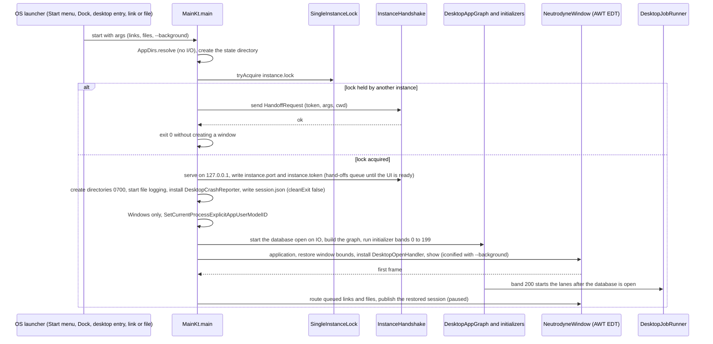
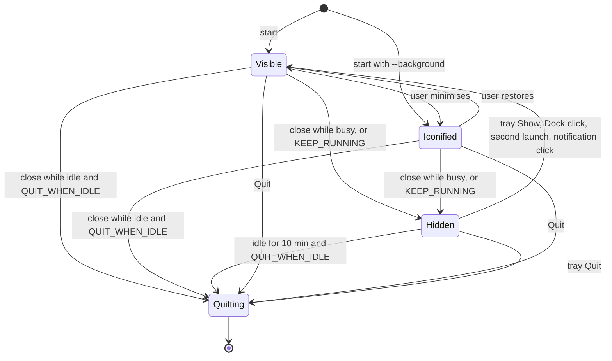
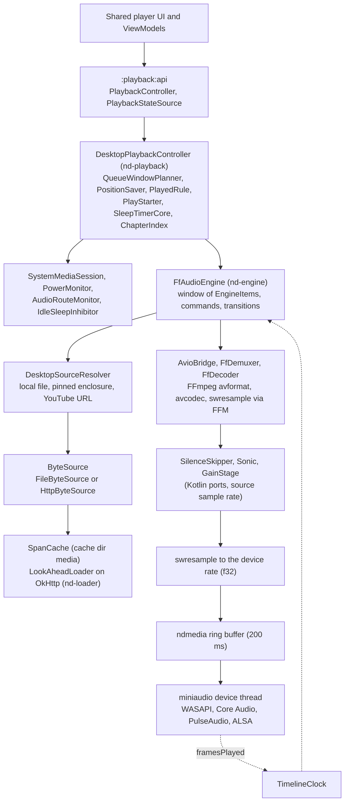
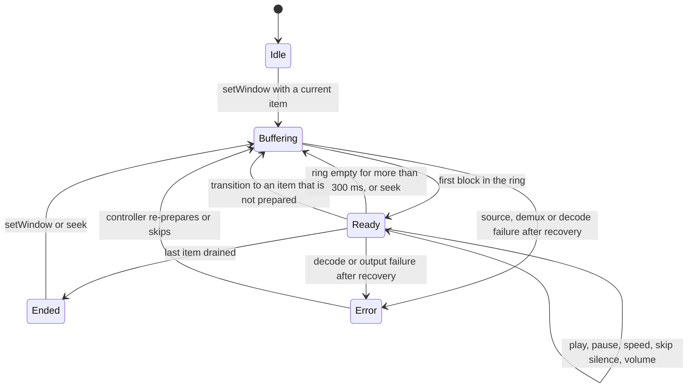
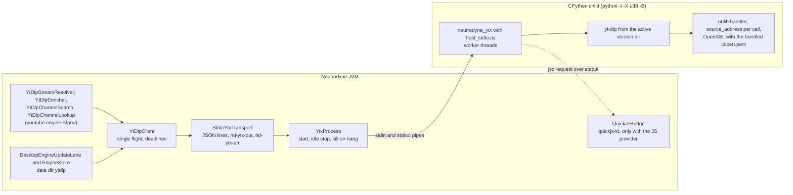
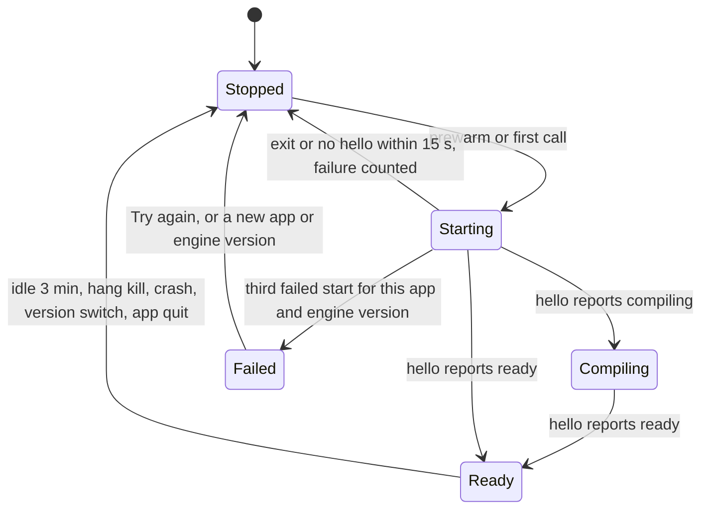
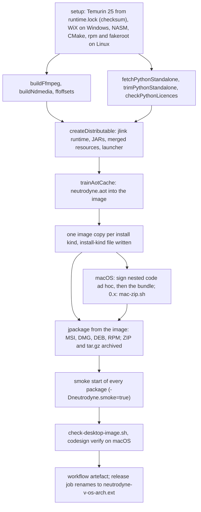

# 11 — Desktop app

> Status: Draft v1, 2026-10-05 · scope revision 2026-10-05 (S0–S13): new document — the desktop app for Windows, macOS and Linux, built from the shared Kotlin Multiplatform code, with its own shell, in-process background runner, OS media integration, FFmpeg-based audio engine, CPython-hosted YouTube engine and jpackage installers under the runtime exception; adversarial review 2026-10-05: MSI install location made mandatory (jpackage's default would be the data directory, which its uninstaller deletes), `jdk.security.auth` and `jdk.net` added for D-Bus, portable DEB/RPM dependencies and compression, the runtime check reworked because jlink's `release` file carries no implementor, launcher facts verified in the jpackage source; **final cross-document review 2026-10-05:** the `import-backup` lane, desktop service ports, the play/pause desired-state register, jlink's native strip on Linux, the WiX MS-RL components and `wix.lock`, the desktop `PlaybackSyncPort` in MS2 · Implements: R8.1–R8.11, R6.5, R6.6 (desktop behaviour), R1.1 (desktop file opening), R3.5, R3.6, R3.8, R3.9 (desktop host), R4.1, R4.2, R4.3, R4.8 (desktop), R5.2, R5.3, R5.7 (desktop surfaces) / N1, N2, N3, N4, N5, N6, N7, N8, N9, N11, N12 (desktop parts) · Milestones: M0b, MD0, M1a, M3, M6 (M6a, M6b), MD1 (MD1a, MD1b), MD2, MD3, M10, MD4, M11a, MD5, M11b; desktop parts of MS2 and MS3 · Honours: D2, D3, D4, D14, D25, D38–D45, D47–D49, D52, D57, D61–D64, D72–D84, D91–D93, D97; PO-2, PO-5, PO-10, PO-19, PO-27, PO-39, PO-40, PO-42, PO-43, PO-44 · Owns: D85–D90, R8, R6.5; spikes S13 and S18 (= MD0); the measurement procedure of budgets PB24–PB29 (09 owns the table); the modules `:desktopApp`, `:playback:engine`, `:playback:native`, `:playback:desktop`, `:desktop:system`, `:youtube:ytdlp-desktop`; the `AppDirs` table, the frozen desktop identifiers (including the MSI `upgradeUuid`), the desktop install and update guidance text, `DesktopJobRunner` and its lane contract, the desktop crash files

Contents: [Scope](#scope) · [Platform matrix](#platform-matrix) · [Desktop shell](#desktop-shell) ([Window and tray behaviour](#window-and-tray-behaviour)) · [Background work](#background-work) · [OS integration](#os-integration) · [Desktop playback engine](#desktop-playback-engine) · [Desktop downloads and storage](#desktop-downloads-and-storage) · [Desktop YouTube engine host](#desktop-youtube-engine-host) · [Packaging and the runtime exception](#packaging-and-the-runtime-exception) · [Install and update](#install-and-update) · [Desktop UX](#desktop-ux) · [Accessibility](#accessibility) · [Desktop diagnostics and crash files](#desktop-diagnostics-and-crash-files) · [Testing](#testing) · [Delivery by milestone](#delivery-by-milestone) · [New names introduced here](#new-names-introduced-here) · [Open questions](#open-questions) · [Sources](#sources)

---

## Scope

Serves R8, R6.5, R6.6 and the desktop halves of R1, R3, R4 and R5. Delivered across M0b (shell and packaging), MD0 (engine spike), M1a/M3/M6 (shared features on the desktop), MD1–MD5 (playback, OS integration, YouTube, UX, release) and M11b; see [Delivery by milestone](#delivery-by-milestone).

The desktop app is the same Kotlin Multiplatform product as the Android app ([D81](../PLAN.md#3-key-decisions)): every screen, ViewModel, repository, rule, the database schema and the sync client are `commonMain` code shared with Android ([01 Source sets and JVM islands](01-foundation.md#source-sets-and-jvm-islands)). This document owns only what is desktop-specific: a JVM process with one Compose window ([D85](../PLAN.md#3-key-decisions)); an in-process scheduler instead of WorkManager; our own audio engine instead of Media3 ([D86](../PLAN.md#3-key-decisions)); the OS media sessions of Windows, macOS and Linux ([D87](../PLAN.md#3-key-decisions)); the YouTube engine in a CPython child process instead of Chaquopy's `:ytx` ([D90](../PLAN.md#3-key-decisions)); per-OS installers that bundle an unmodified OpenJDK runtime under the runtime exception ([D88](../PLAN.md#3-key-decisions), [D89](../PLAN.md#3-key-decisions), [D3](../PLAN.md#3-key-decisions)). Everything a user can do on Android in R1–R5 they can do on the desktop, except what [Behaviour differences from Android](#behaviour-differences-from-android) lists.

### Responsibilities and boundaries

| This document owns | Owned elsewhere (link, do not restate) |
|---|---|
| `main()`, start-up and shutdown order, `DesktopAppGraph` contents specific to the desktop, single instance, `AppDirs`, OS link and file registration, smoke mode | Shared start-up bands and `AppInitializer` — [01 Application start-up](01-foundation.md#application-start-up); Metro graphs — [01 Dependency injection](01-foundation.md#dependency-injection); route table — [01 Intent routing](01-foundation.md#intent-routing) |
| Window, close behaviour, tray, start at login, window state | Screens, navigation suite, adaptive layouts — [08 Navigation](08-ui-ux.md#navigation), [08 Adaptive layouts](08-ui-ux.md#adaptive-layouts) |
| `DesktopJobRunner`, the `JobLane` contract, wake and restart catch-up | What each lane does — [03 Desktop refresh](03-feeds-and-discovery.md#desktop-refresh), [07 Desktop runners](07-downloads.md#desktop-runners), [08 Artwork pipeline](08-ui-ux.md#artwork-pipeline), [09 Update check](09-quality-and-release.md#update-check), [04 Engine updates](04-youtube.md#engine-updates), [10 Client sync engine](10-sync.md#client-sync-engine), [02 Retention and maintenance](02-data-model.md#retention-and-maintenance) |
| SMTC, Now Playing, MPRIS, power, audio-route monitoring, `DesktopNotifier`, `ndmedia`'s OS shims | Artwork files the sessions read — [08 Artwork pipeline](08-ui-ux.md#artwork-pipeline); notification texts — [03 New-episode notifications](03-feeds-and-discovery.md#new-episode-notifications), [07 Progress and notifications](07-downloads.md#progress-and-notifications) |
| `AudioEngine`, sources, `SpanCache`, the FFmpeg build and FFM bindings, DSP ports, output and clock, `DesktopPlaybackController` | Queue window, position, played, start, sleep-timer and chapter rules — [06 Shared playback core](06-playback.md#shared-playback-core); cache rules — [06 Streaming cache](06-playback.md#streaming-cache) ([D40](../PLAN.md#3-key-decisions)); player UI — [08 Player sheet](08-ui-ux.md#player-sheet) |
| Default and chosen download folders, moves on the desktop, Windows path rules beyond 07's names, "Show in folder", desktop disk-full and removable-drive handling | Transfer core, state machine, naming algorithm, move algorithm — [07 Transfer core](07-downloads.md#transfer-core), [07 State machine](07-downloads.md#state-machine), [07 Storage layout](07-downloads.md#storage-layout), [07 Moving between roots](07-downloads.md#moving-between-roots) |
| CPython selection, trim, child process, stdio framing, desktop engine paths, JS bridge over stdio | Engine methods, shim, trust chain, update policy, capability rules — [04 Shared engine module](04-youtube.md#shared-engine-module), [04 Engine updates](04-youtube.md#engine-updates), [04 Capability matrix](04-youtube.md#capability-matrix) |
| `nativeDistributions` per target, jlink modules, JVM options, AOT cache, resources layout, macOS ad-hoc signing and the 0.x ZIP, MSI `upgradeUuid`, runtime-exception and FFmpeg-LGPL obligations, `check-desktop-image.sh` rules | Release workflow and jobs — [09 release.yml](09-quality-and-release.md#releaseyml); licence policy, locks and allow-lists — [01 Licensing and dependency policy](01-foundation.md#licensing-and-dependency-policy), [01 Python and native components](01-foundation.md#python-and-native-components) |
| Install, update and uninstall guidance per OS (the README source text), desktop asset selection | Update-check logic and manifest — [09 Update check](09-quality-and-release.md#update-check); UI of the update card and help page — [08 Updates settings](08-ui-ux.md#updates-settings), [08 Install and updates help](08-ui-ux.md#install-and-updates-help) |
| Menus, global shortcut list, tray menu, drag and drop, window sizing, Settings › Desktop | Per-screen keyboard, mouse and context-menu behaviour — [08 Keyboard and mouse](08-ui-ux.md#keyboard-and-mouse) |
| VoiceOver and Java Access Bridge support, the Linux gap, the MD4 checklist | Shared accessibility rules and the custom-actions catalogue — [08 Accessibility](08-ui-ux.md#accessibility) |
| Desktop log files, crash files and their dialog, desktop diagnostics rows | Diagnostics API and redaction — [09 Crash reporting and diagnostics](09-quality-and-release.md#crash-reporting-and-diagnostics), [01 Logging and redaction](01-foundation.md#logging-and-redaction) |
| `DesktopSecretStore` file format ([PO-44](../PLAN.md#48-further-product-owner-decisions)) | `SecretStore` contract and its users — [03 Basic auth and CredentialStore](03-feeds-and-discovery.md#basic-auth-and-credentialstore), [10 Client sync engine](10-sync.md#client-sync-engine) |

### Modules

Packages follow `ch.lkmc.neutrodyne` + module path; `:desktopApp` uses `ch.lkmc.neutrodyne.desktop` ([PLAN 5.1](../PLAN.md#51-module-graph)).

| Module | Kind | Contents owned here | Depends on (project) |
|---|---|---|---|
| `:desktopApp` | `neutrodyne.desktop.application` (kotlin("jvm"), Compose application, Metro) | `MainKt`, `DesktopAppGraph`, `DesktopYouTubeBindingsModule`, `NeutrodyneWindow`, `DesktopMenuBar`, `SingleInstanceLock`, `InstanceHandshake`, `DesktopOpenHandler`, `UrlSchemeRegistrar`, `DesktopCrashReporter`, `ShutdownCoordinator`, `SmokeMode`, `BuildInfo`, `nativeDistributions` configuration, AOT training | features, shared implementations, the desktop-only modules (composition root, [PLAN 5.1](../PLAN.md#51-module-graph) rule 1) |
| `:playback:engine` | `neutrodyne.desktop.library` (JVM, `jvmTarget` 25) | `AudioEngine`, `FfAudioEngine`, `EngineItem`, `EngineState`, `EngineEvent`, `DesktopSourceResolver`, `ResolvedSource`, `ByteSource`, `FileByteSource`, `HttpByteSource`, `SpanCache`, `AvioBridge`, `DemuxerFactory`, `FfDemuxer`, `DecoderFactory`, `FfDecoder`, `FfmpegLibrary`, `SilenceSkipper`, `Sonic`, `GainStage`, `TimelineClock`, `LookAheadLoader`, `EngineWindowDiff`; `MpvAudioEngine` only if MD0 chooses the fallback | `:playback:native`, `:core:network:okhttp`, `:core:{model, common}` |
| `:playback:native` | `neutrodyne.desktop.library` + `neutrodyne.desktop.native` | `ndmedia` C/C++/Objective-C sources and CMake project, `NdmediaLibrary`, `NdOutput`, the OS-shim bindings, `playback/native/ffmpeg/build.sh`, `ffoffsets.c`, `native-components.lock` | — |
| `:playback:desktop` | `neutrodyne.desktop.library` | `DesktopPlaybackController`, `DesktopQueueProjector`, `DesktopEpisodeSourceResolver` (implements `DesktopSourceResolver`), `DesktopChapterExtractor`, `DesktopPlaybackModule` | `:playback:core`, `:playback:engine`, `:desktop:system`, `:download:api`, `:youtube:api`, `:core:artwork`, `:core:database`, `:core:datastore` |
| `:desktop:system` | `neutrodyne.desktop.library` | `SystemMediaSession`, `WindowsSmtcSession`, `MacNowPlayingSession`, `LinuxMprisSession`, `IdleSleepInhibitor`, `AudioRouteMonitor`, `TrayController`, `LoginItemRegistrar` (`WindowsRunKeyRegistrar`, `MacLoginItemRegistrar`, `XdgAutostartRegistrar`); implementations of the `:core:common` ports `OsPowerMonitor`, `OsDesktopNotifier`, `DbusDesktopPortal` | `:playback:native` (shims), `:playback:api` (state types), `:core:{model, common}` |
| `:youtube:ytdlp-desktop` | `neutrodyne.desktop.library` | `YtxProcess`, `StdioYtxTransport`, `PythonRuntimeLocator`, `DesktopEngineStorePaths`, `DesktopEngineUpdateLane`, `QuickJsBridge` (only with the JS provider); PBS bundling; `python-components.lock` | `:youtube:engine`, `:youtube:api`, `:core:datastore` |

Desktop code that lives in other owners' modules and follows this document's rules: `AppDirs` and `JobLane` (`:core:common` `desktopMain`); `DesktopJobRunner`, `DesktopRefreshLane`, `DesktopImportBackupLane` (05), `DesktopUpdateCheckLane`, `DesktopUpdateNotifier`, `DesktopSecretStore`, `DesktopMaintenanceLane` (`:core:data` `desktopMain`); `DesktopDownloadLane`, `DesktopMoveLane` (`:download:impl` `desktopMain`, 07); `DesktopArtworkLane` (`:core:artwork`, 08); `DesktopSyncLane` (`:sync:impl`, 10); `DesktopNetworkMonitor` (`:core:network`, 01); the `PlatformActions` implementations (`:core:ui` `desktopMain`, 08). Only `:youtube:ytdlp-desktop` may start a process; only `:playback:native` and `:desktop:system` make FFM downcalls into our own native code; `:playback:engine` makes FFM downcalls into FFmpeg only ([PLAN 5.1](../PLAN.md#51-module-graph) rule 6, amended 2026-10-05 to add `:playback:engine` for FFmpeg; `checkBannedApis`, [01 Dependency rules](01-foundation.md#dependency-rules)). The desktop-only edges are `:playback:desktop` → `:playback:engine`, `:playback:core`, `:desktop:system`; `:playback:engine` → `:playback:native`; `:desktop:system` → `:playback:native` and the contract `:playback:api`.

### Threading model

| Thread | Owner | Runs | Never |
|---|---|---|---|
| AWT event dispatch thread (`Dispatchers.Main` via `kotlinx-coroutines-swing`) | Compose, window, menus, tray, `java.awt.Desktop` handlers | Composition, ViewModel state collection, window and tray events, file dialogs | Disk or network I/O, database access, waiting on the engine thread |
| AppKit main thread (macOS) | the AWT toolkit | `MPRemoteCommandCenter` handlers, `NSWorkspace` notifications through the Objective-C shim | JVM work beyond enqueueing (one FFM upcall that posts to a queue) |
| `nd-playback` (one coroutine dispatcher: `Dispatchers.Default.limitedParallelism(1)`) | `DesktopPlaybackController` | All controller state: command handling, engine events, `PositionSaver`, sleep timer, session publishing | Blocking I/O (database writes are `suspend` calls on `Dispatchers.IO`) |
| `nd-engine` (one platform thread) | `FfAudioEngine` | Demux, decode, DSP, ring-buffer writes, AVIO read and seek upcalls (inside the `av_read_frame` downcall), transitions | Database access, network waits longer than the read timeout, Compose |
| `nd-prepare` (one platform thread) | `FfAudioEngine` | Opening the next item's source, demuxer and decoder (AVIO upcalls during the open), then handing the pipeline to `nd-engine` | Writing to the ring buffer |
| `nd-loader` (one platform thread per open HTTP resource, at most 2) | `LookAheadLoader` | OkHttp `Range` reads into `SpanCache` | Decoding |
| miniaudio device thread (native) | `ndmedia` | Copies PCM from the ring buffer, advances `framesPlayed` | Any JVM code (no upcalls on the audio path, [D87](../PLAN.md#3-key-decisions)) |
| `nd-win-shim` (Windows, native, owned by `ndmedia`) | hidden top-level window | SMTC, `WM_POWERBROADCAST`, `IMMNotificationClient` callbacks, toasts; one upcall per event that only enqueues | JVM work beyond enqueueing |
| dbus-java worker threads (Linux) | `LinuxMprisSession`, logind and portal clients | D-Bus method calls and signals; posts commands to `nd-playback` | Long work |
| `nd-ytx-out`, `nd-ytx-err` (two platform threads per child) | `StdioYtxTransport` | Reading the child's stdout (protocol) and stderr (log) | Writes to the database |
| `Dispatchers.IO` / `Dispatchers.Default` | lanes of `DesktopJobRunner`, repositories, Room (`setQueryCoroutineContext(Dispatchers.IO)`) | Refresh, downloads, artwork, sync, update checks, maintenance | Touching Compose state directly |
| `nd-handshake` (virtual thread) | `InstanceHandshake` | Accepting loopback connections from a second launch | Anything but parsing and posting the hand-off |

### Processes and files at run time

One JVM process per user ([Single instance](#single-instance-and-handshake)) and, while YouTube is in use, one CPython child ([Process model](#process-model)). No other process is ever started by our code: links and folders open through `java.awt.Desktop`, OS APIs or D-Bus, never through a shell ([01 Platform compliance](01-foundation.md#platform-compliance)); the browser or file manager these start is the OS's doing. On Linux AWT's `Desktop` actions need GTK 3 at run time (Unverified per desktop); when `Desktop.isSupported(BROWSE)` is false, links open through `org.freedesktop.portal.OpenURI.OpenURI` over D-Bus ([portal OpenURI](https://flatpak.github.io/xdg-desktop-portal/docs/doc-org.freedesktop.portal.OpenURI.html)), and the DEB recommends `libgtk-3-0`. Files live only in the directories of [AppDirs](#appdirs) and in the user's chosen download folder.

---

## Platform matrix

Serves R8.1, R8.2, N7. Delivered in M0b (matrix and CI runners), MD5 (final). Honours [D88](../PLAN.md#3-key-decisions), [PO-40](../PLAN.md#48-further-product-owner-decisions).

### Supported targets

| Target ID | OS versions | CPU | CI runner | Bundled runtime | Formats | Notes |
|---|---|---|---|---|---|---|
| `windows-x64` | Windows 10 22H2 and Windows 11 | x64; also Windows 11 on Arm under Prism emulation | `windows-2025` | Temurin 25 x64 | MSI (per user), ZIP | Windows 10 on Arm is unsupported (it emulates only 32-bit x86, [Windows on Arm emulation](https://learn.microsoft.com/en-us/windows/arm/apps-on-arm-x86-emulation)) |
| `macos-arm64` | macOS 13 or later | Apple silicon | `macos-15` | Temurin 25 aarch64 | DMG from `1.0.0`; ZIP of the app before ([PO-39](../PLAN.md#48-further-product-owner-decisions)) | No Intel Macs ([D88](../PLAN.md#3-key-decisions)); see [macOS floor](#macos-floor) |
| `linux-x64` | glibc ≥ 2.31 (Ubuntu 20.04 class), PulseAudio or PipeWire with `pipewire-pulse` (ALSA as last resort), X11 or XWayland | x64 | `ubuntu-24.04` | Temurin 25 x64 | DEB, RPM, tar.gz | Natives built in `manylinux_2_28` containers |
| `linux-arm64` | as `linux-x64` | AArch64 | `ubuntu-24.04-arm` | Temurin 25 aarch64 | DEB, RPM, tar.gz | — |

Compose Multiplatform 1.12.1 supports macOS 13 arm64, Windows 10 x64 and arm64, and Ubuntu 20.04 x64 and arm64 ([CMP compatibility](https://kotlinlang.org/docs/multiplatform/compose-compatibility-and-versioning.html)). There is no universal (fat) desktop build and no 32-bit build ([D77](../PLAN.md#3-key-decisions)). jpackage cannot cross-package, so each target is built on its own runner ([native distributions](https://kotlinlang.org/docs/multiplatform/compose-native-distribution.html)).

### Native-library coverage

Every native library in the image must exist for every target before it is accepted; a library without a target blocks that target or moves it to emulation. On Linux every ELF file of the image must need no `GLIBC_` symbol version above 2.31 (our own libraries are therefore built in `manylinux_2_28` containers, never directly on the `ubuntu-24.04` runners, whose glibc 2.39 would add `GLIBC_2.34` symbols); `check-desktop-image.sh` checks it with `objdump -T` ([Image scan rules](#image-scan-rules)).

| Library | Source | windows-x64 | macos-arm64 | linux-x64 | linux-arm64 | windows-arm64 (not built) |
|---|---|---|---|---|---|---|
| Skiko (Compose rendering) | JetBrains | yes | yes | yes | yes | yes |
| `sqlite-bundled-jvm` 2.7.1 (Room's `BundledSQLiteDriver`) | androidx | `windows_x64` | `osx_arm64` | `linux_x64` | `linux_arm64` | **missing** ([jar contents](https://dl.google.com/android/maven2/androidx/sqlite/sqlite-bundled-jvm/2.7.1/sqlite-bundled-jvm-2.7.1.jar)) |
| quickjs-kt-jvm 1.0.15 (JS provider, only if it ships) | dokar3 | `windows_x64` | `macos_aarch64` | `linux_x64` | `linux_aarch64` | **missing** ([artefacts](https://repo1.maven.org/maven2/io/github/dokar3/quickjs-kt-jvm/1.0.15/)) |
| JNA 5.19.1 (DPAPI, Run key, shell calls) | JNA | yes | yes | yes | yes | yes |
| python-build-standalone CPython 3.14 | Astral | `x86_64-pc-windows-msvc` | `aarch64-apple-darwin` | `x86_64-unknown-linux-gnu` | `aarch64-unknown-linux-gnu` | `aarch64-pc-windows-msvc` |
| FFmpeg 9.0.x minimal (`avutil`, `swresample`, `avcodec`, `avformat`) | built by us | MSYS2 + MSVC | Apple clang | gcc in `manylinux_2_28` | gcc in `manylinux_2_28` aarch64 | not built |
| `ndmedia` (miniaudio, ring buffer, OS shims) | built by us | MSVC, static CRT | Apple clang, deployment target 13.0 | gcc in `manylinux_2_28` | gcc in `manylinux_2_28` aarch64 | not built |
| dbus-java 5.2.2 (MPRIS, logind, portals, notifications) | pure Java | — | — | yes | yes | — |

Temurin 25 publishes no Windows AArch64 build ([D88](../PLAN.md#3-key-decisions)); together with the two missing natives this is why Windows 11 on Arm runs the x64 build ([PO-40](../PLAN.md#48-further-product-owner-decisions)). An arm64 JVM cannot load x64 JNI libraries, so a Windows arm64 build would have to be arm64 throughout.

### Windows on Arm

The x64 MSI or ZIP runs under Prism on Windows 11 on Arm ([Windows on Arm emulation](https://learn.microsoft.com/en-us/windows/arm/apps-on-arm-x86-emulation)): the JVM, Skiko, SQLite, FFmpeg, `ndmedia` and the x64 CPython child all run emulated (user-mode code only). The update check offers the x64 asset ([Desktop update check](#desktop-update-check)). Unverified: start-up time and audio-engine CPU load under emulation; S13 records them on one Arm laptop if available ([Open questions](#open-questions) 4). A native build becomes possible when `sqlite-bundled` (and quickjs-kt, if the JS provider ships) publish `windows_arm64` natives and a single runtime vendor covers all targets ([D88](../PLAN.md#3-key-decisions)).

### macOS floor

The JDK 25 runtime is built with a macOS deployment target of 11.0 (`MACOSX_VERSION_MIN=11.00.00` in [`make/autoconf/flags.m4`](https://raw.githubusercontent.com/openjdk/jdk25u/master/make/autoconf/flags.m4)), and Compose Multiplatform supports macOS 13, so macOS 13 runs the app technically. Oracle's certification list for JDK 25 names macOS 26, 15 and 14 (14 marked "No Longer Supported") and not macOS 13; it also lists Windows 11 but not Windows 10 ([Oracle JDK 25 certified configurations](https://www.oracle.com/java/technologies/javase/products-doc-jdk25certconfig.html), read 2026-10-05). Temurin follows its own support matrix (Unverified for macOS 13 and Windows 10). The floor therefore stays macOS 13 and Windows 10 22H2 as [D88](../PLAN.md#3-key-decisions) says, S13 runs the packaged app once on each, and the PO may raise the floors ([Open questions](#open-questions) 1). `LSMinimumSystemVersion` is `13.0` (`macOS.minimumSystemVersion`), so older macOS versions refuse to open the app with the system's own message.

### Behaviour differences from Android

R8.1 requires every difference to be listed here. Everything not in this table behaves as on Android.

| Area | Android | Desktop | Where |
|---|---|---|---|
| Automatic backup | Auto Backup snapshot (R1.8) | None; manual backup ZIP and sync; Settings › Backup says so | [05 Auto Backup](05-groups-opml-backup.md#auto-backup) |
| Background work | WorkManager, UIDT jobs, quotas, 8-min soft deadlines | `DesktopJobRunner` while the app runs; nothing while it is quit; no soft deadlines | [Background work](#background-work) |
| Network policy | Metered detection, Wi-Fi-only policies, `playback.stream_on_metered` | Every network is unmetered in v1.0; metered and Wi-Fi-only rows show "Not used on computers" | [D85](../PLAN.md#3-key-decisions) |
| Charging | Optional "only while charging" | Ignored (rows hidden) | [07 Desktop runners](07-downloads.md#desktop-runners) |
| Audio focus | Pause or duck on calls, navigation and other media apps; `playback.pause_for_navigation` | None: the desktop mixes audio; the setting is hidden | [06 Player configuration](06-playback.md#player-configuration) |
| Becoming noisy | Pause on headphone unplug | Pause when the output device in use disappears (Windows, macOS; Linux best effort) | [Audio-route monitoring](#audio-route-monitoring) |
| Media controls | Media notification, lock screen, Bluetooth, Android Auto | SMTC, Now Playing, MPRIS, media keys and headset buttons through them; no car surface | [OS integration](#os-integration) |
| Resumption after reboot | System UI resumption card | The last session is restored paused at start; never auto-play | [Device loss, sleep and session restore](#device-loss-sleep-and-session-restore) |
| System sleep | Android doze | Pause and save on suspend, idle-sleep inhibited only while playing, nothing resumes on wake | [Power](#power-suspend-wake-and-idle-sleep) |
| Notifications | Channels per type and per group, permission prompt (API 33+) | One notification per event through the OS notification centre; per-group new-episode switches still apply; no channel UI; macOS asks for permission at the first notification | [Notifications](#notifications) |
| Process model | Main process, `:ytx`, `:acra` | One JVM process, one CPython child while YouTube is used | [Processes and files at run time](#processes-and-files-at-run-time) |
| YouTube engine | Chaquopy in `:ytx`; none on `armeabi-v7a` | python-build-standalone child process on every build | [Desktop YouTube engine host](#desktop-youtube-engine-host) |
| Downloads location | App-specific storage; SAF folder v1.x | `<data>/Downloads` or any folder the user chooses | [Desktop downloads and storage](#desktop-downloads-and-storage) |
| Local-network feeds | Blocked by the LAN guard (sync server excepted) | Allowed (no LAN guard on the desktop); macOS may show its Local Network prompt | [01 Networking baseline](01-foundation.md#networking-baseline) |
| Credentials | Android Keystore AES-GCM | DPAPI file on Windows, `0600` file on macOS and Linux ([PO-44](../PLAN.md#48-further-product-owner-decisions)) | [Secrets](#secrets) |
| Crash reports | ACRA dialog and email | Crash file and a dialog at the next start that offers an email | [Desktop diagnostics and crash files](#desktop-diagnostics-and-crash-files) |
| Colour | Dynamic colour on Android 12+ | Brand scheme seeded from amber; follows the OS light or dark setting | [08 Theming and colour](08-ui-ux.md#theming-and-colour) |
| Language | Per-app language (AppCompat) | Settings › Desktop › Language (`desktop.language`) | [Desktop settings](#desktop-settings) |
| Input | Touch, swipe, long-press, predictive back | Keyboard shortcuts, context menus, hover, scrollbars, Esc as back, drag and drop | [Desktop UX](#desktop-ux) |
| Sharing | Android share sheet, `FileProvider` | "Copy link", "Show in folder"; no share sheet | [Show in folder](#show-in-folder) |
| Updates | APK for `Build.SUPPORTED_ABIS[0]` | Asset for OS, architecture and install kind | [Desktop update check](#desktop-update-check) |
| Developer verification | Google's verification gate (four countries from 2026-09-30, worldwide in 2027, [PO-5](../PLAN.md#po-5-google-developer-verification)) | Gatekeeper "Open Anyway", SmartScreen, Smart App Control | [Install and update](#install-and-update) |
| Screen readers | TalkBack | VoiceOver; NVDA through Java Access Bridge; none on Linux | [Accessibility](#accessibility) |
| Video podcasts | Played as audio in v1.0 (video surface v1.x) | Played as audio; video through libmpv in v1.x (M17) | [D64](../PLAN.md#3-key-decisions) |
| Widgets, mini-player window, Quick Settings | v1.x / later | None | [PLAN 1.2](../PLAN.md#12-non-goals-for-v10) |
| Hardware next/previous (`playback.hardware_buttons`) | Headset and Bluetooth keys | The same setting maps media-key next/previous from the OS sessions | [Remote commands](#remote-commands) |

---

## Desktop shell

Serves R8.2, R8.3, R8.11, R1.1 (desktop file opening), N7. Delivered in M0b (window, menu bar, tray stub, single instance, `AppDirs`, crash files, smoke mode), M1a (database and screens), MD2 (URL schemes, file associations, close behaviour, start at login), MD4 (menus and shortcuts), MD5 (final installer integration). Honours [D85](../PLAN.md#3-key-decisions), [D61](../PLAN.md#3-key-decisions), [D62](../PLAN.md#3-key-decisions), [PO-44](../PLAN.md#48-further-product-owner-decisions). The window's menus are specified in [Menus](#menus), the crash files in [Crash files and the email dialog](#crash-files-and-the-email-dialog).

### Start-up sequence

The shared parts — the `AppInitializer` bands, the database open at band 100, the graph rules — follow [01 Application start-up](01-foundation.md#application-start-up). The desktop order is: `AppDirs` → `SingleInstanceLock` → database open (`DesktopDatabaseFactory`) → `DesktopAppGraph` → window → `DesktopJobRunner`.



Steps in detail:

1. **`main(args)`** records `System.nanoTime()` for PB24, reads `-Dneutrodyne.smoke` ([Smoke mode](#smoke-mode)) and splits the arguments into `--background` (start at login) and inputs (links and paths). Unknown flags are ignored and logged.
2. **`AppDirs.resolve()`** computes every path from the environment without touching the disk ([AppDirs](#appdirs)); only `state` is created before the lock.
3. **Lock and hand-off server** ([Single instance and handshake](#single-instance-and-handshake)). A second launch hands its inputs to the first instance and exits before AWT is initialised, so no window or Dock icon appears; the instance that takes the lock starts its hand-off server at once.
4. **Process set-up** in the instance that holds the lock: create the other directories with mode `0700` on macOS and Linux; open the rolling log ([Logs and rotation](#logs-and-rotation)); install `DesktopCrashReporter` and read the previous `session.json` ([Crash files and the email dialog](#crash-files-and-the-email-dialog)); on Windows call `SetCurrentProcessExplicitAppUserModelID("ch.lkmc.neutrodyne")` through `ndmedia` before any window exists, because the media flyout and toasts attribute the process by that ID ([AppUserModelIDs](https://learn.microsoft.com/en-us/windows/win32/shell/appids), [SetCurrentProcessExplicitAppUserModelID](https://learn.microsoft.com/en-us/windows/win32/api/shobjidl_core/nf-shobjidl_core-setcurrentprocessexplicitappusermodelid)); apply `desktop.language` with `Locale.setDefault` ([D83](../PLAN.md#3-key-decisions)).
5. **Database and graph.** `DesktopDatabaseFactory` opens `<data>/neutrodyne.db` with `BundledSQLiteDriver` on `Dispatchers.IO` while `DesktopAppGraph` is built; band 100 awaits the open as on Android, so the window never blocks on migrations ([02 Error handling and recovery](02-data-model.md#error-handling-and-recovery) for a damaged database). The desktop contributes its own initializers: band 0–99 `UrlSchemeRegistrar` (Windows, [Links and files from the OS](#links-and-files-from-the-os)), `WindowsShortcutIdentity` (MSI installs, [Windows MSI and ZIP](#windows-msi-and-zip)); band 100–199 `DesktopSecretStore` load and the `LocalMediaIndex` load; band 200 `DesktopJobRunner.start()` in place of WorkManager scheduling; band 300 `DesktopPlaybackController` session restore and `SystemMediaSession` start.
6. **Window.** `application { NeutrodyneWindow(…) }` on the EDT restores `desktop.window_bounds` ([Window and tray behaviour](#window-and-tray-behaviour)), installs `DesktopOpenHandler` (macOS `Desktop.setOpenURIHandler` and `setOpenFileHandler` must be installed before the first event is delivered) and renders the shared navigation suite ([08 Navigation](08-ui-ux.md#navigation)). With `--background` the window starts iconified.
7. **After the first frame:** process the queued inputs (first-launch arguments and hand-offs received meanwhile) through `IntentRouter`, publish the restored session (paused) to the OS media session so media keys work at once, and show the tray icon only if the state requires it.

### DesktopAppGraph

`DesktopAppGraph` (Metro, [D82](../PLAN.md#3-key-decisions)) is the desktop composition root. It contributes the desktop implementations of the shared interfaces and nothing that Android has: `AppDirs`, `BuildInfo`, `PlatformInfo`, `DesktopNetworkMonitor`, `DesktopSecretStore`, `DesktopJobRunner` with the `Set<JobLane>` multibinding, `DesktopPlaybackController` bound as `PlaybackController` and `PlaybackStateSource`, `SystemMediaSession` (the per-OS implementation chosen at graph creation by `BuildInfo.os`), `IdleSleepInhibitor`, `AudioRouteMonitor`, `TrayController`, `LoginItemRegistrar`, the `:core:common` ports `JobLanePoker` (the runner), `PowerMonitor` (`OsPowerMonitor`), `DesktopNotifier` (`OsDesktopNotifier`, called by the desktop notifiers of 03, 04, 07, 09 and 10) and `LinuxDesktopPortal` (`DbusDesktopPortal`, Linux only), the `PlatformActions` of `:core:ui`, and `DesktopYouTubeBindingsModule` (external-only implementations until MD3, then `:youtube:ytdlp-desktop`; external-only in the `-Pneutrodyne.youtubeEngine=false` build, [01 YouTube bindings](01-foundation.md#youtube-bindings)). One graph test checks that every `NavKey` has an entry installer and every lane is bound ([01 Dependency injection](01-foundation.md#dependency-injection)).

```kotlin
// :desktopApp — build-time identity of this image (a resource written by the packaging pipeline)
object BuildInfo {
    val versionName: String; val versionCode: Int
    val os: DesktopOs                    // WINDOWS, MACOS, LINUX  (wire: windows, macos, linux)
    val arch: DesktopArch                // X64, ARM64             (wire: x64, arm64)
    val installKind: InstallKind         // from <resources>/install-kind
    val youtubeEngine: Boolean           // false in the -Pneutrodyne.youtubeEngine=false build
    val runtime: String                  // "Temurin-25.0.4.1+1" from the bundled runtime's release file
}
enum class InstallKind(val wire: String) { MSI("msi"), ZIP("zip"), DMG("dmg"), MAC_ZIP("mac-zip"),
    DEB("deb"), RPM("rpm"), TAR_GZ("tar.gz"), DEV("dev") }   // DEV: gradle run, tests; never in a published image
```

### Single instance and handshake

Room has no multi-instance invalidation off Android ([Room KMP](https://developer.android.com/kotlin/multiplatform/room)), so exactly one process may open the database, run lanes and sync (risk [T26](../PLAN.md#8-risks-and-mitigations)).

```kotlin
// :desktopApp
class SingleInstanceLock(private val dirs: AppDirs) : AutoCloseable {
    fun tryAcquire(): Acquire                       // FileChannel.tryLock() on <state>/instance.lock; never blocks
    sealed interface Acquire { data object Acquired : Acquire; data object HeldByOther : Acquire }
}
class InstanceHandshake(private val dirs: AppDirs, private val random: SecureRandom) {
    suspend fun serve(onHandoff: suspend (HandoffRequest) -> Unit)   // owner; loopback only
    fun send(request: HandoffRequest, timeout: Duration = 3.seconds): HandoffOutcome   // second launch
}
@Serializable data class HandoffRequest(val v: Int = 1, val token: String, val args: List<String>,
                                        val cwd: String, val activate: Boolean = true)
@Serializable data class HandoffResponse(val ok: Boolean, val pid: Long, val versionName: String)
sealed interface HandoffOutcome { data object Delivered : HandoffOutcome; data object NoAnswer : HandoffOutcome }
```

| Step | Rule |
|---|---|
| Lock | `FileChannel.open(<state>/instance.lock, CREATE, WRITE).tryLock()`. The OS releases the lock when the process ends, also after a crash, so a stale file never blocks a start. The owner writes `{pid, startedAt, versionName}` into the file for diagnostics; the content is never trusted for decisions. `AppDirs` are local paths, so network-filesystem lock semantics do not apply (a home directory on NFS is unsupported, Unverified behaviour) |
| Server | Right after acquiring the lock, before the graph and AWT start, the owner binds `ServerSocketChannel` to `InetAddress.getLoopbackAddress()` port 0, then writes `instance.port` (decimal) and `instance.token` (32 bytes from `SecureRandom`, base64url) atomically (temp file + rename), mode `0600` on macOS and Linux; on Windows the files inherit the user-only ACL of `%LOCALAPPDATA%`. Each connection: read one JSON line ≤ 64 KiB within 2 s, compare the token in constant time, reply `HandoffResponse`, close; requests that arrive before the first frame are queued and applied after it. Wrong token, oversize or timeout → close without a reply, logged at WARN |
| Client | The second launch reads port and token, connects with a 1-s timeout, sends one line and waits ≤ 3 s. On Windows it first calls `AllowSetForegroundWindow(ASFW_ANY)` through JNA (the owner's PID is not known before the reply, and the file content is never trusted), because only the foreground process may pass on the right to bring a window to the front ([AllowSetForegroundWindow](https://learn.microsoft.com/en-us/windows/win32/api/winuser/nf-winuser-allowsetforegroundwindow)) (Unverified that the first instance's `toFront()` then succeeds; MD2 checks) |
| Retry | Lock held but no port file, a refused connection or no answer: retry 10 × 200 ms (the owner binds within milliseconds of taking the lock, but may be busy starting). Still nothing: a small AWT dialog "Neutrodyne is already running but is not responding. Wait a moment and try again, or end it in Task Manager / Activity Monitor / your system monitor." and exit code 2. The lock is never broken |
| Hand-off | The owner resolves relative paths against `cwd`, passes the inputs to `DesktopOpenHandler`, and, with `activate`, shows the window (from the tray if hidden), de-iconifies it and calls `toFront()` |
| macOS | LaunchServices activates a running app instead of starting a second one and delivers links and files through the `java.awt.Desktop` handlers; the lock still guards `open -n` and direct launches of the binary |

### AppDirs

R8.11. `AppDirs` (`:core:common` `desktopMain`) is a small resolver of environment variables and documented defaults; `dev.dirs:directories` is banned (MPL-2.0 code, [D3](../PLAN.md#3-key-decisions)).

```kotlin
// :core:common desktopMain
data class AppDirs(val data: Path, val config: Path, val cache: Path, val state: Path,
                   val logs: Path, val downloadsDefault: Path) {
    fun ensureCreated()                              // createDirectories; 0700 on POSIX
    companion object { fun resolve(os: DesktopOs, env: Map<String, String> = System.getenv(),
                                   home: Path = Path.of(System.getProperty("user.home"))): AppDirs }
}
```

| Purpose | Windows | macOS | Linux |
|---|---|---|---|
| Data: `neutrodyne.db` (+ `-wal`, `-shm`), `artwork/`, `ytdlp/` (engine store), default `Downloads/`, secrets | `%LOCALAPPDATA%\Neutrodyne\` | `~/Library/Application Support/ch.lkmc.neutrodyne/` | `$XDG_DATA_HOME/neutrodyne/` (default `~/.local/share/neutrodyne/`) |
| Config: `settings.preferences_pb`, `device_settings.preferences_pb` | data directory | data directory | `$XDG_CONFIG_HOME/neutrodyne/` (default `~/.config/neutrodyne/`) |
| Cache: `coil/`, `media/` (`SpanCache`), `engine-cache/` (yt-dlp `cachedir`), `native/` | `%LOCALAPPDATA%\Neutrodyne\Cache\` | `~/Library/Caches/ch.lkmc.neutrodyne/` | `$XDG_CACHE_HOME/neutrodyne/` (default `~/.cache/neutrodyne/`) |
| State and logs: `instance.lock`, `instance.port`, `instance.token`, `session.json`, `crash-*.txt`, `logs/` | `%LOCALAPPDATA%\Neutrodyne\Logs\` | `~/Library/Logs/Neutrodyne/` | `$XDG_STATE_HOME/neutrodyne/` (default `~/.local/state/neutrodyne/`) |
| Secrets ([PO-44](../PLAN.md#48-further-product-owner-decisions)) | DPAPI blob `secrets.bin` in the data directory | `secrets.json` (`0600`) in the data directory | `secrets.json` (`0600`) in the data directory |

Rules:

- **Windows:** `%LOCALAPPDATA%` from the environment; if it is unset or relative, `SHGetKnownFolderPath(FOLDERID_LocalAppData)` through JNA ([KNOWNFOLDERID](https://learn.microsoft.com/en-us/windows/win32/shell/knownfolderid)). Never `%APPDATA%` (roaming profiles would copy a large database between machines).
- **Linux:** an `XDG_*` variable is used only when it is an absolute path; otherwise the default applies ([XDG Base Directory](https://specifications.freedesktop.org/basedir/latest/)).
- **macOS:** fixed paths under `user.home`; the data directory is named by the frozen bundle ID.
- **Ownership:** the app creates the directories; it never writes outside them except to the user's chosen download folder ([Desktop downloads and storage](#desktop-downloads-and-storage)), the per-user OS registrations of [Links and files from the OS](#links-and-files-from-the-os) and [Start at login](#start-at-login), and the native-library extraction directories of third-party loaders that cannot be pointed at the image ([Native libraries and native access](#native-libraries-and-native-access)).
- **Uninstall** never touches these directories ([Uninstall and data retention](#uninstall-and-data-retention)). They must therefore never lie inside the installation directory: jpackage's MSI removes its whole installation directory on uninstall ([Windows MSI and ZIP](#windows-msi-and-zip)). At start `AppDirs` compares each directory with the running image's root (`jpackage.app-path` resolved to the image root); when one contains the other — a build without `installationPath`, or a portable ZIP extracted into `%LOCALAPPDATA%\Neutrodyne\` — the app shows "Neutrodyne is installed inside its own data folder. Move the program folder elsewhere; your library would be deleted with it." and exits 3 before writing anything ([Shell failure modes](#shell-failure-modes)).
- **Tests** create `AppDirs` under a temporary directory through the test graph; packaged images have no directory override other than smoke mode's.
- **Implementation notes (2026-10-06).** `resolve` takes `os: AppDirs.DesktopOs` — a nested enum mirroring `:core:model`'s `DesktopOs`, because `:core:common` may not depend on other project modules ([01 Dependency rules](01-foundation.md#dependency-rules) rule 12) — and a `windowsLocalAppData: WindowsLocalAppData` seam that calls `SHGetKnownFolderPath(FOLDERID_LocalAppData)` through JNA by default and lets tests exercise the `%LOCALAPPDATA%`-unset branch off Windows; when both sources fail, `resolve` throws rather than guessing a directory. `logs` resolves to `<state>/logs` on all three OSes, matching the "state and logs" row's contents (`instance.lock`, `instance.port`, `instance.token`, `session.json`, `crash-*.txt`, `logs/`). A `current()` companion resolves from `os.name` and the real environment.

### Secrets

`DesktopSecretStore` (`:core:data` `desktopMain`) implements 03's `SecretStore` ([PO-44](../PLAN.md#48-further-product-owner-decisions)). It holds Basic-auth credentials per feed origin and the sync token under the origin `sync:<host>` (10).

| Aspect | Windows | macOS and Linux |
|---|---|---|
| File | `<data>/secrets.bin` | `<data>/secrets.json` |
| Protection | `CryptProtectData` for the current user with `CRYPTPROTECT_UI_FORBIDDEN` and the constant entropy `ch.lkmc.neutrodyne/secrets/v1`, through JNA under its Apache-2.0 option ([CryptProtectData](https://learn.microsoft.com/en-us/windows/win32/api/dpapi/nf-dpapi-cryptprotectdata), [JNA licence](https://github.com/java-native-access/jna/blob/master/LICENSE)) | File mode `0600` set at creation (`PosixFilePermissions`), directory `0700`; no encryption (anything running as the user can read it; disclosed in the help) |
| Content (plaintext form) | `{"v":1,"entries":{"https://feeds.example.com":{"user":"…","secret":"…"},"sync:sync.example.net":{"secret":"nds_…","fp":"<sha256>"}}}` | same |
| Installation fingerprint | `fp` on `sync:` entries = SHA-256 of the machine ID, OS user name and the data-directory path; a mismatch (a data directory copied to another computer) makes 10's `SyncTokenStore` ignore the token and show "Reconnect" ([10 Client sync engine](10-sync.md#client-sync-engine)). Machine ID: Windows `MachineGuid` under `HKLM\SOFTWARE\Microsoft\Cryptography` (readable without administrator rights); macOS the hardware UUID from `gethostuuid()` through JNA; Linux `/etc/machine-id`, else `/var/lib/dbus/machine-id`; the host name only when none is readable (Unverified per OS; `DesktopSecretStoreTest`). Not the host name first: macOS changes it with the network (DHCP-supplied names), which would show "Reconnect" spuriously and link the computer again as a new device | same |
| Writes | Whole file, atomically: temp file in the same directory with the same protection, then `ATOMIC_MOVE`; serialised by a mutex | same |
| Never | In logs, crash files, diagnostics (counts only), backups or sync payloads (except opted-in passwords per R1.9 and R7.3) | same |

Keychain and Secret Service are v1.x: Keychain items of an ad-hoc-signed app prompt again after every update ([TN3127](https://developer.apple.com/documentation/technotes/tn3127-inside-code-signing-requirements)), and Secret Service is not present on every Linux desktop.

### Links and files from the OS

R8.3, R1.1. The OS hands Neutrodyne `.opml` files and `feed:`, `podcast:`, `pcast:`, `itpc:` and `neutrodyne:` links. Registration differs per OS and format:

| Input | Windows MSI | Windows ZIP | macOS (DMG, ZIP) | Linux DEB and RPM | Linux tar.gz |
|---|---|---|---|---|---|
| `.opml` (MIME `text/x-opml`) | MSI file association (Compose `fileAssociation`, per-user ProgID) | none — drag and drop or Import | `CFBundleDocumentTypes` from `fileAssociation` | our desktop entry `MimeType=text/x-opml;…` | Settings › Desktop › "Add to applications menu" writes `~/.local/share/applications/ch.lkmc.neutrodyne.desktop` |
| `neutrodyne:` | `UrlSchemeRegistrar` at every start (HKCU) | same | `CFBundleURLTypes` (`infoPlist.extraKeysRawXml`) | `x-scheme-handler/neutrodyne` in our desktop entry | the user desktop entry above |
| `feed:`, `podcast:`, `pcast:`, `itpc:` | `UrlSchemeRegistrar`, only if unclaimed or already ours | same | `CFBundleURLTypes` | `x-scheme-handler/feed;…` in our desktop entry | the user desktop entry above |

- **Compose DSL.** The Compose Gradle plugin 1.12.1 has `nativeDistributions.fileAssociation(mimeType, extension, description, linuxIconFile, windowsIconFile, macOSIconFile)` and `macOS.infoPlist { extraKeysRawXml }`, which is how custom URL schemes reach `Info.plist` ([native distributions](https://kotlinlang.org/docs/multiplatform/compose-native-distribution.html); DSL classes checked in [compose-gradle-plugin 1.12.1](https://repo1.maven.org/maven2/org/jetbrains/compose/compose-gradle-plugin/1.12.1/)). On macOS, `Desktop.setOpenURIHandler` and `setOpenFileHandler` deliver events only to a bundled app whose `Info.plist` has `CFBundleDocumentTypes` ([java.awt.Desktop](https://docs.oracle.com/en/java/javase/25/docs/api/java.desktop/java/awt/Desktop.html)), which the `.opml` association provides.
- **Windows URL schemes at run time.** jpackage has no URL-scheme option, and adding registry components to the MSI would need a changed `main.wxs`, a template of the JDK under GPL-2.0 with the Classpath Exception that must not be copied into this repository ([D3](../PLAN.md#3-key-decisions); jpackage resources: [jpackage](https://docs.oracle.com/en/java/javase/25/docs/specs/man/jpackage.html)). `UrlSchemeRegistrar` therefore writes per-user keys under `HKCU\Software\Classes\<scheme>` at every start of a packaged build (`URL Protocol` = "", `DefaultIcon`, `shell\open\command` = `"<launcher>" "%1"`; [registering an application to a URL scheme](https://learn.microsoft.com/en-us/previous-versions/windows/internet-explorer/ie-developer/platform-apis/aa767914(v=vs.85))). `neutrodyne` is always (re)written. The four podcast schemes are written only when the key is absent or its command already names a `Neutrodyne.exe`, so another podcast app's registration is never taken over silently; Settings › Desktop › "Open podcast links with Neutrodyne" takes them over on request. Unverified: whether Windows 10/11 asks the user to confirm a protocol handler that has a user choice; MD2 AC4 records it. The keys survive an uninstall ([Uninstall and data retention](#uninstall-and-data-retention)).
- **Linux desktop entry.** DEB and RPM install our own desktop entry `ch.lkmc.neutrodyne.desktop` and hicolor icons through package files we write ourselves (the DEB resources `control`, `postinst` and `postrm`, the RPM spec `neutrodyne.spec`, [Linux DEB, RPM and tar.gz](#linux-deb-rpm-and-targz)) and pass through jpackage's resource directory (jpackage 25 looks these names up as overridable resources, [`LinuxDebBundler.java`](https://raw.githubusercontent.com/openjdk/jdk25u/master/src/jdk.jpackage/linux/classes/jdk/jpackage/internal/LinuxDebBundler.java)); jpackage's own desktop integration stays off (no Linux icon, shortcut or file association options), because jpackage names its entry `<package>-<launcher>.desktop` ([`DesktopIntegration.java`](https://raw.githubusercontent.com/openjdk/jdk25u/master/src/jdk.jpackage/linux/classes/jdk/jpackage/internal/DesktopIntegration.java)), here `neutrodyne-Neutrodyne.desktop`, and the frozen name is `ch.lkmc.neutrodyne.desktop` ([D61](../PLAN.md#3-key-decisions)). The scripts are written from the Desktop Entry specification ([desktop entry spec](https://specifications.freedesktop.org/desktop-entry-spec/latest/)), never copied from jpackage's GPL-2.0+CE templates. Unverified: that jpackage 25 accepts a complete replacement RPM spec and DEB scripts from the resource directory; S13 checks. Fallback: jpackage's entry with a `Neutrodyne.desktop` template override carrying our `MimeType` line, and D61's Linux entry name amended to `neutrodyne-Neutrodyne.desktop` ([Open questions](#open-questions) 2).

```ini
# ch.lkmc.neutrodyne.desktop — DEB/RPM package template (/usr/share/applications)
[Desktop Entry]
Type=Application
Name=Neutrodyne
GenericName=Podcast player
Comment=Podcasts organised in groups
Exec=/opt/neutrodyne/bin/Neutrodyne %U
TryExec=/opt/neutrodyne/bin/Neutrodyne
Icon=neutrodyne
Terminal=false
Categories=AudioVideo;Audio;Player;
MimeType=text/x-opml;x-scheme-handler/neutrodyne;x-scheme-handler/feed;x-scheme-handler/podcast;x-scheme-handler/pcast;x-scheme-handler/itpc;
StartupWMClass=ch-lkmc-neutrodyne-desktop-MainKt
```

The fixed `/opt` template above is the DEB/RPM entry only (`Icon=neutrodyne` from the package hicolor icons). A tar.gz extraction has no fixed entry: Settings › Desktop › "Add to applications menu" generates a per-user entry at `~/.local/share/applications/ch.lkmc.neutrodyne.desktop` from the running app image (launcher resolved from `jpackage.app-path`), with per-user icons under `~/.local/share/icons/hicolor/`. It writes only under `~/.local/share/`, never under `/usr/share`, and starts no process ([01 DC4](01-foundation.md#desktop-compliance)): desktops pick the new or rewritten entry up themselves, and the install guidance names the optional user-run cache refresh ([First install and every update](#first-install-and-every-update)). Re-running it after the archive moved rewrites the entry (stale paths are refreshed, never duplicated). Name, GenericName, Comment, Categories, MimeType and StartupWMClass match the package template; Exec and TryExec carry the extraction's launcher path and Icon the absolute path of the per-user icon. `LinuxDesktopEntryWriter` (`:desktop:system`, shared with the autostart entry of [Start at login](#start-at-login)) writes these values per the Desktop Entry specification ([Exec key](https://specifications.freedesktop.org/desktop-entry-spec/latest/exec-variables.html), [value types](https://specifications.freedesktop.org/desktop-entry-spec/latest/value-types.html), read 2026-10-06): a path containing a control character or `=` (which the specification forbids in the executable's path) is refused and the row says the folder name cannot be used; in Exec the launcher path is **always** wrapped in double quotes, as every other reserved character (space, `'`, `>`, `<`, `~`, `|`, `&`, `;`, `*`, `?`, `#`, `(`, `)`) requires, and inside them `"`, `` ` ``, `$` and `\` are prefixed with a backslash; a literal `%` is written `%%`, keeping the single trailing `%U` (or `--background` in the autostart entry); then the string escape applies to Exec, TryExec and Icon alike (every `\` becomes `\\`, so a literal backslash in the quoted Exec path is written `\\\\` and a literal `$` is written `\\$`), while TryExec and Icon get no quoting and no `%` rewriting:

```ini
# generated user entry — absolute paths of this extraction (example with spaces and parentheses)
[Desktop Entry]
Type=Application
Name=Neutrodyne
GenericName=Podcast player
Comment=Podcasts organised in groups
Exec="/home/alex/apps/My Apps/Neutrodyne (2)/bin/Neutrodyne" %U
TryExec=/home/alex/apps/My Apps/Neutrodyne (2)/bin/Neutrodyne
Icon=/home/alex/.local/share/icons/hicolor/256x256/apps/neutrodyne.png
Terminal=false
Categories=AudioVideo;Audio;Player;
MimeType=text/x-opml;x-scheme-handler/neutrodyne;x-scheme-handler/feed;x-scheme-handler/podcast;x-scheme-handler/pcast;x-scheme-handler/itpc;
StartupWMClass=ch-lkmc-neutrodyne-desktop-MainKt
```

`StartupWMClass` is AWT's default `WM_CLASS` derived from the main class (Unverified exact string; S13 reads it with `xprop` and fixes the entry).

**Routing.** `DesktopOpenHandler` turns every input — first-launch arguments, hand-offs, macOS open events, drag and drop onto the window — into the inputs of the shared `IntentRouter` ([01 Intent routing](01-foundation.md#intent-routing)); routes only navigate:

| Input | Route |
|---|---|
| `feed:`, `podcast:`, `pcast:`, `itpc:`, `neutrodyne://subscribe?url=…`, `https://podcasts.apple.com/…` | Add sheet with the input ([03 Deep links and share targets](03-feeds-and-discovery.md#deep-links-and-share-targets)); nothing subscribes until the user confirms |
| `neutrodyne://open/…` | The internal routes of 01 (notification clicks use them in-process; from outside they only navigate) |
| A file ending in `.opml` or `.xml` | OPML import preview ([05 Receiving files](05-groups-opml-backup.md#receiving-files)) |
| A file ending in `.zip` | 05's detection: Neutrodyne backup → restore preview; Takeout ZIP → import preview |
| A directory, another file type, an unreadable path | Snackbar "Neutrodyne can't open this file"; logged without the path |

Caps: ≤ 20 inputs per hand-off, each ≤ 4 KiB; files must be regular files ≤ 64 MiB before 05's own caps apply. Inputs that arrive before navigation is ready are queued in order and applied after the first frame.

### Smoke mode

`-Dneutrodyne.smoke=true` is the only test entry point in a published image ([PLAN 7.2](../PLAN.md#72-definition-of-done-every-milestone)). It is used by CI on every packaged image ([09 release.yml](09-quality-and-release.md#releaseyml)) and by S13.

1. `AppDirs` under a new temporary directory (never the user's directories); no URL-scheme, file-association or login-item registration; no tray; no network access.
2. Open the database (migrations from an empty file), build the graph, show the window, record the first frame.
3. Open the five destinations through `AppNavigator`, one frame each.
4. Load FFmpeg, check the library majors against the build's layout file and that `avcodec_license()` reports "LGPL version 2.1 or later"; demux and decode a 1-s WAV that the smoke code generates in memory, through the AVIO bridge.
5. Open `ndmedia` with miniaudio's null back-end and play 200 ms of that PCM; `framesPlayed` must advance.
6. With the engine bundled: start the CPython child, `ping`, `version`, `selftest`, stop it.
7. Linux, when `DBUS_SESSION_BUS_ADDRESS` is set (CI runs the smoke start under `dbus-run-session`): connect to the session bus, own and release a private test name (never the MPRIS name). This loads dbus-java's SASL and transport classes, so a jlink module they need (`jdk.security.auth`, `jdk.net`, [jlink modules](#jlink-modules)) cannot go missing unnoticed.
8. Print one line `SMOKE {json}` (versions; `java.vendor`, `java.vendor.version` and `java.runtime.version` of the bundled runtime, which `check-runtime-sources.sh` compares with `runtime.lock`; `installKind`; first-frame ms; whether the AOT cache was used; Linux RSS; step timings) and exit 0, or exit 1 naming the failed step; a watchdog exits 1 after 60 s.

### Shutdown

`ShutdownCoordinator` runs on "Quit" (menu, tray, Cmd+Q), on the idle quit of [Window and tray behaviour](#window-and-tray-behaviour), after a crash dialog, and on an OS logout or shutdown (AWT `QuitHandler` on macOS, `WM_QUERYENDSESSION` through the shim window on Windows, the JVM shutdown hook on Linux). Budget 5 s; a watchdog calls `Runtime.halt(0)` after 10 s.

1. Pause playback and flush `PositionSaver` (≤ 1 s, N1).
2. `DesktopJobRunner.stop(grace = 3 s)`: lanes are cancelled; transfers keep their `.part` files and rows ([07 Desktop runners](07-downloads.md#desktop-runners)).
3. One best-effort sync push with a 2-s budget when sync is enabled and the outbox is non-empty ([10 Client sync engine](10-sync.md#client-sync-engine)).
4. `YtxTransport.shutdown()` (close stdin; kill after 2 s).
5. Close the OS media session, release the idle-sleep inhibitor, remove the tray icon.
6. Close the database, write `session.json` with `cleanExit = true`, release the lock, exit 0.

### Window and tray behaviour

R8.3. Delivered in M0b (window, idle close quits, tray stub), MD2 (busy close, tray menu, start at login), MD4 (minimum size, menus). Honours [D85](../PLAN.md#3-key-decisions).



| Rule | Detail |
|---|---|
| Busy | `nowPlaying.isPlaying`, or a transfer in `DOWNLOADING` or runnable `QUEUED` ([07 State machine](07-downloads.md#state-machine)), or a download move in progress. Paused playback, refresh, sync and engine updates do not count |
| Close request | Window close button, Ctrl+W / Cmd+W, Alt+F4. `desktop.close_behaviour` = `QUIT_WHEN_IDLE` (default): hide to the tray while busy, quit while idle (MD2 AC3: the process ends within 2 s). `KEEP_RUNNING`: always hide |
| Hidden | The window is hidden (`visible = false`; composition kept so reopening is instant), lanes keep running (R8.7). With `QUIT_WHEN_IDLE`, a hidden app that has been idle for 10 continuous minutes quits through `ShutdownCoordinator`; the grace lets a media-key pause be undone |
| No tray available | When `SystemTray.isSupported()` is false (for example GNOME without a tray extension, Unverified), a busy close iconifies the window instead of hiding it, so the app stays reachable from the taskbar, and a one-time hint explains why |
| Tray icon | Shown only in `Hidden`. Menu: Show Neutrodyne · Play / Pause (label follows the state; disabled with nothing loaded) · Next · separator · Quit. Windows: left click shows the window. Tooltip "Neutrodyne — {episode title}", truncated to 60 characters. Icons: `tray/neutrodyne-tray-{16,22,32}.png`; on macOS the monochrome template image `tray/neutrodyne-template.png` ([08 Brand assets](08-ui-ux.md#brand-assets)). Compose `Tray` on AWT `SystemTray` ([tray docs](https://kotlinlang.org/docs/multiplatform/compose-desktop-tray.html)) |
| macOS conventions | Cmd+Q quits; clicking the Dock icon while hidden shows the window (`AppReopenedListener`, [java.awt.Desktop](https://docs.oracle.com/en/java/javase/25/docs/api/java.desktop/java/awt/Desktop.html)); the Dock icon stays while the app runs |
| Window state | `desktop.window_bounds` = `{"screen":"<GraphicsDevice id>","x":…,"y":…,"width":…,"height":…,"maximised":false}` in AWT user-space pixels, written 1 s after the last move or resize and at quit. Restore on the same screen when it exists and the rectangle overlaps its usable bounds by ≥ 50 %; otherwise 1200 × 800 dp clamped to 90 % of the primary screen, centred |
| Minimum size | 600 × 480 dp ([PO-19](../PLAN.md#48-further-product-owner-decisions)), converted with the window's density; width classes follow [08 Adaptive layouts](08-ui-ux.md#adaptive-layouts) |
| Title | "Neutrodyne"; while playing "{episode title} — Neutrodyne" (the taskbar and window switchers show it) |

#### Start at login

`desktop.start_at_login` (off by default, R8.3). `LoginItemRegistrar` registers the launcher with `--background`, which starts the app iconified; close behaviour is unchanged afterwards, so a background start that stays idle and is closed quits. Settings › Desktop shows the OS state read back from the registrar; the OS entry is the truth (a user who removed it in the OS sees the switch off).

| OS | Mechanism | Notes |
|---|---|---|
| Windows | `WindowsRunKeyRegistrar`: value `Neutrodyne` = `"<launcher>" --background` under `HKCU\Software\Microsoft\Windows\CurrentVersion\Run`, written with JNA's `Advapi32Util` ([Run keys](https://learn.microsoft.com/en-us/windows/win32/setupapi/run-and-runonce-registry-keys)) | Task Manager can disable the entry without removing it; the state is commonly read from `HKCU\…\Explorer\StartupApproved\Run` (first byte `02` enabled, `03` disabled — undocumented, Unverified), so the row says "Enabled in Neutrodyne" and adds "Disabled in Task Manager" only when that value says so |
| macOS | `MacLoginItemRegistrar`: `SMAppService.mainApp.register()` / `unregister()` through the Objective-C shim ([SMAppService](https://developer.apple.com/documentation/servicemanagement/smappservice)); status `requiresApproval` shows "Allow Neutrodyne in System Settings › General › Login Items" with a button that opens that pane | Unverified for an ad-hoc-signed app and across updates (new identity each build); MD2 AC5 records the result; if it fails, the row is hidden on macOS ([Open questions](#open-questions) 5) |
| Linux | `XdgAutostartRegistrar`: `$XDG_CONFIG_HOME/autostart/ch.lkmc.neutrodyne.desktop` with `Exec="<launcher>" --background`, `TryExec=<launcher>` and `X-GNOME-Autostart-enabled=true`, written by the same `LinuxDesktopEntryWriter` as the menu entry, so Exec and TryExec get the same quoting and escaping ([Links and files from the OS](#links-and-files-from-the-os)) ([XDG autostart](https://specifications.freedesktop.org/autostart/latest/)) | `TryExec` makes desktops skip the entry once the app is uninstalled |

`<launcher>` is the path of the running jpackage launcher, read from the system property `jpackage.app-path`, which the jpackage 25 launcher always passes to the JVM ([`JvmLauncher.cpp`](https://raw.githubusercontent.com/openjdk/jdk25u/master/src/jdk.jpackage/share/native/applauncher/JvmLauncher.cpp)); without it (`InstallKind.DEV`) registration is skipped. On macOS the registered item is the bundle, so a translocated first start ([First install and every update](#first-install-and-every-update)) must not register: `MacLoginItemRegistrar` refuses while the bundle runs from a path containing `/AppTranslocation/` and Settings says "Move Neutrodyne to Applications first" (the same check adds a hint to the first-run card).

### Shell failure modes

| Failure | Behaviour |
|---|---|
| A data directory cannot be created or written (permissions, full disk) | AWT dialog naming the directory and the error, exit 3; nothing is written elsewhere |
| The program folder lies inside a data directory or contains one ([AppDirs](#appdirs)) | AWT dialog asking the user to move the program folder, exit 3; nothing is written (an MSI uninstall or a deleted ZIP folder would otherwise take the library with it) |
| Database damaged or newer than the app | 02's recovery path ([02 Error handling and recovery](02-data-model.md#error-handling-and-recovery)); a newer schema shows "This library was written by a newer Neutrodyne" and offers the release page |
| Second instance cannot reach the first | Retry, then the dialog of [Single instance and handshake](#single-instance-and-handshake); the lock is never broken |
| FFmpeg or `ndmedia` fails to load (missing, wrong major, blocked by security software) | The app runs; playback reports `PLAYER_ERROR` with "Audio engine unavailable — see Diagnostics"; diagnostics show the loader error ([Desktop diagnostics and crash files](#desktop-diagnostics-and-crash-files)) |
| Skiko cannot create a GPU context | Skiko falls back to software rendering; first frame and scrolling are slower (recorded in diagnostics) |
| Uncaught exception on the EDT or the main thread | Crash file, an immediate "has to close" dialog and a quit through `ShutdownCoordinator`; the email offer follows at the next start ([Crash files and the email dialog](#crash-files-and-the-email-dialog)). Lanes catch, log and continue ([Background work](#background-work)) |
| JVM out of memory | `-XX:+ExitOnOutOfMemoryError`, then the unclean-exit path of [Crash files and the email dialog](#crash-files-and-the-email-dialog) |

### Security rules for the desktop process

- **Native access.** The launcher passes `--enable-native-access=ALL-UNNAMED` ([JEP 454](https://openjdk.org/jeps/454)); our native libraries (`ndmedia`, FFmpeg) are opened only by absolute path from the image's resources directory with `SymbolLookup.libraryLookup`, never from the data, cache or temp directories and never through `java.library.path` ([Native libraries and native access](#native-libraries-and-native-access)).
- **No processes** except the CPython child; no shell; links open through `Desktop.browse`, folders through `Desktop`/OS APIs ([Show in folder](#show-in-folder)).
- **Hand-off channel:** loopback only, a 256-bit token readable only by the user, size and time caps, inputs routed through the navigation-only router.
- **Files:** directories `0700`, secrets `0600` or DPAPI; downloads and caches are not executable content.
- **Untrusted input** (feeds, OPML, backups, sync data, media files) follows N9 in shared code; the native parser surface is the minimal FFmpeg build with seven demuxers and no network code ([FFmpeg build](#ffmpeg-build)), updated with every FFmpeg point release that fixes a security issue in an enabled component.
- **Engine child** runs with the user's privileges; the trust chain is its boundary ([Engine security](#engine-security)).

---

## Background work

Serves R8.7, R4.2 (desktop), N2. Delivered in M1a (runner with the refresh lane), M6a/M6b (download lanes), MD2 (wake catch-up, fairness, diagnostics), M11a (update check), MD3 (engine updates), MS2 (sync), M11b (maintenance). Honours [D14](../PLAN.md#3-key-decisions), [D85](../PLAN.md#3-key-decisions).

The desktop has no OS scheduler integration ([D85](../PLAN.md#3-key-decisions) rejects Task Scheduler, launchd and systemd timers): all deferrable work runs in-process in `DesktopJobRunner` while the app runs, and nothing runs while it is quit. The persisted rows and timestamps of the shared code (`nextRefreshAt`, download rows, the sync outbox, `updates.last_check_at`, the engine store's state) are the only schedule, so a quit, crash or sleep loses nothing: the next tick finds the overdue work.

### Runner contract

```kotlin
// :core:common desktopMain — ports (2026-10-05): shared modules may not depend on :core:data or :desktop:system
// (PLAN 5.1 rules 4 and 6), so they reach the runner and the OS services through these; DesktopAppGraph binds them
interface JobLane {
    val name: String                      // refresh, downloads-manual, … (table below)
    suspend fun run(now: Instant)         // does what is due, then returns; cancellable; reads its own persisted state
}
fun interface JobLanePoker { fun poke(name: String) }   // run soon; coalesced; unknown names are a programming error
interface PowerMonitor { val events: Flow<PowerEvent> } // implemented in :desktop:system (Power, below)
enum class PowerEvent { Suspending, Resumed }
interface DesktopNotifier { suspend fun post(n: DesktopNotification); fun cancel(id: String) }   // :desktop:system
data class DesktopNotification(val id: String, val kind: NotificationKind, val title: String,
                               val body: String, val route: String?)   // route = neutrodyne://open/…
enum class NotificationKind { NEW_EPISODES, DOWNLOAD_FAILED, STORAGE_FULL, APP_UPDATE, ENGINE_ALERT, SYNC_HELD }
interface LinuxDesktopPortal {                           // :desktop:system (dbus-java); null binding off Linux
    suspend fun showItems(file: String): Boolean         // org.freedesktop.FileManager1.ShowItems
    suspend fun chooseDirectory(title: String, start: String?): String?   // portal FileChooser; null = no portal
}

// :core:data desktopMain
class DesktopJobRunner(
    private val lanes: Set<JobLane>,                 // Metro multibinding (@ContributesIntoSet)
    private val clock: Clock, private val power: PowerMonitor, private val network: NetworkMonitor,
    @ApplicationScope private val scope: CoroutineScope,
) : JobLanePoker {
    val status: StateFlow<Map<String, LaneStatus>>
    fun start()                                      // AppInitializer band 200
    override fun poke(name: String)                  // bound as JobLanePoker for 07's DesktopDownloadScheduler and 10's DesktopSyncLane
    suspend fun stop(grace: Duration)                // ShutdownCoordinator
}
data class LaneStatus(val running: Boolean, val lastStartAt: Instant?, val lastEndAt: Instant?,
                      val lastError: String?, val runs: Long, val failures: Long, val backoffUntil: Instant?)
```

### Tick algorithm

1. `start()` waits until the database is open (band 100 has completed), then 5 s more so the first frame and the session restore are not competing with I/O.
2. **Tick** every 60 s on `@ApplicationScope`, or earlier when `poke(name)` arrives or `PowerMonitor` emits `Resumed`.
3. Per tick, for each lane in the fixed order `sync`, `refresh`, `import-backup`, `downloads-manual`, `downloads-auto`, `downloads-move`, `artwork`, `app-update-check`, `engine-update`, `maintenance`:
   - running already → if poked, set `rerun = true` and continue;
   - in backoff (`backoffUntil > now`) and not poked → skip;
   - otherwise launch `lane.run(now)` as a supervised child coroutine on the lane's dispatcher (`Dispatchers.IO` for I/O lanes; `Dispatchers.Default.limitedParallelism(2)` for `artwork`'s colour extraction).
4. **Completion:** success clears the backoff; an exception other than cancellation is logged (redacted), counted, and sets `backoffUntil = now + min(2^(failures−1) min, 30 min)`; `rerun = true` starts the lane once more immediately.
5. **Fairness:** lanes never wait for each other; a long-running lane (a download drain) only blocks its own reruns. Concurrency limits live inside the lanes (refresh fan-out 6 global and 2 per host, [03 Desktop refresh](03-feeds-and-discovery.md#desktop-refresh); download slots 3 / 2 per host / 1 YouTube, [07 Desktop runners](07-downloads.md#desktop-runners)); the shared OkHttp dispatcher bounds connections ([01 Networking baseline](01-foundation.md#networking-baseline)).
6. **Network:** lanes that need the network check `NetworkMonitor` first and return when offline; `DesktopNetworkMonitor` reporting "online" pokes `refresh`, both download lanes and `sync`.

### Lanes

| Lane | Class (module) | Owner of the work | Due when | Pokes |
|---|---|---|---|---|
| `refresh` | `DesktopRefreshLane` (`:core:data`) | [03 Desktop refresh](03-feeds-and-discovery.md#desktop-refresh) | feeds with `nextRefreshAt ≤ now` | start, window focus, manual refresh, network regained, wake |
| `import-backup` (2026-10-05) | `DesktopImportBackupLane` (`:core:data`) | [05 Restore algorithm](05-groups-opml-backup.md#restore-algorithm), [05 7. Fetch](05-groups-opml-backup.md#7-fetch) | import sessions in `COMMITTED` or `FETCHING`, a session with `restoreRequestedAt` set and not yet `COMMITTED` (one restore at a time), and once per 24 h the interim import-session cleanup until `maintenance` takes it over (M11b) | import confirm and fix-ups, restore request, network regained, wake |
| `downloads-manual` | `DesktopDownloadLane` (`:download:impl`, lane `MANUAL`) | [07 Desktop runners](07-downloads.md#desktop-runners) | runnable `MANUAL` rows | download request, network regained, storage freed, wake |
| `downloads-auto` | `DesktopDownloadLane` (lane `AUTO`) | [07 Desktop runners](07-downloads.md#desktop-runners) | runnable `AUTO` rows, planner output | refresh ingested new episodes, cleanup, wake |
| `downloads-move` | `DesktopMoveLane` (`:download:impl`) | [07 Moving between roots](07-downloads.md#moving-between-roots), [Change folder](#change-folder) | a pending folder move | "Change folder…" |
| `artwork` | `DesktopArtworkLane` (`:core:artwork`) | [08 Artwork pipeline](08-ui-ux.md#artwork-pipeline) | missing or stale pinned artwork | new podcasts or episodes ingested |
| `app-update-check` | `DesktopUpdateCheckLane` (`:core:data`) | [09 Update check](09-quality-and-release.md#update-check) | 24 h (jittered ± 1 h) after `updates.last_check_at` while `updates.check_enabled` is on | "Check now" |
| `engine-update` | `DesktopEngineUpdateLane` (`:youtube:ytdlp-desktop`) | [04 Engine updates](04-youtube.md#engine-updates), [Engine updates on the desktop](#engine-updates-on-the-desktop) | 04's cadence and policy | circuit breaker opening, "Check for engine update" |
| `sync` | `DesktopSyncLane` (`:sync:impl`) | [10 Client sync engine](10-sync.md#client-sync-engine) | push 2 s after the last local change; pull every 15 min; SSE while running | local change, SSE `changed`, "Sync now", wake, network regained |
| `maintenance` | `DesktopMaintenanceLane` (`:core:data`) | [02 Retention and maintenance](02-data-model.md#retention-and-maintenance) | once per 24 h, not earlier than 10 min after start | — |

`downloads-move` is the lane name of `DesktopMoveLane`, which PLAN's lane list does not show separately; it is idle unless a move is pending.

### Wake and restart catch-up

R8.7 requires overdue work to start within 2 min after a wake or restart.

- **Restart:** the first tick runs ≤ 5 s after the database opens and every lane finds its overdue work from persisted state.
- **Wake:** `PowerMonitor.Resumed` ([Power](#power-suspend-wake-and-idle-sleep)), or a tick that sees the wall clock advance more than 90 s beyond the monotonic clock (a missed or late suspend notice; on Windows the monotonic clock may count sleep time, so there the notice is the signal, Unverified), marks a wake: evict the OkHttp connection pools (sockets do not survive sleep), wait until `NetworkMonitor` reports online or 60 s pass, then poke every lane. Lanes then work through backlogs at their normal limits.
- **Suspend:** nothing is cancelled; the OS freezes the process. Transfers that fail on resume retry with 07's backoff from their `.part` files; refreshes in flight fail and are retried at their next due time.
- **Clock changes:** due times are wall-clock instants; a manual clock change behaves like a wake (catch-up) or a delay (work waits for its time).

### Quitting with pending work

Closing the window while downloads run keeps the app running hidden ([Window and tray behaviour](#window-and-tray-behaviour)). An explicit Quit stops lanes through `ShutdownCoordinator`: transfers keep their `.part` files and resume from them at the next start ([07 Desktop runners](07-downloads.md#desktop-runners)), refresh and sync simply run again later. There is no "finish in the background" mode and no background agent ([D85](../PLAN.md#3-key-decisions)).

### Runner diagnostics

Settings › About › Diagnostics lists each lane's `LaneStatus` (last start and end, duration, last error code, runs, failures, backoff) and the last wake time ([Diagnostics screen additions](#diagnostics-screen-additions)).

---

## OS integration

Serves R8.4, R5.2, R5.3 (desktop surfaces), N2. Delivered in MD0 (prototypes), MD2 (complete). Honours [D87](../PLAN.md#3-key-decisions), [D42](../PLAN.md#3-key-decisions), [D43](../PLAN.md#3-key-decisions) (its principle: playback starts only from user action). Shared rules about what plays and when positions are saved stay in [06 Shared playback core](06-playback.md#shared-playback-core).

### Contracts

```kotlin
// :desktop:system
interface SystemMediaSession : AutoCloseable {
    fun publish(nowPlaying: NowPlaying?, skipBackMs: Long, skipForwardMs: Long, speedPresets: List<Float>)
    val commands: Flow<RemoteCommand>
}
sealed interface RemoteCommand {
    data object Play : RemoteCommand; data object Pause : RemoteCommand; data object Toggle : RemoteCommand
    data object Next : RemoteCommand; data object Previous : RemoteCommand
    data object SkipForward : RemoteCommand; data object SkipBack : RemoteCommand
    data class SeekTo(val positionMs: Long) : RemoteCommand
    data class SetRate(val rate: Float) : RemoteCommand
}
// PowerMonitor, PowerEvent and DesktopNotifier are :core:common desktopMain ports (Runner contract); implemented here
interface IdleSleepInhibitor { fun acquire(reason: String); fun release() } // idempotent
interface AudioRouteMonitor { val events: Flow<RouteEvent> }
sealed interface RouteEvent { data class DeviceRemoved(val deviceId: String) : RouteEvent; data object DefaultChanged : RouteEvent }
interface TrayController { fun show(); fun hide(); val actions: Flow<TrayAction> }   // Show, PlayPause, Next, Quit
interface LoginItemRegistrar { fun state(): LoginItemState; fun register(); fun unregister() }
class OsPowerMonitor : PowerMonitor; class OsDesktopNotifier : DesktopNotifier; class DbusDesktopPortal : LinuxDesktopPortal
```

`DesktopPlaybackController` publishes on every state, rate, seek and transition change and every 5 s while playing, and consumes `commands`; command handling is posted to `nd-playback`, never run on the OS thread that delivered it.

### Remote commands

| `RemoteCommand` | Windows SMTC | macOS `MPRemoteCommandCenter` | MPRIS `org.mpris.MediaPlayer2.Player` | Controller action |
|---|---|---|---|---|
| `Play` | `ButtonPressed(Play)` | `playCommand` | `Play()` | `play()` — resume, else start Up next (06) |
| `Pause` | `ButtonPressed(Pause)`, `Stop` | `pauseCommand`, `stopCommand` | `Pause()`, `Stop()` | `pause()` (stop keeps the session, like Android) |
| `Toggle` | — | `togglePlayPauseCommand` | `PlayPause()` | play or pause |
| `Next` | `ButtonPressed(Next)` | `nextTrackCommand` | `Next()` | `playback.hardware_buttons` = `EPISODE`: `skipToNext()`; `SKIP`: `skipForward()` ([06 Hardware buttons and SessionPlayer](06-playback.md#hardware-buttons-and-sessionplayer)) |
| `Previous` | `ButtonPressed(Previous)` | `previousTrackCommand` | `Previous()` | `EPISODE`: `skipToPrevious()`; `SKIP`: `skipBack()` |
| `SkipForward` / `SkipBack` | `ButtonPressed(FastForward / Rewind)` | `skipForwardCommand` / `skipBackwardCommand` (`preferredIntervals` = the skip settings in seconds) | `Seek(offset)` with a positive or negative offset → `SeekTo(position + offset)` | `skipForward()` / `skipBack()` |
| `SeekTo(ms)` | `PlaybackPositionChangeRequested` | `changePlaybackPositionCommand` | `SetPosition(trackId, position)` (ignored unless `trackId` is the current track) | `seekTo(ms)` |
| `SetRate(x)` | `PlaybackRateChangeRequested` | `changePlaybackRateCommand` (`supportedPlaybackRates` = speed presets) | setting `Rate` (clamped to 0.5–3.0) | speed for the current item, not persisted — 06's rule for external controllers ([06 Per-scope playback settings](06-playback.md#per-scope-playback-settings)) |

Commands are coalesced on `nd-playback`; seeks are rate-limited to 10 per second. Media keys and headset or Bluetooth buttons arrive only through these sessions: there are no global keyboard hooks ([D87](../PLAN.md#3-key-decisions); JNativeHook is GPL/LGPL).

**Metadata.** Title = episode title; artist = podcast title (custom title if set); album = the context group's name when playing from a group, else the podcast title; duration and position from the controller; artwork = the pinned `ArtworkStore` file of the episode (podcast art fallback; YouTube items use the square channel avatar, R5.8) — never a remote URL ([08 Artwork pipeline](08-ui-ux.md#artwork-pipeline)).

### Windows SMTC

- **Window.** SMTC for desktop apps is obtained per top-level window with `ISystemMediaTransportControlsInterop::GetForWindow(HWND, IID, void**)` ([interop](https://learn.microsoft.com/en-us/windows/win32/api/systemmediatransportcontrolsinterop/nn-systemmediatransportcontrolsinterop-isystemmediatransportcontrolsinterop)). `ndmedia` creates its own never-shown top-level window on thread `nd-win-shim` (with a message loop), so the session survives the main window being hidden to the tray. Unverified: that SMTC accepts a window that is never shown (MD0 AC4).
- **Calls** (C++/WinRT, MIT headers; `ndmedia` links the static CRT): enable Play, Pause, Next, Previous, FastForward and Rewind; `DisplayUpdater().Type(MediaPlaybackType::Music)`, `MusicProperties()` title, artist and album; `Thumbnail` from the artwork file (`RandomAccessStreamReference::CreateFromFile`; Unverified for unpackaged apps — fallback: no thumbnail); `UpdateTimelineProperties` with start 0, end = duration, min seek 0, max seek = duration and the position.
- **Identity.** The flyout shows the name and icon of the AppUserModelID's Start-menu shortcut; MSI installs get it from `WindowsShortcutIdentity` ([Windows MSI and ZIP](#windows-msi-and-zip)); the portable ZIP has no shortcut and relies on the per-user `AppUserModelId` registration that `WindowsShortcutIdentity` also writes, or the flyout may show the executable name (Unverified).

### macOS Now Playing

- `MPNowPlayingInfoCenter.default().nowPlayingInfo` ([docs](https://developer.apple.com/documentation/mediaplayer/mpnowplayinginfocenter)) with title, artist, album title, `PlaybackDuration`, `ElapsedPlaybackTime`, `PlaybackRate` (the effective speed while playing, 0 while paused; the system extrapolates the elapsed time from it), `DefaultPlaybackRate` 1.0, media type audio and `MPMediaItemArtwork` whose request handler loads the artwork file at the requested size. `playbackState` is set every time playback begins or halts, as Apple requires on macOS.
- `MPRemoteCommandCenter` ([docs](https://developer.apple.com/documentation/mediaplayer/mpremotecommandcenter)): the commands of the table; seek-forward and seek-backward (continuous scrubbing), like, dislike and bookmark are disabled.
- **Threading:** handlers are registered on the main thread by the Objective-C shim; each calls one C function pointer (the FFM upcall), which only enqueues, and returns success.
- Unverified: that macOS routes media keys to a JVM app whose audio goes through miniaudio's Core Audio back-end (MD0 AC4).

### Linux MPRIS

`LinuxMprisSession` exports MPRIS 2 ([Player interface](https://specifications.freedesktop.org/mpris/latest/Player_Interface.html)) on the session bus with dbus-java 5.2.2 (MIT, `dbus-java-transport-native-unixsocket`, [dbus-java](https://github.com/hypfvieh/dbus-java)) under the bus name `org.mpris.MediaPlayer2.neutrodyne` at `/org/mpris/MediaPlayer2`.

| Interface | Members |
|---|---|
| `org.mpris.MediaPlayer2` | `Identity` = "Neutrodyne"; `DesktopEntry` = `ch.lkmc.neutrodyne`; `CanRaise` = true (`Raise()` shows the window); `CanQuit` = true (`Quit()` → `ShutdownCoordinator`); `HasTrackList` = false; `SupportedUriSchemes` and `SupportedMimeTypes` empty |
| `org.mpris.MediaPlayer2.Player` | `PlaybackStatus` (`Playing`, `Paused`, `Stopped` when nothing is loaded); `Rate`, `MinimumRate` 0.5, `MaximumRate` 3.0; `Metadata` = `mpris:trackid` (`/ch/lkmc/neutrodyne/episode/{id}`), `mpris:length` (µs), `mpris:artUrl` (`file://` URI of the pinned artwork), `xesam:title`, `xesam:artist` (array with the podcast), `xesam:album`; `Position` (µs, read on demand, never signalled, as the spec requires); `Volume` reports and sets `GainStage` (0.0–1.0); `CanGoNext`, `CanGoPrevious`, `CanPlay`, `CanPause`, `CanSeek`, `CanControl` = true; `OpenUri` answers `org.freedesktop.DBus.Error.NotSupported` |
| Signals | `PropertiesChanged` on every change; `Seeked(position)` at once on every seek (a transition changes `Metadata` instead), and for silence skips at most once per second (each skip moves the position, which MPRIS clients otherwise extrapolate wrongly) |

No session bus (some minimal window managers) → MPRIS is disabled and diagnostics say so.

### Power: suspend, wake and idle sleep

| | Windows | macOS | Linux |
|---|---|---|---|
| Suspend and resume notices | `RegisterSuspendResumeNotification(hwnd, DEVICE_NOTIFY_WINDOW_HANDLE)` on the shim window; `PBT_APMSUSPEND` → `Suspending`, `PBT_APMRESUMEAUTOMATIC` → `Resumed` ([docs](https://learn.microsoft.com/en-us/windows/win32/api/winuser/nf-winuser-registersuspendresumenotification)) | `java.awt.desktop.SystemSleepListener` (`systemAboutToSleep`, `systemAwoke`; [docs](https://docs.oracle.com/en/java/javase/25/docs/api/java.desktop/java/awt/desktop/SystemSleepListener.html)); the shim's `NSWorkspaceWillSleepNotification` / `DidWake` if the AWT listener is not delivered | logind `PrepareForSleep(true / false)` on the system bus ([inhibitor locks](https://systemd.io/INHIBITOR_LOCKS/)); no delay inhibitor, because holding one needs file-descriptor passing, which dbus-java's native-unixsocket transport lacks ([dbus-java](https://github.com/hypfvieh/dbus-java)) |
| Keep the computer awake while playing | `SetThreadExecutionState(ES_CONTINUOUS \| ES_SYSTEM_REQUIRED)` on the shim thread; `ES_CONTINUOUS` alone on release; never `ES_DISPLAY_REQUIRED` ([docs](https://learn.microsoft.com/en-us/windows/win32/api/winbase/nf-winbase-setthreadexecutionstate)) | `IOPMAssertionCreateWithName(kIOPMAssertionTypeNoIdleSleep, …)`, released on pause ([QA1340](https://developer.apple.com/library/archive/qa/qa1340/_index.html)) | portal `org.freedesktop.portal.Inhibit.Inhibit` with flag 4 (suspend), released with `Request.Close` ([portal Inhibit](https://flatpak.github.io/xdg-desktop-portal/docs/doc-org.freedesktop.portal.Inhibit.html)); no portal → no inhibition, logged |
| Unverified | Modern Standby (S0ix) notice timing; MD0 AC4 records it on a Modern Standby laptop | notice before audio stops; MD0 | portal behaviour per desktop environment |

Policy (R8.4, N2):

1. `IdleSleepInhibitor.acquire` exactly while `isPlaying`; release on pause, end, error, sleep-timer stop and quit. A user-initiated sleep or a closed lid is never blocked (none of these mechanisms can block it).
2. `Suspending` → pause, save the position (`PositionSaver` event save), close open HTTP sources. The 5-s periodic save bounds the loss when the notice comes late.
3. `Resumed` → evict pooled connections, poke the lanes ([Wake and restart catch-up](#wake-and-restart-catch-up)); the output device is re-opened only at the next play; **nothing resumes by itself**; a YouTube URL that answers 403 after an IP change is re-resolved by the normal path ([06 Error recovery](06-playback.md#error-recovery), [04 Playback integration](04-youtube.md#playback-integration)).

### Audio-route monitoring

R8.4's "pause when the output device in use disappears", the desktop form of Android's becoming-noisy rule.

| OS | Mechanism | Removed device | Default changed |
|---|---|---|---|
| Windows | `IMMNotificationClient` registered with the device enumerator in the shim ([docs](https://learn.microsoft.com/en-us/windows/win32/api/mmdeviceapi/nn-mmdeviceapi-immnotificationclient)) | `OnDeviceStateChanged` for the endpoint miniaudio opened, new state not `ACTIVE` | `OnDefaultDeviceChanged(eRender, …)`; miniaudio reroutes by itself (automatic stream routing on WASAPI, [miniaudio](https://github.com/mackron/miniaudio)) |
| macOS | `AudioObjectAddPropertyListener` in the shim | `kAudioDevicePropertyDeviceIsAlive` false on the device in use (USB, Bluetooth); `kAudioDevicePropertyDataSource` of the built-in output changing from headphones to speakers (jack unplugged) | `kAudioHardwarePropertyDefaultOutputDevice`; miniaudio reroutes |
| Linux | miniaudio's device notifications only | `stopped` with an error | `rerouted` |

Policy: `DeviceRemoved` for the device in use → pause and save; `DefaultChanged` alone → keep playing on the new default; a device that stops with an error → `DeviceLost`, pause, save, and re-create the device at the next play. Linux is best effort: PulseAudio and PipeWire move a stream to another sink when its sink disappears, so playback may continue on the speakers (recorded by MD0; a sink-removal subscription is v1.x). Unverified per OS and per Mac model; MD0 AC4.

### Notifications

`DesktopNotifier` is a `:core:common` `desktopMain` port ([Runner contract](#runner-contract)) implemented by `OsDesktopNotifier` here and bound in `DesktopAppGraph`; the owners' desktop notifiers call it — 03's `DesktopNewEpisodePoster` (`:desktopApp`), 07's download-failure and storage notices (`:download:impl` `desktopMain`), 09's `DesktopUpdateNotifier` (`:core:data` `desktopMain`), 04's engine alert and 10's held mass change (`:sync:impl` `desktopMain`) — so none of them depends on `:desktop:system`. Content, grouping and per-kind switches are the owners'; the desktop has no notification channels, so channel-level controls do not exist ([Behaviour differences from Android](#behaviour-differences-from-android)).

| OS | Back end | Click | Fallback |
|---|---|---|---|
| Windows | WinRT toast through the C++/WinRT shim (`ToastNotificationManager::CreateToastNotifier(L"ch.lkmc.neutrodyne")`, generic template with two text lines); unpackaged apps need the AppUserModelID on their Start-menu shortcut ([toasts from unpackaged apps](https://learn.microsoft.com/en-us/windows/apps/design/shell/tiles-and-notifications/send-local-toast-desktop-cpp-wrl)); ZIP installs, which have no shortcut, try the per-user registration `HKCU\Software\Classes\AppUserModelId\ch.lkmc.neutrodyne` (`DisplayName`, `IconUri`) that toast libraries use for unpackaged apps without a shortcut ([example](https://raw.githubusercontent.com/DatGuy1/Windows-Toasts/main/scripts/register_hkey_aumid.py); undocumented by Microsoft, Unverified) | `Activated` event in-process → show the window and apply `route` | Toast creation fails or is not shown: AWT `TrayIcon.displayMessage` on a tray icon shown for 10 s |
| macOS | `UNUserNotificationCenter` through the Objective-C shim ([docs](https://developer.apple.com/documentation/usernotifications/unusernotificationcenter)); authorisation (alert, no sound) requested at the first notification | delegate `didReceive` → upcall → route | Denied or not authorised: in-app banners only; Unverified that `UNUserNotificationCenter` authorises an ad-hoc-signed app at all and that the grant survives its updates (risk [P12](../PLAN.md#8-risks-and-mitigations); MD2 records it) |
| Linux | `org.freedesktop.Notifications.Notify` on the session bus: app name "Neutrodyne", icon `neutrodyne`, `replaces_id` per notification ID, action `default`, hint `desktop-entry` = `ch.lkmc.neutrodyne` ([notification spec](https://specifications.freedesktop.org/notification-spec/latest/)) | `ActionInvoked` → route | No notification server: in-app banners only |

Notification clicks after the app has quit start the app (Windows and macOS) or do nothing (Linux); no route is applied then. Unverified: Windows toast behaviour without a registered activator CLSID (MD2 records it).

### ndmedia interface

`ndmedia` exposes a flat C ABI with opaque handles; Kotlin binds it with hand-written FFM downcalls in `NdmediaLibrary` and `NdOutput`. All functions return immediately; only `nd_events_init`'s callback is an upcall, and its Java body catches everything and only enqueues (an exception escaping an upcall crashes the JVM, [JEP 454](https://openjdk.org/jeps/454)).

```c
/* ndmedia.h (sketch) — UTF-8 strings, int return codes (0 = ok, < 0 = ND_E_*), opaque handles */
typedef struct nd_out nd_out;
typedef struct { const char* backend; /* NULL = default order, "null" = tests */ int sample_rate; /* 0 = device native */
                 int channels; /* 2 */ int ring_ms; /* 200 */ } nd_out_config;
int     nd_out_open(const nd_out_config* cfg, nd_out** out);   /* miniaudio device (shared mode, f32) + SPSC ring */
int     nd_out_write(nd_out* o, const float* interleaved, int frames);   /* frames accepted; never blocks */
int     nd_out_free_frames(nd_out* o);
int64_t nd_out_frames_played(nd_out* o);                      /* advanced by the device callback only */
int     nd_out_start(nd_out* o); int nd_out_stop(nd_out* o); void nd_out_close(nd_out* o);  /* 5-ms ramps */
int     nd_out_clear(nd_out* o);                              /* drop queued frames (seek); returns frames dropped */
int     nd_out_describe(nd_out* o, char* json, int cap);      /* rate, backend, device name and id, period frames */

typedef void (*nd_event_cb)(int kind, int64_t a, int64_t b, const char* text, void* user);
int     nd_events_init(nd_event_cb cb, void* user);           /* COMMAND, POWER, ROUTE, DEVICE, NOTIFY_CLICK, LOGIN */

typedef struct { const char* title; const char* artist; const char* album; const char* art_path;
                 int64_t duration_ms; int64_t position_ms; float rate; int playing; } nd_media_info;
int nd_session_publish(const nd_media_info* m);              /* SMTC (Windows) or Now Playing (macOS) */
int nd_power_keep_awake(int on);                              /* Windows ES_SYSTEM_REQUIRED, macOS NoIdleSleep */
int nd_notify_post(const char* id, const char* title, const char* body);   /* toast or UNUserNotification */
int nd_win_set_process_aumid(const char* aumid);              /* Windows only */
int nd_win_shortcut_set_aumid(const char* lnk_path, const char* aumid);    /* Windows only */
int nd_mac_login_item(int op);                                /* 0 status, 1 register, 2 unregister (SMAppService) */
```

Linux has no OS shim in `ndmedia`: MPRIS, logind, portals and notifications are Kotlin over D-Bus.

### OS-integration failure modes

| Failure | Behaviour |
|---|---|
| Media session cannot be created (SMTC refuses the hidden window, no session bus) | Playback works; media keys do not; diagnostics show the reason; the in-app player and the tray remain |
| A remote command arrives with nothing loaded | `Play` starts Up next or the restored session (a user action); others are ignored |
| Artwork file missing | Published without artwork; the next publish after `ArtworkStore` pins it adds it |
| Suspend notice missing or late | The ≤ 5-s periodic save bounds the position loss (N1); the wall-clock check of the runner detects the wake |
| Device removal not reported (Linux, some Macs) | Playback continues on the new default device; documented |
| Notification back end unavailable or denied | In-app banners and the Downloads screen show the same events |
| An upcall body throws | Caught, logged, the event is dropped; the JVM keeps running |

---

## Desktop playback engine

Serves R8.5, R4.1, R4.3, R4.8 (desktop), N1, N6, N8. Delivered in MD0 (spike S18), MD1a (engine, sources, cache, decode, DSP, clock, controller), MD1b (native build matrix, FFmpeg source bundle, transitions, chapters, sleep timer, error recovery, device loss). Honours [D86](../PLAN.md#3-key-decisions), [D84](../PLAN.md#3-key-decisions), [D38](../PLAN.md#3-key-decisions)–[D41](../PLAN.md#3-key-decisions), [D44](../PLAN.md#3-key-decisions), [D45](../PLAN.md#3-key-decisions), [D52](../PLAN.md#3-key-decisions), [D64](../PLAN.md#3-key-decisions), [D65](../PLAN.md#3-key-decisions).

Media3 does not exist off Android, so the desktop has its own engine behind the common Player API. It keeps Android's semantics where users can hear or see them: the same projection window, position and played rules (`:playback:core`), the same cache rules ([D40](../PLAN.md#3-key-decisions)), the same speed algorithm (Sonic) and skip-silence algorithm (Media3's processor, ported), so an episode resumed on the other platform after a sync sounds and behaves the same (R8.5). Demuxing and decoding use a minimal LGPL-2.1 FFmpeg build loaded as separate shared libraries; output uses miniaudio inside `ndmedia`. Desktop v1.0 is audio-only: video podcasts play as audio.

### Architecture



### Engine contracts

```kotlin
// :playback:engine
interface AudioEngine : AutoCloseable {
    val state: StateFlow<EngineState>
    val events: SharedFlow<EngineEvent>
    fun setWindow(items: List<EngineItem>, currentIndex: Int, startPositionMs: Long?)
    fun updateWindow(diff: EngineWindowDiff)    // insert, remove, move, replace of non-current items; the current item is never re-prepared
    fun play(); fun pause(); fun seekTo(positionMs: Long)
    fun setSpeed(speed: Float)                  // 0.5..3.0, Sonic, pitch kept
    fun setSkipSilence(enabled: Boolean)
    fun setVolume(linear: Float)                // GainStage: user volume × fade factor
    fun setFade(factor: Float)                  // sleep-timer fade, 0..1
    fun positionMs(): Long                      // any thread; lock-free (TimelineClock)
}
data class EngineItem(val episodeId: Long, val cacheKey: String, val localHint: Boolean)   // ep:{id}:{fp} or yt:{videoId}:{formatId}
sealed interface EngineState {
    data object Idle : EngineState
    data class Buffering(val episodeId: Long) : EngineState
    data class Ready(val episodeId: Long, val playing: Boolean) : EngineState
    data object Ended : EngineState
    data class Error(val episodeId: Long, val error: EngineError) : EngineState
}
sealed interface EngineEvent {
    data class ItemTransition(val fromEpisodeId: Long?, val toEpisodeId: Long, val reason: TransitionReason) : EngineEvent // AUTO, SEEK_TO_ITEM, SKIP
    data class Discontinuity(val episodeId: Long, val reason: DiscontinuityReason, val fromMs: Long, val toMs: Long) : EngineEvent // SEEK, SILENCE_SKIP
    data class TracksKnown(val episodeId: Long, val durationMs: Long?, val chapters: List<EpisodeChapter>, val gapless: Gapless) : EngineEvent
    data class DeviceRerouted(val deviceName: String) : EngineEvent
    data object DeviceLost : EngineEvent
}
sealed interface EngineError {               // mapped to :playback:api's UnplayableReason / PlaybackIssue by the controller
    data class Http(val status: Int) : EngineError; data object AuthRequired : EngineError
    data object UnsupportedFormat : EngineError; data object NoMedia : EngineError
    data object Network : EngineError; data object LocalFileMissing : EngineError
    data class YouTube(val result: String) : EngineError        // 04's Transient/Unavailable mapping
    data class Output(val message: String) : EngineError; data class Engine(val message: String) : EngineError
}

interface DesktopSourceResolver { suspend fun resolve(item: EngineItem, attempt: Int): ResolvedSource }
sealed interface ResolvedSource {
    data class File(val path: Path) : ResolvedSource
    data class Http(val url: String, val headers: Map<String, String>, val cacheKey: String) : ResolvedSource
    data class YouTube(val url: String, val formatId: String, val cacheKey: String,
                       val contentLength: Long?, val availableAtMs: Long?) : ResolvedSource
}
interface ByteSource : AutoCloseable {
    val length: Long?                                        // null = unknown (no Content-Range total yet)
    fun read(position: Long, dst: MemorySegment, maxBytes: Int): Int   // blocking, engine or prepare thread; -1 at EOF
    fun abort()                                              // any thread; makes a blocked read return
}
fun interface DemuxerFactory { fun open(source: ByteSource, hint: SourceHint): Demuxer }
fun interface DecoderFactory { fun create(track: AudioTrackInfo): Decoder }
```

`FfDemuxer` and `FfDecoder` are the v1.0 implementations; the seams exist so that an LGPL libmpv build ([MD0 spike and the libmpv fallback](#md0-spike-and-the-libmpv-fallback)) or OS decoders (risk [L7](../PLAN.md#8-risks-and-mitigations)) can replace them without touching the controller.

### DesktopPlaybackController

`DesktopPlaybackController` (`:playback:desktop`) implements `PlaybackController` and `PlaybackStateSource` ([06 Shared playback core](06-playback.md#shared-playback-core)); every method and every engine event runs on `nd-playback`.

| Concern | Desktop behaviour |
|---|---|
| Starting playback | `PlayStarter` writes `play_session` and returns the `PlayResult` exactly as on Android; with sync linked, UI-started plays first run "pull before play" (`PrePlaySync`, ≤ 1.5 s, [10 Client sync engine](10-sync.md#client-sync-engine)). There is no metered gate (`NeedsMeteredConsent` never occurs) and no `ServiceUnavailable` (the engine lives in the process) |
| Window | `DesktopQueueProjector` feeds `QueueWindowPlanner`'s window (current + Up next + 20 context items) to `setWindow` and translates its `WindowDiff`s into `EngineWindowDiff`s for `updateWindow` (so `:playback:engine` needs no `:playback:core` types); external-mode YouTube items are never projected ([04 Capability matrix](04-youtube.md#capability-matrix)) |
| Positions | `PositionSaver`: every 5 s while advancing and on pause, seek, transition (outgoing item first), quit, `Suspending` and device loss; a stored non-zero position is never replaced by 0 except by reset or mark-played (N1, [06 Positions and played state](06-playback.md#positions-and-played-state)) |
| Played and measured duration | `PlayedRule` on transitions and near the end; the demuxer's duration is written as measured duration by 06's rule |
| Effective settings | Speed and skip silence from `EffectivePlaybackSettings` (podcast → group → global, [D45](../PLAN.md#3-key-decisions)); applied before the first output of an item and at transitions |
| Sleep timer | `SleepTimerCore` counts only while playing; its 10-s fade drives `setFade` in 20 steps; end-of-episode pauses at the end and marks played ([06 Sleep timer](06-playback.md#sleep-timer)) |
| Chapters | Container chapters from `TracksKnown` merged with Podcasting 2.0 JSON and PSC by `ChapterIndex` ([06 Chapters](06-playback.md#chapters)); `DesktopChapterExtractor` implements `ChapterRepository.ensureLoaded(id, localFile)` with `FfDemuxer` for downloads |
| OS surfaces | Publishes `NowPlaying` to `SystemMediaSession`; acquires and releases `IdleSleepInhibitor`; reacts to `PowerMonitor` and `AudioRouteMonitor` ([OS integration](#os-integration)) |
| Sync ports (MS2, MS3) | `DesktopPlaybackController` implements 10's `PlaybackSyncPort` (`active`, `PAUSED` / `STOPPED` / `TRANSITIONED` events, `onRemoteMarkedPlayed` freezing position writes without skipping or stopping) and calls `PrePlaySync.beforeStart()` before UI-started plays. A playing controller ignores remote sessions; an idle one shows "Continue on this device" when `SessionAdopter` writes a newer session; resuming goes through `play()` ([06 Shared playback core](06-playback.md#shared-playback-core), [10 Conflict resolution](10-sync.md#conflict-resolution)) |

`EngineState` maps to `:playback:api`'s `PlayerPhase`: `Idle` → `NOT_LOADED`, `Buffering` → `BUFFERING`, `Ready` → `READY`, `Ended` → `ENDED`, `Error` → `ERROR` with `PlaybackIssue` per [Engine errors and recovery](#engine-errors-and-recovery). `StreamKind` is `LOCAL`, `STREAM` or `YOUTUBE` from the `ResolvedSource`.

### Engine thread and commands

`FfAudioEngine` owns one platform thread, `nd-engine`, and a second, `nd-prepare`, that opens the next item's source, demuxer and decoder so a slow network open never stalls output. Commands from `nd-playback` go into a lock-free queue; the engine thread drains it between blocks. Because `nd-engine` may sit in a blocking AVIO read (up to the 30-s source wait) while the ring plays out, play and pause act on the device outside the queue through a **desired-state register** (2026-10-05): `nd-playback` writes an atomic `wantPlaying` with a generation number for both commands and then calls `nd_out_start` or `nd_out_stop` itself (miniaudio allows starting and stopping a device from any thread except its data callback, [miniaudio](https://github.com/mackron/miniaudio)), so the user hears play and pause at once — play starts the ring's buffered audio even while a read blocks — and the read simply continues; after every drain and before every `nd_out_start` it might make (a transition, a device re-open), the engine re-applies `wantPlaying` idempotently, so an older queued command can never restart a device the user has paused since (the earlier queued `play` with a no-op `pause` could: Play then Pause during a 30-s read left audio playing while the UI said paused); `seekTo` and `setWindow` raise the pipeline's interrupt flag and call `ByteSource.abort()`, so the blocked read returns `AVERROR_EXIT` within one 1-s wait slice and the engine reopens at the new position.



Loop of `nd-engine`, per iteration (one block ≈ 1,024 output frames):

1. Drain commands: `setWindow`, `updateWindow`, `seekTo`, speed, skip silence, volume and fade (applied at the next block boundary); then re-apply `wantPlaying` — start the device if it is wanted and stopped and the ring holds audio, stop it if it is not wanted (play and pause themselves were applied by `nd-playback`; the ring keeps its content while paused, so resuming is seamless and `framesPlayed` stops).
2. If no current pipeline exists, take the prepared one or ask `nd-prepare` to open it and report `Buffering`.
3. If the ring has room for a block, produce one: read packets → decode → trim → convert to s16 at the source rate → `SilenceSkipper` → `Sonic` → `GainStage` (to f32) → resample to the device rate → `nd_out_write`, and push a timeline marker.
4. If the ring is full, park 5 ms. If the current item's remaining media time is below 10 s and the next window item is not prepared, request it from `nd-prepare`.
5. At the current item's end, continue with the prepared next item in the same ring ([Transitions](#transitions)).

### Sources and SpanCache

`DesktopEpisodeSourceResolver` (`:playback:desktop`, behind the engine's `DesktopSourceResolver` interface) applies 06's resolution rules without Media3 types ([06 EpisodeResolver](06-playback.md#episoderesolver)): a downloaded file from `LocalMediaIndex` wins; otherwise the pinned enclosure (`ep:{episodeId}:{fingerprint}`, a new pin at each connection, the stale final URL dropped on retry); otherwise, for YouTube with the engine available, `YouTubeStreamResolver` ([04 Stream resolution](04-youtube.md#stream-resolution)) and the key `yt:{videoId}:{formatId}`, waiting for `availableAtMs` up to 30 s as 06 does. In external mode a YouTube item is `Unsupported` before any resolve.

| Component | Rules |
|---|---|
| `FileByteSource` | `FileChannel` positional reads; `NoSuchFileException` → `LocalFileMissing` (07's `reportFileMissing`, then re-resolution to the stream) |
| `HttpByteSource` | Reads through its `SpanCache` resource; a read at a position not covered asks the loader for that range and waits in 1-s slices (abortable) for at most 30 s |
| `LookAheadLoader` (`nd-loader`) | OkHttp `YOUTUBE`/`MEDIA` client of the island (01): `Range: bytes={p}-`, `If-Range` with the stored strong ETag, or with Last-Modified only when the response carried no ETag (RFC 9110 §13.1.5; [07 RSS prepare](07-downloads.md#rss-prepare) step 5), `Accept-Encoding: identity`, 01's `AuthInterceptor` and User-Agent; keeps 60–600 s of audio ahead of the read position (Android's load-control numbers, [06 Player configuration](06-playback.md#player-configuration)), converted to bytes by the stream's bit rate and capped at 32 MiB ahead; a read outside [fetch position, fetch position + 256 KiB] cancels the call and reopens at the new offset; retries network errors with `min((n − 1) · 1 s, 5 s)` |
| `SpanCache` | `<cache>/media/<sha256(key)[0..31]>/` with `index.json` (`key`, `length`, validator, spans, `lastAccess`) and one file per contiguous span, named by its start offset and extended by appends; LRU by `lastAccess` over all resources with the limit `playback.stream_cache_mb` (default 500 MB, device-local); open resources are pinned and never evicted; eviction runs on the loader thread |
| D40 rules | Every new RSS pin calls `remove(key)` first, so streamed bytes are reused only within one playback (DAI safety, risk T7); only `yt:` keys are reused across sessions; the first successful YouTube response whose `clen` differs from the cached length drops the resource; downloads never read or write the cache ([06 Streaming cache](06-playback.md#streaming-cache)) |
| Content change | A 200 answer to a ranged `If-Range` request or a changed `Content-Range` total → `ContentChangedException` → the resource is dropped and the item re-resolved once at the same position |
| Write failure | Disk full or permission error → the resource continues uncached (reads stream from the network through an 8-MiB in-memory window), as `FLAG_IGNORE_CACHE_ON_ERROR` does on Android |
| Maintenance | `PlaybackMaintenance.streamingCacheBytes()` and `clearStreamingCache()` (all keys except the current pins) back Settings › Playback › Storage on the desktop |

### FFmpeg build

One script, `playback/native/ffmpeg/build.sh <target>`, run by the `buildFfmpeg` task on each target's runner, builds FFmpeg 9.0.x (pinned with its SHA-256 and upstream signature in `native-components.lock`) as four shared libraries. The configure line is the one measured in the research build (2.83 MB stripped on Linux x64, "License: LGPL version 2.1 or later"), with assembly enabled on targets where the assembler is available:

```sh
./configure --prefix="$OUT" --disable-everything --disable-programs --disable-doc \
  --disable-network --disable-autodetect --enable-shared --disable-static \
  --disable-avdevice --disable-avfilter --disable-swscale --enable-swresample \
  --enable-demuxer=mov,matroska,ogg,mp3,flac,wav,aac \
  --enable-decoder=aac,aac_fixed,mp3float,mp3,opus,vorbis,flac,alac,pcm_s16le,pcm_s24le,pcm_f32le,pcm_u8 \
  --enable-parser=aac,mpegaudio,opus,vorbis,flac --enable-bsf=aac_adtstoasc \
  $TARGET_FLAGS   # never --enable-gpl, --enable-version3 or --enable-nonfree
```

| Target | `$TARGET_FLAGS` and toolchain | Library names (FFmpeg 9.0 majors as measured: avcodec 63, avformat 63, avutil 61, swresample 7) |
|---|---|---|
| `windows-x64` | MSYS2 shell with MSVC (`--toolchain=msvc --target-os=win64 --arch=x86_64`), NASM | `avcodec-63.dll`, `avformat-63.dll`, `avutil-61.dll`, `swresample-7.dll` |
| `macos-arm64` | Apple clang, `--arch=arm64 --extra-cflags=-mmacosx-version-min=13.0 --extra-ldflags=-mmacosx-version-min=13.0`, install names `@rpath/…` with `@loader_path` | `libavcodec.63.dylib`, … |
| `linux-x64`, `linux-arm64` | gcc in `manylinux_2_28` containers (glibc 2.28 baseline, below our 2.31 floor), `-Wl,-rpath,'$ORIGIN'`, NASM on x64 | `libavcodec.so.63`, … |

Rules: the libraries keep their upstream names and are never linked into `ndmedia` or renamed, so a user can replace them (LGPL-2.1 §6(b), [FFmpeg legal](https://ffmpeg.org/legal.html)); `checkNativeLicences` fails the build unless `config.h` has `CONFIG_GPL 0`, `CONFIG_VERSION3 0` and `CONFIG_NONFREE 0`, and smoke mode checks `avcodec_license()` at run time ([Smoke mode](#smoke-mode)); the four libraries total ≤ 4 MB per target (MD0 AC2); `assembleFfmpegSource` produces the source bundle ([FFmpeg LGPL obligations](#ffmpeg-lgpl-obligations)). FFmpeg updates (point releases with security fixes, a new major) go through Renovate's dashboard approval and the corpus suite on every target (risk [T20](../PLAN.md#8-risks-and-mitigations)).

### FFM bindings

- **Hand-written** downcall handles in `FfmpegLibrary` for about 30 functions: version and licence queries; `avformat_alloc_context`, `avio_alloc_context`, `avio_context_free`, `av_malloc`, `av_free`, `avformat_open_input`, `avformat_find_stream_info`, `av_find_best_stream`, `av_read_frame`, `avformat_seek_file`, `avformat_close_input`; `avcodec_find_decoder`, `avcodec_alloc_context3`, `avcodec_parameters_to_context`, `avcodec_open2`, `avcodec_send_packet`, `avcodec_receive_frame`, `avcodec_flush_buffers`, `avcodec_free_context`; packet and frame alloc, unref and free; `swr_alloc_set_opts2`, `swr_init`, `swr_convert_frame`, `swr_free`; `av_dict_get`, `av_dict_set`, `av_strerror`, `av_log_set_level`. jextract is never used (GPL-2.0, [jextract licence](https://github.com/openjdk/jextract/blob/master/LICENSE); banned by `verifyDependencyPolicy`).
- **Struct fields.** FFmpeg functions and `AVOptions` are used wherever they exist (`swr_convert_frame` instead of reading frame data pointers, `av_dict_get` for titles, `av_opt_set_*` for resampler options). The remaining fields — `AVFormatContext` `pb`, `flags`, `nb_streams`, `streams`, `nb_chapters`, `chapters`, `duration`; `AVStream` `codecpar`, `time_base`, `discard`; `AVCodecParameters` `codec_type`, `codec_id`, `sample_rate`, `ch_layout`, `initial_padding`, `trailing_padding`, `seek_preroll`; `AVPacket` `stream_index`, `pts`; `AVFrame` `nb_samples`, `format`, `sample_rate`, `ch_layout`, `pts`; `AVChapter` `time_base`, `start`, `end`, `metadata` — are read through offsets that `ffoffsets.c` prints from the very headers of each build into `ffmpeg-layout.json` (shipped next to the libraries). `FfmpegLibrary` refuses to bind when the loaded libraries' majors differ from the layout's, so a replacement library of the same major works and a different major fails with a clear error. This refines [D86](../PLAN.md#3-key-decisions)'s "accessor functions only": FFmpeg has no accessors for these fields since 4.0 (Unverified that layouts are stable within a major for every field above; the major check enforces the assumption).
- **Threads and upcalls.** Decoders run with `thread_count = 1`, so FFmpeg starts no threads; AVIO read and seek callbacks and the `AVIOInterruptCB` are FFM upcalls that run on `nd-engine` or `nd-prepare` inside the calling downcall, never on the audio thread. Upcall bodies catch everything and return `AVERROR(EIO)`. FFmpeg logging is off (`AV_LOG_QUIET`); errors come from return codes through `av_strerror`.
- **Memory.** Native objects are created and freed by FFmpeg's own functions; Java handles live in a shared `Arena` per pipeline (`Arena.ofShared()`, because the pipeline moves from `nd-prepare` to `nd-engine` once), used by one thread at a time and closed when the pipeline closes.

### Demux and decode

Open (on `nd-prepare`, or `nd-engine` for the first item):

1. Resolve the item (`attempt` 0) and open its `ByteSource`.
2. `AvioBridge`: `avio_alloc_context` with a 64-KiB buffer and the read and seek upcalls (`SEEK_SET`, `SEEK_CUR`, `SEEK_END`, `AVSEEK_SIZE` → `length` or −1); `AVFMT_FLAG_CUSTOM_IO`; interrupt callback bound to the pipeline's abort flag.
3. `avformat_open_input` with `probesize` 1 MiB; `avformat_find_stream_info` only when the best audio stream lacks its sample rate or channel layout.
4. `av_find_best_stream(AUDIO)`; every other stream gets `discard = AVDISCARD_ALL` (video plays as audio; attached pictures are ignored).
5. Open the decoder from `codecpar`; create the input resampler (decoder format → interleaved s16 stereo at the source rate; mono duplicated, more channels downmixed with swresample's default matrix).
6. Emit `TracksKnown`: duration (stream, else container), chapters, gapless data (`initial_padding`, `trailing_padding`, skip-samples side data present).

Read loop: `av_read_frame` → packets of the audio stream → `avcodec_send_packet` → `avcodec_receive_frame` until `EAGAIN` → trim → DSP. At end of file: send a null packet, drain, flush the resampler, apply trailing trimming.

Gapless trimming: FFmpeg's decoders apply the skip-samples side data from LAME and iTunes headers and MP4 edit lists, which gave exact sample counts for MP3, M4A, WebM Opus and Ogg in the research corpus. Fragmented MP4 without an edit list (DASH audio such as YouTube itag 140) carries no priming information; for AAC-LC there the first 1,024 decoded samples are dropped (the standard AAC priming). Unverified for HE-AAC and for real itag-140 files; MD0 AC1 checks both.

Seek (`seekTo(ms)`, on `nd-engine`):

1. Abort pending reads, `nd_out_clear` (drop queued PCM), push a marker at the current `framesPlayed`.
2. Target in the stream time base; for Opus and Vorbis subtract `seek_preroll` (Opus 80 ms).
3. `avformat_seek_file(ctx, stream, INT64_MIN, ts, ts, 0)`; `avcodec_flush_buffers`; recreate the input resampler; flush `SilenceSkipper` and `Sonic`.
4. Decode and discard until a frame ends after the target; cut the first frame at the target sample.
5. Emit `Discontinuity(SEEK)`.

Accuracy goal ±50 ms at the first audible sample (MD0 AC1). Unverified: FFmpeg's accuracy on VBR MP3 files without a usable TOC (Android uses Media3's index seeking for local files); if MD0 misses the goal, `FfDemuxer` builds a frame-offset index of local MP3 files on first open, as Media3's index seeking does.

### DSP chain

Order as on Android ([06 Player configuration](06-playback.md#player-configuration)): `[boost slot, v1.x] → SilenceSkipper → Sonic → GainStage`, at the source sample rate on interleaved 16-bit PCM, followed by the output resampler (s16 → f32 at the device rate), so the device never restarts between items with different sample rates.

| Stage | Implementation | Parameters |
|---|---|---|
| `SilenceSkipper` | Kotlin port of Media3 1.11's `SilenceSkippingAudioProcessor` (Apache-2.0; its only Media3 dependencies are `BaseAudioProcessor` and `Util`) | Android's values `(250_000, 0.2f, 400_000, 10, 1024)`; emits `Discontinuity(SILENCE_SKIP)` (throttled for MPRIS `Seeked`) |
| `Sonic` | Kotlin port of Media3's `Sonic`, itself a port of Bill Cox's Apache-2.0 Sonic ([Sonic](https://github.com/waywardgeek/sonic)) | speed 0.5–3.0, pitch 1.0 |
| `GainStage` | Linear gain = user volume × fade factor, s16 → f32 | volume 0–1 (MPRIS `Volume`, in-app volume); fade from `SleepTimerCore` |

The ports are direct translations of Apache-2.0 code: the ported files keep their Apache-2.0 headers (they are not Unlicense), the NOTICE is kept and the Licences screen lists them; the GPL mpv skip-silence script is never consulted ([D3](../PLAN.md#3-key-decisions), [mpv-skipsilence](https://codeberg.org/ferreum/mpv-skipsilence)). Parity test: golden outputs that Media3's own processors produce in an Android unit test from the same input PCM must match the ports sample for sample ([Testing](#testing)).

### Output, clock and position accuracy

- **Device:** one miniaudio playback device ([miniaudio](https://github.com/mackron/miniaudio)), shared mode, f32 stereo at the device's native rate; back-end order WASAPI (Windows), Core Audio (macOS), PulseAudio then ALSA then JACK (Linux; PipeWire through `pipewire-pulse`). The engine writes into a single-producer single-consumer ring of 200 ms; the device callback only copies from the ring and adds to a 64-bit `framesPlayed` counter. `ndmedia` ramps 5 ms on start and stop to avoid clicks.
- **Underrun:** the callback plays silence; the engine reports `Buffering` when the ring stays empty for more than 300 ms (Unverified threshold).
- **`TimelineClock`:** for every block the engine pushes a marker `(outFrame, episodeId, mediaTimeUs, speed)` into a bounded lock-free array. `positionMs()` takes the latest marker with `outFrame ≤ framesPlayed − latencyFrames` and returns `mediaTimeUs / 1000 + (framesPlayed − latencyFrames − outFrame) × speed × 1000 / deviceRate`. Markers make the position correct across speed changes, silence skips, seeks and transitions.
- **Latency:** `latencyFrames` = one device period reported by `nd_out_describe` (about 10 ms on WASAPI); Bluetooth adds latency that no back-end reports (Unverified, cosmetic for the position display).
- **Accuracy budget:** with the null back-end the reported position stays within 50 ms of the reference timeline at 0.5×, 1×, 2× and 3× with skip silence on (MD0 AC3, MD1 AC1).

### Transitions

1. When the current item's remaining media time drops below 10 s (or the demuxer reaches end of file for an unknown duration), `nd-prepare` opens the next window item: source, demuxer, decoder, input resampler.
2. At the current item's end the engine trims the outgoing padding and the incoming delay and keeps writing the next item's PCM into the same ring; the device never stops.
3. `ItemTransition(from, to, AUTO)` is emitted when `framesPlayed` passes the first marker of the new item, so the UI, the OS session and the position save follow what is audible.
4. A next item that is remote and not yet prepared plays silence and reports `Buffering` for its time to first byte. A next item that fails to prepare is skipped with 06's rules (`Skipped` event) and the following one is tried.
5. Goal: no gap longer than 50 ms and no device restart (MD1 AC4).

The controller then marks the outgoing item played when `PlayedRule` says so, saves the outgoing position first and advances Up next ([06 Queue and play context](06-playback.md#queue-and-play-context)).

### Chapters and metadata

`AVFormatContext.chapters` yields ID3 `CHAP` chapters of MP3 files and Nero/QuickTime chapters of M4A/M4B files with their titles (`av_dict_get(metadata, "title")`); the research build extracted three chapters from each test file. They enter `ChapterIndex` as the embedded source with 06's priority against Podcasting 2.0 JSON and PSC ([06 Chapters](06-playback.md#chapters)); YouTube description chapters come from 04. Embedded cover art is ignored (artwork comes from the feed and `ArtworkStore`).

### Engine errors and recovery

The controller applies 06's recovery rules ([06 Error recovery](06-playback.md#error-recovery)): re-prepare at the same position at most 3 times per 2 min, skip an unplayable item with a `Skipped` event, pause after 5 consecutive skips.

| Condition | Detection | Engine action | Controller result |
|---|---|---|---|
| HTTP 401, 403, 404, 410 on an `ep:` key | loader response | `attempt` 1: re-resolve (drops a stale final URL) and reopen at the position | second failure: `NotPlayable(Http)` or `AuthRequired`, skip |
| HTTP 403 or 410 on a `yt:` key | loader response | invalidate the resolved URL, re-resolve through the engine (≤ 2 per 60 s), reopen | 04's mapping; breaker rules of [04 Error handling and circuit breaker](04-youtube.md#error-handling-and-circuit-breaker) |
| Content changed | `ContentChangedException` | drop the cache resource, re-resolve once | as above |
| No network or timeouts | loader retries for 30 s without progress | `Error(Network)` | issue `NETWORK_LOST`; re-prepare when `NetworkMonitor` reports online |
| No audio stream, unknown container, `AVERROR_INVALIDDATA` at open | demuxer | `Error(UnsupportedFormat)` or `Error(NoMedia)` | skip |
| Packet decode errors | `avcodec_send_packet` < 0 | drop the packet; 50 consecutive → `Error(UnsupportedFormat)` | skip |
| Downloaded file missing | `FileByteSource` | `Error(LocalFileMissing)` | `LOCAL_FILE_MISSING`, `reportFileMissing`, re-resolve to the stream |
| Cache write fails | `SpanCache` | continue uncached | — |
| FFmpeg or `ndmedia` not loadable | `FfmpegLibrary`, `NdmediaLibrary` | engine unavailable | every start fails with `PLAYER_ERROR`; diagnostics name the loader error |
| Output device cannot open, or stops with an error | `nd_out_open`, DEVICE event | `DeviceLost` | pause, save; the device is re-created at the next play; a second failure shows "No audio output device" |
| A native crash inside FFmpeg | — | the process dies | unclean-exit report at the next start ([Crash files and the email dialog](#crash-files-and-the-email-dialog)); nothing plays by itself afterwards |

### Device loss, sleep and session restore

- **Device removed** ([Audio-route monitoring](#audio-route-monitoring)) or **device lost:** pause, save, keep the window; the next Play re-opens the default device.
- **System sleep** ([Power](#power-suspend-wake-and-idle-sleep)): pause and save on `Suspending`; nothing resumes on wake.
- **Start-up:** the controller loads `play_session` and the saved position and publishes `NowPlaying` with phase `NOT_LOADED` and `isPlaying = false`; nothing is resolved, fetched or decoded until the user presses Play, a media key or the tray's Play (R8.4).

### MD0 spike and the libmpv fallback

Spike S18 = milestone MD0 ([PLAN MD0](../PLAN.md#md0-desktop-audio-engine-spike)), before any desktop playback work (risk [T19](../PLAN.md#8-risks-and-mitigations)).

| Item | Content |
|---|---|
| Question | Does our engine core — minimal LGPL FFmpeg through FFM, miniaudio output, the timeline clock, the DSP ports — play every podcast format with an accurate clock on all four targets, and do the hardest OS integrations work? |
| Procedure | `build.sh` on the four runners with the `avcodec_license()` check; the FFM bindings and `ffoffsets.c`; a custom AVIO over a JVM `ByteSource`; an `ndmedia` prototype (device, ring, `framesPlayed`); the engine thread with the `SilenceSkipper` and `Sonic` ports; the corpus (CBR and VBR MP3, MP3 with ID3 `CHAP`, M4A, M4A with chapters, fragmented M4A like itag 140, WebM Opus like itag 251, Ogg Opus, Ogg Vorbis, FLAC, WAV, HE-AAC v1 and v2); prototypes of SMTC with the hidden window and AppUserModelID, Now Playing and remote commands from the ad-hoc-signed app, MPRIS over dbus-java, device removal per OS, suspend notices including a Windows Modern Standby laptop |
| Pass criteria | PLAN MD0 AC1–AC4: corpus demux and decode with reference sample counts, chapters and ±50-ms seeks on all targets; LGPL-2.1+ separate libraries ≤ 4 MB with no network protocol; clock within 50 ms at 0.5×–3× with skip silence and a 30-min underrun-free run per OS; media keys through all three sessions with the main window hidden, headphone removal pauses on Windows and macOS, suspend notice before audio stops |
| Results | Pending (MD0). Recorded here per item: sizes per target, sample counts, seek errors, clock error, CPU at 3× on the slowest reference laptop, OS-integration outcomes, Modern Standby behaviour, macOS media-key routing, Linux device-removal behaviour |
| Fallback | `MpvAudioEngine` behind the same `AudioEngine` seam: an LGPL libmpv build (`-Dgpl=false`) with an LGPL FFmpeg, our `ByteSource` through `mpv_stream_cb_add_ro`, speed through `scaletempo2`, positions from `time-pos`, the queue window mapped to mpv's playlist with `prefetch-playlist`. Costs recorded in [D86](../PLAN.md#3-key-decisions): different time-stretch quality and skip-silence feel than Android (skip silence would need our own detection, never the GPL script), about seven native libraries per target (libplacebo, libass, FreeType, HarfBuzz, FriBidi, libavfilter, libswscale are hard dependencies of mpv 0.41, [mpv meson.build](https://raw.githubusercontent.com/mpv-player/mpv/v0.41.0/meson.build)) and their source bundles. The decision is written into this section and D86 (MD0 AC5) |

---

## Desktop downloads and storage

Serves R8.8, R4.2, R4.3, R8.11, N6. Delivered in M6a (default folder, desktop lane, "Show in folder"), M6b ("Change folder…" with moves). Honours [D48](../PLAN.md#3-key-decisions), [D49](../PLAN.md#3-key-decisions), [D85](../PLAN.md#3-key-decisions). The download engine, its state machine, the transfer core, the naming algorithm and the move algorithm are 07's and identical on both platforms ([07 Storage layout](07-downloads.md#storage-layout), [07 Desktop runners](07-downloads.md#desktop-runners)); this section adds what only the desktop has.

### Download folders

| Folder | Path | Setting |
|---|---|---|
| Default | `<data>/Downloads/` — `%LOCALAPPDATA%\Neutrodyne\Downloads\`, `~/Library/Application Support/ch.lkmc.neutrodyne/Downloads/`, `$XDG_DATA_HOME/neutrodyne/Downloads/` | `desktop.downloads_dir` = null |
| Chosen | Any writable directory the user picks with "Change folder…" | `desktop.downloads_dir` = absolute path (device-local, never synced or backed up as a path) |

Both are 07's roots with the same layout (`.partial/`, `<Podcast Title> [p<id>]/<date> <Episode Title> [e<id>].<ext>`); 07 owns the root identifiers. On Windows the `.partial` directory gets the hidden attribute. Android's `.nomedia` marker has no meaning on the desktop and is not written there.

Choosing a folder (`FilePicker` of `:core:ui`, 08):

| OS | Dialog |
|---|---|
| macOS | AWT `FileDialog` with `apple.awt.fileDialogForDirectories=true` (native open panel) |
| Windows | Swing `JFileChooser` in directories-only mode with the system look and feel (AWT's `FileDialog` cannot pick folders on Windows); a native `IFileOpenDialog` through JNA is a v1.x polish |
| Linux | `LinuxDesktopPortal.chooseDirectory` → the XDG portal `org.freedesktop.portal.FileChooser.OpenFile` with `directory: true` over D-Bus in `:desktop:system` ([portal FileChooser](https://flatpak.github.io/xdg-desktop-portal/docs/doc-org.freedesktop.portal.FileChooser.html)); `JFileChooser` when no portal answers |

Validation before the folder is accepted: it exists or can be created; a probe file `.neutrodyne-probe` can be created, written and deleted; it is not inside the installation directory, `<cache>` or `<state>`; free space is shown in the confirmation. A folder that fails shows the reason and keeps the previous setting.

### Change folder

"Change folder…" (Settings › Desktop, R8.8) asks "Move {n} downloads ({size}) to {folder}?" with **Move** (default) and **Leave them where they are**, and calls 07's `changeRoot(rootId, moveExisting)`. New downloads use the new folder at once; queued and paused rows follow it at their next prepare.

`DesktopMoveLane` (lane `downloads-move`) runs 07's move algorithm ([07 Moving between roots](07-downloads.md#moving-between-roots)) with one desktop optimisation: when source and target are on the same file store (`Files.getFileStore` equal), each completed file is moved with `Files.move(…, ATOMIC_MOVE)` — a rename — instead of copy, verify and delete; across stores 07's copy (256-KiB buffer, `force`, length check), rename, commit and journal deletion apply. The playing episode's file is deferred until it is no longer current. Progress shows in Settings and on the Downloads screen (`MOVE_IN_PROGRESS`); a quit or crash leaves the remaining rows on the old root, and the lane continues at the next start (R8.8 "continues after an interruption"). Emptied `[p…]` folders on the old root are removed; the old root itself is never deleted.

### Names and path lengths on the desktop

07's `DownloadPaths.component` already removes `/ \ : * ? " < > |` and control characters, trims spaces and dots at both ends and appends `[p…]`/`[e…]`, which makes every name unique on case-insensitive file systems (NTFS, default APFS) and rules out Windows device names such as `CON` or `NUL` ([07 Directory layout and naming](07-downloads.md#directory-layout-and-naming)). The desktop adds one rule: on Windows the full path `root\folder\file` is kept at ≤ 259 UTF-16 code units (the classic `MAX_PATH` limit that Explorer and many tools still apply), by shrinking the title budget of both components proportionally (never below 20 characters of title, never cutting the suffixes or the date). On macOS and Linux 07's 100-byte component budget applies unchanged. Names are NFC-normalised on every OS.

### Show in folder

`RevealInFolder` (interface in `:core:ui`; its desktop implementation in `:core:ui` `desktopMain` receives the `LinuxDesktopPortal` port from `NeutrodyneWindow` through `rememberDesktopPlatformActions(portal)`, so `:core:ui` never uses dbus-java, R8.8) — labelled "Show in Explorer", "Show in Finder" or "Show in Files" — appears on downloaded episodes (episode detail overflow, Downloads row context menu) and on the folder row of Settings › Desktop.

| OS | Mechanism | Fallback |
|---|---|---|
| macOS | `Desktop.browseFileDirectory(file)` (selects the file, [java.awt.Desktop](https://docs.oracle.com/en/java/javase/25/docs/api/java.desktop/java/awt/Desktop.html)) | `Desktop.open(parent)` |
| Windows | `SHOpenFolderAndSelectItems` through JNA ([docs](https://learn.microsoft.com/en-us/windows/win32/api/shlobj_core/nf-shlobj_core-shopenfolderandselectitems)) | `Desktop.open(parent)` |
| Linux | `LinuxDesktopPortal.showItems` → `org.freedesktop.FileManager1.ShowItems([file URI], "")` over D-Bus in `:desktop:system` ([file manager interface](https://www.freedesktop.org/wiki/Specifications/file-manager-interface/)) | `Desktop.open(parent)` (folder without selection) |

No `explorer.exe`, `open` or `xdg-open` process is started (only `:youtube:ytdlp-desktop` may start processes, [PLAN 5.1](../PLAN.md#51-module-graph) rule 6).

### Disk full

- **Before a transfer:** 07's free-space check with `FileStore.getUsableSpace()` in place of Android's allocatable bytes (no `allocateBytes` on the desktop): short → 07's cleanup planner when it would free enough, else `Wait(STORAGE, STORAGE_FULL)` ([07 Free space and allocation](07-downloads.md#free-space-and-allocation)).
- **During a transfer:** the JVM reports a full disk only as an `IOException` whose message differs per OS, so after any write `IOException` the lane re-reads the store's usable space; below 1 MiB it is a full disk: every transfer on that root stops as `QUEUED(STORAGE)` with `STORAGE_FULL`, `.part` files are kept, and `DesktopNotifier` posts "Storage full — downloads paused" with a route to the Downloads screen. Freed space (deletes, cleanup, a folder change) pokes both download lanes.
- **FAT32 volumes** (`FileStore.type()` `vfat`, `msdos` or `FAT32`): a file that would exceed 4 GiB fails as `FAILED(STORAGE_UNAVAILABLE)` before the transfer starts when the size is known, as Android's `EFBIG` rule does.

### Removable and network drives

A chosen folder on a USB drive, memory card or network share follows 07's removable-volume rules ([07 Removable volumes](07-downloads.md#removable-volumes)): when the root is unreachable, `COMPLETED` rows become `MISSING` with `STORAGE_UNAVAILABLE`, queued rows wait in `STORAGE`, and nothing is deleted; when the same path is reachable again, reconciliation restores intact files. The download lanes check `Files.isDirectory(root)` on every run, at start and after `Resumed`; the Downloads screen re-checks every 30 s while it is visible. Windows drive letters can change; the stored absolute path is compared literally, and a different letter means "unavailable" until the user picks the folder again. On network shares the final rename may not be atomic (Unverified); 07's verify-then-rename still keeps partial files from being played. Playing a file whose drive is gone falls back to streaming ([Engine errors and recovery](#engine-errors-and-recovery)).

### macOS folder privacy

macOS protects `~/Desktop`, `~/Documents`, `~/Downloads`, removable and network volumes for every app, sandboxed or not, and asks the user before the first access ([control access to files and folders](https://support.apple.com/guide/mac-help/control-access-to-files-and-folders-on-mac-mchld5a35146/mac)). Grants are tied to the code identity, which changes with every ad-hoc-signed build, so the prompt may return after each update (risk [P12](../PLAN.md#8-risks-and-mitigations); Unverified). The default folder in Application Support needs no grant; when the user picks a protected folder, Settings › Desktop explains the prompt and the re-prompt after updates.

---

## Desktop YouTube engine host

Serves R8.6, R3.1 (search), R3.5, R3.6, R3.8, R3.9 (desktop), N5 (PB29), N8, N11. Delivered in M8 (external-only bindings with `ExternalReason.NOT_YET_AVAILABLE`), MD3 (the host). Honours [D90](../PLAN.md#3-key-decisions), [D72](../PLAN.md#3-key-decisions)–[D77](../PLAN.md#3-key-decisions). The engine logic, protocol methods, shim, trust chain, capability rules and update policy are shared with Android and owned by 04 ([04 Shared engine module](04-youtube.md#shared-engine-module)); this section owns the desktop host: CPython, the child process, stdio framing, paths and the JS bridge.



### CPython selection and pins

- **Distribution:** python-build-standalone (Astral) CPython 3.14.x, the `install_only_stripped` archive per target, pinned by release tag and SHA-256 in `youtube/ytdlp-desktop/python-components.lock`, the same CPython minor as Android's Chaquopy host (3.14; S7's fallback to 3.13 applies to both hosts). It is relocatable, exists for all targets, links libedit instead of GNU readline and disables `_gdbm` upstream ([running](https://github.com/astral-sh/python-build-standalone/blob/main/docs/running.rst), [technotes](https://github.com/astral-sh/python-build-standalone/blob/main/docs/technotes.rst)); the Linux builds need glibc ≥ 2.17, below our floor.
- **Gradle tasks** (`:youtube:ytdlp-desktop`): `fetchPythonStandalone` (exact URL under `github.com/astral-sh/python-build-standalone/releases/download/<tag>/`, SHA-256 check), `trimPythonStandalone` (`scripts/engine/trim-python.sh`), `checkPythonLicences` (the component list, taken from the release's `PYTHON.json` licence metadata and committed in the lock, against D3's allow-list), `verifyBundledYtDlp` (the same vendored `yt-dlp` file and signature check as Android, [01 Python and native components](01-foundation.md#python-and-native-components)), `shimTestStdio` (the shared shim tests through the stdio adapter on the host CPython).
- **Never:** a system Python, yt-dlp's PyInstaller executables or PyInstaller (GPL parts), GraalPy, Deno, Node, Bun, the `qjs` CLI ([D3](../PLAN.md#3-key-decisions), [D90](../PLAN.md#3-key-decisions)).

### Trim list and checks

`trim-python.sh` removes, per target: `include/`, `share/`, `lib/pkgconfig/`, `lib/libpython3.14*.so*` on Linux (the executable is statically linked, measured), every `bin/` entry except the interpreter (`idle*`, `pip*`, `pydoc*`, `*-config`), the standard-library packages `tkinter`, `idlelib`, `turtledemo`, `test`, `ensurepip`, `pydoc_data`, `__phello__`, `site-packages/pip*`, `config-3.14-*`, all of Tcl/Tk (`libtcl*`, `libtk*`, `tcl9*`, `tk9*`, `itcl*`, `thread*`, Windows `tcl\` and `DLLs\tcl*.dll`, `DLLs\tk*.dll`), `_tkinter*` and `_dbm*` (statically linked Berkeley DB 6.0.19 under the Sleepycat licence on Linux). Measured on Linux x64: 44 MB on disk, 15.6 MB as tar.gz, with `ssl`, `sqlite3`, `json`, `http.client`, `xml.etree`, `zipimport` and `ctypes` still importable. The upstream `LICENSE.txt` and the notices generated from `PYTHON.json` stay and appear on the Licences screen. `check-desktop-image.sh` re-checks the trimmed tree in every image ([Image scan rules](#image-scan-rules)); on macOS every Mach-O file of the tree is signed ad hoc before the app bundle is ([macOS DMG, ad-hoc signing and the 0.x ZIP](#macos-dmg-ad-hoc-signing-and-the-0x-zip)).

Resources (`appResourcesRootDir`, [Resources layout](#resources-layout)): `<os>-<arch>/engine/python/` (the trimmed tree), `common/engine/ytdlp/yt-dlp` and `bundled.json`, `common/engine/shim/neutrodyne_ytx/` (the shared shim with `host_stdio.py`, compiled to `.pyc` by the target's bundled interpreter on its own runner), `common/engine/cacert.pem` (certifi's CA bundle, MPL-2.0, unmodified data). `PythonRuntimeLocator` finds the interpreter (`engine/python/python.exe` on Windows, `engine/python/bin/python3.14` elsewhere) under `compose.application.resources.dir`, or under the build directory for `InstallKind.DEV`; a missing or non-executable interpreter makes capabilities external with `ENGINE_FAILED` ([04 Capability matrix](04-youtube.md#capability-matrix)).

### Process model

The states and rules mirror `:ytx` ([04 Process and lifecycle](04-youtube.md#process-and-lifecycle)); the transport differs.



| Aspect | Rule |
|---|---|
| Command line | `<python> -I -X utf8 -B <shim>/bootstrap.py --lib <versionDir> --shim <shimDir> --parent-pid <jvmPid>`. `-I` ignores `PYTHON*` variables and user site-packages; `-X utf8` fixes the I/O encoding; `-B` forbids writing bytecode (versions are precompiled and read-only) ([CPython command line](https://docs.python.org/3/using/cmdline.html)) |
| Environment | Cleared, then only `SSL_CERT_FILE=<resources>/engine/cacert.pem`; `TMP`, `TEMP`, `TMPDIR` = `<cache>/engine-cache/tmp`; `HOME` (and `USERPROFILE` on Windows) = `<cache>/engine-cache/home`; on Windows `SYSTEMROOT` (needed by Winsock and the crypto libraries); `PATH` = the interpreter's directory. No proxy variables, no secrets |
| Working directory | `<cache>/engine-cache/` |
| Streams | stdin and stdout are the protocol pipes; stderr is read by `nd-ytx-err` into the engine log (redacted, capped at 1 MiB per child) |
| Ready | The shim prints `hello` after its imports (`ready`), or `compiling` first while a version is compiled for the first time (a separate first-compile cap of 120 s, Unverified as on Android); a call that meets a compile gets `Transient(ENGINE_UNAVAILABLE)` at its deadline |
| Calls | Absolute deadlines; worker threads in the child (a pool of 4), one `YoutubeDL` per worker and `hl`, cursors as on Android ([04 Binder API](04-youtube.md#binder-api)) |
| Hang | A call still running 5 s after its deadline: `Process.destroyForcibly()`, `Transient(TIMEOUT)` for that call, `Transient(ENGINE_UNAVAILABLE)` for the others; open cursors are lost |
| Idle stop | 3 min after the last call or pre-warm: close stdin (the shim exits on end of file), `destroyForcibly()` after 2 s (PB29) |
| Crash | The child exits with calls in flight → `Transient(ENGINE_UNAVAILABLE)`; the next call starts a fresh child; playback never stops because of the engine; engine crashes are engine health, never crash reports ([D62](../PLAN.md#3-key-decisions)) |
| Failed starts | As 04: a failed start of a downloaded version rolls back at once; three consecutive failed starts of the bundled version per app and engine version make capabilities external with `ENGINE_FAILED` |
| Orphan guard | The shim exits on stdin end of file; it also checks every 5 s that the parent is alive (macOS and Linux: `os.getppid()` changed; Windows: a handle from `OpenProcess(--parent-pid)` signalled) |
| Pre-warm | 04's triggers ([04 Capability consumers](04-youtube.md#capability-consumers)); at most one start in flight |
| Version switch | Activation, rollback and "Reset to bundled" stop an idle child; the next start uses the new directory |

### Stdio protocol

UTF-8 JSON, one object per line, `\n`-terminated; JSON escapes keep newlines out of strings. stdout carries only protocol lines: the shim points `sys.stdout` at stderr before importing yt-dlp, and writes protocol lines to the saved original stream under a lock, flushing after each line. Lines are at most 256 KiB; payloads ≤ 16 KiB and results ≤ 128 KiB as on Android; an oversize result becomes `EXTRACTION` in the child, an oversize or malformed line from the child kills it (`Transient(ENGINE_UNAVAILABLE)`).

| Direction | Line | Meaning |
|---|---|---|
| child → JVM | `{"t":"hello","state":"ready","shimApi":1,"host":"stdio","python":"3.14.8","ytDlp":"2026.08.19","ejs":"0.8.0","jsc":false,"pid":4321}` | Imports done (or `"state":"compiling"` first) |
| JVM → child | `{"t":"call","id":17,"m":"resolve","p":{"videoId":"dQw4w9WgXcQ","ctx":{"hl":"en","gl":"CH","ua":"Neutrodyne/1.0 …","ipFamily":"V4"}},"deadline":1791196800000}` | One call of 04's method table (`ping`, `version`, `selftest`, `resolve`, `facts`, `lookup`, `tab_open`, `tab_next`, `search_open`, `search_next`) with an absolute epoch-millisecond deadline |
| child → JVM | `{"t":"ok","id":17,"r":{…}}` | Result, the same JSON as on Android |
| child → JVM | `{"t":"err","id":17,"code":"UNAVAILABLE","msg":"…"}` | Error codes of 04 (`RATE_LIMITED`, `AGE_RESTRICTED`, …, `CURSOR_EXPIRED`) |
| JVM → child | `{"t":"cancel","id":17}` | Cooperative cancel |
| child → JVM | `{"t":"jsc","id":"j3","req":{…}}` | JS challenge request (only with the provider) |
| JVM → child | `{"t":"jsc_ok","id":"j3","r":{…}}` or `{"t":"jsc_err","id":"j3","code":"TIMEOUT"}` | JS challenge answer |
| JVM → child, child → JVM | `{"t":"status"}`, `{"t":"status","r":{"pid":4321,"running":1,"queued":0,"engineVersion":"2026.08.19","ejsVersion":"0.8.0","shimApi":1,"python":"3.14.8","jsChallenges":false}}` | Diagnostics, as Android's `status()` |

```kotlin
// :youtube:ytdlp-desktop — YtxTransport is 04's host-independent contract
class StdioYtxTransport(private val process: YtxProcess, private val store: EngineStore,
                        private val clock: Clock, private val jsc: QuickJsBridge?) : YtxTransport {
    override suspend fun call(method: String, json: String, deadline: Duration): String
    override fun cancel(callId: Long)
    override val status: StateFlow<HostStatus>
    override fun prewarm(reason: PrewarmReason)
    override fun shutdown()
}
class YtxProcess(private val runtime: PythonRuntimeLocator, private val paths: DesktopEngineStorePaths) {
    fun start(versionDir: Path): YtxChild            // the only ProcessBuilder use in the code base
}
class YtxChild(val pid: Long, val stdin: OutputStream, val stdout: InputStream,
               val stderr: InputStream, private val process: Process) { fun kill() }
```

The writer is serialised by a mutex; `nd-ytx-out` completes the pending call by `id` and ignores unknown IDs (a late answer after a kill); `shimApi` versioning covers both host adapters ([04 Shared engine module](04-youtube.md#shared-engine-module)), and the canary tests both before approving a yt-dlp release ([09 engine-canary.yml](09-quality-and-release.md#engine-canaryyml)).

### Networking and TLS

- **A2 rule** ([D72](../PLAN.md#3-key-decisions), [04 IP-family matching](04-youtube.md#ip-family-matching)): yt-dlp's built-in urllib handler with `source_address` = `0.0.0.0` for `V4` or `::` for `V6` per call's `ctx.ipFamily`, so the `ip=` parameter of googlevideo URLs matches the family the JVM uses for media requests. The shim keeps urllib as the only handler (plus the test-only `ReplayRH`) and sets `proxy = ''`; `shimTestStdio` fails when a request reaches another handler.
- **TLS:** PBS's OpenSSL with `SSL_CERT_FILE` pointing at the bundled certifi CA file, because the build's default verify paths do not exist on every OS. The `certifi` Python package is not bundled (only its `cacert.pem`), so yt-dlp falls back to `SSLContext.load_default_certs()` ([yt-dlp `ssl_load_certs`](https://raw.githubusercontent.com/yt-dlp/yt-dlp/master/yt_dlp/networking/_helper.py)), which reads `SSL_CERT_FILE` everywhere and, on Windows only, also the system `ROOT` and `CA` stores ([CPython `ssl.py`](https://raw.githubusercontent.com/python/cpython/3.14/Lib/ssl.py)). On macOS and Linux the system trust store is not consulted, so a TLS-inspecting proxy whose root certificate lives only there breaks YouTube resolution; on Windows such a root is trusted like the system does (documented; [Open questions](#open-questions) 7). The shim must not import a `certifi` package, which would switch yt-dlp to that file alone (`shimTestStdio` asserts it).
- **Later:** an HTTP-over-stdio bridge to the island's OkHttp client (one TLS stack, real cancellation, system proxy) is a v1.x option, as D74's bridge is on Android.

### Engine store paths

`DesktopEngineStorePaths` implements 04's `EngineStorePaths`: `<data>/ytdlp/active.json` (written atomically by the JVM only; the child receives its version directory in argv), `<data>/ytdlp/versions/<version>/` (`yt-dlp` kept for re-extraction, `lib/` compiled to `.pyc` in legacy layout, marker `.compiled-<python minor>`, files read-only: mode `0444`/`0555` or the Windows read-only attribute), `<data>/ytdlp/staging/` (emptied when the update lane starts), and yt-dlp's `cachedir` = `<cache>/engine-cache/yt-dlp/` (player JS and solver data only, never stream URLs, [D50](../PLAN.md#3-key-decisions)). The bundled version is extracted from the resources and compiled once per app version by the first `engine-update` lane run that finds no marker (30 s after start, never on a resolve path), the desktop form of Android's `engine-prepare`.

### Engine updates on the desktop

The trust chain, keys, manifest, policies and checks 1–11 are 04's and identical ([04 Engine updates](04-youtube.md#engine-updates)): the Ed25519 manifest signature verified with the JDK (`JdkEd25519Verifier`), yt-dlp's upstream OpenPGP signature (`OpenPgpDetachedVerifier`), SHA-256, origin, anti-rollback below the version bundled in this desktop build, the shim-API range. `DesktopEngineUpdateLane` replaces `EngineUpdateWorker`: it checks once a day while the app runs (jittered), at once when the circuit breaker opens, and on "Check for engine update"; it downloads only from `github.com/yt-dlp/yt-dlp/releases/download/…`; stages, extracts with zip-slip and size checks, compiles with the bundled interpreter (`-I -m compileall`), makes the files read-only, runs `selftest` in a fresh child, and activates only while idle (no call in flight, no YouTube item playing), keeping the previous version for 04's automatic rollback. No native code is ever downloaded, so Gatekeeper, SmartScreen and Smart App Control never see engine updates; `.pyc` files are data to the OS.

### JS challenge provider over stdio

Only if [D75](../PLAN.md#3-key-decisions)'s provider ships (decided in M9b): the shim registers `NeutrodyneQuickJsJCP`, which sends the solver input as a `jsc` line; `QuickJsBridge` evaluates it in quickjs-kt 1.0.15 inside the JVM with 04's limits, interrupt and in-memory preprocessed-player cache ([04 JS challenge provider](04-youtube.md#js-challenge-provider)), and answers on stdin. The QuickJS context gets no `std` or `os` module (Unverified that quickjs-kt registers none; MD3 checks). Never the `qjs` CLI: a program run with `qjs --script` can import `qjs:os` and call `os.exec`, so YouTube-supplied code would run with the user's privileges.

### Engine security

There is no app sandbox on the desktop: the child runs with the user's full file and network access, so a malicious engine update or solver input could reach user files (risk [P14](../PLAN.md#8-risks-and-mitigations)). The boundary is the mandatory trust chain ([D76](../PLAN.md#3-key-decisions)); further measures: only pure-Python code is downloaded and only from pinned origins; `-I` and a cleared environment; working directory and home inside the engine cache; no secrets, no database access, no network credentials in the child; inputs are video IDs, channel URLs and search text from the JVM; logs redacted (URLs replaced by `<url>`). v1.x (M17) adds OS sandboxing of the child: a Windows job object with `KILL_ON_JOB_CLOSE` and a restricted token or AppContainer, a macOS `sandbox-exec` profile (deprecated API, Unverified longevity), Linux Landlock rules applied by the shim through `ctypes` ([Landlock](https://docs.kernel.org/userspace-api/landlock.html)).

### Host failure modes

| Failure | Behaviour |
|---|---|
| Interpreter missing or not executable (antivirus quarantine, damaged install) | Capabilities external with `ENGINE_FAILED`; Settings › YouTube says "The YouTube engine could not start" with "Try again"; diagnostics show the path and error |
| macOS kills the child for an invalid signature | Same as above; S13 and MD3 AC5 check `codesign --verify --deep --strict` with the nested Python binaries |
| Smart App Control on (Windows) | The launcher is already blocked; if only `python.exe` were blocked, the same `ENGINE_FAILED` path applies |
| Protocol violation (malformed or oversize line) | Kill, `Transient(ENGINE_UNAVAILABLE)`, counted in engine health |
| Engine update fails a check or the self-test | 04's rules: rejected, never activated; the active version stays |
| The JVM crashes | The child sees end of file or a dead parent and exits within 5 s |

---

## Packaging and the runtime exception

Serves R8.2, R6.5, N5 (PB24–PB27), N7, N8, N12. Delivered in M0b (all formats on four runners, runtime sources, image scan, S13), MD1b (FFmpeg source bundle), MD3 (Python tree), MD5 (final configuration, AOT cache, release blockers). Honours [D89](../PLAN.md#3-key-decisions), [D3](../PLAN.md#3-key-decisions), [D4](../PLAN.md#3-key-decisions), [D61](../PLAN.md#3-key-decisions), [D63](../PLAN.md#3-key-decisions), [D79](../PLAN.md#3-key-decisions), [PO-39](../PLAN.md#48-further-product-owner-decisions), [PO-42](../PLAN.md#48-further-product-owner-decisions). The release workflow, its jobs and the publish step are 09's ([09 release.yml](09-quality-and-release.md#releaseyml)); this section defines what one desktop job builds and checks.

### Packaging pipeline



Each target builds only on its own runner ([Supported targets](#supported-targets)). Compose's package tasks are used for MSI, DMG, DEB and RPM; whether Compose 1.12.1 packages a prepared app image per install kind or needs one `createDistributable` per kind is Unverified (S13 picks the cheaper working form). The ProGuard `*Release*` tasks are never registered or run ([D89](../PLAN.md#3-key-decisions); `verifyDependencyPolicy` bans `com.guardsquare:proguard*`).

### nativeDistributions configuration

```kotlin
// build-logic: neutrodyne.desktop.application, applied by :desktopApp (sketch)
compose.desktop.application {
    mainClass = "ch.lkmc.neutrodyne.desktop.MainKt"
    javaHome = temurin25Home()                                   // the runtime.lock JDK on this runner
    jvmArgs += desktopJvmOptions(os)                             // table below
    nativeDistributions {
        targetFormats(*formatsFor(os))                           // Msi | Dmg | Deb, Rpm (ZIP, mac-zip, tar.gz are archives of the image)
        packageName = "Neutrodyne"; packageVersion = versionName // X.Y.Z; the macOS 0.x case is handled by mac-zip.sh
        description = "Podcast player organised around groups"; vendor = "Neutrodyne contributors"
        licenseFile.set(rootProject.file("LICENSE"))             // Unlicense
        modules(*JLINK_MODULES)
        appResourcesRootDir.set(layout.buildDirectory.dir("desktop-resources"))   // common/, <os>/, <os>-<arch>/
        windows {
            perUserInstall = true; upgradeUuid = NEUTRODYNE_UPGRADE_UUID           // frozen, table below
            menu = true; menuGroup = "Neutrodyne"; shortcut = false; dirChooser = false
            installationPath = "Programs\\Neutrodyne"   // mandatory: the default is the data directory (Windows MSI and ZIP)
            iconFile.set(file("icons/neutrodyne.ico"))
            fileAssociation("text/x-opml", "opml", "OPML subscription list", file("icons/neutrodyne.ico"))
        }
        macOS {
            bundleID = "ch.lkmc.neutrodyne"; dockName = "Neutrodyne"; minimumSystemVersion = "13.0"
            appCategory = "public.app-category.music"; iconFile.set(file("icons/neutrodyne.icns"))
            fileAssociation("text/x-opml", "opml", "OPML subscription list", file("icons/neutrodyne.icns"))
            infoPlist { extraKeysRawXml = MAC_URL_TYPES + MAC_LOCAL_NETWORK_USAGE }
            // no signing block: jpackage signs ad hoc
        }
        linux {
            packageName = "neutrodyne"; appCategory = "AudioVideo"; menuGroup = "AudioVideo"
            debMaintainer = "neutrodyne@users.noreply.github.com"; rpmLicenseType = "Unlicense"
            // no iconFile, shortcut or fileAssociation: our own desktop entry (Links and files from the OS)
        }
    }
}
```

The DSL members used (`fileAssociation` on the platform blocks, `infoPlist.extraKeysRawXml`, `minimumSystemVersion`, `installationPath`, `perUserInstall`, `upgradeUuid`) exist in the Compose Gradle plugin 1.12.1 ([plugin artefacts](https://repo1.maven.org/maven2/org/jetbrains/compose/compose-gradle-plugin/1.12.1/), [native distributions](https://kotlinlang.org/docs/multiplatform/compose-native-distribution.html)). The `.opml` association is declared per platform, never at the top level, because a Linux file association would switch jpackage's own desktop integration on.

`MAC_URL_TYPES` declares `CFBundleURLTypes` with the schemes `neutrodyne`, `feed`, `podcast`, `pcast` and `itpc`; `MAC_LOCAL_NETWORK_USAGE` sets `NSLocalNetworkUsageDescription` = "Neutrodyne connects to your own sync server on your local network." (macOS 15's local network privacy, [TN3179](https://developer.apple.com/documentation/technotes/tn3179-understanding-local-network-privacy)).

### Frozen identifiers

Changing any of these after the first public desktop release creates a different app, breaks upgrades or orphans user data ([D61](../PLAN.md#3-key-decisions)).

| Identifier | Value |
|---|---|
| macOS bundle ID | `ch.lkmc.neutrodyne` |
| Windows MSI `upgradeUuid` | Generated once in M0b with a UUIDv4 generator and recorded here in the M0b pull request; not yet generated (planning) |
| Windows AppUserModelID | `ch.lkmc.neutrodyne` |
| Windows install location | `%LOCALAPPDATA%\Programs\Neutrodyne\` (per user; never the data directory, [Windows MSI and ZIP](#windows-msi-and-zip)) |
| Linux package name and location | `neutrodyne`, `/opt/neutrodyne` |
| Linux desktop entry | `ch.lkmc.neutrodyne.desktop` (S13 confirms the mechanism, [Links and files from the OS](#links-and-files-from-the-os)) |
| `nativeDistributions.packageName`, launcher | `Neutrodyne` — `Neutrodyne.exe`, `Neutrodyne.app`, `/opt/neutrodyne/bin/Neutrodyne` |
| Main class | `ch.lkmc.neutrodyne.desktop.MainKt` |
| MPRIS bus name and track IDs | `org.mpris.MediaPlayer2.neutrodyne`, `/ch/lkmc/neutrodyne/episode/{id}` |
| URL schemes and file type | `neutrodyne`, `feed`, `podcast`, `pcast`, `itpc`; `.opml` as `text/x-opml` |
| Data directory names | `Neutrodyne` (Windows), `ch.lkmc.neutrodyne` (macOS), `neutrodyne` (Linux), [AppDirs](#appdirs) |

### jlink modules

The start list is the 14-module set the research build (Compose 1.12.1, Material 3, a cover grid) was packaged and measured with, minus `jdk.crypto.ec` (an empty module since its SunEC provider moved into `java.base` in JDK 22, deprecated for removal, [JDK-8308398](https://mail.openjdk.org/pipermail/build-dev/2023-July/040095.html)), plus four modules the features need; `suggestModules` runs in CI when dependencies change, and the packaged-app smoke start on every target catches a missing module at run time (risk [T25](../PLAN.md#8-risks-and-mitigations)) — but only for code the smoke run reaches, which is why smoke mode touches D-Bus on Linux ([Smoke mode](#smoke-mode)). One list serves every target.

| Module | Why |
|---|---|
| `java.base`, `java.desktop`, `java.datatransfer`, `java.prefs`, `java.xml` | AWT, Swing, Compose desktop, tray, file dialogs, drag and drop, `java.awt.Desktop` |
| `java.logging`, `java.management`, `java.naming`, `java.security.sasl`, `java.sql`, `java.transaction.xa` | In the measured research image; kept until `suggestModules` on our classpath shows which are unused |
| `jdk.unsupported` | `sun.misc.Unsafe` users (Okio, coroutines, Skiko) |
| `jdk.accessibility` | Java Access Bridge on Windows (R8.10, [Accessibility](#accessibility)) |
| `jdk.charsets` | Feed encodings outside `java.base` (for example Shift_JIS, GBK, Big5), [03 Parser](03-feeds-and-discovery.md#parser) |
| `jdk.localedata` | Localised dates and numbers in every shipped language (`DateFormatter` uses `java.time.format`); Unverified size; Compose 1.12.1's jlink step has no `--include-locales` option (its `AbstractJLinkTask` passes only `--add-modules`, `--strip-debug`, `--strip-native-commands`, `--no-header-files`, `--no-man-pages` and optionally `--compress`), so the module ships whole |
| `jdk.security.auth`, `jdk.net` | Required by dbus-java 5.2.2 (`org.freedesktop.dbus` requires `jdk.security.auth` for `UnixSystem` in SASL `EXTERNAL`; the native-unixsocket transport requires `jdk.net`, [dbus-java module-info](https://raw.githubusercontent.com/hypfvieh/dbus-java/master/dbus-java-core/src/main/java/module-info.java)); without them MPRIS, logind, portals and Linux notifications fail with `NoClassDefFoundError` |

jlink options (Compose's own step, verified in the plugin): `--strip-debug --strip-native-commands --no-header-files --no-man-pages`, no `--compress` (a compressed image is larger after the installer's own compression: 40.0 MB instead of 32.3 MB as tar.gz in the research measurement). `--strip-native-commands` leaves no `bin/java` in the image, so everything that runs the image's JVM goes through the launcher ([AOT cache](#aot-cache)). jlink can link from a JDK's runtime image without `jmods/` only when that JDK was built with `--enable-linkable-runtime` ([JEP 493](https://openjdk.org/jeps/493)); the Temurin archives pinned in `runtime.lock` are used as delivered, with or without `jmods/` (Unverified which for Temurin 25; S13 records it).

### JVM options

| Option | Why |
|---|---|
| `--enable-native-access=ALL-UNNAMED` | FFM restricted methods without warnings; likely mandatory in future JDKs ([JEP 454](https://openjdk.org/jeps/454)) |
| `-XX:AOTCache=$APPDIR/neutrodyne.aot` | The AOT cache ([AOT cache](#aot-cache)); jpackage launchers replace `$APPDIR` with the app directory ([jpackage](https://docs.oracle.com/en/java/javase/25/docs/specs/man/jpackage.html)) |
| `-XX:+ExitOnOutOfMemoryError` | A clean unclean-exit report instead of a half-working UI |
| `-XX:ErrorFile=…/hs_err_pid%p.log` | Native crash logs into the state directory: `$LOCALAPPDATA\Neutrodyne\Logs\` (Windows), `$HOME/Library/Logs/Neutrodyne/` (macOS), `$HOME/.local/state/neutrodyne/` (Linux; a custom `XDG_STATE_HOME` is not honoured here); the jpackage 25 launcher expands `$APPDIR`, `$BINDIR`, `$ROOTDIR` and any set environment variable in its configuration file ([`CfgFile.cpp`](https://raw.githubusercontent.com/openjdk/jdk25u/master/src/jdk.jpackage/share/native/applauncher/CfgFile.cpp)); Unverified that Compose passes `$` through unescaped (S13); the crash reporter also searches the temp directory |
| `-Xmx768m` | Caps the heap below the default 25 % of RAM; the research measured < 80 MB of heap; S13 tunes heap and GC against PB25 and PB26 (Unverified value) |
| `-Dapple.awt.application.appearance=system` (macOS) | The window title bar follows the OS light or dark appearance (Unverified that Compose 1.12 does not already do this) |
| `-Djavax.accessibility.assistive_technologies=com.sun.java.accessibility.AccessBridge` (Windows) | Loads Java Access Bridge for Neutrodyne without a system-wide change ([Toolkit](https://docs.oracle.com/en/java/javase/25/docs/api/java.desktop/java/awt/Toolkit.html), [Accessibility](#java-access-bridge)) |

No `-Dfile.encoding` (UTF-8 is the default since JDK 18), no renderer flags (Skiko chooses its back-end), no debugging or agent options.

### Resources layout

`appResourcesRootDir` merges `common/`, `<os>/` and `<os>-<arch>/` into the image; at run time `System.getProperty("compose.application.resources.dir")` points at the merged directory ([native distributions](https://kotlinlang.org/docs/multiplatform/compose-native-distribution.html)).

```
desktop-resources/
  common/
    engine/ytdlp/yt-dlp, bundled.json, SHA2-256SUMS, SHA2-256SUMS.sig
    engine/shim/neutrodyne_ytx/…           (compiled shim incl. host_stdio.py, bootstrap.py)
    engine/cacert.pem                       (certifi, MPL-2.0 data, unmodified)
    licenses/THIRD_PARTY_NOTICES.md, COPYING.LGPLv2.1, miniaudio.txt, python/…
  windows-x64/  native/ndmedia.dll, avcodec-63.dll, avformat-63.dll, avutil-61.dll, swresample-7.dll,
                ffmpeg-layout.json, ffmpeg-license.txt;  engine/python/…
  macos-arm64/  native/libndmedia.dylib, libavcodec.63.dylib, …;  engine/python/…
  linux-x64/    native/libndmedia.so, libavcodec.so.63, …;  engine/python/…
  linux-arm64/  (as linux-x64)
```

The packaging pipeline adds `install-kind` (one line: `msi`, `zip`, `dmg`, `mac-zip`, `deb`, `rpm` or `tar.gz`) to the merged directory of each image copy; `BuildInfo.installKind` reads it, and its absence means `DEV`. The `-Pneutrodyne.youtubeEngine=false` build omits `engine/` entirely.

### Native libraries and native access

Our libraries (`ndmedia`, FFmpeg) load from `<resources>/native/` by absolute path with `SymbolLookup.libraryLookup(path, Arena.global())`, FFmpeg in dependency order (`avutil`, `swresample`, `avcodec`, `avformat`), so Windows resolves each library's imports to the already-loaded modules. JNI libraries inside third-party JARs keep their own loaders: Skiko's native library is placed in the image by the Compose plugin; JNA can be pointed at the image: its `jnidispatch` library is copied to `<resources>/native/` at build time and the app sets `jna.boot.library.path` to that directory and `jna.nounpack=true` before the first JNA call, so nothing is extracted ([`Native.java`](https://raw.githubusercontent.com/java-native-access/jna/master/src/com/sun/jna/Native.java); `jna.nosys` keeps its default `true`), with `<cache>/native/` (`jna.tmpdir`) only as the DEV fallback; `sqlite-bundled` and quickjs-kt extract their natives by their own rules. Unverified per library: whether each loader can be pointed at the image instead of a temporary directory; S13 lists every loader, sets the override where one exists, and records the rest (N7 states "native code loaded only from the app image"; [Open questions](#open-questions) 9).

### AOT cache

[PO-42](../PLAN.md#48-further-product-owner-decisions): ship the JDK 25 AOT cache ([JEP 483](https://openjdk.org/jeps/483), [JEP 514](https://openjdk.org/jeps/514), [JEP 515](https://openjdk.org/jeps/515)); measured in the research build: first frame 0.58–0.63 s instead of 1.70–2.09 s, idle RSS ≈ 199 MB instead of ≈ 238 MB, cache 55.6 MB (14.1 MB compressed), under software rendering.

1. `trainAotCache` (`:desktopApp`) runs on each runner after `createDistributable`, with the image's own runtime and exactly the launcher's options plus `-XX:AOTCacheOutput=<image>/app/neutrodyne.aot -Dcompose.aot.training-run=true`. The image has no `bin/java` ([jlink modules](#jlink-modules)), so the task starts the image's own launcher and adds the two options through `JAVA_TOOL_OPTIONS`, which the JVM reads at creation also under the jpackage launcher (Unverified that the AOT consistency check accepts this; S13). The run uses a scripted training journey in a temporary `AppDirs`: start, open the five destinations, open a podcast and an episode built from the build's test fixtures (passed by path, never shipped), play 2 s of generated PCM through the null back-end, quit.
2. The cache ships in the image; the launcher passes `-XX:AOTCache=$APPDIR/neutrodyne.aot`.
3. Training and production must use the same JDK, the same class path (only extra entries appended) and identical `--add-modules` and `--enable-native-access` arguments; otherwise the JVM warns and ignores the cache ([JEP 483](https://openjdk.org/jeps/483); risk [T24](../PLAN.md#8-risks-and-mitigations)). Unverified: that the cache is still accepted after jpackage installs the image at a different path than the training location, and whether the JDK 25 cache, like CDS archives, also checks each JAR's size and modification time (installers and archive tools must then preserve file times; `ditto`, `dpkg`, `rpm` and Windows Installer are expected to); S13 installs every package and checks the cache use with `-Xlog:aot`, and smoke mode reports "AOT cache in use" in its JSON.
4. When Compose Multiplatform's `aot { mode = AotMode.AotPrebuild }` is stable (1.13, [PR #5644](https://github.com/JetBrains/compose-multiplatform/pull/5644)), it replaces our task ([D4](../PLAN.md#3-key-decisions)).
5. Fallback if relocation fails: train at the user's first start into `<cache>/aot/` and use it from the second start (Unverified mechanism), or ship without a cache (first frame ≤ 2.5 s, PB24's second limit).

### Windows MSI and ZIP

- **MSI** `neutrodyne-{v}-windows-x64.msi` (jpackage with WiX on the runner, one version pinned in the Windows job — 3.14 or 5.x; corrected 2026-10-05: WiX is not only a build tool — besides jpackage's own `wixhelper.dll` custom action (GPL-2.0 with the Classpath Exception, under the runtime exception), every MSI embeds WiX Util's custom action behind the `RemoveFolderEx` element jpackage always adds for the install directory, and, because `licenseFile` is set, the WixUI dialog library and its bitmaps; these unmodified WiX components are MS-RL, admitted by D3 as a named case — a PO-48 proposed default, awaiting the owner; rejection fallback: Windows ZIP-only — with `wix-{wix}-src.tar.gz` attached to every release with an MSI ([01 Licence structure](01-foundation.md#licence-structure), [PO-48](../PLAN.md#48-further-product-owner-decisions)); dropping `licenseFile` would remove WixUI but not `RemoveFolderEx`): per-user install without UAC, a Start-menu entry in "Neutrodyne", no desktop shortcut, no directory chooser, the `.opml` association; `msiPackageVersion` = `MAJOR.MINOR.PATCH` (≤ 255, ≤ 255, ≤ 65535); a newer MSI with the same `upgradeUuid` replaces the installed version and keeps every file outside the install directory.
- **Install location:** `%LOCALAPPDATA%\Programs\Neutrodyne\` through `installationPath = "Programs\\Neutrodyne"`, which the Compose plugin passes as `--install-dir`. This is mandatory, not cosmetic. Verified in the jpackage 25 source: a per-user MSI installs to `LocalAppDataFolder` + the relative install directory, which defaults to the app name, i.e. `%LOCALAPPDATA%\Neutrodyne\` — the data directory of [AppDirs](#appdirs) ([`PackageBuilder.java`](https://raw.githubusercontent.com/openjdk/jdk25u/master/src/jdk.jpackage/share/classes/jdk/jpackage/internal/PackageBuilder.java), [`WixAppImageFragmentBuilder.java`](https://raw.githubusercontent.com/openjdk/jdk25u/master/src/jdk.jpackage/windows/classes/jdk/jpackage/internal/WixAppImageFragmentBuilder.java)); and the MSI carries a `util:RemoveFolderEx On="uninstall"` component on its installation directory ("rm -rf" in the source), so an uninstall — and the removal of the old product during an upgrade — would delete the library, settings and downloads. `check-desktop-image.sh` therefore asserts on the Windows runner that the built MSI's `INSTALLDIR` resolves under `LocalAppDataFolder\Programs\` (read from the MSI's `Directory` table), and `AppDirs` refuses to start inside its own data directory ([AppDirs](#appdirs)). S13 confirms the result on a real install and upgrade.
- **`WindowsShortcutIdentity`** (start-up band 0–99, packaged builds): on MSI installs it sets `System.AppUserModel.ID` = `ch.lkmc.neutrodyne` on the per-user Start-menu shortcut the MSI created, through `IPropertyStore` in the shim (`nd_win_shortcut_set_aumid`), because jpackage's shortcut carries no AppUserModelID and changing that in the MSI would need a changed `main.wxs`; on every install kind it also writes `HKCU\Software\Classes\AppUserModelId\ch.lkmc.neutrodyne` with `DisplayName` "Neutrodyne" and `IconUri` = the image's `Neutrodyne.ico` ([Notifications](#notifications)). The media flyout and toasts then show the app's name and icon (Unverified; MD2). Unverified: whether rewriting the MSI's shortcut makes Windows Installer offer a repair; if it does, MD2 drops the shortcut change and keeps only the registry identity.
- **ZIP** `neutrodyne-{v}-windows-x64.zip`: the app image (`Neutrodyne\Neutrodyne.exe`, `app\`, `runtime\`); extracted anywhere writable except into the data directory, which the app refuses ([AppDirs](#appdirs)); no Start-menu entry, uninstaller or `.opml` association; links are registered at start like the MSI. Explorer's extraction propagates the Mark of the Web, so SmartScreen also asks on first start (Unverified).

### macOS DMG, ad-hoc signing and the 0.x ZIP

- **Ad-hoc signatures.** Apple silicon runs only signed code, and an ad-hoc signature suffices, though it cannot pass Gatekeeper ([Big Sur release notes](https://developer.apple.com/documentation/macos-release-notes/macos-big-sur-11_0_1-universal-apps-release-notes)). jpackage signs ad hoc when no identity is configured ([`CodesignConfig.java`](https://github.com/openjdk/jdk25u/blob/master/src/jdk.jpackage/macosx/classes/jdk/jpackage/internal/CodesignConfig.java)). Nested code is signed first, inside out — every Mach-O under `Contents/app/resources/` (FFmpeg, `ndmedia`, the Python interpreter and its extension modules) with `codesign --force -s -` — and the bundle last; `--deep` is used only to verify. No hardened runtime and no library validation (they would refuse ad-hoc libraries); no entitlements. Unverified whether jpackage's own signing already covers files added through `appResourcesRootDir`; S13 decides whether the convention plugin signs them before jpackage seals the bundle. A bundle modified after signing is reported as "damaged" and cannot be opened even with "Open Anyway" ([native distributions](https://kotlinlang.org/docs/multiplatform/compose-native-distribution.html)), so every image must pass `codesign --verify --deep --strict --verbose=2` in CI (N7, MD5 AC1).
- **DMG** `neutrodyne-{v}-macos-arm64.dmg` from `1.0.0`: jpackage's DMG with the app and an Applications link; `minimumSystemVersion` 13.0.
- **0.x ZIP** `neutrodyne-{v}-macos-arm64.zip` before `1.0.0` ([PO-39](../PLAN.md#48-further-product-owner-decisions), [D63](../PLAN.md#3-key-decisions)): jpackage refuses an app version whose first number is 0 ([`CFBundleVersion.java`](https://github.com/openjdk/jdk25u/blob/master/src/jdk.jpackage/macosx/classes/jdk/jpackage/internal/CFBundleVersion.java)). `scripts/desktop/mac-zip.sh`:
  1. Build the app image with the placeholder version `1.0.0`.
  2. Set `CFBundleShortVersionString` and `CFBundleVersion` in `Contents/Info.plist` to the real `0.Y.Z` with `plutil -replace`; write `install-kind` = `mac-zip`.
  3. Re-sign nested code and the bundle ad hoc (the plist change breaks the seal); `codesign --verify --deep --strict`.
  4. `ditto -c -k --sequesterRsrc --keepParent Neutrodyne.app neutrodyne-{v}-macos-arm64.zip`.
  5. Smoke start the unzipped app. Unverified: that LaunchServices accepts a `0.x` bundle version (S13).

### Linux DEB, RPM and tar.gz

- **DEB** (`dpkg-deb` via jpackage) and **RPM** (`rpmbuild`) install to `/opt/neutrodyne`; the release job renames them to `neutrodyne-{v}-linux-{x64|arm64}.{deb|rpm}`; RPM versions contain no `-` and our SemVer has none; the packages are not signed. Our maintainer scripts install and remove the desktop entry and the hicolor icons (`png/neutrodyne-{16…512}.png`, [08 Brand assets](08-ui-ux.md#brand-assets)) and run `update-desktop-database` and `gtk-update-icon-cache` when present ([Links and files from the OS](#links-and-files-from-the-os)). miniaudio loads PulseAudio or ALSA at run time, so `ndmedia` adds no hard package dependency; the README states the PulseAudio or PipeWire-pulse requirement.
- **Portable dependencies.** Left alone, jpackage derives the DEB's `Depends` from `ldd` and `dpkg -S` on the build host and the RPM's `Requires` from `rpm -q --whatprovides`, with `Autoreq: 0` in its spec template ([`LinuxPackageBundler.java`](https://raw.githubusercontent.com/openjdk/jdk25u/master/src/jdk.jpackage/linux/classes/jdk/jpackage/internal/LinuxPackageBundler.java), [`LinuxDebBundler.java`](https://raw.githubusercontent.com/openjdk/jdk25u/master/src/jdk.jpackage/linux/classes/jdk/jpackage/internal/LinuxDebBundler.java), [`template.spec`](https://raw.githubusercontent.com/openjdk/jdk25u/master/src/jdk.jpackage/linux/classes/jdk/jpackage/internal/resources/template.spec)). On the `ubuntu-24.04` runners that would name Ubuntu 24.04's renamed packages (for example `libasound2t64`), which older distributions inside our glibc ≥ 2.31 floor do not have, and an RPM built on Ubuntu would get no `Requires` at all (the runner's RPM database is empty). Our own `control` therefore lists `Depends` with alternatives (`libc6 (>= 2.31), libasound2t64 | libasound2, libx11-6, libxext6, libxi6, libxrender1, libxtst6, libfreetype6, libfontconfig1, zlib1g`; `Recommends: libpulse0 | pipewire-pulse, libgl1, libgtk-3-0`), and our `neutrodyne.spec` lists the same libraries by soname (`libasound.so.2()(64bit)`, `libX11.so.6()(64bit)`, …; both targets are 64-bit ELF, so the marker applies to x64 and arm64). S13 installs the DEB on Debian 11, Ubuntu 20.04, 22.04 and 24.04 and the RPM on Fedora and openSUSE Leap, each minimal with a desktop, and the list is fixed from the failures.
- **DEB compression.** Ubuntu's `dpkg-deb` compresses with zstd by default, which Debian 11's dpkg (inside our floor) cannot read; Debian's default is xz ([Ubuntu dpkg-deb](https://manpages.ubuntu.com/manpages/noble/en/man1/dpkg-deb.1.html), [Debian dpkg-deb](https://manpages.debian.org/bookworm/dpkg/dpkg-deb.1.en.html)). The Linux jobs set `DPKG_DEB_COMPRESSOR_TYPE=xz` (honoured since dpkg 1.21.10), and `check-desktop-image.sh` checks the member names (`data.tar.xz`) with `ar t`.
- **tar.gz** `neutrodyne-{v}-linux-{arch}.tar.gz`: the app image as `Neutrodyne/`; start `Neutrodyne/bin/Neutrodyne`; no system integration until Settings › Desktop › "Add to applications menu" writes a generated per-user desktop entry and icons under `~/.local/share/` (actual launcher and icon absolute paths, [Links and files from the OS](#links-and-files-from-the-os)); re-run it after moving the extracted folder to refresh the entry.

### Runtime exception obligations and checks

[D3](../PLAN.md#3-key-decisions)'s runtime exception lets the desktop images carry an unmodified OpenJDK runtime: HotSpot under GPL-2.0, the class library, the jpackage launcher and `wixhelper.dll` under GPL-2.0 WITH Classpath-exception-2.0 ([OpenJDK legal](https://openjdk.org/legal/gplv2+ce.html)), the GCC runtime under GPL-3.0 WITH GCC-exception-3.1, Microsoft's VC++ redistributables. Temurin binaries are distributed under GPL-2.0 with the Classpath Exception ([Adoptium FAQ](https://adoptium.net/docs/faq/)). Our code links only against the class library's public API and stays Unlicense; the bundle is aggregation ([GPL-2.0](https://www.gnu.org/licenses/old-licenses/gpl-2.0.html) §2; [GPL FAQ](https://www.gnu.org/licenses/gpl-faq.html)); not legal advice.

| Duty | What the desktop build does | Enforced by |
|---|---|---|
| Unmodified runtime, one vendor and version per release | Temurin 25.0.x pinned in `desktopApp/runtime.lock` (vendor, version, per-target archive SHA-256, source tarball name and SHA-256); jlink only selects modules and strips debug data, headers and man pages; nothing of ours is placed in `runtime/` | `check-runtime-sources.sh`, three checks per image: `JAVA_VERSION` of `runtime/release` equals `runtime.lock` (jlink writes only `JAVA_VERSION` and `MODULES` there — no `IMPLEMENTOR` or `SOURCE` — and Compose's jlink step passes no `--release-info`, [`ReleaseInfoPlugin.java`](https://raw.githubusercontent.com/openjdk/jdk25u/master/src/jdk.jlink/share/classes/jdk/tools/jlink/internal/plugins/ReleaseInfoPlugin.java), confirmed with a local jlink run); `java.vendor`, `java.vendor.version` and `java.runtime.version` from the smoke line equal the lock ([Smoke mode](#smoke-mode)); every native library under `runtime/` is byte-identical to the same file in the pinned Temurin archive. Corrected 2026-10-05: jlink's `--strip-debug` is not class-files-only — on Linux `DefaultStripDebugPlugin` also runs `strip-native-debug-symbols`, which rewrites every native library and command with the equivalent of `objcopy -g` ([`DefaultStripDebugPlugin.java`](https://raw.githubusercontent.com/openjdk/jdk25u/master/src/jdk.jlink/share/classes/jdk/tools/jlink/internal/plugins/DefaultStripDebugPlugin.java), [`StripNativeDebugSymbolsPlugin.java`](https://raw.githubusercontent.com/openjdk/jdk25u/master/src/jdk.jlink/linux/classes/jdk/tools/jlink/internal/plugins/StripNativeDebugSymbolsPlugin.java)); Temurin's libraries are already stripped, so the output matched byte for byte in a local test with binutils 2.42, but the Linux check does not rely on that: it compares each image file with the archive's copy after applying the same `objcopy -g` to that copy (fallback: compare the loadable segments). On macOS jpackage replaces Adoptium's signatures with the ad-hoc one when it seals the bundle, so there the comparison runs on copies of both files with their signatures removed (`codesign --remove-signature`; Unverified that both copies then match byte for byte, S13; fallback: compare the Mach-O `__TEXT` segments) and `RUNTIME-SOURCES.md` states the re-signing |
| Keep the notices | `runtime/legal/` untouched (jlink copies each module's `legal/`) | `check-desktop-image.sh`; the Licences screen shows `LICENSE`, `ASSEMBLY_EXCEPTION`, `ADDITIONAL_LICENSE_INFO`, `gcc.md` and the third-party notices of the runtime |
| Complete corresponding source from the same place | Every release with desktop assets carries `openjdk-{jdk}-temurin-sources.tar.gz` (Adoptium's source tarball of exactly that build, [Temurin 25 releases](https://github.com/adoptium/temurin25-binaries/releases)) and `RUNTIME-SOURCES.md` (GPL-2.0 §3: equivalent access from the same place) | `check-runtime-sources.sh` checks the tarball's SHA-256 against `runtime.lock`; the `publish` job refuses a release without both files ([09 release.yml](09-quality-and-release.md#releaseyml)) |
| jpackage launcher and `wixhelper.dll` | Built from the same JDK source tree (`src/jdk.jpackage`), so the same tarball covers them | Named in `RUNTIME-SOURCES.md` |
| Never commingle | No JDK file is copied into this repository; jpackage resource overrides (the DEB `control` and maintainer scripts, the RPM spec) are written from scratch | Review rule ([01 Copied code and contributions](01-foundation.md#copied-code-and-contributions)) |

`RUNTIME-SOURCES.md` contains: vendor and version; the release URL; the per-target binary archive SHA-256s; the source tarball's name and SHA-256; the jlink module list and options per target, including the plugins applied (`--strip-debug`, which on Linux also strips native debug symbols with `objcopy -g`; `--no-header-files`; `--no-man-pages`); the components it covers (class library, HotSpot, jpackage launcher, `wixhelper.dll`, GCC runtime notes, VC++ redistributables); the other attached sources and why (FFmpeg, LGPL; python-build-standalone, its MPL-2.0 build patches; WiX, the MS-RL components of the MSI); the statement that the runtime is unmodified; the licence texts' location in `runtime/legal/`.

### FFmpeg LGPL obligations

Following FFmpeg's compliance checklist ([FFmpeg legal](https://ffmpeg.org/legal.html)) and LGPL-2.1 §§ 4 and 6 ([LGPL-2.1](https://www.gnu.org/licenses/old-licenses/lgpl-2.1.html)), risk [L6](../PLAN.md#8-risks-and-mitigations):

1. LGPL-2.1-or-later configuration only, checked at build and in smoke mode ([FFmpeg build](#ffmpeg-build)).
2. Separate shared libraries with upstream names, loaded at run time. Users may replace them with builds of the same major and names in `<resources>/native/`; on macOS they then re-sign the bundle with `codesign --force --deep -s - /Applications/Neutrodyne.app`. `THIRD_PARTY_NOTICES.md` ("Replacing FFmpeg") explains both. The app checks only the major version (the interface), never the licence of a user's replacement.
3. Every release from MD1b attaches `ffmpeg-{ver}-neutrodyne-src.tar.xz`: the pristine upstream tarball with its signature, `changes.diff` (empty), `BUILD.md` (configure line and toolchain per target), `build.sh`, `ffoffsets.c`, `COPYING.LGPLv2.1`.
4. Notices: the release body and README carry "This software uses code of FFmpeg licensed under the LGPLv2.1 and its source can be downloaded here" with the link to that asset; the Licences screen names FFmpeg with its licence text.
5. Our licence terms permit modification and reverse engineering (LGPL-2.1 §6); the Unlicense does.
6. AAC and HE-AAC are decoded by our FFmpeg build on every OS (patent note in `THIRD_PARTY_NOTICES.md`, risk [L7](../PLAN.md#8-risks-and-mitigations)).

### Image scan rules

`scripts/ci/check-desktop-image.sh` runs on every image (PR builds on Linux x64, every target nightly and at release) and fails when an image:

- contains a path matching `_dbm*`, `libdb*`, `_gdbm*`, `libreadline*`, `readline*` (other than libedit), `_tkinter*`, `libtcl*`, `libtk*`, `tcl9*`, `tk9*`, `site-packages/pip`, `ensurepip`, `mutagen`, `bgutil`, `qjs`, `qjs.exe`, `deno`, `node`, `bun`, `AppRun`, `libfuse*`, `proguard*`, `jextract*`, `javafx*`, `vlcj*`, `gstreamer*`, `libavfilter*`, `libswscale*`, `libpostproc*` or `libmpv*` (the last only while the fallback is not chosen);
- lacks `runtime/legal/` or has a `runtime/release` whose `JAVA_VERSION` disagrees with `runtime.lock` (the full runtime check is `check-runtime-sources.sh`);
- has FFmpeg libraries under other names, or an `ffmpeg-license.txt` (written by `buildFfmpeg` from `avcodec_license()` of the built library) other than "LGPL version 2.1 or later";
- contains a JAR that is not on `:desktopApp`'s Licensee-checked runtime classpath;
- has a Python tree whose component list differs from `python-components.lock`;
- on Linux, contains an ELF file that needs a `GLIBC_` symbol version above 2.31;
- contains test classes, fixture directories or entry points other than smoke mode;
- on macOS, fails `codesign --verify --deep --strict`;
- on Windows, is an MSI whose `INSTALLDIR` does not resolve under `LocalAppDataFolder\Programs\` ([Windows MSI and ZIP](#windows-msi-and-zip)), or whose `Binary` table holds an entry not listed in `desktopApp/wix.lock` (2026-10-05: only `wixhelper.dll`, WiX Util's custom action and the WixUI resources of the pinned WiX version, [Lockfiles](#lockfiles));
- on Linux, is a DEB whose members are not xz-compressed or whose `Depends` differs from our `control`, or an RPM without our `Requires` ([Linux DEB, RPM and tar.gz](#linux-deb-rpm-and-targz)).

### Lockfiles

| File | Content | Checked by |
|---|---|---|
| `desktopApp/runtime.lock` | `vendor`, `version`, per target `{archiveUrl, sha256}`, `sourceTarball {name, url, sha256}` | `check-runtime-sources.sh`, the runner set-up |
| `playback/native/native-components.lock` | Per component (FFmpeg, miniaudio, C++/WinRT headers): `name`, `version`, `spdx` (`LGPL-2.1-or-later`, `MIT-0`, `MIT`), `sourceUrl`, `sha256` | `checkNativeLicences` against D3's allow-list ([01 Python and native components](01-foundation.md#python-and-native-components)) |
| `youtube/ytdlp-desktop/python-components.lock` | PBS release tag, CPython version, per target `{archive, sha256}`, the component list with SPDX IDs from `PYTHON.json`, (2026-10-05) `pbsSource {tag, name, url, sha256}` for `python-build-standalone-{pbsTag}-src.tar.gz`, and the pinned PBS build patches as `kind = "pbs-patches"` with `licence = "MPL-2.0"` (never `kind = "data"`, [01 Python and native components](01-foundation.md#python-and-native-components)) | `checkPythonLicences`; `check-runtime-sources.sh --release` |
| `desktopApp/wix.lock` (2026-10-05) | WiX version, installer `{url, sha256}`, `source {name, url, sha256}` for `wix-{wix}-src.tar.gz`, and the expected entries of the MSI `Binary` table (`wixhelper.dll`, WiX Util's custom-action DLL, the WixUI bitmaps) | the Windows job's set-up; `check-desktop-image.sh` (MSI `Binary` table); `check-runtime-sources.sh --release` |

### Sizes

Estimates per target (Unverified until S13 measures them; PB27: installed ≤ 300 MB, download ≤ 130 MB):

| Piece | Installed | Compressed |
|---|---|---|
| jlink'd Temurin 25 runtime (measured, Linux x64) | 93–94 MB | 32 MB |
| Compose, Skiko and app JARs (measured base 55 MB) plus Room, sqlite-bundled, Ktor, OkHttp, Coil, Metro and the rest | 65–75 MB | 30–35 MB |
| FFmpeg (measured 2.83 MB) and `ndmedia` (1–2 MB) | 4–5 MB | 2 MB |
| Trimmed CPython (measured 44 MB) and yt-dlp (3.1 MB) | 47 MB | 16 MB |
| AOT cache (measured) | 56 MB | 14 MB |
| **Total** | **≈ 265–280 MB** | **≈ 95–100 MB** (the installers compress about as well as tar.gz, Unverified per format) |

A release carries 9 desktop installers and archives of roughly this download size plus the runtime source (≈ 121 MB) and the FFmpeg source bundle; GitHub sets no limit on a release's total size ([about releases](https://docs.github.com/en/repositories/releasing-projects-on-github/about-releases)).

### S13 desktop packaging and performance

Spike S13 runs in M0b on the reference laptops of [PO-43](../PLAN.md#48-further-product-owner-decisions) (risk [T24](../PLAN.md#8-risks-and-mitigations)).

| Item | Content |
|---|---|
| Question | Do the packages, the runtime exception checks and the start-up and memory budgets hold on real hardware, and do the unsigned first-run flows work as documented? |
| Procedure | Build every format on its runner; install each on the reference laptop of its OS (and macOS 13 and Windows 10 22H2 machines once, [macOS floor](#macos-floor)); measure first frame with and without the AOT cache (cold and warm, 5 runs), idle RSS 30 s after start, installed and download sizes; check the AOT cache after installation at a non-training path; check `codesign --verify --deep --strict` and a real download, quarantine and open of the macOS ZIP; the `0.x` bundle version in LaunchServices; the MSI install location (`%LOCALAPPDATA%\Programs\Neutrodyne\`), upgrade over a previous build and uninstall with a library present (the library must survive); the jpackage resource overrides for the Linux desktop entry; Kotlin `jvmTarget` 25 for the desktop modules (fallback 21); the JNI loaders' library locations; the unsigned first-run flows on macOS 15 or later ("Open Anyway"), Windows 11 (SmartScreen; Smart App Control on and off), Ubuntu 24.04 and Fedora; one Windows 11 on Arm laptop if available |
| Pass criteria | PLAN M0 AC12–AC14: every format built and smoke-started; `codesign` passes; sizes recorded; first frame ≤ 1.0 s with the cache and ≤ 2.5 s without, idle RSS ≤ 350 MB on every reference laptop, or the measured values go to the PO with a proposal |
| Results | Pending (M0b). Recorded here: a table per target with the measurements, the resolved Unverified items of this section and the decisions taken (install location, desktop-entry mechanism, signing of nested code, cache relocation) |
| Fallbacks | No AOT cache (≤ 2.5 s first frame); one `createDistributable` per install kind; jpackage's Linux desktop entry name with D61 amended. There is no fallback to jpackage's default MSI location (it is the data directory, which the uninstaller deletes): if `installationPath` does not reach jpackage, the MSI is withheld and Windows ships as ZIP only until it is fixed |

### Packaging failure modes

| Failure | Behaviour |
|---|---|
| One desktop runner fails or is unavailable | `release.yml` retries the matrix job once; no partial release; fix forward with the next PATCH (risk [P15](../PLAN.md#8-risks-and-mitigations), [D79](../PLAN.md#3-key-decisions)) |
| AOT training fails on a runner | Release blocks (MD5 onwards); before MD5 the image ships without a cache and the job logs a warning |
| A check of this section fails | The image is not uploaded; the release cannot publish |
| Temurin publishes a security update between tags | Renovate's JDK group bumps `runtime.lock` (archives and source tarball together); the next tag ships it |

---

## Install and update

Serves R6.5, R6.6, R8.2, N12. Delivered in M0b (draft README section, tester flows), M11a (update check on the desktop, help page), MD5 (final guidance, walkthroughs). Honours [D78](../PLAN.md#3-key-decisions), [D79](../PLAN.md#3-key-decisions), [D80](../PLAN.md#3-key-decisions), [PO-2](../PLAN.md#po-2-distribution-channels), [PO-5](../PLAN.md#po-5-google-developer-verification) (desktop analogue: no Apple Developer Program, no Windows code signing). This section is the source text for the README's "Install on Windows, macOS or Linux" section and for the desktop parts of the in-app Install & updates help ([08 Install and updates help](08-ui-ux.md#install-and-updates-help)); 09 owns the release assets and the update-check logic ([09 Distribution channels](09-quality-and-release.md#distribution-channels), [09 Update check](09-quality-and-release.md#update-check)).

### Which file to download

| Computer | Download | Also possible |
|---|---|---|
| Windows 10 22H2 or 11 on x64 | `neutrodyne-{v}-windows-x64.msi` | `…-windows-x64.zip` (portable, no installer) |
| Windows 11 on Arm | the same x64 MSI or ZIP (runs emulated) | — |
| Mac with Apple silicon, macOS 13 or later | `neutrodyne-{v}-macos-arm64.dmg` (from 1.0.0) | tester builds before 1.0.0: `…-macos-arm64.zip` |
| Linux x64: Debian, Ubuntu, Mint, Pop!_OS | `neutrodyne-{v}-linux-x64.deb` | `…-linux-x64.tar.gz` |
| Linux x64: Fedora, openSUSE, RHEL family | `neutrodyne-{v}-linux-x64.rpm` | `…-linux-x64.tar.gz` |
| Linux arm64 (for example a Raspberry Pi 5 desktop, an Arm laptop) | the `linux-arm64` DEB, RPM or tar.gz | — |

Intel Macs, 32-bit systems, Windows 7 or 8, Windows 10 on Arm and Linux with glibc older than 2.31 are not supported ([D88](../PLAN.md#3-key-decisions)).

### Checking a download

Download only from the project's GitHub release page; desktop builds carry no publisher signature, so the release page, `SHA256SUMS` and the provenance attestations are what make a file checkable ([N12](../PLAN.md#22-non-functional-requirements)):

| OS | Checksum | Attestation |
|---|---|---|
| Windows (PowerShell) | `Get-FileHash -Algorithm SHA256 .\neutrodyne-{v}-windows-x64.msi` and compare with `SHA256SUMS` | `gh attestation verify .\neutrodyne-{v}-windows-x64.msi --repo {owner}/Neutrodyne` |
| macOS | `shasum -a 256 neutrodyne-{v}-macos-arm64.dmg` | `gh attestation verify neutrodyne-{v}-macos-arm64.dmg --repo {owner}/Neutrodyne` |
| Linux | `sha256sum -c SHA256SUMS --ignore-missing` | `gh attestation verify neutrodyne-{v}-linux-x64.deb --repo {owner}/Neutrodyne` |

### First install and every update

**macOS** (Gatekeeper, risk [P12](../PLAN.md#8-risks-and-mitigations)):

1. Open the DMG and drag Neutrodyne into Applications. Start it from Applications, not from the DMG or the Downloads folder (a quarantined app started elsewhere runs from a temporary read-only copy; Unverified on current macOS).
2. macOS says it cannot verify that Neutrodyne is free of malware. Choose **Done**, not "Move to Bin".
3. Open **System Settings › Privacy & Security**, go to **Security** and click **Open Anyway**. The button is available for about an hour after the attempt. Enter your login password and confirm. macOS saves the exception ([Apple: open a Mac app from an unknown developer](https://support.apple.com/guide/mac-help/open-a-mac-app-from-an-unknown-developer-mh40616/mac); the Control-click shortcut no longer works since macOS 15, [Apple developer news](https://developer.apple.com/news/?id=saqachfa)).
4. **After every update** repeat steps 1–3: every build has a new ad-hoc identity and every download is quarantined again. Permissions tied to the identity (notifications, the Local Network prompt when your sync server is on your local network, access to protected folders) may be asked again ([TN3127](https://developer.apple.com/documentation/technotes/tn3127-inside-code-signing-requirements), [TN3179](https://developer.apple.com/documentation/technotes/tn3179-understanding-local-network-privacy)).
5. Terminal alternative to steps 2–3: `xattr -dr com.apple.quarantine /Applications/Neutrodyne.app`, then open the app.
6. If macOS reports the app as "damaged", the download is incomplete or modified: download it again from the release page and check its checksum.

**Windows** (SmartScreen and Smart App Control, risk [P13](../PLAN.md#8-risks-and-mitigations)):

1. Run the MSI. SmartScreen shows "Windows protected your PC": choose **More info**, then **Run anyway**. Expect this for every release: an unsigned file starts with no reputation, every release is a new file, and reputation cannot carry over between unsigned versions ([SmartScreen reputation](https://learn.microsoft.com/en-us/windows/apps/package-and-deploy/smartscreen-reputation)); a file that many people downloaded may stop being flagged after a while.
2. The MSI installs for your user only, without administrator rights; start Neutrodyne from the Start menu.
3. **Smart App Control** (Windows 11) blocks unsigned files that have no positive reputation — every new Neutrodyne release — and has no per-app exception: if Windows blocks Neutrodyne with a Smart App Control message, Neutrodyne can only run with Smart App Control turned off (Windows Security › App & browser control › Smart App Control settings). Recent Windows versions allow turning it on again later ([Smart App Control FAQ](https://support.microsoft.com/en-us/windows/smart-app-control-frequently-asked-questions-285ea03d-fa88-4d56-882e-6698afdb7003)).
4. **Windows on Arm:** install the x64 MSI; Windows 11 runs it emulated.
5. **Updates:** run the newer MSI; SmartScreen asks again; the library, settings and downloads stay.
6. **Portable ZIP:** extract it to a folder you can write to and start `Neutrodyne.exe`; SmartScreen may ask at the first start. There is no Start-menu entry and no `.opml` association.
7. **Screen readers:** NVDA works through Java Access Bridge, which Neutrodyne enables for itself ([Accessibility](#java-access-bridge)).

**Linux:**

1. Debian or Ubuntu: `sudo apt install ./neutrodyne-{v}-linux-x64.deb`. Fedora or openSUSE: `sudo dnf install ./neutrodyne-{v}-linux-x64.rpm` or `sudo zypper install ./neutrodyne-{v}-linux-x64.rpm`. The app appears in the applications menu.
2. Any distribution: `tar -xzf neutrodyne-{v}-linux-x64.tar.gz` and start `./Neutrodyne/bin/Neutrodyne`; Settings › Desktop › "Add to applications menu" adds a menu entry and link handling. If links or `.opml` files do not open with Neutrodyne, run `update-desktop-database ~/.local/share/applications` (from the `desktop-file-utils` package; it rebuilds only the MIME-type cache, [update-desktop-database(1)](https://manpages.debian.org/bookworm/desktop-file-utils/update-desktop-database.1.en.html)); if the menu entry is missing, log out and back in.
3. **Updates:** install the newer package the same way (it replaces the old version); for the tar.gz, extract the new archive in place of the old folder.
4. Requirements: glibc 2.31 or later, PulseAudio or PipeWire with `pipewire-pulse`, X11 or XWayland. Screen readers are not supported on Linux ([Accessibility](#linux-screen-reader-gap)).

**All systems:** the installers bundle an unmodified OpenJDK runtime (GPL-2.0 with the Classpath Exception) and an LGPL-2.1 FFmpeg; their sources are attached to the same release (`openjdk-{jdk}-temurin-sources.tar.gz`, `RUNTIME-SOURCES.md`, `ffmpeg-{ver}-neutrodyne-src.tar.xz`) ([D89](../PLAN.md#3-key-decisions), [Packaging and the runtime exception](#packaging-and-the-runtime-exception)).

### README source text

The README sweep copies this block (placeholders `{v}` and `{owner}` stay as written; the release body uses the same wording, [09 Distribution channels](09-quality-and-release.md#distribution-channels)):

```markdown
### Install on Windows, macOS or Linux

Download the file for your computer from the latest release on GitHub — only from there:
Windows 10 22H2/11 (x64, also Windows 11 on Arm, which runs it emulated): `neutrodyne-{v}-windows-x64.msi`
(per-user, no administrator rights) or the portable `.zip`; Mac with Apple silicon, macOS 13 or later:
`neutrodyne-{v}-macos-arm64.dmg` (tester builds before 1.0.0: a `.zip` of the app); Linux x64 or arm64 with
glibc 2.31 or later: `.deb`, `.rpm` or `.tar.gz`. Check it against `SHA256SUMS` or with
`gh attestation verify <file> --repo {owner}/Neutrodyne`.

The desktop builds are not signed by a registered developer:

- **macOS:** after the first start of every newly installed or updated version, open System Settings ›
  Privacy & Security and click "Open Anyway" (or run `xattr -dr com.apple.quarantine /Applications/Neutrodyne.app`).
- **Windows:** SmartScreen shows "Windows protected your PC" — choose "More info", then "Run anyway".
  Smart App Control must be off; it has no per-app exception.
- **Linux:** `sudo apt install ./<file>.deb`, `sudo dnf install ./<file>.rpm`, or extract the `.tar.gz`.

Updating means installing the newer file the same way; your library, settings and downloads stay, and
uninstalling never deletes your library. The desktop app checks GitHub once a day while it runs and links to
the right file for your computer; it never installs anything itself. Closing the window while playing or
downloading keeps Neutrodyne in the tray or menu bar; closing it while idle quits. Screen readers work on
macOS (VoiceOver) and Windows (NVDA, with Java Access Bridge turned on — the help explains how); Linux screen
readers are not supported. The installers bundle an unmodified OpenJDK runtime and an LGPL FFmpeg; their
sources are attached to every release.
```

### Desktop update check

R6.6, [D78](../PLAN.md#3-key-decisions). The checker, source, manifest parser and notices are common code owned by 09; on the desktop `DesktopUpdateCheckLane` runs them once a day (jittered) while the app runs and while "Check for updates" (`updates.check_enabled`, on by default, disclosed by the first-run card) is on, and on "Check now" in any case. A newer release puts a dot badge on the Settings gear, shows the update card in Settings › Updates and posts one `APP_UPDATE` notification per version ([Notifications](#notifications)); the card links "Open release on GitHub" and "Download for this computer", opened with `Desktop.browse`. The app never downloads, verifies or installs an update.

`DesktopAssetSelector` (`:core:data` common, 09) picks the asset for "Download for this computer":

1. `os` = `BuildInfo.os`; `arch` = x64 on Windows regardless of the hardware (Windows on Arm runs the x64 build; the manifest has no Windows arm64 entries), else `BuildInfo.arch`.
2. `preferred` = `BuildInfo.installKind`; `DEV` → no asset (release page only).
3. Candidates = the manifest's `desktop[]` entries with that `os` and `arch`.
4. Take the entry whose `kind` equals `preferred`; otherwise the first match of the fallback chain: `msi` → `zip`; `zip` → `msi`; `dmg` → `mac-zip`; `mac-zip` → `dmg` (testers move to the DMG at 1.0.0); `deb` → `tar.gz`; `rpm` → `tar.gz`; `tar.gz` → (none).
5. When the entry has `minOs` and the running OS is older (`os.version` compared numerically; Windows reports `10.0` for 10 and 11), no download link is shown and the card says "This version needs {OS} {minOs} or later".
6. Every URL must lie under `{repoUrl}/releases/` (09 rejects the manifest otherwise).

The card adds a one-line hint for the install kind: MSI "Run the downloaded installer; SmartScreen asks again"; ZIP "Extract over your Neutrodyne folder"; DMG and mac-zip "Replace the app in Applications, then use Open Anyway again"; DEB and RPM the install command; tar.gz "Extract in place of the old folder". It shows the SHA-256 of the selected asset.

### Uninstall and data retention

R8.2: uninstalling never deletes user data; reinstalling the same or a newer version finds the library where it was.

| Installation | Uninstall | Left behind on purpose | To remove everything as well |
|---|---|---|---|
| Windows MSI | Settings › Apps › Installed apps › Neutrodyne › Uninstall (no administrator rights) | `%LOCALAPPDATA%\Neutrodyne\` (library, settings, downloads, logs); the per-user link and AppUserModelID registrations under `HKCU\Software\Classes`; the Run value if "Start at login" was on | Turn "Start at login" off first, uninstall, delete `%LOCALAPPDATA%\Neutrodyne\` and the chosen download folder |
| Windows ZIP | Delete the folder | as above | as above |
| macOS | Drag `/Applications/Neutrodyne.app` to the Bin | `~/Library/Application Support/ch.lkmc.neutrodyne/`, `~/Library/Caches/ch.lkmc.neutrodyne/`, `~/Library/Logs/Neutrodyne/` | Turn "Start at login" off first (Unverified whether macOS removes a login item of a deleted app), then delete those folders and the chosen download folder |
| Linux DEB or RPM | `sudo apt remove neutrodyne` or `sudo dnf remove neutrodyne` (our `postrm` removes the desktop entry and icons) | the XDG data, config, cache and state directories of [AppDirs](#appdirs); an autostart entry is skipped by desktops once the program is gone (`TryExec`) | Delete `~/.local/share/neutrodyne`, `~/.config/neutrodyne`, `~/.cache/neutrodyne`, `~/.local/state/neutrodyne`, `~/.config/autostart/ch.lkmc.neutrodyne.desktop` |
| Linux tar.gz | Delete the folder (and the user desktop entry if added) | as above | as above |

A linked sync server keeps the account's data after an uninstall; "Unlink this device" or "Delete my data" in Settings › Sync handles it ([10 Linking and first merge](10-sync.md#linking-and-first-merge)).

---

## Desktop UX

Serves R8.9, R5.7 (desktop), N4. Delivered in M0b (window, five destinations, macOS menu bar), MD4 (menus, shortcuts, context menus, drag and drop, sizing, desktop screenshots). Per-screen keyboard, hover, scrollbar and context-menu behaviour belongs to [08 Keyboard and mouse](08-ui-ux.md#keyboard-and-mouse) and [08 Adaptive layouts](08-ui-ux.md#adaptive-layouts); this section owns the window-level menus and the global shortcut list.

### Menus

`DesktopMenuBar` (Compose `MenuBar`) is the macOS menu bar and, on Windows and Linux, a menu bar inside the window. Its items carry the accelerators of the table below, except Space and the arrow keys, which are handled by the root (a menu accelerator on Space would steal it from text fields); the Playback menu shows them in its labels only.

| Menu | Items |
|---|---|
| Neutrodyne (macOS app menu) | About Neutrodyne, Settings… (Cmd+,), Hide, Quit Neutrodyne (Cmd+Q) — through `Desktop.setAboutHandler`, `setPreferencesHandler`, `setQuitHandler` |
| File | Add podcast… · Import OPML or backup… · Export OPML… · Back up library… · Refresh · Close window · Quit (Windows and Linux) |
| Edit | Undo, Cut, Copy, Paste, Select all (text fields) · Find |
| Playback | Play/Pause · Skip back · Skip forward · Previous chapter · Next chapter · Previous episode · Next episode · Speed › presets · Skip silence (check item) · Sleep timer › 15, 30, 45, 60 min, end of episode, off · Volume up · Volume down |
| Go | Feeds · Library · Up next · Downloads · Discover · Settings · Back |
| Window (macOS) | Minimise, Zoom, Bring all to front (standard) |
| Help | Install & updates help · Keyboard shortcuts · Licences · Diagnostics · Report a problem (opens the repository's issue page) |

### Keyboard shortcuts

Global shortcuts (R8.9); "Ctrl/Cmd" means Ctrl on Windows and Linux, Cmd on macOS. Space and the arrow keys act only when the focused element did not consume them (08's bubbling rule, `Modifier.onKeyEvent` in `NeutrodyneRoot`).

| Shortcut | Action |
|---|---|
| Space | Play / pause |
| ← / → (also Ctrl/Cmd+← / →) | Skip back / forward by the skip intervals |
| Shift+← / → | Previous / next chapter |
| Ctrl/Cmd+Shift+← / → | Previous / next episode (06's previous rule: restart when more than 3 s in) |
| Ctrl/Cmd+↑ / ↓ | Volume up / down by 10 % |
| Ctrl/Cmd+F | Find: focus the search field of the current destination (Discover search, Library filter) |
| Ctrl/Cmd+N | Add podcast sheet |
| Ctrl/Cmd+O | Import OPML or backup (file dialog) |
| Ctrl/Cmd+R, F5 | Refresh the current feed page (Feeds) or all podcasts |
| Ctrl/Cmd+1 … 5 | Feeds, Library, Up next, Downloads, Discover |
| Ctrl/Cmd+, | Settings |
| Ctrl+Tab, Ctrl+Shift+Tab | Next / previous Feeds page (08) |
| Esc | Back: collapse the player, leave selection, close sheets and dialogs (08's back order) |
| Ctrl/Cmd+W | Close the window (close behaviour applies) |
| Ctrl+Q (Windows, Linux), Cmd+Q (macOS) | Quit |

Media keys are not UI shortcuts: they reach the player through the OS media sessions ([Remote commands](#remote-commands)).

### Tray menu

Show Neutrodyne · Play / Pause · Next · Quit, shown only while the window is hidden ([Window and tray behaviour](#window-and-tray-behaviour)).

### Drag and drop

The whole window is a drop target (Compose desktop drag-and-drop): files ending in `.opml`, `.xml` or `.zip` and URL text (a link dragged from a browser) are accepted and routed exactly like OS hand-offs ([Links and files from the OS](#links-and-files-from-the-os)); an overlay "Drop to import" or "Drop to add podcast" shows while dragging; at most 20 items per drop; anything else shows "Neutrodyne can't open this file". Dragging out of the app (episodes, files) is not supported in v1.0.

### Window sizing

Minimum 600 × 480 dp ([PO-19](../PLAN.md#48-further-product-owner-decisions)); default 1200 × 800 dp on first start; width classes and panes per [08 Adaptive layouts](08-ui-ux.md#adaptive-layouts) (desktop windows are usually medium or expanded, so list-detail and the side-panel player are the common layouts); macOS full screen and Windows snap layouts work through the AWT frame; the window follows the OS scale factor (Compose density), and the screenshot matrix covers 600, 900 and 1400 dp widths (MD4 AC2).

### Desktop settings

Settings › Desktop exists only on the desktop (`PlatformInfo`), layout by 08 ([08 Settings screens](08-ui-ux.md#settings-screens)); every key is device-local and never synced ([10 What syncs](10-sync.md#what-syncs)).

| Row | Key | Values |
|---|---|---|
| When the window is closed | `desktop.close_behaviour` | "Quit unless playing or downloading" (`QUIT_WHEN_IDLE`, default) · "Keep running in the tray" / "…in the menu bar" (`KEEP_RUNNING`) |
| Start at login | `desktop.start_at_login` | Off (default); shows the OS state and, on macOS, the approval hint ([Start at login](#start-at-login)) |
| Downloads folder | `desktop.downloads_dir` | The path · "Change folder…" · "Show in Explorer / Finder / Files" · "Use default folder" ([Change folder](#change-folder)) |
| Language | `desktop.language` | System default · each shipped language; applies at once (composition key, [D83](../PLAN.md#3-key-decisions)) |
| Links (Windows; Linux tar.gz) | — | "Open podcast links with Neutrodyne" (takes over `feed:`, `podcast:`, `pcast:`, `itpc:`); "Add to applications menu" (tar.gz) |
| Accessibility (Windows) | — | Java Access Bridge status and a link to the help ([Java Access Bridge](#java-access-bridge)) |

Rows of shared settings that do not apply on the desktop are hidden with a one-line explanation where users may look for them: metered-network and Wi-Fi-only rows, "only while charging", "Pause for navigation prompts", the notification-permission prompt, Auto Backup ([Behaviour differences from Android](#behaviour-differences-from-android)).

---

## Accessibility

Serves R8.10, N4 (desktop). Delivered in MD4; risk [U3](../PLAN.md#8-risks-and-mitigations). Shared semantics, labels, the custom-actions catalogue and contrast rules are 08's ([08 Accessibility](08-ui-ux.md#accessibility)); the desktop gets them through Compose Multiplatform's accessibility bridge.

### Platform support

| OS | Screen readers | Mechanism | Status |
|---|---|---|---|
| macOS | VoiceOver | Compose maps semantics to the macOS accessibility API | "Fully supported" ([Compose desktop accessibility](https://kotlinlang.org/docs/multiplatform/compose-desktop-accessibility.html)) |
| Windows | NVDA, JAWS | Java Access Bridge (`jdk.accessibility` in the image), off by default in a JDK | Supported through the bridge; NVDA supports Java Access Bridge ([NVDA user guide](https://www.nvaccess.org/files/nvda/documentation/userGuide.html)) |
| Windows | Narrator | Narrator speaks UI Automation; whether it reads Java apps through the bridge is not documented | Unverified; MD4 records it ([Open questions](#open-questions) 6) |
| Linux | Orca and others | — | Not supported: Compose Multiplatform has no Linux accessibility back-end |

### Java Access Bridge

- The image contains `jdk.accessibility` ([jlink modules](#jlink-modules)).
- On Windows the launcher passes `-Djavax.accessibility.assistive_technologies=com.sun.java.accessibility.AccessBridge`, which makes AWT load the bridge for Neutrodyne alone; the system property takes precedence over the per-user `.accessibility.properties` file ([Toolkit](https://docs.oracle.com/en/java/javase/25/docs/api/java.desktop/java/awt/Toolkit.html); [`Toolkit.java`](https://raw.githubusercontent.com/openjdk/jdk25u/master/src/java.desktop/share/classes/java/awt/Toolkit.java) reads the property first). `com.sun.java.accessibility.AccessBridge` is the bridge's provider name in JDK 25 ([`ProviderImpl.java`](https://raw.githubusercontent.com/openjdk/jdk25u/master/src/jdk.accessibility/windows/classes/com/sun/java/accessibility/internal/ProviderImpl.java)). Unverified: that NVDA then reads the app without a system-wide `jabswitch /enable`; MD4 checks.
- Fallback, documented in the help: create `%USERPROFILE%\.accessibility.properties` with the line `assistive_technologies=com.sun.java.accessibility.AccessBridge` and restart Neutrodyne (the bundled runtime may not contain `jabswitch.exe`; Compose's documentation describes `jabswitch.exe /enable` for a full JDK).
- Settings › Desktop shows whether the bridge is configured: the property's value and whether `jdk.accessibility` is present in the boot layer (`ModuleLayer.boot().findModule`); there is no public API listing loaded providers.

### VoiceOver

VoiceOver reads the shared semantics; every custom action of 08's catalogue must also be reachable by keyboard or a context menu on the desktop (MD4 AC1), because the mapping of Compose custom actions to VoiceOver's actions menu is Unverified. macOS "Full Keyboard Access" and Tab traversal reach every control.

### Linux screen-reader gap

Statement for the README, About and the help (R8.10, MD4 AC4): "Screen readers are not supported on Linux: the user-interface toolkit Neutrodyne uses has no Linux accessibility support yet. Keyboard navigation, scaling and the high-contrast themes work. On macOS (VoiceOver) and Windows (NVDA, with Java Access Bridge, which Neutrodyne turns on for itself) screen readers are supported." Revisit when Compose Multiplatform adds a Linux back-end (U3).

### MD4 manual checklist

Run on macOS 15 with VoiceOver and Windows 11 with NVDA (Java Access Bridge on); Narrator recorded; Linux keyboard-only. Results are recorded in the MD4 release issue.

| # | Check | Pass |
|---|---|---|
| 1 | Subscribe by URL: Ctrl/Cmd+N, type a URL, Subscribe | Every step announced; the new podcast announced in the library |
| 2 | Play from a group feed: open Feeds, move to a group page, play an episode | Row announced as one stop with its state; play announced; the player's controls labelled |
| 3 | Reorder Up next with the keyboard or context menu ("Move up", "Move down", "Move to top") | Order change announced |
| 4 | Every action of 08's custom-actions catalogue reachable by keyboard or context menu | MD4 AC1 |
| 5 | Dialogs and sheets take focus, Esc closes them, focus returns to the opener | — |
| 6 | Snackbars and banners (download failed, storage full, update available) announced | — |
| 7 | 200 % OS display scaling: no clipped text in the five destinations and the player | — |
| 8 | Contrast of the brand and artwork schemes in light and dark (08's rules) | — |

---

## Desktop diagnostics and crash files

Serves N3 (desktop), [D62](../PLAN.md#3-key-decisions), [PO-10](../PLAN.md#48-further-product-owner-decisions). Delivered in M0b (log files, crash files), M11b (crash dialog final, diagnostics rows). The diagnostics API, redaction rules and the export are 09's ([09 Crash reporting and diagnostics](09-quality-and-release.md#crash-reporting-and-diagnostics)) and 01's ([01 Logging and redaction](01-foundation.md#logging-and-redaction)).

### Logs and rotation

- `<logs>/neutrodyne.log`, UTF-8, through the shared redacting logger with a file sink; rotation at 2 MiB, 5 files (`neutrodyne.1.log` … `neutrodyne.4.log`); level INFO in packaged builds, DEBUG for `InstallKind.DEV`.
- `<logs>/engine.log`: the CPython child's stderr, redacted by the shim (URLs replaced by `<url>`) and again by the JVM, 1 MiB per child, 2 files.
- FFmpeg logs nothing (`AV_LOG_QUIET`); `ndmedia` reports errors through return codes and the event callback.
- Redaction ([01 Logging and redaction](01-foundation.md#logging-and-redaction)): feed and enclosure URLs, tokens, passwords, sync server addresses and paths under the user's home (written as `~/…`) never appear in a log line.
- Diagnostics › "Open log folder" uses `RevealInFolder`.

### Crash files and the email dialog

| Situation | Detection | Record |
|---|---|---|
| Exception on the EDT, in composition or on the main thread | `Thread.setDefaultUncaughtExceptionHandler` and Compose's window exception handler | `crash-<UTC yyyyMMdd-HHmmss>.txt` in `<state>`; dialog "Neutrodyne hit an error and has to close"; quit through `ShutdownCoordinator` (positions saved) |
| Exception on another thread that nothing caught | the default handler | crash file; the app continues; at most 3 such files per session |
| JVM or native crash (FFmpeg, `ndmedia`, Skiko, the JVM itself) | `session.json` with `cleanExit = false` at the next start, plus `hs_err_pid<pid>.log` from the state directory (`-XX:ErrorFile`) or the temp directory | crash file built from the previous session's data and the `hs_err` summary (problematic frame, library names; no memory dumps) |
| The process was killed or power was lost | `cleanExit = false` and no `hs_err` file | logged only ("previous session ended without shutdown"); no dialog |
| The CPython child crashed | `YtxProcess` exit status | engine health only, never a crash report ([D62](../PLAN.md#3-key-decisions)) |

Crash file content: app version and code, OS and version, architecture (and "x64 on Arm" when Windows reports an ARM64 native machine through `IsWow64Process2`), install kind, runtime vendor and version, uptime, thread, the redacted stack trace or `hs_err` summary, the last 200 redacted log lines, the current destination key and the lanes' status — the same fields and redaction as 09's ACRA report on Android, without device identifiers.

At the next start, when unhandled crash files exist and the committed mailbox `neutrodyne.acraMailto` is not empty, a dialog asks per crash: "Neutrodyne closed unexpectedly last time. Send a report by email?" with **Show report**, **Send by email** and **Don't send**. "Send by email" opens `Desktop.mail` with a `mailto:` URI ([RFC 6068](https://www.rfc-editor.org/rfc/rfc6068)) to the mailbox, subject "Neutrodyne crash {versionName}", and the report body truncated to 1,800 characters with a note to attach the full file, which "Show report" reveals in the file manager (mail clients limit `mailto:` length; Unverified per client). Handled files are renamed `*.sent` or `*.dismissed`; at most 10 files and 30 days are kept. `InstallKind.DEV` never asks.

### Diagnostics screen additions

Desktop rows of Settings › About › Diagnostics (09's `DiagnosticsRepository`, included in the redacted export):

| Group | Rows |
|---|---|
| Build | version, install kind, OS and architecture (emulated or native), runtime vendor and version, AOT cache in use (yes, no, rejected), first frame of this start (ms) |
| Directories | `AppDirs` paths with "Open"; free space of the data and download stores |
| Audio | output back-end, device name, sample rate, period, underruns this session; FFmpeg version and licence string; `ndmedia` version |
| OS integration | media session (SMTC, Now Playing or MPRIS: active or the reason it is not), idle-sleep inhibitor state, last suspend and resume, tray supported, notification back-end and permission, link registration state (Windows, Linux), login item state |
| Background work | `LaneStatus` per lane, last wake |
| YouTube engine | child state, PID, versions (`hello`), starts, failed starts, last kill reason, engine log path |
| Accessibility | Java Access Bridge configured (Windows) |

---

## Testing

Serves N1, N4, N5, N7, N8, N11 for the desktop; risks T19, T20, T24, T25, T26. Runners, CI jobs and the test pyramid are 09's ([09 Test strategy](09-quality-and-release.md#test-strategy), [09 CI pipelines](09-quality-and-release.md#ci-pipelines)): `desktopTest` and `commonTest` run on the Linux x64 CI host in `ci.yml`'s `unit` job; native and packaged tests run in `nightly.yml`'s `desktop-matrix` job on the four runners and in `release.yml`'s desktop jobs. Shared logic (queue, positions, sleep timer, chapters, refresh, downloads, sync) is tested once in `commonTest` and is not repeated here.

### Unit and integration tests

| Test class | Runner | Cases | Milestone |
|---|---|---|---|
| `AppDirsTest` | `desktopTest` (pure) | each OS with and without `LOCALAPPDATA`, `XDG_*` absolute, relative (ignored) and unset; macOS paths from `user.home`; `ensureCreated` sets `0700` on POSIX; an image root inside a data directory (and a data directory inside the image root) is refused before anything is written | M0b |
| `SingleInstanceTest` | `desktopTest`, two JVMs started by the test (test sources are outside the `ProcessBuilder` rule) | second launch delivers its arguments and exits 0 without creating a window; owner still starting (no port file) → retries then succeeds; wrong token rejected; oversize line rejected; owner killed → the lock is free at once; stale `instance.port` overwritten (M0 AC11) | M0b |
| `DesktopOpenHandlerTest` | `desktopTest` | every input row of [Links and files from the OS](#links-and-files-from-the-os) → its route; relative paths resolved against `cwd`; > 20 inputs truncated; directory and unknown type → message; inputs before the first frame queued in order | M0b, MD2 |
| `UrlSchemeRegistrarTest` | nightly on `windows-2025` | `neutrodyne` written; a foreign `feed` handler is not overwritten; one of ours is updated to the current launcher; "take over" overwrites | MD2 |
| `LinuxDesktopEntryTest` | `desktopTest` (pure, fake home) | `LinuxDesktopEntryWriter` for the menu and the autostart entry: extraction paths containing spaces, `(`, `$`, `\`, `"`, a backtick and `%` give an always double-quoted Exec with `%U` (or `--background`), the four inner characters backslash-escaped, `%` written `%%` in Exec only, then every `\` doubled by the string escape (a literal `\` reads `\\\\` and a literal `$` reads `\\$` in Exec), and a TryExec and Icon with only the string escape, no quotes and no `%` rewriting; a path with a control character or `=` is refused and writes nothing; MimeType kept; moving the archive and re-running refreshes Exec, TryExec and Icon without duplicating the entry; writes only under `~/.local/share`, never under `/usr/share`, and starts no process | MD2 |
| `CloseBehaviourTest` | `desktopTest` with fakes | idle close quits within 2 s; close while playing or downloading hides and shows the tray; `KEEP_RUNNING` always hides; hidden and idle for 10 min quits (`TestClock`); no tray support → iconify (MD2 AC3) | M0b, MD2 |
| `DesktopJobRunnerTest` | `desktopTest`, `TestClock`, fake lanes | only due work runs; `poke` runs a lane within one dispatch and coalesces; a running lane is never started twice, a poke during a run reruns it once; an exception backs the lane off and leaves the others running; after a simulated 3-h sleep (`Resumed`, and separately a wall-clock jump without a notice) every overdue lane starts within 2 min (M1 AC10, MD2 AC6); `stop(3 s)` cancels and returns | M1a, MD2 |
| `PowerPolicyTest` | `desktopTest` with fake `PowerMonitor`, `IdleSleepInhibitor`, engine | `Suspending` → pause and an event position save before returning; `Resumed` → nothing plays, pools evicted, lanes poked; inhibitor held exactly while playing (MD2 AC2) | MD2 |
| `LinuxMprisSessionTest` | `desktopTest` on Linux CI with a private `dbus-daemon --session` | bus name owned; `Metadata`, `PlaybackStatus`, `Rate` limits; `PlayPause`, `Next`, `Seek`, `SetPosition` with a wrong track ID ignored; `Seeked` at once on seek and at most once per second on silence skips; `Raise`, `Quit` (MD2 AC1) | MD2 |
| `DesktopNotifierTest` | `desktopTest` (Linux back end over the private bus; fakes elsewhere) | one notification per event; `replaces_id` reuse; click → route; no server → banner fallback | MD2 |
| `SpanCacheTest` | `desktopTest` | spans written, extended, read across span boundaries; LRU eviction by `lastAccess` with pinned resources kept; limit change applies at once; `ep:` resource emptied at a new pin; `yt:` reused across sessions and dropped on a `clen` mismatch; write failure → uncached reads continue; `clear` keeps current pins | MD1a |
| `HttpByteSourceTest` | `desktopTest` + MockWebServer | `Range`/`If-Range` resume after a cut; server ignoring `Range` (200) → restart from 0 without corrupting spans; 403 then success after re-resolve; changed total length → `ContentChangedException`; throttled server → `Buffering` then playback; `Accept-Encoding: identity` and the User-Agent sent (MD1 AC2) | MD1a |
| `DesktopEpisodeSourceResolverTest` | `desktopTest` with fakes for `LocalMediaIndex`, `YouTubeStreamResolver`, capabilities | local file wins; a new pin starts an empty resource; stale final URL dropped on `attempt` 1; YouTube key `yt:{videoId}:{formatId}`; external mode → `Unsupported` before any resolve; `availableAtMs` waits ≤ 30 s | MD1a, MD3 |
| `TimelineClockTest` | `desktopTest` | position across speed changes, silence-skip markers, seeks and transitions; latency offset; lock-free reads from another thread | MD0, MD1a |
| `SilenceSkipperParityTest`, `SonicParityTest` | `desktopTest` against committed golden PCM produced by Media3's own processors in a `:playback:impl` unit test | sample-exact equality for speech, music and silence fixtures at 0.5×, 1×, 1.5×, 2×, 3× | MD0, MD1a |
| `FfAudioEngineTest` | `desktopTest`, null back-end, the generated corpus | play, pause, seek, speed 0.5–3.0×, skip silence: reported position within 50 ms of the reference timeline (MD1 AC1); a non-zero position never replaced by 0 (`PositionSaverTest` shared); transition gap ≤ 50 ms, no device restart (MD1 AC4); prepare failure of the next item → skipped | MD1a, MD1b |
| `EnginePlayPauseRaceTest` (2026-10-05) | `desktopTest`, null back-end, a `ByteSource` that blocks for 30 s | Play then Pause (and Pause then Play) while `nd-engine` is blocked in a read: the device ends in the last requested state, `framesPlayed` matches it, and no stale queued command restarts it; Play while blocked starts the ring's buffered audio at once | MD1 |
| `FfmpegCorpusTest` | nightly `desktop-matrix` on all four runners | per file of [MD0 spike and the libmpv fallback](#md0-spike-and-the-libmpv-fallback): reference sample counts (gapless and the fMP4 priming rule), chapters, seek within ±50 ms after decode-and-discard (MD0 AC1, MD1 AC4); `avcodec_license()` and library sizes (MD0 AC2) | MD0, MD1b |
| `FfmpegLayoutTest` | nightly matrix | `ffmpeg-layout.json` majors equal the loaded libraries'; a library of another major is refused with the documented error | MD0 |
| `DesktopPlaybackControllerTest` | `desktopTest` with a fake `AudioEngine` | "Play group tech" with two Up next items (M4 AC6 through `:playback:core`, MD1 AC3); sleep timer counts only while playing, fades over 10 s, end of episode marks played (MD1 AC5); session restored paused at start with nothing resolved; remote session ignored while playing; `EngineError` → `UnplayableReason` / `PlaybackIssue` per [Engine errors and recovery](#engine-errors-and-recovery) | MD1a, MD1b, MS3 |
| `DeviceLossTest` | `desktopTest`, null back-end with an injected stop and a `DeviceRemoved` event | pause and save; next play re-creates the device; `DefaultChanged` alone keeps playing | MD1b |
| `YtxProcessTest` | nightly matrix and `desktopTest` on Linux with the host CPython | kill mid-resolve, a call hung past its deadline + 5 s, an injected Python crash → `Transient`, playback continues, child gone 3 min after the last call (MD3 AC3); the child exits when its parent dies; cleared environment (no `PYTHON*`, no proxy variables) | MD3 |
| `StdioYtxTransportTest` | `desktopTest` with the host CPython and `ReplayRH` | the recorded-response vectors of M9 AC1 through the stdio host (MD3 AC1); framing: oversize and malformed lines kill the child; late answers after a kill ignored; `jsc` round trip with a fake `QuickJsBridge` | MD3 |
| `EngineUpdaterTest` (desktop store) | `desktopTest` | the cases of M9 AC10 with `DesktopEngineStorePaths` and the stdio host; read-only files; "Reset to bundled" (MD3 AC4) | MD3 |
| `DesktopSecretStoreTest` | `desktopTest`; DPAPI round trip nightly on Windows | entries stored and read; `0600` and `0700` on POSIX; atomic replace; nothing in the database (M1 AC12); the `fp` uses the machine ID and stays equal when the host name changes, and differs for a copied data directory | M1b, MS2 |
| `WindowsPathLengthTest` | `desktopTest` | long titles under a deep root stay ≤ 259 UTF-16 units; suffixes and dates never cut; macOS and Linux keep 07's budgets | M6a |
| `CrashReporterTest` | `desktopTest` | uncaught EDT exception → file, redacted, quit path; background exception → file, app continues, cap 3; `cleanExit = false` with an `hs_err` file → summary report; without one → no dialog; `DEV` never asks | M0b, M11b |
| `DesktopAppGraphTest` | `desktopTest` | the graph builds; every `NavKey` has an installer; every lane of [Lanes](#lanes) is bound once | M0b |

### Packaged-app smoke tests per target

Every image built by `ci.yml` (Linux x64 under Xvfb), `nightly.yml`'s `desktop-matrix` and `release.yml` runs [Smoke mode](#smoke-mode) from the installed or extracted package and then `check-desktop-image.sh` ([Image scan rules](#image-scan-rules)); macOS images also pass `codesign --verify --deep --strict`. Failures block the PR (Linux x64), the nightly status and the release (M0 AC11–AC12, MD5 AC1). On Linux the smoke start runs under `dbus-run-session` so its D-Bus step executes. The Windows nightly job also installs the MSI on the runner, starts it, uninstalls it and asserts that a seeded `%LOCALAPPDATA%\Neutrodyne\neutrodyne.db` survives (`MsiUninstallKeepsDataTest`, R8.2); the Linux nightly job installs the DEB in `debian:11` and `ubuntu:20.04` containers and the RPM in a `fedora` container (`apt`/`dnf` must resolve every dependency).

### E11 desktop journey

E11 (09 owns the journey list, [09 End-to-end journeys](09-quality-and-release.md#end-to-end-journeys)) runs on the desktop JVM with `runComposeUiTest` and the test graph: start, open the five destinations, subscribe to a recorded feed through the add sheet, open the podcast, play a local file with the null back-end for 2 s, pause, check the saved position, quit.

### OS-integration manual checklists

Run per OS before MD2, MD5 and every minor release; results in the release issue.

| Area | Windows 11 | macOS 15 | Ubuntu 24.04 (GNOME) and Fedora or Kubuntu (KDE) |
|---|---|---|---|
| Media keys and panels | keyboard media keys, the media flyout (title, podcast, artwork, position, speed, seek) | keyboard keys, Control Center Now Playing, AirPods controls | keyboard keys, GNOME and KDE MPRIS panels |
| Headset and Bluetooth | play/pause, next | play/pause, next | play/pause, next |
| Sleep | sleep while playing → paused, position saved, nothing resumes; idle sleep blocked while playing, allowed after pause; a Modern Standby laptop recorded | same | same |
| Output devices | unplug headphones, disconnect Bluetooth → pause | unplug the jack, disconnect Bluetooth → pause | recorded (best effort) |
| Window and tray | close while playing → tray; Show, Play/Pause, Next, Quit; idle close quits | menu-bar icon; Dock click reopens; Cmd+Q | tray with and without an AppIndicator extension; iconify fallback |
| Start at login | Run key; Task Manager shows it | `SMAppService` approval flow (recorded) | autostart entry |
| Links and files | `feed:` link from a browser, double-clicked `.opml` (MSI); ZIP via drag and drop | `feed:` link, `.opml` from Finder | `feed:` link, `.opml` from Files (DEB/RPM); tar.gz after "Add to applications menu" |
| Notifications | new episodes, download failed, update | same, including the permission prompt | same |
| Accessibility | [MD4 manual checklist](#md4-manual-checklist) | same | keyboard only |

### Spike procedures

S13 ([S13 desktop packaging and performance](#s13-desktop-packaging-and-performance)) and S18 ([MD0 spike and the libmpv fallback](#md0-spike-and-the-libmpv-fallback)) record their procedures and results in this document.

### Budgets PB24–PB29

09 owns the budget table ([09 Performance budgets](09-quality-and-release.md#performance-budgets)); on the desktop they are measured on the reference laptops of [PO-43](../PLAN.md#48-further-product-owner-decisions) with the release packages, at S13 (M0b) and again in MD5.

| Budget | Limit | Measurement |
|---|---|---|
| PB24 first frame | ≤ 1.0 s with the AOT cache, ≤ 2.5 s without | JVM start (`RuntimeMXBean.startTime`) to the end of the first `withFrameNanos`, logged by the app; median of 5 warm starts and the first start after a reboot, with the library fixture of 300 podcasts |
| PB25 idle RSS | ≤ 350 MB | 30 s after the first frame on the Library destination with the fixture; Windows working set, macOS RSS (`ps`), Linux `VmRSS`; the CPython child excluded |
| PB26 RSS while playing | ≤ 450 MB | after 10 min of streaming at 1.5× with skip silence on |
| PB27 size | installed ≤ 300 MB, download ≤ 130 MB per target | size of the installed directory; size of the release asset |
| PB28 local playback start | ≤ 300 ms | `playEpisode` of a downloaded MP3 to the first advance of `framesPlayed`, median of 10 warm starts |
| PB29 YouTube engine | cold resolve p50 ≤ 3 s, warm ≤ 1.5 s, child ≤ 120 MB RSS, child gone 3 min after the last call | `YtDlpClient` timings with the child stopped and running; child RSS by PID; exit time logged |

---

## Delivery by milestone

| Milestone | Delivered in this area |
|---|---|
| [M0a](../PLAN.md#m0-scaffold-and-ci) | `:playback:engine`, `:playback:native`, `:playback:desktop`, `:desktop:system` and `:youtube:ytdlp-desktop` exist as empty modules with their convention plugins and one placeholder test (PLAN M0 deliverables); `AppDirs` and `JobLane` contracts in `:core:common` |
| M0b | `:desktopApp` (`MainKt`, `DesktopAppGraph`, one window with the five destinations, macOS menu bar, tray stub, `SingleInstanceLock` and `InstanceHandshake`, `AppDirs`, crash files, `SmokeMode`, `ShutdownCoordinator`, `BuildInfo`); the frozen identifiers with the MSI `upgradeUuid` recorded in [Frozen identifiers](#frozen-identifiers); `nativeDistributions` for all formats on four runners (the MSI with `installationPath`, the `AppDirs` self-containment guard, our DEB `control`, maintainer scripts and RPM spec with portable dependencies, xz-compressed DEBs), the macOS 0.x ZIP, `runtime.lock`, the runtime source asset and `RUNTIME-SOURCES.md`, `check-desktop-image.sh`, `check-runtime-sources.sh`; S13 with results; the draft README section of [README source text](#readme-source-text) |
| [MD0](../PLAN.md#md0-desktop-audio-engine-spike) | S18: FFmpeg build script and checks, FFM bindings and `ffoffsets.c`, AVIO bridge, `ndmedia` prototype with the OS shims, engine-thread prototype with the DSP ports, corpus on four targets, OS-integration prototypes; the go or fallback decision recorded in [MD0 spike and the libmpv fallback](#md0-spike-and-the-libmpv-fallback) and D86 |
| [M1a](../PLAN.md#m1-subscribe-and-ingest-rss) | `DesktopJobRunner` with the `refresh` lane and the wake catch-up; Room on the desktop through `DesktopDatabaseFactory`; library, podcast and episode screens in the desktop window (M1 AC10) |
| M1b | `DesktopSecretStore` for Basic-auth feeds (M1 AC12) |
| [M3](../PLAN.md#m3-import-export-and-backup) | File dialogs, drag and drop of `.opml` and backup files onto the window, cross-platform backup and restore on the desktop (M3 AC11); the `import-backup` lane (`DesktopImportBackupLane`, 05) hosting imports, restores and the interim import-session cleanup across quits (M3 AC4, AC11) |
| [M6](../PLAN.md#m6-downloads) | M6a: the default download folder, `downloads-manual` lane hosting, "Show in folder", disk-full handling, Windows path lengths (M6 AC14). M6b: `downloads-auto` and `downloads-move` hosting, "Change folder…" (M6 AC15) |
| M8 | Desktop YouTube bindings external-only with `NOT_YET_AVAILABLE` and the browser as the external target |
| [MD1](../PLAN.md#md1-desktop-playback) | MD1a: `:playback:engine` (sources, `SpanCache`, FFmpeg demux and decode, DSP ports, clock), `:playback:native` output, `DesktopPlaybackController` and the shared player UI on the desktop. MD1b: native build matrix in the nightly and release jobs, `ffmpeg-{ver}-neutrodyne-src.tar.xz` in every release, transitions, chapters and `DesktopChapterExtractor`, sleep timer, engine error recovery, device loss |
| [MD2](../PLAN.md#md2-desktop-shell-behaviours-and-os-integration) | `:desktop:system` complete (SMTC, Now Playing, MPRIS, power, audio routes, tray, login items, `DesktopNotifier`); close behaviour; start at login; `UrlSchemeRegistrar`, `WindowsShortcutIdentity`, the `.opml` associations and the Linux desktop entry; `DesktopJobRunner` hardening and diagnostics |
| [MS2](../PLAN.md#ms2-client-sync) | Hosting of the `sync` lane; the sync token in `DesktopSecretStore`; `NSLocalNetworkUsageDescription` and the macOS Local Network note in the help; the desktop `PlaybackSyncPort` in `DesktopPlaybackController` (added 2026-10-05; PLAN MS2 depends on MD1a.2): `active`, the pause, stop and transition events after their saves commit, `onRemoteMarkedPlayed` through `:playback:core`'s `RemotePlayedGuard`, and the paused-item pickup ([06 Sync interplay](06-playback.md#sync-interplay)), which MS2 AC2's desktop position needs |
| [MS3](../PLAN.md#ms3-live-updates-and-handoff) | SSE in the `sync` lane while the app runs; "Continue on this device" through `DesktopPlaybackController` |
| [MD3](../PLAN.md#md3-desktop-youtube-engine) | `:youtube:ytdlp-desktop` (`YtxProcess`, `StdioYtxTransport`, `PythonRuntimeLocator`, `DesktopEngineStorePaths`, `DesktopEngineUpdateLane`, `QuickJsBridge` if the provider shipped); PBS fetch, trim and checks; `python-components.lock`; bindings switched to the engine; Settings › YouTube on the desktop |
| [M10](../PLAN.md#m10-covers-theming-adaptive-layouts-and-accessibility) / [MD4](../PLAN.md#md4-desktop-ux-and-accessibility) | M10: desktop goldens of the shared components. MD4: `DesktopMenuBar`, the global shortcuts, context menus, drag-and-drop overlay, window sizing, Settings › Desktop, Java Access Bridge loading, the accessibility checklist and the Linux statement |
| [M11](../PLAN.md#m11-release-hardening-and-v10) | M11a: `DesktopUpdateCheckLane` hosting, the desktop update card hints and the desktop sections of the Install & updates help. M11b: crash dialog final, diagnostics rows, cross-device gate on each desktop OS (M11 AC14), network captures (M11 AC8) |
| [MD5](../PLAN.md#md5-desktop-packaging-and-release) | Final jpackage configurations (associations, URL schemes, `NSLocalNetworkUsageDescription`, AppUserModelID shortcut), the AOT cache trained per build, PB24–PB29 measured, release-blocking image and source checks, the desktop Licences screen, final README section and help, upgrade and uninstall walkthroughs |

---

## New names introduced here

| Name | Kind | Module or place |
|---|---|---|
| `NeutrodyneWindow`, `DesktopMenuBar`, `DesktopOpenHandler`, `ShutdownCoordinator`, `SmokeMode`, `BuildInfo` (desktop), `InstallKind` (incl. `DEV`), `DesktopOs`, `DesktopArch` | classes | `:desktopApp` |
| `SingleInstanceLock`, `InstanceHandshake`, `HandoffRequest`, `HandoffResponse`, `HandoffOutcome` | classes | `:desktopApp` |
| `UrlSchemeRegistrar`, `WindowsShortcutIdentity`, `DesktopCrashReporter` | classes | `:desktopApp` |
| `AppDirs`, `JobLane` | classes | `:core:common` `desktopMain` |
| `DesktopJobRunner`, `LaneStatus`, `DesktopSecretStore` | classes | `:core:data` `desktopMain` |
| Lane name `import-backup` (class `DesktopImportBackupLane`, owned by 05) *(2026-10-05)* | lane | `:core:data` `desktopMain` |
| Lane names `refresh`, `downloads-manual`, `downloads-auto`, `downloads-move`, `artwork`, `app-update-check`, `engine-update`, `sync`, `maintenance` | strings | [Lanes](#lanes) |
| `AudioEngine`, `FfAudioEngine`, `EngineItem`, `EngineWindowDiff`, `EngineState`, `EngineEvent`, `EngineError`, `TransitionReason`, `DiscontinuityReason`, `Gapless`, `DesktopSourceResolver`, `ResolvedSource`, `ByteSource`, `FileByteSource`, `HttpByteSource`, `SpanCache`, `LookAheadLoader`, `AvioBridge`, `DemuxerFactory`, `Demuxer`, `FfDemuxer`, `DecoderFactory`, `Decoder`, `FfDecoder`, `FfmpegLibrary`, `SilenceSkipper`, `Sonic`, `GainStage`, `TimelineClock`, `MpvAudioEngine` (fallback only) | classes | `:playback:engine` |
| `ndmedia` (`nd_out_*`, `nd_events_init`, `nd_session_publish`, `nd_power_keep_awake`, `nd_notify_post`, `nd_win_*`, `nd_mac_login_item`), `NdmediaLibrary`, `NdOutput`, `ffoffsets.c`, `ffmpeg-layout.json`, `ffmpeg-license.txt` | native library, classes, files | `:playback:native` |
| `DesktopPlaybackController`, `DesktopQueueProjector`, `DesktopEpisodeSourceResolver`, `DesktopPlaybackModule`, `DesktopChapterExtractor` | classes | `:playback:desktop` |
| `SystemMediaSession`, `RemoteCommand`, `WindowsSmtcSession`, `MacNowPlayingSession`, `LinuxMprisSession`, `IdleSleepInhibitor`, `AudioRouteMonitor`, `RouteEvent`, `TrayController`, `TrayAction`, `LoginItemRegistrar` (`WindowsRunKeyRegistrar`, `MacLoginItemRegistrar`, `XdgAutostartRegistrar`), `LoginItemState`, `LinuxDesktopEntryWriter` (2026-10-06), `OsPowerMonitor`, `OsDesktopNotifier`, `DbusDesktopPortal` | classes | `:desktop:system` |
| `JobLanePoker`, `PowerMonitor`, `PowerEvent`, `DesktopNotifier`, `DesktopNotification`, `NotificationKind`, `LinuxDesktopPortal` *(ports, 2026-10-05)* | ports | `:core:common` `desktopMain` |
| `YtxProcess`, `YtxChild`, `StdioYtxTransport`, `PythonRuntimeLocator`, `DesktopEngineStorePaths`, `DesktopEngineUpdateLane`, `QuickJsBridge`, `host_stdio.py`, `bootstrap.py` | classes, Python files | `:youtube:ytdlp-desktop`, `youtube/engine/python/neutrodyne_ytx/` |
| Stdio message types `hello`, `call`, `ok`, `err`, `cancel`, `jsc`, `jsc_ok`, `jsc_err`, `status` | protocol | [Stdio protocol](#stdio-protocol) |
| Threads `nd-playback`, `nd-engine`, `nd-prepare`, `nd-loader`, `nd-win-shim`, `nd-ytx-out`, `nd-ytx-err`, `nd-handshake` | thread names | [Threading model](#threading-model) |
| Files `instance.lock`, `instance.port`, `instance.token`, `session.json`, `crash-*.txt`, `neutrodyne.log`, `engine.log`, `secrets.bin`, `secrets.json`, `install-kind`, `neutrodyne.aot` | files | [AppDirs](#appdirs), [Resources layout](#resources-layout) |
| Launcher argument `--background` | flag | [Start at login](#start-at-login) |
| `trainAotCache` | Gradle task | `:desktopApp` |
| `MsiUninstallKeepsDataTest` | nightly packaged test (Windows) | [Packaged-app smoke tests per target](#packaged-app-smoke-tests-per-target) |
| `scripts/desktop/mac-zip.sh`, `playback/native/ffmpeg/build.sh` | scripts | [macOS DMG, ad-hoc signing and the 0.x ZIP](#macos-dmg-ad-hoc-signing-and-the-0x-zip), [FFmpeg build](#ffmpeg-build) |
| `ch.lkmc.neutrodyne.desktop` (desktop entry), `HKCU\Software\Classes\{neutrodyne, feed, podcast, pcast, itpc}`, `HKCU\Software\Classes\AppUserModelId\ch.lkmc.neutrodyne` | OS registrations | [Links and files from the OS](#links-and-files-from-the-os), [Windows MSI and ZIP](#windows-msi-and-zip) |
| jpackage resource files `control`, `postinst`, `postrm` (DEB) and `neutrodyne.spec` (RPM), written from scratch | packaging files | [Linux DEB, RPM and tar.gz](#linux-deb-rpm-and-targz) |

Names fixed by PLAN and the change brief (`desktop.*` keys, `-Dneutrodyne.smoke`, release asset names, lockfiles, CI scripts) are used as given.

---

## Open questions

1. **Desktop OS floors (PO).** Oracle's JDK 25 certification lists macOS 14 and later and Windows 11, not macOS 13 or Windows 10 ([macOS floor](#macos-floor)); Windows 10 reached its end of support on 14 October 2025 ([Microsoft](https://support.microsoft.com/en-us/windows/windows-10-support-has-ended-on-october-14-2025-2ca8b313-1946-43d3-b55c-2b95b107f281)). Default: keep D88's floors (macOS 13, Windows 10 22H2) and test once in S13; the PO may raise them to macOS 14 and Windows 11.
2. **Linux desktop-entry name (S13).** Our own maintainer scripts installing `ch.lkmc.neutrodyne.desktop` depend on jpackage accepting complete replacement DEB scripts and an RPM spec; if not, the entry is jpackage's `neutrodyne-Neutrodyne.desktop` and D61's frozen name must be amended before the first public desktop release.
3. **MSI install location.** Resolved 2026-10-05 (review): the jpackage 25 source shows that the per-user default is `%LOCALAPPDATA%\Neutrodyne\` and that the MSI removes its installation directory recursively on uninstall, so `installationPath = "Programs\\Neutrodyne"` is mandatory and sharing the data directory is not an option ([Windows MSI and ZIP](#windows-msi-and-zip)); S13 only confirms it on a real install, upgrade and uninstall.
4. **Windows on Arm performance (S13).** Start-up time and audio-engine CPU of the x64 build under Prism; if poor, a native arm64 build moves up the v1.x list.
5. **Start at login on macOS (MD2).** `SMAppService` with an ad-hoc-signed app that changes identity with every update; if it fails, the row is hidden on macOS.
6. **Narrator (MD4).** Whether Narrator reads the app through Java Access Bridge; if not, R8.10's "NVDA or Narrator" should read "NVDA (and other Java Access Bridge screen readers)".
7. **Proxies (PO).** v1.0 uses no system proxy on the desktop: OkHttp follows the JVM's default `ProxySelector` (no OS proxy settings unless `java.net.useSystemProxies` is set) and the engine child runs with a cleared environment and its own CA file. Default: no proxy support in v1.0 (documented); `-Djava.net.useSystemProxies=true` for feeds and an OkHttp bridge for the engine in v1.x.
8. **Hidden idle quit (PO).** A window closed while busy keeps the app running; the design quits it after 10 idle minutes so a paused episode can still be resumed from media keys. Default: 10 min. Recorded 2026-10-05 in PLAN R8.3, N2 and D85 (with the opt-in `KEEP_RUNNING`); the PO may still change the duration.
9. **Third-party JNI locations (S13).** Whether `sqlite-bundled` and quickjs-kt can load their natives from the image instead of a temporary or cache directory (N7); JNA can (`jna.boot.library.path`, `jna.nounpack`). If one cannot, N7's "native code loaded only from the app image" needs a recorded exception for that library's extraction into `<cache>/native/`.
10. **Windows notifications (MD2).** Toast behaviour without a registered activator CLSID, and on ZIP installs (no shortcut); fallback is the AWT tray balloon.
11. **AOT cache relocation (S13).** Whether the JDK 25 cache trained in the build directory is accepted after jpackage installs the image elsewhere.
12. **`jdk.localedata` size (S13).** Its installed size; Compose 1.12.1's jlink step cannot restrict it to the shipped locales (no `--include-locales`), so it ships whole unless PB27 is missed, in which case the convention plugin runs its own jlink step.
13. **Re-signed runtime on macOS (PO).** jpackage must replace Adoptium's signatures on the runtime's Mach-O files with the bundle's ad-hoc signature to seal the app; the code is unchanged. Default: treat it as unmodified for [D3](../PLAN.md#3-key-decisions)'s runtime exception and say so in `RUNTIME-SOURCES.md` ([Runtime exception obligations and checks](#runtime-exception-obligations-and-checks)).
14. **Linux package dependencies (S13).** The `Depends`/`Requires` lists of [Linux DEB, RPM and tar.gz](#linux-deb-rpm-and-targz) are a first draft; S13's installs on Debian 11, Ubuntu 20.04–24.04, Fedora and openSUSE fix them. If a distribution inside the floor cannot satisfy them, the tar.gz is the documented route there.

---

## Sources

Checked 2026-10-05 unless noted.

- Compose Multiplatform: compatibility and supported platforms https://kotlinlang.org/docs/multiplatform/compose-compatibility-and-versioning.html · native distributions (formats, versions, `appResourcesRootDir`, `infoPlist`, ProGuard release tasks, no cross-compilation, "damaged" apps) https://kotlinlang.org/docs/multiplatform/compose-native-distribution.html · Gradle plugin 1.12.1 (DSL classes inspected: `fileAssociation`, `installationPath`, `minimumSystemVersion`, jpackage options incl. `--resource-dir`) https://repo1.maven.org/maven2/org/jetbrains/compose/compose-gradle-plugin/1.12.1/ · tray https://kotlinlang.org/docs/multiplatform/compose-desktop-tray.html · accessibility https://kotlinlang.org/docs/multiplatform/compose-desktop-accessibility.html · AOT support PR #5644 https://github.com/JetBrains/compose-multiplatform/pull/5644
- JDK and jpackage: jpackage 25 (resources, `--install-dir`, `$APPDIR` substitution) https://docs.oracle.com/en/java/javase/25/docs/specs/man/jpackage.html · Linux desktop-file naming https://raw.githubusercontent.com/openjdk/jdk25u/master/src/jdk.jpackage/linux/classes/jdk/jpackage/internal/DesktopIntegration.java · macOS version rule https://github.com/openjdk/jdk25u/blob/master/src/jdk.jpackage/macosx/classes/jdk/jpackage/internal/CFBundleVersion.java · ad-hoc identity https://github.com/openjdk/jdk25u/blob/master/src/jdk.jpackage/macosx/classes/jdk/jpackage/internal/CodesignConfig.java · macOS deployment target https://raw.githubusercontent.com/openjdk/jdk25u/master/make/autoconf/flags.m4 · Oracle JDK 25 certified configurations https://www.oracle.com/java/technologies/javase/products-doc-jdk25certconfig.html · `java.awt.Desktop` https://docs.oracle.com/en/java/javase/25/docs/api/java.desktop/java/awt/Desktop.html · `SystemSleepListener` https://docs.oracle.com/en/java/javase/25/docs/api/java.desktop/java/awt/desktop/SystemSleepListener.html · `Toolkit` (assistive technologies) https://docs.oracle.com/en/java/javase/25/docs/api/java.desktop/java/awt/Toolkit.html · JEP 454 (FFM) https://openjdk.org/jeps/454 · JEP 483 https://openjdk.org/jeps/483 · JEP 493 https://openjdk.org/jeps/493 · JEP 514 https://openjdk.org/jeps/514 · JEP 515 https://openjdk.org/jeps/515 · jextract licence (GPL-2.0) https://github.com/openjdk/jextract/blob/master/LICENSE · jpackage 25 sources read in the review: per-user MSI location and `RemoveFolderEx` https://raw.githubusercontent.com/openjdk/jdk25u/master/src/jdk.jpackage/windows/classes/jdk/jpackage/internal/WixAppImageFragmentBuilder.java , install-dir rules https://raw.githubusercontent.com/openjdk/jdk25u/master/src/jdk.jpackage/share/classes/jdk/jpackage/internal/PackageBuilder.java , Linux dependency lookup https://raw.githubusercontent.com/openjdk/jdk25u/master/src/jdk.jpackage/linux/classes/jdk/jpackage/internal/LinuxPackageBundler.java and https://raw.githubusercontent.com/openjdk/jdk25u/master/src/jdk.jpackage/linux/classes/jdk/jpackage/internal/LinuxDebBundler.java , RPM template https://raw.githubusercontent.com/openjdk/jdk25u/master/src/jdk.jpackage/linux/classes/jdk/jpackage/internal/resources/template.spec , `jpackage.app-path` https://raw.githubusercontent.com/openjdk/jdk25u/master/src/jdk.jpackage/share/native/applauncher/JvmLauncher.cpp , cfg macro and environment expansion https://raw.githubusercontent.com/openjdk/jdk25u/master/src/jdk.jpackage/share/native/applauncher/CfgFile.cpp · jlink `release` file https://raw.githubusercontent.com/openjdk/jdk25u/master/src/jdk.jlink/share/classes/jdk/tools/jlink/internal/plugins/ReleaseInfoPlugin.java · Java Access Bridge provider name https://raw.githubusercontent.com/openjdk/jdk25u/master/src/jdk.accessibility/windows/classes/com/sun/java/accessibility/internal/ProviderImpl.java and property lookup https://raw.githubusercontent.com/openjdk/jdk25u/master/src/java.desktop/share/classes/java/awt/Toolkit.java · SunEC moved into `java.base` (JDK-8308398) https://mail.openjdk.org/pipermail/build-dev/2023-July/040095.html
- Licences: OpenJDK GPL-2.0 + Classpath Exception https://openjdk.org/legal/gplv2+ce.html · GPL-2.0 https://www.gnu.org/licenses/old-licenses/gpl-2.0.html · GPL FAQ https://www.gnu.org/licenses/gpl-faq.html · LGPL-2.1 https://www.gnu.org/licenses/old-licenses/lgpl-2.1.html · Adoptium FAQ https://adoptium.net/docs/faq/ · Temurin 25 releases and source tarballs https://github.com/adoptium/temurin25-binaries/releases · FFmpeg legal checklist https://ffmpeg.org/legal.html · FFmpeg releases https://ffmpeg.org/releases/ · FFmpeg codecs https://ffmpeg.org/general.html · JNA licence https://github.com/java-native-access/jna/blob/master/LICENSE · JNA native loading properties https://raw.githubusercontent.com/java-native-access/jna/master/src/com/sun/jna/Native.java · mpv skip-silence script (GPL, never copied) https://codeberg.org/ferreum/mpv-skipsilence · mpv 0.41 build dependencies https://raw.githubusercontent.com/mpv-player/mpv/v0.41.0/meson.build
- Audio: miniaudio https://github.com/mackron/miniaudio · Sonic https://github.com/waywardgeek/sonic · `sqlite-bundled-jvm` 2.7.1 natives https://dl.google.com/android/maven2/androidx/sqlite/sqlite-bundled-jvm/2.7.1/sqlite-bundled-jvm-2.7.1.jar · quickjs-kt-jvm 1.0.15 natives https://repo1.maven.org/maven2/io/github/dokar3/quickjs-kt-jvm/1.0.15/ · Room KMP https://developer.android.com/kotlin/multiplatform/room
- Windows: SMTC interop https://learn.microsoft.com/en-us/windows/win32/api/systemmediatransportcontrolsinterop/nn-systemmediatransportcontrolsinterop-isystemmediatransportcontrolsinterop · AppUserModelIDs https://learn.microsoft.com/en-us/windows/win32/shell/appids · `SetCurrentProcessExplicitAppUserModelID` https://learn.microsoft.com/en-us/windows/win32/api/shobjidl_core/nf-shobjidl_core-setcurrentprocessexplicitappusermodelid · `AllowSetForegroundWindow` https://learn.microsoft.com/en-us/windows/win32/api/winuser/nf-winuser-allowsetforegroundwindow · toasts from unpackaged apps https://learn.microsoft.com/en-us/windows/apps/design/shell/tiles-and-notifications/send-local-toast-desktop-cpp-wrl · per-user `AppUserModelId` registration as used by a toast library (third-party, Unverified) https://raw.githubusercontent.com/DatGuy1/Windows-Toasts/main/scripts/register_hkey_aumid.py · `RegisterSuspendResumeNotification` https://learn.microsoft.com/en-us/windows/win32/api/winuser/nf-winuser-registersuspendresumenotification · `SetThreadExecutionState` https://learn.microsoft.com/en-us/windows/win32/api/winbase/nf-winbase-setthreadexecutionstate · `IMMNotificationClient` https://learn.microsoft.com/en-us/windows/win32/api/mmdeviceapi/nn-mmdeviceapi-immnotificationclient · Run keys https://learn.microsoft.com/en-us/windows/win32/setupapi/run-and-runonce-registry-keys · URL scheme registration https://learn.microsoft.com/en-us/previous-versions/windows/internet-explorer/ie-developer/platform-apis/aa767914(v=vs.85) · `SHOpenFolderAndSelectItems` https://learn.microsoft.com/en-us/windows/win32/api/shlobj_core/nf-shlobj_core-shopenfolderandselectitems · `CryptProtectData` https://learn.microsoft.com/en-us/windows/win32/api/dpapi/nf-dpapi-cryptprotectdata · `FOLDERID_LocalAppData` https://learn.microsoft.com/en-us/windows/win32/shell/knownfolderid · SmartScreen reputation https://learn.microsoft.com/en-us/windows/apps/package-and-deploy/smartscreen-reputation · Smart App Control FAQ https://support.microsoft.com/en-us/windows/smart-app-control-frequently-asked-questions-285ea03d-fa88-4d56-882e-6698afdb7003 · Windows on Arm emulation https://learn.microsoft.com/en-us/windows/arm/apps-on-arm-x86-emulation · code-signing options https://learn.microsoft.com/en-us/windows/apps/package-and-deploy/code-signing-options
- macOS: MPNowPlayingInfoCenter https://developer.apple.com/documentation/mediaplayer/mpnowplayinginfocenter · MPRemoteCommandCenter https://developer.apple.com/documentation/mediaplayer/mpremotecommandcenter · IOPMAssertion QA1340 https://developer.apple.com/library/archive/qa/qa1340/_index.html · `SMAppService` https://developer.apple.com/documentation/servicemanagement/smappservice · `UNUserNotificationCenter` https://developer.apple.com/documentation/usernotifications/unusernotificationcenter · Gatekeeper "Open Anyway" https://support.apple.com/guide/mac-help/open-a-mac-app-from-an-unknown-developer-mh40616/mac · Sequoia change https://developer.apple.com/news/?id=saqachfa · TN3127 https://developer.apple.com/documentation/technotes/tn3127-inside-code-signing-requirements · TN3179 https://developer.apple.com/documentation/technotes/tn3179-understanding-local-network-privacy · ad-hoc signing on Apple silicon https://developer.apple.com/documentation/macos-release-notes/macos-big-sur-11_0_1-universal-apps-release-notes · files and folders privacy https://support.apple.com/guide/mac-help/control-access-to-files-and-folders-on-mac-mchld5a35146/mac
- Linux and freedesktop: MPRIS Player interface https://specifications.freedesktop.org/mpris/latest/Player_Interface.html · dbus-java https://github.com/hypfvieh/dbus-java and its module requirements https://raw.githubusercontent.com/hypfvieh/dbus-java/master/dbus-java-core/src/main/java/module-info.java · `dpkg-deb` defaults: Debian https://manpages.debian.org/bookworm/dpkg/dpkg-deb.1.en.html , Ubuntu https://manpages.ubuntu.com/manpages/noble/en/man1/dpkg-deb.1.html · logind inhibitor locks https://systemd.io/INHIBITOR_LOCKS/ · portal Inhibit https://flatpak.github.io/xdg-desktop-portal/docs/doc-org.freedesktop.portal.Inhibit.html · portal FileChooser https://flatpak.github.io/xdg-desktop-portal/docs/doc-org.freedesktop.portal.FileChooser.html · portal OpenURI https://flatpak.github.io/xdg-desktop-portal/docs/doc-org.freedesktop.portal.OpenURI.html · notification specification https://specifications.freedesktop.org/notification-spec/latest/ · file manager interface https://www.freedesktop.org/wiki/Specifications/file-manager-interface/ · Desktop Entry specification https://specifications.freedesktop.org/desktop-entry-spec/latest/ · XDG autostart https://specifications.freedesktop.org/autostart/latest/ · XDG base directories https://specifications.freedesktop.org/basedir/latest/ · Landlock https://docs.kernel.org/userspace-api/landlock.html
- Python engine host: python-build-standalone running notes https://github.com/astral-sh/python-build-standalone/blob/main/docs/running.rst · technotes https://github.com/astral-sh/python-build-standalone/blob/main/docs/technotes.rst · CPython command line (`-I`, `-X utf8`, `-B`) https://docs.python.org/3/using/cmdline.html · yt-dlp CA loading https://raw.githubusercontent.com/yt-dlp/yt-dlp/master/yt_dlp/networking/_helper.py · CPython `load_default_certs` https://raw.githubusercontent.com/python/cpython/3.14/Lib/ssl.py · PyInstaller licence https://github.com/pyinstaller/pyinstaller/blob/develop/COPYING.txt
- Accessibility: NVDA user guide (Java Access Bridge support) https://www.nvaccess.org/files/nvda/documentation/userGuide.html
- GitHub: hosted runners https://docs.github.com/en/actions/reference/runners/github-hosted-runners · release limits https://docs.github.com/en/repositories/releasing-projects-on-github/about-releases · `actions/attest` https://github.com/actions/attest
- Mail: RFC 6068 (`mailto:`) https://www.rfc-editor.org/rfc/rfc6068
- Measurements cited without a URL (FFmpeg minimal build size and corpus results, jlink image size, first-frame and RSS numbers, trimmed CPython size) come from the scope-revision research of 2026-10-05; their methods are summarised where they are used and they are re-measured by MD0 and S13.
